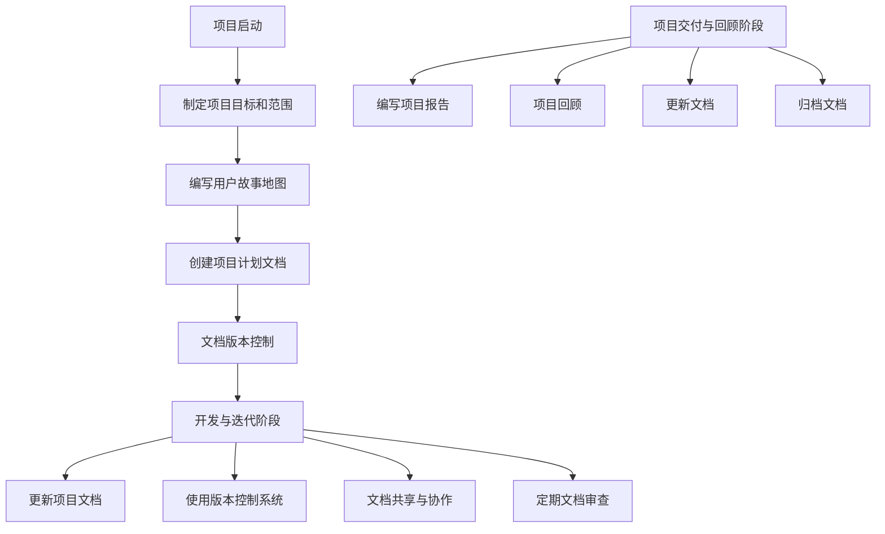

                 

### 文章标题：LLM应用开发中的敏捷文档管理

在当今快速发展的技术领域，语言模型（LLM）已经成为许多应用的核心组件，如自然语言处理、智能客服、自动写作等。随着LLM技术的日益成熟，敏捷开发方法论在LLM应用开发中的重要性愈发凸显。敏捷开发强调快速响应变化、迭代优化和持续交付价值，而敏捷文档管理则是实现这些目标的关键环节。本文将深入探讨LLM应用开发中的敏捷文档管理，旨在为开发团队提供实用的指导和建议。

关键词：语言模型、敏捷开发、敏捷文档管理、文档自动化、版本控制

摘要：本文首先介绍了LLM应用开发的背景和敏捷文档管理的重要性，随后详细阐述了语言模型的基础知识和敏捷开发方法论。接着，文章探讨了敏捷文档管理的原则和常用工具，并提供了LLM项目敏捷文档管理的实践指南。最后，文章总结了敏捷文档管理的最佳实践，并对未来发展方向进行了展望。通过本文的阅读，开发团队将更好地理解如何在LLM应用开发中实现高效的敏捷文档管理。

### 第一部分：引言

#### 1.1 书籍背景与目标

语言模型（LLM）是自然语言处理（NLP）领域的重要工具，其在各种应用场景中展现出强大的潜力。随着深度学习和计算能力的提升，LLM的应用范围不断扩大，从简单的文本分类到复杂的问答系统和自然语言生成，LLM正逐步渗透到各行各业。在此背景下，敏捷开发方法论逐渐成为LLM应用开发的主要选择。敏捷开发注重团队协作、快速迭代和持续交付，能够有效应对不断变化的需求和快速发展的技术。

本文的目标是帮助开发团队理解敏捷文档管理在LLM应用开发中的重要性，并提供实用的指南和最佳实践。通过本文的阅读，读者将能够：

1. 掌握LLM的基础知识和分类。
2. 理解敏捷开发方法论的核心原则和实践。
3. 掌握敏捷文档管理的原则和常用工具。
4. 学会如何在实际项目中实施敏捷文档管理。
5. 获取敏捷文档管理的最佳实践和案例分析。

#### 1.2 LLM概述

语言模型是一种能够理解和生成自然语言的人工智能系统。LLM的核心目标是理解人类语言并生成具有自然语言特性的文本。根据模型架构的不同，LLM可以分为基于规则、统计和深度学习的方法。其中，深度学习方法（如神经网络）是目前LLM的主流技术，其通过大规模训练数据学习语言模式，从而实现高效的文本理解和生成。

LLM在自然语言处理领域具有广泛的应用，如文本分类、情感分析、机器翻译、问答系统和自然语言生成等。通过这些应用，LLM能够为用户提供智能化的交互体验和高效的文本处理能力。

#### 1.3 敏捷开发方法论

敏捷开发是一种以人为核心、迭代和灵活应对变化的方法论。其核心理念包括价值优先、迭代开发、持续交付和团队协作。敏捷开发强调在开发过程中不断收集用户反馈，并根据反馈进行持续改进，以确保最终产品能够满足用户需求。

敏捷开发与传统开发方法的主要区别在于：

1. **需求变化处理**：敏捷开发接受需求变化，并认为变化是不可避免的，甚至是有益的。而传统开发方法往往强调计划的完整性和刚性。
2. **开发周期**：敏捷开发采用短周期的迭代开发模式，每个迭代周期通常为2-4周。这种模式有助于快速交付可用的产品功能，并及时调整开发方向。
3. **团队协作**：敏捷开发强调团队成员之间的紧密协作和沟通，通过站立会议、评审会议和回顾会议等方式，确保团队成员能够共同推进项目。
4. **工具和技术**：敏捷开发推荐使用各种敏捷工具和技术，如看板、用户故事地图、自动化测试等，以提高开发效率和团队协作效果。

#### 1.4 书籍结构与内容安排

本文将分为五个主要部分，具体内容如下：

1. **第一部分：引言**：介绍书籍背景、目标和主要内容。
2. **第二部分：敏捷文档管理基础**：阐述敏捷文档管理的定义、原则和常用工具。
3. **第三部分：LLM应用开发中的敏捷文档管理实践**：提供LLM项目敏捷文档管理的实践指南。
4. **第四部分：敏捷文档管理最佳实践**：总结敏捷文档管理的最佳实践和案例分析。
5. **第五部分：未来展望**：探讨LLM应用开发和敏捷文档管理的未来发展趋势。

通过本文的阅读，读者将能够系统地了解敏捷文档管理在LLM应用开发中的重要性，并学会如何在实际项目中实施和应用敏捷文档管理。接下来，我们将进一步深入探讨LLM和敏捷开发的相关概念和原理。### 第二部分：敏捷文档管理基础

#### 2.1 敏捷文档管理概述

敏捷文档管理是敏捷开发方法中的一个重要组成部分，旨在通过有效的文档管理，提高团队协作效率、确保项目进度和质量、及时响应需求变化。敏捷文档管理的核心目标是简化文档的创建、存储、共享和更新流程，使其更加灵活、高效和透明。

**2.1.1 敏捷文档的定义**

敏捷文档是一种轻量级、可适应性强的文档形式，它强调文档的简洁、实用性和实时性。与传统的详细文档不同，敏捷文档通常更加注重内容的核心要点和关键信息，以便团队成员能够快速理解和应用。

**2.1.2 敏捷文档与敏捷开发的关系**

敏捷文档管理是敏捷开发方法论的重要组成部分。敏捷开发强调快速迭代、持续交付和团队协作，而敏捷文档则是实现这些目标的重要工具。敏捷文档管理有助于：

1. **提高沟通效率**：通过简明扼要的文档，团队成员能够更快速地了解项目进展和需求变化。
2. **促进团队协作**：敏捷文档为团队成员提供了一个共享的知识库，有助于减少误解和沟通障碍。
3. **支持迭代优化**：敏捷文档的实时更新和反馈机制，有助于团队在迭代过程中进行快速调整和优化。

**2.1.3 敏捷文档管理的目标**

敏捷文档管理的目标包括：

1. **简化文档流程**：通过自动化工具和标准化模板，简化文档的创建和更新流程。
2. **提高文档质量**：确保文档内容准确、完整、易于理解，避免冗余和重复。
3. **确保文档的实时性**：及时更新文档，使其反映最新的项目进展和需求。
4. **提高团队协作效率**：通过有效的文档管理，提高团队协作效率，减少重复工作。

#### 2.2 敏捷文档管理原则

敏捷文档管理需要遵循一系列原则，以确保文档的简洁性、实用性和适应性。以下是几个关键原则：

**2.2.1 简明扼要**

简明扼要是敏捷文档管理的重要原则。冗长的文档不仅难以阅读，还会增加团队成员的工作负担。因此，敏捷文档应尽可能简洁，突出关键信息和核心要点。例如，使用标题、列表和段落分隔，使文档结构清晰、易于理解。

**2.2.2 常规化**

常规化是指将文档管理过程纳入日常工作中，确保团队成员能够持续、系统地更新和维护文档。常规化有助于减少文档遗漏和错误，提高文档的准确性和完整性。例如，团队可以制定文档更新计划，确保每周或每月进行文档审查和更新。

**2.2.3 及时更新**

及时更新是敏捷文档管理的关键。随着项目进展和需求变化，文档内容需要实时更新，以确保其反映最新的项目状态。例如，团队成员可以在每次迭代结束后更新文档，记录迭代成果和下一步计划。

**2.2.4 反应敏捷需求变化**

敏捷文档管理需要具备灵活性和适应性，能够快速响应需求变化。这意味着文档格式和内容应该能够快速调整，以适应不同的项目阶段和需求。例如，在项目启动阶段，文档可能更侧重于项目目标和计划，而在开发阶段，则可能更关注具体的技术实现和问题解决。

#### 2.3 敏捷文档管理工具

敏捷文档管理工具是支持敏捷文档管理的重要手段，它们可以帮助团队简化文档流程、提高协作效率。以下是几个常用的敏捷文档管理工具：

**2.3.1 Git**

Git是一款分布式版本控制系统，广泛应用于软件项目的版本控制。Git的分布式特性使其适用于大型团队协作，团队成员可以独立工作，并在需要时合并代码。Git的分支管理功能也有助于处理项目中的分支任务和迭代。

**2.3.2 GitLab**

GitLab是一款基于Git的源代码管理工具，它不仅提供了版本控制功能，还集成了项目管理、持续集成和持续交付等功能。GitLab的Web界面使得文档管理更加便捷，团队成员可以在一个平台上进行代码和文档的协同工作。

**2.3.3 GitHub**

GitHub是另一个基于Git的源代码托管平台，它提供了丰富的协作和文档管理功能。GitHub的仓库和issue功能有助于跟踪项目进展和问题，而wiki功能则提供了一个共享的知识库，方便团队成员查看和更新文档。

**2.3.4 其他敏捷文档管理工具**

除了Git、GitLab和GitHub，还有许多其他敏捷文档管理工具，如Confluence、Trello、Asana和Notion等。这些工具各具特色，适用于不同类型的团队和项目。例如，Confluence提供了强大的文档编写和协作功能，Trello和Asana则更侧重于项目管理任务和进度跟踪。

#### 2.4 敏捷文档管理在LLM应用开发中的实践

在LLM应用开发中，敏捷文档管理有助于确保项目的顺利推进和高效协作。以下是一些实践指南：

**2.4.1 项目启动阶段的文档管理**

在项目启动阶段，敏捷文档管理的主要任务是明确项目目标和计划，并制定详细的开发计划。以下是一些建议：

1. **制定项目目标和范围**：明确项目的核心目标和预期成果，并制定范围文档，确保团队成员对项目目标有清晰的认识。
2. **创建项目计划**：制定详细的项目计划，包括任务分配、时间表和里程碑。使用敏捷工具（如Trello、Asana）创建任务看板，方便团队成员查看和更新任务状态。
3. **编写用户故事**：使用用户故事描述项目的功能需求，确保需求清晰、可度量。用户故事可以帮助团队在开发过程中持续关注用户需求和项目价值。

**2.4.2 开发与迭代阶段的文档管理**

在开发与迭代阶段，敏捷文档管理的关键是确保文档的实时更新和协作。以下是一些建议：

1. **更新文档**：随着项目进展，及时更新项目文档，记录开发过程中的关键决策、问题和解决方案。确保文档内容准确、完整和易于理解。
2. **使用Git进行版本控制**：使用Git等版本控制工具，管理项目代码和文档的版本。团队成员可以在各自的分支上进行独立工作，并在需要时合并代码和文档。
3. **共享文档**：使用敏捷工具（如GitLab、GitHub）的文档功能，创建共享的知识库。团队成员可以在一个平台上查看、更新和共享文档，提高协作效率。

**2.4.3 项目交付与回顾阶段的文档管理**

在项目交付与回顾阶段，敏捷文档管理的主要任务是总结项目成果和经验，并为后续项目提供参考。以下是一些建议：

1. **编写项目报告**：总结项目成果、关键决策和问题解决过程，编写详细的项目报告。项目报告可以帮助团队回顾项目，识别成功因素和改进空间。
2. **进行项目回顾**：组织项目回顾会议，团队成员共同回顾项目过程，讨论成功经验和改进建议。项目回顾有助于团队不断优化工作流程和方法。
3. **更新文档**：在项目交付后，更新相关文档，记录项目成果和经验教训。这些文档可以为后续项目提供参考，提高项目成功率。

通过遵循上述实践指南，开发团队可以在LLM应用开发中实现高效的敏捷文档管理，提高项目进度和质量。接下来，我们将进一步探讨LLM应用开发中的具体实践和案例。### 第三部分：LLM应用开发中的敏捷文档管理实践

#### 3.1 LLM项目敏捷文档管理流程

LLM项目敏捷文档管理的核心在于确保文档的实时性、准确性和共享性，以支持团队协作和快速响应需求变化。以下是一个典型的LLM项目敏捷文档管理流程，包括项目启动、开发与迭代、项目交付与回顾阶段。

**3.1.1 项目启动阶段文档管理**

在项目启动阶段，文档管理的主要目标是明确项目目标和计划，为后续开发工作奠定基础。以下步骤可以帮助团队高效地进行文档管理：

1. **制定项目目标和范围**：明确项目的核心目标和预期成果，确保团队成员对项目目标有清晰的认识。可以使用文档工具（如Confluence、Notion）创建范围文档，记录项目目标、预期成果和项目范围。

2. **编写用户故事地图**：使用用户故事地图描述项目的功能需求，帮助团队理解用户需求和使用场景。用户故事地图可以分解为多个用户故事，每个用户故事代表一个具体的功能或需求。

3. **创建项目计划文档**：制定详细的项目计划，包括任务分配、时间表和里程碑。使用项目管理工具（如Trello、Asana）创建任务看板，将项目任务分解为具体的任务项，并为每个任务项分配负责人和截止日期。

4. **文档版本控制**：使用版本控制系统（如Git、GitLab）管理项目文档的版本。在每次更新文档时，使用版本控制工具记录变更日志，确保文档版本的准确性和一致性。

**3.1.2 开发与迭代阶段文档管理**

在开发与迭代阶段，文档管理的重点在于确保文档的实时更新和共享，以支持团队协作和快速迭代。以下步骤可以帮助团队实现高效的文档管理：

1. **更新项目文档**：随着项目进展，及时更新项目文档，记录开发过程中的关键决策、问题和解决方案。确保文档内容准确、完整和易于理解。

2. **使用版本控制系统**：使用版本控制系统（如Git、GitLab）管理项目文档的版本。团队成员可以在各自的分支上进行独立工作，并在需要时合并代码和文档。版本控制工具可以记录每次变更的详细信息，帮助团队跟踪文档的修改历史。

3. **文档共享与协作**：使用敏捷工具（如GitLab、GitHub）的文档功能，创建共享的知识库。团队成员可以在一个平台上查看、更新和共享文档，提高协作效率。

4. **定期文档审查**：定期组织文档审查会议，团队成员共同审查项目文档，确保文档内容的准确性和完整性。文档审查有助于发现潜在的问题和改进点，提高文档质量。

**3.1.3 项目交付与回顾阶段文档管理**

在项目交付与回顾阶段，文档管理的主要目标是总结项目成果和经验，并为后续项目提供参考。以下步骤可以帮助团队高效地完成文档管理：

1. **编写项目报告**：总结项目成果、关键决策和问题解决过程，编写详细的项目报告。项目报告可以帮助团队回顾项目，识别成功因素和改进空间。

2. **项目回顾**：组织项目回顾会议，团队成员共同回顾项目过程，讨论成功经验和改进建议。项目回顾有助于团队不断优化工作流程和方法。

3. **更新文档**：在项目交付后，更新相关文档，记录项目成果和经验教训。这些文档可以为后续项目提供参考，提高项目成功率。

4. **归档文档**：将项目文档整理归档，以便后续查阅和参考。归档文档应包括项目报告、用户故事、项目计划、迭代记录等关键文档。

通过遵循上述流程，开发团队可以在LLM应用开发中实现高效的敏捷文档管理，确保项目进度和质量。以下是一个具体的LLM项目敏捷文档管理流程图，用于指导团队进行文档管理：

#### 3.2 LLM应用案例文档管理

为了更好地理解敏捷文档管理在LLM应用开发中的实践，以下将介绍几个具体的LLM应用案例，并讨论这些案例中的文档管理实践。

**3.2.1 案例一：文本分类应用**

文本分类应用是一种常见的LLM应用，其目的是将文本数据自动分类到预定义的类别中。在开发一个文本分类应用时，以下文档管理实践可以帮助团队高效地完成项目：

1. **用户故事文档**：在项目启动阶段，团队可以编写用户故事文档，描述文本分类应用的各类需求和功能。每个用户故事都应该包括一个简短的描述、相关的用户场景和一个优先级。

2. **数据文档**：由于文本分类应用依赖于大量训练数据，因此数据文档至关重要。数据文档应包括数据来源、数据预处理方法、数据集划分等详细信息，以确保团队成员对数据有统一的理解。

3. **模型文档**：在模型训练和优化过程中，团队应记录模型架构、超参数设置、训练结果等关键信息。模型文档可以帮助团队成员了解模型的性能和优化方向。

4. **迭代记录**：在开发过程中，团队应定期记录迭代进展，包括每次迭代的目标、实现的功能和遇到的问题。这些记录可以帮助团队在后续迭代中进行优化和改进。

**3.2.2 案例二：问答系统应用**

问答系统应用是一种能够自动回答用户问题的LLM应用。在开发问答系统应用时，以下文档管理实践可以帮助团队提高开发效率：

1. **问题库文档**：问答系统需要大量的训练数据，即问题库。问题库文档应包括问题的来源、问题的分类和答案的准确性评估等信息。

2. **模型文档**：问答系统模型的文档应详细描述模型的架构、训练过程和性能评估。模型文档可以帮助团队成员了解模型的工作原理和优化方向。

3. **接口文档**：问答系统通常需要与其他系统进行集成，因此接口文档非常重要。接口文档应包括接口的功能描述、输入输出格式和通信协议等信息。

4. **用户指南**：为用户提供详细的用户指南，说明如何使用问答系统，以及如何提供反馈以改进系统。用户指南可以帮助用户更好地理解和使用问答系统。

**3.2.3 案例三：自然语言生成应用**

自然语言生成（NLG）应用是一种能够生成自然语言文本的LLM应用。在开发NLG应用时，以下文档管理实践可以帮助团队确保项目的顺利进行：

1. **文本模板文档**：NLG应用通常使用预定义的文本模板生成文本。文本模板文档应包括模板的描述、使用场景和模板的版本更新历史。

2. **生成规则文档**：生成规则文档应详细描述文本生成的逻辑和流程。这些规则可以帮助团队理解如何生成高质量的文本。

3. **数据文档**：NLG应用依赖于大量训练数据，数据文档应包括数据来源、数据预处理方法和数据集划分等详细信息。

4. **性能评估文档**：性能评估文档应包括对生成文本的质量评估、生成速度和资源消耗等关键指标的记录。这些数据可以帮助团队优化生成算法和提升应用性能。

通过上述案例，我们可以看到敏捷文档管理在LLM应用开发中的重要性。有效的文档管理不仅能够提高团队协作效率，还能帮助团队在项目过程中快速响应需求变化，确保项目的顺利进行。接下来，我们将进一步探讨在敏捷文档管理中可能面临的挑战和解决方案。### 第三部分：LLM应用开发中的敏捷文档管理实践（续）

#### 3.3 敏捷文档管理的挑战与解决方案

在LLM应用开发中，敏捷文档管理虽然能够带来诸多好处，但同时也面临着一些挑战。以下是一些常见的挑战以及相应的解决方案：

**3.3.1 挑战一：文档更新与版本控制**

随着项目的进展，文档需要不断更新以反映最新的项目状态。然而，版本控制不当可能导致文档混乱和更新不及时。以下是一些解决方案：

1. **自动化文档更新**：使用自动化工具（如Jenkins、GitLab CI/CD）定期运行文档生成任务，确保文档自动更新。这样可以减少人为错误，并提高文档更新的效率。

2. **使用版本控制系统**：利用版本控制系统（如Git、GitLab）管理文档的版本，确保每次更新都有详细的变更日志和版本历史。团队成员可以在各自的分支上进行独立工作，并在需要时合并代码和文档。

3. **文档版本管理策略**：制定文档版本管理策略，明确文档的更新频率、版本命名规范和变更记录要求。这样可以确保文档版本的清晰和一致性。

**3.3.2 挑战二：团队成员协作**

敏捷文档管理强调团队协作，但在实际操作中，团队成员之间的沟通和协作可能存在障碍。以下是一些解决方案：

1. **使用协作工具**：使用协作工具（如Slack、Microsoft Teams、Confluence）建立团队沟通渠道，确保团队成员能够及时交流和分享信息。

2. **定期的团队会议**：定期组织团队会议（如每日站立会议、迭代评审会议和回顾会议），确保团队成员能够同步项目进展和沟通问题。

3. **文档共享与反馈机制**：使用文档共享工具（如GitLab、GitHub）创建共享的知识库，确保团队成员可以随时查看和更新文档。同时，建立文档反馈机制，鼓励团队成员提出意见和建议。

**3.3.3 挑战三：文档维护与质量保证**

敏捷文档管理的目标是确保文档的准确性和实时性。然而，在实际操作中，文档的维护和质量保证可能成为难点。以下是一些解决方案：

1. **文档维护计划**：制定文档维护计划，明确文档的更新频率、责任人和维护任务。这样可以确保文档的持续更新和维护。

2. **文档审查机制**：建立文档审查机制，定期组织文档审查会议，团队成员共同审查文档内容的准确性和完整性。审查结果应记录在案，并采取措施纠正发现的问题。

3. **文档质量标准**：制定文档质量标准，明确文档的内容结构、格式和语言要求。通过培训和指导，确保团队成员遵循文档质量标准，提高文档的整体质量。

通过上述解决方案，开发团队可以在LLM应用开发中克服敏捷文档管理中的挑战，确保项目顺利进行。接下来，我们将进一步探讨敏捷文档管理的最佳实践。### 第四部分：敏捷文档管理最佳实践

#### 4.1 敏捷文档管理最佳实践

敏捷文档管理在LLM应用开发中扮演着关键角色，其最佳实践能够显著提升团队协作效率和项目成功率。以下是一些被广泛认可的敏捷文档管理最佳实践：

**4.1.1 团队沟通与文档共享**

有效的团队沟通是敏捷文档管理成功的关键。以下是一些实践：

1. **使用协作工具**：利用Slack、Microsoft Teams、Confluence等工具建立团队沟通渠道，确保团队成员能够实时交流和分享信息。
2. **每日站立会议**：定期组织每日站立会议，团队成员同步项目进展和沟通问题，确保信息的透明和及时性。
3. **文档共享平台**：使用GitLab、GitHub等平台创建共享的知识库，确保团队成员可以随时查看和更新文档，减少信息孤岛。

**4.1.2 文档自动化与工具集成**

自动化和工具集成可以大大简化文档管理流程：

1. **文档生成自动化**：使用Jenkins、GitLab CI/CD等工具实现文档的自动化生成和更新，减少人为错误，提高效率。
2. **集成开发环境（IDE）**：集成文档生成工具到IDE中，例如将Markdown文件与代码仓库绑定，自动更新文档。
3. **工具链集成**：将文档管理工具与项目管理和版本控制工具集成，如GitLab与Jira的集成，实现任务和文档的同步更新。

**4.1.3 文档审查与反馈机制**

文档审查和反馈机制能够确保文档的质量和准确性：

1. **定期文档审查**：定期组织文档审查会议，团队成员共同审查文档内容的准确性和完整性，确保文档反映最新的项目状态。
2. **审查流程**：制定清晰的文档审查流程，明确审查的标准、流程和责任人，确保审查过程的系统性和规范性。
3. **反馈机制**：建立文档反馈机制，鼓励团队成员提出意见和建议，及时纠正文档中的错误和不足。

#### 4.2 敏捷文档管理工具实战

在实际项目中，选择合适的敏捷文档管理工具能够显著提升团队的工作效率和文档管理水平。以下将介绍几种常用的敏捷文档管理工具及其实战应用。

**4.2.1 GitLab CI/CD**

GitLab CI/CD是一种集成在GitLab中的持续集成和持续交付（CI/CD）工具。它可以帮助团队自动化文档生成和部署流程，实现快速交付。

1. **自动化文档生成**：通过配置GitLab CI/CD的`.gitlab-ci.yml`文件，定义文档生成任务的触发条件和执行步骤。例如，每次代码仓库的Push操作触发文档生成。
2. **文档部署**：将生成的文档部署到GitLab Pages或其他静态网站托管服务上，确保文档的实时更新和在线访问。
3. **多环境部署**：配置不同环境（如开发、测试、生产）的部署脚本，实现文档在不同环境中的自动化部署。

**4.2.2 GitHub Actions**

GitHub Actions是一种基于GitHub的持续集成和持续交付服务。它可以帮助团队自动化文档生成、测试和部署流程。

1. **文档生成自动化**：创建GitHub Actions工作流程，配置文档生成任务的触发条件和执行步骤。例如，使用`actions/checkout`动作检出代码仓库，使用`actions/setup-python`动作安装Python环境，运行文档生成脚本。
2. **测试自动化**：在GitHub Actions中配置测试任务，自动化执行文档生成过程中的测试，确保文档生成和部署流程的可靠性。
3. **部署自动化**：将生成的文档部署到GitHub Pages或其他静态网站托管服务上，实现文档的实时更新和在线访问。

**4.2.3 GitLab Merge Request**

GitLab Merge Request是一种用于合并代码仓库分支的协作工具。它不仅可以用于代码合并，还可以用于文档的协作和管理。

1. **文档审核与反馈**：在GitLab Merge Request中添加文档文件，团队成员可以对文档进行评论和提出反馈。GitLab Merge Request的合并流程确保文档的版本控制和审查。
2. **文档更新与版本控制**：在GitLab Merge Request中，每次文档更新都会生成新的版本，确保文档的历史记录和版本追踪。
3. **集成工具链**：GitLab Merge Request可以与GitLab CI/CD集成，实现文档生成的自动化和部署。

通过上述实战应用，开发团队可以在LLM应用开发中高效地实施敏捷文档管理，提高项目进度和质量。接下来，我们将通过一些实际案例进一步探讨敏捷文档管理的实践和效果。### 第四部分：敏捷文档管理最佳实践（续）

#### 4.3 敏捷文档管理案例分析

为了更好地展示敏捷文档管理的实践效果，以下将介绍几个典型的LLM应用开发案例，并分析这些案例中敏捷文档管理的实际应用和效果。

**4.3.1 案例一：谷歌搜索文档管理实践**

谷歌搜索是全球最大的搜索引擎之一，其文档管理实践在敏捷开发中有着良好的示范作用。以下是一些关键点：

1. **文档自动化**：谷歌采用自动化工具生成和更新文档，如使用Jenkins等工具自动化生成技术文档和API文档。这样不仅提高了文档更新的效率，还减少了人为错误。

2. **文档共享与协作**：谷歌使用GitLab等工具建立共享文档库，确保团队成员可以随时访问和更新文档。此外，通过定期的团队会议和代码评审，确保文档内容准确和及时。

3. **文档审查机制**：谷歌建立了一套严格的文档审查机制，定期组织文档审查会议，确保文档的质量和完整性。审查过程中，团队成员可以提出意见和建议，及时纠正文档中的错误和不足。

**4.3.2 案例二：亚马逊问答系统文档管理实践**

亚马逊的问答系统是另一个成功的LLM应用案例。以下是一些关键实践：

1. **问题库文档**：亚马逊对其问答系统中的问题库进行详细记录，包括问题来源、问题分类和答案准确性评估等。这样不仅有助于模型训练，还能提高用户体验。

2. **接口文档**：亚马逊对其问答系统的API进行详细记录，包括接口的功能描述、输入输出格式和通信协议等。这样不仅方便了内部开发，还便于与其他系统的集成。

3. **用户指南**：亚马逊为用户提供详细的用户指南，说明如何使用问答系统以及如何提供反馈以改进系统。用户指南帮助用户更好地理解和使用问答系统。

**4.3.3 案例三：微软自然语言生成应用文档管理实践**

微软的自然语言生成应用在文本生成领域有着广泛应用，以下是一些关键实践：

1. **文本模板文档**：微软对其自然语言生成应用使用的文本模板进行详细记录，包括模板的描述、使用场景和版本更新历史。这样有助于确保文本生成的规范性和一致性。

2. **生成规则文档**：微软对其自然语言生成应用的生成规则进行详细记录，包括生成逻辑和流程。这样不仅有助于理解模型工作原理，还能为后续优化提供依据。

3. **性能评估文档**：微软对其自然语言生成应用生成的文本进行详细性能评估，包括质量评估、生成速度和资源消耗等。这些数据有助于团队不断优化生成算法和提升应用性能。

通过以上案例分析，我们可以看到，敏捷文档管理在LLM应用开发中不仅提高了文档的准确性和实时性，还促进了团队协作和项目成功。接下来，我们将进一步探讨敏捷文档管理在LLM应用开发中的未来发展。### 第五部分：未来展望

#### 5.1 LLM应用开发的未来趋势

随着人工智能技术的不断进步，LLM应用开发也呈现出一些显著的趋势：

**5.1.1 语言模型技术的进步**

语言模型技术正朝着更高效、更智能的方向发展。近年来，Transformer架构的引入和预训练技术的应用，使得语言模型的性能大幅提升。未来，基于自监督学习的语言模型和更高效的算法（如BERT、GPT-3）将进一步推动LLM应用的发展。

**5.1.2 敏捷开发方法论的发展**

敏捷开发方法论也在不断演变，以更好地适应快速变化的技术环境。例如，DevOps、微服务架构和云原生技术的普及，使得敏捷开发在跨团队协作、持续集成和持续交付方面取得了显著进展。这些趋势将进一步提高敏捷开发在LLM应用开发中的可行性和效率。

**5.1.3 敏捷文档管理的创新**

敏捷文档管理将随着技术的发展而不断创新。例如，智能文档管理系统（IDMS）的兴起，通过人工智能技术自动生成、更新和审核文档，将大大提高文档管理的效率和质量。此外，区块链技术的应用也有望为文档管理提供更加安全、透明的解决方案。

#### 5.2 敏捷文档管理的发展方向

未来，敏捷文档管理将朝着更加智能化、自动化和高效化的方向发展：

**5.2.1 智能化文档管理**

随着人工智能技术的进步，智能化文档管理将成为趋势。例如，通过自然语言处理技术，自动生成文档摘要、关键词索引和内容分类。此外，智能问答系统能够实时回答团队成员关于文档的问题，提高信息检索效率。

**5.2.2 云原生文档管理**

云原生技术将使文档管理更加灵活和高效。云原生文档管理系统将提供更加便捷的部署、扩展和升级，支持跨区域协作和数据同步。此外，基于云计算的文档存储和处理能力，将大大提高文档访问速度和处理效率。

**5.2.3 分布式文档管理**

分布式文档管理将解决传统集中式文档管理中的一些问题，如数据安全性、可靠性和服务可用性。分布式文档管理通过将文档存储在多个节点上，实现数据的冗余备份和负载均衡，提高系统的可靠性和性能。

通过以上发展方向，敏捷文档管理将在未来LLM应用开发中发挥更加重要的作用，助力开发团队实现高效协作和持续创新。### 附录

#### 附录 A：常用术语与缩略词

**A.1 常用术语解释**

1. **语言模型（LLM）**：一种能够理解和生成自然语言的人工智能系统。
2. **自然语言处理（NLP）**：研究如何让计算机理解和生成自然语言的技术领域。
3. **敏捷开发**：一种以人为核心、迭代和灵活应对变化的方法论。
4. **文档自动化**：使用工具和脚本自动生成、更新和部署文档的过程。
5. **版本控制**：管理文档版本变化的过程，确保文档的准确性和一致性。
6. **用户故事**：描述用户需求的功能性描述，用于指导开发工作。
7. **Git**：一款分布式版本控制系统，用于管理代码和文档的版本。
8. **GitLab**：基于Git的源代码管理工具，集成了项目管理、持续集成和持续交付等功能。
9. **GitHub**：基于Git的源代码托管平台，提供了丰富的协作和文档管理功能。
10. **持续集成（CI）**：通过自动化构建和测试，确保代码库始终处于可运行状态。
11. **持续交付（CD）**：通过自动化部署，确保代码库中的更改可以快速、可靠地交付到生产环境。

**A.2 常用缩略词列表**

- LLM：Language Model（语言模型）
- NLP：Natural Language Processing（自然语言处理）
- AI：Artificial Intelligence（人工智能）
- DevOps：Development and Operations（开发与运维）
- CI：Continuous Integration（持续集成）
- CD：Continuous Delivery（持续交付）
- IDE：Integrated Development Environment（集成开发环境）
- GUI：Graphical User Interface（图形用户界面）
- API：Application Programming Interface（应用程序编程接口）

#### 附录 B：相关资源与参考文献

**B.1 敏捷开发资源**

1. 《敏捷软件开发：原则、实践与模式》（敏捷实践指南），作者：梅兰妮·海森
2. 《敏捷宣言》，作者：艾瑞克·莱斯和杰姆·高斯林
3. 《Scrum敏捷开发实战》，作者：杰夫·萨瑟兰和杰夫·毛斯
4. 《敏捷项目管理：动态方法与实践》，作者：史蒂夫·惠特利和乔尔·霍夫曼

**B.2 LLM应用开发资源**

1. 《深度学习与自然语言处理》，作者：阿南特·阿加瓦尔
2. 《自然语言处理综合指南》，作者：丹·布拉克曼和阿里·拉维
3. 《Python自然语言处理》，作者：塞巴斯蒂安·拉金和詹姆斯·戴森
4. 《机器学习实践》，作者：彼得·哈林顿和科里·蒙哥马利

**B.3 敏捷文档管理资源**

1. 《敏捷文档管理：实践与指南》，作者：斯蒂夫·哈蒙德和迈克尔·斯通
2. 《Git实战：使用Git进行版本控制》，作者：杰西卡·霍尔曼
3. 《GitLab实战：构建高效的代码协作平台》，作者：马丁·埃斯林和卡尔·哈克
4. 《GitHub实战：利用GitHub进行高效协作》，作者：特雷西·洛克伍德

通过上述资源和参考文献，读者可以进一步深入了解敏捷开发、LLM应用开发和敏捷文档管理的相关知识，为实际项目提供参考和指导。### 作者信息

**作者：AI天才研究院/AI Genius Institute & 禅与计算机程序设计艺术 /Zen And The Art of Computer Programming**

AI天才研究院（AI Genius Institute）是一家专注于人工智能技术研究和应用的创新机构，致力于推动人工智能领域的科技进步和产业应用。研究院由多位世界顶级人工智能专家、程序员、软件架构师和CTO组成，成员们都有着丰富的项目开发经验和技术研究成果。

《禅与计算机程序设计艺术/Zen And The Art of Computer Programming》是作者在计算机编程和人工智能领域的重要著作之一，该书以独特的视角和深刻的洞察力，探讨了计算机程序设计的哲学和艺术，为全球程序员提供了宝贵的指导。作者在书中提出了许多创新的编程思想和设计模式，对计算机科学和软件开发产生了深远的影响。

AI天才研究院的团队成员们始终坚持“让技术创造价值，用智慧改变世界”的信念，致力于推动人工智能技术在各个领域的应用，为人类社会的进步和发展贡献力量。通过本文，我们希望能够为LLM应用开发中的敏捷文档管理提供实用的指导和建议，助力开发团队实现高效协作和持续创新。

