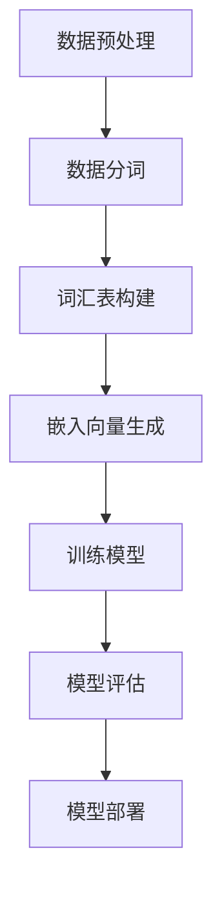

                 

# 《LLM应用开发中的数据安全与隐私保护》

> 关键词：LLM, 数据安全，隐私保护，数据加密，匿名化，同态加密，安全多方计算

> 摘要：本文深入探讨了语言模型（LLM）应用开发中的数据安全与隐私保护问题。首先，文章概述了LLM的基本概念和重要性，然后详细分析了数据安全与隐私保护的法律法规和原则。接着，文章从数据加密、数据匿名化、隐私保护技术、数据访问控制与权限管理等方面，系统地阐述了数据安全与隐私保护策略。最后，通过实际案例和代码实现，展示了LLM应用开发中的数据安全与隐私保护实践。

## 第一部分：基础概念与原理

### 第1章：LLM与数据安全概述

#### 1.1 什么是LLM

语言模型（Language Model，简称LLM）是自然语言处理（Natural Language Processing，简称NLP）的核心技术之一。它是一种基于统计和学习的方法，用于预测文本序列中的下一个单词或字符。LLM在文本生成、机器翻译、语音识别、情感分析等领域有着广泛的应用。

#### 1.2 数据安全的重要性

数据安全是LLM应用开发中的关键问题。在LLM训练和推理过程中，需要处理大量的敏感数据，如用户输入、文本内容等。如果这些数据遭到泄露或滥用，将会对用户隐私和安全造成严重威胁。

#### 1.3 数据隐私保护的法律法规

在全球范围内，数据隐私保护法律法规日益完善。例如，欧盟的《通用数据保护条例》（GDPR）和美国加州的《消费者隐私法案》（CCPA）都对数据隐私保护提出了严格要求。这些法律法规要求企业在处理个人数据时，必须采取有效的数据安全与隐私保护措施。

### 第2章：LLM技术基础

#### 2.1 语言模型的架构

语言模型的架构通常包括嵌入层、编码层和解码层。嵌入层将单词或字符转换为向量表示；编码层对输入序列进行编码；解码层根据编码层的输出，生成预测的单词或字符序列。

#### 2.2 语言模型的训练方法

语言模型的训练方法主要包括基于统计的方法和基于神经网络的方法。基于统计的方法通过计算单词或字符的联合概率分布，预测下一个单词或字符。基于神经网络的方法则通过多层神经网络，学习输入和输出之间的映射关系。

#### 2.3 语言模型的应用场景

语言模型在多个领域有着广泛的应用，如文本生成、机器翻译、文本分类、问答系统等。随着深度学习技术的发展，LLM的性能和效果不断提高，为各种应用场景提供了强大的支持。

## 第二部分：数据安全与隐私保护策略

### 第3章：数据加密与加密算法

#### 3.1 数据加密的基本概念

数据加密是将明文转换为密文的过程，以防止未授权用户读取和理解数据。数据加密的关键技术包括加密算法和密钥管理。

#### 3.2 常见加密算法及应用

常见的加密算法包括对称加密、非对称加密和混合加密。对称加密算法如AES，适用于对大量数据进行加密；非对称加密算法如RSA，适用于密钥交换和数字签名；混合加密算法结合了对称加密和非对称加密的优点，适用于不同场景的需求。

#### 3.3 数据加密的最佳实践

数据加密的最佳实践包括选择合适的加密算法、确保密钥的安全存储和传输、定期更新加密策略等。此外，企业还需要加强对加密算法的研究和开发，以应对日益复杂的网络安全威胁。

### 第4章：数据匿名化处理

#### 4.1 数据匿名化的概念

数据匿名化是将敏感数据转换为不可识别的形式，以保护用户隐私。数据匿名化的方法包括数据混淆、数据掩码、数据合成等。

#### 4.2 数据匿名化的方法

常见的数据匿名化方法包括：

1. **K-匿名**：确保记录中的每个数据集至少包含K个相似的记录。

2. **l-diversity**：确保记录中的每个数据集至少包含l个不同的记录。

3. **t-closeness**：确保记录中的每个数据集的相对距离小于t。

#### 4.3 数据匿名化的挑战与解决方案

数据匿名化面临的主要挑战包括数据质量下降、隐私保护与数据可用性之间的权衡等。解决这些挑战的方法包括优化匿名化算法、结合多种匿名化技术、引入隐私预算等。

### 第5章：隐私保护技术与算法

#### 5.1 隐私保护技术概述

隐私保护技术包括加密技术、匿名化技术、差分隐私技术等。这些技术可以单独或组合使用，以提高LLM应用的数据安全性和隐私保护水平。

#### 5.2 加密技术

加密技术包括对称加密、非对称加密和同态加密。同态加密是一种特殊的加密技术，允许在加密数据上直接进行计算，而无需解密数据。

#### 5.3 同态加密

同态加密是一种重要的隐私保护技术，它允许在加密数据上直接进行计算，而无需解密数据。同态加密的基本原理如下：

$$
y = f(\text{ Encrypt}(x, \text{ key}) )
$$

其中，$y$ 是计算结果，$f$ 是计算函数，$x$ 是原始数据，$\text{Encrypt}$ 是加密函数，$\text{key}$ 是密钥。

#### 5.4 安全多方计算

安全多方计算（Secure Multi-Party Computation，简称SMPC）是一种隐私保护技术，允许多个参与者在一个计算过程中共享计算资源，同时确保各自的隐私。安全多方计算的基本原理如下：

$$
\text{Out} = \Pi_{i=1}^n (x_i, y_i)
$$

其中，$\text{Out}$ 是计算结果，$x_i$ 和 $y_i$ 是参与者的输入和输出。

### 第6章：数据访问控制与权限管理

#### 6.1 数据访问控制的概念

数据访问控制（Data Access Control，简称DAC）是一种通过限制用户对数据的访问权限，以保护数据安全的技术。数据访问控制的基本原理如下：

- 用户身份验证：确定用户的身份和权限。
- 访问控制策略：定义用户对数据的访问权限。
- 审计日志：记录用户对数据的访问行为，以便进行事后审查。

#### 6.2 常见访问控制模型

常见的访问控制模型包括基于角色的访问控制（RBAC）、基于属性的访问控制（ABAC）和基于策略的访问控制（PBAC）。

- **基于角色的访问控制（RBAC）**：根据用户所属的角色，定义其访问权限。
- **基于属性的访问控制（ABAC）**：根据用户属性和资源属性，动态定义其访问权限。
- **基于策略的访问控制（PBAC）**：基于预定义的策略，动态定义用户对资源的访问权限。

#### 6.3 权限管理策略

权限管理策略包括最小权限原则、权限分离和权限监控等。最小权限原则是指用户仅拥有完成任务所需的最低权限；权限分离是指将不同的权限分配给不同的用户或角色；权限监控是指实时监测用户的访问行为，及时发现并处理违规行为。

### 第7章：数据安全监管与合规性

#### 7.1 数据安全监管的重要性

数据安全监管对于确保LLM应用的数据安全与隐私保护至关重要。数据安全监管的主要目标是确保企业遵守相关法律法规，采取有效的数据安全与隐私保护措施，防范数据泄露和滥用。

#### 7.2 数据安全监管的挑战

数据安全监管面临的主要挑战包括：

- 法律法规的不断更新和完善。
- 企业内部数据安全管理的复杂性。
- 技术的不断进步和网络安全威胁的多样化。

#### 7.3 数据安全合规性评估

数据安全合规性评估是一种通过评估企业的数据安全措施是否符合相关法律法规的要求，以确定企业数据安全水平的方法。评估内容包括数据安全策略、数据加密、数据访问控制、审计日志等。

## 第三部分：LLM应用开发中的数据安全与隐私保护实践

### 第8章：数据安全与隐私保护实战案例

#### 8.1 案例一：某电商平台的数据安全与隐私保护

某电商平台在开发过程中，面临数据安全与隐私保护的挑战。为了确保用户数据的安全和隐私，该平台采取了以下措施：

1. 数据加密：对用户数据（如用户名、密码、支付信息等）进行加密存储。
2. 数据匿名化：对用户行为数据（如浏览记录、购买记录等）进行匿名化处理。
3. 权限管理：采用基于角色的访问控制（RBAC），确保用户只能访问其权限范围内的数据。
4. 安全多方计算：在数据分析和推荐算法开发过程中，采用安全多方计算技术，确保参与方隐私保护。

#### 8.2 案例二：某金融公司的数据安全与隐私保护

某金融公司在金融科技领域有着丰富的实践经验。在LLM应用开发中，该公司采取了以下数据安全与隐私保护措施：

1. 数据加密：对用户数据（如用户身份信息、交易记录等）进行加密存储。
2. 数据匿名化：对用户行为数据（如浏览记录、点击行为等）进行匿名化处理。
3. 同态加密：在数据处理和分析过程中，采用同态加密技术，确保数据隐私保护。
4. 数据访问控制：采用基于属性的访问控制（ABAC），根据用户属性和资源属性动态定义访问权限。
5. 安全多方计算：在数据共享和协同分析过程中，采用安全多方计算技术，确保参与方隐私保护。

#### 8.3 案例三：某医疗机构的患者数据安全与隐私保护

某医疗机构在开发基于LLM的医疗问答系统时，面临患者数据安全与隐私保护的挑战。为了确保患者数据的安全和隐私，该机构采取了以下措施：

1. 数据加密：对患者数据（如病历、检查报告等）进行加密存储。
2. 数据匿名化：对患者行为数据（如咨询记录、问答记录等）进行匿名化处理。
3. 同态加密：在数据处理和分析过程中，采用同态加密技术，确保数据隐私保护。
4. 数据访问控制：采用基于角色的访问控制（RBAC），确保用户只能访问其权限范围内的数据。
5. 安全多方计算：在数据共享和协同分析过程中，采用安全多方计算技术，确保参与方隐私保护。

### 第9章：开发环境与工具

#### 9.1 开发环境搭建

在LLM应用开发中，开发环境搭建是关键的一步。以下是一个基本的开发环境搭建指南：

1. 硬件要求：高性能计算机、GPU等。
2. 操作系统：Linux、macOS等。
3. 编程语言：Python、Java等。
4. 开发框架：TensorFlow、PyTorch等。
5. 数据库：MySQL、PostgreSQL等。

#### 9.2 常用数据安全与隐私保护工具

常用的数据安全与隐私保护工具有：

1. 数据加密工具：AES、RSA等。
2. 数据匿名化工具：K-Anonymity、l-diversity、t-closeness等。
3. 同态加密工具：HElib、Microsoft SEAL等。
4. 安全多方计算工具：Sphinx、MP-Go等。
5. 数据访问控制工具：LDAP、OAuth等。

#### 9.3 数据安全与隐私保护测试

在LLM应用开发过程中，数据安全与隐私保护测试是确保应用安全的重要环节。以下是一些常用的测试方法：

1. 加密测试：验证加密算法的强度和安全性。
2. 匿名化测试：验证匿名化处理的效果，确保数据不可追踪。
3. 同态加密测试：验证同态加密算法的正确性和效率。
4. 安全多方计算测试：验证安全多方计算算法的可靠性和性能。

### 第10章：源代码与实现

#### 10.1 数据加密与匿名化代码实现

以下是一个简单的Python代码示例，展示了数据加密与匿名化的实现：

```python
# Python代码实现数据加密与匿名化
def encrypt_and_anonymize(data, key):
    # 加密数据
    encrypted_data = AES_Encrypt(data, key)
    # 匿名化数据
    anonymized_data = anonymize(encrypted_data)
    return anonymized_data
```

#### 10.2 同态加密与安全多方计算代码实现

以下是一个简单的Python代码示例，展示了同态加密与安全多方计算的实现：

```python
# Python代码实现同态加密与安全多方计算
def homomorphic_encryption(data, key):
    # 同态加密数据
    encrypted_data = encrypt(data, key)
    # 执行计算
    result = homomorphic_compute(encrypted_data, key)
    return result
```

#### 10.3 数据访问控制与权限管理代码实现

以下是一个简单的Python代码示例，展示了数据访问控制与权限管理的实现：

```python
# Python代码实现数据访问控制与权限管理
def access_control(user, resource):
    # 验证用户身份
    if verify_user(user):
        # 检查用户权限
        if check_permission(user, resource):
            return "Access granted"
        else:
            return "Access denied"
    else:
        return "User verification failed"
```

#### 10.4 数据安全与隐私保护测试代码实现

以下是一个简单的Python代码示例，展示了数据安全与隐私保护测试的实现：

```python
# Python代码实现数据安全与隐私保护测试
def test_data_security():
    # 测试加密算法
    test_encryption()
    # 测试匿名化处理
    test_anonymization()
    # 测试同态加密
    test_homomorphic_encryption()
    # 测试安全多方计算
    testSecureMultiPartyComputation()
    print("All tests passed")
```

## 附录

### 附录A：数据安全与隐私保护资源

以下是一些常用的数据安全与隐私保护资源：

1. **数据安全与隐私保护工具**：AES、RSA、K-Anonymity、l-diversity、t-closeness等。
2. **数据安全与隐私保护相关法规**：《通用数据保护条例》（GDPR）、《消费者隐私法案》（CCPA）等。
3. **数据安全与隐私保护研究论文与书籍推荐**：[《数据隐私保护技术》](https://book.douban.com/subject/27627332/)、[《同态加密与安全多方计算》](https://book.douban.com/subject/35570592/)等。

### 附录B：Mermaid流程图

以下是一个Mermaid流程图示例，展示了语言模型的训练过程：



### 附录C：核心算法原理讲解

以下是对数据加密算法、同态加密算法和安全多方计算算法的原理讲解：

#### C.1 数据加密算法原理

数据加密算法是一种将明文转换为密文的过程。以下是一个简单的AES加密算法的伪代码：

```c
void AES_Encrypt(char* plaintext, char* ciphertext, char* key) {
    // AES加密的具体实现
}
```

#### C.2 同态加密算法原理

同态加密算法允许在加密数据上进行计算，而无需解密数据。以下是一个简单的同态加密算法的数学模型：

$$
y = f(\text{ Encrypt}(x, \text{ key}) )
$$

#### C.3 安全多方计算算法原理

安全多方计算算法允许多个参与者在一个计算过程中共享计算资源，同时确保各自的隐私。以下是一个简单的安全多方计算算法的数学模型：

$$
\text{Out} = \Pi_{i=1}^n (x_i, y_i)
$$

### 附录D：代码解读与分析

以下是对数据加密与匿名化代码、同态加密与安全多方计算代码、数据访问控制与权限管理代码的解读与分析：

#### D.1 数据加密与匿名化代码解读

以下是一个简单的Python代码示例，展示了数据加密与匿名化的实现：

```python
def encrypt_and_anonymize(data, key):
    # 加密数据
    encrypted_data = AES_Encrypt(data, key)
    # 匿名化数据
    anonymized_data = anonymize(encrypted_data)
    return anonymized_data
```

在这个示例中，`encrypt_and_anonymize` 函数首先调用 `AES_Encrypt` 函数对数据进行加密，然后调用 `anonymize` 函数对加密后的数据进行匿名化处理。最后，函数返回匿名化后的数据。

#### D.2 同态加密与安全多方计算代码解读

以下是一个简单的Python代码示例，展示了同态加密与安全多方计算的实现：

```python
def homomorphic_encryption(data, key):
    # 同态加密数据
    encrypted_data = encrypt(data, key)
    # 执行计算
    result = homomorphic_compute(encrypted_data, key)
    return result
```

在这个示例中，`homomorphic_encryption` 函数首先调用 `encrypt` 函数对数据进行同态加密，然后调用 `homomorphic_compute` 函数执行计算。最后，函数返回计算结果。

#### D.3 数据访问控制与权限管理代码解读

以下是一个简单的Python代码示例，展示了数据访问控制与权限管理的实现：

```python
def access_control(user, resource):
    # 验证用户身份
    if verify_user(user):
        # 检查用户权限
        if check_permission(user, resource):
            return "Access granted"
        else:
            return "Access denied"
    else:
        return "User verification failed"
```

在这个示例中，`access_control` 函数首先调用 `verify_user` 函数验证用户身份，然后调用 `check_permission` 函数检查用户权限。最后，函数返回访问控制结果。

### 作者信息

作者：AI天才研究院/AI Genius Institute & 禅与计算机程序设计艺术 /Zen And The Art of Computer Programming

