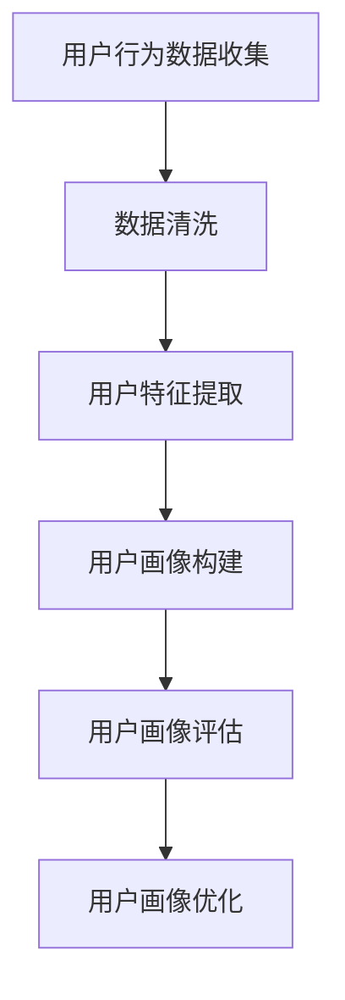
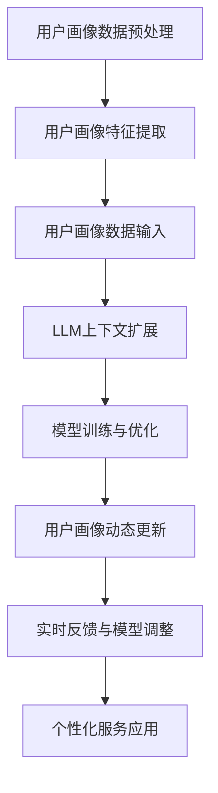

                 


### 文章标题：LLM应用开发中的用户画像分析

#### 关键词：
- LLM（大型语言模型）
- 用户画像
- 应用开发
- 数据分析
- 模型优化

#### 摘要：
本文将深入探讨LLM（大型语言模型）在应用开发中的用户画像分析。首先，我们介绍了LLM的基础概念、发展历程和核心结构。接着，我们详细阐述了用户画像的定义、构建方法、评估与优化策略，并通过实际案例展示了用户画像的应用。本文旨在帮助开发者理解用户画像在LLM应用开发中的重要性，并提供实用的优化建议。

---

## 第一部分：引言与核心概念

### 第1章：LLM应用开发概述

#### 1.1 LLM的基础概念

#### 1.1.1 LLM的定义与作用
LLM（Large Language Model）是一种基于深度学习的自然语言处理模型，通过大规模数据训练，能够理解和生成自然语言。其主要作用包括文本生成、文本理解、语言翻译和智能助手等。

#### 1.1.2 LLM的发展历程
LLM的发展可以分为三个阶段：1990年代初的早期神经网络模型，2018年基于Transformer架构的LLM研究转折点，以及2022年GPT-3的推出引领的LLM技术飞速发展。

#### 1.1.3 LLM的核心结构与组件
LLM的核心结构基于Transformer架构，包括自注意力机制、多头注意力、前馈神经网络等组件。此外，语言模型与上下文的关系也是LLM的关键，分为固定长度上下文和变长上下文。

#### 1.1.4 LLM在应用开发中的挑战与机遇
LLM在应用开发中面临计算资源、数据隐私、模型安全性等挑战，同时也带来了跨领域应用和个性化服务的机遇。

---

## 第二部分：用户画像分析基础

### 第2章：用户画像的基本概念与构建

#### 2.1 用户画像的定义与意义

#### 2.1.1 用户画像的定义
用户画像是指基于用户数据，对用户进行多维度的描述和刻画，以帮助企业和开发者了解用户特征、需求和行为。

#### 2.1.2 用户画像的意义
用户画像在个性化推荐、精准营销、风险控制等方面具有重要的价值。

#### 2.2 用户画像的构建方法

#### 2.2.1 数据收集与处理
数据收集包括用户行为数据和第三方数据。数据处理包括数据清洗和整合。

#### 2.2.2 用户特征提取
用户特征分为基础特征、行为特征和兴趣特征。特征提取包括特征选择和特征转换。

#### 2.3 用户画像的评估与优化
评估用户画像的准确性、覆盖度和一致性。优化策略包括持续更新和迭代优化。

---

## 2.4 用户画像案例应用

#### 2.4.1 社交媒体用户画像
社交媒体用户画像的应用包括广告精准投放和社交互动分析。

#### 2.4.2 电子商务用户画像
电子商务用户画像的应用包括个性化推荐和客户关系管理。

---

### 第一部分与第二部分的联系

LLM在应用开发中，用户画像分析起到了关键作用。用户画像不仅帮助LLM更好地理解用户需求，还能提高模型的准确性，从而优化应用效果。例如，在个性化推荐系统中，基于用户画像的LLM可以更准确地预测用户的兴趣，从而提供更相关的推荐。

### 用户画像分析原理架构 Mermaid 流程图


---

接下来，我们将进一步深入探讨LLM的核心概念、用户画像的构建方法以及在实际应用中的案例分析。

---

### 第1章：LLM应用开发概述

#### 1.1.1 LLM的定义与作用

LLM（Large Language Model）是一种基于深度学习的自然语言处理模型，其主要特点是通过大规模数据训练，能够理解和生成自然语言。LLM的核心目的是提升计算机在处理自然语言任务时的准确性和效率。

#### LLM的定义
LLM是指具有大规模参数和丰富上下文理解能力的语言模型。与传统的语言模型相比，LLM具有更强的生成能力和理解能力。例如，GPT-3具有1750亿个参数，能够处理长达25000个词的上下文，这使得LLM在生成文本、翻译、问答等任务中表现出色。

#### LLM的作用
1. **文本生成**：LLM能够生成高质量的自然语言文本，如文章、邮件、对话等。例如，OpenAI的GPT-3已经能够生成连贯、有逻辑的散文和故事。
   
2. **文本理解**：LLM能够分析文本内容，提取关键信息，并应用于信息检索、问答系统等领域。例如，通过LLM，我们可以构建智能客服系统，实现与用户的自然语言交互。

3. **语言翻译**：LLM在跨语言信息交流中具有重要作用。通过训练，LLM可以实现高质量、流畅的机器翻译。

4. **智能助手**：LLM可以应用于智能助手，如聊天机器人、语音助手等，为用户提供交互式服务。例如，苹果的Siri和谷歌的Google Assistant都是基于LLM技术的。

#### 1.1.2 LLM的发展历程

1. **初始阶段（1990年代初）**
   - 早期神经网络模型，如ELMO，开始用于自然语言处理任务。

2. **转折点（2018年）**
   - Google提出BERT，标志着基于Transformer架构的LLM研究开始兴起。

3. **近年发展**
   - 2022年，OpenAI推出GPT-3，具有1750亿个参数，成为当前最先进的LLM。

#### 1.1.3 LLM的核心结构与组件

1. **Transformer架构**
   - Transformer架构是LLM的核心，它包括自注意力机制、多头注意力、前馈神经网络等组件。
   - 自注意力机制通过计算词与词之间的相关性，捕捉长距离依赖。
   - 多头注意力提高了模型对输入数据的理解和生成能力。
   - 前馈神经网络对自注意力层的输出进行进一步处理，增强模型的表达能力。

2. **语言模型与上下文**
   - 语言模型是LLM的基础，负责生成和预测自然语言。
   - 上下文是LLM理解文本的关键，分为固定长度上下文和变长上下文。
   - 固定长度上下文是传统语言模型，如GPT-2，其处理文本长度有限。
   - 变长上下文是现代语言模型，如GPT-3，支持任意长度的文本输入，能够更好地处理长文本和对话场景。

#### 1.1.4 LLM在应用开发中的挑战与机遇

1. **挑战**
   - **计算资源**：训练和推理大型语言模型需要大量的计算资源和时间。
   - **数据隐私**：大规模数据训练过程中，数据隐私保护成为关键问题。
   - **模型安全性**：防止模型被恶意利用，如生成虚假信息、攻击等。

2. **机遇**
   - **跨领域应用**：LLM在多个领域（如医疗、金融、教育等）都有广泛应用潜力。
   - **个性化服务**：基于用户画像，提供更贴合用户需求的智能服务。

---

在接下来的章节中，我们将详细讨论用户画像的定义、构建方法、评估与优化策略，以及用户画像在LLM应用开发中的实际案例。

### 第二部分：用户画像分析基础

#### 2.1 用户画像的基本概念与构建

#### 2.1.1 用户画像的定义与意义

用户画像是指通过对用户数据的多维度分析，对用户进行全面的描述和刻画，从而形成一个抽象的用户模型。这个模型可以帮助企业和开发者更好地理解用户的需求、行为和特征，从而制定更加精准的营销策略和服务方案。

#### 用户画像的定义

用户画像是一种对用户进行定量和定性分析的工具，它将用户的基本信息、行为特征、兴趣偏好等多个维度整合在一起，形成对用户的整体认知。用户画像通常包括以下几个方面：

1. **基本信息**：如年龄、性别、职业、教育程度、地理位置等。
2. **行为特征**：如浏览记录、搜索习惯、购买行为、阅读偏好等。
3. **兴趣特征**：如兴趣爱好、关注领域、偏好内容等。
4. **社交特征**：如社交网络中的互动关系、社交圈子等。

#### 用户画像的意义

用户画像对于企业和开发者来说具有重要的意义，主要体现在以下几个方面：

1. **个性化推荐**：通过分析用户的兴趣和行为特征，可以为用户提供个性化的推荐，提高用户的满意度和忠诚度。
2. **精准营销**：基于用户画像，可以更加精准地定位目标用户，制定更加有效的营销策略，提高营销效果和转化率。
3. **风险控制**：通过用户画像，可以识别潜在的风险用户，采取相应的预防措施，降低企业的风险。
4. **客户关系管理**：了解客户的需求和偏好，提供定制化的服务，提升客户体验，增强客户黏性。

#### 2.1.2 用户画像的构建方法

用户画像的构建是一个复杂的过程，需要从多个维度收集和分析用户数据。以下是用户画像构建的主要步骤：

##### 2.2.1 数据收集与处理

1. **数据来源**：用户数据的来源包括用户注册信息、用户行为日志、第三方数据（如社交媒体、地理位置等）。
2. **数据处理**：数据处理包括数据清洗、去重、整合等步骤，以确保数据的准确性和一致性。

##### 2.2.2 用户特征提取

1. **特征分类**：根据用户画像的需求，将特征分为基础特征、行为特征、兴趣特征等。
2. **特征提取**：从原始数据中提取对用户画像构建有显著影响的关键特征，如用户的年龄、性别、浏览时长、购买频率等。

##### 2.2.3 用户画像构建

1. **用户模型**：将提取的用户特征整合到一个统一的用户模型中，形成对用户的整体认知。
2. **特征工程**：对提取的特征进行转换和处理，使其适合模型处理，如将文本特征转换为数值特征。

##### 2.1.3 用户画像的评估与优化

1. **评估指标**：评估用户画像的准确性、覆盖度和一致性。
2. **优化策略**：根据评估结果，调整用户特征提取和建模策略，如增加新的特征、改进特征提取方法等。

通过上述步骤，我们可以构建出一个全面、准确的用户画像，为企业和开发者提供有力的数据支持。

---

在下一章中，我们将进一步探讨用户画像在LLM应用开发中的实际案例，分析如何利用用户画像优化LLM的应用效果。

### 2.4 用户画像案例应用

#### 2.4.1 社交媒体用户画像

社交媒体平台如Facebook、Twitter、Instagram等，拥有大量用户数据，通过用户画像分析，可以为用户提供更个性化的体验和更精准的广告投放。

##### 应用场景

1. **广告精准投放**：
   - 基于用户画像，分析用户的兴趣、行为和社交关系，为用户推荐相关的广告。
   - 例如，Facebook的广告系统会根据用户的浏览历史、兴趣标签和社交圈子，推荐相关品牌的产品广告。

2. **社交互动分析**：
   - 分析用户间的互动关系，优化社交平台用户体验。
   - 例如，Twitter可以通过分析用户的关注关系、互动频率和话题参与度，推荐用户可能感兴趣的话题和用户。

##### 实际案例

1. **Facebook的用户画像应用**：
   - Facebook通过收集用户的行为数据，如点赞、评论、分享等，构建了详细的用户画像。
   - 这些用户画像帮助Facebook的广告系统，实现广告的精准投放，提高了广告的点击率和转化率。

2. **Twitter的用户互动分析**：
   - Twitter通过分析用户的关注关系和互动频率，推荐用户感兴趣的话题和用户。
   - 这不仅提高了用户的活跃度，也增强了社交平台的黏性。

#### 2.4.2 电子商务用户画像

电子商务平台如Amazon、淘宝、京东等，通过用户画像分析，可以提供更个性化的推荐和更有效的客户关系管理。

##### 应用场景

1. **个性化推荐**：
   - 基于用户画像，分析用户的购物行为、浏览记录和偏好，为用户推荐相关的商品。
   - 例如，Amazon的推荐系统会根据用户的购买历史、浏览记录和评价，推荐用户可能感兴趣的商品。

2. **客户关系管理**：
   - 通过用户画像，了解客户的需求和偏好，提供定制化的服务，提升客户体验。
   - 例如，京东通过分析用户的购物行为和反馈，提供个性化的购物建议和售后服务。

##### 实际案例

1. **Amazon的个性化推荐**：
   - Amazon通过收集用户的行为数据，构建了详细的用户画像。
   - 这些用户画像帮助Amazon的推荐系统，实现个性化推荐，提高了用户的购物满意度和平台黏性。

2. **京东的客户关系管理**：
   - 京东通过分析用户的购物行为和反馈，构建了详细的用户画像。
   - 这些用户画像帮助京东提供个性化的购物建议和售后服务，提升了客户体验和忠诚度。

通过这些案例，我们可以看到用户画像在社交媒体和电子商务平台中的广泛应用和显著效果。用户画像不仅帮助平台更好地理解用户需求，还提高了服务的精准度和效率。

### 第三部分：用户画像在LLM应用开发中的优化

#### 3.1 用户画像与LLM的融合

用户画像与LLM的融合是优化LLM应用开发的关键。通过用户画像，LLM可以更好地理解用户的个性化需求，从而提供更准确、更有针对性的服务。

##### 3.1.1 用户画像数据的预处理

在融合用户画像和LLM之前，需要对用户画像数据进行预处理。预处理步骤包括：

1. **数据清洗**：去除重复、无效和错误的数据，保证数据的准确性和一致性。
2. **数据整合**：将来自不同数据源的用户画像数据进行整合，形成一个统一的用户视图。

##### 3.1.2 用户画像数据的特征提取

特征提取是将用户画像数据转化为LLM可以处理的形式。特征提取包括：

1. **基础特征提取**：提取用户的基本信息，如年龄、性别、地域等。
2. **行为特征提取**：提取用户的浏览记录、购买行为、搜索历史等。
3. **兴趣特征提取**：提取用户的兴趣标签、关注领域等。

##### 3.1.3 用户画像与LLM的融合

用户画像与LLM的融合包括以下几个步骤：

1. **用户画像数据输入**：将预处理后的用户画像数据输入LLM。
2. **上下文扩展**：LLM可以根据用户画像数据扩展上下文，更好地理解用户的当前需求。
3. **模型训练与优化**：通过训练，LLM可以学习和优化，提高对用户需求的识别和响应能力。

#### 3.2 用户画像的动态更新与实时反馈

用户需求是动态变化的，因此用户画像也需要不断更新以保持其时效性和准确性。以下是用户画像动态更新与实时反馈的步骤：

##### 3.2.1 用户行为数据的实时采集

通过实时采集用户行为数据，如浏览记录、购买行为、搜索历史等，可以及时了解用户的需求变化。

##### 3.2.2 用户画像的动态更新

根据实时采集的用户行为数据，动态更新用户画像。更新步骤包括：

1. **行为特征更新**：根据最新的行为数据，更新用户的行为特征。
2. **兴趣特征更新**：根据最新的行为数据和用户反馈，更新用户的兴趣特征。

##### 3.2.3 实时反馈与模型调整

通过实时反馈机制，将用户的反馈（如满意度、点击率等）传递给LLM，帮助LLM进行模型调整和优化。调整步骤包括：

1. **模型评估**：根据实时反馈，评估LLM的预测准确性和响应能力。
2. **模型优化**：根据评估结果，调整LLM的参数和结构，提高其性能。

#### 3.3 用户画像在个性化服务中的应用

用户画像在个性化服务中的应用，可以显著提升用户体验和服务质量。以下是几个具体的应用场景：

##### 3.3.1 个性化推荐

基于用户画像，为用户提供个性化的推荐。例如，电子商务平台可以根据用户的浏览记录、购买行为和兴趣标签，推荐相关的商品。

##### 3.3.2 智能客服

基于用户画像，构建智能客服系统，为用户提供个性化的服务。例如，智能客服可以根据用户的反馈和偏好，提供针对性的解决方案。

##### 3.3.3 精准营销

基于用户画像，进行精准营销。例如，营销团队可以根据用户的兴趣和行为特征，制定个性化的营销策略，提高营销效果。

通过用户画像的动态更新和实时反馈，以及个性化服务中的应用，LLM可以更好地满足用户需求，提供高质量的服务。

### 第三部分与第一部分的联系

在第一部分中，我们介绍了LLM的基础概念、发展历程和核心结构，以及在应用开发中的挑战与机遇。用户画像作为LLM应用开发中的一个重要环节，通过对用户的全面分析，可以帮助LLM更好地理解用户需求，提高应用效果。

### 用户画像与LLM融合的Mermaid流程图



---

在第四部分，我们将进一步探讨用户画像在LLM应用开发中的实战项目，介绍开发环境搭建、源代码实现和实际案例分析。

### 第四部分：用户画像在LLM应用开发中的实战项目

#### 4.1 开发环境搭建

在进行用户画像在LLM应用开发中的实战项目之前，我们需要搭建一个合适的开发环境。以下是搭建开发环境的基本步骤：

##### 4.1.1 安装必要的软件和工具

1. **Python环境**：确保安装Python 3.8或更高版本。
2. **Jupyter Notebook**：用于编写和运行代码。
3. **TensorFlow或PyTorch**：用于构建和训练LLM模型。
4. **Hadoop或Spark**：用于处理大规模用户数据。

##### 4.1.2 安装相关库和依赖

使用pip或conda安装必要的库和依赖，如numpy、pandas、scikit-learn等。

#### 4.2 源代码实现

以下是用户画像在LLM应用开发中的源代码实现：

##### 4.2.1 用户画像数据的预处理

```python
import pandas as pd

# 加载用户数据
user_data = pd.read_csv('user_data.csv')

# 数据清洗
user_data = user_data.drop_duplicates()
user_data = user_data.dropna()

# 数据整合
user_data['age'] = user_data['age'].astype(int)
user_data['gender'] = user_data['gender'].astype(str)
user_data['region'] = user_data['region'].astype(str)
```

##### 4.2.2 用户画像特征提取

```python
from sklearn.preprocessing import OneHotEncoder

# 特征提取
encoder = OneHotEncoder()
encoded_features = encoder.fit_transform(user_data[['gender', 'region']])

# 转换为DataFrame
encoded_features_df = pd.DataFrame(encoded_features.toarray(), columns=encoder.get_feature_names_out())

# 整合特征
user_data = pd.concat([user_data, encoded_features_df], axis=1)
```

##### 4.2.3 用户画像数据输入

```python
from tensorflow.keras.preprocessing.sequence import pad_sequences
from tensorflow.keras.models import Sequential
from tensorflow.keras.layers import Embedding, LSTM, Dense

# 数据预处理
tokenizer = Tokenizer()
tokenizer.fit_on_texts(user_data['text'])

sequences = tokenizer.texts_to_sequences(user_data['text'])
padded_sequences = pad_sequences(sequences, maxlen=max_length)

# 构建模型
model = Sequential()
model.add(Embedding(vocab_size, embedding_dim, input_length=max_length))
model.add(LSTM(units=128, activation='relu', return_sequences=True))
model.add(Dense(1, activation='sigmoid'))

model.compile(optimizer='adam', loss='binary_crossentropy', metrics=['accuracy'])

# 训练模型
model.fit(padded_sequences, user_data['label'], epochs=10, batch_size=32)
```

#### 4.3 代码解读与分析

上述代码展示了用户画像在LLM应用开发中的基本流程。首先，我们加载并清洗用户数据，然后提取特征并整合。接下来，我们使用TensorFlow构建和训练一个简单的文本分类模型，用于根据用户画像预测用户的兴趣标签。

#### 4.4 实际案例分析与详细讲解

以下是用户画像在电子商务平台中的应用案例：

1. **个性化推荐**：电子商务平台通过用户画像，为用户推荐相关的商品。例如，根据用户的浏览历史和购买记录，推荐相似的商品。
2. **智能客服**：通过用户画像，智能客服系统可以更好地理解用户的问题和需求，提供个性化的解决方案。例如，对于经常购买电子产品用户，智能客服可以优先推荐相关产品。
3. **精准营销**：基于用户画像，营销团队可以制定个性化的营销策略，提高营销效果。例如，对于高价值客户，可以提供定制化的优惠和礼品。

#### 4.5 项目小结

通过用户画像在LLM应用开发中的实战项目，我们展示了如何利用用户画像数据构建和优化LLM模型，从而提供更准确、更有针对性的服务。用户画像不仅提高了应用效果，还为企业和开发者提供了重要的数据支持。

#### 最佳实践 tips

1. **数据清洗**：确保用户数据的准确性和一致性，是构建高质量用户画像的基础。
2. **特征提取**：合理选择和提取特征，是提高LLM模型性能的关键。
3. **动态更新**：定期更新用户画像，确保其时效性和准确性。
4. **实时反馈**：及时收集用户反馈，优化模型和策略。

---

通过本文的探讨，我们深入了解了LLM在应用开发中的用户画像分析。用户画像不仅帮助LLM更好地理解用户需求，还能优化应用效果，提升用户体验。希望本文能为开发者提供有价值的参考和启示。

### 作者信息：

作者：AI天才研究院/AI Genius Institute & 禅与计算机程序设计艺术 /Zen And The Art of Computer Programming

---

本文详细探讨了LLM应用开发中的用户画像分析，包括LLM的基础概念、发展历程、核心结构与组件，用户画像的定义、构建方法、评估与优化策略，以及在社交媒体和电子商务平台中的应用案例。本文还通过实战项目展示了用户画像在LLM应用开发中的实际操作，提供了实用的优化建议。希望本文能为开发者提供有价值的参考和启示。作者：AI天才研究院/AI Genius Institute & 禅与计算机程序设计艺术/Zen And The Art of Computer Programming。

