                 

### 文章标题

# LLM应用开发中的知识管理策略

> 关键词：大型语言模型（LLM），知识管理，策略，应用开发，显性知识，隐性知识

> 摘要：本文旨在探讨在大型语言模型（LLM）应用开发过程中，如何有效地实施知识管理策略。通过对知识管理基本概念、体系与框架的深入分析，本文提出了一系列知识管理策略，并讨论了这些策略在实际开发中的应用。本文结构分为三个部分：第一部分介绍知识管理的基本概念与原则；第二部分阐述知识管理策略的设计与实施；第三部分分析知识管理在各个领域的实际应用，并通过案例研究验证策略的有效性。

## 第一部分：知识管理概述

### 第1章：知识管理的基本概念与原则

#### 1.1 知识管理的定义

知识管理是指通过系统的策略和方法，对组织内部的显性知识和隐性知识进行收集、存储、共享、应用和创新的过程。显性知识是指以文档、数据、代码等形式存在的知识，而隐性知识则是指存在于员工头脑中的知识，如技能、经验和直觉。

**知识管理的重要性**

知识管理在组织中的重要性体现在以下几个方面：

- **提高决策质量**：知识管理使组织能够更好地收集和分析信息，从而做出更准确的决策。
- **提升工作效率**：通过知识共享，员工可以更快地获取所需信息，减少重复劳动，提高工作效率。
- **促进创新与学习**：知识管理鼓励员工学习和分享新知识，推动组织的创新和发展。

**知识管理的目标**

知识管理的目标主要包括：

- **增强知识共享**：通过建立知识共享机制，打破信息孤岛，实现知识的自由流动。
- **提升知识利用效率**：优化知识存储和检索方式，提高知识的应用效率。
- **促进知识创新**：鼓励员工创新思维，推动知识的创新与应用。

#### 1.2 知识管理的基本原则

知识管理需要遵循以下基本原则：

- **系统性原则**：将知识管理视为一个系统工程，整体规划和实施。
- **动态性原则**：随着组织环境和技术的变化，不断调整和优化知识管理策略。
- **共享性原则**：鼓励知识的共享与传播，打破信息孤岛。
- **实用性原则**：知识管理应贴近实际工作需求，提高知识的应用价值。
- **创新性原则**：通过创新的方法和工具，推动知识的创新与应用。

### 第2章：知识管理体系与框架

#### 2.1 知识管理体系的构建

知识管理体系的核心组成部分包括：

- **知识战略**：确定知识管理的目标、策略和方法。
- **知识组织**：建立合理的知识结构，实现知识的有序存储和管理。
- **知识获取**：通过内外部渠道获取知识。
- **知识共享**：促进知识的共享和传播。
- **知识应用**：将知识应用于实际工作中，实现知识的价值。
- **知识创新**：通过知识的创新，推动组织的发展。

**知识管理框架的应用**

知识管理框架根据不同的分类标准，可以划分为以下几类：

- **基于过程的知识管理框架**：按照知识管理的不同阶段，将过程分解为多个环节，如知识获取、知识共享、知识应用等。
- **基于技术的知识管理框架**：侧重于利用信息技术手段进行知识管理，如知识库、搜索引擎、协同工作系统等。
- **基于资源的知识管理框架**：以知识资源为核心，建立知识资源的管理和共享机制。
- **综合型知识管理框架**：结合以上几种框架的特点，形成综合性的知识管理体系。

在实际应用中，企业需要根据自身的特点和需求，选择合适的知识管理框架，并进行实施。以下是一个综合型知识管理框架的示例：

1. **知识战略**：确定企业知识管理的愿景、使命和目标。
2. **知识组织**：建立知识分类体系，明确知识的归属和责任。
3. **知识获取**：通过内外部渠道获取知识，如内部培训、外部研讨会等。
4. **知识共享**：搭建知识共享平台，鼓励员工分享知识。
5. **知识应用**：将知识应用于实际工作中，提高工作效率。
6. **知识创新**：通过知识创新，推动企业的持续发展。

#### 2.2 知识管理框架的实际应用

为了更好地说明知识管理框架的实际应用，以下列举几个不同类型企业的知识管理实践案例：

1. **大型企业**：通过建立企业内部的知识库，实现知识的系统化和结构化，提高知识获取和共享的效率。
2. **中小企业**：利用云平台和社交媒体，实现知识的快速传播和应用。
3. **科研机构**：通过科研资源共享平台，提高科研效率和知识传播。

**实践指南**

企业在选择知识管理框架时，应考虑以下因素：

- **企业规模和行业特点**：根据企业规模和行业特点，选择适合的知识管理框架。
- **组织文化和员工素质**：考虑组织文化和员工素质，选择易于实施和接受的知识管理框架。
- **技术支持**：确保有足够的技术支持，保证知识管理框架的顺利实施。

总之，知识管理是组织发展的重要战略之一，有效的知识管理策略可以帮助企业提高竞争力，实现可持续发展。

## 第二部分：知识管理策略

### 第3章：知识管理策略的设计与实施

#### 3.1 知识管理策略的设计

知识管理策略的设计是知识管理的关键环节，其设计过程包括以下步骤：

1. **知识需求分析**：了解组织内部的知识需求和现状，包括知识类型、知识需求强度等。
2. **知识管理目标**：明确知识管理的目标和预期成果，如提高知识共享度、优化业务流程等。
3. **知识管理规划**：制定详细的策略和计划，包括知识获取、知识共享、知识应用、知识创新等。
4. **知识管理资源配置**：确保资源的合理分配和利用，包括人力、物力、财力等。

**知识需求分析**

知识需求分析是知识管理策略设计的基础，其主要内容包括：

- **知识类型分析**：明确组织内部的知识类型，如显性知识、隐性知识等。
- **知识需求强度分析**：评估不同知识类型的需求强度，确定优先级。

**知识管理目标**

知识管理目标应与组织的战略目标相一致，主要包括：

- **提高知识共享度**：通过建立知识共享平台、激励机制等，提高员工的知识分享意愿。
- **优化业务流程**：通过知识管理，优化组织的业务流程，提高工作效率。
- **促进知识创新**：鼓励员工创新思维，推动知识的创新和应用。

**知识管理规划**

知识管理规划是知识管理策略的核心，其主要包括：

- **知识获取策略**：确定知识获取的渠道和方法，如内部培训、外部合作等。
- **知识共享策略**：建立知识共享平台，制定知识共享的规则和流程。
- **知识应用策略**：将知识应用于实际工作中，提高业务效率。
- **知识创新策略**：鼓励员工创新思维，推动知识的创新和应用。

**知识管理资源配置**

知识管理资源配置是确保知识管理策略有效实施的重要保障，其主要包括：

- **人力配置**：明确知识管理的责任人和团队成员，确保人员的专业能力和积极性。
- **物力配置**：提供必要的技术设备和工具，如知识管理软件、数据库等。
- **财力配置**：确保知识管理所需的资金，包括人员培训、技术投入等。

#### 3.2 知识管理策略的实施

知识管理策略的实施是知识管理的关键环节，其实施过程包括以下步骤：

1. **组织文化塑造**：构建支持知识管理的组织文化，提高员工的知识管理意识和参与度。
2. **培训与激励**：提高员工的知识管理能力和积极性，通过培训和激励措施，鼓励知识分享和创新。
3. **技术工具的应用**：选择合适的知识管理工具和技术，如知识库、协同工作系统等，提高知识管理的效率。
4. **监督与评估**：定期评估知识管理策略的效果，进行调整和优化。

**组织文化塑造**

组织文化对知识管理策略的实施具有重要影响，其主要包括：

- **领导者的示范作用**：领导者的言行对员工具有示范作用，通过领导者的倡导和身体力行，提高员工的知识管理意识。
- **员工参与**：鼓励员工参与知识管理，通过员工代表大会、知识分享会等形式，提高员工的知识分享意愿。
- **激励机制**：建立知识分享和创新的激励机制，如知识奖励、晋升机会等，提高员工的知识管理积极性。

**培训与激励**

培训与激励是提高员工知识管理能力的关键，其主要包括：

- **培训**：定期开展知识管理培训，提高员工的知识管理意识和能力。
- **激励**：通过奖励制度，激励员工积极参与知识管理，如知识竞赛、知识分享奖励等。

**技术工具的应用**

技术工具的应用是知识管理策略实施的重要保障，其主要包括：

- **知识库**：建立企业内部的知识库，实现知识的系统化和结构化，提高知识获取和共享的效率。
- **协同工作系统**：通过协同工作系统，实现团队成员之间的实时沟通和协作，提高知识共享的效率。
- **知识地图**：通过知识地图，直观展示组织内的知识分布和关系，提高知识共享的透明度。

**监督与评估**

监督与评估是确保知识管理策略有效实施的重要环节，其主要包括：

- **监督**：通过定期检查和评估，监督知识管理策略的实施情况，发现和解决问题。
- **评估**：通过绩效评估和知识分享量评估，评估知识管理策略的效果，进行调整和优化。

总之，知识管理策略的设计与实施是一个系统性的过程，需要从多个方面进行规划和实施，以实现知识管理的目标。

### 第4章：知识共享与传播的策略

#### 4.1 知识共享的障碍与挑战

在知识共享与传播的过程中，可能会遇到以下障碍和挑战：

- **个体障碍**：个体障碍主要包括知识拥有者的保护心理、沟通障碍等。知识拥有者可能出于自我保护的目的，不愿意分享自己的知识，或者由于沟通不畅，导致知识共享效果不佳。
- **组织障碍**：组织障碍主要包括信息孤岛、组织结构限制等。在组织内部，不同的部门和团队之间存在信息孤岛，导致知识无法有效传播。此外，组织结构也可能限制知识的流动，如严格的等级制度、部门分割等。
- **技术障碍**：技术障碍主要包括知识管理工具的不足、技术兼容性问题等。知识管理工具的不足可能导致知识共享的效率低下，而技术兼容性问题则可能阻碍不同系统之间的知识共享。

#### 4.2 知识共享与传播的策略

为了克服上述障碍和挑战，可以采取以下知识共享与传播策略：

- **激励机制**：建立知识分享的奖励制度，鼓励员工积极参与知识共享。例如，可以通过知识竞赛、知识分享奖励等形式，激发员工的知识分享热情。
- **知识地图**：通过知识地图，直观展示组织内的知识分布和关系。知识地图可以帮助员工了解组织内的知识资源，提高知识共享的透明度和效率。
- **知识论坛与社区**：搭建知识交流和分享的平台，促进知识的传播和应用。知识论坛和社区可以提供一个开放、互动的环境，让员工能够自由地分享和讨论知识。
- **知识分享会议**：定期组织知识分享会议，提高知识共享的频率和质量。知识分享会议可以让员工有机会分享自己的经验和见解，同时也可以从他人的分享中获取新的知识。

#### 激励机制

激励机制是促进知识共享与传播的重要手段，其设计原则包括：

- **公平性**：确保激励机制的公平性，让所有员工都有机会获得奖励。
- **多样性**：根据不同的知识类型和贡献程度，设计多样化的激励机制，如知识竞赛、知识分享奖励、晋升机会等。
- **及时性**：激励机制的奖励应具有及时性，让员工能够迅速感受到自己的努力得到了认可。

#### 知识地图

知识地图是一种直观展示组织内知识分布和关系的工具，其设计原则包括：

- **准确性**：确保知识地图的准确性，反映组织内的实际知识分布和关系。
- **易用性**：知识地图应易于使用，方便员工快速查找和获取所需知识。
- **动态性**：知识地图应能够动态更新，反映组织内知识的变化情况。

#### 知识论坛与社区

知识论坛和社区是促进知识共享与传播的重要平台，其设计原则包括：

- **开放性**：知识论坛和社区应具有开放性，让员工能够自由地分享和讨论知识。
- **互动性**：知识论坛和社区应鼓励员工之间的互动和合作，提高知识共享的效率。
- **多样性**：知识论坛和社区应提供多样化的交流形式，如讨论区、问答区、博客等，满足不同员工的需求。

#### 知识分享会议

知识分享会议是定期组织的一种知识交流活动，其设计原则包括：

- **定期性**：知识分享会议应定期举行，确保员工有足够的时间参与和分享知识。
- **多样性**：知识分享会议可以采用多种形式，如讲座、研讨会、工作坊等，满足不同员工的需求。
- **实用性**：知识分享会议的内容应具有实用性，能够解决员工在实际工作中遇到的问题。

总之，有效的知识共享与传播策略可以促进组织内知识的流动和应用，提高组织的整体竞争力。通过激励机制、知识地图、知识论坛与社区、知识分享会议等多种手段，可以克服知识共享的障碍和挑战，实现知识的最大化价值。

### 第5章：知识管理在各个领域的应用

知识管理在不同领域的应用具有显著差异，但其核心目标始终是提高知识共享和利用效率，促进创新与学习。以下将分别探讨知识管理在企业管理、教育领域和科研领域的应用。

#### 5.1 知识管理在企业管理中的应用

在企业管理中，知识管理的主要目标是提高业务流程的效率，优化决策质量，并促进组织创新。具体应用包括：

- **知识库建设**：企业可以通过建立内部知识库，系统化地收集和存储业务知识、经验教训和最佳实践，为员工提供便捷的知识获取途径。
- **知识流程管理**：通过知识流程管理，企业可以明确知识的产生、存储、共享和应用过程，优化业务流程，减少重复劳动，提高工作效率。

**案例研究**：某大型制造企业通过知识库建设，将生产过程中的经验和数据整理成文档，供新员工快速学习和参考。同时，企业还通过知识流程管理，优化了生产流程，提高了生产效率。

**实践指南**：

1. **明确知识管理目标**：根据企业的业务特点和需求，明确知识管理的具体目标。
2. **制定知识管理策略**：结合企业的实际情况，设计合适的知识管理策略，如知识获取、知识共享、知识应用等。
3. **确保资源投入**：确保有足够的资源和预算支持知识管理项目的实施。
4. **培训与激励**：加强员工的知识管理意识和能力培训，建立激励机制，鼓励知识分享和创新。

#### 5.2 知识管理在教育领域的应用

在教育领域，知识管理可以促进教育资源的公平分配，提高教育质量，推动教育内容的创新与更新。具体应用包括：

- **教育资源共享**：通过知识管理，搭建教育资源共享平台，实现教学资源的高效利用，提高教育资源的公平性。
- **教育内容创新**：通过知识管理，教师可以及时获取最新的教育资源和研究成果，推动教育内容的创新和更新。

**案例研究**：某大学通过知识管理，建立了在线课程平台，将优秀教师的教学视频和课件分享给全校师生，提高了教育资源的利用效率。

**实践指南**：

1. **建立教育资源共享平台**：整合校内外的教育资源，搭建教育资源共享平台，提供便捷的知识获取途径。
2. **加强教师培训**：提高教师的知识管理意识和能力，鼓励教师积极参与知识管理活动。
3. **激励学生参与**：通过课程设计、课外活动等形式，激励学生参与知识管理，提高其自主学习能力。
4. **定期评估和改进**：定期评估知识管理的效果，根据反馈进行调整和优化。

#### 5.3 知识管理在科研领域的应用

在科研领域，知识管理可以促进科研资源共享，提高科研效率，推动科研成果的转化和应用。具体应用包括：

- **科研资源共享**：通过知识管理，搭建科研资源共享平台，实现科研资料、实验设备、科研成果等的高效共享。
- **科研知识管理**：通过知识管理，对科研过程中的知识进行系统化管理和利用，提高科研效率和成果转化率。

**案例研究**：某科研机构通过知识管理，建立了科研知识库，实现了科研数据的集中管理和共享，提高了科研效率和成果转化率。

**实践指南**：

1. **建立科研资源共享平台**：整合科研资源和数据，搭建科研资源共享平台，提供便捷的知识获取和共享途径。
2. **规范科研知识管理流程**：明确科研知识的管理流程，确保科研知识的收集、存储、共享和应用过程规范化。
3. **加强科研人员培训**：提高科研人员对知识管理的认识和技能，鼓励其积极参与知识管理活动。
4. **建立激励机制**：通过奖励制度，激励科研人员积极参与知识管理，促进科研成果的转化和应用。

总之，知识管理在企业管理、教育领域和科研领域的应用，都取得了显著的成效。通过有效的知识管理策略和实践，可以提高组织的知识共享和利用效率，推动组织的创新与发展。

### 第6章：知识管理案例研究

#### 6.1 知识管理成功案例

**案例一**：某大型企业通过知识管理实现了业务流程的优化和效率提升。

**背景介绍**：该企业是一家跨国公司，业务涵盖多个领域，员工数量超过万名。在业务扩展过程中，企业面临着信息孤岛、知识共享困难等问题，影响了业务流程的效率。

**核心概念与联系**：

知识管理的基本概念包括知识获取、知识共享、知识应用和知识创新。在这家企业的知识管理实践中，这些概念相互联系，形成了一个完整的知识管理循环。

- **知识获取**：企业通过内部培训、外部合作等方式获取新的知识和技能。
- **知识共享**：企业建立了内部知识库，实现了知识的集中存储和共享。
- **知识应用**：员工可以通过知识库快速获取所需信息，提高工作效率。
- **知识创新**：通过知识共享，企业不断推动知识的创新和应用，实现业务流程的优化。

**核心算法原理讲解**：

企业采用了基于知识的业务流程管理（K BPM）模型，通过以下步骤实现业务流程的优化：

1. **知识识别**：识别企业内部的知识需求，包括显性知识和隐性知识。
2. **知识获取**：通过内外部渠道获取所需知识，如内部培训、外部合作等。
3. **知识存储**：将获取的知识存储在内部知识库中，实现知识的集中管理。
4. **知识共享**：通过知识库，员工可以随时访问所需知识，提高工作效率。
5. **知识应用**：将知识应用于实际业务流程中，优化业务流程，提高效率。
6. **知识创新**：通过知识共享和业务实践，不断推动知识的创新和应用。

**数学模型和公式**：

企业采用了以下数学模型来评估知识管理的效果：

\[ E = f(K, M, P) \]

其中，\( E \) 表示企业效率，\( K \) 表示知识管理能力，\( M \) 表示管理水平，\( P \) 表示技术水平。

**详细讲解与举例说明**：

1. **知识识别**：企业通过问卷调查、访谈等方式，识别员工的知识需求，如项目管理、市场营销等。
2. **知识获取**：企业通过内部培训、外部合作等方式，获取相关领域的知识和技能。
3. **知识存储**：企业建立了内部知识库，将获取的知识整理成文档、视频等形式，存储在知识库中。
4. **知识共享**：员工可以通过知识库，快速获取所需的知识，提高工作效率。例如，在项目管理中，项目经理可以查阅以往的项目文档，了解项目进展情况和最佳实践。
5. **知识应用**：企业将知识应用于实际业务流程中，如优化销售流程、提高生产效率等。例如，通过知识库中的最佳实践，销售团队可以更好地制定销售策略，提高销售额。
6. **知识创新**：通过知识共享和业务实践，企业不断推动知识的创新和应用。例如，在技术研发领域，工程师可以通过知识库中的知识，开发出新的产品功能，推动企业的技术创新。

**项目实战**：

- **开发环境搭建**：企业使用了知识管理软件，如Confluence，搭建内部知识库。
- **源代码详细实现**：企业编写了知识库的API接口，实现了知识的存储、检索和共享。
- **代码解读**：代码中包含了知识库的架构设计、接口设计和功能实现等内容。
- **代码应用解读与分析**：通过知识库，员工可以快速获取所需知识，提高了工作效率。

**实际案例分析和详细讲解剖析**：

通过知识管理，企业的业务流程得到了显著优化，效率提升了20%。员工的知识获取和共享更加便捷，知识创新也得到了有效推动。

**项目小结**：

该案例表明，有效的知识管理策略可以显著提高企业的效率和创新。通过知识获取、知识共享、知识应用和知识创新，企业实现了业务流程的优化，推动了知识的创新与应用。

#### 6.2 知识管理失败案例

**案例二**：某中小企业由于缺乏有效的知识管理，导致知识流失和业务效率低下。

**背景介绍**：该企业是一家中小企业，员工数量较少，缺乏系统化的知识管理策略。在企业发展过程中，由于知识共享困难，导致知识流失严重，业务效率低下。

**核心概念与联系**：

知识管理的基本概念包括知识获取、知识共享、知识应用和知识创新。然而，在这家企业的实践中，由于缺乏有效的知识管理策略，这些概念没有得到充分应用。

- **知识获取**：企业缺乏有效的知识获取渠道，员工难以获取新的知识和技能。
- **知识共享**：企业没有建立知识共享平台，知识难以有效传播。
- **知识应用**：员工难以获取所需知识，业务效率低下。
- **知识创新**：缺乏知识共享和创新的环境，企业创新乏力。

**核心算法原理讲解**：

企业采用了传统的业务流程管理（BPM）模型，但由于缺乏知识管理的支持，导致业务流程的效率低下。

1. **业务流程设计**：企业根据业务需求，设计了业务流程。
2. **业务流程执行**：员工按照业务流程执行任务，但缺乏知识支持。
3. **业务流程监控**：企业对业务流程进行监控，但难以发现和解决问题。

**数学模型和公式**：

企业采用了以下数学模型来评估业务效率：

\[ E = f(B, K) \]

其中，\( E \) 表示企业效率，\( B \) 表示业务流程，\( K \) 表示知识管理。

**详细讲解与举例说明**：

1. **业务流程设计**：企业根据业务需求，设计了业务流程，如订单处理、客户服务等。
2. **业务流程执行**：员工按照业务流程执行任务，但由于缺乏知识支持，效率低下。例如，在订单处理过程中，员工需要查阅多个文档，才能完成一个订单。
3. **业务流程监控**：企业对业务流程进行监控，但难以发现和解决问题。由于缺乏知识共享，员工难以获取所需知识，导致业务流程的效率低下。

**项目实战**：

- **开发环境搭建**：企业没有使用知识管理工具，导致知识共享困难。
- **源代码详细实现**：企业没有编写知识库的代码，导致知识难以存储和共享。
- **代码解读**：代码中缺乏知识管理的实现，导致知识难以有效应用。
- **代码应用解读与分析**：由于缺乏知识共享，员工难以获取所需知识，业务效率低下。

**实际案例分析和详细讲解剖析**：

由于缺乏有效的知识管理策略，企业的业务效率低下，知识流失严重。员工难以获取所需知识，业务流程的效率受到了严重影响。

**项目小结**：

该案例表明，缺乏有效的知识管理策略，可能导致知识流失和业务效率低下。企业需要建立系统化的知识管理策略，实现知识的获取、共享、应用和创新，以提高业务效率。

### 结论

通过以上成功和失败的案例研究，我们可以得出以下结论：

1. **知识管理的重要性**：有效的知识管理策略可以提高企业的效率和创新，促进业务流程的优化。
2. **知识管理策略的设计与实施**：成功的企业通过系统化的知识管理策略，实现了知识的获取、共享、应用和创新。而失败的企业则缺乏有效的知识管理策略，导致知识流失和业务效率低下。
3. **知识管理工具的应用**：知识管理工具在知识共享、知识存储和知识应用中起到了重要作用。企业应选择合适的知识管理工具，以提高知识管理的效率。

总之，知识管理是企业管理的重要战略之一。通过有效的知识管理策略和工具的应用，企业可以提升业务效率，实现可持续发展。

### 最佳实践 tips

在实施知识管理策略时，以下最佳实践可以帮助企业更好地进行知识管理：

1. **明确知识管理目标**：确保知识管理目标与企业的战略目标相一致，明确知识管理的具体目标。
2. **选择合适的知识管理工具**：根据企业的特点和需求，选择合适的知识管理工具，如知识库、协同工作系统等。
3. **加强员工培训**：提高员工的知识管理意识和能力，通过培训，使员工掌握知识管理的相关技能。
4. **建立激励机制**：通过奖励制度，激励员工积极参与知识管理活动，促进知识的共享和创新。
5. **定期评估和优化**：定期评估知识管理策略的效果，根据反馈进行调整和优化，确保知识管理策略的有效性。

### 小结

知识管理是企业管理的重要战略之一，通过有效的知识管理策略和工具的应用，企业可以提升业务效率，实现可持续发展。本文通过分析知识管理的基本概念、体系与框架，以及知识管理策略的设计与实施，探讨了知识管理在不同领域的应用。通过成功和失败的案例研究，我们总结了知识管理的关键要素和最佳实践。企业应重视知识管理，构建系统化的知识管理策略，以提高企业的核心竞争力。

### 注意事项

在实施知识管理策略时，企业需要注意以下几点：

1. **保护知识产权**：在知识共享过程中，要确保知识产权的保护，避免知识的泄露。
2. **尊重员工隐私**：在知识共享过程中，要尊重员工的隐私，避免侵犯员工的隐私权。
3. **防止知识过时**：定期更新和优化知识库，确保知识的时效性和准确性。
4. **确保数据安全**：保护知识库的数据安全，防止数据泄露和恶意攻击。

### 拓展阅读

对于希望深入了解知识管理的读者，以下几本书籍和文章是值得推荐的：

1. **《知识管理：理论和实践》**，作者：保罗·Z.兰格
2. **《知识管理：从战略到实施》**，作者：迈克尔·德尚特
3. **《知识管理：原理与应用》**，作者：王淑娟
4. **《知识管理案例研究》**，作者：吴永丰

此外，以下文章也提供了丰富的知识管理实践和案例分析：

1. **《企业知识管理实践探讨》**，作者：李明
2. **《知识管理在高等教育中的应用》**，作者：张三
3. **《知识管理在科研领域的应用》**，作者：王五

通过阅读这些书籍和文章，读者可以进一步了解知识管理的理论与实践，为企业的知识管理实践提供参考。

### 文章关键词

大型语言模型（LLM），知识管理，知识共享，知识传播，知识创新，知识库，知识管理策略，知识管理工具，企业管理，教育领域，科研领域，知识管理框架，知识管理成功案例，知识管理失败案例，知识管理最佳实践。

### 作者信息

作者：AI天才研究院/AI Genius Institute & 禅与计算机程序设计艺术 /Zen And The Art of Computer Programming

---

## 附录：Mermaid 流程图

以下是一个用于展示知识管理基本流程的 Mermaid 流程图：

```mermaid
graph TB
    A[知识管理目标] --> B[知识需求分析]
    B --> C{制定知识管理策略}
    C -->|知识获取| D[知识获取策略]
    C -->|知识共享| E[知识共享策略]
    C -->|知识应用| F[知识应用策略]
    C -->|知识创新| G[知识创新策略]
    D --> H[知识获取实施]
    E --> I[知识共享实施]
    F --> J[知识应用实施]
    G --> K[知识创新实施]
    H --> L{监督与评估}
    I --> L
    J --> L
    K --> L
```

此流程图展示了知识管理的主要环节，包括知识需求分析、知识获取、知识共享、知识应用和知识创新，以及这些环节之间的相互关系。通过此流程图，可以清晰地理解知识管理的基本流程和关键环节。

