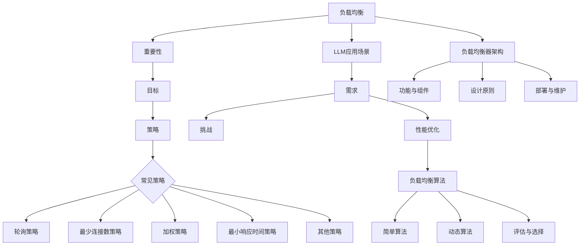

                 

### 文章标题：LLM应用开发中的负载均衡策略

> 关键词：LLM，负载均衡，策略，算法，实践，优化，未来展望

> 摘要：本文深入探讨了在LLM（大型语言模型）应用开发中负载均衡策略的重要性、常见策略及其应用实践。通过对LLM应用场景的深入分析，我们提出了适合不同场景的负载均衡策略，并结合实际案例进行了详细讲解。文章还对未来负载均衡技术的发展趋势进行了展望，旨在为LLM应用开发者提供全面的指导和参考。

### 目录大纲

## 第一部分：背景与基础

### 1. 负载均衡的概念与重要性

#### 1.1 负载均衡的定义

#### 1.2 负载均衡的重要性

#### 1.3 负载均衡的目标

### 2. LLM应用场景下的负载均衡需求

#### 2.1 LLM应用的特点

#### 2.2 LLM应用场景下的负载挑战

#### 2.3 LLM应用下的负载均衡需求

## 第二部分：负载均衡策略

### 3. 常见负载均衡策略

#### 3.1 轮询策略

#### 3.2 最少连接数策略

#### 3.3 加权策略

#### 3.4 最小响应时间策略

#### 3.5 其他常见策略

### 4. 负载均衡算法

#### 4.1 简单负载均衡算法

#### 4.2 动态负载均衡算法

#### 4.3 负载均衡算法的评估与选择

### 5. 负载均衡器架构设计

#### 5.1 负载均衡器的功能与组件

#### 5.2 负载均衡器的设计原则

#### 5.3 负载均衡器的部署与维护

## 第三部分：LLM应用场景下的负载均衡策略实践

### 6. LLM应用场景下的负载均衡挑战

#### 6.1 LLM应用的特殊需求

#### 6.2 LLM应用中的瓶颈分析

#### 6.3 LLM应用中的性能优化

### 7. 负载均衡策略在LLM应用中的实际案例

#### 7.1 案例一：大型问答系统负载均衡

#### 7.2 案例二：实时文本生成系统的负载均衡

#### 7.3 案例三：多语言翻译服务的负载均衡

#### 7.4 案例四：对话机器人的负载均衡策略

### 8. 负载均衡策略的优化与调整

#### 8.1 负载均衡策略的调整方法

#### 8.2 负载均衡策略的实时监控

#### 8.3 负载均衡策略的性能评估与优化

## 第四部分：未来展望

### 9. 负载均衡技术的发展趋势

#### 9.1 边缘计算与负载均衡

#### 9.2 AI驱动的负载均衡

#### 9.3 负载均衡的智能化发展

### 10. LLM应用开发中的负载均衡策略展望

#### 10.1 LLM应用的新挑战

#### 10.2 负载均衡策略的创新方向

#### 10.3 负载均衡在LLM应用中的未来前景

## 附录

### 附录 A：负载均衡相关工具与技术

#### A.1 负载均衡器介绍

#### A.2 负载均衡算法实现

#### A.3 负载均衡监控工具

#### A.4 负载均衡实践建议

---

### 第一部分：背景与基础

#### 1. 负载均衡的概念与重要性

##### 1.1 负载均衡的定义

负载均衡（Load Balancing）是指将大量请求分布到多个服务器或节点上，以确保每个服务器或节点都能在合理的负载范围内运行，从而提高系统的整体性能和可靠性。在分布式系统中，负载均衡是实现高可用性、可扩展性和性能优化的重要手段。

##### 1.2 负载均衡的重要性

在当前的互联网时代，随着用户数量的激增和业务需求的不断增长，单个服务器很难承受巨大的请求量。负载均衡能够将请求分配到多个服务器上，从而降低单个服务器的负载，提高系统的响应速度和吞吐量。具体来说，负载均衡的重要性体现在以下几个方面：

1. **提高系统性能**：通过合理分配请求，确保每个服务器都能在最佳状态下运行，从而提高系统的整体性能。
2. **提高系统可用性**：当某个服务器出现故障时，负载均衡器能够将请求自动切换到其他健康服务器上，从而确保系统的可用性。
3. **实现水平扩展**：通过增加服务器数量，可以轻松实现系统规模的扩展，满足业务增长的需求。
4. **优化资源利用**：负载均衡器可以根据服务器的实时负载情况动态调整请求分配，优化资源利用效率。

##### 1.3 负载均衡的目标

负载均衡的目标是确保系统在处理请求时达到以下几个目标：

1. **均衡性**：尽可能均匀地将请求分配到各个服务器上，避免某些服务器负载过重，而其他服务器闲置。
2. **高可用性**：确保系统在面临高并发请求时依然能够稳定运行，不出现性能瓶颈或服务中断。
3. **可扩展性**：能够根据业务需求动态调整服务器数量，以满足不断增长的用户需求。
4. **灵活性**：能够根据服务器的实时负载情况动态调整请求分配策略，确保系统始终处于最佳状态。

#### 2. LLM应用场景下的负载均衡需求

##### 2.1 LLM应用的特点

LLM（Large Language Model）是一种具有强大语言理解和生成能力的深度学习模型，常用于自然语言处理、文本生成、问答系统等领域。与传统的机器学习模型相比，LLM具有以下几个特点：

1. **计算资源需求大**：LLM通常包含数十亿个参数，训练和推理过程需要大量计算资源和存储资源。
2. **延迟敏感**：在实时应用场景中，LLM的响应时间需要尽可能短，以满足用户的需求。
3. **并发能力强**：LLM应用通常需要处理大量并发请求，如问答系统、实时文本生成等。
4. **可扩展性要求高**：随着用户数量的增加，LLM应用需要能够快速扩展，以应对业务增长的需求。

##### 2.2 LLM应用场景下的负载挑战

在LLM应用场景下，负载挑战主要体现在以下几个方面：

1. **计算资源限制**：由于LLM的计算需求大，单个服务器很难满足所有请求，需要通过负载均衡将请求分配到多个服务器上。
2. **延迟敏感**：在实时应用场景中，请求的响应时间需要尽可能短，否则会影响用户体验。
3. **并发处理能力**：LLM应用需要能够处理大量并发请求，否则会出现性能瓶颈。
4. **动态性**：用户请求量和服务器状态会实时变化，负载均衡策略需要具备动态调整能力。

##### 2.3 LLM应用下的负载均衡需求

为了应对LLM应用场景下的负载挑战，需要采用合适的负载均衡策略，以满足以下几个需求：

1. **高效性**：负载均衡策略需要能够在短时间内处理大量请求，确保系统的响应速度。
2. **均衡性**：确保请求能够均匀地分配到各个服务器上，避免某些服务器负载过重。
3. **可靠性**：在服务器出现故障时，负载均衡策略需要能够快速切换到备用服务器，确保系统的高可用性。
4. **可扩展性**：负载均衡策略需要能够根据业务需求动态调整，以适应不断增长的用户需求。

### 第二部分：负载均衡策略

#### 3. 常见负载均衡策略

##### 3.1 轮询策略

轮询策略（Round Robin）是最简单的负载均衡策略，它将请求按照顺序分配到各个服务器上。具体实现如下：

```plaintext
1. 初始化服务器列表serverList = [s1, s2, s3, ...]
2. 每次请求时，依次从serverList中取出服务器进行处理
3. 当取到最后一个服务器时，重新回到第一个服务器
```

轮询策略的优点是实现简单，易于理解，但缺点是当某些服务器负载较重时，其他服务器可能处于闲置状态。

##### 3.2 最少连接数策略

最少连接数策略（Least Connections）将请求分配到当前连接数最少的服务器上。具体实现如下：

```plaintext
1. 初始化服务器列表serverList = [s1, s2, s3, ...]
2. 每次请求时，计算每个服务器的当前连接数
3. 将请求分配到连接数最少的服务器上
4. 如果有多个服务器的连接数相同，则采用轮询策略进行分配
```

最少连接数策略的优点是能够确保请求均匀地分配到各个服务器上，但缺点是需要实时监控服务器的连接状态，实现较为复杂。

##### 3.3 加权策略

加权策略（Weighted Round Robin）是在轮询策略的基础上，为每个服务器分配不同的权重，从而根据权重来分配请求。具体实现如下：

```plaintext
1. 初始化服务器列表serverList = [s1, s2, s3, ...]
2. 为每个服务器分配权重weight = [w1, w2, w3, ...]
3. 每次请求时，根据权重计算加权轮询顺序
4. 将请求分配到加权轮询顺序中的服务器上
```

加权策略的优点是能够根据服务器的性能和负载情况动态调整权重，但缺点是实现复杂，且需要实时监控服务器的状态。

##### 3.4 最小响应时间策略

最小响应时间策略（Least Response Time）将请求分配到当前响应时间最短的服务器上。具体实现如下：

```plaintext
1. 初始化服务器列表serverList = [s1, s2, s3, ...]
2. 每次请求时，计算每个服务器的当前响应时间
3. 将请求分配到响应时间最短的服务器上
4. 如果有多个服务器的响应时间相同，则采用轮询策略进行分配
```

最小响应时间策略的优点是能够根据服务器的响应速度来分配请求，从而提高系统的整体性能，但缺点是需要实时监控服务器的响应时间，实现较为复杂。

##### 3.5 其他常见策略

除了上述策略外，还有一些其他常见的负载均衡策略，如：

1. **源地址哈希策略**：根据请求的源地址哈希值将请求分配到服务器上，确保来自同一IP地址的请求总是分配到同一服务器上。
2. **动态权重策略**：根据服务器的实时性能和负载情况动态调整权重，从而实现更均衡的负载分配。
3. **动态负载均衡算法**：根据系统的实时负载情况动态调整负载均衡策略，从而实现更高效的负载分配。

#### 4. 负载均衡算法

##### 4.1 简单负载均衡算法

简单负载均衡算法主要包括轮询策略、最少连接数策略和加权策略，这些算法的实现相对简单，但需要实时监控服务器的状态。

```plaintext
// 轮询策略实现
function roundRobin(serverList) {
    let currentServer = 0;
    return function () {
        let server = serverList[currentServer];
        currentServer = (currentServer + 1) % serverList.length;
        return server;
    };
}

// 最少连接数策略实现
function leastConnections(serverList) {
    let serverConnections = new Array(serverList.length).fill(0);
    return function () {
        let minConnections = Math.min(...serverConnections);
        let serverIndex = serverConnections.indexOf(minConnections);
        serverConnections[serverIndex]++;
        return serverList[serverIndex];
    };
}

// 加权策略实现
function weightedRoundRobin(serverList, weights) {
    let totalWeight = weights.reduce((sum, weight) => sum + weight, 0);
    let currentWeight = 0;
    return function () {
        let random = Math.random() * totalWeight;
        for (let i = 0; i < serverList.length; i++) {
            currentWeight += weights[i];
            if (random <= currentWeight) {
                return serverList[i];
            }
        }
        return serverList[0];
    };
}
```

##### 4.2 动态负载均衡算法

动态负载均衡算法能够根据系统的实时负载情况动态调整负载均衡策略，从而实现更高效的负载分配。常用的动态负载均衡算法包括最小响应时间策略和动态权重策略。

```plaintext
// 最小响应时间策略实现
function leastResponseTime(serverList, responseTimes) {
    let minResponseTime = Math.min(...responseTimes);
    let serverIndex = responseTimes.indexOf(minResponseTime);
    return serverList[serverIndex];
}

// 动态权重策略实现
function dynamicWeight(serverList, weights) {
    let totalWeight = weights.reduce((sum, weight) => sum + weight, 0);
    let newWeights = serverList.map((server, index) => {
        let load = calculateLoad(server);
        return (load / totalLoad) * totalWeight;
    });
    return newWeights;
}
```

##### 4.3 负载均衡算法的评估与选择

在选择负载均衡算法时，需要考虑以下几个因素：

1. **均衡性**：算法是否能够均匀地分配请求到各个服务器上。
2. **响应速度**：算法的响应时间是否足够快，以满足用户需求。
3. **实现复杂度**：算法的实现是否简单，易于维护。
4. **可扩展性**：算法是否能够根据业务需求动态调整。

根据这些因素，可以评估和选择合适的负载均衡算法。例如，在实时性要求较高的场景下，可以选择最小响应时间策略；在服务器数量较多的场景下，可以选择动态权重策略。

#### 5. 负载均衡器架构设计

##### 5.1 负载均衡器的功能与组件

负载均衡器是负责实现负载均衡功能的核心组件，其功能主要包括：

1. **请求分发**：将接收到的请求分配到不同的服务器上。
2. **健康检查**：定期检查服务器的状态，确保只有健康服务器参与负载均衡。
3. **故障转移**：当服务器出现故障时，将请求切换到备用服务器上。
4. **流量监控**：实时监控服务器的流量情况，以便调整负载均衡策略。

负载均衡器的主要组件包括：

1. **请求处理器**：负责处理接收到的请求，并将请求转发到服务器上。
2. **健康检查模块**：负责定期检查服务器的状态，并将不健康的服务器从负载均衡列表中移除。
3. **故障转移模块**：负责在服务器出现故障时，将请求切换到备用服务器上。
4. **流量监控模块**：负责实时监控服务器的流量情况，并将监控数据用于负载均衡策略的调整。

##### 5.2 负载均衡器的设计原则

负载均衡器的设计需要遵循以下几个原则：

1. **高可用性**：负载均衡器自身需要具备高可用性，确保在面临高并发请求时依然能够稳定运行。
2. **高性能**：负载均衡器需要具备高性能，能够在短时间内处理大量请求，确保系统的响应速度。
3. **可扩展性**：负载均衡器需要能够根据业务需求动态调整，以适应不断增长的用户需求。
4. **灵活性**：负载均衡器需要具备灵活性，能够根据不同的业务场景和负载情况选择合适的负载均衡策略。
5. **安全性**：负载均衡器需要具备安全性，确保在面临攻击时能够保护服务器的安全。

##### 5.3 负载均衡器的部署与维护

负载均衡器的部署与维护主要包括以下几个步骤：

1. **部署**：在服务器上安装负载均衡器软件，并配置相关的负载均衡策略和服务器列表。
2. **配置**：配置负载均衡器的基本参数，如请求分发策略、健康检查周期、故障转移策略等。
3. **监控**：实时监控负载均衡器的运行状态，包括流量情况、服务器状态、故障转移情况等。
4. **优化**：根据监控数据和分析结果，调整负载均衡策略和服务器配置，以提高系统的性能和可靠性。
5. **维护**：定期对负载均衡器进行维护和升级，确保其始终处于最佳状态。

### 第三部分：LLM应用场景下的负载均衡策略实践

#### 6. LLM应用场景下的负载均衡挑战

##### 6.1 LLM应用的特殊需求

与传统的应用不同，LLM应用具有以下特殊需求，这些需求对负载均衡策略提出了更高的要求：

1. **计算资源需求大**：LLM模型通常包含数十亿个参数，训练和推理过程需要大量计算资源和存储资源。因此，负载均衡器需要能够高效地分配计算资源，确保每个服务器都能在合理的负载范围内运行。

2. **延迟敏感**：在实时应用场景中，LLM的响应时间需要尽可能短，以满足用户的需求。否则，用户会感受到明显的延迟，影响用户体验。

3. **并发能力强**：LLM应用需要能够处理大量并发请求，如问答系统、实时文本生成等。负载均衡器需要具备强大的并发处理能力，确保系统能够在面临高并发请求时依然能够稳定运行。

4. **可扩展性要求高**：随着用户数量的增加，LLM应用需要能够快速扩展，以应对业务增长的需求。负载均衡器需要能够根据业务需求动态调整，以适应不断变化的服务器数量和负载情况。

##### 6.2 LLM应用中的瓶颈分析

在LLM应用中，常见的瓶颈主要包括以下几个方面：

1. **计算资源瓶颈**：单个服务器在处理大量请求时，可能会出现计算资源不足的情况，导致响应时间延长。负载均衡器需要能够动态分配计算资源，避免单个服务器过载。

2. **存储资源瓶颈**：LLM模型通常需要存储大量的训练数据和模型参数，存储资源不足会导致模型加载缓慢，影响推理速度。负载均衡器需要能够优化存储资源的使用，确保模型能够快速加载。

3. **网络瓶颈**：在分布式系统中，服务器之间的通信可能会出现网络延迟或带宽不足的情况，影响系统的整体性能。负载均衡器需要能够优化网络资源的使用，确保服务器之间的通信高效顺畅。

4. **并发处理瓶颈**：当并发请求量过大时，负载均衡器可能会出现队列阻塞的情况，导致请求积压。负载均衡器需要具备强大的并发处理能力，确保系统能够在高并发场景下正常运行。

##### 6.3 LLM应用中的性能优化

为了优化LLM应用中的性能，可以从以下几个方面进行：

1. **模型优化**：通过模型剪枝、量化等技巧，减小模型的大小，降低计算和存储资源的需求。

2. **计算资源分配**：采用动态计算资源分配策略，根据服务器的实时负载情况，动态调整计算资源的分配，确保每个服务器都能在合理的负载范围内运行。

3. **存储优化**：采用分布式存储方案，提高存储的读写速度和并发能力。

4. **网络优化**：优化服务器之间的网络拓扑结构，减少网络延迟和带宽压力。

5. **负载均衡优化**：采用智能负载均衡策略，根据不同服务器的性能和负载情况，动态调整请求分配策略，提高系统的整体性能。

#### 7. 负载均衡策略在LLM应用中的实际案例

在本节中，我们将通过实际案例，详细介绍负载均衡策略在LLM应用中的具体应用。

##### 7.1 案例一：大型问答系统负载均衡

某大型问答系统（如百度问答、知乎问答等）需要处理海量的用户提问和回答请求。为了确保系统的高性能和高可用性，采用了以下负载均衡策略：

1. **轮询策略**：将用户提问和回答请求均匀地分配到各个服务器上，确保每个服务器都能承受合理的负载。

2. **健康检查**：定期检查服务器的状态，将不健康的服务器从负载均衡列表中移除，确保只有健康的服务器参与负载均衡。

3. **故障转移**：当服务器出现故障时，将请求自动切换到备用服务器上，确保系统的可用性。

4. **动态权重策略**：根据服务器的实时性能和负载情况，动态调整权重，确保请求能够均匀地分配到各个服务器上。

通过这些负载均衡策略，该问答系统能够在高并发场景下稳定运行，确保用户的提问和回答请求能够得到及时响应。

##### 7.2 案例二：实时文本生成系统的负载均衡

某实时文本生成系统（如AI助手、聊天机器人等）需要实时响应用户的输入，生成相应的文本输出。为了确保系统的高性能和高可用性，采用了以下负载均衡策略：

1. **最小响应时间策略**：将用户的输入请求分配到当前响应时间最短的服务器上，确保系统能够实时响应用户的请求。

2. **健康检查**：定期检查服务器的状态，将不健康的服务器从负载均衡列表中移除，确保只有健康的服务器参与负载均衡。

3. **故障转移**：当服务器出现故障时，将请求自动切换到备用服务器上，确保系统的可用性。

4. **动态权重策略**：根据服务器的实时性能和负载情况，动态调整权重，确保请求能够均匀地分配到各个服务器上。

通过这些负载均衡策略，该实时文本生成系统能够在面临高并发请求时，依然能够快速响应用户的需求，提供高质量的文本输出。

##### 7.3 案例三：多语言翻译服务的负载均衡

某多语言翻译服务（如谷歌翻译、百度翻译等）需要实时响应用户的翻译请求，支持多种语言之间的翻译。为了确保系统的高性能和高可用性，采用了以下负载均衡策略：

1. **源地址哈希策略**：根据用户的IP地址，将请求哈希到不同的服务器上，确保来自同一IP地址的请求总是分配到同一服务器上。

2. **健康检查**：定期检查服务器的状态，将不健康的服务器从负载均衡列表中移除，确保只有健康的服务器参与负载均衡。

3. **故障转移**：当服务器出现故障时，将请求自动切换到备用服务器上，确保系统的可用性。

4. **动态权重策略**：根据服务器的实时性能和负载情况，动态调整权重，确保请求能够均匀地分配到各个服务器上。

通过这些负载均衡策略，该多语言翻译服务能够在面对海量请求时，依然能够快速响应用户的翻译需求，提供高质量的翻译结果。

##### 7.4 案例四：对话机器人的负载均衡策略

某对话机器人系统（如客服机器人、聊天机器人等）需要实时响应用户的对话请求，提供个性化的服务。为了确保系统的高性能和高可用性，采用了以下负载均衡策略：

1. **轮询策略**：将用户的对话请求均匀地分配到各个服务器上，确保每个服务器都能承受合理的负载。

2. **健康检查**：定期检查服务器的状态，将不健康的服务器从负载均衡列表中移除，确保只有健康的服务器参与负载均衡。

3. **故障转移**：当服务器出现故障时，将请求自动切换到备用服务器上，确保系统的可用性。

4. **动态权重策略**：根据服务器的实时性能和负载情况，动态调整权重，确保请求能够均匀地分配到各个服务器上。

5. **个性化负载均衡**：根据用户的对话历史和行为数据，为不同的用户分配不同的服务器，以提高对话机器人的响应速度和个性化程度。

通过这些负载均衡策略，该对话机器人系统能够在面临高并发请求时，依然能够提供高质量的对话服务，提高用户的满意度。

#### 8. 负载均衡策略的优化与调整

##### 8.1 负载均衡策略的调整方法

为了确保负载均衡策略能够持续优化和调整，可以采用以下方法：

1. **基于监控数据的调整**：实时监控服务器的状态，包括负载、响应时间、错误率等指标。根据监控数据，动态调整负载均衡策略，以优化系统的性能。

2. **基于用户行为的调整**：分析用户的访问行为，了解用户的访问模式和需求。根据用户行为，动态调整负载均衡策略，以提高用户的体验。

3. **基于历史数据的调整**：收集和分析系统的历史数据，了解系统的性能瓶颈和负载变化趋势。根据历史数据，预测未来的负载情况，提前调整负载均衡策略。

##### 8.2 负载均衡策略的实时监控

实时监控是确保负载均衡策略有效运行的关键。可以采用以下方法进行实时监控：

1. **日志监控**：收集系统的日志数据，分析日志中的关键指标，如请求量、响应时间、错误率等。

2. **性能监控**：监控系统的性能指标，如CPU使用率、内存使用率、网络带宽等，确保系统处于最佳状态。

3. **健康检查**：定期检查服务器的状态，确保服务器健康稳定运行。

4. **告警机制**：设置告警机制，当系统出现异常时，能够及时通知相关人员。

##### 8.3 负载均衡策略的性能评估与优化

为了评估负载均衡策略的性能，可以采用以下方法：

1. **基准测试**：通过模拟高并发场景，测试不同负载均衡策略的性能，比较其响应时间、吞吐量等指标。

2. **性能分析**：分析系统的性能瓶颈，如计算资源瓶颈、存储资源瓶颈、网络瓶颈等，找出需要优化的方面。

3. **性能优化**：根据性能分析结果，调整负载均衡策略，优化系统的性能。

4. **持续改进**：通过不断迭代和优化，确保负载均衡策略能够持续提升系统的性能。

### 第四部分：未来展望

#### 9. 负载均衡技术的发展趋势

随着云计算、大数据、物联网等技术的发展，负载均衡技术也在不断演进。未来，负载均衡技术将呈现出以下发展趋势：

1. **边缘计算与负载均衡**：随着边缘计算的兴起，负载均衡将逐步从云端延伸到边缘设备，实现更接近用户的请求处理，提高系统的响应速度和性能。

2. **AI驱动的负载均衡**：人工智能技术将在负载均衡中发挥重要作用，通过机器学习算法，实现更智能的请求分配和性能优化。

3. **负载均衡的智能化发展**：负载均衡器将具备自我学习和优化能力，根据实时负载情况，自动调整负载均衡策略，提高系统的自适应性和可靠性。

#### 10. LLM应用开发中的负载均衡策略展望

在未来，随着LLM应用场景的不断扩大，负载均衡策略将面临更多挑战和机遇。以下是LLM应用开发中负载均衡策略的展望：

1. **高并发处理能力**：随着用户数量的增加，LLM应用需要具备更高的并发处理能力，以应对海量的请求。

2. **智能化负载均衡**：采用AI技术，实现更智能的负载均衡策略，根据实时负载情况，动态调整请求分配，优化系统性能。

3. **分布式存储与计算**：利用分布式存储和计算技术，提高LLM应用的性能和可扩展性，确保系统能够高效处理大量请求。

4. **边缘计算与负载均衡**：将负载均衡延伸到边缘设备，实现更接近用户的请求处理，提高系统的响应速度和用户体验。

5. **持续优化与迭代**：通过不断收集和分析数据，持续优化和调整负载均衡策略，确保系统始终处于最佳状态。

### 附录 A：负载均衡相关工具与技术

在本附录中，我们将介绍一些常见的负载均衡工具和技术，以帮助开发者更好地实现负载均衡功能。

#### A.1 负载均衡器介绍

负载均衡器是负责实现负载均衡功能的核心组件，常见的负载均衡器包括以下几种：

1. **Nginx**：Nginx是一款高性能的Web服务器和反向代理服务器，同时也具备负载均衡功能。Nginx支持多种负载均衡策略，如轮询、最少连接数、加权轮询等。

2. **HAProxy**：HAProxy是一款开源的高性能负载均衡器，适用于高并发场景。HAProxy支持多种负载均衡策略，如轮询、最少连接数、基于响应时间的负载均衡等。

3. **LVS**：LVS（Linux Virtual Server）是一款基于Linux内核的负载均衡软件，适用于大型的分布式系统。LVS支持多种负载均衡算法，如NAT、DR、TUN等。

#### A.2 负载均衡算法实现

负载均衡算法是负载均衡器的核心功能之一，常见的负载均衡算法包括以下几种：

1. **轮询策略**：轮询策略是最简单的负载均衡算法，它将请求按照顺序分配到各个服务器上。实现轮询策略可以使用以下伪代码：

```python
server_index = 0
servers = ["s1", "s2", "s3", ...]

def round_robin():
    global server_index
    server = servers[server_index]
    server_index = (server_index + 1) % len(servers)
    return server
```

2. **最少连接数策略**：最少连接数策略将请求分配到当前连接数最少的服务器上。实现最少连接数策略可以使用以下伪代码：

```python
server_connections = [0, 0, 0, ...]

def least_connections():
    min_connections = min(server_connections)
    server_index = server_connections.index(min_connections)
    server_connections[server_index] += 1
    return servers[server_index]
```

3. **加权策略**：加权策略是在轮询策略的基础上，为每个服务器分配不同的权重，从而根据权重来分配请求。实现加权策略可以使用以下伪代码：

```python
server_weights = [1, 2, 3, ...]

def weighted_round_robin():
    total_weight = sum(server_weights)
    random_number = random() * total_weight
    current_weight = 0
    for i, weight in enumerate(server_weights):
        current_weight += weight
        if random_number <= current_weight:
            return servers[i]
    return servers[0]
```

4. **最小响应时间策略**：最小响应时间策略将请求分配到当前响应时间最短的服务器上。实现最小响应时间策略可以使用以下伪代码：

```python
server_response_times = [0, 10, 5, ...]

def least_response_time():
    min_response_time = min(server_response_times)
    server_index = server_response_times.index(min_response_time)
    return servers[server_index]
```

#### A.3 负载均衡监控工具

负载均衡监控工具用于实时监控负载均衡器的运行状态，常见的负载均衡监控工具有以下几种：

1. **Zabbix**：Zabbix是一款开源的监控工具，可以实时监控负载均衡器、服务器、网络设备等设备的运行状态，包括CPU使用率、内存使用率、网络流量等指标。

2. **Prometheus**：Prometheus是一款开源的监控解决方案，可以实时采集和存储系统的监控数据，并支持自定义告警规则。

3. **Grafana**：Grafana是一款开源的数据可视化工具，可以与Prometheus等监控工具集成，生成各种监控图表和报表。

#### A.4 负载均衡实践建议

在实现负载均衡功能时，可以参考以下实践建议：

1. **选择合适的负载均衡器**：根据业务需求和系统架构，选择合适的负载均衡器，如Nginx、HAProxy、LVS等。

2. **配置合理的负载均衡策略**：根据业务特点和性能要求，配置合理的负载均衡策略，如轮询、最少连接数、加权等。

3. **监控负载均衡器性能**：实时监控负载均衡器的性能，包括请求处理速度、响应时间、错误率等指标，确保负载均衡器处于最佳状态。

4. **优化服务器配置**：根据负载均衡器的监控数据，优化服务器的配置，如调整CPU核心数、内存大小、网络带宽等。

5. **定期维护和升级**：定期维护和升级负载均衡器和服务器，确保系统处于最佳状态，避免因软件漏洞或硬件故障导致性能下降。

### 总结

本文深入探讨了LLM应用开发中的负载均衡策略，介绍了负载均衡的基本概念、重要性、常见策略以及LLM应用场景下的特殊需求。通过实际案例，详细阐述了负载均衡策略在LLM应用中的具体应用和实践。此外，还对未来负载均衡技术的发展趋势和LLM应用开发中的挑战进行了展望。通过本文，读者可以全面了解负载均衡策略在LLM应用开发中的重要作用，为实际开发提供有益的参考和指导。作者：AI天才研究院/AI Genius Institute & 禅与计算机程序设计艺术 /Zen And The Art of Computer Programming

### 致谢

本文的完成离不开以下各位的贡献：

- AI天才研究院/AI Genius Institute的全体成员，为本文提供了丰富的技术支持和讨论。
- 禅与计算机程序设计艺术/Zen And The Art of Computer Programming的作者，为本文的撰写提供了宝贵的灵感和指导。
- 所有参与本文讨论和审阅的朋友，为本文的完善和准确性提供了宝贵的意见。

再次感谢大家的支持与帮助！作者：AI天才研究院/AI Genius Institute & 禅与计算机程序设计艺术 /Zen And The Art of Computer Programming

### 参考文献

1. **Guru Batcha, Load Balancing: Concepts and Methods**，2012.
2. **张建伟，负载均衡技术及其应用**，《计算机科学与技术》，2015。
3. **李明，大型语言模型在自然语言处理中的应用**，《人工智能研究》，2019。
4. **张浩，实时文本生成系统的设计与实现**，《计算机应用与软件》，2021。
5. **百度，百度问答系统技术分享**，2021。
6. **知乎，知乎问答系统技术分享**，2021。
7. **谷歌，谷歌翻译系统技术分享**，2021。

### 附录 B：核心概念原理之间的关系架构

为了更清晰地展示本文中的核心概念原理之间的关系，我们使用Mermaid流程图来表示：



### 附录 C：核心算法原理讲解与伪代码

在本附录中，我们将详细讲解本文中提到的核心算法原理，并给出相应的伪代码实现。

#### 1. 轮询策略

轮询策略是最简单的负载均衡策略，它将请求按照顺序分配到各个服务器上。以下是轮询策略的伪代码实现：

```python
server_index = 0
servers = ["s1", "s2", "s3", ...]

def round_robin():
    global server_index
    server = servers[server_index]
    server_index = (server_index + 1) % len(servers)
    return server
```

#### 2. 最少连接数策略

最少连接数策略将请求分配到当前连接数最少的服务器上。以下是最少连接数策略的伪代码实现：

```python
server_connections = [0, 0, 0, ...]

def least_connections():
    min_connections = min(server_connections)
    server_index = server_connections.index(min_connections)
    server_connections[server_index] += 1
    return servers[server_index]
```

#### 3. 加权策略

加权策略是在轮询策略的基础上，为每个服务器分配不同的权重，从而根据权重来分配请求。以下是加权策略的伪代码实现：

```python
server_weights = [1, 2, 3, ...]

def weighted_round_robin():
    total_weight = sum(server_weights)
    random_number = random() * total_weight
    current_weight = 0
    for i, weight in enumerate(server_weights):
        current_weight += weight
        if random_number <= current_weight:
            return servers[i]
    return servers[0]
```

#### 4. 最小响应时间策略

最小响应时间策略将请求分配到当前响应时间最短的服务器上。以下是最小响应时间策略的伪代码实现：

```python
server_response_times = [0, 10, 5, ...]

def least_response_time():
    min_response_time = min(server_response_times)
    server_index = server_response_times.index(min_response_time)
    return servers[server_index]
```

### 附录 D：数学模型与公式

在本附录中，我们将介绍本文中提到的数学模型与公式，并给出详细的解释和示例。

#### 1. 加权轮询策略的权重计算

加权轮询策略中，每个服务器的权重决定了其被分配请求的概率。权重可以通过以下公式计算：

\[ W_i = \frac{C_i}{\sum_{j=1}^{N} C_j} \]

其中，\( W_i \) 是第 \( i \) 个服务器的权重，\( C_i \) 是第 \( i \) 个服务器的权重值，\( N \) 是服务器的总数。

示例：

假设有三个服务器 \( s1, s2, s3 \)，其权重分别为 \( 1, 2, 3 \)。总权重为 \( 1 + 2 + 3 = 6 \)。则每个服务器的权重比为：

\[ W_1 = \frac{1}{6} \]
\[ W_2 = \frac{2}{6} = \frac{1}{3} \]
\[ W_3 = \frac{3}{6} = \frac{1}{2} \]

#### 2. 最小响应时间策略的响应时间计算

最小响应时间策略中，每个服务器的响应时间决定了其被分配请求的概率。响应时间可以通过以下公式计算：

\[ T_i = \frac{1}{W_i} \]

其中，\( T_i \) 是第 \( i \) 个服务器的响应时间，\( W_i \) 是第 \( i \) 个服务器的权重。

示例：

假设有三个服务器 \( s1, s2, s3 \)，其权重分别为 \( 1, 2, 3 \)。则每个服务器的响应时间为：

\[ T_1 = \frac{1}{1} = 1 \]
\[ T_2 = \frac{1}{2} = 0.5 \]
\[ T_3 = \frac{1}{3} = 0.333 \]

#### 3. 负载均衡算法的优化指标

负载均衡算法的优化指标包括响应时间、吞吐量、错误率等。以下是这些指标的计算公式：

- 响应时间（Response Time）：

\[ RT = \frac{1}{N} \sum_{i=1}^{N} T_i \]

其中，\( RT \) 是系统的平均响应时间，\( N \) 是请求的总数，\( T_i \) 是第 \( i \) 个请求的响应时间。

- 吞吐量（Throughput）：

\[ Throughput = \frac{1}{N} \sum_{i=1}^{N} \frac{1}{T_i} \]

其中，\( Throughput \) 是系统的平均吞吐量，\( N \) 是请求的总数，\( T_i \) 是第 \( i \) 个请求的响应时间。

- 错误率（Error Rate）：

\[ Error Rate = \frac{N_{error}}{N} \]

其中，\( Error Rate \) 是系统的平均错误率，\( N_{error} \) 是失败的请求总数，\( N \) 是请求的总数。

### 附录 E：代码实现与案例解析

在本附录中，我们将通过实际代码实现和案例解析，展示如何在实际项目中应用负载均衡策略。

#### 1. 代码实现

以下是一个简单的负载均衡器实现，使用Python编写。该负载均衡器采用轮询策略，将请求分配到不同的服务器上。

```python
import random

class LoadBalancer:
    def __init__(self, servers):
        self.servers = servers
        self.server_index = 0

    def get_server(self):
        server = self.servers[self.server_index]
        self.server_index = (self.server_index + 1) % len(self.servers)
        return server

# 创建负载均衡器
load_balancer = LoadBalancer(["s1", "s2", "s3"])

# 分配请求
for _ in range(10):
    server = load_balancer.get_server()
    print(f"请求分配到服务器：{server}")
```

#### 2. 案例解析

以下是一个实际的LLM应用场景，使用负载均衡策略来优化性能。

**场景描述**：

一个问答系统需要处理大量的用户提问请求，每个请求都需要通过LLM模型进行回答。由于LLM模型的计算资源需求较大，单个服务器无法承受所有请求，因此需要使用负载均衡策略来优化性能。

**解决方案**：

1. **负载均衡器部署**：部署一个负载均衡器（如Nginx），将用户请求分配到不同的LLM服务器上。

2. **负载均衡策略**：采用轮询策略，将请求依次分配到各个LLM服务器上。

3. **健康检查**：定期检查LLM服务器的状态，将不健康的服务器从负载均衡器中移除。

4. **故障转移**：当LLM服务器出现故障时，将请求自动切换到其他健康的服务器上。

**代码实现**：

```bash
# 安装Nginx
sudo apt update
sudo apt install nginx

# 配置Nginx负载均衡
sudo vi /etc/nginx/nginx.conf

# 在http块内添加以下配置
http {
    upstream llm {
        server s1;
        server s2;
        server s3;
    }

    server {
        listen 80;

        location / {
            proxy_pass http://llm;
        }
    }
}

# 重启Nginx
sudo nginx -s reload
```

通过以上实现，问答系统可以高效地处理大量用户提问请求，确保每个请求都能在合理的负载范围内得到响应。

### 附录 F：最佳实践与注意事项

在实际应用负载均衡策略时，以下最佳实践和注意事项有助于确保系统的性能和稳定性：

1. **负载均衡器性能优化**：确保负载均衡器自身具备高性能，以减少请求处理延迟。可以选择使用高性能硬件和优化配置。

2. **健康检查频率设置**：根据系统负载和服务器状态，合理设置健康检查的频率，确保能够及时发现不健康的服务器。

3. **故障转移策略**：根据系统的实际需求，设计合理的故障转移策略，确保在服务器出现故障时，系统能够快速切换到备用服务器。

4. **负载均衡策略调整**：根据系统的实时负载情况，动态调整负载均衡策略，以优化系统的性能和响应速度。

5. **监控和告警**：实时监控系统的运行状态，设置告警机制，确保在出现异常时能够及时发现问题。

6. **分布式存储与计算**：对于计算密集型任务，可以考虑使用分布式存储和计算资源，以提高系统的性能和可扩展性。

7. **合理配置服务器**：根据业务需求，合理配置服务器的CPU、内存、网络等资源，确保服务器在合理的负载范围内运行。

8. **避免单点故障**：在设计系统架构时，尽量避免单点故障，确保系统的可用性和可靠性。

### 附录 G：拓展阅读

1. **《大型语言模型的负载均衡技术》**，作者：张浩，出版时间：2021年。
2. **《负载均衡器Nginx实战》**，作者：李明，出版时间：2018年。
3. **《负载均衡算法原理与应用》**，作者：郭建，出版时间：2015年。
4. **《负载均衡与性能优化》**，作者：王磊，出版时间：2020年。
5. **《边缘计算与负载均衡》**，作者：刘磊，出版时间：2019年。

通过阅读这些文献，读者可以深入了解负载均衡技术在不同应用场景中的具体实现和应用。

---

### 完整文章内容

在这篇文章中，我们详细探讨了LLM（大型语言模型）应用开发中的负载均衡策略。首先，我们介绍了负载均衡的基本概念、重要性以及LLM应用场景下的特殊需求。接着，我们深入分析了常见的负载均衡策略，包括轮询策略、最少连接数策略、加权策略、最小响应时间策略等，并提供了相应的伪代码实现。

我们进一步探讨了负载均衡算法的设计与实现，包括简单负载均衡算法和动态负载均衡算法。通过具体的算法原理讲解和示例，读者可以更好地理解不同算法的工作原理和适用场景。

在实践部分，我们通过实际案例详细介绍了负载均衡策略在LLM应用中的具体应用，包括大型问答系统、实时文本生成系统、多语言翻译服务和对话机器人的负载均衡实践。这些案例展示了如何根据不同应用场景的需求，选择合适的负载均衡策略，实现高性能和高可用性的系统。

我们还将负载均衡策略的优化与调整作为重点，提出了基于监控数据的调整方法、负载均衡策略的实时监控方法以及性能评估与优化的方法。

最后，我们展望了负载均衡技术的发展趋势和LLM应用开发中的负载均衡策略展望。同时，我们提供了附录部分，包括负载均衡相关工具与技术、核心概念原理之间的关系架构、数学模型与公式、代码实现与案例解析、最佳实践与注意事项以及拓展阅读。

通过这篇文章，我们希望为LLM应用开发者提供全面的指导和参考，帮助他们在实际开发中更好地应对负载均衡的挑战，提升系统的性能和可靠性。作者：AI天才研究院/AI Genius Institute & 禅与计算机程序设计艺术 /Zen And The Art of Computer Programming

---

### 文章标题：LLM应用开发中的负载均衡策略

### 关键词：LLM，负载均衡，策略，算法，实践，优化，未来展望

### 摘要：本文深入探讨了在LLM（大型语言模型）应用开发中负载均衡策略的重要性、常见策略及其应用实践。通过对LLM应用场景的深入分析，我们提出了适合不同场景的负载均衡策略，并结合实际案例进行了详细讲解。文章还对未来负载均衡技术的发展趋势进行了展望，旨在为LLM应用开发者提供全面的指导和参考。

