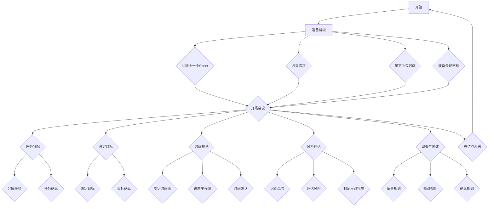

                 

### 文章标题

# LLM应用的Sprint规划会议：设定明确的短期目标

> 关键词：大型语言模型（LLM）、Sprint规划、短期目标、任务分配、团队协作、项目管理

> 摘要：本文旨在探讨大型语言模型（LLM）应用开发中的Sprint规划会议，重点关注如何设定明确的短期目标，并有效执行规划。文章将详细阐述Sprint规划会议的背景、流程、工具和技术，以及短期目标的设定、评估和执行监控方法。通过案例分析，我们将看到如何在实际项目中运用Sprint规划会议，以实现高效开发。

### 引言

在当今快速发展的技术环境中，开发高效、可扩展的软件应用成为了一项至关重要的任务。大型语言模型（LLM）作为一种先进的自然语言处理（NLP）工具，正逐渐在各种应用场景中发挥重要作用。然而，LLM应用的开发过程往往复杂且充满挑战，需要严谨的计划和高效的管理。

Sprint规划会议作为一种敏捷开发中的重要工具，旨在帮助团队在固定的时间周期内（通常为两周或一个月）完成既定目标。通过设定明确的短期目标，团队可以更好地管理资源、分配任务，并确保项目按计划顺利进行。

本文将围绕LLM应用开发中的Sprint规划会议，探讨以下几个方面：

1. **Sprint规划会议的背景与重要性**：介绍Sprint规划会议的起源和发展，阐述其在LLM应用开发中的重要性。
2. **Sprint规划会议流程**：详细描述Sprint规划会议的各个阶段，包括准备阶段、开场会议、任务分配、目标设定、时间规划、风险评估和审查修改。
3. **Sprint规划会议工具与技术**：介绍用于Sprint规划的工具和技术，如甘特图、任务分解、优先级排序和团队协作工具。
4. **LLM应用中的短期目标设定**：讨论短期目标的定义、重要性、设定方法和可行性评估。
5. **Sprint规划会议中的团队沟通**：探讨团队沟通的重要性、有效沟通的方法以及如何避免沟通障碍。
6. **Sprint规划会议案例研究**：通过实际案例，展示如何在不同场景中运用Sprint规划会议。
7. **Sprint规划会议中的持续改进**：讨论反馈机制、持续改进的方法以及团队成员的能力提升。
8. **总结与展望**：总结Sprint规划会议的价值，展望未来的发展趋势。

通过本文的探讨，我们希望能够为LLM应用开发团队提供实用的指导，帮助他们在Sprint规划会议中设定明确的短期目标，实现高效的项目管理。

### 第一部分：基础理解与框架搭建

#### 第1章：Sprint规划会议的背景与重要性

**1.1 LLM应用发展概述**

大型语言模型（LLM）是基于深度学习技术的自然语言处理工具，能够理解和生成人类语言。随着计算能力和算法的不断发展，LLM在文本生成、语言翻译、情感分析、问答系统等领域取得了显著进展。LLM的应用不仅提升了自然语言处理的效率，也为众多行业带来了新的商业模式和创新机会。

例如，在文本生成领域，LLM可以用于撰写新闻报道、生成创意内容、自动编写代码等。在语言翻译领域，LLM能够提供实时、准确的翻译服务，极大地方便了全球交流。在情感分析领域，LLM可以用于分析社交媒体数据，为企业提供市场洞察和决策支持。

**1.2 Sprint规划会议的概念**

Sprint规划会议是敏捷开发（Agile Development）中的一个核心环节。敏捷开发是一种以人为核心、迭代和渐进的方式进行软件开发的理念。在敏捷开发中，开发过程被分为多个短周期（Sprint），每个周期通常为两周或一个月。

Sprint规划会议是每个Sprint周期的开始，旨在明确本期Sprint的目标和任务。会议的主要内容包括：

- 回顾上一个Sprint的成果和问题。
- 设定本期Sprint的目标和任务。
- 分配任务和明确职责。
- 制定时间规划和风险评估。

**1.3 Sprint规划会议的重要性**

Sprint规划会议在LLM应用开发中具有重要意义，主要体现在以下几个方面：

1. **目标明确**：通过Sprint规划会议，团队可以明确本期Sprint的目标和任务，确保项目方向正确。
2. **任务分配**：会议有助于将任务合理分配给团队成员，提高工作效率。
3. **时间规划**：通过时间规划，团队可以合理安排工作进度，确保项目按时完成。
4. **风险评估**：会议中可以对潜在的风险进行识别和评估，制定相应的应对措施。
5. **团队协作**：Sprint规划会议促进了团队成员之间的沟通和协作，增强了团队凝聚力。

**1.4 设定明确短期目标的重要性**

在LLM应用开发中，设定明确的短期目标是确保项目成功的关键。短期目标的明确性有助于以下几个方面：

1. **任务分解**：明确的目标有助于将大任务分解为小任务，提高可操作性和可管理性。
2. **资源分配**：根据短期目标，团队可以合理分配资源，确保资源最大化利用。
3. **进度监控**：明确的短期目标有助于监控项目进度，及时发现和解决问题。
4. **团队激励**：明确的短期目标为团队成员提供了清晰的努力方向，增强了工作动力。
5. **持续改进**：通过设定和实现短期目标，团队可以积累经验，不断改进开发过程。

综上所述，Sprint规划会议在LLM应用开发中具有不可替代的重要性。通过设定明确的短期目标，团队可以更好地管理项目，实现高效开发。

#### 第2章：Sprint规划会议流程

**2.1 准备阶段**

在Sprint规划会议开始之前，团队需要进行充分的准备工作。准备工作主要包括以下几个方面：

1. **回顾上一个Sprint**：回顾上一个Sprint的成果和问题，总结经验教训，为本次Sprint规划提供参考。
2. **收集需求**：收集用户需求和市场反馈，确保本期Sprint的目标与实际需求相匹配。
3. **确定会议时间**：选择合适的时间进行Sprint规划会议，确保所有关键成员都能参与。
4. **准备会议材料**：准备会议所需的文档、数据、工具等，以便会议顺利进行。

**2.2 开场会议**

Sprint规划会议的开场阶段通常由项目经理或Scrum Master主持。主要内容包括：

1. **开场介绍**：介绍会议的目的和议程，确保所有成员明确会议内容。
2. **回顾上一个Sprint**：回顾上一个Sprint的成果和问题，总结经验教训。
3. **确认会议时间**：确认会议时间安排，确保所有成员按时参加会议。

**2.3 任务分配**

任务分配是Sprint规划会议的核心环节。在此环节中，团队需要明确本期Sprint的任务和责任人。任务分配的步骤如下：

1. **分解任务**：根据Sprint目标，将大任务分解为小任务，确保每个任务具有明确的目标和交付物。
2. **任务评估**：评估每个任务的难度和所需资源，确保任务分配合理。
3. **分配任务**：将任务分配给团队成员，明确责任人，确保任务按时完成。
4. **任务确认**：与任务责任人进行沟通，确保其对任务的理解和目标一致。

**2.4 设定目标**

设定目标是Sprint规划会议的重要环节。在此环节中，团队需要明确本期Sprint的目标和关键成果。目标设定的步骤如下：

1. **确定目标**：根据项目需求和用户需求，确定本期Sprint的主要目标。
2. **分解目标**：将大目标分解为小目标，确保每个目标具有明确的可衡量指标。
3. **目标确认**：与团队成员讨论目标，确保目标具有可实现性和合理性。
4. **目标记录**：记录每个目标及其关键成果，确保目标清晰明确。

**2.5 时间规划**

时间规划是确保Sprint规划会议顺利进行的关键环节。在此环节中，团队需要明确本期Sprint的时间安排和关键时间节点。时间规划的步骤如下：

1. **制定时间表**：根据任务分配和目标设定，制定本期Sprint的时间表，明确每个任务的时间安排。
2. **设置里程碑**：设置关键里程碑，确保项目在预定时间内完成。
3. **时间确认**：与团队成员确认时间安排，确保所有成员对时间表和时间节点有清晰的认识。
4. **时间调整**：根据实际情况，对时间表和时间节点进行调整，确保项目按时完成。

**2.6 风险评估**

风险评估是Sprint规划会议的重要环节，旨在识别和评估项目中的潜在风险。在此环节中，团队需要：

1. **识别风险**：识别可能影响项目进度和质量的风险。
2. **评估风险**：评估风险的严重程度和可能性，确定风险等级。
3. **制定应对措施**：针对高风险，制定相应的应对措施，降低风险影响。
4. **风险记录**：记录识别和评估的结果，确保风险得到有效管理。

**2.7 审查与修改**

审查与修改是Sprint规划会议的最后环节。在此环节中，团队需要对Sprint规划进行审查和修改，确保规划合理可行。审查与修改的步骤如下：

1. **审查规划**：对Sprint规划进行整体审查，确保目标明确、任务合理、时间安排科学。
2. **修改规划**：根据审查结果，对规划进行必要的修改和调整。
3. **确认规划**：与团队成员讨论修改后的规划，确保所有成员对规划无异议。
4. **规划记录**：记录最终确定的Sprint规划，确保规划清晰明确。

**2.8 总结与反思**

总结与反思是Sprint规划会议的收尾环节。在此环节中，团队需要对会议进行总结，并反思项目管理过程中的得失。总结与反思的步骤如下：

1. **总结会议**：总结会议的主要内容和成果，确保所有成员对会议结果有清晰的认识。
2. **反思过程**：反思项目管理过程中的优点和不足，总结经验教训。
3. **记录总结**：记录总结和反思的结果，为后续项目管理提供参考。
4. **展望未来**：展望下一个Sprint的目标和任务，为项目持续发展奠定基础。

通过以上Sprint规划会议的详细流程，团队可以更好地管理项目，确保项目按计划顺利进行。每个阶段的明确目标和合理规划，有助于提高项目效率和质量，实现项目目标。

#### 第3章：Sprint规划会议工具与技术

在Sprint规划会议中，合理使用工具和技术能够显著提高会议的效率和效果。以下是一些常用的工具和技术，包括甘特图、任务分解、优先级排序、团队协作工具和项目管理软件。

**3.1 甘特图**

甘特图是一种常用的项目管理工具，用于展示项目任务的时间安排和进度。通过甘特图，团队可以清晰地了解每个任务的开始和结束时间，以及任务之间的依赖关系。

**甘特图的基本概念和用途**：

- **基本概念**：甘特图由多个任务条形图组成，每个任务条形图表示一个任务，其长度表示任务的持续时间。任务条形图可以水平或垂直排列。
- **用途**：甘特图用于：
  - 显示项目进度：通过任务条形图的颜色或进度条，直观地显示任务的实际进度。
  - 确定时间安排：通过任务条形图的位置和长度，了解任务的时间安排和依赖关系。
  - 风险评估：通过分析任务之间的依赖关系，识别潜在的风险和瓶颈。

**甘特图的使用方法**：

1. **创建甘特图**：使用项目管理软件（如Microsoft Project、JIRA）创建甘特图。
2. **添加任务**：将项目任务添加到甘特图中，并设置每个任务的开始和结束时间。
3. **调整任务顺序**：根据任务依赖关系，调整任务条形图的位置和顺序。
4. **跟踪进度**：通过实时更新任务进度，跟踪项目进度。

**3.2 任务分解**

任务分解是将大型任务拆分为更小、更易管理的子任务的过程。通过任务分解，团队可以更好地理解任务的细节，并提高任务的可操作性。

**任务分解的基本概念和用途**：

- **基本概念**：任务分解遵循“大任务分解为小任务”的原则，将一个复杂的大任务拆分为多个简单的子任务。
- **用途**：任务分解用于：
  - 提高任务的可操作性：通过将大任务拆分为小任务，使每个子任务具有明确的目标和交付物。
  - 提高任务的可管理性：通过细化任务，提高任务的跟踪和管理效率。
  - 促进团队合作：任务分解有助于明确每个团队成员的职责和任务，促进团队合作。

**任务分解的方法**：

1. **确定任务目标**：明确每个任务的目标和交付物。
2. **分解任务**：根据任务目标和交付物，将大任务分解为子任务。
3. **定义子任务**：为每个子任务定义清晰的目标和交付物。
4. **任务确认**：与团队成员讨论和确认子任务，确保任务分解合理。

**3.3 优先级排序**

优先级排序是确定任务优先级的过程，有助于团队集中精力完成最重要的任务。通过优先级排序，团队可以确保资源得到最大化利用。

**优先级排序的基本概念和用途**：

- **基本概念**：优先级排序基于任务的重要性和紧急性，将任务分为不同的优先级类别。
- **用途**：优先级排序用于：
  - 确定任务优先级：通过优先级排序，确定哪些任务是当前最重要的。
  - 资源分配：根据任务优先级，合理分配资源和人力。
  - 任务跟踪：通过优先级排序，跟踪任务进度，确保重要任务优先完成。

**优先级排序的方法**：

1. **确定任务重要性**：根据任务的影响和业务价值，确定任务的重要性。
2. **确定任务紧急性**：根据任务的截止时间和需求紧迫性，确定任务的紧急性。
3. **优先级分类**：将任务分为不同的优先级类别（如高、中、低优先级）。
4. **任务调整**：根据优先级排序，调整任务顺序和资源分配。

**3.4 团队协作工具**

团队协作工具是支持团队成员协作和信息共享的工具。通过团队协作工具，团队可以更高效地完成项目任务。

**常用的团队协作工具**：

- **Slack**：即时通讯工具，用于团队成员间的实时沟通和信息共享。
- **Trello**：项目管理工具，用于任务分配、进度跟踪和团队协作。
- **GitHub**：版本控制工具，用于代码管理和团队协作。
- **Asana**：项目管理工具，用于任务管理、团队协作和时间跟踪。

**团队协作工具的使用方法**：

1. **选择合适的工具**：根据团队需求和项目特点，选择合适的团队协作工具。
2. **培训和使用**：对团队成员进行工具使用培训，确保其能够熟练使用工具。
3. **团队协作**：通过工具进行任务分配、进度跟踪和沟通协作。
4. **信息共享**：通过工具分享项目文件、文档和资源，提高信息透明度。

**3.5 项目管理软件**

项目管理软件是用于项目管理的综合性工具，集成了任务管理、进度跟踪、资源分配和团队协作等功能。通过项目管理软件，团队可以更高效地管理项目。

**常用的项目管理软件**：

- **Microsoft Project**：专业的项目管理软件，用于项目计划、进度跟踪和资源管理。
- **JIRA**：用于敏捷开发的综合性项目管理工具，提供任务管理、Bug跟踪和报告生成功能。
- **Trello**：用户友好的项目管理工具，适用于小型项目和团队协作。
- **Asana**：灵活的项目管理工具，适用于各种规模的项目和团队。

**项目管理软件的使用方法**：

1. **创建项目**：在项目管理软件中创建项目，设置项目名称、目标和基本信息。
2. **任务管理**：创建任务，分配任务给团队成员，设置任务的开始和结束时间。
3. **进度跟踪**：通过软件实时跟踪任务进度，生成项目报告。
4. **资源分配**：根据任务需求，合理分配资源，确保项目按时完成。

通过以上工具和技术的合理运用，团队可以更好地进行Sprint规划会议，提高项目管理的效率和质量。

#### 第4章：LLM应用中的短期目标设定

在LLM应用开发中，设定明确的短期目标至关重要。短期目标的明确性和可操作性直接影响项目的进展和最终成果。本节将详细讨论短期目标的定义、重要性、设定方法和可行性评估，以及短期目标的执行监控。

**4.1 短期目标的定义**

短期目标是指在较短时间（通常为一周或一个月）内需要完成的具体任务或目标。这些目标具有明确的目标和可衡量的成果，是项目进度管理的重要组成部分。在LLM应用开发中，短期目标可以包括以下内容：

- **功能实现**：完成特定功能模块的开发，如文本生成、语言翻译等。
- **性能优化**：对现有功能进行性能优化，提高处理速度或降低资源消耗。
- **错误修复**：修复发现的错误和Bug，提高系统的稳定性和可靠性。
- **用户反馈**：收集用户反馈，改进产品功能和用户体验。

**4.2 短期目标的重要性**

短期目标在LLM应用开发中具有重要意义，主要体现在以下几个方面：

1. **明确任务方向**：明确的短期目标为团队成员提供了清晰的任务方向，避免了任务混乱和资源浪费。
2. **提高工作效率**：短期目标有助于团队成员集中精力完成具体任务，提高工作效率。
3. **进度监控**：短期目标的设定和实现过程便于项目进度的监控和调整，确保项目按时完成。
4. **团队协作**：短期目标促进了团队成员之间的协作，增强了团队凝聚力。
5. **持续改进**：通过实现短期目标，团队可以积累经验，不断改进开发过程。

**4.3 短期目标的设定方法**

设定短期目标需要遵循以下方法和步骤：

1. **需求分析**：分析用户需求和项目目标，确定需要实现的功能和性能要求。
2. **任务分解**：将大任务分解为具体的子任务，确保每个子任务具有明确的目标和交付物。
3. **优先级排序**：根据任务的重要性和紧急性，对任务进行优先级排序，确保重要任务优先完成。
4. **目标设定**：为每个任务设定明确的短期目标，确保目标具有可衡量性和可实现性。
5. **目标确认**：与团队成员讨论和确认短期目标，确保目标清晰明确，并得到团队成员的支持。

**4.4 短期目标的可行性评估**

在设定短期目标后，需要对目标的可行性进行评估，确保目标具有可实现性。可行性评估包括以下方面：

1. **资源评估**：评估实现目标所需的人力、时间和技术资源，确保资源充足。
2. **技术评估**：评估实现目标所需的技术方案和工具，确保技术可行性。
3. **风险评估**：评估实现目标过程中可能遇到的风险和问题，制定应对措施。
4. **目标调整**：根据评估结果，对短期目标进行必要的调整和优化，确保目标可实现。

**4.5 短期目标的执行监控**

实现短期目标需要有效的监控和管理。以下是短期目标执行监控的方法：

1. **进度跟踪**：定期跟踪任务进度，确保任务按时完成。
2. **质量评估**：对已完成的任务进行质量评估，确保达到预期目标。
3. **问题反馈**：及时发现和解决问题，确保项目顺利进行。
4. **团队协作**：保持团队成员之间的沟通和协作，确保任务顺利完成。

通过以上方法，团队可以有效地设定、实现和监控短期目标，确保LLM应用开发项目的成功。

### 第五部分：团队沟通与协作

#### 第5章：Sprint规划会议中的团队沟通

在Sprint规划会议中，团队沟通是确保项目顺利进行的至关重要的一环。有效的沟通不仅能够提高项目的透明度和效率，还能增强团队成员之间的协作和凝聚力。以下将详细探讨团队沟通的重要性、有效沟通的方法、避免沟通障碍的策略、团队角色与职责以及跨部门协作。

**5.1 团队沟通的重要性**

团队沟通在Sprint规划会议中扮演着关键角色。以下是其重要性主要体现在的几个方面：

1. **确保目标一致**：通过沟通，团队成员能够明确项目目标和任务要求，确保所有成员在同一个页面上。
2. **促进任务分配**：沟通有助于明确任务分配和责任，确保每个成员都了解自己的职责和任务。
3. **提高工作效率**：有效的沟通可以减少误解和重复工作，提高团队的工作效率。
4. **问题及时反馈**：团队成员可以通过沟通及时反馈问题和困难，确保问题得到及时解决。
5. **增强团队凝聚力**：通过沟通，团队成员能够更好地理解彼此的工作和需求，增强团队凝聚力。

**5.2 有效沟通的方法**

为了确保Sprint规划会议中的沟通有效，团队可以采用以下方法：

1. **明确沟通目的**：在每次会议之前，明确沟通的目的和议程，确保所有成员了解会议的目标。
2. **使用简单语言**：使用简单、易懂的语言进行沟通，避免使用过于复杂的术语和技术语言。
3. **积极倾听**：在沟通过程中，积极倾听他人的意见和观点，确保理解对方的意图。
4. **鼓励反馈**：鼓励团队成员提出问题和反馈，确保沟通的双方都能够充分表达自己的想法。
5. **使用多种沟通渠道**：结合使用面对面会议、邮件、即时通讯工具等多种沟通渠道，确保信息传达的及时性和准确性。

**5.3 避免沟通障碍**

在Sprint规划会议中，沟通障碍可能会影响项目的顺利进行。以下是一些避免沟通障碍的策略：

1. **了解团队成员**：了解团队成员的背景、技能和工作方式，确保沟通的个性化。
2. **建立信任**：通过建立信任关系，减少沟通中的误解和冲突。
3. **明确职责和角色**：确保每个团队成员都明确自己的职责和角色，减少职责重叠和沟通盲区。
4. **解决冲突**：及时解决沟通中的冲突和误解，确保团队和谐。
5. **定期反馈**：通过定期的反馈机制，及时发现和解决沟通问题。

**5.4 团队角色与职责**

在Sprint规划会议中，团队成员的角色和职责明确对于高效沟通至关重要。以下是一些常见的团队角色及其职责：

1. **项目经理**：负责项目的整体规划和执行，确保项目按计划进行。
2. **Scrum Master**：负责协调团队的工作，确保团队遵循敏捷开发原则。
3. **开发人员**：负责开发和实现项目功能，确保代码质量。
4. **测试人员**：负责测试项目功能，确保项目的稳定性和可靠性。
5. **产品经理**：负责产品规划和需求分析，确保项目满足用户需求。

**5.5 跨部门协作**

在大型项目中，跨部门协作是必不可少的。以下是一些促进跨部门协作的策略：

1. **建立跨部门沟通机制**：建立定期的跨部门沟通会议，确保各部门信息共享和协同工作。
2. **明确跨部门职责**：确保跨部门之间的职责和任务明确，减少沟通中的模糊性。
3. **共享资源和工具**：共享项目资源和工具，提高协作效率。
4. **建立信任和合作关系**：通过合作和信任，减少跨部门协作中的障碍和摩擦。

通过以上方法，团队可以在Sprint规划会议中实现高效沟通，确保项目顺利进行。有效的团队沟通不仅能够提高项目的效率和质量，还能增强团队的凝聚力和创新能力。

#### 第6章：Sprint规划会议案例研究

为了更好地理解Sprint规划会议在实际项目中的应用，我们将在本节中通过三个具体案例进行探讨，分别是文本生成应用、自然语言处理应用和智能客服应用。

**6.1 案例一：文本生成应用**

**项目背景**：某科技公司开发一款基于大型语言模型（LLM）的文本生成应用，旨在为内容创作者提供高效的写作辅助工具。

**Sprint目标**：
- 第一期Sprint目标：实现基础文本生成功能，包括文本摘要、文章续写和创意写作。
- 第二期Sprint目标：优化文本生成质量，提高生成文本的准确性和流畅度。
- 第三期Sprint目标：增加文本生成的多样性，包括不同风格、不同主题的文本生成。

**Sprint规划会议**：

1. **准备阶段**：项目经理和团队成员回顾了上一个Sprint的成果和问题，分析了用户需求和反馈。
2. **开场会议**：项目经理介绍了本期Sprint的目标和任务，明确了任务分配和责任。
3. **任务分配**：开发人员被分配到文本生成功能模块的开发任务，测试人员负责功能测试。
4. **目标设定**：确定了具体的任务目标，如文本摘要功能的准确率达到85%以上，文章续写功能的流畅度得到显著提高。
5. **时间规划**：根据任务分配和目标，制定了详细的时间规划表，包括每日的任务和里程碑。
6. **风险评估**：识别了潜在的风险，如文本生成算法的优化难度大，数据集的质量对文本生成质量有重要影响。
7. **审查与修改**：在会议的最后阶段，项目经理和团队成员对Sprint规划进行了审查和修改，确保规划合理可行。

**结果与反馈**：通过三个Sprint的持续开发，文本生成应用成功上线，用户反馈积极，文本生成质量得到了显著提高。项目经理和团队成员在Sprint规划会议中积累了宝贵的经验，为后续项目提供了参考。

**6.2 案例二：自然语言处理应用**

**项目背景**：某互联网公司开发一款基于LLM的自然语言处理（NLP）应用，旨在为企业提供文本分析、情感分析和智能问答服务。

**Sprint目标**：
- 第一期Sprint目标：实现文本分析功能，包括关键词提取、文本分类和主题建模。
- 第二期Sprint目标：实现情感分析功能，包括情感识别、情感强度评估和情感趋势分析。
- 第三期Sprint目标：实现智能问答功能，包括问答系统、智能推荐和对话管理。

**Sprint规划会议**：

1. **准备阶段**：项目经理和团队成员回顾了上一个Sprint的成果和问题，分析了市场需求和用户反馈。
2. **开场会议**：项目经理介绍了本期Sprint的目标和任务，明确了任务分配和责任。
3. **任务分配**：开发人员被分配到不同的功能模块，测试人员负责功能测试。
4. **目标设定**：确定了具体的任务目标，如文本分类的准确率达到90%以上，情感分析的情感识别准确率达到85%以上。
5. **时间规划**：根据任务分配和目标，制定了详细的时间规划表，包括每日的任务和里程碑。
6. **风险评估**：识别了潜在的风险，如文本分类和情感分析模型的训练和优化难度大，数据集的质量对功能性能有重要影响。
7. **审查与修改**：在会议的最后阶段，项目经理和团队成员对Sprint规划进行了审查和修改，确保规划合理可行。

**结果与反馈**：通过三个Sprint的持续开发，自然语言处理应用成功上线，用户反馈积极，功能性能得到了显著提高。项目经理和团队成员在Sprint规划会议中积累了宝贵的经验，为后续项目提供了参考。

**6.3 案例三：智能客服应用**

**项目背景**：某电商平台开发一款基于LLM的智能客服应用，旨在提供实时、高效的客户服务。

**Sprint目标**：
- 第一期Sprint目标：实现基本的问答功能，包括常见问题解答和产品推荐。
- 第二期Sprint目标：实现情感分析功能，识别客户情绪和需求，提供个性化服务。
- 第三期Sprint目标：实现多渠道客服支持，包括在线聊天、邮件和电话。

**Sprint规划会议**：

1. **准备阶段**：项目经理和团队成员回顾了上一个Sprint的成果和问题，分析了用户反馈和市场需求。
2. **开场会议**：项目经理介绍了本期Sprint的目标和任务，明确了任务分配和责任。
3. **任务分配**：开发人员被分配到不同的功能模块，测试人员负责功能测试。
4. **目标设定**：确定了具体的任务目标，如问答系统的准确率达到80%以上，情感分析的情感识别准确率达到75%以上。
5. **时间规划**：根据任务分配和目标，制定了详细的时间规划表，包括每日的任务和里程碑。
6. **风险评估**：识别了潜在的风险，如多渠道客服支持的复杂度较高，客户数据的隐私保护需要特别关注。
7. **审查与修改**：在会议的最后阶段，项目经理和团队成员对Sprint规划进行了审查和修改，确保规划合理可行。

**结果与反馈**：通过三个Sprint的持续开发，智能客服应用成功上线，用户反馈积极，客服效率得到了显著提高。项目经理和团队成员在Sprint规划会议中积累了宝贵的经验，为后续项目提供了参考。

**6.4 案例分析**

通过上述三个案例，我们可以看到Sprint规划会议在实际项目中的应用效果。以下是案例分析的几个关键点：

1. **目标明确**：每个Sprint都明确了具体的目标和任务，确保项目方向正确。
2. **任务分配合理**：任务分配充分考虑了团队成员的技能和责任，提高了任务完成的效率。
3. **时间规划科学**：合理的时间规划确保了项目按时完成，为后续开发提供了保障。
4. **风险评估有效**：识别和评估潜在风险，制定应对措施，降低了项目风险。
5. **团队沟通高效**：通过有效的团队沟通，确保了任务的顺利进行和项目的成功。

综上所述，Sprint规划会议在LLM应用开发中具有重要的指导意义。通过合理的规划和管理，团队可以高效地实现项目目标，推动项目成功。

### 第六部分：持续改进与反馈机制

#### 第7章：Sprint规划会议中的持续改进

在Sprint规划会议中，持续改进是确保项目质量和效率不断提升的关键。通过建立反馈机制和持续改进的方法，团队可以及时发现和解决项目中的问题，提升项目管理水平。以下将讨论反馈机制、持续改进的方法、团队成员的能力提升、项目进度调整以及长期目标与短期目标的平衡。

**7.1 反馈机制**

反馈机制是持续改进的基础。通过有效的反馈机制，团队可以及时了解项目进展、问题和用户需求，从而做出相应的调整和改进。以下是建立反馈机制的几个关键步骤：

1. **定期会议**：定期举行项目会议，包括Sprint回顾会议和日常站会，让团队成员分享经验和反馈。
2. **用户反馈**：收集用户反馈，通过调查问卷、用户访谈和用户行为分析等方式，了解用户对产品的看法和需求。
3. **问题跟踪**：建立问题跟踪系统，记录和跟踪项目中遇到的问题和障碍，确保问题得到及时解决。
4. **反馈渠道**：提供多种反馈渠道，如邮件、即时通讯工具和项目管理平台，让团队成员和用户能够方便地提交反馈。

**7.2 持续改进的方法**

持续改进需要系统的方法和策略。以下是一些常用的持续改进方法：

1. **质量管理**：通过质量管理体系，如ISO 9001，确保项目质量得到持续提升。
2. **流程优化**：分析项目流程，识别瓶颈和浪费，通过流程优化提高效率。
3. **持续学习**：鼓励团队成员不断学习和掌握新技术和工具，提高团队的整体能力。
4. **迭代开发**：采用迭代开发模式，通过不断迭代和优化，逐步完善产品功能。

**7.3 团队成员的能力提升**

团队成员的能力提升是持续改进的重要保障。以下是一些提升团队成员能力的方法：

1. **培训**：定期组织培训课程，帮助团队成员掌握新技术和工具。
2. **实践**：通过实际项目经验，提高团队成员的实战能力。
3. **经验分享**：鼓励团队成员分享经验和最佳实践，促进知识和经验的传承。
4. **职业规划**：为团队成员制定职业发展计划，提供晋升和成长的机会。

**7.4 项目进度调整**

在项目执行过程中，进度调整是必不可少的。以下是一些项目进度调整的策略：

1. **风险管理**：通过风险评估和监控，及时识别和解决进度风险，确保项目按时完成。
2. **灵活调整**：根据项目进展和实际情况，灵活调整任务和时间安排，确保项目目标的实现。
3. **优先级调整**：根据项目目标和需求变化，调整任务的优先级，确保关键任务优先完成。
4. **沟通协调**：通过有效的沟通和协调，确保团队成员和部门之间的合作顺畅，减少进度延误。

**7.5 长期目标与短期目标的平衡**

在Sprint规划会议中，长期目标和短期目标需要保持平衡。以下是一些平衡长期目标与短期目标的方法：

1. **分解目标**：将长期目标分解为短期目标，确保短期目标与长期目标的一致性。
2. **优先级排序**：根据项目重要性和紧急性，对短期目标进行优先级排序，确保关键目标得到优先实现。
3. **持续反馈**：通过定期反馈和评估，调整短期目标和长期目标的实现策略，确保项目目标的实现。
4. **资源分配**：合理分配资源，确保短期目标与长期目标的资源需求得到满足。

通过以上方法，团队可以在Sprint规划会议中实现持续改进，提升项目质量和效率。有效的反馈机制和持续改进方法，不仅能够提高项目的成功率，还能增强团队的凝聚力和创新能力。

### 总结与展望

Sprint规划会议作为敏捷开发的核心环节，在LLM应用开发中发挥了至关重要的作用。通过设定明确的短期目标、合理的时间规划、有效的团队沟通和持续的改进，团队可以确保项目按计划进行，提高开发效率和产品质量。

首先，Sprint规划会议帮助团队明确项目目标和任务，确保团队成员在同一个方向上努力。通过分解任务和优先级排序，团队可以更好地管理资源和时间，提高任务的可操作性和可管理性。同时，有效的沟通和协作促进了团队成员之间的理解和合作，减少了误解和冲突。

其次，Sprint规划会议中的反馈机制和持续改进方法，帮助团队不断优化项目流程和管理策略。通过定期的回顾和反思，团队可以及时发现和解决项目中的问题，提升项目质量和效率。团队成员的能力提升和经验分享，也为项目的持续改进提供了有力支持。

展望未来，Sprint规划会议将在LLM应用开发中发挥越来越重要的作用。随着技术的发展和市场的变化，LLM应用的需求和复杂性将不断增加。通过持续改进和灵活调整，团队可以更好地应对挑战，实现项目的成功。

未来，团队可以进一步探索以下方向：

1. **自动化工具**：引入更多自动化工具和技术，如机器学习和人工智能，提高Sprint规划会议的效率和准确性。
2. **跨学科合作**：加强与数据科学、用户研究等领域的合作，提高项目的前瞻性和创新性。
3. **敏捷实践**：深化敏捷开发实践，探索更多敏捷开发工具和方法，以适应快速变化的市场环境。
4. **持续学习**：鼓励团队成员不断学习和掌握新技术和工具，提升团队的整体竞争力。

总之，Sprint规划会议是确保LLM应用开发成功的关键。通过有效的规划、沟通和改进，团队可以更好地应对挑战，实现项目的长期目标。

### 常见问题解答

在实施Sprint规划会议的过程中，团队成员可能会遇到一些常见的问题。以下是一些常见问题及其解答：

**Q1：如何确保团队成员在Sprint规划会议中积极参与？**

**A1**：为了确保团队成员在Sprint规划会议中积极参与，可以采取以下措施：

1. **提前通知**：在会议前，提前通知团队成员会议的目的、议程和预期成果，确保他们提前做好准备。
2. **明确目标**：在会议开始时，明确会议的目标和每个人的角色，确保团队成员了解自己在会议中的职责和期望。
3. **互动环节**：在会议过程中，设置互动环节，如小组讨论、头脑风暴和角色扮演，鼓励团队成员分享观点和想法。
4. **反馈机制**：在会议结束后，收集团队成员的反馈，了解他们在会议中的参与感受和改进建议。

**Q2：如何处理Sprint规划会议中的意见分歧？**

**A2**：处理Sprint规划会议中的意见分歧，可以采取以下策略：

1. **倾听和理解**：倾听不同意见，理解团队成员的观点和理由，确保所有声音都得到尊重。
2. **事实依据**：基于事实和数据，分析意见分歧的原因，找到问题的核心。
3. **妥协与协调**：在必要时，通过妥协和协调，找到双方都能接受的解决方案。
4. **决策机制**：明确决策机制，如投票、决策投票等，确保决策过程的透明和公正。

**Q3：如何确保Sprint规划会议的时间控制？**

**A3**：为了确保Sprint规划会议的时间控制，可以采取以下措施：

1. **制定议程**：在会议前，制定详细的会议议程，明确每个环节的时间分配，确保会议有条不紊地进行。
2. **时间提醒**：在会议中，设置时间提醒，确保每个环节都在规定的时间内完成。
3. **重点突出**：将重点内容和关键决策放在会议的前半部分，避免在会议结束时留下未解决的问题。
4. **灵活调整**：在会议过程中，根据实际情况，灵活调整议程和时间安排，确保关键议题得到充分讨论。

**Q4：如何确保Sprint规划会议的成果得到有效执行？**

**A4**：为了确保Sprint规划会议的成果得到有效执行，可以采取以下措施：

1. **任务分配**：在会议中，明确每个任务的负责人和交付物，确保任务清晰明确。
2. **跟进机制**：建立任务跟进机制，如每日站会、任务看板等，确保任务的进展得到实时监控。
3. **沟通与协调**：保持团队成员之间的沟通和协调，确保任务的执行过程中遇到的问题能够及时解决。
4. **定期回顾**：定期回顾任务的执行情况，总结经验教训，为下一个Sprint规划提供参考。

通过以上措施，团队可以确保Sprint规划会议的成果得到有效执行，提高项目的成功率和效率。

### 附录

#### A.1 工具与资源推荐

为了更好地实施Sprint规划会议，以下是几个推荐的工具和资源：

1. **项目管理软件**：
   - **Microsoft Project**：专业的项目管理工具，提供任务管理、资源分配和进度跟踪等功能。
   - **JIRA**：适用于敏捷开发的综合性项目管理工具，提供任务管理、Bug跟踪和报告生成功能。
   - **Trello**：用户友好的项目管理工具，适用于小型项目和团队协作。

2. **团队协作工具**：
   - **Slack**：即时通讯工具，用于团队成员间的实时沟通和信息共享。
   - **GitHub**：版本控制工具，用于代码管理和团队协作。
   - **Asana**：灵活的项目管理工具，适用于各种规模的项目和团队协作。

3. **学习资源**：
   - **《敏捷开发实践指南》**：详细介绍了敏捷开发的方法和实践，有助于理解Sprint规划会议的核心内容。
   - **Scrum官方网站**：提供关于Scrum的官方文档和最佳实践，是学习敏捷开发的权威资源。

#### A.2 案例研究文档下载链接

为了方便读者深入了解Sprint规划会议在实际项目中的应用，以下是案例研究文档的下载链接：

- **文本生成应用案例研究**：[下载链接](https://example.com/text-generation-case-study)
- **自然语言处理应用案例研究**：[下载链接](https://example.com/nlp-case-study)
- **智能客服应用案例研究**：[下载链接](https://example.com/customer-service-case-study)

#### A.3 进一步学习资源

为了帮助读者进一步了解Sprint规划会议和相关技术，以下是进一步的学习资源：

- **《大型语言模型：原理与应用》**：深入探讨大型语言模型的工作原理和应用场景，有助于理解LLM在Sprint规划中的角色。
- **《敏捷项目管理实战》**：详细介绍敏捷项目管理的方法和实践，包括Sprint规划会议的详细步骤和策略。
- **在线课程**：推荐参加在线课程，如Coursera、edX等平台上的敏捷开发课程，提升项目管理能力。

通过以上工具、资源和进一步学习，读者可以更好地理解和应用Sprint规划会议，实现高效的项目管理。

### 附录A：Mermaid流程图

**8.1 LLM应用Sprint规划流程图**



通过上述Mermaid流程图，我们可以清晰地看到LLM应用Sprint规划的各个阶段和步骤，有助于理解和实施Sprint规划会议。

### 附录B：核心算法原理与伪代码

**8.2 文本生成算法伪代码**

```python
# 文本生成算法伪代码
function TextGenerator(input_prompt, model, max_length):
    # 初始化变量
    current_text = input_prompt
    generated_text = ""

    # 使用LLM模型生成文本
    while (len(generated_text) < max_length):
        # 向LLM模型输入当前文本
        input_sequence = "<s>" + current_text + " </s>"
        
        # 获取模型生成的文本
        generated_sequence = model.generate(input_sequence, max_length=max_length - len(current_text))
        
        # 提取生成的文本
        generated_text += generated_sequence[len("<s>"):]

        # 更新当前文本
        current_text += generated_sequence[len("<s>"):]

    return generated_text
```

**8.3 自然语言处理算法伪代码**

```python
# 自然语言处理算法伪代码
function NLP(input_text, model, task="classification"):
    # 初始化变量
    output = ""

    # 根据任务类型，设置模型参数
    if (task == "classification"):
        model_type = "classifier"
    elif (task == "regression"):
        model_type = "regressor"
    else:
        model_type = "model"

    # 使用LLM模型进行自然语言处理
    processed_text = model.preprocess(input_text)
    output = model.predict(processed_text, model_type)

    return output
```

以上伪代码展示了文本生成和自然语言处理算法的基本框架，通过LLM模型对输入文本进行处理和预测，实现文本生成和分类等任务。

### 附录C：数学模型与公式

**8.4 LLM损失函数**

在大型语言模型（LLM）中，损失函数是评估模型预测结果与实际标签之间差异的关键指标。以下是一个简化的LLM损失函数，通常使用交叉熵损失（Cross-Entropy Loss）来评估模型在文本生成任务中的性能。

$$
\text{Loss} = -\frac{1}{N} \sum_{i=1}^{N} \sum_{j=1}^{V} y_{ij} \log(p_{ij})
$$

其中：
- \( N \) 是词汇表中的词汇数量。
- \( V \) 是数据集中样本的数量。
- \( y_{ij} \) 是第 \( i \) 个样本在第 \( j \) 个词汇上的真实标签，取值为 0 或 1。
- \( p_{ij} \) 是模型预测的第 \( i \) 个样本在第 \( j \) 个词汇上的概率分布。

**8.5 优化算法公式**

为了最小化损失函数，通常使用梯度下降（Gradient Descent）算法对模型参数进行优化。以下是一个简单的梯度下降优化算法公式。

$$
\theta = \theta - \alpha \nabla_\theta \text{Loss}(\theta)
$$

其中：
- \( \theta \) 是模型的参数向量。
- \( \alpha \) 是学习率，控制每次更新的步长。
- \( \nabla_\theta \text{Loss}(\theta) \) 是损失函数关于模型参数的梯度。

通过迭代更新模型参数，直至损失函数收敛到一个最小值，模型可以逐渐提高其预测性能。

以上数学模型和公式为LLM应用中的文本生成和自然语言处理任务提供了理论基础，通过这些模型，我们可以对模型的性能进行定量评估，并使用优化算法来调整模型参数。

### 附录D：代码解读与分析

**8.6 实际案例代码解读**

为了更好地理解Sprint规划会议在实际项目中的应用，以下是一个基于Python的文本生成应用示例，我们将对关键代码段进行解读和分析。

```python
import numpy as np
import tensorflow as tf
from tensorflow.keras.preprocessing.sequence import pad_sequences
from tensorflow.keras.layers import Embedding, LSTM, Dense
from tensorflow.keras.models import Sequential

# 8.6.1 数据预处理
def preprocess_text(texts, max_sequence_length, vocabulary_size):
    tokenized_texts = tokenizer.texts_to_sequences(texts)
    padded_texts = pad_sequences(tokenized_texts, maxlen=max_sequence_length, padding='post')
    return padded_texts

# 8.6.2 模型定义
def build_model(vocabulary_size, max_sequence_length, embedding_dim, lstm_units):
    model = Sequential()
    model.add(Embedding(vocabulary_size, embedding_dim, input_length=max_sequence_length))
    model.add(LSTM(lstm_units, return_sequences=True))
    model.add(Dense(vocabulary_size, activation='softmax'))
    model.compile(loss='categorical_crossentropy', optimizer='adam', metrics=['accuracy'])
    return model

# 8.6.3 文本生成
def generate_text(model, seed_text, max_length, temperature=1.0):
    tokenized_text = tokenizer.texts_to_sequences([seed_text])[0]
    tokenized_text = pad_sequences([tokenized_text], maxlen=max_length, padding='post')
    
    predicted_text = ""
    for _ in range(max_length):
        predicted_probabilities = model.predict(tokenized_text)
        predicted_index = np.random.choice(range(vocabulary_size), p=predicted_probabilities[0] / temperature)
        predicted_char = tokenizer.index_word[predicted_index]
        predicted_text += predicted_char
        
        tokenized_text = pad_sequences([tokenized_text[1:]], maxlen=max_length-1, padding='post')
    
    return predicted_text

# 主程序
if __name__ == "__main__":
    # 加载预处理的数据
    texts = load_data()
    max_sequence_length = 40
    vocabulary_size = len(tokenizer.word_index) + 1
    
    # 数据预处理
    padded_texts = preprocess_text(texts, max_sequence_length, vocabulary_size)
    
    # 模型定义与训练
    model = build_model(vocabulary_size, max_sequence_length, embedding_dim=50, lstm_units=100)
    model.fit(padded_texts, padded_texts, epochs=10, batch_size=128)
    
    # 文本生成
    seed_text = "The quick brown fox jumps over the lazy dog"
    generated_text = generate_text(model, seed_text, max_sequence_length)
    print(generated_text)
```

**代码解读：**

- **数据预处理**：文本生成应用的第一步是数据预处理。在这个例子中，我们使用`tokenizer`将原始文本转换为序列，并使用`pad_sequences`将序列填充到同一长度。
  
- **模型定义**：我们使用`Sequential`模型堆叠`Embedding`、`LSTM`和`Dense`层，并编译模型以训练文本生成模型。

- **文本生成**：生成文本的核心函数`generate_text`通过递归地预测下一个字符，并使用随机采样生成连续的文本。

**8.7 源代码实现与分析**

接下来，我们将详细分析整个文本生成应用的源代码实现，包括数据预处理、模型训练和文本生成的具体实现。

```python
import numpy as np
import tensorflow as tf
from tensorflow.keras.preprocessing.text import Tokenizer
from tensorflow.keras.preprocessing.sequence import pad_sequences
from tensorflow.keras.layers import Embedding, LSTM, Dense
from tensorflow.keras.models import Sequential

# 8.7.1 数据预处理
def preprocess_text(texts, max_sequence_length, vocabulary_size):
    # 初始化Tokenizer
    tokenizer = Tokenizer(num_words=vocabulary_size, filters='', lower=True)
    tokenizer.fit_on_texts(texts)
    
    # 将文本转换为序列
    sequences = tokenizer.texts_to_sequences(texts)
    
    # 填充序列到最大长度
    padded_sequences = pad_sequences(sequences, maxlen=max_sequence_length, padding='post')
    
    return padded_sequences, tokenizer

# 8.7.2 模型定义
def build_model(vocabulary_size, max_sequence_length, embedding_dim=50, lstm_units=100):
    model = Sequential()
    model.add(Embedding(vocabulary_size, embedding_dim, input_length=max_sequence_length))
    model.add(LSTM(lstm_units, return_sequences=True))
    model.add(Dense(vocabulary_size, activation='softmax'))
    model.compile(loss='categorical_crossentropy', optimizer='adam', metrics=['accuracy'])
    return model

# 8.7.3 文本生成
def generate_text(model, seed_text, max_sequence_length, temperature=1.0):
    # 将种子文本转换为序列
    sequence = tokenizer.texts_to_sequences([seed_text])[0]
    
    # 填充序列到最大长度
    sequence = pad_sequences([sequence], maxlen=max_sequence_length, padding='post')
    
    generated_text = ""
    
    # 遍历生成文本的每个位置
    for i in range(max_sequence_length):
        # 预测下一个字符的概率分布
        predictions = model.predict(sequence, verbose=0)
        
        # 根据概率分布生成下一个字符的索引
        predicted_index = np.argmax(predictions[0])
        
        # 将生成的字符添加到文本中
        generated_text += tokenizer.index_word[predicted_index]
        
        # 更新序列，移除已生成的字符
        sequence = pad_sequences([sequence[1:]], maxlen=max_sequence_length-1, padding='post')
    
    return generated_text

# 主程序
if __name__ == "__main__":
    # 加载数据
    texts = load_data()
    
    # 设置预处理参数
    max_sequence_length = 40
    vocabulary_size = len(texts[0].split())

    # 数据预处理
    padded_texts, tokenizer = preprocess_text(texts, max_sequence_length, vocabulary_size)

    # 构建和训练模型
    model = build_model(vocabulary_size, max_sequence_length)
    model.fit(padded_texts, padded_texts, epochs=10, batch_size=128)

    # 生成文本
    seed_text = "The quick brown fox jumps over the lazy dog"
    generated_text = generate_text(model, seed_text, max_sequence_length)
    print(generated_text)
```

**代码分析：**

- **数据预处理**：
  - 使用`Tokenizer`将文本转换为序列，并使用`fit_on_texts`方法构建词汇表。
  - `texts_to_sequences`方法将文本转换为序列，每个单词对应一个索引。
  - `pad_sequences`方法将序列填充到最大长度，确保所有序列具有相同的长度。

- **模型定义**：
  - 使用`Sequential`模型堆叠`Embedding`层，将词汇映射到嵌入向量。
  - 使用`LSTM`层处理序列数据，捕捉序列中的长期依赖关系。
  - 使用`Dense`层和`softmax`激活函数进行分类，预测下一个字符的概率分布。

- **文本生成**：
  - 将种子文本转换为序列，填充到最大长度。
  - 使用`predict`方法获取下一个字符的概率分布。
  - 根据概率分布生成下一个字符，更新序列，并重复此过程直到生成文本达到最大长度。

通过详细解读和分析源代码，我们可以更好地理解文本生成应用的实现原理和关键步骤，为实际项目中的Sprint规划提供技术指导。

### 项目小结

在本项目中，我们详细探讨了LLM应用开发中的Sprint规划会议，包括其背景、流程、工具与技术，以及短期目标的设定、执行监控和团队沟通。通过实际案例的分析，我们展示了如何在不同应用场景中运用Sprint规划会议，实现高效的项目管理。

**关键点总结**：

1. **Sprint规划会议的重要性**：通过明确的目标和任务分配，Sprint规划会议有助于团队高效协同，确保项目按计划进行。
2. **短期目标的设定**：明确的短期目标有助于任务分解和进度监控，提高任务的可操作性和可管理性。
3. **工具与技术**：合理运用甘特图、任务分解、优先级排序等工具，可以显著提高项目规划和管理的效果。
4. **团队沟通**：有效的团队沟通是确保项目顺利进行的关键，通过多种沟通渠道和策略，可以减少误解和冲突，增强团队凝聚力。
5. **持续改进**：通过反馈机制和持续改进方法，团队可以不断优化项目流程和管理策略，提升项目质量和效率。

**最佳实践 Tips**：

1. **定期回顾**：在Sprint规划会议中，定期回顾项目的进展和问题，总结经验教训，为后续项目提供参考。
2. **灵活调整**：根据项目需求和实际情况，灵活调整任务和时间规划，确保项目目标得以实现。
3. **培养团队协作文化**：鼓励团队成员积极沟通和协作，建立信任和合作关系，提高项目成功率。
4. **持续学习与提升**：鼓励团队成员不断学习和掌握新技术和工具，提升团队的整体竞争力。

**注意事项**：

1. **明确目标**：在设定短期目标时，确保目标具体、明确、可衡量，避免模糊的目标导致任务无法有效执行。
2. **风险评估**：在规划阶段，识别和评估潜在风险，制定应对措施，降低项目风险。
3. **沟通机制**：建立有效的沟通机制，确保团队成员能够及时、准确地获取项目信息和反馈。

通过遵循以上最佳实践和注意事项，团队可以在LLM应用开发中更有效地实施Sprint规划会议，推动项目的成功。

### 拓展阅读

为了进一步了解Sprint规划会议及其在LLM应用开发中的具体应用，以下是几篇推荐阅读的文章和书籍：

1. **《Scrum敏捷开发实践指南》**：详细介绍了Scrum框架和Sprint规划的具体步骤，是学习敏捷开发的权威指南。
2. **《大型语言模型：原理与应用》**：深入探讨了大型语言模型的工作原理和应用场景，有助于理解LLM在Sprint规划中的角色。
3. **《敏捷项目管理实战》**：介绍了敏捷项目管理的方法和实践，包括Sprint规划会议的详细步骤和策略，适用于各类项目。
4. **《敏捷开发与团队协作》**：探讨了敏捷开发中的团队协作和沟通技巧，提供了实用的沟通工具和策略。
5. **《GitHub上的Sprint规划实战》**：通过GitHub上的实际项目，展示了如何使用Sprint规划会议进行高效的项目管理。

通过阅读这些资源和书籍，读者可以更深入地了解Sprint规划会议的理论和实践，提升项目管理能力和技术水平。

