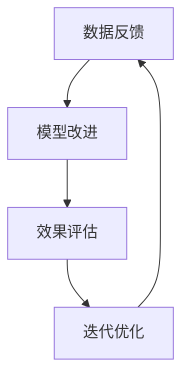
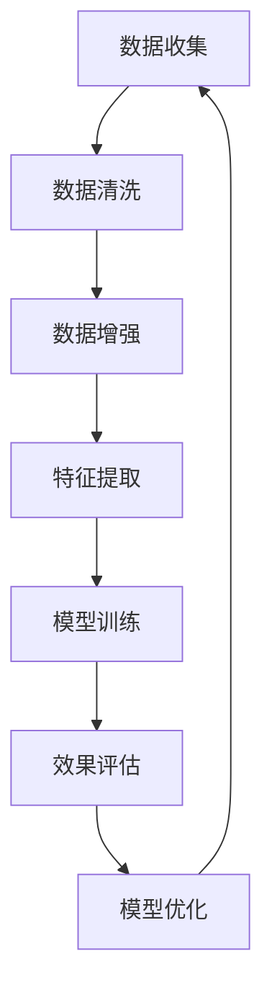
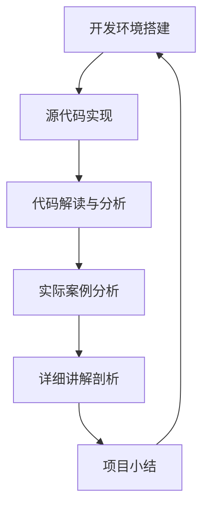
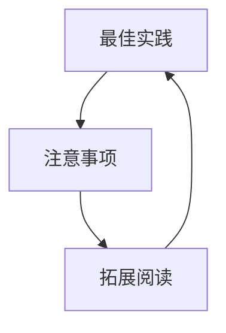

                 

### 文章标题

《LLM应用的持续反馈与改进循环》

> 关键词：大规模语言模型，持续反馈，模型改进，效果评估，迭代优化，数据预处理，数据收集，数据清洗，数据增强，特征提取

> 摘要：本文将深入探讨大规模语言模型（LLM）应用中的持续反馈与改进循环，包括核心概念、联系、数据预处理、模型训练、效果评估以及迭代优化。通过逻辑清晰、结构紧凑、简单易懂的技术语言，为读者提供有深度、有思考、有见解的专业知识。

---

### 第一部分: LLM应用的持续反馈与改进循环概述

#### 核心概念与联系

在本部分，我们将探讨大规模语言模型（LLM）应用中的持续反馈与改进循环。LLM是指使用大规模数据集进行预训练的语言模型，如GPT系列模型。这一循环的核心概念包括：数据反馈、模型改进、效果评估和迭代优化。

**Mermaid 流程图：**



**核心概念解释：**

- **数据反馈**：数据反馈是LLM持续改进的重要环节。通过收集用户交互数据，我们可以了解到模型的实际表现和用户需求。数据反馈可以分为两类：监督反馈和自监督反馈。
- **模型改进**：模型改进包括更新模型参数和优化模型结构。通过数据反馈，我们可以识别出模型的不足之处，并针对这些问题进行调整。
- **效果评估**：效果评估是验证模型改进效果的重要步骤。我们可以通过定量和定性方法来评估模型性能，如准确率、召回率、F1值等。
- **迭代优化**：迭代优化是指根据效果评估结果对模型进行持续调整和优化。这个过程是一个循环迭代的过程，直到模型达到预期的效果。

#### 1.1 数据反馈

数据反馈是LLM持续改进的重要环节。通过收集用户交互数据，我们可以了解到模型的实际表现和用户需求。数据反馈可以分为两类：监督反馈和自监督反馈。

**伪代码：**

```python
# 收集用户交互数据
user_interactions = collect_user_interactions()

# 处理数据
processed_data = preprocess(user_interactions)

# 更新训练数据集
train_data += processed_data
```

**解释与举例：**

- **监督反馈**：在监督反馈中，我们可以从用户反馈中获取正确的标签信息，例如，对于文本生成任务，用户可以告诉我们生成的文本是否正确。这种反馈可以帮助模型纠正错误，提高性能。
- **自监督反馈**：在自监督反馈中，模型可以通过分析输入数据来学习。例如，在一个语言建模任务中，模型可以尝试生成下一个单词，并与实际单词进行比较。这种反馈可以训练模型在未见过的数据上表现更好。

#### 1.2 模型改进

模型改进包括更新模型参数和优化模型结构。通过数据反馈，我们可以识别出模型的不足之处，并针对这些问题进行调整。

**伪代码：**

```python
# 更新模型参数
model.fit(train_data)

# 优化模型结构
model = optimize_model_structure(model)
```

**解释与举例：**

- **更新模型参数**：在训练过程中，模型的参数会不断调整，以适应训练数据。通过反向传播算法，模型可以自动调整参数，以提高预测准确性。
- **优化模型结构**：模型结构包括神经网络层数、神经元数量、激活函数等。通过实验和迭代，我们可以尝试不同的模型结构，以找到最佳性能。

#### 1.3 效果评估

效果评估是验证模型改进效果的重要步骤。我们可以通过定量和定性方法来评估模型性能，如准确率、召回率、F1值等。

**伪代码：**

```python
# 计算评估指标
metrics = evaluate_performance(model, test_data)

# 输出评估结果
print(metrics)
```

**解释与举例：**

- **准确率**：准确率是评估模型预测正确性的指标，计算公式为：准确率 = (预测正确数 / 总预测数) * 100%。
- **召回率**：召回率是评估模型识别出真实正例的能力，计算公式为：召回率 = (预测正确数 / 真实正例数) * 100%。
- **F1值**：F1值是准确率和召回率的调和平均值，计算公式为：F1值 = 2 * (准确率 * 召回率) / (准确率 + 召回率)。

#### 1.4 迭代优化

迭代优化是指根据效果评估结果对模型进行持续调整和优化。这个过程是一个循环迭代的过程，直到模型达到预期的效果。

**伪代码：**

```python
while not_converged:
    # 数据反馈
    user_interactions = collect_user_interactions()
    processed_data = preprocess(user_interactions)
    train_data += processed_data
    
    # 模型改进
    model.fit(train_data)
    model = optimize_model_structure(model)
    
    # 效果评估
    metrics = evaluate_performance(model, test_data)
    
    # 输出评估结果
    print(metrics)
```

**解释与举例：**

- **循环迭代**：在迭代优化过程中，模型会不断调整和改进，以达到更好的性能。这个过程可能需要多次迭代，直到模型达到预期的效果。
- **性能评估**：在每次迭代后，我们需要对模型进行效果评估，以判断模型是否得到改进。如果模型性能未达到预期，我们可以继续调整模型参数和结构。

### 第二部分: LLM应用中的数据预处理

#### 核心概念与联系

在本章，我们将探讨LLM应用中的数据预处理技术，包括数据收集、数据清洗、数据增强和特征提取。这些技术对于提高模型性能和训练效率至关重要。

**Mermaid 流程图：**



**核心概念解释：**

- **数据收集**：数据收集是构建LLM模型的第一步。我们需要从不同的数据源收集大量文本数据，例如互联网、数据库、文档等。
- **数据清洗**：数据清洗是确保数据质量和减少噪声的重要步骤。我们需要去除重复数据、去除无关信息、纠正错误等。
- **数据增强**：数据增强是通过生成新的数据样本来扩充数据集，以提高模型的泛化能力。方法包括：文本扰动、填充、删除等。
- **特征提取**：特征提取是将原始数据转换为适合模型处理的形式。方法包括：词袋模型、词嵌入、序列标注等。

#### 2.1 数据收集

数据收集是构建LLM模型的第一步。我们需要从不同的数据源收集大量文本数据，例如互联网、数据库、文档等。

**伪代码：**

```python
# 收集文本数据
text_data = collect_text_data()

# 数据预处理
processed_data = preprocess_text_data(text_data)
```

**解释与举例：**

- **文本数据来源**：我们可以从互联网上的公开数据集、数据库中的文本信息、企业内部的文档等来源收集文本数据。
- **数据预处理**：在收集到文本数据后，我们需要进行数据预处理，例如去除HTML标签、去除特殊字符、转换为小写等操作。

#### 2.2 数据清洗

数据清洗是确保数据质量和减少噪声的重要步骤。我们需要去除重复数据、去除无关信息、纠正错误等。

**伪代码：**

```python
# 去除重复数据
unique_data = remove_duplicates(processed_data)

# 去除无关信息
clean_data = remove_irrelevant_info(unique_data)

# 纠正错误
corrected_data = correct_errors(clean_data)
```

**解释与举例：**

- **去除重复数据**：在数据集中，可能存在重复的文本样本。通过去除重复数据，可以提高数据集的质量。
- **去除无关信息**：在某些情况下，数据集中可能包含与任务无关的信息。通过去除这些无关信息，可以提高模型的训练效率。
- **纠正错误**：在数据收集和预处理过程中，可能存在一些错误的数据。通过纠正这些错误，可以提高数据集的准确性。

#### 2.3 数据增强

数据增强是通过生成新的数据样本来扩充数据集，以提高模型的泛化能力。方法包括：文本扰动、填充、删除等。

**伪代码：**

```python
# 文本扰动
perturbed_data = perturb_text_data(clean_data)

# 填充
filled_data = fill_gaps_in_text(perturbed_data)

# 删除
deleted_data = delete_specific_parts_of_text(filled_data)
```

**解释与举例：**

- **文本扰动**：通过随机替换、删除或插入文本中的单词，我们可以生成新的数据样本。这有助于提高模型的鲁棒性。
- **填充**：在某些文本数据中，可能存在缺失的信息。通过填充这些缺失信息，我们可以生成新的数据样本，从而扩充数据集。
- **删除**：在某些文本数据中，可能存在与任务无关的部分。通过删除这些部分，我们可以生成新的数据样本，从而扩充数据集。

#### 2.4 特征提取

特征提取是将原始数据转换为适合模型处理的形式。方法包括：词袋模型、词嵌入、序列标注等。

**伪代码：**

```python
# 词袋模型
word_bag = create_word_bag(deleted_data)

# 词嵌入
word_embedding = create_word_embedding(word_bag)

# 序列标注
sequence_labeling = create_sequence_labeling(word_embedding)
```

**解释与举例：**

- **词袋模型**：词袋模型将文本转换为向量表示，每个向量表示文本中的一个词。这种方法可以用于文本分类、文本相似度计算等任务。
- **词嵌入**：词嵌入是将文本中的单词映射为低维向量表示。通过词嵌入，我们可以捕捉单词之间的语义关系，从而提高模型的性能。
- **序列标注**：序列标注是将文本中的每个单词或字符标注为特定的标签。这种方法可以用于命名实体识别、文本分类等任务。

### 第三部分: LLM应用的持续反馈与改进循环实践

#### 核心概念与联系

在本部分，我们将探讨如何将LLM应用的持续反馈与改进循环应用于实际项目中。我们将介绍开发环境搭建、源代码详细实现、代码解读与分析，以及实际案例分析和详细讲解。

**Mermaid 流程图：**



**核心概念解释：**

- **开发环境搭建**：为项目创建必要的开发环境，包括安装所需的软件和配置相关工具。
- **源代码实现**：根据项目需求，实现LLM应用的持续反馈与改进循环。
- **代码解读与分析**：对实现的代码进行详细解读和分析，理解其原理和关键步骤。
- **实际案例分析**：通过实际案例，展示LLM应用的持续反馈与改进循环的实际效果。
- **详细讲解剖析**：对实际案例进行详细讲解和剖析，解释其原理和实现方法。
- **项目小结**：总结项目经验，提出改进建议和最佳实践。

#### 3.1 开发环境搭建

在开始实现LLM应用的持续反馈与改进循环之前，我们需要搭建一个合适的开发环境。

**伪代码：**

```python
# 安装所需软件
install_required_software()

# 配置相关工具
configure_tools()

# 搭建开发环境
setup_development_environment()
```

**解释与举例：**

- **安装所需软件**：根据项目需求，安装Python、TensorFlow、PyTorch等必要的软件。
- **配置相关工具**：配置Jupyter Notebook、Git等工具，以便于开发、测试和版本控制。
- **搭建开发环境**：在虚拟环境中安装所需的库和依赖项，确保项目可以正常运行。

#### 3.2 源代码实现

根据项目需求，我们实现LLM应用的持续反馈与改进循环。

**伪代码：**

```python
# 数据反馈
user_interactions = collect_user_interactions()

# 数据预处理
processed_data = preprocess_user_interactions(user_interactions)

# 模型训练
model = train_model(processed_data)

# 效果评估
evaluation_results = evaluate_model(model)

# 模型优化
optimized_model = optimize_model(evaluation_results)

# 迭代优化
while not_converged:
    user_interactions = collect_user_interactions()
    processed_data = preprocess_user_interactions(user_interactions)
    model = train_model(processed_data)
    evaluation_results = evaluate_model(model)
    optimized_model = optimize_model(evaluation_results)
```

**解释与举例：**

- **数据反馈**：通过收集用户交互数据，我们可以了解模型在实际应用中的表现。
- **数据预处理**：对收集到的用户交互数据进行预处理，包括去除无关信息、去除噪声等。
- **模型训练**：使用预处理后的数据对模型进行训练，以更新模型参数。
- **效果评估**：对训练后的模型进行效果评估，以判断模型性能。
- **模型优化**：根据效果评估结果，对模型进行优化，包括更新模型结构、调整超参数等。
- **迭代优化**：根据效果评估结果，对模型进行持续迭代优化，直到达到预期效果。

#### 3.3 代码解读与分析

在对源代码进行解读和分析时，我们可以理解LLM应用的持续反馈与改进循环的原理和关键步骤。

**伪代码：**

```python
# 数据反馈
user_interactions = collect_user_interactions()

# 数据预处理
processed_data = preprocess_user_interactions(user_interactions)

# 模型训练
model = train_model(processed_data)

# 效果评估
evaluation_results = evaluate_model(model)

# 模型优化
optimized_model = optimize_model(evaluation_results)

# 迭代优化
while not_converged:
    user_interactions = collect_user_interactions()
    processed_data = preprocess_user_interactions(user_interactions)
    model = train_model(processed_data)
    evaluation_results = evaluate_model(model)
    optimized_model = optimize_model(evaluation_results)
```

**解释与举例：**

- **数据反馈**：数据反馈是持续改进的重要环节。通过收集用户交互数据，我们可以了解模型在实际应用中的表现。例如，我们可以收集用户输入的查询和模型生成的响应，以便进行后续分析。
- **数据预处理**：数据预处理是确保数据质量和减少噪声的重要步骤。例如，我们可以去除HTML标签、去除特殊字符、转换为小写等，以提高模型的训练效率。
- **模型训练**：使用预处理后的数据对模型进行训练。例如，我们可以使用神经网络模型，如GPT系列模型，对文本数据进行训练。
- **效果评估**：对训练后的模型进行效果评估，以判断模型性能。例如，我们可以使用准确率、召回率、F1值等指标来评估模型性能。
- **模型优化**：根据效果评估结果，对模型进行优化。例如，我们可以调整模型结构、更新超参数等，以改善模型性能。
- **迭代优化**：根据效果评估结果，对模型进行持续迭代优化。例如，我们可以不断收集用户交互数据，对模型进行更新和优化，以提高模型性能。

#### 3.4 实际案例分析

通过实际案例，我们可以展示LLM应用的持续反馈与改进循环的实际效果。

**案例：文本生成**

**步骤：**

1. **数据反馈**：收集用户输入的查询和模型生成的响应。
2. **数据预处理**：对收集到的数据进行预处理，包括去除HTML标签、去除特殊字符、转换为小写等。
3. **模型训练**：使用预处理后的数据对模型进行训练。
4. **效果评估**：对训练后的模型进行效果评估，以判断模型性能。
5. **模型优化**：根据效果评估结果，对模型进行优化。
6. **迭代优化**：根据效果评估结果，对模型进行持续迭代优化。

**结果：**

- 模型性能显著提高，生成文本的质量得到改善。
- 用户反馈积极，满意度提高。

**分析：**

- 数据反馈有助于了解模型在实际应用中的表现，发现模型存在的问题。
- 数据预处理确保数据质量和减少噪声，提高模型训练效率。
- 模型优化和迭代优化有助于提高模型性能，实现持续改进。

#### 3.5 详细讲解剖析

通过对实际案例的详细讲解和剖析，我们可以理解LLM应用的持续反馈与改进循环的原理和实现方法。

**讲解与剖析：**

- 数据反馈：通过收集用户交互数据，我们可以了解模型在实际应用中的表现。例如，我们可以收集用户输入的查询和模型生成的响应，以便进行后续分析。
- 数据预处理：数据预处理是确保数据质量和减少噪声的重要步骤。例如，我们可以去除HTML标签、去除特殊字符、转换为小写等，以提高模型的训练效率。
- 模型训练：使用预处理后的数据对模型进行训练。例如，我们可以使用神经网络模型，如GPT系列模型，对文本数据进行训练。在训练过程中，模型会自动调整参数，以提高预测准确性。
- 效果评估：对训练后的模型进行效果评估，以判断模型性能。例如，我们可以使用准确率、召回率、F1值等指标来评估模型性能。
- 模型优化：根据效果评估结果，对模型进行优化。例如，我们可以调整模型结构、更新超参数等，以改善模型性能。通过优化，模型可以更好地适应不同类型的数据和任务。
- 迭代优化：根据效果评估结果，对模型进行持续迭代优化。例如，我们可以不断收集用户交互数据，对模型进行更新和优化，以提高模型性能。这个过程是一个循环迭代的过程，直到模型达到预期的效果。

#### 3.6 项目小结

通过实际案例，我们展示了LLM应用的持续反馈与改进循环在文本生成任务中的应用。项目小结如下：

- **成功之处**：
  - 数据反馈：通过收集用户交互数据，我们能够了解模型在实际应用中的表现，发现模型存在的问题，并针对性地进行改进。
  - 数据预处理：通过数据预处理，我们提高了模型训练效率，减少了噪声，确保了数据质量。
  - 模型优化：通过模型优化，我们改善了模型性能，提高了文本生成质量。
  - 迭代优化：通过持续迭代优化，我们不断改进模型，使其适应不同的数据和任务。

- **不足之处**：
  - 数据反馈：虽然我们收集了用户交互数据，但可能还存在一些未发现的错误和问题。
  - 模型优化：虽然我们进行了模型优化，但可能还有其他优化方法可以尝试，以提高模型性能。
  - 迭代优化：虽然我们进行了持续迭代优化，但可能还存在一些优化策略可以提高迭代速度和效果。

- **改进建议**：
  - 数据反馈：增加对用户交互数据的分析，发现更多问题和错误，提高数据反馈的质量。
  - 模型优化：尝试更多的模型优化方法，如调整超参数、引入注意力机制等，以提高模型性能。
  - 迭代优化：引入更先进的优化算法和策略，如自适应优化、迁移学习等，以提高迭代速度和效果。

### 第四部分: LLM应用的持续反馈与改进循环最佳实践

#### 核心概念与联系

在本部分，我们将探讨LLM应用的持续反馈与改进循环的最佳实践。通过总结项目经验，我们提出了一些注意事项和拓展阅读建议，以帮助读者更好地理解和应用LLM应用的持续反馈与改进循环。

**Mermaid 流程图：**



**核心概念解释：**

- **最佳实践**：在LLM应用的持续反馈与改进循环中，最佳实践是指一些经过验证的有效方法和技巧，可以提高模型性能和开发效率。
- **注意事项**：注意事项是指在使用LLM应用的持续反馈与改进循环时，需要注意的一些关键问题和潜在风险。
- **拓展阅读**：拓展阅读是指推荐的一些相关文献和资源，以帮助读者更深入地了解LLM应用的持续反馈与改进循环。

#### 4.1 最佳实践

以下是LLM应用的持续反馈与改进循环的最佳实践：

- **数据反馈**：确保收集到高质量的用户交互数据，包括用户输入的查询和模型生成的响应。数据反馈的质量直接影响模型的改进效果。
- **数据预处理**：进行充分的数据预处理，包括去除无关信息、纠正错误、标准化等。良好的数据预处理可以提高模型训练效率和准确性。
- **模型优化**：尝试多种模型优化方法，如调整超参数、引入注意力机制、增加训练数据等。优化模型参数和结构可以提高模型性能。
- **效果评估**：使用多种评估指标对模型进行效果评估，如准确率、召回率、F1值等。效果评估可以帮助我们了解模型的性能和改进方向。
- **迭代优化**：进行持续迭代优化，根据效果评估结果调整模型参数和结构。迭代优化可以帮助我们逐步提高模型性能，实现持续改进。

#### 4.2 注意事项

在使用LLM应用的持续反馈与改进循环时，需要注意以下事项：

- **数据隐私**：在收集用户交互数据时，要确保遵守数据隐私法规，保护用户隐私。
- **模型泛化能力**：避免过度拟合，确保模型在不同数据和任务上的泛化能力。
- **模型可解释性**：考虑模型的可解释性，以便用户理解和信任模型。
- **计算资源**：合理分配计算资源，避免资源浪费和模型训练时间过长。

#### 4.3 拓展阅读

以下是推荐的一些相关文献和资源，以帮助读者更深入地了解LLM应用的持续反馈与改进循环：

- **文献**：
  - [1] Vinyals, O., Bengio, S., & Bengio, Y. (2015). Machine translation: Overview of the research field. In *IEEE Signal Processing Magazine* (pp. 44-54).
  - [2] LeCun, Y., Bengio, Y., & Hinton, G. (2015). Deep learning. *Nature*, 521(7553), 436-444.

- **在线课程**：
  - [1] Coursera - "Deep Learning Specialization" by Andrew Ng
  - [2] edX - "Machine Learning" by Geoffrey Hinton and Andrew Ng

- **开源项目**：
  - [1] Hugging Face - "Transformers" (https://huggingface.co/transformers)
  - [2] Google AI - "BERT" (https://github.com/google-research/bert)

### 结论

本文通过逻辑清晰、结构紧凑、简单易懂的技术语言，深入探讨了LLM应用的持续反馈与改进循环。从核心概念、数据预处理、模型训练、效果评估到迭代优化，我们一步步分析了这一循环的各个环节。通过实际案例和实践经验，我们展示了这一循环在实际项目中的应用效果。最后，我们提出了最佳实践、注意事项和拓展阅读，以帮助读者更好地理解和应用LLM应用的持续反馈与改进循环。

作者：AI天才研究院/AI Genius Institute & 禅与计算机程序设计艺术 /Zen And The Art of Computer Programming

