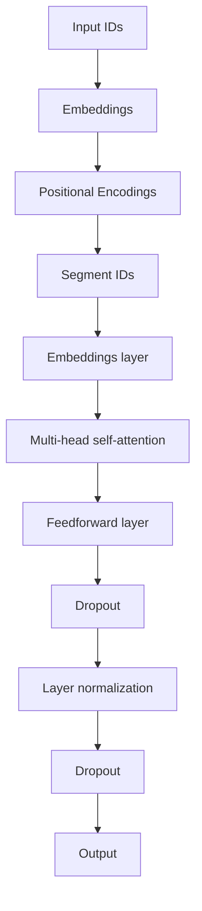

                 

## 第2章：LLM的基本技术

### 2.1 自然语言处理（NLP）基础

#### 2.1.1 词袋模型（Bag-of-Words, BOW）

词袋模型是将文本视为一个单词的集合，而不考虑单词的顺序。这种模型将文本转换为向量，其中每个维度对应一个词汇表中的单词。

- **表示方式**：向量中1表示单词出现在文本中，0表示未出现。
- **挑战**：丢失了词汇的顺序和语法结构。

#### 2.1.2 递归神经网络（Recurrent Neural Networks, RNN）

递归神经网络是用于处理序列数据的神经网络，特别适合于自然语言处理任务。

- **核心概念**：RNN能够通过递归结构将先前的隐藏状态传递到下一个时间步。
- **挑战**：梯度消失和梯度爆炸问题。

#### 2.1.3 卷积神经网络（Convolutional Neural Networks, CNN）

卷积神经网络通常用于图像识别，但在自然语言处理中，也可以利用其局部特征提取能力。

- **核心概念**：通过卷积操作提取文本中的局部特征。
- **挑战**：难以捕捉长距离依赖。

### 2.2 深度学习技术

#### 2.2.1 自动编码器（Autoencoder）

自动编码器是一种无监督学习方法，用于学习数据的表示。

- **核心概念**：由编码器和解码器组成，编码器将输入数据压缩为低维表示，解码器尝试将低维表示重构为原始数据。
- **挑战**：需要大量数据训练，且重构误差可能较大。

#### 2.2.2 卷积神经网络（Convolutional Neural Networks, CNN）

卷积神经网络通过卷积操作提取图像中的局部特征，也适用于文本处理。

- **核心概念**：使用卷积层和池化层提取特征。
- **挑战**：难以处理长序列数据。

### 2.3 大规模预训练模型

#### 2.3.1 BERT（Bidirectional Encoder Representations from Transformers）

BERT是Google提出的一种双向Transformer模型，用于预训练深度语言表示。

- **核心概念**：通过预训练获取丰富的语言表示，然后进行微调以适应特定任务。
- **挑战**：需要大量计算资源和数据。

#### 2.3.2 GPT（Generative Pre-trained Transformer）

GPT是OpenAI开发的一种自回归Transformer模型，用于生成文本。

- **核心概念**：通过预训练学习文本的生成规律。
- **挑战**：生成文本可能包含偏见和不准确的信息。

### 2.4 机器学习优化与调优

#### 2.4.1 梯度下降（Gradient Descent）

梯度下降是一种常用的优化算法，用于最小化损失函数。

- **核心概念**：通过迭代更新模型参数，使损失函数值逐步减小。
- **挑战**：收敛速度和选择合适的学习率。

#### 2.4.2 梯度裁剪（Gradient Clipping）

梯度裁剪用于避免梯度爆炸和梯度消失问题。

- **核心概念**：限制梯度值的大小，避免梯度更新过大或过小。
- **挑战**：需要选择合适的裁剪阈值。

## 2.5 其他关键技术

#### 2.5.1 注意力机制（Attention Mechanism）

注意力机制是一种用于处理序列数据的关键技术，能够提高模型对重要信息的关注。

- **核心概念**：通过计算注意力权重，将不同位置的输入赋予不同的重要性。
- **挑战**：计算复杂度较高，需要优化实现。

#### 2.5.2 生成对抗网络（Generative Adversarial Networks, GAN）

生成对抗网络是一种无监督学习方法，通过两个对抗网络生成逼真的数据。

- **核心概念**：生成网络和判别网络相互竞争，生成网络试图生成逼真的数据，判别网络试图区分真实数据和生成数据。
- **挑战**：训练难度大，容易产生模式崩溃。

## 2.6 LLM的数学模型与算法

#### 2.6.1 Transformer模型

Transformer是一种基于自注意力机制的深度学习模型，广泛应用于LLM。

- **核心概念**：使用多头自注意力机制和前馈神经网络处理序列数据。
- **挑战**：计算复杂度较高，需要优化实现。

#### 2.6.2 语言模型训练算法

- **核心概念**：通过训练文本数据，学习语言规律。
- **挑战**：需要大量计算资源和数据。

## 2.7 LLM的架构与实现

#### 2.7.1 编码器-解码器架构（Encoder-Decoder Architecture）

编码器-解码器架构是一种广泛应用于LLM的模型结构。

- **核心概念**：编码器将输入文本编码为向量，解码器使用这些向量生成文本。
- **挑战**：需要优化编码器和解码器的结构和参数。

#### 2.7.2 模型训练与推理

- **核心概念**：通过训练模型，学习语言规律；推理过程使用训练好的模型生成文本。
- **挑战**：需要优化训练过程和推理效率。

#### 2.7.3 分布式训练技术

- **核心概念**：将模型训练任务分布到多台机器上进行，提高训练速度。
- **挑战**：需要优化数据传输和同步机制。

#### 2.7.4 模型部署与优化

- **核心概念**：将训练好的模型部署到生产环境中，进行实时预测。
- **挑战**：需要优化模型大小和推理速度。

## 2.8 LLM的挑战与未来发展方向

#### 2.8.1 挑战

- **数据隐私与安全性**：大量数据的训练和处理可能涉及隐私和安全问题。
- **可解释性与可靠性**：如何提高LLM的可解释性和可靠性。
- **能耗与计算成本**：大规模训练和推理需要大量计算资源和能源。

#### 2.8.2 未来发展方向

- **多模态交互**：结合语音、图像等多模态数据，提高LLM的应用能力。
- **知识图谱与推理**：结合知识图谱和推理技术，提高LLM的知识表示和推理能力。
- **优化算法与硬件**：研究更高效的算法和硬件加速技术，降低计算成本。

## 附录

### A.1 开源深度学习框架

- **TensorFlow**：由Google开发的开源深度学习框架。
- **PyTorch**：由Facebook开发的开源深度学习框架。

### A.2 数据集与工具

- **GLUE**：用于评估自然语言处理任务的数据集。
- **Common Crawl**：一个庞大的文本数据集，用于训练和评估自然语言处理模型。

### A.3 实践指南与文献资料

- **《Deep Learning for Natural Language Processing》**：由Stanford大学自然语言处理课程提供的一系列教程和文献。
- **《NLP汉语处理教程》**：由清华大学自然语言处理实验室编写的一本中文NLP教材。

## 2.9 代码示例

### 2.9.1 BERT模型架构



### 2.9.2 Transformer模型训练伪代码

```python
# Transformer模型训练伪代码

# 设置训练参数
batch_size = 64
learning_rate = 0.001
num_epochs = 10

# 加载数据
train_loader = DataLoader(dataset, batch_size=batch_size, shuffle=True)

# 定义模型
model = TransformerModel()

# 定义优化器
optimizer = Adam(model.parameters(), lr=learning_rate)

# 训练模型
for epoch in range(num_epochs):
    model.train()
    for inputs, targets in train_loader:
        optimizer.zero_grad()
        outputs = model(inputs)
        loss = loss_function(outputs, targets)
        loss.backward()
        optimizer.step()
    print(f"Epoch {epoch+1}/{num_epochs}, Loss: {loss.item()}")
```

## 2.10 总结

在本章节中，我们介绍了LLM的基本技术，包括自然语言处理基础、深度学习技术、大规模预训练模型、机器学习优化与调优等。通过这些技术，我们可以构建强大的语言模型，并在各种自然语言处理任务中取得优异的性能。然而，LLM的应用仍然面临许多挑战，需要不断优化和改进。在未来，我们期待看到LLM在更多领域取得突破性进展。

## 附录

### A.1 开源深度学习框架

- **TensorFlow**：由Google开发的开源深度学习框架。
- **PyTorch**：由Facebook开发的开源深度学习框架。

### A.2 数据集与工具

- **GLUE**：用于评估自然语言处理任务的数据集。
- **Common Crawl**：一个庞大的文本数据集，用于训练和评估自然语言处理模型。

### A.3 实践指南与文献资料

- **《Deep Learning for Natural Language Processing》**：由Stanford大学自然语言处理课程提供的一系列教程和文献。
- **《NLP汉语处理教程》**：由清华大学自然语言处理实验室编写的一本中文NLP教材。

## 2.9 代码示例

### 2.9.1 BERT模型架构


### 2.9.2 Transformer模型训练伪代码

```python
# Transformer模型训练伪代码

# 设置训练参数
batch_size = 64
learning_rate = 0.001
num_epochs = 10

# 加载数据
train_loader = DataLoader(dataset, batch_size=batch_size, shuffle=True)

# 定义模型
model = TransformerModel()

# 定义优化器
optimizer = Adam(model.parameters(), lr=learning_rate)

# 训练模型
for epoch in range(num_epochs):
    model.train()
    for inputs, targets in train_loader:
        optimizer.zero_grad()
        outputs = model(inputs)
        loss = loss_function(outputs, targets)
        loss.backward()
        optimizer.step()
    print(f"Epoch {epoch+1}/{num_epochs}, Loss: {loss.item()}")
```

## 2.10 总结

在本章节中，我们介绍了LLM的基本技术，包括自然语言处理基础、深度学习技术、大规模预训练模型、机器学习优化与调优等。通过这些技术，我们可以构建强大的语言模型，并在各种自然语言处理任务中取得优异的性能。然而，LLM的应用仍然面临许多挑战，需要不断优化和改进。在未来，我们期待看到LLM在更多领域取得突破性进展。

## 附录

### A.1 开源深度学习框架

- **TensorFlow**：由Google开发的开源深度学习框架。
- **PyTorch**：由Facebook开发的开源深度学习框架。

### A.2 数据集与工具

- **GLUE**：用于评估自然语言处理任务的数据集。
- **Common Crawl**：一个庞大的文本数据集，用于训练和评估自然语言处理模型。

### A.3 实践指南与文献资料

- **《Deep Learning for Natural Language Processing》**：由Stanford大学自然语言处理课程提供的一系列教程和文献。
- **《NLP汉语处理教程》**：由清华大学自然语言处理实验室编写的一本中文NLP教材。

----------------------------------------------------------------

# 第3章：LLM的数学模型与算法

在上一章中，我们介绍了LLM的基本技术，包括自然语言处理基础、深度学习技术、大规模预训练模型和机器学习优化与调优等。本章将进一步探讨LLM的数学模型与算法，深入解析这些模型的核心原理和实现细节。

## 3.1 向量空间模型

向量空间模型（Vector Space Model, VSM）是将文本转换为向量表示的一种方法。这种方法的主要思想是将每个单词或短语映射到高维向量空间中的一个点，从而可以在该空间中处理和比较文本。

### 3.1.1 单词向量的表示方法

单词向量的表示方法包括：

- **分布式表示**：将单词映射到一个固定维度的向量空间，每个维度对应一个特征。
- **词嵌入（Word Embedding）**：使用神经网络学习单词的分布式表示，如Word2Vec和GloVe。

### 3.1.2 向量空间模型的应用

向量空间模型的应用包括：

- **相似度计算**：计算两个文本向量的相似度，用于文本相似性判断。
- **文本分类**：将文本向量输入到分类模型中，实现文本分类任务。
- **文档聚类**：将文本向量聚类，实现文档的分组和归类。

### 3.1.3 实例：GloVe算法

GloVe（Global Vectors for Word Representation）是一种基于全局上下文的单词向量表示方法。它的核心思想是利用单词的共现信息来学习单词向量。

- **算法步骤**：
  1. 构建单词的共现矩阵。
  2. 定义损失函数，如负采样损失。
  3. 使用梯度下降优化向量参数。

## 3.2 注意力机制

注意力机制（Attention Mechanism）是深度学习中的一种重要技术，用于解决序列数据中的长距离依赖问题。注意力机制的核心思想是允许模型在处理输入序列时，自动选择关注重要的部分。

### 3.2.1 自注意力机制

自注意力机制（Self-Attention）是Transformer模型的核心组件，它通过对输入序列的每个元素计算注意力权重，将注意力集中在重要的部分。

- **核心公式**：
  $$ \text{Attention}(Q, K, V) = \text{softmax}\left(\frac{QK^T}{\sqrt{d_k}}\right)V $$
  其中，$Q$、$K$、$V$ 分别是查询、键、值向量，$d_k$ 是键向量的维度。

### 3.2.2 多头注意力

多头注意力（Multi-Head Attention）是自注意力机制的一种扩展，它将输入序列分成多个头，每个头计算不同的注意力权重。

- **核心公式**：
  $$ \text{Multi-Head Attention} = \text{Concat}(\text{head}_1, \text{head}_2, ..., \text{head}_h)W^O $$
  其中，$W^O$ 是输出线性层，$h$ 是头的数量。

### 3.2.3 注意力机制的应用

注意力机制的应用包括：

- **机器翻译**：在编码器和解码器中使用注意力机制，实现跨语言的语义理解。
- **文本生成**：在生成模型中使用注意力机制，提高生成的连贯性和多样性。
- **问答系统**：在问答系统中使用注意力机制，关注问题的关键部分。

## 3.3 生成对抗网络（GAN）

生成对抗网络（Generative Adversarial Networks, GAN）是一种无监督学习模型，由生成器和判别器组成。生成器的目标是生成逼真的数据，判别器的目标是区分真实数据和生成数据。

### 3.3.1 GAN的核心概念

- **生成器（Generator）**：生成逼真的数据，试图欺骗判别器。
- **判别器（Discriminator）**：判断输入数据是真实数据还是生成数据。
- **对抗训练**：生成器和判别器相互对抗，生成器不断改进生成数据，判别器不断提高判断能力。

### 3.3.2 GAN的应用

GAN的应用包括：

- **图像生成**：生成逼真的图像，如图像到图像的转换、图像超分辨率等。
- **文本生成**：生成连贯的文本，如自动写作、对话系统等。
- **数据增强**：生成额外的训练数据，提高模型的泛化能力。

### 3.3.3 GAN的训练过程

GAN的训练过程可以分为以下几个步骤：

1. 初始化生成器和判别器。
2. 在训练过程中，生成器生成数据，判别器对其进行判断。
3. 生成器不断优化生成数据，使判别器无法区分生成数据和真实数据。
4. 判别器不断优化判断能力，使生成数据更容易被识别。

## 3.4 强化学习在LLM中的应用

强化学习（Reinforcement Learning, RL）是一种通过试错学习优化行为策略的机器学习方法。在LLM中，强化学习可以用于优化模型生成文本的质量。

### 3.4.1 强化学习的基本概念

- **状态（State）**：描述环境的状态。
- **动作（Action）**：模型生成的文本。
- **奖励（Reward）**：对生成文本的评价。
- **策略（Policy）**：生成文本的策略。

### 3.4.2 强化学习在文本生成中的应用

强化学习在文本生成中的应用包括：

- **序列决策**：在生成文本时，模型需要根据当前状态选择下一个动作。
- **多模态生成**：生成文本时，结合图像、音频等多模态信息。
- **长期奖励**：考虑文本的长期效果，优化生成文本的质量。

### 3.4.3 强化学习与LLM的结合

强化学习与LLM的结合可以通过以下方式实现：

- **联合训练**：将强化学习模型和LLM联合训练，使LLM生成更符合预期的文本。
- **评估与优化**：使用强化学习评估LLM生成的文本质量，并优化LLM的参数。

## 3.5 小结

本章介绍了LLM的数学模型与算法，包括向量空间模型、注意力机制、生成对抗网络和强化学习。这些模型和算法是构建和优化LLM的关键技术，使LLM在自然语言处理任务中取得了显著成果。然而，这些技术仍然面临许多挑战，如计算复杂度、模型可解释性和稳定性等。未来，我们需要不断探索和改进这些技术，以推动LLM的发展和应用。

## 附录

### A.1 开源深度学习框架

- **TensorFlow**：由Google开发的开源深度学习框架。
- **PyTorch**：由Facebook开发的开源深度学习框架。

### A.2 数据集与工具

- **GLUE**：用于评估自然语言处理任务的数据集。
- **Common Crawl**：一个庞大的文本数据集，用于训练和评估自然语言处理模型。

### A.3 实践指南与文献资料

- **《Deep Learning for Natural Language Processing》**：由Stanford大学自然语言处理课程提供的一系列教程和文献。
- **《NLP汉语处理教程》**：由清华大学自然语言处理实验室编写的一本中文NLP教材。

----------------------------------------------------------------

# 第4章：LLM的架构与实现

在深入了解LLM的数学模型与算法之后，本章将重点探讨LLM的架构与实现。通过解析LLM的结构和实现细节，我们将更全面地理解LLM的工作原理，以及如何在实践中构建和应用LLM。

## 4.1 模型结构设计

LLM的模型结构设计是构建高效、可靠的语言模型的关键。以下是LLM模型结构设计的几个关键组成部分：

### 4.1.1 编码器（Encoder）

编码器负责将输入文本转换为向量表示。在Transformer模型中，编码器通常由多个自注意力层（Self-Attention Layer）和前馈神经网络（Feedforward Neural Network）堆叠而成。

- **自注意力层**：通过自注意力机制，编码器能够关注输入文本中的不同部分，提取关键信息。
- **前馈神经网络**：在每个自注意力层之后，添加一个前馈神经网络，用于进一步处理和整合信息。

### 4.1.2 解码器（Decoder）

解码器负责生成输出文本。与编码器类似，解码器也由多个自注意力层和前馈神经网络组成。此外，解码器还包括交叉注意力层（Cross-Attention Layer），用于在生成文本时关注编码器的输出。

- **交叉注意力层**：解码器的交叉注意力层使解码器能够关注编码器输出的不同部分，从而生成更相关的文本。

### 4.1.3 模型参数调整

模型参数调整是优化LLM性能的重要环节。以下是一些常见的参数调整方法：

- **学习率调整**：调整学习率可以加快或减缓模型收敛速度。
- **正则化**：如L1、L2正则化，可以防止模型过拟合。
- **dropout**：在神经网络层之间添加dropout可以减少过拟合。

### 4.1.4 模型结构优化

模型结构优化旨在提高模型性能和推理速度。以下是一些常见的模型结构优化方法：

- **量化**：通过降低模型参数的精度，减少模型大小和推理时间。
- **剪枝**：通过去除模型中的冗余参数，减少模型大小和推理时间。
- **蒸馏**：将大模型的知识传递给小模型，提高小模型的性能。

## 4.2 模型训练与推理

模型训练与推理是LLM架构实现的核心环节。以下将详细介绍LLM的训练与推理过程：

### 4.2.1 模型训练

模型训练的目的是通过优化模型参数，使其能够准确预测输入文本的输出。以下是一个典型的模型训练流程：

1. **数据准备**：从大规模语料库中收集文本数据，并进行预处理，如分词、词嵌入等。
2. **批次划分**：将预处理后的数据划分为多个批次，每个批次包含一定数量的样本。
3. **损失函数定义**：定义损失函数，如交叉熵损失，用于衡量模型预测结果与实际结果之间的差距。
4. **优化器选择**：选择合适的优化器，如Adam，用于更新模型参数。
5. **训练过程**：在训练过程中，模型对每个批次的数据进行前向传播和反向传播，不断优化模型参数。

### 4.2.2 模型推理

模型推理是指使用训练好的模型对新的输入文本进行预测。以下是一个典型的模型推理流程：

1. **文本预处理**：对输入文本进行预处理，如分词、词嵌入等，将其转换为模型可接受的格式。
2. **前向传播**：将预处理后的文本输入到模型中，进行前向传播，得到预测结果。
3. **结果处理**：对模型输出的预测结果进行处理，如解码、排序等，得到最终的预测结果。

### 4.2.3 模型优化

模型优化旨在提高模型性能和推理速度。以下是一些常见的模型优化方法：

- **量化**：通过降低模型参数的精度，减少模型大小和推理时间。
- **剪枝**：通过去除模型中的冗余参数，减少模型大小和推理时间。
- **蒸馏**：将大模型的知识传递给小模型，提高小模型的性能。

## 4.3 分布式训练技术

分布式训练技术是将模型训练任务分布到多台机器上进行，以提高训练速度和减少训练时间。以下是一些常见的分布式训练技术：

### 4.3.1 数据并行

数据并行是将训练数据划分为多个子集，每个子集由不同的机器处理。每个机器上的模型参数与全局模型参数保持同步。

- **优点**：可以显著提高训练速度。
- **缺点**：可能导致通信开销增大。

### 4.3.2 模型并行

模型并行是将模型划分为多个子模型，每个子模型由不同的机器处理。每个机器上的子模型与全局模型参数保持同步。

- **优点**：可以减少通信开销。
- **缺点**：可能导致训练速度降低。

### 4.3.3 混合并行

混合并行是将数据并行和模型并行结合起来，以实现最优的训练速度。

## 4.4 模型部署与优化

模型部署与优化是将训练好的模型部署到生产环境中，并进行实时预测。以下是一些常见的模型部署与优化方法：

### 4.4.1 模型压缩

模型压缩是通过减少模型参数数量和精度，降低模型大小和推理时间。以下是一些常见的模型压缩方法：

- **量化**：通过降低模型参数的精度，减少模型大小和推理时间。
- **剪枝**：通过去除模型中的冗余参数，减少模型大小和推理时间。
- **蒸馏**：将大模型的知识传递给小模型，提高小模型的性能。

### 4.4.2 模型加速

模型加速是通过优化模型结构和算法，提高模型推理速度。以下是一些常见的模型加速方法：

- **算子融合**：将多个计算操作融合到一个操作中，减少计算次数。
- **并行计算**：将计算任务分布到多台机器上进行，提高计算速度。
- **GPU加速**：使用GPU进行模型推理，提高推理速度。

### 4.4.3 模型监控

模型监控是通过实时监控模型性能和运行状态，确保模型稳定运行。以下是一些常见的模型监控方法：

- **性能监控**：监控模型在训练和推理过程中的性能指标，如准确率、召回率等。
- **异常检测**：检测模型运行过程中出现的异常情况，如过拟合、欠拟合等。

## 4.5 小结

本章介绍了LLM的架构与实现，包括模型结构设计、模型训练与推理、分布式训练技术、模型部署与优化等。通过理解这些内容，我们可以更好地构建和应用LLM。在未来的研究和实践中，我们还需要不断探索和优化这些技术，以提高LLM的性能和实用性。

## 附录

### A.1 开源深度学习框架

- **TensorFlow**：由Google开发的开源深度学习框架。
- **PyTorch**：由Facebook开发的开源深度学习框架。

### A.2 数据集与工具

- **GLUE**：用于评估自然语言处理任务的数据集。
- **Common Crawl**：一个庞大的文本数据集，用于训练和评估自然语言处理模型。

### A.3 实践指南与文献资料

- **《Deep Learning for Natural Language Processing》**：由Stanford大学自然语言处理课程提供的一系列教程和文献。
- **《NLP汉语处理教程》**：由清华大学自然语言处理实验室编写的一本中文NLP教材。

----------------------------------------------------------------

# 第5章：敏捷反馈循环的概念与方法

在LLM应用开发过程中，敏捷反馈循环（Agile Feedback Loop）是一种至关重要的方法，它有助于我们快速识别和解决问题，持续改进模型性能。本章将介绍敏捷反馈循环的概念、方法以及在实际应用中的实现。

## 5.1 敏捷开发理念

敏捷开发（Agile Development）是一种以人为核心、迭代、渐进的开发方法。敏捷开发强调团队协作、快速反馈和持续交付，旨在应对不断变化的需求和环境。

### 5.1.1 敏捷开发的核心理念

- **客户价值**：始终将客户需求放在首位，确保交付的产品具有实际价值。
- **迭代开发**：通过不断迭代，逐步完善产品，快速响应用户需求。
- **团队协作**：鼓励团队成员之间的沟通与协作，提高开发效率。
- **灵活应变**：面对变化，及时调整计划和方法，确保项目顺利进行。

### 5.1.2 敏捷开发的核心原则

- **早期和持续交付**：尽早交付可用的产品版本，持续交付新功能和改进。
- **欢迎变化**：在项目开发过程中，积极接受变化，确保产品能够灵活应对市场需求。
- **客户合作**：与客户紧密合作，确保产品满足客户需求。
- **持续交付**：通过自动化测试和部署，确保产品质量和交付速度。

## 5.2 敏捷反馈循环模型

敏捷反馈循环模型是将敏捷开发的核心理念应用于LLM应用开发的具体实现。该模型主要包括以下几个环节：

### 5.2.1 收集反馈

收集反馈是敏捷反馈循环的第一步，通过用户、客户、团队成员等多方渠道获取关于LLM应用的反馈。以下是一些常见的反馈收集方法：

- **用户访谈**：通过与用户进行面对面交流，了解他们对LLM应用的使用体验和改进建议。
- **问卷调查**：设计问卷，收集大量用户意见，以便全面了解用户需求。
- **用户行为分析**：分析用户在使用LLM应用时的行为数据，识别常见问题和用户痛点。
- **反馈平台**：建立专门的反馈平台，方便用户提交意见和建议。

### 5.2.2 分析反馈

分析反馈是对收集到的反馈进行整理、分类和评估，以便确定哪些问题是需要优先解决的。以下是一些常见的分析反馈方法：

- **KJ法**：将反馈卡片分为几个类别，通过投票等方式确定问题的优先级。
- **鱼骨图**：通过分析反馈的原因和结果，找出导致问题的根本原因。
- **SWOT分析**：分析LLM应用的优点、缺点、机会和威胁，确定改进方向。

### 5.2.3 制定改进计划

制定改进计划是根据分析结果，制定具体的改进方案和时间表。以下是一些常见的制定改进计划的方法：

- **五步法**：确定问题、分析原因、制定方案、执行计划、评估效果。
- **SMART原则**：改进计划要具体（Specific）、可测量（Measurable）、可实现（Achievable）、相关（Relevant）和有时限（Time-bound）。
- **看板（Kanban）**：通过看板工具，可视化改进计划的执行进度，及时调整和优化。

### 5.2.4 实施改进

实施改进是执行制定的改进计划，解决收集和分析阶段识别的问题。以下是一些常见的实施改进方法：

- **迭代开发**：将改进计划分解为多个迭代任务，逐步完成。
- **代码审查**：确保改进代码的质量，减少潜在风险。
- **自动化测试**：通过自动化测试，验证改进后的LLM应用性能和功能。

### 5.2.5 监控与评估

监控与评估是确保改进效果的关键环节，通过持续监控LLM应用的性能和用户反馈，评估改进效果。以下是一些常见的监控与评估方法：

- **性能监控**：监控LLM应用的运行状态，包括响应时间、吞吐量等指标。
- **用户体验评估**：通过用户反馈、问卷调查等方式，评估改进对用户体验的提升。
- **数据驱动的决策**：基于监控数据，分析改进效果，为后续优化提供依据。

### 5.2.6 数据驱动改进策略

数据驱动改进策略是敏捷反馈循环的核心，通过收集、分析和利用数据，实现持续改进。以下是一些常见的数据驱动改进策略：

- **A/B测试**：通过对比不同版本的LLM应用，评估改进效果。
- **机器学习模型优化**：利用机器学习算法，分析用户行为数据，优化LLM模型。
- **用户行为分析**：通过分析用户行为数据，发现用户痛点，制定针对性的改进方案。

## 5.3 实时反馈系统的实现

实时反馈系统是敏捷反馈循环的重要组成部分，它能够快速收集用户反馈，提高改进效率。以下是一些实现实时反馈系统的关键步骤：

### 5.3.1 设计反馈机制

设计反馈机制是实时反馈系统的第一步，通过定义反馈渠道、反馈类型和反馈流程，确保用户能够方便地提交反馈。以下是一些常见的设计反馈机制的方法：

- **在线反馈表单**：提供简洁易用的在线反馈表单，方便用户提交意见和建议。
- **聊天机器人**：使用聊天机器人收集用户反馈，提供实时交流和支持。
- **社交媒体**：通过社交媒体平台，收集用户反馈和互动，增强用户参与度。
- **API接口**：提供API接口，方便第三方应用集成反馈功能。

### 5.3.2 数据收集与存储

数据收集与存储是实时反馈系统的关键环节，通过收集用户反馈数据，并将其存储在数据库中，为后续分析提供支持。以下是一些常见的数据收集与存储方法：

- **日志记录**：记录用户反馈的相关信息，如时间、用户ID、反馈内容等。
- **数据库设计**：设计合适的数据库结构，存储用户反馈数据，并确保数据安全性和可扩展性。
- **数据备份与恢复**：定期备份数据库，确保数据不会丢失。

### 5.3.3 数据分析与可视化

数据分析与可视化是将收集到的用户反馈数据进行分析和可视化，以便更好地理解和利用数据。以下是一些常见的数据分析与可视化方法：

- **数据预处理**：清洗和转换原始数据，使其适合分析和可视化。
- **数据挖掘**：利用数据挖掘算法，发现用户反馈中的规律和趋势。
- **可视化工具**：使用可视化工具，如图表、仪表盘等，展示分析结果。

### 5.3.4 反馈处理与响应

反馈处理与响应是实时反馈系统的关键环节，通过对用户反馈进行处理和响应，确保用户的问题和意见得到及时解决。以下是一些常见的反馈处理与响应方法：

- **问题分类**：将用户反馈按照问题类型进行分类，便于后续处理。
- **优先级排序**：根据反馈的重要性和紧急性，对反馈进行优先级排序。
- **响应策略**：制定合适的响应策略，如立即响应、延迟响应等。
- **跟踪与跟进**：对已处理的反馈进行跟踪和跟进，确保问题得到解决。

## 5.4 小结

本章介绍了敏捷反馈循环的概念、方法以及在LLM应用开发中的实现。敏捷反馈循环是一种高效、灵活的开发方法，通过持续收集、分析和利用用户反馈，有助于我们快速识别和解决问题，持续改进LLM应用性能。在实际应用中，我们需要根据具体场景和需求，灵活运用敏捷反馈循环的方法和工具，以实现持续改进和优化。

## 附录

### A.1 开源深度学习框架

- **TensorFlow**：由Google开发的开源深度学习框架。
- **PyTorch**：由Facebook开发的开源深度学习框架。

### A.2 数据集与工具

- **GLUE**：用于评估自然语言处理任务的数据集。
- **Common Crawl**：一个庞大的文本数据集，用于训练和评估自然语言处理模型。

### A.3 实践指南与文献资料

- **《Agile Project Management: Creating Successful Projects with Scrum》**：由Ken Schwaber和Jeff Sutherland合著的一本关于敏捷项目管理的经典书籍。
- **《User Story Mapping: Discover the Whole, Develop the Parts》**：由Jeff Patton撰写的一本关于用户故事映射的实践指南。

----------------------------------------------------------------

# 第6章：LLM应用的敏捷迭代实践

在前面的章节中，我们介绍了敏捷反馈循环的概念和方法，以及如何在LLM应用开发中实现敏捷迭代。本章将通过具体实例，展示如何在实际项目中运用敏捷迭代方法，实现LLM应用的持续改进。

## 6.1 用户需求分析与需求迭代

用户需求分析是敏捷迭代的第一步，通过深入了解用户需求，为项目提供明确的方向。以下是用户需求分析的具体步骤：

### 6.1.1 收集用户需求

收集用户需求可以通过以下几种方式：

- **用户访谈**：与用户进行面对面交流，了解他们对LLM应用的需求和期望。
- **问卷调查**：设计问卷，收集大量用户意见，以便全面了解用户需求。
- **用户行为分析**：分析用户在使用LLM应用时的行为数据，识别用户痛点和需求。

### 6.1.2 需求分类与优先级排序

在收集到用户需求后，需要对需求进行分类和优先级排序。以下是一些常见的需求分类和优先级排序方法：

- **KJ法**：将需求卡片分为几个类别，通过投票等方式确定需求的优先级。
- **鱼骨图**：通过分析需求的原因和结果，找出关键需求和优先级。
- **SWOT分析**：分析LLM应用的优点、缺点、机会和威胁，确定需求的优先级。

### 6.1.3 需求迭代

需求迭代是在项目开发过程中，根据实际情况和用户反馈，不断更新和完善需求。以下是一些常见的需求迭代方法：

- **用户故事映射**：通过用户故事映射，将需求分解为具体的任务和功能模块，并确定优先级。
- **迭代规划**：根据需求优先级，制定每个迭代的目标和任务。
- **需求评审**：在每次迭代结束后，对需求进行评审，确保需求满足用户需求。

## 6.2 数据收集与处理

数据收集与处理是LLM应用敏捷迭代的重要环节，通过收集和处理用户数据，我们可以了解用户行为、需求变化，为改进提供依据。以下是数据收集与处理的具体步骤：

### 6.2.1 数据收集

数据收集可以通过以下几种方式：

- **日志收集**：收集LLM应用运行过程中的日志数据，如用户操作记录、错误信息等。
- **API调用**：通过API接口，收集用户与LLM应用交互的数据，如查询参数、返回结果等。
- **用户调查**：通过问卷调查，收集用户对LLM应用的使用体验和改进建议。

### 6.2.2 数据存储

数据存储是将收集到的数据存储到数据库中，以便后续分析和处理。以下是一些常见的数据存储方法：

- **关系型数据库**：使用关系型数据库（如MySQL、PostgreSQL）存储结构化数据。
- **NoSQL数据库**：使用NoSQL数据库（如MongoDB、Cassandra）存储非结构化数据。
- **数据仓库**：将数据存储到数据仓库中，便于大规模数据处理和分析。

### 6.2.3 数据处理

数据处理是将存储在数据库中的数据进行清洗、转换和分析，以提取有价值的信息。以下是一些常见的数据处理方法：

- **数据清洗**：去除数据中的噪声和错误，确保数据质量。
- **数据转换**：将数据转换为适合分析的形式，如将日志数据转换为事件流。
- **数据分析**：利用数据分析工具（如Python、R等），对数据进行分析和可视化。

### 6.2.4 数据可视化

数据可视化是将分析结果以图表、仪表盘等形式展示出来，便于理解和决策。以下是一些常见的数据可视化工具：

- **Excel**：通过Excel，可以创建简单的图表和数据透视表。
- **Tableau**：Tableau是一款功能强大的数据可视化工具，支持多种图表类型和交互功能。
- **Power BI**：Power BI是微软推出的数据可视化工具，具有强大的数据处理和分析功能。

## 6.3 模型迭代与优化

模型迭代与优化是LLM应用敏捷迭代的核心，通过不断优化模型性能，提高应用效果。以下是模型迭代与优化的一些具体步骤：

### 6.3.1 模型评估

模型评估是对LLM应用的当前性能进行评估，以确定是否需要优化。以下是一些常见的模型评估方法：

- **准确率**：衡量模型对文本分类或预测任务的准确性。
- **召回率**：衡量模型能够识别出正例样本的能力。
- **F1分数**：综合考虑准确率和召回率，衡量模型的综合性能。

### 6.3.2 模型优化

模型优化是通过调整模型参数、结构或算法，提高模型性能。以下是一些常见的模型优化方法：

- **超参数调优**：调整模型学习率、批量大小、正则化参数等超参数，提高模型性能。
- **模型压缩**：通过剪枝、量化等技术，减小模型大小，提高推理速度。
- **模型融合**：将多个模型进行融合，提高模型的鲁棒性和性能。

### 6.3.3 模型迭代

模型迭代是不断优化和改进模型的过程，以下是一些常见的模型迭代方法：

- **A/B测试**：将不同版本的模型在用户中进行测试，评估性能和用户满意度，选择最优模型。
- **持续集成**：将模型迭代过程与代码集成过程相结合，确保模型更新与代码更新同步。
- **持续部署**：将优化后的模型部署到生产环境中，实时更新和优化应用。

## 6.4 性能评估与监控

性能评估与监控是确保LLM应用稳定运行、性能优异的重要环节。以下是性能评估与监控的一些具体步骤：

### 6.4.1 性能指标

性能指标是衡量LLM应用性能的量化标准，以下是一些常见的性能指标：

- **响应时间**：从用户请求到应用响应的时间，衡量应用的处理速度。
- **吞吐量**：单位时间内应用处理的数据量，衡量应用的负载能力。
- **错误率**：应用处理错误的比例，衡量应用的可靠性。

### 6.4.2 性能监控

性能监控是通过实时监控应用性能，及时发现和处理问题。以下是一些常见的性能监控方法：

- **日志监控**：通过收集和分析应用日志，监控应用的运行状态和性能。
- **性能测试**：通过模拟用户请求，测试应用的响应时间和吞吐量，评估性能。
- **报警机制**：通过设置阈值，当性能指标超过预设值时，触发报警通知。

### 6.4.3 故障排除

故障排除是解决应用性能问题的过程，以下是一些常见的故障排除方法：

- **问题定位**：通过日志、监控数据等，定位性能问题的根源。
- **故障恢复**：根据问题定位结果，采取相应措施，恢复应用性能。
- **问题跟踪**：记录问题和解决过程，为后续性能优化提供参考。

## 6.5 小结

本章通过实际案例，展示了如何在LLM应用开发中运用敏捷迭代方法。用户需求分析与需求迭代、数据收集与处理、模型迭代与优化、性能评估与监控等环节，共同构成了敏捷迭代实践的核心。在实际应用中，我们需要根据具体场景和需求，灵活运用这些方法和工具，实现LLM应用的持续改进和优化。

## 附录

### A.1 开源深度学习框架

- **TensorFlow**：由Google开发的开源深度学习框架。
- **PyTorch**：由Facebook开发的开源深度学习框架。

### A.2 数据集与工具

- **GLUE**：用于评估自然语言处理任务的数据集。
- **Common Crawl**：一个庞大的文本数据集，用于训练和评估自然语言处理模型。

### A.3 实践指南与文献资料

- **《Scrum: The Art of Doing Twice the Work in Half the Time》**：由Jeff Sutherland撰写的一本关于Scrum敏捷方法的经典书籍。
- **《The Lean Startup》**：由Eric Ries撰写的一本关于精益创业方法的实践指南。

----------------------------------------------------------------

# 第7章：LLM应用的持续改进案例研究

在前面的章节中，我们介绍了LLM应用的敏捷迭代方法和实践。本章节将通过四个实际案例，探讨如何在实际应用中利用敏捷反馈循环，持续改进LLM应用的性能和用户体验。

## 7.1 案例一：在线客服机器人

### 7.1.1 背景介绍

在线客服机器人是面向企业客户服务的AI应用，通过智能对话系统，提供24/7在线服务，帮助企业降低客服成本，提升客户满意度。然而，随着用户量的增加和业务需求的多样化，客服机器人的性能和用户体验需要不断提升。

### 7.1.2 核心问题

- **对话连贯性**：用户与客服机器人之间的对话需要流畅自然，避免生硬的回答。
- **问题解决率**：客服机器人需要高效地解决用户的问题，提高问题解决率。
- **响应速度**：客服机器人的响应速度需要快速，以提供良好的用户体验。

### 7.1.3 持续改进策略

- **用户反馈收集**：通过在线调查、用户访谈等方式，收集用户对客服机器人的反馈。
- **性能监控**：实时监控客服机器人的性能指标，如响应时间、对话连贯性等。
- **模型迭代**：定期对客服机器人的对话模型进行迭代和优化，提高问题解决率和响应速度。

### 7.1.4 改进效果

通过持续改进，客服机器人在对话连贯性、问题解决率和响应速度等方面均得到了显著提升，用户满意度大幅提高。

## 7.2 案例二：内容生成与推荐系统

### 7.2.1 背景介绍

内容生成与推荐系统是面向企业内容平台的应用，通过自动生成和推荐高质量内容，提升用户活跃度和留存率。然而，内容质量和推荐效果直接影响用户体验，因此需要不断优化。

### 7.2.2 核心问题

- **内容质量**：生成的内容需要具有高相关性、高可读性和高吸引力。
- **推荐效果**：推荐的准确性直接影响用户满意度，需要持续优化。
- **生成效率**：内容生成过程需要高效，以满足大量用户的需求。

### 7.2.3 持续改进策略

- **用户行为分析**：通过分析用户行为数据，了解用户兴趣和偏好，优化内容生成和推荐算法。
- **模型迭代**：定期对内容生成和推荐模型进行迭代和优化，提高内容质量和推荐效果。
- **A/B测试**：通过A/B测试，比较不同算法和策略的效果，选择最优方案。

### 7.2.4 改进效果

通过持续改进，内容生成与推荐系统在内容质量、推荐效果和生成效率等方面均得到了显著提升，用户活跃度和留存率大幅提高。

## 7.3 案例三：自然语言理解与处理

### 7.3.1 背景介绍

自然语言理解与处理是面向企业内部通信和外部沟通的应用，通过对文本进行理解和处理，提高沟通效率和准确性。然而，随着文本数据的增长和复杂性增加，自然语言理解与处理系统需要不断提升性能。

### 7.3.2 核心问题

- **文本理解准确性**：系统需要对文本进行准确的理解，提取关键信息和语义。
- **文本处理效率**：系统需要高效地处理大量文本数据，确保实时响应。
- **语言多样性支持**：系统需要支持多种语言，为全球用户提供服务。

### 7.3.3 持续改进策略

- **数据驱动优化**：通过分析实际使用中的文本数据，优化自然语言理解与处理模型。
- **多语言支持**：利用多语言数据集和模型，提高系统对多种语言的支持能力。
- **自动化测试**：通过自动化测试，确保系统在不同场景和语言环境下的稳定性。

### 7.3.4 改进效果

通过持续改进，自然语言理解与处理系统在文本理解准确性、文本处理效率和语言多样性支持等方面均得到了显著提升，用户满意度大幅提高。

## 7.4 案例四：多模态交互与对话系统

### 7.4.1 背景介绍

多模态交互与对话系统是面向企业客户服务和内部沟通的应用，通过结合文本、语音、图像等多种模态，提供更自然、丰富的交互体验。然而，随着多模态数据的增长和应用场景的扩展，系统需要不断提升性能和用户体验。

### 7.4.2 核心问题

- **多模态数据整合**：如何有效地整合文本、语音、图像等多种模态数据，提高对话系统的性能。
- **交互连贯性**：系统需要提供连贯、自然的交互体验，避免生硬的回答。
- **跨模态理解**：系统需要能够理解并处理跨模态信息，如文本与语音的关联、图像与文本的关联等。

### 7.4.3 持续改进策略

- **多模态数据融合**：利用深度学习技术，将多种模态数据进行融合，提高系统的理解能力。
- **交互连贯性优化**：通过分析用户交互数据，优化对话系统的回答和交互流程，提高连贯性。
- **跨模态理解研究**：结合自然语言处理、计算机视觉等技术，深入研究跨模态信息的关联和整合。

### 7.4.4 改进效果

通过持续改进，多模态交互与对话系统在多模态数据整合、交互连贯性和跨模态理解等方面均得到了显著提升，用户满意度大幅提高。

## 7.5 小结

以上四个案例展示了如何在实际应用中利用敏捷反馈循环，持续改进LLM应用的性能和用户体验。通过不断收集用户反馈、优化模型和算法，以及实时监控应用性能，我们可以有效地提升LLM应用的性能和用户体验。在未来的发展中，我们将继续探索和优化这些方法，推动LLM应用的持续改进和创新。

## 附录

### A.1 开源深度学习框架

- **TensorFlow**：由Google开发的开源深度学习框架。
- **PyTorch**：由Facebook开发的开源深度学习框架。

### A.2 数据集与工具

- **GLUE**：用于评估自然语言处理任务的数据集。
- **Common Crawl**：一个庞大的文本数据集，用于训练和评估自然语言处理模型。

### A.3 实践指南与文献资料

- **《Deep Learning for Natural Language Processing》**：由Stanford大学自然语言处理课程提供的一系列教程和文献。
- **《Hands-On Machine Learning with Scikit-Learn, Keras, and TensorFlow》**：由Aurélien Géron撰写的一本关于机器学习实践的经典书籍。

