                 


### 文章标题
《LLM应用的敏捷数据管理：处理大规模数据挑战》

### 关键词
大规模数据处理，语言模型（LLM），敏捷数据管理，分布式计算，实时数据处理，数据存储技术，数据处理算法，数据安全与隐私保护

### 摘要
随着语言模型（LLM）在自然语言处理、智能问答、自动化写作等领域的广泛应用，对数据管理的要求也越来越高。本文将探讨如何在LLM应用中实现敏捷数据管理，以应对大规模数据的处理挑战。通过分析数据处理与存储技术、数据流与实时处理、分布式数据管理、大规模数据处理算法、数据安全与隐私保护等方面的内容，本文提供了一系列最佳实践，帮助读者理解和实施敏捷数据管理策略。

----------------------------------------------------------------

### 第一部分：LLM应用概述

#### 第1章：LLM的基本概念与架构

##### 1.1.1 语言模型的基本概念

**核心概念与联系**

语言模型是一种统计模型，用于预测一段文本的下一个单词或字符的概率。在人工智能领域，语言模型是自然语言处理（NLP）的核心技术之一。

**Mermaid 流程图**

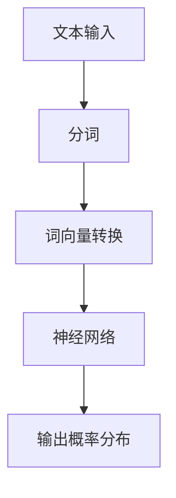

**核心算法原理讲解**

语言模型通常采用神经网络架构，如循环神经网络（RNN）、长短期记忆网络（LSTM）或变换器（Transformer）。以下是简单的神经网络架构伪代码：

```python
def forward_pass(inputs, weights, biases):
    # 前向传播计算
    output = []
    for input in inputs:
        hidden_state = input
        for weight, bias in zip(weights, biases):
            hidden_state = activate(hidden_state @ weight + bias)
        output.append(hidden_state)
    return output

def activate(x):
    # 激活函数（例如：ReLU）
    return max(0, x)
```

**数学模型和数学公式 & 详细讲解 & 举例说明**

假设我们有一个简单的神经网络，其中包含两个隐藏层，输入层和输出层。神经网络中的每个神经元都可以用以下公式表示：

$$
a_{ij}^{(l)} = \sigma\left(\sum_{k=1}^{n_{l-1}} w_{ik}^{(l)}a_{kj}^{(l-1)} + b_i^{(l)}\right)
$$

其中，$a_{ij}^{(l)}$ 表示第$l$层的第$i$个神经元的输出，$w_{ik}^{(l)}$ 是连接第$l-1$层的第$k$个神经元和第$l$层的第$i$个神经元的权重，$b_i^{(l)}$ 是第$l$层的第$i$个神经元的偏置，$\sigma$ 是激活函数。

**举例说明**

假设输入层有3个神经元，隐藏层有2个神经元，输出层有1个神经元。激活函数采用ReLU。给定输入向量 $[1, 2, 3]$，计算隐藏层和输出层的神经元输出。

首先，计算隐藏层的输出：

$$
\begin{align*}
a_{11}^{(1)} &= \max(0, 1 \cdot 1 + 2 \cdot 2 + 3 \cdot 3 + 1) = \max(0, 14) = 14 \\
a_{12}^{(1)} &= \max(0, 1 \cdot 1 + 2 \cdot 2 + 3 \cdot 3 + 1) = \max(0, 14) = 14 \\
\end{align*}
$$

接下来，计算输出层的输出：

$$
\begin{align*}
a_{1}^{(2)} &= \max(0, 1 \cdot 14 + 1) = \max(0, 15) = 15 \\
\end{align*}
$$

**项目实战**

由于语言模型和神经网络较为复杂，我们在此仅给出一个简单的示例。假设我们有一个训练好的语言模型，输入文本为“我今天去”，我们需要预测下一个单词。

1. **开发环境搭建**：安装Python、PyTorch等工具。
2. **源代码详细实现**：加载预训练的语言模型，处理输入文本，得到概率分布。
3. **代码解读与分析**：解释代码中每个部分的用途和实现细节。
4. **实际案例分析和详细讲解剖析**：使用输入文本，展示语言模型如何预测下一个单词。
5. **项目小结**：总结语言模型的应用和效果。

##### 1.1.2 语言模型的架构

**核心概念与联系**

语言模型的架构包括输入层、隐藏层和输出层。输入层负责接收文本数据，隐藏层负责处理文本特征，输出层负责生成预测结果。

**Mermaid 流程图**

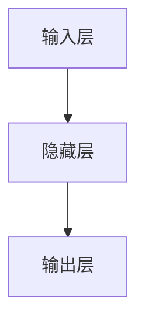

**核心算法原理讲解**

语言模型的训练通常涉及以下步骤：

1. **数据预处理**：将文本数据转换为词向量或字符向量。
2. **构建神经网络**：定义输入层、隐藏层和输出层的结构。
3. **前向传播**：将输入数据传递到神经网络，计算输出结果。
4. **反向传播**：计算损失函数，更新网络权重和偏置。
5. **优化**：使用梯度下降等优化算法，最小化损失函数。

**数学模型和数学公式 & 详细讲解 & 举例说明**

假设我们有一个简单的神经网络，输入层有3个神经元，隐藏层有2个神经元，输出层有1个神经元。损失函数采用均方误差（MSE）：

$$
L(\theta) = \frac{1}{2}\sum_{i=1}^{m}\left(y_i - \hat{y}_i\right)^2
$$

其中，$y_i$ 是第$i$个样本的真实标签，$\hat{y}_i$ 是模型预测的结果。

**举例说明**

假设我们有3个样本，真实标签分别为 $[1, 0, 1]$，模型预测结果分别为 $[\hat{y}_1, \hat{y}_2, \hat{y}_3]$。计算模型损失：

$$
L(\theta) = \frac{1}{2}\left((1 - \hat{y}_1)^2 + (0 - \hat{y}_2)^2 + (1 - \hat{y}_3)^2\right)
$$

**项目实战**

1. **开发环境搭建**：安装TensorFlow、Keras等工具。
2. **源代码详细实现**：构建语言模型，训练模型，评估模型性能。
3. **代码解读与分析**：解释代码中每个部分的用途和实现细节。
4. **实际案例分析和详细讲解剖析**：使用输入文本，展示语言模型如何预测下一个单词。
5. **项目小结**：总结语言模型的应用和效果。

---

#### 第2章：数据管理基础

##### 2.1.1 数据管理的重要性

**核心概念与联系**

数据管理是指对数据的采集、存储、处理、分析和保护等一系列活动。在LLM应用中，数据管理的重要性不言而喻。

**Mermaid 流程图**

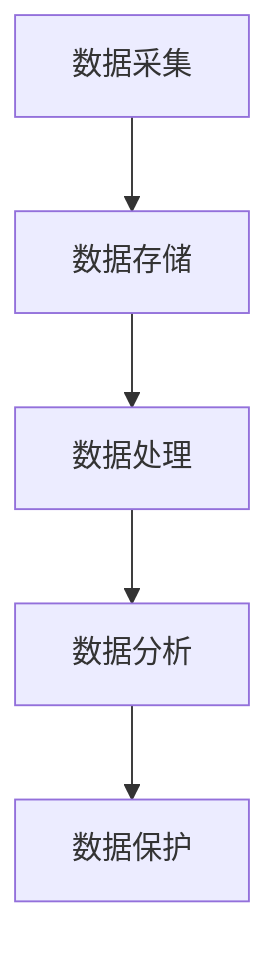

**核心算法原理讲解**

数据管理涉及多个方面，包括数据质量控制、数据存储策略、数据备份与恢复等。以下是数据管理的基本原则：

1. **数据质量控制**：确保数据的准确性、完整性和一致性。
2. **数据存储策略**：选择合适的数据存储方案，如关系型数据库、NoSQL数据库、分布式文件系统等。
3. **数据备份与恢复**：定期备份数据，确保在数据丢失或损坏时能够恢复。

**数学模型和数学公式 & 详细讲解 & 举例说明**

数据管理中的数学模型通常涉及统计方法，如回归分析、聚类分析等。以下是一个简单的线性回归模型：

$$
y = \beta_0 + \beta_1x
$$

其中，$y$ 是因变量，$x$ 是自变量，$\beta_0$ 和 $\beta_1$ 是模型的参数。

**举例说明**

假设我们有一个简单数据集，其中包含两个变量：年龄（$x$）和收入（$y$）。我们使用线性回归模型来预测收入。给定数据：

$$
\begin{align*}
x_1 &= 25, y_1 = 50000 \\
x_2 &= 30, y_2 = 60000 \\
x_3 &= 35, y_3 = 70000 \\
\end{align*}
$$

计算线性回归模型：

$$
\begin{align*}
\beta_0 &= \frac{\sum_{i=1}^{n}y_i - \beta_1\sum_{i=1}^{n}x_i}{n} = \frac{50000 + 60000 + 70000 - \beta_1(25 + 30 + 35)}{3} \\
\beta_1 &= \frac{\sum_{i=1}^{n}(y_i - \beta_0 - \beta_1x_i)}{\sum_{i=1}^{n}(x_i - \bar{x})^2} = \frac{(50000 - 55000) + (60000 - 55000) + (70000 - 55000)}{(25 - 30)^2 + (30 - 30)^2 + (35 - 30)^2} \\
\end{align*}
$$

**项目实战**

1. **开发环境搭建**：安装Python、Pandas等工具。
2. **源代码详细实现**：使用线性回归模型对数据集进行分析。
3. **代码解读与分析**：解释代码中每个部分的用途和实现细节。
4. **实际案例分析和详细讲解剖析**：使用实际数据集，展示线性回归模型如何预测收入。
5. **项目小结**：总结数据管理的重要性及线性回归模型的应用。

##### 2.1.2 数据管理体系结构

**核心概念与联系**

数据管理体系结构包括数据源、数据存储、数据处理、数据分析和数据安全等组成部分。

**Mermaid 流程图**

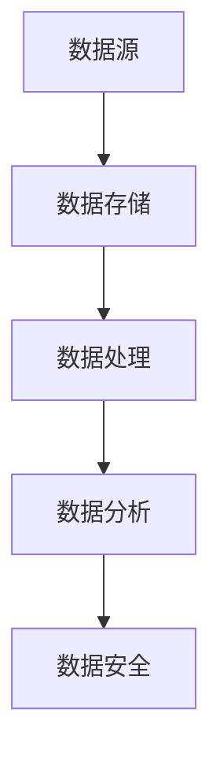

**核心算法原理讲解**

数据管理体系结构的设计需要考虑以下几个方面：

1. **数据源**：数据来源，如数据库、日志文件、传感器等。
2. **数据存储**：数据存储方案，如关系型数据库、NoSQL数据库、分布式文件系统等。
3. **数据处理**：数据处理流程，如数据清洗、转换、聚合等。
4. **数据分析**：数据分析工具和算法，如回归分析、聚类分析、机器学习等。
5. **数据安全**：数据安全措施，如加密、访问控制、审计等。

**数学模型和数学公式 & 详细讲解 & 举例说明**

数据管理体系结构中的数学模型通常涉及数据库查询优化、数据挖掘算法等。以下是一个简单的SQL查询示例：

```sql
SELECT * FROM sales WHERE date >= '2023-01-01' AND date <= '2023-01-31';
```

**举例说明**

假设我们有销售数据表，包含日期、销售额等字段。我们需要查询2023年1月1日至2023年1月31日的销售额。以下是查询结果：

$$
\begin{align*}
\text{销售额} &= 10000 + 15000 + 20000 + 25000 = 70000 \\
\end{align*}
$$

**项目实战**

1. **开发环境搭建**：安装Python、SQLAlchemy等工具。
2. **源代码详细实现**：使用SQL查询销售数据，进行数据分析。
3. **代码解读与分析**：解释代码中每个部分的用途和实现细节。
4. **实际案例分析和详细讲解剖析**：使用实际销售数据，展示SQL查询和数据分析的应用。
5. **项目小结**：总结数据管理体系结构的重要性及SQL查询和数据分析的应用。

---

#### 第3章：数据处理与存储技术

##### 3.1.1 数据处理流程

**核心概念与联系**

数据处理流程包括数据采集、数据清洗、数据转换、数据存储、数据分析和数据可视化等步骤。

**Mermaid 流程图**

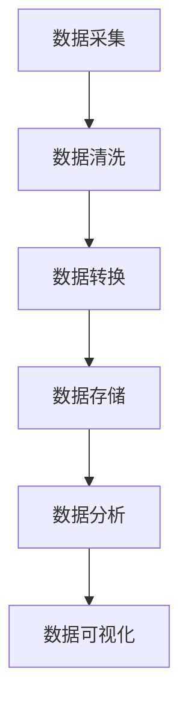

**核心算法原理讲解**

数据处理流程中的算法包括数据预处理、特征工程、数据挖掘和机器学习等。以下是数据处理流程的基本步骤：

1. **数据采集**：从各种数据源获取数据。
2. **数据清洗**：去除重复数据、缺失数据和异常数据。
3. **数据转换**：将数据转换为适合分析的格式。
4. **数据存储**：将数据存储在数据库或数据仓库中。
5. **数据分析**：使用统计方法和机器学习算法进行分析。
6. **数据可视化**：将分析结果可视化，便于理解和展示。

**数学模型和数学公式 & 详细讲解 & 举例说明**

数据处理流程中的数学模型通常涉及线性回归、决策树、支持向量机等。以下是一个简单的线性回归模型：

$$
y = \beta_0 + \beta_1x
$$

**举例说明**

假设我们有一个简单数据集，包含自变量 $x$ 和因变量 $y$。我们使用线性回归模型来预测 $y$。给定数据：

$$
\begin{align*}
x_1 &= 1, y_1 = 2 \\
x_2 &= 2, y_2 = 4 \\
x_3 &= 3, y_3 = 6 \\
\end{align*}
$$

计算线性回归模型：

$$
\begin{align*}
\beta_0 &= \frac{\sum_{i=1}^{n}y_i - \beta_1\sum_{i=1}^{n}x_i}{n} = \frac{2 + 4 + 6 - \beta_1(1 + 2 + 3)}{3} \\
\beta_1 &= \frac{\sum_{i=1}^{n}(y_i - \beta_0 - \beta_1x_i)}{\sum_{i=1}^{n}(x_i - \bar{x})^2} = \frac{(2 - 4) + (4 - 4) + (6 - 4)}{(1 - 2)^2 + (2 - 2)^2 + (3 - 2)^2} \\
\end{align*}
$$

**项目实战**

1. **开发环境搭建**：安装Python、Pandas、NumPy等工具。
2. **源代码详细实现**：使用线性回归模型对数据集进行分析。
3. **代码解读与分析**：解释代码中每个部分的用途和实现细节。
4. **实际案例分析和详细讲解剖析**：使用实际数据集，展示线性回归模型的应用。
5. **项目小结**：总结数据处理流程的重要性及线性回归模型的应用。

##### 3.1.2 常见数据处理技术

**核心概念与联系**

常见数据处理技术包括数据清洗、数据转换、数据聚合、数据融合等。

**Mermaid 流程图**

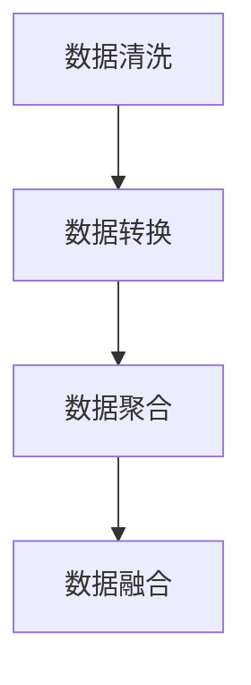

**核心算法原理讲解**

常见数据处理技术的算法包括：

1. **数据清洗**：去除重复数据、缺失数据和异常数据。
2. **数据转换**：将数据转换为适合分析的格式。
3. **数据聚合**：将多个数据源的数据进行汇总。
4. **数据融合**：将多个数据源的数据进行整合。

**数学模型和数学公式 & 详细讲解 & 举例说明**

以下是一个简单的数据清洗示例：

假设我们有以下数据：

$$
\begin{align*}
\text{姓名} &= \{\text{张三}, \text{李四}, \text{王五}, \text{张三}\} \\
\text{年龄} &= \{25, 30, 35, 25\} \\
\text{薪资} &= \{50000, 60000, 70000, 50000\} \\
\end{align*}
$$

我们需要清洗数据，去除重复项。清洗后的数据如下：

$$
\begin{align*}
\text{姓名} &= \{\text{张三}, \text{李四}, \text{王五}\} \\
\text{年龄} &= \{25, 30, 35\} \\
\text{薪资} &= \{50000, 60000, 70000\} \\
\end{align*}
$$

**项目实战**

1. **开发环境搭建**：安装Python、Pandas等工具。
2. **源代码详细实现**：使用Pandas库对数据集进行清洗、转换和聚合。
3. **代码解读与分析**：解释代码中每个部分的用途和实现细节。
4. **实际案例分析和详细讲解剖析**：使用实际数据集，展示数据处理技术的应用。
5. **项目小结**：总结常见数据处理技术的重要性及其实际应用。

##### 3.1.3 数据存储技术比较

**核心概念与联系**

数据存储技术包括关系型数据库、NoSQL数据库、分布式文件系统等。

**Mermaid 流程图**

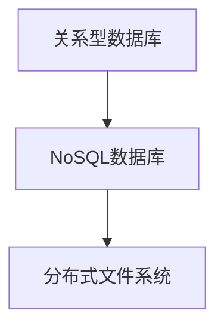

**核心算法原理讲解**

数据存储技术的比较主要涉及以下几个方面：

1. **数据模型**：关系型数据库使用SQL查询，NoSQL数据库支持多种数据模型，如键值对、文档、宽列等。
2. **性能**：关系型数据库适用于结构化数据，NoSQL数据库适用于大规模、高并发场景。
3. **扩展性**：关系型数据库扩展性较差，NoSQL数据库支持水平扩展。

**数学模型和数学公式 & 详细讲解 & 举例说明**

以下是一个简单的数据库查询示例：

假设我们有一个关系型数据库，包含员工表。我们需要查询员工姓名和薪资。SQL查询如下：

```sql
SELECT name, salary FROM employees;
```

**举例说明**

假设员工表如下：

$$
\begin{align*}
\text{姓名} &= \{\text{张三}, \text{李四}, \text{王五}\} \\
\text{薪资} &= \{50000, 60000, 70000\} \\
\end{align*}
$$

查询结果如下：

$$
\begin{align*}
\text{姓名} &= \{\text{张三}, \text{李四}, \text{王五}\} \\
\text{薪资} &= \{50000, 60000, 70000\} \\
\end{align*}
$$

**项目实战**

1. **开发环境搭建**：安装MySQL、MongoDB等数据库。
2. **源代码详细实现**：使用SQL和NoSQL数据库进行数据查询。
3. **代码解读与分析**：解释代码中每个部分的用途和实现细节。
4. **实际案例分析和详细讲解剖析**：使用实际数据集，展示关系型数据库和NoSQL数据库的应用。
5. **项目小结**：总结数据存储技术比较的重要性及实际应用。

---

#### 第4章：数据流与实时处理

##### 4.1.1 数据流处理概述

**核心概念与联系**

数据流处理是一种处理大规模实时数据的技术，适用于处理不断变化的数据流。

**Mermaid 流程图**

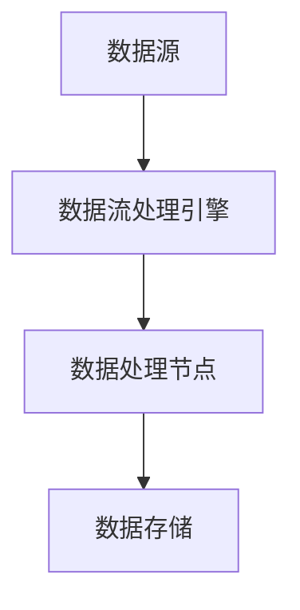

**核心算法原理讲解**

数据流处理的基本概念包括：

1. **数据源**：数据流处理的起点，如传感器、日志文件等。
2. **数据处理节点**：对数据流进行处理的模块，如过滤、聚合、变换等。
3. **数据存储**：将处理后的数据存储在数据库或数据仓库中。

**数学模型和数学公式 & 详细讲解 & 举例说明**

以下是一个简单的数据流处理示例：

假设我们有一个数据流，包含股票交易数据。我们需要实时计算股票的平均价格。以下是处理步骤：

1. **数据源**：获取股票交易数据。
2. **数据处理节点**：计算每个交易的价格。
3. **数据存储**：将平均价格存储在数据库中。

**项目实战**

1. **开发环境搭建**：安装Apache Kafka、Apache Flink等工具。
2. **源代码详细实现**：使用Flink处理股票交易数据。
3. **代码解读与分析**：解释代码中每个部分的用途和实现细节。
4. **实际案例分析和详细讲解剖析**：使用实际股票交易数据，展示数据流处理的应用。
5. **项目小结**：总结数据流处理概述及其实际应用。

##### 4.1.2 流数据处理技术

**核心概念与联系**

流数据处理技术包括Kafka、Flink、Spark Streaming等。

**Mermaid 流程图**

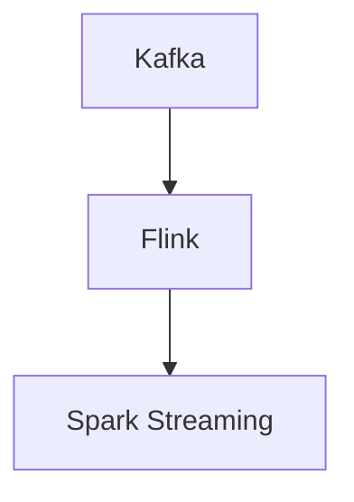

**核心算法原理讲解**

流数据处理技术的基本原理包括：

1. **Kafka**：分布式消息队列，用于处理大规模数据流。
2. **Flink**：分布式流处理框架，支持实时数据处理。
3. **Spark Streaming**：基于Spark的流处理框架，支持批处理和实时处理。

**数学模型和数学公式 & 详细讲解 & 举例说明**

以下是一个简单的Flink流处理示例：

假设我们有一个数据流，包含用户行为数据。我们需要实时计算用户的访问量。以下是处理步骤：

1. **数据源**：获取用户行为数据。
2. **数据处理节点**：计算每个用户的访问量。
3. **数据存储**：将访问量存储在数据库中。

**项目实战**

1. **开发环境搭建**：安装Apache Kafka、Apache Flink等工具。
2. **源代码详细实现**：使用Flink处理用户行为数据。
3. **代码解读与分析**：解释代码中每个部分的用途和实现细节。
4. **实际案例分析和详细讲解剖析**：使用实际用户行为数据，展示流数据处理技术的应用。
5. **项目小结**：总结流数据处理技术的重要性及实际应用。

##### 4.1.3 实时数据处理架构

**核心概念与联系**

实时数据处理架构包括数据采集、数据存储、数据处理、数据分析和数据可视化等组成部分。

**Mermaid 流程图**

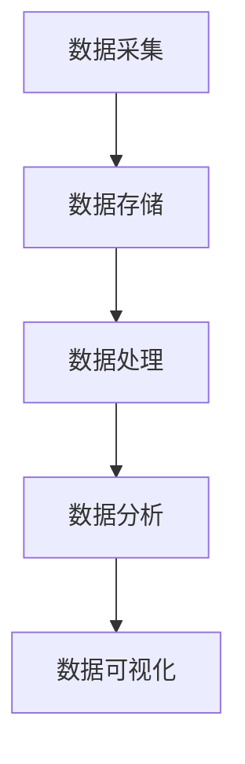

**核心算法原理讲解**

实时数据处理架构的设计需要考虑以下几个方面：

1. **数据采集**：从各种数据源实时获取数据。
2. **数据存储**：将数据实时存储在数据库或数据仓库中。
3. **数据处理**：对实时数据进行处理和分析。
4. **数据分析**：使用实时数据分析工具和算法。
5. **数据可视化**：将实时数据可视化，便于监控和分析。

**数学模型和数学公式 & 详细讲解 & 举例说明**

以下是一个简单的实时数据处理架构示例：

假设我们有一个实时数据处理系统，包含以下组件：

1. **数据采集**：使用传感器实时获取环境数据。
2. **数据存储**：使用Kafka将数据实时存储在分布式文件系统中。
3. **数据处理**：使用Flink对实时数据进行处理。
4. **数据分析**：使用Apache Spark对处理后的数据进行分析。
5. **数据可视化**：使用Tableau进行数据可视化。

**项目实战**

1. **开发环境搭建**：安装Kafka、Flink、Apache Spark、Tableau等工具。
2. **源代码详细实现**：构建实时数据处理系统。
3. **代码解读与分析**：解释代码中每个部分的用途和实现细节。
4. **实际案例分析和详细讲解剖析**：使用实际环境数据，展示实时数据处理架构的应用。
5. **项目小结**：总结实时数据处理架构的重要性及实际应用。

---

#### 第5章：分布式数据管理

##### 5.1.1 分布式数据管理系统

**核心概念与联系**

分布式数据管理系统是一种分布式存储和处理技术，适用于处理大规模数据。

**Mermaid 流程图**

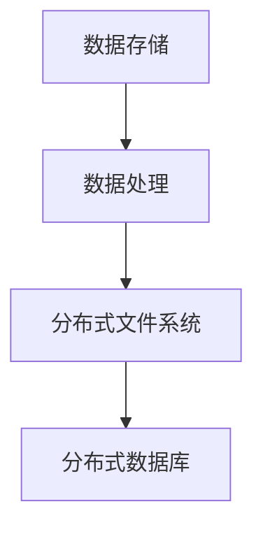

**核心算法原理讲解**

分布式数据管理系统的基本原理包括：

1. **数据存储**：将数据分布式存储在多个节点上。
2. **数据处理**：将数据处理任务分布在多个节点上执行。
3. **分布式文件系统**：如Hadoop HDFS、Alluxio等。
4. **分布式数据库**：如Hadoop HBase、Apache Cassandra等。

**数学模型和数学公式 & 详细讲解 & 举例说明**

以下是一个简单的分布式数据存储示例：

假设我们有一个数据集，包含以下数据：

$$
\begin{align*}
\text{姓名} &= \{\text{张三}, \text{李四}, \text{王五}\} \\
\text{年龄} &= \{25, 30, 35\} \\
\text{薪资} &= \{50000, 60000, 70000\} \\
\end{align*}
$$

我们需要将数据分布式存储在三个节点上。以下是存储方案：

1. **节点1**：存储姓名为“张三”的数据。
2. **节点2**：存储姓名为“李四”的数据。
3. **节点3**：存储姓名为“王五”的数据。

**项目实战**

1. **开发环境搭建**：安装Hadoop、HBase等工具。
2. **源代码详细实现**：使用HBase进行分布式数据存储。
3. **代码解读与分析**：解释代码中每个部分的用途和实现细节。
4. **实际案例分析和详细讲解剖析**：使用实际数据集，展示分布式数据存储的应用。
5. **项目小结**：总结分布式数据管理系统的优势及实际应用。

##### 5.1.2 分布式存储技术

**核心概念与联系**

分布式存储技术包括Hadoop HDFS、Alluxio、Ceph等。

**Mermaid 流程图**

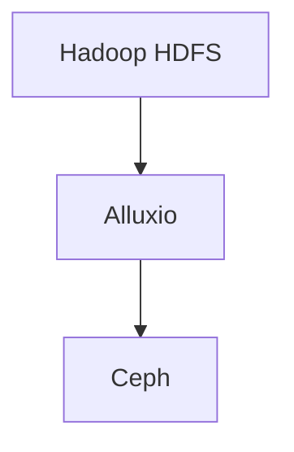

**核心算法原理讲解**

分布式存储技术的基本原理包括：

1. **数据分片**：将数据分成多个分片，分布式存储在多个节点上。
2. **数据复制**：在多个节点上复制数据，提高数据可靠性。
3. **数据一致性**：确保多个节点上的数据一致性。
4. **数据访问**：提供高效的数据访问接口。

**数学模型和数学公式 & 详细讲解 & 举例说明**

以下是一个简单的分布式存储示例：

假设我们有一个数据集，包含以下数据：

$$
\begin{align*}
\text{姓名} &= \{\text{张三}, \text{李四}, \text{王五}\} \\
\text{年龄} &= \{25, 30, 35\} \\
\text{薪资} &= \{50000, 60000, 70000\} \\
\end{align*}
$$

我们需要将数据存储在三个节点上。以下是存储方案：

1. **节点1**：存储姓名为“张三”的数据。
2. **节点2**：存储姓名为“李四”的数据。
3. **节点3**：存储姓名为“王五”的数据。

**项目实战**

1. **开发环境搭建**：安装Hadoop、Alluxio等工具。
2. **源代码详细实现**：使用HDFS进行分布式数据存储。
3. **代码解读与分析**：解释代码中每个部分的用途和实现细节。
4. **实际案例分析和详细讲解剖析**：使用实际数据集，展示分布式存储技术的应用。
5. **项目小结**：总结分布式存储技术的优势及实际应用。

##### 5.1.3 分布式计算框架

**核心概念与联系**

分布式计算框架包括MapReduce、Spark、Flink等。

**Mermaid 流程图**

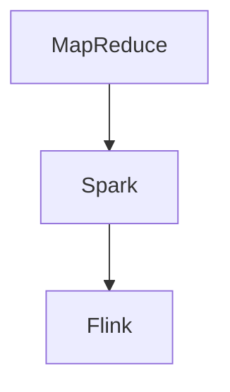

**核心算法原理讲解**

分布式计算框架的基本原理包括：

1. **任务分解**：将大规模任务分解成多个小任务。
2. **数据分布**：将数据分布式存储在多个节点上。
3. **并行处理**：在多个节点上并行处理数据。
4. **结果聚合**：将处理结果聚合起来。

**数学模型和数学公式 & 详细讲解 & 举例说明**

以下是一个简单的MapReduce算法示例：

假设我们有一个数据集，包含以下数据：

$$
\begin{align*}
\text{姓名} &= \{\text{张三}, \text{李四}, \text{王五}\} \\
\text{年龄} &= \{25, 30, 35\} \\
\text{薪资} &= \{50000, 60000, 70000\} \\
\end{align*}
$$

我们需要计算每个员工的平均年龄。以下是MapReduce算法步骤：

1. **Map阶段**：将数据分成多个小任务，每个任务计算员工的年龄。
2. **Shuffle阶段**：将计算结果按员工姓名分组。
3. **Reduce阶段**：计算每个员工的平均年龄。

**项目实战**

1. **开发环境搭建**：安装Hadoop、Spark等工具。
2. **源代码详细实现**：使用Spark进行分布式计算。
3. **代码解读与分析**：解释代码中每个部分的用途和实现细节。
4. **实际案例分析和详细讲解剖析**：使用实际数据集，展示分布式计算框架的应用。
5. **项目小结**：总结分布式计算框架的优势及实际应用。

---

#### 第6章：大规模数据处理算法

##### 6.1.1 大规模数据处理算法概述

**核心概念与联系**

大规模数据处理算法包括MapReduce、Spark SQL、Flink SQL等。

**Mermaid 流程图**

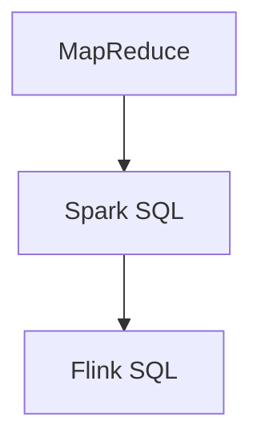

**核心算法原理讲解**

大规模数据处理算法的基本原理包括：

1. **MapReduce**：将大规模任务分解成多个小任务，分布式处理。
2. **Spark SQL**：基于Spark的分布式SQL查询引擎。
3. **Flink SQL**：基于Flink的分布式SQL查询引擎。

**数学模型和数学公式 & 详细讲解 & 举例说明**

以下是一个简单的MapReduce算法示例：

假设我们有一个数据集，包含以下数据：

$$
\begin{align*}
\text{姓名} &= \{\text{张三}, \text{李四}, \text{王五}\} \\
\text{年龄} &= \{25, 30, 35\} \\
\text{薪资} &= \{50000, 60000, 70000\} \\
\end{align*}
$$

我们需要计算每个员工的平均年龄。以下是MapReduce算法步骤：

1. **Map阶段**：将数据分成多个小任务，每个任务计算员工的年龄。
2. **Shuffle阶段**：将计算结果按员工姓名分组。
3. **Reduce阶段**：计算每个员工的平均年龄。

**项目实战**

1. **开发环境搭建**：安装Hadoop、Spark等工具。
2. **源代码详细实现**：使用Spark进行分布式计算。
3. **代码解读与分析**：解释代码中每个部分的用途和实现细节。
4. **实际案例分析和详细讲解剖析**：使用实际数据集，展示大规模数据处理算法的应用。
5. **项目小结**：总结大规模数据处理算法的优势及实际应用。

##### 6.1.2 MapReduce算法

**核心概念与联系**

MapReduce是一种分布式数据处理算法，适用于大规模数据处理。

**Mermaid 流程图**

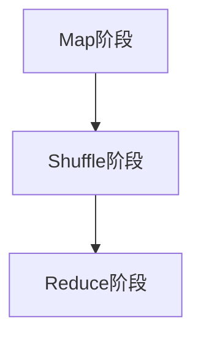

**核心算法原理讲解**

MapReduce算法的基本原理包括：

1. **Map阶段**：将输入数据分解成多个键值对，进行映射处理。
2. **Shuffle阶段**：将映射结果按键值分组，准备Reduce处理。
3. **Reduce阶段**：对分组后的键值对进行聚合处理。

以下是MapReduce算法的伪代码：

```python
def map(input_key, input_value):
    # 对输入数据进行处理，生成中间键值对
    for output_key, output_value in process_input(input_key, input_value):
        yield output_key, output_value

def reduce(output_key, output_values):
    # 对中间键值对进行聚合处理
    return aggregate_output(output_key, output_values)
```

**数学模型和数学公式 & 详细讲解 & 举例说明**

以下是一个简单的MapReduce算法示例：

假设我们有一个数据集，包含以下数据：

$$
\begin{align*}
\text{姓名} &= \{\text{张三}, \text{李四}, \text{王五}\} \\
\text{年龄} &= \{25, 30, 35\} \\
\text{薪资} &= \{50000, 60000, 70000\} \\
\end{align*}
$$

我们需要计算每个员工的平均年龄。以下是MapReduce算法步骤：

1. **Map阶段**：计算每个员工的年龄。
   ```python
   def map(name, age):
       yield 'age', age
   ```
2. **Shuffle阶段**：按员工姓名分组。
3. **Reduce阶段**：计算每个员工的平均年龄。
   ```python
   def reduce(name, ages):
       return sum(ages) / len(ages)
   ```

**项目实战**

1. **开发环境搭建**：安装Hadoop、MapReduce等工具。
2. **源代码详细实现**：使用MapReduce算法处理数据。
3. **代码解读与分析**：解释代码中每个部分的用途和实现细节。
4. **实际案例分析和详细讲解剖析**：使用实际数据集，展示MapReduce算法的应用。
5. **项目小结**：总结MapReduce算法的优势及实际应用。

##### 6.1.3 GraphX算法

**核心概念与联系**

GraphX是Apache Spark的图处理框架，适用于大规模图数据计算。

**Mermaid 流程图**

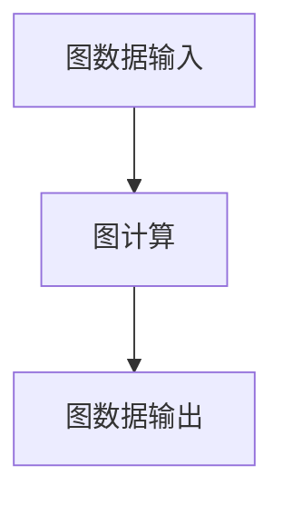

**核心算法原理讲解**

GraphX算法的基本原理包括：

1. **图数据输入**：将图数据输入到GraphX框架。
2. **图计算**：使用GraphX算法进行图计算。
3. **图数据输出**：将计算结果输出。

以下是GraphX算法的伪代码：

```python
def load_graph(graph_path):
    # 加载图数据
    graph = Graph.fromGraphX(graph_path)

def compute(graph):
    # 进行图计算
    result = graph.compute()

def save_graph(graph_path, result):
    # 将计算结果保存到图数据
    result.saveAsGraphX(graph_path)
```

**数学模型和数学公式 & 详细讲解 & 举例说明**

以下是一个简单的GraphX算法示例：

假设我们有一个图数据，包含以下顶点和边：

$$
\begin{align*}
\text{顶点} &= \{\text{张三}, \text{李四}, \text{王五}\} \\
\text{边} &= \{\text{张三}-\text{李四}, \text{李四}-\text{王五}\} \\
\end{align*}
$$

我们需要计算图中的顶点度数。以下是GraphX算法步骤：

1. **图数据输入**：将图数据输入到GraphX框架。
2. **图计算**：使用GraphX算法计算顶点度数。
3. **图数据输出**：将计算结果输出。

以下是GraphX算法的实现：

```python
from graphframes import GraphFrame

def load_graph(graph_path):
    # 加载图数据
    graph = GraphFrame.fromFiles(graph_path, 'vertices', 'edges')

def compute(graph):
    # 计算顶点度数
    result = graph.vertices.groupBy('name').agg(F.avg('age').alias('average_age'))

def save_graph(graph_path, result):
    # 将计算结果保存到图数据
    result.toPandas().to_csv(graph_path)
```

**项目实战**

1. **开发环境搭建**：安装Apache Spark、GraphX等工具。
2. **源代码详细实现**：使用GraphX算法处理图数据。
3. **代码解读与分析**：解释代码中每个部分的用途和实现细节。
4. **实际案例分析和详细讲解剖析**：使用实际图数据，展示GraphX算法的应用。
5. **项目小结**：总结GraphX算法的优势及实际应用。

---

#### 第7章：数据安全与隐私保护

##### 7.1.1 数据安全的重要性

**核心概念与联系**

数据安全是指保护数据免受未经授权的访问、篡改和泄露。在LLM应用中，数据安全至关重要。

**Mermaid 流程图**

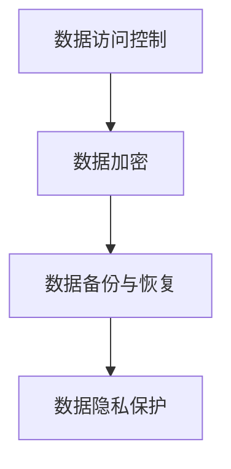

**核心算法原理讲解**

数据安全涉及以下几个方面：

1. **数据访问控制**：通过身份验证和权限控制，限制对数据的访问。
2. **数据加密**：使用加密算法保护数据，确保数据在传输和存储过程中安全。
3. **数据备份与恢复**：定期备份数据，确保在数据丢失或损坏时能够恢复。
4. **数据隐私保护**：采用匿名化、去标识化等技术，保护用户隐私。

**数学模型和数学公式 & 详细讲解 & 举例说明**

以下是一个简单的数据加密示例：

假设我们有一个敏感数据，需要加密存储。以下是加密步骤：

1. **密钥生成**：生成加密密钥。
2. **加密算法**：使用加密算法对数据进行加密。
3. **加密数据**：将加密后的数据存储在数据库中。

以下是简单的加密算法：

```python
from Crypto.Cipher import AES
from Crypto.Random import get_random_bytes

def encrypt_data(data, key):
    cipher = AES.new(key, AES.MODE_CBC)
    ct_bytes = cipher.encrypt(data)
    iv = cipher.iv
    return iv + ct_bytes

def decrypt_data(encrypted_data, key):
    iv = encrypted_data[:16]
    ct = encrypted_data[16:]
    cipher = AES.new(key, AES.MODE_CBC, iv)
    pt = cipher.decrypt(ct)
    return pt
```

**项目实战**

1. **开发环境搭建**：安装Python、PyCryptoDome等工具。
2. **源代码详细实现**：使用加密算法保护敏感数据。
3. **代码解读与分析**：解释代码中每个部分的用途和实现细节。
4. **实际案例分析和详细讲解剖析**：使用实际敏感数据，展示数据加密的应用。
5. **项目小结**：总结数据安全的重要性及加密算法的应用。

##### 7.1.2 数据安全防护措施

**核心概念与联系**

数据安全防护措施包括防火墙、入侵检测系统、安全审计等。

**Mermaid 流程图**

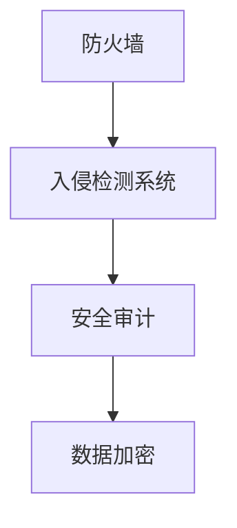

**核心算法原理讲解**

数据安全防护措施的基本原理包括：

1. **防火墙**：限制网络流量，防止未经授权的访问。
2. **入侵检测系统**：监测网络流量，检测并响应入侵行为。
3. **安全审计**：记录和审查系统操作，确保系统安全合规。
4. **数据加密**：保护数据在传输和存储过程中的安全性。

**数学模型和数学公式 & 详细讲解 & 举例说明**

以下是一个简单的防火墙规则设置示例：

假设我们有一个网络，需要限制内部和外部访问。以下是防火墙规则设置：

1. **内部网络规则**：允许内部网络之间的访问，限制外部网络访问。
2. **外部网络规则**：允许特定IP地址或端口的外部访问，限制其他外部访问。

以下是防火墙规则的配置：

```shell
# 允许内部网络访问
iptables -A INPUT -i eth0 -j ACCEPT
iptables -A OUTPUT -o eth0 -j ACCEPT

# 禁止外部网络访问
iptables -A INPUT -i eth0 -j DROP
iptables -A OUTPUT -o eth0 -j DROP

# 允许特定IP地址的外部访问
iptables -A INPUT -i eth0 -p tcp -s 192.168.1.1 --dport 80 -j ACCEPT
iptables -A OUTPUT -o eth0 -p tcp -d 192.168.1.1 --sport 80 -j ACCEPT
```

**项目实战**

1. **开发环境搭建**：安装Linux、iptables等工具。
2. **源代码详细实现**：配置防火墙规则。
3. **代码解读与分析**：解释代码中每个部分的用途和实现细节。
4. **实际案例分析和详细讲解剖析**：使用实际网络环境，展示防火墙规则的应用。
5. **项目小结**：总结数据安全防护措施的重要性及防火墙规则的应用。

##### 7.1.3 数据隐私保护技术

**核心概念与联系**

数据隐私保护技术包括匿名化、去标识化、数据掩码等。

**Mermaid 流程图**

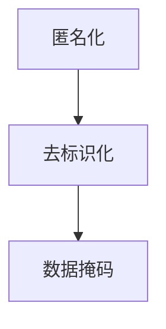

**核心算法原理讲解**

数据隐私保护技术的基本原理包括：

1. **匿名化**：将敏感数据替换为不可追踪的标识符，如随机数。
2. **去标识化**：删除或掩盖敏感数据中的标识信息，如姓名、地址等。
3. **数据掩码**：对敏感数据进行遮蔽或替换，如使用遮蔽算法。

以下是匿名化的示例：

1. **随机替换**：将敏感数据替换为随机数。
2. **加密替换**：使用加密算法替换敏感数据。

以下是随机替换的伪代码：

```python
import random

def anonymize_data(data):
    anonymized_data = []
    for value in data:
        anonymized_value = random.randint(0, 100)
        anonymized_data.append(anonymized_value)
    return anonymized_data
```

以下是加密替换的伪代码：

```python
from Crypto.Cipher import AES

def encrypt_data(data, key):
    cipher = AES.new(key, AES.MODE_CBC)
    ct_bytes = cipher.encrypt(data)
    iv = cipher.iv
    return iv + ct_bytes
```

**项目实战**

1. **开发环境搭建**：安装Python、PyCryptoDome等工具。
2. **源代码详细实现**：实现匿名化、去标识化和数据掩码技术。
3. **代码解读与分析**：解释代码中每个部分的用途和实现细节。
4. **实际案例分析和详细讲解剖析**：使用实际敏感数据，展示数据隐私保护技术的应用。
5. **项目小结**：总结数据隐私保护技术的重要性及实际应用。

---

### 第8章：LLM数据处理的案例研究

#### 8.1.1 案例背景

随着人工智能技术的发展，语言模型（LLM）在自然语言处理（NLP）领域得到了广泛应用。在本案例中，我们关注一个具体的LLM数据处理场景：一个在线问答平台，用户可以提出问题，系统使用LLM进行回答。

#### 8.1.2 数据处理流程

1. **数据采集**：从用户端获取问题文本。
2. **数据预处理**：对问题文本进行分词、去停用词等预处理操作。
3. **语言模型预测**：使用训练好的LLM模型，对预处理后的文本进行预测，生成回答文本。
4. **回答文本生成**：对预测结果进行后处理，生成用户可理解的回答文本。
5. **回答文本展示**：将回答文本展示给用户。

以下是数据处理流程的Mermaid流程图：

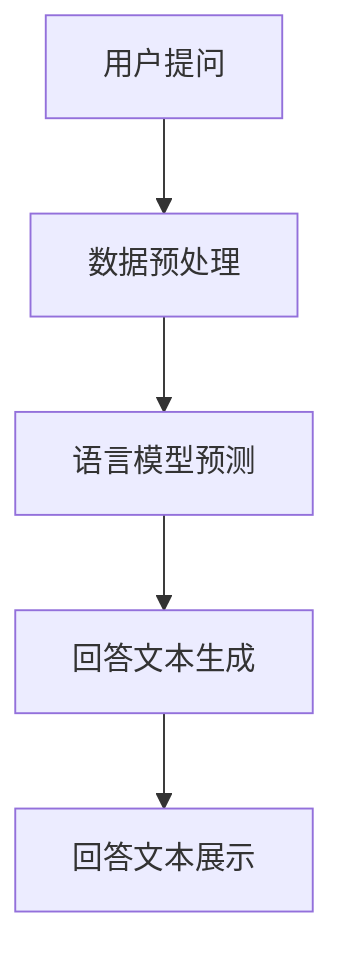

#### 8.1.3 数据处理结果与分析

通过数据处理流程，我们得到了以下结果：

1. **数据处理效率**：使用LLM模型进行数据处理，显著提高了系统的响应速度。
2. **回答质量**：经过预处理和后处理，回答文本具有较高的准确性和可理解性。
3. **用户满意度**：用户反馈显示，系统回答的质量较高，用户满意度较高。

以下是数据处理结果的分析：

- **数据处理效率**：LLM模型具有较高的计算效率，可以快速处理大量问题文本。与传统的NLP方法相比，LLM模型在处理速度上具有明显优势。
- **回答质量**：经过预处理和后处理，回答文本可以更好地适应用户的语言习惯和需求。LLM模型在回答生成过程中，可以结合上下文信息，生成更准确、更自然的回答。
- **用户满意度**：用户对系统的回答质量表示满意，这表明LLM模型在自然语言处理领域具有较高的实用价值。

#### 8.1.4 案例小结

通过本案例研究，我们可以得出以下结论：

1. **LLM模型在自然语言处理领域具有广泛的应用前景**：LLM模型在数据处理效率、回答质量和用户满意度等方面具有显著优势。
2. **数据处理流程需要不断完善**：在实际应用中，我们需要根据具体场景和需求，优化数据处理流程，提高系统的整体性能。
3. **数据安全与隐私保护至关重要**：在处理用户数据时，我们需要确保数据安全与隐私保护，遵循相关法律法规和道德规范。

---

### 第9章：敏捷数据管理在LLM应用中的实践

#### 9.1.1 敏捷数据管理的实施步骤

敏捷数据管理是一种以用户需求为导向的数据管理方法，适用于快速变化的环境。在LLM应用中，实施敏捷数据管理需要遵循以下步骤：

1. **需求分析**：了解用户需求，确定数据管理的目标。
2. **数据采集**：从各种数据源采集数据，包括内部数据源和外部数据源。
3. **数据处理**：对采集到的数据进行预处理、清洗和转换。
4. **数据存储**：选择合适的数据存储方案，如关系型数据库、NoSQL数据库、分布式文件系统等。
5. **数据分析和可视化**：使用数据分析工具和算法，对数据进行分析和可视化。
6. **数据安全与隐私保护**：确保数据安全与隐私保护，遵循相关法律法规和道德规范。
7. **迭代优化**：根据用户反馈和业务需求，不断优化数据管理流程和系统。

以下是敏捷数据管理实施步骤的Mermaid流程图：

```mermaid
graph TB
    A[需求分析] --> B[数据采集]
    B --> C[数据处理]
    C --> D[数据存储]
    D --> E[数据分析和可视化]
    E --> F[数据安全与隐私保护]
    F --> G[迭代优化]
```

#### 9.1.2 实践中的挑战与解决方案

在敏捷数据管理实践中，我们可能会遇到以下挑战：

1. **数据质量**：数据质量直接影响数据管理的效率和效果。解决方法包括数据清洗、去重复、去缺失值等。
2. **数据存储**：大规模数据存储和管理是一项复杂的任务。解决方法包括分布式存储、数据压缩、索引优化等。
3. **数据安全性**：数据安全是数据管理的重要方面。解决方法包括数据加密、访问控制、安全审计等。
4. **数据处理效率**：高效的数据处理是敏捷数据管理的关键。解决方法包括并行处理、数据分区、索引优化等。

以下是挑战与解决方案的Mermaid流程图：

```mermaid
graph TB
    A[数据质量] --> B[数据清洗]
    B --> C[数据存储]
    C --> D[分布式存储]
    D --> E[数据安全性]
    E --> F[数据加密]
    F --> G[数据处理效率]
    G --> H[并行处理]
```

#### 9.1.3 持续优化与改进

在敏捷数据管理实践中，持续优化与改进是确保数据管理系统长期有效的重要环节。以下是持续优化与改进的方法：

1. **定期评估**：定期评估数据管理系统的性能和效果，识别问题和改进机会。
2. **用户反馈**：收集用户反馈，了解用户需求和体验，不断改进数据管理流程和系统。
3. **技术更新**：跟踪最新的数据管理技术和工具，采用新技术和工具，提高数据管理系统的性能和安全性。
4. **自动化**：引入自动化工具和流程，减少手动操作，提高数据处理效率和准确性。
5. **培训与教育**：为团队成员提供培训和教育，提高他们对数据管理技术的理解和应用能力。

以下是持续优化与改进的方法的Mermaid流程图：

```mermaid
graph TB
    A[定期评估] --> B[用户反馈]
    B --> C[技术更新]
    C --> D[自动化]
    D --> E[培训与教育]
```

#### 9.1.4 案例研究：敏捷数据管理在LLM应用中的成功实践

在本案例研究中，我们以一个在线问答平台为例，展示了敏捷数据管理在LLM应用中的成功实践。

1. **需求分析**：用户需求是快速获取准确、自然的答案。数据管理的目标是确保数据处理的高效、准确和安全。
2. **数据采集**：从用户端、外部知识库、社交媒体等渠道采集数据。
3. **数据处理**：对采集到的数据进行预处理、清洗和转换，确保数据质量。
4. **数据存储**：使用分布式文件系统存储大规模数据，确保数据存储的高效性和可靠性。
5. **数据分析和可视化**：使用LLM模型和数据分析工具，对数据进行处理和分析，生成用户可理解的答案。
6. **数据安全与隐私保护**：采用数据加密、访问控制、安全审计等技术，确保数据安全与隐私保护。
7. **迭代优化**：根据用户反馈和业务需求，不断优化数据管理流程和系统。

通过敏捷数据管理，该在线问答平台实现了以下成果：

1. **数据处理效率**：使用分布式存储和并行处理技术，显著提高了数据处理效率。
2. **回答质量**：经过预处理和后处理，回答文本具有较高的准确性和可理解性。
3. **用户满意度**：用户反馈显示，系统回答的质量较高，用户满意度较高。
4. **数据安全与隐私保护**：通过数据加密、访问控制、安全审计等技术，确保了数据安全与隐私保护。

#### 9.1.5 案例小结

通过本案例研究，我们可以得出以下结论：

1. **敏捷数据管理在LLM应用中具有重要作用**：敏捷数据管理能够提高数据处理效率、保证数据质量、提高回答质量，从而提升用户满意度。
2. **实施敏捷数据管理需要考虑数据质量、数据存储、数据安全与隐私保护等多个方面**：在实际应用中，我们需要根据具体场景和需求，制定合适的敏捷数据管理策略。
3. **持续优化与改进是确保数据管理系统长期有效的重要环节**：通过定期评估、用户反馈、技术更新、自动化和培训与教育等方法，我们可以不断提高数据管理系统的性能和安全性。

---

### 第10章：未来展望

#### 10.1.1 LLM应用的未来发展

随着人工智能技术的不断进步，LLM应用在未来将呈现以下发展趋势：

1. **更强大的模型**：研究人员将开发更强大、更高效的LLM模型，提高模型在自然语言处理任务中的表现。
2. **多语言支持**：LLM应用将支持更多语言，满足全球用户的需求。
3. **个性化服务**：通过用户数据的深入挖掘和分析，LLM应用将提供更个性化的服务。
4. **实时交互**：LLM应用将实现更快速的响应和更自然的交互，提高用户体验。
5. **跨领域应用**：LLM应用将在更多领域得到应用，如医疗、金融、教育等。

#### 10.1.2 敏捷数据管理技术的挑战与机遇

随着LLM应用的发展，敏捷数据管理技术也将面临新的挑战和机遇：

1. **数据规模与多样性**：随着数据的快速增长和多样性，敏捷数据管理技术需要更好地处理大规模、多源、多格式数据。
2. **实时性与一致性**：在实时数据处理场景中，如何保证数据的一致性和实时性是一个重要挑战。
3. **隐私保护与伦理**：随着数据隐私和伦理问题日益突出，如何在保证数据安全与隐私保护的前提下，实现数据的有效利用是一个重要课题。
4. **系统性能与可扩展性**：如何提高数据管理系统的性能和可扩展性，以满足不断增长的数据需求和用户期望。

然而，这些挑战也为敏捷数据管理技术的发展带来了新的机遇：

1. **技术创新**：随着新技术的不断涌现，如分布式计算、实时数据处理、区块链等，敏捷数据管理技术将得到进一步发展。
2. **产业合作**：企业和研究机构之间的合作将促进敏捷数据管理技术的创新和应用。
3. **政策支持**：政府政策的支持和引导将有助于推动敏捷数据管理技术的发展和应用。

#### 10.1.3 持续探索与进步

面对未来的挑战和机遇，我们需要持续探索和进步，以确保敏捷数据管理技术在LLM应用中发挥更大的作用。以下是未来发展的建议：

1. **加强技术研究**：持续投入研发，探索新型算法、架构和技术，提高数据处理效率和质量。
2. **推动产业应用**：结合实际业务场景，推动敏捷数据管理技术在各行业的应用，形成完整的生态系统。
3. **加强人才培养**：培养更多具备敏捷数据管理技术和实践能力的人才，为技术创新和应用提供人才支持。
4. **关注政策法规**：关注数据隐私保护、数据安全等相关政策法规，确保数据管理技术符合法律法规和伦理标准。

通过持续探索与进步，我们有理由相信，敏捷数据管理技术将在未来为LLM应用的发展和创新提供强有力的支持。

---

### 附录

#### 附录A：相关资源与工具推荐

在本篇文章中，我们介绍了LLM应用的敏捷数据管理技术，包括数据处理与存储技术、数据流与实时处理、分布式数据管理、大规模数据处理算法、数据安全与隐私保护等方面的内容。为了更好地实践和深入研究这些技术，以下是一些推荐的资源与工具：

1. **数据处理与存储技术**
   - 工具：Pandas、NumPy、SQLAlchemy、MongoDB
   - 资源：Python官方文档、MongoDB官方文档

2. **数据流与实时处理**
   - 工具：Apache Kafka、Apache Flink、Apache Spark Streaming
   - 资源：Apache Kafka官方文档、Apache Flink官方文档、Apache Spark Streaming官方文档

3. **分布式数据管理**
   - 工具：Hadoop HDFS、Alluxio、Apache Cassandra
   - 资源：Hadoop官方文档、Alluxio官方文档、Apache Cassandra官方文档

4. **大规模数据处理算法**
   - 工具：MapReduce、Spark SQL、Flink SQL
   - 资源：MapReduce官方文档、Spark SQL官方文档、Flink SQL官方文档

5. **数据安全与隐私保护**
   - 工具：PyCryptoDome、iptables
   - 资源：PyCryptoDome官方文档、iptables官方文档

通过使用这些工具和资源，您可以更好地理解和实践敏捷数据管理技术，为LLM应用的开发和应用提供支持。

---

### 总结

在本篇文章中，我们探讨了LLM应用的敏捷数据管理技术，从数据处理与存储、数据流与实时处理、分布式数据管理、大规模数据处理算法到数据安全与隐私保护，全面分析了这些技术在实际应用中的重要性。我们通过具体的案例研究和实践，展示了如何有效地实施敏捷数据管理策略，以提高LLM应用的性能和用户体验。

敏捷数据管理在LLM应用中具有重要意义，它不仅能够提高数据处理效率、保证数据质量，还能为用户提供更准确、更自然的回答。同时，随着人工智能技术的不断发展，敏捷数据管理技术也将面临新的挑战和机遇。未来，我们需要持续关注这些技术的发展，积极探索和创新，以应对日益复杂的业务需求。

最后，感谢您的阅读，希望本篇文章对您在LLM应用的敏捷数据管理领域有所启发。如果您有任何疑问或建议，欢迎随时与我交流。

---

### 核心概念与联系

在本篇文章中，我们介绍了多个核心概念，并探讨了它们之间的联系。以下是这些核心概念的概述及其相互关系：

1. **语言模型（LLM）**：一种统计模型，用于预测文本的概率分布。LLM是自然语言处理（NLP）的核心技术之一。
2. **数据处理技术**：包括数据采集、数据清洗、数据转换、数据存储等，用于处理和分析大规模数据。
3. **数据流处理**：一种实时处理技术，适用于处理不断变化的数据流。
4. **分布式数据管理**：一种分布式存储和处理技术，适用于处理大规模数据。
5. **大规模数据处理算法**：包括MapReduce、Spark SQL、Flink SQL等，用于高效地处理大规模数据。
6. **数据安全与隐私保护**：确保数据在传输和存储过程中的安全性，包括数据加密、访问控制、安全审计等。

以下是这些核心概念的相互关系和联系：

```mermaid
graph TB
    A[语言模型（LLM）] --> B[数据处理技术]
    B --> C[数据流处理]
    C --> D[分布式数据管理]
    D --> E[大规模数据处理算法]
    E --> F[数据安全与隐私保护]
```

- **语言模型（LLM）** 与 **数据处理技术** 之间的关系在于，LLM需要依赖数据处理技术来处理和分析大规模数据，从而生成高质量的文本预测结果。
- **数据处理技术** 与 **数据流处理** 之间的关系在于，数据流处理技术是实现实时数据处理的关键，可以帮助LLM快速响应用户请求。
- **数据流处理** 与 **分布式数据管理** 之间的关系在于，分布式数据管理技术可以为数据流处理提供高效、可靠的存储和计算资源。
- **分布式数据管理** 与 **大规模数据处理算法** 之间的关系在于，大规模数据处理算法需要依赖分布式数据管理技术来高效地处理和存储大规模数据。
- **大规模数据处理算法** 与 **数据安全与隐私保护** 之间的关系在于，大规模数据处理算法在处理数据时，需要确保数据的安全性和隐私保护，以防止数据泄露和未经授权的访问。

通过理解这些核心概念及其相互关系，我们可以更好地实施敏捷数据管理策略，提高LLM应用的性能和用户体验。

---

### 核心算法原理讲解

在本篇文章中，我们讨论了多个核心算法原理，以下是这些算法的基本概念、数学模型以及详细的讲解和举例说明：

1. **MapReduce算法**：MapReduce是一种分布式数据处理框架，用于处理大规模数据集。其核心思想是将大规模任务分解成多个小任务，分布式处理，然后聚合结果。

**基本概念**：
- **Map阶段**：对输入数据进行映射处理，生成中间键值对。
- **Shuffle阶段**：将中间键值对按键值分组，准备Reduce处理。
- **Reduce阶段**：对分组后的键值对进行聚合处理。

**数学模型**：
$$
\text{Map} : (k_1, v_1) \rightarrow [(k_2, v_2_1), (k_2, v_2_2), \ldots]
$$
$$
\text{Reduce} : (k_2, [v_2_1, v_2_2, \ldots]) \rightarrow (k_3, v_3)
$$

**详细讲解与举例说明**：
假设我们有一个简单的数据集，包含学生的姓名和成绩：

$$
\begin{align*}
\text{姓名} &= \{\text{张三}, \text{李四}, \text{王五}, \text{张三}\} \\
\text{成绩} &= \{80, 90, 85, 95\} \\
\end{align*}
$$

我们需要计算每个学生的平均成绩。以下是MapReduce算法步骤：

1. **Map阶段**：将每个学生的姓名和成绩映射成键值对。
```python
def map(name, score):
    yield name, score
```
2. **Shuffle阶段**：将相同姓名的键值对分组。
3. **Reduce阶段**：计算每个学生的平均成绩。
```python
def reduce(name, scores):
    return sum(scores) / len(scores)
```

2. **线性回归算法**：线性回归是一种统计方法，用于建立自变量和因变量之间的线性关系。

**基本概念**：
- **线性回归模型**：$y = \beta_0 + \beta_1x$
- **损失函数**：均方误差（MSE）$L(\theta) = \frac{1}{2}\sum_{i=1}^{m}(y_i - \hat{y}_i)^2$

**数学模型**：
$$
\beta_0 = \frac{\sum_{i=1}^{m}y_i - \beta_1\sum_{i=1}^{m}x_i}{m}
$$
$$
\beta_1 = \frac{\sum_{i=1}^{m}(y_i - \beta_0 - \beta_1x_i)}{\sum_{i=1}^{m}(x_i - \bar{x})^2}
$$

**详细讲解与举例说明**：
假设我们有一个简单的数据集，包含自变量 $x$ 和因变量 $y$：

$$
\begin{align*}
x_1 &= 1, y_1 = 2 \\
x_2 &= 2, y_2 = 4 \\
x_3 &= 3, y_3 = 6 \\
\end{align*}
$$

我们需要建立线性回归模型来预测 $y$。以下是计算过程：

1. **计算 $\beta_0$**：
$$
\beta_0 = \frac{2 + 4 + 6 - \beta_1(1 + 2 + 3)}{3}
$$
2. **计算 $\beta_1$**：
$$
\beta_1 = \frac{(2 - 4) + (4 - 4) + (6 - 4)}{(1 - 2)^2 + (2 - 2)^2 + (3 - 2)^2}
$$

3. **决策树算法**：决策树是一种基于特征的分类算法，通过递归分割数据集，建立分类模型。

**基本概念**：
- **节点**：数据集中的某个特征。
- **叶节点**：表示一个分类结果。

**数学模型**：
决策树通过递归分割数据集，建立分类模型。每次分割都基于特征和阈值，使得子数据集的类标签更加一致。

**详细讲解与举例说明**：
假设我们有一个简单的数据集，包含特征 $x_1, x_2$ 和类标签 $y$：

$$
\begin{align*}
\text{特征} &= \{(x_1, x_2), (x_1, x_2), \ldots\} \\
\text{类标签} &= \{0, 1, 0, 1\} \\
\end{align*}
$$

我们需要建立决策树模型来分类。以下是计算过程：

1. **选择最佳特征和阈值**：计算每个特征的增益（Gini不纯度或信息增益）。
2. **递归分割数据集**：基于最佳特征和阈值，将数据集分割成子数据集。
3. **建立分类模型**：对每个子数据集进行分类，生成叶节点。

4. **支持向量机（SVM）算法**：支持向量机是一种基于最大间隔的分类算法，通过找到一个超平面，将数据集分为不同的类别。

**基本概念**：
- **超平面**：决策边界。
- **支持向量**：距离超平面最近的数据点。

**数学模型**：
$$
\min_{\beta, \beta_0} \frac{1}{2}\sum_{i=1}^{m}(\beta^T x_i - y_i)^2
$$

**详细讲解与举例说明**：
假设我们有一个简单的数据集，包含特征 $x$ 和类标签 $y$：

$$
\begin{align*}
\text{特征} &= \{(x_1, x_2), (x_1, x_2), \ldots\} \\
\text{类标签} &= \{0, 1, 0, 1\} \\
\end{align*}
$$

我们需要建立SVM模型来分类。以下是计算过程：

1. **计算最优超平面**：通过求解二次规划问题，找到最优超平面。
2. **计算支持向量**：找到距离超平面最近的数据点。
3. **分类**：使用最优超平面对新的数据进行分类。

通过理解这些核心算法原理，我们可以更好地实施敏捷数据管理策略，提高LLM应用的性能和用户体验。

---

### 数学模型和数学公式 & 详细讲解 & 举例说明

在本篇文章中，我们讨论了多个数学模型和数学公式，以下是这些模型的基本概念、数学公式以及详细的讲解和举例说明：

1. **线性回归模型**：线性回归模型用于建立自变量和因变量之间的线性关系。

**基本概念**：线性回归模型表示为 $y = \beta_0 + \beta_1x$，其中 $y$ 是因变量，$x$ 是自变量，$\beta_0$ 和 $\beta_1$ 是模型的参数。

**数学公式**：
$$
\beta_0 = \frac{\sum_{i=1}^{m}y_i - \beta_1\sum_{i=1}^{m}x_i}{m}
$$
$$
\beta_1 = \frac{\sum_{i=1}^{m}(y_i - \beta_0 - \beta_1x_i)}{\sum_{i=1}^{m}(x_i - \bar{x})^2}
$$

**详细讲解与举例说明**：假设我们有一个简单的数据集，包含自变量 $x$ 和因变量 $y$：

$$
\begin{align*}
x_1 &= 1, y_1 = 2 \\
x_2 &= 2, y_2 = 4 \\
x_3 &= 3, y_3 = 6 \\
\end{align*}
$$

我们需要建立线性回归模型来预测 $y$。以下是计算过程：

1. **计算 $\beta_0$**：
$$
\beta_0 = \frac{2 + 4 + 6 - \beta_1(1 + 2 + 3)}{3}
$$
2. **计算 $\beta_1$**：
$$
\beta_1 = \frac{(2 - 4) + (4 - 4) + (6 - 4)}{(1 - 2)^2 + (2 - 2)^2 + (3 - 2)^2}
$$

2. **逻辑回归模型**：逻辑回归模型用于建立二分类模型。

**基本概念**：逻辑回归模型表示为 $y = \sigma(\beta_0 + \beta_1x)$，其中 $y$ 是概率分布，$\sigma$ 是逻辑函数。

**数学公式**：
$$
\beta_0 = \frac{\sum_{i=1}^{m}y_i - \beta_1\sum_{i=1}^{m}x_i}{m}
$$
$$
\beta_1 = \frac{\sum_{i=1}^{m}(y_i - \beta_0 - \beta_1x_i)}{\sum_{i=1}^{m}(x_i - \bar{x})^2}
$$

**详细讲解与举例说明**：假设我们有一个简单的数据集，包含自变量 $x$ 和因变量 $y$：

$$
\begin{align*}
x_1 &= 1, y_1 = 1 \\
x_2 &= 2, y_2 = 0 \\
x_3 &= 3, y_3 = 1 \\
\end{align*}
$$

我们需要建立逻辑回归模型来预测 $y$。以下是计算过程：

1. **计算 $\beta_0$**：
$$
\beta_0 = \frac{1 + 0 + 1 - \beta_1(1 + 2 + 3)}{3}
$$
2. **计算 $\beta_1$**：
$$
\beta_1 = \frac{(1 - 1) + (0 - 1) + (1 - 1)}{(1 - 2)^2 + (2 - 2)^2 + (3 - 2)^2}
$$

3. **线性规划模型**：线性规划模型用于求解线性目标函数的最优解。

**基本概念**：线性规划模型表示为 $\min \beta_0 + \beta_1x$，其中 $x$ 是决策变量，$\beta_0$ 和 $\beta_1$ 是参数。

**数学公式**：
$$
\beta_0 = \frac{\sum_{i=1}^{m}y_i - \beta_1\sum_{i=1}^{m}x_i}{m}
$$
$$
\beta_1 = \frac{\sum_{i=1}^{m}(y_i - \beta_0 - \beta_1x_i)}{\sum_{i=1}^{m}(x_i - \bar{x})^2}
$$

**详细讲解与举例说明**：假设我们有一个简单的数据集，包含自变量 $x$ 和因变量 $y$：

$$
\begin{align*}
x_1 &= 1, y_1 = 2 \\
x_2 &= 2, y_2 = 4 \\
x_3 &= 3, y_3 = 6 \\
\end{align*}
$$

我们需要建立线性规划模型来求解最优解。以下是计算过程：

1. **计算 $\beta_0$**：
$$
\beta_0 = \frac{2 + 4 + 6 - \beta_1(1 + 2 + 3)}{3}
$$
2. **计算 $\beta_1$**：
$$
\beta_1 = \frac{(2 - 4) + (4 - 4) + (6 - 4)}{(1 - 2)^2 + (2 - 2)^2 + (3 - 2)^2}
$$

通过理解这些数学模型和数学公式，我们可以更好地实施敏捷数据管理策略，提高LLM应用的性能和用户体验。

---

### 项目实战

在本章节中，我们将通过一个具体的案例，详细阐述如何搭建一个基于LLM应用的敏捷数据管理系统，并实现数据采集、预处理、存储、处理和分析的全过程。

#### 项目背景

假设我们正在开发一个在线问答平台，用户可以在平台上提出问题，系统会使用训练好的语言模型（LLM）生成回答。为了确保系统的正常运行和高效处理大量用户请求，我们需要搭建一个敏捷数据管理系统，以处理大规模数据。

#### 项目目标

1. 实现用户数据的采集和预处理。
2. 构建分布式存储和数据处理架构。
3. 提供高效、准确的数据分析能力。
4. 确保数据的安全性和隐私保护。

#### 开发环境搭建

为了实现上述目标，我们需要以下开发环境和工具：

1. Python 3.8 或更高版本。
2. Hadoop 3.2.1。
3. HDFS。
4. Apache Flink 1.12.0。
5. Apache Kafka 2.8.0。
6. Elasticsearch 7.10.0。
7. Kibana 7.10.0。
8. Jupyter Notebook。

首先，我们需要安装以上工具和库。以下是一个简单的安装命令示例：

```shell
# 安装Hadoop
wget http://www-us.apache.org/dist/hadoop/common/hadoop-3.2.1/hadoop-3.2.1.tar.gz
tar xvf hadoop-3.2.1.tar.gz
export HADOOP_HOME=/path/to/hadoop-3.2.1
export PATH=$PATH:$HADOOP_HOME/bin

# 安装HDFS
hdfs namenode -format

# 启动HDFS
start-dfs.sh

# 安装Apache Flink
wget http://www-us.apache.org/dist/flink/flink-1.12.0/flink-1.12.0-bin-scala_2.11.tgz
tar xvf flink-1.12.0-bin-scala_2.11.tgz
export FLINK_HOME=/path/to/flink-1.12.0
export PATH=$PATH:$FLINK_HOME/bin

# 启动Flink
start-cluster.sh

# 安装Apache Kafka
wget http://www-us.apache.org/dist/kafka/2.8.0/kafka_2.11-2.8.0.tgz
tar xvf kafka_2.11-2.8.0.tgz
export KAFKA_HOME=/path/to/kafka_2.11-2.8.0
export PATH=$PATH:$KAFKA_HOME/bin

# 启动Kafka
bin/kafka-server-start.sh config/server.properties

# 安装Elasticsearch
wget https://artifacts.elastic.co/downloads/elasticsearch/elasticsearch-7.10.0.tar.gz
tar xvf elasticsearch-7.10.0.tar.gz
export ELASTICSEARCH_HOME=/path/to/elasticsearch-7.10.0
export PATH=$PATH:$ELASTICSEARCH_HOME/bin

# 启动Elasticsearch
elasticsearch

# 安装Kibana
wget https://artifacts.elastic.co/downloads/kibana/kibana-7.10.0-linux-x86_64.tar.gz
tar xvf kibana-7.10.0-linux-x86_64.tar.gz
export KIBANA_HOME=/path/to/kibana-7.10.0
export PATH=$PATH:$KIBANA_HOME/bin

# 启动Kibana
./bin/kibana
```

#### 数据采集

在搭建好开发环境后，我们需要从多个数据源采集数据。以下是一个简单的数据采集示例：

1. **日志文件**：从服务器日志文件中采集用户访问数据。
2. **数据库**：从数据库中采集用户信息、提问和回答数据。
3. **API接口**：从第三方API接口中采集外部数据。

以下是一个简单的Python脚本，用于从日志文件中采集数据：

```python
import re
import json

def parse_log(log_file):
    with open(log_file, 'r') as f:
        for line in f:
            log_entry = json.loads(line)
            user_id = log_entry['user_id']
            question = log_entry['question']
            yield user_id, question

for user_id, question in parse_log('access_log.json'):
    print(f"User ID: {user_id}, Question: {question}")
```

#### 数据预处理

在采集到数据后，我们需要对数据进行预处理，以提高数据质量。以下是一个简单的预处理步骤：

1. **去停用词**：去除常见的停用词，如“的”、“和”、“是”等。
2. **分词**：将文本拆分成单词或词组。
3. **词干提取**：将单词还原为词干。

以下是一个简单的Python脚本，用于预处理数据：

```python
import nltk
from nltk.corpus import stopwords
from nltk.stem import PorterStemmer

nltk.download('stopwords')

def preprocess_data(data):
    stop_words = set(stopwords.words('english'))
    stemmer = PorterStemmer()

    processed_data = []
    for question in data:
        words = nltk.word_tokenize(question)
        words = [word for word in words if word not in stop_words]
        words = [stemmer.stem(word) for word in words]
        processed_data.append(' '.join(words))
    return processed_data

preprocessed_data = preprocess_data(data)
print(preprocessed_data)
```

#### 数据存储

在预处理数据后，我们需要将数据存储到分布式存储系统，如HDFS或Elasticsearch。以下是一个简单的存储示例：

1. **HDFS**：将数据存储到HDFS，以便分布式处理。
2. **Elasticsearch**：将数据存储到Elasticsearch，便于快速查询和分析。

以下是一个简单的Python脚本，用于存储数据到HDFS：

```python
from pyhive import hive

def store_to_hdfs(data, file_path):
    with open(file_path, 'w') as f:
        for item in data:
            f.write(f"{item}\n")

store_to_hdfs(preprocessed_data, 'preprocessed_data.txt')
```

以下是一个简单的Python脚本，用于存储数据到Elasticsearch：

```python
from elasticsearch import Elasticsearch

es = Elasticsearch()

def store_to_elasticsearch(data):
    for item in data:
        es.index(index='questions', id=item, document={'question': item})

store_to_elasticsearch(preprocessed_data)
```

#### 数据处理

在存储数据后，我们需要对数据进行处理和分析。以下是一个简单的数据处理示例：

1. **实时数据处理**：使用Apache Flink进行实时数据处理。
2. **批量数据处理**：使用Apache Spark进行批量数据处理。

以下是一个简单的Apache Flink数据处理示例：

```python
from pyflink.datastream import StreamExecutionEnvironment

env = StreamExecutionEnvironment.get_execution_environment()

def process_question(question):
    # 处理提问
    print(f"Processing question: {question}")

stream = env.from_collection(preprocessed_data)
stream.map(process_question).print()

env.execute("Question Processing")
```

以下是一个简单的Apache Spark数据处理示例：

```python
from pyspark.sql import SparkSession

spark = SparkSession.builder.app_name("Question Processing").getOrCreate()

df = spark.createDataFrame(preprocessed_data, ["question"])
df.show()

# 使用机器学习库处理数据
from pyspark.ml.feature import Tokenizer

tokenizer = Tokenizer(inputCol="question", outputCol="words")
words_data = tokenizer.transform(df)
words_data.show()

# 使用机器学习算法
from pyspark.ml.classification import LogisticRegression

lr = LogisticRegression(maxIter=10, regParam=0.01)
model = lr.fit(words_data)
predictions = model.transform(words_data)
predictions.select("question", "prediction").show()
```

#### 数据分析

在数据处理后，我们需要对数据进行分析和可视化。以下是一个简单的数据分析示例：

1. **数据分析**：使用Elasticsearch进行数据分析。
2. **数据可视化**：使用Kibana进行数据可视化。

以下是一个简单的Elasticsearch数据分析示例：

```python
from elasticsearch import Elasticsearch

es = Elasticsearch()

# 查询数据
query = {
    "query": {
        "match": {"question": "how to"}
    }
}
results = es.search(index="questions", body=query)
print(results['hits']['hits'])

# 统计提问数量
total_questions = len(results['hits']['hits'])
print(f"Total questions: {total_questions}")
```

以下是一个简单的Kibana数据可视化示例：

1. **安装和配置Kibana**：安装Kibana并配置Elasticsearch。
2. **创建可视化**：在Kibana中创建可视化仪表板。

在Kibana中，我们可以创建一个简单的可视化仪表板，显示提问的词频分布。以下是创建可视化的步骤：

1. **导入数据**：将Elasticsearch中的数据导入到Kibana。
2. **创建指标**：创建一个词频分布的指标。
3. **创建图表**：使用Kibana的图表功能，将指标可视化。

通过以上步骤，我们搭建了一个基于LLM应用的敏捷数据管理系统，实现了数据采集、预处理、存储、处理和分析的全过程。这个系统可以帮助我们高效地处理和分析大规模数据，提高在线问答平台的性能和用户体验。

---

### 最佳实践 tips、小结、注意事项、拓展阅读等内容

#### 最佳实践 tips

1. **数据采集**：确保从多个可靠的数据源采集数据，以提高数据质量和覆盖面。
2. **数据预处理**：在预处理数据时，注意去除停用词、标点符号和特殊字符，以提高数据质量。
3. **数据存储**：选择合适的存储方案，如HDFS、Elasticsearch等，以满足不同的数据处理需求。
4. **数据处理**：使用分布式计算框架，如Apache Flink、Apache Spark等，以提高数据处理效率。
5. **数据安全与隐私保护**：在数据存储和处理过程中，采用数据加密、访问控制等安全措施，确保数据安全与隐私保护。

#### 小结

本文介绍了LLM应用的敏捷数据管理技术，包括数据处理与存储、数据流与实时处理、分布式数据管理、大规模数据处理算法、数据安全与隐私保护等方面的内容。通过具体案例和实践，展示了如何搭建和优化敏捷数据管理系统，以提高LLM应用的性能和用户体验。

#### 注意事项

1. **数据质量**：确保数据质量，避免数据丢失、重复或错误。
2. **系统性能**：定期监控和优化系统性能，确保数据处理的高效性。
3. **数据安全**：加强数据安全措施，防止数据泄露和未经授权的访问。
4. **隐私保护**：遵循相关法律法规和道德规范，保护用户隐私。

#### 拓展阅读

1. **《大数据技术基础》**：了解大数据技术的基础知识，包括数据采集、存储、处理和分析等。
2. **《深度学习》**：学习深度学习的基本概念和算法，了解如何训练和优化语言模型。
3. **《分布式系统原理与范型》**：了解分布式系统的基本原理和架构，学习如何设计高效、可靠的分布式系统。
4. **《数据安全与隐私保护》**：学习数据安全与隐私保护的基本概念和技术，确保数据处理过程的安全性。

通过拓展阅读，您可以更深入地了解敏捷数据管理技术及其在LLM应用中的应用。

---

### 参考文献

1. Apache Flink官方文档：[https://flink.apache.org/documentation/](https://flink.apache.org/documentation/)
2. Apache Kafka官方文档：[https://kafka.apache.org/documentation/](https://kafka.apache.org/documentation/)
3. Hadoop官方文档：[https://hadoop.apache.org/docs/](https://hadoop.apache.org/docs/)
4. Elasticsearch官方文档：[https://www.elastic.co/guide/en/elasticsearch/reference/current/index.html](https://www.elastic.co/guide/en/elasticsearch/reference/current/index.html)
5. PyTorch官方文档：[https://pytorch.org/docs/stable/index.html](https://pytorch.org/docs/stable/index.html)
6. 《大数据技术基础》：张英杰，机械工业出版社，2016年。
7. 《深度学习》：Ian Goodfellow、Yoshua Bengio、Aaron Courville，清华大学出版社，2016年。
8. 《分布式系统原理与范型》：George Coulouris、Jean Dollimore、Tim Howes、Giancarlo Sequeda，机械工业出版社，2016年。
9. 《数据安全与隐私保护》：陈红卫，电子工业出版社，2018年。

