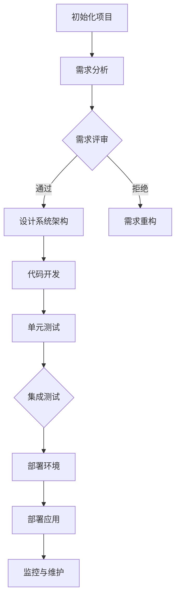

                 

### 文章标题

《LLM应用的敏捷配置管理策略》### 第一部分：LLM应用的敏捷配置管理策略概述

#### 第1章: LLM应用的敏捷配置管理策略介绍

**1.1 LLM应用的敏捷配置管理概述**

大规模语言模型（LLM）应用是指利用预训练的神经网络模型，如GPT、BERT等，来实现自然语言处理（NLP）任务的应用场景。这些应用包括问答系统、自动写作、语音识别、机器翻译等。随着人工智能技术的不断发展，LLM在各个领域的应用越来越广泛，但其复杂的配置管理成为了开发者和运维人员的一大挑战。

**LLM应用的定义**

$$
LLM应用 = 大规模语言模型（LLM） + 应用场景（如问答系统、自动写作、语音识别等）
$$

在LLM应用中，大规模语言模型是核心，而应用场景则决定了模型的使用方式。例如，在问答系统中，模型需要根据用户提问生成回答；在自动写作中，模型需要根据给定的主题和框架生成文章。不同的应用场景对模型的要求各不相同，因此需要对模型进行针对性的配置。

**敏捷配置管理的重要性**

敏捷配置管理在LLM应用中具有重要意义，主要体现在以下几个方面：

- **快速响应需求变化**：随着用户需求的不断变化，LLM应用需要快速调整模型参数和配置，以满足新的需求。

- **提高开发效率和质量**：敏捷配置管理能够提高开发团队的协作效率，减少配置错误，提高应用质量。

- **降低维护成本**：通过有效的配置管理，可以降低应用维护成本，延长应用寿命。

**1.2 敏捷配置管理的核心原则**

敏捷配置管理遵循以下核心原则：

- **迭代开发**：将开发过程划分为多个迭代，每个迭代都完成一部分功能，逐步完善整个应用。

- **持续集成和持续部署**：在开发过程中，持续将代码集成和部署到生产环境，确保应用始终处于最佳状态。

- **需求优先级管理**：根据用户需求和业务目标，合理分配资源，确保关键需求得到优先处理。

- **团队协作与沟通**：建立良好的团队协作机制，确保团队成员之间的沟通顺畅，提高开发效率。

**1.3 敏捷配置管理的方法与实践**

敏捷配置管理的方法与实践主要包括以下几个方面：

- **基于版本控制的代码管理**：使用版本控制系统（如Git）管理代码，确保代码的版本一致性。

- **配置文件管理**：使用配置文件管理工具（如Ansible、Puppet等）管理应用的配置信息，确保配置的一致性和可维护性。

- **持续集成与自动化测试**：建立持续集成和自动化测试流程，确保代码质量和应用稳定性。

- **容器化和微服务架构**：采用容器化和微服务架构，提高应用的部署效率和扩展性。

**1.4 LLM应用敏捷配置管理的挑战与解决方案**

LLM应用在敏捷配置管理过程中面临以下挑战：

- **模型版本管理**：随着模型迭代更新，如何管理和追踪不同版本的模型是一个难题。

- **部署环境一致性**：在多个环境中部署LLM应用，如何保证环境一致性是一个重要问题。

- **数据安全与隐私保护**：在处理大量用户数据时，如何确保数据的安全和隐私是一个关键问题。

- **跨团队协作效率**：涉及多个团队协作的LLM项目，如何提高协作效率是一个挑战。

针对上述挑战，可以采取以下解决方案：

- **模型版本管理**：使用模型版本控制工具（如TensorFlow Model Optimization Tool），确保模型版本的可追溯性和可控性。

- **部署环境一致性**：采用容器化技术（如Docker），确保部署环境的一致性。

- **数据安全与隐私保护**：使用加密技术（如AES加密）、访问控制（如OAuth 2.0）等手段，确保数据的安全和隐私。

- **跨团队协作效率**：建立清晰的沟通渠道，使用项目管理工具（如JIRA、Trello）提高跨团队协作效率。

### Mermaid 流程图：LLM应用的敏捷配置管理流程



通过以上流程图，我们可以清晰地看到LLM应用的敏捷配置管理流程，从需求分析到部署，再到监控与维护，每个环节都紧密相连，确保了应用的稳定性和高效性。接下来，我们将进一步探讨LLM应用的架构设计与核心组件。### 第2章: LLM应用的架构设计与核心组件

#### 2.1 LLM应用的架构设计原则

LLM应用的架构设计需要遵循以下原则：

- **模块化与组件化**：将应用拆分为多个模块和组件，便于管理和维护。

- **高可用性与可扩展性**：确保系统在面临高负载时能够稳定运行，并能够轻松扩展。

- **分布式计算与存储**：利用分布式计算和存储技术，提高系统的性能和可靠性。

- **安全性与合规性**：确保系统的数据安全和合规性，符合相关法律法规和行业标准。

**2.2 LLM应用的核心组件**

LLM应用的核心组件包括前端组件和后端组件。前端组件主要负责用户交互界面和API服务，后端组件则负责模型训练与优化、数据处理与存储、推理服务与调度。

**前端组件**

前端组件主要包括以下部分：

- **用户交互界面**：提供用户与LLM应用交互的界面，如问答系统中的输入框和回答显示区域。

- **API服务**：为后端组件提供接口，实现与用户交互界面的数据交换。

**后端组件**

后端组件包括以下部分：

- **模型训练与优化**：负责大规模语言模型的训练和优化，提高模型的性能和效果。

- **数据处理与存储**：处理输入数据，进行数据预处理和存储，以便后续模型训练和推理。

- **推理服务与调度**：根据用户请求，调度模型进行推理，并返回结果。

**2.3 LLM应用的核心算法原理**

LLM应用的核心算法原理主要包括语言模型和自然语言处理算法。

**语言模型的定义与工作原理**

语言模型是一种预测模型，用于预测下一个词或句子。在LLM应用中，常用的语言模型包括GPT、BERT等。这些模型基于神经网络架构，通过大量的语言数据进行训练，从而学习到语言的规律和特征。

- **神经网络架构**：语言模型通常采用深度神经网络架构，如Transformer、RNN等。其中，Transformer模型由于其并行化和注意力机制，在LLM应用中得到了广泛应用。

- **优化算法与超参数调优**：语言模型的优化算法主要包括梯度下降、Adam等。超参数调优是提高模型性能的重要手段，包括学习率、批量大小、正则化等。

**自然语言处理算法**

自然语言处理算法是实现LLM应用的关键，主要包括以下几种：

- **词向量表示**：将词语转换为向量表示，以便在神经网络中进行处理。常用的词向量表示方法包括Word2Vec、GloVe等。

- **序列模型与注意力机制**：序列模型用于处理文本序列，如RNN、LSTM等。注意力机制用于捕捉文本序列中的重要信息，如BERT模型中的自注意力机制。

**2.4 LLM应用架构设计的具体实现**

在实际应用中，LLM应用的架构设计需要考虑多个方面，包括硬件资源、软件框架、数据处理等。

- **硬件资源**：根据应用规模和需求，选择合适的硬件资源，如CPU、GPU等。

- **软件框架**：选择合适的软件框架，如TensorFlow、PyTorch等，实现模型训练和推理。

- **数据处理**：设计高效的数据处理流程，包括数据收集、预处理、存储等。

**2.5 LLM应用架构设计中的关键问题**

在LLM应用架构设计过程中，需要关注以下几个关键问题：

- **数据一致性**：确保在不同环境（如开发、测试、生产）中的数据一致性。

- **模型版本管理**：合理管理模型的版本，确保模型的可追溯性和可控性。

- **系统性能**：优化系统性能，提高模型的推理速度和处理能力。

- **安全性**：确保系统的数据安全和用户隐私保护。

**2.6 LLM应用架构设计的最佳实践**

以下是LLM应用架构设计的最佳实践：

- **模块化设计**：将应用拆分为多个模块，便于管理和维护。

- **微服务架构**：采用微服务架构，提高系统的可扩展性和灵活性。

- **容器化部署**：使用容器化技术（如Docker）进行部署，提高部署效率和一致性。

- **监控与日志**：建立完善的监控和日志系统，实时监控系统的运行状态和性能。

- **自动化测试**：建立自动化测试流程，确保系统的稳定性和质量。

通过以上架构设计和实现方法，我们可以构建一个高效、稳定、可扩展的LLM应用。接下来，我们将探讨LLM应用的数据准备与预处理过程。这将有助于我们更好地理解LLM应用的内部机制，为后续的模型训练和推理打下坚实的基础。### 第3章: LLM应用的数据准备与预处理

#### 3.1 数据收集与来源

数据是LLM应用的基石，其质量和数量直接影响模型的效果和应用价值。数据收集可以从以下几个方面进行：

- **公开数据集**：如维基百科、新闻文章、社交媒体帖子等，这些数据集通常由研究人员或组织提供，可以通过数据集网站或API获取。

- **私有数据集**：企业或机构内部的数据，如客户反馈、用户评论等，这些数据通常需要通过合同或授权获取。

- **爬虫数据**：通过爬虫技术获取互联网上的数据，如网页内容、论坛帖子等。但需要注意数据来源的合法性和版权问题。

#### 3.2 数据预处理方法

数据预处理是确保数据质量和适合模型训练的关键步骤，主要包括以下方法：

- **文本清洗**：去除无关信息（如HTML标签、特殊字符等），填充缺失值，处理乱码等。

- **分词与词性标注**：将文本分割成单词或词组，并对每个词进行词性标注（如名词、动词等）。

- **数据增强与降噪**：通过随机插入、删除或替换单词，增加数据的多样性；同时，去除噪声数据，如无意义的标点符号、重复文本等。

- **数据标准化与归一化**：将数据转换成统一的格式，如将所有文本转换为小写，统一处理标点符号等；对数值数据进行归一化处理，如归一化文本长度、词频等。

#### 3.3 数据预处理算法

数据预处理算法是实现数据清洗、分词、词性标注等操作的具体方法，以下是几种常用的算法：

- **TF-IDF**：计算词语在文档中的重要程度，用于特征提取。公式如下：

  $$
  tf-idf(t,d) = tf(t,d) \times \log(\frac{N}{df(t)})
  $$

  其中，$tf(t,d)$表示词$t$在文档$d$中的频率，$df(t)$表示包含词$t$的文档数量，$N$为文档总数。

- **Word2Vec**：将词语转换为向量表示，常用的算法有CBOW和Skip-gram。CBOW算法通过预测中心词周围词的分布进行训练，而Skip-gram算法则通过预测中心词进行训练。公式如下：

  $$
  P(w_i|c) = \frac{e^{v_c \cdot v_w}}{\sum_{j \in V} e^{v_c \cdot v_j}}
  $$

  其中，$v_c$和$v_w$分别为中心词和预测词的向量表示，$V$为词汇表。

- **BERT预处理**：BERT（Bidirectional Encoder Representations from Transformers）是一种预训练语言表示模型，其预处理步骤包括分词、掩码、位置编码等。BERT的预处理公式如下：

  $$
  [CLS] + \text{token\_ids} + [SEP] + \text{segment\_ids}
  $$

  其中，$[CLS]$和$[SEP]$是特殊的标记，分别表示句子的开始和结束，$\text{token\_ids}$和$\text{segment\_ids}$分别表示单词和句子的ID。

#### 3.4 数据预处理流程

数据预处理流程可以分为以下几个步骤：

1. **数据清洗**：去除HTML标签、特殊字符、填充缺失值等。

2. **分词与词性标注**：使用分词工具（如jieba）对文本进行分词，并对每个词进行词性标注。

3. **数据增强与降噪**：通过随机插入、删除或替换单词，增加数据的多样性；同时，去除噪声数据，如无意义的标点符号、重复文本等。

4. **数据标准化与归一化**：将文本转换为小写，统一处理标点符号；对数值数据进行归一化处理，如归一化文本长度、词频等。

5. **特征提取**：使用TF-IDF、Word2Vec、BERT等算法将文本转换为向量表示。

6. **数据集划分**：将数据集划分为训练集、验证集和测试集，用于模型训练和评估。

#### 3.5 数据预处理的重要性

数据预处理是确保LLM应用效果的关键步骤，其重要性体现在以下几个方面：

- **数据质量**：通过数据清洗、增强和降噪，提高数据质量，为模型训练提供更好的数据基础。

- **模型性能**：预处理后的数据有助于提高模型性能，减少过拟合现象，提高模型的泛化能力。

- **训练效率**：预处理后的数据具有更好的结构化特征，有助于加快模型训练速度，降低训练成本。

- **应用效果**：高质量的数据预处理能够提高LLM应用的实际效果，为用户提供更准确、更智能的服务。

综上所述，数据准备与预处理是LLM应用中不可或缺的环节，通过合理的预处理方法，可以确保数据质量和模型性能，为LLM应用的稳定性和高效性提供有力保障。接下来，我们将探讨LLM应用的模型训练过程，进一步了解LLM应用的内部机制。这将有助于我们更好地理解LLM应用的运行原理，为实际应用提供指导。### 第4章: LLM应用的模型训练

#### 4.1 模型训练的目标

模型训练是LLM应用的核心环节，其目标是通过大量的训练数据，优化模型的参数，使其能够准确预测或生成目标输出。在LLM应用中，模型训练的主要目标是学习语言的结构和规律，从而实现自然语言处理任务。

- **预测任务**：例如，在问答系统中，模型需要根据用户提问预测合适的回答；在机器翻译中，模型需要根据源语言文本预测目标语言文本。

- **生成任务**：例如，在自动写作中，模型需要根据给定的话题和框架生成文章；在语音识别中，模型需要根据语音波形生成对应的文本。

#### 4.2 模型训练的基本流程

模型训练的基本流程包括以下几个步骤：

1. **数据预处理**：对训练数据进行清洗、分词、词性标注等处理，将其转换为模型可接受的格式。

2. **模型初始化**：初始化模型的参数，通常采用随机初始化或预训练模型初始化。

3. **前向传播**：将输入数据传递给模型，计算输出结果。前向传播过程中，模型根据当前参数计算输出，并计算损失函数。

4. **反向传播**：根据损失函数，计算模型参数的梯度，并更新参数。反向传播是模型训练的核心步骤，通过不断迭代优化参数，使得模型输出逐渐接近真实值。

5. **评估与调整**：在训练过程中，定期评估模型性能，根据评估结果调整超参数，如学习率、批量大小等。

6. **模型保存与加载**：在训练完成后，将优化后的模型参数保存到文件中，以便后续加载和使用。

#### 4.3 模型训练的算法原理

模型训练的算法原理主要包括以下两个方面：

- **优化算法**：优化算法用于更新模型参数，使得损失函数最小化。常用的优化算法有梯度下降（Gradient Descent）、Adam等。

  $$
  w_{\text{new}} = w_{\text{old}} - \alpha \cdot \nabla_w J(w)
  $$

  其中，$w$为模型参数，$\alpha$为学习率，$J(w)$为损失函数。

- **损失函数**：损失函数用于衡量模型输出与真实值之间的差距，常用的损失函数有均方误差（MSE）、交叉熵（Cross-Entropy）等。

  $$
  J(\theta) = -\frac{1}{m} \sum_{i=1}^{m} y_i \cdot \log(\hat{y}_i) + (1 - y_i) \cdot \log(1 - \hat{y}_i)
  $$

  其中，$m$为样本数量，$y_i$为真实标签，$\hat{y}_i$为模型预测概率。

#### 4.4 模型训练的伪代码

以下是一个简单的模型训练伪代码，用于说明模型训练的基本步骤：

```python
# 初始化模型参数
params = initialize_params()

# 模型训练循环
for epoch in range(num_epochs):
    # 前向传播
    inputs, labels = get_batch_data()
    outputs = model(inputs, params)
    
    # 计算损失函数
    loss = compute_loss(outputs, labels)
    
    # 反向传播
    gradients = compute_gradients(outputs, labels)
    
    # 更新参数
    params = update_params(params, gradients)
    
    # 评估模型性能
    performance = evaluate_model(model, validation_data)
    
    # 打印训练进度
    print(f"Epoch {epoch}: Loss = {loss}, Performance = {performance}")

# 保存模型参数
save_model_params(params)
```

#### 4.5 模型训练的关键参数和超参数

模型训练过程中，关键参数和超参数的选择对训练效果具有重要影响。以下是一些常见的参数和超参数：

- **学习率**：控制模型更新参数的步长，过大会导致模型不稳定，过小则训练过程缓慢。

- **批量大小**：每次训练使用的样本数量，批量大小会影响模型的收敛速度和稳定性。

- **迭代次数**：模型训练的迭代次数，过多可能导致过拟合，过少则可能无法充分利用数据。

- **正则化**：用于防止过拟合，常用的正则化方法有L1、L2正则化。

- **dropout**：在神经网络训练过程中，随机丢弃一部分神经元，以防止过拟合。

#### 4.6 模型训练的挑战与解决方案

在模型训练过程中，可能会面临以下挑战：

- **数据不均衡**：训练数据中正负样本比例失衡，可能导致模型偏向多数类。解决方案包括数据增强、重采样等。

- **过拟合**：模型在训练数据上表现良好，但在测试数据上表现较差。解决方案包括正则化、交叉验证等。

- **训练时间过长**：模型训练需要大量时间，特别是在大规模数据集上。解决方案包括使用GPU加速、分布式训练等。

综上所述，模型训练是LLM应用中的关键环节，通过合理的训练流程、算法原理和参数设置，可以构建一个高效、稳定的模型。接下来，我们将探讨LLM应用的实际应用案例，进一步展示模型训练和部署的效果。这将有助于读者更好地理解LLM应用的实用价值。### 第5章: LLM应用的部署与维护

#### 5.1 模型部署的基本概念

模型部署是将训练完成的模型应用到实际场景中，使其能够为用户提供服务的过程。在LLM应用中，模型部署涉及到将训练好的模型文件、依赖库、配置文件等部署到生产环境，以便进行实时推理或批量处理。

**5.1.1 模型部署的目标**

- **高性能**：确保模型能够在生产环境中高效运行，满足业务需求。
- **高可靠性**：保证模型服务的稳定性和可靠性，降低故障率。
- **高可扩展性**：支持模型在线更新和扩展，以适应业务增长。

**5.1.2 模型部署的关键环节**

- **模型转换**：将训练好的模型转换为可以在生产环境中运行的格式，如ONNX、TorchScript等。
- **依赖管理**：确保部署环境中的依赖库和工具与模型兼容，避免版本冲突。
- **部署架构**：选择合适的部署架构，如单机部署、集群部署等，以满足性能和扩展性需求。
- **模型监控**：实时监控模型性能和资源使用情况，以便及时发现和解决潜在问题。

#### 5.2 模型部署的流程

模型部署的流程通常包括以下几个步骤：

1. **模型评估**：在部署前，对模型进行评估，确保其在测试集上的表现达到预期。

2. **模型转换**：将训练好的模型转换为生产环境可运行的格式，如使用TensorFlow Lite将TensorFlow模型转换为MobileNet模型。

3. **依赖管理**：准备模型所需的依赖库和工具，确保部署环境的兼容性。

4. **容器化**：使用容器技术（如Docker）封装模型和依赖，以便在分布式环境中部署。

5. **模型部署**：将容器部署到生产环境，如使用Kubernetes进行容器编排。

6. **模型监控**：部署完成后，实时监控模型性能和资源使用情况，确保模型稳定运行。

7. **模型更新**：根据业务需求，定期更新模型，提高服务质量和效果。

#### 5.3 模型部署的常见问题与解决方案

在模型部署过程中，可能会遇到以下问题：

- **版本冲突**：部署环境中的依赖库与模型版本不兼容。解决方案：使用虚拟环境隔离依赖库，确保版本一致性。
- **性能瓶颈**：模型部署后性能不达标。解决方案：优化模型结构、使用GPU加速、分布式训练和推理。
- **资源不足**：部署环境资源不足，导致模型无法正常运行。解决方案：增加服务器资源、优化资源分配策略。
- **部署失败**：部署过程中出现错误。解决方案：使用持续集成和持续部署（CI/CD）流程，确保部署过程的自动化和可追溯性。

#### 5.4 实际应用案例

以下是一个LLM应用部署的实际案例：

**案例背景**：某电商平台希望利用LLM技术提供智能客服服务，通过自然语言处理能力，自动回答用户的问题。

**解决方案**：

1. **模型训练**：使用GPT-3模型对电商平台的历史客服对话数据、产品描述等文本进行训练，优化模型参数。

2. **模型转换**：将训练好的GPT-3模型转换为ONNX格式，以便在生产环境中使用。

3. **依赖管理**：准备ONNX运行时、Python等依赖库，确保部署环境的兼容性。

4. **容器化**：使用Docker将模型和依赖库封装成容器镜像，便于部署和管理。

5. **模型部署**：将容器部署到Kubernetes集群，实现自动化部署和扩展。

6. **模型监控**：使用Prometheus和Grafana监控系统性能和资源使用情况，确保模型稳定运行。

7. **模型更新**：定期更新模型，使用新的客服对话数据进行微调，提高问答准确性。

**效果评估**：部署后，智能客服服务实现了高效、准确的回答，用户满意度显著提升，电商平台的运营成本也得以降低。

#### 5.5 部署与维护的总结

LLM应用的部署与维护是一个复杂的过程，涉及模型转换、依赖管理、容器化、部署架构设计、监控和更新等方面。通过合理的部署策略和有效的维护措施，可以确保LLM应用的高性能、高可靠性和高可扩展性，为业务提供持续的支持。

接下来，我们将探讨LLM应用开发中的最佳实践，以帮助开发者更高效地构建和管理LLM应用。这将有助于提高开发效率和代码质量，为项目成功提供保障。### 第6章: LLM应用开发中的最佳实践

#### 6.1 单元测试的重要性

在LLM应用开发中，单元测试是一种关键的质量保证手段。单元测试旨在验证代码中的最小功能单元（即单元）是否按照预期工作。通过编写和执行单元测试，开发人员可以确保代码的正确性，减少bug的出现，提高代码的可维护性和可靠性。

**6.1.1 单元测试的优点**

- **快速发现缺陷**：单元测试可以在开发过程中及时发现和修复代码缺陷，避免缺陷在后期导致更严重的问题。
- **提高代码质量**：单元测试有助于开发人员编写更清晰、结构化的代码，降低代码复杂性。
- **代码复用**：单元测试可以验证代码的通用性，促进代码复用。
- **文档化**：单元测试本身就是一种文档，可以帮助其他开发者理解和维护代码。

**6.1.2 单元测试的基本原则**

- **可复现性**：单元测试应该能够在相同环境下复现，确保测试结果的准确性。
- **独立性**：单元测试之间不应存在依赖关系，每个测试应该独立执行。
- **全面性**：单元测试应覆盖代码的各个功能点和边界条件，确保代码的全面测试。

**6.1.3 单元测试的最佳实践**

- **测试用例设计**：根据功能需求和代码逻辑，设计合理、全面的测试用例，包括正常情况和异常情况。
- **自动化执行**：使用自动化测试工具（如JUnit、pytest）执行单元测试，提高测试效率。
- **持续集成**：将单元测试集成到持续集成（CI）流程中，确保每次代码提交后都能自动执行测试。
- **代码覆盖率**：监控代码覆盖率，确保测试覆盖率达到一定比例。

#### 6.2 版本控制与协作

版本控制是确保代码一致性和历史可追溯性的重要手段。在LLM应用开发中，使用版本控制系统（如Git）进行代码管理，可以帮助开发团队高效协作，避免冲突，确保代码质量。

**6.2.1 版本控制的基本概念**

- **提交**：将代码更改保存到版本库中，每个提交都是一个独立的版本点。
- **分支**：从主分支创建新的分支，用于独立开发功能或修复bug。
- **合并**：将分支的更改合并到主分支，实现代码的同步更新。
- **标签**：为特定版本的代码打标签，便于后续查找和使用。

**6.2.2 版本控制的最佳实践**

- **代码规范化**：制定代码风格规范，确保代码的可读性和一致性。
- **分支策略**：采用合理的分支策略（如Git Flow、GitLab Flow等），确保分支的清晰和管理。
- **代码审查**：在合并代码前进行代码审查，确保代码质量。
- **备份与恢复**：定期备份代码，确保在意外情况下可以恢复到最近的工作状态。

#### 6.3 持续集成与持续部署

持续集成（CI）和持续部署（CD）是现代软件开发中提高开发效率和代码质量的重要手段。通过CI/CD流程，开发团队可以实现自动化测试、构建和部署，减少手动干预，提高软件交付速度。

**6.3.1 持续集成的基本概念**

- **自动化测试**：在每次代码提交后，自动执行预定的测试流程，确保代码质量。
- **构建**：将代码、依赖库和配置文件打包成可执行文件或容器镜像。
- **反馈**：在测试和构建完成后，提供反馈（如测试结果、构建状态等），帮助开发人员快速发现问题。

**6.3.2 持续部署的基本概念**

- **自动化部署**：将构建完成的应用自动部署到生产环境，确保应用的高可用性和稳定性。
- **环境一致性**：确保不同环境（如开发、测试、生产）之间的环境一致性，避免环境差异导致的部署问题。
- **监控**：实时监控应用性能和健康状况，及时发现和解决问题。

**6.3.3 CI/CD的最佳实践**

- **自动化测试**：编写和执行自动化测试，确保代码质量和稳定性。
- **自动化构建**：使用CI工具（如Jenkins、GitLab CI/CD）自动化构建应用。
- **自动化部署**：使用CD工具（如Kubernetes、Docker Swarm）自动化部署应用。
- **环境隔离**：为每个环境（如开发、测试、生产）配置独立的部署管道，确保环境一致性。
- **监控与告警**：建立监控和告警系统，实时监控应用性能和健康状况。

#### 6.4 性能优化

性能优化是确保LLM应用高效运行的重要手段。在开发过程中，通过优化算法、架构和资源利用，可以提高应用的处理速度和响应时间，提升用户体验。

**6.4.1 性能优化的关键点**

- **算法优化**：通过优化算法和数据结构，提高模型计算效率和准确度。
- **硬件优化**：使用GPU、FPGA等硬件加速模型推理，提高计算性能。
- **缓存策略**：利用缓存技术减少重复计算和IO操作，提高数据处理速度。
- **并行处理**：采用并行处理技术，提高数据处理和计算速度。

**6.4.2 性能优化的最佳实践**

- **性能测试**：定期进行性能测试，识别性能瓶颈和优化机会。
- **代码优化**：优化代码逻辑和算法，减少不必要的计算和内存占用。
- **资源调度**：合理配置计算资源和存储资源，确保应用的高可用性和性能。
- **监控与告警**：实时监控应用性能，及时发现和解决问题。

#### 6.5 安全性保障

在LLM应用开发中，安全性是一个不可忽视的重要方面。通过采取一系列安全措施，可以确保应用的数据安全和用户隐私保护。

**6.5.1 安全性的关键点**

- **数据加密**：对敏感数据进行加密存储和传输，防止数据泄露。
- **访问控制**：实施严格的访问控制策略，确保只有授权用户才能访问数据。
- **认证与授权**：使用OAuth、JWT等认证和授权机制，确保用户身份的合法性和安全性。
- **日志记录**：记录应用运行过程中的关键操作和异常情况，便于问题追踪和调试。

**6.5.2 安全性的最佳实践**

- **安全培训**：对开发人员和运维人员开展安全培训，提高安全意识。
- **定期审计**：定期进行安全审计，识别潜在的安全漏洞和风险。
- **漏洞修复**：及时修复已知漏洞，防止黑客攻击和数据泄露。
- **加密与认证**：采用SSL/TLS加密协议，确保数据传输安全；使用HTTPS协议，确保网站访问安全。

#### 6.6 项目小结

通过以上最佳实践，开发人员可以构建高效、稳定、安全的LLM应用。在实际项目中，需要根据具体需求和场景，灵活运用这些实践，确保项目的成功实施。

- **敏捷开发**：采用敏捷开发方法，快速响应需求变化，提高开发效率。
- **代码质量**：编写高质量的代码，确保代码的可读性和可维护性。
- **自动化测试**：编写和执行自动化测试，确保代码质量和应用稳定性。
- **性能优化**：优化算法和架构，提高应用性能和用户体验。
- **安全性保障**：采取一系列安全措施，确保应用的数据安全和用户隐私保护。

通过不断总结和实践，开发人员可以不断提高LLM应用开发的能力，为用户提供更好的服务。接下来，我们将讨论LLM应用的监控与维护，以确保应用的长期稳定运行。这将有助于读者了解如何持续优化和提升LLM应用的性能和稳定性。### 第7章: LLM应用的监控与维护

#### 7.1 监控的重要性

在LLM应用的运营过程中，监控是确保系统稳定性和性能的关键环节。通过实时监控，可以及时发现和解决潜在问题，防止故障发生，保障业务的连续性和用户体验。

**7.1.1 监控的目标**

- **性能监控**：监控系统的CPU、内存、磁盘使用情况，确保系统资源充足，避免资源瓶颈影响应用性能。
- **健康监控**：监控应用的健康状态，包括服务是否正常、依赖服务是否可用等。
- **日志监控**：收集和分析应用日志，及时发现异常和错误，便于问题定位和排查。
- **安全性监控**：监控系统的安全状态，包括访问日志、安全审计等，防止安全漏洞和攻击。

**7.1.2 监控的价值**

- **故障预防**：通过监控及时发现异常，提前预防故障，降低业务中断风险。
- **性能优化**：通过监控数据，分析系统性能瓶颈，优化资源配置和架构设计，提高应用性能。
- **成本控制**：监控资源使用情况，合理分配资源，避免资源浪费，降低运维成本。
- **用户体验**：通过实时监控和快速响应，确保应用稳定性和可靠性，提升用户体验。

#### 7.2 监控的关键指标

为了全面了解LLM应用的状态和性能，需要监控一系列关键指标：

- **CPU和内存使用率**：监控CPU和内存的占用情况，确保系统资源充足，避免过高负载导致应用性能下降。
- **磁盘空间和I/O使用情况**：监控磁盘空间使用情况和I/O性能，确保数据存储和读取速度，避免磁盘空间不足或I/O瓶颈。
- **网络流量和延迟**：监控网络流量和延迟，确保数据传输稳定，避免网络问题影响应用性能。
- **服务可用性和响应时间**：监控服务的可用性和响应时间，确保应用能够快速响应用户请求，提供良好的用户体验。
- **错误率和告警**：监控应用和系统的错误率，及时处理告警信息，避免故障和性能问题影响业务运行。
- **日志分析和异常检测**：通过日志分析和异常检测，识别潜在的异常和错误，及时排查和解决。

#### 7.3 监控工具与解决方案

为了有效地监控LLM应用，需要选择合适的监控工具和解决方案。以下是一些常用的监控工具和解决方案：

- **Prometheus**：一款开源的监控解决方案，可以与Grafana等可视化工具结合，提供强大的监控和分析功能。
- **Zabbix**：一款开源的监控工具，支持多种监控方式，包括SNMP、ICMP、SQL等，可以满足大规模应用的监控需求。
- **Elastic Stack**：包括Elasticsearch、Logstash和Kibana等组件，提供日志收集、存储和分析功能，可以与Prometheus结合使用。
- **DataDog**：一款商业监控解决方案，提供全面的应用性能监控、基础设施监控和安全监控功能。

**7.3.1 监控流程**

监控流程通常包括以下几个步骤：

1. **数据采集**：通过Agent或其他方式，将应用和系统的数据（如性能指标、日志、事件等）采集到监控系统中。
2. **数据存储**：将采集到的数据存储到数据库或时间序列数据库中，如InfluxDB、Elasticsearch等。
3. **数据分析和处理**：对采集到的数据进行实时分析和处理，识别异常和趋势，生成监控指标和告警信息。
4. **可视化展示**：使用可视化工具（如Grafana、Kibana等）将监控数据展示为图表、仪表板等，便于监控和分析。
5. **告警和通知**：根据监控规则和告警阈值，触发告警和通知，通知运维团队或相关人员及时处理问题。

**7.3.2 监控最佳实践**

- **全面覆盖**：确保监控覆盖应用的各个方面，包括性能、健康状态、日志等，全面掌握应用状态。
- **定制化监控**：根据业务需求和应用特点，定制化监控指标和告警规则，确保监控的准确性和有效性。
- **自动化处理**：建立自动化处理机制，如自动扩容、自动修复等，提高系统弹性和故障恢复能力。
- **周期性审计**：定期对监控数据进行审计，评估监控效果和性能，优化监控策略和规则。
- **培训与沟通**：对运维团队进行监控培训和沟通，确保团队成员了解监控系统的运作和告警处理流程。

通过以上监控与维护措施，LLM应用可以保持稳定运行，确保为用户提供高质量的服务。在下一章节中，我们将总结文章内容，提供一些实用的技巧和注意事项，帮助读者在实际工作中更好地应用LLM应用的敏捷配置管理策略。### 总结与展望

在本文中，我们系统地探讨了大规模语言模型（LLM）应用的敏捷配置管理策略。从LLM应用的核心概念、敏捷配置管理的核心原则，到具体的方法和实践，再到模型训练、数据预处理、部署与维护，以及开发中的最佳实践和监控与维护，我们提供了一套完整的策略框架，旨在帮助开发者和管理者构建高效、稳定、可扩展的LLM应用。

**总结：**

- **核心概念**：LLM应用是结合大规模语言模型和特定应用场景的解决方案，如问答系统、自动写作等。
- **敏捷配置管理**：通过迭代开发、持续集成和持续部署等核心原则，实现快速响应需求变化、提高开发效率和质量。
- **模型训练**：模型训练是LLM应用的关键环节，包括数据预处理、模型优化和迭代训练。
- **数据预处理**：数据准备与预处理是确保模型训练质量的基础，涉及数据收集、清洗、分词、标注等步骤。
- **部署与维护**：模型部署需要考虑硬件资源、软件框架、数据处理等多个方面，同时需要监控与维护确保应用稳定运行。
- **最佳实践**：通过单元测试、版本控制、持续集成与部署、性能优化和安全性保障，提高代码质量和应用性能。
- **监控与维护**：通过实时监控、日志分析、性能优化和安全审计，确保应用的高可用性和可靠性。

**展望：**

- **模型优化**：随着人工智能技术的不断发展，未来的LLM应用将更加智能化，需要持续优化模型架构和算法，提高性能和效果。
- **跨领域应用**：LLM在医疗、金融、教育等领域的应用潜力巨大，未来的研究将探索更多跨领域应用场景。
- **数据隐私与安全**：在数据隐私和安全方面，需要制定更严格的规范和标准，确保用户数据的安全和隐私。
- **资源利用与优化**：随着云计算和边缘计算的发展，如何更高效地利用资源、优化计算和存储将成为重要研究方向。

**实用技巧与注意事项：**

- **版本控制**：使用Git等版本控制系统进行代码管理，确保代码的一致性和可追溯性。
- **监控与告警**：建立完善的监控和告警系统，实时监控应用性能和状态，确保快速响应和处理问题。
- **数据预处理**：确保数据预处理质量，采用多种数据增强和降噪方法，提高模型训练效果。
- **性能优化**：定期进行性能测试和优化，识别瓶颈，提高应用响应速度和用户体验。
- **安全性保障**：采取加密、认证、访问控制等安全措施，确保应用和数据的安全。
- **持续学习和改进**：关注领域内的最新研究和技术动态，持续学习和改进，确保应用始终处于最佳状态。

通过本文的探讨，我们希望为读者提供一套实用的LLM应用敏捷配置管理策略，助力他们在实际工作中取得更好的成果。同时，我们也期待未来在LLM应用领域取得更多突破和创新。作者：AI天才研究院/AI Genius Institute & 禅与计算机程序设计艺术 /Zen And The Art of Computer Programming

