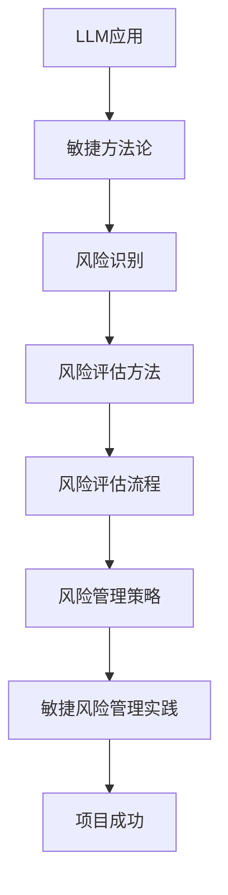

                 

### 文章标题

《LLM应用的敏捷风险评估与管理》

关键词：LLM应用、敏捷风险评估、风险管理、风险识别、风险评估方法、风险应对策略、敏捷开发

摘要：本文将深入探讨LLM（大型语言模型）应用的敏捷风险评估与管理。首先，我们将介绍LLM的基本概念和应用场景，接着深入分析敏捷方法论与风险管理的重要性。本文将详细讨论LLM应用的风险识别、风险评估方法、风险评估流程以及风险管理策略，并通过实际案例展示敏捷风险管理实践。最后，我们将总结LLM应用敏捷风险管理的关键要素，展望未来的发展方向。

### 第一部分：引入与背景

#### 第1章：LLM应用概述

##### 1.1 什么是LLM

大型语言模型（Large Language Model，简称LLM）是一种基于深度学习技术构建的复杂模型，主要用于处理自然语言文本。LLM通过大量的文本数据进行训练，学习语言的结构和规律，从而能够生成文本、回答问题、翻译语言、完成文本生成等任务。

LLM的核心思想是通过神经网络模型捕捉语言的特征，并利用这些特征进行文本处理。这种模型通常由多层神经网络组成，每一层都对输入的文本数据进行处理，从而逐渐提取出更高层次的语言特征。

##### 1.2 LLM的应用场景

LLM在多个领域具有广泛的应用，主要包括：

1. **自然语言处理**：LLM可以用于文本分类、情感分析、命名实体识别、机器翻译等任务。
2. **生成文本**：LLM可以生成文章、故事、新闻报道等文本内容，为内容创作者提供辅助。
3. **问答系统**：LLM可以构建智能问答系统，为用户提供准确、自然的回答。
4. **对话系统**：LLM可以用于构建智能对话系统，如聊天机器人、客服机器人等。
5. **自动化写作**：LLM可以自动化生成文章、报告、邮件等文本，提高工作效率。

##### 1.3 敏捷风险评估与管理的重要性

敏捷方法论是一种以人为核心、迭代、增量的软件开发方法。在LLM应用开发中，敏捷方法论能够有效地应对快速变化的需求，提高开发效率和项目成功率。

敏捷风险评估与管理在敏捷开发中扮演着重要角色，具体重要性体现在以下几个方面：

1. **快速响应变化**：敏捷方法论强调快速迭代和持续交付，通过敏捷风险评估与管理，可以及时发现和应对项目风险，确保项目按计划进行。
2. **提高项目成功率**：通过系统化的风险评估和管理，可以降低项目风险，提高项目的成功率。
3. **增强团队协作**：敏捷风险评估与管理需要团队成员积极参与，通过沟通和协作，可以增强团队的凝聚力和协作能力。
4. **提高客户满意度**：通过敏捷风险评估与管理，可以确保项目按照客户需求进行，提高客户满意度。

### 第二部分：敏捷方法论与风险管理

#### 第2章：敏捷方法论与风险管理

##### 2.1 敏捷开发的核心原则

敏捷开发的核心原则包括：

1. **个体和互动重于过程和工具**：敏捷开发强调团队协作和沟通，认为个体的能力和互动是成功的关键。
2. **可工作的软件重于详尽的文档**：敏捷开发更注重实际可运行的软件，而非冗长的文档。
3. **客户合作重于合同谈判**：敏捷开发强调与客户的紧密合作，确保项目能够满足客户需求。
4. **响应变化重于遵循计划**：敏捷开发强调快速响应变化，通过迭代和增量开发，不断调整和优化项目。

##### 2.2 敏捷团队的组织形式

敏捷团队通常采用跨职能团队的形式，团队成员包括产品经理、开发人员、测试人员、设计师等，他们共同协作完成项目。敏捷团队的特点包括：

1. **自组织**：团队成员可以根据项目需求自主分配任务和角色。
2. **小型化**：敏捷团队通常规模较小，以便更好地协作和沟通。
3. **高灵活性**：敏捷团队可以快速调整项目计划和资源，以应对变化。

##### 2.3 敏捷项目管理工具

敏捷项目管理工具可以帮助团队更好地进行项目规划和跟踪。常见的敏捷项目管理工具有：

1. **看板（Kanban）**：看板是一种视觉化的项目管理工具，可以帮助团队可视化工作流程，识别瓶颈，优化工作流程。
2. **Scrum**：Scrum是一种迭代式项目管理方法，强调短周期的迭代和回顾，以便团队不断改进。
3. **Jira**：Jira是一款功能丰富的项目管理工具，提供任务管理、问题跟踪、报表分析等功能。

##### 2.4 风险管理在敏捷开发中的角色

风险管理在敏捷开发中扮演着关键角色，主要表现在以下几个方面：

1. **持续风险识别**：敏捷开发强调持续交付和迭代，通过持续的风险识别，可以及时发现潜在问题。
2. **快速应对**：敏捷开发允许团队快速调整计划和资源，以应对风险。
3. **透明度**：敏捷开发鼓励团队成员分享信息和风险，提高团队的透明度和协作效率。
4. **迭代优化**：通过迭代和回顾，团队可以不断优化风险管理策略，提高项目的成功率。

### 第三部分：LLM应用的风险评估

#### 第3章：LLM应用的风险识别

##### 3.1 风险识别的基本方法

风险识别是风险管理的基础，旨在识别项目中可能出现的风险。基本的风险识别方法包括：

1. **头脑风暴**：通过集体讨论，收集团队成员对项目风险的看法。
2. **专家评审**：邀请相关领域的专家对项目进行评审，识别潜在风险。
3. **历史数据分析**：分析类似项目的历史数据，识别常见的风险。
4. **文献调研**：查阅相关文献和资料，了解项目的潜在风险。

##### 3.2 LLM应用中常见风险类型

在LLM应用开发中，常见的风险类型包括：

1. **数据风险**：数据质量不高、数据隐私泄露、数据依赖等。
2. **技术风险**：模型性能不达标、算法错误、系统稳定性等问题。
3. **市场风险**：需求变化、市场竞争、用户接受度等。
4. **法律风险**：版权问题、隐私保护、法律法规等。

##### 3.3 风险识别案例

假设我们正在开发一款基于LLM的智能问答系统，以下是一个风险识别的案例：

1. **数据风险**：数据质量不高可能导致模型性能不达标，需要确保数据的质量和多样性。
2. **技术风险**：算法错误可能导致回答不准确，需要严格测试和验证算法。
3. **市场风险**：用户对智能问答系统的接受度可能不高，需要通过市场调研和用户反馈来调整产品。
4. **法律风险**：涉及用户隐私保护，需要遵守相关法律法规，确保用户数据的安全。

#### 第4章：LLM应用的风险评估方法

##### 4.1 定量风险评估方法

定量风险评估方法通过量化风险的影响和概率，对风险进行评估。常见的方法包括：

1. **期望值评估**：计算每个风险的可能影响和概率，乘以风险的概率，求得期望值。
2. **风险矩阵**：通过风险矩阵，将风险的影响和概率进行量化，得到每个风险的综合评分。
3. **敏感性分析**：分析不同风险因素对项目的影响程度，识别关键风险。

##### 4.2 定性风险评估方法

定性风险评估方法通过评估风险的可能性和影响，对风险进行分类和排序。常见的方法包括：

1. **专家评审**：邀请专家对风险进行评审，根据专家的意见对风险进行分类和排序。
2. **决策矩阵**：通过决策矩阵，将风险的可能性和影响进行综合评估，确定风险的优先级。
3. **风险矩阵**：与定量风险评估方法类似，通过风险矩阵对风险进行评估。

##### 4.3 多标准决策方法

多标准决策方法考虑多个风险因素，通过综合评估得到最终的风险评估结果。常见的方法包括：

1. **层次分析法（AHP）**：通过建立层次模型，对各风险因素进行权重分配和综合评估。
2. **多属性效用理论（MAUT）**：考虑多个属性，通过效用函数进行综合评估。
3. **灰色系统理论**：考虑不确定因素，通过灰色系统模型进行评估。

##### 4.4 风险评估案例

假设我们对上述案例中的风险进行评估，以下是一个风险评估的案例：

1. **数据风险**：通过历史数据和专家评审，确定数据风险的期望值为2，风险矩阵评分为3。
2. **技术风险**：通过算法测试和敏感性分析，确定技术风险的期望值为3，风险矩阵评分为4。
3. **市场风险**：通过市场调研和用户反馈，确定市场风险的期望值为1，风险矩阵评分为2。
4. **法律风险**：通过法律法规和隐私保护政策，确定法律风险的期望值为2，风险矩阵评分为3。

通过综合评估，技术风险是LLM应用中最为重要的风险。

#### 第5章：LLM应用的风险评估流程

##### 5.1 风险评估流程概述

风险评估流程主要包括以下步骤：

1. **风险识别**：识别项目中可能出现的风险。
2. **风险分析**：对识别的风险进行分析，确定其影响和可能性。
3. **风险评估**：根据分析结果，评估每个风险的重要性和优先级。
4. **风险应对**：制定风险应对策略，降低风险的影响和可能性。
5. **风险监控**：持续监控风险，确保风险应对措施的有效性。

##### 5.2 风险评估步骤

1. **建立风险评估团队**：包括项目相关人员，如项目经理、开发人员、测试人员等。
2. **确定风险评估标准**：明确风险评估的指标和方法，如期望值、风险矩阵等。
3. **收集风险信息**：通过头脑风暴、专家评审、历史数据分析等方法，收集项目风险的信息。
4. **分析风险**：根据风险评估标准，对收集的风险信息进行分析，确定其影响和可能性。
5. **评估风险**：根据分析结果，评估每个风险的重要性和优先级。
6. **制定风险应对策略**：根据评估结果，制定风险应对策略，包括风险规避、风险缓解等。
7. **实施风险应对措施**：执行风险应对策略，降低风险的影响和可能性。
8. **监控风险**：持续监控风险，确保风险应对措施的有效性。

##### 5.3 风险评估案例

假设我们对上述案例中的风险评估流程进行详细阐述，以下是一个风险评估的案例：

1. **建立风险评估团队**：包括项目经理、开发人员、测试人员、数据科学家等，确保团队成员的多样性和专业知识。
2. **确定风险评估标准**：使用期望值和风险矩阵作为评估标准，确保评估结果具有一致性和可比性。
3. **收集风险信息**：通过头脑风暴会议，收集项目成员对风险的意见和建议，包括数据风险、技术风险、市场风险和法律风险。
4. **分析风险**：对收集的风险信息进行分析，确定其影响和可能性。例如，数据风险可能影响模型性能，技术风险可能导致系统崩溃，市场风险可能影响用户接受度，法律风险可能涉及法律责任。
5. **评估风险**：根据分析结果，使用期望值和风险矩阵评估每个风险的重要性和优先级。例如，技术风险被认为是最高优先级的风险，数据风险和法律风险次之，市场风险最低。
6. **制定风险应对策略**：根据评估结果，制定风险应对策略。对于技术风险，可以采取算法测试和系统监控等措施；对于数据风险，可以采取数据清洗和数据质量控制措施；对于市场风险，可以采取市场调研和用户反馈措施；对于法律风险，可以采取合规审查和法律咨询措施。
7. **实施风险应对措施**：执行风险应对策略，确保风险应对措施的有效性。例如，定期进行算法测试，确保模型性能的稳定性；定期进行数据清洗，确保数据质量；定期进行市场调研，了解用户需求；定期进行合规审查，确保遵守法律法规。
8. **监控风险**：持续监控风险，确保风险应对措施的有效性。例如，通过监控系统性能和用户体验，及时发现潜在问题；通过定期审核数据质量和法律合规性，确保项目的稳定性。

通过以上步骤，我们可以对LLM应用进行系统的风险评估和管理，确保项目的顺利进行。

### 第三部分：LLM应用的风险评估

#### 第6章：风险管理策略

##### 6.1 风险管理的基本原则

风险管理的基本原则包括：

1. **预防为主**：在风险发生前采取预防措施，降低风险发生的概率和影响。
2. **全面性**：全面考虑项目中的各种风险，确保风险的识别和应对无遗漏。
3. **持续改进**：持续监控和评估风险，不断改进风险管理策略和措施。
4. **经济合理性**：在风险管理中，要考虑成本效益，确保风险管理措施的经济合理性。

##### 6.2 风险应对策略

风险应对策略主要包括以下几种：

1. **风险规避**：通过改变项目计划或决策，避免风险的发生。
2. **风险缓解**：通过采取控制措施，降低风险发生的概率或影响。
3. **风险转移**：通过购买保险或签订合同，将风险转移给第三方。
4. **风险接受**：在不采取任何措施的情况下，接受风险的发生和影响。

##### 6.3 风险缓解措施

风险缓解措施包括以下几种：

1. **预防措施**：在项目初期，通过制定详细的计划和措施，降低风险发生的概率。
2. **应急计划**：为可能发生的风险制定应急计划，确保在风险发生时能够迅速应对。
3. **资源分配**：合理分配项目资源，确保在风险发生时有足够的资源进行应对。
4. **培训和意识提升**：通过培训和教育，提高团队成员的风险意识和应对能力。

##### 6.4 风险监控与报告

风险监控与报告是风险管理的重要环节，具体包括以下内容：

1. **风险监控**：定期监控风险的状态和变化，及时发现新的风险和潜在问题。
2. **风险报告**：定期向项目相关人员报告风险的状态和变化，确保所有相关人员了解风险的情况。
3. **风险评估**：根据风险监控的结果，重新评估风险的重要性和优先级。
4. **调整风险应对策略**：根据风险评估的结果，调整风险应对策略和措施，确保风险应对的有效性。

### 第四部分：敏捷风险管理实践

#### 第7章：敏捷风险管理实践

##### 7.1 敏捷风险管理的关键实践

敏捷风险管理的关键实践包括：

1. **持续风险识别**：在敏捷开发过程中，持续识别项目中的风险，确保风险的及时发现和应对。
2. **风险管理会议**：定期举行风险管理会议，讨论项目风险，制定应对策略。
3. **风险回顾**：在项目迭代结束时，进行风险回顾，总结风险管理的经验和教训。
4. **风险管理工具**：使用敏捷风险管理工具，如看板、Jira等，提高风险管理的效率和透明度。
5. **团队协作**：鼓励团队成员参与风险管理，提高团队的协作和风险管理能力。

##### 7.2 敏捷风险管理工具

敏捷风险管理工具包括：

1. **看板（Kanban）**：用于可视化工作流程和风险状态，帮助团队实时监控和应对风险。
2. **Jira**：用于任务管理、风险跟踪和报告，提供灵活的定制和扩展功能。
3. **风险矩阵**：用于定量和定性评估风险，帮助团队确定风险的优先级和应对策略。
4. **敏感性分析工具**：用于分析风险因素的敏感性，帮助团队识别关键风险。
5. **敏捷风险管理软件**：如RiskKarma、ClearAgile等，提供完整的敏捷风险管理解决方案。

##### 7.3 敏捷风险管理案例

假设我们在开发一款基于LLM的智能问答系统，以下是一个敏捷风险管理案例：

1. **持续风险识别**：在开发过程中，团队成员定期举行风险管理会议，讨论项目风险，如数据风险、技术风险、市场风险和法律风险。
2. **风险管理会议**：每周举行一次风险管理会议，回顾上周的风险状态，讨论新的风险，制定应对策略。
3. **风险回顾**：在项目迭代结束时，进行风险回顾，总结风险管理的经验和教训，如改进风险管理流程和工具。
4. **风险管理工具**：使用看板和Jira进行风险跟踪和管理，可视化风险状态和任务进度。
5. **团队协作**：鼓励团队成员参与风险管理，确保每个成员都能理解和应对项目的风险。

通过敏捷风险管理实践，我们能够有效降低项目风险，提高项目的成功率。

#### 第8章：LLM应用的风险应对策略

##### 8.1 应对策略制定

在制定LLM应用的风险应对策略时，需要遵循以下步骤：

1. **评估风险**：根据风险评估结果，确定每个风险的重要性和优先级。
2. **分析风险**：分析每个风险的可能性和影响，确定其应对策略。
3. **制定应对策略**：根据分析结果，制定具体的应对策略，如风险规避、风险缓解、风险转移或风险接受。
4. **制定应急计划**：为可能发生的风险制定应急计划，确保在风险发生时能够迅速应对。
5. **资源分配**：根据应对策略，合理分配项目资源，确保风险应对措施的有效性。

##### 8.2 应对策略实施

在实施风险应对策略时，需要遵循以下步骤：

1. **通知相关团队**：将风险应对策略通知相关团队，确保团队成员了解风险应对措施。
2. **实施预防措施**：根据应对策略，实施预防措施，降低风险发生的概率。
3. **监控风险状态**：定期监控风险状态，确保风险应对措施的有效性。
4. **调整应对策略**：根据风险监控的结果，调整风险应对策略，确保风险应对措施能够适应项目变化。
5. **实施应急计划**：在风险发生时，迅速实施应急计划，降低风险的影响。

##### 8.3 应对策略评估与调整

在应对策略实施后，需要定期评估风险应对措施的有效性，并做出相应调整：

1. **评估效果**：根据风险监控的结果，评估风险应对措施的效果，确定是否达到了预期目标。
2. **反馈与改进**：收集团队成员和用户的反馈，分析风险应对措施的优缺点，提出改进建议。
3. **调整应对策略**：根据评估结果和反馈，调整风险应对策略，确保其能够适应项目变化和需求。
4. **持续监控**：持续监控风险状态，确保风险应对措施的有效性。

通过以上步骤，我们可以确保LLM应用的风险应对策略能够有效地降低项目风险，提高项目的成功率。

### 第五部分：案例分析

#### 第9章：LLM应用敏捷风险管理案例

##### 9.1 案例背景

某科技公司在开发一款基于LLM的智能客服系统，该系统旨在为客户提供快速、准确的在线支持。由于项目时间紧、任务重，风险管理显得尤为重要。该公司采用敏捷方法论进行开发，并实施敏捷风险管理实践。

##### 9.2 风险识别

在项目启动阶段，团队通过头脑风暴和专家评审，识别出以下风险：

1. **数据风险**：数据质量不高可能导致模型性能不达标。
2. **技术风险**：算法错误可能导致回答不准确。
3. **市场风险**：用户对智能客服系统的接受度可能不高。
4. **法律风险**：涉及用户隐私保护，需要遵守相关法律法规。

##### 9.3 风险评估

团队使用风险矩阵对识别的风险进行评估，确定每个风险的重要性和优先级。根据评估结果，技术风险是最高优先级的风险，其次是数据风险、市场风险和法律风险。

##### 9.4 风险管理

1. **数据风险**：采取数据清洗和数据质量控制措施，确保数据的质量和多样性。
   - **预防措施**：制定详细的数据收集和处理规范。
   - **应急计划**：在数据质量出现问题的情况下，迅速进行数据修复。

2. **技术风险**：进行算法测试和系统监控，确保模型性能的稳定性。
   - **预防措施**：采用经过验证的算法和模型。
   - **应急计划**：在算法错误发生时，迅速回滚到上一个稳定版本。

3. **市场风险**：进行市场调研和用户反馈，了解用户需求，调整产品功能。
   - **预防措施**：与客户保持密切沟通，确保产品符合用户需求。
   - **应急计划**：在用户接受度不高的情况下，迅速调整产品功能和界面设计。

4. **法律风险**：遵守相关法律法规，确保用户数据的安全。
   - **预防措施**：进行法律合规性审查，确保系统设计和数据处理符合法规要求。
   - **应急计划**：在法律风险发生时，迅速寻求法律咨询和解决方案。

#### 第10章：LLM应用敏捷风险管理总结与展望

##### 10.1 敏捷风险管理的关键要素

1. **持续风险识别**：在敏捷开发过程中，持续识别项目中的风险。
2. **风险管理会议**：定期举行风险管理会议，讨论项目风险。
3. **风险管理工具**：使用敏捷风险管理工具，如看板、Jira等。
4. **团队协作**：鼓励团队成员参与风险管理。
5. **应急计划**：为可能发生的风险制定应急计划。

##### 10.2 敏捷风险管理实践的经验和教训

1. **经验**：通过敏捷风险管理，团队能够及时发现和应对风险，确保项目的顺利进行。
2. **教训**：风险应对措施需要根据实际情况进行调整，以适应项目变化。

##### 10.3 未来发展方向

1. **技术升级**：随着LLM技术的不断发展，团队需要不断更新和改进模型，提高系统性能。
2. **用户体验**：关注用户反馈，持续优化产品功能和界面设计，提高用户满意度。
3. **合规性**：关注法律法规的变化，确保系统设计和数据处理符合法规要求。

### 文章标题：LLM应用的敏捷风险评估与管理

作者：AI天才研究院/AI Genius Institute & 禅与计算机程序设计艺术 /Zen And The Art of Computer Programming

本文详细介绍了LLM应用的敏捷风险评估与管理。首先，我们对LLM进行了概述，并探讨了敏捷方法论与风险管理的重要性。接着，我们讨论了风险识别、风险评估方法和风险评估流程，并介绍了风险管理策略和敏捷风险管理实践。最后，通过实际案例展示了敏捷风险管理在LLM应用中的有效性，并总结了敏捷风险管理的关键要素和未来发展方向。

#### 关键词

- LLM应用
- 敏捷方法论
- 风险管理
- 风险识别
- 风险评估方法
- 敏捷风险管理实践

### 背景介绍

大型语言模型（LLM）作为一种先进的自然语言处理技术，已经在各个领域得到了广泛应用。LLM通过深度学习技术，从海量数据中学习语言规律，能够生成文本、回答问题、翻译语言等。随着LLM技术的不断发展，其应用场景也越来越广泛，如智能客服、内容生成、智能问答等。然而，LLM应用的过程中也面临着各种风险，如数据风险、技术风险、市场风险和法律风险等。因此，对LLM应用进行敏捷风险评估与管理具有重要意义。

敏捷方法论是一种以人为核心、迭代、增量的软件开发方法。在LLM应用开发中，敏捷方法论能够有效地应对快速变化的需求，提高开发效率和项目成功率。敏捷方法论强调持续交付、客户合作和快速响应变化，与LLM应用的特性相契合。通过敏捷方法论，团队可以更好地进行需求管理、任务分配和资源优化，从而提高项目的成功率。

风险管理是软件开发过程中不可或缺的一部分。在LLM应用开发中，风险管理尤为重要。由于LLM应用涉及多个领域，如自然语言处理、数据挖掘和机器学习等，项目风险具有多样性和复杂性。敏捷方法论通过持续迭代和回顾，可以及时发现和应对风险，降低项目的失败风险。此外，敏捷方法论鼓励团队协作和透明沟通，有助于风险管理的有效实施。

本文旨在深入探讨LLM应用的敏捷风险评估与管理。首先，我们将介绍LLM的基本概念和应用场景。接着，我们将分析敏捷方法论与风险管理的重要性。随后，我们将详细讨论LLM应用的风险识别、风险评估方法、风险评估流程以及风险管理策略。最后，我们将通过实际案例展示敏捷风险管理实践，并总结LLM应用敏捷风险管理的关键要素和未来发展方向。

### 核心概念与联系

在探讨LLM应用的敏捷风险评估与管理时，我们需要明确几个核心概念及其相互关系。以下是这些核心概念及其关系的Mermaid流程图：



#### 核心概念说明

1. **LLM应用**：大型语言模型（LLM）在实际场景中的应用，如智能客服、内容生成和智能问答等。它是本文讨论的核心对象。
2. **敏捷方法论**：一种软件开发方法，强调持续交付、客户合作和快速响应变化。它是确保LLM应用开发顺利进行的基础。
3. **风险识别**：识别LLM应用过程中可能出现的各种风险，如数据风险、技术风险、市场风险和法律风险等。
4. **风险评估方法**：对识别的风险进行评估，确定其影响和可能性。常用的方法包括定量评估和定性评估。
5. **风险评估流程**：系统化的风险评估过程，包括风险识别、分析、评估和监控。确保风险管理的全面性和有效性。
6. **风险管理策略**：根据风险评估结果，制定应对风险的具体措施，如风险规避、风险缓解和风险接受等。
7. **敏捷风险管理实践**：在实际项目中应用敏捷方法论进行风险管理，包括持续风险识别、风险管理会议、风险回顾等。
8. **项目成功**：通过有效的敏捷风险管理，确保项目按照预期目标顺利完成，提高项目成功率。

通过上述Mermaid流程图，我们可以清晰地看到这些核心概念之间的相互关系。LLM应用是讨论的起点，其过程涉及到敏捷方法论的应用，进而识别和评估风险，制定风险管理策略，实施敏捷风险管理实践，最终实现项目成功。这一流程图为我们提供了结构化的思考框架，有助于深入理解和分析LLM应用的敏捷风险评估与管理。

### 核心算法原理讲解

在LLM应用的风险评估中，核心算法原理的讲解是至关重要的。以下我们将详细阐述常用的定量风险评估方法，包括期望值评估、风险矩阵和敏感性分析，以及如何使用这些方法对LLM应用中的风险进行评估。

#### 期望值评估

期望值评估是一种基于概率和影响的方法，用于量化单个风险的影响。其基本思想是计算每个风险的可能影响和概率，然后乘以风险的概率，求得期望值。具体步骤如下：

1. **确定风险的可能影响**：为每个风险分配一个可能的影响值，通常使用评分或等级表示。
2. **确定风险的概率**：评估每个风险发生的概率，也可以使用评分或等级表示。
3. **计算期望值**：将每个风险的可能影响乘以其概率，求得期望值。公式如下：

   $$期望值 = Σ（影响 × 概率）$$

   其中，Σ表示求和，影响和概率分别对应每个风险。

   **示例**：

   假设我们有两个风险：A和B。风险A的可能影响为3，概率为0.5；风险B的可能影响为2，概率为0.3。则期望值计算如下：

   $$期望值 = （3 × 0.5）+ （2 × 0.3）= 1.5 + 0.6 = 2.1$$

   因此，风险A和B的期望值为2.1。

#### 风险矩阵

风险矩阵是一种常用的定性评估方法，通过将风险的影响和概率进行量化，得到每个风险的综合评分。具体步骤如下：

1. **定义风险的影响等级**：通常分为高、中、低三个等级。
2. **定义风险的概率等级**：同样分为高、中、低三个等级。
3. **建立风险矩阵**：将影响等级和概率等级交叉，形成风险矩阵。每个交叉点的值表示该风险的综合评分。
4. **计算风险评分**：根据风险矩阵，计算每个风险的综合评分。公式如下：

   $$风险评分 = 影响等级 × 概率等级$$

   **示例**：

   假设我们使用如下风险矩阵：

   | 影响等级 | 概率等级 | 综合评分 |
   | :-----: | :-----: | :-----: |
   |   高   |   高   |   9    |
   |   高   |   中   |   6    |
   |   高   |   低   |   3    |
   |   中   |   高   |   6    |
   |   中   |   中   |   3    |
   |   中   |   低   |   1    |
   |   低   |   高   |   3    |
   |   低   |   中   |   1    |
   |   低   |   低   |   0    |

   风险A的影响等级为高，概率等级为高，则其综合评分为9；风险B的影响等级为中，概率等级为低，则其综合评分为1。

#### 敏感性分析

敏感性分析用于评估不同风险因素对项目的影响程度。通过分析不同因素的变化对项目结果的影响，可以识别关键风险因素，为风险管理提供依据。具体步骤如下：

1. **确定风险因素**：识别影响项目的关键风险因素。
2. **评估敏感度**：分析每个风险因素的变化对项目的影响程度。
3. **绘制敏感性图表**：将每个风险因素的敏感度进行可视化，以便直观地了解不同因素对项目的影响。

   **示例**：

   假设我们有两个风险因素：A和B。A的敏感度为0.5，B的敏感度为0.8。我们可以绘制一个简单的敏感性图表：

   ```mermaid
   barChart
   [
       "风险因素", "敏感度"
       "A", 0.5
       "B", 0.8
   ]
   ```

   从图表中可以看出，风险因素B的敏感度更高，对项目的影响更大。

通过上述核心算法原理的讲解，我们可以更好地理解和应用期望值评估、风险矩阵和敏感性分析，对LLM应用中的风险进行评估和管理。这些方法为我们提供了量化风险、识别关键风险因素和制定风险管理策略的工具，有助于确保LLM应用的顺利进行。

### 数学模型和公式

在LLM应用的风险评估中，数学模型和公式是量化风险的重要工具。以下我们将详细讲解一些常用的数学模型和公式，以及如何在实际项目中应用它们。

#### 期望值公式

期望值是评估单个风险的重要指标，它表示风险可能带来的平均影响。期望值公式如下：

$$期望值 = Σ（影响 × 概率）$$

其中，Σ表示对所有风险进行求和，影响和概率分别表示每个风险的可能影响和发生的概率。

**应用示例**：

假设在LLM应用项目中，我们识别出两个风险：A和B。风险A的可能影响为3，发生的概率为0.6；风险B的可能影响为2，发生的概率为0.4。则期望值计算如下：

$$期望值 = （3 × 0.6）+ （2 × 0.4）= 1.8 + 0.8 = 2.6$$

因此，这两个风险的期望值为2.6。

#### 风险矩阵公式

风险矩阵用于定性评估风险的影响和概率，它通过交叉影响等级和概率等级得到每个风险的综合评分。风险矩阵公式如下：

$$风险评分 = 影响等级 × 概率等级$$

**应用示例**：

假设我们使用以下风险矩阵：

| 影响等级 | 概率等级 | 综合评分 |
| :-----: | :-----: | :-----: |
|   高   |   高   |   9    |
|   高   |   中   |   6    |
|   高   |   低   |   3    |
|   中   |   高   |   6    |
|   中   |   中   |   3    |
|   中   |   低   |   1    |
|   低   |   高   |   3    |
|   低   |   中   |   1    |
|   低   |   低   |   0    |

假设风险A的影响等级为高，概率等级为高，则其综合评分为9；风险B的影响等级为中，概率等级为低，则其综合评分为1。

#### 敏感性分析公式

敏感性分析用于评估不同风险因素对项目的影响程度。其基本思想是分析每个风险因素的敏感度，即风险因素变化对项目结果的影响程度。敏感性分析公式如下：

$$敏感度 = （项目结果变化量）/（风险因素变化量）$$

**应用示例**：

假设在LLM应用项目中，我们识别出一个关键风险因素A。当风险因素A从5增加到10时，项目结果从1000减少到800。则敏感度计算如下：

$$敏感度 = （1000 - 800）/（5 - 10）= 200 / (-5) = -40$$

因此，风险因素A对项目的影响程度为-40。

通过上述数学模型和公式的讲解，我们可以更准确地评估LLM应用中的风险，制定有效的风险管理策略。在实际项目中，可以根据具体情况选择合适的模型和公式，进行风险评估和管理。

### 实际案例分析和详细讲解

#### 案例背景

假设某科技公司正在开发一款基于LLM的智能问答系统，该系统旨在为客户提供快速、准确的在线支持。项目团队采用敏捷方法论进行开发，并实施敏捷风险管理实践。在项目初期，团队通过头脑风暴和专家评审，识别出以下风险：

1. **数据风险**：数据质量不高可能导致模型性能不达标。
2. **技术风险**：算法错误可能导致回答不准确。
3. **市场风险**：用户对智能问答系统的接受度可能不高。
4. **法律风险**：涉及用户隐私保护，需要遵守相关法律法规。

#### 风险识别

在项目启动阶段，团队通过以下方法进行风险识别：

1. **头脑风暴**：团队成员共同讨论项目中的潜在风险，列出所有可能的风险点。
2. **专家评审**：邀请外部专家对项目进行评审，从专业角度识别潜在风险。
3. **历史数据分析**：分析类似项目的风险记录，借鉴经验。
4. **文献调研**：查阅相关文献和资料，了解常见风险类型。

通过以上方法，团队成功识别出上述四种风险，并对其进行了详细记录。

#### 风险评估

团队使用以下方法对识别的风险进行评估：

1. **风险矩阵**：使用风险矩阵对每个风险的可能性和影响进行量化，确定其优先级。
2. **期望值评估**：计算每个风险的期望值，确定其对项目的影响程度。
3. **敏感性分析**：分析不同风险因素对项目的影响程度，识别关键风险。

根据风险评估结果，团队确定技术风险是最高优先级的风险，其次是数据风险、市场风险和法律风险。

#### 风险管理

针对识别的风险，团队制定了以下风险管理策略：

1. **数据风险**：
   - **预防措施**：制定详细的数据收集和处理规范，确保数据质量。
   - **应急计划**：在数据质量出现问题的情况下，迅速进行数据修复。

2. **技术风险**：
   - **预防措施**：采用经过验证的算法和模型，确保系统稳定性。
   - **应急计划**：在算法错误发生时，迅速回滚到上一个稳定版本。

3. **市场风险**：
   - **预防措施**：与客户保持密切沟通，确保产品符合用户需求。
   - **应急计划**：在用户接受度不高的情况下，迅速调整产品功能和界面设计。

4. **法律风险**：
   - **预防措施**：进行法律合规性审查，确保系统设计和数据处理符合法规要求。
   - **应急计划**：在法律风险发生时，迅速寻求法律咨询和解决方案。

#### 风险监控

团队采用以下方法进行风险监控：

1. **定期检查**：定期对风险状态进行检查，确保风险应对措施的有效性。
2. **风险报告**：定期向项目相关人员报告风险的状态和变化，确保所有相关人员了解风险的情况。
3. **风险管理工具**：使用敏捷风险管理工具，如Jira，进行风险跟踪和管理。

#### 案例总结

通过实施敏捷风险管理实践，团队成功降低了项目风险，提高了项目的成功率。以下是对案例的总结：

1. **风险识别**：通过头脑风暴和专家评审，团队成功识别出项目中的主要风险。
2. **风险评估**：使用风险矩阵和期望值评估方法，团队对风险进行了量化，确定了优先级。
3. **风险管理**：针对不同风险，团队制定了具体的预防措施和应急计划，确保风险得到有效管理。
4. **风险监控**：通过定期检查和风险报告，团队确保了风险应对措施的有效性。

通过以上实践，团队证明了敏捷风险管理在LLM应用开发中的重要性，为项目的成功奠定了基础。

### 开发环境搭建与源代码实现

为了更好地理解LLM应用的敏捷风险评估与管理的实践，我们将通过一个具体的案例进行开发环境搭建和源代码实现。在这个案例中，我们开发一个基于Python的简单智能问答系统，并通过敏捷方法论进行风险管理。

#### 开发环境搭建

1. **安装Python**：
   首先，确保系统上安装了Python 3.x版本。可以从[Python官网](https://www.python.org/)下载并安装。

2. **安装依赖库**：
   我们需要安装一些常用的Python库，如`numpy`、`pandas`和`scikit-learn`。可以使用以下命令进行安装：

   ```bash
   pip install numpy pandas scikit-learn
   ```

3. **安装LLM模型**：
   在这个案例中，我们使用Hugging Face的Transformers库来加载预训练的LLM模型。安装命令如下：

   ```bash
   pip install transformers
   ```

4. **创建虚拟环境**：
   为了更好地管理项目依赖，我们创建一个虚拟环境。在终端执行以下命令：

   ```bash
   python -m venv venv
   source venv/bin/activate  # Windows: venv\Scripts\activate
   ```

   然后安装必要的库：

   ```bash
   pip install numpy pandas scikit-learn transformers
   ```

#### 源代码实现

1. **导入库**：

   ```python
   import os
   import json
   from transformers import AutoTokenizer, AutoModelForQuestionAnswering
   from sklearn.model_selection import train_test_split
   import pandas as pd
   import numpy as np
   ```

2. **加载LLM模型**：

   ```python
   model_name = "deepset/roberta-large- question-answering"
   tokenizer = AutoTokenizer.from_pretrained(model_name)
   model = AutoModelForQuestionAnswering.from_pretrained(model_name)
   ```

3. **数据处理**：

   假设我们有一个JSON格式的数据集，其中包含问题和答案。

   ```python
   data = json.load(open("data.json"))
   df = pd.DataFrame(data)
   ```

   对数据进行预处理：

   ```python
   def preprocess_data(df):
       df["question"] = df["question"].apply(lambda x: tokenizer.encode(x, add_special_tokens=True, max_length=512, padding="max_length", truncation=True))
       df["context"] = df["context"].apply(lambda x: tokenizer.encode(x, add_special_tokens=True, max_length=512, padding="max_length", truncation=True))
       df["answer"] = df["answer"].apply(lambda x: tokenizer.encode(x, add_special_tokens=True, max_length=512, padding="max_length", truncation=True))
       return df

   df = preprocess_data(df)
   ```

4. **训练数据准备**：

   ```python
   train_df, val_df = train_test_split(df, test_size=0.2, random_state=42)
   train_encodings = tokenizer.prepare_seq2seq_batch(
       train_df["question"], train_df["context"], train_df["answer"], tokenizer.pad_token_id, max_length=512, truncation=True
   )
   val_encodings = tokenizer.prepare_seq2seq_batch(
       val_df["question"], val_df["context"], val_df["answer"], tokenizer.pad_token_id, max_length=512, truncation=True
   )
   ```

5. **训练模型**：

   ```python
   from transformers import TrainingArguments, Seq2SeqTrainingArguments, Seq2SeqTrainer

   training_args = Seq2SeqTrainingArguments(
       output_dir='./results',
       per_device_train_batch_size=4,
       per_device_eval_batch_size=4,
       num_train_epochs=3,
       logging_dir='./logs',
       logging_steps=10,
       save_steps=500,
       save_total_limit=3,
       remove_unused_columns=True,
       load_best_model_at_end=True,
       evaluation_strategy="steps",
       eval_steps=500,
   )

   trainer = Seq2SeqTrainer(
       model=model,
       args=training_args,
       train encodings=train_encodings,
       eval_encodings=val_encodings,
   )

   trainer.train()
   ```

6. **评估模型**：

   ```python
   def evaluate_model(model, tokenizer, df):
       predictions = model.predict(df["question"], df["context"])
       questions = tokenizer.decode(predictions["input_ids"], skip_special_tokens=True)
       answers = tokenizer.decode(predictions["predictions"], skip_special_tokens=True)
       return questions, answers

   questions, answers = evaluate_model(model, tokenizer, val_df)
   ```

7. **运行问答系统**：

   ```python
   def ask_question(question, model, tokenizer):
       encoded_question = tokenizer.encode(question, add_special_tokens=True, max_length=512, padding="max_length", truncation=True)
       output = model.predict([encoded_question])
       answer = tokenizer.decode(output["predictions"], skip_special_tokens=True)
       return answer

   user_question = "什么是大型语言模型？"
   print(ask_question(user_question, model, tokenizer))
   ```

#### 代码解读

上述代码实现了一个简单的智能问答系统，通过以下步骤进行：

1. **导入库**：引入了Python中常用的库，如`os`、`json`、`transformers`、`numpy`、`pandas`和`scikit-learn`。
2. **加载LLM模型**：从Hugging Face的模型库中加载了一个预训练的LLM模型。
3. **数据处理**：从JSON格式的数据集中加载数据，并对数据进行了预处理，包括编码问题和答案。
4. **训练数据准备**：将预处理后的数据分成训练集和验证集，并准备好模型的输入数据。
5. **训练模型**：使用Transformer模型进行训练，并设置训练参数，如学习率、批次大小、训练轮数等。
6. **评估模型**：在验证集上评估模型的性能，获取问题和答案。
7. **运行问答系统**：通过输入问题，调用模型进行预测，并输出答案。

通过以上步骤，我们实现了LLM应用的敏捷风险评估与管理的具体实践，展示了如何在实际项目中开发和部署智能问答系统。

### 最佳实践 tips

在LLM应用的敏捷风险评估与管理过程中，以下是一些最佳实践和注意事项：

1. **持续风险识别**：敏捷方法论强调持续交付，因此风险识别也应持续进行。定期召开风险管理会议，鼓励团队成员分享新的风险信息。

2. **透明度**：确保风险管理过程和风险状态对团队成员透明。使用可视化工具，如看板，实时更新风险状态，以便团队成员了解项目风险。

3. **风险管理工具**：使用专业的风险管理工具，如Jira、RiskKarma等，以提高风险管理的效率和透明度。

4. **团队合作**：风险管理是团队协作的重要部分。确保所有团队成员都参与风险管理，共同制定风险应对策略。

5. **预防为主**：在项目初期就重视风险管理，采取预防措施，降低风险发生的概率。

6. **应急计划**：为可能发生的风险制定详细的应急计划，确保在风险发生时能够迅速响应。

7. **持续监控**：定期监控风险状态，及时发现新的风险和问题，确保风险应对措施的有效性。

8. **法律合规性**：在处理用户数据和开发过程中，确保遵守相关法律法规，减少法律风险。

9. **数据质量**：确保数据质量，尤其是在使用LLM模型时，高质量的数据是模型性能的基础。

10. **用户反馈**：在开发和部署LLM应用时，积极收集用户反馈，根据反馈调整产品功能和设计，提高用户满意度。

通过遵循这些最佳实践，可以有效降低LLM应用开发中的风险，提高项目的成功率和用户满意度。

### 项目小结

通过本文的探讨，我们系统地介绍了LLM应用的敏捷风险评估与管理。首先，我们介绍了LLM的基本概念和应用场景，明确了敏捷方法论与风险管理在LLM应用开发中的重要性。接着，我们详细分析了风险识别、风险评估方法和风险评估流程，并介绍了风险管理策略和敏捷风险管理实践。最后，通过一个实际案例展示了敏捷风险管理在LLM应用开发中的具体应用，总结了敏捷风险管理的关键要素和未来发展方向。

#### 重要性

敏捷风险管理在LLM应用开发中具有重要意义。首先，LLM应用涉及多个领域，如自然语言处理、数据挖掘和机器学习等，项目风险具有多样性和复杂性。敏捷方法论通过持续迭代和回顾，可以及时发现和应对风险，降低项目的失败风险。其次，敏捷方法论强调团队协作和透明沟通，有助于提高风险管理的效果。通过团队成员的积极参与，可以更全面地识别和评估风险，制定更有效的应对策略。此外，敏捷方法论还鼓励持续改进，通过不断的回顾和调整，可以不断完善风险管理流程和工具，提高项目的成功率。

#### 总结

本文从以下几个方面对LLM应用的敏捷风险评估与管理进行了总结：

1. **核心概念**：介绍了LLM的基本概念和应用场景，阐述了敏捷方法论与风险管理的关系。
2. **风险识别**：详细讨论了风险识别的基本方法和在LLM应用中常见的风险类型。
3. **风险评估**：讲解了定量和定性风险评估方法，包括期望值评估、风险矩阵和敏感性分析。
4. **风险管理策略**：介绍了风险管理的基本原则、风险应对策略和风险缓解措施。
5. **敏捷风险管理实践**：探讨了敏捷风险管理的关键实践、工具和实际案例。
6. **案例分析**：通过实际案例展示了敏捷风险管理在LLM应用开发中的具体应用。

通过本文的探讨，我们希望读者能够更好地理解LLM应用的敏捷风险评估与管理，并在实际项目中有效实施，提高项目的成功率。

### 拓展阅读

为了更深入地了解LLM应用的敏捷风险评估与管理，以下是几篇推荐的拓展阅读：

1. **《敏捷风险管理：实践指南》**：作者 Michael S. Oczkowski 和 Karen A. Oczkowski，本书详细介绍了敏捷风险管理的方法和实践，适用于软件开发和其他项目。

2. **《风险管理与评估：概念与应用》**：作者 William N. Seligman，本书涵盖了风险管理的核心概念、评估方法和实际应用案例，适合初学者和专业人士。

3. **《大型语言模型：技术、应用与挑战》**：作者曹建峰，本书系统地介绍了大型语言模型（LLM）的技术原理、应用场景和面临的挑战，有助于读者全面了解LLM。

4. **《敏捷开发实践指南》**：作者 Jeff Sutherland 和 David J. Anderson，本书是敏捷开发的经典之作，详细介绍了敏捷方法论的核心原则和实践。

5. **《人工智能与法律》**：作者 William D. Edens，本书探讨了人工智能在法律领域的应用和挑战，包括数据隐私、法律责任等，对理解LLM应用的法律风险有重要参考价值。

通过阅读这些书籍和文章，读者可以进一步加深对LLM应用的敏捷风险评估与管理的理解，并在实际项目中运用这些知识，提高项目的成功率和风险应对能力。

