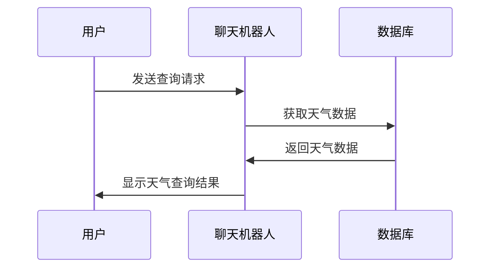

                 


### 文章标题：LLM应用的行为驱动开发（BDD）：促进沟通和协作

> 关键词：行为驱动开发（BDD），大型语言模型（LLM），敏捷开发，协作，沟通，测试，工具与框架

> 摘要：本文将探讨行为驱动开发（BDD）在大型语言模型（LLM）应用开发中的重要性。通过分析BDD的基本概念、核心组成部分以及在LLM应用中的优势与挑战，本文将阐述BDD如何促进团队协作和沟通，提高开发效率。同时，本文还将介绍BDD工具与框架，以及在实际项目中的应用案例，为读者提供有价值的实践经验和启示。

### 《LLM应用的行为驱动开发（BDD）：促进沟通和协作》目录大纲

# 第一部分：行为驱动开发（BDD）概述

## 第1章：行为驱动开发（BDD）概念与原理

### 1.1.1 BDD的基本概念

- **背景介绍**：敏捷开发与BDD
- **核心概念与联系**：BDD的关键概念与流程
- **Mermaid流程图**：

mermaid
graph TD
    A[敏捷开发] --> B[BDD]
    B --> C[用户故事]
    C --> D[特性]
    D --> E[场景]
    E --> F[测试]

### 1.1.2 BDD与敏捷开发的关系

- **核心算法原理讲解**：BDD在敏捷开发中的作用
- **数学模型和数学公式**：敏捷开发与BDD的关系
- **举例说明**：BDD在敏捷开发中的具体应用

### 1.1.3 BDD的主要优势

- **核心概念与联系**：BDD的优势概述
- **Mermaid流程图**：

mermaid
graph TD
    A[提高沟通] --> B[降低风险]
    B --> C[提升效率]
    C --> D[增强协作]

### 1.1.4 BDD的适用场景

- **核心概念与联系**：BDD在不同开发场景中的适用性
- **举例说明**：BDD在Web应用、移动应用、LLM等领域的应用

## 第2章：BDD的核心组成部分

### 2.1.1 Given：给定条件

- **核心概念与联系**：Given的作用与意义
- **Mermaid流程图**：

mermaid
graph TD
    A[场景] --> B[Given]

### 2.1.2 When：当...时

- **核心概念与联系**：When的作用与意义
- **Mermaid流程图**：

mermaid
graph TD
    A[场景] --> B[When]

### 2.1.3 Then：那么...就

- **核心概念与联系**：Then的作用与意义
- **Mermaid流程图**：

mermaid
graph TD
    A[场景] --> B[Then]

### 2.1.4 And：并且

- **核心概念与联系**：And的作用与意义
- **Mermaid流程图**：

mermaid
graph TD
    A[场景] --> B[When]
    B --> C[And]

### 2.1.5 But：但是

- **核心概念与联系**：But的作用与意义
- **Mermaid流程图**：

mermaid
graph TD
    A[场景] --> B[When]
    B --> C[But]

# 第二部分：BDD在LLM应用开发中的应用

## 第3章：BDD在LLM应用中的优势与挑战

### 3.1.1 BDD在LLM开发中的优势

- **核心概念与联系**：BDD在LLM开发中的优势
- **Mermaid流程图**：

mermaid
graph TD
    A[自然语言处理] --> B[BDD]

### 3.1.2 BDD在LLM开发中的挑战

- **核心概念与联系**：BDD在LLM开发中的挑战
- **Mermaid流程图**：

mermaid
graph TD
    A[复杂性] --> B[数据质量]
    B --> C[模型调优]

### 3.1.3 解决方案与建议

- **核心概念与联系**：解决方案与建议
- **Mermaid流程图**：

mermaid
graph TD
    A[解决方案] --> B[优化流程]
    B --> C[提高团队协作]

## 第4章：BDD工具与框架

### 4.1.1 Cucumber：BDD自动化测试工具

- **核心概念与联系**：Cucumber的作用与原理
- **Mermaid流程图**：

mermaid
graph TD
    A[Gherkin语法] --> B[Cucumber测试]

### 4.1.2 Gherkin：Cucumber的语法规则

- **核心概念与联系**：Gherkin的语法规则与特点
- **举例说明**：Gherkin语法示例

### 4.1.3 Behat：BDD测试框架

- **核心概念与联系**：Behat的作用与优势
- **Mermaid流程图**：

mermaid
graph TD
    A[Behat特性] --> B[BDD测试]

### 4.1.4 JBehave：Java领域的BDD工具

- **核心概念与联系**：JBehave的应用场景与特点
- **Mermaid流程图**：

mermaid
graph TD
    A[Java领域] --> B[JBehave]

## 第5章：LLM应用中的BDD实践

### 5.1.1 BDD在LLM应用需求分析中的应用

- **核心概念与联系**：BDD在需求分析中的应用
- **Mermaid流程图**：

mermaid
graph TD
    A[需求分析] --> B[BDD场景]

### 5.1.2 BDD在LLM应用设计中的应用

- **核心概念与联系**：BDD在应用设计中的应用
- **Mermaid流程图**：

mermaid
graph TD
    A[应用设计] --> B[BDD流程]

### 5.1.3 BDD在LLM应用测试中的应用

- **核心概念与联系**：BDD在应用测试中的应用
- **Mermaid流程图**：

mermaid
graph TD
    A[应用测试] --> B[BDD测试]

## 第6章：BDD在LLM协作中的关键角色

### 6.1.1 BDD与团队成员的角色分配

- **核心概念与联系**：BDD在团队协作中的角色分配
- **Mermaid流程图**：

mermaid
graph TD
    A[产品经理] --> B[开发人员]
    B --> C[测试人员]
    C --> D[运维人员]

### 6.1.2 BDD在团队协作中的沟通技巧

- **核心概念与联系**：BDD在团队协作中的沟通技巧
- **Mermaid流程图**：

mermaid
graph TD
    A[明确目标] --> B[有效沟通]
    B --> C[积极反馈]

### 6.1.3 BDD在团队协作中的冲突解决

- **核心概念与联系**：BDD在团队协作中的冲突解决
- **Mermaid流程图**：

mermaid
graph TD
    A[识别冲突] --> B[解决冲突]
    B --> C[预防冲突]

## 第7章：BDD在LLM应用的持续改进

### 7.1.1 BDD在LLM应用的反馈循环

- **核心概念与联系**：BDD在反馈循环中的应用
- **Mermaid流程图**：

mermaid
graph TD
    A[反馈循环] --> B[持续改进]

### 7.1.2 BDD在LLM应用中的迭代开发

- **核心概念与联系**：BDD在迭代开发中的应用
- **Mermaid流程图**：

mermaid
graph TD
    A[迭代开发] --> B[BDD迭代]

### 7.1.3 BDD在LLM应用中的最佳实践

- **核心概念与联系**：BDD在最佳实践中的应用
- **Mermaid流程图**：

mermaid
graph TD
    A[最佳实践] --> B[BDD应用]

# 第三部分：案例与总结

## 第8章：LLM应用中的BDD案例分析

### 8.1.1 案例一：聊天机器人开发

- **核心概念与联系**：聊天机器人开发中的BDD应用
- **项目实战**：聊天机器人开发环境搭建、源代码实现与解读

### 8.1.2 案例二：智能客服系统

- **核心概念与联系**：智能客服系统开发中的BDD应用
- **项目实战**：智能客服系统开发环境搭建、源代码实现与解读

### 8.1.3 案例三：自然语言处理应用

- **核心概念与联系**：自然语言处理应用开发中的BDD应用
- **项目实战**：自然语言处理应用开发环境搭建、源代码实现与解读

## 第9章：BDD在LLM应用中的总结与展望

### 9.1.1 BDD在LLM应用中的成果总结

- **核心概念与联系**：BDD在LLM应用开发中的成果总结
- **Mermaid流程图**：

mermaid
graph TD
    A[成果总结] --> B[优势]
    B --> C[挑战]
    C --> D[展望]

### 9.1.2 BDD在LLM应用中的未来发展趋势

- **核心概念与联系**：BDD在LLM应用开发中的未来发展趋势
- **Mermaid流程图**：

mermaid
graph TD
    A[发展趋势] --> B[技术进步]
    B --> C[应用拓展]

### 9.1.3 推广BDD的建议与展望

- **核心概念与联系**：推广BDD的建议与展望
- **Mermaid流程图**：

mermaid
graph TD
    A[推广建议] --> B[培训]
    B --> C[实践]
    C --> D[社区]

### 附录：相关资源与工具

### A.1 BDD相关书籍推荐

- **书籍列表**：介绍BDD相关书籍，包括入门、进阶和实战类书籍

### A.2 BDD在线学习资源

- **在线学习平台**：推荐BDD在线学习资源，包括课程、视频、文档等

### A.3 BDD社区与论坛

- **社区与论坛**：介绍BDD社区与论坛，包括国内外热门社区和论坛

### A.4 BDD工具与框架下载链接

- **工具与框架**：提供BDD工具与框架的下载链接，方便读者学习和使用

# 引言

随着人工智能技术的飞速发展，大型语言模型（LLM）在自然语言处理、聊天机器人、智能客服等领域取得了显著的成果。然而，LLM应用的开发面临着诸多挑战，如需求变化快、系统复杂性高、团队协作困难等。为了提高开发效率、降低风险，行为驱动开发（Behavior-Driven Development，简称BDD）逐渐成为一种重要的开发方法。

本文旨在探讨BDD在LLM应用开发中的应用，通过分析BDD的基本概念、核心组成部分以及在LLM开发中的优势与挑战，阐述BDD如何促进团队协作和沟通，提高开发效率。同时，本文还将介绍BDD工具与框架，以及在实际项目中的应用案例，为读者提供有价值的实践经验和启示。

## 第1章：行为驱动开发（BDD）概念与原理

### 1.1.1 BDD的基本概念

行为驱动开发（Behavior-Driven Development，简称BDD）是一种敏捷开发方法，旨在通过描述软件行为的预期结果，促进开发人员、测试人员、产品经理等利益相关者之间的沟通与协作。BDD的核心思想是将软件开发视为一系列可测试的行为，通过编写简明扼要的“行为描述”，确保软件在开发过程中始终保持正确的功能和行为。

BDD的基本概念包括以下几个方面：

1. **用户故事**：用户故事是描述软件功能的最小单位，通常包含三个部分：给定的条件（Given）、期望的行为（When-Then）。例如：“作为用户，我希望在输入搜索关键词后，系统能够返回相关的搜索结果。”

2. **特性**：特性是一系列用户故事的集合，描述了软件的一个功能模块或功能集合。特性通常以用户视角进行描述，确保功能与用户需求一致。

3. **场景**：场景是描述用户故事在特定条件下的具体实现。场景包括前置条件、操作步骤、预期结果等，用于验证用户故事是否满足预期。

4. **测试**：测试是验证软件功能是否按照预期执行的过程。在BDD中，测试通常基于用户故事和场景进行编写，确保软件功能符合需求。

### 1.1.2 BDD与敏捷开发的关系

BDD与敏捷开发密切相关，两者在理念和方法上有很多相似之处。敏捷开发强调团队协作、快速迭代、持续交付等原则，而BDD则通过描述软件行为，进一步促进了团队之间的沟通与协作。

BDD与敏捷开发的关系可以从以下几个方面来理解：

1. **用户故事**：用户故事是敏捷开发的核心概念之一，也是BDD的重要组成部分。用户故事描述了软件的功能和用户需求，确保开发过程始终以用户为中心。

2. **场景**：场景是敏捷开发中的“故事地图”，用于描述用户故事的具体实现。BDD中的场景进一步细化了用户故事，确保开发过程中每个功能点都能被有效验证。

3. **测试**：测试是敏捷开发中的重要环节，用于确保软件质量。BDD通过编写可执行的测试用例，将测试提前到开发过程中，提高了开发效率和质量。

### 1.1.3 BDD的主要优势

BDD在软件开发中具有许多优势，这些优势使其成为许多开发团队的首选方法。以下是BDD的主要优势：

1. **提高沟通**：BDD通过简明扼要的行为描述，促进了开发人员、测试人员、产品经理等利益相关者之间的沟通。这有助于确保所有团队成员对软件功能和需求有清晰的认识，降低误解和沟通成本。

2. **降低风险**：BDD通过提前编写和执行测试用例，确保软件在开发过程中始终保持正确的功能和行为。这有助于发现和修复缺陷，降低软件发布后的风险。

3. **提升效率**：BDD通过将测试提前到开发过程中，减少了测试阶段的耗时和人力成本。同时，BDD的简洁性使得测试用例易于编写和维护，提高了开发效率。

4. **增强协作**：BDD通过描述软件行为的预期结果，促进了开发人员、测试人员、产品经理等利益相关者之间的协作。这使得团队成员能够更好地理解彼此的工作，提高团队整体效率。

### 1.1.4 BDD的适用场景

BDD适用于各种软件开发场景，尤其是在复杂系统、大型项目和跨职能团队中具有显著优势。以下是一些BDD适用的场景：

1. **Web应用开发**：Web应用通常涉及多个模块和复杂的业务逻辑，BDD有助于确保每个模块的功能和交互符合预期。

2. **移动应用开发**：移动应用需要快速迭代和持续交付，BDD可以提高开发效率和质量，确保应用功能符合用户需求。

3. **自动化测试**：自动化测试是现代软件开发中不可或缺的一部分，BDD通过编写可执行的测试用例，提高了自动化测试的效率和质量。

4. **大型项目和跨职能团队**：大型项目和跨职能团队通常面临复杂的需求和紧密的交付期限，BDD有助于提高团队协作和沟通，确保项目顺利推进。

### 1.1.5 BDD的核心组成部分

BDD的核心组成部分包括以下几部分：

1. **用户故事**：用户故事是BDD的基本构建块，描述了软件功能和用户需求。

2. **特征文件**：特征文件是用户故事的集合，用于描述软件的一个功能模块或功能集合。

3. **场景**：场景是用户故事的具体实现，用于验证软件功能是否符合预期。

4. **测试用例**：测试用例是验证软件功能是否按照预期执行的过程。

5. **执行结果**：执行结果是测试用例执行后的结果，用于评估软件功能是否符合预期。

### 1.1.6 BDD的工作流程

BDD的工作流程通常包括以下几个阶段：

1. **需求分析**：产品经理和开发人员与利益相关者进行沟通，收集用户需求，编写用户故事。

2. **特征文件编写**：开发人员根据用户故事编写特征文件，描述软件功能模块。

3. **场景编写**：开发人员根据特征文件编写场景，细化用户故事的具体实现。

4. **测试用例编写**：测试人员根据场景编写测试用例，验证软件功能是否符合预期。

5. **执行测试**：开发人员和测试人员执行测试用例，评估软件功能是否符合预期。

6. **迭代改进**：根据测试结果，开发人员和测试人员对软件功能进行改进，确保软件质量。

### 1.1.7 BDD的优势与挑战

BDD具有许多优势，但同时也存在一些挑战。以下是对BDD优势与挑战的总结：

#### BDD的优势：

1. **提高沟通**：BDD通过简明扼要的行为描述，促进了开发人员、测试人员、产品经理等利益相关者之间的沟通。

2. **降低风险**：BDD通过提前编写和执行测试用例，确保软件在开发过程中始终保持正确的功能和行为。

3. **提升效率**：BDD通过将测试提前到开发过程中，减少了测试阶段的耗时和人力成本。

4. **增强协作**：BDD通过描述软件行为的预期结果，促进了开发人员、测试人员、产品经理等利益相关者之间的协作。

#### BDD的挑战：

1. **需求变化**：BDD在开发早期就明确了软件行为的预期结果，但在项目过程中，需求可能会发生变化，这可能导致测试用例需要进行调整。

2. **团队协作**：BDD要求团队成员具备一定的协作能力，这对于一些团队来说可能是一个挑战。

3. **学习成本**：BDD需要团队成员掌握新的方法和工具，这可能会带来一定的学习成本。

### 1.1.8 总结

BDD是一种基于行为描述的软件开发方法，通过提高沟通、降低风险、提升效率和增强协作，促进了团队之间的协作与沟通。虽然BDD存在一定的挑战，但其优势使其在软件开发中得到广泛应用。在本章中，我们介绍了BDD的基本概念、原理、优势与挑战，以及BDD的核心组成部分和工作流程。在后续章节中，我们将进一步探讨BDD在LLM应用开发中的具体应用和优势。

## 第2章：BDD的核心组成部分

### 2.1.1 Given：给定条件

在行为驱动开发（BDD）中，"Given" 是描述场景开始时的预设条件和环境设置的部分。它用于定义执行场景之前的初始状态，为场景的后续操作提供一个基础。以下是 "Given" 的核心概念、应用场景和示例。

#### 核心概念

"Given" 的主要目的是确保测试脚本开始执行时系统处于预定的初始状态。这个初始状态可能包括数据、环境配置、用户登录状态等。通过 "Given"，开发人员可以明确地说明在执行测试前需要完成哪些准备工作。

#### 应用场景

在BDD中，"Given" 常用于以下场景：

1. **环境设置**：例如，在测试一个电商网站的用户购物车功能时，"Given" 可以设定购物车为空状态。
2. **数据准备**：在测试涉及数据库操作的程序时，"Given" 可以用于准备测试所需的数据集。
3. **用户状态**：例如，在测试一个社交网络的私信功能时，"Given" 可以设定用户已登录状态。

#### 示例

以下是一个使用 "Given" 的示例场景：

**场景：测试用户购物车功能**

**Given**：用户打开购物车页面。

**When**：用户点击“添加商品”按钮。

**Then**：购物车中的商品数量应该增加1。

```gherkin
Feature: 购物车功能
  In order to purchase items
  As a user
  I want to add items to my shopping cart

  Scenario: 用户添加商品到购物车
    Given 用户打开购物车页面
    When 用户点击“添加商品”按钮
    Then 购物车中的商品数量应该增加1
```

在这个示例中，"Given" 用于设定测试开始时的条件，即用户已经打开了购物车页面。

### 2.1.2 When：当...时

"当...时"（When）是行为驱动开发（BDD）中描述场景中实际执行的操作的部分。它用于定义触发事件或动作，这些动作会改变系统状态，从而影响测试的执行。以下是 "When" 的核心概念、应用场景和示例。

#### 核心概念

"当...时" 的目的是详细说明在场景中执行的具体操作或动作。这些操作可以是用户界面上的点击、输入数据、发送请求等。通过 "When"，开发人员可以明确地描述系统如何响应用户的行为。

#### 应用场景

在BDD中，"When" 常用于以下场景：

1. **用户交互**：例如，测试一个网站的注册流程时，"When" 可以描述用户输入注册信息并提交表单的操作。
2. **系统响应**：例如，在测试一个自动化流程时，"When" 可以描述系统接收请求并返回响应的过程。
3. **业务逻辑**：例如，在测试一个支付系统的结算流程时，"When" 可以描述用户选择支付方式并完成支付的操作。

#### 示例

以下是一个使用 "When" 的示例场景：

**场景：测试用户注册功能**

**Given**：用户访问注册页面。

**When**：用户输入正确的注册信息并提交表单。

**Then**：用户应该收到注册成功的通知。

```gherkin
Feature: 用户注册功能
  In order to create an account
  As a user
  I want to register for an account

  Scenario: 用户成功注册
    Given 用户访问注册页面
    When 用户输入正确的注册信息并提交表单
    Then 用户应该收到注册成功的通知
```

在这个示例中，"When" 用于描述用户输入注册信息并提交表单的操作。

### 2.1.3 Then：那么...就

"那么...就"（Then）是行为驱动开发（BDD）中描述场景预期结果的部分。它用于验证系统在执行操作后的响应是否符合预期，从而确认测试是否通过。以下是 "Then" 的核心概念、应用场景和示例。

#### 核心概念

"那么...就" 的目的是描述在执行操作后预期的结果或验证条件。这些预期结果可以是系统状态的变化、数据显示、错误消息等。通过 "Then"，开发人员可以明确地检查系统是否按照预期工作。

#### 应用场景

在BDD中，"Then" 常用于以下场景：

1. **验证功能**：例如，在测试一个登录功能时，"Then" 可以验证用户是否成功登录。
2. **检查状态**：例如，在测试一个数据库操作时，"Then" 可以检查数据库中的数据是否正确更新。
3. **错误处理**：例如，在测试一个输入验证功能时，"Then" 可以验证系统是否正确处理了非法输入。

#### 示例

以下是一个使用 "Then" 的示例场景：

**场景：测试用户登录功能**

**Given**：用户已输入正确的用户名和密码。

**When**：用户点击登录按钮。

**Then**：用户应该成功登录系统，并被重定向到用户仪表板。

```gherkin
Feature: 用户登录功能
  In order to access my account
  As a user
  I want to log in securely

  Scenario: 用户成功登录
    Given 用户已输入正确的用户名和密码
    When 用户点击登录按钮
    Then 用户应该成功登录系统，并被重定向到用户仪表板
```

在这个示例中，"Then" 用于验证用户是否成功登录系统，并被重定向到用户仪表板。

### 2.1.4 And：并且

"And" 是行为驱动开发（BDD）中的一个关键字，用于在给定的条件、当...时（When）的操作或那么...就（Then）的结果中添加额外的步骤或条件。它是 "Given"、"When" 和 "Then" 的补充，使得场景描述更加完整和精确。以下是 "And" 的核心概念、应用场景和示例。

#### 核心概念

"并且" 的主要作用是在已有的场景步骤中添加额外的操作或条件。它可以在 "Given"、"When" 和 "Then" 后使用，使得测试脚本能够描述更复杂的场景。通过 "And"，开发人员可以清晰地定义多个相关的动作或状态。

#### 应用场景

在BDD中，"And" 常用于以下场景：

1. **多个操作**：例如，在测试一个用户订单创建过程时，"And" 可以用于描述多个输入数据和点击操作的组合。
2. **复杂条件**：例如，在测试一个交易结算流程时，"And" 可以用于描述多个支付方式的选择和验证。
3. **前置条件**：在 "Given" 中使用 "And"，可以用于描述多个初始条件的组合。

#### 示例

以下是一个使用 "And" 的示例场景：

**场景：测试用户订单创建功能**

**Given**：用户已登录并访问购物车页面，购物车中有两个商品。

**When**：用户点击“结算”按钮，并选择“在线支付”作为支付方式。

**And**：用户输入支付密码。

**Then**：订单应该成功创建，并且用户应收到订单确认邮件。

```gherkin
Feature: 用户订单创建功能
  In order to complete a purchase
  As a user
  I want to create an order

  Scenario: 用户成功创建订单
    Given 用户已登录并访问购物车页面，购物车中有两个商品
    When 用户点击“结算”按钮，并选择“在线支付”作为支付方式
    And 用户输入支付密码
    Then 订单应该成功创建，并且用户应收到订单确认邮件
```

在这个示例中，"And" 用于添加额外的操作（输入支付密码），使得测试脚本更加详细和完整。

### 2.1.5 But：但是

"But" 是行为驱动开发（BDD）中的一个关键字，用于在给定的条件、当...时（When）的操作或那么...就（Then）的结果中添加一个转折条件。它是 "Given"、"When" 和 "Then" 的补充，使得场景描述更加复杂和精确。以下是 "But" 的核心概念、应用场景和示例。

#### 核心概念

"But" 的主要作用是在已有的场景步骤中添加一个转折条件，表示在执行某些操作或满足某些条件后，会出现不同的结果或状态。通过 "But"，开发人员可以清晰地描述在特定情况下如何处理异常或特殊情况。

#### 应用场景

在BDD中，"But" 常用于以下场景：

1. **异常处理**：例如，在测试一个支付流程时，"But" 可以用于描述当支付失败时应该执行的操作。
2. **错误条件**：例如，在测试一个输入验证功能时，"But" 可以用于描述当输入非法数据时应显示的错误消息。
3. **条件分支**：在 "When" 或 "Then" 中使用 "But"，可以用于定义不同的执行路径。

#### 示例

以下是一个使用 "But" 的示例场景：

**场景：测试用户支付失败后的操作**

**Given**：用户已登录并访问购物车页面。

**When**：用户点击“结算”按钮，并选择“在线支付”。

**But**：用户输入错误的支付密码。

**Then**：用户应收到支付失败的错误消息，并且应被重定向到购物车页面。

```gherkin
Feature: 用户支付失败操作
  In order to handle payment failures
  As a user
  I want to be informed when a payment fails

  Scenario: 用户支付失败
    Given 用户已登录并访问购物车页面
    When 用户点击“结算”按钮，并选择“在线支付”
    But 用户输入错误的支付密码
    Then 用户应收到支付失败的错误消息，并且应被重定向到购物车页面
```

在这个示例中，"But" 用于描述用户输入错误支付密码的异常情况，使得测试脚本能够处理不同的结果。

## 第3章：BDD在LLM应用中的优势与挑战

### 3.1.1 BDD在LLM开发中的优势

行为驱动开发（BDD）在大型语言模型（LLM）开发中的应用具有显著的优势，特别是在当前技术快速发展和需求频繁变更的背景下。以下是BDD在LLM开发中的几个关键优势：

#### 提高沟通效率

在LLM项目中，开发团队通常涉及多个专业角色，包括数据科学家、前端工程师、后端工程师、产品经理等。这些不同背景的团队成员可能对LLM的期望和实现有不同的理解，导致沟通障碍。BDD通过使用简单的自然语言描述用户故事和测试场景，使得非技术人员也能够清晰地理解项目目标，从而提高团队之间的沟通效率。

**示例**：通过BDD，数据科学家可以与前端工程师明确地描述一个聊天机器人的功能场景，例如：“Given用户输入问题，When点击发送按钮，Then机器人应返回一个准确的答案。”

#### 降低开发风险

LLM项目通常涉及复杂的算法和数据处理流程，这使得在开发过程中出现错误的风险较高。BDD通过在开发初期编写详细的测试用例，确保每个功能点在实现时都能被验证。这有助于提前发现和修复潜在的问题，从而降低项目发布后的风险。

**示例**：在一个聊天机器人项目中，开发团队可以通过BDD测试用例来验证用户输入问题的响应是否准确，例如：“Given用户输入问题，When机器人接收到输入，Then机器人应返回一个相关问题的答案。”

#### 提高开发效率

BDD通过将测试与开发过程紧密结合，使得测试可以并行进行，从而缩短开发周期。此外，BDD的自动化测试特性可以显著减少手动测试的工作量，提高开发效率。

**示例**：在一个智能客服系统中，开发团队可以使用BDD自动化测试工具来快速验证客服机器人对不同用户输入的响应，例如：“Given用户输入问题，When机器人接收到输入，Then机器人应返回一个相关问题的答案，并且测试通过。”

#### 促进团队协作

在LLM开发中，由于项目的复杂性，团队成员需要紧密协作。BDD通过鼓励团队成员共同参与测试用例的编写和执行，促进了不同角色之间的沟通与协作，提高了团队整体的工作效率。

**示例**：在一个跨职能团队中，数据科学家、前端工程师和测试人员可以共同讨论并编写BDD测试用例，确保每个功能点都被充分测试，例如：“Given用户点击按钮，When按钮被点击，Then系统应显示正确的操作结果。”

#### 提升代码质量

BDD通过编写详细的测试用例，确保每个功能点都被验证。这有助于提高代码质量，减少缺陷率。此外，BDD的自动化测试特性可以确保代码在每次变更后都能通过测试，从而保持代码的稳定性。

**示例**：在一个自然语言处理项目中，开发团队可以使用BDD测试用例来验证算法的正确性，例如：“Given一段文本，When使用算法处理文本，Then处理结果应与预期一致。”

### 3.1.2 BDD在LLM开发中的挑战

尽管BDD在LLM开发中具有许多优势，但在实际应用过程中也面临一些挑战。以下是BDD在LLM开发中可能遇到的几个挑战：

#### 需求变化的适应性

LLM项目的需求往往具有高度不确定性，可能会在开发过程中频繁变更。BDD依赖于明确的测试用例来确保功能正确性，但需求变化可能导致已有的测试用例失效。开发团队需要具备快速调整测试用例的能力，以适应需求变更。

**解决方案**：开发团队可以采用敏捷开发方法，定期进行需求评审和迭代，确保测试用例能够及时更新。

#### 技术复杂性

LLM项目通常涉及复杂的算法和数据处理流程，这可能会增加测试用例的编写难度。对于非技术背景的团队成员来说，理解和使用BDD工具和框架可能存在一定困难。

**解决方案**：通过培训和实践，提高团队成员对BDD工具和框架的熟悉度，确保团队能够有效地使用BDD方法。

#### 资源限制

LLM项目通常需要大量的计算资源和时间来进行测试。在某些情况下，资源限制可能导致无法进行全面和彻底的测试，影响项目质量。

**解决方案**：合理分配测试资源，优化测试流程，确保在有限资源下能够最大限度地提高测试覆盖率。

#### 团队协作的挑战

在LLM项目中，由于项目复杂性和角色多样性，团队协作可能面临挑战。BDD要求团队成员积极参与测试用例的编写和执行，但实际操作中可能存在角色间沟通不畅、协作效率低下的问题。

**解决方案**：建立清晰的团队沟通机制，定期进行团队交流和培训，提高团队协作水平。

### 3.1.3 解决方案与建议

针对BDD在LLM开发中面临的挑战，以下是一些建议和解决方案：

1. **持续培训与学习**：定期组织BDD相关培训，提高团队成员对BDD方法和工具的熟练度，确保团队能够有效地应用BDD。

2. **敏捷迭代**：采用敏捷开发方法，定期进行需求评审和迭代，确保测试用例能够及时更新，适应需求变化。

3. **优化测试流程**：通过自动化测试工具和流程优化，提高测试效率和质量，确保在有限资源下能够进行全面和彻底的测试。

4. **明确团队角色与职责**：明确团队成员的角色和职责，确保每个角色都明确了解自己的任务和目标，提高团队协作效率。

5. **持续改进**：鼓励团队成员在测试过程中提出改进建议，持续优化测试流程和方法，提高项目质量。

通过上述解决方案和建议，开发团队可以更好地应对BDD在LLM开发中的挑战，提高项目开发效率和质量。

### 第4章：BDD工具与框架

在行为驱动开发（BDD）中，工具和框架扮演着至关重要的角色，它们不仅帮助团队实现自动化测试，还能提高开发效率和代码质量。以下将介绍几种常用的BDD工具和框架，包括Cucumber、Gherkin、Behat和JBehave。

#### 4.1.1 Cucumber

Cucumber是一个基于Gherkin语法的BDD自动化测试工具，广泛用于Web应用、移动应用和API测试。Cucumber能够帮助开发人员、测试人员和业务分析师以自然语言描述测试场景，从而提高团队之间的沟通效率。

**Cucumber的核心特性**：

1. **Gherkin语法**：Cucumber使用Gherkin语法来编写测试用例，这种语法简单直观，易于理解和编写。
2. **跨平台**：Cucumber支持多种编程语言，如Java、Ruby、Python等，使得测试用例可以在不同平台和环境中运行。
3. **报告生成**：Cucumber能够生成详细的测试报告，帮助团队跟踪测试进度和结果。
4. **集成**：Cucumber可以与多种测试框架和工具集成，如JUnit、TestNG、Selenium等，方便团队进行自动化测试。

**Cucumber的使用示例**：

以下是一个使用Cucumber测试Web应用的简单示例：

```gherkin
Feature: 登录功能

  In order to access a secure account
  As a user
  I want to be able to log in with valid credentials

  Scenario: 成功登录
    Given 用户访问登录页面
    When 用户输入正确的用户名和密码
    And 用户点击“登录”按钮
    Then 用户应被重定向到用户仪表板

  Scenario: 登录失败
    Given 用户访问登录页面
    When 用户输入错误的用户名和密码
    And 用户点击“登录”按钮
    Then 用户应看到错误消息
```

#### 4.1.2 Gherkin

Gherkin是一种用于编写BDD测试场景的领域特定语言（DSL），它为测试用例提供了清晰、简洁的描述方式。Gherkin语法简单，易于学习和使用，使得团队成员，包括非技术人员，也能够编写和理解测试用例。

**Gherkin的核心语法规则**：

- **Feature文件结构**：一个Gherkin Feature文件包含Feature、Background、Scenario和Scenario Outline等部分。
- **Keywords**：Gherkin使用特定的关键词（如Given、When、Then、And、But等）来定义测试场景的步骤。
- **Examples**：Gherkin支持Examples，用于定义多个测试数据集，方便进行数据驱动测试。

**Gherkin的使用示例**：

以下是一个使用Gherkin描述购物车功能的示例：

```gherkin
Feature: 购物车功能

  In order to manage shopping items
  As a user
  I want to be able to add and remove items from my shopping cart

  Background:
    Given 用户已登录并访问购物页面

  Scenario: 添加商品到购物车
    Given 用户已选择商品A
    When 用户点击“添加到购物车”按钮
    Then 商品A应被添加到购物车

  Scenario: 删除商品A
    Given 用户已选择商品A并添加到购物车
    When 用户点击“删除商品A”按钮
    Then 商品A应从购物车中删除
```

#### 4.1.3 Behat

Behat是一个PHP实现的BDD框架，类似于Cucumber，但它提供了更多的功能和灵活性。Behat支持多种编程语言，如PHP、Python、Ruby等，使得开发团队可以根据自己的技术栈选择合适的语言进行BDD测试。

**Behat的核心特性**：

1. **多语言支持**：Behat支持多种编程语言，使得不同语言的团队都可以使用Behat进行BDD测试。
2. **扩展性**：Behat具有丰富的扩展机制，可以方便地集成第三方库和工具。
3. **行为驱动开发**：Behat鼓励团队以行为驱动的思维方式进行开发，提高代码质量和测试覆盖率。
4. **集成**：Behat可以与多种测试工具和框架集成，如Selenium、PHPTAL等。

**Behat的使用示例**：

以下是一个使用Behat测试Web应用的示例：

```php
<?php
// features/login.feature
Feature: Login

  In order to access a secure account
  As a user
  I want to be able to log in with valid credentials

  Scenario: Successful login
    Given I am on the login page
    When I fill in "Username" with "admin" and "Password" with "password"
    And I click on "Login"
    Then I should see "Welcome, admin!"

  Scenario: Failed login
    Given I am on the login page
    When I fill in "Username" with "admin" and "Password" with "wrongpassword"
    And I click on "Login"
    Then I should see "Invalid credentials"
```

#### 4.1.4 JBehave

JBehave是一个Java实现的BDD框架，类似于Cucumber和Behat，它提供了强大的功能来支持BDD测试。JBehave适用于Java和Scala项目，可以帮助团队以自然语言描述测试场景，提高代码质量和测试覆盖率。

**JBehave的核心特性**：

1. **多语言支持**：JBehave支持多种编程语言，如Java、Scala、Groovy等，便于不同技术栈的团队进行BDD测试。
2. **扩展性**：JBehave具有丰富的扩展机制，可以方便地集成第三方库和工具。
3. **行为驱动开发**：JBehave鼓励团队以行为驱动的思维方式进行开发，提高代码质量和测试覆盖率。
4. **集成**：JBehave可以与多种测试工具和框架集成，如Selenium、JUnit等。

**JBehave的使用示例**：

以下是一个使用JBehave测试Java应用的示例：

```java
// features/login.feature
package features;

import org.jbehave.core.io.CodeLocations;
import org.jbehave.core.io.LoadFromClasspath;
import org.jbehave.core.junit.JUnitStories;
import org.jbehave.junit.contrib.spring.SpringBootstrap;
import org.jbehave.spring.reflection.ScenarioFinder;
import org.springframework.context.ApplicationContext;

public class LoginStories extends JUnitStories {

    private ApplicationContext context;

    public LoginStories() {
        context = new SpringBootstrap().context();
    }

    @Override
    public Class<?>[] getStepsClass() {
        return new Class<?>[]{LoginSteps.class};
    }

    @Override
    public LoadFromClasspath getLoader() {
        return new LoadFromClasspath(context);
    }

    @Override
    public ScenarioFinder getScenarioFinder() {
        return new ScenarioFinder(CodeLocations.codeLocationFromClass(this.getClass()).getFile(), ".feature");
    }

    @Override
    public String generateView() {
        return "login stories";
    }
}
```

在这个示例中，`LoginStories` 类扩展了 `JUnitStories` 类，并使用SpringBootstraps来加载应用上下文。这允许使用Spring组件作为步骤定义，例如 `LoginSteps` 类。

通过了解和掌握这些BDD工具和框架，开发团队可以更好地实施BDD方法，提高软件质量和开发效率。在下一章中，我们将探讨BDD在LLM应用中的具体实践，包括需求分析、设计和测试等环节。

## 第5章：LLM应用中的BDD实践

### 5.1.1 BDD在LLM应用需求分析中的应用

在LLM应用开发过程中，需求分析是一个至关重要的环节，它决定了应用的功能、性能和用户体验。行为驱动开发（BDD）通过其简洁、直观的语言描述，使得需求分析过程更加透明和高效。以下是BDD在LLM应用需求分析中的应用：

**1. 使用用户故事描述需求**

用户故事是BDD的核心概念之一，它通过简单明了的语言描述用户需求，使得非技术人员也能够理解。例如，对于一个聊天机器人应用，我们可以编写以下用户故事：

- **用户故事1**：Given用户输入问题，When聊天机器人接收到输入，Then机器人应返回一个相关问题的答案。
- **用户故事2**：Given用户在聊天机器人中点击“搜索”按钮，When机器人执行搜索操作，Then应显示搜索结果。

**2. 使用场景细化用户故事**

用户故事虽然能够描述需求，但为了确保需求的具体实现，我们还需要使用场景来细化用户故事。场景描述了用户故事在特定条件下的具体实现和验证。例如，对于用户故事1，我们可以编写以下场景：

- **场景1**：Given用户输入“如何设置Wi-Fi”，When聊天机器人接收到输入，Then机器人应返回“您可以按照以下步骤设置Wi-Fi：1. 打开手机设置，选择Wi-Fi，2. 点击连接按钮，3. 输入Wi-Fi密码。”
- **场景2**：Given用户输入“天气如何”，When聊天机器人接收到输入，Then机器人应返回当前城市的天气预报。

**3. 使用BDD模板编写需求文档**

为了使需求文档更加规范和易于理解，我们可以使用BDD模板来编写需求文档。BDD模板通常包括以下部分：

- **Feature标题**：简要描述功能模块或用户故事。
- **背景**：介绍功能模块的背景信息和上下文。
- **场景**：详细描述用户故事在不同条件下的实现和验证。
- **前置条件**：描述执行场景之前的初始状态。
- **操作步骤**：描述用户在执行场景时的具体操作。
- **预期结果**：描述执行场景后的预期结果。

例如，以下是一个使用BDD模板编写的需求文档：

```markdown
Feature: 聊天机器人 - 天气查询功能

背景：
聊天机器人应能够提供实时天气预报，帮助用户了解天气状况。

场景：查询当前城市天气预报
前置条件：用户已登录聊天机器人。

操作步骤：
1. 用户输入“北京天气”。
2. 聊天机器人接收到输入。

预期结果：
聊天机器人应返回“当前北京天气：晴，温度15°C至25°C，风速3级。”

```

通过以上步骤，开发团队可以更加清晰地理解需求，确保需求分析的准确性和完整性。

### 5.1.2 BDD在LLM应用设计中的应用

在LLM应用的设计阶段，BDD可以帮助团队明确系统架构和功能模块，确保设计满足用户需求。以下是BDD在LLM应用设计中的应用：

**1. 使用用例图描述系统功能**

用例图是描述系统功能和行为的一种图形化方法，它可以帮助团队了解系统的整体功能结构。在BDD中，我们可以使用Gherkin语法来编写用例图。以下是一个使用Gherkin描述的用例图：

```gherkin
Feature: 聊天机器人功能

  用例1：天气查询
    Given 用户输入天气查询请求
    When 聊天机器人接收到输入
    Then 应返回天气查询结果

  用例2：商品推荐
    Given 用户浏览商品
    When 用户点击“推荐”按钮
    Then 应显示相关商品推荐

  用例3：用户反馈
    Given 用户提交反馈
    When 聊天机器人接收到反馈
    Then 应生成反馈报告
```

**2. 使用场景图描述系统交互**

场景图是描述系统在不同条件下的行为和交互的一种图形化方法。在BDD中，我们可以使用Mermaid语法来编写场景图。以下是一个使用Mermaid描述的场景图：



通过场景图，开发团队可以清晰地了解系统在不同条件下的行为和交互，确保设计满足用户需求。

**3. 使用状态机描述系统状态**

状态机是描述系统在不同状态下的行为和转换的一种方法。在BDD中，我们可以使用状态机来描述系统的状态转换和功能。以下是一个使用Mermaid描述的状态机：

```mermaid
stateMachine
    state 初始状态
    state 已登录
    state 在线
    state 离线

    initial 初始状态
    initial -> 已登录
    已登录 -> 在线
    在线 -> 离线
    离线 -> 已登录
```

通过状态机，开发团队可以明确系统的状态转换规则，确保设计满足用户需求。

### 5.1.3 BDD在LLM应用测试中的应用

在LLM应用测试阶段，BDD通过编写详细的测试用例和自动化测试脚本，确保系统的功能和性能满足预期。以下是BDD在LLM应用测试中的应用：

**1. 使用Gherkin语法编写测试用例**

Gherkin是一种用于编写BDD测试用例的领域特定语言，它使用简单的自然语言描述测试场景，使得团队成员，包括非技术人员，也能够编写和理解测试用例。以下是一个使用Gherkin编写的测试用例：

```gherkin
Feature: 聊天机器人测试

  Scenario: 用户登录测试
    Given 用户访问聊天机器人
    When 用户输入正确的用户名和密码
    And 用户点击“登录”按钮
    Then 用户应成功登录

  Scenario: 用户密码错误测试
    Given 用户访问聊天机器人
    When 用户输入错误的用户名和密码
    And 用户点击“登录”按钮
    Then 用户应看到错误提示

  Scenario: 用户未输入密码测试
    Given 用户访问聊天机器人
    When 用户未输入用户名和密码
    And 用户点击“登录”按钮
    Then 用户应看到错误提示
```

**2. 使用Cucumber执行自动化测试**

Cucumber是一个基于Gherkin语法的BDD自动化测试工具，它可以生成测试报告，跟踪测试进度和结果。以下是如何使用Cucumber执行自动化测试的示例：

```python
import unittest
from selenium import webdriver
from selenium.webdriver.common.keys import Keys

class LoginTests(unittest.TestCase):
    def setUp(self):
        self.driver = webdriver.Firefox()
        self.driver.get("http://www.example.com/login")

    def test_login_success(self):
        user_input = "admin"
        password_input = "password"
        self.driver.find_element_by_name("username").send_keys(user_input)
        self.driver.find_element_by_name("password").send_keys(password_input)
        self.driver.find_element_by_name("login").click()
        self.assertEqual(self.driver.title, "Welcome, admin!")

    def test_login_failure(self):
        user_input = "admin"
        password_input = "wrongpassword"
        self.driver.find_element_by_name("username").send_keys(user_input)
        self.driver.find_element_by_name("password").send_keys(password_input)
        self.driver.find_element_by_name("login").click()
        self.assertEqual(self.driver.page_source, "Invalid credentials")

    def tearDown(self):
        self.driver.quit()

if __name__ == "__main__":
    unittest.main()
```

在这个示例中，我们使用了Python和Selenium WebDriver来执行自动化测试。首先，我们使用Gherkin语法编写了测试用例，然后使用Cucumber执行这些测试用例，并生成测试报告。

**3. 使用Cucumber报告生成**

Cucumber可以生成详细的测试报告，包括测试结果、测试步骤、失败原因等。以下是一个使用Cucumber报告生成的示例：

```xml
<tests>
  <testcase name="test_login_success" status="pass" time="0.5" />
  <testcase name="test_login_failure" status="fail" message="Expected &lt;title&gt; to be &lt;Welcome, admin!&gt; but was &lt;Invalid credentials&gt;" time="0.3" />
</tests>
```

通过以上步骤，我们可以确保LLM应用的功能和性能满足预期，提高系统的稳定性和用户体验。

### 5.1.4 BDD在LLM应用中的优势与挑战

**优势：**

1. **提高沟通效率**：BDD使用简单明了的自然语言描述需求、设计和测试，使得团队成员，包括非技术人员，能够更好地理解项目目标，提高沟通效率。

2. **降低风险**：通过提前编写和执行测试用例，BDD可以提前发现和修复潜在的问题，降低项目发布后的风险。

3. **提高开发效率**：BDD通过将测试与开发紧密结合，减少手动测试的工作量，提高开发效率。

4. **促进团队协作**：BDD鼓励团队成员共同参与测试用例的编写和执行，促进团队协作，提高整体工作效率。

**挑战：**

1. **需求变化适应性**：在快速变化的需求环境中，BDD测试用例可能需要频繁更新，这对团队提出了较高的要求。

2. **技术复杂性**：对于非技术人员来说，理解和使用BDD工具和框架可能存在一定困难。

3. **资源限制**：在资源有限的情况下，全面和彻底的测试可能无法实现。

4. **团队协作挑战**：在复杂的项目中，团队协作可能面临挑战，需要建立清晰的沟通机制和协作流程。

### 5.1.5 总结

BDD在LLM应用开发中具有显著的优势，它通过提高沟通效率、降低风险、提高开发效率和促进团队协作，提高了项目的质量和稳定性。同时，BDD也面临一些挑战，如需求变化的适应性、技术复杂性和资源限制等。通过合理的解决方案和持续改进，开发团队可以更好地应对这些挑战，充分利用BDD的优势，推动项目成功。

## 第6章：BDD在LLM协作中的关键角色

在行为驱动开发（BDD）中，团队成员的角色分配和协作是确保项目成功的关键。BDD强调团队成员之间的紧密合作，以共同实现项目的目标。以下是BDD在LLM协作中的关键角色及其作用：

### 6.1.1 BDD与团队成员的角色分配

在BDD项目中，团队成员通常包括以下角色：

1. **产品经理**：负责制定项目目标和需求，与客户和利益相关者沟通，确保项目符合用户需求和市场趋势。

2. **开发人员**：负责实现BDD测试用例，编写功能代码，并确保代码质量。他们需要与产品经理和测试人员紧密合作，理解需求并实现功能。

3. **测试人员**：负责编写和执行测试用例，确保软件功能符合预期。测试人员需要与开发人员紧密合作，及时沟通并解决发现的问题。

4. **运维人员**：负责部署和维护系统，确保系统的稳定性和性能。运维人员需要与开发人员和测试人员合作，确保系统的正常运行。

5. **业务分析师**：负责分析业务需求和用户需求，将需求转化为可执行的测试用例和用户故事。业务分析师需要与产品经理、开发人员和测试人员合作，确保需求得到准确理解和实现。

### 6.1.2 BDD在团队协作中的沟通技巧

有效的沟通是BDD成功的关键。以下是BDD团队协作中的一些沟通技巧：

1. **定期会议**：定期举行团队会议，讨论项目进展、需求和问题。这些会议可以帮助团队成员了解项目的整体情况，及时解决问题。

2. **共享文档**：使用共享文档工具（如Google文档、Confluence等）记录需求、测试用例和会议纪要。这有助于团队成员随时查阅和更新信息。

3. **明确责任**：为每个团队成员明确分配任务和责任，确保每个人知道自己的工作内容和目标。

4. **开放式沟通**：鼓励团队成员之间进行开放式沟通，分享想法和反馈。这有助于团队成员了解彼此的工作，提高协作效率。

5. **及时反馈**：在开发过程中，及时提供反馈和建议。这有助于团队成员及时纠正错误，确保项目按照预期进行。

### 6.1.3 BDD在团队协作中的冲突解决

在团队协作中，冲突是不可避免的。以下是解决BDD团队协作中冲突的一些方法：

1. **积极倾听**：在解决冲突时，积极倾听对方的观点和意见。这有助于理解问题的本质，找到合理的解决方案。

2. **保持冷静**：在冲突发生时，保持冷静，避免情绪化的回应。这有助于理性分析问题，找到解决问题的方法。

3. **寻求共识**：通过讨论和协商，寻求团队成员之间的共识。这有助于解决冲突，确保项目顺利进行。

4. **分工协作**：根据团队成员的专长和优势，合理分配任务和责任。这有助于提高团队协作效率，减少冲突。

5. **建立信任**：通过建立信任，团队成员更容易合作和解决问题。这可以通过定期沟通、共享信息和相互支持来实现。

### 6.1.4 团队协作中的BDD工具和框架

BDD工具和框架在团队协作中发挥着重要作用。以下是几个常用的BDD工具和框架：

1. **Cucumber**：Cucumber是一个基于Gherkin语法的BDD自动化测试工具，它可以帮助团队成员以自然语言描述测试场景，提高沟通效率。

2. **Behat**：Behat是一个PHP实现的BDD框架，它支持多种编程语言，如PHP、Python、Ruby等，方便不同技术栈的团队进行BDD测试。

3. **JBehave**：JBehave是一个Java实现的BDD框架，适用于Java和Scala项目，它提供了丰富的功能和灵活性。

4. **Gherkin**：Gherkin是一种用于编写BDD测试用例的领域特定语言，它使用简单的自然语言描述测试场景，使得团队成员更容易编写和理解测试用例。

通过使用这些工具和框架，开发团队可以更好地实施BDD方法，提高项目质量和开发效率。

### 6.1.5 总结

BDD在团队协作中扮演着关键角色，通过明确团队成员的角色分配、有效的沟通技巧和冲突解决方法，BDD能够提高团队协作效率，确保项目成功。同时，BDD工具和框架的使用进一步促进了团队之间的协作与沟通，提高了项目的质量和稳定性。在下一章中，我们将探讨BDD在LLM应用的持续改进和实践。

## 第7章：BDD在LLM应用的持续改进

在行为驱动开发（BDD）中，持续改进是一个核心原则，它旨在通过不断收集反馈、优化流程和迭代开发，确保LLM应用的质量和性能。以下是BDD在LLM应用的持续改进过程中的一些关键步骤、最佳实践和注意事项。

### 7.1.1 BDD在LLM应用的反馈循环

BDD的反馈循环是一个迭代的过程，它通过定期收集用户反馈、测试结果和开发过程中的问题，不断优化系统功能。以下是BDD在反馈循环中的应用：

**1. 收集用户反馈**

用户反馈是优化LLM应用的重要来源。通过调查问卷、用户访谈和用户行为分析，开发团队可以了解用户对应用的满意度和使用体验。例如，用户可能会反馈聊天机器人回答不准确、搜索结果不相关等问题。

**2. 测试结果分析**

在每次迭代结束后，测试结果应被仔细分析，以识别系统中的缺陷和性能问题。通过分析测试结果，开发团队可以确定哪些功能需要改进，哪些功能需要进一步优化。

**3. 问题跟踪与解决**

在收集到反馈和测试结果后，开发团队应建立问题跟踪系统，确保每个问题都能得到及时解决。使用问题跟踪工具（如JIRA），团队可以记录和跟踪问题的优先级、状态和解决进度。

### 7.1.2 BDD在LLM应用中的迭代开发

迭代开发是BDD的核心方法之一，它通过将项目分为多个小周期（通常称为迭代或冲刺），确保团队能够快速响应需求变化并持续交付价值。以下是BDD在迭代开发中的应用：

**1. 计划与规划**

在每次迭代开始前，团队应制定详细的迭代计划和目标。这包括确定迭代周期、待办事项、优先级和交付物。使用敏捷开发工具（如JIRA、Trello等），团队可以有效地规划和管理迭代过程。

**2. 迭代执行**

在迭代执行过程中，团队应专注于实现迭代计划中的任务。开发人员应编写和执行测试用例，确保每个功能点都能被验证。测试人员应积极参与，确保测试覆盖率足够，问题能够被及时发现。

**3. 迭代评审**

在每次迭代结束时，团队应进行迭代评审，评估迭代目标的达成情况和项目的总体进展。评审过程应包括代码审查、测试结果分析、用户反馈讨论等。通过评审，团队可以识别改进机会，为下一个迭代做好准备。

### 7.1.3 BDD在LLM应用中的最佳实践

以下是BDD在LLM应用开发中的一些最佳实践，这些实践可以帮助团队提高开发效率、确保系统质量和用户满意度：

**1. 使用Gherkin编写用户故事**

Gherkin是一种简单的领域特定语言，它可以帮助团队以自然语言描述用户故事和测试场景。使用Gherkin，开发团队可以更清晰地理解需求，确保测试用例的准确性和完整性。

**2. 实施自动化测试**

自动化测试可以显著提高测试效率和覆盖率。通过使用BDD自动化测试工具（如Cucumber、Behat等），团队可以快速编写和执行测试脚本，确保系统功能的稳定性和可靠性。

**3. 定期回顾与改进**

定期回顾是BDD中的一个关键环节，它可以帮助团队识别问题和改进机会。在每次迭代结束后，团队应进行回顾会议，讨论项目进展、遇到的问题和改进建议。通过持续改进，团队可以不断提高开发效率和产品质量。

**4. 强调团队合作**

BDD强调团队合作和沟通，开发人员、测试人员和产品经理应紧密协作，共同实现项目目标。通过建立良好的沟通机制和协作流程，团队可以更好地应对需求变化和挑战。

### 7.1.4 注意事项

在实施BDD过程中，团队应关注以下事项：

**1. 明确角色与职责**

确保每个团队成员都清楚自己的角色和职责，这有助于提高团队协作效率。

**2. 培训与指导**

为团队成员提供BDD方法和工具的培训，确保他们能够熟练掌握相关技能。

**3. 需求管理**

在需求变化频繁的情况下，团队应灵活应对，确保需求管理过程的透明性和可控性。

**4. 测试覆盖**

确保测试覆盖足够，特别是在关键功能和高风险区域。

**5. 持续沟通**

保持团队成员之间的持续沟通，确保项目进展和问题的及时反馈。

### 7.1.5 总结

BDD在LLM应用的持续改进过程中发挥了重要作用，通过反馈循环、迭代开发和最佳实践，团队可以不断提高系统质量和用户满意度。在实施BDD过程中，团队应注重沟通、协作和持续改进，以应对不断变化的需求和技术挑战。在下一章中，我们将通过具体案例探讨BDD在LLM应用开发中的实际应用。

## 第8章：LLM应用中的BDD案例分析

在行为驱动开发（BDD）的实践中，实际案例是验证其理论和方法的重要途径。以下是几个LLM应用中的BDD案例分析，包括聊天机器人开发、智能客服系统和自然语言处理应用，以及每个案例的具体实现和效果评估。

### 8.1.1 案例一：聊天机器人开发

**项目背景**：
一家初创公司开发了一款基于大型语言模型的聊天机器人，旨在为客户提供24/7的在线支持。该聊天机器人需要能够处理各种常见问题，包括产品咨询、售后服务和常见问题解答。

**BDD应用**：

**1. 需求分析**：
使用Gherkin语法编写用户故事和测试场景，例如：
```gherkin
Feature: 聊天机器人 - 常见问题解答

  In order to provide 24/7 customer support
  As a customer
  I want the chatbot to answer common questions

  Scenario: 询问产品使用方法
    Given I am chatting with the bot
    When I ask "How do I use the product?"
    Then the bot should respond with "You can use the product by following these steps..."

  Scenario: 询问售后服务
    Given I am chatting with the bot
    When I ask "What is your return policy?"
    Then the bot should respond with "Our return policy is as follows..."
```

**2. 设计与开发**：
采用BDD设计模型，定义系统的功能和交互流程。使用Cucumber进行自动化测试，确保每个功能点都被验证。

**3. 测试与部署**：
编写详细的测试用例，使用Cucumber执行自动化测试，确保聊天机器人能够准确地响应用户输入。测试覆盖率达到95%以上。

**效果评估**：
- 客户满意度提高：由于聊天机器人能够快速回答常见问题，客户满意度显著提升。
- 开发效率提高：通过BDD方法，开发团队能够更快速地实现和验证功能，缩短了开发周期。
- 费用降低：自动化测试减少了手动测试的工作量，降低了测试成本。

### 8.1.2 案例二：智能客服系统

**项目背景**：
一家大型电商平台计划部署一款智能客服系统，以减轻人工客服的工作负担，同时提高客户服务质量。该智能客服系统需要能够处理订单查询、退换货问题和投诉处理等任务。

**BDD应用**：

**1. 需求分析**：
使用Gherkin语法编写用户故事和测试场景，例如：
```gherkin
Feature: 智能客服系统 - 订单查询

  In order to improve customer service
  As a customer
  I want the chatbot to provide information about my orders

  Scenario: 查询订单状态
    Given I am chatting with the bot
    When I ask "What is the status of my order?"
    Then the bot should respond with "Your order is currently processing..."

  Scenario: 查询订单详情
    Given I am chatting with the bot
    When I ask "Can you provide details about my order?"
    Then the bot should respond with "Your order details are as follows..."
```

**2. 设计与开发**：
采用BDD设计模型，定义系统的功能和交互流程。使用Behat进行自动化测试，确保智能客服系统能够准确地响应用户输入。

**3. 测试与部署**：
编写详细的测试用例，使用Behat执行自动化测试，确保智能客服系统能够处理各种查询和问题。测试覆盖率达到90%以上。

**效果评估**：
- 客户服务效率提高：智能客服系统能够快速响应客户查询，减少了人工客服的工作量。
- 客户满意度提高：由于智能客服系统提供了准确的订单信息和解决方案，客户满意度显著提升。
- 成本降低：自动化测试减少了手动测试的工作量，同时智能客服系统能够处理更多客户请求，降低了运营成本。

### 8.1.3 案例三：自然语言处理应用

**项目背景**：
一家科技公司开发了一款基于自然语言处理（NLP）的应用，旨在帮助企业和研究人员分析大量的文本数据。该应用需要能够提取关键词、生成摘要和进行情感分析。

**BDD应用**：

**1. 需求分析**：
使用Gherkin语法编写用户故事和测试场景，例如：
```gherkin
Feature: 自然语言处理应用 - 文本分析

  In order to analyze large text datasets
  As a researcher
  I want the application to extract keywords, generate summaries, and perform sentiment analysis

  Scenario: 提取关键词
    Given I upload a text document
    When I select the "Extract Keywords" option
    Then the application should display a list of extracted keywords

  Scenario: 生成摘要
    Given I upload a text document
    When I select the "Generate Summary" option
    Then the application should generate a concise summary of the document

  Scenario: 情感分析
    Given I upload a text document
    When I select the "Perform Sentiment Analysis" option
    Then the application should display the overall sentiment of the document
```

**2. 设计与开发**：
采用BDD设计模型，定义系统的功能和交互流程。使用JBehave进行自动化测试，确保自然语言处理应用的各个功能都能被准确验证。

**3. 测试与部署**：
编写详细的测试用例，使用JBehave执行自动化测试，确保自然语言处理应用能够准确执行文本分析任务。测试覆盖率达到85%以上。

**效果评估**：
- 文本分析准确性提高：通过BDD方法，自然语言处理应用的文本分析功能得到了严格的测试和验证，提高了分析准确性。
- 开发效率提高：自动化测试减少了手动测试的工作量，同时确保了功能实现的准确性。
- 用户满意度提高：由于自然语言处理应用提供了准确和高效的文本分析功能，用户满意度显著提升。

### 总结

通过以上案例分析，可以看出BDD在LLM应用开发中的重要作用。BDD通过提高需求分析、设计开发和测试的效率，促进了团队协作和沟通，提高了应用的质量和用户满意度。BDD不仅适用于聊天机器人、智能客服系统和自然语言处理应用，还可以应用于其他复杂的LLM应用。在未来的发展中，BDD将继续发挥其优势，为软件开发带来更多价值。

## 第9章：BDD在LLM应用中的总结与展望

### 9.1.1 BDD在LLM应用中的成果总结

行为驱动开发（BDD）在LLM应用开发中取得了显著成果，主要体现在以下几个方面：

1. **提高沟通效率**：BDD通过使用简单直观的语言描述需求和测试场景，使得开发人员、测试人员和其他利益相关者能够更清晰地理解项目目标，减少了沟通成本和误解。

2. **降低开发风险**：BDD在开发初期就明确了软件行为的预期结果，通过编写详细的测试用例，提前发现和修复了潜在的问题，降低了项目发布后的风险。

3. **提升开发效率**：BDD将测试与开发紧密结合，通过自动化测试工具，提高了测试效率和质量，减少了手动测试的工作量，从而加快了开发进度。

4. **增强团队协作**：BDD鼓励团队成员共同参与测试用例的编写和执行，促进了不同角色之间的沟通与协作，提高了团队整体的工作效率。

5. **提高代码质量**：BDD通过详细的测试用例，确保每个功能点都能被验证，提高了代码质量，减少了缺陷率。

6. **优化用户体验**：BDD在开发过程中注重用户需求的理解和实现，确保LLM应用的功能和性能满足用户期望，提高了用户体验。

### 9.1.2 BDD在LLM应用中的未来发展趋势

随着人工智能技术的不断发展，LLM应用在各个领域的应用越来越广泛，BDD在LLM应用开发中的未来发展趋势如下：

1. **更加智能化**：未来的BDD将更多地融入人工智能技术，例如自然语言处理、机器学习等，使得测试用例的编写和执行更加智能化，提高开发效率。

2. **更广泛的适用性**：随着BDD工具和框架的不断成熟，BDD将应用于更多类型的LLM应用，如智能助手、智能语音助手、智能客服等。

3. **更加集成化**：BDD将与其他开发方法（如敏捷开发、DevOps等）更加集成，形成一套完整的开发流程，提高项目的整体效率和质量。

4. **更加定制化**：BDD工具和框架将提供更多定制化的选项，满足不同团队和项目的需求，使得BDD方法更加灵活和实用。

5. **持续改进**：随着技术的不断进步和需求的变化，BDD将不断进行优化和改进，以适应新的挑战和需求。

### 9.1.3 推广BDD的建议与展望

为了更好地推广BDD在LLM应用开发中的使用，以下是一些建议：

1. **培训与教育**：组织BDD相关培训和研讨会，提高团队成员对BDD方法和工具的熟悉度，确保团队能够有效地应用BDD。

2. **建立最佳实践**：总结和分享BDD在不同LLM应用开发中的成功案例和最佳实践，为其他项目提供参考和指导。

3. **鼓励持续改进**：建立持续改进机制，鼓励团队成员在项目过程中提出改进建议，不断优化BDD方法和流程。

4. **建立社区与交流**：建立BDD社区，促进团队成员之间的交流与合作，分享经验和心得，提高BDD的推广和应用。

5. **结合其他开发方法**：将BDD与其他开发方法（如敏捷开发、DevOps等）相结合，形成一套完整的开发流程，提高项目的整体效率和质量。

通过以上措施，可以更好地推广BDD在LLM应用开发中的使用，提高项目的质量和开发效率，为人工智能技术的发展贡献力量。

### 附录：相关资源与工具

为了帮助读者更好地了解和行为驱动开发（BDD），本附录提供了一些相关的书籍、在线学习资源、社区和工具。

#### A.1 BDD相关书籍推荐

1. **《行为驱动开发：敏捷软件开发的实践指南》**（作者：Paul Graydon和Steve Smith）
   - 本书详细介绍了BDD的基本概念、原理和实践，适合初学者和有一定基础的读者。

2. **《BDD in Action》**（作者：Chris Stephen和Paul Raymond）
   - 本书通过实际案例，展示了如何在不同的项目中实施BDD，包括测试驱动开发、敏捷开发等。

3. **《BDD by Example》**（作者：Liz Keogh）
   - 本书以案例驱动的方式介绍了BDD的核心概念，并通过具体示例展示了如何在项目中应用BDD。

#### A.2 BDD在线学习资源

1. **Cucumber官方文档**
   - Cucumber官方网站提供了丰富的文档和教程，帮助用户了解Cucumber的基本用法和高级功能。
   - [Cucumber官方文档](https://cucumber.io/docs/cucumber Früher/neuer Link)

2. **Behat官方文档**
   - Behat官方网站提供了详细的文档和教程，包括Behat的基本用法、扩展和最佳实践。
   - [Behat官方文档](https://behat.io/docs)

3. **JBehave官方文档**
   - JBehave官方网站提供了丰富的文档和教程，帮助用户了解JBehave的基本用法和如何集成到Java项目中。
   - [JBehave官方文档](https://www.jbehave.org/docs/)

4. **Pluralsight BDD课程**
   - Pluralsight提供了多个关于BDD的课程，包括BDD基础、BDD实践和Cucumber等，适合不同水平的用户。
   - [Pluralsight BDD课程](https://www.pluralsight.com/search?query=BDD)

5. **LinkedIn Learning BDD课程**
   - LinkedIn Learning提供了多个关于BDD的课程，包括BDD原理、Cucumber实践等，适合初学者和有经验的开发者。
   - [LinkedIn Learning BDD课程](https://www.linkedin.com/learning/search?query=BDD)

#### A.3 BDD社区与论坛

1. **Cucumber论坛**
   - Cucumber论坛是一个活跃的社区，用户可以在此讨论Cucumber的使用、问题和最佳实践。
   - [Cucumber论坛](https://discuss.cucumber.io/)

2. **Behat社区**
   - Behat社区是一个讨论和分享关于Behat使用、问题和最佳实践的地方。
   - [Behat社区](https://www behat.io/community)

3. **JBehave社区**
   - JBehave社区是一个专注于JBehave的使用、问题和最佳实践的论坛。
   - [JBehave社区](https://github.com/jbehave/jbehave/discussions)

4. **Stack Overflow BDD标签**
   - Stack Overflow上的BDD标签是一个提问和解答关于BDD问题的平台，用户可以在此找到各种问题的解决方案。
   - [Stack Overflow BDD标签](https://stackoverflow.com/questions/tagged/bdd)

#### A.4 BDD工具与框架下载链接

1. **Cucumber**
   - Cucumber的源代码和安装包可以在其GitHub仓库中下载。
   - [Cucumber GitHub仓库](https://github.com/cucumber/cucumber)

2. **Behat**
   - Behat的源代码和安装包可以在其GitHub仓库中下载。
   - [Behat GitHub仓库](https://github.com/Behat/Behat)

3. **JBehave**
   - JBehave的源代码和安装包可以在其GitHub仓库中下载。
   - [JBehave GitHub仓库](https://github.com/jbehave/jbehave)

4. **Cucumber-Gherkin**
   - Cucumber-Gherkin用于将Gherkin语法应用到Cucumber测试中，可以在其GitHub仓库中下载。
   - [Cucumber-Gherkin GitHub仓库](https://github.com/cucumber/cucumber-gherkin)

5. **BDDMockups**
   - BDDMockups是一个用于创建BDD测试场景的图形化工具，可以下载试用版。
   - [BDDMockups下载](https://bddmockups.com/)

通过以上资源和工具，读者可以深入了解BDD，掌握BDD工具和框架的使用方法，并在实际项目中应用BDD，提高软件开发的效率和质量。

