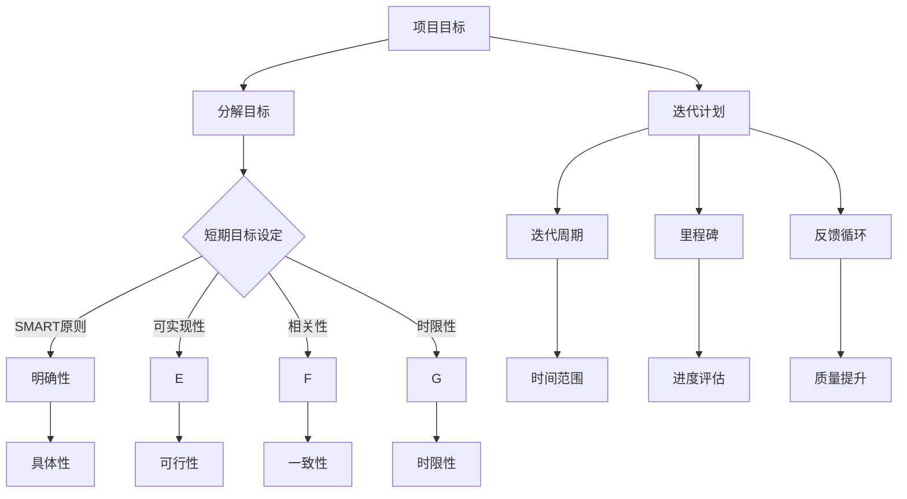
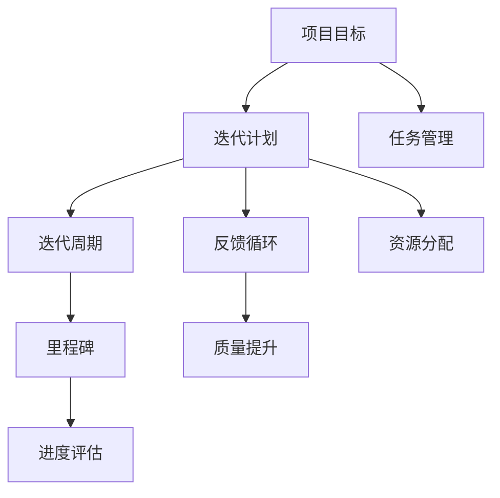
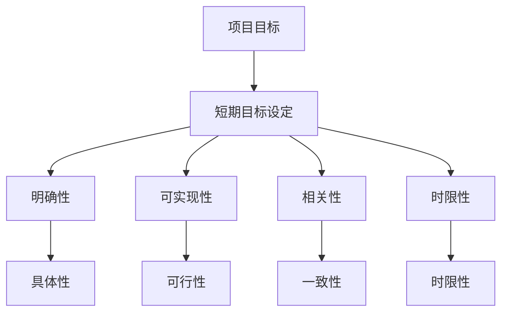
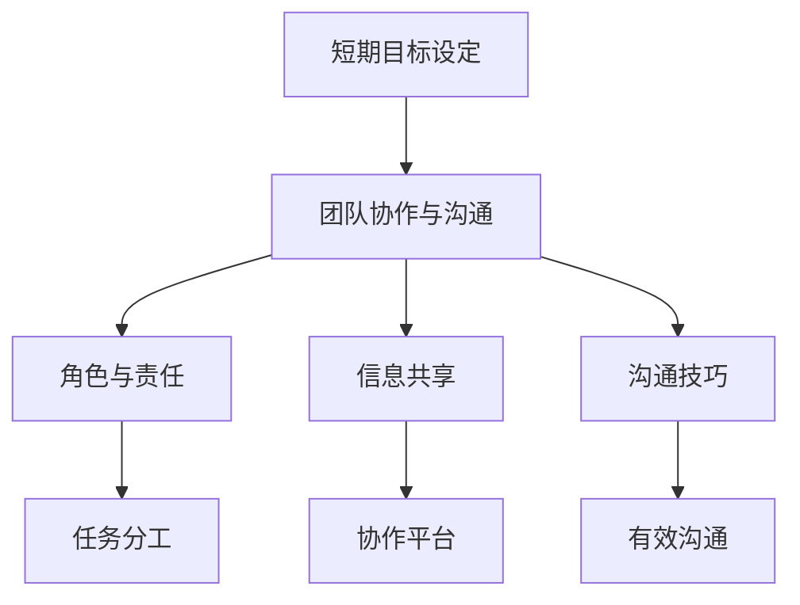
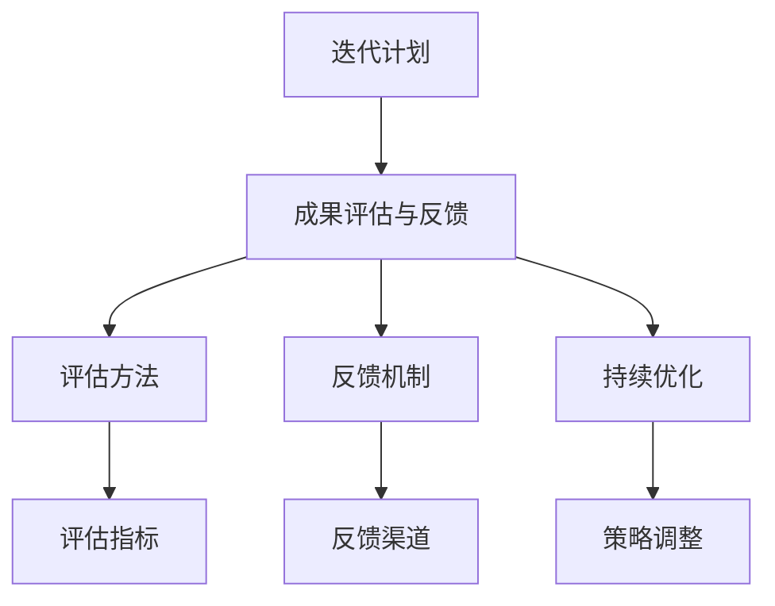

                 

# 文章标题：LLM应用的迭代计划会议：设定明确的短期目标

> 关键词：大规模语言模型（LLM），迭代计划，短期目标，项目规划，团队协作，成果评估

> 摘要：本文将探讨在LLM（大规模语言模型）应用项目的迭代计划会议中，如何设定明确的短期目标。通过分析短期目标设定的重要性、方法和实践，本文旨在为项目团队提供一套系统化的策略，以实现高效的项目管理和持续迭代优化。

## 第一部分：设定明确的目标和规划

### 第1章：目标设定与规划基础

#### 1.1 短期目标设定的重要性

**1.1.1 短期目标对项目迭代的影响**

在LLM应用项目中，短期目标的设定对于项目的成功至关重要。短期目标不仅为团队成员提供了清晰的方向和目标，而且有助于项目管理和进度控制。通过设定明确的短期目标，项目团队能够更好地分解任务、规划资源，并确保项目在预定的时间内完成。

**1.1.2 短期目标设定的基本原则**

设定短期目标时应遵循以下基本原则：

1. **明确性**：目标必须具体、可量化，以便团队成员明确了解任务要求。
2. **可实现性**：目标需要具有现实可行性，避免设定过高的目标导致团队成员压力过大。
3. **相关性**：短期目标应与项目总体目标保持一致，确保所有任务都朝着项目目标前进。
4. **时限性**：目标需要设定明确的完成时间，以便团队成员能够按计划推进工作。

#### 1.2 迭代计划的基本概念

**1.2.1 迭代计划的定义与目的**

迭代计划是一种基于重复迭代和逐步改进的方法，用于实现项目目标。其核心目的是通过不断迭代和反馈，提高项目质量，缩短项目周期，并适应快速变化的市场需求。

**1.2.2 迭代计划与项目管理的联系**

迭代计划是项目管理的重要组成部分。它不仅涵盖了项目的时间管理和资源分配，还强调了团队协作和持续改进。通过迭代计划，项目团队能够更好地适应项目变化，提高项目成功率。

#### 1.3 短期目标设定的方法与技巧

**1.3.1 目标SMART原则**

SMART原则是一种常用的目标设定方法，其含义如下：

1. **Specific（具体）**：目标必须具体、明确，避免模糊不清。
2. **Measurable（可衡量）**：目标需要可量化，以便评估进度和成果。
3. **Achievable（可实现）**：目标需要具有现实可行性，避免设定过高的目标。
4. **Relevant（相关）**：目标应与项目总体目标保持一致。
5. **Time-bound（时限性）**：目标需要设定明确的完成时间。

**1.3.2 风险评估与应对策略**

在设定短期目标时，项目团队应进行风险评估，识别可能的风险因素，并制定相应的应对策略。这有助于降低项目风险，确保短期目标的实现。

**1.3.3 目标分解与优先级排序**

将项目目标分解为更小的、具体的短期目标，有助于项目团队更好地管理和控制任务。同时，根据任务的优先级对短期目标进行排序，确保资源得到有效利用。

#### 1.4 迭代计划中的团队协作与沟通

**1.4.1 团队角色与责任分配**

在迭代计划中，明确团队角色和责任分配至关重要。这有助于确保任务高效完成，并避免团队成员之间的职责重叠或空白。

**1.4.2 信息共享与协作平台**

建立信息共享机制和协作平台，有助于团队成员随时了解项目进展、任务分配和反馈信息。这有助于提高团队协作效率，确保短期目标的顺利实现。

**1.4.3 沟通技巧与反馈机制**

培养良好的沟通习惯和技巧，有助于减少误解和冲突。同时，建立有效的反馈机制，及时收集和传递反馈信息，有助于持续改进项目策略和方案。

#### 1.5 成果评估与反馈

**1.5.1 迭代成果评估方法**

在迭代计划的每个阶段，项目团队应使用合适的评估方法，客观评价项目成果。这有助于识别项目优点和不足，为后续迭代提供改进方向。

**1.5.2 反馈机制与改进措施**

建立有效的反馈机制，及时收集和传递反馈信息。根据反馈结果，项目团队应制定相应的改进措施，以持续优化项目策略和方案。

**1.5.3 持续迭代与优化**

持续迭代和优化是迭代计划的核心原则。通过不断迭代和反馈，项目团队能够不断提高项目质量，实现项目目标。

## 第二部分：短期目标设定的具体应用

### 第2章：短期目标设定在LLM应用项目中的实践

#### 2.1 LLM应用项目概述

**2.1.1 LLM应用的背景与趋势**

随着人工智能技术的快速发展，大规模语言模型（LLM）在各个领域得到了广泛应用。LLM不仅提高了自然语言处理（NLP）的准确性和效率，还为各种应用场景提供了强大的支持。

**2.1.2 LLM应用的主要领域**

LLM应用涉及众多领域，包括但不限于：

1. **智能问答系统**：利用LLM构建智能问答系统，提供快速、准确的回答。
2. **文本生成与摘要**：利用LLM生成高质量的文章摘要、新闻报道等。
3. **机器翻译**：利用LLM实现高效、精准的机器翻译。
4. **情感分析**：利用LLM对文本进行情感分析，用于市场调研、用户反馈分析等。

**2.1.3 LLM应用项目的挑战与机遇**

LLM应用项目面临的主要挑战包括：

1. **数据需求**：构建高质量的LLM需要大量的高质量数据。
2. **计算资源**：训练和推理大型LLM模型需要大量的计算资源。
3. **模型泛化能力**：如何提高LLM的泛化能力，使其在不同任务和应用场景中表现优异。

同时，LLM应用项目也带来了众多机遇，如提高企业竞争力、优化业务流程、提升用户体验等。

#### 2.2 短期目标在LLM应用项目中的重要性

**2.2.1 短期目标对项目迭代的影响**

在LLM应用项目中，短期目标的设定对于项目迭代具有重要意义。短期目标不仅为团队成员提供了清晰的方向和目标，而且有助于项目团队更好地控制项目进度、管理和资源。

**2.2.2 短期目标在项目规划中的应用**

在项目规划阶段，项目团队应根据项目需求和资源情况，设定一系列短期目标。这些短期目标应涵盖项目的各个阶段，包括数据准备、模型训练、模型评估、应用部署等。

#### 2.3 短期目标设定在LLM应用项目中的方法

**2.3.1 SMART原则在短期目标设定中的应用**

在LLM应用项目中，设定短期目标时，项目团队应遵循SMART原则。具体应用如下：

1. **Specific（具体）**：短期目标应具体、明确，如“在一个月内完成模型训练”。
2. **Measurable（可衡量）**：短期目标需要可量化，如“在模型训练完成后，准确率达到90%”。
3. **Achievable（可实现）**：短期目标需要具有现实可行性，如“在现有资源条件下，完成模型训练”。
4. **Relevant（相关）**：短期目标应与项目总体目标保持一致，如“提高模型在问答任务中的性能”。
5. **Time-bound（时限性）**：短期目标需要设定明确的完成时间，如“在两周内完成模型训练和评估”。

**2.3.2 风险评估与应对策略**

在设定短期目标时，项目团队应进行风险评估，识别可能的风险因素，并制定相应的应对策略。例如，针对数据不足的风险，项目团队可以提前准备高质量的数据集，或者利用数据增强技术提高模型的泛化能力。

**2.3.3 目标分解与优先级排序**

将项目目标分解为短期目标，有助于项目团队更好地管理和控制任务。根据任务的优先级对短期目标进行排序，确保资源得到有效利用。例如，在模型训练阶段，项目团队可以首先关注模型结构和超参数优化，然后再关注数据预处理和模型评估。

#### 2.4 团队协作与沟通在短期目标实现中的关键角色

**2.4.1 团队角色与责任分配**

在实现短期目标的过程中，明确团队角色和责任分配至关重要。项目团队应根据任务需求，明确各个成员的职责，确保任务高效完成。

**2.4.2 信息共享与协作平台**

建立信息共享机制和协作平台，有助于团队成员随时了解项目进展、任务分配和反馈信息。例如，项目团队可以采用项目管理工具，如Trello、Jira等，实现任务管理和协作。

**2.4.3 沟通技巧与反馈机制**

培养良好的沟通习惯和技巧，有助于减少误解和冲突。同时，建立有效的反馈机制，及时收集和传递反馈信息，有助于持续改进项目策略和方案。

#### 2.5 成果评估与反馈在短期目标实现中的重要性

**2.5.1 迭代成果评估方法**

在实现短期目标的过程中，项目团队应定期评估迭代成果。评估方法可以包括：

1. **模型性能评估**：评估模型在各个任务上的性能，如准确率、召回率等。
2. **用户反馈**：收集用户对模型和应用的评价，了解用户需求和满意度。
3. **项目进度评估**：评估项目进度和任务完成情况，确保项目按计划推进。

**2.5.2 反馈机制与改进措施**

根据评估结果，项目团队应建立有效的反馈机制，及时收集和传递反馈信息。根据反馈结果，项目团队可以制定相应的改进措施，如调整模型结构、优化数据预处理方法等。

**2.5.3 持续迭代与优化**

持续迭代和优化是LLM应用项目成功的关键。项目团队应根据反馈结果，不断调整项目策略和方案，以提高项目质量和用户满意度。

## 第三部分：案例分析与实战指导

### 第3章：案例分析与实战指导

#### 3.1 案例一：某公司LLM应用项目实践

**3.1.1 项目背景与目标**

某公司计划开发一款基于LLM的智能问答系统，以帮助企业客户快速获取所需信息。项目目标是在三个月内完成模型训练、应用部署和用户测试。

**3.1.2 短期目标的设定与实现**

项目团队根据项目目标和资源情况，设定了以下短期目标：

1. **数据准备**：在一个月内完成高质量的数据集准备。
2. **模型训练**：在一个月内完成基础模型的训练。
3. **模型评估**：在两周内完成模型性能评估。
4. **应用部署**：在两周内完成模型的应用部署。
5. **用户测试**：在两周内完成用户测试和反馈收集。

项目团队通过遵循SMART原则，确保短期目标的明确性和可实现性。在实现短期目标的过程中，项目团队定期评估进展情况，并根据评估结果调整任务计划。

**3.1.3 团队协作与沟通实践**

在实现短期目标的过程中，项目团队采用了以下协作与沟通实践：

1. **明确团队角色与责任**：项目团队明确了各个成员的职责，确保任务高效完成。
2. **信息共享与协作平台**：项目团队采用Trello作为任务管理工具，实现信息共享和任务分配。
3. **沟通技巧与反馈机制**：项目团队定期召开会议，分享项目进展和反馈，确保团队成员之间的沟通畅通。

**3.1.4 成果评估与反馈**

项目团队在实现短期目标后，对项目成果进行了评估和反馈。根据评估结果，项目团队发现模型在某些特定领域的性能还有待提高。针对这一反馈，项目团队决定进一步优化模型结构和超参数，以提高模型的整体性能。

#### 3.2 案例二：某初创公司LLM应用项目实战

**3.2.1 项目背景与目标**

某初创公司计划开发一款基于LLM的文本生成与摘要应用，以帮助企业客户快速生成高质量的文本内容。项目目标是在六个月内完成模型训练、应用部署和用户测试。

**3.2.2 短期目标的设定与实现**

项目团队根据项目目标和资源情况，设定了以下短期目标：

1. **数据准备**：在两个月内完成高质量的数据集准备。
2. **模型训练**：在两个月内完成基础模型的训练。
3. **模型评估**：在一个月内完成模型性能评估。
4. **应用部署**：在一个月内完成模型的应用部署。
5. **用户测试**：在一个月内完成用户测试和反馈收集。

项目团队通过遵循SMART原则，确保短期目标的明确性和可实现性。在实现短期目标的过程中，项目团队定期评估进展情况，并根据评估结果调整任务计划。

**3.2.3 团队协作与沟通实践**

在实现短期目标的过程中，项目团队采用了以下协作与沟通实践：

1. **明确团队角色与责任**：项目团队明确了各个成员的职责，确保任务高效完成。
2. **信息共享与协作平台**：项目团队采用Slack作为沟通工具，实现信息共享和任务分配。
3. **沟通技巧与反馈机制**：项目团队定期召开会议，分享项目进展和反馈，确保团队成员之间的沟通畅通。

**3.2.4 成果评估与反馈**

项目团队在实现短期目标后，对项目成果进行了评估和反馈。根据评估结果，项目团队发现模型在某些特定领域的性能还有待提高。针对这一反馈，项目团队决定进一步优化模型结构和超参数，以提高模型的整体性能。

#### 3.3 实战指导

**3.3.1 开发环境搭建**

搭建开发环境是LLM应用项目的重要步骤。项目团队需要安装必要的软件和工具，如Python、TensorFlow、PyTorch等。同时，项目团队应确保硬件资源（如GPU）满足模型训练的需求。

**3.3.2 数据预处理与模型训练**

数据预处理是构建高质量LLM的关键步骤。项目团队需要清洗、标注和预处理数据，以提高模型的泛化能力和性能。在模型训练阶段，项目团队应根据任务需求选择合适的模型结构和超参数，并进行训练。

**3.3.3 模型评估与优化**

模型评估是评估模型性能的重要环节。项目团队需要使用合适的评估指标和方法，如准确率、召回率、F1分数等，评估模型在各个任务上的性能。根据评估结果，项目团队可以进一步优化模型结构和超参数，以提高模型的整体性能。

**3.3.4 项目管理与团队协作**

在项目管理和团队协作方面，项目团队应遵循以下原则：

1. **明确项目目标和任务**：项目团队应明确项目目标和任务，确保团队成员对任务有清晰的认识。
2. **合理分配资源**：项目团队应根据任务需求和资源情况，合理分配资源，确保任务高效完成。
3. **定期评估项目进展**：项目团队应定期评估项目进展，确保项目按计划推进。
4. **培养良好的沟通习惯**：项目团队应培养良好的沟通习惯，确保团队成员之间的沟通畅通。

## 附录

### 附录A：工具与资源

**A.1 开发工具与框架**

- Python：Python是一种广泛使用的编程语言，适用于构建LLM应用。
- TensorFlow：TensorFlow是一种开源机器学习框架，适用于构建和训练大规模神经网络。
- PyTorch：PyTorch是一种开源机器学习框架，提供灵活的动态计算图，适用于构建和训练大规模神经网络。

**A.2 数据集与数据源**

- Common Crawl：Common Crawl是一个公开的互联网爬虫数据集，包含大量的网页文本。
- WikiText：WikiText是一个基于维基百科文本的数据集，适用于训练和评估自然语言处理模型。
- GLUE：GLUE是一个基准数据集，包含多个自然语言处理任务，适用于评估和比较不同模型的表现。

**A.3 相关文献与资料**

- [Bert: Pre-training of Deep Bidirectional Transformers for Language Understanding](https://arxiv.org/abs/1810.04805)
- [GPT-3: Language Models are Few-Shot Learners](https://arxiv.org/abs/2005.14165)
- [Transformers: State-of-the-Art Models for Language Processing](https://arxiv.org/abs/1910.10351)

### 附录B：常见问题与解答

**B.1 短期目标设定的常见误区**

1. **目标设定过于模糊**：目标应具体、明确，避免模糊不清。
2. **目标设定过高**：目标应具有现实可行性，避免设定过高的目标。
3. **目标设定与项目目标不一致**：目标应与项目总体目标保持一致。

**B.2 团队协作中的沟通障碍**

1. **任务分配不明确**：明确团队角色和责任，确保任务高效完成。
2. **信息不透明**：建立信息共享机制，确保团队成员了解项目进展。
3. **沟通方式不当**：培养良好的沟通习惯和技巧，减少误解和冲突。

**B.3 迭代过程中常见的挑战与应对策略**

1. **资源不足**：合理分配资源，确保项目按计划推进。
2. **技术难题**：积极寻求技术解决方案，如调整模型结构、优化算法等。
3. **用户需求变化**：及时收集用户反馈，根据需求调整项目策略和方案。

**B.4 成果评估与反馈中的关键点**

1. **评估指标选择**：选择合适的评估指标，客观评价项目成果。
2. **反馈机制建设**：建立有效的反馈机制，及时收集和传递反馈信息。
3. **持续改进**：根据反馈结果，持续改进项目策略和方案，提高项目质量。

### 核心概念与联系

#### 迭代计划

迭代计划是一种基于重复迭代和逐步改进的方法，用于实现项目目标。其核心概念包括：

- **迭代周期**：每次迭代的时间范围，通常为几周或几个月。
- **里程碑**：每个迭代周期的关键节点，用于评估项目进度和成果。
- **反馈循环**：通过收集反馈并进行迭代优化，以提高项目质量。

#### 短期目标

短期目标是迭代计划中的核心组成部分，其特点如下：

- **明确性**：目标必须具体、可量化。
- **可实现性**：目标需要具有现实可行性。
- **相关性**：目标应与项目总体目标保持一致。
- **时限性**：目标需要设定明确的完成时间。

#### 团队协作与沟通

团队协作与沟通在实现短期目标中至关重要，关键因素包括：

- **角色与责任**：明确团队成员的角色和责任，确保任务高效完成。
- **信息共享**：利用协作平台实现信息共享，提高团队协作效率。
- **沟通技巧**：培养良好的沟通习惯，减少误解和冲突。

#### 成果评估与反馈

成果评估与反馈是迭代计划中的重要环节，主要作用包括：

- **评估方法**：使用合适的评估指标和方法，客观评价项目成果。
- **反馈机制**：建立有效的反馈机制，及时收集和传递反馈信息。
- **持续优化**：根据反馈结果，持续改进项目策略和方案。

### Mermaid 流程图

通过上述流程图，我们可以清晰地看到项目目标与短期目标设定、迭代计划之间的关系。短期目标的设定遵循SMART原则，为迭代计划提供了明确的执行方向；迭代计划中的迭代周期、里程碑和反馈循环则确保项目目标的逐步实现和持续优化。## 核心概念与联系

为了更好地理解文章中涉及的核心概念及其相互关系，我们将使用Mermaid流程图对它们进行可视化描述。以下是对核心概念及其相互关系的详细解释和流程图：

### 迭代计划

迭代计划是一种基于重复迭代和逐步改进的方法，用于实现项目目标。其核心概念包括：

1. **迭代周期**：每次迭代的时间范围，通常为几周或几个月。它为团队成员提供了一个可管理的任务范围，有助于更好地控制项目进度。
2. **里程碑**：每个迭代周期的关键节点，用于评估项目进度和成果。里程碑标志着项目的重要进展，可以作为项目评估和决策的依据。
3. **反馈循环**：通过收集反馈并进行迭代优化，以提高项目质量。反馈循环确保项目团队能够根据实际情况调整策略，从而实现持续改进。

#### 迭代计划的流程图：

### 短期目标

短期目标是迭代计划中的核心组成部分，其特点如下：

1. **明确性**：目标必须具体、可量化，以便团队成员明确了解任务要求。
2. **可实现性**：目标需要具有现实可行性，避免设定过高的目标导致团队成员压力过大。
3. **相关性**：短期目标应与项目总体目标保持一致，确保所有任务都朝着项目目标前进。
4. **时限性**：目标需要设定明确的完成时间，以便团队成员能够按计划推进工作。

#### 短期目标的流程图：

### 团队协作与沟通

团队协作与沟通在实现短期目标中至关重要，关键因素包括：

1. **角色与责任**：明确团队成员的角色和责任，确保任务高效完成。
2. **信息共享**：利用协作平台实现信息共享，提高团队协作效率。
3. **沟通技巧**：培养良好的沟通习惯，减少误解和冲突。

#### 团队协作与沟通的流程图：

### 成果评估与反馈

成果评估与反馈是迭代计划中的重要环节，主要作用包括：

1. **评估方法**：使用合适的评估指标和方法，客观评价项目成果。
2. **反馈机制**：建立有效的反馈机制，及时收集和传递反馈信息。
3. **持续优化**：根据反馈结果，持续改进项目策略和方案，提高项目质量。

#### 成果评估与反馈的流程图：

通过上述流程图，我们可以清晰地看到项目目标与短期目标设定、迭代计划、团队协作与沟通、成果评估与反馈之间的相互关系。这些核心概念共同构成了一个系统化的项目管理体系，有助于实现高效的项目管理和持续优化。

