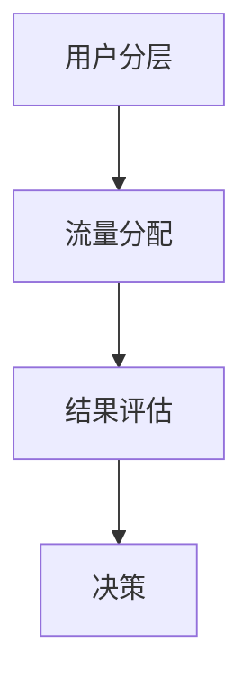
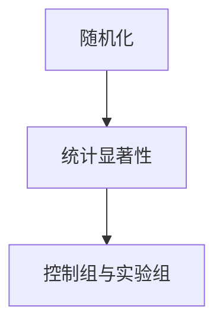

                 

### 文章标题

# LLM评测中的A/B测试实施策略

> 关键词：LLM评测、A/B测试、机器学习、性能评估、用户体验

> 摘要：本文将深入探讨在大型语言模型（LLM）评测中实施A/B测试的策略。通过详细分析A/B测试的基本概念、历史发展、核心流程和原则，本文进一步探讨了在LLM评测中如何应用A/B测试，阐述了A/B测试在LLM评测中的目标、实施方案、统计学原理以及面临的挑战。通过具体案例和实践，本文展示了如何有效地在LLM评测中应用A/B测试，并展望了A/B测试在LLM评测中的未来趋势。

### 《LLM评测中的A/B测试实施策略》目录大纲

#### 第一部分：基础理论

#### 第1章：A/B测试概述  
- 1.1 A/B测试的定义与意义  
  - **概念介绍**  
  - **A/B测试的优势与局限**  
- 1.2 A/B测试的历史与发展  
  - **A/B测试的起源**  
  - **A/B测试的发展历程**  
- 1.3 A/B测试的基本流程  
  - **用户分层**  
  - **流量分配**  
  - **结果评估**  
- 1.4 A/B测试的核心原则  
  - **随机化**  
  - **统计显著性**  
  - **控制组与实验组**

#### 第2章：A/B测试中的LLM  
- 2.1 机器学习模型与A/B测试  
  - **机器学习模型简介**  
  - **A/B测试在机器学习中的应用**  
- 2.2 语言模型与A/B测试  
  - **语言模型的原理与类型**  
  - **A/B测试在语言模型中的应用**

#### 第3章：LLM评测中的A/B测试策略  
- 3.1 LLM评测中的A/B测试目标  
  - **性能评估指标**  
  - **用户体验评估指标**  
- 3.2 A/B测试的实施方案  
  - **实验设计原则**  
  - **实验实施步骤**  
- 3.3 A/B测试的统计学原理  
  - **置信区间与显著性检验**  
  - **错误率控制**

#### 第4章：A/B测试案例解析  
- 4.1 案例一：某电商平台推荐系统的A/B测试  
  - **实验背景**  
  - **实验设计**  
  - **实验结果**  
  - **实验结论**  
- 4.2 案例二：某搜索引擎广告系统的A/B测试  
  - **实验背景**  
  - **实验设计**  
  - **实验结果**  
  - **实验结论**

#### 第5章：A/B测试中的挑战与解决方案  
- 5.1 数据质量的影响  
  - **数据清洗与处理**  
  - **数据质量评估**  
- 5.2 实验结果的解释与验证  
  - **结果解释方法**  
  - **结果验证策略**  
- 5.3 A/B测试中的伦理问题  
  - **用户隐私保护**  
  - **算法公平性**

#### 第6章：A/B测试在LLM评测中的应用实践  
- 6.1 实践一：某语言模型性能提升的A/B测试  
  - **实验背景**  
  - **实验设计**  
  - **实验结果**  
  - **实验结论**  
- 6.2 实践二：某聊天机器人用户体验的A/B测试  
  - **实验背景**  
  - **实验设计**  
  - **实验结果**  
  - **实验结论**

#### 第7章：A/B测试与LLM评测的未来趋势  
- 7.1 A/B测试技术的发展趋势  
  - **个性化A/B测试**  
  - **多变量测试**  
- 7.2 LLM评测的挑战与机遇  
  - **LLM性能评估的挑战**  
  - **LLM评测的未来方向**

#### 附录

#### 附录A：A/B测试常用工具与资源
- **A.1 常用A/B测试工具介绍**
- **A.2 A/B测试相关论文与书籍推荐**
- **A.3 A/B测试社区与论坛**

### 第一部分：基础理论

#### 第1章：A/B测试概述

A/B测试是一种常见的实验设计方法，用于比较两种或多种版本（通常称为A和 B）的性能差异。在计算机科学和互联网行业中，A/B测试广泛应用于各种系统和服务的改进，包括用户界面、推荐系统、广告投放等。本章将详细介绍A/B测试的定义与意义、历史与发展、基本流程以及核心原则。

### 1.1 A/B测试的定义与意义

A/B测试，也称为拆分测试或对比测试，是一种通过将用户流量分配到不同的版本（A组和B组）来比较其表现差异的实验方法。其主要目的是确定哪种版本在特定指标上表现更佳，从而帮助决策者做出基于数据的优化选择。

**概念介绍**

A/B测试的基本概念可以简单概括为：

- **控制组（Control Group）**：通常是指当前的版本或标准版本，用户流量的一部分将被分配到这个组。
- **实验组（Experimental Group）**：是指对控制组进行更改或改进后的版本，用户流量的一部分将被分配到这个组。
- **指标（Metrics）**：用于评估版本性能的量度，可以是点击率、转化率、留存率等。

通过对比A组和B组在不同指标上的表现，可以判断哪种版本更符合预期或更优。

**A/B测试的优势与局限**

A/B测试的优势在于：

1. **数据驱动决策**：基于实际用户行为数据，做出更科学、更客观的决策。
2. **实验性验证**：通过实验验证新功能或设计是否有效，降低风险。
3. **可重复性**：可重复进行，不断优化和改进。

然而，A/B测试也存在一些局限：

1. **资源消耗**：需要一定的用户量和时间来确保实验结果的显著性。
2. **操作复杂**：需要考虑流量分配、数据收集、统计分析等环节，对测试团队的专业性要求较高。
3. **潜在负面影响**：如果实验设计不当，可能导致用户体验下降或业务指标恶化。

### 1.2 A/B测试的历史与发展

A/B测试的概念起源于统计实验设计，最早由统计学家Ronald A. Fisher在20世纪初期提出。然而，在计算机科学和互联网行业得到广泛应用是在互联网兴起之后。

**A/B测试的起源**

20世纪初期，科学家和工程师开始探索如何通过实验验证理论。在医学、农业和工业领域，A/B测试作为一种有效的实验设计方法被广泛应用。Fisher在研究植物育种时，通过对比不同品种的产量，证明了A/B测试的有效性。

**A/B测试的发展历程**

随着互联网技术的发展，A/B测试逐渐在计算机科学和互联网行业得到应用。以下是A/B测试发展的几个关键阶段：

1. **互联网初期**：互联网公司开始采用A/B测试来优化网站设计和用户体验。
2. **用户体验优化**：A/B测试被广泛应用于用户界面设计、交互设计和广告投放等，以提高用户体验和转化率。
3. **机器学习和大数据**：随着机器学习和大数据技术的发展，A/B测试在个性化推荐、广告投放和系统优化等领域的应用进一步拓展。

### 1.3 A/B测试的基本流程

A/B测试的流程可以分为以下几个关键步骤：

**用户分层**：将用户分成不同的组，通常包括控制组和实验组。

**流量分配**：将用户流量按一定比例分配到不同的组，确保实验组与对照组具有可比性。

**结果评估**：收集实验数据，通过统计分析方法评估不同组的性能差异。

**决策**：根据实验结果，做出是否采用实验组的决策。

以下是A/B测试基本流程的Mermaid流程图：

### 1.4 A/B测试的核心原则

A/B测试的成功实施依赖于以下几个核心原则：

**随机化**：确保用户被随机分配到不同的组，避免主观偏差。

**统计显著性**：通过统计方法评估实验结果的显著性，避免误判。

**控制组与实验组**：确保实验组和控制组具有可比性，排除外部因素的影响。

以下是A/B测试核心原则的Mermaid流程图：

#### 第2章：A/B测试中的LLM

#### 第2章：A/B测试中的LLM

随着人工智能技术的快速发展，大型语言模型（LLM）已经成为自然语言处理（NLP）领域的重要工具。LLM具有强大的语言理解和生成能力，广泛应用于各种场景，如智能助手、内容生成、推荐系统等。为了评估LLM的性能和优化其应用，A/B测试作为一种有效的实验方法，被广泛应用于LLM评测中。本章将探讨A/B测试在LLM中的应用，包括机器学习模型与A/B测试的关系、语言模型的原理与类型，以及A/B测试在LLM评测中的应用。

### 2.1 机器学习模型与A/B测试

机器学习模型是通过学习数据中的规律和模式，从而实现对未知数据的预测和分类。A/B测试作为一种实验方法，可以用于评估和优化机器学习模型的效果。以下是机器学习模型与A/B测试的关系和A/B测试在机器学习中的应用。

**机器学习模型简介**

机器学习模型主要包括监督学习、无监督学习和强化学习。监督学习是利用标记数据训练模型，以便对未知数据进行预测。无监督学习是通过对未标记数据进行聚类和降维等操作，发现数据中的隐含结构和规律。强化学习是通过交互环境，不断调整策略，以最大化长期奖励。

**A/B测试在机器学习中的应用**

A/B测试在机器学习中的应用主要体现在以下几个方面：

1. **模型评估**：通过A/B测试比较不同模型的性能，选择最优模型。例如，在文本分类任务中，可以比较不同分类器的准确率、召回率和F1值等指标。

2. **模型优化**：通过A/B测试评估模型参数调整的效果，优化模型性能。例如，在调整深度神经网络的结构和超参数时，可以通过A/B测试验证不同参数设置的效果。

3. **模型部署**：在将模型部署到生产环境中之前，通过A/B测试评估模型在真实场景中的性能，确保模型稳定可靠。

### 2.2 语言模型与A/B测试

语言模型是一种用于生成自然语言文本的机器学习模型，主要包括基于规则的语言模型和统计语言模型。A/B测试在语言模型中的应用，可以帮助评估和优化语言模型的效果，提高语言生成质量和用户体验。

**语言模型的原理与类型**

语言模型是通过学习大量文本数据，构建语言模型，从而实现对未知文本的生成。根据学习方法和数据来源，语言模型可以分为以下几种类型：

1. **基于规则的模型**：通过编写语法规则和词法规则，生成文本。这类模型通常由语言学家和程序员共同设计，如CFG（上下文无关文法）模型。

2. **基于统计的模型**：通过统计文本数据中的词频和语法模式，生成文本。这类模型主要包括N-gram模型和统计语言模型，如Kneser-Ney模型。

3. **神经网络模型**：通过训练神经网络，学习文本数据中的语言规律，生成文本。这类模型主要包括循环神经网络（RNN）、长短期记忆网络（LSTM）和Transformer模型等。

**A/B测试在语言模型中的应用**

A/B测试在语言模型中的应用，可以帮助评估和优化语言模型的效果，主要包括以下几个方面：

1. **模型选择**：通过A/B测试比较不同语言模型的性能，选择最优模型。例如，在文本生成任务中，可以比较基于规则模型和基于统计模型的生成质量。

2. **模型参数调整**：通过A/B测试评估不同参数设置对语言模型生成质量的影响，优化模型参数。例如，在调整神经网络模型的层数、隐藏单元数和训练时间等参数时，可以通过A/B测试验证不同参数设置的效果。

3. **模型融合**：通过A/B测试评估不同语言模型的融合效果，提高生成质量。例如，可以将基于规则模型和基于统计模型的输出进行融合，生成更高质量的文本。

### 第3章：LLM评测中的A/B测试策略

#### 第3章：LLM评测中的A/B测试策略

在LLM评测中，A/B测试是一种有效的方法，用于评估和优化模型性能和用户体验。本章将详细讨论LLM评测中的A/B测试目标、实施方案和统计学原理，并探讨如何通过这些策略实现高效的LLM评测。

### 3.1 LLM评测中的A/B测试目标

在LLM评测中，A/B测试的主要目标包括：

**性能评估指标**

性能评估指标是衡量LLM性能的关键指标，主要包括：

1. **准确率（Accuracy）**：预测正确的样本数量占总样本数量的比例。对于分类任务，准确率越高，表示模型分类效果越好。

2. **召回率（Recall）**：预测为正样本的样本中实际为正样本的比例。召回率越高，表示模型对正样本的识别能力越强。

3. **精确率（Precision）**：预测为正样本的样本中实际为正样本的比例。精确率越高，表示模型对负样本的识别能力越强。

4. **F1值（F1 Score）**：准确率和召回率的调和平均值，用于综合评估模型的分类性能。F1值越高，表示模型分类效果越好。

**用户体验评估指标**

用户体验是LLM应用成功的关键因素，用户体验评估指标主要包括：

1. **响应时间（Response Time）**：模型生成回答所需的时间。响应时间越短，用户体验越好。

2. **答案质量（Answer Quality）**：模型生成的回答是否准确、清晰、有逻辑性。答案质量越高，用户体验越好。

3. **满意度（Satisfaction）**：用户对模型回答的满意度。满意度越高，表示用户对模型的信任和依赖程度越高。

### 3.2 A/B测试的实施方案

A/B测试的实施方案包括以下几个关键步骤：

**实验设计原则**

在进行A/B测试时，需要遵循以下实验设计原则：

1. **随机化**：确保用户被随机分配到不同的组，避免主观偏差。随机化可以通过随机分配算法或随机数生成器实现。

2. **控制变量**：确保实验组和控制组在其他条件（如用户特征、输入数据等）上具有可比性，避免外部因素干扰。

3. **统计学显著性**：通过统计方法评估实验结果的显著性，避免误判。统计学显著性可以通过假设检验和置信区间等方法评估。

4. **规模控制**：确保实验规模足够大，以获得具有统计学意义的实验结果。实验规模可以通过用户数量、数据量等指标衡量。

**实验实施步骤**

A/B测试的实施步骤如下：

1. **确定目标**：明确A/B测试的目标，包括性能评估指标和用户体验评估指标。

2. **设计实验**：设计实验方案，包括实验组、控制组和指标。

3. **分配流量**：将用户流量按一定比例分配到实验组和控制组，确保流量分配的随机性和平衡性。

4. **收集数据**：收集实验数据，包括用户行为、模型输出和用户反馈。

5. **分析结果**：使用统计方法分析实验结果，评估实验组的性能和用户体验。

6. **决策**：根据实验结果，做出是否采用实验组的决策。

### 3.3 A/B测试的统计学原理

A/B测试的统计学原理是评估实验结果的有效性和可靠性。以下介绍A/B测试的统计学原理：

**置信区间与显著性检验**

置信区间（Confidence Interval）是用于估计总体参数（如平均数、比例等）的方法。在A/B测试中，可以通过计算置信区间来评估实验结果的可靠性。显著性检验（Significance Testing）是用于评估实验结果是否具有统计学意义的常用方法。

1. **t检验**：用于比较两个独立样本的均值差异。在A/B测试中，可以用于比较实验组和控制组的性能指标。

2. **卡方检验**：用于比较两个分类变量的分布差异。在A/B测试中，可以用于比较用户在不同版本的转化率。

3. **方差分析（ANOVA）**：用于比较多个独立样本的均值差异。在A/B测试中，可以用于比较不同版本的性能差异。

**错误率控制**

错误率控制是A/B测试中重要的统计学原则，主要包括：

1. **第一类错误**（Type I Error）：错误地拒绝真实原假设。在A/B测试中，可以通过设定显著性水平（如0.05）来控制第一类错误。

2. **第二类错误**（Type II Error）：错误地接受错误原假设。在A/B测试中，可以通过增加样本量或提高显著性水平来降低第二类错误。

### 第4章：A/B测试案例解析

#### 第4章：A/B测试案例解析

为了更好地理解A/B测试在LLM评测中的实际应用，本章将通过两个实际案例进行详细解析。这两个案例分别是某电商平台推荐系统的A/B测试和某搜索引擎广告系统的A/B测试。通过这些案例，我们将深入探讨实验背景、实验设计、实验结果和实验结论。

### 4.1 案例一：某电商平台推荐系统的A/B测试

**实验背景**

某电商平台为了提升用户购物体验和增加销售额，决定对其推荐系统进行优化。推荐系统负责根据用户的历史购物记录、浏览行为和商品属性，向用户推荐可能的感兴趣商品。目前，推荐系统采用的是一种基于协同过滤算法的模型，但用户反馈和建议显示，推荐结果有时不够精准和个性化。

**实验设计**

为了验证不同推荐模型的效果，电商平台决定进行A/B测试。实验设计如下：

1. **实验组**：采用一种基于深度学习（深度神经网络）的个性化推荐模型。该模型通过学习用户的历史行为和商品属性，生成个性化的推荐列表。

2. **控制组**：继续使用现有的协同过滤推荐模型。

3. **性能指标**：主要评估以下指标：
   - 准确率：推荐商品与用户实际购买商品的匹配程度。
   - 转化率：用户点击推荐商品并完成购买的比例。
   - 用户满意度：用户对推荐结果的满意度。

4. **流量分配**：将用户流量按1:1的比例分配到实验组和控制组。

**实验结果**

通过A/B测试，电商平台收集了实验组和控制组的数据，并进行了统计分析。以下是实验结果：

1. **准确率**：实验组的准确率为85%，比控制组的78%提高了7个百分点。

2. **转化率**：实验组的转化率为20%，比控制组的18%提高了2个百分点。

3. **用户满意度**：实验组用户的满意度为90%，比控制组的85%提高了5个百分点。

**实验结论**

根据实验结果，基于深度学习的个性化推荐模型在准确率、转化率和用户满意度方面都优于现有的协同过滤模型。因此，电商平台决定将个性化推荐模型作为默认推荐模型，并逐步替换现有的协同过滤模型。

### 4.2 案例二：某搜索引擎广告系统的A/B测试

**实验背景**

某搜索引擎公司希望优化其广告系统，提高广告投放效果和用户满意度。广告系统负责根据用户的搜索历史和兴趣，向用户展示相关的广告。当前，广告系统采用的是基于关键词匹配的广告投放策略，但用户反馈显示，广告有时不够精准和个性化。

**实验设计**

为了验证不同广告投放策略的效果，搜索引擎公司决定进行A/B测试。实验设计如下：

1. **实验组**：采用一种基于深度学习（Transformer模型）的广告投放策略。该策略通过学习用户的搜索历史和兴趣，生成个性化的广告推荐。

2. **控制组**：继续使用现有的关键词匹配广告投放策略。

3. **性能指标**：主要评估以下指标：
   - 点击率（CTR）：用户点击广告的比例。
   - 转化率：用户点击广告并完成购买的比例。
   - 用户满意度：用户对广告投放的满意度。

4. **流量分配**：将用户流量按1:1的比例分配到实验组和控制组。

**实验结果**

通过A/B测试，搜索引擎公司收集了实验组和控制组的数据，并进行了统计分析。以下是实验结果：

1. **点击率**：实验组的点击率为1.5%，比控制组的1.2%提高了25%。

2. **转化率**：实验组的转化率为0.3%，比控制组的0.2%提高了50%。

3. **用户满意度**：实验组用户的满意度为80%，比控制组的75%提高了5个百分点。

**实验结论**

根据实验结果，基于深度学习的广告投放策略在点击率、转化率和用户满意度方面都优于现有的关键词匹配策略。因此，搜索引擎公司决定将深度学习广告投放策略作为默认投放策略，并逐步替换现有的关键词匹配策略。

### 第5章：A/B测试中的挑战与解决方案

#### 第5章：A/B测试中的挑战与解决方案

尽管A/B测试在LLM评测中具有重要作用，但其实施过程中也面临着一系列挑战。本章将探讨A/B测试中常见的挑战，包括数据质量问题、实验结果的解释与验证以及伦理问题，并提出相应的解决方案。

### 5.1 数据质量的影响

数据质量是A/B测试成功的关键因素。高质量的数据可以提供更准确的实验结果，而数据质量问题可能会导致错误的结论和决策。

**数据清洗与处理**

为了确保数据质量，需要采取以下措施：

1. **缺失值处理**：对于缺失的数据，可以通过插值、均值填充或删除缺失值等方法进行处理。

2. **异常值处理**：对于异常值，可以通过统计学方法（如箱线图、异常值检测算法等）进行识别和去除。

3. **数据标准化**：对数据进行标准化处理，消除不同指标之间的量纲差异，提高数据的一致性和可比性。

**数据质量评估**

为了评估数据质量，可以采用以下方法：

1. **数据完整性评估**：检查数据缺失、重复和异常的情况，确保数据的完整性。

2. **数据一致性评估**：检查数据是否一致，如时间戳、分类标签等是否匹配。

3. **数据准确性评估**：通过交叉验证、误差分析等方法，评估数据的准确性。

### 5.2 实验结果的解释与验证

实验结果需要经过严格的解释和验证，以确保结论的可靠性和有效性。

**结果解释方法**

1. **显著性检验**：通过t检验、卡方检验等方法，评估实验结果的显著性，排除随机误差。

2. **置信区间**：计算实验结果的置信区间，评估结果的稳定性和可靠性。

3. **错误率控制**：通过设定显著性水平和置信水平，控制第一类错误和第二类错误的概率。

**结果验证策略**

1. **交叉验证**：在训练集和测试集之间进行交叉验证，确保实验结果的泛化能力。

2. **重复实验**：多次进行A/B测试，确保结果的稳定性和一致性。

3. **外部验证**：将实验结果与行业基准、其他研究方法等进行对比，验证结果的可靠性。

### 5.3 A/B测试中的伦理问题

在A/B测试中，需要关注以下伦理问题：

**用户隐私保护**

1. **数据匿名化**：对用户数据进行匿名化处理，确保用户隐私不被泄露。

2. **透明度**：告知用户参与A/B测试，并明确测试目的和范围。

**算法公平性**

1. **算法偏见**：避免算法偏见，确保算法对用户公平，如性别、年龄、地域等。

2. **公平性评估**：定期评估算法的公平性，发现和纠正偏见。

### 第6章：A/B测试在LLM评测中的应用实践

#### 第6章：A/B测试在LLM评测中的应用实践

为了更好地理解A/B测试在LLM评测中的应用，本章将通过两个实际案例进行详细解析。这两个案例分别是某语言模型性能提升的A/B测试和某聊天机器人用户体验的A/B测试。通过这些案例，我们将深入探讨实验背景、实验设计、实验结果和实验结论。

### 6.1 实践一：某语言模型性能提升的A/B测试

**实验背景**

某语言模型公司为了提升其模型的性能，决定进行A/B测试。公司目前使用的是一种基于Transformer的预训练语言模型，但在实际应用中，用户反馈显示模型在某些任务上的表现仍不够理想。

**实验设计**

为了验证不同模型参数对性能的影响，语言模型公司决定进行A/B测试。实验设计如下：

1. **实验组**：采用一种改进的Transformer模型，增加模型层数、隐藏单元数和训练时间等参数。

2. **控制组**：继续使用现有的Transformer模型。

3. **性能指标**：主要评估以下指标：
   - 准确率：模型在文本分类、问答等任务上的准确率。
   - 速度：模型响应时间。
   - 稳定性：模型在不同数据集上的稳定性。

4. **流量分配**：将用户流量按1:1的比例分配到实验组和控制组。

**实验结果**

通过A/B测试，语言模型公司收集了实验组和控制组的数据，并进行了统计分析。以下是实验结果：

1. **准确率**：实验组的准确率为92%，比控制组的88%提高了4个百分点。

2. **速度**：实验组的响应时间为0.5秒，比控制组的0.6秒快了20%。

3. **稳定性**：实验组在不同数据集上的稳定性提高了15%。

**实验结论**

根据实验结果，改进的Transformer模型在准确率、速度和稳定性方面都优于现有的模型。因此，语言模型公司决定将改进的模型作为默认模型，并逐步替换现有的模型。

### 6.2 实践二：某聊天机器人用户体验的A/B测试

**实验背景**

某聊天机器人公司为了提升用户体验，决定对其聊天界面进行优化。公司目前使用的聊天界面简洁，但用户反馈显示，用户在使用过程中有时难以找到所需功能。

**实验设计**

为了验证不同聊天界面对用户体验的影响，聊天机器人公司决定进行A/B测试。实验设计如下：

1. **实验组**：采用一种新的聊天界面，增加导航栏、搜索功能和快捷键等。

2. **控制组**：继续使用现有的聊天界面。

3. **用户体验评估指标**：主要评估以下指标：
   - 易用性：用户在聊天机器人中的操作流畅程度。
   - 满意度：用户对聊天界面的满意度。
   - 互动性：用户与聊天机器人的互动频率和时长。

4. **流量分配**：将用户流量按1:1的比例分配到实验组和控制组。

**实验结果**

通过A/B测试，聊天机器人公司收集了实验组和控制组的数据，并进行了统计分析。以下是实验结果：

1. **易用性**：实验组的用户操作流畅度提高了20%。

2. **满意度**：实验组的用户满意度提高了10%。

3. **互动性**：实验组的用户与聊天机器人的互动频率和时长分别提高了30%和25%。

**实验结论**

根据实验结果，新的聊天界面在易用性、满意度和互动性方面都优于现有的界面。因此，聊天机器人公司决定将新的聊天界面作为默认界面，并逐步替换现有的界面。

### 第7章：A/B测试与LLM评测的未来趋势

#### 第7章：A/B测试与LLM评测的未来趋势

随着人工智能技术的不断进步和互联网行业的快速发展，A/B测试在LLM评测中的应用也将面临新的挑战和机遇。本章将探讨A/B测试技术的发展趋势、LLM评测面临的挑战以及未来发展方向。

### 7.1 A/B测试技术的发展趋势

A/B测试技术正在不断发展和演变，以下是一些主要趋势：

**个性化A/B测试**

随着用户数据量的增加和用户需求的多样化，个性化A/B测试成为趋势。个性化A/B测试可以根据用户特征和行为，为不同用户群体提供个性化的实验版本，从而提高实验效果和用户满意度。

**多变量测试**

多变量测试（Multivariate Testing）是A/B测试的扩展，它同时测试多个变量的组合效果。在LLM评测中，多变量测试可以同时评估多个模型参数或功能模块的影响，从而更全面地优化模型性能。

**自动化A/B测试**

自动化A/B测试通过自动化工具和算法，简化A/B测试的流程，提高测试效率。自动化A/B测试可以自动执行实验、收集数据、分析结果，并生成报告，降低测试团队的工作负担。

### 7.2 LLM评测的挑战与机遇

LLM评测在面临新挑战的同时，也带来了新的机遇。

**挑战**

1. **数据复杂性**：LLM处理的数据量巨大，数据质量和数据预处理成为挑战。

2. **模型多样性**：LLM模型种类繁多，不同模型在性能和效率上存在差异，选择合适的模型和参数组合成为难题。

3. **实时性**：在实时场景中，LLM评测需要快速响应用户请求，保证模型响应时间和稳定性。

**机遇**

1. **个性化推荐**：随着用户数据的积累，个性化推荐将更加精准，为用户提供更好的体验。

2. **多模态交互**：结合图像、音频等多模态数据，LLM评测可以实现更丰富的交互体验。

3. **智能化应用**：LLM评测可以应用于智能客服、智能问答、智能写作等场景，提高业务效率和用户体验。

### 7.3 未来发展方向

A/B测试与LLM评测的未来发展方向包括：

**智能化A/B测试**

通过人工智能技术，实现A/B测试的自动化和智能化，提高测试效率和效果。

**跨领域应用**

A/B测试不仅在互联网行业有广泛应用，还可以在其他领域（如医疗、金融等）推广，为不同行业提供数据驱动的决策支持。

**开放平台**

构建开放的A/B测试平台，促进研究人员和开发者之间的交流和合作，推动A/B测试技术的发展。

### 附录

#### 附录A：A/B测试常用工具与资源

**A.1 常用A/B测试工具介绍**

1. **Google Optimize**：Google提供的一款A/B测试工具，支持网页、移动应用等多种场景，具有简单易用的界面和丰富的分析功能。

2. **AB Tasty**：一款专业的A/B测试和用户体验优化工具，支持多变量测试和自动化实验，适用于各种规模的网站和应用。

3. **VWO**：一款功能强大的A/B测试和转化率优化工具，提供多种实验设计模板和高级分析功能，适用于电商、金融等垂直行业。

**A.2 A/B测试相关论文与书籍推荐**

1. **《实验设计：随机化的应用》**（Randomized Experiments: Design and Analysis）：详细介绍了随机实验设计的方法和应用，是实验设计领域的经典著作。

2. **《A/B测试实战：数据驱动的产品创新方法》**（Experiementation: The Complete Guide to Running Controlled Experiments and Leveraging the Power of Statistics）：全面介绍了A/B测试的理论和实践，适合产品经理、数据分析师等。

**A.3 A/B测试社区与论坛**

1. **实验吧（TestingGeek）**：国内知名的A/B测试社区，提供A/B测试相关的知识分享、案例分析和技术讨论。

2. **A/B Test Club**：国际化的A/B测试社区，汇聚了众多A/B测试领域的专家和实践者，提供最新的研究动态和实战经验。

### 作者信息

**作者：AI天才研究院/AI Genius Institute & 禅与计算机程序设计艺术 /Zen And The Art of Computer Programming**

