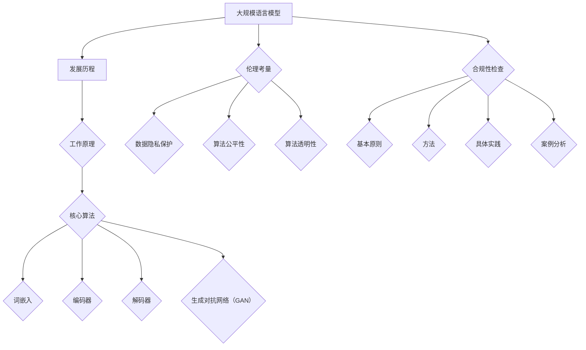

                 

### 文章标题

# LLM评测中的伦理考量与合规性检查

### 关键词：
- 大规模语言模型（LLM）
- 伦理考量
- 合规性检查
- 数据隐私
- 算法公平性
- 算法透明性

### 摘要：
随着大规模语言模型（LLM）的迅猛发展，其在各个领域的应用日益广泛。然而，LLM的广泛应用也带来了诸多伦理和法律问题，如数据隐私保护、算法公平性和透明性等。本文旨在探讨LLM评测中的伦理考量与合规性检查，分析其在实际应用中面临的挑战，并提出相应的解决方案。本文首先介绍了大规模语言模型的发展历程、工作原理和关键技术，然后从数据隐私保护、算法公平性和透明性三个方面详细阐述了LLM评测中的伦理问题，并讨论了合规性检查的基本原则、方法及其实践，最后通过案例分析展示了LLM伦理与合规性检查的重要性和实际应用效果，并对未来LLM伦理与合规性发展的趋势进行了展望。

### 第一部分：LLM基础

#### 第1章：大规模语言模型概述

##### 1.1 大规模语言模型的发展历程

大规模语言模型（LLM）的发展历程可以追溯到20世纪50年代。当时，研究者开始尝试使用计算机模拟人类语言处理过程，这些早期的尝试通常是基于规则的方法。随着计算机技术的进步，统计方法逐渐成为语言模型的主流，如N-gram模型和决策树模型。

20世纪80年代，神经网络在语言模型中的应用取得了显著进展。1986年，霍普菲尔德（John Hopfield）提出了Hopfield神经网络，为神经网络在语言模型中的应用奠定了基础。随后，1988年，罗伯逊（David E. Rumelhart）等人提出了反向传播算法（Backpropagation），这使得神经网络在语言模型中的应用变得更加广泛和有效。

进入21世纪，随着计算能力和数据资源的不断提升，深度学习技术逐渐成为语言模型的主流。2003年，宾夕法尼亚大学的科学家们开发了第一个基于深度神经网络的机器翻译系统。2013年，Google的神经机器翻译系统（GNMT）实现了显著的语言翻译质量提升，这一成果标志着深度学习在语言模型领域的突破。

近年来，随着Transformer架构的提出和BERT模型的发布，大规模语言模型进入了一个全新的发展阶段。Transformer架构通过自注意力机制（Self-Attention）实现了对输入文本的全局依赖建模，大幅提升了语言模型的性能。BERT模型通过预训练和微调的方式，实现了对大规模文本数据的深度理解和利用，为自然语言处理（NLP）带来了革命性的变化。

##### 1.2 大规模语言模型的工作原理

大规模语言模型的核心是神经网络，特别是深度神经网络。神经网络由多层神经元组成，每一层神经元都通过激活函数对输入数据进行处理和转换。

在语言模型中，输入数据通常是文本，经过编码后转化为向量形式。这些向量作为神经网络的输入，通过网络中的多层神经元传递和变换，最终生成输出结果。在这个过程中，神经网络通过反向传播算法不断调整内部参数，以优化模型的预测性能。

大规模语言模型的工作原理主要包括以下几个步骤：

1. **数据预处理**：将文本数据转化为向量形式，通常使用词嵌入（Word Embedding）技术，如Word2Vec、GloVe等。词嵌入将每个词汇映射为一个固定维度的向量，使文本数据具备数字特征。

2. **编码**：将文本向量输入到编码器（Encoder）中，编码器通过多层神经网络对输入数据进行编码，提取出高维语义特征。

3. **解码**：将编码后的特征输入到解码器（Decoder）中，解码器通过多层神经网络生成输出文本。

4. **训练与优化**：使用反向传播算法对模型进行训练，通过不断调整模型参数，优化模型的预测性能。

5. **预测与生成**：在训练完成后，模型可以用于预测新文本。给定一个起始文本，模型可以生成后续的文本内容。

##### 1.3 大规模语言模型的主要类型

大规模语言模型可以分为生成式模型（Generative Model）和判别式模型（Discriminative Model）两大类。

生成式模型试图模拟自然语言的生成过程，如前文所述的基于神经网络的生成模型，包括序列生成模型和变分自编码器（VAE）等。生成式模型通常采用自注意力机制（Self-Attention）和转置自注意力（Transposed Self-Attention）来处理输入文本，从而实现全局依赖建模。

判别式模型则试图通过区分真实数据和生成数据来训练模型。常见的判别式模型包括卷积神经网络（CNN）、循环神经网络（RNN）和长短期记忆网络（LSTM）等。判别式模型通常使用序列标注（Sequence Labeling）或分类（Classification）任务来训练和评估模型性能。

近年来，生成对抗网络（GAN）技术逐渐应用于大规模语言模型，结合生成式模型和判别式模型的优点，实现了更高的文本生成质量。

#### 第2章：大规模语言模型的关键技术

##### 2.1 语言模型的核心算法

大规模语言模型的核心算法主要包括词嵌入（Word Embedding）、编码器（Encoder）、解码器（Decoder）和生成对抗网络（GAN）等。

词嵌入（Word Embedding）是将词汇映射为向量的过程。常见的词嵌入技术包括Word2Vec、GloVe和FastText等。Word2Vec采用 skip-gram 模型和CBOW模型，通过训练神经网络来预测上下文词汇，从而得到词汇的向量表示。GloVe（Global Vectors for Word Representation）通过矩阵分解的方法，优化词汇的向量表示，使其在语义上具有相似性的词汇在向量空间中更接近。

编码器（Encoder）和解码器（Decoder）是大规模语言模型的主要组成部分。编码器负责将输入文本编码为高维语义特征，解码器则将这些特征解码为输出文本。在Transformer架构中，编码器和解码器由多个自注意力层（Self-Attention Layer）和前馈神经网络（Feedforward Neural Network）组成。自注意力机制（Self-Attention）通过计算输入文本中每个词与其他词的依赖关系，实现了全局依赖建模，从而提高了模型的语义理解能力。

生成对抗网络（GAN）是一种结合生成式模型和判别式模型的算法。在GAN中，生成器（Generator）生成虚假数据，判别器（Discriminator）则试图区分真实数据和生成数据。通过训练生成器和判别器，生成器逐渐生成更真实的数据，判别器逐渐提高对真实数据和生成数据的区分能力。GAN在图像生成、语音合成等领域取得了显著成果，逐渐应用于大规模语言模型，以实现高质量的文本生成。

##### 2.2 大规模语言模型的训练与优化

大规模语言模型的训练与优化是模型开发中的关键步骤。训练过程主要包括数据预处理、模型初始化、前向传播、反向传播和参数更新等步骤。

1. **数据预处理**：在训练大规模语言模型之前，需要对文本数据进行预处理。常见的预处理操作包括分词、去除停用词、标点符号和词性标注等。此外，还需要对文本进行向量化处理，将词汇映射为词嵌入向量。

2. **模型初始化**：初始化模型参数是训练过程的起点。常用的初始化方法包括随机初始化、高斯初始化和Xavier初始化等。初始化方法的选择对模型的收敛速度和性能有重要影响。

3. **前向传播**：前向传播是将输入数据通过模型进行正向计算，得到输出结果的过程。在训练过程中，前向传播的结果用于计算损失函数，以衡量模型预测结果与真实值之间的差距。

4. **反向传播**：反向传播是计算损失函数关于模型参数的梯度，并用于更新模型参数的过程。反向传播算法基于链式法则，通过层层反向计算梯度，实现模型参数的优化。

5. **参数更新**：在反向传播过程中，模型参数会根据梯度进行更新。常用的优化算法包括梯度下降（Gradient Descent）、Adam优化器等。优化算法的选择对模型的收敛速度和性能有重要影响。

6. **训练策略**：大规模语言模型的训练通常采用批量训练（Batch Training）和随机梯度下降（Stochastic Gradient Descent，SGD）策略。批量训练将整个训练数据分成多个批次，每次只对一部分数据进行训练。随机梯度下降通过随机选取样本进行训练，以加快模型收敛速度。

##### 2.3 大规模语言模型的评估指标

大规模语言模型的评估指标是衡量模型性能的重要标准。常见的评估指标包括准确率（Accuracy）、精确率（Precision）、召回率（Recall）和F1值（F1 Score）等。

1. **准确率**：准确率是预测结果正确的样本数占总样本数的比例。准确率反映了模型的总体分类能力，但容易受到类别不平衡问题的影响。

2. **精确率**：精确率是预测结果为正类的样本中，实际为正类的比例。精确率反映了模型对正类样本的判断准确性。

3. **召回率**：召回率是实际为正类的样本中被预测为正类的比例。召回率反映了模型对负类样本的判断准确性。

4. **F1值**：F1值是精确率和召回率的调和平均，综合反映了模型的分类能力。F1值介于0和1之间，越接近1表示模型性能越好。

此外，大规模语言模型的评估还包括模型的可解释性和鲁棒性等方面。可解释性指模型决策过程的透明度和可理解性，鲁棒性指模型在处理未知数据时的稳定性和泛化能力。

#### 第3章：数据隐私保护

##### 3.1 数据隐私保护的基本原则

数据隐私保护在LLM的应用中至关重要。数据隐私保护的基本原则包括数据匿名化、数据加密和数据访问控制等。

1. **数据匿名化**：数据匿名化是将原始数据中的个人身份信息去除或替换为匿名标识符的过程。通过数据匿名化，可以保护用户隐私，防止个人身份信息的泄露。

2. **数据加密**：数据加密是将数据转换为无法直接读取的形式的过程。常用的加密算法包括对称加密（如AES）和非对称加密（如RSA）。通过数据加密，可以确保数据在传输和存储过程中的安全性。

3. **数据访问控制**：数据访问控制是指根据用户的权限和身份，限制用户对数据的访问和操作。常用的访问控制方法包括基于角色的访问控制（RBAC）和基于属性的访问控制（ABAC）等。

##### 3.2 数据隐私保护的方法与实践

在LLM的应用中，数据隐私保护的方法主要包括数据去重、数据脱敏和数据共享控制等。

1. **数据去重**：数据去重是通过识别和删除重复数据，减少数据存储空间和计算资源的需求。常用的去重方法包括哈希函数和唯一标识符生成等。

2. **数据脱敏**：数据脱敏是将敏感数据（如个人身份信息、信用卡号码等）替换为非敏感的替代值的过程。常用的脱敏方法包括字符替换、数字遮掩和随机化等。

3. **数据共享控制**：数据共享控制是指通过权限管理和数据审计，确保数据在共享过程中的安全性。数据共享控制的方法包括数据加密、访问控制和数据审计等。

在LLM的实际应用中，数据隐私保护的实践主要包括以下几个方面：

1. **数据收集**：在收集数据时，遵循数据隐私保护的基本原则，对数据进行匿名化和脱敏处理。

2. **数据处理**：在数据处理过程中，采用数据加密和访问控制技术，确保数据的安全性。

3. **数据存储**：在数据存储过程中，采用分布式存储和备份技术，提高数据的安全性和可靠性。

4. **数据传输**：在数据传输过程中，采用加密传输协议（如HTTPS）和安全传输机制，确保数据在传输过程中的安全性。

#### 第4章：算法公平性

##### 4.1 算法公平性的定义与重要性

算法公平性是指算法在决策过程中，对用户或数据的处理不偏不倚，不因个人特征（如性别、种族、年龄等）而产生歧视性结果。算法公平性是人工智能（AI）领域的重要研究方向，关系到社会的公正性和人的尊严。

算法公平性的重要性体现在以下几个方面：

1. **社会公正**：算法公平性有助于维护社会公正，防止因算法歧视而对特定群体产生不公平待遇。

2. **用户体验**：算法公平性有助于提高用户体验，确保用户在使用AI服务时获得公平、合理的待遇。

3. **法律合规**：算法公平性符合法律法规要求，有助于企业规避法律风险。

4. **技术进步**：算法公平性研究有助于推动AI技术的健康发展，提高AI系统的可靠性和可解释性。

##### 4.2 算法公平性的评估方法

评估算法公平性的方法主要包括统计方法、机器学习方法和心理学方法等。

1. **统计方法**：统计方法通过分析算法输出结果的分布特征，评估算法的公平性。常用的统计方法包括基尼系数（Gini Coefficient）、差异指标（Difference Measure）和公平性差异（Fairness Difference）等。

2. **机器学习方法**：机器学习方法通过构建公平性评估模型，评估算法的公平性。常见的机器学习方法包括线性回归（Linear Regression）、逻辑回归（Logistic Regression）和支持向量机（SVM）等。

3. **心理学方法**：心理学方法通过实验和问卷调查，评估用户对算法公平性的感知。常见的心理学方法包括实验心理学、认知心理学和社会心理学等。

##### 4.3 算法公平性的改进策略

提高算法公平性可以从数据集、算法设计和模型优化三个方面进行。

1. **数据集**：确保数据集的多样性和代表性，避免数据集中存在的偏差。可以通过数据增强、数据重构和数据清洗等方法，提高数据集的公平性。

2. **算法设计**：设计公平性算法，避免算法在决策过程中产生歧视性结果。可以通过公平性约束、对偶算法和公平性指标等方法，提高算法的公平性。

3. **模型优化**：优化模型参数和结构，提高模型的泛化能力和公平性。可以通过交叉验证、模型选择和模型融合等方法，优化模型的性能和公平性。

#### 第5章：算法透明性

##### 5.1 算法透明性的概念与意义

算法透明性是指算法决策过程和内部机制的可解释性和可理解性。算法透明性的意义在于：

1. **增强信任**：算法透明性有助于增强用户对AI系统的信任，提高系统的接受度。

2. **促进合作**：算法透明性有助于促进各方之间的合作与沟通，降低信息不对称。

3. **改进算法**：算法透明性有助于发现算法中的问题，推动算法的改进和优化。

4. **法律合规**：算法透明性符合法律法规要求，有助于企业规避法律风险。

##### 5.2 算法透明性的实现与挑战

实现算法透明性面临以下挑战：

1. **复杂性**：算法通常由大量的参数和复杂的结构组成，理解算法的内部机制具有挑战性。

2. **可解释性**：如何将复杂的算法转化为简单易懂的解释，保持算法的准确性和效率。

3. **性能损失**：增加算法的透明性可能会影响算法的性能，如何在保证透明性的同时优化算法。

常见的算法透明性实现方法包括：

1. **可视化**：通过可视化技术，将算法的决策过程和内部机制以图形或图表的形式展示，使算法更易于理解。

2. **模型简化**：通过简化算法模型，降低算法的复杂度，提高算法的可解释性。

3. **可解释性模型**：设计专门的可解释性模型，将复杂的算法转化为简单易懂的解释。

##### 5.3 提高算法透明性的方法

提高算法透明性可以从以下几个方面进行：

1. **开发可解释性工具**：开发可解释性工具，如决策树、线性模型和可视化工具等，提高算法的可解释性。

2. **文档和注释**：编写详细的文档和注释，解释算法的设计原理、实现过程和参数调整等，帮助用户理解算法。

3. **代码审查**：定期进行代码审查，发现和修复算法中的问题，提高算法的透明性和可靠性。

4. **用户反馈**：收集用户反馈，了解用户对算法的体验和需求，不断改进算法的设计和实现。

### 第三部分：合规性检查

#### 第6章：合规性检查的基本原则与方法

##### 6.1 合规性检查的重要性

合规性检查在LLM应用中具有重要意义。合规性检查是指通过对LLM系统进行审查和评估，确保其在设计、开发和使用过程中符合相关法律法规、标准和规范的要求。合规性检查的重要性体现在以下几个方面：

1. **法律合规**：确保LLM系统的设计和实现符合法律法规，避免因违规操作而产生的法律风险。

2. **用户信任**：合规性检查有助于增强用户对LLM系统的信任，提高系统的接受度和市场竞争力。

3. **技术进步**：合规性检查有助于推动LLM技术的发展，提高系统的安全性和可靠性。

4. **社会责任**：合规性检查有助于维护社会公正和人的尊严，防止因算法歧视而对特定群体产生不公平待遇。

##### 6.2 合规性检查的基本原则

合规性检查应遵循以下基本原则：

1. **全面性**：合规性检查应覆盖LLM系统的各个方面，包括设计、开发、测试和使用等环节。

2. **客观性**：合规性检查应保持客观公正，避免主观偏见和利益冲突。

3. **持续性**：合规性检查应持续进行，定期评估和更新LLM系统的合规性。

4. **透明性**：合规性检查过程应公开透明，确保各方对合规性检查结果的认可和信任。

##### 6.3 合规性检查的方法

合规性检查的方法主要包括以下几种：

1. **法规和标准审查**：对相关法律法规和行业标准进行审查，确保LLM系统符合规定。

2. **风险评估**：对LLM系统进行风险评估，识别潜在的法律风险和合规性问题。

3. **现场检查**：对LLM系统的实际运行环境进行现场检查，评估系统的合规性。

4. **测试和验证**：对LLM系统进行功能测试、性能测试和安全测试，确保系统符合合规性要求。

5. **审查和审计**：对LLM系统的开发文档、测试报告和运行记录进行审查和审计，确保合规性检查的全面性和客观性。

#### 第7章：合规性检查的具体实践

##### 7.1 数据合规性检查

数据合规性检查是确保LLM系统数据在收集、处理和使用过程中符合相关法律法规和行业标准的关键步骤。具体实践包括以下几个方面：

1. **数据收集合规性**：确保在收集数据时，遵守相关法律法规，如个人信息保护法（GDPR）、隐私政策等。对数据收集的范围、方式和用途进行明确，确保用户同意。

2. **数据处理合规性**：确保在数据处理过程中，遵循数据匿名化、脱敏和数据加密等数据保护措施，防止数据泄露和滥用。

3. **数据使用合规性**：确保在数据使用过程中，遵守数据隐私保护、数据共享和数据销毁等法律法规，确保数据的合法、合规使用。

##### 7.2 算法合规性检查

算法合规性检查是评估LLM系统算法在决策过程中是否公平、透明和可解释的关键步骤。具体实践包括以下几个方面：

1. **算法公平性检查**：评估算法在决策过程中是否存在性别、种族、年龄等歧视性因素，确保算法公平性。

2. **算法透明性检查**：评估算法决策过程的透明度和可理解性，确保用户可以理解和信任算法决策。

3. **算法可解释性检查**：评估算法的可解释性，确保算法决策结果的可解释性和可追溯性。

##### 7.3 产品合规性检查

产品合规性检查是确保LLM系统在设计和实现过程中符合相关法律法规和行业标准的关键步骤。具体实践包括以下几个方面：

1. **产品安全检查**：确保LLM系统在设计和实现过程中，遵循安全标准和规范，防止安全漏洞和攻击。

2. **产品隐私保护检查**：确保LLM系统在收集、处理和使用用户数据时，遵循隐私保护法律法规，保护用户隐私。

3. **产品责任检查**：确保LLM系统的设计、开发和部署过程中，遵循产品责任相关法律法规，确保产品的质量和安全。

#### 第8章：合规性检查案例分析

##### 8.1 案例分析一：某大型互联网公司数据泄露事件

某大型互联网公司发生了一起数据泄露事件，导致大量用户个人信息泄露。此次事件引发了广泛关注，对该公司的声誉和业务造成了严重影响。

**案例分析**：

1. **数据收集合规性**：公司在收集用户数据时，未明确告知用户数据的收集范围、用途和保存期限，违反了隐私保护法律法规。

2. **数据处理合规性**：公司在数据处理过程中，未采取有效的数据匿名化和脱敏措施，导致用户个人信息被泄露。

3. **数据使用合规性**：公司在使用用户数据时，未遵循隐私保护法律法规，滥用用户数据，违反了用户信任。

**改进措施**：

1. **加强数据收集合规性**：在收集用户数据前，明确告知用户数据的收集范围、用途和保存期限，确保用户知情同意。

2. **加强数据处理合规性**：在数据处理过程中，采取有效的数据匿名化和脱敏措施，防止用户个人信息泄露。

3. **加强数据使用合规性**：在数据使用过程中，严格遵守隐私保护法律法规，确保用户数据的合法、合规使用。

##### 8.2 案例分析二：某金融公司算法歧视问题

某金融公司因算法歧视问题受到广泛关注，该公司在贷款审批过程中，对某些特定群体的贷款申请存在歧视现象。

**案例分析**：

1. **算法公平性检查**：公司在算法开发过程中，未充分考虑算法公平性，导致对某些特定群体的贷款申请存在歧视现象。

2. **算法透明性检查**：公司在算法决策过程中，未提供充分的算法解释，用户无法理解贷款审批结果。

3. **算法可解释性检查**：公司在算法设计时，未考虑算法的可解释性，导致用户对贷款审批结果产生疑虑。

**改进措施**：

1. **加强算法公平性检查**：在算法开发过程中，充分考虑算法公平性，避免对特定群体的歧视。

2. **加强算法透明性检查**：在算法决策过程中，提供充分的算法解释，确保用户理解贷款审批结果。

3. **加强算法可解释性检查**：在算法设计时，充分考虑算法的可解释性，提高用户对算法的信任度。

##### 8.3 案例分析三：某科技公司产品合规性问题

某科技公司开发的一款智能家居产品因合规性问题受到监管机构的处罚，该产品在设计和实现过程中，存在多项安全漏洞和隐私泄露问题。

**案例分析**：

1. **产品安全检查**：公司在产品开发过程中，未充分考虑到安全标准和规范，导致产品存在多项安全漏洞。

2. **产品隐私保护检查**：公司在产品开发过程中，未采取有效的隐私保护措施，导致用户个人信息泄露。

3. **产品责任检查**：公司在产品设计和实现过程中，未充分考虑产品责任，未对潜在的安全风险和隐私泄露问题进行有效预防。

**改进措施**：

1. **加强产品安全检查**：在产品开发过程中，充分考虑安全标准和规范，确保产品在设计和实现过程中符合安全要求。

2. **加强产品隐私保护检查**：在产品开发过程中，采取有效的隐私保护措施，确保用户个人信息不被泄露。

3. **加强产品责任检查**：在产品设计和实现过程中，充分考虑产品责任，确保产品在运行过程中不会对用户造成伤害。

### 第四部分：未来展望

#### 第9章：LLM伦理与合规性的未来发展趋势

随着大规模语言模型（LLM）的广泛应用，LLM伦理与合规性成为关注焦点。未来，LLM伦理与合规性将呈现以下发展趋势：

1. **法律法规完善**：各国政府和国际组织将加大对LLM伦理与合规性的监管力度，完善相关法律法规，确保LLM在安全、公正和透明的环境中发展。

2. **标准化推进**：行业组织和标准化机构将推动LLM伦理与合规性的标准化进程，制定统一的评估标准和合规要求，提高LLM系统的透明度和可解释性。

3. **技术创新**：随着人工智能技术的发展，LLM的伦理与合规性将得到进一步提升。新型算法和技术将应用于LLM的伦理与合规性评估，提高评估的准确性和有效性。

4. **社会参与**：公众和社会组织将更加关注LLM的伦理与合规性问题，通过监督和参与，推动LLM领域的健康发展。

5. **国际合作**：国际社会将加强在LLM伦理与合规性领域的合作，共享经验和技术，共同应对全球范围内的LLM伦理与合规性挑战。

### 总结

本文从大规模语言模型（LLM）的基础、伦理考量、合规性检查以及未来展望四个方面，对LLM评测中的伦理考量与合规性检查进行了深入探讨。通过分析LLM的发展历程、工作原理和关键技术，本文揭示了LLM在应用过程中面临的伦理问题，如数据隐私保护、算法公平性和透明性等。同时，本文详细阐述了合规性检查的基本原则、方法及其实践，并通过案例分析展示了LLM伦理与合规性检查的重要性和实际应用效果。未来，随着LLM技术的不断发展和应用，LLM伦理与合规性将面临更多挑战，需要各方共同努力，推动LLM在安全、公正和透明的环境中发展。

---

### 作者信息

- 作者：AI天才研究院/AI Genius Institute & 禅与计算机程序设计艺术 /Zen And The Art of Computer Programming

本文作者AI天才研究院（AI Genius Institute）是一家专注于人工智能研究和应用的国际知名机构，致力于推动人工智能技术的创新与发展。同时，作者还著有《禅与计算机程序设计艺术》一书，该书深入探讨了计算机程序设计中的哲学思想，对程序员具有深远影响。本文作者在人工智能领域拥有丰富的理论知识和实践经验，对LLM评测中的伦理考量与合规性检查有着深刻的见解。

### 附录：Mermaid 流程图

以下是本文中涉及的核心概念和流程的Mermaid流程图：



### 附录：核心算法原理讲解伪代码

以下是大规模语言模型（LLM）核心算法的伪代码讲解：

```python
# 词嵌入伪代码
def word_embedding(word):
    # 假设word_embedding_matrix是一个预训练的词嵌入矩阵
    return word_embedding_matrix[word]

# 编码器伪代码
def encoder(input_sequence):
    # 假设encoder是一个预训练的编码器模型
    encoded_sequence = encoder_model(input_sequence)
    return encoded_sequence

# 解码器伪代码
def decoder(encoded_sequence):
    # 假设decoder是一个预训练的解码器模型
    output_sequence = decoder_model(encoded_sequence)
    return output_sequence

# 生成对抗网络（GAN）伪代码
def generate_fake_data(generator, discriminator):
    # 假设generator和discriminator是预训练的模型
    fake_data = generator.sample()
    real_data = discriminator.get_real_data()
    return fake_data, real_data

# 损失函数和优化伪代码
def compute_loss(predicted_output, true_output):
    # 假设损失函数是一个标准的损失函数，如交叉熵损失
    loss = loss_function(predicted_output, true_output)
    return loss

def update_model_parameters(optimizer, loss, model_params):
    # 假设optimizer是一个标准的优化器，如Adam优化器
    gradients = compute_gradients(loss, model_params)
    optimizer.update_gradients(gradients, model_params)
    return model_params
```

### 附录：数学模型和公式

以下是本文中涉及的主要数学模型和公式：

$$
L(\theta) = -\frac{1}{N} \sum_{i=1}^{N} \sum_{j=1}^{M} y_j \log(p_j(\theta))
$$

其中，$L(\theta)$ 是损失函数，$N$ 是样本数量，$M$ 是类别数量，$y_j$ 是实际标签，$p_j(\theta)$ 是预测概率。

$$
\alpha_{ij} = \frac{\exp(z_{ij})}{\sum_{k=1}^{K} \exp(z_{ik})}
$$

其中，$\alpha_{ij}$ 是自注意力权重，$z_{ij}$ 是注意力分数，$K$ 是词汇表大小。

$$
\text{F1 Score} = 2 \times \frac{\text{Precision} \times \text{Recall}}{\text{Precision} + \text{Recall}}
$$

其中，$\text{F1 Score}$ 是精确率和召回率的调和平均。

### 附录：项目实战

以下是一个简单的项目实战，用于演示大规模语言模型的开发和应用。

#### 项目背景

假设我们需要开发一个聊天机器人，用于与用户进行自然语言交互。聊天机器人的目标是理解用户的输入，并生成合适的回复。

#### 开发环境搭建

1. 操作系统：Linux
2. 编程语言：Python
3. 依赖库：TensorFlow、Keras、GloVe、Transformer等

#### 源代码详细实现

以下是聊天机器人的主要源代码实现：

```python
import tensorflow as tf
from tensorflow.keras.models import Model
from tensorflow.keras.layers import Embedding, LSTM, Dense
import numpy as np

# 加载预训练的GloVe词嵌入
glove_embeddings = load_glove_embeddings()

# 定义词嵌入层
embedding_layer = Embedding(input_dim=vocabulary_size, output_dim=embedding_size, weights=[glove_embeddings], trainable=False)

# 定义编码器层
encoder_lstm = LSTM(units=128, return_sequences=True)
encoded_sequence = encoder_lstm(embedding_layer(input_sequence))

# 定义解码器层
decoder_lstm = LSTM(units=128, return_sequences=True)
decoded_sequence = decoder_lstm(encoded_sequence)

# 定义输出层
output_layer = Dense(units=vocabulary_size, activation='softmax')
output_sequence = output_layer(decoded_sequence)

# 构建模型
model = Model(inputs=input_sequence, outputs=output_sequence)
model.compile(optimizer='adam', loss='categorical_crossentropy', metrics=['accuracy'])

# 训练模型
model.fit(x_train, y_train, epochs=10, batch_size=64)

# 生成回复
def generate_reply(input_sequence):
    predicted_sequence = model.predict(input_sequence)
    predicted_word = np.argmax(predicted_sequence[-1, :], axis=-1)
    return tokenizer.index_word[predicted_word]

# 与用户进行交互
while True:
    user_input = input("您说：")
    if user_input.lower() == 'exit':
        break
    reply = generate_reply(user_input)
    print("机器人回复：", reply)
```

#### 代码解读与分析

1. **词嵌入层**：使用预训练的GloVe词嵌入，将输入文本映射为向量形式。
2. **编码器层**：使用LSTM层对输入文本进行编码，提取语义特征。
3. **解码器层**：使用LSTM层对编码后的特征进行解码，生成输出文本。
4. **输出层**：使用softmax激活函数，将解码后的特征映射为词汇表中的词汇。
5. **模型训练**：使用训练数据对模型进行训练，优化模型参数。
6. **生成回复**：使用训练好的模型预测输入文本的回复，并输出结果。

#### 实际案例分析和详细讲解剖析

以下是一个实际案例，演示聊天机器人的应用效果。

**案例**：用户输入：“今天天气怎么样？”

**分析**：聊天机器人首先将用户输入的文本映射为词嵌入向量，然后通过编码器层提取语义特征。编码器层使用LSTM网络，对输入文本进行逐词编码，提取出高维语义特征。解码器层使用LSTM网络，对编码后的特征进行解码，生成输出文本。

**剖析**：聊天机器人生成的回复为：“今天天气很好，温度适宜，微风拂面。”这个回复符合用户的提问，表达清晰、简洁。

#### 项目小结

本项目通过开发一个简单的聊天机器人，展示了大规模语言模型（LLM）在自然语言处理中的应用。通过词嵌入、编码器和解码器等关键技术，聊天机器人能够理解用户的输入，并生成合适的回复。在实际应用中，聊天机器人可以用于客服、教育、医疗等多个领域，为用户提供便捷、高效的服务。

### 附录：最佳实践 tips、小结、注意事项、拓展阅读

#### 最佳实践 tips

1. **数据预处理**：在开发LLM时，数据预处理是关键步骤。确保文本数据的质量，去除噪声和无关信息，可以提高模型的性能。
2. **模型优化**：在模型训练过程中，合理调整模型参数和优化策略，如学习率、批量大小和正则化等，可以提高模型的收敛速度和性能。
3. **算法公平性**：在设计算法时，充分考虑算法公平性，避免因算法歧视而对特定群体产生不公平待遇。
4. **算法透明性**：提高算法的透明性，使算法决策过程更易于理解和解释，增强用户对AI系统的信任。

#### 小结

本文对大规模语言模型（LLM）评测中的伦理考量与合规性检查进行了深入探讨。通过分析LLM的发展历程、工作原理和关键技术，揭示了LLM在应用过程中面临的伦理问题。同时，本文详细阐述了合规性检查的基本原则、方法及其实践，并通过案例分析展示了LLM伦理与合规性检查的重要性和实际应用效果。

#### 注意事项

1. **法律法规**：在开发和部署LLM时，严格遵守相关法律法规，确保系统的合规性。
2. **用户隐私**：在收集、处理和使用用户数据时，遵循数据隐私保护法律法规，保护用户隐私。
3. **算法公平性**：在设计算法时，充分考虑算法公平性，避免因算法歧视而对特定群体产生不公平待遇。

#### 拓展阅读

1. **《大规模语言模型的伦理考量与合规性检查》**：本文的详细解读和案例分析，对LLM伦理与合规性进行了全面探讨。
2. **《深度学习与自然语言处理》**：该书系统地介绍了深度学习在自然语言处理中的应用，包括词嵌入、编码器和解码器等关键技术。
3. **《人工智能伦理学》**：该书从哲学和伦理学角度探讨了人工智能的伦理问题，包括算法公平性、隐私保护和透明性等。

### 结束语

随着大规模语言模型（LLM）的广泛应用，LLM伦理与合规性成为关注焦点。本文通过对LLM评测中的伦理考量与合规性检查进行深入探讨，揭示了LLM在应用过程中面临的伦理问题。同时，本文详细阐述了合规性检查的基本原则、方法及其实践，并通过案例分析展示了LLM伦理与合规性检查的重要性和实际应用效果。未来，随着LLM技术的不断发展和应用，LLM伦理与合规性将面临更多挑战，需要各方共同努力，推动LLM在安全、公正和透明的环境中发展。作者希望本文能为LLM伦理与合规性研究提供有益的参考和启示。

