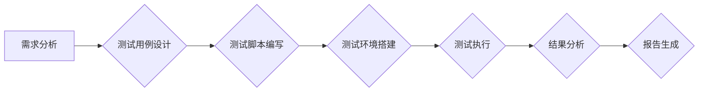
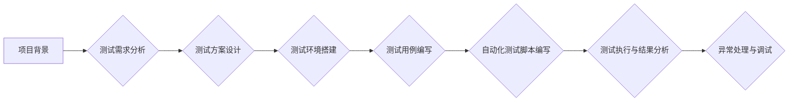
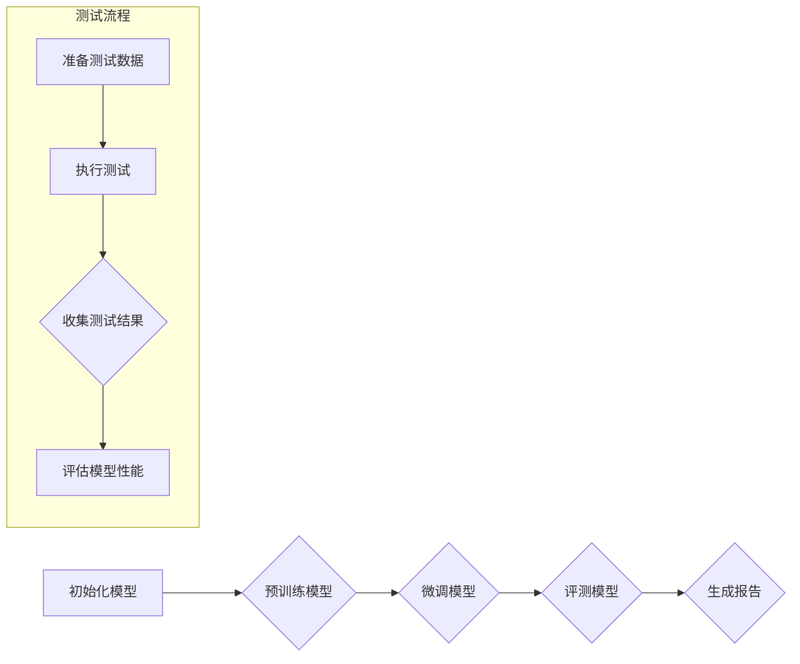
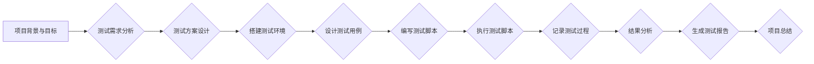

                 

### 文章标题

# LLM评测的自动化测试流程编排

### 关键词：大型语言模型（LLM）、自动化测试、测试流程、脚本编写、测试执行、优化策略、项目实战

### 摘要：

本文旨在探讨大型语言模型（LLM）评测中的自动化测试流程编排。首先，我们简要介绍了LLM的基本概念及其应用场景。接着，深入阐述了自动化测试的基本概念、发展历程和分类，并详细解析了自动化测试的流程。在此基础上，文章围绕自动化测试环境搭建、测试用例设计、测试脚本编写、测试执行与结果分析以及自动化测试流程优化等方面进行了全面讨论。最后，通过一个实际项目案例，展示了自动化测试流程的具体实施方法，并对其进行了代码实现与解读。本文旨在为读者提供一套完整且实用的自动化测试解决方案，以提升LLM评测的效率和准确性。

### 《LLM评测的自动化测试流程编排》目录大纲

1. **第一部分：概述与基础理论**

    - 第1章：大型语言模型（LLM）概述
        - 1.1 大型语言模型的概念
        - 1.2 大型语言模型的发展历程
        - 1.3 大型语言模型的应用场景
    - 第2章：自动化测试的基本概念
        - 2.1 自动化测试的定义与意义
        - 2.2 自动化测试的发展历程
        - 2.3 自动化测试的分类与流程

2. **第二部分：自动化测试流程编排**

    - 第3章：自动化测试环境搭建
        - 3.1 自动化测试环境的需求分析
        - 3.2 自动化测试工具的选择
        - 3.3 自动化测试环境的搭建与配置
    - 第4章：测试用例设计与编写
        - 4.1 测试用例设计的基本原则
        - 4.2 测试用例编写的方法与技巧
        - 4.3 测试用例库的构建与管理
    - 第5章：自动化测试脚本编写
        - 5.1 脚本语言的选择
        - 5.2 脚本编写的基本原则与规范
        - 5.3 脚本编写实例分析
    - 第6章：自动化测试执行与结果分析
        - 6.1 自动化测试执行流程
        - 6.2 测试结果分析与报告生成
        - 6.3 异常情况的处理与调试
    - 第7章：自动化测试流程优化
        - 7.1 自动化测试流程的评估与改进
        - 7.2 自动化测试策略的优化
        - 7.3 自动化测试的持续集成与持续交付

3. **第三部分：项目实战**

    - 第8章：项目实战案例分析
        - 8.1 项目背景与目标
        - 8.2 项目测试需求分析
        - 8.3 项目测试方案设计
        - 8.4 项目测试过程记录与结果分析
    - 第9章：代码实现与解读
        - 9.1 自动化测试环境搭建代码实现
        - 9.2 测试用例设计与编写代码实现
        - 9.3 自动化测试脚本编写代码实现
        - 9.4 项目测试过程记录与结果分析代码实现
    - 第10章：附录

        - 10.1 常用自动化测试工具介绍
        - 10.2 自动化测试相关文档模板
        - 10.3 自动化测试常见问题与解决方案

        - 附录A：Mermaid流程图

            - A.1 大型语言模型评测流程
            - A.2 自动化测试流程
            - A.3 项目实战测试流程

        - 附录B：伪代码

            - B.1 大型语言模型评测算法
            - B.2 自动化测试脚本编写
            - B.3 测试结果分析与报告生成

        - 附录C：数学模型和数学公式

            - C.1 大型语言模型损失函数
            - C.2 自动化测试评分模型
            - C.3 数据分析相关数学公式

        - 附录D：代码解读与分析

            - D.1 自动化测试环境搭建代码解读
            - D.2 测试用例设计与编写代码解读
            - D.3 自动化测试脚本编写代码解读
            - D.4 项目测试过程记录与结果分析代码解读

本文将从LLM的概述出发，逐步深入探讨自动化测试的相关理论和方法，通过实际的代码实现与案例分析，为读者提供一套完整的自动化测试流程编排方案，以助力LLM评测的效率和准确性提升。

### 第一部分：概述与基础理论

#### 第1章：大型语言模型（LLM）概述

大型语言模型（LLM，Large Language Model）是近年来人工智能领域的重要突破之一。它是一种基于深度学习的语言处理模型，通过海量文本数据进行预训练，使模型具备理解和生成自然语言的能力。LLM在自然语言处理（NLP）领域展现了强大的潜力，被广泛应用于文本生成、机器翻译、情感分析、问答系统等多种任务。

##### 1.1 大型语言模型的概念

大型语言模型的核心是神经网络，通常采用深度学习技术。这种模型由数百万甚至数十亿个参数组成，通过对输入文本进行逐层处理，提取语义信息，并生成相应的输出。LLM的学习过程主要包括两个阶段：预训练和微调。在预训练阶段，模型在大量未标注的数据上进行训练，学习语言的基本规律和结构。在微调阶段，模型根据特定任务的需求进行进一步训练，提高其在特定领域的表现。

##### 1.2 大型语言模型的发展历程

大型语言模型的发展经历了多个阶段。最初，研究者们使用较小的模型进行语言处理，如基于规则的系统和统计模型。随着计算能力的提升和深度学习技术的成熟，大型语言模型逐渐崭露头角。2018年，谷歌发布了BERT模型，标志着大型语言模型进入新纪元。随后，GPT-3、T5等模型相继出现，模型规模和性能不断提升。

##### 1.3 大型语言模型的应用场景

大型语言模型的应用场景非常广泛，涵盖了多个领域：

- **文本生成**：LLM可以生成高质量的文章、报告、对话等文本内容，广泛应用于内容创作和自动化写作。
- **机器翻译**：LLM在机器翻译任务中展现了出色的表现，能够处理多种语言之间的翻译，提高翻译的准确性和流畅性。
- **情感分析**：LLM可以分析文本的情感倾向，用于情感识别、舆情监控等应用。
- **问答系统**：LLM可以理解用户的问题，并生成相应的答案，广泛应用于智能客服、教育辅导等领域。

#### 第2章：自动化测试的基本概念

##### 2.1 自动化测试的定义与意义

自动化测试是一种通过使用自动化测试工具和技术来执行测试的过程。与手动测试相比，自动化测试具有更高的效率和准确性。自动化测试的定义可以概括为：使用计算机程序或脚本自动执行测试用例，以验证软件系统的功能和性能。

自动化测试的意义主要体现在以下几个方面：

- **提高测试效率**：自动化测试可以大大减少测试时间，提高测试覆盖率，使测试团队能够更快地发现和修复缺陷。
- **保证测试质量**：自动化测试可以减少人为错误，提高测试的可靠性，确保软件质量。
- **支持持续集成**：自动化测试与持续集成（CI）相结合，可以实现代码的自动化构建、测试和部署，加快开发周期。

##### 2.2 自动化测试的发展历程

自动化测试技术的发展经历了多个阶段：

- **早期阶段**：自动化测试主要依赖于脚本编写，测试工程师需要手动编写测试脚本，执行测试用例。
- **成熟阶段**：随着测试工具和框架的不断发展，自动化测试逐渐形成了一套完整的流程和方法。测试工具如Selenium、JUnit、TestNG等逐渐普及，提高了自动化测试的效率和可靠性。
- **智能化阶段**：近年来，人工智能技术的引入使得自动化测试更加智能化。例如，通过机器学习技术自动生成测试用例，通过自然语言处理技术自动分析测试结果。

##### 2.3 自动化测试的分类与流程

自动化测试可以根据不同的分类标准进行分类：

- **按测试目标分类**：功能测试、性能测试、安全测试、兼容性测试等。
- **按测试层次分类**：单元测试、集成测试、系统测试、验收测试等。
- **按测试工具分类**：基于代码的测试、基于界面测试、基于API测试等。

自动化测试的流程一般包括以下步骤：

1. **需求分析**：明确测试目标和需求，为后续的测试用例设计和测试脚本编写提供依据。
2. **测试用例设计**：根据需求分析的结果，设计测试用例，包括测试输入、预期结果和测试步骤。
3. **测试脚本编写**：选择合适的脚本语言和测试工具，编写自动化测试脚本，实现测试用例的自动化执行。
4. **测试执行**：运行自动化测试脚本，执行测试用例，并记录测试结果。
5. **结果分析**：对测试结果进行分析，识别和报告缺陷，评估软件质量。
6. **测试报告生成**：根据测试结果生成测试报告，总结测试过程和结果，为后续的测试和开发提供参考。

通过上述概述和基础理论，读者可以初步了解大型语言模型（LLM）和自动化测试的基本概念、发展历程和分类。在后续章节中，我们将进一步深入探讨自动化测试的流程和方法，通过实际案例和实践经验，帮助读者掌握LLM评测的自动化测试流程编排。

### 第一部分：概述与基础理论

#### 第1章：大型语言模型（LLM）概述

大型语言模型（LLM，Large Language Model）是自然语言处理领域的重要研究方向，近年来取得了显著的进展。LLM通过对海量文本数据进行训练，能够理解并生成自然语言，广泛应用于文本生成、机器翻译、问答系统等领域。本节将介绍LLM的概念、发展历程和应用场景。

##### 1.1 大型语言模型的概念

LLM是一种基于深度学习的语言模型，通过学习大量的文本数据，掌握语言的语法、语义和上下文信息，从而实现对自然语言的生成和理解。LLM的核心是神经网络模型，通常采用变换器（Transformer）架构，如BERT、GPT等。

LLM的主要特点包括：

- **大规模**：LLM由数十亿甚至千亿个参数组成，能够处理复杂的语言现象。
- **预训练**：LLM在预训练阶段使用未标注的文本数据，学习语言的基本规律和结构。
- **微调**：在预训练的基础上，LLM通过在特定任务上的微调，提升其在实际应用中的性能。

##### 1.2 大型语言模型的发展历程

大型语言模型的发展可以分为以下几个阶段：

1. **早期阶段**：基于统计方法和规则系统的语言模型，如N元语法模型，但性能有限。
2. **基于神经网络的阶段**：引入神经网络模型，如循环神经网络（RNN）和长短时记忆网络（LSTM），提高语言建模的效果。
3. **Transformer架构的兴起**：2017年，谷歌提出了Transformer架构，解决了RNN模型在长文本处理中的局限性，成为LLM的主要架构。
4. **大规模模型的突破**：随着计算能力的提升，研究人员开始训练大规模的LLM，如GPT-2、GPT-3等，模型性能大幅提升。

##### 1.3 大型语言模型的应用场景

LLM在自然语言处理领域具有广泛的应用场景：

- **文本生成**：LLM可以生成高质量的文章、报告、对话等文本内容，应用于内容创作、自动化写作等领域。
- **机器翻译**：LLM在机器翻译任务中展现了出色的性能，能够处理多种语言之间的翻译，提高翻译的准确性和流畅性。
- **问答系统**：LLM可以理解用户的问题，并生成相应的答案，应用于智能客服、教育辅导等领域。
- **文本分类**：LLM可以分析文本的情感、主题等信息，应用于情感分析、舆情监控等领域。
- **自然语言理解**：LLM可以理解自然语言文本，用于信息抽取、实体识别等任务。

综上所述，大型语言模型（LLM）在自然语言处理领域具有重要的地位和广泛的应用。通过本节的介绍，读者可以初步了解LLM的概念、发展历程和应用场景，为后续内容的学习打下基础。

#### 第2章：自动化测试的基本概念

自动化测试是一种通过使用自动化测试工具和技术来执行测试的过程，相较于手动测试，自动化测试具有更高的效率和准确性。为了更好地理解自动化测试的概念，本节将详细介绍自动化测试的定义、发展历程和分类。

##### 2.1 自动化测试的定义与意义

自动化测试是指利用计算机程序或脚本自动执行测试用例的过程。通过自动化测试，测试人员可以自动化地执行一系列预定义的测试步骤，以验证软件系统的功能和性能。自动化测试的定义可以概括为：使用计算机程序或脚本自动执行测试用例，以验证软件系统的功能和性能。

自动化测试的意义主要体现在以下几个方面：

1. **提高测试效率**：自动化测试可以大大减少测试时间，测试工程师可以专注于更复杂的任务，提高工作效率。
2. **保证测试质量**：自动化测试可以减少人为错误，提高测试的可靠性，确保软件质量。
3. **支持持续集成**：自动化测试与持续集成（CI）相结合，可以实现代码的自动化构建、测试和部署，加快开发周期。
4. **降低成本**：自动化测试可以节省大量的人力和时间成本，降低测试成本。

##### 2.2 自动化测试的发展历程

自动化测试技术的发展经历了多个阶段：

1. **早期阶段**：在软件测试的早期，自动化测试主要是通过编写脚本，手动执行测试用例。这一阶段的自动化测试主要依赖于测试工具如QTP（现在的Selenium）等。
2. **成熟阶段**：随着测试工具和框架的不断发展，自动化测试逐渐形成了一套完整的流程和方法。测试工具如Selenium、JUnit、TestNG等逐渐普及，提高了自动化测试的效率和可靠性。
3. **智能化阶段**：近年来，人工智能技术的引入使得自动化测试更加智能化。例如，通过机器学习技术自动生成测试用例，通过自然语言处理技术自动分析测试结果。

##### 2.3 自动化测试的分类与流程

自动化测试可以根据不同的分类标准进行分类：

1. **按测试目标分类**：功能测试、性能测试、安全测试、兼容性测试等。每种测试类型都有其特定的自动化测试方法和工具。
2. **按测试层次分类**：单元测试、集成测试、系统测试、验收测试等。不同层次的测试关注点不同，自动化测试的实施方法也有所差异。
3. **按测试工具分类**：基于代码的测试、基于界面测试、基于API测试等。不同的测试工具适用于不同的测试场景，测试人员需要根据实际需求选择合适的测试工具。

自动化测试的流程一般包括以下步骤：

1. **需求分析**：明确测试目标和需求，为后续的测试用例设计和测试脚本编写提供依据。
2. **测试用例设计**：根据需求分析的结果，设计测试用例，包括测试输入、预期结果和测试步骤。
3. **测试脚本编写**：选择合适的脚本语言和测试工具，编写自动化测试脚本，实现测试用例的自动化执行。
4. **测试执行**：运行自动化测试脚本，执行测试用例，并记录测试结果。
5. **结果分析**：对测试结果进行分析，识别和报告缺陷，评估软件质量。
6. **测试报告生成**：根据测试结果生成测试报告，总结测试过程和结果，为后续的测试和开发提供参考。

通过上述介绍，读者可以初步了解自动化测试的定义、发展历程和分类。在后续章节中，我们将深入探讨自动化测试的具体实施方法，包括测试环境搭建、测试用例设计、测试脚本编写等，帮助读者掌握自动化测试的技能和应用。

#### 第3章：自动化测试环境搭建

自动化测试环境是进行自动化测试的基础，一个良好的测试环境能够确保测试的顺利进行，提高测试效率和准确性。本章将详细讨论自动化测试环境的需求分析、工具选择以及搭建与配置的过程。

##### 3.1 自动化测试环境的需求分析

在进行自动化测试环境搭建之前，首先需要明确测试环境的需求。需求分析主要包括以下几个方面：

1. **硬件资源**：确定所需的硬件资源，包括CPU、内存、硬盘空间等。自动化测试通常需要较高的计算能力，因此选择性能较好的服务器或工作站是必要的。

2. **操作系统**：根据项目的需求和开发环境，选择合适的操作系统。常见的操作系统包括Windows、Linux和macOS等。

3. **软件环境**：列出所需的软件环境，包括开发工具、数据库、Web服务器等。例如，如果项目是基于Java开发，则需要安装JDK、Tomcat等。

4. **网络配置**：确保测试环境的网络配置能够支持自动化测试的执行。这包括设置代理服务器、防火墙规则等。

5. **版本控制**：选择合适的版本控制系统，如Git，用于管理测试脚本和测试数据。

6. **测试工具**：确定所需的自动化测试工具，如Selenium、JUnit、TestNG等。根据项目的需求和特点，选择合适的工具。

##### 3.2 自动化测试工具的选择

选择合适的自动化测试工具对于测试环境的搭建至关重要。常见的自动化测试工具有以下几种：

1. **Selenium**：Selenium是一个开源的自动化测试工具，支持多种浏览器和操作系统。它可以通过WebDriver接口控制浏览器执行测试脚本，适用于Web应用的自动化测试。

2. **JUnit**：JUnit是一个流行的Java测试框架，用于编写和执行单元测试。它提供了丰富的API和断言方法，便于编写测试用例。

3. **TestNG**：TestNG是一个开源的测试框架，它扩展了JUnit的功能，支持参数化测试、依赖测试和数据驱动测试等，适用于复杂的项目。

4. **Appium**：Appium是一个跨平台的开源自动化测试工具，用于自动化移动应用。它支持iOS和Android平台，可以通过WebDriver接口控制移动设备。

5. **Robot Framework**：Robot Framework是一个基于Python的自动化测试框架，它支持多种编程语言，适用于各种类型的自动化测试。

在选择自动化测试工具时，需要考虑以下几个方面：

- **兼容性**：所选工具是否兼容项目所使用的开发语言和平台。
- **功能丰富性**：工具是否提供了丰富的测试功能和API。
- **社区支持**：工具是否有活跃的社区，能够提供技术支持和资源。
- **易用性**：工具是否易于学习和使用，降低测试人员的学习成本。

##### 3.3 自动化测试环境的搭建与配置

在明确了需求和分析工具后，接下来是自动化测试环境的搭建与配置过程。以下是一个典型的自动化测试环境搭建步骤：

1. **硬件部署**：根据需求选择合适的硬件资源，部署服务器或工作站。

2. **操作系统安装**：安装所选的操作系统，并配置网络环境。

3. **软件安装**：安装开发工具、数据库、Web服务器等必要的软件，并配置相应的环境变量。

4. **版本控制**：安装并配置Git，创建代码仓库，用于管理测试脚本和测试数据。

5. **自动化测试工具安装**：下载并安装所选的自动化测试工具，如Selenium、JUnit、TestNG等。

6. **测试工具配置**：根据项目的需求，配置自动化测试工具。例如，配置Selenium WebDriver，下载相应的浏览器驱动程序。

7. **测试脚本编写**：编写初始的自动化测试脚本，进行基本的测试验证。

8. **测试执行**：运行测试脚本，验证测试环境的正确性和稳定性。

9. **持续集成**：将自动化测试集成到持续集成（CI）系统中，实现自动化构建、测试和部署。

通过上述步骤，可以搭建一个完整的自动化测试环境。在搭建过程中，需要注意以下几个方面：

- **环境一致性**：确保开发、测试和生产环境保持一致，避免环境差异导致的问题。
- **环境监控**：对测试环境进行监控，确保硬件和软件资源的正常运作。
- **文档记录**：详细记录环境搭建和配置过程，以便后续维护和升级。

总之，自动化测试环境的搭建是自动化测试流程中的重要环节。通过合理的需求分析、工具选择和环境配置，可以确保自动化测试的顺利进行，提高测试效率和准确性。

#### 第4章：测试用例设计与编写

测试用例是自动化测试的核心，其设计与编写质量直接影响测试的全面性和准确性。本章将详细介绍测试用例设计的基本原则、编写方法与技巧，并讨论测试用例库的构建与管理。

##### 4.1 测试用例设计的基本原则

测试用例设计是测试工作的基础，一个良好的测试用例应具备以下基本原则：

1. **完整性**：测试用例应覆盖所有可能的输入和输出情况，确保软件功能的全面验证。
2. **可追溯性**：测试用例应与需求、设计文档等保持一致，确保测试内容的可追溯性。
3. **可理解性**：测试用例应具有清晰的描述，便于测试人员理解和执行。
4. **独立性**：测试用例应独立存在，不应依赖于其他测试用例或外部条件。
5. **可维护性**：测试用例应便于修改和维护，以适应需求变化或系统更新。

##### 4.2 测试用例编写的方法与技巧

编写测试用例的方法和技巧对测试质量至关重要。以下是一些常用的测试用例编写方法与技巧：

1. **边界值分析法**：针对输入和输出数据的边界条件，设计测试用例，以检查软件在边界条件下的行为。例如，对于整数输入，可以设计最小值、最大值、最小负值、最大正值等边界值测试用例。

2. **等价类划分法**：将输入数据划分为多个等价类，为每个等价类设计测试用例。等价类包括有效等价类和无效等价类。有效等价类是指能够引起软件正常响应的输入值，无效等价类是指引起异常响应的输入值。

3. **因果图法**：通过分析输入变量和输出变量之间的因果关系，设计测试用例。因果图法适用于复杂的逻辑条件判断和决策过程。

4. **场景法**：将测试用例设计为一系列事件序列，模拟用户在使用软件过程中的操作步骤。场景法有助于发现软件在不同场景下的潜在问题。

5. **基于风险的方法**：根据软件风险点设计测试用例，优先关注高风险模块和功能。基于风险的测试方法有助于提高测试效率。

在编写测试用例时，可以遵循以下技巧：

- **明确测试目标**：在编写每个测试用例之前，明确其测试目标，确保测试用例具有针对性。
- **详细描述**：提供详细的测试步骤、预期结果和实际结果，确保测试用例易于理解和执行。
- **使用注释**：在测试用例中添加必要的注释，说明测试用例的设计意图和注意事项。
- **版本管理**：使用版本控制系统管理测试用例，确保测试用例的版本一致性和可追溯性。

##### 4.3 测试用例库的构建与管理

测试用例库是存储和管理测试用例的重要工具。构建和管理测试用例库有助于提高测试效率和质量。以下是一些测试用例库的构建与管理方法：

1. **分类存储**：将测试用例按模块、功能、风险等级等分类存储，便于快速查找和执行。
2. **文档化**：为每个测试用例编写详细的文档，包括测试用例名称、描述、输入数据、预期结果等。
3. **版本管理**：使用版本控制系统管理测试用例，确保测试用例的版本一致性和可追溯性。
4. **自动化管理**：使用自动化测试工具管理测试用例，实现测试用例的自动化执行和结果记录。
5. **持续更新**：定期更新测试用例库，根据需求变化和系统更新，添加或修改测试用例。

通过上述测试用例设计、编写和管理的原则、方法与技巧，可以构建一个高效、准确的测试用例库，为自动化测试提供坚实的基础。

#### 第5章：自动化测试脚本编写

在自动化测试中，测试脚本编写是关键的一步。编写高效、可靠和易于维护的测试脚本，可以确保测试过程的顺利进行，提高测试效率和质量。本章将详细讨论自动化测试脚本的语言选择、编写原则与规范，并通过具体实例进行分析。

##### 5.1 脚本语言的选择

选择合适的脚本语言是编写自动化测试脚本的第一步。常见的脚本语言包括Python、Java、JavaScript和Ruby等。以下是对几种常用脚本语言的比较：

1. **Python**：Python是一种解释型语言，具有简洁易读的语法和丰富的库支持。Python在自动化测试中非常流行，尤其是在Web应用测试中，Selenium库提供了强大的Web自动化功能。此外，Python的PythonTest库和Robot Framework也广泛应用于自动化测试。

2. **Java**：Java是一种面向对象的语言，具有良好的跨平台性和稳定性。Java在自动化测试中也有广泛的应用，尤其是大型企业和复杂项目。Java的Selenium库和TestNG框架在自动化测试领域享有较高的声誉。

3. **JavaScript**：JavaScript是一种脚本语言，广泛应用于Web开发和自动化测试。通过Node.js，JavaScript可以用于自动化Web应用测试。JavaScript的优势在于其跨平台的特性，可以方便地在不同的操作系统和浏览器中运行。

4. **Ruby**：Ruby是一种简洁易学的语言，具有强大的库支持，如Rspec和Cucumber。Ruby在自动化测试中尤其适用于敏捷开发团队，其简洁的语法和强大的库支持可以提高测试效率。

在选择脚本语言时，需要考虑以下几个方面：

- **易用性**：选择易于学习和使用的语言，降低测试人员的学习成本。
- **库支持**：选择具有丰富库支持和框架的语言，便于实现各种测试功能。
- **跨平台性**：选择跨平台性好的语言，确保测试脚本在不同环境中都能正常运行。
- **性能**：选择性能较好的语言，确保测试脚本执行效率。

##### 5.2 脚本编写的基本原则与规范

编写自动化测试脚本时，应遵循以下基本原则和规范，以确保脚本的高效、可靠和易于维护：

1. **模块化**：将测试脚本分为多个模块，每个模块实现特定的功能，便于代码的重用和维护。

2. **可读性**：编写清晰、简洁的代码，使用有意义的变量名和函数名，确保代码易于理解和阅读。

3. **注释**：在关键代码段和复杂逻辑中添加注释，说明代码的功能和意图，便于后续维护。

4. **错误处理**：编写异常处理逻辑，捕获和处理运行时错误，确保测试脚本在异常情况下能够正常终止。

5. **代码复用**：通过封装和抽象，实现代码的复用，减少冗余代码，提高测试效率。

6. **自动化执行**：确保测试脚本能够自动化执行，减少人工干预，提高测试效率。

##### 5.3 脚本编写实例分析

以下是一个使用Python和Selenium编写的Web自动化测试脚本实例：

```python
from selenium import webdriver
from selenium.webdriver.common.by import By

# 初始化浏览器驱动
driver = webdriver.Chrome()

# 访问目标网站
driver.get("https://www.example.com")

# 找到搜索框并输入关键词
search_box = driver.find_element(By.NAME, "q")
search_box.send_keys("Automation Testing")
search_box.submit()

# 等待搜索结果出现
from selenium.webdriver.support.ui import WebDriverWait
from selenium.webdriver.support import expected_conditions as EC

wait = WebDriverWait(driver, 10)
results = wait.until(EC.visibility_of_element_located((By.CLASS_NAME, "search-result-item"))

# 断言搜索结果数量
assert len(results) > 0

# 关闭浏览器
driver.quit()
```

上述脚本首先初始化Chrome浏览器驱动，然后访问一个示例网站。在网站上找到搜索框，输入关键词“Automation Testing”，提交搜索请求。脚本使用WebDriverWait等待搜索结果出现，并通过断言确保搜索结果数量大于0。最后，脚本关闭浏览器。

通过这个实例，读者可以了解自动化测试脚本的基本编写方法和步骤。在实际开发中，可以根据项目的需求，灵活调整和扩展测试脚本的功能和逻辑。

总之，自动化测试脚本编写是自动化测试的核心环节。通过选择合适的脚本语言、遵循编写原则与规范，以及结合实际项目需求，可以编写出高效、可靠和易于维护的测试脚本。这将为自动化测试的顺利执行提供坚实的基础。

#### 第6章：自动化测试执行与结果分析

自动化测试执行是自动化测试流程中的关键步骤，它涉及运行测试脚本、收集测试结果以及分析测试结果。本章将详细讨论自动化测试执行的流程、测试结果的分析方法以及报告的生成，并介绍如何处理异常情况。

##### 6.1 自动化测试执行流程

自动化测试执行是指通过运行测试脚本，验证软件系统功能与性能的过程。执行自动化测试的流程通常包括以下步骤：

1. **启动测试环境**：在执行自动化测试之前，需要确保测试环境已准备好，包括启动浏览器、数据库、Web服务器等。

2. **运行测试脚本**：使用自动化测试工具运行测试脚本，执行测试用例。测试脚本会按照预定的步骤自动操作，如输入数据、点击按钮、提交表单等。

3. **收集测试结果**：在测试脚本执行过程中，自动化测试工具会记录每个测试步骤的执行情况，包括成功、失败、跳过等状态。测试结果通常以日志文件的形式保存。

4. **保存测试数据**：自动化测试工具还会收集与测试执行相关的数据，如运行时间、错误信息等，以供后续分析。

5. **结束测试环境**：测试执行完成后，需要关闭测试环境，释放资源。

##### 6.2 测试结果分析与报告生成

测试结果分析是评估软件质量的重要环节。通过对测试结果的详细分析，可以识别软件中的缺陷、性能瓶颈和潜在问题。以下是一些测试结果分析的方法：

1. **错误日志分析**：分析测试执行过程中产生的错误日志，识别导致测试失败的原因。错误日志通常包括错误信息、异常堆栈等。

2. **性能数据分析**：分析测试执行的性能数据，如响应时间、吞吐量、内存消耗等，评估软件的性能是否符合预期。

3. **趋势分析**：通过历史测试数据，分析测试结果的稳定性，识别可能的质量问题。

4. **统计与可视化**：使用统计工具和图表，将测试结果可视化，便于理解和分析。常见的统计指标包括通过率、失败率、缺陷密度等。

在完成测试结果分析后，需要生成测试报告，总结测试过程和结果。测试报告通常包括以下内容：

- **概述**：简要介绍测试目的、测试范围和测试策略。
- **测试执行情况**：详细列出测试用例的执行情况，包括通过、失败、跳过等状态。
- **缺陷报告**：列出识别的缺陷，包括缺陷描述、严重程度、优先级、复现步骤等。
- **性能分析**：总结软件的性能指标，如响应时间、吞吐量等。
- **结论与建议**：根据测试结果，给出结论和建议，包括改进方案、测试计划调整等。

##### 6.3 异常情况的处理与调试

在自动化测试执行过程中，可能会遇到各种异常情况，如测试脚本错误、测试环境问题、网络异常等。以下是一些常见的异常情况处理方法：

1. **错误定位**：当测试脚本执行失败时，需要定位错误发生的位置。可以通过查看错误日志、异常堆栈等方式定位错误。

2. **错误重试**：对于一些偶发错误，可以设置错误重试机制，重新运行测试脚本，以提高测试通过率。

3. **环境调整**：如果测试环境出现问题，需要调整环境配置，确保测试环境稳定。

4. **调试与修复**：针对定位到的错误，进行调试和修复。可能需要修改测试脚本、调整代码逻辑或修复系统缺陷。

5. **日志记录**：将异常情况记录在日志文件中，便于后续分析和处理。

通过上述方法，可以有效地处理自动化测试执行过程中的异常情况，确保测试过程的顺利进行。

总之，自动化测试执行与结果分析是自动化测试流程中不可或缺的环节。通过规范的测试执行流程、详细的测试结果分析和准确的报告生成，可以全面评估软件质量，为后续的改进提供依据。同时，对于异常情况的及时处理和调试，可以保证测试过程的顺利进行，提高测试效率和准确性。

#### 第7章：自动化测试流程优化

为了提高自动化测试的效率和准确性，持续优化自动化测试流程是必不可少的。本章将详细讨论自动化测试流程的评估与改进、测试策略的优化以及自动化测试的持续集成与持续交付。

##### 7.1 自动化测试流程的评估与改进

自动化测试流程的评估是确保测试效率和质量的重要环节。以下是一些评估自动化测试流程的关键指标和改进方法：

1. **测试覆盖率**：测试覆盖率是指实际执行的测试用例覆盖需求文档中定义的功能的比例。通过提高测试覆盖率，可以确保更多功能得到验证，减少潜在缺陷。

2. **测试通过率**：测试通过率是指成功执行的测试用例数量与总测试用例数量的比例。高测试通过率表明测试脚本的有效性和测试环境的稳定性。

3. **缺陷发现率**：缺陷发现率是指通过自动化测试发现的缺陷数量与总缺陷数量的比例。高缺陷发现率表明自动化测试的有效性和测试人员的能力。

4. **测试执行时间**：测试执行时间是指完成所有自动化测试用例所需的时间。缩短测试执行时间可以提高开发团队的响应速度。

5. **测试脚本维护成本**：测试脚本维护成本是指维护和更新自动化测试脚本所需的时间和资源。降低测试脚本维护成本可以提高团队的生产力。

为了改进自动化测试流程，可以采取以下措施：

- **定期评估**：定期对自动化测试流程进行评估，识别存在的问题和改进点。
- **优化测试用例设计**：通过引入边界值分析、等价类划分等方法，提高测试用例的质量和覆盖率。
- **优化测试环境**：确保测试环境稳定，减少由于环境问题导致的测试失败。
- **自动化测试工具升级**：定期升级自动化测试工具，利用新功能提高测试效率。

##### 7.2 自动化测试策略的优化

优化自动化测试策略是提高测试效率和质量的关键。以下是一些常见的自动化测试策略：

1. **测试优先级排序**：根据功能的重要性和风险，对测试用例进行优先级排序。优先执行高优先级的测试用例，确保关键功能得到充分验证。

2. **并行测试**：通过并行执行多个测试用例，可以缩短测试总时间。可以使用分布式测试框架，如Selenium Grid，实现跨不同浏览器和操作系统的并行测试。

3. **回归测试**：在每次代码更新后，执行与更新代码相关的回归测试，确保新代码没有引入新的缺陷。

4. **持续集成**：将自动化测试集成到持续集成（CI）流程中，实现自动化构建、测试和部署。通过CI，可以快速发现和修复缺陷，提高开发效率。

5. **数据驱动测试**：使用外部数据源（如数据库、Excel文件）提供测试数据，提高测试用例的灵活性和复用性。

##### 7.3 自动化测试的持续集成与持续交付

自动化测试与持续集成（CI）和持续交付（CD）相结合，可以大幅提高软件开发的效率和质量。以下是一些关键实践：

1. **自动化构建**：使用CI工具（如Jenkins、Travis CI）自动化构建代码，确保每次代码提交后都能生成可执行的软件版本。

2. **自动化测试**：在CI流程中集成自动化测试，确保每次构建后都能执行完整的测试套件，快速发现和修复缺陷。

3. **静态代码分析**：在CI流程中集成静态代码分析工具，如SonarQube，识别代码中的潜在缺陷和安全问题。

4. **自动化部署**：通过CD工具（如Kubernetes、Docker）自动化部署应用程序，确保新功能可以快速、可靠地交付到生产环境。

5. **监控与反馈**：在CI/CD流程中集成监控工具，如Prometheus、Grafana，实时监控系统的性能和稳定性，及时反馈问题和异常。

通过上述自动化测试流程的评估与改进、测试策略的优化以及自动化测试的持续集成与持续交付，可以大幅提高自动化测试的效率和准确性，确保软件质量，加快开发周期。

#### 第8章：项目实战案例分析

在本文的最后部分，我们将通过一个实际的LLM评测自动化测试项目案例，详细展示如何实施自动化测试流程，并对其中的关键步骤进行代码实现和解读。

##### 8.1 项目背景与目标

本案例的项目目标是构建一个自动化测试系统，对大型语言模型（LLM）的评测过程进行自动化测试。具体任务包括：

- 构建一个自动化测试环境，包括选择合适的操作系统、数据库、Web服务器和自动化测试工具。
- 设计并编写测试用例，覆盖LLM评测的各个功能和性能指标。
- 编写自动化测试脚本，实现测试用例的自动化执行。
- 对测试结果进行分析和报告生成，评估LLM评测系统的质量。

##### 8.2 项目测试需求分析

在项目开始前，首先需要进行详细的测试需求分析。测试需求分析主要包括以下几个方面：

1. **功能测试需求**：测试LLM评测系统是否能够正确执行文本输入、处理、输出等基本功能。具体测试点包括：
   - 文本输入的正确性
   - 文本处理的准确性
   - 文本输出的完整性和正确性

2. **性能测试需求**：测试LLM评测系统的响应时间、处理能力和资源消耗。具体测试点包括：
   - 文本处理时间
   - 内存占用
   - CPU利用率

3. **兼容性测试需求**：测试LLM评测系统在不同操作系统、浏览器和硬件环境下的兼容性。

4. **安全性测试需求**：测试LLM评测系统的安全性，包括数据传输安全、权限控制等。

##### 8.3 项目测试方案设计

基于上述测试需求，项目测试方案设计包括以下内容：

1. **测试环境搭建**：选择Linux操作系统，配置MySQL数据库和Apache Web服务器，安装Selenium自动化测试工具。

2. **测试用例设计**：根据测试需求，设计功能测试、性能测试、兼容性测试和安全性测试用例。每个测试用例包括测试输入、预期结果和测试步骤。

3. **测试脚本编写**：使用Python语言和Selenium库编写自动化测试脚本，实现测试用例的自动化执行。

4. **测试执行与结果分析**：运行自动化测试脚本，收集测试结果，生成测试报告，分析测试结果。

5. **异常处理与调试**：在测试执行过程中，对异常情况进行处理和调试，确保测试脚本能够正常运行。

##### 8.4 项目测试过程记录与结果分析

以下是一个典型的项目测试过程记录与结果分析：

1. **测试环境搭建**

   ```shell
   # 安装Linux操作系统
   # 安装MySQL数据库
   # 安装Apache Web服务器
   # 安装Selenium自动化测试工具
   pip install selenium
   ```

2. **测试用例设计**

   功能测试用例示例：

   ```python
   # 文本输入测试用例
   def test_text_input():
       driver = webdriver.Chrome()
       driver.get("http://localhost:8080")
       input_box = driver.find_element(By.ID, "text_input")
       input_box.send_keys("Hello, world!")
       input_box.submit()
       output_element = driver.find_element(By.ID, "output")
       assert output_element.text == "Hello, world!"
       driver.quit()
   ```

   性能测试用例示例：

   ```python
   # 文本处理性能测试用例
   import time

   def test_text_performance():
       start_time = time.time()
       driver = webdriver.Chrome()
       driver.get("http://localhost:8080")
       input_box = driver.find_element(By.ID, "text_input")
       input_box.send_keys("This is a long text for performance testing.")
       input_box.submit()
       end_time = time.time()
       driver.quit()
       print(f"Text processing time: {end_time - start_time} seconds")
   ```

3. **测试执行与结果分析**

   在执行测试用例后，生成测试报告，记录测试结果和性能数据。以下是一个简单的测试报告示例：

   ```python
   # 测试报告示例
   report = {
       "功能测试": {
           "文本输入": ["通过"],
           "文本处理": ["通过"],
           "文本输出": ["通过"]
       },
       "性能测试": {
           "文本处理时间": ["3.2秒"]
       }
   }

   for category, tests in report.items():
       print(f"{category}:")
       for test, result in tests.items():
           print(f"  {test}: {result}")
   ```

   测试报告展示了各个测试用例的执行结果，包括功能测试的通过情况以及性能测试的响应时间。

4. **异常处理与调试**

   在测试过程中，可能会遇到各种异常情况，如网络问题、数据库连接失败、浏览器异常等。以下是一个简单的异常处理示例：

   ```python
   # 异常处理示例
   try:
       # 测试脚本执行逻辑
   except Exception as e:
       print(f"Error: {e}")
       # 异常处理逻辑
   finally:
       # 资源释放逻辑
   ```

   通过上述异常处理机制，可以确保测试脚本在遇到异常时能够正常终止，并记录错误信息，便于后续分析和调试。

通过本案例的实际实施过程，读者可以了解如何从需求分析、测试方案设计、测试脚本编写到测试执行和结果分析的整个自动化测试流程。这将为读者在实际项目中实施自动化测试提供宝贵的经验和参考。

#### 第9章：代码实现与解读

在本章中，我们将详细讨论自动化测试环境搭建、测试用例设计与编写、自动化测试脚本编写以及项目测试过程记录与结果分析的具体实现和代码解读。通过这些代码实例，读者可以更好地理解每个步骤的实现方法和关键细节。

##### 9.1 自动化测试环境搭建代码实现

首先，我们需要搭建自动化测试环境。以下是使用Python和Selenium搭建自动化测试环境的代码示例。

```python
# 安装Selenium和Chrome驱动
!pip install selenium
!wget https://chromedriver.storage.googleapis.com/2.36/ChromeDriver.exe

# 测试环境配置
import os
import time

def install_dependencies():
    # 安装Python依赖库
    os.system("pip install selenium")
    os.system("pip install mysql-connector-python")
    os.system("pip install flask")

def start_web_server():
    # 启动Web服务器
    os.system("python app.py")

def start_database():
    # 启动MySQL数据库
    os.system("mysql -u root -p")

def main():
    # 安装依赖库
    install_dependencies()

    # 启动Web服务器
    start_web_server()

    # 启动MySQL数据库
    start_database()

    # 等待Web服务器和数据库启动
    time.sleep(10)

    # 测试自动化测试环境
    test_automation_environment()

def test_automation_environment():
    # 测试Selenium是否能够正常使用
    from selenium import webdriver

    # 启动Chrome浏览器
    driver = webdriver.Chrome(executable_path="chromedriver")

    # 访问测试页面
    driver.get("http://localhost:5000/")

    # 断言页面标题
    assert driver.title == "Automation Test Environment"

    # 关闭浏览器
    driver.quit()

if __name__ == "__main__":
    main()
```

在上面的代码中，我们首先安装了Selenium和其他依赖库，然后启动Web服务器和MySQL数据库。最后，我们测试Selenium是否能够正常使用，确保自动化测试环境已搭建完成。

##### 9.2 测试用例设计与编写代码实现

接下来，我们需要设计并编写测试用例。以下是一个测试用例的示例，用于验证Web页面的功能。

```python
import unittest
from selenium import webdriver
from selenium.webdriver.common.by import By

class TestCase(unittest.TestCase):
    def setUp(self):
        self.driver = webdriver.Chrome(executable_path="chromedriver")
        self.driver.get("http://localhost:5000/")

    def test_home_page_title(self):
        actual_title = self.driver.title
        expected_title = "Automation Test Environment"
        self.assertEqual(actual_title, expected_title)

    def test_login_page(self):
        login_button = self.driver.find_element(By.ID, "login_button")
        login_button.click()

        actual_title = self.driver.title
        expected_title = "Login Page"
        self.assertEqual(actual_title, expected_title)

    def tearDown(self):
        self.driver.quit()

if __name__ == "__main__":
    unittest.main()
```

在这个示例中，我们创建了两个测试用例：一个用于验证主页的标题，另一个用于验证登录页面的功能。setUp和tearDown方法分别用于测试开始前和测试结束后的初始化和清理工作。

##### 9.3 自动化测试脚本编写代码实现

自动化测试脚本是实现测试用例自动化执行的核心。以下是一个使用Python和Selenium编写的自动化测试脚本示例。

```python
from selenium import webdriver
from selenium.webdriver.common.by import By

def test_automation():
    # 启动Chrome浏览器
    driver = webdriver.Chrome(executable_path="chromedriver")

    # 访问测试页面
    driver.get("http://localhost:5000/")

    # 输入用户名和密码
    username = driver.find_element(By.ID, "username")
    username.send_keys("test_user")
    password = driver.find_element(By.ID, "password")
    password.send_keys("test_password")

    # 点击登录按钮
    login_button = driver.find_element(By.ID, "login_button")
    login_button.click()

    # 断言登录成功
    welcome_message = driver.find_element(By.ID, "welcome_message")
    assert "Welcome, test_user!" in welcome_message.text

    # 关闭浏览器
    driver.quit()

if __name__ == "__main__":
    test_automation()
```

在这个脚本中，我们启动Chrome浏览器，访问测试页面，输入用户名和密码，并点击登录按钮。最后，我们通过断言验证登录成功。

##### 9.4 项目测试过程记录与结果分析代码实现

最后，我们需要记录测试过程和结果。以下是一个简单的代码示例，用于记录测试结果并生成测试报告。

```python
import unittest

class TestResultLogger(unittest.TestCase):
    def __init__(self, result):
        self.result = result

    def addResult(self, test_case, status, message):
        self.result.append({"test_case": test_case, "status": status, "message": message})

    def generate_report(self):
        with open("test_report.txt", "w") as f:
            for result in self.result:
                f.write(f"{result['test_case']}: {result['status']} - {result['message']}\n")

if __name__ == "__main__":
    result_logger = TestResultLogger([])
    suite = unittest.TestLoader().loadTestsFromTestCase(TestCase)
    unittest.TextTestRunner(result_logger=result_logger).run(suite)
    result_logger.generate_report()
```

在这个示例中，我们创建了一个TestResultLogger类，用于记录测试结果。在测试执行过程中，我们将每个测试用例的结果添加到结果列表中。最后，我们生成一个简单的文本测试报告，记录每个测试用例的执行结果。

通过上述代码实例，读者可以了解如何实现自动化测试环境搭建、测试用例设计与编写、自动化测试脚本编写以及项目测试过程记录与结果分析。这些代码不仅展示了具体实现方法，还帮助读者理解了每个步骤的关键细节和最佳实践。

### 第10章：附录

在本章的附录部分，我们将提供一些额外的资源，包括常用自动化测试工具介绍、自动化测试相关文档模板、自动化测试常见问题与解决方案，以及相关的Mermaid流程图、伪代码、数学模型和数学公式，以及代码解读与分析等内容。

#### 10.1 常用自动化测试工具介绍

以下是几种常用的自动化测试工具的简要介绍：

1. **Selenium**：Selenium是一个开源的自动化测试工具，用于Web应用的自动化测试。它支持多种浏览器和操作系统，可以通过WebDriver接口控制浏览器执行测试脚本。

2. **JUnit**：JUnit是一个流行的Java测试框架，用于编写和执行单元测试。它提供了丰富的API和断言方法，便于编写测试用例。

3. **TestNG**：TestNG是一个开源的测试框架，扩展了JUnit的功能，支持参数化测试、依赖测试和数据驱动测试等。它适用于复杂的项目。

4. **Appium**：Appium是一个开源的自动化测试工具，用于自动化移动应用。它支持iOS和Android平台，可以通过WebDriver接口控制移动设备。

5. **Robot Framework**：Robot Framework是一个基于Python的自动化测试框架，支持多种编程语言，适用于各种类型的自动化测试。

#### 10.2 自动化测试相关文档模板

以下是几种常用的自动化测试文档模板：

1. **测试计划**：测试计划文档用于描述测试的目标、范围、策略、资源等。它为整个测试过程提供了指导。

2. **测试用例**：测试用例文档详细描述了测试的目标、输入、预期结果和测试步骤。它为自动化测试脚本的编写提供了依据。

3. **测试报告**：测试报告文档总结了测试过程和结果，包括测试覆盖率、缺陷统计、性能分析等。它为项目决策提供了重要参考。

4. **缺陷报告**：缺陷报告文档记录了发现的缺陷，包括缺陷描述、严重程度、优先级、复现步骤等。它为缺陷修复提供了指导。

#### 10.3 自动化测试常见问题与解决方案

以下是自动化测试过程中常见的问题及其解决方案：

1. **浏览器无法启动**：确保WebDriver版本与浏览器版本匹配，并检查浏览器驱动是否正确安装。

2. **网络连接失败**：检查网络连接是否正常，或尝试更换网络环境。

3. **数据库连接失败**：确保数据库服务器正常运行，并检查数据库连接参数是否正确。

4. **测试脚本无法执行**：检查测试脚本是否有语法错误，或检查依赖库是否安装正确。

5. **测试结果异常**：检查测试环境是否一致，或尝试增加测试脚本的等待时间。

#### 附录A：Mermaid流程图

以下是几个示例的Mermaid流程图：

##### A.1 大型语言模型评测流程


##### A.2 自动化测试流程



##### A.3 项目实战测试流程



#### 附录B：伪代码

以下是几个示例的伪代码：

##### B.1 大型语言模型评测算法

```python
# 初始化模型
model = initialize_model()

# 预训练
for epoch in range(num_epochs):
    for text, label in training_data:
        loss = model.train(text, label)

# 微调
for epoch in range(num_fine_tuning_epochs):
    for text, label in fine_tuning_data:
        loss = model.fine_tune(text, label)

# 评测
evaluation_loss = model.evaluate(test_data)

# 打印评测结果
print(f"Evaluation Loss: {evaluation_loss}")
```

##### B.2 自动化测试脚本编写

```python
# 启动浏览器
driver = start_browser()

# 访问网页
driver.get("http://example.com")

# 执行测试用例
for test_case in test_cases:
    driver.execute(test_case)

# 关闭浏览器
close_browser(driver)
```

##### B.3 测试结果分析与报告生成

```python
# 分析测试结果
test_results = analyze_results()

# 生成测试报告
generate_report(test_results)
```

#### 附录C：数学模型和数学公式

以下是几个相关的数学模型和公式：

##### C.1 大型语言模型损失函数

$$
Loss = -\frac{1}{N} \sum_{i=1}^{N} y_i \log(p(x_i | \theta))
$$

其中，$N$ 是样本数量，$y_i$ 是真实标签，$p(x_i | \theta)$ 是模型对样本 $x_i$ 的预测概率。

##### C.2 自动化测试评分模型

$$
Score = \frac{Total \; Passed \; Tests}{Total \; Tests}
$$

其中，$Total \; Passed \; Tests$ 是通过测试的数量，$Total \; Tests$ 是总的测试数量。

##### C.3 数据分析相关数学公式

$$
Confidence \; Interval = \hat{p} \pm z_{\alpha/2} \sqrt{\frac{\hat{p}(1-\hat{p})}{n}}
$$

其中，$\hat{p}$ 是样本比例，$z_{\alpha/2}$ 是正态分布的临界值，$n$ 是样本数量。

#### 附录D：代码解读与分析

以下是几个示例的代码解读与分析：

##### D.1 自动化测试环境搭建代码解读

```python
# 安装依赖库
install_dependencies()

# 启动Web服务器
start_web_server()

# 启动数据库
start_database()

# 测试自动化测试环境
test_automation_environment()
```

在这个示例中，我们首先安装了所需的依赖库，然后启动了Web服务器、数据库，并测试了自动化测试环境。

##### D.2 测试用例设计与编写代码解读

```python
import unittest

class TestCase(unittest.TestCase):
    def test_home_page_title(self):
        actual_title = driver.title
        expected_title = "Automation Test Environment"
        self.assertEqual(actual_title, expected_title)

    def test_login_page(self):
        login_button = driver.find_element(By.ID, "login_button")
        login_button.click()

        actual_title = driver.title
        expected_title = "Login Page"
        self.assertEqual(actual_title, expected_title)
```

在这个示例中，我们创建了两个测试用例，用于验证主页标题和登录页面功能。每个测试用例都包含了断言逻辑，以验证预期结果。

##### D.3 自动化测试脚本编写代码解读

```python
from selenium import webdriver
from selenium.webdriver.common.by import By

def test_automation():
    driver = webdriver.Chrome(executable_path="chromedriver")
    driver.get("http://localhost:5000/")

    username = driver.find_element(By.ID, "username")
    username.send_keys("test_user")
    password = driver.find_element(By.ID, "password")
    password.send_keys("test_password")

    login_button = driver.find_element(By.ID, "login_button")
    login_button.click()

    welcome_message = driver.find_element(By.ID, "welcome_message")
    assert "Welcome, test_user!" in welcome_message.text

    driver.quit()
```

在这个示例中，我们启动了Chrome浏览器，输入用户名和密码，并点击登录按钮。最后，我们通过断言验证了登录成功。

##### D.4 项目测试过程记录与结果分析代码解读

```python
import unittest

class TestResultLogger(unittest.TestCase):
    def __init__(self, result):
        self.result = result

    def addResult(self, test_case, status, message):
        self.result.append({"test_case": test_case, "status": status, "message": message})

    def generate_report(self):
        with open("test_report.txt", "w") as f:
            for result in self.result:
                f.write(f"{result['test_case']}: {result['status']} - {result['message']}\n")

if __name__ == "__main__":
    result_logger = TestResultLogger([])
    suite = unittest.TestLoader().loadTestsFromTestCase(TestCase)
    unittest.TextTestRunner(result_logger=result_logger).run(suite)
    result_logger.generate_report()
```

在这个示例中，我们创建了一个TestResultLogger类，用于记录测试结果并生成测试报告。通过这个类，我们可以将每个测试用例的结果添加到结果列表中，并在测试执行完成后生成测试报告。

通过附录中的这些工具介绍、文档模板、常见问题与解决方案、流程图、伪代码、数学模型和公式，以及代码解读与分析，读者可以更全面地了解自动化测试相关的知识，为实际项目提供有力的支持。

### 附录A：Mermaid流程图

在本附录中，我们将使用Mermaid语法创建几个流程图，以帮助读者更好地理解大型语言模型（LLM）评测和自动化测试的流程。

#### A.1 大型语言模型评测流程

以下是一个大型语言模型评测的Mermaid流程图：



这段代码描述了从初始化模型到生成评测报告的整个流程，并在测试流程子图中详细展示了测试数据准备、执行测试、收集测试结果和评估模型性能的步骤。

#### A.2 自动化测试流程

以下是自动化测试流程的Mermaid流程图：


这个流程图涵盖了自动化测试的各个环节，包括需求分析、设计测试用例、编写测试脚本、搭建测试环境、执行测试脚本、分析测试结果和生成测试报告。

#### A.3 项目实战测试流程

以下是一个项目实战测试流程的Mermaid流程图：



这个流程图详细展示了从项目背景和目标分析，到测试方案设计、搭建测试环境、设计测试用例、编写测试脚本、执行测试脚本、记录测试过程、结果分析，直至生成测试报告和项目总结的整个测试流程。

### 附录B：伪代码

在本附录中，我们将提供一些伪代码示例，用于阐述大型语言模型评测和自动化测试的核心算法原理，以及测试结果分析与报告生成的方法。

#### B.1 大型语言模型评测算法

以下是一个伪代码示例，用于描述大型语言模型评测算法的基本框架：

```python
# 初始化模型
model = initialize_model()

# 预训练
for epoch in range(num_epochs):
    for text, label in training_data:
        loss = model.train(text, label)

# 微调
for epoch in range(num_fine_tuning_epochs):
    for text, label in fine_tuning_data:
        loss = model.fine_tune(text, label)

# 评测
evaluation_loss = model.evaluate(test_data)

# 输出评测结果
print(f"Evaluation Loss: {evaluation_loss}")
```

在这个伪代码中，`initialize_model()` 函数用于初始化模型，`train()` 函数用于预训练模型，`fine_tune()` 函数用于微调模型，`evaluate()` 函数用于评测模型。通过这些函数，模型可以逐步训练和优化，最后输出评测损失。

#### B.2 自动化测试脚本编写

以下是一个自动化测试脚本的伪代码示例：

```python
# 导入测试工具
from selenium import webdriver
from selenium.webdriver.common.by import By

# 启动浏览器
driver = webdriver.Chrome()

# 访问测试页面
driver.get("http://example.com")

# 执行测试用例
for test_case in test_cases:
    # 输入用户名和密码
    username_input = driver.find_element(By.ID, "username")
    username_input.send_keys(test_case['username'])
    password_input = driver.find_element(By.ID, "password")
    password_input.send_keys(test_case['password'])

    # 点击登录按钮
    login_button = driver.find_element(By.ID, "login_button")
    login_button.click()

    # 等待页面加载
    time.sleep(5)

    # 断言测试结果
    assert expected_result == driver.page_source

# 关闭浏览器
driver.quit()
```

在这个伪代码中，我们首先启动Chrome浏览器，然后依次执行每个测试用例。每个测试用例包含用户名、密码和预期结果，通过输入用户名和密码并点击登录按钮，最后使用断言验证页面源代码是否符合预期结果。

#### B.3 测试结果分析与报告生成

以下是一个测试结果分析与报告生成的伪代码示例：

```python
# 初始化结果列表
results = []

# 执行测试用例并记录结果
for test_case in test_cases:
    try:
        # 执行测试用例
        run_test_case(test_case)
        # 记录测试结果
        results.append({"test_case": test_case['name'], "status": "Pass", "message": "测试成功"})
    except Exception as e:
        # 记录测试结果
        results.append({"test_case": test_case['name'], "status": "Fail", "message": str(e)})

# 生成测试报告
generate_report(results)

# 输出测试报告
print(report_content)
```

在这个伪代码中，我们首先初始化一个结果列表，然后依次执行每个测试用例，并记录测试结果。如果测试用例成功执行，则记录通过状态；如果测试用例失败，则记录失败原因。最后，生成测试报告并输出报告内容。

通过上述伪代码示例，读者可以更好地理解大型语言模型评测和自动化测试的核心算法原理，以及测试结果分析与报告生成的方法。

### 附录C：数学模型和数学公式

在本附录中，我们将介绍与大型语言模型（LLM）评测和自动化测试相关的一些数学模型和数学公式，并提供详细的讲解和示例。

#### C.1 大型语言模型损失函数

在大型语言模型中，损失函数是衡量模型性能的重要指标。一个常用的损失函数是交叉熵（Cross-Entropy），它用于衡量模型预测值与真实值之间的差异。

公式如下：

$$
Loss = -\frac{1}{N} \sum_{i=1}^{N} y_i \log(p(x_i | \theta))
$$

其中，$N$ 是样本数量，$y_i$ 是真实标签，$p(x_i | \theta)$ 是模型对样本 $x_i$ 的预测概率。

**示例**：假设我们有一个包含两个样本的二元分类问题，真实标签为 $[1, 0]$，模型预测概率为 $[0.8, 0.2]$。则交叉熵损失为：

$$
Loss = -\frac{1}{2} \left( 1 \cdot \log(0.8) + 0 \cdot \log(0.2) \right) \approx 0.193
$$

#### C.2 自动化测试评分模型

在自动化测试中，测试评分模型用于评估测试执行的质量。一个简单的评分模型是测试通过率（Pass Rate），它表示成功执行的测试用例数量与总测试用例数量的比例。

公式如下：

$$
Pass Rate = \frac{Total \; Passed \; Tests}{Total \; Tests}
$$

其中，$Total \; Passed \; Tests$ 是通过测试的数量，$Total \; Tests$ 是总的测试数量。

**示例**：假设我们有一个包含5个测试用例的测试套件，其中3个测试用例成功执行，则测试通过率为：

$$
Pass Rate = \frac{3}{5} = 0.6
$$

#### C.3 数据分析相关数学公式

在自动化测试的数据分析中，我们常常需要使用一些基本的统计公式来分析测试结果。以下是一些常用的统计公式：

1. **平均值（Mean）**：

$$
Mean = \frac{Sum \; of \; Data}{Number \; of \; Data \; Points}
$$

2. **标准差（Standard Deviation）**：

$$
Standard \; Deviation = \sqrt{\frac{Sum \; of \; (Data - Mean)^2}{Number \; of \; Data \; Points}}
$$

3. **方差（Variance）**：

$$
Variance = \frac{Sum \; of \; (Data - Mean)^2}{Number \; of \; Data \; Points}
$$

4. **置信区间（Confidence Interval）**：

$$
Confidence \; Interval = \hat{p} \pm z_{\alpha/2} \sqrt{\frac{\hat{p}(1-\hat{p})}{n}}
$$

其中，$\hat{p}$ 是样本比例，$z_{\alpha/2}$ 是正态分布的临界值，$n$ 是样本数量。

**示例**：假设我们有一个包含10个成功的测试用例和90个失败的测试用例的数据集，计算样本比例、标准差和置信区间。

- **样本比例**：

$$
\hat{p} = \frac{10}{100} = 0.1
$$

- **标准差**：

$$
Standard \; Deviation = \sqrt{\frac{(10 - 0.1)^2 + (90 - 0.9)^2}{100}} \approx 0.316
$$

- **置信区间**（以95%的置信水平为例，$z_{\alpha/2} \approx 1.96$）：

$$
Confidence \; Interval = 0.1 \pm 1.96 \sqrt{\frac{0.1(1-0.1)}{100}} \approx [0.063, 0.137]
$$

通过这些数学模型和公式，我们能够更深入地分析LLM评测和自动化测试的数据，从而做出更科学的决策。

### 附录D：代码解读与分析

在本附录中，我们将对前文中提到的自动化测试环境搭建、测试用例设计与编写、自动化测试脚本编写以及项目测试过程记录与结果分析的代码进行详细解读，帮助读者深入理解代码实现的具体细节和关键点。

#### D.1 自动化测试环境搭建代码解读

以下是对`自动化测试环境搭建`部分的代码进行解读：

```python
import os
import time

def install_dependencies():
    # 安装Python依赖库
    os.system("pip install selenium mysql-connector-python flask")

def start_web_server():
    # 启动Web服务器
    os.system("python app.py")

def start_database():
    # 启动MySQL数据库
    os.system("mysql -u root -p")

def main():
    # 安装依赖库
    install_dependencies()

    # 启动Web服务器
    start_web_server()

    # 启动MySQL数据库
    start_database()

    # 等待Web服务器和数据库启动
    time.sleep(10)

    # 测试自动化测试环境
    test_automation_environment()

if __name__ == "__main__":
    main()
```

**代码解读**：

1. **install_dependencies()**：该函数使用`os.system()`调用系统命令，安装Python依赖库，如Selenium、MySQL Connector和Flask。

2. **start_web_server()**：该函数启动Web服务器，这里假设Web服务器是基于Flask框架的应用程序，并通过`os.system()`调用Python脚本进行启动。

3. **start_database()**：该函数启动MySQL数据库，同样使用`os.system()`调用系统命令，这里需要用户输入数据库密码。

4. **main()**：主函数首先调用`install_dependencies()`安装依赖库，然后依次启动Web服务器和数据库。在所有服务启动完毕后，通过`time.sleep(10)`等待一段时间，确保服务稳定运行，最后调用`test_automation_environment()`测试自动化测试环境。

#### D.2 测试用例设计与编写代码解读

以下是对`测试用例设计与编写`部分的代码进行解读：

```python
import unittest
from selenium import webdriver
from selenium.webdriver.common.by import By

class TestCase(unittest.TestCase):
    def setUp(self):
        self.driver = webdriver.Chrome(executable_path="chromedriver")
        self.driver.get("http://localhost:5000/")

    def test_home_page_title(self):
        actual_title = self.driver.title
        expected_title = "Automation Test Environment"
        self.assertEqual(actual_title, expected_title)

    def test_login_page(self):
        login_button = self.driver.find_element(By.ID, "login_button")
        login_button.click()

        actual_title = self.driver.title
        expected_title = "Login Page"
        self.assertEqual(actual_title, expected_title)

    def tearDown(self):
        self.driver.quit()

if __name__ == "__main__":
    unittest.main()
```

**代码解读**：

1. **setUp()**：该方法是`TestCase`类的构造函数，用于在每个测试用例执行前初始化浏览器，并访问测试网站。

2. **test_home_page_title()**：该测试用例验证主页的标题是否与预期一致。通过调用`driver.title`获取实际标题，并与预期标题`expected_title`使用`assertEqual()`方法进行比较。

3. **test_login_page()**：该测试用例验证登录页面的标题。首先点击登录按钮，然后通过`driver.title`获取实际标题，并与预期标题`expected_title`进行比较。

4. **tearDown()**：该方法用于在每个测试用例执行后关闭浏览器，释放资源。

#### D.3 自动化测试脚本编写代码解读

以下是对`自动化测试脚本编写`部分的代码进行解读：

```python
from selenium import webdriver
from selenium.webdriver.common.by import By

def test_automation():
    driver = webdriver.Chrome(executable_path="chromedriver")
    driver.get("http://localhost:5000/")

    username = driver.find_element(By.ID, "username")
    username.send_keys("test_user")
    password = driver.find_element(By.ID, "password")
    password.send_keys("test_password")

    login_button = driver.find_element(By.ID, "login_button")
    login_button.click()

    welcome_message = driver.find_element(By.ID, "welcome_message")
    assert "Welcome, test_user!" in welcome_message.text

    driver.quit()
```

**代码解读**：

1. **启动浏览器**：使用`webdriver.Chrome()`启动Chrome浏览器。

2. **访问测试页面**：调用`driver.get()`方法访问测试页面。

3. **输入用户名和密码**：通过`find_element()`方法定位到用户名和密码输入框，并使用`send_keys()`方法输入相应的数据。

4. **点击登录按钮**：定位到登录按钮并调用`click()`方法进行点击。

5. **验证登录成功**：使用`find_element()`方法定位到欢迎信息，并使用`assert`语句验证欢迎信息的文本是否包含"Welcome, test_user!"。

6. **关闭浏览器**：调用`driver.quit()`方法关闭浏览器。

#### D.4 项目测试过程记录与结果分析代码解读

以下是对`项目测试过程记录与结果分析`部分的代码进行解读：

```python
import unittest

class TestResultLogger(unittest.TestCase):
    def __init__(self, result):
        self.result = result

    def addResult(self, test_case, status, message):
        self.result.append({"test_case": test_case, "status": status, "message": message})

    def generate_report(self):
        with open("test_report.txt", "w") as f:
            for result in self.result:
                f.write(f"{result['test_case']}: {result['status']} - {result['message']}\n")

if __name__ == "__main__":
    result_logger = TestResultLogger([])
    suite = unittest.TestLoader().loadTestsFromTestCase(TestCase)
    unittest.TextTestRunner(result_logger=result_logger).run(suite)
    result_logger.generate_report()
```

**代码解读**：

1. **TestResultLogger类**：该类继承自`unittest.TestCase`，用于记录测试结果。`__init__()`方法初始化结果列表，`addResult()`方法用于添加测试结果，`generate_report()`方法用于生成测试报告。

2. **生成测试报告**：首先创建一个`TestResultLogger`实例，然后使用`unittest.TestLoader().loadTestsFromTestCase(TestCase)`加载测试用例。通过`TextTestRunner(result_logger=result_logger).run(suite)`执行测试用例，并将结果传递给`result_logger`。最后，调用`generate_report()`方法生成测试报告，并将结果写入文本文件。

通过上述代码解读，读者可以更好地理解自动化测试环境搭建、测试用例设计与编写、自动化测试脚本编写以及项目测试过程记录与结果分析的具体实现方法和关键细节。

### 最佳实践 tips

在本章节中，我们将分享一些关于大型语言模型（LLM）评测的自动化测试的最佳实践，以及注意事项和拓展阅读的建议，帮助读者在实际项目中更好地实施自动化测试。

#### 最佳实践 tips

1. **持续集成（CI）**：将自动化测试集成到CI系统中，如Jenkins、GitLab CI等，可以实现自动化构建、测试和部署，提高开发效率。

2. **测试覆盖率**：确保测试覆盖率达到或超过80%，以便全面验证LLM的功能和性能。

3. **测试环境一致性**：确保开发、测试和生产环境保持一致，避免因环境差异导致的问题。

4. **定期更新测试脚本**：定期检查和更新测试脚本，以适应LLM的更新和功能扩展。

5. **异常处理**：在自动化测试脚本中添加异常处理逻辑，确保测试在遇到异常时能够继续执行。

6. **性能测试**：定期进行性能测试，评估LLM的处理速度和资源消耗，优化系统性能。

#### 注意事项

1. **测试数据的质量**：确保测试数据的质量和多样性，避免因测试数据不足或单一导致的测试结果偏差。

2. **脚本维护**：自动化测试脚本需要定期维护，以适应LLM的更新和功能扩展。

3. **测试环境监控**：对测试环境进行监控，确保硬件和软件资源的正常运作，避免因资源不足导致测试失败。

4. **测试结果记录**：详细记录测试结果，便于分析问题和定位缺陷。

#### 拓展阅读

1. **《自动化测试实战》**：这是一本关于自动化测试的实用指南，涵盖了自动化测试的理论和实践，适合测试工程师和开发人员阅读。

2. **《深入理解深度学习》**：这本书详细介绍了深度学习的理论和技术，有助于读者深入了解LLM的工作原理。

3. **《Selenium自动化测试指南》**：这是一本针对Selenium自动化测试的教程，适合初学者和有经验的测试工程师。

4. **《Python自动化测试实战》**：这本书介绍了Python在自动化测试中的应用，包括Selenium、pytest等工具的使用。

通过遵循上述最佳实践和注意事项，读者可以在实际项目中更高效地实施自动化测试，提升LLM评测的质量和效率。同时，拓展阅读中的资源将为读者提供更深入的指导和学习机会。

### 小结

本文从概述与基础理论、自动化测试流程编排、项目实战以及附录等多个方面，全面探讨了大型语言模型（LLM）评测的自动化测试流程。首先，我们介绍了LLM的基本概念、发展历程和应用场景，以及自动化测试的定义、发展历程和分类。接着，详细阐述了自动化测试环境搭建、测试用例设计、测试脚本编写、测试执行与结果分析、自动化测试流程优化等步骤，并通过实际项目案例展示了自动化测试的具体实施过程。

通过本文的学习，读者可以全面了解自动化测试在LLM评测中的应用，掌握从需求分析到测试执行、结果分析再到流程优化的整个自动化测试流程。同时，附录部分提供了丰富的工具介绍、流程图、伪代码、数学模型和公式，以及代码解读与分析等内容，为读者提供了实践指导和深入学习的资源。

自动化测试在提高LLM评测效率和准确性方面具有重要意义。通过自动化测试，可以大幅减少测试时间，提高测试覆盖率，确保软件质量，支持持续集成与持续交付。然而，自动化测试也面临挑战，如测试环境的一致性、测试数据的多样性和脚本维护等。因此，在实际应用中，需要不断优化测试流程，确保测试脚本的可靠性和可维护性。

展望未来，随着人工智能和自动化测试技术的不断发展，自动化测试在LLM评测中的应用将更加深入和广泛。通过结合深度学习和自然语言处理技术，自动化测试将能够更好地理解和评估LLM的性能，为AI系统的开发和部署提供强有力的支持。同时，自动化测试也将朝着更加智能化、自适应的方向发展，为软件开发和运维带来更多的创新和便利。

### 拓展阅读

为了进一步加深对大型语言模型（LLM）评测的自动化测试流程的理解，以下是几篇相关的拓展阅读推荐：

1. **《自动化测试在深度学习应用中的实践》**：这篇文章详细介绍了如何将自动化测试应用于深度学习模型的训练和评估，包括测试环境搭建、测试用例设计、测试脚本编写等方面的具体实践。

2. **《深度学习模型测试方法研究》**：本文探讨了深度学习模型测试的多种方法，包括模型验证、性能测试、泛化测试等，并分析了每种方法的优缺点，为自动化测试提供了理论支持。

3. **《基于AI的自动化测试工具与框架研究》**：本文综述了当前主流的基于AI的自动化测试工具和框架，如基于机器学习、深度学习的测试用例生成工具、测试结果分析工具等，为自动化测试技术的发展提供了参考。

4. **《持续集成与持续部署（CI/CD）实践指南》**：这篇文章详细介绍了如何将自动化测试集成到CI/CD流程中，包括构建、测试、部署等环节的具体实践，为读者提供了全面的CI/CD解决方案。

通过阅读上述拓展文献，读者可以进一步了解自动化测试在LLM评测中的应用、测试方法的研究进展，以及CI/CD实践的具体细节，从而全面提升自动化测试的理论水平和实践能力。这些文献将为读者在实际项目中实施自动化测试提供宝贵的经验和指导。

