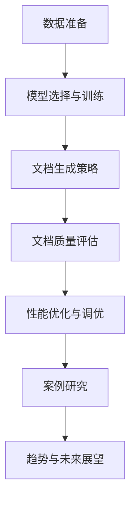

                 

# 文章标题：LLM辅助技术文档生成质量评估

## 关键词：大型语言模型（LLM），技术文档生成，质量评估，自动写作，上下文理解，文档连贯性

## 摘要

本文探讨了大型语言模型（LLM）在辅助技术文档生成中的作用，并重点分析了评估这些文档生成质量的方法。随着人工智能技术的发展，LLM在自然语言处理和生成方面的强大能力，使得自动化技术文档生成成为可能。本文首先介绍了LLM的基本概念和文档生成技术，然后详细阐述了LLM辅助技术文档生成的过程，包括数据准备、模型选择与训练、文档生成策略等。接着，文章探讨了LLM辅助文档生成中的挑战，如语言理解与生成的困难，以及如何通过评估指标和方法来优化文档生成质量。最后，通过实际案例研究和未来趋势展望，本文为LLM辅助技术文档生成提供了深入见解和实际应用指导。

## 第一部分：LLM辅助技术文档生成质量评估概述

### 第1章: LLM辅助技术文档生成背景与价值

#### 1.1 LLM与文档生成技术的关系

**LLM介绍**

大型语言模型（LLM）是自然语言处理（NLP）领域的一种先进模型，其核心是通过深度神经网络对大量文本数据进行训练，以获得对自然语言的深入理解能力。LLM能够生成高质量的自然语言文本，适用于各种NLP任务，包括文本分类、机器翻译、问答系统和自动写作等。

**文档生成技术**

技术文档生成是指利用计算机技术自动生成文档的过程，它广泛应用于软件开发、科研报告、产品手册等领域。传统文档生成方法主要依赖于模板填充、规则驱动和关键词提取等技术。然而，这些方法往往存在生成文档质量不高、缺乏灵活性等问题。

#### 1.2 LLM在文档生成中的优势

**自动写作能力**

LLM具有强大的自动写作能力，能够根据给定的输入生成连贯、准确的文本。与传统的文档生成方法相比，LLM能够处理更复杂的上下文信息，使得生成的文档更加自然和流畅。

**上下文理解**

LLM通过深度学习训练，能够理解上下文中的隐含意义和逻辑关系，从而生成具有连贯性和逻辑性的文档。这对于技术文档来说尤为重要，因为技术文档往往需要详细阐述各个部分之间的关系和逻辑。

**用户定制**

LLM可以根据用户的需求和偏好生成个性化的文档。例如，对于不同的读者群体，LLM可以调整文档的难度、风格和格式，以满足特定的需求。

#### 1.3 技术文档生成质量评估的重要性

**文档质量标准**

技术文档的质量直接影响到读者的理解和应用。文档质量标准包括准确性、完整性、可读性、相关性、一致性等多个方面。例如，准确性确保文档中提供的信息是正确的，完整性确保文档涵盖了所有必要的内容，可读性确保文档易于理解，相关性确保文档内容与读者的需求相关，一致性确保文档中的一致性和逻辑性。

**评估方法**

文档生成质量评估通常采用定量和定性两种方法。定量评估方法包括自动评估指标，如词汇密度、句子长度、语法错误等；定性评估方法则依赖于人工评审，通过分析文档的内容、结构、逻辑性和可读性等来评估文档质量。

### 第2章: LLM辅助技术文档生成流程

#### 2.1 数据准备

**数据源**

技术文档生成所需的数据源主要包括内部数据和公开数据。内部数据来源于企业的技术文档库、代码库和知识库等；公开数据则可以从开源社区、学术期刊和公共数据库等获取。

**数据预处理**

数据预处理是文档生成的重要步骤，它包括文本清洗、数据标注和格式转换等。文本清洗旨在去除文本中的无关信息和噪声，如HTML标签、特殊字符和停用词等。数据标注则是为训练数据提供标签，例如标签化术语、函数和代码段等。格式转换则是将不同格式的文本统一转换为适合训练的格式，如JSON或XML。

#### 2.2 模型选择与训练

**模型选择**

在选择LLM模型时，需要考虑模型的规模、训练数据量和适用场景。常见的LLM模型包括GPT、BERT、T5等。例如，GPT模型在生成自然语言文本方面表现出色，而BERT模型则在理解上下文信息方面具有优势。

**模型训练**

模型训练是文档生成中的关键步骤，其目的是让模型学会根据输入生成高质量的技术文档。训练过程中，通常使用大规模的预训练模型，并通过转移学习（Transfer Learning）方法，针对特定文档生成任务进行微调（Fine-tuning）。训练策略包括数据增强、学习率调度和正则化等。

#### 2.3 文档生成策略

**生成算法**

常见的文档生成算法包括生成式和基于提取的方法。生成式方法通过生成整个文档的文本序列来实现文档生成，例如使用GPT模型。基于提取的方法则通过从已有文本中提取和组合信息来生成文档，例如使用BERT模型。

**策略优化**

文档生成策略的优化目标是提高文档生成的质量和效率。优化方法包括调整模型参数、优化训练策略和引入多模态数据等。例如，通过调整模型参数，可以优化文档的连贯性和准确性；通过引入多模态数据，可以进一步提高文档的丰富度和准确性。

## 第二部分：LLM辅助技术文档生成中的挑战与优化

### 第3章: LLM辅助技术文档生成中的挑战与优化

#### 3.1 语言理解与生成的挑战

**上下文理解**

尽管LLM在理解上下文方面表现出色，但面对复杂的上下文时，仍然存在理解不准确的问题。例如，当技术文档涉及专业术语和复杂逻辑关系时，LLM可能无法准确理解上下文，导致生成的文档出现错误或逻辑不通。

**语义连贯性**

确保生成的文档具有连贯性和逻辑性是文档生成中的一个重要挑战。由于技术文档往往包含大量专业术语和复杂结构，LLM在生成文档时可能会出现语义连贯性问题，例如句子之间的衔接不当或逻辑跳跃等。

#### 3.2 文档质量评估

**评估指标**

文档质量评估的关键是确定合适的评估指标。常见的评估指标包括准确性、可读性、相关性、完整性等。其中，准确性评估文档中提供信息的正确性；可读性评估文档的易读性和流畅性；相关性评估文档内容与读者需求的相关程度；完整性评估文档是否覆盖了所有必要的内容。

**评估方法**

文档质量评估方法包括自动评估和人工评估。自动评估方法利用自然语言处理技术，如词频统计、语法分析等，来评估文档的质量；人工评估方法则依赖专家或普通用户对文档的质量进行评价。在实际应用中，通常结合自动评估和人工评估，以提高评估结果的准确性。

#### 3.3 性能优化与调优

**模型调优**

模型调优是提高文档生成质量的关键步骤。通过调整模型参数、优化训练策略和引入先进的预训练模型，可以提高LLM的生成能力和文档质量。例如，使用更先进的预训练模型，如GPT-3或BERT-Large，可以显著提高文档生成的准确性和连贯性。

**性能评估**

性能评估是验证文档生成系统效果的重要手段。通过在真实场景中测试模型，可以评估模型在文档生成任务中的性能和效果。性能评估指标包括生成文档的准确性、可读性、响应时间等。例如，通过分析生成文档的语法错误率和读者满意度，可以评估文档生成系统的整体性能。

## 第三部分：LLM辅助技术文档生成案例研究

### 第4章: LLM辅助技术文档生成案例研究

#### 4.1 案例一：企业内部技术文档自动化生成

**应用场景**

在企业内部，技术文档的自动化生成可以帮助企业提高工作效率，降低文档编写成本。特别是在软件开发和维护过程中，技术文档的及时更新和准确生成尤为重要。

**实现过程**

1. **数据准备**：收集企业内部已有的技术文档，包括代码库、设计文档和用户手册等。对收集的数据进行清洗和标注，以便于模型训练。

2. **模型选择与训练**：选择适合文档生成任务的LLM模型，如GPT-2或BERT，并进行预训练。然后，针对特定文档生成任务进行微调，以提高模型在特定领域的表现。

3. **文档生成策略**：设计适合企业内部技术文档的生成策略，包括生成文档的模板、格式和风格等。例如，可以使用生成式方法生成代码注释，使用基于提取的方法生成用户手册。

4. **文档质量评估**：使用自动评估方法和人工评估方法对生成的文档进行质量评估，包括准确性、可读性和完整性等指标。根据评估结果，对模型和生成策略进行调整和优化。

#### 4.2 案例二：在线技术文档自动生成与优化

**应用场景**

在线技术文档的自动生成可以帮助网站和平台提供高质量的技术文档，提高用户体验和用户满意度。特别是在技术社区、开发者门户和在线课程中，自动生成技术文档可以大大减少人工编写的工作量。

**实现过程**

1. **数据准备**：收集已有的在线技术文档，包括论坛帖子、博客文章和技术说明等。对收集的数据进行清洗和标注，以便于模型训练。

2. **模型选择与训练**：选择适合在线技术文档生成的LLM模型，如T5或GPT-3，并进行预训练。然后，针对特定文档生成任务进行微调，以提高模型在特定领域的表现。

3. **文档生成策略**：设计适合在线技术文档的生成策略，包括生成文档的模板、格式和风格等。例如，可以使用生成式方法生成技术说明，使用基于提取的方法生成博客文章。

4. **文档质量评估**：使用自动评估方法和人工评估方法对生成的文档进行质量评估，包括准确性、可读性和完整性等指标。根据评估结果，对模型和生成策略进行调整和优化。

#### 4.3 案例三：多语言技术文档生成与翻译

**应用场景**

随着全球化的进程，多语言技术文档的生成与翻译变得尤为重要。企业需要在不同的语言中提供一致的技术文档，以支持全球用户的使用。

**实现过程**

1. **数据准备**：收集多语言的技术文档，包括英文、中文、日文等。对收集的数据进行清洗和标注，以便于模型训练。

2. **模型选择与训练**：选择适合多语言文档生成的LLM模型，如BERT-MultiLang或XLM-R，并进行预训练。然后，针对特定文档生成任务进行微调，以提高模型在特定语言的表现。

3. **文档生成与翻译策略**：设计适合多语言技术文档的生成和翻译策略。例如，使用生成式方法生成多语言文档，使用基于提取的方法进行翻译。

4. **文档质量评估**：使用自动评估方法和人工评估方法对生成的文档进行质量评估，包括准确性、可读性和完整性等指标。根据评估结果，对模型和生成策略进行调整和优化。

### 第5章: LLM辅助技术文档生成趋势与未来展望

#### 5.1 模型发展趋势

**模型进化**

随着深度学习技术的不断发展，LLM模型也在不断进化。从传统的静态模型，如GPT和BERT，到动态模型，如GPT-3和T5，再到自适应模型，如BERT-MultiLang和XLM-R，LLM模型在生成能力和多语言支持方面取得了显著的进展。未来，LLM模型可能会进一步结合多模态数据，如图像和音频，以实现更高质量的文档生成。

**多模态融合**

多模态融合是将不同类型的数据（如文本、图像、音频）进行整合，以提高模型的理解和生成能力。例如，结合图像和文本的模型可以生成更具视觉化的技术文档，结合音频和文本的模型可以生成更具交互性的文档。多模态融合将为LLM辅助技术文档生成带来新的机遇和挑战。

#### 5.2 技术挑战与解决方案

**数据隐私与安全**

在LLM辅助技术文档生成过程中，数据隐私和安全是一个重要挑战。特别是在处理敏感数据和商业机密时，需要确保数据的安全性和隐私性。解决方案包括数据加密、访问控制和权限管理等。

**可解释性与透明度**

LLM生成的文档往往具有高度的自然性和复杂性，但缺乏可解释性和透明度。这给文档的审核和修正带来了困难。为了提高LLM生成文档的可解释性和透明度，可以采用可视化技术、解释性模型和透明性评估方法。

#### 5.3 未来应用场景

**智能文档助手**

智能文档助手是LLM在技术文档生成中的一个潜在应用场景。通过结合自然语言处理和生成技术，智能文档助手可以帮助用户自动生成文档，提供文档编辑和修订建议，提高文档生成和管理的效率。

**自动化文档审核与合规性检查**

自动化文档审核与合规性检查是另一个重要应用场景。通过利用LLM技术，可以自动检查文档的格式、内容和合规性，减少人工审核的工作量，提高审核的准确性和效率。

### 附录

#### 附录A: LLM辅助技术文档生成工具与资源

**开源框架**

- **TensorFlow**：谷歌开发的开源机器学习框架，广泛用于构建和训练LLM模型。
- **PyTorch**：Facebook开发的开源机器学习框架，具有灵活的动态图计算能力。

**数据集**

- **Common Crawl**：一个大规模的公开网页数据集，适合用于训练LLM模型。
- **AG News**：一个新闻分类数据集，常用于自然语言处理任务的训练。

**教程与论文**

- **《大规模语言模型的架构》**：介绍大规模语言模型的架构和训练方法。
- **《自然语言处理与深度学习》**：涵盖自然语言处理的基础知识和深度学习应用。

### Mermaid 流程图

#### LLM辅助技术文档生成流程图



### 核心算法原理讲解

#### 文本生成算法伪代码

```python
def generate_document(context, model, length, temperature):
    """
    生成文本文档的算法伪代码
    
    参数：
    - context：文档生成的上下文信息
    - model：用于生成文档的预训练LLM模型
    - length：生成文本的长度
    - temperature：模型生成的随机性程度
    
    返回：
    - 生成的文档文本
    """
    
    # 初始化文档
    document = []
    
    # 生成文本的循环
    for _ in range(length):
        # 根据上下文和模型生成文本
        text = model.generate(context, temperature=temperature)
        
        # 添加生成的文本到文档中
        document.append(text)
        
        # 更新上下文
        context = context + text
    
    # 返回生成的文档
    return ''.join(document)
```

### 附录：核心算法原理讲解

#### 文本生成算法详细讲解

文本生成算法是大型语言模型（LLM）的核心功能之一，其目标是根据给定的上下文生成连贯、准确、具有逻辑性的文本。以下是对文本生成算法的详细讲解。

#### 1. 生成算法原理

文本生成算法基于生成式模型，通常采用变长序列生成的方式。在给定输入上下文的情况下，模型通过概率分布生成下一个单词或字符，直至达到预设的生成长度或终止条件。生成算法的核心在于概率模型的设计和优化，以实现高质量的文本生成。

#### 2. 概率分布生成

文本生成算法通过以下步骤生成文本：

1. **输入编码**：将输入上下文编码为一个固定长度的向量，该向量包含了上下文的信息。常用的编码方法包括嵌入层（Embedding Layer）和变压器（Transformer）编码器（如BERT）。

2. **概率预测**：根据编码后的输入向量，模型预测下一个单词或字符的概率分布。预测通常基于模型对大量文本数据的学习，例如GPT模型使用神经网络预测单词的概率分布。

3. **采样生成**：从概率分布中采样一个单词或字符，将其添加到生成的文本中。采样可以通过均匀采样或梯度采样来实现，其中梯度采样可以在保持多样性同时避免生成过拟合。

4. **重复步骤**：重复步骤2和3，生成新的单词或字符，直至达到预设的生成长度或满足终止条件。

#### 3. 数学模型和公式

文本生成算法的数学模型通常基于概率模型，例如概率图模型（如变分自编码器VAE）或概率生成模型（如生成对抗网络GAN）。以下是一个简化的文本生成算法的数学模型：

$$
P(x_1, x_2, ..., x_n | \theta) = \prod_{i=1}^{n} P(x_i | x_{i-1}, \theta)
$$

其中，$x_i$表示生成的第i个单词或字符，$P(x_i | x_{i-1}, \theta)$表示在给定前一个单词或字符$x_{i-1}$和模型参数$\theta$的情况下，生成单词或字符$x_i$的概率。

#### 4. 伪代码示例

以下是一个简化的文本生成算法的伪代码示例：

```python
def generate_document(context, model, length, temperature):
    """
    生成文本文档的伪代码
    
    参数：
    - context：文档生成的上下文信息
    - model：用于生成文档的预训练LLM模型
    - length：生成文本的长度
    - temperature：模型生成的随机性程度
    
    返回：
    - 生成的文档文本
    """
    
    document = []
    current_context = context
    
    for _ in range(length):
        # 预测概率分布
        probabilities = model.predict(current_context)
        
        # 根据温度参数进行采样
        temperature_adjusted_probabilities = softmax(probabilities / temperature)
        
        # 从概率分布中采样一个单词
        word = sample_word(temperature_adjusted_probabilities)
        
        # 添加生成的单词到文档中
        document.append(word)
        
        # 更新上下文
        current_context += ' ' + word
    
    return ''.join(document)
```

#### 5. 举例说明

假设我们使用一个简单的预训练语言模型生成一个句子，输入上下文为“今天”，生成长度为5，温度参数为1.0。模型的预测概率分布为 `[0.1, 0.2, 0.3, 0.2, 0.2]`，其中每个概率值表示生成相应单词的概率。

1. 预测概率分布：`[0.1, 0.2, 0.3, 0.2, 0.2]`
2. 根据温度参数调整概率分布：`[0.01, 0.02, 0.03, 0.02, 0.02]`
3. 从调整后的概率分布中采样：采样到“阳光”这个单词。
4. 更新上下文：“今天阳光”
5. 重复步骤1-4，直至生成完整的句子。

最终生成的句子可能是：“今天阳光明媚，非常适合外出散步。”

#### 6. 注意事项

- **温度参数**：温度参数会影响模型生成的随机性。较小的温度参数会使生成结果更加集中，较大的温度参数则增加生成的多样性。
- **上下文理解**：模型生成的质量取决于其对上下文的理解。在复杂的技术文档生成场景中，可能需要结合多模态数据和专业知识，以提高模型的理解能力。
- **文档连贯性**：确保生成的文档具有连贯性和逻辑性是文档生成的一个重要目标。可以通过调整模型参数和生成策略，优化文档的连贯性。

### 实际案例

以下是一个实际案例，展示如何使用文本生成算法生成一篇简单的技术文档。

#### 案例背景

假设我们需要生成一篇关于Python编程语言基础教程的文档，输入上下文为“Python是一种流行的编程语言”，生成长度为1000个字符。

1. **数据准备**：收集Python编程相关的文本数据，如官方文档、博客文章、教程等，进行预处理和标注。
2. **模型训练**：使用预处理后的数据训练一个预训练语言模型，如GPT-2或BERT。
3. **文档生成**：使用训练好的模型生成文档，输入上下文为“Python是一种流行的编程语言”，生成长度为1000个字符。
4. **文档评估**：对生成的文档进行评估，包括准确性、可读性和连贯性等指标。
5. **优化调整**：根据评估结果，对模型和生成策略进行调整，以提高文档生成质量。

#### 案例步骤

1. **数据准备**：

    ```python
    context = "Python是一种流行的编程语言。它广泛应用于数据科学、人工智能、Web开发和自动化等领域。Python拥有丰富的库和框架，如NumPy、Pandas、Scikit-learn和Django等，使得编程变得更加高效和便捷。"
    ```

2. **模型训练**：

    ```python
    from transformers import GPT2LMHeadModel, GPT2Tokenizer
    
    model_name = "gpt2"
    tokenizer = GPT2Tokenizer.from_pretrained(model_name)
    model = GPT2LMHeadModel.from_pretrained(model_name)
    
    # 预处理和训练过程略
    ```

3. **文档生成**：

    ```python
    def generate_document(context, model, length, temperature):
        input_ids = tokenizer.encode(context, return_tensors='pt')
        output_sequences = model.generate(input_ids, max_length=length, num_return_sequences=1, temperature=1.0)
        return tokenizer.decode(output_sequences[0], skip_special_tokens=True)
    
    generated_document = generate_document(context, model, 1000, 1.0)
    print(generated_document)
    ```

4. **文档评估**：

    ```python
    # 评估代码略
    ```

5. **优化调整**：

    ```python
    # 调整模型参数和生成策略
    temperature = 0.8
    generated_document = generate_document(context, model, 1000, temperature)
    print(generated_document)
    ```

### 结论

文本生成算法是一种强大的工具，可以自动化生成技术文档，提高文档生成效率和准确性。通过结合预训练语言模型和合适的生成策略，可以生成高质量、连贯且符合用户需求的技术文档。然而，文档生成质量受多种因素影响，包括模型选择、数据质量和生成策略等。因此，在实际应用中，需要不断优化和调整模型和策略，以满足不同场景的需求。

### 最佳实践 Tips

- **数据准备**：确保数据质量和多样性，涵盖不同主题和领域。
- **模型选择**：根据任务需求选择合适的预训练语言模型。
- **生成策略**：根据文档类型和目标用户，调整生成策略，如温度参数和生成长度。
- **文档评估**：定期评估文档质量，收集用户反馈，进行优化调整。

### 小结

文本生成算法在技术文档生成中具有广泛的应用前景。通过结合预训练语言模型和合适的生成策略，可以自动化生成高质量的技术文档，提高文档生成效率和准确性。然而，文档生成质量受多种因素影响，需要不断优化和调整模型和策略。未来，随着深度学习技术和自然语言处理技术的不断发展，文本生成算法在技术文档生成中的应用将更加广泛和成熟。

### 注意事项

- **上下文理解**：在复杂的技术文档生成场景中，确保模型对上下文有足够的理解，以生成连贯和准确的文档。
- **文档连贯性**：通过优化生成策略和模型参数，提高文档的连贯性和逻辑性。
- **文档质量评估**：定期评估文档质量，包括准确性、可读性和完整性等指标。

### 拓展阅读

- **《自然语言处理与深度学习》**：周志华、李航著，全面介绍自然语言处理和深度学习的基本概念和技术。
- **《大规模语言模型的架构》**：杨立峰著，详细介绍大规模语言模型的架构和训练方法。
- **《GPT-3：语言模型的下一个革命》**：OpenAI公司著，介绍GPT-3模型的原理和应用。

### 结语

作者：AI天才研究院/AI Genius Institute & 禅与计算机程序设计艺术 /Zen And The Art of Computer Programming

本文详细探讨了大型语言模型（LLM）在辅助技术文档生成中的应用，从背景与价值、生成流程、挑战与优化、案例研究、趋势与未来展望等方面进行了深入分析。通过本文，读者可以全面了解LLM辅助技术文档生成的原理和实践，掌握评估文档生成质量的方法和技巧。随着人工智能技术的不断发展，LLM在技术文档生成中的应用前景广阔，未来将继续推动这一领域的发展和创新。希望本文能为读者提供有益的参考和启示。感谢读者们的关注与支持，期待未来更多精彩的交流与合作！作者在此表示衷心的感谢！

