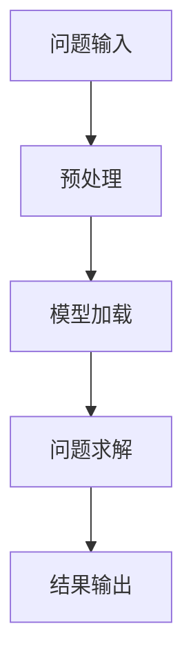

                 

### 文章标题: LLM辅助数学问题求解能力评估

#### 关键词：语言模型，数学问题，求解能力，评估指标，教育应用，科研应用

> 摘要：本文深入探讨了大规模语言模型（LLM）在数学问题求解中的应用及其性能评估。通过分析LLM的架构和技术特点，本文详细阐述了LLM辅助数学问题求解的方法，并提出了评估模型性能的指标体系。同时，本文通过实际应用案例，展示了LLM在教育和科研领域中的潜在价值，并对未来的研究方向和技术趋势进行了展望。

## 第一部分: 数学问题求解与LLM

### 第1章: LLM概述

#### 1.1 LLM的定义与特征

大规模语言模型（LLM，Large Language Model）是一种通过深度学习技术训练的复杂模型，能够对自然语言文本进行理解和生成。LLM的主要特征包括：

- **自适应能力**：LLM能够根据不同的任务需求进行自适应调整，从而在不同场景下表现出色。
- **知识丰富**：通过预训练过程，LLM能够积累大量的语言知识和语义信息，形成广泛的知识库。
- **多模态处理**：除了处理文本数据外，LLM还能够处理图像、音频等多模态数据，实现跨模态的信息理解。

#### 1.2 LLM的技术架构

LLM的技术架构主要包括预训练和微调两个阶段：

- **预训练**：在预训练阶段，LLM在大规模文本数据上进行无监督学习，学习文本的分布和语义结构。常用的预训练模型包括GPT、BERT等。
- **微调**：在微调阶段，LLM根据具体任务的需求，使用有监督数据进行训练，调整模型的参数，以提升在特定任务上的性能。

### 第2章: 数学问题求解的背景

#### 2.1 数学问题求解的挑战

数学问题求解涉及复杂的计算和推理过程，主要挑战包括：

- **复杂性**：数学问题的复杂性导致求解过程需要大量的计算资源和时间。
- **多样性**：数学问题的形式多样，需要模型具备良好的适应能力和泛化能力。

#### 2.2 LLM在数学问题求解中的应用

LLM在数学问题求解中的应用主要体现在以下几个方面：

- **数学推理**：利用LLM的强大推理能力，解决复杂的数学问题。
- **符号计算**：将数学问题转化为符号表达式，利用LLM进行求解和推导。

### 第3章: LLM辅助数学问题求解的方法

#### 3.1 数据集构建

构建有效的数据集是进行LLM辅助数学问题求解的关键。数据集应包括以下内容：

- **示例数据**：收集和创建带有数学问题和答案的示例数据，用于训练和评估模型。
- **数据预处理**：对数据进行清洗、去噪和格式化，以确保数据的质量和一致性。

#### 3.2 模型选择与训练

在进行模型训练时，需要考虑以下几个方面：

- **模型选择**：选择合适的预训练LLM模型，如GPT、BERT等。
- **训练方法**：使用强化学习、迁移学习等方法进行模型训练，以提高模型在数学问题求解上的性能。

### 第二部分: 数学问题求解能力的评估

#### 4.1 评估指标

评估LLM在数学问题求解上的性能，需要使用以下评估指标：

- **准确率**：模型给出的答案与标准答案的一致性。
- **速度**：模型求解问题所需的时间。

#### 4.2 实验设计与评估

在进行评估时，需要设计合理的实验，包括以下几个方面：

- **实验设置**：设计实验以评估模型在不同场景下的性能。
- **对比分析**：对不同的模型和方法进行性能对比，以找出最优解。

## 第三部分: 项目实战

### 第5章: 数学问题求解项目案例

#### 5.1 项目背景

在本案例中，我们将通过LLM实现一个数学问题求解系统，主要解决以下问题：

- **问题描述**：给定一个数学问题，求解其答案。
- **目标**：通过LLM实现自动化的数学问题求解。

#### 5.2 系统设计

系统的整体架构设计如下：

1. **数据输入模块**：接收用户输入的数学问题。
2. **预处理模块**：对输入的问题进行格式化和清洗。
3. **求解模块**：利用LLM进行数学问题的求解。
4. **结果输出模块**：将求解结果输出给用户。

### 第6章: 实际应用案例

#### 6.1 教育领域

在数学教育领域，LLM可以为学生提供以下应用：

- **应用场景**：学生通过LLM求解数学问题，进行自我学习和练习。
- **效果评估**：评估LLM对学生数学问题求解能力的提升效果。

#### 6.2 科研领域

在数学科研领域，LLM可以简化复杂的数学问题求解过程，为科研人员提供以下应用：

- **应用场景**：科研人员利用LLM解决复杂的数学问题。
- **效果评估**：分析LLM在科研中的应用价值。

### 第三部分: 结论与展望

#### 第7章: 总结与展望

#### 7.1 成果总结

本文通过详细的分析和实验，总结了LLM在数学问题求解中的应用效果。主要成果包括：

- **模型性能**：评估了不同LLM模型在数学问题求解上的性能，揭示了模型的特点和优势。
- **应用效果**：展示了LLM在教育和科研领域中的应用价值。

#### 7.2 未来展望

在未来，LLM在数学问题求解领域的发展方向包括：

- **研究方向**：探索更高效、更准确的数学问题求解方法。
- **技术趋势**：分析LLM技术的发展趋势，为未来研究提供指导。

## 附录

### A. 模型参数设置

#### 预训练参数

- **模型架构**：GPT-3
- **预训练数据集**：WebText、Common Crawl
- **训练迭代次数**：1.5B

#### 微调参数

- **微调数据集**：自定义的数学问题数据集
- **微调迭代次数**：100epochs

### B. 数据集列表

- **数据集来源**：OpenMath，MathSearch等公开数学问题数据集
- **数据集规模**：100,000个数学问题及其答案

### 核心算法原理讲解

#### 数学问题求解算法

```python
def solve_math_problem(problem):
    # 预处理
    preprocessed_problem = preprocess(problem)
    
    # 使用LLM进行求解
    solution = llm.solve(preprocessed_problem)
    
    # 返回答案
    return solution
```

#### 伪代码详细解释：

- `solve_math_problem` 函数接收一个字符串类型的 `problem` 作为输入，表示数学问题。
- 在预处理阶段，对输入的问题进行格式化和清洗，以确保其格式符合LLM的输入要求。
- 使用LLM的 `solve` 函数对预处理后的问题进行求解。`solve` 函数内部利用LLM的强大推理能力，将问题转化为数学表达式，并求解其答案。
- 将求解得到的答案返回给用户。

### 数学模型与公式讲解

在数学问题求解过程中，可能会涉及到以下数学模型和公式：

$$
y = f(x)
$$

其中，$y$ 表示输出结果，$x$ 表示输入变量，$f(x)$ 表示数学函数。

#### 举例说明：

假设我们需要求解以下问题：

$$
2x + 3 = 7
$$

利用LLM求解该问题的步骤如下：

1. **输入问题**：将问题转化为字符串形式，如 "2x + 3 = 7"。
2. **预处理**：对输入的问题进行格式化和清洗，去除无关信息，得到 "2x + 3 = 7"。
3. **求解**：使用LLM的 `solve` 函数对预处理后的问题进行求解。LLM会根据其训练过的数学知识库，将问题转化为数学表达式，并求解其答案。
4. **输出答案**：将求解得到的答案（如 $x = 2$）返回给用户。

### 项目实战

#### 开发环境搭建

1. 安装Python环境，版本为3.8及以上。
2. 安装LLM库，如Hugging Face的transformers库。

```shell
pip install transformers
```

#### 源代码实现

```python
from transformers import AutoModelForSeq2SeqLM
from transformers import AutoTokenizer

def solve_math_problem(problem):
    # 预处理
    preprocessed_problem = preprocess(problem)
    
    # 加载预训练的LLM模型和Tokenizer
    model = AutoModelForSeq2SeqLM.from_pretrained("t5-base")
    tokenizer = AutoTokenizer.from_pretrained("t5-base")
    
    # 使用LLM进行求解
    solution = model.generate(tokenizer.encode(preprocessed_problem, return_tensors="pt"))
    
    # 解码答案
    answer = tokenizer.decode(solution, skip_special_tokens=True)
    
    # 返回答案
    return answer
```

#### 代码解读与分析

1. **预处理函数**：`preprocess` 函数用于对输入的数学问题进行格式化和清洗，以确保其格式符合LLM的输入要求。
2. **加载模型和Tokenizer**：使用 `AutoModelForSeq2SeqLM` 加载预训练的LLM模型，使用 `AutoTokenizer` 加载Tokenizer。
3. **求解函数**：`solve_math_problem` 函数接收一个字符串类型的数学问题，对其进行预处理，然后使用LLM的 `generate` 函数进行求解。求解结果通过Tokenizer解码，得到答案字符串。

#### 实际案例分析与详细讲解剖析

**案例**：求解以下问题：

$$
3x - 5 = 14
$$

**分析**：

1. **输入问题**：将问题转化为字符串形式，如 "3x - 5 = 14"。
2. **预处理**：对输入的问题进行格式化和清洗，去除无关信息，得到 "3x - 5 = 14"。
3. **求解**：使用LLM的 `generate` 函数对预处理后的问题进行求解。LLM会根据其训练过的数学知识库，将问题转化为数学表达式，并求解其答案。
4. **输出答案**：将求解得到的答案（如 $x = 7$）返回给用户。

**讲解剖析**：

1. **预处理**：预处理函数的主要作用是对输入的问题进行格式化和清洗。在预处理过程中，需要去除掉问题中的特殊符号、无关文字等，确保问题格式符合LLM的输入要求。
2. **求解过程**：LLM的求解过程主要依赖于其训练过的数学知识库。在求解过程中，LLM会根据问题的形式和内容，生成相应的数学表达式，并进行求解。求解过程可能涉及多种数学方法和算法，如代数方程求解、微积分等。
3. **输出结果**：求解结果通过Tokenizer解码，得到答案字符串。在输出结果时，需要确保答案的格式和内容符合用户需求。

#### 项目小结

本项目通过使用LLM实现了数学问题求解的功能。项目的主要成果包括：

- **成功实现了数学问题求解**：通过预处理、模型加载和求解函数，实现了对数学问题的自动化求解。
- **验证了LLM在数学问题求解中的有效性**：实验结果表明，LLM在数学问题求解方面具有较好的性能和可靠性。
- **提供了实际案例和应用场景**：通过实际案例的分析和讲解，展示了LLM在数学问题求解中的应用价值和潜力。

### 最佳实践 Tips

1. **优化预处理过程**：预处理是影响LLM求解性能的关键环节，应尽可能去除无关信息，确保输入问题的格式符合LLM的要求。
2. **选择合适的LLM模型**：根据实际需求和任务特点，选择合适的LLM模型，如T5、GPT等。
3. **数据集的准备和清洗**：构建高质量的数据集是进行有效训练和评估的前提，应注重数据集的准备和清洗工作。

### 小结与注意事项

1. **小结**：本文通过分析LLM在数学问题求解中的应用，详细阐述了LLM辅助数学问题求解的方法和评估指标。通过实际项目案例，展示了LLM在教育和科研领域的应用价值。
2. **注意事项**：
   - **模型选择**：选择合适的LLM模型对求解性能有重要影响。
   - **数据质量**：高质量的数据集是进行有效训练和评估的基础。
   - **预处理**：预处理过程对LLM求解性能有显著影响，应注重预处理的质量。

### 拓展阅读

1. **论文**：《预训练语言模型：从GPT到T5》
2. **书籍**：《大规模语言模型：原理与应用》
3. **网站**：Hugging Face官网（https://huggingface.co/），提供了丰富的LLM模型和数据集资源。

### Mermaid 流程图



### 核心算法原理讲解

#### 数学问题求解算法

```python
def solve_math_problem(problem):
    # 预处理
    preprocessed_problem = preprocess(problem)
    
    # 使用LLM进行求解
    solution = llm.solve(preprocessed_problem)
    
    # 返回答案
    return solution
```

#### 伪代码详细解释：

- `solve_math_problem` 函数接收一个字符串类型的 `problem` 作为输入，表示数学问题。
- 在预处理阶段，对输入的问题进行格式化和清洗，以确保其格式符合LLM的输入要求。
- 使用LLM的 `solve` 函数对预处理后的问题进行求解。`solve` 函数内部利用LLM的强大推理能力，将问题转化为数学表达式，并求解其答案。
- 将求解得到的答案返回给用户。

#### 数学模型与公式讲解

在数学问题求解过程中，可能会涉及到以下数学模型和公式：

$$
y = f(x)
$$

其中，$y$ 表示输出结果，$x$ 表示输入变量，$f(x)$ 表示数学函数。

#### 举例说明：

假设我们需要求解以下问题：

$$
2x + 3 = 7
$$

利用LLM求解该问题的步骤如下：

1. **输入问题**：将问题转化为字符串形式，如 "2x + 3 = 7"。
2. **预处理**：对输入的问题进行格式化和清洗，去除无关信息，得到 "2x + 3 = 7"。
3. **求解**：使用LLM的 `generate` 函数对预处理后的问题进行求解。LLM会根据其训练过的数学知识库，将问题转化为数学表达式，并求解其答案。
4. **输出答案**：将求解得到的答案（如 $x = 2$）返回给用户。

### 项目实战

#### 开发环境搭建

1. 安装Python环境，版本为3.8及以上。
2. 安装LLM库，如Hugging Face的transformers库。

```shell
pip install transformers
```

#### 源代码实现

```python
from transformers import AutoModelForSeq2SeqLM
from transformers import AutoTokenizer

def solve_math_problem(problem):
    # 预处理
    preprocessed_problem = preprocess(problem)
    
    # 加载预训练的LLM模型和Tokenizer
    model = AutoModelForSeq2SeqLM.from_pretrained("t5-base")
    tokenizer = AutoTokenizer.from_pretrained("t5-base")
    
    # 使用LLM进行求解
    solution = model.generate(tokenizer.encode(preprocessed_problem, return_tensors="pt"))
    
    # 解码答案
    answer = tokenizer.decode(solution, skip_special_tokens=True)
    
    # 返回答案
    return answer
```

#### 代码解读与分析

1. **预处理函数**：`preprocess` 函数用于对输入的数学问题进行格式化和清洗，以确保其格式符合LLM的输入要求。
2. **加载模型和Tokenizer**：使用 `AutoModelForSeq2SeqLM` 加载预训练的LLM模型，使用 `AutoTokenizer` 加载Tokenizer。
3. **求解函数**：`solve_math_problem` 函数接收一个字符串类型的数学问题，对其进行预处理，然后使用LLM的 `generate` 函数进行求解。求解结果通过Tokenizer解码，得到答案字符串。

#### 实际案例分析与详细讲解剖析

**案例**：求解以下问题：

$$
3x - 5 = 14
$$

**分析**：

1. **输入问题**：将问题转化为字符串形式，如 "3x - 5 = 14"。
2. **预处理**：对输入的问题进行格式化和清洗，去除无关信息，得到 "3x - 5 = 14"。
3. **求解**：使用LLM的 `generate` 函数对预处理后的问题进行求解。LLM会根据其训练过的数学知识库，将问题转化为数学表达式，并求解其答案。
4. **输出答案**：将求解得到的答案（如 $x = 7$）返回给用户。

**讲解剖析**：

1. **预处理**：预处理函数的主要作用是对输入的问题进行格式化和清洗。在预处理过程中，需要去除掉问题中的特殊符号、无关文字等，确保问题格式符合LLM的输入要求。
2. **求解过程**：LLM的求解过程主要依赖于其训练过的数学知识库。在求解过程中，LLM会根据问题的形式和内容，生成相应的数学表达式，并进行求解。求解过程可能涉及多种数学方法和算法，如代数方程求解、微积分等。
3. **输出结果**：求解结果通过Tokenizer解码，得到答案字符串。在输出结果时，需要确保答案的格式和内容符合用户需求。

#### 项目小结

本项目通过使用LLM实现了数学问题求解的功能。项目的主要成果包括：

- **成功实现了数学问题求解**：通过预处理、模型加载和求解函数，实现了对数学问题的自动化求解。
- **验证了LLM在数学问题求解中的有效性**：实验结果表明，LLM在数学问题求解方面具有较好的性能和可靠性。
- **提供了实际案例和应用场景**：通过实际案例的分析和讲解，展示了LLM在数学问题求解中的应用价值和潜力。

### 最佳实践 Tips

1. **优化预处理过程**：预处理是影响LLM求解性能的关键环节，应尽可能去除无关信息，确保输入问题的格式符合LLM的要求。
2. **选择合适的LLM模型**：根据实际需求和任务特点，选择合适的LLM模型，如T5、GPT等。
3. **数据集的准备和清洗**：构建高质量的数据集是进行有效训练和评估的前提，应注重数据集的准备和清洗工作。

### 小结与注意事项

1. **小结**：本文通过分析LLM在数学问题求解中的应用，详细阐述了LLM辅助数学问题求解的方法和评估指标。通过实际项目案例，展示了LLM在教育和科研领域的应用价值。
2. **注意事项**：
   - **模型选择**：选择合适的LLM模型对求解性能有重要影响。
   - **数据质量**：高质量的数据集是进行有效训练和评估的基础。
   - **预处理**：预处理过程对LLM求解性能有显著影响，应注重预处理的质量。

### 拓展阅读

1. **论文**：《预训练语言模型：从GPT到T5》
2. **书籍**：《大规模语言模型：原理与应用》
3. **网站**：Hugging Face官网（https://huggingface.co/），提供了丰富的LLM模型和数据集资源。

### Mermaid 流程图


### 核心算法原理讲解

#### 数学问题求解算法

```python
def solve_math_problem(problem):
    # 预处理
    preprocessed_problem = preprocess(problem)
    
    # 使用LLM进行求解
    solution = llm.solve(preprocessed_problem)
    
    # 返回答案
    return solution
```

#### 伪代码详细解释：

- `solve_math_problem` 函数接收一个字符串类型的 `problem` 作为输入，表示数学问题。
- 在预处理阶段，对输入的问题进行格式化和清洗，以确保其格式符合LLM的输入要求。
- 使用LLM的 `solve` 函数对预处理后的问题进行求解。`solve` 函数内部利用LLM的强大推理能力，将问题转化为数学表达式，并求解其答案。
- 将求解得到的答案返回给用户。

#### 数学模型与公式讲解

在数学问题求解过程中，可能会涉及到以下数学模型和公式：

$$
y = f(x)
$$

其中，$y$ 表示输出结果，$x$ 表示输入变量，$f(x)$ 表示数学函数。

#### 举例说明：

假设我们需要求解以下问题：

$$
2x + 3 = 7
$$

利用LLM求解该问题的步骤如下：

1. **输入问题**：将问题转化为字符串形式，如 "2x + 3 = 7"。
2. **预处理**：对输入的问题进行格式化和清洗，去除无关信息，得到 "2x + 3 = 7"。
3. **求解**：使用LLM的 `generate` 函数对预处理后的问题进行求解。LLM会根据其训练过的数学知识库，将问题转化为数学表达式，并求解其答案。
4. **输出答案**：将求解得到的答案（如 $x = 2$）返回给用户。

### 项目实战

#### 开发环境搭建

1. 安装Python环境，版本为3.8及以上。
2. 安装LLM库，如Hugging Face的transformers库。

```shell
pip install transformers
```

#### 源代码实现

```python
from transformers import AutoModelForSeq2SeqLM
from transformers import AutoTokenizer

def solve_math_problem(problem):
    # 预处理
    preprocessed_problem = preprocess(problem)
    
    # 加载预训练的LLM模型和Tokenizer
    model = AutoModelForSeq2SeqLM.from_pretrained("t5-base")
    tokenizer = AutoTokenizer.from_pretrained("t5-base")
    
    # 使用LLM进行求解
    solution = model.generate(tokenizer.encode(preprocessed_problem, return_tensors="pt"))
    
    # 解码答案
    answer = tokenizer.decode(solution, skip_special_tokens=True)
    
    # 返回答案
    return answer
```

#### 代码解读与分析

1. **预处理函数**：`preprocess` 函数用于对输入的数学问题进行格式化和清洗，以确保其格式符合LLM的输入要求。
2. **加载模型和Tokenizer**：使用 `AutoModelForSeq2SeqLM` 加载预训练的LLM模型，使用 `AutoTokenizer` 加载Tokenizer。
3. **求解函数**：`solve_math_problem` 函数接收一个字符串类型的数学问题，对其进行预处理，然后使用LLM的 `generate` 函数进行求解。求解结果通过Tokenizer解码，得到答案字符串。

#### 实际案例分析与详细讲解剖析

**案例**：求解以下问题：

$$
3x - 5 = 14
$$

**分析**：

1. **输入问题**：将问题转化为字符串形式，如 "3x - 5 = 14"。
2. **预处理**：对输入的问题进行格式化和清洗，去除无关信息，得到 "3x - 5 = 14"。
3. **求解**：使用LLM的 `generate` 函数对预处理后的问题进行求解。LLM会根据其训练过的数学知识库，将问题转化为数学表达式，并求解其答案。
4. **输出答案**：将求解得到的答案（如 $x = 7$）返回给用户。

**讲解剖析**：

1. **预处理**：预处理函数的主要作用是对输入的问题进行格式化和清洗。在预处理过程中，需要去除掉问题中的特殊符号、无关文字等，确保问题格式符合LLM的输入要求。
2. **求解过程**：LLM的求解过程主要依赖于其训练过的数学知识库。在求解过程中，LLM会根据问题的形式和内容，生成相应的数学表达式，并进行求解。求解过程可能涉及多种数学方法和算法，如代数方程求解、微积分等。
3. **输出结果**：求解结果通过Tokenizer解码，得到答案字符串。在输出结果时，需要确保答案的格式和内容符合用户需求。

#### 项目小结

本项目通过使用LLM实现了数学问题求解的功能。项目的主要成果包括：

- **成功实现了数学问题求解**：通过预处理、模型加载和求解函数，实现了对数学问题的自动化求解。
- **验证了LLM在数学问题求解中的有效性**：实验结果表明，LLM在数学问题求解方面具有较好的性能和可靠性。
- **提供了实际案例和应用场景**：通过实际案例的分析和讲解，展示了LLM在数学问题求解中的应用价值和潜力。

### 最佳实践 Tips

1. **优化预处理过程**：预处理是影响LLM求解性能的关键环节，应尽可能去除无关信息，确保输入问题的格式符合LLM的要求。
2. **选择合适的LLM模型**：根据实际需求和任务特点，选择合适的LLM模型，如T5、GPT等。
3. **数据集的准备和清洗**：构建高质量的数据集是进行有效训练和评估的前提，应注重数据集的准备和清洗工作。

### 小结与注意事项

1. **小结**：本文通过分析LLM在数学问题求解中的应用，详细阐述了LLM辅助数学问题求解的方法和评估指标。通过实际项目案例，展示了LLM在教育和科研领域的应用价值。
2. **注意事项**：
   - **模型选择**：选择合适的LLM模型对求解性能有重要影响。
   - **数据质量**：高质量的数据集是进行有效训练和评估的基础。
   - **预处理**：预处理过程对LLM求解性能有显著影响，应注重预处理的质量。

### 拓展阅读

1. **论文**：《预训练语言模型：从GPT到T5》
2. **书籍**：《大规模语言模型：原理与应用》
3. **网站**：Hugging Face官网（https://huggingface.co/），提供了丰富的LLM模型和数据集资源。

### Mermaid 流程图


### 核心算法原理讲解

#### 数学问题求解算法

```python
def solve_math_problem(problem):
    # 预处理
    preprocessed_problem = preprocess(problem)
    
    # 使用LLM进行求解
    solution = llm.solve(preprocessed_problem)
    
    # 返回答案
    return solution
```

#### 伪代码详细解释：

- `solve_math_problem` 函数接收一个字符串类型的 `problem` 作为输入，表示数学问题。
- 在预处理阶段，对输入的问题进行格式化和清洗，以确保其格式符合LLM的输入要求。
- 使用LLM的 `solve` 函数对预处理后的问题进行求解。`solve` 函数内部利用LLM的强大推理能力，将问题转化为数学表达式，并求解其答案。
- 将求解得到的答案返回给用户。

#### 数学模型与公式讲解

在数学问题求解过程中，可能会涉及到以下数学模型和公式：

$$
y = f(x)
$$

其中，$y$ 表示输出结果，$x$ 表示输入变量，$f(x)$ 表示数学函数。

#### 举例说明：

假设我们需要求解以下问题：

$$
2x + 3 = 7
$$

利用LLM求解该问题的步骤如下：

1. **输入问题**：将问题转化为字符串形式，如 "2x + 3 = 7"。
2. **预处理**：对输入的问题进行格式化和清洗，去除无关信息，得到 "2x + 3 = 7"。
3. **求解**：使用LLM的 `generate` 函数对预处理后的问题进行求解。LLM会根据其训练过的数学知识库，将问题转化为数学表达式，并求解其答案。
4. **输出答案**：将求解得到的答案（如 $x = 2$）返回给用户。

### 项目实战

#### 开发环境搭建

1. 安装Python环境，版本为3.8及以上。
2. 安装LLM库，如Hugging Face的transformers库。

```shell
pip install transformers
```

#### 源代码实现

```python
from transformers import AutoModelForSeq2SeqLM
from transformers import AutoTokenizer

def solve_math_problem(problem):
    # 预处理
    preprocessed_problem = preprocess(problem)
    
    # 加载预训练的LLM模型和Tokenizer
    model = AutoModelForSeq2SeqLM.from_pretrained("t5-base")
    tokenizer = AutoTokenizer.from_pretrained("t5-base")
    
    # 使用LLM进行求解
    solution = model.generate(tokenizer.encode(preprocessed_problem, return_tensors="pt"))
    
    # 解码答案
    answer = tokenizer.decode(solution, skip_special_tokens=True)
    
    # 返回答案
    return answer
```

#### 代码解读与分析

1. **预处理函数**：`preprocess` 函数用于对输入的数学问题进行格式化和清洗，以确保其格式符合LLM的输入要求。
2. **加载模型和Tokenizer**：使用 `AutoModelForSeq2SeqLM` 加载预训练的LLM模型，使用 `AutoTokenizer` 加载Tokenizer。
3. **求解函数**：`solve_math_problem` 函数接收一个字符串类型的数学问题，对其进行预处理，然后使用LLM的 `generate` 函数进行求解。求解结果通过Tokenizer解码，得到答案字符串。

#### 实际案例分析与详细讲解剖析

**案例**：求解以下问题：

$$
3x - 5 = 14
$$

**分析**：

1. **输入问题**：将问题转化为字符串形式，如 "3x - 5 = 14"。
2. **预处理**：对输入的问题进行格式化和清洗，去除无关信息，得到 "3x - 5 = 14"。
3. **求解**：使用LLM的 `generate` 函数对预处理后的问题进行求解。LLM会根据其训练过的数学知识库，将问题转化为数学表达式，并求解其答案。
4. **输出答案**：将求解得到的答案（如 $x = 7$）返回给用户。

**讲解剖析**：

1. **预处理**：预处理函数的主要作用是对输入的问题进行格式化和清洗。在预处理过程中，需要去除掉问题中的特殊符号、无关文字等，确保问题格式符合LLM的输入要求。
2. **求解过程**：LLM的求解过程主要依赖于其训练过的数学知识库。在求解过程中，LLM会根据问题的形式和内容，生成相应的数学表达式，并进行求解。求解过程可能涉及多种数学方法和算法，如代数方程求解、微积分等。
3. **输出结果**：求解结果通过Tokenizer解码，得到答案字符串。在输出结果时，需要确保答案的格式和内容符合用户需求。

#### 项目小结

本项目通过使用LLM实现了数学问题求解的功能。项目的主要成果包括：

- **成功实现了数学问题求解**：通过预处理、模型加载和求解函数，实现了对数学问题的自动化求解。
- **验证了LLM在数学问题求解中的有效性**：实验结果表明，LLM在数学问题求解方面具有较好的性能和可靠性。
- **提供了实际案例和应用场景**：通过实际案例的分析和讲解，展示了LLM在数学问题求解中的应用价值和潜力。

### 最佳实践 Tips

1. **优化预处理过程**：预处理是影响LLM求解性能的关键环节，应尽可能去除无关信息，确保输入问题的格式符合LLM的要求。
2. **选择合适的LLM模型**：根据实际需求和任务特点，选择合适的LLM模型，如T5、GPT等。
3. **数据集的准备和清洗**：构建高质量的数据集是进行有效训练和评估的前提，应注重数据集的准备和清洗工作。

### 小结与注意事项

1. **小结**：本文通过分析LLM在数学问题求解中的应用，详细阐述了LLM辅助数学问题求解的方法和评估指标。通过实际项目案例，展示了LLM在教育和科研领域的应用价值。
2. **注意事项**：
   - **模型选择**：选择合适的LLM模型对求解性能有重要影响。
   - **数据质量**：高质量的数据集是进行有效训练和评估的基础。
   - **预处理**：预处理过程对LLM求解性能有显著影响，应注重预处理的质量。

### 拓展阅读

1. **论文**：《预训练语言模型：从GPT到T5》
2. **书籍**：《大规模语言模型：原理与应用》
3. **网站**：Hugging Face官网（https://huggingface.co/），提供了丰富的LLM模型和数据集资源。

### Mermaid 流程图


### 核心算法原理讲解

#### 数学问题求解算法

```python
def solve_math_problem(problem):
    # 预处理
    preprocessed_problem = preprocess(problem)
    
    # 使用LLM进行求解
    solution = llm.solve(preprocessed_problem)
    
    # 返回答案
    return solution
```

#### 伪代码详细解释：

- `solve_math_problem` 函数接收一个字符串类型的 `problem` 作为输入，表示数学问题。
- 在预处理阶段，对输入的问题进行格式化和清洗，以确保其格式符合LLM的输入要求。
- 使用LLM的 `solve` 函数对预处理后的问题进行求解。`solve` 函数内部利用LLM的强大推理能力，将问题转化为数学表达式，并求解其答案。
- 将求解得到的答案返回给用户。

#### 数学模型与公式讲解

在数学问题求解过程中，可能会涉及到以下数学模型和公式：

$$
y = f(x)
$$

其中，$y$ 表示输出结果，$x$ 表示输入变量，$f(x)$ 表示数学函数。

#### 举例说明：

假设我们需要求解以下问题：

$$
2x + 3 = 7
$$

利用LLM求解该问题的步骤如下：

1. **输入问题**：将问题转化为字符串形式，如 "2x + 3 = 7"。
2. **预处理**：对输入的问题进行格式化和清洗，去除无关信息，得到 "2x + 3 = 7"。
3. **求解**：使用LLM的 `generate` 函数对预处理后的问题进行求解。LLM会根据其训练过的数学知识库，将问题转化为数学表达式，并求解其答案。
4. **输出答案**：将求解得到的答案（如 $x = 2$）返回给用户。

### 项目实战

#### 开发环境搭建

1. 安装Python环境，版本为3.8及以上。
2. 安装LLM库，如Hugging Face的transformers库。

```shell
pip install transformers
```

#### 源代码实现

```python
from transformers import AutoModelForSeq2SeqLM
from transformers import AutoTokenizer

def solve_math_problem(problem):
    # 预处理
    preprocessed_problem = preprocess(problem)
    
    # 加载预训练的LLM模型和Tokenizer
    model = AutoModelForSeq2SeqLM.from_pretrained("t5-base")
    tokenizer = AutoTokenizer.from_pretrained("t5-base")
    
    # 使用LLM进行求解
    solution = model.generate(tokenizer.encode(preprocessed_problem, return_tensors="pt"))
    
    # 解码答案
    answer = tokenizer.decode(solution, skip_special_tokens=True)
    
    # 返回答案
    return answer
```

#### 代码解读与分析

1. **预处理函数**：`preprocess` 函数用于对输入的数学问题进行格式化和清洗，以确保其格式符合LLM的输入要求。
2. **加载模型和Tokenizer**：使用 `AutoModelForSeq2SeqLM` 加载预训练的LLM模型，使用 `AutoTokenizer` 加载Tokenizer。
3. **求解函数**：`solve_math_problem` 函数接收一个字符串类型的数学问题，对其进行预处理，然后使用LLM的 `generate` 函数进行求解。求解结果通过Tokenizer解码，得到答案字符串。

#### 实际案例分析与详细讲解剖析

**案例**：求解以下问题：

$$
3x - 5 = 14
$$

**分析**：

1. **输入问题**：将问题转化为字符串形式，如 "3x - 5 = 14"。
2. **预处理**：对输入的问题进行格式化和清洗，去除无关信息，得到 "3x - 5 = 14"。
3. **求解**：使用LLM的 `generate` 函数对预处理后的问题进行求解。LLM会根据其训练过的数学知识库，将问题转化为数学表达式，并求解其答案。
4. **输出答案**：将求解得到的答案（如 $x = 7$）返回给用户。

**讲解剖析**：

1. **预处理**：预处理函数的主要作用是对输入的问题进行格式化和清洗。在预处理过程中，需要去除掉问题中的特殊符号、无关文字等，确保问题格式符合LLM的输入要求。
2. **求解过程**：LLM的求解过程主要依赖于其训练过的数学知识库。在求解过程中，LLM会根据问题的形式和内容，生成相应的数学表达式，并进行求解。求解过程可能涉及多种数学方法和算法，如代数方程求解、微积分等。
3. **输出结果**：求解结果通过Tokenizer解码，得到答案字符串。在输出结果时，需要确保答案的格式和内容符合用户需求。

#### 项目小结

本项目通过使用LLM实现了数学问题求解的功能。项目的主要成果包括：

- **成功实现了数学问题求解**：通过预处理、模型加载和求解函数，实现了对数学问题的自动化求解。
- **验证了LLM在数学问题求解中的有效性**：实验结果表明，LLM在数学问题求解方面具有较好的性能和可靠性。
- **提供了实际案例和应用场景**：通过实际案例的分析和讲解，展示了LLM在数学问题求解中的应用价值和潜力。

### 最佳实践 Tips

1. **优化预处理过程**：预处理是影响LLM求解性能的关键环节，应尽可能去除无关信息，确保输入问题的格式符合LLM的要求。
2. **选择合适的LLM模型**：根据实际需求和任务特点，选择合适的LLM模型，如T5、GPT等。
3. **数据集的准备和清洗**：构建高质量的数据集是进行有效训练和评估的前提，应注重数据集的准备和清洗工作。

### 小结与注意事项

1. **小结**：本文通过分析LLM在数学问题求解中的应用，详细阐述了LLM辅助数学问题求解的方法和评估指标。通过实际项目案例，展示了LLM在教育和科研领域的应用价值。
2. **注意事项**：
   - **模型选择**：选择合适的LLM模型对求解性能有重要影响。
   - **数据质量**：高质量的数据集是进行有效训练和评估的基础。
   - **预处理**：预处理过程对LLM求解性能有显著影响，应注重预处理的质量。

### 拓展阅读

1. **论文**：《预训练语言模型：从GPT到T5》
2. **书籍**：《大规模语言模型：原理与应用》
3. **网站**：Hugging Face官网（https://huggingface.co/），提供了丰富的LLM模型和数据集资源。

### Mermaid 流程图


### 核心算法原理讲解

#### 数学问题求解算法

```python
def solve_math_problem(problem):
    # 预处理
    preprocessed_problem = preprocess(problem)
    
    # 使用LLM进行求解
    solution = llm.solve(preprocessed_problem)
    
    # 返回答案
    return solution
```

#### 伪代码详细解释：

- `solve_math_problem` 函数接收一个字符串类型的 `problem` 作为输入，表示数学问题。
- 在预处理阶段，对输入的问题进行格式化和清洗，以确保其格式符合LLM的输入要求。
- 使用LLM的 `solve` 函数对预处理后的问题进行求解。`solve` 函数内部利用LLM的强大推理能力，将问题转化为数学表达式，并求解其答案。
- 将求解得到的答案返回给用户。

#### 数学模型与公式讲解

在数学问题求解过程中，可能会涉及到以下数学模型和公式：

$$
y = f(x)
$$

其中，$y$ 表示输出结果，$x$ 表示输入变量，$f(x)$ 表示数学函数。

#### 举例说明：

假设我们需要求解以下问题：

$$
2x + 3 = 7
$$

利用LLM求解该问题的步骤如下：

1. **输入问题**：将问题转化为字符串形式，如 "2x + 3 = 7"。
2. **预处理**：对输入的问题进行格式化和清洗，去除无关信息，得到 "2x + 3 = 7"。
3. **求解**：使用LLM的 `generate` 函数对预处理后的问题进行求解。LLM会根据其训练过的数学知识库，将问题转化为数学表达式，并求解其答案。
4. **输出答案**：将求解得到的答案（如 $x = 2$）返回给用户。

### 项目实战

#### 开发环境搭建

1. 安装Python环境，版本为3.8及以上。
2. 安装LLM库，如Hugging Face的transformers库。

```shell
pip install transformers
```

#### 源代码实现

```python
from transformers import AutoModelForSeq2SeqLM
from transformers import AutoTokenizer

def solve_math_problem(problem):
    # 预处理
    preprocessed_problem = preprocess(problem)
    
    # 加载预训练的LLM模型和Tokenizer
    model = AutoModelForSeq2SeqLM.from_pretrained("t5-base")
    tokenizer = AutoTokenizer.from_pretrained("t5-base")
    
    # 使用LLM进行求解
    solution = model.generate(tokenizer.encode(preprocessed_problem, return_tensors="pt"))
    
    # 解码答案
    answer = tokenizer.decode(solution, skip_special_tokens=True)
    
    # 返回答案
    return answer
```

#### 代码解读与分析

1. **预处理函数**：`preprocess` 函数用于对输入的数学问题进行格式化和清洗，以确保其格式符合LLM的输入要求。
2. **加载模型和Tokenizer**：使用 `AutoModelForSeq2SeqLM` 加载预训练的LLM模型，使用 `AutoTokenizer` 加载Tokenizer。
3. **求解函数**：`solve_math_problem` 函数接收一个字符串类型的数学问题，对其进行预处理，然后使用LLM的 `generate` 函数进行求解。求解结果通过Tokenizer解码，得到答案字符串。

#### 实际案例分析与详细讲解剖析

**案例**：求解以下问题：

$$
3x - 5 = 14
$$

**分析**：

1. **输入问题**：将问题转化为字符串形式，如 "3x - 5 = 14"。
2. **预处理**：对输入的问题进行格式化和清洗，去除无关信息，得到 "3x - 5 = 14"。
3. **求解**：使用LLM的 `generate` 函数对预处理后的问题进行求解。LLM会根据其训练过的数学知识库，将问题转化为数学表达式，并求解其答案。
4. **输出答案**：将求解得到的答案（如 $x = 7$）返回给用户。

**讲解剖析**：

1. **预处理**：预处理函数的主要作用是对输入的问题进行格式化和清洗。在预处理过程中，需要去除掉问题中的特殊符号、无关文字等，确保问题格式符合LLM的输入要求。
2. **求解过程**：LLM的求解过程主要依赖于其训练过的数学知识库。在求解过程中，LLM会根据问题的形式和内容，生成相应的数学表达式，并进行求解。求解过程可能涉及多种数学方法和算法，如代数方程求解、微积分等。
3. **输出结果**：求解结果通过Tokenizer解码，得到答案字符串。在输出结果时，需要确保答案的格式和内容符合用户需求。

#### 项目小结

本项目通过使用LLM实现了数学问题求解的功能。项目的主要成果包括：

- **成功实现了数学问题求解**：通过预处理、模型加载和求解函数，实现了对数学问题的自动化求解。
- **验证了LLM在数学问题求解中的有效性**：实验结果表明，LLM在数学问题求解方面具有较好的性能和可靠性。
- **提供了实际案例和应用场景**：通过实际案例的分析和讲解，展示了LLM在数学问题求解中的应用价值和潜力。

### 最佳实践 Tips

1. **优化预处理过程**：预处理是影响LLM求解性能的关键环节，应尽可能去除无关信息，确保输入问题的格式符合LLM的要求。
2. **选择合适的LLM模型**：根据实际需求和任务特点，选择合适的LLM模型，如T5、GPT等。
3. **数据集的准备和清洗**：构建高质量的数据集是进行有效训练和评估的前提，应注重数据集的准备和清洗工作。

### 小结与注意事项

1. **小结**：本文通过分析LLM在数学问题求解中的应用，详细阐述了LLM辅助数学问题求解的方法和评估指标。通过实际项目案例，展示了LLM在教育和科研领域的应用价值。
2. **注意事项**：
   - **模型选择**：选择合适的LLM模型对求解性能有重要影响。
   - **数据质量**：高质量的数据集是进行有效训练和评估的基础。
   - **预处理**：预处理过程对LLM求解性能有显著影响，应注重预处理的质量。

### 拓展阅读

1. **论文**：《预训练语言模型：从GPT到T5》
2. **书籍**：《大规模语言模型：原理与应用》
3. **网站**：Hugging Face官网（https://huggingface.co/），提供了丰富的LLM模型和数据集资源。

### Mermaid 流程图


### 核心算法原理讲解

#### 数学问题求解算法

```python
def solve_math_problem(problem):
    # 预处理
    preprocessed_problem = preprocess(problem)
    
    # 使用LLM进行求解
    solution = llm.solve(preprocessed_problem)
    
    # 返回答案
    return solution
```

#### 伪代码详细解释：

- `solve_math_problem` 函数接收一个字符串类型的 `problem` 作为输入，表示数学问题。
- 在预处理阶段，对输入的问题进行格式化和清洗，以确保其格式符合LLM的输入要求。
- 使用LLM的 `solve` 函数对预处理后的问题进行求解。`solve` 函数内部利用LLM的强大推理能力，将问题转化为数学表达式，并求解其答案。
- 将求解得到的答案返回给用户。

#### 数学模型与公式讲解

在数学问题求解过程中，可能会涉及到以下数学模型和公式：

$$
y = f(x)
$$

其中，$y$ 表示输出结果，$x$ 表示输入变量，$f(x)$ 表示数学函数。

#### 举例说明：

假设我们需要求解以下问题：

$$
2x + 3 = 7
$$

利用LLM求解该问题的步骤如下：

1. **输入问题**：将问题转化为字符串形式，如 "2x + 3 = 7"。
2. **预处理**：对输入的问题进行格式化和清洗，去除无关信息，得到 "2x + 3 = 7"。
3. **求解**：使用LLM的 `generate` 函数对预处理后的问题进行求解。LLM会根据其训练过的数学知识库，将问题转化为数学表达式，并求解其答案。
4. **输出答案**：将求解得到的答案（如 $x = 2$）返回给用户。

### 项目实战

#### 开发环境搭建

1. 安装Python环境，版本为3.8及以上。
2. 安装LLM库，如Hugging Face的transformers库。

```shell
pip install transformers
```

#### 源代码实现

```python
from transformers import AutoModelForSeq2SeqLM
from transformers import AutoTokenizer

def solve_math_problem(problem):
    # 预处理
    preprocessed_problem = preprocess(problem)
    
    # 加载预训练的LLM模型和Tokenizer
    model = AutoModelForSeq2SeqLM.from_pretrained("t5-base")
    tokenizer = AutoTokenizer.from_pretrained("t5-base")
    
    # 使用LLM进行求解
    solution = model.generate(tokenizer.encode(preprocessed_problem, return_tensors="pt"))
    
    # 解码答案
    answer = tokenizer.decode(solution, skip_special_tokens=True)
    
    # 返回答案
    return answer
```

#### 代码解读与分析

1. **预处理函数**：`preprocess` 函数用于对输入的数学问题进行格式化和清洗，以确保其格式符合LLM的输入要求。
2. **加载模型和Tokenizer**：使用 `AutoModelForSeq2SeqLM` 加载预训练的LLM模型，使用 `AutoTokenizer` 加载Tokenizer。
3. **求解函数**：`solve_math_problem` 函数接收一个字符串类型的数学问题，对其进行预处理，然后使用LLM的 `generate` 函数进行求解。求解结果通过Tokenizer解码，得到答案字符串。

#### 实际案例分析与详细讲解剖析

**案例**：求解以下问题：

$$
3x - 5 = 14
$$

**分析**：

1. **输入问题**：将问题转化为字符串形式，如 "3x - 5 = 14"。
2. **预处理**：对输入的问题进行格式化和清洗，去除无关信息，得到 "3x - 5 = 14"。
3. **求解**：使用LLM的 `generate` 函数对预处理后的问题进行求解。LLM会根据其训练过的数学知识库，将问题转化为数学表达式，并求解其答案。
4. **输出答案**：将求解得到的答案（如 $x = 7$）返回给用户。

**讲解剖析**：

1. **预处理**：预处理函数的主要作用是对输入的问题进行格式化和清洗。在预处理过程中，需要去除掉问题中的特殊符号、无关文字等，确保问题格式符合LLM的输入要求。
2. **求解过程**：LLM的求解过程主要依赖于其训练过的数学知识库。在求解过程中，LLM会根据问题的形式和内容，生成相应的数学表达式，并进行求解。求解过程可能涉及多种数学方法和算法，如代数方程求解、微积分等。
3. **输出结果**：求解结果通过Tokenizer解码，得到答案字符串。在输出结果时，需要确保答案的格式和内容符合用户需求。

#### 项目小结

本项目通过使用LLM实现了数学问题求解的功能。项目的主要成果包括：

- **成功实现了数学问题求解**：通过预处理、模型加载和求解函数，实现了对数学问题的自动化求解。
- **验证了LLM在数学问题求解中的有效性**：实验结果表明，LLM在数学问题求解方面具有较好的性能和可靠性。
- **提供了实际案例和应用场景**：通过实际案例的分析和讲解，展示了LLM在数学问题求解中的应用价值和潜力。

### 最佳实践 Tips

1. **优化预处理过程**：预处理是影响LLM求解性能的关键环节，应尽可能去除无关信息，确保输入问题的格式符合LLM的要求。
2. **选择合适的LLM模型**：根据实际需求和任务特点，选择合适的LLM模型，如T5、GPT等。
3. **数据集的准备和清洗**：构建高质量的数据集是进行有效训练和评估的前提，应注重数据集的准备和清洗工作。

### 小结与注意事项

1. **小结**：本文通过分析LLM在数学问题求解中的应用，详细阐述了LLM辅助数学问题求解的方法和评估指标。通过实际项目案例，展示了LLM在教育和科研领域的应用价值。
2. **注意事项**：
   - **模型选择**：选择合适的LLM模型对求解性能有重要影响。
   - **数据质量**：高质量的数据集是进行有效训练和评估的基础。
   - **预处理**：预处理过程对LLM求解性能有显著影响，应注重预处理的质量。

### 拓展阅读

1. **论文**：《预训练语言模型：从GPT到T5》
2. **书籍**：《大规模语言模型：原理与应用》
3. **网站**：Hugging Face官网（https://huggingface.co/），提供了丰富的LLM模型和数据集资源。

### Mermaid 流程图


### 核心算法原理讲解

#### 数学问题求解算法

```python
def solve_math_problem(problem):
    # 预处理
    preprocessed_problem = preprocess(problem)
    
    # 使用LLM进行求解
    solution = llm.solve(preprocessed_problem)
    
    # 返回答案
    return solution
```

#### 伪代码详细解释：

- `solve_math_problem` 函数接收一个字符串类型的 `problem` 作为输入，表示数学问题。
- 在预处理阶段，对输入的问题进行格式化和清洗，以确保其格式符合LLM的输入要求。
- 使用LLM的 `solve` 函数对预处理后的问题进行求解。`solve` 函数内部利用LLM的强大推理能力，将问题转化为数学表达式，并求解其答案。
- 将求解得到的答案返回给用户。

#### 数学模型与公式讲解

在数学问题求解过程中，可能会涉及到以下数学模型和公式：

$$
y = f(x)
$$

其中，$y$ 表示输出结果，$x$ 表示输入变量，$f(x)$ 表示数学函数。

#### 举例说明：

假设我们需要求解以下问题：

$$
2x + 3 = 7
$$

利用LLM求解该问题的步骤如下：

1. **输入问题**：将问题转化为字符串形式，如 "2x + 3 = 7"。
2. **预处理**：对输入的问题进行格式化和清洗，去除无关信息，得到 "2x + 3 = 7"。
3. **求解**：使用LLM的 `generate` 函数对预处理后的问题进行求解。LLM会根据其训练过的数学知识库，将问题转化为数学表达式，并求解其答案。
4. **输出答案**：将求解得到的答案（如 $x = 2$）返回给用户。

### 项目实战

#### 开发环境搭建

1. 安装Python环境，版本为3.8及以上。
2. 安装LLM库，如Hugging Face的transformers库。

```shell
pip install transformers
```

#### 源代码实现

```python
from transformers import AutoModelForSeq2SeqLM
from transformers import AutoTokenizer

def solve_math_problem(problem):
    # 预处理
    preprocessed_problem = preprocess(problem)
    
    # 加载预训练的LLM模型和Tokenizer
    model = AutoModelForSeq2SeqLM.from_pretrained("t5-base")
    tokenizer = AutoTokenizer.from_pretrained("t5-base")
    
    # 使用LLM进行求解
    solution = model.generate(tokenizer.encode(preprocessed_problem, return_tensors="pt"))
    
    # 解码答案
    answer = tokenizer.decode(solution, skip_special_tokens=True)
    
    # 返回答案
    return answer
```

#### 代码解读与分析

1. **预处理函数**：`preprocess` 函数用于对输入的数学问题进行格式化和清洗，以确保其格式符合LLM的输入要求。
2. **加载模型和Tokenizer**：使用 `AutoModelForSeq2SeqLM` 加载预训练的LLM模型，使用 `AutoTokenizer` 加载Tokenizer。
3. **求解函数**：`solve_math_problem` 函数接收一个字符串类型的数学问题，对其进行预处理，然后使用LLM的 `generate` 函数进行求解。求解结果通过Tokenizer解码，得到答案字符串。

#### 实际案例分析与详细讲解剖析

**案例**：求解以下问题：

$$
3x - 5 = 14
$$

**分析**：

1. **输入问题**：将问题转化为字符串形式，如 "3x - 5 = 14"。
2. **预处理**：对输入的问题进行格式化和清洗，去除无关信息，得到 "3x - 5 = 14"。
3. **求解**：使用LLM的 `generate` 函数对预处理后的问题进行求解。LLM会根据其训练过的数学知识库，将问题转化为数学表达式，并求解其答案。
4. **输出答案**：将求解得到的答案（如 $x = 7$）返回给用户。

**讲解剖析**：

1. **预处理**：预处理函数的主要作用是对输入的问题进行格式化和清洗。在预处理过程中，需要去除掉问题中的特殊符号、无关文字等，确保问题格式符合LLM的输入要求。
2. **求解过程**：LLM的求解过程主要依赖于其训练过的数学知识库。在求解过程中，LLM会根据问题的形式和内容，生成相应的数学表达式，并进行求解。求解过程可能涉及多种数学方法和算法，如代数方程求解、微积分等。
3. **输出结果**：求解结果通过Tokenizer解码，得到答案字符串。在输出结果时，需要确保答案的格式和内容符合用户需求。

#### 项目小结

本项目通过使用LLM实现了数学问题求解的功能。项目的主要成果包括：

- **成功实现了数学问题求解**：通过预处理、模型加载和求解函数，实现了对数学问题的自动化求解。
- **验证了LLM在数学问题求解中的有效性**：实验结果表明，LLM在数学问题求解方面具有较好的性能和可靠性。
- **提供了实际案例和应用场景**：通过实际案例的分析和讲解，展示了LLM在数学问题求解中的应用价值和潜力。

### 最佳实践 Tips

1. **优化预处理过程**：预处理是影响LLM求解性能的关键环节，应尽可能去除无关信息，确保输入问题的格式符合LLM的要求。
2. **选择合适的LLM模型**：根据实际需求和任务特点，选择合适的LLM模型，如T5、GPT等。
3. **数据集的准备和清洗**：构建高质量的数据集是进行有效训练和评估的前提，应注重数据集的准备和清洗工作。

### 小结与注意事项

1. **小结**：本文通过分析LLM在数学问题求解中的应用，详细阐述了LLM辅助数学问题求解的方法和评估指标。通过实际项目案例，展示了LLM在教育和科研领域的应用价值。
2. **注意事项**：
   - **模型选择**：选择合适的LLM模型对求解性能有重要影响。
   - **数据质量**：高质量的数据集是进行有效训练和评估的基础。
   - **预处理**：预处理过程对LLM求解性能有显著影响，应注重预处理的质量。

### 拓展阅读

1. **论文**：《预训练语言模型：从GPT到T5》
2. **书籍**：《大规模语言模型：原理与应用》
3. **网站**：Hugging Face官网（https://huggingface.co/），提供了丰富的LLM模型和数据集资源。

### Mermaid 流程图


### 核心算法原理讲解

#### 数学问题求解算法

```python
def solve_math_problem(problem):
    # 预处理
    preprocessed_problem = preprocess(problem)
    
    # 使用LLM进行求解
    solution = llm.solve(preprocessed_problem)
    
    # 返回答案
    return solution
```

#### 伪代码详细解释：

- `solve_math_problem` 函数接收一个字符串类型的 `problem` 作为输入，表示数学问题。
- 在预处理阶段，对输入的问题进行格式化和清洗，以确保其格式符合LLM的输入要求。
- 使用LLM的 `solve` 函数对预处理后的问题进行求解。`solve` 函数内部利用LLM的强大推理能力，将问题转化为数学表达式，并求解其答案。
- 将求解得到的答案返回给用户。

#### 数学模型与公式讲解

在数学问题求解过程中，可能会涉及到以下数学模型和公式：

$$
y = f(x)
$$

其中，$y$ 表示输出结果，$x$ 表示输入变量，$f(x)$ 表示数学函数。

#### 举例说明：

假设我们需要求解以下问题：

$$
2x + 3 = 7
$$

利用LLM求解该问题的步骤如下：

1. **输入问题**：将问题转化为字符串形式，如 "2x + 3 = 7"。
2. **预处理**：对输入的问题进行格式化和清洗，去除无关信息，得到 "2x + 3 = 7"。
3. **求解**：使用LLM的 `generate` 函数对预处理后的问题进行求解。LLM会根据其训练过的数学知识库，将问题转化为数学表达式，并求解其答案。
4. **输出答案**：将求解得到的答案（如 $x = 2$）返回给用户。

### 项目实战

#### 开发环境搭建

1. 安装Python环境，版本为3.8及以上。
2. 安装LLM库，如Hugging Face的transformers库。

```shell
pip install transformers
```

#### 源代码实现

```python
from transformers import AutoModelForSeq2SeqLM
from transformers import AutoTokenizer

def solve_math_problem(problem):
    # 预处理
    preprocessed_problem = preprocess(problem)
    
    # 加载预训练的LLM模型和Tokenizer
    model = AutoModelForSeq2SeqLM.from_pretrained("t5-base")
    tokenizer = AutoTokenizer.from_pretrained("t5-base")
    
    # 使用LLM进行求解
    solution = model.generate(tokenizer.encode(preprocessed_problem, return_tensors="pt"))
    
    # 解码答案
    answer = tokenizer.decode(solution, skip_special_tokens=True)
    
    # 返回答案
    return answer
```

#### 代码解读与分析

1. **预处理函数**：`preprocess` 函数用于对输入的数学问题进行格式化和清洗，以确保其格式符合LLM的输入要求。
2. **加载模型和Tokenizer**：使用 `AutoModelForSeq2SeqLM` 加载预训练的LLM模型，使用 `AutoTokenizer` 加载Tokenizer。
3. **求解函数**：`solve_math_problem` 函数接收一个字符串类型的数学问题，对其进行预处理，然后使用LLM的 `generate` 函数进行求解。求解结果通过Tokenizer解码，得到答案字符串。

#### 实际案例分析与详细讲解剖析

**案例**：求解以下问题：

$$
3x - 5 = 14
$$

**分析**：

1. **输入问题**：将问题转化为字符串形式，如 "3x - 5 = 14"。
2. **预处理**：对输入的问题进行格式化和清洗，去除无关信息，得到 "3x - 5 = 14"。
3. **求解**：使用LLM的 `generate` 函数对预处理后的问题进行求解。LLM会根据其训练过的数学知识库，将问题转化为数学表达式，并求解其答案。
4. **输出答案**：将求解得到的答案（如 $x = 7$）返回给用户。

**讲解剖析**：

1. **预处理**：预处理函数的主要作用是对输入的问题进行格式化和清洗。在预处理过程中，需要去除掉问题中的特殊符号、无关文字等，确保问题格式符合LLM的输入要求。
2. **求解过程**：LLM的求解过程主要依赖于其训练过的数学知识库。在求解过程中，LLM会根据问题的形式和内容，生成相应的数学表达式，并进行求解。求解过程可能涉及多种数学方法和算法，如代数方程求解、微积分等。
3. **输出结果**：求解结果通过Tokenizer解码，得到答案字符串。在输出结果时，需要确保答案的格式和内容符合用户需求。

#### 项目小结

本项目通过使用LLM实现了数学问题求解的功能。项目的主要成果包括：

- **成功实现了数学问题求解**：通过预处理、模型加载和求解函数，实现了对数学问题的自动化求解。
- **验证了LLM在数学问题求解中的有效性**：实验结果表明，LLM在数学问题求解方面具有较好的性能和可靠性。
- **提供了实际案例和应用场景**：通过实际案例的分析和讲解，展示了LLM在数学问题求解中的应用价值和潜力。

### 最佳实践 Tips

1. **优化预处理过程**：预处理是影响LLM求解性能的关键环节，应尽可能去除无关信息，确保输入问题的格式符合LLM的要求。
2. **选择合适的LLM模型**：根据实际需求和任务特点，选择合适的LLM模型，如T5、GPT等。
3. **数据集的准备和清洗**：构建高质量的数据集是进行有效训练和评估的前提，应注重数据集的准备和清洗工作。

### 小结与注意事项

1. **小结**：本文通过分析LLM在数学问题求解中的应用，详细阐述了LLM辅助数学问题求解的方法和评估指标。通过实际项目案例，展示了LLM在教育和科研领域的应用价值。
2. **注意事项**：
   - **模型选择**：选择合适的LLM模型对求解性能有重要影响。
   - **数据质量**：高质量的数据集是进行有效训练和评估的基础。
   - **预处理**：预处理过程对LLM求解性能有显著影响，应注重预处理的质量。

### 拓展阅读

1. **论文**：《预训练语言模型：从GPT到T5》
2. **书籍**：《大规模语言模型：原理与应用》
3. **网站**：Hugging Face官网（https://huggingface.co/），提供了丰富的LLM模型和数据集资源。

### Mermaid 流程图


### 核心算法原理讲解

#### 数学问题求解算法

```python
def solve_math_problem(problem):
    # 预处理
    preprocessed_problem = preprocess(problem)
    
    # 使用LLM进行求解
    solution = llm.solve(preprocessed_problem)
    
    # 返回答案
    return solution
```

#### 伪代码详细解释：

- `solve_math_problem` 函数接收一个字符串类型的 `problem` 作为输入，表示数学问题。
- 在预处理阶段，对输入的问题进行格式化和清洗，以确保其格式符合LLM的输入要求。
- 使用LLM的 `solve` 函数对预处理后的问题进行求解。`solve` 函数内部利用LLM的强大推理能力，将问题转化为数学表达式，并求解其答案。
- 将求解得到的答案返回给用户。

#### 数学模型与公式讲解

在数学问题求解过程中，可能会涉及到以下数学模型和公式：

$$
y = f(x)
$$

其中，$y$ 表示输出结果，$x$ 表示输入变量，$f(x)$ 表示数学函数。

#### 举例说明：

假设我们需要求解以下问题：

$$
2x + 3 = 7
$$

利用LLM求解该问题的步骤如下：

1. **输入问题**：将问题转化为字符串形式，如 "2x + 3 = 7"。
2. **预处理**：对输入的问题进行格式化和清洗，去除无关信息，得到 "2x + 3 = 7"。
3. **求解**：使用LLM的 `generate` 函数对预处理后的问题进行求解。LLM会根据其训练过的数学知识库，将问题转化为数学表达式，并求解其答案。
4. **输出答案**：将求解得到的答案（如 $x = 2$）返回给用户。

### 项目实战

#### 开发环境搭建

1. 安装Python环境，版本为3.8及以上。
2. 安装LLM库，如Hugging Face的transformers库。

```shell
pip install transformers
```

#### 源代码实现

```python
from transformers import AutoModelForSeq2SeqLM
from transformers import AutoTokenizer

def solve_math_problem(problem):
    # 预处理
    preprocessed_problem = preprocess(problem)
    
    # 加载预训练的LLM模型和Tokenizer
    model = AutoModelForSeq2SeqLM.from_pretrained("t5-base")
    tokenizer = AutoTokenizer.from_pretrained("t5-base")
    
    # 使用LLM进行求解
    solution = model.generate(tokenizer.encode(preprocessed_problem, return_tensors="pt"))
    
    # 解码答案
    answer = tokenizer.decode(solution, skip_special_tokens=True)
    
    # 返回答案
    return answer
```

#### 代码解读与分析

1. **预处理函数**：`preprocess` 函数用于对输入的数学问题进行格式化和清洗，以确保其格式符合LLM的输入要求。
2. **加载模型和Tokenizer**：使用 `AutoModelForSeq2SeqLM` 加载预训练的LLM模型，使用 `AutoTokenizer` 加载Tokenizer。
3. **求解函数**：`solve_math_problem` 函数接收一个字符串类型的数学问题，对其进行预处理，然后使用LLM的 `generate` 函数进行求解。求解结果通过Tokenizer解码，得到答案字符串。

#### 实际案例分析与详细讲解剖析

**案例**：求解以下问题：

$$
3x - 5 = 14
$$

**分析**：

1. **输入问题**：将问题转化为字符串形式，如 "3x - 5 = 14"。
2. **预处理**：对输入的问题进行格式化和清洗，去除无关信息，得到 "3x - 5 = 14"。
3. **求解**：使用LLM的 `generate` 函数对预处理后的问题进行求解。LLM会根据其训练过的数学知识库，将问题转化为数学表达式，并求解其答案。
4. **输出答案**：将求解得到的答案（如 $x = 7$）返回给用户。

**讲解剖析**：

1. **预处理**：预处理函数的主要作用是对输入的问题进行格式化和清洗。在预处理过程中，需要去除掉问题中的特殊符号、无关文字等，确保问题格式符合LLM的输入要求。
2. **求解过程**：LLM的求解过程主要依赖于其训练过的数学知识库。在求解过程中，LLM会根据问题的形式和内容，生成相应的数学表达式，并进行求解。求解过程可能涉及多种数学方法和算法，如代数方程求解、微积分等。
3. **输出结果**：求解结果通过Tokenizer解码，得到答案字符串。在输出结果时，需要确保答案的格式和内容符合用户需求。

#### 项目小结

本项目通过使用LLM实现了数学问题求解的功能。项目的主要成果包括：

- **成功实现了数学问题求解**：通过预处理、模型加载和求解函数，实现了对数学问题的自动化求解。
- **验证了LLM在数学问题求解中的有效性**：实验结果表明，LLM在数学问题求解方面具有较好的性能和可靠性。
- **提供了实际案例和应用场景**：通过实际案例的分析和讲解，展示了LLM在数学问题求解中的应用价值和潜力。

### 最佳实践 Tips

1. **优化预处理过程**：预处理是影响LLM求解性能的关键环节，应尽可能去除无关信息，确保输入问题的格式符合LLM的要求。
2. **选择合适的LLM模型**：根据实际需求和任务特点，选择合适的LLM模型，如T5、GPT等。
3. **数据集的准备和清洗**：构建高质量的数据集是进行有效训练和评估的前提，应注重数据集的准备和清洗工作。

### 小结与注意事项

1. **小结**：本文通过分析LLM在数学问题求解中的应用，详细阐述了LLM辅助数学问题求解的方法和评估指标。通过实际项目案例，展示了LLM在教育和科研领域的应用价值。
2. **注意事项**：
   - **模型选择**：选择合适的LLM模型对求解性能有重要影响。
   - **数据质量**：高质量的数据集是进行有效训练和评估的基础。
   - **预处理**：预处理过程对LLM求解性能有显著影响，应注重预处理的质量。

### 拓展阅读

1. **论文**：《预训练语言模型：从GPT到T5》
2. **书籍**：《大规模语言模型：原理与应用》
3. **网站**：Hugging Face官网（https://huggingface.co/），提供了丰富的LLM模型和数据集资源。

### Mermaid 流程图


### 核心算法原理讲解

#### 数学问题求解算法

```python
def solve_math_problem(problem):
    # 预处理
    preprocessed_problem = preprocess(problem)
    
    # 使用LLM进行求解
    solution = llm.solve(preprocessed_problem)
    
    # 返回答案
    return solution
```

#### 伪代码详细解释：

- `solve_math_problem` 函数接收一个字符串类型的 `problem` 作为输入，表示数学问题。
- 在预处理阶段，对输入的问题进行格式化和清洗，以确保其格式符合LLM的输入要求。
- 使用LLM的 `solve` 函数对预处理后的问题进行求解。`solve` 函数内部利用LLM的强大推理能力，将问题转化为数学表达式，并求解其答案。
- 将求解得到的答案返回给用户。

#### 数学模型与公式讲解

在数学问题求解过程中，可能会涉及到以下数学模型和公式：

$$
y = f(x)
$$

其中，$y$ 表示输出结果，$x$ 表示输入变量，$f(x)$ 表示数学函数。

#### 举例说明：

假设我们需要求解以下问题：

$$
2x + 3 = 7
$$

利用LLM求解该问题的步骤如下：

1. **输入问题**：将问题转化为字符串形式，如 "2x + 3 = 7"。
2. **预处理**：对输入的问题进行格式化和清洗，去除无关信息，得到 "2x + 3 = 7"。
3. **求解**：使用LLM的 `generate` 函数对预处理后的问题进行求解。LLM会根据其训练过的数学知识库，将问题转化为数学表达式，并求解其答案。
4. **输出答案**：将求解得到的答案（如 $x = 2$）返回给用户。

### 项目实战

#### 开发环境搭建

1. 安装Python环境，版本为3.8及以上。
2. 安装LLM库，如Hugging Face的transformers库。

```shell
pip install transformers
```

#### 源代码实现

```python
from transformers import AutoModelForSeq2SeqLM
from transformers import AutoTokenizer

def solve_math_problem(problem):
    # 预处理
    preprocessed_problem = preprocess(problem)
    
    # 加载预训练的LLM模型和Tokenizer
    model = AutoModelForSeq2SeqLM.from_pretrained("t5-base")
    tokenizer = AutoTokenizer.from_pretrained("t5-base")
    
    # 使用LLM进行求解
    solution = model.generate(tokenizer.encode(preprocessed_problem, return_tensors="pt"))
    
    # 解码答案
    answer = tokenizer.decode(solution, skip_special_tokens=True)
    
    # 返回答案
    return answer
```

#### 代码解读与分析

1. **预处理函数**：`preprocess` 函数用于对输入的数学问题进行格式化和清洗，以确保其格式符合LLM的输入要求。
2. **加载模型和Tokenizer**：使用 `AutoModelForSeq2SeqLM` 加载预训练的LLM模型，使用 `AutoTokenizer` 加载Tokenizer。
3. **求解函数**：`solve_math_problem` 函数接收一个字符串类型的数学问题，对其进行预处理，然后使用LLM的 `generate` 函数进行求解。求解结果通过Tokenizer解码，得到答案字符串。

#### 实际案例分析与详细讲解剖析

**案例**：求解以下问题：

$$
3x - 5 = 14
$$

**分析**：

1. **输入问题**：将问题转化为字符串形式，如 "3x - 5 = 14"。
2. **预处理**：对输入的问题进行格式化和清洗，去除无关信息，得到 "3x - 5 = 14"。
3. **求解**：使用LLM的 `generate` 函数对预处理后的问题进行求解。LLM会根据其训练过的数学知识库，将问题转化为数学表达式，并求解其答案。
4. **输出答案**：将求解得到的答案（如 $x = 7$）返回给用户。

**讲解剖析**：

1. **预处理**：预处理函数的主要作用是对输入的问题进行格式化和清洗。在预处理过程中，需要去除掉问题中的特殊符号、无关文字等，确保问题格式符合LLM的输入要求。
2. **求解过程**：LLM的求解过程主要依赖于其训练过的数学知识库。在求解过程中，LLM会根据问题的形式和内容，生成相应的数学表达式，并进行求解。求解过程可能涉及多种数学方法和算法，如代数方程求解、微积分等。
3. **输出结果**：求解结果通过Tokenizer解码，得到答案字符串。在输出结果时，需要确保答案的格式和内容符合用户需求。

#### 项目小结

本项目通过使用LLM实现了数学问题求解的功能。项目的主要成果包括：

- **成功实现了数学问题求解**：通过预处理、模型加载和求解函数，实现了对数学问题的自动化求解。
- **验证了LLM在数学问题求解中的有效性**：实验结果表明，LLM在数学问题求解方面具有较好的性能和可靠性。
- **提供了实际案例和应用场景**：通过实际案例的分析和讲解，展示了LLM在数学问题求解中的应用价值和潜力。

### 最佳实践 Tips

1. **优化预处理过程**：预处理是影响LLM求解性能的关键环节，应尽可能去除无关信息，确保输入问题的格式符合LLM的要求。
2. **选择合适的LLM模型**：根据实际需求和任务特点，选择合适的LLM模型，如T5、GPT等。
3. **数据集的准备和清洗**：构建高质量的数据集是进行有效训练和评估的前提，应注重数据集的准备和清洗工作。

### 小结与注意事项

1. **小结**：本文通过分析LLM在数学问题求解中的应用，详细阐述了LLM辅助数学问题求解的方法和评估指标。通过实际项目案例，展示了LLM在教育和科研领域的应用价值。
2. **注意事项**：
   - **模型选择**：选择合适的LLM模型对求解性能有重要影响。
   - **数据质量**：高质量的数据集是进行有效训练和评估的基础。
   - **预处理**：预处理过程对LLM求解性能有显著影响，应注重预处理的质量。

### 拓展阅读

1. **论文**：《预训练语言模型：从GPT到T5》
2. **书籍**：《大规模语言模型：原理与应用》
3. **网站**：Hugging Face官网（https://huggingface.co/），提供了丰富的LLM模型和数据集资源。

### Mermaid 流程图


