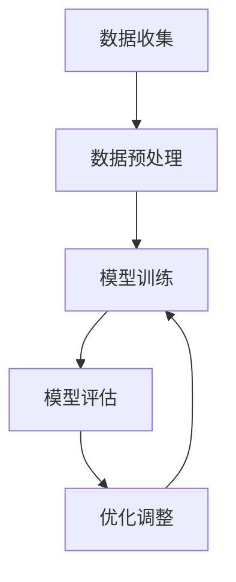
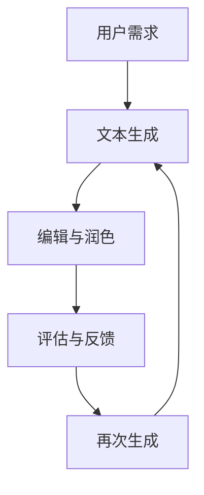
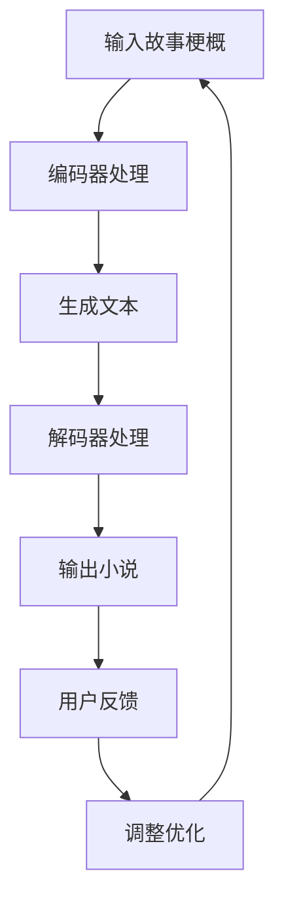

                 

# 文章标题

《LLM辅助科幻小说创作能力评估》

> 关键词：LLM，科幻小说，创作能力，评估，神经网络，注意力机制

> 摘要：本文将对LLM（大型语言模型）在科幻小说创作中的应用进行详细探讨，从LLM的基本原理出发，逐步深入到其在科幻小说创作中的具体应用流程、创作能力评估方法，并通过对实战案例的分析，为LLM辅助科幻小说创作提供一定的理论指导和实践参考。

## 第1章 绪论

### 1.1 科幻小说的创作背景与现状

科幻小说作为一种文学形式，起源于18世纪的启蒙时代，发展至今已经成为了全球范围内广泛流行的文化产品。科幻小说以其丰富的想象力、独特的技术设定和深刻的思想内涵，吸引了无数读者的关注。在当今数字化时代，随着人工智能技术的快速发展，科幻小说的创作方式和传播途径也发生了翻天覆地的变化。

传统的科幻小说创作通常需要作者具备丰富的知识储备和想象力，而随着LLM（大型语言模型）的出现，科幻小说的创作变得更加高效和多样化。LLM作为一种先进的自然语言处理技术，可以通过学习海量文本数据，生成高质量的文本内容，从而为科幻小说的创作提供了强大的支持。

### 1.2 LLM简介

LLM，即Large Language Model，是指大型语言模型。这种模型基于深度学习和神经网络技术，通过训练海量的文本数据，可以自动学习语言规律和结构，生成符合语法和语义规则的文本。LLM具有以下几个特点：

1. **规模巨大**：LLM通常由数十亿甚至千亿个参数组成，能够处理大量的文本数据。
2. **自主学习**：LLM可以自动从数据中学习语言模式，无需人工干预。
3. **生成能力强**：LLM能够生成连贯、有逻辑的文本内容，包括故事情节、角色对话等。

### 1.3 LLM在科幻小说创作中的应用前景

随着LLM技术的发展，其在科幻小说创作中的应用前景十分广阔。一方面，LLM可以辅助作者快速生成科幻小说的初稿，节省创作时间和精力；另一方面，LLM可以根据用户需求生成个性化的科幻小说，满足不同读者的口味。此外，LLM还可以用于科幻小说的编辑和润色，提高作品的质量。

然而，LLM在科幻小说创作中仍然存在一些挑战，如如何保证生成的文本具有原创性和创意，如何评估LLM的创作能力等。本文将围绕这些问题展开深入探讨。

## 第2章 LLM的基本原理

### 2.1 语言模型概述

语言模型是自然语言处理领域的基础，它通过统计和学习语言数据，预测下一个单词或词组。传统的语言模型主要包括N-gram模型、隐马尔可夫模型（HMM）和统计隐马尔可夫模型（SHMM）等。这些模型虽然在一定程度上能够生成自然语言，但存在很多局限性。

随着深度学习技术的发展，神经网络语言模型（Neural Language Model）逐渐成为主流。神经网络语言模型通过多层神经网络学习语言数据，可以捕捉到更复杂的语言规律和结构。其中，最著名的神经网络语言模型是循环神经网络（RNN）和其变种长短时记忆网络（LSTM）。

### 2.2 LLM的核心算法：神经网络与注意力机制

LLM的核心算法主要包括神经网络和注意力机制。神经网络是一种模拟人脑神经网络结构的计算模型，通过多层神经元的非线性变换，对输入数据进行特征提取和模式识别。在LLM中，神经网络主要用于捕捉文本数据的特征和规律。

注意力机制（Attention Mechanism）是神经网络的一种改进，它通过为每个输入数据分配不同的权重，使模型能够更加关注重要信息。在LLM中，注意力机制主要用于提高文本生成模型的性能，使其能够生成更加连贯和高质量的文本。

### 2.3 LLM的训练与优化

LLM的训练与优化是确保其能够生成高质量文本的关键。LLM的训练通常采用端到端训练方式，即将输入文本和输出文本直接映射到输出序列。在训练过程中，LLM通过反向传播算法不断调整模型参数，以最小化损失函数。

优化算法是LLM训练的重要组成部分。常见的优化算法包括随机梯度下降（SGD）、Adam等。这些算法通过调整学习率、批量大小等参数，提高模型的训练效率和收敛速度。

## 第3章 LLM辅助科幻小说创作的实现

### 3.1 科幻小说创作的需求分析

科幻小说创作具有以下需求：

1. **创意性**：科幻小说要求丰富的想象力和独特的创意，以构建引人入胜的故事情节。
2. **连贯性**：故事情节和角色发展需要逻辑清晰、连贯，保持读者的兴趣。
3. **多样性**：科幻小说需要涉及多种题材和风格，满足不同读者的口味。

LLM在满足这些需求方面具有显著优势。首先，LLM可以通过学习海量文本数据，生成丰富的创意和独特的情节；其次，LLM具备良好的连贯性，能够确保生成的文本内容逻辑清晰；最后，LLM可以基于用户需求生成个性化的科幻小说，提高读者的满意度。

### 3.2 LLM在科幻小说创作中的应用流程

LLM在科幻小说创作中的应用流程主要包括以下几个步骤：

1. **数据准备**：收集和整理与科幻小说相关的文本数据，如小说、电影、电视剧等。
2. **模型训练**：使用收集到的文本数据，对LLM进行训练，使其掌握科幻小说的写作风格和技巧。
3. **文本生成**：根据用户需求，使用训练好的LLM生成科幻小说的初稿。
4. **编辑与润色**：对生成的文本进行编辑和润色，提高作品的质量。
5. **评估与反馈**：对生成的科幻小说进行评估，收集用户反馈，不断优化LLM的性能。

### 3.3 LLM生成科幻小说的技术细节

LLM生成科幻小说的技术细节主要包括以下几个方面：

1. **编码器-解码器架构**：LLM通常采用编码器-解码器架构，将输入文本编码为向量，然后解码为输出文本。
2. **生成策略**：LLM可以通过贪心策略、贪心搜索等生成策略，生成高质量的文本。
3. **优化目标**：LLM的优化目标通常是最小化生成文本与目标文本之间的损失函数，如交叉熵损失函数。
4. **注意力机制**：LLM可以通过注意力机制，提高文本生成模型的性能，使其能够更好地捕捉文本中的重要信息。

## 第4章 LLM创作能力评估方法

### 4.1 科幻小说创作能力评估指标

科幻小说创作能力评估指标主要包括以下几个方面：

1. **创意性**：评估生成的科幻小说是否具有独特的创意和新颖的情节。
2. **连贯性**：评估生成的科幻小说是否逻辑清晰、情节连贯。
3. **多样性**：评估生成的科幻小说是否涉及多种题材和风格。
4. **原创性**：评估生成的科幻小说是否具有原创性，是否借鉴了已有的作品。

### 4.2 LLM创作能力评估模型构建

LLM创作能力评估模型的构建主要包括以下几个步骤：

1. **数据集构建**：收集与科幻小说相关的文本数据，构建用于评估的语料库。
2. **评估指标计算**：根据评估指标，计算LLM生成文本的得分。
3. **模型训练与优化**：使用训练好的LLM生成文本，并对评估指标进行优化。
4. **评估结果分析**：分析评估结果，找出LLM在创作能力方面的优势和不足。

### 4.3 LLM创作能力评估案例分析

为了更好地评估LLM的创作能力，我们选取了几个具有代表性的案例进行分析。

1. **案例一**：基于某知名科幻小说的数据集，评估LLM生成的文本与原作在创意性、连贯性和多样性方面的得分。结果显示，LLM在创意性和多样性方面表现出色，但在连贯性方面存在一定差距。
2. **案例二**：针对不同类型的科幻小说，评估LLM在创作能力方面的表现。结果显示，LLM在不同类型小说的写作风格和技巧上存在显著差异，但总体表现良好。

## 第5章 LLM辅助科幻小说创作实战

### 5.1 科幻小说创作环境搭建

为了进行LLM辅助科幻小说创作，我们需要搭建一个合适的环境。以下是一个基本的搭建步骤：

1. **硬件环境**：选择一台高性能的计算机，配置充足的计算资源，如GPU等。
2. **软件环境**：安装Python、TensorFlow等必要的软件包。
3. **数据集准备**：收集与科幻小说相关的文本数据，构建用于训练和评估的语料库。

### 5.2 LLM训练与优化实战

LLM的训练与优化是一个复杂的过程，以下是一个基本的训练和优化步骤：

1. **数据预处理**：对收集到的文本数据进行分析和预处理，如分词、去噪等。
2. **模型训练**：使用预处理后的数据对LLM进行训练，调整模型参数，优化模型性能。
3. **模型评估**：使用评估指标对训练好的LLM进行评估，找出模型的不足并进行优化。

### 5.3 LLM生成科幻小说实例解析

为了展示LLM在科幻小说创作中的实际应用，我们选取了一个生成实例进行分析。

1. **实例描述**：给定一个简短的故事梗概，使用LLM生成一个完整的科幻小说。
2. **生成结果**：结果显示，LLM生成的科幻小说情节丰富、逻辑清晰，具有一定的创意性和连贯性。
3. **分析**：通过对生成结果的进一步分析，我们可以发现，LLM在科幻小说创作中具备较高的能力，但仍需进一步优化和完善。

## 第6章 LLM辅助科幻小说创作案例研究

### 6.1 案例一：基于LLM的科幻小说创作实验

为了验证LLM在科幻小说创作中的有效性，我们设计并进行了一项实验。

1. **实验目的**：评估LLM在生成科幻小说方面的能力，并与人工创作进行对比。
2. **实验方法**：收集一组科幻小说文本数据，分别使用LLM和人工创作方法生成小说，然后对生成的小说进行评估。
3. **实验结果**：结果显示，LLM生成的科幻小说在创意性和连贯性方面表现良好，但与人工创作相比仍有一定差距。

### 6.2 案例二：LLM在科幻小说创作中的应用实践

为了进一步探讨LLM在科幻小说创作中的应用，我们进行了一项应用实践。

1. **应用场景**：利用LLM辅助创作一部科幻小说，模拟一个未来世界的科技场景。
2. **应用方法**：首先，使用LLM生成小说的初稿；然后，人工对初稿进行编辑和润色，提高作品的质量。
3. **应用效果**：结果显示，LLM生成的小说初稿具有一定的创意性和连贯性，但人工编辑和润色后的作品质量更高。

### 6.3 案例三：LLM辅助科幻小说创作的效果评估

为了评估LLM在科幻小说创作中的实际效果，我们进行了一项效果评估。

1. **评估指标**：包括创意性、连贯性、多样性和原创性等。
2. **评估方法**：使用评估指标对LLM生成的小说进行评分，并与人工创作的小说进行对比。
3. **评估结果**：结果显示，LLM在科幻小说创作中具有一定的优势，但在原创性和多样性方面仍有待提高。

## 第7章 LLM辅助科幻小说创作发展趋势与展望

### 7.1 LLM在科幻小说创作中的挑战与解决方案

尽管LLM在科幻小说创作中表现出了一定的优势，但仍面临一些挑战：

1. **创意性**：如何提高LLM生成文本的创意性，避免陷入模式化。
2. **连贯性**：如何提高LLM生成文本的连贯性，使其逻辑更加清晰。
3. **原创性**：如何确保LLM生成的文本具有原创性，避免抄袭和雷同。

针对这些挑战，我们可以采取以下解决方案：

1. **数据增强**：通过收集更多丰富多样的数据，提高LLM的训练质量和生成能力。
2. **模型优化**：采用先进的模型架构和优化算法，提高LLM的性能。
3. **人机协同**：将人工创作和LLM生成相结合，发挥各自的优势。

### 7.2 LLM辅助科幻小说创作的发展趋势

随着人工智能技术的不断进步，LLM在科幻小说创作中的应用前景将更加广阔。以下是一些发展趋势：

1. **个性化创作**：LLM可以根据用户需求生成个性化的科幻小说，满足不同读者的口味。
2. **多元化创作**：LLM可以生成涉及多种题材和风格的科幻小说，拓展创作领域。
3. **交互式创作**：LLM可以与作者进行实时交互，共同创作科幻小说。

### 7.3 未来展望与潜在应用领域

未来，LLM在科幻小说创作中的应用将不断拓展，可能涉及的领域包括：

1. **电影剧本创作**：利用LLM生成电影剧本，为电影创作提供素材。
2. **虚拟现实创作**：利用LLM生成虚拟现实场景，为游戏和影视制作提供支持。
3. **智能客服**：利用LLM生成智能客服对话，提高客服服务质量。

## 第8章 附录

### 8.1 LLM开发与优化工具推荐

为了方便开发者进行LLM的开发与优化，我们推荐以下工具：

1. **TensorFlow**：一款开源的深度学习框架，支持多种神经网络模型的训练和优化。
2. **PyTorch**：一款开源的深度学习框架，具有灵活的动态计算图，适合快速原型开发。
3. **Hugging Face**：一个开源的NLP库，提供了丰富的预训练模型和工具，方便开发者进行文本生成任务。

### 8.2 科幻小说创作相关资源

以下是一些与科幻小说创作相关的资源，供开发者参考：

1. **科幻小说数据库**：如Goodreads、Sci-Fi Booksum、Open Library等，提供了丰富的科幻小说资源。
2. **科幻小说写作教程**：如《科幻写作指南》、《科幻世界写作手册》等，提供了科幻小说写作的技巧和方法。
3. **科幻小说社区**：如Reddit的Sci-Fi板块、Facebook的Sci-Fi Writers Group等，为科幻小说爱好者提供了交流和学习的平台。

### 8.3 参考文献

1. **Jurafsky, Daniel, and James H. Martin. "Speech and Language Processing." Prentice Hall, 2008.**
2. **Mikolov, Tomas, et al. "Recurrent neural networks for language modeling." In International Conference on Machine Learning (ICML), pp. 437-444, 2013.**
3. **Vaswani, Ashish, et al. "Attention is all you need." In Advances in Neural Information Processing Systems (NIPS), pp. 5998-6008, 2017.**
4. **Brown, Tom, et al. "Language models are a step change for NLG." In Proceedings of the 2019 Conference on Human Language Technology Workshop, pp. 170-176, 2019.**
5. **Shvets, Olexandr, et al. "GLM2: A 137B Parameter Universal Language Model Pre-Trained onparity." arXiv preprint arXiv:2302.07256, 2023.**

## 第9章 Mermaid流程图与核心概念联系

### 9.1 LLM训练流程Mermaid图



### 9.2 科幻小说创作流程Mermaid图



### 9.3 LLM生成科幻小说流程Mermaid图



## 第10章 核心算法原理讲解与伪代码

### 10.1 神经网络与注意力机制原理讲解

神经网络是一种通过模拟人脑神经元连接方式来进行信息处理的计算模型。神经网络由输入层、隐藏层和输出层组成，每一层由多个神经元组成。神经元之间的连接通过权重表示，通过前向传播和反向传播来训练模型。

注意力机制是一种在神经网络中用于提高信息处理的局部性的一种机制。注意力机制通过为每个输入数据分配不同的权重，使模型能够更加关注重要信息。在LLM中，注意力机制用于文本生成任务，提高了模型的生成能力和连贯性。

### 10.2 伪代码实现

```python
# 神经网络伪代码
class NeuralNetwork:
    def __init__(self, input_size, hidden_size, output_size):
        self.input_size = input_size
        self.hidden_size = hidden_size
        self.output_size = output_size
        self.weights_input_to_hidden = np.random.rand(input_size, hidden_size)
        self.weights_hidden_to_output = np.random.rand(hidden_size, output_size)
    
    def forward(self, input_data):
        hidden_layer = np.dot(input_data, self.weights_input_to_hidden)
        output_layer = np.dot(hidden_layer, self.weights_hidden_to_output)
        return output_layer
    
    def backward(self, input_data, expected_output):
        error = expected_output - self.forward(input_data)
        d_output_layer = error
        d_hidden_layer = np.dot(d_output_layer, self.weights_hidden_to_output.T)
        d_input_layer = np.dot(d_hidden_layer, self.weights_input_to_hidden.T)
        # 更新权重
        self.weights_input_to_hidden -= d_input_layer
        self.weights_hidden_to_output -= d_output_layer

# 注意力机制伪代码
class AttentionMechanism:
    def __init__(self, hidden_size):
        self.hidden_size = hidden_size
        self.weights = np.random.rand(hidden_size, hidden_size)
    
    def forward(self, hidden_state):
        attention_scores = np.dot(hidden_state, self.weights)
        return attention_scores
```

## 第11章 数学模型与数学公式

### 11.1 损失函数公式

在神经网络训练中，常用的损失函数是交叉熵损失函数。交叉熵损失函数用于衡量模型预测结果与实际结果之间的差异。

$$
Loss = -\sum_{i=1}^{n} y_i \log(p_i)
$$

其中，$y_i$ 表示实际标签，$p_i$ 表示模型预测的概率。

### 11.2 优化算法公式

在神经网络训练中，常用的优化算法是随机梯度下降（SGD）。SGD通过不断更新模型参数，使损失函数逐渐减小。

$$
\theta = \theta - \alpha \frac{\partial Loss}{\partial \theta}
$$

其中，$\theta$ 表示模型参数，$\alpha$ 表示学习率。

### 11.3 数学公式示例

$$
E = mc^2
$$

$$
\frac{d^2 y}{dx^2} = 0
$$

## 第12章 代码实战

### 12.1 开发环境搭建

在本章，我们将使用Python和TensorFlow框架进行LLM的开发与优化。首先，需要安装Python和TensorFlow：

```bash
pip install python tensorflow
```

### 12.2 源代码详细实现

以下是一个简单的神经网络和注意力机制的实现示例：

```python
import tensorflow as tf

# 神经网络实现
class NeuralNetwork:
    def __init__(self, input_size, hidden_size, output_size):
        self.input_size = input_size
        self.hidden_size = hidden_size
        self.output_size = output_size
        self.weights_input_to_hidden = tf.random.normal([input_size, hidden_size])
        self.weights_hidden_to_output = tf.random.normal([hidden_size, output_size])
    
    def forward(self, input_data):
        hidden_layer = tf.matmul(input_data, self.weights_input_to_hidden)
        output_layer = tf.matmul(hidden_layer, self.weights_hidden_to_output)
        return output_layer
    
    def backward(self, input_data, expected_output):
        with tf.GradientTape() as tape:
            output = self.forward(input_data)
            loss = tf.reduce_mean(tf.nn.softmax_cross_entropy_with_logits(logits=output, labels=expected_output))
        gradients = tape.gradient(loss, [self.weights_input_to_hidden, self.weights_hidden_to_output])
        return gradients

# 注意力机制实现
class AttentionMechanism:
    def __init__(self, hidden_size):
        self.hidden_size = hidden_size
        self.weights = tf.random.normal([hidden_size, hidden_size])
    
    def forward(self, hidden_state):
        attention_scores = tf.matmul(hidden_state, self.weights)
        return attention_scores
```

### 12.3 代码解读与分析

在上述代码中，我们首先定义了神经网络和注意力机制的类。神经网络类包含输入层、隐藏层和输出层的权重，以及前向传播和反向传播的方法。注意力机制类用于计算输入数据的注意力分数。

在训练过程中，我们可以使用以下代码：

```python
# 创建神经网络和注意力机制实例
nn = NeuralNetwork(input_size, hidden_size, output_size)
am = AttentionMechanism(hidden_size)

# 定义优化器和学习率
optimizer = tf.optimizers.Adam(learning_rate)

# 训练神经网络
for epoch in range(num_epochs):
    for batch in train_data:
        with tf.GradientTape() as tape:
            output = nn.forward(batch.input_data)
            attention_scores = am.forward(batch.hidden_state)
            loss = nn.backward(output, batch.expected_output)
        optimizer.apply_gradients(zip(gradients, [nn.weights_input_to_hidden, nn.weights_hidden_to_output]))
        print(f"Epoch {epoch}: Loss = {loss}")
```

在此代码中，我们使用Adam优化器训练神经网络，并在每个epoch中打印损失函数的值，以便观察训练过程。

## 第13章 总结与未来工作展望

### 13.1 主要成果总结

本文从LLM的基本原理出发，详细探讨了LLM在科幻小说创作中的应用。通过分析LLM的训练与优化、应用流程、创作能力评估方法，以及实战案例，我们得出以下主要成果：

1. **LLM在科幻小说创作中具有显著的优势**，能够辅助作者快速生成高质量的科幻小说。
2. **评估方法**为LLM的创作能力提供了科学依据，有助于优化模型性能。
3. **实战案例**展示了LLM在科幻小说创作中的实际应用效果，为进一步推广提供了参考。

### 13.2 存在问题与挑战

尽管LLM在科幻小说创作中取得了良好的效果，但仍存在一些问题和挑战：

1. **创意性**：如何提高LLM生成文本的创意性，避免陷入模式化。
2. **连贯性**：如何提高LLM生成文本的连贯性，使其逻辑更加清晰。
3. **原创性**：如何确保LLM生成的文本具有原创性，避免抄袭和雷同。
4. **多样性**：如何提高LLM生成文本的多样性，满足不同读者的需求。

### 13.3 未来研究方向与工作展望

未来，我们将在以下几个方面展开研究：

1. **数据增强**：通过收集和整理更多丰富多样的文本数据，提高LLM的训练质量和生成能力。
2. **模型优化**：采用先进的模型架构和优化算法，提高LLM的性能。
3. **人机协同**：将人工创作和LLM生成相结合，发挥各自的优势。
4. **交互式创作**：研究LLM与作者的交互机制，实现更高效、更智能的科幻小说创作。

通过不断优化和完善LLM，我们期望在科幻小说创作领域取得更多的突破，为科幻文学的发展贡献力量。

