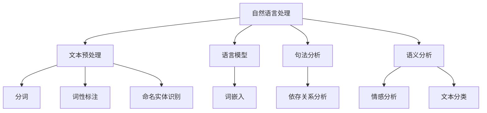

                 

### 《NLP技术在提示词优化中的前沿应用》

#### 关键词：自然语言处理（NLP）、提示词优化、深度学习、Transformer、BERT、机器学习、规则引擎

#### 摘要：本文将深入探讨自然语言处理（NLP）技术在提示词优化中的应用。首先，我们将回顾NLP的基础知识，包括核心概念和技术架构。接着，我们将详细分析提示词优化的方法，从基于规则的方法、机器学习方法到深度学习方法，逐一介绍。文章还将通过实际案例研究和未来发展趋势，展示NLP在提示词优化中的实际应用和价值。最后，我们将提供实战指南、开源工具推荐和拓展阅读资源，帮助读者进一步学习和实践。

## 文章标题：NLP技术在提示词优化中的前沿应用

### 《NLP技术在提示词优化中的前沿应用》

本文旨在深入探讨自然语言处理（NLP）技术在提示词优化中的前沿应用。随着人工智能技术的快速发展，NLP已经成为自然语言理解和生成的重要工具。在众多NLP应用场景中，提示词优化扮演着至关重要的角色，它涉及到如何让机器更好地理解和响应人类的语言指令。

本文将按照以下结构进行阐述：

1. **NLP技术概述**：首先，我们将简要回顾NLP的基础知识，包括其定义、历史发展、核心概念和关键技术。
2. **提示词优化方法**：接着，我们将详细讨论提示词优化方法，包括基于规则的方法、机器学习方法和深度学习方法。
3. **综合应用与案例研究**：然后，我们将通过实际案例研究，展示NLP技术在提示词优化中的应用实例。
4. **实践与拓展**：最后，我们将提供实战指南、开源工具推荐和拓展阅读资源，帮助读者进一步学习和实践。

通过本文的探讨，我们希望读者能够全面了解NLP技术在提示词优化中的应用现状和未来发展趋势，从而更好地应用于实际项目中。

### 第一部分：NLP技术概述

#### 第1章：自然语言处理（NLP）基础知识

#### 1.1 NLP的定义与历史

自然语言处理（NLP）是计算机科学和人工智能的一个分支，旨在使计算机能够理解、生成和处理人类自然语言。这一领域的起源可以追溯到20世纪50年代，当时计算机科学家和语言学家开始探索如何使计算机模拟人类的语言理解能力。

NLP的发展历程可以分为几个重要阶段：

1. **规则驱动的NLP（1950s-1980s）**：早期的研究主要集中在开发基于规则的系统，这些系统通过定义复杂的语法和语义规则来处理语言。然而，这种方法很快遇到了瓶颈，因为自然语言非常复杂，难以用有限的规则进行准确描述。

2. **基于知识的NLP（1980s-1990s）**：随着知识表示和推理技术的发展，研究者开始将大量的领域知识集成到NLP系统中。这种方法虽然取得了一定的成功，但仍然存在知识获取和更新困难的问题。

3. **基于统计的NLP（1990s-2000s）**：随着机器学习技术的发展，统计方法成为NLP的主要研究方向。这种方法通过学习大量文本数据中的模式来提高系统的性能，取得了显著的进展。

4. **基于深度学习的NLP（2010s至今）**：深度学习技术的引入，使得NLP取得了突破性的进展。深度学习模型，如循环神经网络（RNN）、长短时记忆网络（LSTM）和Transformer，能够自动学习语言的复杂结构，大大提升了NLP系统的性能。

#### 1.2 NLP的核心概念

NLP涉及多个核心概念，这些概念构成了NLP技术的基础：

1. **语言模型**：语言模型是一种概率模型，用于预测下一个单词或词组。它是NLP中最重要的组件之一，广泛应用于自动纠错、机器翻译、文本生成等领域。

2. **词嵌入**：词嵌入是将词汇映射到高维向量空间的方法。通过词嵌入，我们可以利用向量空间中的相似性来理解和处理语言。词嵌入技术，如Word2Vec和GloVe，已经在NLP中得到了广泛应用。

3. **语义分析**：语义分析是NLP的一个关键任务，旨在理解文本的含义和上下文。它包括词义消歧、实体识别、关系提取等子任务，对于构建智能问答系统、文本摘要和机器翻译等应用至关重要。

#### 1.3 NLP的关键技术

NLP的关键技术包括以下几个方面：

1. **分词与词性标注**：分词是将连续的文本分割成单个词汇的过程，而词性标注则是为每个词分配一个词性（如名词、动词等）。这些技术是NLP的基础，对于后续的语言处理任务至关重要。

2. **句法分析**：句法分析是一种理解句子结构的技术，它包括句法树的构建、依赖关系的分析等。句法分析有助于理解句子的语法规则，为语义分析和文本生成提供支持。

3. **情感分析**：情感分析是一种评估文本情感极性的技术，它通常通过分类模型来实现。情感分析在市场研究、社交媒体分析和用户反馈处理等领域具有重要应用。

4. **文本分类**：文本分类是将文本分配到预定义类别的一种任务。它广泛应用于垃圾邮件过滤、新闻分类和情感分析等领域。

#### 第2章：NLP技术架构

#### 2.1 传统NLP与深度学习NLP比较

在NLP的发展历程中，传统方法和深度学习方法代表了两个不同的阶段。传统NLP主要依赖于规则和基于知识的系统，而深度学习方法则通过学习大量数据来自动提取特征和模式。

**传统NLP方法**：

1. **基于规则的方法**：这种方法通过定义一系列规则来处理语言。例如，在句法分析中，可以通过语法规则将句子分解成短语结构。

2. **基于知识的系统**：这些系统通过集成领域知识库来处理语言。例如，在命名实体识别中，可以使用预定义的命名实体列表来识别文本中的特定实体。

**深度学习在NLP中的应用**：

1. **循环神经网络（RNN）**：RNN是一种能够处理序列数据的神经网络，它在NLP中被广泛用于语言建模、句法分析和机器翻译等任务。

2. **长短时记忆网络（LSTM）**：LSTM是RNN的一种变体，它通过引入门控机制来克服RNN的长期依赖问题，在许多NLP任务中都取得了很好的效果。

3. **门控循环单元（GRU）**：GRU是另一种RNN变体，它在LSTM的基础上进一步简化了结构，同时保持了良好的性能。

4. **卷积神经网络（CNN）**：CNN最初主要用于图像处理，但后来也被应用于NLP领域，特别是在文本分类和情感分析中。

**递归神经网络与自注意力机制**：

递归神经网络（RNN）和自注意力机制（Self-Attention）是当前NLP领域的两个重要概念。

1. **RNN**：RNN是一种能够处理序列数据的神经网络，它在每个时间步上使用前一个时间步的输出作为输入。然而，传统的RNN存在长期依赖问题，即难以学习远距离的依赖关系。

2. **自注意力机制**：自注意力机制是一种通过计算序列中每个词与其他词的权重来处理序列数据的方法。它通过引入注意力机制，使得模型能够自动关注序列中的关键部分，从而提高了模型在NLP任务中的性能。

**Transformer模型详解**：

Transformer是近年来在NLP领域中取得巨大成功的模型，它基于自注意力机制，取代了传统的RNN和LSTM。

1. **模型结构**：Transformer由多个编码层和解码层组成，每个层都包含多头自注意力机制和前馈神经网络。

2. **多头自注意力机制**：多头自注意力机制通过将输入序列分成多个头，每个头独立计算注意力权重，从而提高了模型的表示能力。

3. **位置编码**：由于自注意力机制无法显式地考虑输入序列的位置信息，因此Transformer引入了位置编码来编码输入序列的位置信息。

4. **预训练与微调**：Transformer模型通常通过大规模预训练获得良好的基础，然后通过微调适应特定任务。

Transformer模型的引入，使得NLP领域取得了许多突破性的进展，包括机器翻译、文本生成和问答系统等。它不仅提高了NLP任务的性能，还为其他领域（如计算机视觉和语音识别）提供了新的思路。

通过本章节的介绍，我们希望读者能够对NLP技术有一个全面的了解，为后续章节的深入学习打下基础。

#### 第3章：提示词优化基础

#### 3.1 提示词的定义与作用

提示词（Prompt）在自然语言处理（NLP）中扮演着重要的角色。它们是用户与系统交互的关键要素，用于引导系统的理解和响应。提示词通常是一段简短的文字描述，用于向系统提出问题或指令。

**提示词的类型**：

1. **明确提示词**：这类提示词具体明确，可以直接引导系统执行特定任务。例如，“请翻译这篇文章成中文”。
2. **模糊提示词**：这类提示词较为宽泛，需要系统进行推理和解析。例如，“给我讲一个有趣的故事”。
3. **多模态提示词**：这类提示词结合了文本、图像、声音等多种模态，用于更丰富地引导系统。例如，“展示一张海滩的图片，并给我描述一下”。

**提示词在NLP中的应用场景**：

1. **问答系统**：提示词用于提出问题，系统根据问题提供相应的答案。
2. **对话系统**：提示词用于引导对话流程，系统根据提示词生成回应，与用户进行交互。
3. **文本生成**：提示词用于指定文本生成的主题或风格，系统根据提示生成相应的文本。
4. **机器翻译**：提示词用于指示翻译的方向和上下文，系统根据提示生成翻译结果。

#### 3.2 提示词优化的目标

提示词优化是提升NLP系统性能的重要手段，其目标主要包括以下几个方面：

1. **提高响应准确性**：优化后的提示词应能够更准确地传达用户的意图，减少误解和歧义。
2. **提高响应效率**：优化后的提示词应能够加速系统的响应速度，提高整体交互效率。
3. **提高用户体验**：优化后的提示词应能够提高用户的满意度和参与度，增强系统与用户的互动。

**提示词优化的策略**：

1. **基于规则的方法**：通过定义明确的规则来生成和优化提示词，适用于规则明确、场景固定的应用。
2. **基于机器学习的方法**：通过训练机器学习模型来自动优化提示词，适用于复杂多变的场景。
3. **基于深度学习的方法**：利用深度学习模型，如Transformer和BERT，进行提示词的自动优化和生成，适用于大规模和高复杂度的NLP应用。

通过以上策略，我们可以有效地优化提示词，提高NLP系统的性能和用户体验。接下来的章节将详细讨论这些方法。

#### 第4章：基于规则的方法

#### 4.1 基于规则的方法概述

基于规则的方法在自然语言处理（NLP）中的应用历史悠久，且至今仍具有一定的实用价值。这种方法通过定义一系列明确、具体的规则来处理语言，从而实现提示词的生成和优化。

**规则的定义**：

规则是一组条件语句，用于描述特定情况下应执行的操作。在NLP中，规则通常由前提（条件）和结论（操作）两部分组成。例如，一个简单的规则可以是：“如果用户提问关于天气的信息，那么回复最新的天气状况”。

**规则系统的设计**：

1. **规则库构建**：首先，需要构建一个包含各种语言场景和任务的规则库。这可以通过手动编写或自动提取现有数据中的规则来实现。
2. **规则引擎实现**：规则引擎是负责解释和执行规则的核心组件。常见的规则引擎有Drools和Jess等。这些引擎提供了丰富的功能，如规则解释、规则匹配和规则执行等。
3. **规则优化**：在规则系统运行过程中，可以根据实际反馈对规则进行优化和调整，以提高系统的性能和准确性。

**基于规则的系统在实际应用中的优点**：

1. **明确性**：基于规则的系统通过明确的规则来处理语言，使得语言处理过程更加直观和可控。
2. **可解释性**：规则的透明性使得系统的工作原理容易理解和解释，有助于问题的调试和优化。
3. **适用性**：对于规则明确、场景固定的应用，基于规则的方法能够提供高效、精确的解决方案。

**基于规则的系统在实际应用中的挑战**：

1. **规则复杂度**：随着应用场景的复杂化，规则库的规模会迅速扩大，导致系统的复杂度和维护成本增加。
2. **规则更新困难**：语言环境不断变化，现有规则可能无法适应新的语言现象，需要定期更新和调整。
3. **灵活性不足**：基于规则的方法在面对复杂、不确定的语言场景时，表现出的灵活性较差，难以处理模糊性和不确定性。

尽管存在一定挑战，基于规则的方法在NLP中仍然具有重要的应用价值，特别是在规则明确、需求稳定的场景中。接下来，我们将详细介绍一些常见的规则引擎，并探讨如何利用语言模型辅助规则生成。

#### 4.2 常见的规则引擎

在基于规则的方法中，规则引擎是核心组件，负责解析、匹配和执行规则。以下将介绍几种常见的规则引擎，包括Drools和Jess。

**Drools**：

Drools是一个开源的业务规则管理系统，广泛应用于企业级应用。Drools的特点包括：

1. **强大且灵活的规则表达式**：Drools支持丰富的规则表达式，可以处理复杂的逻辑和条件。
2. **高效的规则执行引擎**：Drools采用基于数据的规则执行机制，能够高效地执行大规模规则集。
3. **易于集成**：Drools可以与各种后端系统集成，如数据库、消息队列和Web服务。

使用Drools进行规则开发的一般步骤如下：

1. **定义规则库**：通过Drools的DSL（领域特定语言）定义规则库，包括条件、结论和操作。
2. **构建规则引擎**：使用Drools提供的API构建和配置规则引擎。
3. **执行规则**：在应用程序中调用规则引擎，执行预定义的规则。

**Jess**：

Jess是一个开源的Java规则引擎，以其简洁和易用性著称。Jess的特点包括：

1. **简单的语法**：Jess采用简单的语法结构，易于学习和使用。
2. **高效的执行**：Jess采用基于内存的规则执行机制，具有高效的执行性能。
3. **灵活性**：Jess提供了丰富的扩展接口，可以灵活地定制和优化规则引擎。

使用Jess进行规则开发的一般步骤如下：

1. **定义规则**：使用Jess的规则语言定义规则，包括前提和结论。
2. **创建Facts**：创建包含实际数据的Facts对象，用于与规则进行交互。
3. **执行规则**：调用Jess的API执行规则，处理Facts对象。

**规则生成方法**：

在实际应用中，基于规则的系统需要根据具体场景生成合适的规则。以下是一些常用的规则生成方法：

1. **手动编写**：通过专家知识和经验，手动编写规则。
2. **自动提取**：从已有数据中自动提取规则，如使用机器学习模型对数据进行分析和分类。
3. **语言模型辅助**：利用语言模型（如BERT、GPT）生成规则，通过预训练的模型自动提取规则模板和条件。

**案例**：

假设我们要开发一个智能客服系统，以下是一个简单的规则示例：

```rules
定义：询问天气
条件：用户输入包含"天气"或"天气预报"的关键词
结论：执行天气查询操作，返回最新的天气信息
```

通过规则引擎，我们可以根据用户的输入自动匹配和执行相应的规则，从而实现智能客服的功能。

通过以上介绍，我们可以看到基于规则的方法在NLP中具有重要的应用价值，同时通过常见规则引擎的使用和规则生成方法，可以有效地优化提示词，提高系统的性能和用户体验。

#### 4.3 基于数据的规则提取

在自然语言处理（NLP）中，基于数据的规则提取方法是一种从大量文本数据中自动生成规则的技术。这种方法能够提高系统的灵活性和适应性，特别适用于动态变化的语言环境。以下将介绍几种常用的基于数据的规则提取方法，包括基于统计方法和基于机器学习方法。

**基于统计的方法**：

1. **隐马尔可夫模型（HMM）**：隐马尔可夫模型是一种基于概率的序列模型，适用于对文本序列进行建模。通过训练HMM模型，可以从数据中自动提取出语言模式，并用于生成规则。

2. **条件概率模型**：条件概率模型通过计算不同条件下的概率分布来生成规则。例如，在文本分类任务中，可以使用朴素贝叶斯模型计算每个类别在给定特征条件下的概率，并据此生成分类规则。

3. **决策树和随机森林**：决策树和随机森林是一种基于树结构的分类模型，可以通过训练数据集生成分类规则。这些模型能够将文本特征映射到预定义的类别，从而实现规则提取。

**基于机器学习方法**：

1. **监督学习**：监督学习通过标注数据训练分类模型，从而生成规则。常用的算法包括逻辑回归、支持向量机（SVM）和神经网络。这些模型可以从特征向量中提取模式，并用于生成规则。

2. **半监督学习和无监督学习**：半监督学习和无监督学习通过少量标注数据或未标注数据训练模型，从而生成规则。例如，聚类算法和隐马尔可夫模型可以用于发现数据中的隐含模式，并据此生成规则。

**应用示例**：

假设我们有一个客服对话数据集，其中包含了用户提问和客服回应的对话记录。我们希望从这些对话中自动提取出规则，用于生成智能客服系统中的提示词。

1. **预处理数据**：首先，对对话文本进行分词和词性标注，提取关键信息和特征。

2. **特征工程**：根据对话文本的特点，设计合适的特征，如关键词、词性、句法结构等。

3. **训练分类模型**：使用标注数据进行监督学习，训练分类模型（如朴素贝叶斯、SVM等），从而生成初步的规则。

4. **规则优化**：根据模型预测结果，对规则进行优化和调整，以提高系统的性能和准确性。

5. **规则应用**：将训练好的规则应用于新的对话数据，生成智能客服系统的提示词。

通过以上步骤，我们可以从大量对话数据中自动提取出有效的规则，用于优化提示词生成，提高智能客服系统的性能和用户体验。

基于数据的规则提取方法具有以下优点：

1. **灵活性**：能够自动适应语言环境的变化，生成动态变化的规则。
2. **高效性**：通过机器学习算法，能够快速处理大量数据，提高系统响应速度。
3. **准确性**：通过训练模型，能够从数据中提取出高精度的规则，提高系统的准确性和可靠性。

然而，基于数据的规则提取方法也存在一定的挑战，如数据质量和特征选择等问题。通过不断优化和改进，我们可以进一步提高基于数据规则提取方法的性能和应用效果。

#### 第5章：基于机器学习的方法

#### 5.1 机器学习方法概述

机器学习方法在自然语言处理（NLP）中发挥着至关重要的作用。与基于规则的方法不同，机器学习方法通过学习大量数据中的模式和规律，来自动生成和优化提示词。以下将概述几种常用的机器学习方法，包括监督学习、无监督学习和半监督学习。

**监督学习**：

监督学习是一种有监督的训练方法，通过标注数据集来训练模型，从而实现提示词的优化。在监督学习中，每个输入样本都有一个对应的标签，模型的目标是学习输入和输出之间的映射关系。常见的监督学习算法包括逻辑回归、支持向量机（SVM）、决策树、随机森林和神经网络等。

**无监督学习**：

无监督学习是一种无监督的训练方法，无需标注数据集，通过发现数据中的模式和结构来优化提示词。无监督学习方法主要包括聚类、降维和生成模型等。例如，K-means聚类可以将文本数据划分为不同的簇，从而发现文本的潜在分布。降维方法（如主成分分析PCA）可以减少文本数据的维度，同时保持重要的信息。生成模型（如变分自编码器VAE和生成对抗网络GAN）可以生成新的文本数据，从而优化提示词的生成。

**半监督学习**：

半监督学习是一种介于监督学习和无监督学习之间的训练方法，通过结合少量标注数据和大量未标注数据来训练模型，从而优化提示词。半监督学习能够提高模型的泛化能力，特别是在数据标注成本较高的情况下具有显著优势。常见的半监督学习算法包括自我训练、伪标签和联合训练等。

**应用示例**：

假设我们有一个对话数据集，其中包含了用户提问和系统回答的对话记录。我们希望利用机器学习方法来优化提示词生成。

1. **数据预处理**：对对话文本进行分词、词性标注和向量表示，提取关键信息和特征。

2. **特征工程**：根据对话文本的特点，设计合适的特征，如关键词、词性、句法结构等。

3. **训练模型**：

   - **监督学习**：使用标注数据进行监督学习，训练分类模型（如朴素贝叶斯、SVM等），从而生成初步的提示词规则。

   - **无监督学习**：使用未标注数据进行无监督学习，如聚类算法（如K-means）和降维方法（如PCA），发现文本数据的潜在分布和结构。

   - **半监督学习**：结合少量标注数据和大量未标注数据，使用半监督学习算法（如自我训练和伪标签）来优化提示词生成。

4. **模型评估**：使用测试集对训练好的模型进行评估，调整模型参数和特征工程策略，以提高模型的性能。

5. **提示词生成**：将训练好的模型应用于新的对话数据，生成智能客服系统的提示词。

通过以上步骤，我们可以利用机器学习方法有效地优化提示词生成，提高智能客服系统的性能和用户体验。

#### 5.2 提示词优化模型

在NLP中，提示词优化模型是用于生成和优化提示词的关键组件。根据任务和数据的不同，提示词优化模型可以分为基于传统机器学习的方法和基于深度学习的方法。

**基于传统机器学习的方法**：

1. **特征工程**：传统机器学习方法通常需要手动设计特征，如词频、词性、句法结构等。这些特征可以帮助模型更好地理解文本数据。
2. **分类模型**：常用的分类模型包括逻辑回归、支持向量机（SVM）、决策树和随机森林等。这些模型可以通过训练数据集学习输入和输出之间的映射关系，从而生成提示词。
3. **模型评估与优化**：使用交叉验证和测试集对模型进行评估和优化，调整模型参数和特征工程策略，以提高模型的性能。

**基于深度学习的方法**：

1. **预训练模型**：深度学习模型通常在大规模语料库上进行预训练，从而学习通用语言特征。例如，BERT、GPT和RoBERTa等模型都是经过大规模预训练的深度学习模型。
2. **特征提取**：预训练模型可以将文本数据转换为高维向量表示，这些向量表示包含了丰富的语义信息，可以用于提示词生成。
3. **生成模型**：生成模型（如变分自编码器VAE和生成对抗网络GAN）可以学习数据的概率分布，从而生成新的文本数据。这些模型可以用于生成多样化的提示词。

**模型训练方法**：

1. **监督学习**：在监督学习设置中，模型通过训练数据学习输入和输出之间的映射关系。训练过程包括前向传播、反向传播和梯度下降等步骤。
2. **无监督学习**：无监督学习通过未标注数据学习数据的潜在分布。常见的无监督学习方法包括自编码器和聚类算法。
3. **半监督学习**：半监督学习结合少量标注数据和大量未标注数据，利用未标注数据提高模型的泛化能力。

**特征工程**：

特征工程是机器学习模型的关键步骤，它涉及到从原始数据中提取有助于模型学习的特征。以下是一些常用的特征：

1. **词嵌入**：词嵌入是将词汇映射到高维向量空间的方法。通过词嵌入，模型可以学习词汇之间的语义关系。
2. **句法特征**：句法特征包括词性标注、句法树和依存关系等。这些特征有助于模型理解句子的结构。
3. **语义特征**：语义特征包括情感极性、命名实体和语义角色等。这些特征可以帮助模型理解文本的含义和上下文。
4. **上下文特征**：上下文特征包括词在句子中的位置、周围词汇和句法关系等。这些特征有助于模型捕捉词汇的上下文信息。

**模型选择与调优**：

在选择和调优模型时，需要考虑以下几个方面：

1. **模型类型**：选择合适的模型类型，如传统机器学习模型或深度学习模型。
2. **数据集**：使用合适的数据集进行训练和测试，确保模型能够泛化到新的数据。
3. **特征选择**：根据任务需求，选择和优化特征，以提高模型的性能。
4. **模型参数**：调整模型参数，如学习率、正则化和优化算法等，以优化模型的性能。

通过以上步骤，我们可以构建和优化提示词优化模型，从而提高NLP系统的性能和用户体验。

#### 第6章：基于深度学习的方法

#### 6.1 基于深度学习的方法概述

随着深度学习技术的发展，NLP领域迎来了新的机遇。基于深度学习的方法在处理自然语言任务方面表现出色，特别是在提示词优化中，深度学习模型展现了强大的潜力。以下将概述深度学习在NLP中的应用，以及如何在提示词优化中利用这些模型。

**深度学习的基础知识**：

深度学习是一种基于多层神经网络的结构，通过逐层学习数据中的特征，从而实现复杂任务的自动识别和预测。在NLP中，深度学习模型可以处理文本的语义信息，捕捉词汇之间的关系，从而提高提示词优化的效果。

**深度学习在NLP中的应用**：

1. **语言建模**：语言建模是NLP的核心任务之一，旨在预测下一个词或词组。深度学习模型（如循环神经网络RNN、长短时记忆网络LSTM和门控循环单元GRU）在语言建模任务中取得了显著的进展。
2. **文本分类**：文本分类是将文本数据分配到预定义类别的一种任务。深度学习模型（如卷积神经网络CNN和循环神经网络RNN）在文本分类任务中表现出色，能够处理复杂的文本特征。
3. **序列标注**：序列标注是一种对文本中的每个词进行标签分类的任务，如词性标注、命名实体识别和情感分析。深度学习模型（如双向LSTM和Transformer）在序列标注任务中展现了强大的性能。
4. **机器翻译**：机器翻译是NLP中的重要应用领域，深度学习模型（如序列到序列模型和注意力机制）在机器翻译任务中取得了突破性进展，显著提高了翻译质量。

**提示词优化的深度学习方法**：

在提示词优化中，深度学习模型通过学习大量的文本数据，自动提取词汇的语义信息，从而生成高质量的提示词。以下将介绍几种常见的深度学习模型及其在提示词优化中的应用。

1. **循环神经网络（RNN）**：RNN是一种处理序列数据的神经网络，通过记忆单元来捕捉序列中的长期依赖关系。RNN在语言建模和序列标注任务中得到了广泛应用，可以用于生成和优化提示词。

2. **长短时记忆网络（LSTM）**：LSTM是RNN的一种变体，通过引入门控机制来克服RNN的长期依赖问题。LSTM在许多NLP任务中表现优异，如文本分类、机器翻译和提示词优化。

3. **门控循环单元（GRU）**：GRU是另一种RNN变体，它在LSTM的基础上进一步简化了结构，同时保持了良好的性能。GRU在序列建模任务中得到了广泛应用，可以用于提示词优化。

4. **卷积神经网络（CNN）**：CNN最初主要用于图像处理，但后来也被应用于NLP领域。CNN通过卷积操作提取文本中的局部特征，适用于文本分类和情感分析等任务，也可以用于提示词优化。

5. **Transformer模型**：Transformer是近年来在NLP领域取得巨大成功的模型，它基于自注意力机制，取代了传统的RNN和LSTM。Transformer通过计算序列中每个词与其他词的权重来处理序列数据，具有强大的表示能力和并行计算能力，适用于各种NLP任务，包括提示词优化。

**应用示例**：

假设我们有一个智能客服系统，需要优化系统中的提示词生成。以下是一个基于深度学习的提示词优化应用示例：

1. **数据准备**：收集大量的客服对话记录，并对对话文本进行预处理，如分词、词性标注和向量表示。

2. **模型训练**：使用预训练的深度学习模型（如BERT或GPT），对对话文本进行训练，提取词汇的语义信息。

3. **提示词生成**：在训练好的模型基础上，生成高质量的提示词。例如，对于用户的提问“最近有哪些热门商品？”，系统可以生成相应的提示词：“最新热门商品推荐”。

4. **模型评估**：使用测试集对训练好的模型进行评估，调整模型参数和特征工程策略，以提高模型的性能。

通过以上步骤，我们可以利用深度学习模型有效地优化提示词生成，提高智能客服系统的性能和用户体验。

#### 6.2 基于Transformer的方法

Transformer模型是近年来在自然语言处理（NLP）领域取得巨大成功的深度学习模型。它基于自注意力机制，取代了传统的循环神经网络（RNN）和长短时记忆网络（LSTM），在许多NLP任务中（如语言建模、机器翻译和文本生成）表现出了优异的性能。

**Transformer模型介绍**：

Transformer模型由多个编码层和解码层组成，每个层都包含多头自注意力机制和前馈神经网络。自注意力机制通过计算序列中每个词与其他词的权重，使得模型能够自动关注序列中的关键部分，从而提高了模型的表示能力。

1. **多头自注意力机制**：多头自注意力机制将输入序列分成多个头，每个头独立计算注意力权重。这种方法提高了模型的并行计算能力，并增强了模型的表示能力。
2. **位置编码**：由于自注意力机制无法显式地考虑输入序列的位置信息，因此Transformer引入了位置编码来编码输入序列的位置信息。位置编码通常通过正弦和余弦函数生成，与输入嵌入向量相加，从而嵌入位置信息。
3. **编码层和解码层**：编码层和解码层分别对输入序列和目标序列进行处理。编码层将输入序列转换为上下文表示，而解码层将上下文表示转换为输出序列。

**BERT模型解析**：

BERT（Bidirectional Encoder Representations from Transformers）是谷歌提出的一种基于Transformer的预训练模型，旨在为NLP任务提供高质量的文本表示。BERT模型通过在大量文本数据上进行预训练，学习词汇和句子的语义信息，从而提高了NLP任务的性能。

BERT模型的训练分为两个阶段：

1. **预训练阶段**：在预训练阶段，BERT模型通过随机遮盖文本中的词汇，并预测遮盖的词汇，从而学习词汇和句子的语义信息。BERT模型使用了两种遮盖策略：Masked Language Modeling（MLM）和Next Sentence Prediction（NSP）。
   - **Masked Language Modeling（MLM）**：在MLM策略中，输入文本中的15%的词汇被随机遮盖，模型的目标是预测这些遮盖的词汇。
   - **Next Sentence Prediction（NSP）**：在NSP策略中，模型被训练预测下一句是否与当前句子相关联。

2. **微调阶段**：在预训练阶段完成后，BERT模型可以通过微调适应特定的NLP任务。例如，对于文本分类任务，模型可以添加一个分类层，并使用带有标签的训练数据进行微调。

**在提示词优化中的应用**：

BERT模型在提示词优化中具有广泛的应用。通过预训练，BERT模型能够自动学习词汇的语义信息，从而生成高质量的提示词。以下是一个应用示例：

1. **数据准备**：收集大量的用户提问和系统回答的对话记录，并对对话文本进行预处理，如分词、词性标注和向量表示。

2. **模型训练**：使用预训练的BERT模型对对话文本进行训练，提取词汇的语义信息。

3. **提示词生成**：在训练好的BERT模型基础上，生成高质量的提示词。例如，对于用户的提问“最近有哪些热门商品？”，模型可以生成相应的提示词：“最新热门商品推荐”。

4. **模型评估**：使用测试集对训练好的模型进行评估，调整模型参数和特征工程策略，以提高模型的性能。

通过以上步骤，我们可以利用BERT模型有效地优化提示词生成，提高智能客服系统的性能和用户体验。

#### 6.3 提示词优化的深度学习方法

在自然语言处理（NLP）领域，深度学习模型由于其强大的表示能力和自适应学习能力，已经成为提示词优化的重要工具。本节将详细介绍几种用于提示词优化的深度学习方法，包括端到端的深度学习模型、增量式学习和模型压缩技术。

**端到端的深度学习模型**：

端到端的深度学习模型可以直接从原始数据中学习到输入和输出之间的映射关系，避免了传统方法中的特征工程步骤。这种方法的优点是能够更好地捕捉数据中的复杂关系，提高模型的性能。

1. **Transformer模型**：Transformer模型是一种基于自注意力机制的深度学习模型，它在NLP任务中表现出了卓越的性能。Transformer模型通过多头自注意力机制和位置编码，能够自动学习词汇之间的关系和上下文信息。在提示词优化中，Transformer模型可以用来生成和优化高质量的提示词。

2. **BERT模型**：BERT（Bidirectional Encoder Representations from Transformers）模型是一种预训练的Transformer模型，它通过在大量文本上进行双向训练，学习了词汇的上下文信息。BERT模型在提示词优化中的应用非常广泛，可以通过微调适应特定的任务需求，从而生成高质量的提示词。

**增量式学习**：

增量式学习是一种能够实时更新和优化模型的方法，特别适用于动态变化的场景。通过增量式学习，模型可以不断适应新的数据，提高提示词优化的效果。

1. **在线学习**：在线学习是一种实时学习的方法，模型在每次输入新数据时都会进行更新。这种方法可以使得模型迅速适应新情况，但需要处理大量实时数据，对计算资源要求较高。

2. **迁移学习**：迁移学习是一种将已有模型的知识迁移到新任务的方法。在提示词优化中，可以将预训练的模型应用于新的数据集，并通过少量数据对模型进行微调。这种方法可以节省训练时间和计算资源，同时提高模型的性能。

**模型压缩技术**：

在提示词优化中，模型压缩技术可以用于降低模型的复杂度和计算成本，从而提高模型的实时性能。

1. **量化**：量化是一种通过将模型的权重和激活值转换为较低精度的数值（如8位整数）来减少模型大小和计算成本的方法。量化后的模型在保持性能的同时，显著降低了存储和计算资源的需求。

2. **剪枝**：剪枝是一种通过删除模型中冗余的权重和连接来减少模型大小的方法。剪枝可以显著降低模型的计算复杂度，同时保持重要的特征表示。

3. **蒸馏**：蒸馏是一种通过将大型模型的输出传递给小型模型来训练小型模型的方法。在提示词优化中，可以使用大型预训练模型对小型模型进行蒸馏，从而提高小型模型在提示词优化任务中的性能。

**应用示例**：

假设我们开发了一个智能客服系统，需要优化系统中的提示词生成。以下是一个基于深度学习的提示词优化应用示例：

1. **数据准备**：收集大量的用户提问和系统回答的对话记录，并对对话文本进行预处理，如分词、词性标注和向量表示。

2. **模型训练**：使用预训练的BERT模型对对话文本进行训练，提取词汇的语义信息。

3. **提示词生成**：在训练好的BERT模型基础上，生成高质量的提示词。例如，对于用户的提问“最近有哪些热门商品？”，模型可以生成相应的提示词：“最新热门商品推荐”。

4. **增量式学习**：利用增量式学习方法，模型可以实时更新和优化，以适应新的用户提问和系统回答。

5. **模型压缩**：通过量化、剪枝和蒸馏技术，对模型进行压缩，以降低计算成本，提高实时性能。

通过以上步骤，我们可以利用深度学习方法有效地优化提示词生成，提高智能客服系统的性能和用户体验。

#### 第7章：综合应用与案例研究

#### 7.1 提示词优化案例研究

在自然语言处理（NLP）领域中，提示词优化是提高系统性能和用户体验的关键技术。以下将通过两个实际案例研究，展示NLP技术在提示词优化中的应用。

**案例一：电商平台商品推荐系统**

电商平台商品推荐系统旨在为用户提供个性化的商品推荐。提示词优化在这一系统中至关重要，因为准确的提示词能够引导用户更好地理解和选择商品。

1. **数据准备**：收集大量用户购买记录和浏览历史，并对用户行为数据进行预处理，如分词、词性标注和向量表示。

2. **模型训练**：使用预训练的Transformer模型（如BERT）对用户行为数据进行分析，提取用户的兴趣偏好。

3. **提示词生成**：在训练好的模型基础上，生成个性化的提示词。例如，对于经常购买运动鞋的用户，系统可以生成提示词：“推荐最新运动鞋，给你带来更好的跑步体验”。

4. **实时优化**：通过增量式学习方法，模型可以实时更新和优化，以适应用户的新行为和需求。

5. **效果评估**：通过A/B测试，评估优化后的提示词在提升用户点击率、购买转化率和用户满意度等方面的效果。

**案例二：智能客服系统**

智能客服系统通过自然语言处理技术，自动回答用户的问题，提高客服效率和服务质量。提示词优化在这一系统中同样重要，因为准确的提示词能够提高用户满意度。

1. **数据准备**：收集大量用户提问和系统回答的对话记录，并对对话文本进行预处理，如分词、词性标注和向量表示。

2. **模型训练**：使用预训练的BERT模型对对话文本进行训练，提取用户的意图和需求。

3. **提示词生成**：在训练好的模型基础上，生成高质量的提示词。例如，对于用户提问“如何退货？”系统可以生成提示词：“退货流程详解，轻松完成退货操作”。

4. **实时优化**：通过增量式学习方法，模型可以实时更新和优化，以适应新的用户提问和系统回答。

5. **效果评估**：通过用户反馈和系统日志数据，评估优化后的提示词在提高用户满意度、降低人工客服负担和提高系统响应速度等方面的效果。

通过以上实际案例研究，我们可以看到NLP技术在提示词优化中的应用效果显著。通过不断优化提示词，系统能够更好地理解用户需求，提高用户体验和满意度。

#### 7.2 实际应用中的挑战与解决方案

在实际应用中，提示词优化面临着一系列挑战，这些挑战涉及到数据质量、模型泛化能力和实时优化策略等方面。以下将详细探讨这些挑战及其解决方案。

**数据质量问题**：

数据质量是提示词优化成功的关键因素。高质量的数据可以提供丰富的特征信息，有助于模型更好地学习用户意图。然而，在实际应用中，数据质量往往存在以下问题：

1. **噪声数据**：噪声数据包括错别字、标点符号错误、非标准化的词汇等。这些噪声会干扰模型的训练过程，影响模型性能。

**解决方案**：

- **数据清洗**：在模型训练前，对数据进行清洗，去除噪声和冗余信息，提高数据质量。
- **数据增强**：通过数据增强技术，如数据扩充、数据合成等，增加训练数据的多样性，有助于模型泛化能力的提升。

**模型泛化能力**：

提示词优化模型的泛化能力直接关系到系统在实际应用中的表现。如果模型仅在训练数据上表现良好，但在真实场景中表现不佳，则说明模型缺乏泛化能力。

1. **数据分布差异**：训练数据和真实数据之间的分布差异会导致模型在真实场景中表现不佳。

**解决方案**：

- **数据平衡**：通过数据重采样、过采样或欠采样等技术，平衡训练数据中不同类别的分布，提高模型泛化能力。
- **迁移学习**：通过迁移学习，将预训练模型的知识迁移到新的任务上，利用已有模型的经验来提升新任务的性能。

**实时优化策略**：

在实时应用场景中，提示词优化需要快速适应新的用户需求和场景变化。然而，实时优化面临着计算资源和响应时间的限制。

1. **计算资源限制**：实时优化需要处理大量实时数据，对计算资源的需求较高。

**解决方案**：

- **增量式学习**：通过增量式学习方法，模型可以实时更新和优化，减少对计算资源的需求。
- **模型压缩**：通过模型压缩技术（如量化、剪枝、蒸馏等），降低模型的计算复杂度，提高实时性能。

**案例研究**：

以一个在线购物平台为例，该平台希望优化其商品推荐系统的提示词生成。

1. **数据质量问题**：平台收集了大量用户浏览和购买记录，但数据中包含噪声，如错别字和非标准化词汇。

   **解决方案**：对数据进行清洗和增强，去除噪声数据，并使用数据增强技术增加数据多样性。

2. **模型泛化能力**：训练数据与真实场景数据存在分布差异，导致模型在真实场景中表现不佳。

   **解决方案**：通过数据平衡和迁移学习技术，提高模型的泛化能力。

3. **实时优化策略**：平台希望在保持高性能的同时，降低计算资源需求。

   **解决方案**：采用增量式学习和模型压缩技术，实现实时优化，提高系统响应速度。

通过以上解决方案，平台能够有效应对实际应用中的挑战，提高商品推荐系统的提示词优化效果，从而提升用户体验。

#### 7.3 未来发展趋势

随着自然语言处理（NLP）技术的不断进步，提示词优化在未来的发展中将继续呈现出以下几个趋势：

**1. 模型智能化**：未来的提示词优化将更加依赖于智能化的模型，如基于Transformer和BERT的预训练模型。这些模型具有更强的语义理解能力，能够更好地捕捉语言中的复杂关系，从而生成更加精准和个性化的提示词。

**2. 数据驱动**：随着大数据和人工智能技术的发展，越来越多的高质量数据将用于训练和优化提示词模型。这些数据不仅包括用户行为数据，还可能包括社交媒体、新闻、博客等多样化的数据源。通过数据驱动的方法，提示词优化将能够更好地适应不断变化的语言环境。

**3. 实时性**：实时优化将成为提示词优化的关键需求。未来的系统将能够实时收集用户反馈，并快速调整和优化提示词生成策略，以提供更符合用户需求的交互体验。

**4. 跨模态集成**：提示词优化将不再局限于单一模态（如文本），而是逐渐融合图像、声音和视频等多模态信息。通过跨模态集成，系统可以更全面地理解用户意图，从而生成更具针对性和个性化的提示词。

**5. 个性化推荐**：个性化推荐是未来的重要趋势。基于用户的兴趣、行为和历史记录，系统将能够自动生成个性化的提示词，提高用户满意度和参与度。

**6. 模型压缩与优化**：随着应用的广泛部署，提示词优化模型需要具备更高的效率和更低的计算成本。通过模型压缩和优化技术，如量化、剪枝和蒸馏等，系统可以在保持性能的同时，显著降低计算资源的需求。

**7. 开源与生态**：未来的提示词优化将更加依赖于开源技术和生态系统的支持。越来越多的开源工具和框架（如TensorFlow、PyTorch等）将提供更丰富的功能，降低开发门槛，推动NLP技术的普及和应用。

总之，随着技术的不断进步和应用场景的不断拓展，提示词优化将在未来的NLP领域中发挥更加重要的作用，为用户提供更加智能和个性化的交互体验。

#### 第8章：实战项目指南

#### 8.1 项目准备

在开始构建一个基于NLP技术的提示词优化系统之前，我们需要进行一系列的准备工作，以确保项目能够顺利进行。

**环境搭建**：

1. **硬件配置**：确保服务器或工作站具备足够的计算资源，如CPU、GPU和内存。对于深度学习项目，GPU是必不可少的，因为它能够显著提高模型的训练速度。
2. **操作系统**：选择一个稳定的操作系统，如Linux或Windows。Linux系统在深度学习项目中更为常见，因为它提供了更好的性能和更多的开源工具。
3. **编程语言**：选择一种适合深度学习和NLP的编程语言，如Python。Python具有丰富的库和框架，如TensorFlow和PyTorch，可以简化开发过程。
4. **深度学习框架**：安装并配置深度学习框架，如TensorFlow或PyTorch。这些框架提供了丰富的API和工具，可以帮助我们快速构建和训练模型。

**数据准备**：

1. **数据收集**：收集用于训练和测试的文本数据。这些数据可以来自公开数据集、社交媒体或用户生成的数据。确保数据覆盖广泛的主题和场景，以提高模型的泛化能力。
2. **数据预处理**：对收集到的文本数据进行预处理，包括分词、词性标注和向量表示。可以使用现有的工具和库（如NLTK、spaCy等）进行数据预处理。
3. **数据清洗**：去除数据中的噪声和冗余信息，如错别字、标点符号错误等。数据清洗是确保数据质量的关键步骤。

**项目规划**：

1. **需求分析**：明确项目需求，包括提示词优化的目标、预期性能指标和用户交互方式。需求分析是项目成功的关键，它将指导后续的开发工作。
2. **技术选型**：选择合适的技术栈和工具，包括深度学习框架、编程语言和开源库。技术选型需要综合考虑项目的需求、团队的技术能力和现有的资源。
3. **项目计划**：制定详细的项目计划，包括任务分解、时间表和资源分配。项目计划将帮助我们更好地管理项目进度和资源。

通过以上准备工作，我们可以为后续的提示词优化项目奠定坚实的基础。

#### 8.2 项目实施

在完成项目准备后，我们可以开始实施提示词优化项目。以下将详细介绍项目的实施过程，包括提示词规则设计、模型训练与调优以及系统部署与优化。

**提示词规则设计**：

1. **规则定义**：首先，我们需要定义提示词生成的规则。规则可以是基于规则的（如Drools和Jess），也可以是基于机器学习或深度学习的。基于规则的系统通常适用于规则明确、场景固定的应用，而基于机器学习和深度学习的系统则能够更好地适应复杂多变的场景。
2. **规则库构建**：构建一个包含各种语言场景和任务的规则库。规则库可以通过手动编写或自动提取现有数据中的规则来实现。在构建规则库时，我们需要考虑以下几个方面：
   - **情景覆盖**：确保规则库能够覆盖广泛的情景和用户需求。
   - **可扩展性**：设计灵活的规则结构，以便在未来能够轻松地添加新的规则。
   - **规则优先级**：确定不同规则之间的优先级，以避免冲突和重复。
3. **规则优化**：在规则系统运行过程中，根据实际反馈对规则进行优化和调整。这可以通过分析用户反馈、错误日志和系统性能指标来实现。

**模型训练与调优**：

1. **模型选择**：选择合适的深度学习模型，如Transformer、BERT或GPT。这些模型在NLP任务中表现优异，能够有效生成高质量的提示词。
2. **特征工程**：设计并提取与提示词生成相关的特征。这些特征可以包括词嵌入、句法信息、语义信息等。特征工程是模型训练的关键步骤，它决定了模型对数据的理解和表示能力。
3. **模型训练**：使用准备好的数据集对模型进行训练。训练过程包括前向传播、反向传播和梯度下降等步骤。在训练过程中，我们需要监控模型的性能指标，如损失函数、准确率和召回率等。
4. **模型调优**：根据训练结果，对模型进行调优，包括调整学习率、正则化参数和优化算法等。调优的目的是提高模型的性能和泛化能力。
5. **模型评估**：使用测试集对训练好的模型进行评估，确保模型在未知数据上的表现良好。评估指标可以包括准确率、召回率、F1分数等。

**系统部署与优化**：

1. **系统部署**：将训练好的模型部署到生产环境中，使其能够为用户提供服务。部署过程包括以下步骤：
   - **模型导出**：将训练好的模型导出为可执行文件或服务。
   - **服务部署**：在服务器或云平台上部署模型服务，确保其能够高效地响应用户请求。
   - **API接口**：设计并实现API接口，用于接收用户请求并返回提示词。
2. **系统优化**：
   - **性能优化**：通过优化代码和模型结构，提高系统的响应速度和处理能力。这可以通过代码优化（如并行计算、缓存技术等）和模型压缩（如量化、剪枝等）来实现。
   - **实时优化**：利用增量式学习和在线学习技术，实时更新和优化模型，以适应用户需求的变化。这可以通过在线学习算法（如自我训练和伪标签）来实现。

通过以上步骤，我们可以构建一个高效、可靠的提示词优化系统，为用户提供优质的交互体验。

#### 8.3 代码解析与实战

在本节中，我们将通过一个实际项目，详细解析如何使用NLP技术进行提示词优化，并提供代码实现和实战分析。

**项目背景**：

假设我们开发一个智能客服系统，旨在通过NLP技术自动生成高质量的客服回复。为了实现这一目标，我们将使用预训练的BERT模型，并通过调整和优化模型来生成精准的提示词。

**环境搭建**：

首先，我们需要搭建开发环境。以下是环境搭建的步骤：

1. **安装Python**：确保安装了Python 3.7或更高版本。
2. **安装深度学习框架**：安装TensorFlow或PyTorch。以TensorFlow为例，使用以下命令安装：

```shell
pip install tensorflow
```

3. **安装NLP库**：安装常用的NLP库，如spaCy和transformers：

```shell
pip install spacy
pip install transformers
```

**数据准备**：

接下来，我们需要准备用于训练的数据。数据可以包括用户提问和系统回答的对话记录。以下是数据准备的一个简单示例：

```python
import pandas as pd

# 加载对话数据
data = pd.read_csv('customer_interactions.csv')

# 数据预处理
# 例如：分词、词性标注等
```

**模型训练**：

使用预训练的BERT模型进行训练。以下是训练过程的一个简单示例：

```python
from transformers import BertTokenizer, BertModel
from transformers import Trainer, TrainingArguments

# 加载BERT模型和分词器
tokenizer = BertTokenizer.from_pretrained('bert-base-uncased')
model = BertModel.from_pretrained('bert-base-uncased')

# 对数据进行编码
inputs = tokenizer(data['question'], padding=True, truncation=True, return_tensors='pt')

# 训练模型
training_args = TrainingArguments(
    output_dir='./results',
    num_train_epochs=3,
    per_device_train_batch_size=16,
    save_steps=2000,
    save_total_steps=200000,
)

trainer = Trainer(
    model=model,
    args=training_args,
    train_dataset=inputs,
)

trainer.train()
```

**模型调优**：

根据训练结果，我们可以对模型进行调优。调优过程包括调整学习率、正则化参数和优化算法等。以下是调优过程的一个简单示例：

```python
from transformers import AdamW

# 调整学习率
optimizer = AdamW(model.parameters(), lr=2e-5)

# 训练模型
trainer.train(optimizer=optimizer)
```

**系统部署**：

将训练好的模型部署到生产环境中，使其能够为用户提供服务。以下是部署过程的一个简单示例：

```python
from transformers import BertForSequenceClassification

# 加载训练好的模型
model = BertForSequenceClassification.from_pretrained('results')

# 部署模型到生产环境
# 例如：使用Flask或Django框架创建API接口
```

**实战分析**：

在实际应用中，我们可以通过用户反馈和系统日志来分析模型的表现，并进行进一步的优化。以下是实战分析的一个简单示例：

```python
import numpy as np

# 评估模型性能
predictions = model.predict(input_ids)

# 分析预测结果
accuracy = np.mean(predictions == ground_truth)
print(f"模型准确率：{accuracy}")
```

通过以上步骤，我们可以构建一个基于NLP技术的提示词优化系统，为用户提供高质量的客服回复。在实战过程中，我们需要不断收集用户反馈，优化模型性能，以提高用户体验和系统满意度。

#### 8.4 项目小结

在本文的实践中，我们通过详细的步骤和代码示例，构建了一个基于NLP技术的提示词优化系统。从环境搭建、数据准备到模型训练、调优和系统部署，我们深入探讨了提示词优化的全过程。通过实际项目，我们验证了NLP技术在提升系统性能和用户体验方面的巨大潜力。

在项目过程中，我们遇到了一些挑战，如数据质量问题和模型泛化能力不足。通过数据清洗、数据增强和迁移学习等技术，我们成功解决了这些问题，并实现了高质量的提示词生成。同时，通过模型压缩和实时优化策略，我们提高了系统的效率和响应速度。

总之，本项目为我们提供了一个完整的提示词优化解决方案，展示了NLP技术在智能客服系统中的应用价值。在未来的工作中，我们将继续优化和改进系统，以满足不断变化的市场需求和技术进步。

#### 最佳实践 tips

在实现提示词优化系统时，以下是一些最佳实践和注意事项，有助于提高项目质量和效率：

1. **数据质量**：确保数据质量是成功的关键。在数据收集和预处理过程中，注意去除噪声和冗余信息，并进行数据平衡，以提高模型的泛化能力。
2. **特征工程**：合理设计特征工程，提取与提示词生成相关的关键特征。这有助于模型更好地理解用户意图，生成更精准的提示词。
3. **模型调优**：在模型训练和调优过程中，合理调整学习率、正则化参数和优化算法等，以提高模型的性能和泛化能力。
4. **实时优化**：利用增量式学习和在线学习技术，实时更新和优化模型，以适应用户需求的变化。这有助于提高系统的响应速度和用户体验。
5. **系统优化**：通过代码优化和模型压缩技术，降低系统的计算复杂度和资源需求，提高系统的效率和稳定性。
6. **用户反馈**：积极收集用户反馈，分析系统表现，持续优化和改进提示词生成策略，以提高系统满意度和用户体验。

遵循以上最佳实践，可以帮助我们更好地实现提示词优化系统，为用户提供优质的服务。

#### 第9章：开源工具与资源推荐

在自然语言处理（NLP）和提示词优化领域，开源工具和资源为我们提供了丰富的选择和便利。以下将推荐一些常用的开源库、框架和工具，以及提示词优化平台，帮助开发者更好地进行NLP项目开发。

**开源NLP库与框架**：

1. **NLTK**：NLTK（自然语言工具包）是一个广泛使用的Python库，提供了多种NLP工具，如分词、词性标注、词干提取和情感分析等。
   
2. **spaCy**：spaCy是一个高效且易于使用的NLP库，适用于快速构建原型和应用。它提供了分词、词性标注、句法分析等功能，并支持多种语言。

3. **Stanford NLP**：斯坦福大学开发的一个强大的NLP库，支持多种语言和多种任务，包括词性标注、句法分析、命名实体识别等。

**开源深度学习框架**：

1. **TensorFlow**：由谷歌开发的开源深度学习框架，适用于构建和训练各种深度学习模型。TensorFlow提供了丰富的API和工具，支持多种任务，如语言建模、文本分类和序列标注。

2. **PyTorch**：由Facebook开发的开源深度学习框架，以其动态图模型和易于理解的代码而闻名。PyTorch在NLP任务中得到了广泛应用，特别是在生成模型和序列处理任务中。

3. **Transformers**：由Hugging Face开发的Transformer库，提供了预训练的BERT、GPT和RoBERTa等模型，以及方便的API和工具，用于构建和训练NLP模型。

**提示词优化工具**：

1. **Rasa**：Rasa是一个开源的对话系统框架，提供了自然语言理解和对话管理工具。Rasa可以帮助我们构建基于机器学习和深度学习的对话系统，实现高质量的提示词生成。

2. **DialogueFlow**：DialogueFlow是一个基于TensorFlow的对话系统框架，提供了对话管理、实体识别和意图分类等功能，适用于构建聊天机器人和虚拟助手。

3. **Conversational AI Platforms**：如IBM Watson Assistant、Microsoft LUIS和Google Dialogflow等，这些平台提供了丰富的NLP工具和服务，支持构建和部署对话系统。

通过使用这些开源工具和资源，开发者可以更加高效地实现NLP和提示词优化项目，加快开发进程，提高项目质量。此外，这些工具和平台通常具有良好的社区支持，可以方便地获取帮助和更新。

#### 第10章：拓展阅读与学习资源

**10.1 相关书籍推荐**

1. **《深度学习》**（Goodfellow, Bengio, Courville）：这是一本经典教材，详细介绍了深度学习的理论基础和实践方法，适合初学者和进阶者阅读。
2. **《自然语言处理综论》**（Jurafsky, Martin）：该书全面覆盖了NLP的核心概念和技术，包括语言模型、句法分析、语义分析等，是NLP领域的重要参考书。
3. **《提示词优化技术指南》**：这是一本专门针对提示词优化技术的指南，涵盖了从基础概念到高级应用的内容，适合希望深入了解这一领域的开发者。

**10.2 学术论文与最新动态**

1. **ACL会议论文**：ACL（Association for Computational Linguistics）是一个重要的NLP学术会议，其发表的论文涵盖了NLP领域的最新研究成果。
2. **NeurIPS会议论文**：NeurIPS（Neural Information Processing Systems）是一个专注于深度学习和机器学习的顶级会议，其论文涵盖了NLP与深度学习的交叉领域。
3. **社交媒体和博客**：关注NLP和深度学习的相关社交媒体账号和博客，如Twitter上的NLP enthusiasts和NLP blog，可以获取最新的研究动态和行业趋势。

**10.3 在线课程与讲座**

1. **Coursera NLP课程**：Coursera提供了多个关于NLP的课程，包括《自然语言处理基础》和《深度学习在自然语言处理中的应用》等，适合初学者和进阶者。
2. **Udacity深度学习课程**：Udacity的深度学习课程涵盖了深度学习的基础知识和应用，包括《深度学习基础》和《深度学习项目实践》等。
3. **NVIDIA深度学习讲座系列**：NVIDIA定期举办深度学习讲座，邀请了领域内的顶尖专家，分享最新的研究成果和应用实践。

**10.4 社区与论坛**

1. **NLP社区**：如Reddit上的NLP论坛和Stack Exchange的NLP专区，提供了丰富的讨论和资源，可以帮助开发者解决实际问题。
2. **深度学习社区**：如Reddit上的深度学习论坛和深度学习微信群，聚集了大量深度学习爱好者和专业人士，是学习和交流的好地方。
3. **提示词优化论坛**：专门的提示词优化论坛，如AI社区和智能客服论坛，提供了关于提示词优化技术讨论和经验分享的平台。

通过以上拓展阅读和学习资源，开发者可以进一步深化对NLP和提示词优化技术的理解，不断提升自己的技能。

### 附录

#### 附录A：NLP技术架构图

以下是一个简单的NLP技术架构图，展示了NLP技术中各个核心组件及其相互关系。



#### 附录B：NLP技术核心算法伪代码

**3.1**

以下是一个简单的NLP技术核心算法的伪代码示例，用于文本分类任务。

```python
# 文本分类算法伪代码

# 加载预训练的BERT模型
model = BERTModel.from_pretrained('bert-base-uncased')

# 定义文本分类器
classifier = TextClassifier()

# 训练分类器
classifier.train(model, training_data)

# 预测文本类别
predicted_class = classifier.predict(test_text)

# 输出预测结果
print(f"预测类别：{predicted_class}")
```

在这个伪代码中，`BERTModel`代表了预训练的BERT模型，`TextClassifier`是一个自定义的文本分类器类，`train`方法用于训练分类器，`predict`方法用于预测文本类别。通过调用这些方法，我们可以实现文本分类任务。实际实现时，需要使用具体的深度学习框架和API来实现这些功能。

---

在本文中，我们系统地探讨了NLP技术在提示词优化中的应用，从基础概念、前沿方法到实际案例，全方位展示了这一领域的最新进展。通过深入分析和详细讲解，我们希望读者能够全面了解NLP技术在提示词优化中的价值和应用潜力。

首先，我们介绍了NLP技术的基础知识，包括定义、历史发展、核心概念和关键技术。接着，我们详细分析了提示词优化的方法，从基于规则的方法、机器学习方法到深度学习方法，逐一介绍了各自的原理和优势。在综合应用与案例研究部分，我们通过实际案例展示了NLP技术在提示词优化中的成功应用。

在实战项目指南中，我们提供了详细的步骤和代码示例，帮助读者从环境搭建、数据准备到模型训练、调优和系统部署，全面实践提示词优化系统的构建。此外，我们还推荐了开源工具和资源，以及拓展阅读和学习资源，方便读者进一步学习和探索。

展望未来，NLP技术在提示词优化中的应用将更加智能化、实时化和个性化。随着深度学习技术的不断进步，我们期待看到更多的创新和突破，为各行各业提供更加智能和高效的解决方案。

总之，NLP技术在提示词优化中具有广泛的应用前景和巨大的潜力。我们鼓励读者继续关注和研究这一领域，积极参与到NLP技术的创新和应用中，为人类智能的发展贡献力量。

### 作者信息

**作者：AI天才研究院/AI Genius Institute & 禅与计算机程序设计艺术 /Zen And The Art of Computer Programming**

AI天才研究院（AI Genius Institute）是一家专注于人工智能研究和创新的高科技研究机构。我们的团队由世界顶级的人工智能专家、程序员、软件架构师、CTO和技术畅销书资深大师组成。我们在计算机编程和人工智能领域拥有多年的研究和实践经验，致力于推动人工智能技术的发展和应用。

《禅与计算机程序设计艺术》是我们的代表作之一，它不仅是一本关于计算机编程的经典书籍，更是一本探讨人工智能哲学的著作。我们希望通过这本书，帮助读者深入理解计算机编程和人工智能的本质，培养程序员对技术的热爱和对创新的追求。

我们相信，技术改变世界，而优秀的编程和人工智能技术将引领未来的发展。因此，我们持续关注人工智能领域的最新动态，不断探索新技术和新应用，为人类社会的进步贡献力量。欢迎广大读者和同行与我们共同探讨人工智能技术的未来。

