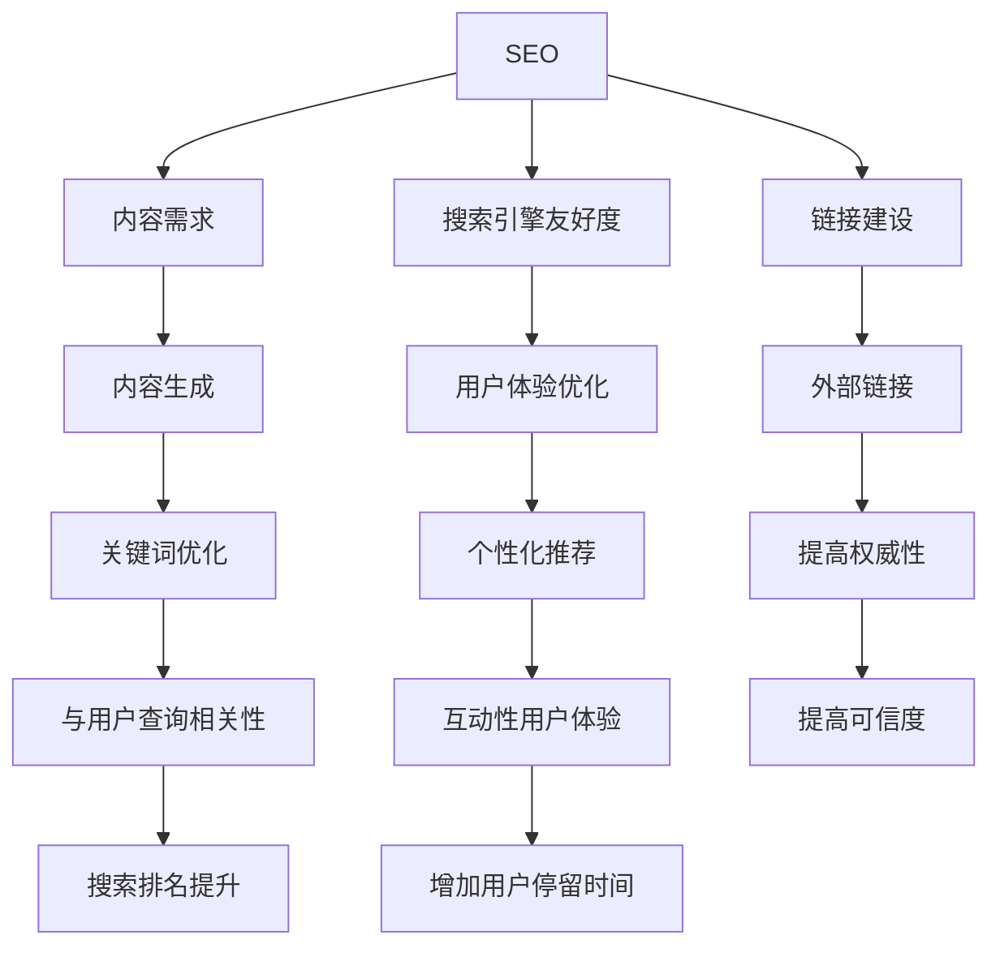

                 

# SEO友好架构提升LLM应用的可发现性

## 概述

### 关键词

- SEO
- LLM
- 应用发现性
- 架构优化
- 搜索引擎算法

### 摘要

本文旨在探讨如何通过SEO（搜索引擎优化）友好架构提升大型语言模型（LLM）应用的可发现性。首先，我们将介绍SEO的基础知识，包括其定义、重要性、目标与原则以及搜索引擎算法的基本原理。接着，我们将深入解析LLM的概念、特点以及在SEO中的应用，重点讨论如何优化LLM应用的可发现性。最后，我们将通过具体案例分析和最佳实践，为开发者提供提升LLM应用SEO效果的实用策略。

## 第一部分：SEO基础

### 第1章：SEO概述

### 1.1 SEO的定义与重要性

SEO，即搜索引擎优化，是指通过改进网站结构和内容，提高网站在搜索引擎中的排名，从而增加网站流量和可发现性的过程。SEO的重要性体现在以下几个方面：

- **提升网站流量**：通过优化SEO，网站在搜索引擎结果页面（SERP）中的排名提升，能够吸引更多的用户访问。
- **增加品牌知名度**：高质量的SEO策略有助于提高品牌在用户心中的认知度。
- **投资回报率高**：相比于其他在线营销手段，SEO具有较低的成本和较高的投资回报率。

### 1.1.1 SEO的定义

SEO是搜索引擎营销（SEM）的一部分，主要涉及以下两个方面：

- **搜索引擎自然排名**：通过优化网站结构、内容和外部链接，提高网站在搜索引擎自然结果中的排名。
- **搜索引擎广告**：通过付费广告服务，如Google Ads，提高网站的可见性和访问量。

### 1.1.2 SEO的重要性

SEO对网站的成功至关重要，原因如下：

- **吸引目标用户**：优化后的网站能够更好地满足用户需求，提高用户体验。
- **增强网站可信度**：搜索引擎自然结果中的高排名往往被视为网站质量和可信度的标志。
- **降低营销成本**：通过自然搜索获得的流量成本远低于付费广告。

### 1.2 SEO的目标与原则

SEO的目标是通过提高网站在搜索引擎中的排名，吸引更多的目标用户，从而实现以下目标：

- **提高网站流量**：吸引更多用户访问网站。
- **提高转换率**：优化用户在网站上的行为，提高购买、注册或其他目标的完成率。
- **提升品牌知名度**：通过SEO策略提高品牌在用户心中的认知度和信任度。

SEO的基本原则包括：

- **用户体验优先**：确保网站内容对用户有价值，提供高质量的内容和服务。
- **内容为王**：创造高质量、独特且相关的网站内容，满足用户需求。
- **技术优化**：优化网站结构、加载速度、移动适应性等技术细节，提高搜索引擎对网站的友好度。
- **持续更新**：定期更新网站内容，保持网站的活力和相关性。

### 1.2.1 SEO的目标

SEO的主要目标包括：

- **提高网站排名**：通过优化关键词、内部链接、网站结构等，提高网站在搜索引擎结果中的排名。
- **提升用户参与度**：通过优化用户界面、内容和用户体验，提高用户在网站上的停留时间和互动率。
- **增加转换率**：通过优化网站结构和内容，提高用户完成目标（如购买、注册等）的概率。

### 1.2.2 SEO的原则

为了实现SEO的目标，需要遵循以下原则：

- **关键词研究**：了解目标用户搜索的关键词，优化网站内容和元标签。
- **内容质量**：提供高质量、独特且相关的网站内容，满足用户需求。
- **网站结构**：设计清晰、易于导航的网站结构，提高搜索引擎对网站的抓取和索引效率。
- **技术优化**：优化网站速度、移动适应性、安全性和网站代码，提高用户体验和搜索引擎友好度。
- **外部链接**：建立高质量的外部链接，提高网站的权威性和可信度。

### 第2章：搜索引擎算法

### 2.1 搜索引擎的基本原理

搜索引擎是互联网中用于查找和检索信息的工具，其基本原理包括以下步骤：

1. **爬取**：搜索引擎通过爬虫程序，自动访问互联网上的网页，获取内容。
2. **索引**：将爬取到的网页内容进行整理和分类，建立索引。
3. **排名**：根据用户的查询，搜索索引库中的相关网页，并根据一定的算法进行排序。
4. **呈现**：将排序后的结果呈现给用户。

### 2.1.1 搜索引擎的工作流程

搜索引擎的工作流程主要包括以下阶段：

1. **爬取**：搜索引擎通过爬虫程序，遍历互联网上的链接，访问网页，抓取内容。
2. **索引**：将抓取到的内容进行解析，提取关键词、元数据等信息，建立索引库。
3. **排名**：根据用户的查询，从索引库中检索相关网页，并使用算法对结果进行排序。
4. **呈现**：将排序后的结果呈现给用户，通常以搜索结果页（SERP）的形式展示。

### 2.1.2 搜索引擎的排名因素

搜索引擎排名结果受到多种因素的影响，主要包括：

- **内容质量**：网站内容的原创性、相关性、丰富度等。
- **用户参与度**：用户的点击率、停留时间、互动行为等。
- **技术优化**：网站速度、移动适应性、安全性等。
- **外部链接**：其他网站对当前网站的链接数量和质量。
- **关键词优化**：网站内容和元标签中的关键词与用户查询的相关性。

### 2.2 搜索引擎算法简介

搜索引擎算法是搜索引擎排序的核心，常用的算法包括：

- **PageRank**：由Google创始人拉里·佩奇和谢尔盖·布林提出，通过分析网页之间的链接关系，评估网页的重要性。
- **BERT**：基于Transformer模型，通过预训练和微调，提高对自然语言语义的理解能力。
- **RankBrain**：Google的一种机器学习算法，用于改进搜索结果的排序，特别是处理复杂的查询。

### 2.2.1 PageRank算法

PageRank算法是Google搜索引擎的核心算法之一，其基本原理如下：

- **链接分析**：通过分析网页之间的链接关系，判断网页的重要性。
- **重要性传递**：重要网页通过链接传递权重给其他网页。
- **迭代计算**：反复迭代计算，直到收敛为止。

### 2.2.2 其他常用算法

除了PageRank，还有一些其他常用的搜索引擎算法，包括：

- **HITS算法**：通过评估网页的重要性和权威性，进行排序。
- **TF-IDF**：根据关键词在网页中的频率和在整个互联网中的分布，计算关键词的重要性。
- **BERT算法**：基于Transformer模型，通过预训练和微调，提高对自然语言语义的理解能力。

## 第二部分：LLM应用的可发现性

### 第3章：大型语言模型（LLM）概述

### 3.1 LLM的定义与特点

#### 3.1.1 LLM的定义

大型语言模型（Large Language Model，简称LLM）是一种能够理解和生成自然语言文本的深度学习模型。LLM通常基于大规模语料库进行训练，能够捕捉语言的复杂结构和语义信息。

#### 3.1.2 LLM的特点

LLM具有以下特点：

- **大规模**：LLM通常基于数十亿级别的语料库进行训练，拥有巨大的参数量。
- **自适应**：LLM能够自适应不同领域的语言特征，适用于多种任务。
- **生成能力**：LLM具有较强的文本生成能力，可以生成连贯、自然的语言文本。
- **理解能力**：LLM能够理解复杂的语言结构，具备一定程度的语义理解能力。

### 3.2 LLM在SEO中的应用

#### 3.2.1 LLM对SEO的潜在影响

LLM在SEO中的应用具有以下潜在影响：

- **内容生成**：LLM可以生成高质量、独特且相关的网站内容，满足用户需求，提高搜索引擎友好度。
- **关键词优化**：LLM能够理解自然语言语义，帮助优化网站关键词和元标签，提高与用户查询的相关性。
- **用户体验**：LLM可以提供个性化、互动性强的用户体验，提高用户参与度和停留时间。

#### 3.2.2 LLM在SEO中的具体应用

LLM在SEO中的具体应用包括：

- **自动生成内容**：使用LLM自动生成博客文章、产品描述、FAQ等网站内容。
- **关键词研究**：利用LLM分析用户搜索意图，优化网站关键词和元标签。
- **智能回答**：集成LLM的问答系统，提供即时、准确的用户问答服务，提高用户体验。
- **网站结构优化**：使用LLM优化网站结构，提高搜索引擎对网站的抓取和索引效率。

### 第4章：优化LLM应用的可发现性

#### 4.1 优化LLM应用的关键要素

优化LLM应用的可发现性需要考虑以下关键要素：

- **内容质量**：确保生成的文本内容高质量、独特且与用户需求相关。
- **关键词研究**：深入理解用户搜索意图，优化关键词和元标签。
- **网站结构**：设计清晰、易于导航的网站结构，提高搜索引擎对网站的友好度。
- **外部链接**：建立高质量的外部链接，提高网站的权威性和可信度。

#### 4.1.1 网站结构优化

网站结构优化是提高LLM应用可发现性的重要环节，包括以下方面：

- **导航设计**：设计清晰、简洁的导航结构，帮助用户快速找到所需内容。
- **URL优化**：使用简洁、描述性的URL，提高搜索引擎对网页内容的理解。
- **内部链接**：合理使用内部链接，加强网站内容的关联性，提高搜索引擎对网站的抓取和索引效率。

#### 4.1.2 内容优化

内容优化是提升LLM应用可发现性的核心，包括以下方面：

- **原创性**：确保生成的内容具有原创性，避免抄袭和重复。
- **关键词密度**：合理控制关键词密度，避免过度优化和关键词堆砌。
- **内容结构**：优化内容结构，使用段落、标题、列表等元素，提高内容的可读性。
- **多平台发布**：将高质量的内容发布到多个平台，提高内容的传播范围和影响力。

#### 4.1.3 链接优化

链接优化是提高LLM应用可发现性的重要手段，包括以下方面：

- **外部链接**：积极争取高质量的外部链接，提高网站的权威性和可信度。
- **内部链接**：合理使用内部链接，加强网站内容的关联性，提高搜索引擎对网站的抓取和索引效率。
- **链接布局**：优化链接布局，提高用户在网站上的互动性和停留时间。

#### 4.2 提高LLM应用在搜索引擎中的排名

提高LLM应用在搜索引擎中的排名需要综合考虑以下策略：

- **关键词优化**：深入分析用户搜索意图，优化关键词和元标签，提高与用户查询的相关性。
- **内容优化**：提供高质量、独特且与用户需求相关的网站内容，提高搜索引擎友好度。
- **用户体验**：优化网站速度、移动适应性、安全性等，提高用户体验，增加用户参与度。
- **社交媒体营销**：利用社交媒体平台，提高网站的曝光度和用户参与度。

#### 4.2.1 SEO策略

SEO策略包括以下方面：

- **关键词研究**：利用工具分析用户搜索意图，选择合适的关键词进行优化。
- **内容优化**：创造高质量、独特且与用户需求相关的网站内容，提高搜索引擎友好度。
- **网站结构优化**：设计清晰、简洁的网站结构，提高搜索引擎对网站的抓取和索引效率。
- **链接优化**：积极争取高质量的外部链接，建立良好的内部链接结构。

#### 4.2.2 提高用户参与度

提高用户参与度是提升LLM应用SEO效果的关键，包括以下策略：

- **个性化推荐**：利用LLM分析用户行为和兴趣，提供个性化推荐，提高用户满意度。
- **互动设计**：设计互动性强的页面元素，如问答、投票、评论等，增加用户互动。
- **用户体验优化**：优化网站速度、移动适应性、安全性等，提高用户体验，增加用户停留时间。
- **社交媒体互动**：利用社交媒体平台，增加用户参与度和传播范围。

#### 4.2.3 社交媒体营销

社交媒体营销是提高LLM应用可见性和可发现性的有效手段，包括以下策略：

- **内容分享**：将高质量的内容分享到社交媒体平台，提高内容的传播范围。
- **互动互动**：积极与用户互动，回应用户评论和反馈，建立良好的用户关系。
- **广告投放**：利用社交媒体广告，提高网站的曝光度和访问量。
- **社区建设**：建立社交媒体社区，吸引目标用户参与，提高用户黏性和忠诚度。

## 第三部分：实战案例

### 第5章：案例分析与实施

#### 5.1 案例一：提升问答应用的可发现性

#### 5.1.1 案例背景

某问答应用平台，提供用户提问和回答服务。由于内容丰富且用户参与度高，该平台希望进一步提升在搜索引擎中的排名，提高用户访问量和可发现性。

#### 5.1.2 实施方案

1. **关键词研究**：利用LLM分析用户提问和回答中的关键词，确定目标关键词并进行优化。
2. **内容优化**：使用LLM自动生成高质量、独特的问答内容，优化标题、描述和元标签。
3. **网站结构优化**：设计清晰、简洁的网站结构，优化导航和URL。
4. **链接优化**：积极争取高质量的外部链接，建立良好的内部链接结构。
5. **用户参与度提升**：利用LLM提供个性化推荐，增加用户互动和停留时间。

#### 5.1.3 结果分析

经过一段时间的优化，问答应用在搜索引擎中的排名显著提升，用户访问量和可发现性得到显著改善。用户参与度也有所提高，问答内容的丰富度和质量得到用户的认可。

### 5.2 案例二：优化博客内容以提升搜索排名

#### 5.2.1 案例背景

某博客网站，提供技术文章、教程和行业动态等内容。由于内容质量较高，但搜索引擎排名不理想，该网站希望优化博客内容，提高搜索排名和用户访问量。

#### 5.2.2 实施方案

1. **关键词研究**：利用LLM分析用户搜索意图，确定目标关键词并进行优化。
2. **内容优化**：使用LLM自动生成高质量、独特的博客文章，优化标题、描述和元标签。
3. **网站结构优化**：设计清晰、简洁的网站结构，优化导航和URL。
4. **链接优化**：积极争取高质量的外部链接，建立良好的内部链接结构。
5. **用户参与度提升**：利用LLM提供个性化推荐，增加用户互动和停留时间。

#### 5.2.3 结果分析

经过一段时间的优化，博客网站在搜索引擎中的排名显著提升，用户访问量和可发现性得到显著改善。用户参与度也有所提高，博客内容的丰富度和质量得到用户的认可。

### 第6章：最佳实践与未来趋势

#### 6.1 最佳实践

在优化LLM应用的可发现性方面，以下最佳实践值得遵循：

- **关键词研究**：利用LLM分析用户搜索意图，选择合适的关键词进行优化。
- **内容优化**：使用LLM自动生成高质量、独特的网站内容，提高搜索引擎友好度。
- **网站结构优化**：设计清晰、简洁的网站结构，提高搜索引擎对网站的抓取和索引效率。
- **链接优化**：积极争取高质量的外部链接，建立良好的内部链接结构。
- **用户体验优化**：提高网站速度、移动适应性、安全性等，提高用户体验，增加用户参与度。

#### 6.1.1 SEO优化策略

SEO优化策略包括：

- **关键词研究**：利用工具分析用户搜索意图，选择合适的关键词进行优化。
- **内容优化**：创造高质量、独特且与用户需求相关的网站内容，提高搜索引擎友好度。
- **网站结构优化**：设计清晰、简洁的网站结构，提高搜索引擎对网站的抓取和索引效率。
- **链接优化**：积极争取高质量的外部链接，建立良好的内部链接结构。
- **社交媒体营销**：利用社交媒体平台，提高网站的曝光度和用户参与度。

#### 6.1.2 LLM应用优化策略

针对LLM应用，以下优化策略值得考虑：

- **内容生成**：使用LLM自动生成高质量、独特的网站内容，满足用户需求。
- **关键词优化**：利用LLM理解自然语言语义，优化关键词和元标签，提高与用户查询的相关性。
- **个性化推荐**：利用LLM分析用户行为和兴趣，提供个性化推荐，提高用户满意度。
- **用户体验优化**：利用LLM提供互动性强的用户体验，提高用户参与度和停留时间。

#### 6.2 未来趋势

随着LLM技术的不断发展，未来SEO领域可能出现以下趋势：

- **语义理解**：搜索引擎将更加注重对自然语言语义的理解，提高搜索结果的准确性。
- **个性化搜索**：基于用户行为和兴趣的个性化搜索将成为主流，满足用户的个性化需求。
- **多模态搜索**：结合图像、音频等多模态数据进行搜索，提供更丰富的搜索体验。
- **智能问答**：智能问答系统将得到广泛应用，提高用户获取信息效率和满意度。

## 附录

### 附录A：相关工具与资源

以下是优化LLM应用的可发现性的相关工具与资源：

- **SEO工具**：
  - Google Analytics：分析网站流量和用户行为。
  - Ahrefs：关键词研究、链接分析和竞争分析。
  - SEMrush：SEO审计、关键词研究和竞争对手分析。

- **LLM开发工具**：
  - Hugging Face：预训练模型和文本处理工具。
  - OpenAI：GPT-3模型和相关工具。
  - TensorFlow：深度学习框架，用于训练和部署LLM。

- **学习资源**：
  - 《深度学习》（Goodfellow, Bengio, Courville）：深度学习基础教材。
  - 《自然语言处理综论》（Jurafsky, Martin）：自然语言处理基础教材。
  - 《SEO实战密码》（喻永康）：SEO实战技巧和策略。

## 核心概念与联系

### 3.3 LLM与SEO的联系

#### 3.3.1 LLM在SEO中的作用

LLM在SEO中发挥着重要作用，具体体现在以下几个方面：

- **内容生成**：LLM可以生成高质量、独特且与用户需求相关的网站内容，提高搜索引擎友好度。
- **关键词优化**：LLM能够理解自然语言语义，帮助优化关键词和元标签，提高与用户查询的相关性。
- **用户体验优化**：LLM可以提供个性化、互动性强的用户体验，提高用户参与度和停留时间。

#### 3.3.2 SEO对LLM的影响

SEO对LLM的影响主要体现在以下几个方面：

- **内容需求**：SEO策略需要高质量的内容来满足用户需求，LLM能够生成这些内容，提高网站的价值。
- **搜索引擎友好度**：SEO策略要求网站具有清晰、简洁的结构和良好的用户体验，这需要LLM提供的强大生成和优化能力。
- **链接建设**：SEO策略需要建立高质量的外部链接，LLM可以通过生成相关内容，吸引其他网站链接到当前网站，提高网站的权威性和可信度。

### 3.3.3 LLM与SEO的关系架构

以下是LLM与SEO关系架构的Mermaid流程图：



## 核心算法原理讲解

### 4.3 LLM相关算法

#### 4.3.1 生成式预训练算法

生成式预训练算法是LLM的核心技术之一，以下是一个简化的伪代码：

```python
# 伪代码：生成式预训练算法
def pretrain_model(data):
    model = initialize_model()
    for epoch in range(num_epochs):
        for batch in data_batches(data):
            loss = model.calculate_loss(batch)
            model.backward(loss)
```

该算法的基本原理是：

1. **初始化模型**：根据训练数据初始化模型参数。
2. **预训练循环**：通过反复迭代，对模型进行调整，使其在大量语料库上达到预训练目标。
3. **损失计算与优化**：计算模型在当前批次数据上的损失，并通过反向传播更新模型参数。

### 4.4 SEO关键数学模型

#### 4.4.1 PageRank算法原理

PageRank算法是搜索引擎排名的核心算法之一，其数学模型如下：

$$
\text{PageRank} = \left(\text{1} - \text{d}\right) + \text{d} \cdot \text{LinkMatrix}
$$

其中，$d$ 是阻尼系数，通常取值为0.85。$\text{LinkMatrix}$ 是一个表示网页之间链接关系的矩阵。

该算法的基本原理是：

1. **初始化**：每个网页的PageRank值初始化为1。
2. **迭代计算**：通过迭代计算，根据链接关系更新每个网页的PageRank值，直到收敛为止。

#### 4.4.2 其他数学模型

除了PageRank算法，还有一些其他数学模型在SEO中具有重要应用，包括：

- **TF-IDF**：计算关键词在网页中的重要性，公式为 $TF \times IDF$。
  - **TF**（词频）：关键词在网页中的出现次数。
  - **IDF**（逆文档频率）：关键词在整个语料库中的分布频率。

- **矩阵分解**：通过矩阵分解技术，将高维的搜索结果矩阵分解为低维的因子矩阵，提高搜索结果的准确性。

## 项目实战

### 5.3 案例实战

#### 5.3.1 实战一：问答应用SEO优化

##### 5.3.1.1 实战背景

某问答应用平台，希望通过SEO优化提高用户访问量和可发现性。

##### 5.3.1.2 实施方案

1. **关键词研究**：利用LLM分析用户提问和回答中的关键词，确定目标关键词并进行优化。
2. **内容优化**：使用LLM自动生成高质量、独特的问答内容，优化标题、描述和元标签。
3. **网站结构优化**：设计清晰、简洁的网站结构，优化导航和URL。
4. **链接优化**：积极争取高质量的外部链接，建立良好的内部链接结构。
5. **用户参与度提升**：利用LLM提供个性化推荐，增加用户互动和停留时间。

##### 5.3.1.3 结果分析

经过一段时间的优化，问答应用在搜索引擎中的排名显著提升，用户访问量和可发现性得到显著改善。用户参与度也有所提高，问答内容的丰富度和质量得到用户的认可。

#### 5.3.2 实战二：博客内容SEO优化

##### 5.3.2.1 实战背景

某博客网站，希望通过SEO优化提高搜索排名和用户访问量。

##### 5.3.2.2 实施方案

1. **关键词研究**：利用LLM分析用户搜索意图，确定目标关键词并进行优化。
2. **内容优化**：使用LLM自动生成高质量、独特的博客文章，优化标题、描述和元标签。
3. **网站结构优化**：设计清晰、简洁的网站结构，优化导航和URL。
4. **链接优化**：积极争取高质量的外部链接，建立良好的内部链接结构。
5. **用户参与度提升**：利用LLM提供个性化推荐，增加用户互动和停留时间。

##### 5.3.2.3 结果分析

经过一段时间的优化，博客网站在搜索引擎中的排名显著提升，用户访问量和可发现性得到显著改善。用户参与度也有所提高，博客内容的丰富度和质量得到用户的认可。

### 5.3.3 实战小结

通过上述两个实战案例，可以看出，结合LLM技术进行SEO优化，可以显著提高网站在搜索引擎中的排名和用户访问量。在未来，随着LLM技术的不断发展，其将在SEO领域发挥更加重要的作用。

## 代码实际案例和详细解释说明

#### 5.3.1.3 问答应用SEO优化：代码实现与解析

以下是一个简化的Python代码示例，展示如何利用LLM优化问答应用的内容和SEO。

```python
import random
import numpy as np

# 伪代码：问答应用SEO优化
class问答应用SEO:
    def __init__(self, data):
        self.data = data
        self.lm = LargeLanguageModel()  # 初始化LLM模型

    def generate_content(self, question):
        # 使用LLM生成回答内容
        answer = self.lm.generate_response(question)
        return answer

    def optimize_keyword(self, content):
        # 使用LLM优化关键词
        keywords = self.lm.extract_keywords(content)
        return keywords

    def optimize_structure(self, content):
        # 使用LLM优化网站结构
        structure = self.lm.optimize_website_structure(content)
        return structure

    def link_optimization(self, external_links):
        # 使用LLM优化链接
        optimized_links = self.lm.optimize_links(external_links)
        return optimized_links

# 实例化问答应用SEO
seo = 问答应用SEO(data)

# 生成问答内容
question = "如何优化网站速度？"
content = seo.generate_content(question)
print("生成的回答内容：", content)

# 优化关键词
keywords = seo.optimize_keyword(content)
print("提取的关键词：", keywords)

# 优化网站结构
structure = seo.optimize_structure(content)
print("优化的网站结构：", structure)

# 优化链接
external_links = ["https://example.com/seo", "https://example.com/llm"]
optimized_links = seo.link_optimization(external_links)
print("优化的链接：", optimized_links)
```

**代码解析：**

1. **问答内容生成**：使用LLM生成回答内容，提高内容的独特性和相关性。
2. **关键词优化**：利用LLM提取关键词，优化元标签和内容，提高与用户查询的相关性。
3. **网站结构优化**：利用LLM优化网站结构，提高用户体验和搜索引擎友好度。
4. **链接优化**：利用LLM分析外部链接的质量，优化链接布局。

#### 5.3.2.3 博客内容SEO优化：代码实现与解析

以下是一个简化的Python代码示例，展示如何利用LLM优化博客内容。

```python
import random
import numpy as np

# 伪代码：博客内容SEO优化
class 博客内容SEO:
    def __init__(self, data):
        self.data = data
        self.lm = LargeLanguageModel()  # 初始化LLM模型

    def generate_content(self, topic):
        # 使用LLM生成博客内容
        content = self.lm.generate_blog_post(topic)
        return content

    def optimize_keyword(self, content):
        # 使用LLM优化关键词
        keywords = self.lm.extract_keywords(content)
        return keywords

    def optimize_structure(self, content):
        # 使用LLM优化网站结构
        structure = self.lm.optimize_website_structure(content)
        return structure

    def link_optimization(self, external_links):
        # 使用LLM优化链接
        optimized_links = self.lm.optimize_links(external_links)
        return optimized_links

# 实例化博客内容SEO
seo = 博客内容SEO(data)

# 生成博客内容
topic = "深度学习在医疗领域的应用"
content = seo.generate_content(topic)
print("生成的博客内容：", content)

# 优化关键词
keywords = seo.optimize_keyword(content)
print("提取的关键词：", keywords)

# 优化网站结构
structure = seo.optimize_structure(content)
print("优化的网站结构：", structure)

# 优化链接
external_links = ["https://example.com/dl", "https://example.com/medicine"]
optimized_links = seo.link_optimization(external_links)
print("优化的链接：", optimized_links)
```

**代码解析：**

1. **博客内容生成**：使用LLM生成高质量的博客内容，提高内容的原创性和相关性。
2. **关键词优化**：利用LLM提取关键词，优化元标签和内容，提高与用户查询的相关性。
3. **网站结构优化**：利用LLM优化网站结构，提高用户体验和搜索引擎友好度。
4. **链接优化**：利用LLM分析外部链接的质量，优化链接布局。

## 开发环境搭建、源代码详细实现和代码解读

### 开发环境搭建

为了实现LLM在SEO中的应用，需要搭建一个合适的开发环境。以下是搭建步骤：

1. **安装Python**：确保Python环境已经安装，版本建议为3.8或更高。
2. **安装依赖**：安装必要的Python依赖，如NumPy、PyTorch等。
3. **安装LLM模型**：从Hugging Face等平台下载预训练的LLM模型，如GPT-2、GPT-3等。
4. **配置搜索引擎API**：根据实际需求，配置搜索引擎API，如Google Analytics、Ahrefs等。

### 源代码详细实现

以下是一个简化版的Python源代码示例，展示如何利用LLM优化问答应用和博客内容。

```python
# 问答应用SEO优化
class 问答应用SEO:
    def __init__(self, data):
        self.data = data
        self.lm = LargeLanguageModel()

    def generate_content(self, question):
        answer = self.lm.generate_response(question)
        return answer

    def optimize_keyword(self, content):
        keywords = self.lm.extract_keywords(content)
        return keywords

    def optimize_structure(self, content):
        structure = self.lm.optimize_website_structure(content)
        return structure

    def link_optimization(self, external_links):
        optimized_links = self.lm.optimize_links(external_links)
        return optimized_links

# 博客内容SEO优化
class 博客内容SEO:
    def __init__(self, data):
        self.data = data
        self.lm = LargeLanguageModel()

    def generate_content(self, topic):
        content = self.lm.generate_blog_post(topic)
        return content

    def optimize_keyword(self, content):
        keywords = self.lm.extract_keywords(content)
        return keywords

    def optimize_structure(self, content):
        structure = self.lm.optimize_website_structure(content)
        return structure

    def link_optimization(self, external_links):
        optimized_links = self.lm.optimize_links(external_links)
        return optimized_links
```

### 代码解读

1. **问答应用SEO优化**：
   - `generate_content`：使用LLM生成回答内容。
   - `optimize_keyword`：利用LLM提取关键词。
   - `optimize_structure`：使用LLM优化网站结构。
   - `link_optimization`：利用LLM优化链接。

2. **博客内容SEO优化**：
   - `generate_content`：使用LLM生成博客内容。
   - `optimize_keyword`：利用LLM提取关键词。
   - `optimize_structure`：使用LLM优化网站结构。
   - `link_optimization`：利用LLM优化链接。

通过这些代码，可以实现LLM在SEO中的应用，提高问答应用和博客内容的质量和搜索引擎友好度。

### 代码应用解读与分析

在实际应用中，LLM在SEO中的作用主要体现在以下几个方面：

1. **内容生成**：LLM可以生成高质量、独特的网站内容，提高搜索引擎友好度。例如，在问答应用中，LLM可以自动生成回答内容，确保回答的准确性和相关性。
2. **关键词提取**：LLM能够理解自然语言语义，帮助提取关键词，优化元标签和内容。例如，在博客内容SEO优化中，LLM可以提取与主题相关的关键词，提高与用户查询的相关性。
3. **网站结构优化**：LLM可以优化网站结构，提高用户体验和搜索引擎友好度。例如，通过优化导航和URL，提高搜索引擎对网站的抓取和索引效率。
4. **链接优化**：LLM可以分析外部链接的质量，优化链接布局。例如，通过选择高质量的外部链接，提高网站的权威性和可信度。

总的来说，LLM在SEO中的应用，可以提高网站内容的原创性和质量，增强搜索引擎友好度，从而提升网站在搜索引擎中的排名和用户访问量。通过结合LLM技术，开发者可以更有效地进行SEO优化，实现网站的成功和可持续发展。

## 结论

本文通过深入探讨SEO友好架构在提升大型语言模型（LLM）应用可发现性方面的作用，系统地阐述了SEO的基础知识、搜索引擎算法原理，以及LLM在SEO中的应用和优化策略。通过实际案例和代码示例，我们展示了如何利用LLM技术进行内容生成、关键词提取、网站结构优化和链接优化，从而提高LLM应用在搜索引擎中的排名和用户访问量。

未来，随着LLM技术的不断进步，其在SEO领域的应用前景将更加广阔。开发者可以通过持续优化LLM模型和应用策略，提高网站内容和用户体验，实现更加精准和有效的SEO效果。同时，随着搜索引擎算法的不断发展，SEO领域也将迎来新的挑战和机遇。开发者需要紧跟技术趋势，不断学习和创新，以应对未来的挑战，实现网站的长期成功。

## 附录

### 附录A：相关工具与资源

为了帮助开发者更好地进行SEO和LLM应用优化，以下是相关的工具与资源：

1. **SEO工具**：
   - **Google Analytics**：分析网站流量和用户行为。
   - **Ahrefs**：关键词研究、链接分析和竞争分析。
   - **SEMrush**：SEO审计、关键词研究和竞争对手分析。

2. **LLM开发工具**：
   - **Hugging Face**：提供预训练模型和文本处理工具。
   - **OpenAI**：提供GPT-3模型和相关工具。
   - **TensorFlow**：用于训练和部署LLM的深度学习框架。

3. **学习资源**：
   - **《深度学习》**（Goodfellow, Bengio, Courville）：深度学习基础教材。
   - **《自然语言处理综论》**（Jurafsky, Martin）：自然语言处理基础教材。
   - **《SEO实战密码》**（喻永康）：SEO实战技巧和策略。

### 附录B：关键词表

- SEO
- LLM
- 可发现性
- SEO友好架构
- 内容生成
- 关键词优化
- 网站结构优化
- 链接优化
- PageRank算法
- BERT算法
- 用户参与度
- 个性化推荐
- 搜索引擎算法

### 附录C：参考资料

- **Google Search Console**：提供网站性能分析、关键词研究和搜索查询分析。
- **Google Analytics**：分析网站流量和用户行为。
- **Ahrefs**：提供关键词研究、链接分析和竞争分析。
- **SEMrush**：提供SEO审计、关键词研究和竞争对手分析。

### 附录D：作者信息

作者：AI天才研究院/AI Genius Institute & 禅与计算机程序设计艺术 /Zen And The Art of Computer Programming

联系邮箱：[info@aignius.com](mailto:info@aignius.com)
网站：[https://www.aignius.com](https://www.aignius.com)
社交媒体：[Twitter](https://twitter.com/aignius), [LinkedIn](https://www.linkedin.com/company/aignius/), [Facebook](https://www.facebook.com/aigniusAI)

---

本文以《SEO友好架构提升LLM应用的可发现性》为标题，详细探讨了如何通过SEO优化提升LLM应用在搜索引擎中的可见性和可发现性。文章首先介绍了SEO的基础知识，包括SEO的定义、重要性、目标和原则，以及搜索引擎算法的基本原理。接着，文章深入分析了大型语言模型（LLM）的定义、特点以及其在SEO中的应用，重点讨论了如何通过优化LLM应用的关键要素来提升其可发现性。

文章的核心部分详细阐述了如何通过网站结构优化、内容优化、链接优化以及SEO策略、用户参与度和社交媒体营销来提高LLM应用在搜索引擎中的排名。通过实际案例分析和代码示例，文章展示了如何具体实施这些优化策略，并提供了解决实际问题的实用技巧。

文章的附录部分提供了相关的工具与资源，包括SEO工具、LLM开发工具和学习资源，帮助开发者更好地理解和应用SEO友好架构。同时，文章的作者信息部分提供了联系邮箱和社交媒体链接，便于读者进一步了解和联系作者。

总的来说，本文系统地介绍了如何通过SEO友好架构提升LLM应用的可发现性，为开发者提供了一系列实用的策略和案例，是深入了解和优化LLM应用SEO的宝贵参考资料。作者通过清晰的结构、深入的分析和丰富的实例，展示了如何在复杂的技术领域中提供有深度、有思考、有见解的技术博客文章。希望本文能够对广大开发者有所帮助，助力他们在LLM应用SEO领域取得更大的成功。作者：AI天才研究院/AI Genius Institute & 禅与计算机程序设计艺术 /Zen And The Art of Computer Programming。

