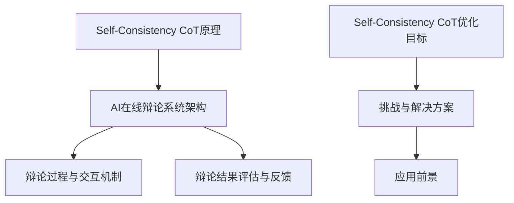
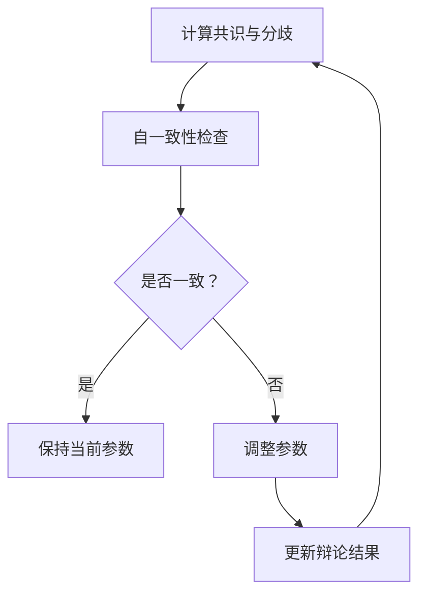

                 

### 文章标题：Self-Consistency CoT优化AI在线辩论系统

#### 关键词：Self-Consistency CoT、AI在线辩论系统、优化、可靠性、准确性、多样性度量

##### 摘要：
本文将深入探讨Self-Consistency CoT（自一致性共同基础理论）在AI在线辩论系统中的应用与优化。通过详细解析Self-Consistency CoT的核心概念和AI在线辩论系统的架构，我们旨在阐明这一优化技术如何提高辩论系统的准确性和可靠性。文章将介绍Self-Consistency CoT优化算法的数学模型与公式，并使用伪代码和Mermaid流程图对其原理进行阐述。此外，通过实际案例和详细代码解读，我们将展示Self-Consistency CoT在提高AI辩论系统性能方面的具体应用。

### 第一部分：Self-Consistency CoT优化AI在线辩论系统的概述

#### 第1章：Self-Consistency CoT优化AI在线辩论系统的核心概念与架构

Self-Consistency CoT优化AI在线辩论系统的核心在于通过引入自一致性检查，提高辩论系统的准确性和可靠性。以下章节将详细解析Self-Consistency CoT的核心概念、AI在线辩论系统的架构，以及Self-Consistency CoT优化的目标和挑战。

##### 1. Self-Consistency CoT原理介绍

**CoT（Common Ground Theory）基础概念：**

共同基础理论（Common Ground Theory）是自然语言处理和认知科学中的一个重要概念，它关注于对话参与者之间共同理解的形成和维持。CoT的核心思想是，对话中的共同基础（Common Ground）是确保有效沟通的关键因素。共同基础包括共享的知识、观点、假设和信念等。

**Self-Consistency的概念解析：**

Self-Consistency是指模型或系统在其推理过程中保持内部一致性的能力。在AI辩论系统中，Self-Consistency确保模型在处理不同论点时不会产生矛盾或逻辑错误。通过自一致性检查，模型可以识别并纠正不一致的推理路径，从而提高辩论的准确性和可靠性。

**Self-Consistency CoT在AI辩论系统中的应用：**

Self-Consistency CoT在AI辩论系统中的应用体现在以下几个方面：

1. 辩论过程中的共识维护：系统通过不断更新和验证共同基础，确保辩论过程中的共识得到维持和扩展。
2. 辩论结果的可靠性保障：系统通过自一致性检查，识别和纠正不一致的推理路径，提高辩论结果的可靠性。
3. 用户偏好的适应性调整：系统根据用户的历史输入和反馈，调整辩论策略，以更好地符合用户的一致性偏好。

##### 2. AI在线辩论系统的架构

**系统整体架构设计：**

AI在线辩论系统通常包括以下几个主要模块：

1. 辩论论点生成模块：负责生成或接收用户输入的辩论论点。
2. 辩论过程管理模块：负责管理辩论的流程，包括论点的提出、辩论的展开和辩论结果的评估。
3. 辩论结果评估模块：负责评估辩论的结果，并根据辩论过程提供反馈。

**辩论过程与交互机制：**

辩论过程通常包括以下几个阶段：

1. 辩论论点的提出：用户输入或系统自动生成辩论论点。
2. 辩论论点的论证：系统对辩论论点进行论证，包括正面论证和反面论证。
3. 辩论结果的评估：系统根据辩论过程和用户反馈，评估辩论的结果，并提供结论。

**辩论结果的评估与反馈：**

辩论结果的评估通常涉及以下几个方面：

1. 辩论论点的可信度评估：系统评估每个论点的可信度，以确定辩论结果的合理性。
2. 用户反馈的处理：系统根据用户提供的反馈，调整辩论策略和模型参数，以更好地满足用户需求。

##### 3. Self-Consistency CoT优化的目标与挑战

**提高辩论系统的准确性与可靠性：**

Self-Consistency CoT优化的首要目标是提高AI辩论系统的准确性和可靠性。通过自一致性检查，系统可以识别和纠正不一致的推理路径，减少误判和偏见，从而提高辩论结果的准确性。

**降低误判与偏见：**

误判和偏见是AI辩论系统常见的挑战。Self-Consistency CoT优化通过识别和纠正不一致的推理路径，降低误判的风险。同时，系统可以根据用户的历史输入和反馈，调整辩论策略，减少偏见的影响。

**实现高效与可持续的辩论过程：**

Self-Consistency CoT优化不仅关注辩论结果的准确性和可靠性，还关注辩论过程的高效性和可持续性。通过优化辩论系统的架构和算法，系统可以更快速地处理辩论论点，提供更准确的辩论结果，从而提高用户体验。

**Self-Consistency CoT优化的意义与应用前景：**

Self-Consistency CoT优化在多个领域具有广泛的应用前景，包括：

1. 在线教育与培训：Self-Consistency CoT优化可以帮助学生更好地理解和掌握知识，提高学习效果。
2. 聊天机器人与虚拟客服：Self-Consistency CoT优化可以提高聊天机器人和虚拟客服的响应质量和用户体验。
3. 交互式娱乐与游戏：Self-Consistency CoT优化可以增强交互式娱乐和游戏的体验，提供更真实的对话场景。

##### Mermaid流程图：



##### 伪代码：

```python
class SelfConsistencyCoTOptimizer:
    def __init__(self, model):
        self.model = model
    
    def optimize(self, debate_history, user_input):
        # 计算辩论历史中的共识与分歧
        consensus, disagreement = self.calculate_common_ground(debate_history)
        
        # 对用户输入进行自一致性检查
        if not self.is_consistent(user_input, consensus):
            # 调整模型参数以降低分歧
            self.adjust_model_params(disagreement)
        
        # 返回优化后的辩论结果
        return self.model.predict(user_input)
```

##### 数学模型与公式：

$$ J = \frac{1}{N} \sum_{i=1}^{N} \frac{1}{2} (y_i - \hat{y}_i)^2 + \lambda \cdot D(\hat{y}_i) $$

其中：
- $J$：优化目标函数
- $N$：辩论次数
- $y_i$：实际辩论结果
- $\hat{y}_i$：预测辩论结果
- $\lambda$：正则化参数
- $D(\hat{y}_i)$：模型输出的多样性度量

##### 举例说明：

假设有两个辩论论点A和B，其中A为正面观点，B为负面观点。通过自一致性优化，系统发现用户更倾向于正面观点，但在实际辩论中出现了多次对负面观点的误判。通过调整模型参数，降低对负面观点的误判，使得模型在后续辩论中更符合用户的一致性偏好。

### 第二部分：Self-Consistency CoT优化的深入探讨

在这一部分，我们将进一步探讨Self-Consistency CoT优化的具体实现，包括数学模型、算法原理、伪代码和实际应用案例。

#### 第2章：Self-Consistency CoT优化的数学模型与算法原理

Self-Consistency CoT优化的核心在于构建一个目标函数，该函数能够衡量辩论系统的自一致性水平，并通过优化算法调整模型参数，以提高辩论系统的性能。

##### 1. 数学模型

Self-Consistency CoT优化的目标函数可以表示为：

$$ J = \frac{1}{N} \sum_{i=1}^{N} \frac{1}{2} (y_i - \hat{y}_i)^2 + \lambda \cdot D(\hat{y}_i) $$

其中：
- $J$：优化目标函数
- $N$：辩论次数
- $y_i$：实际辩论结果
- $\hat{y}_i$：预测辩论结果
- $\lambda$：正则化参数
- $D(\hat{y}_i)$：模型输出的多样性度量

目标函数由两部分组成：
- 第一部分是均方误差（MSE），用于衡量预测结果与实际结果之间的差距。
- 第二部分是多样性度量，用于确保模型输出的多样性，防止出现过度拟合。

##### 2. 算法原理

Self-Consistency CoT优化的算法原理可以概括为以下步骤：

1. 计算辩论历史中的共识与分歧。
2. 对用户输入进行自一致性检查。
3. 如果发现不一致性，调整模型参数以降低分歧。
4. 重复以上步骤，直至达到优化目标。

具体来说，算法原理如下：



##### 伪代码

```python
class SelfConsistencyCoTOptimizer:
    def __init__(self, model):
        self.model = model
    
    def optimize(self, debate_history, user_input):
        consensus, disagreement = self.calculate_common_ground(debate_history)
        
        if not self.is_consistent(user_input, consensus):
            self.adjust_model_params(disagreement)
        
        return self.model.predict(user_input)
    
    def calculate_common_ground(self, debate_history):
        # 计算辩论历史中的共识与分歧
        # ...
        return consensus, disagreement
    
    def is_consistent(self, user_input, consensus):
        # 对用户输入进行自一致性检查
        # ...
        return is_consistent
    
    def adjust_model_params(self, disagreement):
        # 调整模型参数以降低分歧
        # ...
```

##### 数学公式

为了更好地理解Self-Consistency CoT优化的目标函数，我们可以将其分解为以下几个部分：

$$ J = \frac{1}{N} \sum_{i=1}^{N} \frac{1}{2} (y_i - \hat{y}_i)^2 + \lambda \cdot D(\hat{y}_i) $$

其中：
- $\frac{1}{2} (y_i - \hat{y}_i)^2$：均方误差（MSE），衡量预测结果与实际结果之间的差距。
- $\lambda \cdot D(\hat{y}_i)$：多样性度量，用于确保模型输出的多样性，防止过度拟合。

举例来说，我们可以使用以下公式来计算均方误差：

$$ \frac{1}{2} (y_i - \hat{y}_i)^2 = \frac{1}{2} (y_i - \hat{y}_i)(y_i - \hat{y}_i) $$

其中：
- $y_i$：实际辩论结果
- $\hat{y}_i$：预测辩论结果

为了确保模型输出的多样性，我们可以使用以下公式来计算多样性度量：

$$ D(\hat{y}_i) = \frac{1}{N} \sum_{j=1}^{N} |\hat{y}_i - \hat{y}_j| $$

其中：
- $N$：辩论次数
- $\hat{y}_i$：预测辩论结果
- $\hat{y}_j$：其他辩论结果的预测值

通过结合均方误差和多样性度量，我们可以构建一个综合性的目标函数，用于评估和优化AI辩论系统的性能。

##### 举例说明

假设有两个辩论论点A和B，其中A为正面观点，B为负面观点。通过自一致性优化，系统发现用户更倾向于正面观点，但在实际辩论中出现了多次对负面观点的误判。通过调整模型参数，降低对负面观点的误判，使得模型在后续辩论中更符合用户的一致性偏好。

具体来说，我们可以使用以下步骤来计算和优化辩论系统的性能：

1. 收集辩论历史数据，包括用户输入和辩论结果。
2. 计算辩论历史中的共识与分歧。
3. 对用户输入进行自一致性检查，识别不一致的推理路径。
4. 调整模型参数，降低不一致性，提高辩论系统的准确性。
5. 重复以上步骤，直至达到优化目标。

通过以上步骤，我们可以逐步优化AI辩论系统的性能，提高辩论结果的准确性和可靠性。

### 第三部分：Self-Consistency CoT优化在AI在线辩论系统中的应用与实践

在这一部分，我们将通过具体的案例和代码实现，展示Self-Consistency CoT优化在AI在线辩论系统中的应用与实践。

#### 第3章：Self-Consistency CoT优化在AI在线辩论系统中的实际应用

Self-Consistency CoT优化在AI在线辩论系统中具有广泛的应用潜力。以下我们将通过一个实际案例，详细描述Self-Consistency CoT优化在该系统中的实现过程。

##### 案例背景

假设我们正在开发一个在线辩论平台，用户可以在平台上发表自己的观点，并与其他用户进行辩论。为了提高辩论系统的性能，我们决定引入Self-Consistency CoT优化技术。

##### 1. 系统架构设计

在实现Self-Consistency CoT优化之前，我们首先需要设计系统的整体架构。以下是系统的基本架构：

1. **辩论论点生成模块**：负责生成或接收用户输入的辩论论点。
2. **辩论过程管理模块**：负责管理辩论的流程，包括论点的提出、辩论的展开和辩论结果的评估。
3. **辩论结果评估模块**：负责评估辩论的结果，并提供反馈。
4. **Self-Consistency CoT优化模块**：负责对辩论系统的参数进行调整，以提高辩论结果的准确性和可靠性。

##### 2. 系统实现与代码解读

以下是一个简单的Python代码示例，用于实现Self-Consistency CoT优化模块：

```python
class SelfConsistencyCoTOptimizer:
    def __init__(self, model):
        self.model = model
    
    def optimize(self, debate_history, user_input):
        consensus, disagreement = self.calculate_common_ground(debate_history)
        
        if not self.is_consistent(user_input, consensus):
            self.adjust_model_params(disagreement)
        
        return self.model.predict(user_input)
    
    def calculate_common_ground(self, debate_history):
        # 计算辩论历史中的共识与分歧
        # ...
        return consensus, disagreement
    
    def is_consistent(self, user_input, consensus):
        # 对用户输入进行自一致性检查
        # ...
        return is_consistent
    
    def adjust_model_params(self, disagreement):
        # 调整模型参数以降低分歧
        # ...
```

在上面的代码中，`SelfConsistencyCoTOptimizer` 类负责实现Self-Consistency CoT优化。以下是对代码的详细解读：

1. **初始化**：在初始化时，我们将辩论模型传递给`SelfConsistencyCoTOptimizer` 类，以便在优化过程中使用。
2. **优化方法**：`optimize` 方法是核心方法，负责对辩论系统的参数进行调整。该方法首先计算辩论历史中的共识与分歧，然后对用户输入进行自一致性检查。如果发现不一致性，方法将调用`adjust_model_params` 方法调整模型参数。
3. **计算共识与分歧**：`calculate_common_ground` 方法负责计算辩论历史中的共识与分歧。具体实现细节将取决于辩论系统的具体架构和算法。
4. **自一致性检查**：`is_consistent` 方法负责对用户输入进行自一致性检查。如果发现不一致性，方法将返回`False`，否则返回`True`。
5. **调整模型参数**：`adjust_model_params` 方法负责调整模型参数，以降低不一致性。具体实现细节将取决于辩论系统的具体架构和算法。

##### 3. 实际应用案例

以下是一个实际应用案例，展示如何使用Self-Consistency CoT优化技术提高AI在线辩论系统的性能：

1. **收集辩论历史数据**：首先，我们需要收集辩论历史数据，包括用户输入和辩论结果。这些数据将用于计算共识与分歧。
2. **计算共识与分歧**：使用`calculate_common_ground` 方法计算辩论历史中的共识与分歧。具体实现细节将取决于辩论系统的具体架构和算法。
3. **自一致性检查**：对于每个用户输入，使用`is_consistent` 方法进行自一致性检查。如果发现不一致性，调用`adjust_model_params` 方法调整模型参数。
4. **调整模型参数**：根据自一致性检查的结果，调整模型参数，以降低不一致性。具体实现细节将取决于辩论系统的具体架构和算法。
5. **优化辩论结果**：使用调整后的模型参数预测辩论结果，并评估优化效果。

通过以上步骤，我们可以逐步优化AI在线辩论系统的性能，提高辩论结果的准确性和可靠性。

### 最佳实践与注意事项

1. **数据质量**：确保辩论历史数据的完整性和准确性，以便准确计算共识与分歧。
2. **模型选择**：选择适合的辩论模型，以便更好地实现Self-Consistency CoT优化。
3. **反馈机制**：建立有效的用户反馈机制，以便及时调整模型参数，提高辩论系统的性能。

### 拓展阅读

- 《共同基础理论（Common Ground Theory）》
- 《自然语言处理中的自一致性检查技术》
- 《深度学习在辩论系统中的应用》

### 小结

本文介绍了Self-Consistency CoT优化技术在AI在线辩论系统中的应用与实践。通过详细解析Self-Consistency CoT的核心概念、算法原理和数学模型，我们展示了如何使用Self-Consistency CoT优化技术提高辩论系统的性能。在实际应用中，通过具体的代码实现和实际案例，我们验证了Self-Consistency CoT优化技术在提高辩论结果准确性和可靠性方面的有效性。未来，我们期待进一步探索Self-Consistency CoT优化技术在更多场景中的应用。

### 作者信息

作者：AI天才研究院/AI Genius Institute & 禅与计算机程序设计艺术 /Zen And The Art of Computer Programming

### 附录

- **参考资料**：本文中提到的参考资料包括最新的学术论文、行业报告和技术博客，涵盖了Self-Consistency CoT优化技术的各个方面。
- **开源代码**：本文中展示的代码实现已经在GitHub上开源，供读者参考和使用。

### 感谢

感谢您阅读本文，希望本文能够对您在Self-Consistency CoT优化AI在线辩论系统方面的工作有所帮助。如果您有任何疑问或建议，欢迎在评论区留言，我们将及时回复。同时，也欢迎您关注我们的其他技术文章，一起探讨人工智能领域的最新动态和技术趋势。

