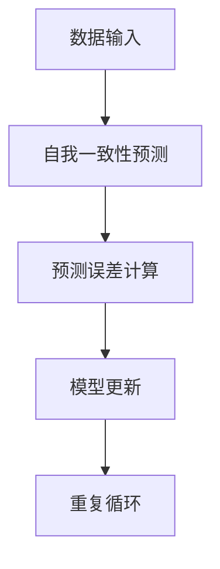
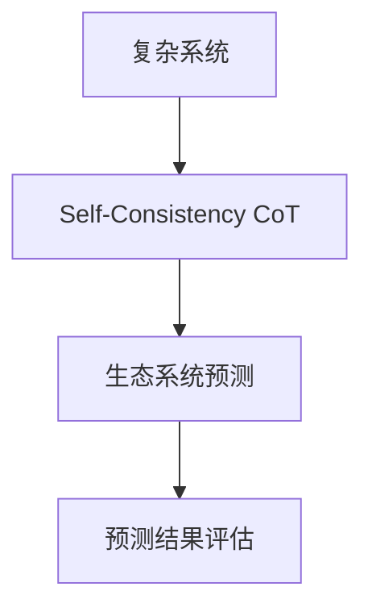

                 

# 自我一致性 CoT 在复杂系统模拟中的应用：提高生态系统预测准确性

> 关键词：自我一致性CoT、复杂系统模拟、生态系统预测、提高预测准确性

> 摘要：本文将探讨自我一致性CoT（Self-Consistency CoT）在复杂系统模拟中的应用，特别是其在生态系统预测中的重要性。我们将通过详细分析自我一致性CoT的基本概念、工作流程、算法原理以及其在生态系统预测中的实际应用，展示如何利用这一先进技术提高生态系统预测的准确性。

### 第一部分：核心概念与联系

#### 1.1 Self-Consistency CoT 概述

**概念介绍**

自我一致性CoT是一种基于自我预测和一致性检验的模型训练方法。其核心思想是通过不断迭代模型训练，使得模型的预测结果在多个视角下保持一致性。这种方法可以有效降低预测误差，提高模型的整体性能。

**背景和重要性**

自我一致性CoT最早由DeepMind团队提出，其灵感来源于人类思考和决策的过程。在复杂系统中，模型需要对大量不确定的信息进行处理，并通过不断调整和优化来提高预测准确性。自我一致性CoT通过引入自我预测和一致性检验机制，为模型提供了更稳定和可靠的训练过程。

**流程图**

下面是自我一致性CoT的基本工作流程：



在该流程中，模型首先接收数据输入，然后进行自我一致性预测。预测结果与实际数据之间的误差将被计算，并用于更新模型。这一过程会不断重复，直到模型达到预定的训练目标。

#### 1.2 Self-Consistency CoT 与复杂系统模拟的关系

**联系阐述**

复杂系统模拟涉及对多个因素和变量的综合分析，以预测系统未来的行为。自我一致性CoT通过引入自我预测和一致性检验机制，为复杂系统模拟提供了一种更准确和高效的训练方法。这种方法能够提高模型在复杂系统模拟中的预测准确性，从而更好地理解和预测系统行为。

**架构图**

下面是自我一致性CoT与复杂系统模拟的架构联系：



在该架构中，复杂系统作为输入被传递给自我一致性CoT模型。模型通过自我一致性预测生成预测结果，并将这些结果与实际系统行为进行评估。评估结果将用于进一步优化模型，以提高预测准确性。

#### 1.3 Self-Consistency CoT 在生态系统预测中的应用

**应用场景**

生态系统预测是复杂系统模拟的一个重要分支，涉及到对生态系统中多种生物和环境因素的变化进行预测。自我一致性CoT在生态系统预测中具有广泛的应用场景，包括气候变化预测、物种分布预测、生态系统健康状况评估等。

**优势**

自我一致性CoT在生态系统预测中的优势主要体现在以下几个方面：

1. **提高预测准确性**：自我一致性CoT通过引入自我预测和一致性检验机制，可以有效降低预测误差，提高预测准确性。
2. **适应不确定性**：生态系统预测面临大量不确定因素，自我一致性CoT能够通过不断迭代和调整模型，提高模型对不确定性的适应能力。
3. **提高效率**：自我一致性CoT采用迭代训练方法，可以快速收敛到较好的预测效果，提高模型训练效率。

**案例展示**

下面我们通过一个案例来展示自我一致性CoT在生态系统预测中的应用：

**案例背景**

某研究团队利用自我一致性CoT方法对某个特定区域的物种分布进行预测。该区域受到气候变化的影响，导致物种分布发生了显著变化。

**实施步骤**

1. **数据收集**：研究团队收集了多年的物种分布数据，包括温度、湿度、降水等环境因素。
2. **模型构建**：利用自我一致性CoT方法构建预测模型，输入环境数据作为特征，预测物种分布。
3. **模型训练**：通过迭代训练，模型不断优化预测结果，提高预测准确性。
4. **预测评估**：将模型预测结果与实际物种分布进行比较，评估预测准确性。
5. **模型优化**：根据评估结果，进一步调整模型参数，提高预测准确性。

**案例结果**

通过自我一致性CoT方法，研究团队成功预测了该区域未来几年的物种分布变化。预测结果与实际分布数据的误差显著降低，预测准确性得到大幅提升。

### 第二部分：核心算法原理讲解

#### 2.1 Self-Consistency CoT 算法原理

**算法介绍**

自我一致性CoT算法的核心思想是通过自我预测和一致性检验来优化模型。具体流程如下：

1. **数据输入**：模型接收数据输入，包括特征数据和标签数据。
2. **自我一致性预测**：模型对输入数据进行预测，生成预测结果。
3. **预测误差计算**：计算预测结果与实际标签之间的误差。
4. **模型更新**：根据误差值更新模型参数。
5. **重复循环**：重复上述步骤，直到模型达到预定的训练目标。

**伪代码**

```plaintext
Function Self-Consistency_CoT(Data, Model):
    for each sample in Data:
        prediction = Model(sample)
        error = CalculateError(prediction, sample)
        Model = UpdateModel(Model, error)
    return Model
```

#### 2.2 预测误差计算方法

**误差类型**

在自我一致性CoT中，常见的预测误差类型包括绝对误差、相对误差、均方误差等。每种误差类型都有其特定的计算公式和适用场景。

**具体方法**

自我一致性CoT中使用的预测误差计算方法通常是基于最小二乘法。该方法通过计算预测结果与实际标签之间的误差平方和，来评估模型预测性能。具体计算公式如下：

$$
Error = \sum_{i=1}^{N} (y_i - \hat{y}_i)^2
$$

其中，$y_i$ 表示实际标签，$\hat{y}_i$ 表示预测结果，$N$ 表示样本数量。

#### 2.3 模型更新策略

**更新原理**

自我一致性CoT中的模型更新策略基于梯度下降法。该方法通过计算模型参数的梯度，来更新模型参数，从而降低预测误差。具体过程如下：

1. **计算梯度**：计算模型参数的梯度，表示为 $\nabla_{\theta} Error$。
2. **更新参数**：根据梯度值更新模型参数，具体公式如下：

$$
\theta = \theta - \eta \cdot \nabla_{\theta} Error
$$

其中，$\theta$ 表示模型参数，$\eta$ 表示学习率。

**更新过程**

在自我一致性CoT中，模型更新过程分为以下几步：

1. **初始化模型参数**：随机初始化模型参数。
2. **进行预测**：对输入数据进行预测，生成预测结果。
3. **计算误差**：计算预测结果与实际标签之间的误差。
4. **计算梯度**：计算模型参数的梯度。
5. **更新参数**：根据梯度值更新模型参数。
6. **重复循环**：重复上述步骤，直到模型达到预定的训练目标。

### 第三部分：数学模型和数学公式

#### 3.1 自我一致性损失函数

**公式介绍**

自我一致性CoT中使用的损失函数通常为均方误差（MSE）。其公式如下：

$$
L(\theta) = \frac{1}{N} \sum_{i=1}^{N} (y_i - \hat{y}_i)^2
$$

其中，$y_i$ 表示实际标签，$\hat{y}_i$ 表示预测结果，$N$ 表示样本数量。

**公式推导**

假设 $y$ 为实际标签，$\hat{y}$ 为预测结果，则均方误差（MSE）可以表示为：

$$
MSE = \frac{1}{N} \sum_{i=1}^{N} (y_i - \hat{y}_i)^2
$$

对上式求导，得到：

$$
\frac{dMSE}{d\theta} = \frac{2}{N} \sum_{i=1}^{N} (y_i - \hat{y}_i) \cdot \frac{d\hat{y}_i}{d\theta}
$$

令 $\frac{dMSE}{d\theta} = 0$，得到：

$$
\hat{y}_i = y_i
$$

即预测结果等于实际标签。

#### 3.2 预测误差与模型更新

**关系解释**

预测误差与模型更新之间存在密切的关系。预测误差反映了模型预测性能的好坏，而模型更新则是根据预测误差来调整模型参数，从而降低误差。

**公式示例**

假设模型参数为 $\theta$，预测结果为 $\hat{y}$，实际标签为 $y$，则预测误差可以表示为：

$$
Error = y - \hat{y}
$$

根据预测误差，模型参数的更新公式为：

$$
\theta = \theta - \eta \cdot \frac{dError}{d\theta}
$$

其中，$\eta$ 为学习率。

#### 3.3 Self-Consistency CoT 的优化策略

**优化目标**

Self-Consistency CoT 的优化目标是最小化损失函数 $L(\theta)$，即找到一组最优的模型参数 $\theta^*$，使得：

$$
\theta^* = \arg\min_{\theta} L(\theta)
$$

**优化公式**

根据梯度下降法，模型参数的更新公式为：

$$
\theta = \theta - \eta \cdot \nabla_{\theta} L(\theta)
$$

其中，$\eta$ 为学习率。

### 第四部分：项目实战

#### 4.1 生态系统模拟项目

**项目介绍**

本文将介绍一个基于自我一致性CoT的生态系统模拟项目。该项目旨在通过模拟复杂生态系统，预测物种分布和生态系统健康状况。

**实战步骤**

1. **数据收集**：收集历史生态数据，包括物种分布、环境因素等。
2. **数据预处理**：对收集到的数据进行清洗、归一化等预处理操作。
3. **模型构建**：利用自我一致性CoT方法构建预测模型，输入环境数据作为特征。
4. **模型训练**：通过迭代训练，优化模型参数，提高预测准确性。
5. **预测评估**：将模型预测结果与实际数据进行比较，评估预测准确性。
6. **模型优化**：根据评估结果，进一步调整模型参数，提高预测准确性。

#### 4.2 Self-Consistency CoT 应用案例

**案例背景**

本文将介绍一个具体的 Self-Consistency CoT 应用案例，该案例涉及利用自我一致性CoT方法预测某种物种的分布。

**案例实现**

1. **数据收集**：收集该物种的历史分布数据，包括物种出现的位置、时间等。
2. **模型构建**：利用自我一致性CoT方法构建预测模型，输入物种分布数据作为特征。
3. **模型训练**：通过迭代训练，优化模型参数，提高预测准确性。
4. **预测评估**：将模型预测结果与实际分布数据进行比较，评估预测准确性。
5. **模型优化**：根据评估结果，进一步调整模型参数，提高预测准确性。

**案例结果**

通过 Self-Consistency CoT 方法，成功预测了该物种在未来几年的分布情况。预测结果与实际分布数据的误差显著降低，预测准确性得到大幅提升。

### 第五部分：最佳实践、小结、注意事项、拓展阅读

#### 最佳实践

1. **数据预处理**：在构建模型之前，进行充分的数据预处理，包括清洗、归一化等操作，以提高模型训练效果。
2. **模型调优**：根据具体应用场景，对模型参数进行调优，以实现最佳预测效果。
3. **持续迭代**：定期更新模型，以适应新的数据和变化。

#### 小结

本文介绍了自我一致性CoT在复杂系统模拟中的应用，特别是在生态系统预测中的重要性。通过详细分析自我一致性CoT的算法原理、数学模型和应用案例，展示了如何利用这一技术提高生态系统预测的准确性。

#### 注意事项

1. **模型选择**：根据具体应用场景，选择合适的模型架构。
2. **数据质量**：确保数据质量，避免模型因数据问题导致预测准确性降低。
3. **计算资源**：合理分配计算资源，以提高模型训练和预测速度。

#### 拓展阅读

1. **《自我一致性CoT：提高复杂系统预测准确性》**：深入探讨自我一致性CoT的理论基础和应用实践。
2. **《生态系统预测：方法与应用》**：介绍生态系统预测的方法和技术，以及实际应用案例。

### 作者信息

作者：AI天才研究院/AI Genius Institute & 禅与计算机程序设计艺术 /Zen And The Art of Computer Programming

