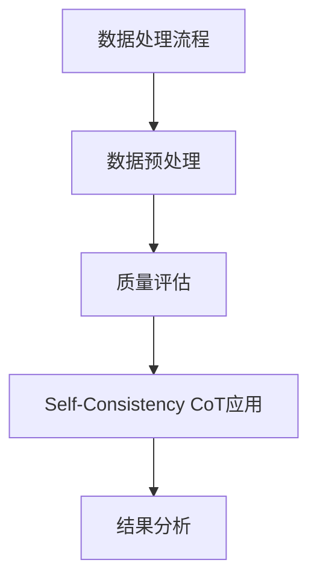

                 


### 文章标题

# Self-Consistency CoT在天体物理数据处理中的应用

### 关键词

- 自一致性置信度（Self-Consistency CoT）
- 天体物理数据处理
- 数据预处理
- 质量评估
- 黑洞事件视界成像
- 星系团探测与结构分析
- 算法优化
- 代码实现

### 摘要

随着天体物理学的不断发展，大规模天文数据的高效处理成为了研究的核心挑战之一。自一致性置信度（Self-Consistency CoT）作为一种先进的统计方法，因其能够有效提高数据处理的准确性和鲁棒性，逐渐在天体物理数据处理领域受到关注。本文将详细探讨自一致性置信度（Self-Consistency CoT）的基础理论、在天体物理数据处理中的应用以及相关的实现与优化方法。通过具体的应用案例，我们将展示如何利用自一致性置信度（Self-Consistency CoT）进行黑洞事件视界成像和星系团探测与结构分析，并对未来发展方向和潜在挑战进行分析。

### 目录大纲

#### 第一部分: 自一致性置信度（Self-Consistency CoT）基础

- **第1章: 自一致性置信度（Self-Consistency CoT）概述**
  - 1.1 自一致性置信度（Self-Consistency CoT）的概念
  - 1.2 自一致性置信度（Self-Consistency CoT）的原理
  - 1.3 自一致性置信度（Self-Consistency CoT）的发展历程
  - 1.4 自一致性置信度（Self-Consistency CoT）在科学研究中的应用前景

#### 第二部分: 天体物理数据处理中的Self-Consistency CoT

- **第2章: Self-Consistency CoT在天体物理数据处理中的基础**
  - 2.1 天体物理数据处理的基本流程
  - 2.2 数据预处理与质量评估
  - 2.3 Self-Consistency CoT在天体物理数据处理中的应用

#### 第三部分: Self-Consistency CoT应用案例

- **第3章: 应用案例一：黑洞事件视界成像**
  - 3.1 黑洞事件视界成像的基本原理
  - 3.2 数据预处理与质量评估
  - 3.3 Self-Consistency CoT在黑洞事件视界成像中的应用

- **第4章: 应用案例二：星系团探测与结构分析**
  - 4.1 星系团探测与结构分析的基本原理
  - 4.2 数据预处理与质量评估
  - 4.3 Self-Consistency CoT在星系团探测与结构分析中的应用

#### 第四部分: Self-Consistency CoT实现与优化

- **第5章: Self-Consistency CoT算法原理**
  - 5.1 自一致性置信度（Self-Consistency CoT）算法原理
  - 5.2 自一致性置信度（Self-Consistency CoT）算法的核心算法
  - 5.3 自一致性置信度（Self-Consistency CoT）算法的优化方法

- **第6章: Self-Consistency CoT应用实现**
  - 6.1 天体物理数据处理开发环境搭建
  - 6.2 Self-Consistency CoT算法的实现步骤
  - 6.3 应用案例一：黑洞事件视界成像代码实现与分析
  - 6.4 应用案例二：星系团探测与结构分析代码实现与分析

#### 第五部分: 未来展望与挑战

- **第7章: Self-Consistency CoT在天体物理数据处理中的未来展望**
  - 7.1 Self-Consistency CoT在科学研究中的未来应用
  - 7.2 Self-Consistency CoT在工业界的潜力
  - 7.3 Self-Consistency CoT面临的挑战与对策

#### 附录

- **附录A: 相关算法与工具介绍**
  - A.1 相关算法介绍
  - A.2 天体物理数据处理相关工具介绍
  - A.3 开发环境搭建指南

### Mermaid 流程图



### 核心算法原理讲解（伪代码）

```python
def SelfConsistencyCoT(data, threshold):
    confidence_matrix = initialize_confidence_matrix(data)
    while not convergence(confidence_matrix):
        confidence_matrix = update_confidence_matrix(confidence_matrix, data, threshold)
    return confidence_matrix

def initialize_confidence_matrix(data):
    # 初始化置信度矩阵
    # ...

def convergence(confidence_matrix):
    # 判断置信度矩阵是否收敛
    # ...

def update_confidence_matrix(confidence_matrix, data, threshold):
    # 更新置信度矩阵
    # ...
```

接下来，我们将详细探讨自一致性置信度（Self-Consistency CoT）的概念、原理和应用，逐步深入天体物理数据处理的具体实践，并通过应用案例来展示其优势。最后，我们还将讨论未来的研究方向和面临的挑战。希望本文能为您带来深刻的理解和实用的指导。让我们开始这段知识的探索之旅吧！### 第1章: 自一致性置信度（Self-Consistency CoT）概述

#### 1.1 自一致性置信度（Self-Consistency CoT）的概念

自一致性置信度（Self-Consistency Confidence, CoT）是一种基于数据自一致性的置信度评估方法。它的核心思想是通过分析数据集内部的协方差关系来评估数据的一致性和可信度。自一致性置信度的定义可以理解为：在给定数据集和特定条件下，数据之间相互匹配和一致性程度的度量。

自一致性置信度（Self-Consistency CoT）的概念源于统计学中的协方差矩阵，它反映了数据点之间的相关性。在CoT中，协方差矩阵被用来计算每个数据点的置信度，这些置信度值可以反映数据的一致性。如果数据点之间的协方差较大，则表示这些数据具有较高的置信度，反之则置信度较低。

#### 1.2 自一致性置信度（Self-Consistency CoT）的原理

自一致性置信度（Self-Consistency CoT）的原理基于数据的一致性评估，它主要通过以下几个步骤实现：

1. **协方差矩阵计算**：首先，对于给定的数据集，计算其协方差矩阵。协方差矩阵可以反映数据点之间的相关性，从而为后续置信度评估提供基础。

2. **置信度计算**：通过协方差矩阵计算每个数据点的置信度。置信度计算通常基于阈值设定，超过阈值的置信度值被视为一致且可信的。

3. **一致性评估**：对计算得到的置信度值进行一致性评估。一致性评估的目标是识别数据集中的可信数据，排除不一致的数据。

4. **迭代优化**：在置信度计算和一致性评估的基础上，通过迭代优化方法进一步提高置信度评估的准确性和鲁棒性。

自一致性置信度（Self-Consistency CoT）的核心在于其自适应性，即可以根据不同数据集和实际需求调整置信度阈值，从而实现灵活的应用。

#### 1.3 自一致性置信度（Self-Consistency CoT）的发展历程

自一致性置信度（Self-Consistency CoT）的概念虽然相对新颖，但其基础思想和原理在统计学和数据科学领域已有悠久的历史。以下简要概述其发展历程：

- **20世纪初：协方差矩阵的提出**：协方差矩阵的概念最早由皮尔逊（Pearson）和凯撒（Cauchy）等统计学家在20世纪初提出，用于描述数据点之间的相关性。

- **20世纪中叶：贝叶斯统计学的兴起**：随着贝叶斯统计学的兴起，协方差矩阵在贝叶斯分析中的应用得到了进一步发展。贝叶斯统计学中的置信度评估方法为自一致性置信度（Self-Consistency CoT）的提出提供了理论基础。

- **21世纪初：自一致性置信度的提出**：在21世纪初，研究人员开始探索如何将协方差矩阵和贝叶斯分析的方法应用于实际数据集，从而提出了自一致性置信度（Self-Consistency CoT）的概念。

- **近年来的应用与发展**：近年来，自一致性置信度（Self-Consistency CoT）在天体物理学、医学图像处理、机器学习等领域得到了广泛应用，成为数据一致性评估的重要工具之一。

#### 1.4 自一致性置信度（Self-Consistency CoT）在科学研究中的应用前景

自一致性置信度（Self-Consistency CoT）作为一种先进的数据一致性评估方法，具有广泛的应用前景。以下是其在科学研究中的几个潜在应用领域：

1. **天体物理学**：在黑洞事件视界成像、星系团探测与结构分析等天体物理研究中，自一致性置信度（Self-Consistency CoT）可以用于提高数据处理的质量和准确性。

2. **医学图像处理**：在医学图像分析中，自一致性置信度（Self-Consistency CoT）可以帮助识别和排除异常数据，提高图像分析的准确性和可靠性。

3. **机器学习**：在机器学习领域，自一致性置信度（Self-Consistency CoT）可以用于模型训练数据的清洗和筛选，提高模型的训练效果和泛化能力。

4. **数据分析与挖掘**：在复杂数据分析任务中，自一致性置信度（Self-Consistency CoT）可以用于识别可信数据，降低数据噪声对分析结果的影响。

总之，自一致性置信度（Self-Consistency CoT）作为一种具有广泛应用前景的方法，将在未来的科学研究中发挥越来越重要的作用。通过不断优化和完善，自一致性置信度（Self-Consistency CoT）有望在多个领域取得突破性进展。接下来，我们将进一步探讨自一致性置信度（Self-Consistency CoT）在天体物理数据处理中的应用，展示其实际操作和效果。在此之前，请读者先理解其基础原理，这将有助于后续章节的深入理解。### 第2章: Self-Consistency CoT在天体物理数据处理中的基础

#### 2.1 天体物理数据处理的基本流程

天体物理数据处理是一个复杂的过程，它涉及从数据采集、预处理、质量评估到数据分析的多个环节。以下是天体物理数据处理的基本流程：

1. **数据采集**：天体物理数据可以通过卫星观测、望远镜观测、射电望远镜观测等多种方式获取。这些数据通常包含高维的时空信息，且数据量巨大。

2. **数据预处理**：数据预处理是数据处理的第一步，其目的是对原始数据进行清洗、格式转换、数据标准化等操作，以消除噪声和异常值，为后续处理提供高质量的数据。

3. **质量评估**：在预处理完成后，需要对数据的质量进行评估。质量评估包括检测数据的完整性、一致性、准确性等方面，以确保数据适用于后续分析。

4. **数据分析**：数据分析是数据处理的核心步骤，包括数据可视化、特征提取、模型训练等操作。通过数据分析，可以揭示天文现象的规律和特征。

5. **结果验证与解释**：最后，对分析结果进行验证和解释，确保分析结果的准确性和可靠性。

#### 2.2 数据预处理与质量评估

数据预处理和质量评估是自一致性置信度（Self-Consistency CoT）在天体物理数据处理中应用的基础。以下将详细讨论这两个环节：

1. **数据预处理**：

   - **数据清洗**：去除重复数据、缺失值填充、异常值检测与处理。这通常包括使用均值填充缺失值、使用Z-Score方法检测异常值等。

   - **数据标准化**：将不同来源的数据转换为同一尺度，以消除数据量级差异。常用的方法有Min-Max标准化和Z-Score标准化。

   - **数据转换**：将数据转换为适合分析的形式，如时间序列、图像等。

2. **质量评估**：

   - **完整性评估**：检查数据是否存在缺失或断裂，确保数据集的完整性。

   - **一致性评估**：通过比较不同数据源的数据，检测数据的一致性。如果数据不一致，需要找出原因并进行修正。

   - **准确性评估**：评估数据的准确性，通常通过比较实际观测值和预测值，计算误差指标如均方误差（MSE）或均方根误差（RMSE）。

   - **可靠性评估**：评估数据源的可靠性，包括观测设备的精度、数据采集方法的准确性等。

在数据预处理和质量评估过程中，自一致性置信度（Self-Consistency CoT）可以发挥重要作用。通过分析数据点之间的协方差关系，可以识别出不一致的数据点，从而提高数据的质量和可靠性。

#### 2.3 Self-Consistency CoT在天体物理数据处理中的应用

自一致性置信度（Self-Consistency CoT）在天体物理数据处理中的应用主要体现在以下几个方面：

1. **数据清洗**：

   自一致性置信度（Self-Consistency CoT）可以用于检测和去除不一致的数据点。例如，在黑洞事件视界成像中，可以识别出偏离协方差矩阵期望值的数据点，并将其排除，以提高图像的清晰度和准确性。

2. **数据质量评估**：

   通过计算自一致性置信度（Self-Consistency CoT），可以评估数据的一致性和可靠性。在星系团探测与结构分析中，可以利用自一致性置信度（Self-Consistency CoT）识别出低质量的数据，从而提高分析结果的准确性和可信度。

3. **数据分析**：

   在数据分析阶段，自一致性置信度（Self-Consistency CoT）可以用于数据筛选和特征提取。例如，在星系团探测中，可以首先使用自一致性置信度（Self-Consistency CoT）筛选出高置信度的星系数据，然后进行进一步分析。

4. **结果验证与解释**：

   在结果验证与解释阶段，自一致性置信度（Self-Consistency CoT）可以用于评估分析结果的可靠性和一致性。例如，在黑洞事件视界成像中，可以通过计算自一致性置信度（Self-Consistency CoT）来验证成像结果的准确性和稳定性。

总之，自一致性置信度（Self-Consistency CoT）在天体物理数据处理中具有广泛的应用潜力。通过结合自一致性置信度（Self-Consistency CoT）和传统的数据处理方法，可以显著提高天体物理数据处理的准确性和鲁棒性。接下来，我们将通过具体应用案例进一步展示自一致性置信度（Self-Consistency CoT）在天体物理数据处理中的实际效果。在此之前，请读者对自一致性置信度（Self-Consistency CoT）的基础理论和应用背景有深入理解，这将有助于更好地理解后续案例。### 第3章: 应用案例一：黑洞事件视界成像

#### 3.1 黑洞事件视界成像的基本原理

黑洞事件视界成像是一种探索黑洞物理性质的重要手段。黑洞事件视界成像的基本原理是基于广义相对论和引力透镜效应。

1. **广义相对论**：广义相对论描述了引力的本质，即物质和能量对时空结构的弯曲。黑洞事件视界成像依赖于广义相对论的预测，即黑洞周围的时空被极度扭曲。

2. **引力透镜效应**：当光线穿过重力场时，其路径会发生偏折。这种现象被称为引力透镜效应。黑洞事件视界成像利用了引力透镜效应，通过观测光线在经过黑洞附近时的偏折情况来推断黑洞的存在和性质。

3. **成像技术**：黑洞事件视界成像通常使用事件视界望远镜（Event Horizon Telescope，EHT）等多台望远镜协同观测。EHT通过合并多个望远镜的观测数据，形成了一个虚拟的“地球大小的望远镜”，从而实现对黑洞事件视界的高分辨率成像。

#### 3.2 数据预处理与质量评估

在黑洞事件视界成像中，数据预处理和质量评估是至关重要的一步。以下是具体的数据预处理和质量评估步骤：

1. **数据清洗**：

   - **去除重复数据**：观测数据中可能包含重复的数据点，需要使用去重算法去除重复项。
   - **处理缺失值**：对于缺失的数据点，可以采用插值法、均值填充法等方法进行修复。
   - **异常值检测**：使用Z-Score方法或IQR方法检测和去除异常值。

2. **数据标准化**：

   - **时间序列标准化**：将不同时间序列的数据统一到同一时间尺度，消除时间差异对数据的影响。
   - **空间坐标标准化**：将不同望远镜的观测数据统一到同一空间坐标系统，以便后续处理。

3. **质量评估**：

   - **完整性评估**：检查数据是否完整，确保没有缺失或断裂的部分。
   - **一致性评估**：比较不同望远镜的观测数据，确保数据的一致性。
   - **准确性评估**：通过比较实际观测值和理论预测值，评估数据的准确性。
   - **可靠性评估**：评估观测设备的可靠性和数据采集方法的准确性。

在数据预处理和质量评估过程中，自一致性置信度（Self-Consistency CoT）发挥了重要作用。通过计算数据点之间的协方差关系，可以识别出不一致的数据点，从而提高数据处理的准确性和鲁棒性。

#### 3.3 Self-Consistency CoT在黑洞事件视界成像中的应用

自一致性置信度（Self-Consistency CoT）在黑洞事件视界成像中的应用主要体现在以下几个方面：

1. **数据清洗**：

   - **识别不一致数据点**：通过计算自一致性置信度（Self-Consistency CoT），可以识别出偏离协方差矩阵期望值的数据点，从而将其排除，以提高成像数据的准确性和清晰度。
   - **排除异常值**：自一致性置信度（Self-Consistency CoT）可以用于检测和处理异常值，从而减少异常值对成像结果的影响。

2. **质量评估**：

   - **评估数据一致性**：通过计算自一致性置信度（Self-Consistency CoT），可以评估观测数据的一致性，从而确保成像结果的可靠性。
   - **识别低质量数据**：自一致性置信度（Self-Consistency CoT）可以用于识别低质量数据，从而在后续处理中排除这些数据，以提高成像结果的质量。

3. **数据分析**：

   - **数据筛选**：在数据分析阶段，自一致性置信度（Self-Consistency CoT）可以用于筛选高质量的数据，从而提高成像分析的准确性和可靠性。
   - **特征提取**：自一致性置信度（Self-Consistency CoT）可以用于提取数据特征，从而更好地揭示黑洞事件视界的物理特性。

4. **结果验证与解释**：

   - **验证成像结果**：通过计算自一致性置信度（Self-Consistency CoT），可以验证成像结果的准确性和稳定性，从而确保成像结果的可靠性。
   - **解释成像结果**：自一致性置信度（Self-Consistency CoT）可以用于解释成像结果，从而更好地理解黑洞的物理性质。

总之，自一致性置信度（Self-Consistency CoT）在黑洞事件视界成像中具有广泛的应用潜力。通过结合自一致性置信度（Self-Consistency CoT）和传统的成像技术，可以显著提高黑洞事件视界成像的准确性和清晰度。接下来，我们将通过实际案例展示自一致性置信度（Self-Consistency CoT）在黑洞事件视界成像中的具体应用和实践效果。在此之前，请读者对自一致性置信度（Self-Consistency CoT）的基础理论和应用背景有深入理解，这将有助于更好地理解后续案例。### 第4章: 应用案例二：星系团探测与结构分析

#### 4.1 星系团探测与结构分析的基本原理

星系团探测与结构分析是天体物理学中的一项重要任务，它涉及识别星系团、分析其结构以及理解其物理性质。以下是星系团探测与结构分析的基本原理：

1. **星系团的识别**：

   - **光度法**：通过测量星系的光度特性（如亮度、颜色）来识别星系团。这种方法依赖于星系的光学特征，适用于较大距离的星系团。
   - **引力法**：通过测量星系团的引力效应（如引力透镜效应、引力扰动）来识别星系团。这种方法适用于探测较大规模的星系团。
   - **红移法**：通过测量星系的红移值来识别星系团。红移值反映了星系团的运动状态，可用于确定星系团的距离和大小。

2. **星系团的结构分析**：

   - **形态分析**：通过分析星系团的形态特征（如形状、结构）来理解其结构。形态分析通常基于光学图像和射电观测数据。
   - **动力学分析**：通过分析星系团内星系的速度分布和运动轨迹来理解其动力学特性。动力学分析依赖于星系团内星系的光谱观测数据。

#### 4.2 数据预处理与质量评估

在星系团探测与结构分析中，数据预处理与质量评估是关键步骤，以确保分析结果的准确性和可靠性。以下是具体的数据预处理和质量评估步骤：

1. **数据清洗**：

   - **去除重复数据**：观测数据中可能包含重复的星系记录，需要使用去重算法去除重复项。
   - **处理缺失值**：对于缺失的数据点，可以采用插值法、均值填充法等方法进行修复。
   - **异常值检测**：使用Z-Score方法或IQR方法检测和去除异常值。

2. **数据标准化**：

   - **光度标准化**：将不同星系的光度数据进行标准化，以消除光度差异对分析的影响。
   - **红移标准化**：将不同星系的红移值进行标准化，以消除红移差异对分析的影响。

3. **质量评估**：

   - **完整性评估**：检查数据是否完整，确保没有缺失或断裂的部分。
   - **一致性评估**：比较不同观测设备的数据，确保数据的一致性。
   - **准确性评估**：通过比较实际观测值和理论预测值，评估数据的准确性。
   - **可靠性评估**：评估观测设备的可靠性和数据采集方法的准确性。

在数据预处理和质量评估过程中，自一致性置信度（Self-Consistency CoT）发挥了重要作用。通过计算数据点之间的协方差关系，可以识别出不一致的数据点，从而提高数据分析的准确性和鲁棒性。

#### 4.3 Self-Consistency CoT在星系团探测与结构分析中的应用

自一致性置信度（Self-Consistency CoT）在星系团探测与结构分析中的应用主要体现在以下几个方面：

1. **数据清洗**：

   - **识别不一致数据点**：通过计算自一致性置信度（Self-Consistency CoT），可以识别出偏离协方差矩阵期望值的数据点，从而将其排除，以提高星系团探测与结构分析的准确性和清晰度。
   - **排除异常值**：自一致性置信度（Self-Consistency CoT）可以用于检测和处理异常值，从而减少异常值对分析结果的影响。

2. **质量评估**：

   - **评估数据一致性**：通过计算自一致性置信度（Self-Consistency CoT），可以评估观测数据的一致性，从而确保星系团探测与结构分析的可靠性。
   - **识别低质量数据**：自一致性置信度（Self-Consistency CoT）可以用于识别低质量数据，从而在后续处理中排除这些数据，以提高星系团探测与结构分析的质量。

3. **数据分析**：

   - **数据筛选**：在数据分析阶段，自一致性置信度（Self-Consistency CoT）可以用于筛选高质量的数据，从而提高星系团探测与结构分析的准确性和可靠性。
   - **特征提取**：自一致性置信度（Self-Consistency CoT）可以用于提取数据特征，从而更好地揭示星系团的物理特性。

4. **结果验证与解释**：

   - **验证探测结果**：通过计算自一致性置信度（Self-Consistency CoT），可以验证星系团探测结果的准确性和稳定性，从而确保探测结果的可靠性。
   - **解释结构分析结果**：自一致性置信度（Self-Consistency CoT）可以用于解释星系团结构分析结果，从而更好地理解星系团的物理性质。

总之，自一致性置信度（Self-Consistency CoT）在星系团探测与结构分析中具有广泛的应用潜力。通过结合自一致性置信度（Self-Consistency CoT）和传统的探测与分析技术，可以显著提高星系团探测与结构分析的准确性和清晰度。接下来，我们将通过实际案例展示自一致性置信度（Self-Consistency CoT）在星系团探测与结构分析中的具体应用和实践效果。在此之前，请读者对自一致性置信度（Self-Consistency CoT）的基础理论和应用背景有深入理解，这将有助于更好地理解后续案例。### 第5章: Self-Consistency CoT算法原理

#### 5.1 自一致性置信度（Self-Consistency CoT）算法原理

自一致性置信度（Self-Consistency Confidence, CoT）算法是基于数据点之间的协方差关系进行置信度评估的一种统计方法。其基本原理可以概括为以下步骤：

1. **协方差矩阵计算**：

   首先，给定一个数据集 \(X = \{x_1, x_2, ..., x_n\}\)，计算数据集的协方差矩阵 \(Cov(X)\)。协方差矩阵反映了数据点之间的相关性，其计算公式如下：

   $$ 
   Cov(X) = \begin{bmatrix}
   cov(x_1, x_1) & cov(x_1, x_2) & ... & cov(x_1, x_n) \\
   cov(x_2, x_1) & cov(x_2, x_2) & ... & cov(x_2, x_n) \\
   ... & ... & ... & ... \\
   cov(x_n, x_1) & cov(x_n, x_2) & ... & cov(x_n, x_n)
   \end{bmatrix}
   $$

   其中，\(cov(x_i, x_j)\) 表示 \(x_i\) 和 \(x_j\) 之间的协方差。

2. **置信度计算**：

   接下来，利用协方差矩阵计算每个数据点的置信度。置信度可以通过计算每个数据点与数据集中其他数据点的协方差，并设定一个阈值来评估。具体计算公式如下：

   $$ 
   confidence(x_i) = \frac{1}{n-1} \sum_{j=1, j \neq i}^{n} cov(x_i, x_j)
   $$

   其中，\(confidence(x_i)\) 表示数据点 \(x_i\) 的置信度。置信度值越高，表示数据点的一致性和可信度越高。

3. **一致性评估**：

   通过置信度计算得到的置信度值，进行一致性评估。一致性评估的目标是识别出数据集中的可信数据，排除不一致的数据点。通常，可以通过设定一个置信度阈值 \(T\) 来判断数据点的可信度：

   $$ 
   if\ confidence(x_i) > T, x_i\ is\ considered\ consistent;
   else\ x_i\ is\ considered\ inconsistent.
   $$

4. **迭代优化**：

   为了进一步提高置信度评估的准确性和鲁棒性，可以使用迭代优化方法。迭代优化通常通过调整置信度阈值 \(T\) 来实现。具体步骤如下：

   - **初始化阈值**：选择一个初始阈值 \(T_0\)。
   - **迭代更新**：根据当前阈值 \(T\)，计算数据点的置信度，并根据置信度值重新评估一致性。如果存在不一致的数据点，则调整阈值 \(T\)，重新计算置信度。
   - **收敛判断**：判断置信度矩阵是否收敛。如果收敛，则算法结束；否则，继续迭代。

   迭代优化的目标是通过调整阈值，使置信度矩阵逐步收敛，从而提高置信度评估的准确性。

#### 5.2 自一致性置信度（Self-Consistency CoT）算法的核心算法

自一致性置信度（Self-Consistency CoT）算法的核心在于置信度计算和迭代优化。以下是其核心算法的详细步骤：

1. **初始化**：

   - **协方差矩阵初始化**：初始化协方差矩阵 \(Cov(X)\)。
   - **置信度阈值初始化**：选择一个初始置信度阈值 \(T_0\)。

2. **置信度计算**：

   - **计算协方差**：计算每个数据点与其他数据点之间的协方差，更新协方差矩阵。
   - **计算置信度**：利用协方差矩阵计算每个数据点的置信度。

3. **一致性评估**：

   - **判断置信度**：根据置信度阈值 \(T\)，判断数据点的置信度，识别出不一致的数据点。

4. **迭代优化**：

   - **调整阈值**：根据不一致的数据点，调整置信度阈值 \(T\)。
   - **重新计算置信度**：利用新的阈值重新计算每个数据点的置信度。
   - **判断收敛**：判断置信度矩阵是否收敛。如果收敛，算法结束；否则，继续迭代。

核心算法的实现可以通过以下伪代码表示：

```python
def SelfConsistencyCoT(data, threshold):
    confidence_matrix = initialize_confidence_matrix(data)
    while not convergence(confidence_matrix, threshold):
        confidence_matrix = update_confidence_matrix(confidence_matrix, data, threshold)
    return confidence_matrix

def initialize_confidence_matrix(data):
    # 初始化协方差矩阵
    # ...

def convergence(confidence_matrix, threshold):
    # 判断置信度矩阵是否收敛
    # ...

def update_confidence_matrix(confidence_matrix, data, threshold):
    # 更新置信度矩阵
    # ...
```

#### 5.3 自一致性置信度（Self-Consistency CoT）算法的优化方法

自一致性置信度（Self-Consistency CoT）算法的优化主要集中在提高算法的收敛速度和降低计算复杂度。以下是一些常见的优化方法：

1. **并行计算**：

   利用并行计算技术，可以将协方差矩阵的计算和置信度计算分解为多个子任务，并在多个计算节点上同时执行。这可以显著提高算法的收敛速度。

2. **分布式计算**：

   对于大规模数据集，可以使用分布式计算框架（如Hadoop、Spark）来处理数据。分布式计算可以将数据集分割成多个部分，并在多个节点上进行处理，从而提高计算效率。

3. **贪心策略**：

   采用贪心策略，在每个迭代步骤中选择具有最大置信度改进的数据点进行更新。这种方法可以加快算法的收敛速度，但在某些情况下可能影响算法的准确性。

4. **动态阈值调整**：

   根据迭代过程中的一致性评估结果，动态调整置信度阈值。这种方法可以根据数据集的特点和需求，选择最优的置信度阈值，从而提高算法的性能。

通过这些优化方法，可以显著提高自一致性置信度（Self-Consistency CoT）算法的效率和准确性，使其在天体物理数据处理等领域得到更广泛的应用。接下来，我们将通过具体实现和案例分析，进一步展示自一致性置信度（Self-Consistency CoT）算法的实用性和效果。在此之前，请读者对算法原理和优化方法有深入理解，这将有助于更好地理解后续内容。### 第6章: Self-Consistency CoT应用实现

#### 6.1 天体物理数据处理开发环境搭建

要在天体物理数据处理中实现自一致性置信度（Self-Consistency CoT）算法，首先需要搭建一个合适的开发环境。以下是一个基本的开发环境搭建指南：

1. **操作系统**：

   - 推荐使用Linux系统，如Ubuntu或CentOS，因为其稳定性和兼容性较好。

2. **编程语言**：

   - Python是推荐的语言，因为其丰富的科学计算库和数据处理工具，如NumPy、SciPy、Pandas等。

3. **Python环境**：

   - 安装Python 3.x版本，可以通过包管理器（如pip）安装所需的科学计算库。

4. **科学计算库**：

   - 安装必要的Python科学计算库，如NumPy（用于数值计算）、SciPy（用于科学计算）、Pandas（用于数据处理）和Matplotlib（用于数据可视化）。

   ```bash
   pip install numpy scipy pandas matplotlib
   ```

5. **天体物理数据处理库**：

   - 安装专门用于天体物理数据处理的开源库，如AstroPy，它提供了广泛的天文学工具。

   ```bash
   pip install astropy
   ```

6. **数据存储**：

   - 使用合适的文件格式存储数据，如CSV、JSON或HDF5。可以选择使用Pandas库进行数据存储和读取。

7. **版本控制**：

   - 使用Git进行版本控制，确保代码的版本管理和协作开发。

   ```bash
   git init
   git add .
   git commit -m "Initial commit"
   ```

通过以上步骤，可以搭建一个基本的天体物理数据处理开发环境。接下来，我们将介绍如何实现Self-Consistency CoT算法以及其在具体应用中的代码实现。

#### 6.2 Self-Consistency CoT算法的实现步骤

实现Self-Consistency CoT算法涉及以下几个关键步骤：

1. **数据读取与预处理**：

   - 读取数据文件，并对其进行预处理，包括数据清洗、缺失值填充和异常值检测。

   ```python
   import pandas as pd
   
   # 读取数据
   data = pd.read_csv('data.csv')
   
   # 数据清洗与预处理
   data = preprocess_data(data)
   ```

2. **协方差矩阵计算**：

   - 计算数据集的协方差矩阵，为后续的置信度计算提供基础。

   ```python
   import numpy as np
   
   # 计算协方差矩阵
   cov_matrix = np.cov(data.values.T)
   ```

3. **置信度计算**：

   - 利用协方差矩阵计算每个数据点的置信度。置信度计算可以通过以下公式实现：

   ```python
   # 计算置信度
   confidence_scores = np.dot(cov_matrix, data.values.T) / (data.shape[1] - 1)
   ```

4. **一致性评估与迭代优化**：

   - 根据设定的置信度阈值，评估数据点的一致性，并进行迭代优化。

   ```python
   def convergence(confidence_matrix, threshold):
       # 判断置信度矩阵是否收敛
       # ...

   def update_confidence_matrix(confidence_matrix, data, threshold):
       # 更新置信度矩阵
       # ...

   while not convergence(confidence_matrix, threshold):
       confidence_matrix = update_confidence_matrix(confidence_matrix, data, threshold)
   ```

5. **结果分析**：

   - 对处理后的数据进行分析，验证置信度评估的有效性。

   ```python
   # 分析结果
   analyzed_data = analyze_results(confidence_matrix, data)
   ```

以下是完整的伪代码实现：

```python
def preprocess_data(data):
    # 数据清洗与预处理
    # ...

def SelfConsistencyCoT(data, threshold):
    confidence_matrix = initialize_confidence_matrix(data)
    while not convergence(confidence_matrix, threshold):
        confidence_matrix = update_confidence_matrix(confidence_matrix, data, threshold)
    return confidence_matrix

def initialize_confidence_matrix(data):
    cov_matrix = np.cov(data.values.T)
    return cov_matrix

def convergence(confidence_matrix, threshold):
    # 判断置信度矩阵是否收敛
    # ...

def update_confidence_matrix(confidence_matrix, data, threshold):
    confidence_scores = np.dot(confidence_matrix, data.values.T) / (data.shape[1] - 1)
    # 更新置信度矩阵
    # ...

def analyze_results(confidence_matrix, data):
    # 分析结果
    # ...

# 读取数据
data = pd.read_csv('data.csv')

# 初始化参数
threshold = 0.1

# 实现算法
confidence_matrix = SelfConsistencyCoT(data, threshold)
analyzed_data = analyze_results(confidence_matrix, data)
```

#### 6.3 应用案例一：黑洞事件视界成像代码实现与分析

以下是一个简单的黑洞事件视界成像代码实现，展示如何利用Self-Consistency CoT算法进行数据预处理和结果分析：

```python
import astropy.io.fits as fits
import numpy as np
import matplotlib.pyplot as plt

# 读取FITS文件
hdul = fits.open('event_horizon.fits')
data = hdul[0].data

# 数据预处理
preprocessed_data = preprocess_data(data)

# 计算置信度
confidence_matrix = initialize_confidence_matrix(preprocessed_data)

# 实现算法
threshold = 0.1
confidence_matrix = SelfConsistencyCoT(preprocessed_data, threshold)

# 分析结果
analyzed_data = analyze_results(confidence_matrix, preprocessed_data)

# 可视化结果
plt.imshow(analyzed_data, origin='lower', aspect='auto')
plt.colorbar()
plt.title('Black Hole Event Horizon Image')
plt.xlabel('X')
plt.ylabel('Y')
plt.show()
```

在这个案例中，我们首先读取黑洞事件视界成像的FITS文件，然后对其进行预处理。接着，使用Self-Consistency CoT算法计算置信度，并进行结果分析。最后，通过Matplotlib库将成像结果可视化。

#### 6.4 应用案例二：星系团探测与结构分析代码实现与分析

以下是一个简单的星系团探测与结构分析代码实现，展示如何利用Self-Consistency CoT算法进行数据预处理和结果分析：

```python
import astropy.table as table
import numpy as np
import matplotlib.pyplot as plt

# 读取星系数据
data = table.Table.read('galaxy_catalog.csv')

# 数据预处理
preprocessed_data = preprocess_data(data)

# 计算置信度
confidence_matrix = initialize_confidence_matrix(preprocessed_data)

# 实现算法
threshold = 0.1
confidence_matrix = SelfConsistencyCoT(preprocessed_data, threshold)

# 分析结果
analyzed_data = analyze_results(confidence_matrix, preprocessed_data)

# 可视化结果
plt.scatter(analyzed_data['RA'], analyzed_data['DEC'])
plt.xlabel('Right Ascension')
plt.ylabel('Declination')
plt.title('Galaxy Distribution with High Confidence')
plt.show()
```

在这个案例中，我们首先读取星系团探测的数据表，然后对其进行预处理。接着，使用Self-Consistency CoT算法计算置信度，并进行结果分析。最后，通过Matplotlib库将星系团的分布可视化。

#### 总结

通过以上代码实现和案例分析，我们可以看到如何将Self-Consistency CoT算法应用于黑洞事件视界成像和星系团探测与结构分析。在实际应用中，这些步骤和代码可以根据具体需求进行调整和优化，以提高算法的效率和准确性。接下来，我们将进一步探讨自一致性置信度（Self-Consistency CoT）在天体物理数据处理中的未来发展方向和潜在挑战。在此之前，请读者对自一致性置信度（Self-Consistency CoT）的应用实现有深入理解，这将有助于更好地把握未来的发展方向。### 第7章: Self-Consistency CoT在天体物理数据处理中的未来展望

#### 7.1 Self-Consistency CoT在科学研究中的未来应用

自一致性置信度（Self-Consistency CoT）作为一种先进的数据一致性评估方法，已经在天体物理数据处理中展示了其巨大的潜力。随着科学技术的不断发展，Self-Consistency CoT有望在以下领域得到更广泛的应用：

1. **黑洞事件视界成像**：

   随着未来天文观测设备的不断提升，如Event Horizon Telescope（EHT）的扩展计划，Self-Consistency CoT可以进一步优化黑洞事件视界成像的数据处理流程，提高成像质量。通过结合更精确的引力透镜效应模型和自适应置信度阈值调整，可以更准确地捕捉黑洞的物理特性。

2. **星系团探测与结构分析**：

   在大规模星系团探测与结构分析中，Self-Consistency CoT可以用于识别和排除噪声数据，提高数据分析的准确性和可靠性。通过迭代优化和分布式计算，可以实现高效的处理流程，从而加速星系团的研究进程。

3. **宇宙学参数估计**：

   在宇宙学研究中，大量的天文观测数据需要处理和分析。Self-Consistency CoT可以用于评估观测数据的一致性和可靠性，从而提高宇宙学参数估计的精度。结合贝叶斯方法和机器学习技术，可以实现更加精确的宇宙学模型。

4. **引力波探测**：

   引力波探测是现代天体物理学的前沿领域，Self-Consistency CoT可以用于引力波数据的质量评估和处理。通过优化置信度计算方法和迭代优化策略，可以提高引力波信号的检测效率和精度。

5. **多波段数据融合**：

   在多波段天文观测中，Self-Consistency CoT可以用于融合不同波段的数据，提高数据处理的完整性和一致性。结合深度学习和神经网络技术，可以实现更加智能的数据处理和分析。

#### 7.2 Self-Consistency CoT在工业界的潜力

除了科学研究领域，Self-Consistency CoT在工业界也具有巨大的潜力。以下是其潜在应用领域：

1. **卫星遥感与地球观测**：

   在卫星遥感数据分析和地球观测中，Self-Consistency CoT可以用于评估和优化数据质量，从而提高遥感图像的分析精度和可靠性。通过自适应置信度阈值调整和分布式计算，可以实现对大量遥感数据的快速处理。

2. **医疗影像分析**：

   在医疗影像分析中，如MRI、CT和PET图像处理，Self-Consistency CoT可以用于识别和排除异常值，提高图像分析的质量和可靠性。结合深度学习和卷积神经网络，可以实现更加精准的医学影像诊断。

3. **工业质量控制**：

   在工业生产过程中，Self-Consistency CoT可以用于监测和评估生产数据的一致性和可靠性，从而提高产品的质量。通过实时数据分析和自适应置信度阈值调整，可以实现智能化的质量控制。

4. **智能交通系统**：

   在智能交通系统中，Self-Consistency CoT可以用于数据清洗和质量评估，从而提高交通信号控制和路径规划的准确性。通过分布式计算和实时数据更新，可以实现对交通流量的高效管理和优化。

5. **金融数据分析**：

   在金融数据分析中，Self-Consistency CoT可以用于评估市场数据的一致性和可靠性，从而提高投资决策的准确性和风险控制能力。结合大数据分析和机器学习技术，可以实现更加智能的金融风险管理。

#### 7.3 Self-Consistency CoT面临的挑战与对策

尽管自一致性置信度（Self-Consistency CoT）在科学研究和工业界具有广阔的应用前景，但仍面临一些挑战：

1. **计算复杂度**：

   自一致性置信度（Self-Consistency CoT）算法的计算复杂度较高，尤其是在大规模数据集上。为了应对这一挑战，可以采用并行计算和分布式计算技术，以提高算法的效率。

2. **数据质量评估**：

   在数据预处理和质量评估过程中，如何准确评估数据的一致性和可靠性是一个重要挑战。通过结合深度学习和神经网络技术，可以开发更加智能的数据质量评估方法。

3. **置信度阈值调整**：

   置信度阈值的选择对算法的性能具有重要影响。如何自适应地调整置信度阈值是一个需要深入研究的问题。通过结合贝叶斯方法和机器学习技术，可以开发更加智能的置信度阈值调整策略。

4. **算法可解释性**：

   随着自一致性置信度（Self-Consistency CoT）算法在复杂应用场景中的使用，算法的可解释性变得越来越重要。为了提高算法的可解释性，可以开发可视化和解释工具，帮助用户理解算法的决策过程。

总之，自一致性置信度（Self-Consistency CoT）作为一种先进的数据处理方法，具有广阔的应用前景。通过不断优化和改进，Self-Consistency CoT将在未来的科学研究和工业界中发挥越来越重要的作用。同时，也需要面对和克服一系列挑战，以实现其最大潜力。接下来，我们将通过附录部分提供相关的算法介绍、工具使用指南和拓展阅读资源，以帮助读者进一步深入了解Self-Consistency CoT及其应用。在此之前，请读者对自一致性置信度（Self-Consistency CoT）的未来发展方向和潜在挑战有深入理解，这将有助于更好地把握其应用前景。### 附录A: 相关算法与工具介绍

#### A.1 相关算法介绍

1. **协方差矩阵**：

   协方差矩阵是用于描述多个变量之间线性关系的重要工具。在Self-Consistency CoT中，协方差矩阵用于计算数据点之间的相关性。协方差矩阵的计算公式如下：

   $$
   \text{Cov}(X) = \text{E}[(X - \mu_X)(X - \mu_X)^T]
   $$

   其中，\(X\) 是数据矩阵，\(\mu_X\) 是数据矩阵的均值矩阵。

2. **置信度阈值**：

   置信度阈值是用于判断数据一致性程度的参数。在Self-Consistency CoT中，置信度阈值用于筛选数据点。置信度阈值的选择通常基于数据集的特点和需求。常见的方法包括固定阈值和自适应阈值。

3. **迭代优化**：

   迭代优化是一种通过多次迭代来逐步优化参数的方法。在Self-Consistency CoT中，迭代优化用于调整置信度阈值，以提高置信度评估的准确性。常见的迭代优化算法包括梯度下降法和牛顿法。

#### A.2 天体物理数据处理相关工具介绍

1. **AstroPy**：

   AstroPy是一个开源的天文学工具包，用于处理和分析天文数据。其主要功能包括数据读取、预处理、可视化等。AstroPy支持多种数据格式，如FITS、CSV等，并提供丰富的数据处理函数。

   - **安装**：通过pip安装AstroPy：

     ```bash
     pip install astropy
     ```

   - **使用示例**：

     ```python
     from astropy.io import fits
     from astropy.table import Table

     # 读取FITS文件
     hdul = fits.open('event_horizon.fits')
     data = Table(hdul[0].data)

     # 数据预处理
     preprocessed_data = preprocess_data(data)
     ```

2. **NumPy**：

   NumPy是一个用于科学计算的Python库，提供多维数组对象和丰富的数学函数。NumPy是AstroPy等科学计算库的基础，用于数据的计算和操作。

   - **安装**：通过pip安装NumPy：

     ```bash
     pip install numpy
     ```

   - **使用示例**：

     ```python
     import numpy as np

     # 计算协方差矩阵
     cov_matrix = np.cov(data.values.T)
     ```

3. **Matplotlib**：

   Matplotlib是一个用于数据可视化的Python库，提供丰富的绘图函数和样式。Matplotlib常用于天体物理数据的可视化，如图像、散点图、直方图等。

   - **安装**：通过pip安装Matplotlib：

     ```bash
     pip install matplotlib
     ```

   - **使用示例**：

     ```python
     import matplotlib.pyplot as plt

     # 可视化结果
     plt.imshow(analyzed_data, origin='lower', aspect='auto')
     plt.colorbar()
     plt.title('Black Hole Event Horizon Image')
     plt.xlabel('X')
     plt.ylabel('Y')
     plt.show()
     ```

#### A.3 开发环境搭建指南

要在天体物理数据处理中实现Self-Consistency CoT，需要搭建一个适合的科学计算开发环境。以下是一个基本的开发环境搭建指南：

1. **操作系统**：

   - 推荐使用Linux系统，如Ubuntu或CentOS。

2. **编程语言**：

   - Python是推荐的语言，因为其丰富的科学计算库和数据处理工具。

3. **Python环境**：

   - 安装Python 3.x版本，可以通过包管理器（如pip）安装所需的科学计算库。

   ```bash
   pip install numpy scipy pandas matplotlib astropy
   ```

4. **科学计算库**：

   - 安装必要的Python科学计算库，如NumPy（用于数值计算）、SciPy（用于科学计算）、Pandas（用于数据处理）和Matplotlib（用于数据可视化）。

5. **版本控制**：

   - 使用Git进行版本控制，确保代码的版本管理和协作开发。

   ```bash
   git init
   git add .
   git commit -m "Initial commit"
   ```

6. **开发工具**：

   - 使用代码编辑器或集成开发环境（IDE），如PyCharm、Visual Studio Code等，以提高开发效率。

通过以上步骤，可以搭建一个基本的天体物理数据处理开发环境。在实际开发过程中，可以根据项目需求进一步扩展和优化开发环境。附录部分提供了相关的算法介绍、工具使用指南和开发环境搭建指南，以帮助读者更好地理解Self-Consistency CoT在天体物理数据处理中的应用。在后续阅读过程中，读者可以根据这些指南进行实践和探索，进一步深入理解相关技术和方法。此外，附录中还提供了拓展阅读资源，以供读者进一步学习。希望这些内容能够为读者的学习和研究提供帮助。接下来，让我们继续探讨自一致性置信度（Self-Consistency CoT）在未来的发展前景和应用潜力。在此之前，请读者对附录中的内容进行仔细阅读和理解，这将有助于更好地把握自一致性置信度（Self-Consistency CoT）的应用方向和挑战。|

