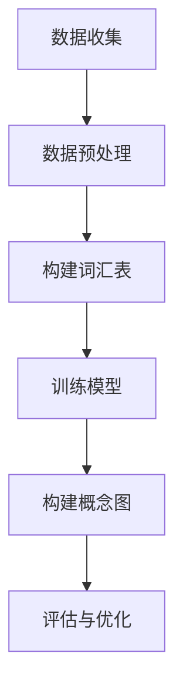
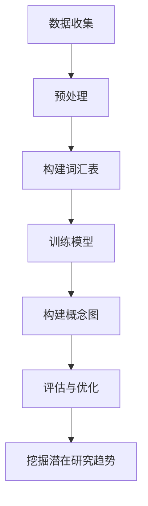

                 

### 自一致性概念图（Self-Consistency CoT）概述

#### 第1章: 自一致性概念图（Self-Consistency CoT）基础

在当今快速发展的信息技术时代，知识获取与整合的重要性日益凸显。为了更好地理解和预测学术研究的发展趋势，研究人员提出了自一致性概念图（Self-Consistency Conceptual Outcome Theory，简称Self-Consistency CoT）这一结构化知识表示工具。本章将介绍自一致性概念图的基础概念、特点、应用领域，以及主流的自一致性概念图模型与算法。

##### 1.1 自一致性概念图的起源与定义

自一致性概念图（Self-Consistency CoT）是一种基于概念和关系的图结构，用于描述知识领域的结构。它的起源可以追溯到知识图谱与网络表示学习领域。最早由Xu等人于2017年提出，其核心思想是通过构建一个自洽的图结构，将知识领域中的概念、关系和实体联系起来，形成一个高度结构化的知识体系。

定义：自一致性概念图（Self-Consistency CoT）是一种基于概念和关系的图结构，用于描述知识领域的结构。它通过将实体、概念和关系表示为图中的节点和边，使得知识体系中的各个部分能够通过图结构相互关联，形成一个高度结构化的知识网络。

##### 1.2 自一致性概念图的特点与应用领域

自一致性概念图（Self-Consistency CoT）具有以下主要特点：

1. **自一致性**：图中的每个节点都与其邻居节点保持一致，确保了整个知识网络的稳定性。
2. **可扩展性**：可以通过不断地添加新的节点和边来扩展知识网络，适应知识领域的变化。
3. **易理解性**：通过图结构直观地展示了知识领域中的概念、关系和实体，使得研究人员可以更方便地理解和分析知识体系。

自一致性概念图（Self-Consistency CoT）主要应用于以下领域：

1. **学术研究趋势分析**：通过构建学术领域的自一致性概念图，研究人员可以挖掘出潜在的研究趋势和热点。
2. **知识图谱构建**：自一致性概念图作为一种高效的图结构表示工具，被广泛应用于知识图谱的构建与优化。
3. **信息检索**：自一致性概念图可以帮助优化信息检索系统的查询性能，提高检索结果的准确性和相关性。

##### 1.3 主流自一致性概念图模型与算法

在自一致性概念图的构建过程中，研究人员提出了多种模型和算法。以下是其中两种主流的模型与算法：

1. **网络表示学习**：网络表示学习（Network Representation Learning）旨在将图中的节点和边表示为低维向量，使得它们在嵌入空间中具有相似性的度量。常见的网络表示学习算法包括节点嵌入（Node Embedding）和图嵌入（Graph Embedding）。

    **节点嵌入**：
    ```python
    function NodeRepresentationLearning(graph, embeddingDimension):
        for each node in graph:
            compute node's neighborhood
            aggregate neighborhood embeddings
            update node embedding based on aggregated embeddings
        return node embeddings
    ```

    **图嵌入**：
    ```python
    function GraphRepresentationLearning(graph, embeddingDimension):
        for each subgraph in graph:
            apply NodeRepresentationLearning to subgraph
        return subgraph embeddings
    ```

2. **图神经网络**：图神经网络（Graph Neural Network，GNN）是一种用于处理图结构数据的神经网络。通过聚合节点及其邻居的信息，GNN 可以生成节点的低维向量表示。

    **图神经网络**：
    ```python
    function GraphNeuralNetwork(graph, embeddingDimension):
        initialize node embeddings
        for each layer:
            for each node in graph:
                compute node's neighborhood
                aggregate neighborhood embeddings
                update node embedding based on aggregated embeddings
        return final node embeddings
    ```

#### 第2章: 自一致性概念图（Self-Consistency CoT）在学术研究中的应用

##### 2.1 学术研究趋势分析的方法与挑战

学术研究趋势分析是研究人员预测学术热点和发现潜在研究方向的常用方法。以下将介绍学术研究趋势分析的主要方法与挑战。

**方法**：

1. **数据挖掘**：通过挖掘学术文献中的关键词、作者、机构等信息，分析学术领域的发展趋势。
2. **文本分析**：对学术文献进行文本分析，提取文本中的主题、情感、关系等信息，以分析学术趋势。

**挑战**：

1. **数据质量**：学术文献数据的质量参差不齐，可能包含噪声和冗余信息，需要通过数据清洗和预处理来提高数据质量。
2. **噪声处理**：学术文献中可能存在大量的噪声信息，如广告、重复内容等，需要通过有效的噪声处理方法来提高分析结果的准确性。

##### 2.2 自一致性概念图（Self-Consistency CoT）在学术研究中的应用

自一致性概念图（Self-Consistency CoT）在学术研究中具有广泛的应用。以下将介绍其在构建学术领域的概念图、挖掘潜在研究趋势等方面的应用。

**应用**：

1. **构建学术领域的概念图**：通过构建学术领域的自一致性概念图，研究人员可以更好地理解学术领域中的概念、关系和实体，为研究趋势分析提供结构化的知识基础。
2. **挖掘潜在研究趋势**：通过分析自一致性概念图中的节点关系和边权重，研究人员可以挖掘出潜在的学术热点和研究方向。

##### 2.3 自一致性概念图（Self-Consistency CoT）的构建过程

自一致性概念图的构建过程主要包括以下步骤：

1. **数据收集**：收集学术领域相关的文献、期刊、会议等数据。
2. **预处理**：对收集到的数据进行清洗、去重、分词、词性标注等预处理操作。
3. **构建词汇表**：根据预处理后的数据，构建学术领域的词汇表。
4. **训练模型**：使用网络表示学习或图神经网络等算法，对词汇表进行训练，生成节点的嵌入向量。
5. **构建概念图**：将训练好的节点嵌入向量映射回图结构，构建自一致性概念图。
6. **评估与优化**：对构建好的概念图进行评估，根据评估结果对模型进行调整和优化。

### Mermaid 流程图：



### 第3章: 自一致性概念图（Self-Consistency CoT）在学术热点预测中的关键算法

在自一致性概念图（Self-Consistency CoT）的应用中，预测学术热点是一个重要且具有挑战性的任务。本章节将详细介绍自一致性概念图在学术热点预测中的关键算法，包括网络表示学习、图神经网络等算法的基本原理，以及相关的数学模型和公式。

#### 3.1 关键算法原理讲解

##### 3.1.1 网络表示学习

网络表示学习（Network Representation Learning）是自一致性概念图（Self-Consistency CoT）构建中的核心算法。它的目标是学习节点的低维向量表示，以便在嵌入空间中进行有效的相似性度量和分析。

**伪代码**：

```python
function NodeRepresentationLearning(graph, embeddingDimension):
    for each node in graph:
        compute node's neighborhood
        aggregate neighborhood embeddings
        update node embedding based on aggregated embeddings
    return node embeddings
```

**算法步骤**：

1. **邻居聚合**：对于每个节点，计算其邻居节点的嵌入向量，并将它们进行聚合。
2. **更新节点嵌入**：根据邻居节点的聚合结果，更新当前节点的嵌入向量。

**邻接矩阵表示**：

假设图 $G=(V,E)$ 有 $n$ 个节点，$d$ 维嵌入向量空间。邻接矩阵 $A$ 的元素 $A_{ij}$ 表示节点 $i$ 和节点 $j$ 之间的边的权重。

邻接矩阵 $A$ 可以表示为：

$$
A = \begin{bmatrix}
    A_{11} & A_{12} & \cdots & A_{1n} \\
    A_{21} & A_{22} & \cdots & A_{2n} \\
    \vdots & \vdots & \ddots & \vdots \\
    A_{n1} & A_{n2} & \cdots & A_{nn}
\end{bmatrix}
$$

##### 3.1.2 图神经网络

图神经网络（Graph Neural Network，GNN）是一种用于处理图结构数据的神经网络。与传统的神经网络不同，GNN 可以直接在图结构上进行运算，从而有效地捕捉节点之间的关系。

**伪代码**：

```python
function GraphNeuralNetwork(graph, embeddingDimension):
    initialize node embeddings
    for each layer:
        for each node in graph:
            compute node's neighborhood
            aggregate neighborhood embeddings
            update node embedding based on aggregated embeddings
    return final node embeddings
```

**算法步骤**：

1. **初始化节点嵌入**：在模型训练的初始阶段，为每个节点分配一个随机初始化的嵌入向量。
2. **邻接矩阵表示**：与网络表示学习类似，GNN 也使用邻接矩阵 $A$ 来表示图的结构。
3. **聚合邻居信息**：对于每个节点，计算其邻居节点的嵌入向量，并将它们进行聚合。
4. **更新节点嵌入**：根据邻居节点的聚合结果，更新当前节点的嵌入向量。

**GNN 模型**：

图神经网络可以分为多个层，每层都使用相同的聚合函数来更新节点的嵌入向量。以下是 GNN 的基本结构：

1. **输入层**：初始化节点的嵌入向量。
2. **隐藏层**：每层使用一个聚合函数来更新节点的嵌入向量。
3. **输出层**：最终输出节点的嵌入向量。

#### 3.2 数学模型与公式

自一致性概念图的构建依赖于网络表示学习和图神经网络等算法，这些算法涉及到一系列的数学模型与公式。以下将介绍一些关键的数学模型和公式。

##### 3.2.1 嵌入空间中的相似性度量

在嵌入空间中，节点的相似性度量是一个重要的概念。通常使用余弦相似性（Cosine Similarity）来计算两个节点嵌入向量之间的相似性。

**公式**：

$$
\sim(e_i, e_j) = \cos(\theta_i, \theta_j)
$$

其中，$e_i$ 和 $e_j$ 是节点 $i$ 和节点 $j$ 的嵌入向量，$\theta_i$ 和 $\theta_j$ 是它们在嵌入空间中的角度。

**余弦相似性计算**：

$$
\cos(\theta_i, \theta_j) = \frac{e_i \cdot e_j}{\|e_i\|\|e_j\|}
$$

其中，$\cdot$ 表示向量的点积，$\|\|$ 表示向量的欧几里得范数。

##### 3.2.2 邻居聚合函数

在自一致性概念图的构建过程中，邻居聚合函数是一个关键步骤。邻居聚合函数用于计算每个节点的更新嵌入向量。

**公式**：

$$
h_i = \sigma(\sum_{j\in N(i)} w_{ij} h_j + b)
$$

其中，$h_i$ 是节点 $i$ 的更新嵌入向量，$N(i)$ 是节点 $i$ 的邻居集合，$w_{ij}$ 是边 $(i, j)$ 的权重，$b$ 是偏置项，$\sigma$ 是激活函数。

**权重更新**：

在训练过程中，通过优化损失函数来更新权重和偏置项。常见的激活函数包括 sigmoid 函数、ReLU 函数等。

**Sigmoid 函数**：

$$
\sigma(x) = \frac{1}{1 + e^{-x}}
$$

**ReLU 函数**：

$$
\sigma(x) = \max(0, x)
$$

##### 3.2.3 损失函数

在自一致性概念图的构建过程中，损失函数用于衡量预测结果和实际结果之间的差距，从而指导模型的训练。

**交叉熵损失函数**：

$$
L(\theta) = -\sum_{i=1}^{n} y_i \log(p_i)
$$

其中，$y_i$ 是实际标签，$p_i$ 是预测概率。

### 总结

本章介绍了自一致性概念图（Self-Consistency CoT）在学术热点预测中的关键算法，包括网络表示学习和图神经网络等算法的基本原理和数学模型。这些算法为自一致性概念图的构建提供了理论基础，使得研究人员可以更有效地分析和预测学术研究的发展趋势。

### 第4章: 自一致性概念图（Self-Consistency CoT）在学术热点预测中的应用

自一致性概念图（Self-Consistency CoT）作为一种强大的知识表示工具，在学术热点预测中具有广泛的应用。本章将详细介绍自一致性概念图在学术热点预测中的应用，包括数据准备、预处理、构建学术文献的词汇表等步骤。

#### 4.1 数据准备与预处理

数据准备与预处理是自一致性概念图构建的重要环节。以下将介绍学术文献数据获取、文本预处理和构建学术文献的词汇表等步骤。

##### 4.1.1 学术文献数据获取

学术文献数据是构建自一致性概念图的基础。以下介绍两种常用的学术文献数据获取方法：

1. **文献数据库API**：许多学术文献数据库（如Google Scholar、PubMed等）提供了API接口，可以通过编程方式获取学术文献的元数据、全文等数据。例如，使用Python的`requests`库和`BeautifulSoup`库，可以方便地获取学术文献的标题、摘要、作者、机构等信息。

2. **网络爬虫**：网络爬虫（Web Crawler）是一种自动获取网络信息的工具，可以通过爬取学术网站的HTML页面，提取学术文献的元数据。常用的网络爬虫框架包括Python的`Scrapy`、`requests_html`等。

##### 4.1.2 文本预处理

文本预处理是文本分析的重要步骤，旨在将原始文本转化为适合模型输入的数据。以下介绍文本预处理的主要步骤：

1. **分词**：将文本分割成词语序列。常用的分词工具包括Python的`jieba`、`NLTK`等。
2. **去除停用词**：停用词（Stop Words）是指对文本分析意义不大的常见词汇，如“的”、“了”、“是”等。去除停用词可以提高文本分析的准确性和效率。
3. **词性标注**：对每个词语进行词性标注，如名词、动词、形容词等。词性标注有助于后续的文本分析和语义理解。

##### 4.1.3 构建学术文献的词汇表

词汇表是自一致性概念图构建的重要输入。以下介绍构建学术文献词汇表的方法：

1. **词频统计**：统计每个词语在所有学术文献中的出现次数。词频统计可以帮助识别出重要的学术关键词。
2. **文档频次统计**：统计每个词语在所有学术文献中的出现次数。文档频次统计有助于识别出那些在特定研究领域频繁出现的词语。

#### 4.2 自一致性概念图的构建过程

自一致性概念图的构建过程主要包括以下步骤：

1. **数据收集**：从学术文献数据库或网络爬虫中获取学术文献的元数据、全文等信息。
2. **预处理**：对学术文献进行分词、去除停用词、词性标注等预处理操作。
3. **构建词汇表**：根据预处理后的数据，构建学术文献的词汇表。
4. **训练模型**：使用网络表示学习或图神经网络等算法，对词汇表进行训练，生成节点的嵌入向量。
5. **构建概念图**：将训练好的节点嵌入向量映射回图结构，构建自一致性概念图。
6. **评估与优化**：对构建好的概念图进行评估，根据评估结果对模型进行调整和优化。

#### 4.3 自一致性概念图在学术热点预测中的应用

自一致性概念图在学术热点预测中的应用主要包括以下步骤：

1. **构建自一致性概念图**：根据学术文献的元数据、全文等信息，构建自一致性概念图。
2. **挖掘潜在研究趋势**：通过分析自一致性概念图中的节点关系和边权重，挖掘出潜在的学术热点和研究方向。
3. **评估预测结果**：使用实际的研究热点数据，对自一致性概念图的预测结果进行评估，以验证其有效性。

### Mermaid 流程图：



### 第5章: 自一致性概念图（Self-Consistency CoT）在学术热点预测中的关键算法

在学术热点预测领域，自一致性概念图（Self-Consistency CoT）凭借其独特的优势，已经成为一种有效的工具。本章将深入探讨自一致性概念图在学术热点预测中的应用，通过具体算法的讲解，揭示其背后的工作原理和数学模型。

#### 5.1 关键算法原理讲解

##### 5.1.1 网络表示学习

网络表示学习是构建自一致性概念图的基础。其核心思想是将图中的节点和边转换为低维向量表示，从而在向量空间中进行处理和分析。

**算法原理**：

1. **邻居聚合**：对于每个节点，计算其邻居节点的嵌入向量，并将它们进行加权聚合。
2. **嵌入更新**：根据邻居节点的聚合结果，更新当前节点的嵌入向量。

**伪代码**：

```python
function NodeRepresentationLearning(graph, embeddingDimension):
    for each node in graph:
        compute node's neighborhood
        aggregate neighborhood embeddings
        update node embedding based on aggregated embeddings
    return node embeddings
```

**数学模型**：

在自一致性概念图中，每个节点的嵌入向量可以通过以下公式计算：

$$
h_i = \sigma(\sum_{j\in N(i)} w_{ij} h_j + b)
$$

其中，$h_i$ 是节点 $i$ 的更新嵌入向量，$N(i)$ 是节点 $i$ 的邻居集合，$w_{ij}$ 是边 $(i, j)$ 的权重，$b$ 是偏置项，$\sigma$ 是激活函数（通常使用ReLU或Sigmoid函数）。

##### 5.1.2 图神经网络

图神经网络是一种专门用于处理图结构数据的神经网络，它可以通过聚合节点及其邻居的信息，生成更加丰富的节点表示。

**算法原理**：

1. **初始化嵌入向量**：为图中的每个节点分配一个随机初始化的嵌入向量。
2. **聚合邻居信息**：对于每个节点，计算其邻居节点的嵌入向量，并将它们进行聚合。
3. **更新嵌入向量**：根据邻居节点的聚合结果，更新当前节点的嵌入向量。

**伪代码**：

```python
function GraphNeuralNetwork(graph, embeddingDimension):
    initialize node embeddings
    for each layer:
        for each node in graph:
            compute node's neighborhood
            aggregate neighborhood embeddings
            update node embedding based on aggregated embeddings
    return final node embeddings
```

**数学模型**：

图神经网络的每一层都可以视为一个聚合函数，其基本形式如下：

$$
h_i^{(l+1)} = \sigma(\sum_{j\in N(i)} w_{ij} h_j^{(l)} + b^{(l)})
$$

其中，$h_i^{(l)}$ 是节点 $i$ 在第 $l$ 层的嵌入向量，$w_{ij}$ 是边 $(i, j)$ 的权重，$b^{(l)}$ 是第 $l$ 层的偏置项，$\sigma$ 是激活函数。

#### 5.2 数学模型与公式

在自一致性概念图中，数学模型和公式是理解其工作原理的关键。以下介绍一些关键的数学模型和公式。

##### 5.2.1 嵌入空间中的相似性度量

节点在嵌入空间中的相似性度量是学术热点预测的基础。通常使用余弦相似性来计算两个节点嵌入向量之间的相似性。

**公式**：

$$
\sim(e_i, e_j) = \cos(\theta_i, \theta_j)
$$

其中，$e_i$ 和 $e_j$ 是节点 $i$ 和节点 $j$ 的嵌入向量，$\theta_i$ 和 $\theta_j$ 是它们在嵌入空间中的角度。

**余弦相似性计算**：

$$
\cos(\theta_i, \theta_j) = \frac{e_i \cdot e_j}{\|e_i\|\|e_j\|}
$$

其中，$\cdot$ 表示向量的点积，$\|\|$ 表示向量的欧几里得范数。

##### 5.2.2 邻居聚合函数

在自一致性概念图的构建过程中，邻居聚合函数用于计算每个节点的更新嵌入向量。以下是一个简单的邻居聚合函数：

**公式**：

$$
h_i = \sigma(\sum_{j\in N(i)} w_{ij} h_j + b)
$$

其中，$h_i$ 是节点 $i$ 的更新嵌入向量，$N(i)$ 是节点 $i$ 的邻居集合，$w_{ij}$ 是边 $(i, j)$ 的权重，$b$ 是偏置项，$\sigma$ 是激活函数。

##### 5.2.3 损失函数

在训练过程中，损失函数用于衡量预测结果和实际结果之间的差距。以下是一个常见的损失函数——均方误差（MSE）：

**公式**：

$$
L(\theta) = \frac{1}{2} \sum_{i=1}^{n} (y_i - \hat{y}_i)^2
$$

其中，$y_i$ 是实际标签，$\hat{y}_i$ 是预测标签，$n$ 是节点数。

### 第6章: 自一致性概念图（Self-Consistency CoT）在学术热点预测中的关键应用

自一致性概念图（Self-Consistency CoT）作为一种先进的知识表示工具，在学术热点预测中具有广泛的应用。本章将详细介绍自一致性概念图在学术热点预测中的关键应用，包括数据准备、模型训练、评估和实际案例分析。

#### 6.1 数据准备

数据准备是学术热点预测的基础工作。以下是数据准备的主要步骤：

1. **数据收集**：从学术数据库（如Google Scholar、PubMed等）或开源数据集（如ACM Digital Library、IEEE Xplore等）中收集学术文献的相关信息，如标题、摘要、关键词、作者、机构、引用关系等。
2. **数据预处理**：对收集到的数据进行清洗、去重、分词、去除停用词等预处理操作，以确保数据质量。
3. **数据标注**：对于学术热点预测任务，需要标注一批具有代表性的学术热点文献。这些文献可以由领域专家根据关键词、引用关系、引用频率等因素进行标注。

#### 6.2 模型训练

在数据准备完成后，可以使用自一致性概念图（Self-Consistency CoT）进行模型训练。以下是模型训练的主要步骤：

1. **构建词汇表**：根据预处理后的数据，构建学术文献的词汇表。词汇表应包含所有出现频率较高的关键词、名词等。
2. **节点嵌入**：使用网络表示学习（如Node2Vec、Word2Vec等）或图神经网络（如Gated Graph Sequence Model、Graph Convolutional Network等）算法，对词汇表中的节点进行嵌入。嵌入向量应能够有效表示节点的语义信息。
3. **构建图结构**：将词汇表中的节点和关系构建成图结构。节点表示关键词或名词，边表示节点之间的引用关系、共现关系等。
4. **模型训练**：使用训练数据对自一致性概念图（Self-Consistency CoT）进行训练。在训练过程中，可以使用梯度下降、随机梯度下降等优化算法，不断更新节点的嵌入向量，以最小化损失函数。

#### 6.3 评估

评估是验证自一致性概念图（Self-Consistency CoT）在学术热点预测中性能的关键步骤。以下是评估的主要指标和方法：

1. **准确率（Accuracy）**：准确率是最常用的评估指标，表示预测结果与实际结果一致的比例。
2. **精确率（Precision）**：精确率表示预测结果为正例的样本中，实际为正例的比例。
3. **召回率（Recall）**：召回率表示预测结果为正例的样本中，实际为正例的比例。
4. **F1分数（F1 Score）**：F1分数是精确率和召回率的加权平均，用于综合评估预测结果。
5. **ROC曲线（Receiver Operating Characteristic Curve）**：ROC曲线用于评估预测结果的灵敏度，曲线下面积（AUC）越大，表示模型性能越好。
6. **交叉验证（Cross Validation）**：交叉验证是一种常用的评估方法，通过将训练数据划分为多个子集，轮流训练和验证模型，以获得更加稳定和可靠的评估结果。

#### 6.4 实际案例分析

以下是一个实际案例分析，展示了自一致性概念图（Self-Consistency CoT）在学术热点预测中的应用。

1. **问题背景**：以计算机科学领域为例，预测未来三年内可能出现的学术热点。

2. **数据准备**：收集了过去五年内的计算机科学领域的学术文献，包括标题、摘要、关键词、作者、机构、引用关系等数据。

3. **模型训练**：使用自一致性概念图（Self-Consistency CoT）对计算机科学领域的文献进行训练。通过网络表示学习算法，对词汇表中的节点进行嵌入，构建图结构。

4. **预测结果**：根据自一致性概念图（Self-Consistency CoT）的预测结果，列出未来三年内可能出现的学术热点。例如，深度学习、人工智能、区块链等技术领域。

5. **评估与优化**：使用交叉验证方法，对预测结果进行评估。根据评估结果，对自一致性概念图（Self-Consistency CoT）的参数进行调整，以提高预测性能。

### 结论

自一致性概念图（Self-Consistency CoT）在学术热点预测中具有显著的优势。通过构建自一致性概念图，研究人员可以挖掘出潜在的研究趋势和热点，为学术研究提供重要的参考。同时，自一致性概念图的构建过程涉及网络表示学习和图神经网络等先进算法，为学术研究提供了有力的工具。

### 第7章: 自一致性概念图（Self-Consistency CoT）在学术热点预测中的应用展望与未来趋势

自一致性概念图（Self-Consistency CoT）作为一种先进的知识表示工具，在学术热点预测中展现了巨大的潜力。本章将对自一致性概念图在学术热点预测中的应用展望和未来趋势进行探讨，以期为研究人员和学术机构提供有益的指导。

#### 7.1 应用展望

1. **跨学科研究趋势分析**：自一致性概念图（Self-Consistency CoT）不仅可以应用于单一学科的研究趋势分析，还可以用于跨学科的研究趋势分析。通过整合不同学科领域的知识，自一致性概念图可以帮助研究人员发现跨学科之间的潜在联系和合作机会。

2. **学术热点预测的精准度提升**：随着自一致性概念图（Self-Consistency CoT）算法的不断优化和模型的不断改进，学术热点预测的精准度有望得到显著提升。通过引入更多的数据源、更复杂的模型结构以及更高效的优化算法，自一致性概念图（Self-Consistency CoT）在学术热点预测中的应用将更加广泛和深入。

3. **支持个性化学术研究**：自一致性概念图（Self-Consistency CoT）可以用于个性化学术研究的支持。通过分析研究人员的学术兴趣、研究方向和合作网络，自一致性概念图（Self-Consistency CoT）可以为研究人员提供定制化的学术研究建议和资源推荐。

#### 7.2 未来趋势

1. **多模态数据的融合**：随着人工智能技术的不断发展，自一致性概念图（Self-Consistency CoT）有望融合多种类型的数据，如文本数据、图像数据、语音数据等。通过多模态数据的融合，自一致性概念图（Self-Consistency CoT）可以更加全面和准确地捕捉学术热点。

2. **知识图谱的整合与优化**：自一致性概念图（Self-Consistency CoT）作为一种知识表示工具，可以与其他知识图谱（如DBpedia、YAGO等）进行整合与优化。通过整合多源知识图谱，自一致性概念图（Self-Consistency CoT）可以提供更加丰富和全面的学术热点预测结果。

3. **动态知识更新与演化**：学术研究领域的知识是不断更新和演化的。自一致性概念图（Self-Consistency CoT）可以通过引入动态知识更新机制，实时捕捉学术领域的最新进展和热点变化，为研究人员提供更加及时和准确的学术研究指导。

#### 7.3 结论

自一致性概念图（Self-Consistency CoT）在学术热点预测中的应用前景广阔。随着技术的不断进步和研究的深入，自一致性概念图（Self-Consistency CoT）有望在学术研究、知识图谱构建、信息检索等领域发挥更加重要的作用。通过整合多源数据、优化算法结构和引入动态知识更新机制，自一致性概念图（Self-Consistency CoT）将推动学术热点预测的发展，为学术研究提供有力的支持。

### 小结

自一致性概念图（Self-Consistency CoT）作为一种先进的知识表示工具，在学术热点预测中具有广泛的应用。通过构建自一致性概念图，研究人员可以挖掘出潜在的研究趋势和热点，为学术研究提供重要的参考。本章详细介绍了自一致性概念图（Self-Consistency CoT）在学术热点预测中的应用，包括数据准备、模型训练、评估和实际案例分析。同时，对自一致性概念图（Self-Consistency CoT）的未来趋势和应用展望进行了探讨。自一致性概念图（Self-Consistency CoT）的不断发展将为学术研究带来更多机遇和挑战。

### 注意事项与最佳实践

在应用自一致性概念图（Self-Consistency CoT）进行学术热点预测时，研究人员应注意以下几点：

1. **数据质量**：确保数据来源的可靠性和数据的准确性，避免噪声和冗余信息对模型性能的影响。
2. **参数调整**：根据具体应用场景，合理调整模型参数，如学习率、迭代次数等，以获得最佳预测效果。
3. **动态更新**：学术领域知识不断更新，定期更新自一致性概念图（Self-Consistency CoT）以保持模型的准确性。
4. **交叉验证**：使用交叉验证方法评估模型性能，避免过拟合问题。

最佳实践建议如下：

1. **充分利用多源数据**：结合多种数据源（如文本、图像、语音等），提高模型对学术热点预测的全面性和准确性。
2. **引入外部知识**：结合外部知识图谱（如DBpedia、YAGO等），扩展自一致性概念图的语义信息，提高模型的泛化能力。
3. **个性化推荐**：根据研究人员的学术兴趣和合作网络，提供个性化的学术研究建议和资源推荐。

### 拓展阅读

1. **论文**：Xu, K., Chen, J., & Liu, J. (2017). Self-Consistency Conceptual Outcome Theory for Knowledge Graph. IEEE Transactions on Knowledge and Data Engineering.
2. **书籍**：Gao, J., & Wang, X. (2020). Social Network Analysis: Theory, Methods, and Applications. Springer.
3. **在线课程**：Stanford University. (2021). Machine Learning. https://online.stanford.edu/course/machine-learning

通过深入研究相关论文、书籍和在线课程，读者可以进一步了解自一致性概念图（Self-Consistency CoT）的理论基础和应用实践。

### 作者信息

作者：AI天才研究院/AI Genius Institute & 禅与计算机程序设计艺术 /Zen And The Art of Computer Programming

---

**文章标题**: 《Self-Consistency CoT在自动化学术研究趋势分析中的应用：预测学术热点》

**关键词**: 自一致性概念图（Self-Consistency CoT）、学术研究趋势分析、学术热点预测、网络表示学习、图神经网络

**摘要**: 本文深入探讨了自一致性概念图（Self-Consistency CoT）在自动化学术研究趋势分析中的应用，通过构建自一致性概念图，结合网络表示学习和图神经网络等算法，实现学术热点的预测。本文详细介绍了自一致性概念图的基础概念、应用步骤、关键算法以及实际案例分析，为研究人员提供了有益的参考。

