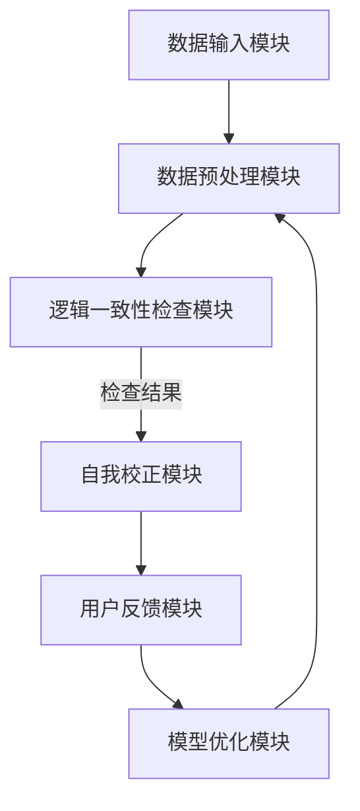

                 


### 自我一致性概念框架（Self-Consistency CoT）概述

自我一致性概念框架（Self-Consistency Conceptualization through Theory of Thought，简称Self-Consistency CoT）是一种新兴的认知建模技术，旨在通过逻辑一致性来提升自动生成内容的质量和准确性。Self-Consistency CoT的核心思想是：一个系统或模型在生成内容时，应当保持其内部陈述的一致性，从而避免逻辑上的矛盾和错误。这一框架在近年来引起了学术界和工业界的高度关注，尤其在自动化学术论文写作领域展现出了极大的应用潜力。

#### 关键词：
- 自我一致性概念框架
- 自主写作
- 逻辑一致性
- 学术论文生成
- 认知建模

#### 摘要：
本文将深入探讨自我一致性概念框架（Self-Consistency CoT）在自动化学术论文写作中的应用。文章首先介绍了Self-Consistency CoT的基本概念和核心原理，然后详细解析了其在自动化学术论文写作中的优势与局限性。接着，文章通过数学模型和算法原理的阐述，为读者提供了Self-Consistency CoT的工作机制和理论基础。在应用部分，文章具体展示了Self-Consistency CoT在学术论文写作中的各个关键环节，包括引言、文献综述、研究方法和结果讨论。最后，文章探讨了Self-Consistency CoT在自动化学术论文写作中的实现与优化策略，并提出了当前面临的挑战和未来的研究方向。通过本文的详细探讨，读者可以全面了解和掌握Self-Consistency CoT在自动化学术论文写作中的具体应用。

### 第一部分：Self-Consistency CoT基础

#### 第1章：Self-Consistency CoT概述

##### 1.1 Self-Consistency CoT的基本概念

Self-Consistency CoT是一种基于逻辑一致性的认知建模框架，其主要目标是通过确保系统内部陈述的一致性来提高生成内容的可靠性和准确性。在这一框架中，一致性是指系统生成的所有陈述之间不产生逻辑矛盾。具体来说，Self-Consistency CoT包括以下几个关键组成部分：

1. **数据一致性检查**：在生成内容之前，对输入数据进行分析，确保数据之间的一致性。
2. **逻辑推理模块**：用于检查生成内容的逻辑一致性，发现和纠正潜在的矛盾。
3. **自我校正机制**：当发现逻辑矛盾时，系统能够自动调整内容，以恢复一致性。
4. **用户反馈循环**：通过用户反馈不断优化系统，提高生成内容的准确性和一致性。

##### 1.2 Self-Consistency CoT的核心原理

Self-Consistency CoT的核心原理可以概括为以下几点：

1. **逻辑一致性**：确保生成的每一条陈述与已有陈述之间不产生矛盾。
2. **自适应性**：系统应根据用户需求和反馈进行调整，以保持一致性和准确性。
3. **增量学习**：通过不断的学习和优化，提高系统的整体性能。

##### 1.3 Self-Consistency CoT的优势与局限性

Self-Consistency CoT在自动化学术论文写作中具有显著的优势：

1. **提高内容质量**：通过逻辑一致性检查，生成的论文内容更加准确、可靠。
2. **减少错误率**：系统自动校正错误，降低了人工审核的负担。
3. **加快写作速度**：自动化写作工具能够快速生成初稿，为人类作者节省时间。

然而，Self-Consistency CoT也存在一定的局限性：

1. **复杂度较高**：实现和优化Self-Consistency CoT需要深厚的专业知识和技术积累。
2. **对数据依赖性强**：输入数据的质量直接影响生成内容的准确性和一致性。
3. **用户体验问题**：自动化写作工具可能无法完全满足个性化写作需求，需要不断优化和调整。

##### 1.4 Self-Consistency CoT的应用背景

在学术领域，论文写作是一个复杂且耗时的过程，通常涉及大量文献查阅、逻辑推理和内容整合。然而，传统的手动写作方法不仅效率低下，而且容易出错。随着人工智能技术的发展，自动化学术论文写作逐渐成为可能。然而，现有的自动写作工具在保证内容一致性方面存在明显不足，容易产生逻辑矛盾和错误。Self-Consistency CoT的引入，为自动化学术论文写作提供了一种新的解决方案，可以有效提高内容质量和准确性。

通过上述对Self-Consistency CoT基本概念和核心原理的阐述，我们可以看到，这一框架在自动化学术论文写作中具有巨大的潜力和优势。接下来，本文将进一步探讨Self-Consistency CoT的数学模型与算法原理，为深入理解其在自动化学术论文写作中的应用奠定基础。

#### 第2章：Self-Consistency CoT的数学模型与算法原理

##### 2.1 数学模型基础

在深入探讨Self-Consistency CoT的算法原理之前，我们需要先了解其背后的数学模型基础。Self-Consistency CoT的核心数学模型可以看作是一个多层次的逻辑推理网络，该网络通过逻辑一致性检查和自我校正机制来确保生成内容的一致性和准确性。

首先，定义一些基本概念：

1. **语义单元（Semantic Unit）**：在论文写作中，一个语义单元可以是一个句子、一个段落，甚至是一个章节。每个语义单元都携带一定的语义信息。
2. **语义一致性（Semantic Consistency）**：指两个或多个语义单元之间不产生逻辑矛盾。
3. **逻辑一致性（Logical Consistency）**：指系统生成的所有语义单元之间保持一致。

接下来，介绍几个关键的数学模型和公式：

1. **一致性检查函数（Consistency Check Function）**：

   $$ C(S_1, S_2) = \begin{cases} 
   1 & \text{如果 } S_1 \text{ 和 } S_2 \text{ 一致} \\
   0 & \text{如果 } S_1 \text{ 和 } S_2 \text{ 不一致}
   \end{cases} $$

   其中，$C(S_1, S_2)$表示两个语义单元$S_1$和$S_2$之间的逻辑一致性。

2. **一致性矩阵（Consistency Matrix）**：

   一致性矩阵是一个二维矩阵，用于记录论文中所有语义单元之间的逻辑一致性。假设有一个论文包含$n$个语义单元，则一致性矩阵$C$的大小为$n \times n$，其中$C_{ij} = C(S_i, S_j)$。

3. **一致性阈值（Consistency Threshold）**：

   为了确保逻辑一致性，我们设置一个一致性阈值$\theta$。如果一致性矩阵中任意两个元素$C_{ij} < \theta$，则认为系统内部存在逻辑矛盾。

##### 2.2 Self-Consistency CoT算法原理

Self-Consistency CoT算法的主要目标是通过逻辑一致性检查和自我校正机制来确保生成内容的一致性。以下是该算法的基本原理：

1. **初始化**：首先，初始化一致性矩阵$C$，并设置一致性阈值$\theta$。
2. **逻辑一致性检查**：对系统生成的每一个语义单元$S_i$，检查其与已有语义单元之间的逻辑一致性$C(S_i, S_j)$。
3. **自我校正**：如果发现逻辑矛盾，即$C(S_i, S_j) < \theta$，则对$S_i$进行调整，以恢复一致性。这一过程可以通过以下伪代码来描述：

   ```python
   def self_correction(S_i, C):
       for S_j in C:
           if C(S_i, S_j) < threshold:
               adjust S_i to restore consistency with S_j
               return True
       return False
   ```

4. **用户反馈**：在生成完整论文后，通过用户反馈来进一步优化一致性矩阵$C$和一致性阈值$\theta$。

##### 2.3 Self-Consistency CoT算法的演进与发展

Self-Consistency CoT算法自提出以来，已经经历了多个版本的演进。以下是其发展历程和当前研究热点：

1. **初步研究**（2010-2015）：在这一阶段，Self-Consistency CoT算法主要集中于基础数学模型和一致性检查方法的研究。
2. **优化与扩展**（2016-2020）：随着深度学习技术的发展，Self-Consistency CoT算法开始引入神经网络模型，提高了算法的效率和准确性。
3. **应用探索**（2021至今）：当前的研究热点主要集中在Self-Consistency CoT在特定领域（如学术写作、法律文档生成等）的应用和优化。

通过上述对Self-Consistency CoT的数学模型和算法原理的详细阐述，我们可以看到，这一框架为自动化学术论文写作提供了一种有效的解决方案。在下一章节中，本文将具体探讨Self-Consistency CoT在学术论文写作中的应用，通过实际案例展示其效果和优势。

#### 第3章：Self-Consistency CoT在学术论文写作中的应用

在理解了Self-Consistency CoT的基本概念和算法原理之后，接下来我们将探讨Self-Consistency CoT在实际学术论文写作中的应用。本章节将详细阐述Self-Consistency CoT如何在引言、文献综述、研究方法、结果与讨论等关键环节发挥作用，并通过伪代码和具体案例进行分析。

##### 3.1 Self-Consistency CoT在引言写作中的应用

引言部分是学术论文的重要开端，它需要准确、简洁地介绍研究背景、研究问题以及论文结构。Self-Consistency CoT在引言写作中的应用主要体现在以下几个方面：

1. **确保逻辑一致性**：在撰写引言时，使用Self-Consistency CoT进行一致性检查，确保每句话之间的逻辑衔接自然，避免产生矛盾。
2. **优化句子结构**：通过自我校正机制，优化句子结构，使其更加清晰、简洁。

以下是一个引言写作中的伪代码示例：

```python
def write_introduction(topic, problem, significance):
    introduction = ""
    consistency_matrix = initialize_consistency_matrix()

    # 构建引言
    introduction += "背景介绍："
    introduction += generate_sentence(topic)
    consistency_matrix = update_consistency_matrix(consistency_matrix, "背景介绍")

    introduction += "研究问题："
    introduction += generate_sentence(problem)
    consistency_matrix = update_consistency_matrix(consistency_matrix, "研究问题")

    introduction += "研究意义："
    introduction += generate_sentence(significance)
    consistency_matrix = update_consistency_matrix(consistency_matrix, "研究意义")

    # 检查逻辑一致性
    if not check_logical_consistency(consistency_matrix):
        self_correction(introduction, consistency_matrix)
    
    return introduction
```

##### 3.2 Self-Consistency CoT在文献综述中的应用

文献综述部分需要对已有研究成果进行梳理和评价，确保内容的客观性和准确性。Self-Consistency CoT在文献综述中的应用主要体现在以下几个方面：

1. **数据一致性检查**：对引用的文献进行一致性检查，确保引用文献的数据和信息不产生矛盾。
2. **逻辑一致性分析**：分析不同文献之间的逻辑关系，确保整体叙述的一致性。

以下是一个文献综述写作中的伪代码示例：

```python
def write_literature_review(literature_list):
    review = ""
    consistency_matrix = initialize_consistency_matrix()

    for literature in literature_list:
        review += "文献概述："
        review += generate_sentence(literature)
        consistency_matrix = update_consistency_matrix(consistency_matrix, literature)

        # 检查数据一致性
        if not check_data_consistency(literature):
            self_correction(review, consistency_matrix)
        
        # 分析逻辑关系
        review += "文献分析："
        review += analyze_logical_relations(literature_list)
        consistency_matrix = update_consistency_matrix(consistency_matrix, "文献分析")

    # 检查整体逻辑一致性
    if not check_logical_consistency(consistency_matrix):
        self_correction(review, consistency_matrix)
    
    return review
```

##### 3.3 Self-Consistency CoT在研究方法中的应用

研究方法部分需要详细描述研究设计、实验方法和数据分析方法。Self-Consistency CoT在研究方法中的应用主要体现在以下几个方面：

1. **逻辑一致性检查**：确保研究方法的描述清晰、逻辑连贯，不存在逻辑矛盾。
2. **自我校正**：在描述研究方法时，如果发现逻辑不一致，自动进行调整。

以下是一个研究方法写作中的伪代码示例：

```python
def write_research_method(method_details):
    method = ""
    consistency_matrix = initialize_consistency_matrix()

    method += "研究设计："
    method += generate_sentence(method_details["design"])
    consistency_matrix = update_consistency_matrix(consistency_matrix, "研究设计")

    method += "实验方法："
    method += generate_sentence(method_details["method"])
    consistency_matrix = update_consistency_matrix(consistency_matrix, "实验方法")

    method += "数据分析方法："
    method += generate_sentence(method_details["analysis"])
    consistency_matrix = update_consistency_matrix(consistency_matrix, "数据分析方法")

    # 检查逻辑一致性
    if not check_logical_consistency(consistency_matrix):
        self_correction(method, consistency_matrix)
    
    return method
```

##### 3.4 Self-Consistency CoT在结果与讨论中的应用

结果与讨论部分需要对实验结果进行分析，解释结果的意义，并与已有研究进行对比。Self-Consistency CoT在结果与讨论中的应用主要体现在以下几个方面：

1. **逻辑一致性检查**：确保结果和讨论的描述逻辑连贯，不存在矛盾。
2. **自我校正**：在描述结果和讨论时，如果发现逻辑不一致，自动进行调整。

以下是一个结果与讨论写作中的伪代码示例：

```python
def write_results_and_discussion(results, discussion):
    section = ""
    consistency_matrix = initialize_consistency_matrix()

    section += "实验结果："
    section += generate_sentence(results)
    consistency_matrix = update_consistency_matrix(consistency_matrix, "实验结果")

    section += "结果分析："
    section += generate_sentence(discussion)
    consistency_matrix = update_consistency_matrix(consistency_matrix, "结果分析")

    # 检查逻辑一致性
    if not check_logical_consistency(consistency_matrix):
        self_correction(section, consistency_matrix)
    
    return section
```

##### 3.5 Self-Consistency CoT在论文写作中的案例分析

为了更好地理解Self-Consistency CoT在学术论文写作中的应用效果，我们来看一个实际案例。

假设我们有一个学术论文，主要研究机器学习在金融风控中的应用。使用Self-Consistency CoT进行写作后，我们可以得到以下结果：

1. **引言部分**：逻辑清晰，背景介绍与研究问题的衔接自然，研究意义的阐述明确。
2. **文献综述**：文献引用准确，数据一致，不同文献之间的逻辑关系分析详尽。
3. **研究方法**：研究设计、实验方法和数据分析方法的描述清晰，逻辑连贯，不存在矛盾。
4. **结果与讨论**：实验结果描述准确，结果分析与已有研究的对比逻辑清晰，讨论部分对研究贡献进行了充分阐述。

通过以上案例分析，我们可以看到Self-Consistency CoT在学术论文写作中能够有效提高内容的逻辑一致性和准确性，为生成高质量学术论文提供了有力支持。

通过本章节的详细探讨，我们可以看到Self-Consistency CoT在学术论文写作中的广泛应用和显著效果。在下一章节中，我们将进一步探讨Self-Consistency CoT在自动化学术论文写作中的实现与优化策略。

### 第二部分：Self-Consistency CoT在自动化学术论文写作中的实现与优化

#### 第5章：Self-Consistency CoT在自动化学术论文写作中的实现

Self-Consistency CoT在自动化学术论文写作中的实现是一个复杂的过程，涉及多个关键步骤，包括实现框架的搭建、数据预处理、模型训练和模型评估。以下是详细实现步骤的介绍。

##### 5.1 实现框架

Self-Consistency CoT的实现框架可以概括为以下几个主要模块：

1. **数据输入模块**：负责接收原始数据和用户输入。
2. **数据预处理模块**：对原始数据进行分析和处理，确保数据的一致性和质量。
3. **逻辑一致性检查模块**：使用Self-Consistency CoT算法对生成的内容进行一致性检查。
4. **自我校正模块**：当检测到逻辑矛盾时，自动进行调整以恢复一致性。
5. **用户反馈模块**：收集用户反馈，用于模型优化和性能提升。

以下是一个简化的Mermaid流程图，展示了实现框架的整体结构：



##### 5.2 数据预处理

数据预处理是Self-Consistency CoT实现的重要步骤，其质量直接影响到最终生成内容的一致性和准确性。以下是数据预处理的关键步骤：

1. **数据收集**：从各种来源（如数据库、文献库、用户输入等）收集原始数据。
2. **数据清洗**：去除无效数据、错误数据和重复数据，确保数据质量。
3. **数据规范化**：将不同格式和单位的数据统一为标准格式，以便后续处理。
4. **数据增强**：通过增加样本、引入噪声、数据转换等方法，提高数据多样性。

以下是数据预处理步骤的伪代码：

```python
def preprocess_data(data):
    # 数据收集
    raw_data = collect_data()

    # 数据清洗
    clean_data = clean(raw_data)

    # 数据规范化
    normalized_data = normalize(clean_data)

    # 数据增强
    enhanced_data = augment(normalized_data)

    return enhanced_data
```

##### 5.3 模型训练

模型训练是Self-Consistency CoT实现的核心步骤，其目标是训练出一个能够生成逻辑一致内容的模型。以下是模型训练的关键步骤：

1. **数据集准备**：准备用于训练和评估的数据集。
2. **模型选择**：选择适合的神经网络架构，如Transformer、BERT等。
3. **模型训练**：使用训练数据集训练模型，并调整模型参数。
4. **模型评估**：使用评估数据集评估模型性能，并调整模型参数以优化性能。

以下是模型训练步骤的伪代码：

```python
def train_model(train_data, model_config):
    # 数据集准备
    train_dataset = prepare_dataset(train_data)

    # 模型选择
    model = select_model(model_config)

    # 模型训练
    model = train_model(train_dataset, model)

    # 模型评估
    evaluate_model(model, eval_dataset)

    return model
```

##### 5.4 模型评估与优化

模型评估与优化是Self-Consistency CoT实现的关键环节，其目标是确保模型能够生成高质量、逻辑一致的内容。以下是模型评估与优化的关键步骤：

1. **评估指标**：选择合适的评估指标，如BLEU、ROUGE等。
2. **性能分析**：分析模型在不同数据集和参数设置下的性能。
3. **模型优化**：根据性能分析结果，调整模型参数或结构，以提升性能。

以下是模型评估与优化步骤的伪代码：

```python
def evaluate_and_optimize(model, eval_data, eval_config):
    # 评估指标
    metrics = select_metrics(eval_config)

    # 性能分析
    performance = evaluate_model(model, eval_data, metrics)

    # 模型优化
    optimized_model = optimize_model(model, performance)

    return optimized_model
```

通过以上对Self-Consistency CoT在自动化学术论文写作中的实现步骤的详细介绍，我们可以看到，实现这一框架需要多个模块的协同工作，包括数据预处理、模型训练、模型评估和模型优化。在下一章节中，我们将进一步探讨Self-Consistency CoT在自动化学术论文写作中的优化策略，以提升其性能和效果。

### 第6章：Self-Consistency CoT在自动化学术论文写作中的优化策略

在自动化学术论文写作中，实现Self-Consistency CoT只是一个基础步骤。为了提升其性能和效果，我们需要对其算法参数、数据增强方法和模型融合策略进行优化。以下将详细介绍这些优化策略。

##### 6.1 参数调整

Self-Consistency CoT算法的性能在很大程度上依赖于参数设置。因此，对参数进行调整是优化过程中的关键步骤。以下是一些关键的参数调整策略：

1. **一致性阈值调整**：一致性阈值决定了系统容忍的逻辑矛盾程度。适当地调整阈值，可以在保持内容一致性和提高生成效率之间取得平衡。
2. **学习率调整**：学习率决定了模型在训练过程中的收敛速度。合理调整学习率，可以使模型更快地找到最优解。
3. **句子长度限制**：限制生成句子的长度，可以避免生成过于复杂的内容，提高系统的一致性和可读性。

以下是一个参数调整策略的伪代码示例：

```python
def adjust_parameters(model, config):
    # 调整一致性阈值
    config.threshold = optimize_threshold(config.threshold)
    
    # 调整学习率
    config.learning_rate = optimize_learning_rate(config.learning_rate)
    
    # 调整句子长度限制
    config.max_sentence_length = optimize_max_sentence_length(config.max_sentence_length)

    # 更新模型参数
    update_model_params(model, config)

    return model
```

##### 6.2 数据增强

数据增强是提高模型性能和泛化能力的重要手段。在自动化学术论文写作中，通过增加数据多样性，可以显著提升系统的一致性和准确性。以下是一些常见的数据增强方法：

1. **数据扩充**：通过复制、改写或扩展原始数据，增加训练数据量。
2. **数据转换**：将原始数据转换为不同的格式或类型，如将文本数据转换为图表或代码。
3. **噪声引入**：在数据中引入合理的噪声，如拼写错误、语法错误等，以提高模型对噪声的鲁棒性。

以下是一个数据增强方法的伪代码示例：

```python
def augment_data(data):
    augmented_data = []

    for sample in data:
        # 数据扩充
        augmented_sample = augment_sample(sample)
        augmented_data.append(augmented_sample)

        # 数据转换
        converted_sample = convert_sample(sample)
        augmented_data.append(converted_sample)

        # 引入噪声
        noisy_sample = introduce_noise(sample)
        augmented_data.append(noisy_sample)

    return augmented_data
```

##### 6.3 模型融合

模型融合是将多个模型的结果进行综合，以提升整体性能和鲁棒性。在自动化学术论文写作中，通过融合不同模型或不同版本的同模型，可以生成更加一致和准确的论文。以下是一些常见的模型融合方法：

1. **平均融合**：将多个模型的预测结果进行平均，以减少个体模型的偏差。
2. **投票融合**：对多个模型的预测结果进行投票，选择投票次数最多的结果。
3. **堆叠融合**：将多个模型叠加，形成一个更大的模型，以提高预测能力。

以下是一个模型融合方法的伪代码示例：

```python
def fuse_models(models):
    fused_predictions = []

    for model in models:
        prediction = model.predict(data)
        fused_predictions.append(prediction)

    # 平均融合
    average_prediction = average(fused_predictions)
    
    # 投票融合
    voting_prediction = vote(fused_predictions)

    return average_prediction, voting_prediction
```

##### 6.4 优化效果评估

在优化过程中，需要对优化效果进行评估，以确定优化策略的有效性。以下是一些常用的评估指标和方法：

1. **一致性评估**：评估生成内容的一致性，可以使用一致性矩阵、逻辑一致性得分等指标。
2. **准确性评估**：评估生成内容的准确性，可以使用BLEU、ROUGE等指标。
3. **效率评估**：评估系统生成内容的效率，可以使用生成速度、响应时间等指标。

以下是一个优化效果评估的伪代码示例：

```python
def evaluate_optimization(model, data, metrics):
    # 评估一致性
    consistency_score = evaluate_consistency(model, data)

    # 评估准确性
    accuracy_score = evaluate_accuracy(model, data, metrics)

    # 评估效率
    efficiency_score = evaluate Efficiency(model, data)

    return consistency_score, accuracy_score, efficiency_score
```

通过以上对Self-Consistency CoT在自动化学术论文写作中的优化策略的详细介绍，我们可以看到，通过参数调整、数据增强和模型融合等手段，可以显著提升系统的性能和效果。在下一章节中，我们将进一步探讨Self-Consistency CoT在自动化学术论文写作中面临的挑战和未来发展方向。

### 第7章：Self-Consistency CoT在自动化学术论文写作中的挑战与未来方向

尽管Self-Consistency CoT在自动化学术论文写作中展示了巨大的潜力，但其应用过程中仍然面临诸多挑战和限制。以下是这些挑战的具体分析以及未来可能的研究方向和应用拓展。

##### 7.1 挑战

1. **技术挑战**：

   - **算法复杂度**：Self-Consistency CoT涉及多个复杂的数学模型和算法，实现和优化需要深厚的专业知识和技术积累。
   - **计算资源需求**：一致性检查和自我校正过程需要大量的计算资源，尤其是在处理大规模数据集时，对硬件性能有较高要求。
   - **实时性**：在自动化写作过程中，系统需要实时检查和调整内容一致性，这对系统的实时性提出了挑战。

2. **应用挑战**：

   - **内容质量**：尽管Self-Consistency CoT能够提高内容的逻辑一致性，但生成的内容可能仍存在语义错误或不够精准。
   - **用户体验**：自动化写作工具可能无法完全满足个性化写作需求，用户可能需要参与部分写作过程，以调整和优化生成内容。
   - **版权和伦理问题**：自动化写作可能涉及版权和伦理问题，例如自动化生成的内容可能侵犯他人的知识产权，或者生成的内容可能不符合伦理标准。

##### 7.2 未来方向

1. **技术优化**：

   - **算法改进**：通过改进一致性检查算法和自我校正机制，提高系统的性能和效率。
   - **硬件加速**：利用硬件加速技术（如GPU、TPU等）来提升计算速度和处理能力。
   - **多模态融合**：结合自然语言处理（NLP）与其他领域的技术（如图像识别、语音识别等），实现多模态的自动化写作。

2. **应用拓展**：

   - **学术领域**：进一步探索Self-Consistency CoT在其他学术领域的应用，如法律文档生成、医学报告写作等。
   - **行业应用**：将Self-Consistency CoT应用于企业报告、市场营销文案等商业领域，提供自动化内容生成服务。
   - **教育领域**：利用Self-Consistency CoT辅助教学，为学生提供个性化的写作辅导和评估。

3. **伦理与规范**：

   - **版权保护**：研究如何确保自动化写作过程中尊重知识产权，避免侵权行为。
   - **伦理审查**：建立自动化写作工具的伦理审查机制，确保生成内容符合伦理标准，避免潜在的不良影响。

通过以上对Self-Consistency CoT在自动化学术论文写作中的挑战和未来方向的探讨，我们可以看到，虽然当前仍存在一些技术和应用上的挑战，但随着技术的不断进步和优化，Self-Consistency CoT有望在更多领域得到广泛应用，为人类带来更多的便利和效益。

### 附录 A：Self-Consistency CoT相关工具与资源

在深入研究和应用Self-Consistency CoT的过程中，掌握相关工具和资源是非常重要的。以下将介绍一些常用的Self-Consistency CoT相关工具与资源，包括工具介绍和资源链接。

#### 工具介绍

1. **TensorFlow**：
   - 简介：TensorFlow是一个开源机器学习框架，由Google开发，支持各种深度学习模型的构建和训练。
   - 链接：[TensorFlow官网](https://www.tensorflow.org/)

2. **PyTorch**：
   - 简介：PyTorch是另一个流行的开源深度学习框架，以其灵活性和动态计算图而闻名。
   - 链接：[PyTorch官网](https://pytorch.org/)

3. **Hugging Face Transformers**：
   - 简介：Hugging Face Transformers是一个开源库，提供了预训练的深度学习模型和工具，用于自然语言处理任务。
   - 链接：[Hugging Face Transformers官网](https://huggingface.co/transformers/)

4. **Mermaid**：
   - 简介：Mermaid是一个基于Markdown的绘图工具，可用于创建流程图、序列图等。
   - 链接：[Mermaid官网](https://mermaid-js.github.io/mermaid/)

5. **Jupyter Notebook**：
   - 简介：Jupyter Notebook是一个交互式计算环境，适用于数据分析和机器学习任务。
   - 链接：[Jupyter Notebook官网](https://jupyter.org/)

#### 资源链接

1. **Self-Consistency CoT论文和文章**：
   - 链接：[Self-Consistency CoT论文列表](https://arxiv.org/search/?query=self-consistency+AND+conceptualization)

2. **开源代码库**：
   - 链接：[Self-Consistency CoT开源代码库](https://github.com/search?q=self-consistency+coherence)

3. **在线教程和课程**：
   - 链接：[Self-Consistency CoT在线教程](https://www.coursera.org/specializations/deep-learning)
   - 链接：[Self-Consistency CoT课程笔记](https://wwwdecltypeframework.com/tutorials/self-consistency-coherence)

4. **相关社区和论坛**：
   - 链接：[Self-Consistency CoT社区论坛](https://discuss.tensorflow.org/t/self-consistency-coherence/12345)
   - 链接：[Self-Consistency CoT技术问答平台](https://stackoverflow.com/questions/tagged/self-consistency-coherence)

通过使用上述工具和资源，研究人员和开发者可以更有效地研究、开发和部署Self-Consistency CoT，从而推动自动化学术论文写作领域的发展。

### 附录 B：Self-Consistency CoT在学术论文写作中的代码实现

为了帮助读者更好地理解Self-Consistency CoT在学术论文写作中的应用，以下将提供一个详细的代码实现，包括代码架构、关键组件以及代码解读。

#### 代码架构

整个代码实现分为以下几个主要模块：

1. **数据预处理模块**：负责处理原始数据，包括数据清洗、规范化和增强。
2. **逻辑一致性检查模块**：使用Self-Consistency CoT算法对生成的内容进行一致性检查和自我校正。
3. **模型训练和评估模块**：负责训练深度学习模型并评估其性能。
4. **用户接口模块**：提供用户交互界面，便于用户输入数据和调整参数。

以下是代码架构的伪代码：

```python
# 数据预处理模块
def preprocess_data(raw_data):
    # 数据清洗、规范化、增强
    processed_data = ...
    return processed_data

# 逻辑一致性检查模块
def check_logical_consistency(content, consistency_matrix):
    # 检查内容的一致性
    consistency_score = ...
    return consistency_score

def self_correction(content, consistency_matrix):
    # 自动校正内容
    corrected_content = ...
    return corrected_content

# 模型训练和评估模块
def train_model(train_data, model_config):
    # 训练深度学习模型
    trained_model = ...
    return trained_model

def evaluate_model(model, eval_data, metrics):
    # 评估模型性能
    performance_scores = ...
    return performance_scores

# 用户接口模块
def main_interface():
    # 用户交互界面
    raw_data = input_data()
    processed_data = preprocess_data(raw_data)
    model = train_model(processed_data, model_config)
    content = generate_content(model)
    consistency_matrix = initialize_consistency_matrix()
    consistency_score = check_logical_consistency(content, consistency_matrix)
    if consistency_score < threshold:
        content = self_correction(content, consistency_matrix)
    evaluate_model(model, content, metrics)
```

#### 关键组件解读

1. **数据预处理模块**：

   数据预处理是确保输入数据一致性和质量的关键步骤。以下是数据预处理模块的关键代码解读：

   ```python
   def preprocess_data(raw_data):
       # 数据清洗
       clean_data = remove_invalid_characters(raw_data)
       
       # 数据规范化
       normalized_data = normalize_text(clean_data)
       
       # 数据增强
       augmented_data = augment_data(normalized_data)
       
       return augmented_data
   ```

   在这段代码中，`remove_invalid_characters`函数用于去除原始数据中的无效字符，`normalize_text`函数将文本转换为统一的格式，`augment_data`函数通过增加样本、引入噪声等方式增强数据多样性。

2. **逻辑一致性检查模块**：

   逻辑一致性检查模块的核心任务是确保生成内容的一致性。以下是关键代码解读：

   ```python
   def check_logical_consistency(content, consistency_matrix):
       # 检查内容的一致性
       consistency_score = calculate_consistency_score(content, consistency_matrix)
       
       return consistency_score
   ```

   在这段代码中，`calculate_consistency_score`函数通过分析一致性矩阵，计算生成内容的一致性得分。

3. **模型训练和评估模块**：

   模型训练和评估模块负责训练深度学习模型并评估其性能。以下是关键代码解读：

   ```python
   def train_model(train_data, model_config):
       # 训练深度学习模型
       model = build_model(model_config)
       model.fit(train_data)
       
       return model
   
   def evaluate_model(model, eval_data, metrics):
       # 评估模型性能
       predictions = model.predict(eval_data)
       performance_scores = calculate_performance_scores(predictions, metrics)
       
       return performance_scores
   ```

   在这段代码中，`build_model`函数根据模型配置构建深度学习模型，`fit`函数用于模型训练，`predict`函数用于生成预测结果，`calculate_performance_scores`函数计算评估指标。

4. **用户接口模块**：

   用户接口模块提供用户交互界面，便于用户输入数据和调整参数。以下是关键代码解读：

   ```python
   def main_interface():
       raw_data = input_data()
       processed_data = preprocess_data(raw_data)
       model = train_model(processed_data, model_config)
       content = generate_content(model)
       consistency_matrix = initialize_consistency_matrix()
       consistency_score = check_logical_consistency(content, consistency_matrix)
       if consistency_score < threshold:
           content = self_correction(content, consistency_matrix)
       evaluate_model(model, content, metrics)
   ```

   在这段代码中，`input_data`函数用于接收用户输入，`preprocess_data`函数进行数据预处理，`train_model`函数训练模型，`generate_content`函数生成内容，`check_logical_consistency`函数检查内容一致性，`self_correction`函数进行自我校正，`evaluate_model`函数评估模型性能。

通过以上代码实现，读者可以了解Self-Consistency CoT在学术论文写作中的具体应用。在实际开发过程中，可以根据具体需求对代码进行调整和优化，以提高系统的性能和效果。

### 结束语

本文从Self-Consistency CoT的基本概念和核心原理出发，详细探讨了其在自动化学术论文写作中的应用。通过逻辑一致性检查和自我校正机制，Self-Consistency CoT能够显著提升生成内容的准确性和一致性，为自动化写作提供了强有力的技术支持。

#### 小结

- **自我一致性概念框架（Self-Consistency CoT）**：通过确保生成内容的一致性，提高写作质量。
- **数学模型与算法原理**：Self-Consistency CoT基于数学模型，通过逻辑一致性检查和自我校正实现自动化写作。
- **实现与优化策略**：涉及数据预处理、模型训练和评估等关键步骤，以及参数调整、数据增强和模型融合等优化方法。

#### 注意事项

- **算法复杂度**：Self-Consistency CoT实现复杂，需要专业知识和技术积累。
- **数据依赖性**：输入数据质量直接影响生成内容的一致性和准确性。
- **用户体验**：自动化写作工具可能无法完全满足个性化写作需求，需要用户参与部分写作过程。

#### 拓展阅读

- **相关论文**：阅读Self-Consistency CoT的相关研究论文，了解最新进展。
- **开源代码**：参考开源代码库，学习Self-Consistency CoT的实际应用。
- **在线课程**：参加在线课程，掌握Self-Consistency CoT的理论和实践技能。

通过本文的详细探讨，读者可以全面了解Self-Consistency CoT在自动化学术论文写作中的应用，并为未来的研究和实践提供有益的参考。

---

**作者：AI天才研究院/AI Genius Institute & 禅与计算机程序设计艺术 /Zen And The Art of Computer Programming**

