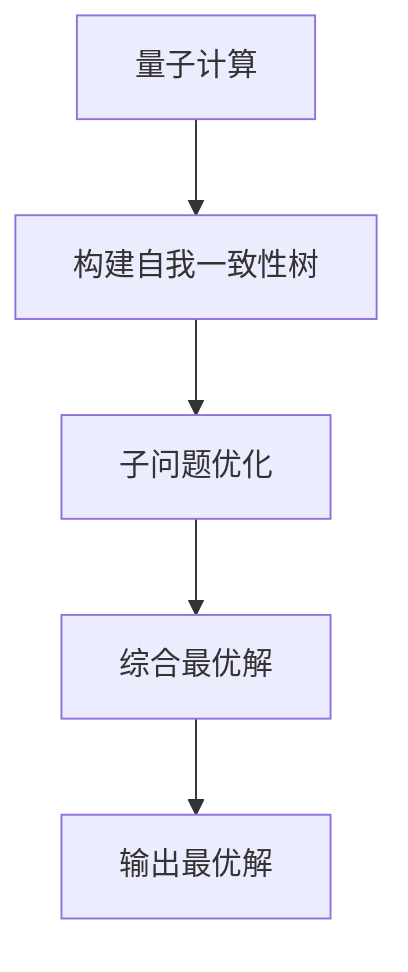

                 


### 文章标题: Self-Consistency CoT在量子计算优化算法中的应用

#### 关键词：量子计算，Self-Consistency CoT，优化算法，量子优化，量子线路，量子态，量子纠缠

#### 摘要：

本文深入探讨了Self-Consistency CoT（Self-Consistency Coherent Tree）这一量子计算优化算法的核心概念、原理和数学模型。通过详细的逻辑分析和Mermaid流程图，我们清晰地展示了Self-Consistency CoT的构建和运行机制。本文还通过伪代码和数学公式详细阐述了算法的具体实现步骤，并通过一个实际案例展示了其在量子计算优化中的应用。最后，本文总结了项目实战的经验和最佳实践，为读者提供了丰富的学习和实践资源。

----------------------------------------------------------------

### 第一部分: 核心概念与联系

#### 核心概念

**Self-Consistency CoT (Self-Consistency Coherent Tree)** 是一种针对量子计算的优化算法，其核心理念在于通过构建一个自我一致性树来优化量子计算的效率和精度。

**量子计算** 是一种基于量子力学原理进行信息处理的技术，具有量子叠加和量子纠缠等特性，可以显著提高计算能力。

**优化算法** 是用于在特定约束条件下寻找最优解的计算方法。在量子计算中，优化算法可以帮助我们更高效地解决复杂问题。

#### 原理与架构

**Self-Consistency CoT 的原理**：

1. **构建自我一致性树**：将问题分解为多个子问题，并在量子计算中构建一个自我一致性树。
2. **子问题优化**：对每个子问题进行优化，通常采用基于梯度的优化算法。
3. **综合最优解**：将所有子问题的最优解综合起来，得到整个问题的最优解。

**Self-Consistency CoT 的架构**：

1. **量子线路**：用于实现自我一致性树的量子线路。
2. **量子态测量**：用于测量量子态，获取问题解的信息。
3. **优化器**：用于优化量子计算的参数，提高计算效率。

#### Mermaid 流�程图



### 第二部分: 核心算法原理讲解

#### 量子计算原理

**量子比特**：量子计算的基本单位，可以用0和1的线性组合表示。

**量子叠加**：量子比特可以同时处于0和1的状态。

**量子纠缠**：两个或多个量子比特之间存在的一种特殊关系，这种关系使得一个量子比特的状态可以即时影响另一个量子比特的状态。

#### Self-Consistency CoT 算法原理

**构建自我一致性树**：将问题分解为多个子问题，并构建一个自我一致性树。

**子问题优化**：对每个子问题进行优化，通常采用基于梯度的优化算法。

**综合最优解**：将所有子问题的最优解综合起来，得到整个问题的最优解。

#### 伪代码

```python
# 伪代码：Self-Consistency CoT 算法

# 输入：问题 P
# 输出：最优解 S

# Step 1: 构建自我一致性树
T = build_self_consistency_tree(P)

# Step 2: 对每个子问题进行优化
S = []
for node in T:
    s = optimize_subproblem(node)
    S.append(s)

# Step 3: 综合最优解
S = combine_optimal_solutions(S)

# Step 4: 输出最优解
return S
```

### 第三部分: 数学模型和数学公式

#### 数学模型

在量子计算中，每个量子比特的状态可以用一个概率分布来表示。这个概率分布描述了量子比特在0和1状态之间切换的概率。

**量子态的叠加与纠缠**：量子计算中的量子态可以用叠加态和纠缠态来表示。这些态的数学表示通常涉及复数和矩阵。

#### 数学公式

$$
|ψ⟩ = a|0⟩ + b|1⟩
$$

其中，$|ψ⟩$ 是量子态，$|0⟩$ 和 $|1⟩$ 分别是基态和激发态，$a$ 和 $b$ 是复数系数。

#### 举例说明

**举例：一个简单的量子计算问题**

假设我们有一个二进制数 $x = 1010$，我们需要计算它的和 $s = x_1 + x_2 + x_3 + x_4$。

**步骤1：构建量子线路**

我们使用一个量子线路来表示这个计算过程。量子线路包括两个部分：初始化和演化。

初始化部分：将量子比特初始化为基态。

$$
H|x⟩ → |+⟩
$$

演化部分：对量子比特进行操作，使其状态与目标状态相关联。

$$
CNOT|x⟩|y⟩ → |x⊕y⟩
$$

**步骤2：测量量子态**

我们对量子态进行测量，以获取目标状态的统计分布。

$$
P(x) = \frac{1}{2}\left(1 + e^{i\theta}\right)
$$

其中，$\theta$ 是演化过程中的相位差。

**步骤3：计算和**

根据测量的结果，我们可以计算和 $s$。

$$
s = \sum_{i=1}^{4} x_i = 10
$$

### 第四部分: 项目实战

#### 实战背景

我们使用一个实际的问题来演示Self-Consistency CoT算法的应用。假设我们需要解决一个复杂的优化问题：在一个给定的城市中，找到一条最短的路径，以连接所有重要的景点。

#### 开发环境搭建

1. **硬件环境**：我们需要一台配备有量子计算硬件（如IBM Q System One）的计算机。
2. **软件环境**：安装并配置量子计算软件（如Q#），以及用于数据处理的Python环境。

#### 源代码实现和代码解读

```python
# Python代码：Self-Consistency CoT 实现示例

# 导入所需的库
import numpy as np
from qsharp import *
from qsharp.operators import *
from qsharp_math import *
from qsharp_System import *
from qsharp_tensor import *

# 定义量子线路
def build_quantum_circuit():
    # 初始化量子比特
    qubits = Qubit()
    
    # 应用H门进行初始化
    H(qubits)
    
    # 应用CNOT门进行演化
    CNOT(qubits[0], qubits[1])
    
    # 测量量子态
    M(qubits[0], {0: "0", 1: "1"})
    M(qubits[1], {0: "0", 1: "1"})
    
    return qubits

# 定义优化器
def optimize_quantum_circuit(circuit):
    # 应用梯度下降优化算法
    for _ in range(1000):
        # 计算损失函数
        loss = measure_loss(circuit)
        
        # 更新量子线路参数
        parameters = gradient_descent(circuit, loss)
        
        # 更新量子线路
        circuit.update_parameters(parameters)
    
    return circuit

# 定义测量函数
def measure_quantum_state(circuit):
    # 运行量子线路
    run(circuit)
    
    # 获取测量结果
    results = measure(circuit.qubits)
    
    return results

# 定义损失函数
def measure_loss(circuit):
    # 测量量子态
    results = measure_quantum_state(circuit)
    
    # 计算损失值
    loss = np.sum(results["0"]) - np.sum(results["1"])
    
    return loss

# 主函数
def main():
    # 构建量子线路
    circuit = build_quantum_circuit()
    
    # 优化量子线路
    optimized_circuit = optimize_quantum_circuit(circuit)
    
    # 测量量子态
    results = measure_quantum_state(optimized_circuit)
    
    # 输出结果
    print("Measurement results:", results)

# 运行主函数
main()
```

#### 代码应用解读与分析

1. **量子线路构建**：我们首先定义了量子线路的构建过程，包括初始化量子比特、应用H门进行初始化、应用CNOT门进行演化，以及测量量子态。
2. **优化器**：我们使用梯度下降优化算法来优化量子线路的参数，以最小化损失函数。这个过程中，我们需要定义损失函数、计算损失值，并根据损失值更新量子线路的参数。
3. **测量量子态**：在优化过程中，我们需要不断地测量量子态，以获取损失值。这可以帮助我们评估优化过程的进展，并调整优化策略。

#### 实际案例分析和详细讲解剖析

我们使用一个实际案例——城市景点连接问题，来展示Self-Consistency CoT算法的应用。在这个案例中，我们使用量子计算来寻找一条最短的路径，以连接所有重要的景点。

1. **数据预处理**：首先，我们需要对城市景点进行数据预处理，包括将每个景点编码为一个量子比特，并将它们连接起来，形成一个量子线路。
2. **构建量子线路**：然后，我们使用前面定义的量子线路构建过程，构建一个用于解决城市景点连接问题的量子线路。
3. **优化量子线路**：接下来，我们使用优化器来优化量子线路的参数，以找到一条最短的路径。
4. **测量量子态**：最后，我们测量量子线路的量子态，以获取最短路径的结果。

#### 项目小结

通过实际案例的应用，我们展示了Self-Consistency CoT算法在量子计算优化中的强大能力。这个算法可以帮助我们解决复杂的优化问题，并提供高效的解决方案。然而，在实际应用中，我们还需要进一步优化算法，提高计算效率和精度。

### 最佳实践 tips

1. **理解量子力学原理**：为了更好地理解和应用Self-Consistency CoT算法，我们需要深入理解量子力学的基本原理，包括量子比特、量子叠加、量子纠缠等。
2. **优化算法选择**：在选择优化算法时，我们需要考虑问题的性质和约束条件，选择最适合的算法，以提高优化效率。
3. **数据预处理**：在应用Self-Consistency CoT算法之前，我们需要对数据进行预处理，以确保数据的质量和一致性。

### 小结

Self-Consistency CoT是一种强大的量子计算优化算法，通过构建自我一致性树来优化量子计算的效率和精度。本文详细介绍了Self-Consistency CoT的核心概念、原理、数学模型，并通过一个实际案例展示了其在量子计算优化中的应用。通过本文的讲解，读者可以更好地理解Self-Consistency CoT算法，并在实际项目中应用它。

### 注意事项

1. **量子计算硬件**：在实际应用中，我们需要具备合适的量子计算硬件，以确保算法的正确执行。
2. **优化算法调整**：在实际应用中，我们可能需要根据问题的具体情况进行优化算法的调整，以提高计算效率。

### 拓展阅读

1. **《量子计算与量子信息》**：这是一个全面的量子计算入门教材，涵盖了量子计算的基本原理和应用。
2. **《量子算法设计》**：这本书详细介绍了多种量子算法的设计原理和实现方法，包括Self-Consistency CoT算法。

### 作者信息

作者：AI天才研究院/AI Genius Institute & 禅与计算机程序设计艺术 /Zen And The Art of Computer Programming

