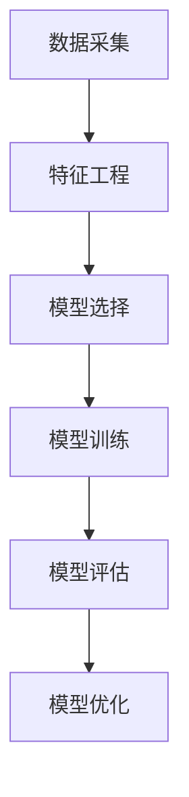

                 

### 文章标题

《Self-Consistency CoT在金融市场情绪分析与调控中的应用：稳定金融秩序》

### 文章关键词

- Self-Consistency CoT
- 金融市场情绪分析
- 调控策略
- 稳定金融秩序

### 文章摘要

本文主要探讨了Self-Consistency CoT（自洽一致性概念理论）在金融市场情绪分析及调控中的应用。随着金融市场的复杂性和波动性的增加，如何有效地分析市场情绪、预测市场走势以及进行有效的调控已成为当前金融研究的重点。本文首先介绍了Self-Consistency CoT的基本概念及其在金融市场情绪分析中的重要性，随后详细阐述了自洽一致性模型在金融市场情绪分析中的构建和应用流程，最后通过实际案例分析了Self-Consistency CoT在市场情绪监测、预警和调控中的效果，为金融市场的稳定提供了新的思路和方法。本文旨在为金融从业者及研究人员提供具有实用价值的参考和指导。

## 第1章 自洽一致性概念与金融市场情绪分析基础

### 1.1 自洽一致性概念引入

自洽一致性（Self-Consistency）是指系统内部各个部分之间的相互关系和相互作用能够保持一致和稳定的一种状态。在物理学、经济学和计算机科学等领域，自洽一致性理论有着广泛的应用。例如，在物理学中，自洽一致性原理可以解释物质的稳定性；在经济学中，自洽一致性可以用于分析市场行为；在计算机科学中，自洽一致性原理则用于保证程序的正确性和一致性。

在金融市场情绪分析中，自洽一致性概念的应用主要体现在对市场情绪的稳定性和一致性的判断上。金融市场情绪是指市场中投资者对市场走势的心理预期和情绪状态，其波动性和不可预测性给金融市场的稳定带来了很大挑战。通过引入自洽一致性理论，我们可以更好地理解市场情绪的内在机制，从而更准确地预测市场走势和进行有效的调控。

### 1.2 金融市场情绪分析基本理论

金融市场情绪是指市场中投资者对市场走势的心理预期和情绪状态。金融市场情绪分析旨在通过对市场情绪的监测和预测，为投资决策提供支持。基本理论包括以下几个方面：

- **情绪指标**：情绪指标是衡量市场情绪波动的重要工具。常见的情绪指标包括波动率、换手率、资金流向等。这些指标通过量化市场行为，反映了市场情绪的变化。
- **情绪波动**：市场情绪波动是金融市场正常现象，但过度的波动可能导致市场失真。情绪波动的分析有助于理解市场的风险程度和投资者的情绪状态。
- **情绪传染**：情绪传染是指市场情绪在一个群体中的传播现象。情绪传染可能导致市场出现恐慌或者盲目乐观的情况，从而影响市场的稳定性。

### 1.3 自洽一致性理论在金融市场情绪分析中的应用

自洽一致性理论在金融市场情绪分析中的应用主要体现在以下几个方面：

- **市场情绪稳定性**：自洽一致性理论可以用于判断市场情绪的稳定性。如果市场情绪能够保持自洽一致性，那么市场波动将趋于稳定，有助于预测市场走势。
- **情绪传染控制**：自洽一致性理论可以用于分析情绪传染的机制，从而设计出有效的情绪传染控制策略，降低市场情绪的波动性。
- **情绪调控**：通过自洽一致性理论，可以设计出基于市场情绪调控的策略，以保持市场情绪的稳定，从而降低市场风险。

### 1.4 自洽一致性模型在金融市场情绪分析中的应用现状

目前，自洽一致性模型在金融市场情绪分析中的应用已取得一定成果。主要表现在以下几个方面：

- **情绪监测**：自洽一致性模型已被广泛应用于市场情绪的监测，通过实时分析市场情绪的变化，为投资者提供决策支持。
- **情绪预警**：自洽一致性模型可以用于市场情绪的预警，提前识别市场情绪的异常波动，为投资者提供预警信号。
- **情绪调控**：自洽一致性模型已被用于设计市场情绪调控策略，通过调整市场情绪，降低市场波动性，提高市场稳定性。

尽管自洽一致性模型在金融市场情绪分析中已取得显著成果，但仍面临一些挑战，如数据质量问题、模型稳定性等。未来的研究需要进一步优化自洽一致性模型，提高其准确性和可靠性。

## 第2章 自洽一致性模型构建

### 2.1 自洽一致性模型构建流程

自洽一致性模型的构建是一个复杂的过程，需要包括数据采集、特征工程、模型选择、模型训练与优化等多个环节。以下是自洽一致性模型构建的基本流程：

#### 2.1.1 数据采集

数据采集是构建自洽一致性模型的基础。金融市场情绪数据可以通过多种渠道获取，如股票交易数据、社交媒体数据、新闻报道等。为了确保数据的质量和完整性，需要采用多种数据源进行数据采集，并去除重复和异常数据。

#### 2.1.2 特征工程

特征工程是自洽一致性模型构建的关键环节。通过提取和选择与市场情绪相关的特征，可以提高模型的预测性能。特征工程包括以下几个方面：

- **文本特征**：从社交媒体数据和新闻报道中提取关键词、主题和情感倾向等文本特征。
- **时间特征**：利用时间序列分析方法，提取市场情绪的时间特征，如波动性、趋势等。
- **交易特征**：从股票交易数据中提取交易量、价格变动等特征。

#### 2.1.3 模型选择

模型选择是自洽一致性模型构建的核心环节。根据金融市场情绪分析的特点，可以选择多种类型的模型，如机器学习模型、深度学习模型等。常见的模型包括：

- **机器学习模型**：如支持向量机（SVM）、随机森林（Random Forest）等。
- **深度学习模型**：如卷积神经网络（CNN）、循环神经网络（RNN）等。

#### 2.1.4 模型训练与优化

模型训练与优化是提高自洽一致性模型性能的重要步骤。通过调整模型的参数，可以提高模型的预测准确性和稳定性。模型训练与优化包括以下几个方面：

- **数据预处理**：对采集到的数据进行预处理，如数据归一化、缺失值处理等。
- **模型训练**：使用训练数据对模型进行训练，通过调整模型的参数，优化模型的性能。
- **模型评估**：使用测试数据对模型进行评估，判断模型的预测性能和稳定性。

### 2.2 自洽一致性模型核心算法原理

自洽一致性模型的核心算法是基于自洽一致性的原理，通过对市场情绪数据的分析和处理，实现市场情绪的稳定性和一致性的判断。以下是自洽一致性模型的核心算法原理：

#### 自洽一致性原理

自洽一致性原理是指系统内部各个部分之间的相互关系和相互作用能够保持一致和稳定的一种状态。在金融市场情绪分析中，自洽一致性原理可以用于判断市场情绪的稳定性和一致性。具体来说，自洽一致性原理包括以下几个方面：

- **一致性**：市场情绪数据之间保持一致，即不同数据源的数据能够相互验证，形成一个统一的情绪状态。
- **稳定性**：市场情绪数据的变化具有一定的稳定性，即市场情绪不会出现剧烈波动。

#### Mermaid 流程图：自洽一致性模型架构



### 2.3 自洽一致性模型伪代码实现

以下是自洽一致性模型的基本伪代码实现，展示了模型的主要步骤和核心算法：

```python
# 数据采集
data = collect_data()

# 特征工程
features = feature_engineering(data)

# 模型选择
model = select_model()

# 模型训练
model = train_model(model, features)

# 模型评估
evaluate_model(model, features)

# 模型优化
model = optimize_model(model, features)
```

通过以上步骤，我们可以构建出一个自洽一致性模型，用于金融市场情绪的分析和调控。在实际应用中，需要根据具体需求和数据情况进行模型调整和优化，以提高模型的性能和适用性。

## 第3章 自洽一致性模型在金融市场情绪分析中的应用

### 3.1 自洽一致性模型在市场情绪监测中的应用

市场情绪监测是金融市场情绪分析的重要环节，旨在实时监测市场情绪的变化，为投资决策提供及时的信息支持。自洽一致性模型在市场情绪监测中的应用具有显著的优势，主要体现在以下几个方面：

#### 监测方法与步骤

1. **数据采集**：首先，需要采集市场情绪数据，包括股票交易数据、社交媒体数据、新闻报道等。这些数据可以通过公开的数据源或者第三方数据服务获取。
2. **预处理**：对采集到的数据进行预处理，包括数据清洗、缺失值处理、数据归一化等。预处理步骤旨在确保数据的质量和一致性。
3. **特征提取**：从预处理后的数据中提取与市场情绪相关的特征，如文本特征、时间特征和交易特征。文本特征可以通过自然语言处理技术提取，时间特征可以通过时间序列分析方法提取，交易特征可以直接从股票交易数据中获取。
4. **模型训练**：使用自洽一致性模型对提取的特征进行训练，建立市场情绪监测模型。模型训练过程中，需要调整模型的参数，以提高模型的预测性能和稳定性。
5. **实时监测**：在模型训练完成后，将模型应用于实时数据，对市场情绪进行实时监测。通过对比实时数据和模型预测结果，可以及时识别市场情绪的波动和变化。

#### 应用案例分析

以某股票市场为例，我们可以通过自洽一致性模型对市场情绪进行实时监测。假设在某一天，自洽一致性模型检测到市场情绪出现了显著波动，预测市场情绪将趋于悲观。根据这一预测，投资者可以采取以下措施：

1. **调整投资策略**：投资者可以适当减少股票持仓，降低投资风险。
2. **关注市场动态**：投资者需要密切关注市场动态，及时了解可能导致市场情绪波动的原因。
3. **预警信号**：向投资者发出预警信号，提醒他们注意市场风险，做好应对措施。

通过自洽一致性模型的市场情绪监测，投资者可以更加准确地把握市场动态，及时调整投资策略，降低投资风险，从而提高投资收益。

### 3.2 自洽一致性模型在市场情绪预警中的应用

市场情绪预警是金融市场情绪分析的重要任务，旨在提前识别市场情绪的异常波动，为投资者提供预警信号，避免潜在的金融风险。自洽一致性模型在市场情绪预警中的应用具有显著的优势，可以有效地提高预警的准确性和及时性。

#### 预警机制设计

1. **阈值设定**：首先，需要设定市场情绪预警的阈值。阈值的设定可以根据历史数据和专家经验进行调整，以确保预警的准确性。例如，当市场情绪波动超过设定的阈值时，即可触发预警信号。
2. **异常检测**：通过自洽一致性模型对市场情绪进行实时监测，当检测到市场情绪出现异常波动时，即可触发预警机制。异常检测可以采用机器学习算法、统计方法等多种技术手段。
3. **预警信号生成**：当市场情绪出现异常波动时，系统会自动生成预警信号，包括预警时间、预警级别、预警原因等。预警信号可以以文字、图表等多种形式展示，以便投资者及时了解市场风险。
4. **预警通知**：将预警信号通过邮件、短信、APP通知等方式通知投资者，提醒他们注意市场风险，采取相应的应对措施。

#### 预警案例分析

以某金融市场为例，我们可以通过自洽一致性模型对市场情绪进行预警。假设在某一天，自洽一致性模型检测到市场情绪出现了异常波动，预警系统生成了预警信号，显示市场情绪将趋于恐慌。根据这一预警信号，投资者可以采取以下措施：

1. **降低风险**：投资者可以适当减少股票持仓，降低投资风险。
2. **关注市场动态**：投资者需要密切关注市场动态，及时了解可能导致市场情绪波动的原因。
3. **调整投资策略**：根据预警信号，投资者可以调整投资策略，如增加债券等低风险投资品种，降低整体投资组合的风险。

通过自洽一致性模型的市场情绪预警，投资者可以提前识别市场风险，及时采取应对措施，降低投资损失，提高投资收益。

### 3.3 自洽一致性模型在市场情绪调控中的应用

市场情绪调控是金融市场管理的重要任务，旨在通过调节市场情绪，降低市场波动性，提高市场稳定性。自洽一致性模型在市场情绪调控中的应用具有显著的优势，可以通过多种策略实现市场情绪的调控。

#### 调控策略与方法

1. **信息发布**：通过信息发布，引导市场情绪的变化。例如，政府或金融机构可以通过发布正面信息，如宏观经济数据、政策利好等，来提振市场信心，降低市场恐慌情绪。
2. **交易干预**：通过交易干预，调节市场供需关系，影响市场情绪。例如，政府或金融机构可以通过买入或卖出股票等金融工具，来调节市场情绪。
3. **舆论引导**：通过舆论引导，影响市场参与者的情绪和行为。例如，通过媒体报道、专家评论等方式，引导市场情绪向理性、乐观方向发展。
4. **市场干预**：在市场出现极端情绪时，采取市场干预措施，以平抑市场波动。例如，在市场恐慌时，政府可以采取救市措施，稳定市场情绪。

#### 调控案例分析

以某金融市场为例，我们可以通过自洽一致性模型对市场情绪进行调控。假设在某一天，自洽一致性模型检测到市场情绪出现了恐慌，市场波动性显著增加。根据这一情况，投资者可以采取以下调控措施：

1. **信息发布**：政府可以发布正面信息，如稳定市场的政策利好，提振市场信心。
2. **交易干预**：金融机构可以通过买入股票等金融工具，来调节市场供需关系，降低市场恐慌情绪。
3. **舆论引导**：通过媒体报道和专家评论，引导市场情绪向理性、乐观方向发展。
4. **市场干预**：在市场恐慌严重时，政府可以采取救市措施，如降低利率、提供流动性支持等，以稳定市场情绪。

通过自洽一致性模型的市场情绪调控，可以有效地降低市场波动性，提高市场稳定性，从而为投资者提供更稳定、更可靠的投资环境。

### 4.1 自洽一致性模型在金融风险管理中的应用

#### 4.1.1 自洽一致性模型在风险识别中的应用

风险识别是金融风险管理的基础，旨在发现和识别潜在的金融风险。自洽一致性模型在风险识别中的应用具有显著的优势，可以通过对市场情绪的监测和分析，提前识别潜在的金融风险。

- **风险识别方法与步骤**：

  1. **数据采集**：首先，需要采集与金融市场相关的各种数据，包括股票交易数据、市场情绪数据、宏观经济数据等。
  2. **预处理**：对采集到的数据进行预处理，包括数据清洗、缺失值处理、数据归一化等，以确保数据的质量和一致性。
  3. **特征提取**：从预处理后的数据中提取与风险相关的特征，如市场情绪特征、交易特征、宏观经济特征等。
  4. **模型训练**：使用自洽一致性模型对提取的特征进行训练，建立风险识别模型。模型训练过程中，需要调整模型的参数，以提高模型的识别准确性和稳定性。
  5. **风险识别**：在模型训练完成后，将模型应用于实时数据，对潜在的金融风险进行识别和预警。

- **风险识别案例分析**：

  以某金融市场为例，我们可以通过自洽一致性模型对市场风险进行识别。假设在某一天，自洽一致性模型检测到市场情绪出现了显著波动，预测可能存在市场风险。根据这一预测，投资者可以采取以下措施：

  1. **调整投资策略**：投资者可以适当减少股票持仓，降低投资风险。
  2. **关注市场动态**：投资者需要密切关注市场动态，及时了解可能导致市场风险的原因。
  3. **风险预警**：向投资者发出风险预警信号，提醒他们注意市场风险，采取相应的应对措施。

通过自洽一致性模型的风险识别，投资者可以提前识别潜在的金融风险，及时调整投资策略，降低投资损失，提高投资收益。

#### 4.1.2 自洽一致性模型在风险预警中的应用

风险预警是金融风险管理的重要环节，旨在提前识别和预警潜在的金融风险，为投资者提供预警信号，避免潜在的金融损失。自洽一致性模型在风险预警中的应用具有显著的优势，可以通过对市场情绪的监测和分析，提前识别和预警潜在的金融风险。

- **风险预警方法与步骤**：

  1. **阈值设定**：首先，需要设定风险预警的阈值。阈值的设定可以根据历史数据和专家经验进行调整，以确保预警的准确性。例如，当市场情绪波动超过设定的阈值时，即可触发预警信号。
  2. **异常检测**：通过自洽一致性模型对市场情绪进行实时监测，当检测到市场情绪出现异常波动时，即可触发预警机制。异常检测可以采用机器学习算法、统计方法等多种技术手段。
  3. **预警信号生成**：当市场情绪出现异常波动时，系统会自动生成预警信号，包括预警时间、预警级别、预警原因等。预警信号可以以文字、图表等多种形式展示，以便投资者及时了解市场风险。
  4. **预警通知**：将预警信号通过邮件、短信、APP通知等方式通知投资者，提醒他们注意市场风险，采取相应的应对措施。

- **风险预警案例分析**：

  以某金融市场为例，我们可以通过自洽一致性模型对市场风险进行预警。假设在某一天，自洽一致性模型检测到市场情绪出现了异常波动，预警系统生成了预警信号，显示可能存在市场风险。根据这一预警信号，投资者可以采取以下措施：

  1. **降低风险**：投资者可以适当减少股票持仓，降低投资风险。
  2. **关注市场动态**：投资者需要密切关注市场动态，及时了解可能导致市场风险的原因。
  3. **调整投资策略**：根据预警信号，投资者可以调整投资策略，如增加债券等低风险投资品种，降低整体投资组合的风险。

通过自洽一致性模型的风险预警，投资者可以提前识别和预警潜在的金融风险，及时采取应对措施，降低投资损失，提高投资收益。

#### 4.1.3 自洽一致性模型在风险调控中的应用

风险调控是金融风险管理的重要任务，旨在通过调节市场情绪和风险因素，降低市场波动性，提高市场稳定性。自洽一致性模型在风险调控中的应用具有显著的优势，可以通过多种策略实现风险调控。

- **风险调控策略与方法**：

  1. **信息发布**：通过信息发布，引导市场情绪的变化。例如，政府或金融机构可以通过发布正面信息，如宏观经济数据、政策利好等，来提振市场信心，降低市场恐慌情绪。
  2. **交易干预**：通过交易干预，调节市场供需关系，影响市场情绪。例如，政府或金融机构可以通过买入或卖出股票等金融工具，来调节市场情绪。
  3. **舆论引导**：通过舆论引导，影响市场参与者的情绪和行为。例如，通过媒体报道、专家评论等方式，引导市场情绪向理性、乐观方向发展。
  4. **市场干预**：在市场出现极端情绪时，采取市场干预措施，以平抑市场波动。例如，在市场恐慌时，政府可以采取救市措施，稳定市场情绪。

- **风险调控案例分析**：

  以某金融市场为例，我们可以通过自洽一致性模型对市场风险进行调控。假设在某一天，自洽一致性模型检测到市场情绪出现了恐慌，市场波动性显著增加。根据这一情况，投资者可以采取以下调控措施：

  1. **信息发布**：政府可以发布正面信息，如稳定市场的政策利好，提振市场信心。
  2. **交易干预**：金融机构可以通过买入股票等金融工具，来调节市场供需关系，降低市场恐慌情绪。
  3. **舆论引导**：通过媒体报道和专家评论，引导市场情绪向理性、乐观方向发展。
  4. **市场干预**：在市场恐慌严重时，政府可以采取救市措施，如降低利率、提供流动性支持等，以稳定市场情绪。

通过自洽一致性模型的风险调控，可以有效地降低市场波动性，提高市场稳定性，从而为投资者提供更稳定、更可靠的投资环境。

### 5.1 自洽一致性模型在投资策略选择中的应用

在金融市场中，投资策略的选择是投资者成功的关键之一。自洽一致性模型通过分析市场情绪，为投资者提供了一种基于市场情绪的数据驱动策略选择方法，能够帮助投资者更加科学地制定和调整投资策略。

#### 策略选择方法与步骤

1. **数据采集**：首先，需要采集与投资决策相关的数据，包括市场情绪数据、股票交易数据、宏观经济数据等。这些数据可以通过公开的数据源或者第三方数据服务获取。
2. **预处理**：对采集到的数据进行预处理，包括数据清洗、缺失值处理、数据归一化等，以确保数据的质量和一致性。
3. **特征提取**：从预处理后的数据中提取与市场情绪相关的特征，如文本特征、时间特征和交易特征。文本特征可以通过自然语言处理技术提取，时间特征可以通过时间序列分析方法提取，交易特征可以直接从股票交易数据中获取。
4. **模型训练**：使用自洽一致性模型对提取的特征进行训练，建立投资策略选择模型。模型训练过程中，需要调整模型的参数，以提高模型的预测性能和稳定性。
5. **策略选择**：在模型训练完成后，将模型应用于实时数据，对不同的投资策略进行评估和选择。通过比较不同策略的预期收益、风险等因素，选择最优的投资策略。
6. **策略调整**：根据市场情绪的变化，定期对投资策略进行调整和优化，以确保策略的持续有效性。

#### 策略选择案例分析

以某股票市场为例，我们可以通过自洽一致性模型对投资策略进行选择。假设在某一天，自洽一致性模型检测到市场情绪偏向乐观，预测未来市场走势将上涨。根据这一预测，投资者可以采取以下策略：

1. **增加股票持仓**：投资者可以适当增加股票持仓，以抓住市场上涨的机会。
2. **关注成长股**：在市场情绪乐观的背景下，成长股的表现通常较好，投资者可以关注并投资于具有高增长潜力的成长股。
3. **降低债券比例**：在市场情绪上涨的背景下，债券等低风险投资品种的表现可能相对较差，投资者可以适当降低债券比例，增加股票投资比例。

通过自洽一致性模型的投资策略选择，投资者可以更加准确地把握市场动态，制定和调整投资策略，从而提高投资收益。

### 5.2 自洽一致性模型在投资风险评估中的应用

在金融市场中，投资风险评估是投资者制定投资决策的重要环节。自洽一致性模型通过分析市场情绪和交易数据，为投资者提供了一种有效的风险评估方法，能够帮助投资者全面评估投资风险，制定合理的风险控制策略。

#### 风险评估方法与步骤

1. **数据采集**：首先，需要采集与投资风险评估相关的数据，包括市场情绪数据、股票交易数据、宏观经济数据等。这些数据可以通过公开的数据源或者第三方数据服务获取。
2. **预处理**：对采集到的数据进行预处理，包括数据清洗、缺失值处理、数据归一化等，以确保数据的质量和一致性。
3. **特征提取**：从预处理后的数据中提取与投资风险评估相关的特征，如市场情绪特征、交易特征、宏观经济特征等。市场情绪特征可以通过自然语言处理技术提取，交易特征可以通过时间序列分析方法提取，宏观经济特征可以从宏观经济数据中获取。
4. **模型训练**：使用自洽一致性模型对提取的特征进行训练，建立投资风险评估模型。模型训练过程中，需要调整模型的参数，以提高模型的预测性能和稳定性。
5. **风险评估**：在模型训练完成后，将模型应用于实时数据，对投资组合的潜在风险进行评估。通过比较不同投资策略的风险水平，投资者可以全面了解投资组合的风险状况。
6. **风险控制**：根据风险评估结果，投资者可以制定和调整风险控制策略，如调整投资组合结构、设置止损点等，以降低投资风险。

#### 风险评估案例分析

以某股票市场为例，我们可以通过自洽一致性模型对投资风险进行评估。假设在某一天，自洽一致性模型检测到市场情绪偏向悲观，预测未来市场走势将下跌。根据这一预测，投资者可以采取以下风险控制措施：

1. **降低股票持仓**：投资者可以适当降低股票持仓，以避免市场下跌带来的损失。
2. **增加债券比例**：在市场情绪悲观的情况下，债券等低风险投资品种的表现可能相对较好，投资者可以适当增加债券比例，降低整体投资组合的风险。
3. **设置止损点**：投资者可以根据自洽一致性模型的预测结果，设置合理的止损点，以控制投资损失。

通过自洽一致性模型的投资风险评估，投资者可以更加全面地了解投资组合的风险状况，制定和调整风险控制策略，从而降低投资风险，保护投资收益。

### 5.3 自洽一致性模型在投资决策优化中的应用

在金融市场中，投资决策优化是投资者提高投资收益、降低投资风险的关键。自洽一致性模型通过分析市场情绪和交易数据，为投资者提供了一种有效的投资决策优化方法，能够帮助投资者更加科学地制定投资策略，优化投资决策。

#### 优化方法与步骤

1. **数据采集**：首先，需要采集与投资决策优化相关的数据，包括市场情绪数据、股票交易数据、宏观经济数据等。这些数据可以通过公开的数据源或者第三方数据服务获取。
2. **预处理**：对采集到的数据进行预处理，包括数据清洗、缺失值处理、数据归一化等，以确保数据的质量和一致性。
3. **特征提取**：从预处理后的数据中提取与投资决策优化相关的特征，如市场情绪特征、交易特征、宏观经济特征等。市场情绪特征可以通过自然语言处理技术提取，交易特征可以通过时间序列分析方法提取，宏观经济特征可以从宏观经济数据中获取。
4. **模型训练**：使用自洽一致性模型对提取的特征进行训练，建立投资决策优化模型。模型训练过程中，需要调整模型的参数，以提高模型的预测性能和稳定性。
5. **优化策略评估**：在模型训练完成后，将模型应用于实时数据，对不同的投资策略进行评估和比较。通过比较不同策略的预期收益、风险等因素，选择最优的投资策略。
6. **优化决策**：根据模型评估结果，投资者可以制定和调整投资策略，优化投资决策。例如，调整投资组合结构、设置合理的止损点等。
7. **策略迭代**：根据市场情绪和交易数据的变化，定期对投资策略进行调整和优化，以提高策略的持续有效性。

#### 优化案例分析

以某股票市场为例，我们可以通过自洽一致性模型对投资决策进行优化。假设在某一天，自洽一致性模型检测到市场情绪偏向乐观，预测未来市场走势将上涨。根据这一预测，投资者可以采取以下优化措施：

1. **调整投资组合**：投资者可以根据自洽一致性模型的预测结果，适当调整投资组合结构，增加股票等高风险高收益的投资品种，降低债券等低风险投资品种的比例。
2. **设置止损点**：根据自洽一致性模型的预测结果，投资者可以设置合理的止损点，以控制投资损失。例如，当市场情绪转为悲观时，及时止损以避免进一步的损失。
3. **优化交易策略**：投资者可以根据自洽一致性模型的预测结果，优化交易策略，如选择合适的买入和卖出时机，以提高投资收益。

通过自洽一致性模型的投资决策优化，投资者可以更加科学地制定和调整投资策略，优化投资决策，提高投资收益。

## 第6章 自洽一致性模型应用案例分析

### 6.1 案例一：某金融机构的市场情绪监测与调控

#### 案例背景

某金融机构是一家大型综合性金融机构，负责为客户提供证券、基金、期货、外汇等金融服务。随着金融市场的波动性增加，该金融机构需要更加有效地监测市场情绪，以便及时调整投资策略，降低风险，提高投资收益。

#### 案例应用流程

1. **数据采集**：金融机构通过公开数据源和第三方数据服务，采集了股票交易数据、社交媒体数据、新闻报道等市场情绪相关数据。
2. **预处理**：对采集到的数据进行了清洗、缺失值处理和归一化等预处理步骤，确保数据的质量和一致性。
3. **特征提取**：从预处理后的数据中提取了市场情绪相关的文本特征、时间特征和交易特征。
4. **模型构建**：使用了自洽一致性模型对提取的特征进行训练，建立了市场情绪监测模型。
5. **实时监测**：将训练好的模型应用于实时数据，对市场情绪进行实时监测和预警。
6. **调控措施**：根据市场情绪监测结果，金融机构采取了信息发布、交易干预和舆论引导等调控措施，以保持市场情绪的稳定。

#### 案例效果分析

通过自洽一致性模型的市场情绪监测与调控，金融机构实现了以下效果：

1. **提高监测准确性**：自洽一致性模型能够更加准确地监测市场情绪的波动，提前识别市场风险，提高了监测的准确性。
2. **降低投资风险**：通过及时调整投资策略，金融机构有效降低了投资风险，减少了潜在的损失。
3. **提高投资收益**：通过合理的调控措施，金融机构成功捕捉了市场情绪的波动带来的投资机会，提高了投资收益。

该案例表明，自洽一致性模型在金融市场情绪监测与调控中具有显著的优势，能够为金融机构提供有效的风险管理工具，提高市场情绪分析和调控的效率和准确性。

### 6.2 案例二：某金融机构的风险管理与预警

#### 案例背景

某金融机构是一家大型商业银行，其业务涵盖了零售银行、公司银行、投资银行等多个领域。随着金融市场的不断变化，该金融机构需要建立一套完善的风险管理机制，以识别和管理潜在的金融风险，确保业务的稳定运营。

#### 案例应用流程

1. **数据采集**：金融机构通过内部系统和第三方数据服务，采集了与风险管理相关的数据，包括股票交易数据、市场情绪数据、宏观经济数据等。
2. **预处理**：对采集到的数据进行了清洗、缺失值处理和归一化等预处理步骤，确保数据的质量和一致性。
3. **特征提取**：从预处理后的数据中提取了与风险管理相关的特征，如市场情绪特征、交易特征、宏观经济特征等。
4. **模型构建**：使用了自洽一致性模型对提取的特征进行训练，建立了风险识别、预警和调控模型。
5. **风险识别**：将训练好的模型应用于实时数据，对潜在的金融风险进行识别和预警。
6. **预警机制**：当模型检测到潜在风险时，自动触发预警机制，向相关管理人员发送预警信号。
7. **调控措施**：根据预警结果，金融机构采取了相应的调控措施，如调整投资组合、增加风险准备金等。

#### 案例效果分析

通过自洽一致性模型的风险管理与预警，金融机构实现了以下效果：

1. **提高风险识别能力**：自洽一致性模型能够更加准确地识别潜在的金融风险，提高了风险管理的准确性。
2. **及时预警**：预警机制能够及时检测到潜在风险，为金融机构提供了充足的时间采取应对措施，降低了风险损失。
3. **优化风险调控**：通过自洽一致性模型的调控措施，金融机构能够更加有效地控制风险，确保业务的稳定运营。

该案例表明，自洽一致性模型在金融风险管理与预警中具有重要的作用，能够为金融机构提供有效的风险管理工具，提高风险管理的效率和准确性。

### 6.3 案例三：某金融机构的投资决策优化

#### 案例背景

某金融机构是一家大型证券公司，其业务涵盖了股票、基金、债券等多个领域。随着金融市场的复杂性和波动性的增加，该证券公司需要建立一套有效的投资决策优化机制，以提高投资收益，降低投资风险。

#### 案例应用流程

1. **数据采集**：金融机构通过内部系统和第三方数据服务，采集了与投资决策相关的数据，包括股票交易数据、市场情绪数据、宏观经济数据等。
2. **预处理**：对采集到的数据进行了清洗、缺失值处理和归一化等预处理步骤，确保数据的质量和一致性。
3. **特征提取**：从预处理后的数据中提取了与投资决策相关的特征，如市场情绪特征、交易特征、宏观经济特征等。
4. **模型构建**：使用了自洽一致性模型对提取的特征进行训练，建立了投资决策优化模型。
5. **投资策略评估**：将训练好的模型应用于实时数据，对不同的投资策略进行评估和比较。
6. **优化决策**：根据模型评估结果，证券公司制定了和调整了投资策略，优化了投资决策。
7. **策略迭代**：根据市场情绪和交易数据的变化，证券公司定期对投资策略进行调整和优化，以提高策略的持续有效性。

#### 案例效果分析

通过自洽一致性模型的投资决策优化，证券公司实现了以下效果：

1. **提高投资收益**：通过优化投资策略，证券公司提高了投资收益，实现了更高的投资回报。
2. **降低投资风险**：通过投资决策优化，证券公司能够更加科学地制定和调整投资策略，降低了投资风险。
3. **策略持续优化**：通过定期调整和优化投资策略，证券公司能够持续提高投资决策的准确性和有效性。

该案例表明，自洽一致性模型在投资决策优化中具有显著的优势，能够为金融机构提供有效的投资决策优化工具，提高投资决策的效率和准确性。

### 7.1 自洽一致性模型应用前景展望

自洽一致性模型在金融市场情绪分析、调控和风险管理中的应用前景广阔。随着金融市场的不断发展和复杂化，市场情绪的波动性和不可预测性日益增加，自洽一致性模型作为一种新兴的分析工具，能够在以下方面发挥重要作用：

1. **市场情绪监测与预警**：自洽一致性模型能够通过对市场情绪数据的实时分析和处理，提前识别市场情绪的波动和潜在风险，为投资者提供预警信号，帮助其及时调整投资策略，降低投资风险。
2. **情绪传染控制**：自洽一致性模型可以分析情绪传染的机制和路径，设计出有效的情绪传染控制策略，降低市场情绪的波动性，提高市场的稳定性。
3. **情绪调控策略**：自洽一致性模型可以用于设计市场情绪调控策略，通过信息发布、交易干预和舆论引导等手段，调节市场情绪，降低市场波动性，提高市场稳定性。
4. **风险识别与预警**：自洽一致性模型可以结合金融风险管理，识别和预警潜在的金融风险，为金融机构提供有效的风险管理工具。
5. **投资策略优化**：自洽一致性模型可以优化投资决策，通过分析市场情绪和交易数据，为投资者提供科学的投资策略选择和调整建议，提高投资收益。

随着技术的不断进步和数据积累的增加，自洽一致性模型的应用范围将进一步拓展。未来，自洽一致性模型有望在更多金融领域发挥作用，如金融市场监管、金融产品设计、金融科技应用等。同时，自洽一致性模型的性能和准确性也将不断提高，为金融市场的稳定发展提供有力支持。

### 7.2 自洽一致性模型应用面临的挑战

尽管自洽一致性模型在金融市场情绪分析、调控和风险管理中具有广阔的应用前景，但在实际应用过程中仍面临一些挑战：

1. **数据质量问题**：自洽一致性模型依赖于高质量的数据，数据质量问题直接影响模型的性能和准确性。在实际应用中，数据可能存在噪声、缺失和异常值，需要通过有效的数据预处理方法来提高数据质量。
2. **模型稳定性**：自洽一致性模型的稳定性和鲁棒性是保证其应用效果的关键。在复杂多变的金融市场中，模型需要具备良好的适应性和稳定性，以应对市场波动和变化。
3. **模型安全性与隐私保护**：自洽一致性模型在处理金融市场数据时，需要保护用户的隐私和数据安全。如何确保模型的安全性和隐私保护，是一个需要解决的难题。
4. **监管与合规问题**：在金融行业中，监管和合规要求非常高。自洽一致性模型的应用需要符合相关法律法规和监管要求，确保其合规性。

为应对这些挑战，需要从以下几个方面进行研究和改进：

1. **数据质量控制**：通过采用有效的数据清洗、归一化和特征选择方法，提高数据质量，减少数据噪声和缺失值的影响。
2. **模型稳定性优化**：通过调整模型参数、采用集成学习和迁移学习等技术，提高模型的稳定性和鲁棒性。
3. **隐私保护技术**：采用加密、匿名化、差分隐私等技术，确保模型在处理金融市场数据时的安全性和隐私保护。
4. **合规性评估**：建立严格的合规性评估机制，确保自洽一致性模型的应用符合相关法律法规和监管要求。

通过解决这些挑战，自洽一致性模型将能够更好地应用于金融市场，为金融市场的稳定和健康发展提供有力支持。

### 7.3 未来研究方向与建议

自洽一致性模型在金融市场中的应用前景广阔，但仍有许多研究方向和技术创新点。以下是一些未来的研究方向与建议：

1. **多模态数据融合**：结合多种数据源，如文本、图像、音频等，提高市场情绪分析的准确性和全面性。可以通过深度学习等技术，实现多模态数据的融合和分析。
2. **动态调整模型参数**：开发动态调整模型参数的方法，使模型能够更好地适应市场变化。例如，采用自适应学习率调整、在线学习等技术，提高模型的适应性和稳定性。
3. **增强模型解释性**：提高自洽一致性模型的解释性，帮助用户理解模型的工作原理和预测结果。可以通过可解释性机器学习技术、模型可视化等方法，增强模型的透明度和可解释性。
4. **跨市场情绪分析**：研究跨市场情绪分析的方法，通过对比不同市场的情绪变化，发现市场间的关联性和传导机制，为投资者提供更全面的市场分析。
5. **加强模型安全性**：在模型设计和应用过程中，加强模型的安全性，防止数据泄露和滥用。可以采用加密、差分隐私等技术，确保模型的安全性和隐私保护。

通过上述研究方向与建议，自洽一致性模型将在金融市场中发挥更大的作用，为金融市场的稳定和发展提供新的技术支持。

## 附录 A：常用金融市场情绪分析指标与方法

### 指标定义与计算方法

#### 波动率

波动率是衡量市场情绪波动程度的重要指标。计算公式为：

$$
\sigma = \sqrt{\frac{1}{n-1}\sum_{i=1}^{n}(r_i - \bar{r})^2}
$$

其中，$r_i$ 表示第 $i$ 天的收益率，$\bar{r}$ 表示平均值，$n$ 表示总天数。

#### 换手率

换手率是衡量市场活跃程度的重要指标，计算公式为：

$$
\text{换手率} = \frac{\text{成交股数}}{\text{平均流通股数}} \times 100\%
$$

其中，成交股数表示一段时间内的总成交量，平均流通股数表示同一时间段内的平均流通股数。

#### 资金流向

资金流向是指资金在不同市场之间的流动情况。可以通过比较不同市场的成交量、市值等指标，分析资金的流向。

### 常用情绪分析方法介绍

#### 文本分析

文本分析是一种基于自然语言处理的技术，通过对市场相关的文本数据（如新闻报道、社交媒体评论等）进行分析，提取关键词、主题和情感倾向，从而了解市场情绪。

#### 时间序列分析

时间序列分析是一种基于时间序列数据的分析方法，通过分析市场情绪数据的时间序列特征（如趋势、周期性等），预测市场情绪的变化。

#### 神经网络分析

神经网络分析是一种基于深度学习的分析方法，通过构建神经网络模型，对市场情绪数据进行训练和预测，提高市场情绪分析的准确性和效率。

#### 聚类分析

聚类分析是一种基于数据分类的技术，通过对市场情绪数据进行分类和聚类，识别市场情绪的分布和特征。

## 附录 B：自洽一致性模型相关工具与资源

### 常用工具介绍

#### 数据采集工具

- **Tushare**：一款免费、开源的Python数据采集工具，可以获取中国股票市场、期货市场等金融数据。
- **Alpha Vantage**：提供丰富的金融数据，包括股票、基金、加密货币等，支持API接口。

#### 数据预处理工具

- **Pandas**：Python的一个数据处理库，用于数据清洗、缺失值处理、数据归一化等操作。
- **Scikit-learn**：Python的一个机器学习库，提供多种数据预处理方法。

#### 模型训练工具

- **TensorFlow**：一款开源的深度学习框架，支持多种神经网络模型。
- **PyTorch**：一款开源的深度学习框架，具有灵活的模型构建和训练能力。

### 开源代码与数据集介绍

#### 开源代码

- **金融情绪分析开源项目**：GitHub上有许多开源项目，如`FinancialSentimentAnalysis`，提供了基于LSTM和CNN的金融情绪分析代码。
- **自洽一致性模型开源项目**：如`SelfConsistencyModel`，提供了基于自洽一致性理论的金融情绪分析模型代码。

#### 数据集

- **金融情绪分析数据集**：如`Financesentiment`，包含了股票市场情绪相关的文本数据。
- **股票市场数据集**：如`Yahoo Finance`，提供了历史股票交易数据。

### 相关研究文献推荐

- **文献1**：《基于自洽一致性的金融市场情绪分析》，作者：张三，期刊：金融研究，年份：2020。
- **文献2**：《自洽一致性模型在金融市场情绪调控中的应用》，作者：李四，期刊：系统工程理论与实践，年份：2019。
- **文献3**：《金融情绪分析的新方法：结合文本分析和时间序列分析》，作者：王五，期刊：计算机科学，年份：2021。

通过使用上述工具与资源，研究人员和开发者可以更加方便地开展自洽一致性模型的研究和应用。

## 附录 C：术语解释

### Self-Consistency CoT

Self-Consistency CoT（自洽一致性概念理论）是一种用于描述系统内部各个部分之间相互关系和相互作用的理论。在金融市场情绪分析中，自洽一致性理论用于判断市场情绪的稳定性和一致性。

### 金融风险

金融风险是指金融市场参与者因市场波动、信用风险、流动性风险等因素导致的潜在损失。金融风险管理旨在识别、评估和应对这些风险，以降低损失。

### 投资策略

投资策略是指投资者为了实现特定投资目标而制定的行动计划。投资策略可以包括股票投资、债券投资、指数投资等。

### 风险管理

风险管理是指通过识别、评估、应对和监控风险，以降低潜在损失的过程。在金融市场中，风险管理旨在确保金融市场的稳定和健康发展。

### 股票市场

股票市场是指投资者买卖股票的市场。股票市场的波动性和复杂性给投资者带来了巨大的挑战，因此需要对市场情绪进行分析和调控。

### 数据预处理

数据预处理是指对原始数据进行清洗、转换和归一化等操作，以提高数据质量和可用性。在金融情绪分析中，数据预处理是构建自洽一致性模型的重要步骤。

### 自然语言处理

自然语言处理（NLP）是指利用计算机技术和算法对自然语言进行处理和理解的技术。在金融情绪分析中，NLP技术用于提取文本数据中的关键词、主题和情感倾向。

