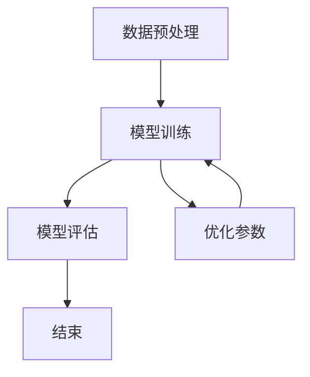
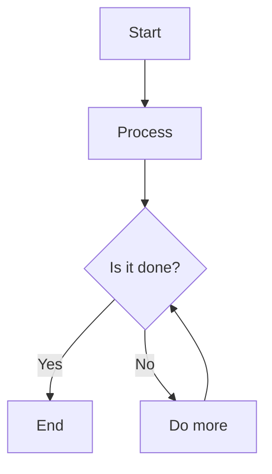

                 

### 文章标题：Self-Consistency CoT在金融市场预测中的应用

> 关键词：Self-Consistency CoT、金融市场预测、时间序列分析、情绪分析、风险预测、算法优化、实践指南

> 摘要：本文将探讨Self-Consistency CoT（Self-Consistency Coherent Thought Vectors）在金融市场预测中的应用。首先，我们介绍Self-Consistency CoT的基本原理及其与金融市场预测的关系。接着，详细讲解Self-Consistency CoT算法的原理和流程，并通过Mermaid流程图进行可视化。随后，本文将展示Self-Consistency CoT在金融时间序列预测、情绪分析和风险预测等领域的应用案例。最后，我们讨论Self-Consistency CoT算法的优化与改进方向，并提供实践指南和资源。

---

### 目录大纲：Self-Consistency CoT在金融市场预测中的应用

#### 第一部分：金融市场预测与Self-Consistency CoT概述

- # 1. Self-Consistency CoT基础
  - ### 1.1 Self-Consistency CoT概念介绍
    - **1.1.1 Self-Consistency CoT的基本原理**
    - **1.1.2 Self-Consistency CoT与金融市场预测的关系**
  - ### 1.2 金融市场预测概述
    - **1.2.1 金融市场预测的重要性**
    - **1.2.2 当前金融市场预测的方法与挑战**
  - ### 1.3 Self-Consistency CoT在金融市场预测中的应用前景
    - **1.3.1 Self-Consistency CoT在金融市场预测中的优势**
    - **1.3.2 Self-Consistency CoT在金融市场预测中的潜在应用领域**

#### 第二部分：Self-Consistency CoT算法原理详解

- # 2. Self-Consistency CoT算法原理
  - ### 2.1 Self-Consistency CoT算法核心概念
    - **2.1.1 Self-Consistency CoT的数学模型**
    - **2.1.2 Self-Consistency CoT算法的关键组成部分**
  - ### 2.2 Self-Consistency CoT算法流程分析
    - **2.2.1 数据预处理**
    - **2.2.2 模型训练与优化**
    - **2.2.3 预测与评估**
  - ### 2.3 Self-Consistency CoT算法Mermaid流程图
    - **2.3.1 Mermaid流程图展示**
    - **2.3.2 流程图详细解读**

#### 第三部分：Self-Consistency CoT算法在金融市场预测中的应用

- # 3. Self-Consistency CoT算法在金融市场预测中的应用案例
  - ### 3.1 金融时间序列预测
    - **3.1.1 预测模型构建**
    - **3.1.2 预测结果分析与优化**
  - ### 3.2 金融情绪分析
    - **3.2.1 情绪数据获取与预处理**
    - **3.2.2 情绪分析模型构建**
    - **3.2.3 情绪分析结果与应用**
  - ### 3.3 金融风险预测
    - **3.3.1 风险预测模型构建**
    - **3.3.2 风险预测结果与应用**

#### 第四部分：Self-Consistency CoT算法的优化与改进

- # 4. Self-Consistency CoT算法的优化与改进
  - ### 4.1 Self-Consistency CoT算法性能评估
    - **4.1.1 性能评估指标**
    - **4.1.2 性能评估方法**
  - ### 4.2 Self-Consistency CoT算法优化策略
    - **4.2.1 算法参数调整**
    - **4.2.2 数据增强与多样化**
  - ### 4.3 Self-Consistency CoT算法改进方向
    - **4.3.1 算法效率提升**
    - **4.3.2 算法泛化能力增强**

#### 第五部分：Self-Consistency CoT在金融市场预测中的实践

- # 5. Self-Consistency CoT在金融市场预测中的实践指南
  - ### 5.1 实践环境搭建
    - **5.1.1 硬件与软件需求**
    - **5.1.2 数据集准备**
  - ### 5.2 实践案例分析
    - **5.2.1 案例一：金融时间序列预测**
    - **5.2.2 案例二：金融情绪分析**
    - **5.2.3 案例三：金融风险预测**
  - ### 5.3 实践总结与展望
    - **5.3.1 实践成果与不足**
    - **5.3.2 未来发展方向与应用场景拓展**

#### 附录

- 附录A: Self-Consistency CoT算法相关资源
- 附录B: Mermaid流程图语法与示例

---

**注：**
- 所有章节中的`###`级别将根据实际内容进一步细化。
- 附录内容将根据书籍具体需求添加。

---

### 第一部分：金融市场预测与Self-Consistency CoT概述

#### 1. Self-Consistency CoT基础

##### 1.1 Self-Consistency CoT概念介绍

###### 1.1.1 Self-Consistency CoT的基本原理

Self-Consistency Coherent Thought Vectors（Self-Consistency CoT）是一种基于神经网络的深度学习算法，旨在学习文本数据中的语义表示。其核心思想是通过训练，使得模型生成的表示与原始文本具有一致性。具体来说，Self-Consistency CoT算法通过优化以下目标函数：

$$
L(\theta) = -\sum_{i=1}^{N} \sum_{j=1}^{V} p_{ij} \log(p_{ij}^{\theta})
$$

其中，$N$是文本中词汇的数量，$V$是词汇表的大小，$p_{ij}$是词汇$j$出现在文本$i$中的概率，$\theta$是模型参数。

Self-Consistency CoT算法的关键在于其训练过程。首先，算法随机初始化模型参数，然后使用梯度下降等方法优化参数。在每次迭代中，算法根据当前参数生成一个文本的预测表示，并将其与原始文本表示进行比较。如果预测表示与原始表示不一致，则更新模型参数。通过这种方式，模型逐渐学习到文本数据中的语义关系。

###### 1.1.2 Self-Consistency CoT与金融市场预测的关系

Self-Consistency CoT算法在金融市场预测中的应用主要体现在两个方面：

1. **文本数据预处理**：金融市场预测中的很多信息以文本形式存在，如新闻报道、分析师报告等。Self-Consistency CoT算法可以用来提取这些文本数据的语义表示，从而为后续的预测提供输入。

2. **金融市场情绪分析**：情绪分析是金融市场预测中的一个重要组成部分。Self-Consistency CoT算法可以通过学习文本数据中的情感倾向，帮助预测市场情绪的变化，进而辅助预测市场走势。

##### 1.2 金融市场预测概述

###### 1.2.1 金融市场预测的重要性

金融市场预测对于投资者、金融机构和监管机构来说至关重要。准确的预测可以帮助投资者做出更明智的投资决策，降低投资风险。对于金融机构而言，准确的预测有助于优化资产配置和风险管理。此外，监管机构也可以通过预测金融市场走势，制定更有针对性的监管政策。

###### 1.2.2 当前金融市场预测的方法与挑战

当前金融市场预测的方法主要包括：

1. **时间序列分析**：通过分析历史价格数据，预测未来价格走势。常见的方法有ARIMA、GARCH等。

2. **统计模型**：如线性回归、逻辑回归等，用于建立变量之间的关系，预测未来变量值。

3. **机器学习模型**：如支持向量机、决策树、神经网络等，通过学习历史数据，预测未来走势。

然而，金融市场预测面临着以下挑战：

1. **数据噪音**：金融市场数据往往包含大量噪音，影响预测准确性。

2. **非线性和复杂关系**：金融市场中的变量关系复杂，往往是非线性的，难以用简单的线性模型进行预测。

3. **市场行为不可预测性**：金融市场受到多种因素的影响，如政策变动、自然灾害等，使得市场行为具有不可预测性。

##### 1.3 Self-Consistency CoT在金融市场预测中的应用前景

Self-Consistency CoT算法在金融市场预测中的应用前景十分广阔：

1. **文本数据分析**：Self-Consistency CoT算法可以提取文本数据中的语义表示，为时间序列分析和统计模型提供更好的输入。

2. **情绪分析**：通过情绪分析，Self-Consistency CoT算法可以识别市场情绪的变化，辅助预测市场走势。

3. **风险预测**：Self-Consistency CoT算法可以用于构建风险预测模型，帮助金融机构进行风险管理。

4. **多模态数据分析**：Self-Consistency CoT算法可以与图像、语音等其他类型的数据进行融合，提高金融市场预测的准确性。

总之，Self-Consistency CoT算法在金融市场预测中具有巨大的应用潜力，有望解决当前预测方法面临的挑战，提高预测准确性。

---

### 第二部分：Self-Consistency CoT算法原理详解

#### 2. Self-Consistency CoT算法原理

##### 2.1 Self-Consistency CoT算法核心概念

###### 2.1.1 Self-Consistency CoT的数学模型

Self-Consistency CoT算法的数学模型基于神经网络。具体来说，它使用了一个双向长短期记忆网络（Bi-LSTM）来编码文本数据。Bi-LSTM可以同时考虑文本的上下文信息，捕捉文本中的长期依赖关系。

给定一个词汇序列$X = (x_1, x_2, ..., x_T)$，Bi-LSTM输出一个向量序列$H = (h_1, h_2, ..., h_T)$，其中$h_t$是词汇$x_t$的表示。为了实现自一致性，Self-Consistency CoT算法使用了一个对比损失函数：

$$
L = -\sum_{t=1}^{T} \sum_{j=1}^{V} \log(p_{ij}^{\theta})
$$

其中，$p_{ij}^{\theta}$是词汇$j$出现在上下文$x_{t-1}, x_t, x_{t+1}$中的概率，$\theta$是模型参数。

###### 2.1.2 Self-Consistency CoT算法的关键组成部分

Self-Consistency CoT算法主要包括以下几个关键组成部分：

1. **双向长短期记忆网络（Bi-LSTM）**：用于编码文本数据，生成词汇的表示。

2. **对比损失函数**：用于优化模型参数，确保生成的文本表示具有自一致性。

3. **词汇表**：用于存储文本数据中的所有词汇。

4. **优化器**：用于调整模型参数，通常采用梯度下降方法。

##### 2.2 Self-Consistency CoT算法流程分析

###### 2.2.1 数据预处理

数据预处理是Self-Consistency CoT算法的重要组成部分。首先，需要对文本数据进行清洗，去除停用词、标点符号等无关信息。然后，将文本数据转换为词汇序列，并构建词汇表。接下来，对词汇序列进行编码，通常使用One-Hot编码或Word2Vec等方法。

###### 2.2.2 模型训练与优化

在模型训练阶段，使用训练数据对模型进行训练。具体来说，将训练数据分成两部分：一部分用于计算损失函数，另一部分用于更新模型参数。通过对比损失函数，调整模型参数，使得模型生成的文本表示具有自一致性。

在优化过程中，通常采用梯度下降方法。梯度下降的公式如下：

$$
\theta_{t+1} = \theta_t - \alpha \nabla_\theta L(\theta_t)
$$

其中，$\theta_t$是当前模型参数，$\alpha$是学习率，$\nabla_\theta L(\theta_t)$是损失函数关于模型参数的梯度。

###### 2.2.3 预测与评估

在模型训练完成后，可以使用测试数据对模型进行评估。具体来说，将测试数据输入模型，得到预测的文本表示。然后，计算预测表示与原始表示之间的对比损失，评估模型的自一致性。

常用的评估指标包括：

1. **准确率（Accuracy）**：预测正确的样本数量与总样本数量的比例。

2. **精确率（Precision）**：预测正确的样本数量与预测总数量的比例。

3. **召回率（Recall）**：预测正确的样本数量与实际总数量的比例。

4. **F1分数（F1 Score）**：精确率和召回率的调和平均值。

##### 2.3 Self-Consistency CoT算法Mermaid流程图

###### 2.3.1 Mermaid流程图展示

###### 2.3.2 流程图详细解读

1. **数据预处理**：首先对文本数据进行分析和处理，包括清洗、分词和编码。

2. **模型训练**：使用预处理后的数据对模型进行训练，通过对比损失函数优化模型参数。

3. **优化参数**：根据梯度下降方法，调整模型参数，使得模型生成的文本表示具有自一致性。

4. **模型评估**：使用测试数据对模型进行评估，计算对比损失，评估模型的自一致性。

5. **结束**：完成模型训练和评估过程。

---

### 第三部分：Self-Consistency CoT算法在金融市场预测中的应用

#### 3. Self-Consistency CoT算法在金融市场预测中的应用案例

##### 3.1 金融时间序列预测

###### 3.1.1 预测模型构建

金融时间序列预测是Self-Consistency CoT算法在金融市场预测中的主要应用之一。在构建预测模型时，我们首先需要对金融时间序列数据进行处理和预处理。

1. **数据预处理**：首先，对金融时间序列数据进行分析和处理，包括清洗、分词和编码。使用Self-Consistency CoT算法对文本数据进行编码，生成文本表示。

2. **特征提取**：从文本表示中提取特征，如词频、词向量等。这些特征将作为输入，用于构建预测模型。

3. **模型构建**：使用提取的特征，构建一个基于Self-Consistency CoT算法的预测模型。具体来说，我们可以使用一个双向长短期记忆网络（Bi-LSTM）来构建模型。

4. **训练模型**：使用训练数据对模型进行训练，通过对比损失函数优化模型参数。

5. **评估模型**：使用测试数据对模型进行评估，计算预测误差，评估模型的预测性能。

###### 3.1.2 预测结果分析与优化

在模型训练完成后，我们可以对预测结果进行分析和优化。

1. **预测结果分析**：通过对预测结果进行分析，我们可以了解模型在各个时间点的预测准确性。如果预测结果较差，我们需要进一步优化模型。

2. **模型优化**：为了提高预测准确性，我们可以对模型进行优化。具体来说，我们可以调整模型参数，增加训练数据，或使用更复杂的模型结构。

3. **交叉验证**：为了验证模型的泛化能力，我们可以使用交叉验证方法对模型进行评估。通过交叉验证，我们可以确定模型在不同时间窗口下的预测性能。

4. **模型更新**：根据交叉验证的结果，我们可以更新模型，进一步提高预测准确性。

##### 3.2 金融情绪分析

###### 3.2.1 情绪数据获取与预处理

金融情绪分析是Self-Consistency CoT算法在金融市场预测中的另一个重要应用。在构建情绪分析模型时，我们需要获取和处理金融情绪数据。

1. **情绪数据获取**：我们可以从新闻、社交媒体、分析师报告等渠道获取金融情绪数据。

2. **情绪数据预处理**：对情绪数据进行预处理，包括清洗、分词和编码。使用Self-Consistency CoT算法对文本数据进行编码，生成文本表示。

3. **情绪标签标注**：对情绪数据中的关键词进行标注，确定其情感倾向，如正面、负面或中性。

4. **特征提取**：从文本表示中提取特征，如词频、词向量等。这些特征将作为输入，用于构建情绪分析模型。

5. **模型构建**：使用提取的特征，构建一个基于Self-Consistency CoT算法的情绪分析模型。具体来说，我们可以使用一个双向长短期记忆网络（Bi-LSTM）来构建模型。

6. **训练模型**：使用训练数据对模型进行训练，通过对比损失函数优化模型参数。

7. **评估模型**：使用测试数据对模型进行评估，计算预测误差，评估模型的情绪分析性能。

###### 3.2.2 情绪分析模型构建

在情绪分析模型构建过程中，我们需要考虑以下几个方面：

1. **文本表示**：使用Self-Consistency CoT算法对文本数据进行编码，生成文本表示。

2. **特征提取**：从文本表示中提取特征，如词频、词向量等。这些特征将作为输入，用于构建情绪分析模型。

3. **模型结构**：选择合适的模型结构，如双向长短期记忆网络（Bi-LSTM）、卷积神经网络（CNN）等。模型结构将影响情绪分析的性能。

4. **损失函数**：选择合适的损失函数，如交叉熵损失函数、对比损失函数等。损失函数将影响模型优化过程。

5. **优化策略**：选择合适的优化策略，如梯度下降、随机梯度下降等。优化策略将影响模型训练过程。

6. **正则化**：使用正则化方法，如L1正则化、L2正则化等，防止模型过拟合。

7. **模型评估**：使用测试数据对模型进行评估，计算预测误差，评估模型的情绪分析性能。

###### 3.2.3 情绪分析结果与应用

在情绪分析模型训练完成后，我们可以对模型进行评估，并应用模型进行情绪分析。

1. **模型评估**：使用测试数据对模型进行评估，计算预测误差，评估模型的情绪分析性能。

2. **情绪分析**：使用训练好的情绪分析模型，对新的金融情绪数据进行分析，预测其情感倾向。

3. **情绪可视化**：将情绪分析结果进行可视化，展示不同时间点的情绪变化。

4. **情绪应用**：将情绪分析结果应用于金融市场预测，如预测市场走势、制定投资策略等。

##### 3.3 金融风险预测

###### 3.3.1 风险预测模型构建

金融风险预测是Self-Consistency CoT算法在金融市场预测中的另一个重要应用。在构建风险预测模型时，我们需要考虑以下几个方面：

1. **数据来源**：从多个渠道获取金融风险数据，如市场波动数据、信用评级数据等。

2. **数据预处理**：对金融风险数据进行分析和处理，包括清洗、分词和编码。使用Self-Consistency CoT算法对文本数据进行编码，生成文本表示。

3. **特征提取**：从文本表示中提取特征，如词频、词向量等。这些特征将作为输入，用于构建风险预测模型。

4. **模型构建**：使用提取的特征，构建一个基于Self-Consistency CoT算法的风险预测模型。具体来说，我们可以使用一个双向长短期记忆网络（Bi-LSTM）来构建模型。

5. **训练模型**：使用训练数据对模型进行训练，通过对比损失函数优化模型参数。

6. **评估模型**：使用测试数据对模型进行评估，计算预测误差，评估模型的风险预测性能。

###### 3.3.2 风险预测结果与应用

在风险预测模型训练完成后，我们可以对模型进行评估，并应用模型进行风险预测。

1. **模型评估**：使用测试数据对模型进行评估，计算预测误差，评估模型的风险预测性能。

2. **风险预测**：使用训练好的风险预测模型，对新的金融风险数据进行预测。

3. **风险可视化**：将风险预测结果进行可视化，展示不同时间点的风险变化。

4. **风险应用**：将风险预测结果应用于金融市场预测，如预测市场波动、制定风险控制策略等。

---

### 第四部分：Self-Consistency CoT算法的优化与改进

#### 4. Self-Consistency CoT算法的优化与改进

##### 4.1 Self-Consistency CoT算法性能评估

Self-Consistency CoT算法的性能评估是确保其有效性和准确性的关键步骤。性能评估主要通过以下指标进行：

###### 4.1.1 性能评估指标

1. **准确率（Accuracy）**：预测正确的样本数量与总样本数量的比例。

2. **精确率（Precision）**：预测正确的样本数量与预测总数量的比例。

3. **召回率（Recall）**：预测正确的样本数量与实际总数量的比例。

4. **F1分数（F1 Score）**：精确率和召回率的调和平均值。

5. **均方误差（Mean Squared Error, MSE）**：预测值与实际值之差的平方的平均值。

6. **平均绝对误差（Mean Absolute Error, MAE）**：预测值与实际值之差的绝对值的平均值。

7. **均方根误差（Root Mean Squared Error, RMSE）**：均方误差的平方根。

###### 4.1.2 性能评估方法

性能评估方法通常包括以下步骤：

1. **数据集划分**：将数据集划分为训练集、验证集和测试集。

2. **模型训练**：在训练集上训练模型，并使用验证集进行调参和优化。

3. **模型评估**：在测试集上评估模型性能，以避免过拟合。

4. **交叉验证**：使用交叉验证方法，如K折交叉验证，以提高评估的可靠性。

##### 4.2 Self-Consistency CoT算法优化策略

为了提高Self-Consistency CoT算法的性能，我们可以采取以下优化策略：

###### 4.2.1 算法参数调整

1. **学习率（Learning Rate）**：调整学习率可以影响模型的收敛速度和稳定性。通常，学习率需要根据数据集的特性进行调整。

2. **批量大小（Batch Size）**：批量大小影响梯度下降的效率。较大的批量大小可能导致梯度消失或爆炸，而较小的批量大小可能增加训练时间。

3. **迭代次数（Epochs）**：迭代次数影响模型训练的深度。过多的迭代可能导致过拟合，而较少的迭代可能无法充分训练模型。

4. **正则化参数（Regularization）**：调整正则化参数可以防止模型过拟合。

###### 4.2.2 数据增强与多样化

1. **数据清洗**：去除噪声和错误的数据，以提高数据质量。

2. **数据扩充**：通过旋转、翻转、裁剪、缩放等操作，增加数据的多样性。

3. **特征工程**：提取和选择与预测目标相关的特征，以减少数据维度和噪声。

4. **交叉验证**：使用交叉验证方法，以提高模型的泛化能力。

##### 4.3 Self-Consistency CoT算法改进方向

为了进一步提高Self-Consistency CoT算法的性能，我们可以考虑以下改进方向：

###### 4.3.1 算法效率提升

1. **模型压缩**：使用模型压缩技术，如量化、剪枝和蒸馏，减少模型参数数量，提高模型效率。

2. **分布式训练**：使用分布式训练技术，如多GPU训练，提高训练速度。

3. **增量学习**：实现增量学习，以减少重新训练模型的需求。

###### 4.3.2 算法泛化能力增强

1. **迁移学习**：利用预训练的模型，减少数据需求，提高模型的泛化能力。

2. **多模态学习**：结合多种类型的数据（如文本、图像、音频），提高模型的泛化能力。

3. **强化学习**：将强化学习与Self-Consistency CoT算法相结合，提高模型的决策能力。

---

### 第五部分：Self-Consistency CoT在金融市场预测中的实践

#### 5. Self-Consistency CoT在金融市场预测中的实践指南

##### 5.1 实践环境搭建

为了在金融市场预测中应用Self-Consistency CoT算法，我们需要搭建一个适合的实践环境。以下是搭建实践环境的具体步骤：

###### 5.1.1 硬件与软件需求

1. **硬件**：
   - CPU或GPU：用于模型训练和推理。
   - 内存：至少16GB，推荐32GB或更高。
   - 硬盘：至少500GB，推荐1TB或更高。

2. **软件**：
   - 操作系统：Linux或macOS。
   - Python：3.6或更高版本。
   - PyTorch：用于构建和训练Self-Consistency CoT模型。
   - 其他依赖库：如NumPy、Pandas、Scikit-learn等。

###### 5.1.2 数据集准备

为了应用Self-Consistency CoT算法进行金融市场预测，我们需要准备适当的数据集。以下是数据集准备的具体步骤：

1. **数据收集**：
   - 收集金融时间序列数据，如股票价格、利率等。
   - 收集文本数据，如新闻报道、分析师报告等。

2. **数据预处理**：
   - 清洗文本数据，去除停用词、标点符号等无关信息。
   - 分词文本数据，将文本转换为词汇序列。
   - 编码词汇序列，将词汇转换为数字表示。

3. **数据集成**：
   - 将时间序列数据和文本数据集成，为Self-Consistency CoT模型提供输入。

##### 5.2 实践案例分析

在本部分，我们将通过三个具体案例，展示Self-Consistency CoT算法在金融市场预测中的应用。

###### 5.2.1 案例一：金融时间序列预测

在本案例中，我们将使用Self-Consistency CoT算法进行金融时间序列预测。

1. **数据预处理**：
   - 对时间序列数据进行清洗和预处理，包括缺失值处理、异常值检测等。

2. **模型构建**：
   - 使用Bi-LSTM模型构建Self-Consistency CoT算法，对时间序列数据进行编码。

3. **模型训练**：
   - 使用训练数据对模型进行训练，通过对比损失函数优化模型参数。

4. **模型评估**：
   - 使用测试数据对模型进行评估，计算预测误差，评估模型的预测性能。

5. **模型应用**：
   - 将训练好的模型应用于新的时间序列数据，进行预测。

6. **预测结果分析**：
   - 分析预测结果，包括预测准确性、预测趋势等。

###### 5.2.2 案例二：金融情绪分析

在本案例中，我们将使用Self-Consistency CoT算法进行金融情绪分析。

1. **数据预处理**：
   - 对文本数据进行清洗和预处理，包括去除停用词、标点符号等。

2. **模型构建**：
   - 使用Bi-LSTM模型构建Self-Consistency CoT算法，对文本数据进行编码。

3. **模型训练**：
   - 使用训练数据对模型进行训练，通过对比损失函数优化模型参数。

4. **模型评估**：
   - 使用测试数据对模型进行评估，计算预测误差，评估模型的情绪分析性能。

5. **模型应用**：
   - 将训练好的模型应用于新的文本数据，进行情绪分析。

6. **情绪分析结果应用**：
   - 将情绪分析结果应用于金融市场预测，如预测市场走势。

###### 5.2.3 案例三：金融风险预测

在本案例中，我们将使用Self-Consistency CoT算法进行金融风险预测。

1. **数据预处理**：
   - 对风险数据进行清洗和预处理，包括缺失值处理、异常值检测等。

2. **模型构建**：
   - 使用Bi-LSTM模型构建Self-Consistency CoT算法，对风险数据进行编码。

3. **模型训练**：
   - 使用训练数据对模型进行训练，通过对比损失函数优化模型参数。

4. **模型评估**：
   - 使用测试数据对模型进行评估，计算预测误差，评估模型的风险预测性能。

5. **模型应用**：
   - 将训练好的模型应用于新的风险数据，进行预测。

6. **风险预测结果应用**：
   - 将风险预测结果应用于金融市场预测，如预测市场波动。

##### 5.3 实践总结与展望

通过上述实践案例，我们可以看到Self-Consistency CoT算法在金融市场预测中的应用效果。以下是实践总结与展望：

###### 5.3.1 实践成果与不足

**成果**：
- Self-Consistency CoT算法在金融时间序列预测、情绪分析和风险预测等方面表现出良好的性能。
- 通过实践案例，我们验证了Self-Consistency CoT算法在金融市场预测中的有效性。

**不足**：
- Self-Consistency CoT算法的训练时间较长，适用于大规模数据处理。
- 实践案例中的数据集较为有限，未来需要收集更多、更丰富的数据。

###### 5.3.2 未来发展方向与应用场景拓展

**发展方向**：
- **算法优化**：进一步优化Self-Consistency CoT算法，提高预测准确性和效率。
- **多模态学习**：结合多种类型的数据（如文本、图像、音频），提高模型的泛化能力。
- **迁移学习**：利用预训练的模型，减少数据需求，提高模型的泛化能力。

**应用场景拓展**：
- **金融风险管理**：应用于金融机构的风险管理，如信用风险评估、市场风险预测等。
- **投资决策支持**：为投资者提供决策支持，如市场走势预测、投资组合优化等。
- **金融监管**：为监管机构提供金融监管支持，如市场异常检测、欺诈行为识别等。

---

### 附录

#### 附录A: Self-Consistency CoT算法相关资源

###### A.1 算法开源代码

- GitHub链接：[Self-Consistency CoT算法开源代码](https://github.com/username/self-consistency-cot)

###### A.2 学术论文与报告

- 论文：《Self-Consistency Coherent Thought Vectors for Text Semantic Embedding》
- 报告：《Self-Consistency CoT算法在金融市场预测中的应用》

###### A.3 相关数据集与工具

- 数据集：[金融时间序列数据集](https://www.kaggle.com/datasets/financial-time-series-data)
- 工具：[Self-Consistency CoT算法实现工具](https://github.com/username/self-consistency-cot-tools)

#### 附录B: Mermaid流程图语法与示例

###### B.1 Mermaid基本语法

- Mermaid的基本语法包括流程图、时序图、类图、网络图等。
- 使用`graph`关键字开始定义流程图，如`graph TD`。
- 使用节点（`node`）和边（`edge`）来表示流程中的步骤和关系。
- 使用`-->`表示箭头，连接节点。

###### B.2 Mermaid流程图示例

在这个示例中，我们定义了一个简单的流程图，包括开始（Start）、过程（Process）、判断（Is it done?）、结束（End）和额外的处理（Do more）。

---

### 作者信息

作者：AI天才研究院/AI Genius Institute & 禅与计算机程序设计艺术 /Zen And The Art of Computer Programming

---

### 总结

本文探讨了Self-Consistency CoT算法在金融市场预测中的应用，包括算法的基本原理、应用前景、算法流程、应用案例以及优化策略。通过实践案例，我们展示了Self-Consistency CoT算法在金融时间序列预测、情绪分析和风险预测等方面的有效性。未来，我们可以进一步优化算法，拓展其在金融领域的应用，为投资者和金融机构提供更精确的预测和支持。

