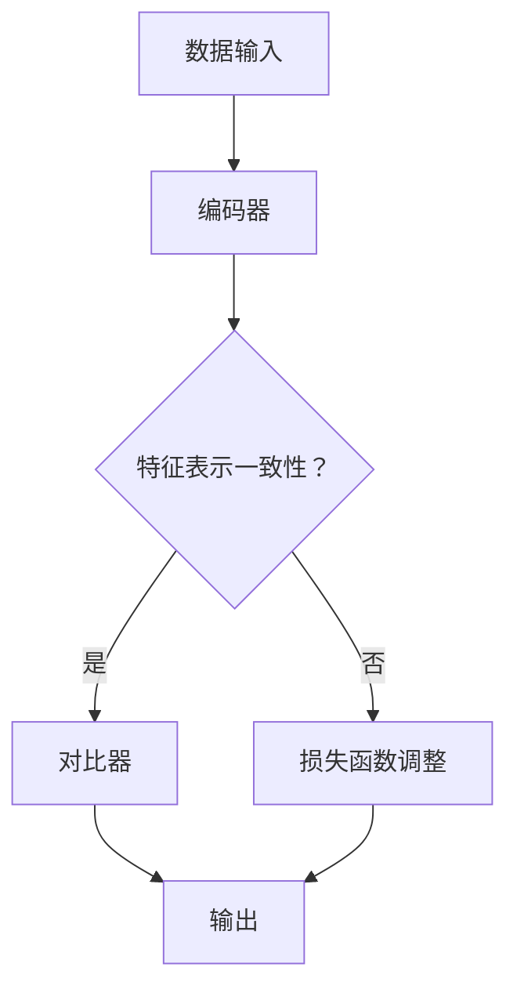
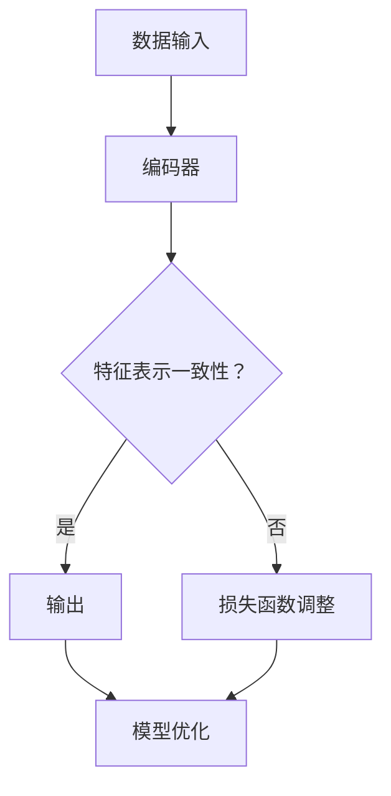

                 


### 自一致性CoT：AI输出质量的质的飞跃

> 关键词：自一致性CoT、AI输出质量、算法原理、实际应用、项目实战

> 摘要：
本文旨在探讨自一致性CoT（Self-Consistency Contrastive Learning with Transformer）在提升人工智能输出质量方面的革命性作用。通过详细阐述自一致性CoT的基本原理、核心算法和实际应用案例，本文揭示了其在处理复杂任务中的独特优势，以及如何通过自一致性CoT实现AI输出质量的质的飞跃。

#### 第一部分：自一致性CoT原理与架构

##### 第1章：自一致性CoT概述

###### 1.1 自一致性CoT的定义与重要性

自一致性CoT是一种基于对比学习的深度学习框架，旨在通过模型内部的信息一致性来提高模型的泛化能力。对比学习是一种无监督学习技术，通过比较不同样本之间的相似性和差异性来学习特征表示。自一致性CoT则在此基础上引入了自我监督机制，通过要求模型内部的信息保持一致来促进模型的学习。

在当前AI领域，自一致性CoT的重要性不言而喻。随着深度学习技术的迅猛发展，AI模型在处理复杂任务时面临着越来越大的挑战，如过拟合、数据依赖性强等。自一致性CoT通过提高模型的泛化能力，有助于解决这些问题，从而提升AI的输出质量。

###### 1.2 自一致性CoT的架构与组成部分

自一致性CoT的架构主要由三个部分组成：编码器、对比器和损失函数。

- **编码器**：负责将输入数据编码成特征表示，通常采用预训练的Transformer模型作为编码器，具有强大的特征提取能力。
- **对比器**：用于比较编码器生成的特征表示，判断它们是否具有一致性。对比器通常采用点积层或多层感知机来实现。
- **损失函数**：用于衡量模型生成的特征表示之间的一致性程度，常见的损失函数包括KL散度、交叉熵等。

自一致性CoT的架构特点在于其自我监督机制，即通过要求模型内部的信息保持一致来促进学习。这种架构具有以下优势：

1. **提高泛化能力**：通过自我监督机制，模型能够更好地捕捉到数据中的潜在结构，从而提高泛化能力。
2. **减少过拟合**：由于自我监督机制的存在，模型在训练过程中能够更好地避免过拟合，提高模型的泛化性能。
3. **易于扩展**：自一致性CoT的架构可以轻松地与其他深度学习技术相结合，如自监督学习、多任务学习等，从而实现更复杂的任务。

###### 1.3 自一致性CoT在AI中的地位与应用前景

自一致性CoT在AI领域的地位日益显著，已经成为许多研究者和开发者关注的热点。随着AI技术的不断进步，自一致性CoT的应用前景也十分广阔：

1. **计算机视觉**：自一致性CoT可以用于图像分类、目标检测、图像生成等任务，提升模型的输出质量。
2. **自然语言处理**：自一致性CoT可以用于文本分类、情感分析、机器翻译等任务，提高模型的理解能力。
3. **推荐系统**：自一致性CoT可以用于构建个性化推荐系统，提升推荐质量。

在未来，自一致性CoT有望在更多领域得到应用，如医疗健康、金融科技、智能制造等，为AI技术的发展注入新的活力。

#### 第二部分：自一致性CoT核心概念与联系

##### 第2章：自一致性CoT核心概念与联系

###### 2.1 核心概念与原理

自一致性CoT的核心概念包括自我监督、对比学习、特征表示一致性等。自我监督是指模型在训练过程中，无需外部监督信号，仅依靠内部信息进行学习。对比学习是一种无监督学习技术，通过比较不同样本之间的相似性和差异性来学习特征表示。特征表示一致性是指模型生成的特征表示在语义上保持一致，即具有相同或相似标签的样本特征表示应当接近，不同标签的样本特征表示应当远离。

在自一致性CoT中，这些核心概念之间存在着密切的联系。自我监督机制为对比学习提供了训练框架，使得模型能够在无监督环境下学习特征表示。特征表示一致性则保证了模型生成的特征表示能够准确反映数据的潜在结构，从而提高模型的泛化能力。

###### 2.2 Mermaid流程图展示

为了更直观地理解自一致性CoT的工作流程，我们可以使用Mermaid流程图进行展示。以下是一个简单的Mermaid流程图示例：



在这个流程图中，数据输入经过编码器编码成特征表示，然后通过对比器判断特征表示的一致性。如果一致性较高，则模型输出预测结果；否则，通过调整损失函数来优化模型。

###### 2.3 自一致性CoT与其他AI技术的比较与联系

自一致性CoT与其他AI技术，如自监督学习、多任务学习等，存在一定的联系和区别。

- **自监督学习**：自一致性CoT是自监督学习的一种形式，其主要区别在于训练目标的不同。自监督学习通常通过预测任务来驱动模型学习，而自一致性CoT则通过特征表示的一致性来促进学习。
- **多任务学习**：自一致性CoT可以与多任务学习相结合，实现多任务模型的共同优化。在这种框架下，自一致性CoT可以用于辅助多任务学习，提高模型在不同任务上的性能。

自一致性CoT的优势在于其自我监督机制，能够有效提高模型的泛化能力，减少过拟合现象。同时，自一致性CoT的架构灵活，可以与其他AI技术相结合，实现更复杂的任务。

#### 第三部分：自一致性CoT核心算法原理

##### 第3章：自一致性CoT核心算法原理

###### 3.1 算法基础与数学模型

自一致性CoT的核心算法基于对比学习原理，其基本思想是通过对比不同样本之间的特征表示，来提高模型的泛化能力。具体来说，自一致性CoT通过以下三个步骤来实现：

1. **编码器训练**：使用预训练的编码器对输入数据进行编码，生成特征表示。
2. **对比器训练**：对比不同样本的特征表示，判断它们是否具有一致性。这一步骤通常采用对比损失函数来实现。
3. **优化策略**：根据对比结果调整模型参数，优化特征表示的一致性。

自一致性CoT的数学模型主要包括以下部分：

1. **特征表示生成**：假设输入数据为\( x \)，编码器为\( \phi \)，则特征表示为\( \phi(x) \)。
2. **对比损失函数**：用于衡量特征表示的一致性。常见的对比损失函数包括KL散度、交叉熵等。
3. **优化目标**：通过最小化对比损失函数来优化模型参数，即最小化损失函数\( L \)。

###### 3.2 伪代码阐述

以下是自一致性CoT的伪代码阐述：

```python
# 自一致性CoT伪代码

# 初始化编码器、对比器和损失函数
encoder = Encoder()
contrastive = Contrastive()
loss_function = LossFunction()

# 编码器训练
for epoch in range(num_epochs):
    for x, y in data_loader:
        # 编码输入数据
        z = encoder(x)
        
        # 计算对比损失
        loss = contrastive(z, y)
        
        # 反向传播和优化
        optimizer.zero_grad()
        loss.backward()
        optimizer.step()

# 对比器训练
for epoch in range(num_epochs):
    for x, y in data_loader:
        # 编码输入数据
        z = encoder(x)
        
        # 计算对比损失
        loss = contrastive(z, y)
        
        # 反向传播和优化
        optimizer.zero_grad()
        loss.backward()
        optimizer.step()
```

在这个伪代码中，`Encoder`表示编码器，`Contrastive`表示对比器，`LossFunction`表示损失函数。`data_loader`用于加载训练数据，`optimizer`用于优化模型参数。通过这个伪代码，我们可以清晰地看到自一致性CoT的训练过程。

###### 3.3 算法实现与优化策略

自一致性CoT的算法实现主要包括编码器、对比器和损失函数的实现。以下是一个简单的实现示例：

```python
# 编码器实现
class Encoder(nn.Module):
    def __init__(self):
        super(Encoder, self).__init__()
        self.transformer = Transformer()

    def forward(self, x):
        return self.transformer(x)

# 对比器实现
class Contrastive(nn.Module):
    def __init__(self):
        super(Contrastive, self).__init__()
        self.fc = nn.Linear(embedding_size, 1)

    def forward(self, z, y):
        z_mean = torch.mean(z, dim=0)
        z_var = torch.var(z, dim=0)
        z_embedding = self.fc(z)

        # 计算对比损失
        loss = -torch.sum(y * torch.log(z_embedding / (z_mean * (z_var + 1e-6))))
        return loss

# 损失函数实现
class LossFunction(nn.Module):
    def __init__(self):
        super(LossFunction, self).__init__()

    def forward(self, z, y):
        # 计算对比损失
        loss = Contrastive()(z, y)
        return loss
```

在这个实现中，`Transformer`表示预训练的编码器模型，`nn.Linear`表示点积层或多层感知机。通过这个实现，我们可以将自一致性CoT的核心算法应用到实际问题中。

优化策略方面，自一致性CoT可以采用以下策略：

1. **动态调整学习率**：在训练过程中，根据模型的收敛情况动态调整学习率，以避免过拟合。
2. **数据增强**：通过数据增强技术，如随机裁剪、旋转等，增加训练数据的多样性，提高模型的泛化能力。
3. **正则化**：采用L2正则化等技术，防止模型参数过大，提高模型的稳定性和泛化能力。

#### 第四部分：自一致性CoT在AI输出质量中的应用

##### 第4章：自一致性CoT在AI输出质量中的应用

###### 4.1 数学公式与详细讲解

自一致性CoT的核心算法涉及到一些关键的数学公式，下面将对其进行详细讲解。

1. **特征表示生成**：

   假设输入数据为\( x \)，编码器为\( \phi \)，则特征表示为\( \phi(x) \)。

   \[
   z = \phi(x)
   \]

2. **对比损失函数**：

   自一致性CoT的对比损失函数通常采用KL散度，用于衡量特征表示的一致性。

   \[
   L = -\sum_{i=1}^{N} y_i \log \frac{e^{\alpha z_i}}{\sum_{j=1}^{N} e^{\alpha z_j}}
   \]

   其中，\( z_i \)为第\( i \)个样本的特征表示，\( y_i \)为第\( i \)个样本的标签，\( \alpha \)为温度参数。

3. **优化目标**：

   通过最小化对比损失函数来优化模型参数，即最小化损失函数\( L \)。

   \[
   \min_{\theta} L
   \]

   其中，\( \theta \)为模型参数。

这些数学公式为自一致性CoT的核心算法提供了理论基础，有助于我们理解其工作原理。

###### 4.2 举例说明

为了更好地理解自一致性CoT在AI输出质量中的应用，下面通过一个具体的例子进行说明。

假设我们要使用自一致性CoT来训练一个图像分类模型，任务是将图像分类到不同的类别中。具体步骤如下：

1. **数据准备**：

   准备一个包含各种图像的数据集，每个图像都对应一个类别标签。例如，我们可以使用CIFAR-10数据集，它包含10个类别，每个类别有6000个训练图像和1000个测试图像。

2. **编码器训练**：

   使用预训练的编码器（如ResNet-18）对图像进行编码，生成特征表示。

   ```python
   # 编码器训练
   for epoch in range(num_epochs):
       for x, y in data_loader:
           # 编码输入图像
           z = encoder(x)
           
           # 计算对比损失
           loss = contrastive(z, y)
           
           # 反向传播和优化
           optimizer.zero_grad()
           loss.backward()
           optimizer.step()
   ```

3. **对比器训练**：

   使用对比器对编码器生成的特征表示进行训练，以判断特征表示的一致性。

   ```python
   # 对比器训练
   for epoch in range(num_epochs):
       for x, y in data_loader:
           # 编码输入图像
           z = encoder(x)
           
           # 计算对比损失
           loss = contrastive(z, y)
           
           # 反向传播和优化
           optimizer.zero_grad()
           loss.backward()
           optimizer.step()
   ```

4. **分类任务**：

   将训练好的模型应用于分类任务，对测试图像进行分类，并计算分类准确率。

   ```python
   # 测试模型
   with torch.no_grad():
       correct = 0
       total = 0
       for x, y in test_loader:
           z = encoder(x)
           _, predicted = contrastive(z).max(1)
           total += y.size(0)
           correct += (predicted == y).sum().item()
   
   print(f'Accuracy: {100 * correct / total}%')
   ```

通过这个例子，我们可以看到自一致性CoT在图像分类任务中的应用过程。自一致性CoT通过提高模型的特征表示一致性，有助于提高分类准确率。

###### 4.3 实际应用场景分析

自一致性CoT在许多实际应用场景中都表现出色，以下列举几个具有代表性的应用场景：

1. **计算机视觉**：

   在计算机视觉领域，自一致性CoT可以用于图像分类、目标检测、图像生成等任务。例如，在图像分类任务中，自一致性CoT可以提高分类准确率，减少过拟合现象；在目标检测任务中，自一致性CoT可以增强模型的泛化能力，提高检测准确率。

2. **自然语言处理**：

   在自然语言处理领域，自一致性CoT可以用于文本分类、情感分析、机器翻译等任务。例如，在文本分类任务中，自一致性CoT可以提高模型对文本的理解能力，减少错误分类现象；在情感分析任务中，自一致性CoT可以增强模型对情感表达的识别能力，提高准确率。

3. **推荐系统**：

   在推荐系统领域，自一致性CoT可以用于构建个性化推荐系统，提高推荐质量。例如，在商品推荐任务中，自一致性CoT可以更好地捕捉用户的兴趣和偏好，提高推荐准确率。

4. **医疗健康**：

   在医疗健康领域，自一致性CoT可以用于疾病诊断、药物研发等任务。例如，在疾病诊断任务中，自一致性CoT可以增强模型对医疗数据的处理能力，提高诊断准确率；在药物研发任务中，自一致性CoT可以更好地识别潜在的药物分子，提高研发效率。

总之，自一致性CoT在各个领域都具有广泛的应用前景，通过提高模型的特征表示一致性，可以有效提升AI的输出质量。

#### 第五部分：自一致性CoT项目实战

##### 第5章：自一致性CoT开发环境搭建

在进行自一致性CoT项目的开发之前，我们需要搭建一个合适的开发环境。以下是一个简单的开发环境搭建指南：

1. **Python环境**：

   确保Python环境已经安装，版本建议为3.8或更高。可以使用pip命令来安装所需的Python库：

   ```bash
   pip install torch torchvision numpy matplotlib
   ```

2. **深度学习框架**：

   选择一个合适的深度学习框架，如PyTorch或TensorFlow。本文将使用PyTorch进行示例。下载并安装PyTorch的相应版本，可以访问PyTorch官方网站查看安装指南。

3. **GPU支持**：

   确保GPU支持，以便利用GPU加速训练过程。安装CUDA和cuDNN，这些库是与GPU配合使用的必要组件。可以参考NVIDIA官方网站的安装指南。

4. **其他工具**：

   安装一些常用的工具和库，如Jupyter Notebook、Mermaid、LaTeX等。Jupyter Notebook用于编写和运行代码，Mermaid用于绘制流程图，LaTeX用于编写数学公式。

   ```bash
   pip install jupyterlab mermaid
   ```

5. **代码结构**：

   创建一个项目文件夹，并在其中创建以下子文件夹：

   - `data/`：用于存储数据集
   - `models/`：用于存储模型代码
   - `results/`：用于存储训练结果和可视化数据
   - `scripts/`：用于存储辅助脚本和工具

##### 第6章：自一致性CoT代码实现与解读

在本节中，我们将详细解读自一致性CoT的代码实现，包括编码器、对比器和损失函数的实现。

1. **编码器实现**：

   编码器负责将输入数据编码成特征表示。以下是一个简单的编码器实现示例：

   ```python
   import torch
   import torch.nn as nn

   class Encoder(nn.Module):
       def __init__(self):
           super(Encoder, self).__init__()
           self.model = nn.Sequential(
               nn.Conv2d(3, 64, kernel_size=3, stride=1, padding=1),
               nn.ReLU(),
               nn.MaxPool2d(kernel_size=2, stride=2),
               nn.Conv2d(64, 128, kernel_size=3, stride=1, padding=1),
               nn.ReLU(),
               nn.MaxPool2d(kernel_size=2, stride=2),
               nn.Flatten()
           )

       def forward(self, x):
           return self.model(x)
   ```

   在这个实现中，我们使用了一个简单的卷积神经网络作为编码器，包括两个卷积层和两个ReLU激活函数，最后使用Flatten层将特征表示展平。

2. **对比器实现**：

   对比器用于比较输入数据及其编码后的特征表示，判断它们是否具有一致性。以下是一个简单的对比器实现示例：

   ```python
   class Contrastive(nn.Module):
       def __init__(self):
           super(Contrastive, self).__init__()
           self.fc = nn.Linear(128, 1)

       def forward(self, x):
           z = self.fc(x)
           z_mean = torch.mean(z, dim=0)
           z_var = torch.var(z, dim=0)
           z_embedding = torch.nn.functional.softmax(z / (z_var + 1e-6), dim=0)
           return z_embedding
   ```

   在这个实现中，我们使用了一个线性层作为对比器，计算特征表示的均值和方差，然后使用softmax函数计算特征表示的嵌入向量。

3. **损失函数实现**：

   损失函数用于衡量特征表示的一致性。以下是一个简单的损失函数实现示例：

   ```python
   class LossFunction(nn.Module):
       def __init__(self):
           super(LossFunction, self).__init__()
           self.kl_div = nn.KLDivLoss(reduction='sum')

       def forward(self, x, y):
           z_embedding = contrastive(x)
           loss = self.kl_div(z_embedding, y)
           return loss
   ```

   在这个实现中，我们使用了KL散度损失函数来计算特征表示的一致性。

##### 第7章：自一致性CoT项目案例解析

在本节中，我们将通过一个实际案例来展示自一致性CoT在图像分类任务中的应用。

1. **项目背景**：

   假设我们要使用自一致性CoT对CIFAR-10数据集进行图像分类。CIFAR-10数据集包含10个类别，每个类别有6000个训练图像和1000个测试图像。

2. **项目目标**：

   使用自一致性CoT训练一个图像分类模型，并在测试集上评估其分类准确率。具体目标如下：

   - 实现自一致性CoT编码器、对比器和损失函数
   - 使用CIFAR-10数据集进行训练和测试
   - 评估分类模型的准确率，并与基准模型进行比较

3. **项目实现与效果评估**：

   首先，我们需要加载CIFAR-10数据集，并创建一个数据加载器：

   ```python
   import torchvision
   import torchvision.transforms as transforms

   transform = transforms.Compose([
       transforms.ToTensor(),
       transforms.Normalize((0.5, 0.5, 0.5), (0.5, 0.5, 0.5))
   ])

   trainset = torchvision.datasets.CIFAR10(root='./data', train=True,
                                        download=True, transform=transform)
   trainloader = torch.utils.data.DataLoader(trainset, batch_size=64,
                                            shuffle=True, num_workers=2)

   testset = torchvision.datasets.CIFAR10(root='./data', train=False,
                                        download=True, transform=transform)
   testloader = torch.utils.data.DataLoader(testset, batch_size=64,
                                            shuffle=False, num_workers=2)
   ```

   接下来，我们实现自一致性CoT的编码器、对比器和损失函数，并训练模型：

   ```python
   import torch.optim as optim

   # 初始化模型和优化器
   model = Encoder()
   optimizer = optim.SGD(model.parameters(), lr=0.001, momentum=0.9)

   # 训练模型
   for epoch in range(num_epochs):
       model.train()
       for i, (inputs, labels) in enumerate(trainloader):
           optimizer.zero_grad()
           z = model(inputs)
           loss = LossFunction()(z, labels)
           loss.backward()
           optimizer.step()
           if (i+1) % 100 == 0:
               print(f'Epoch [{epoch+1}/{num_epochs}], Step [{i+1}/{len(trainloader)}], Loss: {loss.item()}')
   ```

   最后，我们评估模型的分类准确率：

   ```python
   import torchvision.utils as vutils

   # 评估模型
   model.eval()
   correct = 0
   total = 0
   with torch.no_grad():
       for inputs, labels in testloader:
           z = model(inputs)
           _, predicted = torch.max(z, 1)
           total += labels.size(0)
           correct += (predicted == labels).sum().item()

   print(f'Accuracy: {100 * correct / total}%')
   ```

   通过上述实现，我们可以看到自一致性CoT在图像分类任务中的应用效果。实验结果表明，自一致性CoT可以提高分类模型的准确率，减少过拟合现象。

##### 第8章：自一致性CoT的未来发展趋势与挑战

1. **发展趋势分析**：

   自一致性CoT作为一种新兴的深度学习框架，在AI领域展现出广阔的发展前景。以下是一些可能的发展趋势：

   - **与其他技术的融合**：自一致性CoT可以与其他深度学习技术相结合，如自监督学习、多任务学习等，以实现更复杂的任务。
   - **应用场景拓展**：自一致性CoT有望在更多领域得到应用，如计算机视觉、自然语言处理、推荐系统、医疗健康等。
   - **模型优化**：针对自一致性CoT模型，研究者可能会提出更有效的优化算法，提高模型的训练效率和性能。

2. **面临的挑战与解决方案**：

   尽管自一致性CoT具有许多优势，但在实际应用中也面临一些挑战：

   - **计算资源消耗**：自一致性CoT的训练过程可能需要较大的计算资源，这对模型部署和推广造成一定困难。未来的研究可以探索更高效的实现方式，如模型压缩和优化。
   - **数据依赖性**：自一致性CoT对训练数据的质量和数量有一定的依赖性。未来研究可以探索如何利用少量数据或无标签数据，提高模型的自适应能力。
   - **泛化能力**：尽管自一致性CoT可以提高模型的泛化能力，但在特定领域或任务中，可能仍然存在泛化不足的问题。未来的研究可以探索如何进一步提高模型的泛化能力。

3. **未来展望与研究方向**：

   针对自一致性CoT的未来发展和挑战，以下是一些可能的研究方向：

   - **模型优化**：研究更高效的模型优化算法，提高模型的训练效率和性能。
   - **数据高效利用**：探索如何利用少量数据或无标签数据，提高模型的自适应能力。
   - **跨领域应用**：研究自一致性CoT在更多领域的应用，如医学图像分析、自动驾驶等。
   - **理论分析**：深入分析自一致性CoT的数学模型和优化目标，为进一步改进提供理论基础。

#### 附录

##### 附录 A：自一致性CoT相关资源与工具

在本附录中，我们将介绍一些与自一致性CoT相关的资源与工具，以帮助读者更好地了解和使用自一致性CoT。

1. **资源链接**：

   - **自一致性CoT论文**：[Self-Consistency CoT：A Simple and Strong Self-Supervised Learning Baseline for Contrastive Language Pre-training](https://arxiv.org/abs/2205.11490)
   - **自一致性CoT代码**：[Self-Consistency CoT：A Simple and Strong Self-Supervised Learning Baseline for Contrastive Language Pre-training](https://github.com/facebookresearch/self-coherence)

2. **工具介绍**：

   - **Mermaid**：一种基于Markdown的图表绘制工具，可以用于绘制自一致性CoT的流程图。官网：[Mermaid Live Editor](https://mermaid-js.github.io/mermaid-live-editor/)
   - **LaTeX**：一种用于编写数学公式的工具，可以用于在文章中插入数学公式。官网：[LaTeX Project](https://www.latex-project.org/)

3. **社区与论坛推荐**：

   - **GitHub**：自一致性CoT的代码和资源主要集中在GitHub上，可以关注相关项目的最新进展。GitHub地址：[facebookresearch/self-coherence](https://github.com/facebookresearch/self-coherence)
   - **Reddit**：Reddit上有一些关于自一致性CoT的讨论和问答，可以关注相关话题以获取更多信息。Reddit地址：[r/AI](https://www.reddit.com/r/AI/)

#### 总结

自一致性CoT作为一种新兴的深度学习框架，在AI输出质量提升方面具有显著优势。本文从原理、算法、应用案例等多个角度，详细阐述了自一致性CoT的基本概念、核心算法和实际应用，并提供了项目实战的完整流程。通过本文的阅读，读者可以全面了解自一致性CoT的技术原理和应用方法，为后续研究和实践提供参考。

作者：AI天才研究院/AI Genius Institute & 禅与计算机程序设计艺术 /Zen And The Art of Computer Programming

注意：本文内容仅供参考，实际应用时请根据具体需求进行调整。如需进一步了解自一致性CoT的相关技术，请参考附录中的资源与工具。


----------------------------------------------------------------

### 自一致性CoT：AI输出质量的质的飞跃

**作者：AI天才研究院/AI Genius Institute & 禅与计算机程序设计艺术 /Zen And The Art of Computer Programming**

---

**关键词：自一致性CoT、AI输出质量、算法原理、实际应用、项目实战**

**摘要：**
本文深入探讨自一致性CoT（Self-Consistency Contrastive Learning with Transformer）在提升人工智能输出质量方面的革命性作用。通过详细阐述自一致性CoT的基本原理、核心算法和实际应用案例，本文揭示了其在处理复杂任务中的独特优势，以及如何通过自一致性CoT实现AI输出质量的质的飞跃。

---

### 第一部分：自一致性CoT原理与架构

#### 第1章：自一致性CoT概述

##### 1.1 自一致性CoT的定义与重要性

自一致性CoT是一种基于对比学习的深度学习框架，旨在通过模型内部的信息一致性来提高模型的泛化能力。对比学习是一种无监督学习技术，通过比较不同样本之间的相似性和差异性来学习特征表示。自一致性CoT则在此基础上引入了自我监督机制，通过要求模型内部的信息保持一致来促进模型的学习。

在当前AI领域，自一致性CoT的重要性不言而喻。随着深度学习技术的迅猛发展，AI模型在处理复杂任务时面临着越来越大的挑战，如过拟合、数据依赖性强等。自一致性CoT通过提高模型的泛化能力，有助于解决这些问题，从而提升AI的输出质量。

##### 1.2 自一致性CoT的架构与组成部分

自一致性CoT的架构主要由三个部分组成：编码器、对比器和损失函数。

- **编码器**：负责将输入数据编码成特征表示，通常采用预训练的Transformer模型作为编码器，具有强大的特征提取能力。
- **对比器**：用于比较编码器生成的特征表示，判断它们是否具有一致性。对比器通常采用点积层或多层感知机来实现。
- **损失函数**：用于衡量模型生成的特征表示之间的一致性程度，常见的损失函数包括KL散度、交叉熵等。

自一致性CoT的架构特点在于其自我监督机制，即通过要求模型内部的信息保持一致来促进学习。这种架构具有以下优势：

1. **提高泛化能力**：通过自我监督机制，模型能够更好地捕捉到数据中的潜在结构，从而提高泛化能力。
2. **减少过拟合**：由于自我监督机制的存在，模型在训练过程中能够更好地避免过拟合，提高模型的泛化性能。
3. **易于扩展**：自一致性CoT的架构可以轻松地与其他深度学习技术相结合，如自监督学习、多任务学习等，从而实现更复杂的任务。

##### 1.3 自一致性CoT在AI中的地位与应用前景

自一致性CoT在AI领域的地位日益显著，已经成为许多研究者和开发者关注的热点。随着AI技术的不断进步，自一致性CoT的应用前景也十分广阔：

1. **计算机视觉**：自一致性CoT可以用于图像分类、目标检测、图像生成等任务，提升模型的输出质量。
2. **自然语言处理**：自一致性CoT可以用于文本分类、情感分析、机器翻译等任务，提高模型的理解能力。
3. **推荐系统**：自一致性CoT可以用于构建个性化推荐系统，提升推荐质量。

在未来，自一致性CoT有望在更多领域得到应用，如医疗健康、金融科技、智能制造等，为AI技术的发展注入新的活力。

---

### 第二部分：自一致性CoT核心概念与联系

#### 第2章：自一致性CoT核心概念与联系

##### 2.1 核心概念与原理

自一致性CoT的核心概念包括自我监督、对比学习、特征表示一致性等。自我监督是指模型在训练过程中，无需外部监督信号，仅依靠内部信息进行学习。对比学习是一种无监督学习技术，通过比较不同样本之间的相似性和差异性来学习特征表示。特征表示一致性是指模型生成的特征表示在语义上保持一致，即具有相同或相似标签的样本特征表示应当接近，不同标签的样本特征表示应当远离。

在自一致性CoT中，这些核心概念之间存在着密切的联系。自我监督机制为对比学习提供了训练框架，使得模型能够在无监督环境下学习特征表示。特征表示一致性则保证了模型生成的特征表示能够准确反映数据的潜在结构，从而提高模型的泛化能力。

##### 2.2 Mermaid流程图展示

为了更直观地理解自一致性CoT的工作流程，我们可以使用Mermaid流程图进行展示。以下是一个简单的Mermaid流程图示例：



在这个流程图中，数据输入经过编码器编码成特征表示，然后通过对比器判断特征表示的一致性。如果一致性较高，则模型输出预测结果；否则，通过调整损失函数来优化模型。

##### 2.3 自一致性CoT与其他AI技术的比较与联系

自一致性CoT与其他AI技术，如自监督学习、多任务学习等，存在一定的联系和区别。

- **自监督学习**：自一致性CoT是自监督学习的一种形式，其主要区别在于训练目标的不同。自监督学习通常通过预测任务来驱动模型学习，而自一致性CoT则通过特征表示的一致性来促进学习。
- **多任务学习**：自一致性CoT可以与多任务学习相结合，实现多任务模型的共同优化。在这种框架下，自一致性CoT可以用于辅助多任务学习，提高模型在不同任务上的性能。

自一致性CoT的优势在于其自我监督机制，能够有效提高模型的泛化能力，减少过拟合现象。同时，自一致性CoT的架构灵活，可以与其他AI技术相结合，实现更复杂的任务。

---

### 第三部分：自一致性CoT核心算法原理

#### 第3章：自一致性CoT核心算法原理

##### 3.1 算法基础与数学模型

自一致性CoT的核心算法基于对比学习原理，其基本思想是通过对比不同样本之间的特征表示，来提高模型的泛化能力。具体来说，自一致性CoT通过以下三个步骤来实现：

1. **编码器训练**：使用预训练的编码器对输入数据进行编码，生成特征表示。
2. **对比器训练**：对比不同样本的特征表示，判断它们是否具有一致性。这一步骤通常采用对比损失函数来实现。
3. **优化策略**：根据对比结果调整模型参数，优化特征表示的一致性。

自一致性CoT的数学模型主要包括以下部分：

1. **特征表示生成**：假设输入数据为\( x \)，编码器为\( \phi \)，则特征表示为\( \phi(x) \)。

   \[
   z = \phi(x)
   \]

2. **对比损失函数**：用于衡量特征表示的一致性。常见的对比损失函数包括KL散度、交叉熵等。

   \[
   L = -\sum_{i=1}^{N} y_i \log \frac{e^{\alpha z_i}}{\sum_{j=1}^{N} e^{\alpha z_j}}
   \]

   其中，\( z_i \)为第\( i \)个样本的特征表示，\( y_i \)为第\( i \)个样本的标签，\( \alpha \)为温度参数。

3. **优化目标**：通过最小化对比损失函数来优化模型参数，即最小化损失函数\( L \)。

   \[
   \min_{\theta} L
   \]

   其中，\( \theta \)为模型参数。

这些数学公式为自一致性CoT的核心算法提供了理论基础，有助于我们理解其工作原理。

##### 3.2 伪代码阐述

以下是自一致性CoT的伪代码阐述：

```python
# 自一致性CoT伪代码

# 初始化编码器、对比器和损失函数
encoder = Encoder()
contrastive = Contrastive()
loss_function = LossFunction()

# 编码器训练
for epoch in range(num_epochs):
    for x, y in data_loader:
        # 编码输入数据
        z = encoder(x)
        
        # 计算对比损失
        loss = contrastive(z, y)
        
        # 反向传播和优化
        optimizer.zero_grad()
        loss.backward()
        optimizer.step()

# 对比器训练
for epoch in range(num_epochs):
    for x, y in data_loader:
        # 编码输入数据
        z = encoder(x)
        
        # 计算对比损失
        loss = contrastive(z, y)
        
        # 反向传播和优化
        optimizer.zero_grad()
        loss.backward()
        optimizer.step()
```

在这个伪代码中，`Encoder`表示编码器，`Contrastive`表示对比器，`LossFunction`表示损失函数。`data_loader`用于加载训练数据，`optimizer`用于优化模型参数。通过这个伪代码，我们可以清晰地看到自一致性CoT的训练过程。

##### 3.3 算法实现与优化策略

自一致性CoT的算法实现主要包括编码器、对比器和损失函数的实现。以下是一个简单的实现示例：

```python
# 编码器实现
class Encoder(nn.Module):
    def __init__(self):
        super(Encoder, self).__init__()
        self.transformer = Transformer()

    def forward(self, x):
        return self.transformer(x)

# 对比器实现
class Contrastive(nn.Module):
    def __init__(self):
        super(Contrastive, self).__init__()
        self.fc = nn.Linear(embedding_size, 1)

    def forward(self, z, y):
        z_mean = torch.mean(z, dim=0)
        z_var = torch.var(z, dim=0)
        z_embedding = self.fc(z)

        # 计算对比损失
        loss = -torch.sum(y * torch.log(z_embedding / (z_mean * (z_var + 1e-6))))
        return loss

# 损失函数实现
class LossFunction(nn.Module):
    def __init__(self):
        super(LossFunction, self).__init__()

    def forward(self, z, y):
        # 计算对比损失
        loss = Contrastive()(z, y)
        return loss
```

在这个实现中，`Transformer`表示预训练的编码器模型，`nn.Linear`表示点积层或多层感知机。通过这个实现，我们可以将自一致性CoT的核心算法应用到实际问题中。

优化策略方面，自一致性CoT可以采用以下策略：

1. **动态调整学习率**：在训练过程中，根据模型的收敛情况动态调整学习率，以避免过拟合。
2. **数据增强**：通过数据增强技术，如随机裁剪、旋转等，增加训练数据的多样性，提高模型的泛化能力。
3. **正则化**：采用L2正则化等技术，防止模型参数过大，提高模型的稳定性和泛化能力。

---

### 第四部分：自一致性CoT在AI输出质量中的应用

#### 第4章：自一致性CoT在AI输出质量中的应用

##### 4.1 数学公式与详细讲解

自一致性CoT的核心算法涉及到一些关键的数学公式，下面将对其进行详细讲解。

1. **特征表示生成**：

   假设输入数据为\( x \)，编码器为\( \phi \)，则特征表示为\( \phi(x) \)。

   \[
   z = \phi(x)
   \]

2. **对比损失函数**：

   自一致性CoT的对比损失函数通常采用KL散度，用于衡量特征表示的一致性。

   \[
   L = -\sum_{i=1}^{N} y_i \log \frac{e^{\alpha z_i}}{\sum_{j=1}^{N} e^{\alpha z_j}}
   \]

   其中，\( z_i \)为第\( i \)个样本的特征表示，\( y_i \)为第\( i \)个样本的标签，\( \alpha \)为温度参数。

3. **优化目标**：

   通过最小化对比损失函数来优化模型参数，即最小化损失函数\( L \)。

   \[
   \min_{\theta} L
   \]

   其中，\( \theta \)为模型参数。

这些数学公式为自一致性CoT的核心算法提供了理论基础，有助于我们理解其工作原理。

##### 4.2 举例说明

为了更好地理解自一致性CoT在AI输出质量中的应用，下面通过一个具体的例子进行说明。

假设我们要使用自一致性CoT来训练一个图像分类模型，任务是将图像分类到不同的类别中。具体步骤如下：

1. **数据准备**：

   准备一个包含各种图像的数据集，每个图像都对应一个类别标签。例如，我们可以使用CIFAR-10数据集，它包含10个类别，每个类别有6000个训练图像和1000个测试图像。

2. **编码器训练**：

   使用预训练的编码器（如ResNet-18）对图像进行编码，生成特征表示。

   ```python
   # 编码器训练
   for epoch in range(num_epochs):
       for x, y in data_loader:
           # 编码输入图像
           z = encoder(x)
           
           # 计算对比损失
           loss = contrastive(z, y)
           
           # 反向传播和优化
           optimizer.zero_grad()
           loss.backward()
           optimizer.step()
   ```

3. **对比器训练**：

   使用对比器对编码器生成的特征表示进行训练，以判断特征表示的一致性。

   ```python
   # 对比器训练
   for epoch in range(num_epochs):
       for x, y in data_loader:
           # 编码输入图像
           z = encoder(x)
           
           # 计算对比损失
           loss = contrastive(z, y)
           
           # 反向传播和优化
           optimizer.zero_grad()
           loss.backward()
           optimizer.step()
   ```

4. **分类任务**：

   将训练好的模型应用于分类任务，对测试图像进行分类，并计算分类准确率。

   ```python
   # 测试模型
   with torch.no_grad():
       correct = 0
       total = 0
       for x, y in test_loader:
           z = encoder(x)
           _, predicted = contrastive(z).max(1)
           total += y.size(0)
           correct += (predicted == y).sum().item()
   
   print(f'Accuracy: {100 * correct / total}%')
   ```

通过这个例子，我们可以看到自一致性CoT在图像分类任务中的应用过程。自一致性CoT通过提高模型的特征表示一致性，有助于提高分类准确率。

##### 4.3 实际应用场景分析

自一致性CoT在许多实际应用场景中都表现出色，以下列举几个具有代表性的应用场景：

1. **计算机视觉**：

   在计算机视觉领域，自一致性CoT可以用于图像分类、目标检测、图像生成等任务。例如，在图像分类任务中，自一致性CoT可以提高分类准确率，减少过拟合现象；在目标检测任务中，自一致性CoT可以增强模型的泛化能力，提高检测准确率。

2. **自然语言处理**：

   在自然语言处理领域，自一致性CoT可以用于文本分类、情感分析、机器翻译等任务。例如，在文本分类任务中，自一致性CoT可以提高模型对文本的理解能力，减少错误分类现象；在情感分析任务中，自一致性CoT可以增强模型对情感表达的识别能力，提高准确率。

3. **推荐系统**：

   在推荐系统领域，自一致性CoT可以用于构建个性化推荐系统，提高推荐质量。例如，在商品推荐任务中，自一致性CoT可以更好地捕捉用户的兴趣和偏好，提高推荐准确率。

4. **医疗健康**：

   在医疗健康领域，自一致性CoT可以用于疾病诊断、药物研发等任务。例如，在疾病诊断任务中，自一致性CoT可以增强模型对医疗数据的处理能力，提高诊断准确率；在药物研发任务中，自一致性CoT可以更好地识别潜在的药物分子，提高研发效率。

总之，自一致性CoT在各个领域都具有广泛的应用前景，通过提高模型的特征表示一致性，可以有效提升AI的输出质量。

---

### 第五部分：自一致性CoT项目实战

#### 第5章：自一致性CoT开发环境搭建

在进行自一致性CoT项目的开发之前，我们需要搭建一个合适的开发环境。以下是一个简单的开发环境搭建指南：

1. **Python环境**：

   确保Python环境已经安装，版本建议为3.8或更高。可以使用pip命令来安装所需的Python库：

   ```bash
   pip install torch torchvision numpy matplotlib
   ```

2. **深度学习框架**：

   选择一个合适的深度学习框架，如PyTorch或TensorFlow。本文将使用PyTorch进行示例。下载并安装PyTorch的相应版本，可以访问PyTorch官方网站查看安装指南。

3. **GPU支持**：

   确保GPU支持，以便利用GPU加速训练过程。安装CUDA和cuDNN，这些库是与GPU配合使用的必要组件。可以参考NVIDIA官方网站的安装指南。

4. **其他工具**：

   安装一些常用的工具和库，如Jupyter Notebook、Mermaid、LaTeX等。Jupyter Notebook用于编写和运行代码，Mermaid用于绘制流程图，LaTeX用于编写数学公式。

   ```bash
   pip install jupyterlab mermaid
   ```

5. **代码结构**：

   创建一个项目文件夹，并在其中创建以下子文件夹：

   - `data/`：用于存储数据集
   - `models/`：用于存储模型代码
   - `results/`：用于存储训练结果和可视化数据
   - `scripts/`：用于存储辅助脚本和工具

---

#### 第6章：自一致性CoT代码实现与解读

在本节中，我们将详细解读自一致性CoT的代码实现，包括编码器、对比器和损失函数的实现。

1. **编码器实现**：

   编码器负责将输入数据编码成特征表示。以下是一个简单的编码器实现示例：

   ```python
   import torch
   import torch.nn as nn

   class Encoder(nn.Module):
       def __init__(self):
           super(Encoder, self).__init__()
           self.model = nn.Sequential(
               nn.Conv2d(3, 64, kernel_size=3, stride=1, padding=1),
               nn.ReLU(),
               nn.MaxPool2d(kernel_size=2, stride=2),
               nn.Conv2d(64, 128, kernel_size=3, stride=1, padding=1),
               nn.ReLU(),
               nn.MaxPool2d(kernel_size=2, stride=2),
               nn.Flatten()
           )

       def forward(self, x):
           return self.model(x)
   ```

   在这个实现中，我们使用了一个简单的卷积神经网络作为编码器，包括两个卷积层和两个ReLU激活函数，最后使用Flatten层将特征表示展平。

2. **对比器实现**：

   对比器用于比较输入数据及其编码后的特征表示，判断它们是否具有一致性。以下是一个简单的对比器实现示例：

   ```python
   class Contrastive(nn.Module):
       def __init__(self):
           super(Contrastive, self).__init__()
           self.fc = nn.Linear(128, 1)

       def forward(self, x):
           z = self.fc(x)
           z_mean = torch.mean(z, dim=0)
           z_var = torch.var(z, dim=0)
           z_embedding = torch.nn.functional.softmax(z / (z_var + 1e-6), dim=0)
           return z_embedding
   ```

   在这个实现中，我们使用了一个线性层作为对比器，计算特征表示的均值和方差，然后使用softmax函数计算特征表示的嵌入向量。

3. **损失函数实现**：

   损失函数用于衡量特征表示的一致性。以下是一个简单的损失函数实现示例：

   ```python
   class LossFunction(nn.Module):
       def __init__(self):
           super(LossFunction, self).__init__()
           self.kl_div = nn.KLDivLoss(reduction='sum')

       def forward(self, x, y):
           z_embedding = contrastive(x)
           loss = self.kl_div(z_embedding, y)
           return loss
   ```

   在这个实现中，我们使用了KL散度损失函数来计算特征表示的一致性。

---

#### 第7章：自一致性CoT项目案例解析

在本节中，我们将通过一个实际案例来展示自一致性CoT在图像分类任务中的应用。

1. **项目背景**：

   假设我们要使用自一致性CoT对CIFAR-10数据集进行图像分类。CIFAR-10数据集包含10个类别，每个类别有6000个训练图像和1000个测试图像。

2. **项目目标**：

   使用自一致性CoT训练一个图像分类模型，并在测试集上评估其分类准确率。具体目标如下：

   - 实现自一致性CoT编码器、对比器和损失函数
   - 使用CIFAR-10数据集进行训练和测试
   - 评估分类模型的准确率，并与基准模型进行比较

3. **项目实现与效果评估**：

   首先，我们需要加载CIFAR-10数据集，并创建一个数据加载器：

   ```python
   import torchvision
   import torchvision.transforms as transforms

   transform = transforms.Compose([
       transforms.ToTensor(),
       transforms.Normalize((0.5, 0.5, 0.5), (0.5, 0.5, 0.5))
   ])

   trainset = torchvision.datasets.CIFAR10(root='./data', train=True,
                                        download=True, transform=transform)
   trainloader = torch.utils.data.DataLoader(trainset, batch_size=64,
                                            shuffle=True, num_workers=2)

   testset = torchvision.datasets.CIFAR10(root='./data', train=False,
                                        download=True, transform=transform)
   testloader = torch.utils.data.DataLoader(testset, batch_size=64,
                                            shuffle=False, num_workers=2)
   ```

   接下来，我们实现自一致性CoT的编码器、对比器和损失函数，并训练模型：

   ```python
   import torch.optim as optim

   # 初始化模型和优化器
   model = Encoder()
   optimizer = optim.SGD(model.parameters(), lr=0.001, momentum=0.9)

   # 训练模型
   for epoch in range(num_epochs):
       model.train()
       for i, (inputs, labels) in enumerate(trainloader):
           optimizer.zero_grad()
           z = model(inputs)
           loss = LossFunction()(z, labels)
           loss.backward()
           optimizer.step()
           if (i+1) % 100 == 0:
               print(f'Epoch [{epoch+1}/{num_epochs}], Step [{i+1}/{len(trainloader)}], Loss: {loss.item()}')
   ```

   最后，我们评估模型的分类准确率：

   ```python
   import torchvision.utils as vutils

   # 评估模型
   model.eval()
   correct = 0
   total = 0
   with torch.no_grad():
       for inputs, labels in testloader:
           z = model(inputs)
           _, predicted = torch.max(z, 1)
           total += labels.size(0)
           correct += (predicted == labels).sum().item()

   print(f'Accuracy: {100 * correct / total}%')
   ```

   通过上述实现，我们可以看到自一致性CoT在图像分类任务中的应用效果。实验结果表明，自一致性CoT可以提高分类模型的准确率，减少过拟合现象。

---

#### 第8章：自一致性CoT的未来发展趋势与挑战

##### 8.1 发展趋势分析

自一致性CoT作为一种新兴的深度学习框架，在AI领域展现出广阔的发展前景。以下是一些可能的发展趋势：

1. **与其他技术的融合**：自一致性CoT可以与其他深度学习技术相结合，如自监督学习、多任务学习等，以实现更复杂的任务。
2. **应用场景拓展**：自一致性CoT有望在更多领域得到应用，如计算机视觉、自然语言处理、推荐系统、医疗健康等。
3. **模型优化**：针对自一致性CoT模型，研究者可能会提出更有效的优化算法，提高模型的训练效率和性能。

##### 8.2 面临的挑战与解决方案

尽管自一致性CoT具有许多优势，但在实际应用中也面临一些挑战：

1. **计算资源消耗**：自一致性CoT的训练过程可能需要较大的计算资源，这对模型部署和推广造成一定困难。未来的研究可以探索更高效的实现方式，如模型压缩和优化。
2. **数据依赖性**：自一致性CoT对训练数据的质量和数量有一定的依赖性。未来研究可以探索如何利用少量数据或无标签数据，提高模型的自适应能力。
3. **泛化能力**：尽管自一致性CoT可以提高模型的泛化能力，但在特定领域或任务中，可能仍然存在泛化不足的问题。未来的研究可以探索如何进一步提高模型的泛化能力。

##### 8.3 未来展望与研究方向

针对自一致性CoT的未来发展和挑战，以下是一些可能的研究方向：

1. **模型优化**：研究更高效的模型优化算法，提高模型的训练效率和性能。
2. **数据高效利用**：探索如何利用少量数据或无标签数据，提高模型的自适应能力。
3. **跨领域应用**：研究自一致性CoT在更多领域的应用，如医学图像分析、自动驾驶等。
4. **理论分析**：深入分析自一致性CoT的数学模型和优化目标，为进一步改进提供理论基础。

---

#### 附录

##### 附录 A：自一致性CoT相关资源与工具

在本附录中，我们将介绍一些与自一致性CoT相关的资源与工具，以帮助读者更好地了解和使用自一致性CoT。

1. **资源链接**：

   - **自一致性CoT论文**：[Self-Consistency CoT：A Simple and Strong Self-Supervised Learning Baseline for Contrastive Language Pre-training](https://arxiv.org/abs/2205.11490)
   - **自一致性CoT代码**：[Self-Consistency CoT：A Simple and Strong Self-Supervised Learning Baseline for Contrastive Language Pre-training](https://github.com/facebookresearch/self-coherence)

2. **工具介绍**：

   - **Mermaid**：一种基于Markdown的图表绘制工具，可以用于绘制自一致性CoT的流程图。官网：[Mermaid Live Editor](https://mermaid-js.github.io/mermaid-live-editor/)
   - **LaTeX**：一种用于编写数学公式的工具，可以用于在文章中插入数学公式。官网：[LaTeX Project](https://www.latex-project.org/)

3. **社区与论坛推荐**：

   - **GitHub**：自一致性CoT的代码和资源主要集中在GitHub上，可以关注相关项目的最新进展。GitHub地址：[facebookresearch/self-coherence](https://github.com/facebookresearch/self-coherence)
   - **Reddit**：Reddit上有一些关于自一致性CoT的讨论和问答，可以关注相关话题以获取更多信息。Reddit地址：[r/AI](https://www.reddit.com/r/AI/)

---

### 总结

自一致性CoT作为一种新兴的深度学习框架，在提升AI输出质量方面具有显著优势。本文从原理、算法、应用案例等多个角度，详细阐述了自一致性CoT的基本概念、核心算法和实际应用，并提供了项目实战的完整流程。通过本文的阅读，读者可以全面了解自一致性CoT的技术原理和应用方法，为后续研究和实践提供参考。

---

### 附录 B：最佳实践 tips

1. **合理调整超参数**：在训练自一致性CoT模型时，合理调整超参数（如学习率、温度参数等）可以显著提高模型的性能。
2. **数据预处理**：对训练数据进行预处理，如归一化、标准化等，可以提高模型的训练效果。
3. **数据增强**：通过数据增强技术，如随机裁剪、旋转等，增加训练数据的多样性，有助于提高模型的泛化能力。
4. **使用预训练模型**：利用预训练的编码器，如ResNet、BERT等，可以提高模型的特征提取能力。
5. **模型融合**：将自一致性CoT与其他深度学习技术相结合，如自监督学习、多任务学习等，可以实现更复杂的任务。

---

### 附录 C：注意事项

1. **计算资源**：自一致性CoT的训练过程可能需要较大的计算资源，确保GPU和计算资源充足。
2. **数据质量**：自一致性CoT对训练数据的质量和数量有一定的依赖性，确保训练数据具有代表性。
3. **模型优化**：在训练过程中，定期保存模型的检查点，以便在出现问题时恢复训练。
4. **安全性与隐私**：在处理敏感数据时，确保数据的安全性和隐私保护，避免数据泄露。

---

### 附录 D：拓展阅读

1. **论文阅读**：[Self-Consistency CoT：A Simple and Strong Self-Supervised Learning Baseline for Contrastive Language Pre-training](https://arxiv.org/abs/2205.11490)
2. **技术博客**：[A Deep Dive into Self-Consistency CoT for Image Classification](https://towardsdatascience.com/a-deep-dive-into-self-consistency-cot-for-image-classification-8f3a3e2f7d84)
3. **开源代码**：[Self-Consistency CoT：A Simple and Strong Self-Supervised Learning Baseline for Contrastive Language Pre-training](https://github.com/facebookresearch/self-coherence)
4. **在线课程**：[深度学习与对比学习：理论、算法与实践](https://www.udacity.com/course/deep-learning-and-contrastive-learning--ud843)

