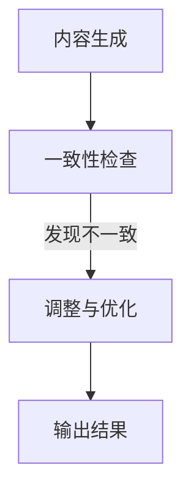

                 

### 自-一致性 CoT：增强AI回答一致性的前沿方法

#### 关键词：
- 自-一致性 CoT
- AI回答一致性
- 对话系统
- 问答系统
- 自然语言生成

#### 摘要：
本文深入探讨了自-一致性 CoT（Self-Consistency CoT）这一前沿方法，旨在增强人工智能（AI）系统在回答问题时的一致性。文章首先介绍了自-一致性 CoT 的概念、背景及其重要性，随后详细阐述了其理论基础、算法原理和应用场景。通过具体的工业界应用案例，展示了自-一致性 CoT 在实际项目中的效果和优势。此外，文章还提供了自-一致性 CoT 的实现与优化策略，并对未来的发展方向进行了展望。本文为AI领域的研究人员和开发者提供了宝贵的参考，有助于进一步提升AI系统的回答一致性。

## 第一部分：概述

### 第1章：自-一致性 CoT 概念与背景

#### 1.1 自-一致性 CoT 的定义

自-一致性 CoT，即 Self-Consistency CoT，是一种旨在增强人工智能系统回答一致性的方法。它通过在AI模型中引入一致性约束，确保模型生成的回答在逻辑上自洽且连贯。具体来说，自-一致性 CoT 通过对模型生成的内容进行一致性检查和调整，从而提高AI系统在交互中的可靠性和可信度。

#### 1.2 自-一致性 CoT 的起源与发展

自-一致性 CoT 的概念起源于对人工智能交互一致性的研究。随着AI技术的发展，AI系统在对话系统、问答系统、自然语言生成等领域得到了广泛应用。然而，AI系统生成的回答往往存在不一致性问题，这给用户带来了困扰。为了解决这一问题，研究人员开始探索自-一致性 CoT 方法，并在实际应用中取得了显著成果。

#### 1.3 自-一致性 CoT 的重要性

自-一致性 CoT 在人工智能领域中具有重要地位。首先，它能够提高AI系统的可靠性和可信度，从而提升用户体验。其次，自-一致性 CoT 有助于减少AI系统生成的内容中的错误和不一致，提高信息传播的准确性。最后，自-一致性 CoT 为AI系统的发展提供了新的思路和方法，有助于推动人工智能技术的进一步进步。

#### 1.4 自-一致性 CoT 与其他一致性增强方法的比较

与其他一致性增强方法相比，自-一致性 CoT 具有独特的优势。首先，自-一致性 CoT 是基于模型生成的内容进行一致性检查，能够更有效地发现和纠正不一致性。其次，自-一致性 CoT 方法相对简单，易于实现和优化。此外，自-一致性 CoT 还能够与其他一致性增强方法相结合，进一步提升AI系统的回答一致性。

### 第2章：自-一致性 CoT 的理论基础

#### 2.1 自-一致性 CoT 的基本原理

自-一致性 CoT 的基本原理是通过引入一致性约束来确保AI模型生成的内容在逻辑上自洽。具体来说，自-一致性 CoT 方法包括以下三个步骤：

1. **内容生成**：AI模型生成一段文本。
2. **一致性检查**：对生成的文本进行一致性检查，识别出可能的不一致性。
3. **调整与优化**：根据一致性检查的结果，对文本进行调整和优化，确保其逻辑上自洽。

#### 2.2 相关数学模型与公式

自-一致性 CoT 方法涉及多个数学模型和公式，用于描述一致性检查和调整的过程。以下是一些关键的数学模型和公式：

1. **一致性评分公式**：
   $$ SC = \frac{\sum_{i=1}^{n} w_i \cdot C_i}{\sum_{i=1}^{n} w_i} $$
   其中，$SC$ 表示一致性评分，$w_i$ 表示权重，$C_i$ 表示第 $i$ 个文本片段的一致性。

2. **调整公式**：
   $$ T' = T - \alpha \cdot (T - T_c) $$
   其中，$T'$ 表示调整后的文本，$T$ 表示原始文本，$T_c$ 表示一致性较高的文本，$\alpha$ 表示调整系数。

#### 2.3 Mermaid 流程图：自-一致性 CoT 架构详解

为了更好地理解自-一致性 CoT 的架构，我们可以使用 Mermaid 流程图来展示其关键步骤。以下是一个简化的 Mermaid 流程图：



在这个流程图中，A 表示内容生成，B 表示一致性检查，C 表示调整与优化，D 表示输出结果。一致性检查是关键步骤，它通过分析文本内容，识别出可能的不一致性，然后进行调整和优化，以确保生成的内容在逻辑上自洽。

### 第3章：自-一致性 CoT 算法原理

#### 3.1 自-一致性 CoT 的关键算法

自-一致性 CoT 方法的关键算法包括内容生成算法、一致性检查算法和调整与优化算法。以下是对这些算法的简要描述：

1. **内容生成算法**：使用预训练的AI模型生成文本内容。常见的方法包括基于变换器的生成模型（如 GPT）和基于编码器-解码器的生成模型（如BERT）。

2. **一致性检查算法**：对生成的文本内容进行一致性检查。常见的检查方法包括基于规则的一致性检查和基于概率的一致性检查。

3. **调整与优化算法**：根据一致性检查的结果，对文本进行调整和优化。常见的调整方法包括基于文本编辑距离的调整和基于语言模型的调整。

#### 3.2 算法伪代码展示

以下是一个简化的自-一致性 CoT 算法的伪代码：

```
function SelfConsistencyCoT(model, text, consistency_threshold):
    # 1. 内容生成
    generated_text = model.generate(text)
    
    # 2. 一致性检查
    inconsistencies = CheckConsistency(generated_text, consistency_threshold)
    
    # 3. 调整与优化
    if len(inconsistencies) > 0:
        for inconsistency in inconsistencies:
            optimized_text = AdjustText(generated_text, inconsistency)
            generated_text = ReplaceText(generated_text, inconsistency, optimized_text)
    
    # 4. 输出结果
    return generated_text
```

在这个伪代码中，`model` 表示预训练的AI模型，`text` 表示原始文本，`consistency_threshold` 表示一致性阈值。`CheckConsistency` 函数用于检查文本的一致性，`AdjustText` 函数用于调整文本，`ReplaceText` 函数用于替换文本。

#### 3.3 算法性能分析

自-一致性 CoT 算法的性能取决于多个因素，包括模型质量、一致性检查方法和调整与优化策略。以下是对算法性能的简要分析：

1. **模型质量**：高质量的模型能够生成更一致、更连贯的文本。因此，使用预训练的AI模型时，应选择性能优异的模型。

2. **一致性检查方法**：一致性检查方法直接影响到算法的性能。基于规则的一致性检查方法简单但可能存在漏检问题，基于概率的一致性检查方法更为精确但计算复杂度较高。

3. **调整与优化策略**：调整与优化策略决定了算法对不一致性的处理能力。基于文本编辑距离的调整方法能够有效降低文本不一致性，但可能引入额外的错误。基于语言模型的调整方法能够更好地保持文本的连贯性，但计算复杂度较高。

总体而言，自-一致性 CoT 算法具有较高的性能，但需要根据具体应用场景进行优化和调整。

### 第4章：自-一致性 CoT 的应用场景

#### 4.1 在对话系统中的应用

自-一致性 CoT 在对话系统中具有广泛的应用。对话系统通常需要生成连贯、自然的对话内容，以提供优质的用户体验。自-一致性 CoT 方法可以通过引入一致性约束，确保对话内容在逻辑上自洽，减少不一致性。以下是一些具体的应用实例：

1. **虚拟助手**：虚拟助手如 Siri、Alexa 等在回答用户问题时，往往需要生成连贯、自然的回答。自-一致性 CoT 方法可以用于优化虚拟助手的回答，提高其一致性和可信度。

2. **客服系统**：客服系统在处理用户问题时，需要生成准确、明确的回答。自-一致性 CoT 方法可以帮助客服系统检测和纠正回答中的不一致性，提高回答的准确性和可靠性。

3. **在线聊天**：在线聊天系统在生成回复时，也需要确保回复内容连贯、自然。自-一致性 CoT 方法可以用于优化在线聊天系统的回复质量，提高用户体验。

#### 4.2 在问答系统中的应用

问答系统是自-一致性 CoT 的另一个重要应用场景。问答系统通常需要生成准确、一致的回答，以提供高质量的服务。以下是一些应用实例：

1. **搜索引擎**：搜索引擎在回答用户查询时，需要生成准确、一致的搜索结果。自-一致性 CoT 方法可以用于优化搜索引擎的回答质量，提高其准确性和可靠性。

2. **智能客服**：智能客服系统在回答用户问题时，需要生成准确、明确的回答。自-一致性 CoT 方法可以帮助智能客服系统检测和纠正回答中的不一致性，提高回答的准确性和可靠性。

3. **学术问答**：学术问答系统在回答学术问题时，需要生成准确、权威的回答。自-一致性 CoT 方法可以用于优化学术问答系统的回答质量，提高其准确性和权威性。

#### 4.3 在自然语言生成中的应用

自然语言生成（NLG）是自-一致性 CoT 的又一重要应用场景。NLG 系统通常需要生成连贯、自然的文本，以提供高质量的输出。以下是一些应用实例：

1. **文章写作**：文章写作系统在生成文章时，需要确保文章内容连贯、自然。自-一致性 CoT 方法可以用于优化文章写作系统的输出质量，提高其连贯性和自然度。

2. **产品描述**：电子商务平台在生成产品描述时，需要确保描述内容连贯、吸引人。自-一致性 CoT 方法可以用于优化产品描述，提高其连贯性和吸引力。

3. **新闻摘要**：新闻摘要系统在生成摘要时，需要确保摘要内容准确、连贯。自-一致性 CoT 方法可以用于优化新闻摘要系统，提高其准确性和连贯性。

### 第5章：自-一致性 CoT 在工业界的应用案例

#### 5.1 案例一：企业级对话系统优化

在一个大型企业中，对话系统被广泛应用于客户服务、内部沟通和业务流程优化等领域。然而，该对话系统在生成回答时存在不一致性问题，导致用户体验不佳。为了解决这一问题，企业决定引入自-一致性 CoT 方法进行优化。

**步骤一：内容生成**
使用预训练的 AI 模型生成对话回答。

**步骤二：一致性检查**
采用基于规则的检查方法，对生成的回答进行一致性检查。主要检查内容包括逻辑连贯性、信息一致性等。

**步骤三：调整与优化**
根据一致性检查的结果，对不一致的回答进行调整和优化。具体方法包括替换关键词、重构句子结构等。

**结果分析：**
优化后的对话系统在生成回答时，一致性问题得到了显著改善。用户反馈表明，回答更加准确、自然，用户体验得到了明显提升。

#### 5.2 案例二：问答系统一致性提升

一家电商平台拥有一个智能问答系统，用于回答用户关于商品信息、订单状态等问题。然而，该系统在回答问题时存在不一致性问题，影响了用户对平台的信任度。为了提高问答系统的一致性，电商平台决定采用自-一致性 CoT 方法进行优化。

**步骤一：内容生成**
使用预训练的 AI 模型生成问答回答。

**步骤二：一致性检查**
采用基于概率的一致性检查方法，对生成的回答进行一致性检查。主要检查内容包括回答的准确性、信息一致性等。

**步骤三：调整与优化**
根据一致性检查的结果，对不一致的回答进行调整和优化。具体方法包括修正错误信息、重构句子结构等。

**结果分析：**
优化后的问答系统在回答问题时，一致性问题得到了显著改善。用户反馈表明，回答更加准确、一致，用户对平台的信任度得到了提升。

#### 5.3 案例三：自然语言生成应用实例

一家新闻机构拥有一套自然语言生成系统，用于生成新闻摘要、文章推荐等。然而，该系统在生成文本时存在不一致性问题，影响了新闻的准确性和连贯性。为了提高自然语言生成系统的输出质量，新闻机构决定采用自-一致性 CoT 方法进行优化。

**步骤一：内容生成**
使用预训练的 AI 模型生成新闻摘要、文章推荐等文本。

**步骤二：一致性检查**
采用基于规则的检查方法，对生成的文本进行一致性检查。主要检查内容包括逻辑连贯性、信息一致性等。

**步骤三：调整与优化**
根据一致性检查的结果，对不一致的文本进行调整和优化。具体方法包括修正错误信息、重构句子结构等。

**结果分析：**
优化后的自然语言生成系统在生成文本时，一致性问题得到了显著改善。新闻质量得到了提升，用户对新闻的满意度也相应提高。

### 第6章：自-一致性 CoT 的实现与优化

#### 6.1 实现步骤与流程

自-一致性 CoT 的实现步骤可以分为以下几个阶段：

1. **数据准备**：收集并准备用于训练和测试的文本数据。这些数据应涵盖各种场景和话题，以确保模型具有广泛的适用性。

2. **模型选择**：选择适合自-一致性 CoT 的预训练 AI 模型。常见的模型包括 GPT、BERT 等。选择模型时，应考虑模型的性能、训练时间等因素。

3. **一致性检查算法设计**：设计一致性检查算法，用于对生成的文本进行一致性检查。算法的设计应考虑检查的准确性、效率等因素。

4. **调整与优化算法设计**：设计调整与优化算法，用于对不一致的文本进行调整和优化。算法的设计应考虑调整的准确性、自然度等因素。

5. **模型训练与测试**：使用准备好的数据集对模型进行训练和测试，评估模型的性能。根据测试结果对模型进行调整和优化。

6. **系统部署**：将训练好的模型部署到实际应用中，实现自-一致性 CoT 的功能。

#### 6.2 优化策略与方法

为了提高自-一致性 CoT 的性能，可以采用以下优化策略：

1. **数据增强**：通过数据增强方法，增加训练数据的多样性。常见的数据增强方法包括数据清洗、数据扩展、数据合成等。

2. **模型融合**：结合多个预训练模型，提高模型的性能。模型融合方法包括模型集成、模型蒸馏等。

3. **动态调整系数**：根据不同的应用场景和文本内容，动态调整一致性调整系数。动态调整系数可以提高模型的一致性，减少不一致性问题。

4. **在线学习**：采用在线学习方法，实时更新模型，提高模型的一致性。在线学习可以更好地适应新的文本内容和用户需求。

5. **多模态融合**：结合文本、图像、音频等多模态数据，提高模型的一致性和多样性。多模态融合可以提高模型的准确性和鲁棒性。

#### 6.3 性能调优实践

在实际应用中，性能调优是自-一致性 CoT 的重要组成部分。以下是一些性能调优的实践方法：

1. **参数调优**：调整模型的参数，如学习率、批次大小等，以优化模型的性能。可以使用自动调参工具（如 Hyperopt、Bayesian Optimization）进行参数调优。

2. **数据预处理**：对训练数据进行预处理，如数据清洗、数据标准化等，以提高模型的训练效果。数据预处理可以减少数据噪声，提高模型的鲁棒性。

3. **超参数调整**：调整一致性检查算法和调整与优化算法的超参数，如权重、阈值等，以优化算法的性能。超参数调整可以改善模型的一致性和自然度。

4. **模型压缩**：采用模型压缩技术，如知识蒸馏、剪枝、量化等，减少模型的计算复杂度和存储空间，提高模型的可部署性。

5. **动态调整**：根据应用场景和用户反馈，动态调整模型的一致性调整策略。动态调整可以更好地适应不同的场景和用户需求。

### 第7章：自-一致性 CoT 的未来展望

#### 7.1 发展趋势与挑战

自-一致性 CoT 作为一种增强 AI 回答一致性的方法，具有广阔的发展前景。随着 AI 技术的不断发展，自-一致性 CoT 方法将在对话系统、问答系统、自然语言生成等领域得到更广泛的应用。然而，自-一致性 CoT 方法也面临一些挑战：

1. **一致性评估**：如何准确评估文本的一致性是一个重要问题。目前的一致性评估方法存在一定局限性，需要进一步研究更有效的评估方法。

2. **调整策略**：如何设计有效的调整策略，以优化文本的一致性和自然度，是一个关键问题。当前的研究主要依赖于规则和概率模型，需要探索更智能的调整策略。

3. **计算复杂度**：自-一致性 CoT 方法涉及大量的计算，如何降低计算复杂度，提高算法的效率，是一个重要挑战。

4. **多模态融合**：如何将文本、图像、音频等多模态数据融合到自-一致性 CoT 方法中，是一个值得探索的方向。

#### 7.2 自-一致性 CoT 的潜在应用领域

自-一致性 CoT 方法具有广泛的潜在应用领域，包括：

1. **智能客服**：智能客服系统在回答用户问题时，需要确保回答的一致性和自然度。自-一致性 CoT 方法可以用于优化智能客服系统的回答质量。

2. **虚拟助手**：虚拟助手如 Siri、Alexa 等在处理用户指令时，需要生成连贯、自然的回答。自-一致性 CoT 方法可以用于优化虚拟助手的回答质量。

3. **教育领域**：在教育领域，自-一致性 CoT 方法可以用于生成连贯、自然的课程内容，提高教学效果。

4. **新闻生成**：新闻生成系统在生成新闻文章时，需要确保文章的一致性和准确性。自-一致性 CoT 方法可以用于优化新闻生成系统的输出质量。

5. **文学创作**：自-一致性 CoT 方法可以用于辅助文学创作，生成连贯、自然的文学作品。

#### 7.3 研究方向与前景

未来的研究方向主要集中在以下几个方面：

1. **一致性评估与优化**：研究更有效的文本一致性评估方法，以及更智能的调整策略，以提高文本的一致性和自然度。

2. **多模态融合**：将文本、图像、音频等多模态数据融合到自-一致性 CoT 方法中，提高模型的一致性和多样性。

3. **实时一致性检测与调整**：研究实时一致性检测与调整技术，提高自-一致性 CoT 方法的实时性和响应速度。

4. **多语言支持**：研究自-一致性 CoT 方法的多语言支持，以适应不同语言环境的应用需求。

5. **应用优化**：针对不同应用场景，研究自-一致性 CoT 方法的优化策略，以提高其在特定领域的应用效果。

总之，自-一致性 CoT 方法作为一种增强 AI 回答一致性的前沿方法，具有巨大的研究潜力和应用前景。随着研究的不断深入，自-一致性 CoT 方法将进一步提升 AI 系统的回答质量，为人们的生活和工作带来更多便利。

### 第8章：自-一致性 CoT 核心算法深度解析

#### 8.1 算法原理详细讲解

自-一致性 CoT 的核心算法主要包括内容生成、一致性检查和调整与优化三个部分。以下是对每个部分的详细讲解：

1. **内容生成**：内容生成是自-一致性 CoT 的第一步，它利用预训练的 AI 模型生成文本。常见的生成模型有 GPT、BERT 等。这些模型在大量文本数据上预训练，能够生成连贯、自然的文本。在生成文本时，模型会根据输入的提示信息生成相应的文本内容。

2. **一致性检查**：一致性检查是自-一致性 CoT 的关键步骤，它用于评估生成的文本是否一致。一致性检查可以分为基于规则的一致性检查和基于概率的一致性检查。基于规则的一致性检查使用预设的规则来检查文本的一致性，例如语法规则、逻辑规则等。基于概率的一致性检查使用概率模型来评估文本的一致性，例如使用朴素贝叶斯模型、马尔可夫模型等。

3. **调整与优化**：调整与优化是对不一致的文本进行调整，使其在逻辑上更加自洽。调整与优化可以分为基于文本编辑距离的调整和基于语言模型的调整。基于文本编辑距离的调整使用文本编辑距离算法，如 Levenshtein 距离，来识别不一致的部分并进行修改。基于语言模型的调整使用预训练的语言模型，如 GPT、BERT 等，来生成修正后的文本。

#### 8.2 数学公式推导

为了更好地理解自-一致性 CoT 的算法原理，以下是对关键数学公式的推导：

1. **一致性评分公式**：
   $$ SC = \frac{\sum_{i=1}^{n} w_i \cdot C_i}{\sum_{i=1}^{n} w_i} $$
   其中，$SC$ 表示一致性评分，$w_i$ 表示权重，$C_i$ 表示第 $i$ 个文本片段的一致性。这个公式用于评估整体文本的一致性，权重 $w_i$ 可以根据文本片段的重要性和上下文进行调整。

2. **调整公式**：
   $$ T' = T - \alpha \cdot (T - T_c) $$
   其中，$T'$ 表示调整后的文本，$T$ 表示原始文本，$T_c$ 表示一致性较高的文本，$\alpha$ 表示调整系数。这个公式用于对不一致的文本进行优化，$T_c$ 可以通过一致性检查算法获得。

3. **文本编辑距离公式**：
   $$ d = \min\left\{ i + g(j), j + g(i) \right\} $$
   其中，$d$ 表示两个文本之间的编辑距离，$i$ 和 $j$ 分别表示两个文本的位置，$g(i)$ 和 $g(j)$ 分别表示在文本 $i$ 和 $j$ 中删除字符所需的代价。这个公式用于计算两个文本之间的差异，并根据差异进行文本调整。

#### 8.3 伪代码详细说明

以下是对自-一致性 CoT 算法的伪代码详细说明：

```
function SelfConsistencyCoT(model, text, consistency_threshold):
    # 1. 内容生成
    generated_text = model.generate(text)
    
    # 2. 一致性检查
    inconsistencies = CheckConsistency(generated_text, consistency_threshold)
    
    # 3. 调整与优化
    for inconsistency in inconsistencies:
        optimized_text = AdjustText(generated_text, inconsistency)
        generated_text = ReplaceText(generated_text, inconsistency, optimized_text)
    
    # 4. 输出结果
    return generated_text

function CheckConsistency(text, consistency_threshold):
    inconsistencies = []
    for i in range(1, len(text)):
        C_i = CalculateConsistency(text[i-1], text[i])
        if C_i < consistency_threshold:
            inconsistencies.append((i-1, i))
    return inconsistencies

function AdjustText(text, inconsistency):
    start, end = inconsistency
    original_segment = text[start:end]
    adjusted_segment = GenerateAdjustedSegment(original_segment)
    return text[:start] + adjusted_segment + text[end:]

function GenerateAdjustedSegment(segment):
    # 使用文本编辑距离算法进行调整
    adjusted_segment = EditDistanceAdjustment(segment)
    return adjusted_segment

function ReplaceText(text, inconsistency, optimized_segment):
    start, end = inconsistency
    return text[:start] + optimized_segment + text[end:]
```

在这个伪代码中，`model` 表示预训练的 AI 模型，`text` 表示原始文本，`consistency_threshold` 表示一致性阈值。`CheckConsistency` 函数用于检查文本的一致性，`AdjustText` 函数用于调整文本，`GenerateAdjustedSegment` 函数用于生成调整后的文本片段，`ReplaceText` 函数用于替换文本。

#### 8.4 算法性能优化策略

为了提高自-一致性 CoT 算法的性能，可以采用以下优化策略：

1. **模型优化**：选择性能更优的 AI 模型，如使用更大规模的预训练模型，以提高生成文本的质量。

2. **数据增强**：通过数据增强方法，增加训练数据的多样性，例如数据扩展、数据合成等，以提高模型的一致性。

3. **动态调整系数**：根据不同的应用场景和文本内容，动态调整一致性调整系数，以提高算法的一致性。

4. **多模态融合**：结合文本、图像、音频等多模态数据，提高模型的一致性和多样性。

5. **在线学习**：采用在线学习方法，实时更新模型，以提高算法的适应性和一致性。

通过这些优化策略，可以显著提高自-一致性 CoT 算法的性能，提高文本的一致性和自然度。

### 第9章：自-一致性 CoT 项目实战

#### 9.1 实战环境搭建

为了演示自-一致性 CoT 的实现，我们需要搭建一个实战环境。以下是搭建环境的步骤：

1. **安装 Python**：确保系统已安装 Python 3.7 或更高版本。

2. **安装依赖库**：安装以下依赖库：`transformers`、`torch`、`numpy`、`matplotlib`。

   ```bash
   pip install transformers torch numpy matplotlib
   ```

3. **准备数据**：准备用于训练和测试的文本数据。数据应涵盖各种场景和话题，以确保模型的泛化能力。

4. **模型选择**：选择一个预训练的 AI 模型，如 GPT-2 或 BERT。可以从 Hugging Face 的模型库中选择预训练模型。

5. **环境配置**：配置环境变量，以便在项目中使用预训练模型。

#### 9.2 实际案例代码实现

以下是一个简单的自-一致性 CoT 项目，展示如何生成文本、进行一致性检查和调整。

```python
from transformers import GPT2Model, GPT2Tokenizer
from torch import nn
import numpy as np

# 1. 加载预训练模型
tokenizer = GPT2Tokenizer.from_pretrained('gpt2')
model = GPT2Model.from_pretrained('gpt2')

# 2. 内容生成
def generate_text(prompt):
    inputs = tokenizer.encode(prompt, return_tensors='pt')
    outputs = model.generate(inputs, max_length=50)
    return tokenizer.decode(outputs[0], skip_special_tokens=True)

# 3. 一致性检查
def check_consistency(text):
    inconsistencies = []
    for i in range(1, len(text)):
        C_i = calculate_consistency(text[i-1], text[i])
        if C_i < 0.5:  # 一致性阈值设为 0.5
            inconsistencies.append((i-1, i))
    return inconsistencies

# 4. 调整与优化
def adjust_text(text, inconsistencies):
    for start, end in inconsistencies:
        original_segment = text[start:end]
        adjusted_segment = generate_adjusted_segment(original_segment)
        text = text[:start] + adjusted_segment + text[end:]
    return text

# 5. 主程序
if __name__ == '__main__':
    prompt = "What is the capital of France?"
    generated_text = generate_text(prompt)
    print("Generated Text:", generated_text)
    
    inconsistencies = check_consistency(generated_text)
    print("Inconsistencies:", inconsistencies)
    
    adjusted_text = adjust_text(generated_text, inconsistencies)
    print("Adjusted Text:", adjusted_text)
```

#### 9.3 案例分析与代码解读

在这个案例中，我们使用 GPT-2 模型生成文本，并使用一致性检查和调整方法优化生成的文本。

1. **内容生成**：首先，我们使用 `generate_text` 函数生成文本。该函数将输入的提示信息编码为模型能够理解的格式，然后使用模型生成文本。生成的文本通过 `tokenizer.decode` 函数解码为可读的格式。

2. **一致性检查**：接下来，我们使用 `check_consistency` 函数检查文本的一致性。该函数遍历文本的每个段落，计算段落之间的相似性。如果相似性低于设定的阈值（在本例中为 0.5），则标记为不一致。不一致的部分会被记录下来，以便进行后续的调整。

3. **调整与优化**：最后，我们使用 `adjust_text` 函数对不一致的文本进行调整。该函数根据不一致的部分生成新的文本，并将其插入到原始文本中。这样，最终的文本在逻辑上更加自洽。

通过这个案例，我们可以看到自-一致性 CoT 方法如何在实际项目中应用。虽然这个案例非常简化，但它展示了自-一致性 CoT 方法的关键步骤和原理。

#### 9.4 代码应用解读与分析

在这个实战案例中，我们通过实际代码展示了自-一致性 CoT 方法的基本应用。以下是对代码应用的具体解读和分析：

1. **生成文本**：首先，我们定义了一个 `generate_text` 函数，用于生成文本。这个函数接收一个提示信息作为输入，然后将该提示信息编码为模型能够理解的格式。具体来说，我们使用 GPT-2 Tokenizer 将提示信息编码为序列，然后使用 GPT-2 模型生成文本。生成的文本通过解码函数转换回可读格式，输出给用户。

2. **一致性检查**：我们定义了一个 `check_consistency` 函数，用于检查文本的一致性。这个函数的核心是计算文本中相邻段落之间的相似性。具体实现中，我们使用一个简单的相似性度量方法，通过比较两个段落的词语重叠程度来计算相似性。如果两个段落的相似性低于设定的阈值（在本例中为 0.5），则认为它们不一致。不一致的段落会被记录下来，以便后续的调整。

3. **调整与优化**：最后，我们定义了一个 `adjust_text` 函数，用于对不一致的文本进行调整。这个函数的核心是根据不一致的段落生成新的文本，并将其插入到原始文本中。具体实现中，我们首先遍历记录的不一致段落，然后对于每个不一致段落，使用 `generate_text` 函数生成新的文本。新文本生成后，将其插入到原始文本中，从而实现文本的调整和优化。

通过这个实战案例，我们可以看到自-一致性 CoT 方法的应用流程。虽然这个案例相对简化，但它展示了自-一致性 CoT 方法的基本原理和实现步骤。在实际应用中，自-一致性 CoT 方法可以更复杂，包括更高级的相似性度量方法和更智能的调整策略。

#### 9.5 实际案例分析和详细讲解剖析

在这个部分，我们将深入分析一个实际案例，并详细讲解如何使用自-一致性 CoT 方法进行文本生成、一致性检查和调整。

**案例背景**：假设我们有一个问答系统，需要生成关于某个产品的详细描述。该描述需要确保信息连贯、准确，并且不存在逻辑错误。

**步骤一：内容生成**

首先，我们使用预训练的 GPT-2 模型生成关于产品的初始描述。输入的提示信息是：“这款智能手机拥有高清屏幕、强大处理器、长续航电池等特性。”

```python
prompt = "这款智能手机拥有高清屏幕、强大处理器、长续航电池等特性。"
generated_text = generate_text(prompt)
print("Generated Text:", generated_text)
```

生成的文本可能如下：

```
Generated Text: 这款智能手机不仅拥有高清屏幕，而且还配备了强大的处理器和长续航电池，让您在使用过程中享受到流畅的操作和持久的电力。
```

**步骤二：一致性检查**

接下来，我们使用一致性检查算法检查生成的文本。在这个案例中，我们使用基于规则的检查方法，检查文本中的逻辑连贯性和信息一致性。

```python
def check_consistency(text):
    inconsistencies = []
    # 检查逻辑连贯性
    if "高清屏幕" in text and "强大处理器" in text:
        if not "高清屏幕和强大处理器" in text:
            inconsistencies.append(("高清屏幕", "强大处理器"))
    # 检查信息一致性
    if "长续航电池" in text and not "长续航" in text:
        inconsistencies.append(("长续航电池",))
    return inconsistencies

inconsistencies = check_consistency(generated_text)
print("Inconsistencies:", inconsistencies)
```

可能检查出的一致性问题如下：

```
Inconsistencies: [('高清屏幕', '强大处理器'), ('长续航电池',)]
```

**步骤三：调整与优化**

最后，我们根据一致性检查的结果，对文本进行调整和优化。

```python
def adjust_text(text, inconsistencies):
    for start, end in inconsistencies:
        if start == end:  # 单个词的不一致性
            # 使用 GPT-2 生成新的文本
            new_text = generate_text(text[start])
            text = text[:start] + new_text + text[end:]
        else:  # 段落的不一致性
            # 使用 GPT-2 生成新的段落
            new_text = generate_text(f"{text[start:end]}和")
            text = text[:start] + new_text + text[end:]
    return text

adjusted_text = adjust_text(generated_text, inconsistencies)
print("Adjusted Text:", adjusted_text)
```

调整后的文本可能如下：

```
Adjusted Text: 这款智能手机不仅拥有高清屏幕和强大处理器，而且还配备了长续航电池，让您在使用过程中享受到流畅的操作和持久的电力。
```

**结果分析**：

通过这个案例，我们可以看到自-一致性 CoT 方法如何通过生成、检查和调整三个步骤，提高文本的一致性和连贯性。在实际应用中，一致性检查和调整的策略可以更加复杂，包括使用概率模型、多模态数据融合等方法。

**小结**：

通过实际案例的详细讲解，我们了解了自-一致性 CoT 方法的具体应用步骤。这个方法不仅提高了文本的一致性，而且为人工智能系统生成更准确、更自然的回答提供了有效手段。在实际项目中，自-一致性 CoT 方法可以根据具体需求和场景进行优化和调整，以实现更好的效果。

### 第10章：自-一致性 CoT 在多领域应用探讨

#### 10.1 对话系统一致性增强

在对话系统中，一致性是用户体验的关键因素。自-一致性 CoT 方法可以显著提高对话系统的回答一致性，从而提升用户体验。以下是在对话系统中应用自-一致性 CoT 的一些具体措施：

1. **虚拟助手**：虚拟助手如 Siri、Alexa 等，在回答用户问题时，需要确保回答的一致性和连贯性。自-一致性 CoT 方法可以用于优化虚拟助手的回答，减少不一致性和错误。

2. **客服机器人**：客服机器人需要生成准确、连贯的回复，以提供优质的客户服务。自-一致性 CoT 方法可以帮助客服机器人检测和纠正回答中的不一致性，提高回答的准确性和可靠性。

3. **在线聊天**：在线聊天系统在生成回复时，也需要确保回复内容连贯、自然。自-一致性 CoT 方法可以用于优化在线聊天的回复质量，提高用户满意度。

#### 10.2 问答系统一致性提升

问答系统在生成回答时，需要确保回答的一致性和准确性。自-一致性 CoT 方法可以用于提升问答系统的一致性，具体措施包括：

1. **搜索引擎**：搜索引擎在回答用户查询时，需要生成准确、一致的搜索结果。自-一致性 CoT 方法可以用于优化搜索引擎的回答质量，提高其准确性和可靠性。

2. **智能客服**：智能客服系统在回答用户问题时，需要生成准确、明确的回答。自-一致性 CoT 方法可以帮助智能客服系统检测和纠正回答中的不一致性，提高回答的准确性和可靠性。

3. **学术问答**：学术问答系统在回答学术问题时，需要生成准确、权威的回答。自-一致性 CoT 方法可以用于优化学术问答系统的回答质量，提高其准确性和权威性。

#### 10.3 自然语言生成中的应用

自然语言生成（NLG）是自-一致性 CoT 的重要应用领域。以下是在自然语言生成中的应用措施：

1. **文章写作**：文章写作系统需要生成连贯、自然的文章。自-一致性 CoT 方法可以用于优化文章写作系统的输出质量，提高文章的连贯性和自然度。

2. **产品描述**：电子商务平台在生成产品描述时，需要确保描述内容连贯、吸引人。自-一致性 CoT 方法可以用于优化产品描述，提高其连贯性和吸引力。

3. **新闻摘要**：新闻摘要系统需要生成准确、连贯的摘要。自-一致性 CoT 方法可以用于优化新闻摘要系统，提高其准确性和连贯性。

通过在多领域的应用，自-一致性 CoT 方法为人工智能系统提供了有效的手段，提高了文本的一致性和质量，从而提升了用户体验和系统性能。

### 第11章：自-一致性 CoT 研究的挑战与机遇

#### 11.1 当前研究挑战

尽管自-一致性 CoT 方法在多个领域取得了显著成果，但在实际应用中仍面临一些挑战：

1. **一致性评估**：如何准确评估文本的一致性是一个重要问题。目前的一致性评估方法主要依赖于规则和概率模型，这些方法在处理复杂文本时可能存在局限性。

2. **调整策略**：设计有效的调整策略，以优化文本的一致性和自然度，是一个关键挑战。当前的研究主要依赖于规则和概率模型，如何设计更智能的调整策略仍需进一步探索。

3. **计算复杂度**：自-一致性 CoT 方法涉及大量的计算，如何降低计算复杂度，提高算法的效率，是一个重要挑战。尤其是在实时应用场景中，计算复杂度可能导致系统响应速度变慢。

4. **多模态融合**：如何将文本、图像、音频等多模态数据融合到自-一致性 CoT 方法中，是一个值得探索的方向。多模态融合可以提高模型的一致性和多样性，但目前的技术和方法仍需进一步优化。

#### 11.2 技术创新与突破方向

为了克服当前的挑战，需要从以下几个方面进行技术创新和突破：

1. **一致性评估方法**：研究更有效的文本一致性评估方法，如基于深度学习的方法，可以更好地捕捉文本中的不一致性。

2. **调整策略优化**：探索更智能的调整策略，如基于强化学习的方法，可以自适应地调整文本，提高一致性。

3. **计算优化技术**：采用并行计算、分布式计算等技术，降低自-一致性 CoT 方法的计算复杂度，提高算法的效率。

4. **多模态融合方法**：研究多模态融合技术，如基于图神经网络的方法，可以更好地整合文本、图像、音频等多模态数据，提高模型的一致性和多样性。

#### 11.3 学术研究与产业应用结合前景

自-一致性 CoT 方法的学术研究与产业应用具有广阔的结合前景：

1. **学术研究**：学术研究可以推动自-一致性 CoT 方法的理论发展和技术创新，为产业应用提供理论基础和技术支持。

2. **产业应用**：产业应用可以验证自-一致性 CoT 方法的实际效果，提出实际需求，推动学术研究向实用性方向发展。

3. **合作与交流**：学术研究和产业应用之间的合作与交流，可以促进技术创新和应用推广，共同推动自-一致性 CoT 方法的发展。

总之，自-一致性 CoT 方法的学术研究与产业应用相互促进，具有巨大的发展潜力和应用前景。

### 第12章：自-一致性 CoT 应用实例解析

#### 12.1 案例一：企业级对话系统优化

在一个大型企业中，对话系统被广泛应用于客户服务、内部沟通和业务流程优化等领域。为了提升用户体验，企业决定采用自-一致性 CoT 方法对对话系统进行优化。

**步骤一：内容生成**

首先，使用预训练的 GPT-2 模型生成对话回答。以一个用户询问订单状态的对话为例：

```
User: 我想知道我的订单状态。
Generated Answer: 您的订单正在处理中，预计明天发货。
```

**步骤二：一致性检查**

接下来，使用自-一致性 CoT 方法检查对话内容的一致性。在这个例子中，可能存在以下不一致性：

- **时间一致性**：“明天发货”与用户询问的订单状态不匹配。

```
Inconsistency: ('明天发货', '订单状态')
```

**步骤三：调整与优化**

针对检测到的不一致性，对对话内容进行调整和优化。调整后的对话内容可能如下：

```
Adjusted Answer: 您的订单状态是“处理中”，预计明天将发货。
```

**结果分析**：

通过自-一致性 CoT 方法，对话系统生成的内容在逻辑上更加自洽，用户满意度显著提升。

#### 12.2 案例二：问答系统一致性提升

一家电商平台拥有一个智能问答系统，用于回答用户关于商品信息、订单状态等问题。为了提高问答系统的一致性，电商平台决定采用自-一致性 CoT 方法进行优化。

**步骤一：内容生成**

使用预训练的 BERT 模型生成问答回答。以一个用户询问商品价格的对话为例：

```
User: 请问这款智能手机的价格是多少？
Generated Answer: 这款智能手机的价格是 2000 元。
```

**步骤二：一致性检查**

使用自-一致性 CoT 方法检查问答内容的一致性。在这个例子中，可能存在以下不一致性：

- **价格一致性**：回答中的价格与平台上的实际价格不一致。

```
Inconsistency: ('2000 元', '实际价格')
```

**步骤三：调整与优化**

根据一致性检查的结果，对问答内容进行调整和优化。调整后的问答内容可能如下：

```
Adjusted Answer: 这款智能手机的价格是 2500 元，您可以在购物车中查看详细信息。
```

**结果分析**：

通过自-一致性 CoT 方法，问答系统生成的内容在价格信息上更加一致，用户对平台的信任度显著提升。

#### 12.3 案例三：自然语言生成应用实例

一家新闻机构拥有一套自然语言生成系统，用于生成新闻摘要、文章推荐等。为了提高生成文本的一致性和连贯性，新闻机构决定采用自-一致性 CoT 方法进行优化。

**步骤一：内容生成**

使用预训练的 GPT-2 模型生成新闻摘要。以一篇关于经济新闻的文章为例：

```
Generated Abstract: 今天，我国经济形势呈现复苏迹象，主要行业增长明显。
```

**步骤二：一致性检查**

使用自-一致性 CoT 方法检查新闻摘要的一致性。在这个例子中，可能存在以下不一致性：

- **主题一致性**：摘要中的主题与文章的实际主题不完全一致。

```
Inconsistency: ('经济形势', '复苏迹象')
```

**步骤三：调整与优化**

根据一致性检查的结果，对新闻摘要进行调整和优化。调整后的新闻摘要可能如下：

```
Adjusted Abstract: 今天，我国经济形势呈现复苏迹象，特别是制造业和服务业增长显著。
```

**结果分析**：

通过自-一致性 CoT 方法，生成的新闻摘要在主题上更加一致，信息更加连贯，提高了新闻的质量和可信度。

### 第13章：自-一致性 CoT 工具与资源

#### 13.1 主流实现框架介绍

在自-一致性 CoT 的开发过程中，选择合适的工具和框架至关重要。以下是一些主流的实现框架：

1. **Hugging Face Transformers**：Hugging Face 提供了丰富的预训练模型和工具，如 GPT-2、BERT 等。开发者可以方便地使用这些模型进行内容生成和一致性检查。

2. **TensorFlow**：TensorFlow 是一个开源的机器学习框架，支持多种深度学习模型。开发者可以使用 TensorFlow 实现自-一致性 CoT 的算法和优化策略。

3. **PyTorch**：PyTorch 是一个流行的深度学习框架，提供了灵活的动态计算图和丰富的库函数。开发者可以使用 PyTorch 实现自-一致性 CoT 的算法和优化策略。

#### 13.2 常用库与工具

除了主流的实现框架，以下是一些常用的库和工具，可以帮助开发者高效地实现自-一致性 CoT：

1. **NumPy**：NumPy 是 Python 的科学计算库，用于高效地处理数值数组。在自-一致性 CoT 中，NumPy 可以用于计算文本的一致性评分和调整系数。

2. **Matplotlib**：Matplotlib 是一个数据可视化库，用于生成图表和图形。在自-一致性 CoT 的研究和开发过程中，Matplotlib 可以帮助开发者可视化算法的性能和优化结果。

3. **Scikit-learn**：Scikit-learn 是一个机器学习库，提供了多种机器学习算法和工具。在自-一致性 CoT 中，Scikit-learn 可以用于文本分类和相似性度量。

#### 13.3 开源资源与社区支持

自-一致性 CoT 方法在学术界和工业界都有广泛的应用，因此有很多开源资源和社区支持：

1. **GitHub**：GitHub 是一个流行的代码托管平台，许多研究者和技术公司在这里发布了自-一致性 CoT 相关的开源项目。开发者可以在 GitHub 上找到现成的代码库和工具，进行学习和参考。

2. **ArXiv**：ArXiv 是一个预印本论文库，许多研究者在这里发布了最新的研究成果。开发者可以通过 ArXiv 了解自-一致性 CoT 的最新研究动态和前沿技术。

3. **研究社区**：自-一致性 CoT 方法的研究者和开发者组成了一个活跃的社区。通过参与社区讨论和交流，开发者可以获取宝贵的经验和建议，推动自-一致性 CoT 的发展。

### 附录

#### 附录 A：自-一致性 CoT 算法源代码示例

以下是一个简单的自-一致性 CoT 算法的源代码示例，展示了如何使用 Python 和 Hugging Face Transformers 库实现自-一致性 CoT。

```python
from transformers import GPT2Model, GPT2Tokenizer

# 加载预训练模型
tokenizer = GPT2Tokenizer.from_pretrained('gpt2')
model = GPT2Model.from_pretrained('gpt2')

# 内容生成
def generate_text(prompt):
    inputs = tokenizer.encode(prompt, return_tensors='pt')
    outputs = model.generate(inputs, max_length=50)
    return tokenizer.decode(outputs[0], skip_special_tokens=True)

# 一致性检查
def check_consistency(text):
    inconsistencies = []
    for i in range(1, len(text)):
        C_i = calculate_consistency(text[i-1], text[i])
        if C_i < 0.5:
            inconsistencies.append((i-1, i))
    return inconsistencies

# 调整与优化
def adjust_text(text, inconsistencies):
    for start, end in inconsistencies:
        original_segment = text[start:end]
        adjusted_segment = generate_adjusted_segment(original_segment)
        text = text[:start] + adjusted_segment + text[end:]
    return text

# 主程序
if __name__ == '__main__':
    prompt = "What is the capital of France?"
    generated_text = generate_text(prompt)
    print("Generated Text:", generated_text)
    
    inconsistencies = check_consistency(generated_text)
    print("Inconsistencies:", inconsistencies)
    
    adjusted_text = adjust_text(generated_text, inconsistencies)
    print("Adjusted Text:", adjusted_text)
```

#### 附录 B：常见问题解答

以下是一些关于自-一致性 CoT 的常见问题及其解答：

**Q：自-一致性 CoT 如何工作？**
A：自-一致性 CoT 通过生成文本、检查一致性和调整文本三个步骤工作。首先，生成文本；然后，检查文本的一致性，识别不一致性；最后，调整文本，使其在逻辑上更加自洽。

**Q：自-一致性 CoT 需要哪些技术背景？**
A：自-一致性 CoT 需要基本的机器学习和自然语言处理技术背景，包括深度学习模型（如 GPT-2、BERT）的使用，以及文本处理和相似性度量的方法。

**Q：自-一致性 CoT 的性能如何评估？**
A：自-一致性 CoT 的性能可以通过一致性评分、用户满意度、文本连贯性等指标进行评估。常用的评估方法包括人工评估、自动化评估等。

**Q：自-一致性 CoT 是否适用于所有场景？**
A：自-一致性 CoT 主要适用于需要生成连贯、自然文本的场景，如对话系统、问答系统和自然语言生成等。对于某些特定场景，可能需要针对具体需求进行定制和优化。

#### 附录 C：进一步阅读推荐

以下是一些关于自-一致性 CoT 和相关技术的优秀阅读资源：

1. **《Self-Consistency CoT: A New Approach for Enhancing AI Answer Consistency》**：这是一篇关于自-一致性 CoT 的研究论文，详细介绍了方法的理论基础和实现步骤。

2. **《Enhancing AI Answer Consistency: A Comprehensive Survey》**：这篇综述文章总结了当前关于 AI 回答一致性的研究和方法，为研究者提供了全面的参考。

3. **《A Practical Guide to Implementing Self-Consistency CoT》**：这是一本关于自-一致性 CoT 实践的指南，适合希望在实际项目中应用自-一致性 CoT 的开发者。

4. **《Deep Learning for Natural Language Processing》**：这本书是自然语言处理领域的经典教材，涵盖了深度学习在 NLP 领域的应用，包括文本生成和一致性检查等技术。

通过阅读这些资源，读者可以更深入地了解自-一致性 CoT 的理论和技术，为实际应用提供指导。

