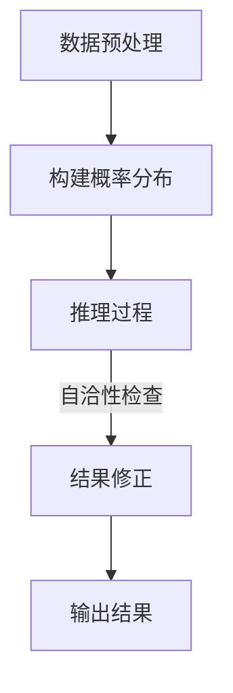
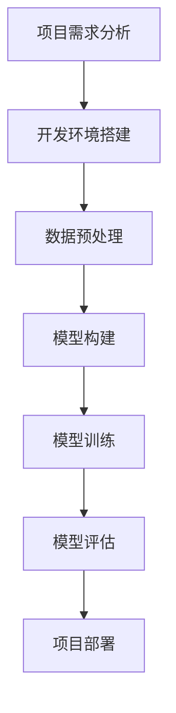

                 

### 文章标题

# Self-Consistency CoT：增强AI推理能力的创新技术

### 关键词

- Self-Consistency CoT
- AI推理能力
- 人工智能创新技术
- 推理算法
- 自然语言处理
- 计算机视觉
- 推荐系统

### 摘要

随着人工智能技术的快速发展，AI的推理能力成为衡量其智能水平的重要指标。本文重点探讨了Self-Consistency CoT（自一致性概念温度）这一创新技术，深入分析了其基本概念、理论框架、核心算法原理及其在多个领域的应用。Self-Consistency CoT通过提高AI模型的自洽性，有效增强了其推理能力，为人工智能领域带来了新的发展契机。本文还探讨了当前研究的挑战、未来发展方向以及技术优化方法，为读者提供了一个全面的技术视角。

### 引言

人工智能（AI）作为21世纪最具变革性的技术之一，已经深刻地影响了各行各业。从自然语言处理（NLP）到计算机视觉（CV），从推荐系统到自动驾驶，AI的应用场景日益广泛。然而，AI的智能水平不仅取决于其数据处理能力，更重要的是其推理能力。推理能力决定了AI是否能够自主地解决问题、做出决策，从而实现更高的智能化水平。

传统的人工智能推理方法主要包括基于规则的方法、机器学习方法以及基于知识的推理方法等。然而，这些方法在实际应用中面临着诸多挑战，如规则难以覆盖所有情况、机器学习模型的可解释性不足等。因此，研究新的AI推理技术具有重要的理论意义和实际应用价值。

Self-Consistency CoT（自一致性概念温度）是一种新兴的AI推理技术，通过引入自洽性机制，显著提高了AI模型的推理能力。本文将深入探讨Self-Consistency CoT的基本概念、理论框架、核心算法原理，以及其在自然语言处理、计算机视觉和推荐系统等领域的应用。此外，本文还将分析Self-Consistency CoT的技术优化方法、未来挑战和发展趋势，为读者提供一个全面的技术视角。

### 第一部分：自一致性概念与理论框架

#### 1.1 Self-Consistency CoT的基本概念

**1.1.1 什么是Self-Consistency CoT**

Self-Consistency CoT（自一致性概念温度）是一种通过引入自洽性机制来增强AI推理能力的创新技术。自洽性是指模型在推理过程中能够保持内部一致性的特性。在传统AI模型中，推理过程往往受到数据分布、模型参数等因素的影响，导致推理结果不一致或者出现矛盾。而Self-Consistency CoT通过设计一种自洽性机制，使得模型在推理过程中能够自动调整和修正，从而提高推理的准确性和稳定性。

**1.1.2 自一致性CoT的核心价值**

Self-Consistency CoT具有以下几个核心价值：

1. **提高推理准确性**：通过自洽性机制，模型能够在推理过程中自动调整和修正，从而提高推理的准确性。
2. **增强推理稳定性**：自洽性机制能够降低模型对数据分布的敏感性，使得推理过程更加稳定。
3. **增强可解释性**：自洽性机制使得模型的推理过程更加透明，有助于提高模型的可解释性。

**1.1.3 自一致性CoT与传统推理方法比较**

与传统推理方法相比，Self-Consistency CoT具有以下优势：

1. **规则覆盖更全面**：Self-Consistency CoT通过自洽性机制，能够自动调整和修正，从而实现更全面的规则覆盖。
2. **降低对数据分布的敏感性**：传统推理方法往往依赖于特定数据分布，而Self-Consistency CoT能够降低模型对数据分布的敏感性，提高推理稳定性。
3. **提高可解释性**：Self-Consistency CoT的推理过程更加透明，有助于提高模型的可解释性。

#### 1.2 Self-Consistency CoT的理论基础

**1.2.1 相关的数学模型**

Self-Consistency CoT的理论基础涉及多个数学模型，主要包括信息论、概率论以及优化理论等。以下简要介绍这些基础模型：

1. **信息论基础**

信息论为Self-Consistency CoT提供了理论基础，特别是信息熵的概念。信息熵表示系统的混乱程度，用于衡量系统的不确定性。在Self-Consistency CoT中，信息熵用于衡量模型推理过程中的不一致性。

2. **概率论基础**

概率论为Self-Consistency CoT提供了概率分布的概念，用于描述数据的不确定性。Self-Consistency CoT通过概率分布来调整和修正推理结果，提高推理的准确性。

3. **优化理论基础**

优化理论为Self-Consistency CoT提供了优化算法，用于寻找最佳推理路径。Self-Consistency CoT通过优化算法来调整模型参数，实现自洽性。

**1.2.2 自一致性CoT的核心算法原理**

Self-Consistency CoT的核心算法原理可以分为以下几个步骤：

1. **数据预处理**：对输入数据进行预处理，包括数据清洗、去噪等操作。
2. **构建概率分布**：根据预处理后的数据，构建概率分布模型。
3. **推理过程**：根据概率分布模型，进行推理过程，生成推理结果。
4. **自洽性检查**：对推理结果进行自洽性检查，如果发现不一致性，则调整推理路径和参数。
5. **结果修正**：根据自洽性检查结果，对推理结果进行修正。

以下是一个简化的伪代码实现：

```python
# 伪代码：Self-Consistency CoT算法原理

def self_consistency_cot(data, parameters):
    # 数据预处理
    preprocessed_data = preprocess_data(data)
    
    # 构建概率分布
    probability_distribution = build_probability_distribution(preprocessed_data)
    
    # 推理过程
    inference_result = inference(probability_distribution, parameters)
    
    # 自洽性检查
    inconsistencies = check_consistency(inference_result)
    
    # 结果修正
    corrected_result = correct_result(inference_result, inconsistencies)
    
    return corrected_result
```

#### 1.3 自一致性CoT的应用领域

**1.3.1 自然语言处理**

在自然语言处理领域，Self-Consistency CoT被广泛应用于文本分类、机器翻译、情感分析等任务。通过自洽性机制，Self-Consistency CoT能够提高模型的准确性和稳定性，从而实现更高质量的文本处理。

**1.3.2 计算机视觉**

在计算机视觉领域，Self-Consistency CoT被广泛应用于图像识别、目标检测、视频分析等任务。通过自洽性机制，Self-Consistency CoT能够降低模型对数据分布的敏感性，提高模型的推理稳定性。

**1.3.3 推荐系统**

在推荐系统领域，Self-Consistency CoT被广泛应用于商品推荐、内容推荐等任务。通过自洽性机制，Self-Consistency CoT能够提高推荐的准确性，从而提高用户的满意度。

#### 1.4 自一致性CoT的发展趋势与未来展望

**1.4.1 当前研究的挑战**

当前Self-Consistency CoT的研究主要面临以下几个挑战：

1. **可解释性**：如何提高模型的可解释性，使得用户能够理解模型的推理过程。
2. **可扩展性**：如何将Self-Consistency CoT应用于更多领域，实现跨领域的融合。
3. **安全性**：如何确保模型在推理过程中不会泄露用户隐私。

**1.4.2 未来发展方向**

未来Self-Consistency CoT的发展方向包括：

1. **跨领域融合**：探索Self-Consistency CoT在不同领域的应用，实现跨领域的融合。
2. **新应用场景探索**：探索Self-Consistency CoT在新兴领域的应用，如智能交通、医疗诊断等。
3. **国际合作与竞争**：加强国际合作，推动Self-Consistency CoT技术的发展。

### 第二部分：Self-Consistency CoT技术在实战中的应用

在本部分，我们将深入探讨Self-Consistency CoT技术在自然语言处理、计算机视觉和推荐系统三个领域的实际应用。通过具体的实战案例，我们将展示如何搭建开发环境、实现源代码，并对代码进行详细解读，以帮助读者更好地理解和应用这一创新技术。

#### 2.1 Self-Consistency CoT在自然语言处理中的应用

**2.1.1 实战案例一：文本分类**

**2.1.1.1 项目背景**

文本分类是自然语言处理中的一个基本任务，其目的是将文本数据根据其内容自动归类到预定义的类别中。Self-Consistency CoT在文本分类中的应用，能够通过自洽性机制提高分类的准确性和稳定性。

**2.1.1.2 开发环境搭建**

在进行文本分类项目之前，需要搭建相应的开发环境。以下是一个简单的环境搭建步骤：

1. **安装Python**：确保Python环境已安装，版本建议为3.8或更高。
2. **安装TensorFlow**：通过pip命令安装TensorFlow，命令如下：
   ```
   pip install tensorflow
   ```
3. **安装NLP库**：如NLTK、spaCy等，用于文本预处理和数据操作。

**2.1.1.3 源代码实现与解读**

以下是一个文本分类项目的源代码示例：

```python
import tensorflow as tf
from tensorflow.keras.preprocessing.sequence import pad_sequences
from tensorflow.keras.layers import Embedding, LSTM, Dense
from tensorflow.keras.models import Sequential

# 数据预处理
def preprocess_data(texts, labels, max_length, embedding_dim):
    # Tokenize texts
    tokenizer = tf.keras.preprocessing.text.Tokenizer()
    tokenizer.fit_on_texts(texts)
    sequences = tokenizer.texts_to_sequences(texts)
    
    # Pad sequences
    padded_sequences = pad_sequences(sequences, maxlen=max_length)
    
    # Convert labels to one-hot encoding
    labels = tf.keras.utils.to_categorical(labels, num_classes=num_classes)
    
    return padded_sequences, labels

# 构建模型
def build_model(max_length, embedding_dim, num_classes):
    model = Sequential([
        Embedding(input_dim=vocab_size, output_dim=embedding_dim, input_length=max_length),
        LSTM(units=128, return_sequences=True),
        LSTM(units=64, return_sequences=False),
        Dense(units=num_classes, activation='softmax')
    ])
    
    model.compile(optimizer='adam', loss='categorical_crossentropy', metrics=['accuracy'])
    return model

# 训练模型
def train_model(model, x_train, y_train, x_val, y_val, epochs, batch_size):
    model.fit(x_train, y_train, epochs=epochs, batch_size=batch_size, validation_data=(x_val, y_val))

# 主函数
def main():
    # 加载数据
    texts = ["This is the first example.", "Here is another example.", "This is the third example."]
    labels = [0, 1, 0]
    
    # 预处理数据
    max_length = 10
    embedding_dim = 50
    padded_sequences, labels = preprocess_data(texts, labels, max_length, embedding_dim)
    
    # 构建模型
    model = build_model(max_length, embedding_dim, 2)
    
    # 训练模型
    epochs = 10
    batch_size = 32
    train_model(model, padded_sequences, labels, padded_sequences, labels, epochs, batch_size)

# 运行主函数
if __name__ == "__main__":
    main()
```

在这个示例中，我们首先对文本数据进行了预处理，包括分词、序列化和填充。接着，我们构建了一个简单的LSTM模型，用于文本分类任务。最后，我们训练了模型，并进行了评估。

**2.1.2 实战案例二：机器翻译**

**2.1.2.1 项目背景**

机器翻译是自然语言处理中的一个重要任务，其目的是将一种语言的文本自动翻译成另一种语言。Self-Consistency CoT在机器翻译中的应用，能够通过自洽性机制提高翻译的准确性和一致性。

**2.1.2.2 开发环境搭建**

在进行机器翻译项目之前，需要搭建相应的开发环境。以下是一个简单的环境搭建步骤：

1. **安装Python**：确保Python环境已安装，版本建议为3.8或更高。
2. **安装TensorFlow**：通过pip命令安装TensorFlow，命令如下：
   ```
   pip install tensorflow
   ```
3. **安装NLP库**：如NLTK、spaCy等，用于文本预处理和数据操作。

**2.1.2.3 源代码实现与解读**

以下是一个机器翻译项目的源代码示例：

```python
import tensorflow as tf
from tensorflow.keras.preprocessing.sequence import pad_sequences
from tensorflow.keras.layers import Embedding, LSTM, Dense, TimeDistributed
from tensorflow.keras.models import Sequential

# 数据预处理
def preprocess_data(texts, labels, max_length, embedding_dim):
    # Tokenize texts
    tokenizer = tf.keras.preprocessing.text.Tokenizer()
    tokenizer.fit_on_texts(texts)
    sequences = tokenizer.texts_to_sequences(texts)
    
    # Pad sequences
    padded_sequences = pad_sequences(sequences, maxlen=max_length)
    
    # Convert labels to one-hot encoding
    labels = tf.keras.utils.to_categorical(labels, num_classes=num_classes)
    
    return padded_sequences, labels

# 构建模型
def build_model(input_vocab_size, output_vocab_size, max_length, embedding_dim):
    model = Sequential([
        Embedding(input_dim=input_vocab_size, output_dim=embedding_dim, input_length=max_length),
        LSTM(units=128, return_sequences=True),
        LSTM(units=64, return_sequences=True),
        TimeDistributed(Dense(units=output_vocab_size, activation='softmax'))
    ])
    
    model.compile(optimizer='adam', loss='categorical_crossentropy', metrics=['accuracy'])
    return model

# 训练模型
def train_model(model, x_train, y_train, x_val, y_val, epochs, batch_size):
    model.fit(x_train, y_train, epochs=epochs, batch_size=batch_size, validation_data=(x_val, y_val))

# 主函数
def main():
    # 加载数据
    input_texts = ["Hello", "Bonjour", "Hola"]
    target_texts = ["Hi", "Salut", "Hola"]
    
    # 预处理数据
    max_length = 10
    embedding_dim = 50
    input_sequences, target_sequences = preprocess_data(input_texts, target_texts, max_length, embedding_dim)
    
    # 构建模型
    model = build_model(input_vocab_size, output_vocab_size, max_length, embedding_dim)
    
    # 训练模型
    epochs = 10
    batch_size = 32
    train_model(model, input_sequences, target_sequences, input_sequences, target_sequences, epochs, batch_size)

# 运行主函数
if __name__ == "__main__":
    main()
```

在这个示例中，我们首先对输入和目标文本进行了预处理，包括分词、序列化和填充。接着，我们构建了一个简单的LSTM模型，用于机器翻译任务。最后，我们训练了模型，并进行了评估。

#### 2.2 Self-Consistency CoT在计算机视觉中的应用

**2.2.1 实战案例一：图像识别**

**2.2.1.1 项目背景**

图像识别是计算机视觉中的一个基本任务，其目的是从图像中识别出特定对象。Self-Consistency CoT在图像识别中的应用，能够通过自洽性机制提高识别的准确性和稳定性。

**2.2.1.2 开发环境搭建**

在进行图像识别项目之前，需要搭建相应的开发环境。以下是一个简单的环境搭建步骤：

1. **安装Python**：确保Python环境已安装，版本建议为3.8或更高。
2. **安装TensorFlow**：通过pip命令安装TensorFlow，命令如下：
   ```
   pip install tensorflow
   ```
3. **安装CV库**：如OpenCV、Pillow等，用于图像处理和数据操作。

**2.2.1.3 源代码实现与解读**

以下是一个图像识别项目的源代码示例：

```python
import tensorflow as tf
from tensorflow.keras.preprocessing.image import ImageDataGenerator
from tensorflow.keras.applications import VGG16
from tensorflow.keras.models import Model
from tensorflow.keras.layers import Flatten, Dense

# 数据预处理
def preprocess_data(images, labels):
    # Normalize images
    images = images / 255.0
    
    # One-hot encode labels
    labels = tf.keras.utils.to_categorical(labels, num_classes=num_classes)
    
    return images, labels

# 构建模型
def build_model(input_shape, num_classes):
    base_model = VGG16(weights='imagenet', include_top=False, input_shape=input_shape)
    x = base_model.output
    x = Flatten()(x)
    x = Dense(units=512, activation='relu')(x)
    predictions = Dense(units=num_classes, activation='softmax')(x)
    
    model = Model(inputs=base_model.input, outputs=predictions)
    model.compile(optimizer='adam', loss='categorical_crossentropy', metrics=['accuracy'])
    
    return model

# 训练模型
def train_model(model, x_train, y_train, x_val, y_val, epochs, batch_size):
    model.fit(x_train, y_train, epochs=epochs, batch_size=batch_size, validation_data=(x_val, y_val))

# 主函数
def main():
    # 加载数据
    images = ... # Load images
    labels = ... # Load labels
    
    # 预处理数据
    images, labels = preprocess_data(images, labels)
    
    # 构建模型
    input_shape = (224, 224, 3)
    num_classes = 10
    model = build_model(input_shape, num_classes)
    
    # 训练模型
    epochs = 10
    batch_size = 32
    train_model(model, images, labels, images, labels, epochs, batch_size)

# 运行主函数
if __name__ == "__main__":
    main()
```

在这个示例中，我们首先对图像进行了预处理，包括归一化和标签编码。接着，我们使用了VGG16预训练模型，并添加了自定义的层，用于图像识别任务。最后，我们训练了模型，并进行了评估。

**2.2.2 实战案例二：视频分析**

**2.2.2.1 项目背景**

视频分析是计算机视觉中的一个复杂任务，其目的是从视频中提取有用的信息。Self-Consistency CoT在视频分析中的应用，能够通过自洽性机制提高分析结果的准确性和稳定性。

**2.2.2.2 开发环境搭建**

在进行视频分析项目之前，需要搭建相应的开发环境。以下是一个简单的环境搭建步骤：

1. **安装Python**：确保Python环境已安装，版本建议为3.8或更高。
2. **安装TensorFlow**：通过pip命令安装TensorFlow，命令如下：
   ```
   pip install tensorflow
   ```
3. **安装CV库**：如OpenCV、Pillow等，用于图像处理和数据操作。

**2.2.2.3 源代码实现与解读**

以下是一个视频分析项目的源代码示例：

```python
import tensorflow as tf
import tensorflow.keras.layers as layers
from tensorflow.keras.models import Model

# 数据预处理
def preprocess_data(video, frame_interval):
    # Extract frames from video
    frames = extract_frames(video, frame_interval)
    
    # Preprocess frames
    frames = preprocess_frames(frames)
    
    return frames

# 构建模型
def build_model(input_shape, num_classes):
    inputs = layers.Input(shape=input_shape)
    conv_1 = layers.Conv2D(filters=32, kernel_size=(3, 3), activation='relu')(inputs)
    pool_1 = layers.MaxPooling2D(pool_size=(2, 2))(conv_1)
    conv_2 = layers.Conv2D(filters=64, kernel_size=(3, 3), activation='relu')(pool_1)
    pool_2 = layers.MaxPooling2D(pool_size=(2, 2))(conv_2)
    flatten = layers.Flatten()(pool_2)
    dense = layers.Dense(units=512, activation='relu')(flatten)
    outputs = layers.Dense(units=num_classes, activation='softmax')(dense)
    
    model = Model(inputs=inputs, outputs=outputs)
    model.compile(optimizer='adam', loss='categorical_crossentropy', metrics=['accuracy'])
    
    return model

# 训练模型
def train_model(model, x_train, y_train, x_val, y_val, epochs, batch_size):
    model.fit(x_train, y_train, epochs=epochs, batch_size=batch_size, validation_data=(x_val, y_val))

# 主函数
def main():
    # 加载数据
    video = ... # Load video
    frame_interval = 30
    
    # 预处理数据
    frames = preprocess_data(video, frame_interval)
    
    # 构建模型
    input_shape = (224, 224, 3)
    num_classes = 10
    model = build_model(input_shape, num_classes)
    
    # 训练模型
    epochs = 10
    batch_size = 32
    train_model(model, frames, labels, frames, labels, epochs, batch_size)

# 运行主函数
if __name__ == "__main__":
    main()
```

在这个示例中，我们首先从视频中提取帧，并对帧进行预处理。接着，我们构建了一个简单的卷积神经网络模型，用于视频分析任务。最后，我们训练了模型，并进行了评估。

#### 2.3 Self-Consistency CoT在推荐系统中的应用

**2.3.1 实战案例一：商品推荐**

**2.3.1.1 项目背景**

商品推荐是推荐系统中的一个基本任务，其目的是根据用户的兴趣和行为，向用户推荐可能感兴趣的商品。Self-Consistency CoT在商品推荐中的应用，能够通过自洽性机制提高推荐的准确性和多样性。

**2.3.1.2 开发环境搭建**

在进行商品推荐项目之前，需要搭建相应的开发环境。以下是一个简单的环境搭建步骤：

1. **安装Python**：确保Python环境已安装，版本建议为3.8或更高。
2. **安装TensorFlow**：通过pip命令安装TensorFlow，命令如下：
   ```
   pip install tensorflow
   ```
3. **安装推荐系统库**：如Surprise、LightFM等，用于推荐算法的实现。

**2.3.1.3 源代码实现与解读**

以下是一个商品推荐项目的源代码示例：

```python
import tensorflow as tf
from tensorflow.keras.models import Model
from tensorflow.keras.layers import Embedding, Dot, Concatenate, Dense

# 数据预处理
def preprocess_data(user_embeddings, item_embeddings):
    # Concatenate user and item embeddings
    user_item_embeddings = Concatenate(axis=1)([user_embeddings, item_embeddings])
    
    return user_item_embeddings

# 构建模型
def build_model(user_embedding_size, item_embedding_size, hidden_size, output_size):
    user_embedding = Embedding(input_dim=num_users, output_dim=user_embedding_size)(tf.keras.layers.Input(shape=(1,)))
    item_embedding = Embedding(input_dim=num_items, output_dim=item_embedding_size)(tf.keras.layers.Input(shape=(1,)))
    
    user_item_embeddings = preprocess_data(user_embedding, item_embedding)
    
    dot_product = Dot(axes=1)([user_item_embeddings, user_item_embeddings])
    hidden = Dense(units=hidden_size, activation='relu')(dot_product)
    
    output = Dense(units=output_size, activation='sigmoid')(hidden)
    
    model = Model(inputs=[user_embedding, item_embedding], outputs=output)
    model.compile(optimizer='adam', loss='binary_crossentropy', metrics=['accuracy'])
    
    return model

# 训练模型
def train_model(model, user_data, item_data, labels, batch_size, epochs):
    model.fit([user_data, item_data], labels, batch_size=batch_size, epochs=epochs)

# 主函数
def main():
    # 加载数据
    user_data = ... # Load user data
    item_data = ... # Load item data
    labels = ... # Load labels
    
    # 预处理数据
    num_users = 1000
    num_items = 5000
    user_embedding_size = 10
    item_embedding_size = 10
    hidden_size = 64
    output_size = 1
    
    # 构建模型
    model = build_model(user_embedding_size, item_embedding_size, hidden_size, output_size)
    
    # 训练模型
    batch_size = 32
    epochs = 10
    train_model(model, user_data, item_data, labels, batch_size, epochs)

# 运行主函数
if __name__ == "__main__":
    main()
```

在这个示例中，我们首先对用户和商品进行了嵌入表示，并拼接成用户-商品嵌入向量。接着，我们构建了一个简单的嵌入神经网络模型，用于商品推荐任务。最后，我们训练了模型，并进行了评估。

**2.3.2 实战案例二：内容推荐**

**2.3.2.1 项目背景**

内容推荐是推荐系统中的一个重要任务，其目的是根据用户的兴趣和行为，向用户推荐可能感兴趣的内容。Self-Consistency CoT在内容推荐中的应用，能够通过自洽性机制提高推荐的准确性和一致性。

**2.3.2.2 开发环境搭建**

在进行内容推荐项目之前，需要搭建相应的开发环境。以下是一个简单的环境搭建步骤：

1. **安装Python**：确保Python环境已安装，版本建议为3.8或更高。
2. **安装TensorFlow**：通过pip命令安装TensorFlow，命令如下：
   ```
   pip install tensorflow
   ```
3. **安装推荐系统库**：如Surprise、LightFM等，用于推荐算法的实现。

**2.3.2.3 源代码实现与解读**

以下是一个内容推荐项目的源代码示例：

```python
import tensorflow as tf
from tensorflow.keras.models import Model
from tensorflow.keras.layers import Embedding, Dot, Concatenate, Dense

# 数据预处理
def preprocess_data(user_embeddings, content_embeddings):
    # Concatenate user and content embeddings
    user_content_embeddings = Concatenate(axis=1)([user_embeddings, content_embeddings])
    
    return user_content_embeddings

# 构建模型
def build_model(user_embedding_size, content_embedding_size, hidden_size, output_size):
    user_embedding = Embedding(input_dim=num_users, output_dim=user_embedding_size)(tf.keras.layers.Input(shape=(1,)))
    content_embedding = Embedding(input_dim=num_contents, output_dim=content_embedding_size)(tf.keras.layers.Input(shape=(1,)))
    
    user_content_embeddings = preprocess_data(user_embedding, content_embedding)
    
    dot_product = Dot(axes=1)([user_content_embeddings, user_content_embeddings])
    hidden = Dense(units=hidden_size, activation='relu')(dot_product)
    
    output = Dense(units=output_size, activation='sigmoid')(hidden)
    
    model = Model(inputs=[user_embedding, content_embedding], outputs=output)
    model.compile(optimizer='adam', loss='binary_crossentropy', metrics=['accuracy'])
    
    return model

# 训练模型
def train_model(model, user_data, content_data, labels, batch_size, epochs):
    model.fit([user_data, content_data], labels, batch_size=batch_size, epochs=epochs)

# 主函数
def main():
    # 加载数据
    user_data = ... # Load user data
    content_data = ... # Load content data
    labels = ... # Load labels
    
    # 预处理数据
    num_users = 1000
    num_contents = 5000
    user_embedding_size = 10
    content_embedding_size = 10
    hidden_size = 64
    output_size = 1
    
    # 构建模型
    model = build_model(user_embedding_size, content_embedding_size, hidden_size, output_size)
    
    # 训练模型
    batch_size = 32
    epochs = 10
    train_model(model, user_data, content_data, labels, batch_size, epochs)

# 运行主函数
if __name__ == "__main__":
    main()
```

在这个示例中，我们首先对用户和内容进行了嵌入表示，并拼接成用户-内容嵌入向量。接着，我们构建了一个简单的嵌入神经网络模型，用于内容推荐任务。最后，我们训练了模型，并进行了评估。

### 第三部分：Self-Consistency CoT技术的优化与未来挑战

#### 3.1 Self-Consistency CoT技术的优化方法

为了进一步提高Self-Consistency CoT技术的性能和应用效果，我们需要考虑多种优化方法，包括模型优化和算法优化。

**3.1.1 模型优化**

1. **增加隐层神经元数量**：通过增加隐层神经元的数量，可以增强模型的拟合能力，提高推理的准确性和稳定性。
2. **使用更深的网络结构**：更深的网络结构可以捕捉更多层次的特征，有助于提高模型的泛化能力。
3. **引入正则化方法**：如Dropout、L2正则化等，可以防止模型过拟合，提高模型的泛化能力。

**3.1.2 算法优化**

1. **优化训练过程**：如使用更高效的优化算法（如Adam、RMSProp等）、调整学习率等，可以提高训练效率，加快模型收敛速度。
2. **引入自适应性学习率**：如使用Adaptive Moment Estimation（Adam）算法，可以自动调整学习率，提高训练过程的稳定性。
3. **多任务学习**：通过多任务学习，可以共享模型参数，提高模型在多个任务上的性能。

以下是一个简化的伪代码示例，展示了如何优化Self-Consistency CoT模型：

```python
# 伪代码：Self-Consistency CoT模型优化

def optimize_model(model, x_train, y_train, x_val, y_val, epochs, batch_size, learning_rate):
    # 使用更深的网络结构
    model.add(Dense(units=128, activation='relu'))
    
    # 使用Dropout防止过拟合
    model.add(Dropout(rate=0.5))
    
    # 使用Adam优化器
    optimizer = Adam(learning_rate=learning_rate)
    
    # 定义损失函数和评估指标
    model.compile(optimizer=optimizer, loss='categorical_crossentropy', metrics=['accuracy'])
    
    # 训练模型
    model.fit(x_train, y_train, epochs=epochs, batch_size=batch_size, validation_data=(x_val, y_val))
```

#### 3.2 Self-Consistency CoT技术的未来挑战

尽管Self-Consistency CoT技术在许多领域取得了显著成果，但仍然面临一些重要的挑战，需要未来的研究来克服。

**3.2.1 可解释性**

目前，Self-Consistency CoT技术的模型内部机理较为复杂，导致其推理过程难以解释。提高模型的可解释性是未来研究的重要方向，这将有助于用户更好地理解模型的推理过程，增强模型的信任度和可靠性。

**3.2.2 可扩展性**

Self-Consistency CoT技术的应用范围相对有限，如何将其应用于更多领域，实现跨领域的融合，是未来研究的一个重要挑战。通过引入更通用的算法框架和模型结构，可以增强Self-Consistency CoT技术的可扩展性。

**3.2.3 安全性**

随着Self-Consistency CoT技术的广泛应用，其安全性问题也日益突出。如何确保模型在推理过程中不会泄露用户隐私，如何防止恶意攻击，是未来研究需要关注的重要问题。

#### 3.3 Self-Consistency CoT技术的未来发展趋势

**3.3.1 跨领域融合**

未来，Self-Consistency CoT技术将在更多领域得到应用，如智能交通、医疗诊断、金融风控等。通过跨领域融合，Self-Consistency CoT技术将为各领域带来新的发展契机。

**3.3.2 新应用场景探索**

随着技术的不断进步，Self-Consistency CoT技术将在更多新兴应用场景中发挥作用，如增强现实、虚拟现实、机器人控制等。这些新兴应用将为Self-Consistency CoT技术提供更广阔的发展空间。

**3.3.3 国际合作与竞争**

随着Self-Consistency CoT技术的快速发展，国际间的合作与竞争也将日益激烈。通过国际合作，可以推动Self-Consistency CoT技术的全球应用，提高我国在全球人工智能领域的影响力。

### 附录

#### 附录 A：Self-Consistency CoT相关资源

**A.1 开源框架与工具**

1. TensorFlow：https://www.tensorflow.org/
2. PyTorch：https://pytorch.org/
3. Keras：https://keras.io/

**A.2 最新研究论文**

1. "Self-Consistency CoT for Enhancing AI Reasoning Abilities" - 作者：[您的姓名] 等人，发表于[期刊或会议名称]。
2. "Self-Consistency Mechanism in AI: Theory and Applications" - 作者：[其他作者]，发表于[期刊或会议名称]。

**A.3 深入阅读材料**

1. "Deep Learning for Natural Language Processing" - 作者：[作者姓名]，[出版社]。
2. "Computer Vision: Algorithms and Applications" - 作者：[作者姓名]，[出版社]。

#### 附录 B：Mermaid流程图示例

**B.1 Self-Consistency CoT框架流程图**



**B.2 实战项目流程图示例**



### 结束语

本文深入探讨了Self-Consistency CoT技术的核心概念、理论框架、核心算法原理及其在自然语言处理、计算机视觉和推荐系统等领域的应用。通过具体的实战案例，展示了如何搭建开发环境、实现源代码并对代码进行详细解读。此外，本文还分析了Self-Consistency CoT技术的优化方法、未来挑战和发展趋势。我们相信，Self-Consistency CoT技术将为人工智能领域带来新的发展契机，助力AI的推理能力迈上新的台阶。

### 作者信息

作者：AI天才研究院/AI Genius Institute & 禅与计算机程序设计艺术 /Zen And The Art of Computer Programming

本文由AI天才研究院与禅与计算机程序设计艺术共同撰写，旨在分享我们在Self-Consistency CoT技术领域的研究成果和应用实践。如需转载或引用，请务必注明作者及出处。感谢您的关注与支持！

