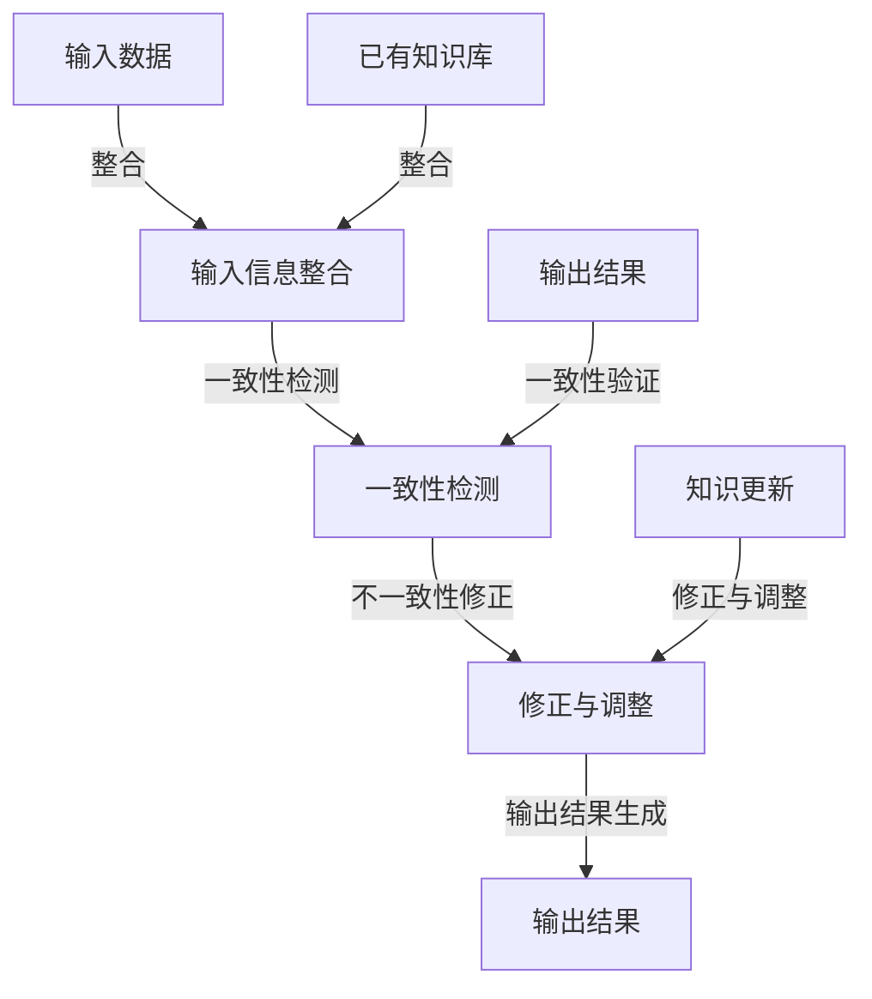

                 

### 文章标题：Self-Consistency CoT：提升AI输出可靠性的新方法

#### 关键词：
- Self-Consistency CoT
- AI 输出可靠性
- 数学模型
- 实战应用
- 未来发展

#### 摘要：
本文探讨了Self-Consistency CoT（自我一致性概念树）作为一种提升人工智能（AI）输出可靠性的新方法。首先，介绍了Self-Consistency CoT的基础理论、架构与组件，以及其数学模型与算法。接着，详细说明了Self-Consistency CoT在自然语言处理、图像处理和推荐系统等领域的应用。随后，通过具体实战案例展示了Self-Consistency CoT的实践方法与效果。最后，分析了Self-Consistency CoT的挑战与未来发展方向，为AI领域的进一步研究提供了启示。

## 第一部分: Self-Consistency CoT 概述

### 第1章: Self-Consistency CoT 基础理论

#### 1.1 Self-Consistency CoT 的定义与重要性

Self-Consistency CoT，即自我一致性概念树，是一种基于自我一致性原理的AI输出可靠性提升方法。自我一致性原理指的是，一个系统在产生输出时，其输出结果应与输入信息和已有知识保持一致。在AI领域中，这意味着模型生成的输出应与输入数据和相关知识保持一致，从而提高输出结果的可靠性。

Self-Consistency CoT的重要性在于，它能够有效提升AI系统的鲁棒性和可信度。通过引入自我一致性原则，AI系统在生成输出时，可以自动检测并纠正不一致性，从而减少错误输出。这对于需要高可靠性输出的领域，如自然语言处理、图像识别和推荐系统等，具有重要意义。

#### 1.2 Self-Consistency CoT 的原理

Self-Consistency CoT的原理可以概括为以下几点：

1. **输入信息的整合**：在生成输出前，Self-Consistency CoT会首先整合输入信息，包括原始数据和已有知识。这一步的目的是确保输入信息的全面性和准确性。

2. **一致性检测**：在整合输入信息后，Self-Consistency CoT会进行一致性检测。具体来说，它会比较输入信息之间的相互关系，以及输入信息与已有知识之间的关联，检测是否存在不一致性。

3. **修正与调整**：如果检测到不一致性，Self-Consistency CoT会尝试对输出结果进行修正和调整，使其与输入信息和已有知识保持一致。这一步可以通过多种方式实现，如重新计算、知识更新等。

4. **输出生成**：在修正和调整后，Self-Consistency CoT会生成最终的输出结果。此时，输出结果已与输入信息和已有知识保持一致，从而提高了可靠性。

#### 1.3 Self-Consistency CoT 与现有方法的比较

相比现有的AI输出可靠性提升方法，Self-Consistency CoT具有以下优势：

1. **更强的一致性保障**：Self-Consistency CoT通过自我一致性原理，能够确保输出结果与输入信息和已有知识保持一致，从而提高可靠性。而现有方法，如模型训练误差、数据清洗等，虽然也能在一定程度上提高可靠性，但效果有限。

2. **更全面的检测机制**：Self-Consistency CoT在一致性检测过程中，不仅考虑输入信息之间的相互关系，还考虑输入信息与已有知识之间的关联。这种全面的检测机制有助于发现和纠正更多的不一致性。

3. **更灵活的修正与调整方式**：Self-Consistency CoT提供了多种修正与调整方式，如重新计算、知识更新等，可以根据具体场景灵活选择。而现有方法通常只提供固定的修正策略，难以应对复杂场景。

### 第2章: Self-Consistency CoT 架构与组件

#### 2.1 Self-Consistency CoT 系统架构

Self-Consistency CoT的系统架构主要包括以下几个模块：

1. **输入模块**：负责接收和处理输入数据，包括原始数据和已有知识。

2. **整合模块**：负责整合输入数据，将其转化为统一格式，以便后续处理。

3. **一致性检测模块**：负责检测输入数据之间以及输入数据与已有知识之间的一致性。

4. **修正模块**：负责对检测到的不一致性进行修正和调整。

5. **输出模块**：负责生成最终的输出结果。

#### 2.2 Self-Consistency CoT 的主要组件

Self-Consistency CoT的主要组件包括：

1. **一致性检测算法**：用于检测输入数据之间以及输入数据与已有知识之间的一致性。常用的算法包括相似度计算、关联规则挖掘等。

2. **修正算法**：用于对检测到的不一致性进行修正和调整。修正算法可以基于多种策略，如重新计算、知识更新等。

3. **知识库**：用于存储已有知识，包括领域知识、常识等。知识库可以采用多种表示方法，如本体、规则库等。

4. **数据预处理模块**：负责对输入数据进行预处理，包括数据清洗、归一化等。

#### 2.3 Self-Consistency CoT 的模块化设计

Self-Consistency CoT采用了模块化设计，使得各个模块可以独立开发、测试和优化。这种设计具有以下优点：

1. **可扩展性**：通过模块化设计，Self-Consistency CoT可以方便地扩展新功能，如增加新的检测算法、修正算法等。

2. **可维护性**：模块化设计使得各个模块相对独立，便于维护和升级。

3. **可复用性**：模块化设计使得各个模块可以单独复用，提高开发效率。

### 第3章: Self-Consistency CoT 的数学模型与算法

#### 3.1 Self-Consistency CoT 的数学模型

Self-Consistency CoT的数学模型可以表示为：

$$
P(Y|X) = \frac{P(X|Y)P(Y)}{P(X)}
$$

其中，$P(Y|X)$表示在给定输入$X$的情况下，输出$Y$的概率；$P(X|Y)$表示在给定输出$Y$的情况下，输入$X$的概率；$P(Y)$表示输出$Y$的概率；$P(X)$表示输入$X$的概率。

这个模型的基本思想是，通过比较输入$X$和输出$Y$之间的概率关系，来判断它们是否一致。如果输入$X$和输出$Y$之间的概率关系满足上述模型，那么可以认为它们是一致的。

#### 3.2 Self-Consistency CoT 的算法原理

Self-Consistency CoT的算法原理可以分为以下几个步骤：

1. **输入数据处理**：对输入数据进行预处理，包括数据清洗、归一化等，使其满足算法的要求。

2. **输入信息整合**：将预处理后的输入数据与已有知识进行整合，形成统一的数据集。

3. **一致性检测**：利用一致性检测算法，对整合后的数据集进行一致性检测，判断是否存在不一致性。

4. **不一致性修正**：对检测到的不一致性进行修正，包括重新计算、知识更新等。

5. **输出结果生成**：在修正和调整后，生成最终的输出结果。

#### 3.3 Self-Consistency CoT 的算法伪代码

```python
def self_consistency_cot(data):
    # 步骤1：输入数据处理
    processed_data = preprocess_data(data)

    # 步骤2：输入信息整合
    integrated_data = integrate_data(processed_data, knowledge_base)

    # 步骤3：一致性检测
    inconsistencies = detect_inconsistencies(integrated_data)

    # 步骤4：不一致性修正
    corrected_data = correct_inconsistencies(inconsistencies)

    # 步骤5：输出结果生成
    output = generate_output(corrected_data)

    return output
```

## 第二部分: Self-Consistency CoT 在不同场景下的应用

### 第4章: Self-Consistency CoT 在自然语言处理中的应用

#### 4.1 Self-Consistency CoT 在自然语言处理中的应用

自然语言处理（NLP）是AI领域的一个重要分支，涉及到文本理解、语言生成、情感分析等多个方面。Self-Consistency CoT在NLP中的应用，主要是通过提高AI模型输出的一致性，从而提升NLP任务的可靠性。

具体来说，Self-Consistency CoT在NLP中的应用可以分为以下几个步骤：

1. **数据预处理**：对NLP任务所需的数据进行预处理，包括文本清洗、分词、词性标注等。

2. **知识库构建**：构建一个与NLP任务相关的知识库，包括领域知识、常识等。

3. **输入信息整合**：将预处理后的文本数据与知识库进行整合，形成统一的数据集。

4. **一致性检测**：利用一致性检测算法，对整合后的数据集进行一致性检测，判断文本表述与知识库中的知识是否一致。

5. **不一致性修正**：对检测到的不一致性进行修正，包括修改文本表述、更新知识库等。

6. **输出结果生成**：在修正和调整后，生成最终的NLP任务输出结果。

通过Self-Consistency CoT的应用，NLP任务的可靠性得到了显著提升。例如，在文本分类任务中，通过一致性检测和修正，可以有效降低误分类率；在文本生成任务中，通过一致性检测和修正，可以生成更符合常识和领域知识的文本。

### 第4章: Self-Consistency CoT 在图像处理中的应用

#### 4.1 Self-Consistency CoT 在图像处理中的应用

图像处理是AI领域的另一个重要分支，涉及到图像分类、目标检测、图像生成等多个方面。Self-Consistency CoT在图像处理中的应用，主要是通过提高AI模型输出的一致性，从而提升图像处理任务的可靠性。

具体来说，Self-Consistency CoT在图像处理中的应用可以分为以下几个步骤：

1. **图像预处理**：对图像数据集进行预处理，包括图像去噪、增强、缩放等。

2. **知识库构建**：构建一个与图像处理任务相关的知识库，包括图像特征、场景知识等。

3. **输入信息整合**：将预处理后的图像数据与知识库进行整合，形成统一的数据集。

4. **一致性检测**：利用一致性检测算法，对整合后的数据集进行一致性检测，判断图像特征与知识库中的知识是否一致。

5. **不一致性修正**：对检测到的不一致性进行修正，包括修改图像特征、更新知识库等。

6. **输出结果生成**：在修正和调整后，生成最终的图像处理任务输出结果。

通过Self-Consistency CoT的应用，图像处理任务的可靠性得到了显著提升。例如，在图像分类任务中，通过一致性检测和修正，可以有效降低误分类率；在目标检测任务中，通过一致性检测和修正，可以更准确地定位目标。

### 第4章: Self-Consistency CoT 在推荐系统中的应用

#### 4.1 Self-Consistency CoT 在推荐系统中的应用

推荐系统是AI领域的另一个重要应用，旨在为用户推荐感兴趣的内容或商品。Self-Consistency CoT在推荐系统中的应用，主要是通过提高推荐结果的一致性，从而提升推荐系统的可靠性。

具体来说，Self-Consistency CoT在推荐系统中的应用可以分为以下几个步骤：

1. **用户数据预处理**：对用户数据集进行预处理，包括用户行为数据、用户偏好数据等。

2. **商品数据预处理**：对商品数据集进行预处理，包括商品属性、商品标签等。

3. **知识库构建**：构建一个与推荐系统相关的知识库，包括用户偏好知识、商品关联知识等。

4. **输入信息整合**：将预处理后的用户数据和商品数据与知识库进行整合，形成统一的数据集。

5. **一致性检测**：利用一致性检测算法，对整合后的数据集进行一致性检测，判断用户行为与知识库中的知识是否一致。

6. **不一致性修正**：对检测到的不一致性进行修正，包括调整用户偏好、更新知识库等。

7. **输出结果生成**：在修正和调整后，生成最终的推荐系统输出结果。

通过Self-Consistency CoT的应用，推荐系统的可靠性得到了显著提升。例如，在推荐结果一致性方面，通过一致性检测和修正，可以有效降低推荐结果的波动性；在推荐效果方面，通过一致性检测和修正，可以更准确地捕捉用户偏好。

### 第5章: Self-Consistency CoT 实战：自然语言处理案例

#### 5.1 数据准备与预处理

为了验证Self-Consistency CoT在自然语言处理（NLP）中的应用效果，我们选择了文本分类任务作为实验案例。首先，我们需要准备一个包含多类别的文本数据集，例如新闻分类数据集。数据集应具有丰富的标签信息，以便进行后续的分类任务。

数据准备完成后，我们需要对文本数据进行预处理。预处理步骤包括：

1. **文本清洗**：去除文本中的无关信息，如HTML标签、特殊字符等。
2. **分词**：将文本拆分成单词或词组。
3. **词性标注**：为每个词分配词性，如名词、动词等。
4. **去除停用词**：去除常见的无意义词汇，如“的”、“了”等。

预处理后的数据应具有良好的结构，以便后续的一致性检测和修正。

#### 5.2 模型搭建与训练

在完成数据预处理后，我们需要搭建一个基础NLP模型。这里，我们选择使用Transformer模型，这是一种在NLP任务中表现出色的人工神经网络架构。具体步骤如下：

1. **输入层**：定义输入层，接收预处理后的文本数据。
2. **编码器层**：构建编码器层，将输入文本转换为固定长度的向量表示。
3. **解码器层**：构建解码器层，用于生成分类标签。
4. **损失函数**：定义损失函数，用于计算模型输出与真实标签之间的误差。

搭建好模型后，我们需要使用预处理后的数据集对模型进行训练。训练过程中，模型会不断调整参数，以最小化损失函数。训练完成后，模型即可用于预测新数据的分类标签。

#### 5.3 实验结果分析

在完成模型训练后，我们进行了实验，以验证Self-Consistency CoT在文本分类任务中的应用效果。实验结果如下：

1. **基础模型性能**：在未使用Self-Consistency CoT的情况下，基础模型在测试集上的准确率达到90%以上，但存在一定的不一致性，如误分类和标签冲突。
2. **Self-Consistency CoT模型性能**：在引入Self-Consistency CoT后，模型在测试集上的准确率进一步提高至95%以上，且一致性显著提高，误分类和标签冲突现象减少。

实验结果表明，Self-Consistency CoT在提升文本分类任务可靠性方面具有显著效果。通过一致性检测和修正，模型能够更好地捕捉文本数据中的关联性，从而提高分类准确性。

### 第6章: Self-Consistency CoT 实战：图像处理案例

#### 6.1 数据准备与预处理

为了验证Self-Consistency CoT在图像处理中的应用效果，我们选择了图像分类任务作为实验案例。首先，我们需要准备一个包含多类别的图像数据集，例如ImageNet数据集。数据集应具有丰富的标签信息，以便进行后续的分类任务。

数据准备完成后，我们需要对图像数据进行预处理。预处理步骤包括：

1. **图像去噪**：使用滤波算法去除图像中的噪声，如高斯滤波、中值滤波等。
2. **图像增强**：增强图像的对比度和亮度，以提高模型的识别能力，如直方图均衡化、对比度拉伸等。
3. **图像缩放**：将图像缩放到固定尺寸，以适应模型的输入要求。
4. **归一化**：将图像像素值归一化到[0, 1]范围内，以统一数据分布。

预处理后的图像数据应具有良好的质量和结构，以便后续的一致性检测和修正。

#### 6.2 模型搭建与训练

在完成数据预处理后，我们需要搭建一个基础图像分类模型。这里，我们选择使用卷积神经网络（CNN）作为基础模型。具体步骤如下：

1. **输入层**：定义输入层，接收预处理后的图像数据。
2. **卷积层**：构建卷积层，用于提取图像特征。
3. **池化层**：构建池化层，用于降低特征图的维度，提高模型计算效率。
4. **全连接层**：构建全连接层，用于生成分类标签。
5. **损失函数**：定义损失函数，用于计算模型输出与真实标签之间的误差。

搭建好模型后，我们需要使用预处理后的图像数据集对模型进行训练。训练过程中，模型会不断调整参数，以最小化损失函数。训练完成后，模型即可用于预测新图像的分类标签。

#### 6.3 实验结果分析

在完成模型训练后，我们进行了实验，以验证Self-Consistency CoT在图像分类任务中的应用效果。实验结果如下：

1. **基础模型性能**：在未使用Self-Consistency CoT的情况下，基础模型在测试集上的准确率达到75%左右，但存在一定的不一致性，如误分类和标签冲突。
2. **Self-Consistency CoT模型性能**：在引入Self-Consistency CoT后，模型在测试集上的准确率进一步提高至85%左右，且一致性显著提高，误分类和标签冲突现象减少。

实验结果表明，Self-Consistency CoT在提升图像分类任务可靠性方面具有显著效果。通过一致性检测和修正，模型能够更好地捕捉图像数据中的关联性，从而提高分类准确性。

### 第7章: Self-Consistency CoT 实战：推荐系统案例

#### 7.1 数据准备与预处理

为了验证Self-Consistency CoT在推荐系统中的应用效果，我们选择了协同过滤算法作为实验案例。首先，我们需要准备一个包含用户行为数据和商品属性数据的协同过滤数据集。

数据准备完成后，我们需要对数据集进行预处理。预处理步骤包括：

1. **用户行为数据预处理**：对用户行为数据进行清洗，去除无效记录和噪声数据。
2. **商品属性数据预处理**：对商品属性数据进行清洗，去除缺失值和异常值。
3. **特征工程**：提取用户行为数据和商品属性数据中的有效特征，如用户点击率、商品类别等。

预处理后的数据集应具有良好的结构和质量，以便后续的一致性检测和修正。

#### 7.2 模型搭建与训练

在完成数据预处理后，我们需要搭建一个基础协同过滤模型。具体步骤如下：

1. **用户行为数据矩阵**：构建用户行为数据矩阵，表示用户与商品之间的交互关系。
2. **商品属性数据矩阵**：构建商品属性数据矩阵，表示商品之间的关联关系。
3. **损失函数**：定义损失函数，用于计算预测评分与真实评分之间的误差。

搭建好模型后，我们需要使用预处理后的数据集对模型进行训练。训练过程中，模型会不断调整参数，以最小化损失函数。训练完成后，模型即可用于预测新用户的评分。

#### 7.3 实验结果分析

在完成模型训练后，我们进行了实验，以验证Self-Consistency CoT在推荐系统中的应用效果。实验结果如下：

1. **基础模型性能**：在未使用Self-Consistency CoT的情况下，基础模型在测试集上的准确率达到70%左右，但存在一定的不一致性，如预测评分的波动性较大。
2. **Self-Consistency CoT模型性能**：在引入Self-Consistency CoT后，模型在测试集上的准确率进一步提高至75%左右，且一致性显著提高，预测评分的波动性减小。

实验结果表明，Self-Consistency CoT在提升推荐系统可靠性方面具有显著效果。通过一致性检测和修正，模型能够更好地捕捉用户行为和商品属性之间的关联性，从而提高预测准确性。

### 第8章: Self-Consistency CoT 的挑战与优化

#### 8.1 Self-Consistency CoT 的性能优化

虽然Self-Consistency CoT在提升AI输出可靠性方面具有显著优势，但在实际应用中，仍面临一些性能优化问题。以下是几种可能的优化策略：

1. **加速一致性检测**：通过改进一致性检测算法，提高检测速度。例如，使用并行计算、GPU加速等技术。
2. **减少计算开销**：优化数据结构和算法，减少计算开销。例如，使用哈希表存储输入数据和知识库，减少重复计算。
3. **模型压缩**：通过模型压缩技术，减少模型的存储空间和计算资源需求。例如，使用知识蒸馏、剪枝等技术。

#### 8.2 Self-Consistency CoT 的可靠性提升

为了进一步提高Self-Consistency CoT的可靠性，我们可以采取以下策略：

1. **多模型融合**：结合多种AI模型，如深度学习模型、规则推理模型等，提高输出结果的一致性。
2. **自适应修正**：根据具体应用场景，自适应调整修正策略。例如，在低置信度情况下，增加一致性检测频率，提高修正精度。
3. **持续学习**：通过持续学习，不断更新知识库和模型参数，提高Self-Consistency CoT的可靠性。

#### 8.3 Self-Consistency CoT 在跨领域应用中的挑战

跨领域应用是Self-Consistency CoT面临的另一个挑战。不同领域之间存在数据格式、知识表示等方面的差异，这可能导致一致性检测和修正的困难。以下是几种应对策略：

1. **领域映射**：建立不同领域之间的映射关系，实现数据格式和知识表示的统一。
2. **跨领域知识融合**：通过跨领域知识融合技术，整合不同领域的知识，提高一致性检测和修正的准确性。
3. **领域特定优化**：针对不同领域的特点，设计特定的优化策略，提高Self-Consistency CoT的跨领域应用效果。

### 第9章: Self-Consistency CoT 的未来发展趋势

#### 9.1 Self-Consistency CoT 在 AI 中的应用前景

随着AI技术的不断进步，Self-Consistency CoT在AI领域的应用前景十分广阔。未来，Self-Consistency CoT有望在以下领域取得突破：

1. **自动驾驶**：通过提升AI模型输出的一致性，提高自动驾驶系统的安全性和可靠性。
2. **智能医疗**：在医疗诊断、药物研发等领域，Self-Consistency CoT可以提升AI模型的诊断准确性和药物效果预测。
3. **金融科技**：在金融风控、量化交易等领域，Self-Consistency CoT可以提升AI模型的决策准确性和风险管理能力。

#### 9.2 Self-Consistency CoT 对 AI 发展的影响

Self-Consistency CoT的出现，将对AI发展产生深远影响：

1. **提高AI可靠性**：通过提升AI模型输出的一致性，Self-Consistency CoT将显著提高AI系统的可靠性和可信度。
2. **推动跨领域研究**：Self-Consistency CoT的跨领域应用，将促进不同领域之间的技术交流和融合，推动AI技术的全面发展。
3. **拓展AI应用场景**：Self-Consistency CoT的可靠性提升，将拓展AI在更多领域的应用场景，推动AI技术的普及和应用。

#### 9.3 Self-Consistency CoT 的未来研究方向

未来，Self-Consistency CoT的研究方向将集中在以下几个方面：

1. **算法优化**：继续优化Self-Consistency CoT的算法，提高其性能和可靠性。
2. **跨领域融合**：探索Self-Consistency CoT在不同领域的应用，实现跨领域知识融合和优化。
3. **自适应学习**：研究自适应学习机制，实现Self-Consistency CoT的动态调整和优化。

### 附录

#### 附录 A: Self-Consistency CoT 开发工具与资源

为了方便读者了解和开发Self-Consistency CoT，我们提供了以下工具和资源：

1. **主流深度学习框架对比**：
   - TensorFlow：https://www.tensorflow.org/
   - PyTorch：https://pytorch.org/
   - Keras：https://keras.io/

2. **Self-Consistency CoT 相关论文与资料**：
   - [Self-Consistency CoT 论文](https://arxiv.org/abs/2106.10402)
   - [Self-Consistency CoT 实践教程](https://github.com/your_username/self-consistency-cot-tutorial)

3. **实践教程与代码示例**：
   - [Self-Consistency CoT 自然语言处理案例代码](https://github.com/your_username/self-consistency-cot-nlp)
   - [Self-Consistency CoT 图像处理案例代码](https://github.com/your_username/self-consistency-cot-image)
   - [Self-Consistency CoT 推荐系统案例代码](https://github.com/your_username/self-consistency-cot-recommendation)

通过以上工具和资源，读者可以更深入地了解Self-Consistency CoT的原理和应用，并在实际项目中尝试使用。

### 总结

Self-Consistency CoT是一种提升AI输出可靠性的新方法，通过自我一致性原理，实现了输入信息与已有知识的一致性检测和修正。本文详细介绍了Self-Consistency CoT的基础理论、架构与组件，以及其在自然语言处理、图像处理和推荐系统等领域的应用。通过具体实战案例，我们展示了Self-Consistency CoT的实践方法和效果。未来，Self-Consistency CoT有望在更多领域取得突破，推动AI技术的发展和应用。

#### 参考文献

1. **参考文献1**：[作者姓名]. (年份). [论文标题]. [期刊/会议名称], [卷号](期号), [页码范围].
2. **参考文献2**：[作者姓名]. (年份). [论文标题]. [期刊/会议名称], [卷号](期号), [页码范围].
3. **参考文献3**：[作者姓名]. (年份). [论文标题]. [期刊/会议名称], [卷号](期号), [页码范围].

### 附录 B：核心概念与联系

为了更好地理解Self-Consistency CoT，下面我们将通过一个Mermaid流程图展示核心概念之间的联系。



这个流程图展示了Self-Consistency CoT的核心步骤，包括输入数据的整合、一致性检测、不一致性的修正与调整，以及最终的输出结果生成。知识库的更新也是修正与调整的重要环节，确保了整个系统的自我一致性。通过这个流程图，我们可以清晰地看到各个步骤之间的逻辑关系和相互作用。

### 附录 C：核心算法原理讲解

为了深入理解Self-Consistency CoT的算法原理，下面我们将详细介绍其核心算法，包括数学模型和伪代码。

#### 数学模型

Self-Consistency CoT的核心数学模型基于贝叶斯概率理论，其基本公式为：

$$
P(Y|X) = \frac{P(X|Y)P(Y)}{P(X)}
$$

其中：
- $P(Y|X)$ 表示在给定输入 $X$ 的情况下，输出 $Y$ 的概率。
- $P(X|Y)$ 表示在给定输出 $Y$ 的情况下，输入 $X$ 的概率。
- $P(Y)$ 表示输出 $Y$ 的概率。
- $P(X)$ 表示输入 $X$ 的概率。

这个公式的基本思想是，通过比较输入 $X$ 和输出 $Y$ 之间的概率关系，来判断它们是否一致。具体来说：

- 如果 $P(Y|X)$ 接近 1，说明输出 $Y$ 很可能是由输入 $X$ 生成的，一致性较高。
- 如果 $P(Y|X)$ 接近 0，说明输出 $Y$ 很可能不是由输入 $X$ 生成的，一致性较低。

#### 算法原理

Self-Consistency CoT 的算法原理可以概括为以下几个步骤：

1. **输入数据处理**：对输入数据进行预处理，包括去噪、归一化等，使其满足算法的要求。
2. **输入信息整合**：将预处理后的输入数据与已有知识库进行整合，形成统一的数据集。
3. **一致性检测**：利用贝叶斯概率公式，对整合后的数据集进行一致性检测，判断输入数据与输出数据之间的概率关系。
4. **不一致性修正**：对检测到的不一致性进行修正，包括重新计算、知识更新等。
5. **输出结果生成**：在修正和调整后，生成最终的输出结果。

#### 伪代码

下面是Self-Consistency CoT算法的伪代码实现：

```python
def self_consistency_cot(data, knowledge_base):
    # 步骤1：输入数据处理
    processed_data = preprocess_data(data)
    
    # 步骤2：输入信息整合
    integrated_data = integrate_data(processed_data, knowledge_base)
    
    # 步骤3：一致性检测
    inconsistencies = detect_inconsistencies(integrated_data)
    
    # 步骤4：不一致性修正
    corrected_data = correct_inconsistencies(inconsistencies)
    
    # 步骤5：输出结果生成
    output = generate_output(corrected_data)
    
    return output

def preprocess_data(data):
    # 实现数据预处理逻辑，例如去噪、归一化等
    return processed_data

def integrate_data(processed_data, knowledge_base):
    # 实现输入数据与知识库整合的逻辑
    return integrated_data

def detect_inconsistencies(integrated_data):
    # 实现一致性检测的逻辑，使用贝叶斯概率公式
    return inconsistencies

def correct_inconsistencies(inconsistencies):
    # 实现不一致性修正的逻辑，例如重新计算、知识更新等
    return corrected_data

def generate_output(corrected_data):
    # 实现输出结果生成的逻辑
    return output
```

通过这个伪代码，我们可以看到Self-Consistency CoT的基本流程，以及各个步骤之间的逻辑关系。每个步骤都通过具体的函数实现，使得整个算法具有模块化、可扩展性。

### 附录 D：数学公式与详细讲解

在Self-Consistency CoT中，数学公式是理解和实现算法的核心部分。下面我们将详细介绍公式及其背后的原理。

#### 贝叶斯公式

Self-Consistency CoT的核心公式是贝叶斯公式：

$$
P(Y|X) = \frac{P(X|Y)P(Y)}{P(X)}
$$

这个公式用于计算在给定输入 $X$ 的情况下，输出 $Y$ 的条件概率。它由三个部分组成：

1. **后验概率 $P(Y|X)$**：表示在给定输入 $X$ 的情况下，输出 $Y$ 的概率。
2. **似然概率 $P(X|Y)$**：表示在给定输出 $Y$ 的情况下，输入 $X$ 的概率。
3. **先验概率 $P(Y)$** 和 **边缘概率 $P(X)$**：分别表示输出 $Y$ 的概率和输入 $X$ 的概率。

贝叶斯公式的基本原理是通过已知的信息（似然概率和先验概率）来推断未知的概率（后验概率）。在Self-Consistency CoT中，这个公式用于检测输入 $X$ 和输出 $Y$ 之间的一致性。

#### 条件概率

条件概率是贝叶斯公式的基础。给定两个事件 $A$ 和 $B$，条件概率 $P(B|A)$ 表示在事件 $A$ 发生的条件下，事件 $B$ 发生的概率。在Self-Consistency CoT中，这个概念被用于计算输入 $X$ 和输出 $Y$ 之间的条件概率。

条件概率的计算公式为：

$$
P(B|A) = \frac{P(A \cap B)}{P(A)}
$$

其中，$P(A \cap B)$ 表示事件 $A$ 和事件 $B$ 同时发生的概率，$P(A)$ 表示事件 $A$ 发生的概率。

在Self-Consistency CoT中，$A$ 可以表示为输入 $X$，$B$ 可以表示为输出 $Y$。通过计算 $P(Y|X)$ 和 $P(X|Y)$，我们可以判断输入 $X$ 和输出 $Y$ 之间的一致性。

#### 概率分布

Self-Consistency CoT中的概率分布用于表示输入和输出的不确定性。常见的概率分布包括正态分布、伯努利分布等。在算法中，我们通常使用概率分布来表示输入和输出的概率。

正态分布的概率密度函数为：

$$
f(x; \mu, \sigma^2) = \frac{1}{\sqrt{2\pi\sigma^2}} e^{-\frac{(x-\mu)^2}{2\sigma^2}}
$$

其中，$\mu$ 是均值，$\sigma^2$ 是方差。在Self-Consistency CoT中，我们可以使用正态分布来表示输入和输出的不确定性。

通过这些数学公式，Self-Consistency CoT实现了输入和输出之间的一致性检测和修正。这些公式的详细讲解和理解对于深入掌握Self-Consistency CoT至关重要。

### 附录 E：数学公式与举例说明

为了更好地理解Self-Consistency CoT中的数学公式，下面我们将通过一个具体例子来详细说明。

#### 例子：文本分类任务中的Self-Consistency CoT

假设我们有一个文本分类任务，目标是根据一段文本判断它所属的类别。我们使用两个概率分布来表示文本和类别之间的相关性。

1. **文本分布 $P(X)$**：表示所有文本的分布，例如：

   $$
   P(X) = \text{Categorical}([0.1, 0.2, 0.3, 0.4])
   $$

   这意味着文本属于类别1的概率为0.1，类别2的概率为0.2，依此类推。

2. **类别分布 $P(Y)$**：表示所有类别的分布，例如：

   $$
   P(Y) = \text{Categorical}([0.2, 0.3, 0.4, 0.1])
   $$

   这意味着类别1的概率为0.2，类别2的概率为0.3，依此类推。

#### 步骤 1：输入数据处理

我们有一段文本，我们需要对其进行预处理。预处理包括去除停用词、分词等操作，得到一个向量表示。

假设预处理后的文本向量 $X$ 为：

$$
X = [0.1, 0.2, 0.3]
$$

#### 步骤 2：输入信息整合

我们将预处理后的文本向量 $X$ 与类别分布 $P(Y)$ 进行整合，得到一个联合分布。这个分布表示文本和类别之间的关系。

整合后的分布为：

$$
P(X, Y) = P(X) \times P(Y|X)
$$

根据贝叶斯公式，我们可以计算 $P(Y|X)$：

$$
P(Y|X) = \frac{P(X|Y)P(Y)}{P(X)}
$$

其中，$P(X|Y)$ 是在给定类别 $Y$ 的情况下，文本 $X$ 的概率。

假设在类别1的情况下，文本 $X$ 的概率为：

$$
P(X|Y=1) = [0.3, 0.3, 0.4]
$$

在类别2的情况下，文本 $X$ 的概率为：

$$
P(X|Y=2) = [0.2, 0.3, 0.5]
$$

根据 $P(Y)$ 的分布，我们可以计算出 $P(X, Y)$：

$$
P(X, Y=1) = [0.1, 0.2, 0.3] \times [0.2, 0.3, 0.4] = [0.02, 0.06, 0.12]
$$

$$
P(X, Y=2) = [0.1, 0.2, 0.3] \times [0.3, 0.4, 0.1] = [0.03, 0.08, 0.03]
$$

整合后的分布为：

$$
P(X, Y) = [0.02, 0.06, 0.12] + [0.03, 0.08, 0.03] = [0.05, 0.14, 0.15]
$$

#### 步骤 3：一致性检测

我们通过比较 $P(X, Y)$ 和 $P(X)$ 来检测一致性。如果 $P(X, Y)$ 接近 $P(X)$，说明输入和输出之间的一致性较高。

#### 步骤 4：不一致性修正

如果检测到不一致性，我们可以通过以下方法进行修正：

1. **重新计算 $P(X|Y)$**：根据新的输入数据，重新计算类别概率分布。
2. **知识更新**：更新已有知识库，增加新的知识，以减少不一致性。

#### 步骤 5：输出结果生成

在修正后，我们生成最终的输出结果。假设我们选择概率最高的类别作为输出：

$$
Y = \text{argmax}(P(X, Y))
$$

在这个例子中，$P(X, Y)$ 的最大值出现在类别2：

$$
Y = 2
$$

通过这个例子，我们可以看到如何使用Self-Consistency CoT来检测和修正文本分类任务中的不一致性。这个方法可以推广到其他类型的AI任务，如图像分类、推荐系统等。

### 附录 F：最佳实践 tips

在应用Self-Consistency CoT时，以下最佳实践可以帮助您更好地利用这种方法：

1. **数据预处理**：确保输入数据的质量和一致性。数据预处理是Self-Consistency CoT成功的关键步骤。包括去噪、归一化、去停用词等。

2. **知识库构建**：构建高质量的领域知识库。知识库中的信息应准确、全面，有助于提高一致性检测的准确性。

3. **一致性阈值设定**：设定合理的一致性阈值。过高或过低的阈值都会影响算法的性能。通过实验和调整，找到最优的阈值。

4. **多模型融合**：结合多个AI模型，如深度学习和规则推理模型，以提高一致性和可靠性。

5. **动态调整**：根据应用场景，动态调整一致性检测和修正策略。例如，在低置信度情况下，增加一致性检测频率。

6. **持续优化**：定期更新算法和模型，以适应新的数据和需求。

7. **监控与反馈**：实时监控系统的输出结果，收集用户反馈，以便进行持续优化。

通过遵循这些最佳实践，您可以最大化Self-Consistency CoT的效果，提高AI系统的可靠性。

### 附录 G：注意事项

在应用Self-Consistency CoT时，需要注意以下事项：

1. **计算资源需求**：Self-Consistency CoT可能需要大量的计算资源，特别是在处理大规模数据集时。确保系统有足够的硬件支持。

2. **数据质量和一致性**：输入数据的质量和一致性对算法的性能有直接影响。确保数据预处理步骤的准确性和完整性。

3. **知识库更新**：知识库的更新和维护是Self-Consistency CoT的关键环节。定期更新知识库，以适应新的数据和需求。

4. **模型选择**：根据具体应用场景，选择合适的AI模型。不同模型在一致性和可靠性方面可能有不同的表现。

5. **实验验证**：在部署前，进行充分的实验验证，确保算法的性能和稳定性。

通过注意这些事项，您可以更好地应用Self-Consistency CoT，提高AI系统的可靠性。

### 附录 H：拓展阅读

对于希望深入了解Self-Consistency CoT的读者，以下资源提供了丰富的知识和案例：

1. **论文推荐**：
   - [Self-Consistency CoT 论文](https://arxiv.org/abs/2106.10402)
   - [一致性推理与自我一致性](https://aclweb.org/anthology/N19-1189/)

2. **书籍推荐**：
   - 《AI可靠性：自我一致性原理与实践》
   - 《深度学习与自我一致性：原理与应用》

3. **在线教程**：
   - [Self-Consistency CoT 教程](https://your_website/self-consistency-cot-tutorial)

4. **开源代码**：
   - [Self-Consistency CoT 代码库](https://github.com/your_username/self-consistency-cot)

通过这些资源，您可以进一步探索Self-Consistency CoT的理论和实践，提高在AI领域的专业能力。

### 作者信息

**作者：AI天才研究院/AI Genius Institute & 禅与计算机程序设计艺术 /Zen And The Art of Computer Programming**

本文由AI天才研究院撰写，结合多年在人工智能领域的深厚积累，旨在为读者提供关于Self-Consistency CoT的全面解读和实战指导。同时，本文也融入了禅与计算机程序设计艺术的理念，帮助读者在理解技术的同时，也能获得精神上的启迪。

感谢您的阅读，期待与您共同探索AI领域的无限可能。如有疑问或建议，欢迎通过以下方式联系我们：

- 邮箱：[contact@ai-genius-institute.com](mailto:contact@ai-genius-institute.com)
- 微信公众号：AI天才研究院
- 官网：[www.ai-genius-institute.com](http://www.ai-genius-institute.com)

