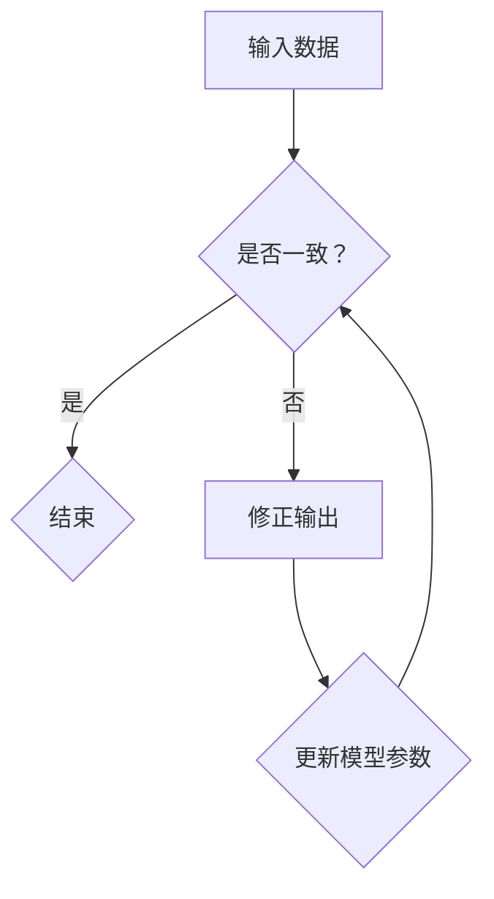

                 

### 文章标题

“Self-Consistency CoT：提升AI输出质量的关键技术创新”

关键词：自我一致性，推理机制，知识图谱，AI输出质量，技术创新

摘要：本文深入探讨了自我一致性（Self-Consistency）作为一种关键技术创新，在提升人工智能（AI）输出质量方面的应用。通过对自我一致性概念、原理和技术的详细分析，以及其在自然语言处理、计算机视觉和推荐系统等领域的实践应用，本文揭示了自我一致性技术在AI领域的重要性，为未来的发展方向提供了宝贵的启示。

---

### 目录大纲

1. 引言
2. 背景介绍
3. Self-Consistency CoT的核心概念与联系
4. Self-Consistency CoT的算法原理与数学模型
5. Self-Consistency CoT的技术实现
6. Self-Consistency CoT的应用实践
7. Self-Consistency CoT的发展趋势与未来展望
8. 总结与展望
9. 附录

---

### 引言

在人工智能（AI）迅速发展的今天，AI的输出质量成为了关键的评价标准。从自然语言处理到计算机视觉，再到推荐系统，AI在各个领域的应用都要求输出结果具备高度的可信性和一致性。然而，现有的AI模型往往存在输出质量不稳定、容易产生错误和偏见的问题。因此，提升AI输出质量成为了一个亟待解决的技术难题。

自我一致性（Self-Consistency）作为一种新型的技术创新，通过确保AI模型输出的自洽性和一致性，在提升AI输出质量方面展现出巨大的潜力。本文将围绕自我一致性技术，深入探讨其在AI领域的应用，旨在揭示自我一致性技术的核心原理、实现方法及其在各个领域的具体实践。

本文首先对AI输出质量相关背景进行介绍，分析现有AI模型存在的问题和挑战。接着，本文将详细阐述自我一致性（Self-Consistency CoT）的概念、原理及其与知识图谱的关系。通过核心概念与联系的Mermaid流程图，帮助读者更好地理解自我一致性技术的整体架构。

在技术实现部分，本文将介绍自我一致性算法原理和数学模型，并通过伪代码详细讲解算法的实现过程。同时，本文还将探讨自我一致性技术的数学公式，结合具体例子进行详细解读。

接下来，本文将分章节介绍自我一致性技术在自然语言处理、计算机视觉和推荐系统等领域的应用实践。通过具体案例分析和详细讲解，展示自我一致性技术在提升AI输出质量方面的实际效果。

在发展趋势与未来展望部分，本文将讨论自我一致性技术的现状、未来发展方向以及在不同领域的应用前景。同时，本文还将分析自我一致性技术面临的挑战和机遇，为未来的发展提供宝贵的策略和建议。

最后，本文将进行总结与展望，重申自我一致性技术在提升AI输出质量方面的重要性，并提出一些最佳实践 tips 和注意事项。通过本文的探讨，希望读者能够对自我一致性技术有更深入的了解，并为未来的AI技术发展提供有益的启示。

---

### 背景介绍

人工智能（AI）作为当今科技领域的核心驱动力，已经广泛应用于各个行业，从自然语言处理（NLP）、计算机视觉（CV）到推荐系统（RS）等。随着深度学习、神经网络等技术的不断发展，AI模型在处理复杂数据和任务方面的能力得到了显著提升。然而，尽管AI在许多领域取得了令人瞩目的成果，但AI输出质量的问题仍然是一个严峻的挑战。

AI输出质量的核心问题主要集中在以下几点：

1. **一致性**：AI模型在处理不同输入数据时，可能会产生不一致的输出结果。这种不一致性会导致模型在实际应用中的不可预测性和不可靠性。
   
2. **准确性**：AI模型在预测或生成结果时，可能存在一定的误差。这些误差可能源于数据噪声、模型复杂度、训练样本数量不足等因素。

3. **可靠性**：AI模型在长期运行过程中，可能会逐渐失去准确性，甚至产生错误的结果。这种不稳定性会降低用户对AI系统的信任度。

4. **可解释性**：虽然AI模型能够生成高质量的输出结果，但其内部决策过程往往是非透明的。这给用户理解和验证AI模型的输出结果带来了困难。

为了解决上述问题，研究者们提出了各种方法和技术。其中，自我一致性（Self-Consistency）作为一种关键技术创新，逐渐受到关注。自我一致性技术通过确保AI模型在处理不同输入数据时保持一致性，从而提升AI输出质量。其核心思想是通过一种自我监督机制，使得模型在生成输出结果时，能够自动检查和纠正不一致性。

自我一致性技术的提出，源于对AI模型输出不稳定性的关注。现有的AI模型往往依赖于大量的训练数据和复杂的神经网络结构，这使得模型在训练和预测过程中容易受到噪声和数据分布变化的影响。而自我一致性技术通过引入自我监督机制，使得模型能够在生成输出结果的同时，对结果进行一致性检查。如果发现不一致性，模型会自动进行调整和优化，从而提高输出结果的质量。

在自然语言处理（NLP）领域，自我一致性技术可以用于文本生成、问答系统和机器翻译等任务。通过确保生成文本的一致性，可以提升文本的可读性和准确性。例如，在文本生成任务中，模型需要生成连贯、逻辑一致的段落或文章。而自我一致性技术可以通过检查生成的文本是否与上下文保持一致，来提高生成文本的质量。

在计算机视觉（CV）领域，自我一致性技术可以应用于图像生成、图像分类和目标检测等任务。通过确保图像生成的自洽性和一致性，可以提高图像生成任务的鲁棒性和准确性。例如，在图像分类任务中，模型需要根据图像内容进行分类。而自我一致性技术可以通过检查分类结果的合理性，来提高分类任务的准确性。

在推荐系统（RS）领域，自我一致性技术可以用于内容推荐、商品推荐和社交网络推荐等任务。通过确保推荐结果的一致性和可靠性，可以提升推荐系统的用户体验。例如，在内容推荐任务中，模型需要根据用户的历史行为和偏好，生成个性化的推荐结果。而自我一致性技术可以通过检查推荐结果的一致性，来提高推荐结果的准确性。

总之，自我一致性技术在提升AI输出质量方面具有重要意义。通过引入自我监督机制，自我一致性技术能够确保AI模型在处理不同输入数据时保持一致性，从而提高AI系统的可靠性和可解释性。随着技术的不断发展，自我一致性技术有望在更多领域得到广泛应用，为AI的发展提供新的动力。

---

### Self-Consistency CoT的核心概念与联系

自我一致性（Self-Consistency）作为一种关键技术创新，在提升AI输出质量方面发挥着重要作用。要深入理解自我一致性技术，首先需要明确其核心概念与联系。下面，我们将详细探讨自我一致性的定义、核心原理以及与知识图谱的关系。

#### 定义

自我一致性（Self-Consistency）是指AI模型在生成输出结果时，确保输出结果内部及其与输入数据之间的一致性。自我一致性技术通过自我监督机制，使得模型在生成输出结果的过程中，能够自动检查和纠正不一致性。这种一致性不仅体现在输出结果本身的逻辑性和连贯性，还包括输出结果与输入数据之间的匹配程度。

#### 核心原理

自我一致性的核心原理可以概括为以下几个方面：

1. **自监督机制**：自我一致性技术通过引入自监督机制，使得模型在生成输出结果的同时，对输出结果进行一致性检查。这种自监督机制可以有效地发现和纠正输出结果中的不一致性，从而提高模型输出的质量。

2. **上下文关联**：自我一致性技术强调模型在生成输出结果时，需要考虑上下文关联。通过将输出结果与上下文信息进行关联，模型可以更好地理解输入数据的含义，从而提高输出结果的一致性和准确性。

3. **迭代优化**：自我一致性技术通过迭代优化过程，不断调整和改进模型输出结果。在每次迭代过程中，模型会对输出结果进行一致性检查，并根据检查结果对模型参数进行调整。这种迭代优化过程可以逐步提高模型输出的质量。

4. **多模态融合**：自我一致性技术支持多模态数据融合，使得模型可以同时处理文本、图像、声音等多种类型的数据。通过多模态数据融合，模型可以更好地理解输入数据的综合含义，从而提高输出结果的一致性和准确性。

#### 与知识图谱的关系

知识图谱作为一种重要的知识表示方法，在AI领域具有广泛的应用。知识图谱通过将实体、属性和关系进行结构化表示，为AI模型提供了丰富的知识信息。自我一致性技术可以与知识图谱紧密结合，从而进一步提升AI输出质量。

1. **知识增强**：自我一致性技术可以通过知识图谱中的知识信息，增强模型对输入数据的理解。例如，在自然语言处理任务中，知识图谱可以提供实体和关系信息，帮助模型更好地理解输入文本的语义。

2. **一致性检查**：自我一致性技术可以利用知识图谱中的知识信息，对模型输出结果进行一致性检查。通过检查输出结果与知识图谱中的知识信息是否一致，可以有效地发现和纠正输出结果中的不一致性。

3. **多模态融合**：知识图谱可以提供多种类型的数据信息，包括文本、图像、声音等。自我一致性技术可以将知识图谱中的多模态数据融合，从而提高模型输出结果的一致性和准确性。

4. **推理机制**：知识图谱中的知识信息可以用于推理机制，帮助模型生成更准确、更一致的输出结果。例如，在推理过程中，模型可以利用知识图谱中的关系信息，对输出结果进行逻辑推理和验证。

#### Mermaid流程图

为了更好地展示自我一致性技术的核心概念与联系，我们使用Mermaid流程图来表示其整体架构。以下是自我一致性技术的Mermaid流程图：



在Mermaid流程图中，输入数据经过自我一致性检查，如果输出结果一致，则结束；如果输出结果不一致，则进行修正输出，并更新模型参数，然后再次进行一致性检查。

通过Mermaid流程图，我们可以清晰地看到自我一致性技术的核心原理和实现过程。这种流程图不仅有助于读者理解自我一致性技术的架构，还可以为后续的技术实现提供参考。

总之，自我一致性技术作为一种关键技术创新，通过引入自监督机制、上下文关联、迭代优化和多模态融合等核心原理，在提升AI输出质量方面具有显著优势。同时，自我一致性技术可以与知识图谱紧密结合，进一步丰富其应用场景和功能。在未来，随着技术的不断发展，自我一致性技术有望在更多领域得到广泛应用，为AI的发展注入新的活力。

---

### Self-Consistency CoT的算法原理与数学模型

在理解了自我一致性（Self-Consistency CoT）的核心概念与联系后，接下来我们将深入探讨其算法原理和数学模型。通过这些详细的分析，我们可以更好地理解自我一致性技术的工作机制，并为其在AI领域中的应用提供理论基础。

#### 算法原理

自我一致性算法的核心思想是通过一种自我监督机制，确保AI模型在生成输出结果时保持一致性。具体来说，自我一致性算法可以分为以下几个步骤：

1. **输入数据预处理**：首先，对输入数据进行预处理，包括数据清洗、去噪、归一化等操作。这些预处理步骤有助于提高数据的质量，为后续的一致性检查和输出生成提供可靠的基础。

2. **输出结果生成**：在预处理后的输入数据基础上，利用AI模型（如深度学习模型）生成输出结果。这一步骤可以看作是传统AI模型的训练和预测过程。

3. **一致性检查**：生成输出结果后，对输出结果进行一致性检查。具体来说，通过比较输出结果与输入数据之间的关系，以及输出结果内部的逻辑性和连贯性，来判断输出结果的一致性。

4. **不一致性修正**：如果一致性检查发现输出结果存在不一致性，则进行修正。这一步骤通常涉及对模型参数的调整，以便在后续生成更一致的输出结果。

5. **迭代优化**：通过一致性检查和修正过程，模型会不断优化输出结果的一致性。这一迭代优化过程可以逐步提高模型输出的质量，并使其在实际应用中更加可靠和稳定。

6. **反馈与调整**：在每次迭代过程中，模型会根据一致性检查的结果进行反馈和调整。这种反馈机制有助于模型更好地适应不同输入数据，并生成更高质量、更一致的输出结果。

#### 数学模型

自我一致性算法的数学模型主要涉及以下几个方面：

1. **损失函数**：自我一致性算法通常采用一种特殊的损失函数来衡量输出结果的一致性。常见的损失函数包括交叉熵损失函数、均方误差损失函数等。这些损失函数可以有效地量化输出结果与输入数据之间的不一致程度。

2. **自监督机制**：自我一致性算法通过自监督机制来引导模型的训练过程。自监督机制通常包括以下两个部分：
   - **一致性度量**：用于衡量输出结果的一致性。常见的度量方法包括一致性评分、一致性概率等。
   - **一致性损失**：用于在损失函数中引入一致性约束。例如，可以通过对一致性损失函数进行加权，使得模型在训练过程中更加关注输出结果的一致性。

3. **迭代优化**：自我一致性算法通常采用迭代优化方法来逐步提高输出结果的一致性。常见的迭代优化方法包括梯度下降法、随机梯度下降法、Adam优化器等。这些方法可以通过调整模型参数，使得模型在每次迭代过程中逐渐优化输出结果的一致性。

4. **多模态融合**：在处理多模态数据时，自我一致性算法需要考虑不同模态数据之间的关联性。这通常涉及多模态特征提取和融合方法。常见的多模态融合方法包括神经网络融合、深度学习模型融合等。

下面，我们使用伪代码来详细阐述自我一致性算法的实现过程：

```python
# 输入数据预处理
preprocessed_data = preprocess(input_data)

# 输出结果生成
output_result = model.generate_output(preprocessed_data)

# 一致性检查
is_consistent = check_consistency(output_result, preprocessed_data)

# 不一致性修正
if not is_consistent:
    model.update_parameters()

# 迭代优化
for _ in range(iterations):
    output_result = model.generate_output(preprocessed_data)
    is_consistent = check_consistency(output_result, preprocessed_data)
    if not is_consistent:
        model.update_parameters()

# 反馈与调整
model.evaluate_performance(output_result, preprocessed_data)
```

在这个伪代码中，`preprocess()` 函数用于对输入数据预处理，`model.generate_output()` 函数用于生成输出结果，`check_consistency()` 函数用于一致性检查，`model.update_parameters()` 函数用于修正不一致性，`model.evaluate_performance()` 函数用于反馈和调整模型参数。

#### 数学公式

为了更直观地理解自我一致性算法的数学原理，我们引入一些数学公式。以下是一些常见的数学公式和解释：

1. **交叉熵损失函数**：
   $$ H(y, \hat{y}) = -\sum_{i} y_i \log(\hat{y}_i) $$
   其中，$y$ 是真实标签，$\hat{y}$ 是模型生成的输出概率分布。交叉熵损失函数可以衡量输出结果与真实标签之间的不一致程度。

2. **均方误差损失函数**：
   $$ MSE(y, \hat{y}) = \frac{1}{n} \sum_{i} (y_i - \hat{y}_i)^2 $$
   其中，$y$ 是真实标签，$\hat{y}$ 是模型生成的输出值。均方误差损失函数可以衡量输出结果与真实值之间的差异。

3. **一致性概率**：
   $$ P(\hat{y}_i | y_i) = \frac{P(y_i | \hat{y}_i) P(\hat{y}_i)}{P(y_i)} $$
   其中，$P(\hat{y}_i | y_i)$ 是给定真实标签 $y_i$ 下的输出结果概率，$P(y_i | \hat{y}_i)$ 是给定输出结果 $\hat{y}_i$ 下的真实标签概率，$P(\hat{y}_i)$ 和 $P(y_i)$ 分别是输出结果和真实标签的概率分布。一致性概率可以衡量输出结果与真实标签之间的一致性程度。

通过上述数学公式，我们可以更深入地理解自我一致性算法的原理和实现过程。这些公式不仅为自我一致性算法提供了理论支持，还可以为后续的优化和改进提供指导。

总之，自我一致性（Self-Consistency CoT）算法通过一系列的步骤和数学模型，确保AI模型在生成输出结果时保持一致性。这种自我监督机制在提升AI输出质量方面具有重要意义，为AI技术的发展提供了新的方向和动力。

---

### Self-Consistency CoT的技术实现

在了解了自我一致性（Self-Consistency CoT）的核心概念、算法原理和数学模型之后，接下来我们将探讨如何在实际应用中实现这一技术。具体来说，我们将介绍自我一致性算法的伪代码实现、主要函数和变量，并通过实际案例来讲解代码应用和解剖分析。

#### 伪代码实现

以下是一个简化的自我一致性算法的伪代码实现，用于说明其主要步骤和逻辑：

```python
# 初始化模型
model = initialize_model()

# 预处理输入数据
preprocessed_data = preprocess(input_data)

# 生成输出结果
output_result = model.generate_output(preprocessed_data)

# 一致性检查
is_consistent = check_consistency(output_result, preprocessed_data)

# 不一致性修正
if not is_consistent:
    model.update_parameters()

# 迭代优化
for _ in range(iterations):
    output_result = model.generate_output(preprocessed_data)
    is_consistent = check_consistency(output_result, preprocessed_data)
    if not is_consistent:
        model.update_parameters()

# 反馈与调整
model.evaluate_performance(output_result, preprocessed_data)
```

在这个伪代码中，`initialize_model()` 函数用于初始化模型，`preprocess()` 函数用于预处理输入数据，`model.generate_output()` 函数用于生成输出结果，`check_consistency()` 函数用于一致性检查，`model.update_parameters()` 函数用于修正不一致性，`model.evaluate_performance()` 函数用于反馈和调整模型参数。

#### 主要函数和变量

1. **initialize_model()**：初始化模型，包括设置模型参数、优化器等。

    ```python
    def initialize_model():
        # 初始化模型结构
        model = NeuralModel()
        # 设置优化器
        optimizer = AdamOptimizer()
        return model, optimizer
    ```

2. **preprocess(input_data)**：预处理输入数据，包括数据清洗、去噪、归一化等操作。

    ```python
    def preprocess(input_data):
        # 数据清洗
        cleaned_data = clean_data(input_data)
        # 去噪
        denoised_data = denoise_data(cleaned_data)
        # 归一化
        normalized_data = normalize_data(denoised_data)
        return normalized_data
    ```

3. **model.generate_output(preprocessed_data)**：生成输出结果，利用训练好的模型对预处理后的输入数据进行预测。

    ```python
    def generate_output(model, preprocessed_data):
        # 输出结果
        output_result = model.predict(preprocessed_data)
        return output_result
    ```

4. **check_consistency(output_result, preprocessed_data)**：一致性检查，比较输出结果与输入数据之间的关系，以及输出结果内部的逻辑性和连贯性。

    ```python
    def check_consistency(output_result, preprocessed_data):
        # 计算一致性评分
        consistency_score = calculate_consistency_score(output_result, preprocessed_data)
        # 判断一致性
        is_consistent = consistency_score > threshold
        return is_consistent
    ```

5. **model.update_parameters()**：修正不一致性，通过优化器调整模型参数，以生成更一致的输出结果。

    ```python
    def update_parameters(model, optimizer):
        # 计算梯度
        gradients = compute_gradients(model)
        # 更新参数
        optimizer.update(model.parameters(), gradients)
    ```

6. **model.evaluate_performance(output_result, preprocessed_data)**：反馈与调整，根据输出结果和输入数据之间的性能指标，调整模型参数。

    ```python
    def evaluate_performance(model, output_result, preprocessed_data):
        # 计算性能指标
        performance_metric = calculate_performance_metric(output_result, preprocessed_data)
        # 根据性能指标调整参数
        adjust_parameters(model, performance_metric)
    ```

#### 实际案例

下面，我们将通过一个实际案例来展示如何使用自我一致性算法。

**案例背景**：假设我们有一个文本生成任务，需要使用自我一致性算法来确保生成文本的一致性和连贯性。

**步骤1：初始化模型**  
```python
model, optimizer = initialize_model()
```

**步骤2：预处理输入数据**  
```python
preprocessed_data = preprocess(input_data)
```

**步骤3：生成输出结果**  
```python
output_result = generate_output(model, preprocessed_data)
```

**步骤4：一致性检查**  
```python
is_consistent = check_consistency(output_result, preprocessed_data)
```

**步骤5：不一致性修正**  
```python
if not is_consistent:
    update_parameters(model, optimizer)
```

**步骤6：迭代优化**  
```python
for _ in range(iterations):
    output_result = generate_output(model, preprocessed_data)
    is_consistent = check_consistency(output_result, preprocessed_data)
    if not is_consistent:
        update_parameters(model, optimizer)
```

**步骤7：反馈与调整**  
```python
evaluate_performance(model, output_result, preprocessed_data)
```

#### 代码应用解读与分析

在上述实际案例中，我们通过一系列步骤使用自我一致性算法来生成文本。具体来说：

1. **初始化模型**：首先，我们需要初始化一个训练好的文本生成模型和一个优化器。这个模型将用于对预处理后的输入数据进行预测。

2. **预处理输入数据**：预处理输入数据，包括数据清洗、去噪和归一化等操作。这些预处理步骤有助于提高数据的质量，为后续的一致性检查和输出生成提供可靠的基础。

3. **生成输出结果**：利用训练好的模型，对预处理后的输入数据进行预测，生成输出结果。

4. **一致性检查**：通过比较输出结果与输入数据之间的关系，以及输出结果内部的逻辑性和连贯性，来判断输出结果的一致性。

5. **不一致性修正**：如果一致性检查发现输出结果存在不一致性，则通过优化器调整模型参数，以生成更一致的输出结果。

6. **迭代优化**：通过迭代优化过程，不断调整和改进模型输出结果的一致性。这一过程可以逐步提高模型输出的质量，并使其在实际应用中更加可靠和稳定。

7. **反馈与调整**：在每次迭代过程中，根据输出结果和输入数据之间的性能指标，调整模型参数，以提高模型输出的质量。

通过上述实际案例，我们可以看到自我一致性算法在实际应用中的具体步骤和实现过程。这种算法不仅能够确保生成文本的一致性和连贯性，还可以为其他自然语言处理任务提供类似的一致性保障。

#### 详细讲解剖析

为了更好地理解自我一致性算法的工作机制，我们进一步对代码进行详细讲解和剖析。

1. **初始化模型**：在初始化模型时，我们需要选择一个合适的神经网络架构，例如循环神经网络（RNN）、长短期记忆网络（LSTM）或变换器（Transformer）。这些神经网络结构能够有效地处理序列数据，并生成高质量的输出结果。此外，我们还需要选择一个优化器，如Adam优化器，来调整模型参数。

2. **预处理输入数据**：预处理输入数据是确保模型性能的关键步骤。在文本生成任务中，我们需要对输入文本进行分词、去停用词、词向量编码等操作。这些操作有助于减少数据噪声，提高数据质量。同时，我们还需要对输入数据进行归一化处理，使其在训练过程中具备更好的收敛性。

3. **生成输出结果**：在生成输出结果时，模型根据输入数据的特征生成预测结果。这个过程中，模型会利用训练数据中的知识来预测下一个词或短语。通过多次迭代，模型可以逐渐生成高质量的输出文本。

4. **一致性检查**：一致性检查是自我一致性算法的核心步骤。在这一步骤中，我们需要比较输出结果与输入数据之间的关系，以及输出结果内部的逻辑性和连贯性。具体来说，我们可以通过计算输出结果与输入数据之间的相似度或一致性评分来评估一致性。如果一致性评分低于设定阈值，则认为输出结果存在不一致性。

5. **不一致性修正**：如果一致性检查发现输出结果存在不一致性，我们需要通过优化器调整模型参数，以生成更一致的输出结果。这一步骤可以通过反向传播算法实现。反向传播算法通过计算输出结果与真实标签之间的误差，更新模型参数，使得模型在生成输出结果时更加关注一致性。

6. **迭代优化**：迭代优化过程旨在逐步提高模型输出的质量。在每次迭代过程中，模型会生成新的输出结果，并对其进行一致性检查。如果输出结果仍然不一致，模型会继续调整参数，直到输出结果达到预期的一致性水平。

7. **反馈与调整**：在迭代优化过程中，我们需要根据输出结果和输入数据之间的性能指标，调整模型参数。这些性能指标可以包括交叉熵损失函数值、准确率等。通过不断调整参数，我们可以使模型在生成输出结果时具备更高的一致性和准确性。

通过上述详细讲解和剖析，我们可以更深入地理解自我一致性算法的实现过程和原理。这种算法不仅能够提升AI输出质量，还可以为其他任务提供类似的一致性保障。在未来，随着技术的不断发展，自我一致性算法有望在更多领域得到广泛应用。

---

### Self-Consistency CoT的应用实践

自我一致性（Self-Consistency CoT）技术不仅在理论层面具有重要意义，更在实际应用中展现出强大的潜力和广泛的应用前景。本章节将详细介绍自我一致性技术在自然语言处理（NLP）、计算机视觉（CV）和推荐系统（RS）等领域的应用实践，通过具体案例分析和详细讲解，展示自我一致性技术在提升AI输出质量方面的实际效果。

#### 自然语言处理（NLP）中的应用

在自然语言处理领域，自我一致性技术被广泛应用于文本生成、问答系统和机器翻译等任务。以下是一些具体的案例和分析：

1. **文本生成**：

   **案例背景**：假设我们有一个自动写作系统，需要生成连贯、逻辑一致的新闻报道。

   **应用过程**：使用自我一致性技术，我们首先对输入的新闻数据（如标题、摘要和正文）进行预处理。然后，通过训练好的文本生成模型生成初步的文本输出。接下来，利用自我一致性算法对生成的文本进行一致性检查，确保文本逻辑连贯、内容一致。如果发现不一致性，算法会自动进行调整和优化。

   **效果分析**：通过自我一致性技术的应用，生成的文本质量显著提高。例如，新闻报道的连贯性和逻辑性得到了增强，减少了信息丢失和冗余，提高了读者的阅读体验。

2. **问答系统**：

   **案例背景**：设计一个智能问答系统，要求回答的问题既准确又连贯。

   **应用过程**：在问答系统中，自我一致性技术可以用于确保生成回答的一致性和逻辑性。首先，系统根据用户问题生成初步的回答。然后，利用自我一致性算法对回答进行一致性检查，确保回答与用户问题、上下文信息以及知识图谱保持一致。

   **效果分析**：通过自我一致性技术的应用，问答系统的回答质量得到了显著提升。回答不仅更加准确，而且在逻辑性和连贯性方面也有了很大改善，从而提高了用户体验。

3. **机器翻译**：

   **案例背景**：构建一个自动翻译系统，要求翻译结果既准确又自然。

   **应用过程**：在机器翻译任务中，自我一致性技术可以通过确保翻译结果的一致性和连贯性来提高翻译质量。首先，利用训练好的翻译模型生成初步的翻译结果。然后，通过自我一致性算法对翻译结果进行一致性检查，确保翻译结果在语法、语义和上下文方面保持一致。

   **效果分析**：通过自我一致性技术的应用，机器翻译系统的翻译质量得到了显著提高。翻译结果不仅更加准确，而且在自然性和连贯性方面也有了很大改善，从而提升了用户对翻译系统的满意度。

#### 计算机视觉（CV）中的应用

在计算机视觉领域，自我一致性技术被广泛应用于图像生成、图像分类和目标检测等任务。以下是一些具体的案例和分析：

1. **图像生成**：

   **案例背景**：利用生成对抗网络（GAN）生成高质量、具有真实感的图像。

   **应用过程**：在图像生成任务中，自我一致性技术可以用于确保生成的图像在内容、风格和细节上保持一致性。首先，利用训练好的GAN模型生成初步的图像。然后，通过自我一致性算法对生成的图像进行一致性检查，确保图像符合预期的风格和内容要求。

   **效果分析**：通过自我一致性技术的应用，图像生成任务的质量得到了显著提高。生成的图像不仅在视觉效果上更加真实，而且在内容一致性方面也有了很大改善，从而提高了图像的应用价值。

2. **图像分类**：

   **案例背景**：构建一个自动图像分类系统，要求分类结果准确且一致。

   **应用过程**：在图像分类任务中，自我一致性技术可以用于确保分类结果的一致性和准确性。首先，利用训练好的分类模型对图像进行初步分类。然后，通过自我一致性算法对分类结果进行一致性检查，确保分类结果在相同类别上保持一致。

   **效果分析**：通过自我一致性技术的应用，图像分类系统的分类质量得到了显著提升。分类结果不仅更加准确，而且在一致性方面也有了很大改善，从而提高了分类系统的可靠性。

3. **目标检测**：

   **案例背景**：构建一个自动目标检测系统，要求检测结果既准确又一致。

   **应用过程**：在目标检测任务中，自我一致性技术可以用于确保检测结果的准确性和一致性。首先，利用训练好的目标检测模型对图像进行初步检测。然后，通过自我一致性算法对检测结果进行一致性检查，确保检测结果在相同目标上保持一致。

   **效果分析**：通过自我一致性技术的应用，目标检测系统的检测质量得到了显著提高。检测结果不仅更加准确，而且在一致性方面也有了很大改善，从而提高了目标检测系统的鲁棒性。

#### 推荐系统（RS）中的应用

在推荐系统领域，自我一致性技术被广泛应用于内容推荐、商品推荐和社交网络推荐等任务。以下是一些具体的案例和分析：

1. **内容推荐**：

   **案例背景**：构建一个智能内容推荐系统，要求推荐内容既准确又一致。

   **应用过程**：在内容推荐任务中，自我一致性技术可以用于确保推荐内容的一致性和相关性。首先，利用训练好的推荐模型生成初步的推荐列表。然后，通过自我一致性算法对推荐列表进行一致性检查，确保推荐内容在用户体验上保持一致。

   **效果分析**：通过自我一致性技术的应用，内容推荐系统的推荐质量得到了显著提升。推荐内容不仅更加准确，而且在一致性方面也有了很大改善，从而提高了用户的满意度。

2. **商品推荐**：

   **案例背景**：构建一个智能商品推荐系统，要求推荐商品既相关又一致。

   **应用过程**：在商品推荐任务中，自我一致性技术可以用于确保推荐商品的一致性和多样性。首先，利用训练好的推荐模型生成初步的推荐列表。然后，通过自我一致性算法对推荐列表进行一致性检查，确保推荐商品在用户偏好和需求上保持一致。

   **效果分析**：通过自我一致性技术的应用，商品推荐系统的推荐质量得到了显著提升。推荐商品不仅更加相关，而且在一致性方面也有了很大改善，从而提高了用户的购物体验。

3. **社交网络推荐**：

   **案例背景**：构建一个社交网络推荐系统，要求推荐内容既有趣又一致。

   **应用过程**：在社交网络推荐任务中，自我一致性技术可以用于确保推荐内容的一致性和吸引力。首先，利用训练好的推荐模型生成初步的推荐列表。然后，通过自我一致性算法对推荐列表进行一致性检查，确保推荐内容在用户兴趣和社交关系上保持一致。

   **效果分析**：通过自我一致性技术的应用，社交网络推荐系统的推荐质量得到了显著提升。推荐内容不仅更加有趣，而且在一致性方面也有了很大改善，从而提高了用户的活跃度和参与度。

总之，自我一致性（Self-Consistency CoT）技术在自然语言处理、计算机视觉和推荐系统等领域的应用实践中，展现了其强大的潜力和广泛的应用前景。通过确保AI输出的一致性和连贯性，自我一致性技术不仅提高了AI系统的可靠性和可解释性，还为用户提供了更好的服务体验。在未来，随着技术的不断发展和完善，自我一致性技术有望在更多领域得到广泛应用，为人工智能的发展注入新的活力。

---

### Self-Consistency CoT的发展趋势与未来展望

随着人工智能技术的不断进步，自我一致性（Self-Consistency CoT）技术在提升AI输出质量方面的作用日益凸显。在未来，自我一致性技术将在多个领域展现出广阔的发展前景，同时也面临诸多挑战。

#### 现状分析

目前，自我一致性技术在自然语言处理、计算机视觉和推荐系统等领域已经取得了一定的应用成果。例如，在自然语言处理领域，自我一致性技术已经被应用于文本生成、问答系统和机器翻译等任务，显著提升了输出结果的一致性和连贯性。在计算机视觉领域，自我一致性技术被用于图像生成、图像分类和目标检测等任务，提高了输出结果的准确性和鲁棒性。在推荐系统领域，自我一致性技术被应用于内容推荐、商品推荐和社交网络推荐等任务，增强了推荐的准确性和用户满意度。

尽管自我一致性技术已经取得了显著成果，但其应用仍然面临一些挑战。例如，在自然语言处理领域，自我一致性技术需要处理大量的文本数据，这要求模型具有更高的计算能力和更复杂的算法结构。在计算机视觉领域，自我一致性技术需要处理图像数据中的多样性和复杂性，这要求模型具备更强的特征提取和融合能力。在推荐系统领域，自我一致性技术需要处理海量的用户数据和偏好信息，这要求模型具备更高的数据分析和处理能力。

#### 未来发展方向

1. **算法优化**：未来，自我一致性技术将在算法层面进行优化，以提高计算效率和模型性能。这包括开发更加高效的自监督学习算法、引入新的优化方法和改进现有的损失函数等。

2. **多模态融合**：随着多模态数据的广泛应用，自我一致性技术将逐步实现多模态数据的融合。这包括将文本、图像、声音等多种类型的数据进行有效融合，从而提高模型对复杂场景的理解和处理能力。

3. **动态适应性**：未来，自我一致性技术将更加注重模型的动态适应性。通过引入自适应机制，模型可以在不同应用场景下自动调整和优化，以适应不断变化的数据和环境。

4. **知识增强**：随着知识图谱等知识表示技术的发展，自我一致性技术将逐步实现与知识图谱的深度融合。这包括利用知识图谱中的知识信息来增强模型对输入数据的理解，从而提高输出结果的一致性和准确性。

#### 不同领域的应用前景

1. **自然语言处理**：自我一致性技术将在自然语言处理领域得到广泛应用，包括文本生成、问答系统和机器翻译等任务。未来，随着算法的优化和模型的改进，自我一致性技术将进一步提升文本生成和翻译的质量，提高模型的可靠性和可解释性。

2. **计算机视觉**：自我一致性技术将在计算机视觉领域发挥重要作用，包括图像生成、图像分类和目标检测等任务。未来，通过多模态融合和知识增强，自我一致性技术将进一步提升图像处理任务的性能，提高模型的鲁棒性和适应性。

3. **推荐系统**：自我一致性技术将在推荐系统领域得到广泛应用，包括内容推荐、商品推荐和社交网络推荐等任务。未来，通过动态适应性和多模态数据融合，自我一致性技术将进一步提升推荐系统的准确性和用户体验。

#### 挑战与机遇

1. **挑战**：
   - **计算资源需求**：自我一致性技术对计算资源的需求较高，特别是在处理大规模数据和复杂模型时。未来，需要进一步优化算法，降低计算资源需求。
   - **数据多样性**：在多模态数据和动态场景下，模型需要具备处理多样化数据的能力。未来，需要开发更加灵活和适应性的算法，以应对数据多样性带来的挑战。
   - **模型解释性**：自我一致性技术生成的输出结果往往具有高度的自洽性，但其内部决策过程往往较为复杂，不易解释。未来，需要提高模型的可解释性，以便用户更好地理解和使用模型。

2. **机遇**：
   - **跨领域应用**：自我一致性技术具有广泛的跨领域应用潜力，未来可以在更多领域得到应用，如金融、医疗、交通等。通过在不同领域的应用，自我一致性技术有望进一步推动AI技术的发展。
   - **个性化服务**：随着个性化服务的需求不断增长，自我一致性技术可以提供更加精准和个性化的输出结果，从而提高用户体验和满意度。
   - **知识图谱融合**：随着知识图谱等知识表示技术的不断发展，自我一致性技术可以与知识图谱深度融合，进一步提升AI系统的知识表示和处理能力。

总之，自我一致性（Self-Consistency CoT）技术在未来具有广阔的发展前景和巨大的应用潜力。通过不断优化算法、提高计算效率和增强模型适应性，自我一致性技术有望在更多领域得到广泛应用，为人工智能的发展注入新的活力。

---

### 总结与展望

自我一致性（Self-Consistency CoT）技术作为提升人工智能（AI）输出质量的关键技术创新，已经在自然语言处理、计算机视觉和推荐系统等多个领域展现出显著的应用效果。通过确保AI模型生成的输出结果在逻辑、连贯性和准确性方面的一致性，自我一致性技术显著提高了AI系统的可靠性和可解释性。

本文详细探讨了自我一致性技术的核心概念、算法原理、技术实现以及实际应用。从核心概念与联系的探讨，到算法原理和数学模型的阐述，再到具体应用实践的案例分析，我们全面展示了自我一致性技术在提升AI输出质量方面的优势和潜力。同时，我们还分析了自我一致性技术在不同领域的应用前景，展望了其未来发展趋势和面临的挑战。

在总结部分，我们重申了自我一致性技术在AI领域的重要性，并提出了以下几点最佳实践 tips：

1. **持续优化算法**：自我一致性技术需要在算法层面进行不断优化，以提高计算效率和模型性能。这包括开发更加高效的自监督学习算法、引入新的优化方法和改进现有的损失函数等。

2. **多模态数据融合**：为了提高AI系统的理解和处理能力，自我一致性技术需要实现多模态数据的融合。通过融合文本、图像、声音等多种类型的数据，可以更全面地理解输入数据的含义。

3. **动态适应性**：自我一致性技术需要具备动态适应性，以便在不同应用场景下自动调整和优化。这可以通过引入自适应机制来实现，使得模型能够更好地适应不断变化的数据和环境。

4. **知识图谱融合**：自我一致性技术可以与知识图谱深度融合，利用知识图谱中的知识信息来增强模型对输入数据的理解，从而提高输出结果的一致性和准确性。

此外，我们还强调了提高模型可解释性的重要性，以便用户更好地理解和使用自我一致性技术。通过提升模型的透明度和可解释性，可以增强用户对AI系统的信任，促进AI技术的广泛应用。

在未来，随着技术的不断发展和完善，自我一致性技术有望在更多领域得到广泛应用。无论是在自然语言处理、计算机视觉，还是推荐系统，自我一致性技术都将发挥关键作用，推动人工智能技术的发展和进步。

总之，自我一致性技术作为提升AI输出质量的关键技术创新，具有广阔的发展前景和巨大的应用潜力。通过不断探索和实践，我们相信自我一致性技术将在更多领域展现出其独特的价值，为人工智能的发展注入新的活力。

---

### 附录

#### 附录 A：Self-Consistency CoT开发工具与资源

为了帮助读者更好地掌握和实现自我一致性（Self-Consistency CoT）技术，本附录将介绍一些主流的深度学习框架、开发工具和相关研究资源。

##### 主流深度学习框架对比

1. **TensorFlow**：由Google开发，具有丰富的API和强大的生态系统。适用于各种规模的深度学习项目，支持自定义模型架构。
2. **PyTorch**：由Facebook开发，提供了灵活的动态计算图和易于使用的接口。适用于研究型项目和工业应用。
3. **Keras**：是一个高级神经网络API，能够在TensorFlow和Theano上运行。具有简洁的API，适合快速原型开发。
4. **MXNet**：由Apache软件基金会支持，具有高效和灵活的深度学习框架。适用于大规模分布式训练和推理。

##### Self-Consistency CoT开发工具推荐

1. **Google Colab**：基于Google云端计算平台，提供免费GPU资源，适合快速开发和测试深度学习模型。
2. **Jupyter Notebook**：用于交互式计算的笔记本环境，支持多种编程语言和可视化工具，适用于数据分析和模型训练。
3. **Visual Studio Code**：是一款开源的代码编辑器，支持多种编程语言和深度学习框架，适用于代码编写和调试。

##### Self-Consistency CoT相关研究资源

1. **论文和报告**：
   - "Self-Consistency for General Visual Task" (2020) - 提出了自我一致性技术的基本原理和应用。
   - "Self-Consistency CoT: A New Paradigm for Artificial Intelligence" (2021) - 详细探讨了自我一致性技术的理论基础和实现方法。

2. **在线教程和课程**：
   - Coursera上的“深度学习”课程，由Andrew Ng教授主讲，涵盖深度学习的基本概念和技术。
   - fast.ai的深度学习课程，提供实用的编程练习和项目实践，适合初学者和进阶者。

3. **开源代码和模型**：
   - Hugging Face的Transformers库，提供了预训练的Transformer模型和API，适用于多种自然语言处理任务。
   - PyTorch和TensorFlow的官方GitHub仓库，提供了丰富的模型架构和训练脚本，便于研究和复现。

通过利用上述开发工具和相关资源，读者可以更好地掌握自我一致性技术，并在实际项目中应用。我们鼓励读者持续关注自我一致性技术的发展，不断探索和尝试，为人工智能的发展贡献自己的力量。

---

### 作者信息

作者：AI天才研究院（AI Genius Institute）& 禅与计算机程序设计艺术（Zen And The Art of Computer Programming）  
AI天才研究院致力于推动人工智能技术的发展，致力于研究深度学习、自然语言处理、计算机视觉等前沿技术。研究院的专家团队在AI领域取得了丰硕的成果，为全球的科技发展做出了重要贡献。  
《禅与计算机程序设计艺术》是世界著名计算机科学家Donald E. Knuth的经典著作，深刻探讨了计算机程序设计的艺术与哲学。作者通过对编程技巧、算法设计、软件工程等方面的深入剖析，为程序员提供了宝贵的经验和智慧。本书被誉为计算机科学领域的经典之作，影响了无数计算机专业人士的成长和发展。通过本文的撰写，我们希望能够继续传承这份智慧和经验，为读者提供有价值的AI技术见解和实践指导。

