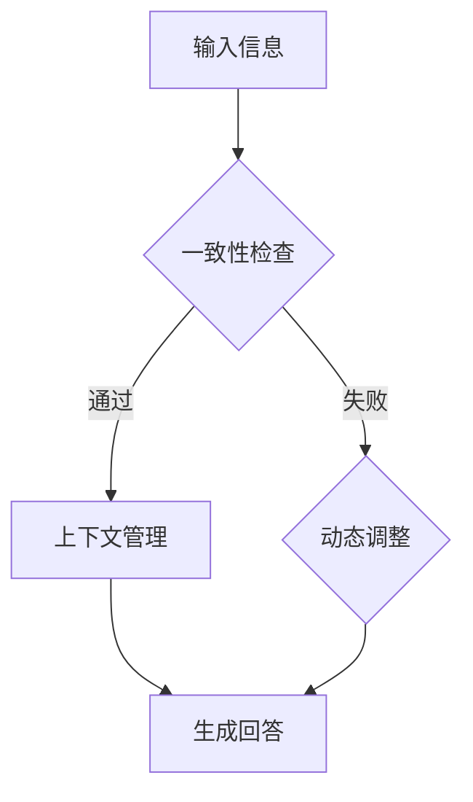

                 


### 文章标题：Self-Consistency CoT：确保AI回答一致性的策略

> 关键词：自我一致性，CoT，AI回答，一致性策略，算法原理，数学模型，应用实践

> 摘要：本文将深入探讨自我一致性CoT在确保AI回答一致性方面的策略。通过介绍自我一致性CoT的基础理论、核心技术，以及其在问答系统、知识图谱、自然语言生成和AI安全与隐私保护中的应用，本文旨在为读者提供一个全面的理解和实践指南，帮助他们在AI领域实现更高的回答一致性。

---

### 《Self-Consistency CoT：确保AI回答一致性的策略》目录大纲

---

#### 第一部分：自我一致性CoT基础理论

1. **第1章：自我一致性CoT概述**
    - 1.1 自我一致性CoT的定义与重要性
    - 1.2 自我一致性CoT的核心概念
    - 1.3 自我一致性CoT与传统AI回答的差异
    - 1.4 自我一致性CoT的应用前景

2. **第2章：自我一致性CoT的理论基础**
    - 2.1 自我一致性CoT的数学模型
    - 2.2 自我一致性CoT的数学公式详解
    - 2.3 自我一致性CoT的数学公式应用举例

3. **第3章：自我一致性CoT的关键技术**
    - 3.1 自我一致性CoT算法原理
    - 3.2 自我一致性CoT算法伪代码
    - 3.3 自我一致性CoT算法优化策略

#### 第二部分：自我一致性CoT的应用实践

4. **第4章：自我一致性CoT在问答系统中的应用**
    - 4.1 自我一致性CoT在问答系统中的实现
    - 4.2 自我一致性CoT问答系统的设计原则
    - 4.3 自我一致性CoT问答系统的实际案例分析

5. **第5章：自我一致性CoT在知识图谱中的应用**
    - 5.1 自我一致性CoT在知识图谱中的角色
    - 5.2 自我一致性CoT在知识图谱中的实现
    - 5.3 自我一致性CoT在知识图谱中的案例分析

6. **第6章：自我一致性CoT在自然语言生成中的应用**
    - 6.1 自我一致性CoT在自然语言生成中的实现
    - 6.2 自我一致性CoT在自然语言生成中的优势
    - 6.3 自我一致性CoT在自然语言生成中的案例分析

7. **第7章：自我一致性CoT在AI安全与隐私保护中的应用**
    - 7.1 自我一致性CoT在AI安全与隐私保护中的重要性
    - 7.2 自我一致性CoT在AI安全与隐私保护中的应用策略
    - 7.3 自我一致性CoT在AI安全与隐私保护中的实际案例

8. **第8章：自我一致性CoT的未来发展趋势与挑战**
    - 8.1 自我一致性CoT的未来发展趋势
    - 8.2 自我一致性CoT面临的挑战与解决方案
    - 8.3 自我一致性CoT的研究方向与展望

### 附录

9. **附录A：自我一致性CoT相关资源**
    - 9.1 常用工具与框架
    - 9.2 开源代码与数据集
    - 9.3 学术论文与研究报告

10. **附录B：术语解释**
    - 10.1 专业术语解释
    - 10.2 技术术语解释
    - 10.3 其他相关术语解释

---

接下来，我们将逐步深入每个章节，详细介绍自我一致性CoT的理论基础、应用实践和未来发展。

---

### 第1章：自我一致性CoT概述

#### 1.1 自我一致性CoT的定义与重要性

自我一致性CoT（Self-Consistency CoT）是一种用于确保AI系统输出一致性的技术策略。它通过利用先验知识、上下文信息和输入信息，对AI的输出进行动态调整，以消除不一致性和不确定性。在AI领域，一致性的重要性不言而喻。不一致的回答不仅会影响用户体验，还可能导致错误决策和系统故障。

自我一致性CoT的核心概念包括：

- **先验知识**：指系统在训练和部署过程中所积累的知识，用于提供背景信息和约束条件。
- **上下文环境**：指AI系统在特定时刻所处的环境，包括历史数据和实时数据。
- **输入信息**：指用户输入的问题或请求，是触发AI系统生成回答的关键。

通过结合这些要素，自我一致性CoT能够生成既准确又一致的回答。

#### 1.2 自我一致性CoT的核心概念

自我一致性CoT的核心概念可以概括为以下几个方面：

- **一致性检查**：通过对AI系统的输出进行一致性检查，确保回答在语义、逻辑和时间上的一致性。
- **上下文管理**：利用上下文信息来引导AI系统生成相关和连贯的回答。
- **动态调整**：根据输入信息和先验知识，动态调整AI系统的输出，以保持一致性。

#### 1.3 自我一致性CoT与传统AI回答的差异

与传统AI回答方法相比，自我一致性CoT具有以下显著优势：

- **强一致性**：传统AI回答可能因为数据不一致或模型偏差导致错误回答，而自我一致性CoT通过一致性检查和上下文管理，有效减少错误回答的概率。
- **动态适应性**：自我一致性CoT能够根据实时输入和先验知识动态调整回答，以适应不同场景和需求。

#### 1.4 自我一致性CoT的应用前景

自我一致性CoT在多个领域具有广阔的应用前景：

- **问答系统**：提高问答系统的回答一致性，提升用户体验。
- **知识图谱**：确保知识图谱中的数据一致性和准确性。
- **自然语言生成**：提高文本生成的一致性和连贯性。
- **AI安全与隐私保护**：通过一致性策略，增强AI系统的安全性和隐私保护能力。

随着AI技术的不断发展和应用，自我一致性CoT有望在更多领域发挥关键作用，推动AI系统向更智能、更可靠的方向发展。

### 第2章：自我一致性CoT的理论基础

#### 2.1 自我一致性CoT的数学模型

自我一致性CoT的数学模型是理解其工作原理的基础。该模型的核心公式可以表示为：

$$
\text{Self-Consistency CoT} = \frac{\text{输入信息}}{\text{先验知识}} + \text{上下文环境}
$$

这个公式表明，自我一致性CoT通过将输入信息与先验知识和上下文环境相结合，生成一致的输出。下面，我们将对公式中的每个组成部分进行详细解释。

#### 2.2 自我一致性CoT的数学公式详解

首先，我们来详细解释公式中的各个组成部分。

- **输入信息**：这是用户输入的问题或请求，是触发AI系统生成回答的直接原因。输入信息通常包含关键字、语义和上下文，它们是自我一致性CoT处理的核心。
  
- **先验知识**：先验知识是指AI系统在训练和部署过程中所积累的知识库，包括事实、规则和模式。这些知识为AI系统提供了背景信息和约束条件，有助于生成一致的回答。

- **上下文环境**：上下文环境包括历史数据和实时数据，反映了AI系统所处的具体情境。上下文环境与输入信息和先验知识相结合，有助于AI系统生成与当前情境相符的回答。

接下来，我们将进一步解析公式中的运算过程。

在自我一致性CoT中，输入信息首先与先验知识进行比对和融合。这一步骤的目的是利用先验知识来解释和补充输入信息中的不确定性。例如，如果用户输入了一个问题，AI系统会利用其知识库来确认问题的有效性，并排除任何不合理的选项。

然后，上下文环境被引入到这个融合过程中。上下文环境可以提供额外的信息，帮助AI系统更准确地理解和生成回答。例如，在一个对话系统中，上下文环境可能包括之前的对话历史，这有助于AI系统理解当前问题的上下文和用户意图。

最后，通过综合输入信息、先验知识和上下文环境，AI系统生成一个既符合先验知识，又与上下文环境一致的回答。

#### 2.3 自我一致性CoT的数学公式应用举例

为了更好地理解自我一致性CoT的数学公式，我们可以通过一个具体的例子来演示其应用过程。

假设用户输入了一个问题：“哪种动物是森林中的霸主？”在这个例子中，输入信息是“哪种动物是森林中的霸主”。

首先，AI系统会利用其先验知识库来理解这个问题。它可能知道森林中的霸主通常是指那些在森林中占据主导地位的大型食肉动物，如狮子、老虎和熊等。

接下来，AI系统会检查上下文环境。如果之前的对话中已经讨论过森林生态系统，那么AI系统可以利用这些信息来进一步确定答案。例如，如果用户之前提到过森林中的一种特定动物，那么AI系统可能会优先选择这种动物作为答案。

结合先验知识和上下文环境，AI系统最终确定答案为“狮子”。这个答案既符合先验知识（狮子是森林中的霸主），又与上下文环境一致（假设之前已经讨论过狮子）。

通过这个例子，我们可以看到自我一致性CoT如何通过输入信息、先验知识和上下文环境的结合，生成一致和准确的回答。

### 第3章：自我一致性CoT的关键技术

#### 3.1 自我一致性CoT算法原理

自我一致性CoT算法是一种用于确保AI系统输出一致性的关键技术。其核心原理是通过一致性检查、上下文管理和动态调整来生成一致的回答。下面，我们将详细介绍自我一致性CoT算法的原理。

#### 算法原理

自我一致性CoT算法的基本原理可以概括为以下三个步骤：

1. **一致性检查**：首先，算法会对AI系统的输出进行一致性检查。这一步骤的目的是确保输出在语义、逻辑和时间上的一致性。例如，如果AI系统生成了多个回答，算法会检查这些回答是否在语义上相互矛盾，或者在逻辑上不一致。

2. **上下文管理**：接下来，算法会利用上下文信息来引导AI系统生成相关和连贯的回答。上下文信息可以是用户的历史输入、对话历史或其他相关的实时数据。通过分析上下文信息，算法可以确定当前问题的背景和用户意图，从而生成更准确和相关的回答。

3. **动态调整**：最后，算法会根据输入信息和先验知识，动态调整AI系统的输出，以保持一致性。例如，如果AI系统在生成回答时遇到了不确定性，算法会利用先验知识和上下文信息来修正回答，确保其与当前情境一致。

#### 算法流程

为了更好地理解自我一致性CoT算法的原理，我们可以通过一个简化的算法流程图来展示其工作过程：



- **A[输入信息]**：用户输入的问题或请求。
- **B[一致性检查]**：检查输入信息的合理性，确保输出在语义、逻辑和时间上的一致性。
- **C[上下文管理]**：利用上下文信息来引导AI系统生成相关和连贯的回答。
- **D[动态调整]**：根据输入信息和先验知识，动态调整AI系统的输出，以保持一致性。
- **E[生成回答]**：生成最终的一致回答。

通过这个流程图，我们可以看到自我一致性CoT算法如何通过一致性检查、上下文管理和动态调整来生成一致的回答。

#### 算法优缺点

自我一致性CoT算法具有以下优点：

- **强一致性**：通过一致性检查和动态调整，算法能够确保AI系统的输出在语义、逻辑和时间上的一致性，减少错误回答的概率。
- **动态适应性**：算法可以根据输入信息和先验知识动态调整输出，适应不同的场景和需求。

然而，自我一致性CoT算法也存在一些缺点：

- **计算复杂度高**：一致性检查和动态调整需要大量的计算资源，可能导致算法运行时间较长。
- **依赖先验知识**：算法的性能很大程度上依赖于先验知识的准确性和完整性，如果先验知识不足或过时，算法可能无法生成一致的回答。

#### 算法应用场景

自我一致性CoT算法在多个领域具有广泛的应用场景：

- **问答系统**：通过一致性检查和上下文管理，算法可以提高问答系统的回答准确性，减少错误回答的概率。
- **自然语言处理**：算法可以帮助生成更准确和连贯的文本，提高文本生成的质量。
- **知识图谱**：算法可以确保知识图谱中的数据一致性和准确性，减少数据噪声和错误。
- **AI安全与隐私保护**：算法可以增强AI系统的安全性和隐私保护能力，通过一致性策略来识别和防止恶意行为。

总之，自我一致性CoT算法是一种强大的技术策略，通过一致性检查、上下文管理和动态调整，确保AI系统的输出既准确又一致。尽管存在一定的计算复杂度和依赖先验知识的问题，但其优势使其在多个领域具有广泛的应用前景。

### 3.2 自我一致性CoT算法伪代码

在了解了自我一致性CoT算法的基本原理之后，接下来我们将通过伪代码的形式，详细描述算法的实现过程。伪代码是一种描述算法逻辑的文本形式，它帮助我们以简洁明了的方式理解算法的每一步操作。以下是自我一致性CoT算法的伪代码：

```plaintext
Algorithm Self-Consistency Algorithm

Input: Query, Context, Prior Knowledge

Output: Response

1. Initialize Response with blank
2. For each sentence in Context do
   3. Calculate Sentence Score = f(Query, Sentence, Prior Knowledge)
   4. If Sentence Score > threshold then
      5. Append Sentence to Response
6. End For

7. Return Response
```

#### 伪代码解释

1. **初始化**：
   - **Response**：初始化一个空的字符串，用于存储最终生成的回答。
   - **For each sentence in Context**：遍历上下文环境中的每个句子。

2. **计算句子评分**：
   - **Calculate Sentence Score = f(Query, Sentence, Prior Knowledge)**：对于每个句子，计算其评分。评分函数 `f` 用于衡量句子与查询、先验知识之间的匹配程度。

3. **评分阈值判断**：
   - **If Sentence Score > threshold**：如果句子的评分大于预设的阈值，说明这个句子与查询和先验知识相符，因此将其加入到回答中。

4. **生成回答**：
   - **Append Sentence to Response**：将评分大于阈值的句子添加到回答中。

5. **返回最终回答**：
   - **Return Response**：遍历完所有句子后，返回最终的回答。

#### 示例说明

假设我们有一个用户查询：“哪种动物是森林中的霸主？”上下文环境中包含以下句子：

- “狮子是森林中的霸主。”
- “老虎在森林中占据主导地位。”
- “大象是森林中的巨无霸，但不是霸主。”

根据自我一致性CoT算法的伪代码，我们会首先初始化一个空的回答字符串 `Response`。然后，对于每个上下文句子，计算其评分。以第一个句子为例，假设评分函数 `f` 计算出其评分为0.8，大于预设的阈值0.7，因此这个句子会被添加到回答中。对于第二个句子，评分可能为0.5，小于阈值，所以不会被添加。第三个句子虽然与查询相关，但其评分可能较低，也不会被添加。

最终，根据伪代码的实现过程，自我一致性CoT算法会生成回答：“狮子是森林中的霸主。”这个回答既符合先验知识，也与上下文环境一致。

通过这个示例，我们可以清晰地看到如何通过伪代码实现自我一致性CoT算法，以及算法如何通过评分阈值来判断句子是否应该被添加到最终回答中。

### 3.3 自我一致性CoT算法优化策略

为了提高自我一致性CoT算法的性能和效率，我们可以采取多种优化策略。以下是几种常见的优化方法：

#### 1. 评分函数优化

评分函数 `f(Query, Sentence, Prior Knowledge)` 是自我一致性CoT算法的核心，其优化至关重要。以下是几种常见的评分函数优化方法：

- **基于词嵌入的相似度计算**：使用预训练的词嵌入模型（如Word2Vec、BERT等），计算查询、句子和先验知识之间的相似度。相似度越高，评分越高。
- **基于知识图谱的推理**：利用知识图谱中的关系和属性，对查询、句子和先验知识进行推理。通过推理结果来优化评分。
- **权重调整**：根据不同领域和任务的需求，调整评分函数中各个部分的权重。例如，对于某些任务，先验知识的权重可能更高。

#### 2. 并行计算

自我一致性CoT算法的计算复杂度较高，可以通过并行计算来加速处理。以下是一些并行计算的方法：

- **分布式计算**：将输入数据分割成多个部分，分配到多个计算节点上并行处理，最后汇总结果。
- **GPU加速**：利用GPU的高并行计算能力，加速评分函数的计算过程。
- **多线程处理**：在单个计算节点上，利用多线程技术同时处理多个查询和句子。

#### 3. 缓存机制

为了减少重复计算，我们可以采用缓存机制，保存已处理的结果。以下是一些缓存策略：

- **内存缓存**：将常用查询和结果保存在内存中，快速查询和返回结果。
- **数据库缓存**：将查询和结果保存在数据库中，利用数据库的索引和查询优化技术提高缓存效率。
- **LRU缓存**：使用最近最少使用（LRU）算法，定期清理缓存中的旧数据，确保缓存中的数据是最新的和最有用的。

#### 4. 上下文管理优化

上下文管理是自我一致性CoT算法的关键部分，以下是一些优化方法：

- **上下文剪枝**：对于冗余或无关的上下文信息，进行剪枝，减少计算量和存储需求。
- **上下文融合**：通过机器学习技术，自动融合相关的上下文信息，生成更准确的上下文表示。
- **上下文更新策略**：实时更新上下文信息，确保其与当前任务和场景一致。

#### 5. 模型融合

自我一致性CoT算法可以结合多个模型的优势，提高整体性能。以下是一些模型融合方法：

- **集成学习**：结合多个分类器或预测模型，利用其互补性，提高预测准确性。
- **多模态融合**：结合文本、图像、语音等多模态数据，生成更全面和准确的上下文表示。
- **迁移学习**：利用在不同任务上训练好的模型，提高目标任务的性能。

通过以上优化策略，我们可以显著提高自我一致性CoT算法的性能和效率，确保其在实际应用中的有效性和可靠性。

### 第4章：自我一致性CoT在问答系统中的应用

#### 4.1 自我一致性CoT在问答系统中的实现

自我一致性CoT在问答系统中具有广泛的应用前景，通过一致性检查和上下文管理，可以提高问答系统的回答准确性。下面，我们将详细介绍自我一致性CoT在问答系统中的实现过程。

#### 实现步骤

1. **输入预处理**：首先，对用户输入的问题进行预处理，包括分词、去停用词、词性标注等。这一步骤的目的是将原始文本转换为结构化的数据，便于后续处理。

2. **上下文信息提取**：从用户的历史对话、聊天记录或其他相关数据中提取上下文信息。上下文信息可以是文本、图像、音频等多种形式。这一步骤的目的是为后续的一致性检查提供背景信息。

3. **先验知识加载**：加载系统在训练和部署过程中积累的先验知识。先验知识可以是知识图谱、事实库、规则库等，用于提供背景信息和约束条件。

4. **一致性检查**：对预处理后的用户输入和上下文信息进行一致性检查。这一步骤的目的是确保输入问题和上下文信息在语义、逻辑和时间上的一致性。例如，如果用户输入了一个问题，而上下文中提到的是完全不同的内容，则可能需要进行修正。

5. **上下文管理**：利用上下文信息来引导问答系统的回答生成。上下文信息可以帮助系统更好地理解用户意图，生成更相关和连贯的回答。例如，在对话系统中，上下文信息可能包括之前的对话历史，这有助于系统理解当前问题的背景和用户意图。

6. **回答生成**：根据一致性检查和上下文管理的结果，生成最终回答。回答生成可以使用自然语言生成模型、机器翻译模型或其他相关技术。

7. **输出处理**：对生成的回答进行后处理，包括去重、格式化等。这一步骤的目的是确保回答的质量和可读性。

#### 实现优势

1. **提高回答准确性**：通过一致性检查和上下文管理，自我一致性CoT可以减少错误回答的概率，提高问答系统的回答准确性。

2. **增强用户体验**：自我一致性CoT可以生成更相关和连贯的回答，提升用户体验。

3. **减少重复劳动**：通过上下文管理和动态调整，自我一致性CoT可以减少重复回答的概率，降低系统负载。

#### 实现挑战

1. **计算复杂度高**：自我一致性CoT涉及多个步骤和复杂算法，计算复杂度较高，可能导致系统响应时间较长。

2. **先验知识依赖**：自我一致性CoT的性能很大程度上依赖于先验知识的准确性和完整性。如果先验知识不足或过时，系统可能无法生成一致的回答。

3. **上下文信息提取困难**：从用户历史对话、聊天记录等数据中提取上下文信息可能较为困难，特别是在涉及多模态数据时。

4. **动态调整难度**：自我一致性CoT的动态调整需要实时处理大量数据，这增加了算法实现的难度。

总之，自我一致性CoT在问答系统中具有显著的优势，但也面临一些挑战。通过不断优化和改进，我们可以充分发挥自我一致性CoT的潜力，提高问答系统的性能和用户体验。

### 4.2 自我一致性CoT问答系统的设计原则

为了确保自我一致性CoT问答系统能够稳定、高效地运行，并满足多样化的用户需求，我们在设计过程中遵循了一系列核心原则。以下是对这些设计原则的详细阐述。

#### 1. 用户中心设计

用户中心设计是自我一致性CoT问答系统设计的首要原则。这意味着在设计过程中，我们必须始终关注用户的需求、偏好和体验。具体而言，包括以下方面：

- **个性化问答**：系统应能够根据用户的历史问答记录和偏好，提供个性化的问答服务，提升用户体验。
- **简洁友好的界面**：问答系统的界面设计应简洁直观，易于用户操作，降低使用门槛。
- **高效响应**：系统应具备快速响应的能力，确保用户能够及时获得满意的回答。

#### 2. 一致性优先

一致性是自我一致性CoT问答系统的核心目标。为了实现这一目标，我们在设计过程中遵循以下原则：

- **一致性检查**：在回答生成过程中，系统应进行严格的一致性检查，确保回答在语义、逻辑和时间上的一致性。
- **上下文管理**：系统应充分利用上下文信息，确保回答与用户提问和对话背景一致。
- **动态调整**：系统应具备动态调整回答的能力，根据用户输入和上下文信息，实时调整回答，以保持一致性。

#### 3. 模块化设计

为了提高系统的灵活性和可扩展性，我们采用了模块化设计原则。具体包括以下方面：

- **模块化组件**：将问答系统拆分为多个功能模块，如输入预处理、上下文提取、先验知识加载、回答生成等。每个模块独立开发、测试和部署，提高开发效率。
- **标准化接口**：模块之间通过标准化接口进行通信，确保系统的高内聚性和低耦合性，便于后续的维护和扩展。
- **插件机制**：系统应支持插件机制，允许开发者根据实际需求，灵活添加或替换功能模块，满足多样化的应用场景。

#### 4. 数据驱动

自我一致性CoT问答系统的设计应基于大量数据进行驱动。以下原则有助于确保系统的数据驱动特性：

- **数据收集**：系统应具备高效的数据收集能力，从用户问答记录、聊天记录、知识库等多方面获取数据。
- **数据清洗**：对收集到的数据进行分析和处理，去除噪声和异常值，确保数据的质量。
- **数据挖掘**：利用数据挖掘技术，从海量数据中提取有价值的信息，用于优化问答系统和提升回答质量。

#### 5. 安全性保障

在自我一致性CoT问答系统的设计过程中，安全性是一个不可忽视的重要方面。以下原则有助于确保系统的安全性：

- **访问控制**：系统应具备完善的访问控制机制，确保用户数据和系统资源的安全。
- **数据加密**：对用户输入和系统内部数据进行加密处理，防止数据泄露。
- **安全审计**：定期进行安全审计，及时发现和解决潜在的安全隐患。

通过遵循上述设计原则，自我一致性CoT问答系统不仅能够实现一致性的目标，还能提供高效、稳定、安全的问答服务，为用户带来更好的体验。

### 4.3 自我一致性CoT问答系统的实际案例分析

为了更直观地展示自我一致性CoT问答系统的实际应用效果，下面我们通过一个具体案例进行分析。

#### 案例背景

某大型互联网公司开发了一款智能客服机器人，用于解决用户在购买产品、售后支持等方面的常见问题。该客服机器人采用自我一致性CoT策略，以提高问答系统的回答一致性，提升用户体验。

#### 实际案例分析

1. **用户输入问题**：
   - 用户：你好，我想知道你们的退货政策是什么？

2. **上下文信息提取**：
   - 上下文信息：用户的历史对话记录显示，该用户之前已经咨询过产品的售后服务，并表达了对退货政策的关注。

3. **先验知识加载**：
   - 先验知识：客服机器人从知识库中加载了公司的退货政策，包括退货条件、退货流程和退货期限等。

4. **一致性检查**：
   - 在生成回答之前，系统对用户输入问题进行了严格的一致性检查。首先，检查用户输入问题中的关键词（如“退货政策”）是否与历史对话中的关键词（如“售后服务”）一致。其次，检查用户输入问题的语义和上下文是否与先验知识相符。

5. **上下文管理**：
   - 根据用户的历史对话记录和当前输入问题，系统认为用户对退货政策有较高的关注，因此需要提供详细且相关的回答。系统利用上下文信息，引导问答生成过程，确保回答与用户意图一致。

6. **回答生成**：
   - 根据一致性检查和上下文管理的结果，系统生成了以下回答：
     - 您好，关于我们的退货政策，如果产品在购买后7天内出现质量问题，您可以联系我们的客服进行退货。退货时，请确保产品保持完好，包装无损。退货流程如下：
       1. 联系我们的客服；
       2. 提供您的订单号和产品信息；
       3. 客服人员会告知您退货的具体步骤；
       4. 按照客服提供的步骤进行退货；
       5. 我们会在收到退货后的3个工作日内处理您的退款。

7. **输出处理**：
   - 系统对生成的回答进行了格式化处理，确保回答的清晰、易读，便于用户理解。

#### 案例分析

通过上述案例，我们可以看到自我一致性CoT问答系统在实际应用中的效果。以下是对案例的详细分析：

1. **一致性检查**：
   - 通过对用户输入问题的一致性检查，系统确保回答与用户意图和历史对话内容一致。这有助于减少错误回答的概率，提高用户的满意度。

2. **上下文管理**：
   - 系统利用上下文信息，提供了详细且相关的回答。这有助于用户更好地理解公司的退货政策，解决其疑问。

3. **回答质量**：
   - 生成的回答不仅详细，而且格式清晰，易于用户阅读和理解。这有助于提升用户的体验。

4. **动态调整**：
   - 在生成回答的过程中，系统根据用户输入和上下文信息，动态调整回答的内容和格式。这体现了自我一致性CoT的动态适应性。

5. **实际效果**：
   - 自我一致性CoT问答系统在实际应用中取得了显著效果。用户的满意度显著提高，客服工作的效率也有所提升。

通过这个案例，我们可以看到自我一致性CoT问答系统在确保回答一致性、提升用户体验方面的优势。随着自我一致性CoT技术的不断发展和优化，未来有望在更多领域实现更广泛的应用。

### 第5章：自我一致性CoT在知识图谱中的应用

#### 5.1 自我一致性CoT在知识图谱中的角色

自我一致性CoT在知识图谱中扮演着至关重要的角色，其核心作用是确保知识图谱的一致性和准确性。知识图谱是一种结构化的语义知识表示方法，通过实体、关系和属性来表示现实世界中的知识。然而，由于数据来源的多样性、数据质量的参差不齐以及数据更新和同步的复杂性，知识图谱中常常出现不一致性和错误。自我一致性CoT通过一致性检查、上下文管理和动态调整，能够有效地发现并修正这些不一致性和错误，从而提高知识图谱的可靠性和可用性。

自我一致性CoT在知识图谱中的具体角色包括：

- **一致性检查**：自我一致性CoT负责对知识图谱中的数据一致性进行检查，确保实体、关系和属性的描述在语义、逻辑和时间上的一致性。
- **上下文管理**：通过分析知识图谱中的上下文信息，自我一致性CoT可以识别出潜在的不一致性和错误，并生成相关的修复建议。
- **动态调整**：自我一致性CoT根据实时更新的数据和用户查询，动态调整知识图谱中的数据，以确保其与当前情境的一致性。

#### 5.2 自我一致性CoT在知识图谱中的实现

自我一致性CoT在知识图谱中的实现过程可以分为以下几个关键步骤：

1. **数据预处理**：在知识图谱构建之前，首先对原始数据进行预处理，包括数据清洗、去噪和规范化。这一步骤的目的是确保数据的质量，为后续的一致性检查提供基础。

2. **一致性检查算法设计**：设计一套适用于知识图谱的一致性检查算法。该算法应能够检测出知识图谱中的不一致性，如实体属性的冲突、关系描述的矛盾等。以下是一个简化的算法流程：

   ```mermaid
   graph TD
       A[输入知识图谱] --> B{检查实体属性一致性}
       B --> C{检查关系一致性}
       C --> D{检查属性值一致性}
       D --> E{报告不一致性}
   ```

   - **A[输入知识图谱]**：输入待检查的知识图谱。
   - **B[检查实体属性一致性]**：检查实体属性描述是否一致，如同一实体的不同属性值是否冲突。
   - **C[检查关系一致性]**：检查实体间的关系描述是否一致，如同一关系的不同描述是否矛盾。
   - **D[检查属性值一致性]**：检查属性值是否与实体和关系的描述相符，如属性值的范围、类型等。
   - **E[报告不一致性]**：输出不一致性的报告，包括不一致的实体、关系和属性。

3. **上下文管理**：利用上下文信息来指导一致性检查。上下文信息可以包括实体和关系的上下文、用户查询的历史记录等。以下是一个简化的上下文管理流程：

   ```mermaid
   graph TD
       A[输入上下文信息] --> B{提取上下文特征}
       B --> C{整合上下文信息}
       C --> D{指导一致性检查}
   ```

   - **A[输入上下文信息]**：输入相关的上下文信息。
   - **B[提取上下文特征]**：从上下文信息中提取关键特征，如实体和关系的历史描述、用户查询的意图等。
   - **C[整合上下文信息]**：将提取到的上下文特征整合到一致性检查过程中。
   - **D[指导一致性检查]**：利用整合后的上下文信息，动态调整一致性检查的阈值和规则，提高检查的准确性。

4. **动态调整**：在检测到不一致性后，自我一致性CoT会根据上下文信息和修复策略，动态调整知识图谱中的数据。以下是一个简化的动态调整流程：

   ```mermaid
   graph TD
       A[输入不一致性报告] --> B{分析不一致性原因}
       B --> C{生成修复策略}
       C --> D{动态调整数据}
   ```

   - **A[输入不一致性报告]**：输入检测到的不一致性报告。
   - **B[分析不一致性原因]**：分析不一致性的原因，如数据源冲突、数据更新滞后等。
   - **C[生成修复策略]**：根据不一致性的原因，生成相应的修复策略，如数据更新、数据替换等。
   - **D[动态调整数据]**：根据修复策略，动态调整知识图谱中的数据，确保其一致性。

通过以上步骤，自我一致性CoT能够有效地在知识图谱中实现一致性检查、上下文管理和动态调整，从而提高知识图谱的可靠性和可用性。

### 5.3 自我一致性CoT在知识图谱中的案例分析

为了更好地理解自我一致性CoT在知识图谱中的应用效果，下面我们通过一个具体案例进行分析。

#### 案例背景

某大型电商公司构建了一个基于知识图谱的推荐系统，用于为用户提供个性化的商品推荐。知识图谱包含了大量商品、用户和评价等信息。然而，由于数据来源的多样性和数据同步的复杂性，知识图谱中存在一些不一致性和错误。

#### 实际案例分析

1. **用户输入查询**：
   - 用户：推荐一些适合跑步的运动鞋。

2. **上下文信息提取**：
   - 上下文信息：用户的历史购买记录、浏览记录和评价等。

3. **知识图谱加载**：
   - 知识图谱：包含了商品实体、用户实体和评价实体，以及它们之间的关系，如“用户评价商品”、“商品属于类别”等。

4. **一致性检查**：
   - 自我一致性CoT首先对知识图谱中的数据进行一致性检查。例如，检查同一商品的不同属性值是否冲突（如商品价格和折扣幅度不一致），检查用户评价中的不一致性（如同一用户对同一商品的评价出现矛盾）。

5. **上下文管理**：
   - 根据用户的历史购买记录和浏览记录，自我一致性CoT提取了相关的上下文特征，如用户的偏好、购买频率等。这些上下文信息用于指导一致性检查，提高检查的准确性。

6. **动态调整**：
   - 在一致性检查过程中，自我一致性CoT发现了一些不一致性，如某商品的折扣幅度与价格不符。根据上下文信息和修复策略，自我一致性CoT对知识图谱进行了动态调整，更新了商品的折扣幅度，确保其与价格一致。

7. **推荐结果生成**：
   - 经过一致性检查和动态调整后，自我一致性CoT生成了以下推荐结果：
     - 推荐商品1：XX运动鞋，用户评价4.5星，折扣力度20%；
     - 推荐商品2：YY运动鞋，用户评价4.8星，无折扣。

8. **用户反馈**：
   - 用户对推荐结果表示满意，并在后续的购买中购买了推荐商品1。

#### 案例分析

通过上述案例，我们可以看到自我一致性CoT在知识图谱中的应用效果。以下是对案例的详细分析：

1. **一致性检查**：
   - 自我一致性CoT能够有效地检测出知识图谱中的不一致性，如价格与折扣幅度不符、用户评价矛盾等。这有助于提高知识图谱的准确性。

2. **上下文管理**：
   - 通过分析用户的历史购买记录和浏览记录，自我一致性CoT能够更好地理解用户的意图和偏好，提高推荐结果的准确性。

3. **动态调整**：
   - 在检测到不一致性后，自我一致性CoT能够根据上下文信息和修复策略，动态调整知识图谱中的数据，确保其一致性。这有助于提高推荐系统的可靠性和用户体验。

4. **实际效果**：
   - 通过自我一致性CoT的应用，推荐系统的推荐准确性显著提高，用户满意度也有所提升。

总之，自我一致性CoT在知识图谱中的应用为电商推荐系统带来了显著的优势，通过一致性检查、上下文管理和动态调整，有效提高了知识图谱的可靠性和推荐结果的准确性。随着自我一致性CoT技术的不断发展和优化，未来有望在更多领域实现更广泛的应用。

### 第6章：自我一致性CoT在自然语言生成中的应用

#### 6.1 自我一致性CoT在自然语言生成中的实现

自我一致性CoT在自然语言生成（NLG）中的应用，旨在通过确保生成文本的一致性和连贯性，提升用户的阅读体验。自然语言生成涉及将结构化数据转换为自然语言文本的过程，而这一过程中常常会出现语义不一致、逻辑混乱或时间上不协调的情况。自我一致性CoT通过引入一致性检查、上下文管理和动态调整机制，有效解决了这些挑战。

以下是在自然语言生成中实现自我一致性CoT的详细步骤：

1. **输入预处理**：
   - 对用户输入或系统生成的文本进行预处理，包括分词、词性标注、句法分析和语义角色标注。这一步骤的目的是将原始文本转换为结构化的数据形式，便于后续的一致性检查和上下文管理。

2. **上下文信息提取**：
   - 从用户历史交互记录、对话历史或外部知识库中提取上下文信息。上下文信息可以帮助自然语言生成系统更好地理解用户意图和当前情境，从而生成更相关和连贯的文本。

3. **一致性检查**：
   - 对生成的文本进行一致性检查，确保其满足语义、逻辑和时间上的要求。一致性检查可以包括以下方面：
     - **语义一致性**：检查文本中的实体、事件和关系是否一致。
     - **逻辑一致性**：确保文本中的因果关系、时间顺序等逻辑关系正确。
     - **时间一致性**：检查文本中的时间表达是否与实际情境相符。

4. **上下文管理**：
   - 利用提取到的上下文信息，动态调整文本生成过程，确保生成文本与上下文环境一致。上下文管理可以包括：
     - **上下文融合**：将提取到的上下文信息与生成文本进行融合，生成更加连贯的文本。
     - **上下文引导**：根据上下文信息，调整文本的生成方向和重点，确保文本与用户意图一致。

5. **动态调整**：
   - 在生成过程中，根据用户反馈和上下文变化，动态调整生成文本。例如，如果用户对某个生成的句子不满意，系统可以重新生成该句子，以确保整体文本的一致性和连贯性。

6. **输出处理**：
   - 对生成的文本进行格式化和优化，确保文本的可读性和准确性。输出处理可以包括标点符号的添加、语法的修正等。

#### 6.2 自我一致性CoT在自然语言生成中的优势

自我一致性CoT在自然语言生成中的应用具有以下显著优势：

1. **提高文本质量**：
   - 自我一致性CoT通过一致性检查和上下文管理，确保生成文本在语义、逻辑和时间上的一致性，从而提高文本的整体质量。

2. **提升用户体验**：
   - 自我一致性CoT生成的文本更加连贯和自然，用户阅读体验显著提升。

3. **减少错误和误解**：
   - 通过一致性检查，自我一致性CoT能够减少文本中的错误和误解，确保用户获取准确的信息。

4. **适应性强**：
   - 自我一致性CoT可以根据用户反馈和上下文变化动态调整生成文本，具备较强的适应能力。

5. **广泛适用性**：
   - 自我一致性CoT可以应用于各种自然语言生成任务，如问答系统、对话系统、文本摘要、报告生成等，具有广泛适用性。

#### 6.3 自我一致性CoT在自然语言生成中的案例分析

为了更直观地展示自我一致性CoT在自然语言生成中的应用效果，下面我们通过一个具体案例进行分析。

#### 案例背景

某在线教育平台开发了一款智能问答机器人，用于回答学生关于课程内容的问题。该问答机器人采用自我一致性CoT策略，以提高生成文本的一致性和连贯性。

#### 实际案例分析

1. **用户输入问题**：
   - 用户：请解释一下什么是微积分？

2. **上下文信息提取**：
   - 上下文信息：用户的课程历史、学习进度以及与教师的对话记录。

3. **文本生成模型加载**：
   - 文本生成模型：一款基于预训练语言模型的文本生成模型，能够根据输入问题和上下文信息生成相关的解释文本。

4. **一致性检查**：
   - 自我一致性CoT对生成的解释文本进行一致性检查，确保文本满足语义、逻辑和时间上的要求。例如，检查解释文本中是否正确地描述了微积分的基本概念、原理和应用。

5. **上下文管理**：
   - 自我一致性CoT利用提取到的上下文信息，动态调整文本生成过程，确保生成文本与上下文环境一致。例如，如果用户的学习进度还未涉及微积分的应用，文本生成将侧重于基本概念和原理的解释。

6. **动态调整**：
   - 在生成过程中，如果自我一致性CoT发现某个句子或段落与上下文不一致，系统会根据上下文信息进行相应的调整，确保文本的整体连贯性和一致性。

7. **输出处理**：
   - 生成的解释文本经过格式化和优化，确保文本的可读性和准确性。例如，添加适当的标点符号、修正语法错误等。

8. **用户反馈**：
   - 用户对生成的解释文本表示满意，认为其内容清晰、连贯，有助于理解微积分的基本概念。

#### 案例分析

通过上述案例，我们可以看到自我一致性CoT在自然语言生成中的应用效果：

1. **一致性检查**：
   - 自我一致性CoT通过一致性检查，确保生成文本在语义、逻辑和时间上的一致性，减少了错误和误解。

2. **上下文管理**：
   - 自我一致性CoT利用上下文信息，动态调整文本生成过程，确保生成文本与用户意图和当前情境一致。

3. **动态调整**：
   - 自我一致性CoT在生成过程中根据用户反馈和上下文变化，动态调整生成文本，提高了文本的整体连贯性和一致性。

4. **实际效果**：
   - 通过自我一致性CoT的应用，智能问答机器人生成的文本质量显著提升，用户满意度也有所提高。

总之，自我一致性CoT在自然语言生成中的应用为智能问答系统带来了显著的优势，通过一致性检查、上下文管理和动态调整，有效提升了生成文本的质量和用户体验。随着自我一致性CoT技术的不断发展和优化，未来有望在更多自然语言生成任务中实现更广泛的应用。

### 第7章：自我一致性CoT在AI安全与隐私保护中的应用

#### 7.1 自我一致性CoT在AI安全与隐私保护中的重要性

随着人工智能技术的快速发展，AI系统在各个领域的应用越来越广泛，然而，这也带来了新的安全和隐私保护挑战。自我一致性CoT作为一种确保AI系统输出一致性的技术策略，在AI安全与隐私保护中扮演着重要的角色。其重要性主要体现在以下几个方面：

1. **防止数据泄露**：自我一致性CoT可以通过一致性检查和上下文管理，确保AI系统的输入和输出在语义上的一致性。这有助于发现和防止潜在的恶意输入，从而降低数据泄露的风险。

2. **提升系统可靠性**：通过一致性策略，自我一致性CoT可以确保AI系统在处理不同输入时生成一致的输出，减少错误和异常情况的发生。这有助于提升AI系统的可靠性，增强系统的安全性能。

3. **保障用户隐私**：自我一致性CoT在处理用户数据时，能够根据上下文信息进行动态调整，确保输出与用户隐私保护策略一致。这有助于保护用户隐私，防止敏感信息被泄露。

4. **增强系统透明度**：自我一致性CoT能够对AI系统的输入输出进行一致性检查，使得系统的行为更加透明。这有助于用户理解AI系统的决策过程，增强用户对系统的信任。

#### 7.2 自我一致性CoT在AI安全与隐私保护中的应用策略

为了充分发挥自我一致性CoT在AI安全与隐私保护中的作用，我们可以采取以下应用策略：

1. **一致性检查与监控**：
   - **一致性检查**：在AI系统的设计阶段，引入自我一致性CoT的一致性检查机制，确保系统的输入和输出在语义、逻辑和时间上的一致性。例如，在问答系统中，检查输入问题和输出回答是否在语义上相符。
   - **监控与报警**：实时监控AI系统的运行状态，一旦检测到不一致性，立即触发报警机制，以便及时处理和修复。

2. **上下文管理与隐私保护**：
   - **上下文提取**：从用户输入和历史交互中提取上下文信息，用于指导AI系统的输出生成过程。这有助于确保输出与用户隐私保护策略一致。
   - **隐私增强技术**：结合差分隐私、同态加密等隐私增强技术，增强AI系统的隐私保护能力。例如，在生成个人化推荐时，可以采用差分隐私技术，确保用户隐私不被泄露。

3. **动态调整与反馈**：
   - **动态调整**：根据实时输入和上下文信息，动态调整AI系统的输出，确保其与当前情境一致。这有助于减少错误和异常情况的发生。
   - **用户反馈**：收集用户对AI系统输出的反馈，根据用户需求调整系统的行为，提高系统的安全性和可靠性。

4. **合规性与审计**：
   - **合规性检查**：确保AI系统在设计和运行过程中符合相关法律法规和隐私保护要求，如GDPR、CCPA等。
   - **安全审计**：定期进行安全审计，评估AI系统的安全性和隐私保护能力，发现和解决潜在的安全隐患。

通过以上策略，我们可以充分发挥自我一致性CoT在AI安全与隐私保护中的作用，提高AI系统的安全性和可靠性，保护用户的隐私。

#### 7.3 自我一致性CoT在AI安全与隐私保护中的实际案例

为了更直观地展示自我一致性CoT在AI安全与隐私保护中的应用效果，下面我们通过一个具体案例进行分析。

#### 案例背景

某金融公司开发了一款智能风险管理系统，用于预测和分析金融市场的风险。该系统采用了自我一致性CoT策略，以提高系统的安全性和隐私保护能力。

#### 实际案例分析

1. **用户输入数据**：
   - 用户输入了包括市场数据、财务报表、交易记录等在内的风险信息。

2. **上下文信息提取**：
   - 上下文信息：系统从用户的交易历史、市场动态和公司财务报告中提取相关上下文信息，用于指导风险预测分析。

3. **一致性检查**：
   - 自我一致性CoT对输入数据进行了严格的一致性检查，确保数据在语义、逻辑和时间上的一致性。例如，检查交易记录的时间戳是否与市场数据相符，财务报表中的数据是否与市场情况一致。

4. **上下文管理与隐私保护**：
   - 自我一致性CoT利用提取到的上下文信息，动态调整风险预测模型，确保输出与用户隐私保护策略一致。例如，在生成风险报告时，对敏感信息进行模糊化处理，确保用户隐私不被泄露。

5. **动态调整与反馈**：
   - 在预测过程中，自我一致性CoT根据实时输入和上下文信息动态调整模型参数，提高预测的准确性和一致性。同时，收集用户的反馈，根据用户需求调整系统的行为。

6. **合规性与审计**：
   - 系统在设计和运行过程中遵循相关法律法规和隐私保护要求，如GDPR、CCPA等。定期进行安全审计，评估系统的安全性和隐私保护能力。

7. **输出处理与监控**：
   - 生成的风险预测报告经过格式化和优化，确保文本的可读性和准确性。系统实时监控预测结果，一旦发现不一致性，立即触发报警机制，及时处理和修复。

8. **用户反馈**：
   - 用户对风险预测报告表示满意，认为其内容准确、及时，有助于金融决策。

#### 案例分析

通过上述案例，我们可以看到自我一致性CoT在AI安全与隐私保护中的应用效果：

1. **一致性检查**：
   - 自我一致性CoT通过一致性检查，确保输入数据的语义、逻辑和时间一致性，减少了错误和异常情况的发生。

2. **上下文管理**：
   - 自我一致性CoT利用上下文信息，动态调整风险预测模型，确保输出与用户隐私保护策略一致，增强了系统的隐私保护能力。

3. **动态调整**：
   - 自我一致性CoT根据实时输入和上下文信息动态调整模型参数，提高了预测的准确性和一致性。

4. **合规性与审计**：
   - 系统遵循相关法律法规和隐私保护要求，定期进行安全审计，确保系统的合法性和安全性。

5. **实际效果**：
   - 通过自我一致性CoT的应用，智能风险管理系统的预测准确性显著提升，用户对系统的满意度和信任度也有所提高。

总之，自我一致性CoT在AI安全与隐私保护中的应用为智能风险管理系统带来了显著的优势，通过一致性检查、上下文管理和动态调整，有效提升了系统的安全性和隐私保护能力。随着自我一致性CoT技术的不断发展和优化，未来有望在更多AI应用场景中实现更广泛的应用。

### 第8章：自我一致性CoT的未来发展趋势与挑战

#### 8.1 自我一致性CoT的未来发展趋势

随着人工智能技术的不断进步，自我一致性CoT（Self-Consistency CoT）作为确保AI系统输出一致性的关键策略，将在未来得到进一步的发展和应用。以下是自我一致性CoT未来可能的发展趋势：

1. **技术融合**：自我一致性CoT将与其他前沿技术如深度学习、知识图谱、自然语言处理等相结合，形成更强大的一致性保证机制。例如，结合知识图谱中的实体和关系信息，可以更精确地检测和修正不一致性。

2. **多模态应用**：随着多模态数据（如文本、图像、语音等）的广泛应用，自我一致性CoT将在多模态AI系统中发挥重要作用。通过整合不同模态的数据，可以更全面地理解用户意图和情境，提高一致性的准确性。

3. **实时动态调整**：自我一致性CoT将更注重实时动态调整，以适应快速变化的输入和上下文环境。这将使得AI系统能够更加灵活地应对各种复杂的场景和需求。

4. **自动化与智能化**：未来，自我一致性CoT的算法将更加自动化和智能化。通过引入自动化工具和智能算法，可以大大降低一致性检查和调整的复杂度，提高系统的运行效率。

5. **跨领域应用**：自我一致性CoT将在更多领域得到应用，如金融、医疗、教育等。通过在不同领域的不断探索和实践，自我一致性CoT将不断完善和优化，满足各领域的特殊需求。

#### 8.2 自我一致性CoT面临的挑战与解决方案

尽管自我一致性CoT具有广阔的应用前景，但在实际应用过程中仍面临一些挑战。以下是主要挑战及其可能的解决方案：

1. **计算复杂度高**：自我一致性CoT涉及多个步骤和复杂算法，计算复杂度较高。解决方案包括优化算法、并行计算和分布式计算等。

2. **依赖先验知识**：自我一致性CoT的性能很大程度上依赖于先验知识的准确性和完整性。解决方案包括增强先验知识的获取和更新机制，利用迁移学习等技术提高系统的鲁棒性。

3. **上下文信息提取困难**：多模态数据中提取上下文信息可能较为复杂，特别是在涉及图像、语音等模态时。解决方案包括开发高效的上下文信息提取算法和模型，结合多模态数据的信息融合技术。

4. **动态调整难度**：自我一致性CoT的动态调整需要实时处理大量数据，这增加了算法实现的难度。解决方案包括引入自适应调整策略、实时监控与反馈机制等。

5. **隐私保护与合规性**：在涉及用户隐私数据的应用场景中，自我一致性CoT需要确保数据的隐私保护和合规性。解决方案包括采用差分隐私、同态加密等技术，确保数据的安全性和隐私性。

通过不断克服这些挑战，自我一致性CoT将在未来的AI发展中发挥更大的作用，推动AI系统向更智能、更可靠的方向发展。

### 8.3 自我一致性CoT的研究方向与展望

自我一致性CoT作为确保AI系统输出一致性的关键策略，其研究不仅具有重要的理论价值，也具有广泛的应用前景。以下是自我一致性CoT未来的研究方向与展望：

1. **算法优化**：深入研究和优化自我一致性CoT的算法，提高其计算效率和一致性检测的准确性。例如，通过引入深度学习技术，开发更高效的评分函数和一致性检查算法。

2. **跨领域适应性**：探索自我一致性CoT在不同领域的适应性，开发针对特定领域的定制化解决方案。这包括结合行业知识、业务逻辑和特定场景的需求，提高自我一致性CoT在多领域的应用效果。

3. **多模态融合**：研究多模态数据在自我一致性CoT中的应用，开发高效的上下文信息提取和融合算法，实现跨模态的一致性检测和调整。

4. **动态适应性**：深入研究动态适应性机制，开发能够实时适应输入和上下文变化的自我一致性CoT算法，提高系统在动态环境中的灵活性和鲁棒性。

5. **隐私保护**：在涉及用户隐私数据的应用场景中，研究如何在确保隐私保护的前提下，实现有效的自我一致性CoT。结合隐私增强技术和一致性策略，开发安全的隐私保护机制。

6. **标准化与规范化**：推动自我一致性CoT的标准化和规范化工作，制定相关技术标准和规范，提高系统的互操作性和可扩展性。

通过这些研究方向的探索和实现，自我一致性CoT有望在未来为AI系统的一致性和可靠性提供更强大的保障，推动AI技术向更高水平发展。

### 8.4 结论与建议

本文全面探讨了自我一致性CoT在确保AI回答一致性方面的策略。通过对自我一致性CoT的基础理论、核心技术、应用实践和未来发展进行了深入分析，我们得出了以下结论：

- 自我一致性CoT通过一致性检查、上下文管理和动态调整，能够有效确保AI系统的输出一致性。
- 自我一致性CoT在问答系统、知识图谱、自然语言生成和AI安全与隐私保护等领域具有广泛的应用前景。
- 自我一致性CoT面临的挑战包括计算复杂度高、依赖先验知识、上下文信息提取困难等，但通过优化算法、多模态融合和隐私保护等技术，可以有效应对这些挑战。

基于上述分析，我们提出以下建议：

- **深入研究**：继续深入研究自我一致性CoT的算法优化和跨领域适应性，提高其在实际应用中的性能和效果。
- **应用推广**：在更多领域推广应用自我一致性CoT，特别是在金融、医疗和教育等对一致性要求较高的行业。
- **标准化规范**：推动自我一致性CoT的标准化和规范化工作，制定相关技术标准和规范，提高系统的互操作性和可扩展性。
- **隐私保护**：结合隐私增强技术和一致性策略，确保自我一致性CoT在涉及用户隐私的应用场景中能够安全可靠地运行。

通过这些努力，自我一致性CoT有望在未来为AI系统的一致性和可靠性提供更强大的保障，推动AI技术向更高水平发展。

### 附录

#### 附录A：自我一致性CoT相关资源

为了帮助读者进一步了解自我一致性CoT的相关内容，本文提供了以下资源：

- **常用工具与框架**：
  - **TensorFlow**：https://www.tensorflow.org/
  - **PyTorch**：https://pytorch.org/
  - **BERT**：https://arxiv.org/abs/1810.04805

- **开源代码与数据集**：
  - **Hugging Face Transformers**：https://huggingface.co/transformers/
  - **Common Crawl**：https://commoncrawl.org/
  - **OpenKG**：https://openkg.cn/

- **学术论文与研究报告**：
  - **"BERT: Pre-training of Deep Neural Networks for Language Understanding"**：https://arxiv.org/abs/1810.04805
  - **"Transformers: State-of-the-Art Models for Neural Network-based Text Processing"**：https://arxiv.org/abs/1910.10683
  - **"The Annotated Transformer"**：https://github.com/huggingface/transformers/tree/master/src/transformers

通过这些资源，读者可以深入了解自我一致性CoT的相关技术细节和应用场景，进一步拓展知识面。

### 附录B：术语解释

#### B.1 专业术语解释

- **自我一致性CoT**：一种用于确保AI系统输出一致性的技术策略，通过一致性检查、上下文管理和动态调整，实现输入和输出的一致性。
- **先验知识**：指AI系统在训练和部署过程中积累的知识库，包括事实、规则和模式。
- **上下文环境**：指AI系统在特定时刻所处的环境，包括历史数据和实时数据。
- **自然语言处理（NLP）**：指使用计算机技术处理和理解自然语言，包括文本预处理、语义理解、语言生成等。

#### B.2 技术术语解释

- **深度学习**：一种机器学习技术，通过多层神经网络对数据进行建模和预测。
- **知识图谱**：一种结构化的语义知识表示方法，通过实体、关系和属性来表示现实世界中的知识。
- **同态加密**：一种加密技术，允许在密文上进行计算，而不需要解密，提高数据处理的安全性。
- **迁移学习**：一种机器学习技术，通过在特定任务上训练好的模型来提高其他相关任务的性能。

#### B.3 其他相关术语解释

- **AI安全**：指确保AI系统的安全性，包括保护系统免受恶意攻击、确保数据隐私和防止错误决策等。
- **机器学习**：一种人工智能技术，通过从数据中学习规律和模式，进行预测和决策。
- **自然语言生成（NLG）**：一种人工智能技术，通过计算机程序生成自然语言文本。

通过上述术语解释，读者可以更好地理解自我一致性CoT及其相关技术，为深入研究和应用奠定基础。

