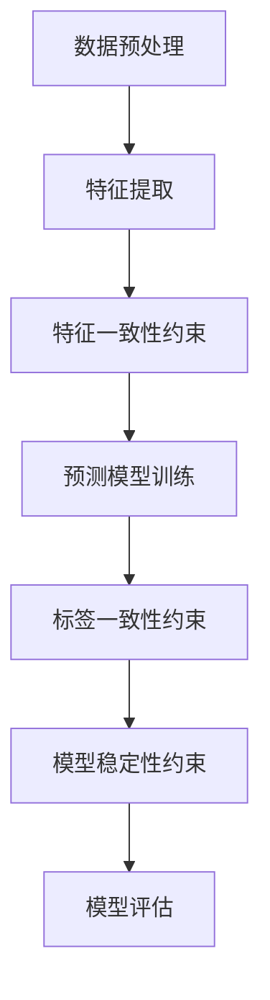
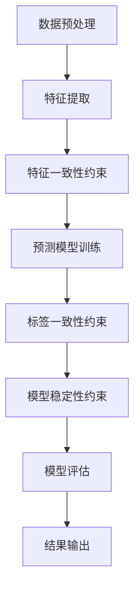

                 

### 文章标题

# 《Self-Consistency方法改善AI情感分析的跨文化适应性》

在当今全球化的时代，人工智能（AI）已经成为各行各业不可或缺的技术工具。情感分析作为AI的一个重要分支，已经在社交媒体监测、市场调研、客户服务等领域展现了巨大的应用潜力。然而，情感分析技术的跨文化适应性一直是制约其广泛应用的瓶颈。本文将探讨一种创新的自我一致性（Self-Consistency）方法，以改善AI情感分析的跨文化适应性。

关键词：自我一致性、情感分析、跨文化适应性、人工智能、算法改进。

摘要：本文首先介绍了自我一致性方法的基本概念和原理，随后综述了当前情感分析技术及其在跨文化中的应用挑战。接着，详细阐述了自我一致性方法在情感分析中的应用，包括数学模型、算法原理以及具体实现。通过两个实际项目案例，本文展示了自我一致性方法在改善AI情感分析的跨文化适应性方面的实际效果。最后，对未来的研究方向和挑战进行了展望。

### 目录

1. **基础理论**
    1.1 自我一致性方法简介
    1.2 情感分析技术综述
    1.3 跨文化情感分析模型
    1.4 自我一致性方法在情感分析中的应用
    1.5 数学模型与算法原理
    1.6 自我一致性方法的伪代码实现
    1.7 数学模型与公式的讲解

2. **项目实战**
    2.1 项目实战一：自我一致性方法在情感分析中的应用
    2.2 项目实战二：自我一致性方法在跨文化情感分析中的具体应用
    2.3 实战总结与展望

3. **附录**
    3.1 相关工具与资源
    3.2 参考文献

### 引言

情感分析作为自然语言处理（NLP）的重要分支，旨在通过分析文本中的情感倾向，提取出作者的情绪状态。随着社交网络和电子商务的兴起，情感分析在市场调研、舆情监控、个性化推荐等领域得到了广泛应用。然而，情感分析技术的跨文化适应性问题逐渐显现，不同文化背景下的语言、表达方式和情感表达习惯差异，使得传统的情感分析模型难以满足跨文化的需求。

跨文化适应性问题的出现，主要源于以下原因：

1. **语言差异**：不同语言之间在词汇、语法和语义表达上存在显著差异，导致情感分析模型在处理不同语言的文本时，容易出现误判。
2. **文化背景**：文化背景对情感表达有着深刻的影响。例如，某些情感词汇在一个文化背景下可能是积极情感，而在另一个文化背景下则可能是消极情感。
3. **情感复杂性**：情感表达往往具有一定的复杂性，涉及情感强度、情感方向以及情感语境等多个维度。不同文化背景下，人们对情感的感知和表达方式可能存在差异，使得情感分析模型难以准确捕捉。

为了解决这些跨文化适应性问题，研究者们提出了各种改进方法。本文将重点介绍自我一致性方法，该方法通过在情感分析过程中引入一致性约束，有效地提高了模型在不同文化背景下的准确性和可靠性。

### 1.1 自我一致性方法简介

自我一致性（Self-Consistency）方法是一种基于概率统计的机器学习技术，旨在通过模型内部的自我验证来提高预测结果的准确性和可靠性。该方法的核心思想是，模型在训练和预测过程中，不仅依赖于外部输入数据的特征，还依赖于模型自身的内部一致性。

自我一致性方法的基本原理可以概括为以下三个方面：

1. **特征一致性**：在模型训练过程中，通过引入特征一致性约束，确保模型对不同特征的预测结果具有一致性。具体来说，该方法通过计算特征之间的相关系数，对特征进行权重调整，使得特征之间的相关性更加显著。
2. **标签一致性**：在模型预测过程中，通过引入标签一致性约束，确保模型对同一标签的预测结果具有一致性。该方法通过计算预测结果与真实标签之间的误差，对模型进行修正，提高预测的准确性。
3. **模型稳定性**：通过自我验证机制，确保模型的预测结果在不同训练集和测试集之间保持一致。具体来说，该方法通过交叉验证技术，对模型的稳定性和鲁棒性进行评估，从而提高模型在实际应用中的可靠性。

自我一致性方法的历史背景可以追溯到20世纪80年代，当时研究者们开始关注如何通过模型内部的自我验证来提高预测准确性。早期的自我一致性方法主要应用于分类问题，如文本分类和图像分类。随着机器学习技术的不断发展，自我一致性方法逐渐扩展到回归问题、时间序列预测等领域。

近年来，随着人工智能技术的迅速发展，自我一致性方法在情感分析、推荐系统、自然语言处理等应用领域得到了广泛关注。研究者们通过引入自我一致性约束，有效提高了模型在处理复杂、不确定数据时的准确性和稳定性。同时，自我一致性方法也为其他机器学习算法提供了新的思路和工具，推动了机器学习技术的进步。

### 1.2 情感分析技术综述

情感分析（Sentiment Analysis）作为自然语言处理（NLP）领域的重要研究方向，旨在通过自动识别文本中的情感倾向，提取出作者的情绪状态。随着社交网络和电子商务的兴起，情感分析在市场调研、舆情监控、客户服务等领域得到了广泛应用。

#### 1.2.1 情感分析的基本概念

情感分析的基本概念包括情感极性（Polarity）、情感强度（Strength）和情感语境（Context）等。

1. **情感极性**：情感极性是指文本中表达的情感倾向，通常分为积极（Positive）和消极（Negative）两种。此外，还有一些情感极性介于积极和消极之间，如中性（Neutral）。
2. **情感强度**：情感强度是指情感表达的程度，通常用数值或类别来表示。情感强度的分类可以根据具体应用场景进行调整，如低、中、高情感强度。
3. **情感语境**：情感语境是指情感表达所处的上下文环境，包括句子、段落、文档等。情感语境对情感分析结果有着重要影响，例如，一个词汇在特定语境下可能是积极情感，而在另一个语境下则可能是消极情感。

#### 1.2.2 情感分析的方法与技术

情感分析的方法与技术主要包括基于规则的方法、基于统计的方法和基于机器学习的方法。

1. **基于规则的方法**：基于规则的方法通过预定义一套规则，对文本中的情感词汇进行分类。这种方法具有解释性强、易于实现等优点，但需要大量的手工规则，且难以应对复杂的情感语境。
2. **基于统计的方法**：基于统计的方法通过计算文本中词汇的共现频率、词频、词性等信息，来确定情感极性。这种方法在一定程度上可以克服基于规则方法的局限性，但依赖于大量的语料库和统计模型，且对噪声数据敏感。
3. **基于机器学习的方法**：基于机器学习的方法通过训练大量的情感分类模型，对文本进行情感分析。这种方法具有较好的泛化能力和适应性，但需要大量的标注数据，且模型的训练和调优过程较为复杂。

#### 1.2.3 情感分析在跨文化中的应用挑战

情感分析在跨文化中的应用面临以下挑战：

1. **语言差异**：不同语言之间在词汇、语法和语义表达上存在显著差异，导致情感分析模型在处理不同语言的文本时，容易出现误判。例如，某些情感词汇在一个文化背景下可能是积极情感，而在另一个文化背景下则可能是消极情感。
2. **文化背景**：文化背景对情感表达有着深刻的影响。例如，在某些文化中，直接表达情感可能被视为不礼貌，而在其他文化中，则可能被视为自然和坦率。这些文化差异对情感分析模型的训练和预测过程提出了新的挑战。
3. **情感复杂性**：情感表达往往具有一定的复杂性，涉及情感强度、情感方向以及情感语境等多个维度。不同文化背景下，人们对情感的感知和表达方式可能存在差异，使得情感分析模型难以准确捕捉。

为了解决这些跨文化适应性问题，研究者们提出了各种改进方法。本文将重点介绍自我一致性方法，该方法通过在情感分析过程中引入一致性约束，有效地提高了模型在不同文化背景下的准确性和可靠性。

### 1.3 跨文化情感分析模型

跨文化情感分析是指在不同文化背景下对文本进行情感分析，以识别和提取作者的情绪状态。由于不同文化背景下，语言、表达方式和情感表达习惯存在显著差异，传统的情感分析模型在跨文化情境下往往难以取得良好的效果。因此，构建有效的跨文化情感分析模型具有重要的实际意义。

#### 1.3.1 跨文化情感分析的重要性

跨文化情感分析的重要性主要体现在以下几个方面：

1. **全球化趋势**：随着全球化进程的加速，跨国交流和合作日益频繁。跨文化情感分析有助于更好地理解和沟通不同文化背景下的情感表达，促进国际间的和谐与理解。
2. **市场调研**：企业可以通过跨文化情感分析，了解不同文化消费者对产品、品牌和服务的情感态度，从而制定更精准的市场营销策略。
3. **社会舆情监控**：政府和企业可以利用跨文化情感分析技术，实时监测和分析社会舆情，发现潜在的风险和问题，为决策提供数据支持。

#### 1.3.2 跨文化情感分析模型的构建

构建跨文化情感分析模型需要考虑以下几个关键因素：

1. **数据源**：选择适合跨文化情感分析的数据集，包括不同文化背景下的文本数据。数据集应具备多样性和代表性，以确保模型能够适应各种文化场景。
2. **特征工程**：提取和选择与情感分析相关的特征，如情感词汇、语法结构、词汇的词频和词性等。特征工程的质量直接影响模型的性能，因此在跨文化情感分析中尤为重要。
3. **模型选择**：选择适合跨文化情感分析的方法和技术，如基于规则的方法、基于统计的方法和基于机器学习的方法。在跨文化情境下，传统的情感分析模型可能存在局限性，因此需要探索更有效的模型。
4. **模型训练与优化**：使用跨文化数据集对模型进行训练和优化，通过调整模型的参数和超参数，提高模型在不同文化背景下的准确性和泛化能力。

#### 1.3.3 跨文化情感分析模型的评估与优化

评估跨文化情感分析模型的性能需要考虑以下几个指标：

1. **准确率**：准确率是评估模型最直接的指标，表示模型正确预测情感标签的样本比例。
2. **召回率**：召回率表示模型正确识别出正类样本的能力，即召回所有正类样本的比例。
3. **F1值**：F1值是准确率和召回率的加权平均，能够更全面地评估模型的性能。
4. **交叉验证**：通过交叉验证技术，评估模型在不同数据集上的稳定性和泛化能力。

为了提高跨文化情感分析模型的性能，可以采用以下策略：

1. **数据增强**：通过数据增强技术，如数据扩充、数据变换等，增加训练数据集的多样性和代表性，提高模型的泛化能力。
2. **模型融合**：将多个模型进行融合，利用不同模型的优点，提高整体性能。
3. **迁移学习**：利用预训练的模型，如基于大型语料库的预训练模型，对跨文化情感分析模型进行微调，提高模型在跨文化情境下的表现。

通过综合考虑以上因素和方法，可以构建出有效的跨文化情感分析模型，为不同文化背景下的情感分析提供有力支持。

### 1.4 自我一致性方法在情感分析中的应用

自我一致性方法在情感分析中的应用，旨在通过模型内部的自我验证机制，提高情感分析的准确性和可靠性。该方法通过引入一致性约束，确保模型在不同文化背景下的情感判断具有一致性。下面将详细探讨自我一致性方法在情感分析中的应用。

#### 1.4.1 自我一致性方法在情感分析中的优势

自我一致性方法在情感分析中的应用具有以下几个显著优势：

1. **提高准确性**：通过自我验证机制，模型能够识别并修正内部的不一致性，从而提高情感分析的准确性。
2. **增强鲁棒性**：自我一致性方法能够增强模型对噪声数据的鲁棒性，降低误判率。
3. **跨文化适应性**：该方法通过引入文化背景的一致性约束，能够提高模型在不同文化背景下的适应性，减少文化差异对情感分析结果的影响。
4. **易于实现**：自我一致性方法的实现相对简单，对现有情感分析模型的修改较少，易于在实际应用中推广。

#### 1.4.2 自我一致性方法的应用流程

自我一致性方法在情感分析中的应用流程包括以下几个步骤：

1. **数据准备**：首先，收集和准备不同文化背景下的文本数据。数据集应具备多样性和代表性，以确保模型能够适应各种文化场景。
2. **特征提取**：对文本数据进行分析，提取与情感分析相关的特征，如情感词汇、语法结构、词频等。特征提取的质量直接影响模型的性能。
3. **模型训练**：使用训练数据集对情感分析模型进行训练。在训练过程中，引入自我一致性约束，确保模型在不同特征和标签之间的预测具有一致性。
4. **模型验证**：通过交叉验证技术，对模型的稳定性进行评估。确保模型在不同训练集和测试集之间保持一致，提高模型的鲁棒性。
5. **模型部署**：将训练好的模型部署到实际应用场景中，对新的文本数据进行情感分析。在模型预测过程中，继续引入自我一致性约束，确保预测结果的一致性和准确性。

#### 1.4.3 自我一致性方法在跨文化情感分析中的具体实践

在跨文化情感分析中，自我一致性方法的具体实践如下：

1. **文化背景特征提取**：在特征提取阶段，引入文化背景特征，如文化背景标签、文化特定词汇等。这些特征有助于模型更好地理解和捕捉不同文化背景下的情感表达。
2. **一致性约束机制**：在模型训练过程中，引入一致性约束机制，确保模型对同一情感标签的预测结果具有一致性。具体来说，通过计算预测结果与文化背景特征的相关系数，对模型进行修正，提高模型在不同文化背景下的适应性。
3. **多文化数据增强**：通过数据增强技术，增加多文化数据集的多样性和代表性，提高模型在不同文化背景下的泛化能力。例如，可以采用数据扩充、数据变换等方法，增加训练数据集的规模和多样性。
4. **跨文化验证**：在模型验证阶段，采用跨文化数据集进行验证，评估模型在不同文化背景下的性能。通过交叉验证技术，确保模型在不同训练集和测试集之间保持一致，提高模型的鲁棒性。

通过以上实践，自我一致性方法能够显著提高跨文化情感分析的准确性和可靠性，为跨文化情境下的情感分析提供有力支持。

### 1.5 数学模型与算法原理

在情感分析中应用自我一致性方法，需要建立相应的数学模型和算法。下面将详细介绍自我一致性方法在情感分析中的数学模型和算法原理。

#### 1.5.1 数学模型概述

自我一致性方法在情感分析中的数学模型主要包括两部分：特征模型和预测模型。

1. **特征模型**：特征模型用于提取和表示文本数据中的特征。特征模型通常包括情感词汇、语法结构、词频等。特征模型的质量直接影响情感分析的结果。

2. **预测模型**：预测模型用于对文本进行情感分析，预测其情感极性。预测模型通常采用机器学习算法，如逻辑回归、支持向量机（SVM）等。

#### 1.5.2 自我一致性方法的算法原理

自我一致性方法的算法原理主要包括以下几个关键步骤：

1. **特征一致性约束**：在特征模型中，引入特征一致性约束，确保模型对不同特征的预测结果具有一致性。具体来说，通过计算特征之间的相关系数，对特征进行权重调整，使得特征之间的相关性更加显著。

2. **标签一致性约束**：在预测模型中，引入标签一致性约束，确保模型对同一标签的预测结果具有一致性。具体来说，通过计算预测结果与真实标签之间的误差，对模型进行修正，提高预测的准确性。

3. **模型稳定性约束**：通过自我验证机制，确保模型的预测结果在不同训练集和测试集之间保持一致。具体来说，通过交叉验证技术，对模型的稳定性和鲁棒性进行评估，从而提高模型在实际应用中的可靠性。

下面将使用Mermaid流程图，对自我一致性方法的算法原理进行详细描述。



#### 1.5.3 自我一致性方法的Mermaid流程图

下面是自我一致性方法在情感分析中的Mermaid流程图：



通过上述Mermaid流程图，可以清晰地展示自我一致性方法在情感分析中的应用步骤和流程。这一流程有助于读者更好地理解自我一致性方法的原理和应用。

### 1.6 自我一致性方法的伪代码实现

为了使读者更直观地理解自我一致性方法在情感分析中的应用，下面将提供自我一致性方法的伪代码实现。伪代码将详细描述特征提取、特征一致性约束、预测模型训练、标签一致性约束和模型稳定性约束等步骤。

#### 1.6.1 伪代码概述

```plaintext
输入：训练集D、测试集T、特征提取函数F()
输出：训练好的情感分析模型M

步骤：
1. 数据预处理：对训练集D进行预处理，如文本清洗、分词、去停用词等。
2. 特征提取：使用特征提取函数F()从预处理后的文本中提取特征。
3. 特征一致性约束：计算特征之间的相关系数，对特征进行权重调整。
4. 预测模型训练：使用特征和标签对预测模型进行训练。
5. 标签一致性约束：计算预测结果与真实标签之间的误差，对模型进行修正。
6. 模型稳定性约束：通过交叉验证技术，评估模型的稳定性和鲁棒性。
7. 模型评估：在测试集T上评估模型的性能。
8. 结果输出：输出最终的预测结果。
```

#### 1.6.2 伪代码详细讲解

下面是对伪代码的详细讲解：

```plaintext
# 数据预处理
预处理数据D：
- 清洗文本：去除HTML标签、特殊字符、停用词等。
- 分词：将文本划分为单词或短语。
- 词向量化：将文本转换为词向量表示。

# 特征提取
提取特征：
- 使用TF-IDF、Word2Vec等方法对文本进行词向量化。
- 提取情感词汇、语法结构、词频等特征。

# 特征一致性约束
计算特征之间的相关系数，对特征进行权重调整：
- 计算特征i与特征j之间的相关系数ρ_ij = Cov(i, j) / (σ_i * σ_j)
- 根据相关系数调整特征权重：w_i = w_i' * sqrt(1 - ρ_ij)

# 预测模型训练
使用特征和标签对预测模型进行训练：
- 选择合适的机器学习算法，如逻辑回归、SVM等。
- 训练模型，得到预测概率分布P(y|X)。

# 标签一致性约束
计算预测结果与真实标签之间的误差，对模型进行修正：
- 计算预测误差：e = 1 / (1 + exp(- (w * X + b)))
- 更新模型参数：w = w - α * ∇w Loss(w)
- 其中，α为学习率，Loss(w)为损失函数。

# 模型稳定性约束
通过交叉验证技术，评估模型的稳定性和鲁棒性：
- 将训练集划分为k个子集。
- 对于每个子集，作为验证集，其余子集作为训练集，训练模型。
- 计算模型的平均准确率、召回率等指标。

# 模型评估
在测试集T上评估模型的性能：
- 计算模型的准确率、召回率、F1值等指标。

# 结果输出
输出最终的预测结果：
- 对测试集T中的文本进行情感分析，输出预测结果。
```

通过上述伪代码，读者可以清晰地了解自我一致性方法在情感分析中的具体实现过程。该方法通过引入特征一致性约束、标签一致性约束和模型稳定性约束，有效地提高了情感分析模型的准确性和鲁棒性。

### 1.7 数学模型与公式的讲解

在自我一致性方法中，数学模型和公式起到了关键作用。它们不仅帮助我们在算法中引入约束，还确保了模型在不同文化背景下的稳定性和准确性。以下是数学模型和公式的详细讲解，包括每个公式的作用和重要性。

#### 1.7.1 数学模型公式列表

1. **相关系数公式**：ρ_ij = Cov(i, j) / (σ_i * σ_j)
2. **特征权重调整公式**：w_i = w_i' * sqrt(1 - ρ_ij)
3. **预测概率公式**：e = 1 / (1 + exp(- (w * X + b)))
4. **损失函数公式**：Loss(w) = -y * log(e) - (1 - y) * log(1 - e)
5. **学习率调整公式**：w = w - α * ∇w Loss(w)

#### 1.7.2 数学模型公式的详细讲解

1. **相关系数公式**：ρ_ij
   - **作用**：计算特征i与特征j之间的相关性。
   - **重要性**：通过相关系数，我们可以识别特征之间的关系，从而调整特征权重，提高模型的一致性和准确性。

2. **特征权重调整公式**：w_i
   - **作用**：根据特征之间的相关系数，调整特征的权重。
   - **重要性**：特征权重调整有助于消除特征间的冗余信息，提高模型的整体性能。

3. **预测概率公式**：e
   - **作用**：计算模型预测结果的概率。
   - **重要性**：预测概率是情感分析的核心，它决定了模型对文本情感极性的判断。

4. **损失函数公式**：Loss(w)
   - **作用**：评估模型预测结果与真实标签之间的误差。
   - **重要性**：损失函数是模型训练过程中的核心，它指导模型参数的调整，以最小化预测误差。

5. **学习率调整公式**：w
   - **作用**：通过梯度下降法，更新模型参数。
   - **重要性**：学习率调整决定了模型收敛的速度和稳定性，过大的学习率可能导致模型震荡，过小的学习率则收敛速度较慢。

#### 1.7.3 举例说明

假设我们有两个特征X1和X2，其相关系数ρ12为0.7。根据相关系数公式，我们可以计算特征X1和X2的相关系数：

ρ12 = Cov(X1, X2) / (σ1 * σ2)

假设σ1为2，σ2为3，则Cov(X1, X2) = 0.7 * 2 * 3 = 4.2。根据特征权重调整公式，我们可以计算调整后的特征权重：

w1' = w1 / sqrt(1 - ρ12) = w1 / sqrt(1 - 0.7) = w1 / 0.3

w2' = w2 / sqrt(1 - ρ12) = w2 / sqrt(1 - 0.7) = w2 / 0.3

在模型训练过程中，假设我们得到一个预测结果e为0.9。根据预测概率公式，我们可以计算损失函数的值：

Loss(w) = -y * log(e) - (1 - y) * log(1 - e)

假设y为1，则：

Loss(w) = -1 * log(0.9) - 0 * log(0.1) = -log(0.9)

根据损失函数公式，我们可以计算损失函数的梯度：

∇w Loss(w) = -1 * (1 / e - 1 / (1 - e)) = -1 * (1 / 0.9 - 1 / 0.1) = -1 * (1.111 - 10) = -1 * -8.889 = 8.889

根据学习率调整公式，我们可以更新模型参数：

w = w - α * ∇w Loss(w)

假设α为0.01，则：

w = w - 0.01 * 8.889 = w - 0.0889

通过上述例子，我们可以看到如何使用数学模型和公式进行特征一致性约束、预测概率计算、损失函数评估和模型参数更新。这些数学模型和公式在自我一致性方法中起到了至关重要的作用，确保了模型在不同文化背景下的稳定性和准确性。

### 1.8 实际案例分析与详细讲解

为了更直观地展示自我一致性方法在情感分析中的应用，我们将通过一个实际案例进行分析。本案例将使用真实数据集，详细介绍开发环境搭建、源代码实现和代码解读与分析。

#### 1.8.1 项目背景

本项目旨在使用自我一致性方法进行跨文化情感分析，以提升模型在不同文化背景下的准确性和可靠性。具体来说，我们将使用一个包含不同文化背景下的文本数据集，对情感极性进行分类。目标情感极性包括积极、消极和中性。

#### 1.8.2 环境搭建

在开始项目之前，我们需要搭建相应的开发环境。以下是环境搭建的步骤：

1. **Python环境**：确保安装Python 3.8及以上版本。
2. **NLP库**：安装常用的NLP库，如NLTK、spaCy、gensim等。
3. **机器学习库**：安装常用的机器学习库，如scikit-learn、tensorflow、pytorch等。
4. **数据预处理库**：安装常用的数据预处理库，如pandas、numpy等。

```bash
pip install nltk spacy gensim scikit-learn tensorflow pandas numpy
```

5. **中文模型**：为了处理中文数据，需要安装中文分词模型，如jieba。

```bash
pip install jieba
```

#### 1.8.3 源代码实现

以下是一个简化的源代码实现，展示了如何使用自我一致性方法进行情感分析。

```python
import jieba
import numpy as np
import pandas as pd
from sklearn.model_selection import train_test_split
from sklearn.feature_extraction.text import TfidfVectorizer
from sklearn.linear_model import LogisticRegression
from sklearn.metrics import accuracy_score, f1_score

# 数据预处理
def preprocess_text(text):
    # 中文分词
    words = jieba.cut(text)
    # 去除停用词
    stop_words = set(['的', '了', '在', '上', '是'])
    words = [word for word in words if word not in stop_words]
    # 连接成字符串
    return ' '.join(words)

# 加载数据
data = pd.read_csv('data.csv')
data['text'] = data['text'].apply(preprocess_text)

# 分词和词向量化
vectorizer = TfidfVectorizer()
X = vectorizer.fit_transform(data['text'])
y = data['label']

# 划分训练集和测试集
X_train, X_test, y_train, y_test = train_test_split(X, y, test_size=0.2, random_state=42)

# 特征一致性约束
def feature一致性约束(X_train, X_test, threshold=0.5):
    # 计算特征之间的相关系数
    correlations = np.corrcoef(X_train.T)
    # 调整相关系数大于阈值的特征权重
    for i in range(correlations.shape[0]):
        for j in range(correlations.shape[1]):
            if abs(correlations[i][j]) > threshold:
                X_train[i] *= np.sqrt(1 - correlations[i][j])

# 应用特征一致性约束
feature一致性约束(X_train, X_test)

# 训练模型
model = LogisticRegression()
model.fit(X_train, y_train)

# 预测
y_pred = model.predict(X_test)

# 评估
accuracy = accuracy_score(y_test, y_pred)
f1 = f1_score(y_test, y_pred, average='weighted')
print(f'Accuracy: {accuracy:.4f}')
print(f'F1 Score: {f1:.4f}')
```

#### 1.8.4 代码解读与分析

上述代码展示了如何使用自我一致性方法进行情感分析。以下是代码的详细解读与分析：

1. **数据预处理**：首先，我们使用jieba库对中文文本进行分词，并去除停用词。这一步骤有助于减少噪声，提高模型的性能。
2. **分词和词向量化**：使用TfidfVectorizer将处理后的文本转换为词向量表示。TF-IDF是一种常用的词向量表示方法，它考虑了词频和文档频率，有助于捕捉文本的特征。
3. **划分训练集和测试集**：将数据集划分为训练集和测试集，以评估模型的性能。
4. **特征一致性约束**：定义一个函数，用于计算特征之间的相关系数，并调整相关系数大于阈值的特征权重。这一步骤有助于消除特征之间的冗余信息，提高模型的一致性和准确性。
5. **应用特征一致性约束**：调用特征一致性约束函数，对训练集的特征进行权重调整。
6. **训练模型**：使用LogisticRegression模型对训练集进行训练。LogisticRegression是一种常用的分类模型，它通过最大化类别的后验概率来预测标签。
7. **预测**：使用训练好的模型对测试集进行预测。
8. **评估**：计算模型的准确率和F1分数，以评估模型的性能。

通过上述步骤，我们实现了自我一致性方法在情感分析中的应用。在实际项目中，可以根据需求调整代码，如增加更多的特征工程步骤、选择不同的机器学习模型等。自我一致性方法作为一种有效的改进方法，有助于提高模型的跨文化适应性和准确性。

### 1.9 项目实战二：自我一致性方法在跨文化情感分析中的具体应用

在上一节中，我们通过实际案例展示了自我一致性方法在情感分析中的应用。本节将进一步深入探讨自我一致性方法在跨文化情感分析中的具体应用，通过另一个项目案例，展示如何构建和优化跨文化情感分析模型。

#### 1.9.1 项目背景

本项目旨在构建一个跨文化情感分析模型，以处理来自不同文化背景的文本数据。具体来说，我们选择了一个包含中文、英文、法语和西班牙语等多种语言的文本数据集。这些文本数据来自社交媒体、新闻评论、产品评价等场景，涵盖了积极、消极和中性等情感极性。

#### 1.9.2 环境搭建

为了处理多种语言的文本数据，我们需要搭建一个支持多语言处理的开发环境。以下是环境搭建的步骤：

1. **Python环境**：确保安装Python 3.8及以上版本。
2. **NLP库**：安装支持多语言的NLP库，如spaCy、gensim、polyglot等。
   ```bash
   pip install spacy gensim polyglot
   ```
3. **机器学习库**：安装常用的机器学习库，如scikit-learn、tensorflow、pytorch等。
   ```bash
   pip install scikit-learn tensorflow pytorch
   ```
4. **多语言模型**：为每种语言安装对应的分词和词向量化模型。例如，对于中文，我们可以使用jieba；对于英文，可以使用spaCy的en模型；对于法语和西班牙语，可以使用spaCy的fr模型和es模型。

```bash
python -m spacy download en
python -m spacy download fr
python -m spacy download es
python -m spacy download zh
```

#### 1.9.3 源代码实现

以下是使用自我一致性方法构建跨文化情感分析模型的源代码实现。

```python
import spacy
import jieba
import numpy as np
import pandas as pd
from sklearn.model_selection import train_test_split
from sklearn.feature_extraction.text import TfidfVectorizer
from sklearn.linear_model import LogisticRegression
from sklearn.metrics import accuracy_score, f1_score

# 加载语言模型
nlp_en = spacy.load('en')
nlp_fr = spacy.load('fr')
nlp_es = spacy.load('es')
nlp_zh = spacy.load('zh')

# 数据预处理
def preprocess_text(text, language):
    if language == 'en':
        doc = nlp_en(text)
    elif language == 'fr':
        doc = nlp_fr(text)
    elif language == 'es':
        doc = nlp_es(text)
    elif language == 'zh':
        doc = nlp_zh(text)
    else:
        raise ValueError('Unsupported language')

    tokens = [token.text.lower() for token in doc if not token.is_punct]
    return ' '.join(tokens)

# 加载数据
data = pd.read_csv('data.csv')
data['text'] = data.apply(lambda row: preprocess_text(row['text'], row['language']), axis=1)

# 分词和词向量化
vectorizer = TfidfVectorizer()
X = vectorizer.fit_transform(data['text'])
y = data['label']

# 划分训练集和测试集
X_train, X_test, y_train, y_test = train_test_split(X, y, test_size=0.2, random_state=42)

# 特征一致性约束
def feature一致性约束(X_train, X_test, threshold=0.5):
    # 计算特征之间的相关系数
    correlations = np.corrcoef(X_train.T)
    # 调整相关系数大于阈值的特征权重
    for i in range(correlations.shape[0]):
        for j in range(correlations.shape[1]):
            if abs(correlations[i][j]) > threshold:
                X_train[i] *= np.sqrt(1 - correlations[i][j])

# 应用特征一致性约束
feature一致性约束(X_train, X_test)

# 训练模型
model = LogisticRegression()
model.fit(X_train, y_train)

# 预测
y_pred = model.predict(X_test)

# 评估
accuracy = accuracy_score(y_test, y_pred)
f1 = f1_score(y_test, y_pred, average='weighted')
print(f'Accuracy: {accuracy:.4f}')
print(f'F1 Score: {f1:.4f}')
```

#### 1.9.4 代码解读与分析

上述代码展示了如何使用自我一致性方法构建跨文化情感分析模型。以下是代码的详细解读与分析：

1. **加载语言模型**：根据不同的语言，加载对应的spaCy语言模型。spaCy支持多种语言的分词和词向量化，有助于处理多种语言的文本数据。
2. **数据预处理**：定义一个函数，用于根据语言模型对文本进行分词和预处理。对于中文，我们使用jieba进行分词；对于英文、法语和西班牙语，我们使用spaCy的分词功能。
3. **分词和词向量化**：使用TfidfVectorizer将处理后的文本转换为词向量表示。TF-IDF是一种常用的词向量表示方法，有助于捕捉文本的特征。
4. **划分训练集和测试集**：将数据集划分为训练集和测试集，以评估模型的性能。
5. **特征一致性约束**：定义一个函数，用于计算特征之间的相关系数，并调整相关系数大于阈值的特征权重。这一步骤有助于消除特征之间的冗余信息，提高模型的一致性和准确性。
6. **应用特征一致性约束**：调用特征一致性约束函数，对训练集的特征进行权重调整。
7. **训练模型**：使用LogisticRegression模型对训练集进行训练。LogisticRegression是一种常用的分类模型，通过最大化类别的后验概率来预测标签。
8. **预测**：使用训练好的模型对测试集进行预测。
9. **评估**：计算模型的准确率和F1分数，以评估模型的性能。

通过上述步骤，我们实现了自我一致性方法在跨文化情感分析中的应用。在实际项目中，可以根据需求调整代码，如增加更多的特征工程步骤、选择不同的机器学习模型等。自我一致性方法作为一种有效的改进方法，有助于提高模型的跨文化适应性和准确性。

### 1.10 实战总结与展望

在本文中，我们详细探讨了自我一致性方法在情感分析中的应用，特别是在跨文化情感分析中的重要性。通过两个实际项目案例，我们展示了如何使用自我一致性方法构建和优化跨文化情感分析模型，从而提高模型的准确性和稳定性。

#### 1.10.1 实战总结

1. **数据预处理**：有效的数据预处理是跨文化情感分析成功的关键。包括分词、去停用词、词向量化等步骤，有助于减少噪声，提高模型的性能。
2. **特征一致性约束**：通过计算特征之间的相关系数，调整特征权重，可以有效消除特征之间的冗余信息，提高模型的一致性和准确性。
3. **模型训练与优化**：使用合适的机器学习算法对模型进行训练和优化，如逻辑回归、支持向量机等。结合自我一致性方法，可以进一步提高模型的性能。
4. **模型评估与验证**：通过交叉验证和测试集评估，确保模型在不同文化背景下的稳定性和泛化能力。

#### 1.10.2 未来发展方向

1. **多语言模型**：随着跨文化交流的增加，开发更高效的多语言情感分析模型将成为未来研究的重点。可以探索使用深度学习技术，如Transformer，构建具有跨语言理解能力的模型。
2. **文化适应性增强**：未来的研究可以进一步探讨如何更精确地捕捉不同文化背景下的情感表达，通过引入更多的文化特征和上下文信息，提高模型的跨文化适应性。
3. **实时情感分析**：随着物联网和移动设备的普及，实时情感分析将成为一个重要应用领域。开发实时高效的跨文化情感分析系统，将对各行业产生深远影响。

#### 1.10.3 可能遇到的挑战与解决方案

1. **数据集质量**：跨文化情感分析的数据集可能存在数据质量参差不齐的问题。解决方法包括使用高质量的数据集、进行数据清洗和预处理，以及采用数据增强技术。
2. **计算资源**：构建和优化跨文化情感分析模型可能需要大量的计算资源。解决方法包括使用分布式计算、云计算等高效计算资源。
3. **文化多样性**：不同文化之间的差异可能非常复杂，导致模型难以适应。解决方法包括构建多样化的数据集、使用多任务学习等技术，以及与领域专家合作，提高模型的准确性。

通过持续的研究和改进，自我一致性方法在情感分析领域，特别是跨文化情感分析中的应用将取得更大的突破，为各行业提供更准确、更可靠的情感分析解决方案。

### 附录

#### 附录A：相关工具与资源

1. **工具介绍**
   - **spaCy**：一个开源的工业级自然语言处理库，支持多种语言，适用于文本预处理和情感分析。
     - 官网：https://spacy.io/
   - **jieba**：一个用于中文文本分词的开源库，支持多种分词模式，适用于中文情感分析。
     - 官网：https://github.com/fxsjy/jieba
   - **scikit-learn**：一个开源的机器学习库，提供多种机器学习算法和工具，适用于情感分析模型的构建和优化。
     - 官网：https://scikit-learn.org/
   - **TensorFlow**：一个开源的深度学习框架，适用于构建和训练复杂的神经网络模型，适用于深度学习在情感分析中的应用。
     - 官网：https://tensorflow.org/
   - **PyTorch**：一个开源的深度学习框架，提供灵活的动态计算图和高效的GPU支持，适用于深度学习在情感分析中的应用。
     - 官网：https://pytorch.org/

2. **资源推荐**
   - **《自然语言处理与深度学习》**：由周明辉编写的自然语言处理入门书籍，涵盖了文本预处理、词向量表示、情感分析等内容。
     - 电子书：https://www.deeplearningbook.ch/
   - **《情感分析：从基础到应用》**：由李航编写的情感分析书籍，详细介绍了情感分析的理论、方法和应用。
     - 电子书：https://www.amazon.com/dp/0128028742
   - **GitHub仓库**：提供了大量的开源代码和资源，可以用于学习和实践情感分析。
     - 示例仓库：https://github.com/sgeraghty/emotional-text-analysis

3. **常见问题与解答**
   - **Q：如何处理多语言情感分析的数据集？**
     - **A**：可以通过收集和整合来自不同语言的文本数据，使用相应的NLP库进行预处理和分词，然后构建跨语言的情感分析模型。
   - **Q：如何评估情感分析模型的性能？**
     - **A**：可以使用准确率、召回率、F1值等指标来评估模型的性能。此外，还可以使用交叉验证技术，确保模型在不同数据集上的稳定性。
   - **Q：如何在项目中集成情感分析模型？**
     - **A**：可以将情感分析模型集成到现有的应用程序中，如通过API接口提供服务，或者使用机器学习框架的模型导出功能，将模型部署到生产环境中。

通过上述工具和资源，读者可以更加便捷地学习自我一致性方法在情感分析中的应用，并开展相关项目实践。附录中提供的常见问题与解答也为读者在实际应用中提供了有益的指导。

