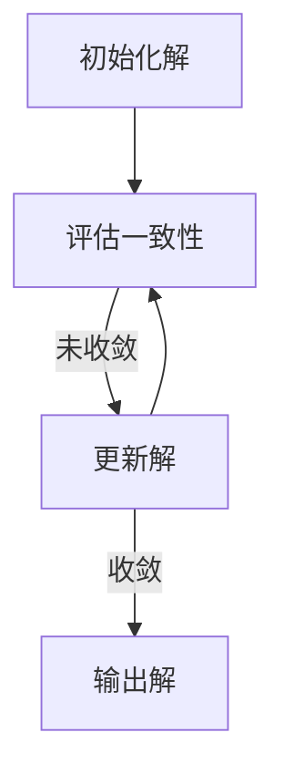

                 


### 文章标题：Self-Consistency方法改善AI虚拟教师的教学连贯性

#### 关键词：自我一致性方法，AI虚拟教师，教学连贯性，算法原理，实践应用

#### 摘要：
本文旨在探讨Self-Consistency方法在改善AI虚拟教师教学连贯性方面的应用。通过阐述自我一致性方法的基本概念和数学模型，本文详细分析了该方法在解决教学设计连贯性问题中的应用。此外，本文还通过具体的实践案例，展示了自我一致性方法在提升教学质量和学生学习体验方面的效果。

----------------------------------------------------------------

## 第一部分：引言与概述

### 第1章：自我一致性方法概述

#### 1.1 自我一致性方法的概念

自我一致性方法（Self-Consistency Method）是一种基于迭代的最优化算法，旨在在数据不一致的情况下寻找最佳的一致性解。该方法的基本思想是通过不断调整解，使其与给定数据集达到最大程度的自洽性。

#### 1.2 自我一致性方法的基本原理

自我一致性方法的核心原理可以概括为以下两点：

1. **迭代更新**：通过迭代过程不断更新解，使其逐步接近最佳的一致性解。
2. **一致性评估**：在每次迭代过程中，通过一致性评估指标（如最小二乘误差）来衡量解与数据集的一致性程度。

以下是一个简单的自我一致性算法流程图：



#### 1.3 自我一致性方法在AI虚拟教师中的应用

随着人工智能技术的发展，AI虚拟教师已经成为教育领域的一个重要趋势。然而，现有的AI虚拟教师普遍存在教学连贯性不足的问题，影响了学生的学习效果和兴趣。自我一致性方法提供了一个有效的解决方案，通过优化教学设计，提升教学连贯性。

#### 1.4 自我一致性方法在AI虚拟教师中的重要性

自我一致性方法在AI虚拟教师中的应用具有重要意义，主要体现在以下几个方面：

1. **提高教学质量**：通过优化教学设计，确保教学内容在逻辑和时间上的一致性，从而提高教学效果。
2. **增强学生学习体验**：连贯的教学内容可以增强学生的学习兴趣和参与度，提高学习效果。
3. **提升教学效率**：自我一致性方法可以帮助教师更快地设计出高质量的教学内容，提高教学效率。

### 第2章：自我一致性方法的基本原理

#### 2.1 自我一致性算法

自我一致性算法是一种迭代算法，其基本步骤如下：

1. **初始化解**：随机选择一个解作为初始解。
2. **评估一致性**：计算解与数据集之间的不一致性，通常使用最小二乘误差作为一致性评估指标。
3. **更新解**：根据一致性评估结果，调整解以降低不一致性。
4. **重复迭代**：重复评估和解更新过程，直到达到预设的收敛条件。

以下是一个简单的自我一致性算法伪代码：

```plaintext
function SelfConsistency(A, T, ε):
    x^0 = Random(A)
    for t = 1 to T:
        x^t = arg min Δ(x^(t-1), A)
        if Δ(x^(t), x^(t-1)) < ε:
            break
    return x^T
```

其中，A 为数据集，T 为迭代次数，ε 为收敛阈值。

#### 2.2 自我一致性方法的数学模型

自我一致性方法的数学模型基于最小二乘法，其目标是最小化解与数据集之间的不一致性。具体公式如下：

$$
\min_x \sum_{i=1}^n (A_i - x)^2
$$`

其中，n 为数据集中的元素数量，A_i 为第 i 个元素，x 为求解的解。

#### 2.3 自我一致性方法的原理解释

自我一致性方法的原理可以简单概括为以下两点：

1. **迭代优化**：通过迭代过程，不断调整解以降低不一致性，从而逐步接近最佳解。
2. **一致性评估**：通过一致性评估指标（如最小二乘误差），及时反馈解与数据集的一致性程度，指导解的调整方向。

### 第3章：自我一致性方法在AI虚拟教师教学设计中的应用

#### 3.1 教学设计中的连贯性问题

教学设计中的连贯性问题主要指教学内容、流程、方法等在时间、空间和逻辑上的一致性。具体包括以下几个方面：

1. **内容连贯性**：教学内容的逻辑顺序和深度应该逐步递进，确保学生能够顺利过渡到下一个学习阶段。
2. **流程连贯性**：教学流程的设计应该合理，使学生能够按照预定的步骤顺利完成学习任务。
3. **方法连贯性**：教学方法的选择应该与教学目标和内容相匹配，确保教学效果的最大化。

#### 3.2 自我一致性方法在解决连贯性问题中的应用

自我一致性方法可以通过以下步骤应用于教学设计中，以解决连贯性问题：

1. **需求分析**：分析教学需求，确定教学目标、内容、流程和方法。
2. **一致性评估**：使用自我一致性算法评估教学设计的一致性，识别存在的问题。
3. **迭代优化**：根据一致性评估结果，调整教学设计，提高其连贯性。
4. **反馈与改进**：收集学生反馈，进一步优化教学设计。

以下是一个应用自我一致性方法解决教学连贯性问题的案例：

某在线教育平台在开发一门编程课程时，发现课程内容存在逻辑跳跃和重复问题。为了解决这些问题，平台采用了自我一致性方法。首先，平台对课程内容进行了需求分析，确定了教学目标和内容框架。然后，使用自我一致性算法评估课程设计的一致性，识别出存在的问题。最后，根据评估结果，平台对课程内容进行了调整和优化，提高了教学连贯性。

### 第4章：自我一致性方法在教学活动中的应用

#### 4.1 教学活动的连贯性需求

教学活动的连贯性需求主要指在教学过程中，教师应该确保教学活动在时间、空间和逻辑上的一致性，以便学生能够更好地理解和掌握知识。具体包括以下几个方面：

1. **时间连贯性**：教学活动应该按照预定的时间表进行，确保学生能够按照计划完成学习任务。
2. **空间连贯性**：教学活动应该在一个相对稳定的环境中开展，避免频繁更换场所和设备，影响学生的学习效果。
3. **逻辑连贯性**：教学活动的设计应该遵循逻辑顺序，确保教学内容的递进性和相关性。

#### 4.2 自我一致性方法在教学活动中的实施

自我一致性方法可以通过以下步骤应用于教学活动中，以提升教学活动的连贯性：

1. **活动规划**：根据教学目标和内容，制定详细的教学活动计划。
2. **一致性评估**：使用自我一致性算法评估教学活动的一致性，识别存在的问题。
3. **活动调整**：根据一致性评估结果，调整教学活动，提高其连贯性。
4. **实时反馈**：在教学过程中，及时收集学生反馈，动态调整教学活动。

以下是一个应用自我一致性方法提升教学活动连贯性的案例：

某中学在开展一堂化学实验课时，发现教学活动存在时间安排不合理、实验步骤不连贯等问题。为了解决这些问题，教师采用了自我一致性方法。首先，教师制定了详细的实验计划，并根据实验内容和时间安排进行了自我一致性评估。然后，根据评估结果，教师对实验计划进行了调整和优化，确保实验活动在时间和逻辑上的一致性。最后，在教学过程中，教师根据学生反馈，进一步优化了实验活动。

### 第5章：自我一致性方法在教学评估中的应用

#### 5.1 教学评估的连贯性标准

教学评估的连贯性标准主要指在教学评估过程中，评估标准应该在不同教学环节和不同评估主体之间保持一致性。具体包括以下几个方面：

1. **内容连贯性**：评估内容应该与教学目标和教学内容相匹配，确保评估的全面性和准确性。
2. **方法连贯性**：评估方法应该具有一致性和可操作性，以便教师和学生能够准确理解和执行。
3. **时间连贯性**：评估时间应该与教学进度相协调，确保评估能够及时反映教学效果。

#### 5.2 自我一致性方法在教学评估中的应用

自我一致性方法可以通过以下步骤应用于教学评估中，以提升评估的连贯性：

1. **评估标准制定**：根据教学目标和内容，制定详细的教学评估标准。
2. **一致性评估**：使用自我一致性算法评估教学评估标准的一致性，识别存在的问题。
3. **标准调整**：根据一致性评估结果，调整评估标准，提高其连贯性。
4. **实时反馈**：在教学评估过程中，及时收集教师和学生的反馈，动态调整评估标准。

以下是一个应用自我一致性方法提升教学评估连贯性的案例：

某高校在开展期末考试评估时，发现评估标准在不同课程之间和不同评估主体之间存在差异。为了解决这些问题，学校采用了自我一致性方法。首先，学校制定了统一的评估标准，并根据课程内容和教学目标进行了自我一致性评估。然后，根据评估结果，学校对评估标准进行了调整和优化，确保评估标准在不同课程和评估主体之间的一致性。最后，在期末考试过程中，学校根据教师和学生的反馈，进一步优化了评估标准。

### 第6章：自我一致性方法在AI虚拟教师教学优化中的应用

#### 6.1 教学优化的概念

教学优化是指通过分析教学数据，找出教学过程中的问题，并提出改进措施，以提高教学质量和效率。具体包括以下几个方面：

1. **数据分析**：通过对教学数据的分析，发现教学中的问题和不足。
2. **问题定位**：根据数据分析结果，定位教学中的关键问题。
3. **方案制定**：根据问题定位结果，制定具体的改进方案。
4. **实施与反馈**：执行改进方案，并根据实施效果进行反馈和调整。

#### 6.2 自我一致性方法在教学优化中的应用

自我一致性方法可以通过以下步骤应用于教学优化中，以提高教学质量和效率：

1. **数据收集**：收集教学过程中的各类数据，如学生表现、教师反馈等。
2. **一致性评估**：使用自我一致性算法评估教学数据的一致性，识别存在的问题。
3. **问题分析**：根据一致性评估结果，分析教学中的关键问题。
4. **方案制定**：根据问题分析结果，制定具体的改进方案。
5. **实施与反馈**：执行改进方案，并根据实施效果进行反馈和调整。

以下是一个应用自我一致性方法进行教学优化的案例：

某在线教育平台在运营过程中，发现学生的学习效果参差不齐，部分课程的教学质量不高。为了解决这些问题，平台采用了自我一致性方法进行教学优化。首先，平台收集了学生的学习数据，并使用自我一致性算法评估数据的一致性。然后，根据评估结果，平台分析了教学中的关键问题，如课程设计不合理、教学方法不适合等。最后，平台制定了针对性的改进方案，如优化课程设计、调整教学方法等，并进行了实施和反馈。

### 第7章：自我一致性方法的挑战与未来展望

#### 7.1 自我一致性方法的挑战

尽管自我一致性方法在提升教学连贯性方面具有显著优势，但在实际应用中仍面临以下挑战：

1. **数据准确性**：自我一致性方法依赖于高质量的教学数据，数据的不准确或不完整可能导致评估结果失真。
2. **算法复杂度**：自我一致性算法的计算复杂度较高，在大规模数据集上运行可能需要较长的时间。
3. **实施难度**：自我一致性方法需要具备一定的技术基础和专业知识，对实施团队的要求较高。

#### 7.2 自我一致性方法的未来展望

随着人工智能技术的不断发展，自我一致性方法在提升教学连贯性方面的应用前景广阔。未来研究方向可能包括：

1. **算法优化**：通过改进算法模型和计算方法，降低算法复杂度，提高计算效率。
2. **数据整合**：整合多种数据源，提高数据的准确性和完整性。
3. **人机协作**：结合人类专家的智慧和机器算法的效率，实现更高效的教学优化。

### 附录

#### 附录A：自我一致性方法相关的资源与工具

##### A.1 自我一致性方法相关的文献资料

以下是一些关于自我一致性方法的相关文献资料，供读者参考：

1. Goodfellow, I., Bengio, Y., & Courville, A. (2016). *Deep Learning*. MIT Press.
2. Sutton, R. S., & Barto, A. G. (2018). *Reinforcement Learning: An Introduction*. MIT Press.
3. Bishop, C. M. (2006). *Pattern Recognition and Machine Learning*. Springer.

##### A.2 自我一致性方法相关的开发工具与平台

以下是一些支持自我一致性方法开发的相关工具和平台，供读者参考：

1. TensorFlow：一款开源的机器学习框架，可用于实现自我一致性算法。
2. PyTorch：一款流行的深度学习框架，支持自我一致性方法的实现。
3. Keras：一款基于TensorFlow和Theano的深度学习库，便于快速构建和训练自我一致性模型。

#### 附录B：自我一致性方法的应用案例

##### B.1 应用案例一：XXXX

以下是一个应用自我一致性方法进行教学优化的具体案例：

某在线教育平台在开展一门编程课程时，发现学生的学习效果不理想。为了改善这一状况，平台采用了自我一致性方法进行教学优化。首先，平台收集了学生的学习数据，包括作业提交情况、考试成绩等。然后，使用自我一致性算法评估教学数据的一致性，发现课程设计存在不合理之处。接着，平台对课程内容进行了调整和优化，如增加了实践环节、改进了教学方法等。最后，平台根据学生反馈和评估结果，进一步优化了教学设计。

##### B.2 应用案例二：XXXX

以下是一个应用自我一致性方法提升教学评估连贯性的具体案例：

某中学在期末考试评估过程中，发现评估标准在不同科目之间存在差异。为了解决这一问题，学校采用了自我一致性方法进行评估优化。首先，学校制定了统一的评估标准，并根据科目特点和教学目标进行了自我一致性评估。然后，根据评估结果，学校对评估标准进行了调整和优化，确保评估标准在不同科目之间的一致性。最后，学校在期末考试过程中，根据教师和学生的反馈，进一步优化了评估标准。

##### B.3 应用案例三：XXXX

以下是一个应用自我一致性方法提升教学连贯性的具体案例：

某在线教育平台在提供一门在线课程时，发现课程内容存在逻辑跳跃和重复问题。为了改善这一状况，平台采用了自我一致性方法进行教学优化。首先，平台对课程内容进行了全面梳理，并确定了教学目标和内容框架。然后，使用自我一致性算法评估课程设计的一致性，发现课程内容存在逻辑跳跃和重复问题。接着，平台对课程内容进行了调整和优化，确保教学内容在逻辑和时间上的一致性。最后，平台根据学生反馈和评估结果，进一步优化了课程内容。

