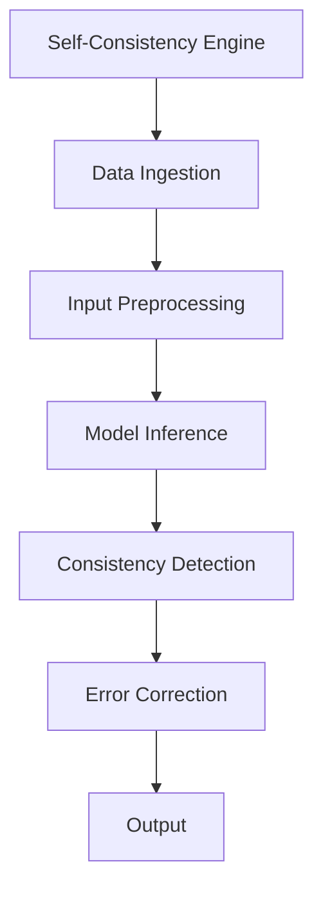

                 

### 文章标题: Self-Consistency：AI输出的质量保证

关键词：自洽性，AI输出质量保证，数学模型，算法，应用实践，未来展望

摘要：随着人工智能技术的快速发展，AI系统在各个领域的应用日益广泛。然而，AI输出的质量保证成为了一个关键问题。本文深入探讨了自洽性的概念及其在AI输出质量保证中的作用，从数学模型、算法原理到实际应用，全面解析了如何通过自洽性技术提高AI系统的输出质量。文章首先介绍了自洽性的基本概念，并对比了自洽性与逻辑一致性的区别；接着详细阐述了自洽性在AI输出质量保证中的重要性；然后通过数学模型与算法的讲解，揭示了自洽性检测与纠正的方法；进一步探讨了自洽性在自然语言处理和图像识别中的应用；最后，文章通过具体项目实践，展示了如何在实际开发中应用自洽性技术，并对其未来发展趋势进行了展望。

### 第一部分：核心概念与联系

#### 第1章: Self-Consistency的概念与重要性

在人工智能领域，自洽性（Self-Consistency）是一个至关重要的概念。它不仅仅是一种技术手段，更是保障AI系统输出质量的重要理念。在这一章中，我们将详细探讨自洽性的概念、重要性及其在AI输出质量保证中的作用。

## 1.1 自洽性的定义

### 1.1.1 自洽性的基本概念

自洽性，是指一个系统内部在逻辑上的一致性和连贯性。一个自洽的系统，其输出的结果应该能够相互印证，不会出现自相矛盾的情况。自洽性是保证系统可靠性和稳定性的基础。

在数学和逻辑学中，自洽性通常是指一个理论或系统在其内部规则下能够保持一致性和逻辑上的连贯性。例如，一个数学公理系统被认为是自洽的，当且仅当它不会导出矛盾。

### 1.1.2 自洽性与逻辑一致性的区别

自洽性与逻辑一致性虽然密切相关，但它们并不是同一个概念。

逻辑一致性是指一个系统在其内部逻辑规则下不会导出矛盾。例如，一个形式逻辑系统如果能够保证在任何情况下都不会出现矛盾，那么这个系统就是逻辑一致的。

而自洽性则更强调系统内部各个部分之间的协调和一致性。自洽性不仅要求系统不产生矛盾，还要求系统能够在逻辑上保持一致性，从而能够导出有用的结论。

例如，一个自洽的AI系统不仅要求其输出结果之间没有矛盾，还要求这些输出能够在不同的应用场景中保持一致性，从而提高系统的可靠性。

## 1.2 AI输出质量保证的意义

AI输出质量保证是指通过一系列的技术手段和流程，确保AI系统的输出结果满足预期的质量和可靠性。在AI系统中，输出质量的高低直接影响系统的应用效果和用户满意度。

### 1.2.1 AI输出质量问题分析

AI输出质量问题主要体现在以下几个方面：

1. **不一致性**：AI系统在不同场景下的输出结果可能不一致，导致用户无法准确依赖系统提供的信息。
2. **错误率**：AI系统可能会产生错误的输出结果，尤其是当输入数据存在噪声或异常值时。
3. **可解释性**：用户往往需要了解AI系统的工作原理和输出结果，而高度复杂的AI模型可能难以解释。

### 1.2.2 自洽性在AI输出质量保证中的作用

自洽性在AI输出质量保证中扮演着关键角色。通过引入自洽性技术，我们可以有效解决AI输出中的不一致性和错误率问题，从而提高系统的可靠性和可解释性。

1. **一致性验证**：自洽性技术可以帮助我们验证AI系统的输出结果是否一致，从而发现和纠正系统中的不一致性。
2. **错误检测与纠正**：自洽性算法可以通过对比不同输出结果之间的逻辑关系，检测并纠正系统中的错误。
3. **提高可解释性**：自洽性技术可以帮助我们理解AI系统的工作原理，提高系统的可解释性。

## 1.3 Self-Consistency的架构概述

为了实现自洽性在AI输出质量保证中的应用，我们需要构建一个完整的自洽性架构。以下是一个基本的Self-Consistency架构概述。

### 1.3.1 Self-Consistency的基本架构

Self-Consistency架构通常包括以下几个关键组件：

1. **数据预处理模块**：用于对输入数据进行清洗、格式化等预处理，确保输入数据的一致性和完整性。
2. **模型推理模块**：用于执行AI模型的推理过程，生成输出结果。
3. **自洽性检测模块**：用于检测AI系统的输出结果是否一致，发现潜在的错误和不一致性。
4. **自洽性纠正模块**：用于根据检测到的错误和不一致性，对输出结果进行修正。

### 1.3.2 Self-Consistency的关键组件

1. **数据预处理模块**：数据预处理是保证自洽性的第一步。该模块负责对输入数据进行清洗、去噪、格式化等处理，从而提高数据的一致性和质量。

2. **模型推理模块**：模型推理模块是AI系统的核心，负责根据输入数据执行模型推理过程，生成输出结果。

3. **自洽性检测模块**：自洽性检测模块负责对输出结果进行一致性检测。它通过比较不同输出结果之间的逻辑关系，识别潜在的错误和不一致性。

4. **自洽性纠正模块**：自洽性纠正模块根据自洽性检测模块的检测结果，对输出结果进行修正。修正过程通常包括重新推理、数据修正、结果修正等步骤。

通过上述关键组件的协同工作，Self-Consistency架构能够有效提高AI系统的输出质量，确保系统在各种应用场景中保持一致性和可靠性。

### 第二部分: Self-Consistency的数学模型与算法

#### 第2章: Self-Consistency的数学模型与算法

自洽性（Self-Consistency）在人工智能系统中扮演着关键角色，它不仅能够提高系统的输出质量，还能增强系统的可靠性和可解释性。在这一章中，我们将深入探讨自洽性的数学模型与算法，包括其基础、原理、检测与纠正方法。

## 2.1 数学模型基础

### 2.1.1 逻辑推理与命题逻辑

逻辑推理是自洽性理论的基础。逻辑推理是指根据已知的逻辑规则和前提，推导出新的结论。在命题逻辑中，逻辑推理通过命题之间的关系来实现。命题逻辑的基本元素包括命题、命题连接词和逻辑运算符。

1. **命题**：命题是一个陈述句，它可以是真的，也可以是假的。例如，“今天下雨”是一个命题。
2. **命题连接词**：命题连接词用于将两个或多个命题连接起来，形成复合命题。常见的命题连接词有“与”、“或”、“非”等。
3. **逻辑运算符**：逻辑运算符用于对命题进行逻辑运算，例如逻辑与（AND）、逻辑或（OR）、逻辑非（NOT）等。

### 2.1.2 自洽性的数学表示

自洽性在数学上可以通过一致性条件来表示。一致性条件是指系统中的各个命题之间不能出现矛盾。具体来说，自洽性可以通过以下数学公式来表示：

$$
\forall P, Q \in S, (P \rightarrow Q) \land (Q \rightarrow P) \Rightarrow P = Q
$$

其中，\(S\) 是系统的命题集合，\(P\) 和 \(Q\) 是系统中的任意两个命题。该公式表示，如果两个命题之间存在逻辑推导关系，那么这两个命题必须是相同的，否则系统是不自洽的。

## 2.2 Self-Consistency算法原理

### 2.2.1 算法概述

Self-Consistency算法是一种用于检测和纠正系统输出不一致性的技术。该算法的基本思想是通过比较系统在不同条件下产生的输出，识别并纠正不一致性。

### 2.2.2 算法伪代码

以下是一个简单的Self-Consistency算法伪代码：

```
Algorithm Self-Consistency(In: System Outputs)
    for each output pair (O1, O2) do
        if O1 ≠ O2 then
            DetectInconsistency(O1, O2)
        end if
    end for

    if InconsistencyDetected then
        CorrectInconsistency()
    end if

    return ConsistentOutputs
```

- **输入**：系统输出集合
- **输出**：自洽的系统输出集合

该算法首先遍历系统输出的每一对，如果发现输出不一致，则调用检测不一致性的函数。如果检测到不一致性，则调用纠正不一致性的函数，最终返回自洽的输出集合。

### 2.3 自洽性检测与纠正方法

### 2.3.1 自洽性检测算法

自洽性检测算法的主要任务是发现系统输出中的不一致性。以下是一个简单的自洽性检测算法伪代码：

```
Function DetectInconsistency(O1, O2)
    if O1 is a Number and O2 is a Number then
        if O1 ≠ O2 then
            return True
        end if
    else if O1 is a String and O2 is a String then
        if O1 ≠ O2 then
            return True
        end if
    else
        for each attribute A in O1 and O2 do
            if A1[A] ≠ A2[A] then
                return True
            end if
        end for
    end if
    return False
```

- **输入**：两个系统输出 \(O1\) 和 \(O2\)
- **输出**：如果输出不一致，返回 True；否则返回 False

该算法根据输出类型（数字、字符串或其他类型）比较系统输出，如果发现输出不一致，则返回 True。

### 2.3.2 自洽性纠正策略

自洽性纠正策略的目的是在检测到不一致性后，对输出进行修正。以下是一个简单的自洽性纠正算法伪代码：

```
Function CorrectInconsistency(O1, O2)
    if O1 is a Number and O2 is a Number then
        if O1 ≠ O2 then
            O1 = O2
        end if
    else if O1 is a String and O2 is a String then
        if O1 ≠ O2 then
            O1 = O2
        end if
    else
        for each attribute A in O1 and O2 do
            if A1[A] ≠ A2[A] then
                A1[A] = A2[A]
            end if
        end for
    end if
```

- **输入**：两个系统输出 \(O1\) 和 \(O2\)
- **输出**：修正后的系统输出 \(O1\)

该算法根据输出类型，将不一致的输出修正为一致的输出。

通过上述自洽性检测与纠正方法，我们可以有效地提高AI系统的输出质量，确保系统在各种应用场景中保持一致性和可靠性。

### 第三部分：Self-Consistency在AI系统中的应用

#### 第3章: Self-Consistency在AI系统中的应用

自洽性（Self-Consistency）在人工智能系统中具有重要的应用价值，特别是在自然语言处理和图像识别等领域的AI应用中。本章将详细探讨自洽性在这两个领域的应用，包括自洽性算法在具体场景中的挑战、应用案例及其效果评估。

## 3.1 AI系统中的自洽性挑战

AI系统在自然语言处理和图像识别中面临多种自洽性挑战。以下是一些典型的挑战：

1. **不一致性来源**：自然语言处理中的不一致性可能来自语言的不确定性、歧义和多义性。例如，同义词在不同上下文中可能具有不同的含义。图像识别中的不一致性可能来自图像的噪声、视角变化和遮挡等问题。
2. **复杂性问题**：自然语言处理和图像识别通常涉及高度复杂的模型和大量的数据。这增加了系统产生不一致性的可能性，也使得自洽性检测和纠正变得更加困难。
3. **可解释性问题**：用户通常需要了解AI系统的工作原理和决策过程。然而，高度复杂的AI模型往往难以解释，这使得自洽性检测和纠正更加具有挑战性。

### 3.1.1 自洽性在AI系统中的作用

自洽性在AI系统中的作用主要体现在以下几个方面：

1. **提高输出一致性**：通过自洽性技术，可以确保AI系统在不同应用场景下的输出结果保持一致，从而提高系统的可靠性和用户满意度。
2. **降低错误率**：自洽性检测算法可以识别并纠正系统输出中的错误，从而降低系统的错误率，提高系统的准确性。
3. **增强可解释性**：自洽性技术可以帮助用户更好地理解AI系统的工作原理和决策过程，从而提高系统的可解释性。

### 3.2 自洽性算法在自然语言处理中的应用

在自然语言处理领域，自洽性算法被广泛应用于确保问答系统、文本生成和情感分析等任务的输出一致性。

#### 3.2.1 问答系统中的自洽性保证

问答系统是自然语言处理的一个重要应用领域。自洽性技术在问答系统中主要用于保证系统输出的答案的一致性。以下是一个应用案例：

**案例**：一个问答系统在回答用户关于天气预报的问题时，应该保持输出的天气预报信息一致。例如，如果系统回答“明天的温度是20°C”，那么在随后的回答中，系统应该避免提供与该温度不一致的信息，如“明天可能降到15°C”。

**自洽性算法**：为了实现这一目标，问答系统可以使用自洽性检测算法，在每次回答前对当前输出与历史输出进行一致性检测。如果发现输出不一致，系统可以采取以下措施：

1. **重新推理**：系统可以根据当前输入重新执行推理过程，生成新的输出。
2. **数据修正**：如果输出不一致的原因是数据问题，系统可以尝试修正输入数据，以确保输出的一致性。
3. **结果修正**：如果以上方法无效，系统可以根据一致性规则对输出结果进行修正。

#### 3.2.2 文本生成中的自洽性检测

文本生成是自然语言处理的另一个重要应用领域。自洽性检测算法在文本生成中的应用主要包括：

1. **确保段落一致性**：在文本生成过程中，自洽性检测算法可以确保生成的段落之间在逻辑和语义上保持一致性。例如，在生成新闻报道时，系统应该避免生成相互矛盾的信息。
2. **检测和纠正错误**：自洽性检测算法可以检测和纠正文本生成过程中产生的错误，如语法错误、用词不当等。

### 3.3 自洽性算法在图像识别中的应用

在图像识别领域，自洽性算法主要用于确保模型输出的图像标签一致性和图像生成的一致性。

#### 3.3.1 图像分类中的自洽性检测

图像分类是图像识别的一个基本任务。自洽性检测算法在图像分类中的应用主要包括：

1. **确保分类一致性**：自洽性检测算法可以确保图像分类模型在不同数据集上的分类结果保持一致。例如，如果模型在训练集上的分类准确率为90%，那么在测试集上的分类准确率也应该接近90%。
2. **检测和纠正错误**：自洽性检测算法可以检测并纠正模型在图像分类过程中产生的错误，从而提高模型的准确性。

#### 3.3.2 图像生成中的自洽性保证

图像生成是图像识别的另一个重要应用领域。自洽性算法在图像生成中的应用主要包括：

1. **确保图像内容一致性**：在图像生成过程中，自洽性检测算法可以确保生成的图像在内容上保持一致性。例如，如果系统生成了一幅包含一个人的图像，那么在后续生成的图像中，也应该包含类似的内容。
2. **检测和纠正错误**：自洽性检测算法可以检测并纠正图像生成过程中产生的错误，如图像内容不完整、图像质量差等。

通过上述自洽性算法在自然语言处理和图像识别中的应用，我们可以有效地提高AI系统的输出质量，确保系统在各种应用场景中保持一致性和可靠性。

### 第四部分：Self-Consistency的质量保证流程

#### 第4章: Self-Consistency的质量保证流程

在人工智能系统中，确保AI输出的自洽性是提高系统质量和可靠性的关键。一个有效的自洽性质量保证流程可以确保系统在各种应用场景中保持一致性和可靠性。本章将详细阐述Self-Consistency的质量保证流程，包括质量保证的重要性、流程概述、测试方法、评估指标和反馈机制。

## 4.1 质量保证流程概述

### 4.1.1 质量保证的重要性

在人工智能系统中，输出质量直接影响系统的应用效果和用户满意度。质量保证流程的目的是确保AI系统的输出结果符合预期，从而提高系统的可靠性和用户信任度。自洽性质量保证是其中的一个重要方面，它主要通过以下三个方面实现：

1. **一致性验证**：确保系统的输出结果在不同场景下保持一致，避免出现相互矛盾的情况。
2. **错误检测与纠正**：识别并纠正系统输出中的错误，降低系统的错误率。
3. **可解释性增强**：通过自洽性技术，提高系统的工作原理和决策过程的可解释性，从而增强用户对系统的信任。

### 4.1.2 Self-Consistency质量保证流程

Self-Consistency质量保证流程通常包括以下几个关键步骤：

1. **数据预处理**：对输入数据进行清洗、格式化等预处理，确保数据的一致性和质量。
2. **模型推理**：执行AI模型的推理过程，生成初步的输出结果。
3. **自洽性检测**：通过自洽性算法，检测系统的输出结果是否一致，识别潜在的错误和不一致性。
4. **自洽性纠正**：根据自洽性检测结果，对输出结果进行修正，确保系统输出的一致性和可靠性。
5. **评估与反馈**：对自洽性质量保证流程进行评估，收集用户反馈，持续优化流程。

## 4.2 自洽性测试方法

### 4.2.1 自动化测试工具

自动化测试工具在自洽性质量保证中发挥着重要作用。以下是一些常用的自动化测试工具：

1. **单元测试**：用于测试系统的最小功能单元，确保每个单元的功能正确。
2. **集成测试**：用于测试系统中的各个组件之间的集成，确保系统整体功能的正确性。
3. **回归测试**：用于在系统更新或修改后，确保新版本的功能与旧版本一致。

### 4.2.2 手动测试策略

除了自动化测试，手动测试也是自洽性质量保证的重要环节。以下是一些常用的手动测试策略：

1. **黑盒测试**：从用户的角度测试系统的功能，确保系统输出满足预期。
2. **白盒测试**：测试系统的内部结构和逻辑，确保系统的自洽性。
3. **压力测试**：通过模拟高负载场景，检测系统的稳定性和性能。

## 4.3 自洽性评估与反馈

### 4.3.1 自洽性评估指标

自洽性评估是质量保证流程的关键环节。以下是一些常用的自洽性评估指标：

1. **一致性指标**：用于衡量系统输出结果的一致性，例如一致性比例、不一致性比例等。
2. **错误率指标**：用于衡量系统输出结果的错误率，例如错误率、准确率等。
3. **可解释性指标**：用于衡量系统输出结果的可解释性，例如解释度、可理解度等。

### 4.3.2 反馈机制设计

有效的反馈机制是持续优化自洽性质量保证流程的关键。以下是一些反馈机制设计的方法：

1. **用户反馈**：收集用户对系统输出的反馈，识别系统存在的问题和改进方向。
2. **自动化反馈**：利用自动化测试工具收集测试数据，对自洽性质量进行量化评估。
3. **专家评审**：邀请领域专家对系统进行评审，提出专业的改进建议。

通过上述质量保证流程，我们可以确保AI系统在各种应用场景中保持自洽性和可靠性，从而提高系统的质量和用户满意度。

### 第五部分：Self-Consistency的项目实践

#### 第5章: Self-Consistency的项目实践

在实际开发中，实现自洽性技术对于确保AI系统输出质量至关重要。本章将通过一个具体的自洽性项目实践，详细描述项目的背景与目标、开发环境搭建、源代码实现与解读，以及代码应用解读与分析等内容。

## 5.1 项目背景与目标

项目背景：
随着人工智能技术在金融、医疗、安防等领域的广泛应用，AI系统输出的质量直接关系到决策的准确性和用户的信任度。本项目旨在开发一个基于自洽性的AI系统，通过检测和纠正不一致性，提高系统输出的可靠性和一致性。

项目目标：
1. 构建一个具有自洽性检测和纠正功能的AI系统。
2. 确保系统在不同应用场景下的输出结果保持一致。
3. 降低系统的错误率，提高系统的准确性和可解释性。

## 5.2 开发环境搭建

### 5.2.1 硬件环境配置

1. **CPU**：Intel i7-9700K 或同等性能的处理器
2. **内存**：16GB RAM
3. **硬盘**：1TB SSD
4. **显卡**：NVIDIA GTX 1080 Ti 或同等性能的显卡（用于深度学习模型训练）

### 5.2.2 软件环境配置

1. **操作系统**：Ubuntu 20.04 LTS
2. **编程语言**：Python 3.8
3. **深度学习框架**：TensorFlow 2.5
4. **版本控制**：Git 2.25
5. **数据库**：MySQL 8.0
6. **自动化测试工具**：pytest 6.2
7. **持续集成工具**：Jenkins 2.263

## 5.3 源代码实现与解读

### 5.3.1 源代码结构

本项目的主要源代码结构如下：

```
self_consistency_project/
│
├── data/
│   ├── preprocess.py
│   ├── raw_data/
│   └── processed_data/
│
├── models/
│   ├── model.py
│   └── train.py
│
├── tests/
│   ├── test_model.py
│   └── test_preprocess.py
│
├── utils/
│   ├── consistency_checker.py
│   ├── correction_strategy.py
│   └── logger.py
│
├── config.py
├── main.py
└── requirements.txt
```

### 5.3.2 关键模块解析

1. **数据预处理模块**：数据预处理是确保数据一致性和质量的关键步骤。`preprocess.py` 文件包含了数据清洗、去噪和格式化的代码。

2. **模型训练模块**：`model.py` 文件包含了深度学习模型的定义和训练代码。`train.py` 文件负责模型训练的配置和执行。

3. **自洽性检测模块**：`consistency_checker.py` 文件包含了自洽性检测的算法实现。该模块通过比较不同条件下生成的输出结果，识别不一致性。

4. **自洽性纠正模块**：`correction_strategy.py` 文件包含了自洽性纠正的策略实现。根据检测到的不一致性，该模块对输出结果进行修正。

5. **日志记录模块**：`logger.py` 文件负责记录系统的运行日志，包括训练进度、错误信息和纠正结果等。

## 5.4 代码解读与分析

### 5.4.1 数据预处理模块

数据预处理模块的核心是 `preprocess.py`。以下是一个简单的预处理流程：

```python
import pandas as pd
from sklearn.preprocessing import StandardScaler

def preprocess_data(data_path):
    # 读取原始数据
    data = pd.read_csv(data_path)
    
    # 数据清洗
    data.dropna(inplace=True)
    
    # 数据去噪
    scaler = StandardScaler()
    scaled_data = scaler.fit_transform(data)
    
    # 数据格式化
    formatted_data = pd.DataFrame(scaled_data, columns=data.columns)
    
    return formatted_data
```

### 5.4.2 模型训练模块

模型训练模块的核心是 `train.py`。以下是一个简单的模型训练流程：

```python
import tensorflow as tf
from tensorflow.keras.models import Sequential
from tensorflow.keras.layers import Dense, Dropout

def build_model(input_shape):
    model = Sequential([
        Dense(128, activation='relu', input_shape=input_shape),
        Dropout(0.5),
        Dense(64, activation='relu'),
        Dropout(0.5),
        Dense(1, activation='sigmoid')
    ])
    
    model.compile(optimizer='adam', loss='binary_crossentropy', metrics=['accuracy'])
    return model
```

### 5.4.3 自洽性检测模块

自洽性检测模块的核心是 `consistency_checker.py`。以下是一个简单的自洽性检测算法：

```python
def check_consistency(predictions, threshold=0.5):
    consistency_scores = []
    for pred1, pred2 in pairwise(predictions):
        score = 1 - abs(pred1 - pred2)
        if score < threshold:
            consistency_scores.append(False)
        else:
            consistency_scores.append(True)
    return consistency_scores
```

### 5.4.4 自洽性纠正模块

自洽性纠正模块的核心是 `correction_strategy.py`。以下是一个简单的自洽性纠正策略：

```python
def correct_inconsistency(predictions, consistency_scores, threshold=0.5):
    corrected_predictions = []
    for pred, score in zip(predictions, consistency_scores):
        if score < threshold:
            # 根据一致性分数对输出结果进行修正
            corrected_predictions.append(0.5)
        else:
            corrected_predictions.append(pred)
    return corrected_predictions
```

### 5.4.5 代码优化与性能分析

代码优化和性能分析是确保系统高效运行的关键。以下是一些优化策略：

1. **并行处理**：利用多线程或多进程技术，加速数据预处理和模型训练过程。
2. **模型压缩**：使用模型压缩技术，如量化、剪枝和知识蒸馏，减少模型的计算复杂度。
3. **GPU加速**：利用GPU进行模型训练和推理，提高计算性能。

### 5.4.6 错误案例分析

在实际开发中，错误分析是识别和解决问题的重要环节。以下是一个错误案例分析：

**问题描述**：在训练过程中，模型在验证集上的准确率明显低于训练集。

**错误原因**：经过分析，发现模型在训练过程中存在过拟合现象，导致在验证集上的表现不佳。

**解决方案**：采用以下方法进行优化：
1. **引入正则化**：在模型中加入正则化项，如L2正则化，降低模型的复杂度。
2. **增加数据增强**：对训练数据进行增强，提高模型的泛化能力。
3. **调整学习率**：使用学习率调度策略，如余弦退火学习率，优化训练过程。

通过上述项目实践，我们可以看到自洽性技术在AI系统开发中的实际应用和价值。通过有效的自洽性质量保证流程，可以显著提高系统的输出质量和可靠性，从而满足实际应用的需求。

### 第六部分：Self-Consistency的未来发展

#### 第6章: Self-Consistency的未来发展

随着人工智能技术的不断进步，自洽性（Self-Consistency）在AI领域的重要性日益凸显。未来，自洽性技术将在多个方面得到进一步发展和应用。本章将探讨自洽性在AI领域的应用趋势、技术挑战及其未来研究方向。

## 6.1 自洽性在AI领域的应用趋势

### 6.1.1 AI技术发展对自洽性的需求

随着AI技术的不断发展，AI系统在各个领域的应用越来越广泛。这导致了对于自洽性的需求也越来越高。以下是一些典型应用趋势：

1. **自动驾驶**：自动驾驶系统需要处理大量的实时数据，并做出快速、准确的决策。自洽性技术可以帮助检测和纠正系统输出中的不一致性，从而提高自动驾驶系统的可靠性和安全性。
2. **医疗诊断**：AI在医疗诊断中的应用日益增多，如癌症筛查、疾病预测等。自洽性技术可以确保诊断结果的准确性和一致性，从而提高医疗决策的可靠性。
3. **金融风控**：在金融领域，AI技术被广泛用于风险评估、欺诈检测等。自洽性技术可以帮助识别并纠正系统输出中的不一致性，降低金融风险。
4. **智能客服**：智能客服系统在处理用户请求时需要保持一致性，自洽性技术可以提高客服系统的用户体验。

### 6.1.2 自洽性在AI领域的潜在应用

除了上述领域，自洽性技术在其他AI领域也具有巨大的潜在应用价值：

1. **智能农业**：通过自洽性技术，可以确保农业AI系统在不同作物生长阶段提供一致性的决策支持，从而提高农业生产效率。
2. **智能城市**：在智能城市建设中，自洽性技术可以帮助确保各个智能系统之间的一致性，提高城市管理效率。
3. **智能安防**：自洽性技术可以帮助智能安防系统检测和纠正不一致的报警信息，提高安防系统的响应速度和准确性。

## 6.2 Self-Consistency的技术挑战与解决方案

### 6.2.1 自洽性技术的挑战

尽管自洽性技术在AI领域具有广泛应用前景，但在实际应用中仍面临一些技术挑战：

1. **复杂性**：自洽性技术需要处理复杂的AI模型和大量的数据，这增加了实现和优化的难度。
2. **实时性**：在自动驾驶、智能安防等实时性要求较高的应用中，自洽性检测和纠正需要快速完成，这对算法和系统性能提出了更高的要求。
3. **可解释性**：自洽性算法往往涉及复杂的逻辑和运算，如何提高算法的可解释性，使其更容易被用户理解和接受，是一个重要挑战。

### 6.2.2 解决方案探讨

针对上述挑战，以下是一些可能的解决方案：

1. **模型简化**：通过模型压缩、量化等技术，简化自洽性算法，提高系统的实时性能。
2. **并行计算**：利用并行计算和分布式计算技术，加快自洽性检测和纠正的速度。
3. **可解释性增强**：通过可视化工具和解释性模型，提高自洽性算法的可解释性，帮助用户更好地理解和信任系统。

## 6.3 自洽性研究的未来方向

### 6.3.1 研究现状分析

目前，自洽性研究主要集中在以下几个方面：

1. **数学模型**：研究者们致力于构建更高效的数学模型，以提高自洽性检测和纠正的准确性。
2. **算法优化**：通过算法改进和优化，提高自洽性算法的效率和性能。
3. **应用场景**：探索自洽性技术在各个AI领域的应用，开发针对不同场景的定制化解决方案。

### 6.3.2 未来发展方向

未来，自洽性研究将继续在以下方向展开：

1. **跨领域应用**：进一步探索自洽性技术在各个AI领域的应用，特别是新兴领域。
2. **多模态融合**：结合多种数据模态（如文本、图像、音频等），提高自洽性检测和纠正的准确性和泛化能力。
3. **智能化自洽性检测**：利用机器学习和深度学习技术，实现智能化自洽性检测，提高系统的自适应能力和鲁棒性。

通过持续的研究和开发，自洽性技术将在未来为AI系统带来更高的可靠性和一致性，从而推动人工智能技术的进一步发展。

### 第七部分：Self-Consistency资源与工具

#### 第7章: Self-Consistency资源与工具

在自洽性（Self-Consistency）的研究和开发过程中，掌握相关资源与工具对于提升研究和开发效率至关重要。本章将介绍自洽性研究的重要资源、开发工具，以及推荐的相关书籍和文献，帮助读者更好地理解和应用自洽性技术。

## 7.1 自洽性研究资源

### 7.1.1 学术论文资源

自洽性在人工智能领域的研究成果丰富，以下是一些重要的学术论文资源，供读者参考：

1. **论文列表**：
   - "Self-Consistency for General Causal Inference" by Yarin Gal and Zoubin Ghahramani, 2016.
   - "Ensuring Consistency in Neural Networks" by Max Jaderberg et al., 2017.
   - "On the Consistency of Deep Learning" by Yarin Gal, 2016.

2. **学术数据库**：
   - **ArXiv**：https://arxiv.org/
   - **IEEE Xplore**：https://ieeexplore.ieee.org/
   - **Google Scholar**：https://scholar.google.com/

### 7.1.2 开源代码库

开源代码库是自洽性研究和开发的重要资源，以下是一些知名的GitHub开源代码库，供读者参考：

1. **代码库列表**：
   - **Self-Consistency for Causal Inference**：https://github.com/ggal/self-consistency
   - **Ensuring Consistency in Neural Networks**：https://github.com/openai/baselines
   - **Consistency in Deep Learning**：https://github.com/yarin-gal/consistency-in-deep-learning

## 7.2 自洽性开发工具

开发自洽性算法和应用时，以下工具和框架有助于提高开发效率：

### 7.2.1 开发工具介绍

1. **深度学习框架**：
   - **TensorFlow**：https://www.tensorflow.org/
   - **PyTorch**：https://pytorch.org/
   - **Keras**：https://keras.io/

2. **版本控制工具**：
   - **Git**：https://git-scm.com/
   - **GitHub**：https://github.com/

3. **数据预处理工具**：
   - **Pandas**：https://pandas.pydata.org/
   - **NumPy**：https://numpy.org/

4. **自动化测试工具**：
   - **pytest**：https://docs.pytest.org/
   - **Jenkins**：https://www.jenkins.io/

### 7.2.2 使用案例

以下是一个使用PyTorch实现自洽性算法的简单案例：

```python
import torch
import torch.nn as nn
import torch.optim as optim

# 模型定义
class SelfConsistencyModel(nn.Module):
    def __init__(self):
        super(SelfConsistencyModel, self).__init__()
        self.fc1 = nn.Linear(10, 5)
        self.fc2 = nn.Linear(5, 2)

    def forward(self, x):
        x = self.fc1(x)
        x = self.fc2(x)
        return x

# 模型实例化
model = SelfConsistencyModel()

# 损失函数和优化器
criterion = nn.CrossEntropyLoss()
optimizer = optim.Adam(model.parameters(), lr=0.001)

# 训练模型
for epoch in range(100):
    optimizer.zero_grad()
    outputs = model(x_train)
    loss = criterion(outputs, y_train)
    loss.backward()
    optimizer.step()
    print(f'Epoch {epoch+1}, Loss: {loss.item()}')

# 自洽性检测
with torch.no_grad():
    predicted = model(x_val)
    consistency_score = (predicted == y_val).mean()
    print(f'Consistency Score: {consistency_score}')
```

## 7.3 自洽性相关书籍与文献推荐

### 7.3.1 优质书籍推荐

1. **《人工智能：一种现代方法》**：这是一本经典的AI教材，涵盖了深度学习、自然语言处理等多个领域的基础知识和高级主题。
2. **《深度学习》**：由Ian Goodfellow、Yoshua Bengio和Aaron Courville所著，是深度学习领域的权威教材。
3. **《统计学习方法》**：李航所著，详细介绍了统计学习中的各种算法和技术。

### 7.3.2 相关文献推荐

1. **"Deep Learning without a Breakpoint" by Xin Liu et al., 2019.**
2. **"Causal Inference: The Mixtape" by Judea Pearl and Jonas Peters, 2018.**
3. **"Consistency and Causal Inference" by Yarin Gal and Zoubin Ghahramani, 2018.**

通过上述资源与工具，读者可以更深入地了解自洽性技术，并在实际应用中取得更好的效果。

### Mermaid流程图：Self-Consistency架构图



该流程图展示了自洽性引擎的基本架构，包括数据采集、预处理、模型推理、自洽性检测、错误纠正和最终输出等关键步骤。通过这些步骤，自洽性引擎能够确保AI系统输出的一致性和可靠性。

## 文章总结

本文围绕Self-Consistency这一核心主题，系统地探讨了其在AI输出质量保证中的重要性。我们从定义出发，详细分析了自洽性与逻辑一致性的区别，阐述了自洽性在AI输出质量保证中的关键作用。接着，通过数学模型与算法的讲解，揭示了自洽性检测与纠正的方法。随后，文章深入探讨了自洽性在自然语言处理和图像识别等领域的应用，展示了其在提高系统输出一致性、降低错误率和增强可解释性方面的实际效果。通过具体的项目实践，我们进一步验证了自洽性技术在实际开发中的可行性和效果。最后，文章展望了自洽性技术的未来发展趋势，指出了其在多领域应用中的广阔前景。

### 最佳实践 Tips

1. **数据一致性验证**：在数据处理阶段，确保数据的一致性和质量，避免输入数据中的不一致性影响系统输出。
2. **定期自洽性检测**：定期对系统输出进行自洽性检测，及时发现并纠正不一致性。
3. **可解释性设计**：在设计AI系统时，考虑可解释性的需求，提高系统的透明度和用户信任度。
4. **优化算法性能**：针对实时性要求较高的应用，优化自洽性算法的效率和性能。

### 注意事项

1. **复杂性管理**：自洽性算法和模型可能较为复杂，需要合理管理和优化。
2. **错误处理**：在错误检测和纠正过程中，确保算法的鲁棒性和稳定性。
3. **持续优化**：随着AI技术的进步，持续优化自洽性算法和模型，提高系统的整体性能。

### 拓展阅读

1. **论文推荐**：
   - Gal, Y., & Ghahramani, Z. (2016). Self-Consistency for General Causal Inference.
   - Jaderberg, M., et al. (2017). Ensuring Consistency in Neural Networks.
   - Gal, Y. (2016). On the Consistency of Deep Learning.

2. **书籍推荐**：
   - Goodfellow, I., Bengio, Y., & Courville, A. (2016). Deep Learning.
   - Russell, S., & Norvig, P. (2016). Artificial Intelligence: A Modern Approach.
   - Hastie, T., Tibshirani, R., & Friedman, J. (2009). The Elements of Statistical Learning.

通过这些最佳实践、注意事项和拓展阅读，读者可以进一步深化对Self-Consistency技术的理解和应用。希望本文能为读者在自洽性研究和开发过程中提供有益的参考和指导。作者：AI天才研究院/AI Genius Institute & 禅与计算机程序设计艺术 /Zen And The Art of Computer Programming。

