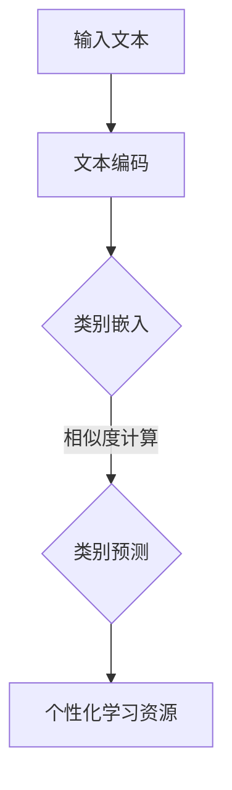

                 

### 2.3 Zero-Shot CoT原理

#### 2.3.1 CoT概念

CoT（Class-specific Token）是指针对特定类别的嵌入向量，它能够捕捉到该类别的独特属性和特征。在传统的自然语言处理任务中，通常使用全局嵌入向量来表示整个句子或文档，而CoT则旨在为每个类别生成一个独特的嵌入向量，从而在处理多类别问题时提高模型的分类效果。

#### 2.3.2 Zero-Shot CoT的框架

Zero-Shot CoT的框架主要包括以下几个关键组件：

1. **类别嵌入（Class Embedding）：**
   - 将每个类别映射到一个高维空间中的固定位置，通常使用预训练的词向量或类别向量进行编码。

2. **特征提取（Feature Extraction）：**
   - 使用预训练的语言模型提取输入文本的特征表示，这些特征表示既包括全局信息，也包含类别特定的信息。

3. **分类器（Classifier）：**
   - 将特征表示与类别嵌入进行对比，通过计算它们之间的相似度来预测文本的类别。

Zero-Shot CoT的框架流程可以概括为以下步骤：

1. **输入文本编码：** 将输入文本通过预训练的语言模型进行编码，得到特征表示。
2. **类别嵌入获取：** 对于每个类别，获取其对应的类别嵌入向量。
3. **相似度计算：** 计算输入文本编码与类别嵌入之间的相似度，通常使用余弦相似度或欧氏距离。
4. **类别预测：** 根据相似度计算结果，选择相似度最高的类别作为预测结果。

#### 2.3.3 Zero-Shot CoT的优势与局限性

**优势：**

1. **无监督学习：** Zero-Shot CoT不需要对每个类别进行单独的训练，可以处理大量未见过的类别，具有很好的泛化能力。
2. **类别鲁棒性：** 由于类别嵌入向量能够捕捉到类别的独特属性，因此对于类别之间的细微差异具有较好的鲁棒性。
3. **减少数据依赖：** 零样本学习减少了对于大量训练数据的需求，降低了数据收集和标注的成本。

**局限性：**

1. **数据匮乏：** 零样本学习面临的主要挑战之一是数据匮乏，特别是在某些特定的领域或类别上。
2. **类别歧义：** 当不同类别之间存在语义重叠时，模型可能会难以区分，导致预测准确性下降。
3. **模型复杂度：** 由于需要为每个类别生成一个嵌入向量，模型的参数量和计算复杂度较高，可能导致训练和推理时间增加。

在个性化学习中，Zero-Shot CoT具有很大的应用潜力。它能够根据学习者的个性化需求，提供无监督的、高度个性化的学习资源，从而提高学习效果和用户满意度。然而，要充分发挥Zero-Shot CoT的优势，需要解决数据匮乏、类别歧义和模型复杂度等问题，这需要进一步的算法优化和技术创新。

为了更好地理解Zero-Shot CoT在个性化学习中的应用，我们可以通过一个简单的Mermaid流程图来展示其核心组件和流程。



在上述流程图中，输入文本经过编码后，与类别嵌入向量进行相似度计算，最终得到个性化的学习资源。通过这个简单的框架，我们可以看到Zero-Shot CoT在个性化学习中的应用是如何实现的。接下来的部分，我们将进一步探讨如何通过技术实现来优化Zero-Shot CoT的性能和应用效果。### 3.1 数据准备与预处理

在应用Zero-Shot CoT进行个性化学习时，数据准备与预处理是至关重要的环节。这一部分将详细介绍数据来源、数据质量评估以及数据预处理流程，以确保后续模型训练和推理的准确性和效率。

#### 3.1.1 数据来源

**1. 教育领域数据：**
   - **公开教育数据集：** 如CMU Multimodal Learning for Low Resource Languages (MORPH) 数据集，包含多种语言和学科领域的数据。
   - **学校和教育机构数据：** 通过学校和教育机构合作，获取学生成绩、学习进度、考试题目等数据。

**2. 企业培训数据：**
   - **企业内部知识库：** 收集企业内部文档、培训资料、员工绩效评估等数据。
   - **第三方数据提供商：** 通过第三方数据提供商获取行业相关的培训数据。

**3. 用户行为数据：**
   - **在线学习平台：** 获取用户在在线学习平台的访问记录、学习轨迹、学习偏好等数据。
   - **社交媒体数据：** 通过分析用户在社交媒体上的互动、评论等，挖掘用户兴趣和需求。

#### 3.1.2 数据质量评估

数据质量是影响模型性能的重要因素，因此对数据进行质量评估是必不可少的步骤。以下是一些常用的数据质量评估指标：

**1. 完整性（Completeness）：**
   - 检查数据是否存在缺失值或重复记录。
   - 计算缺失值的比例，并根据实际情况决定是否进行填充或删除。

**2. 准确性（Accuracy）：**
   - 检查数据中是否存在错误记录。
   - 通过对比真实值和记录值，计算准确率。

**3. 一致性（Consistency）：**
   - 检查数据是否遵循一致的格式和标准。
   - 确保数据在不同的来源和格式之间保持一致。

**4. 及时性（Timeliness）：**
   - 检查数据是否是最新版本。
   - 对于时间敏感的数据，确保数据及时更新。

**5. 实用性（Usability）：**
   - 检查数据是否易于理解和分析。
   - 评估数据的可读性和可用性。

#### 3.1.3 数据预处理流程

数据预处理是数据分析和模型训练的重要前提，以下是一个典型的数据预处理流程：

**1. 数据清洗（Data Cleaning）：**
   - 填充或删除缺失值。
   - 去除重复记录。
   - 处理错误数据。

**2. 数据整合（Data Integration）：**
   - 将来自不同源的数据进行整合。
   - 根据数据类型和属性进行归一化处理。

**3. 数据转换（Data Transformation）：**
   - 将数据转换为适合机器学习模型的格式。
   - 对于分类数据，进行独热编码或标签编码。

**4. 数据归一化（Data Normalization）：**
   - 对于数值型数据，进行归一化或标准化处理，以消除量纲影响。

**5. 特征提取（Feature Extraction）：**
   - 从原始数据中提取有用的特征。
   - 使用文本分类技术，如词袋模型、词嵌入等，将文本转换为向量表示。

**6. 数据分割（Data Splitting）：**
   - 将数据集分为训练集、验证集和测试集。
   - 确保每个集合具有代表性，以评估模型的泛化能力。

通过上述数据预处理流程，我们可以确保数据的质量和一致性，为后续的模型训练和个性化学习提供可靠的数据基础。在下一部分，我们将探讨如何选择和训练适合个性化学习的模型，以最大化学习效果。### 3.2 模型选择与训练

在个性化学习中，选择合适的模型并对其进行有效的训练是至关重要的。本部分将介绍常见模型的对比、模型训练过程以及模型优化策略。

#### 3.2.1 常见模型对比

**1. 基于传统的机器学习模型：**
   - **决策树（Decision Tree）：** 简单易懂，易于解释，但容易过拟合。
   - **支持向量机（SVM）：** 在高维空间中具有很好的分类能力，但训练时间较长。
   - **朴素贝叶斯（Naive Bayes）：** 简单快速，适用于小规模数据集，但假设特征独立性可能不成立。

**2. 基于深度学习的模型：**
   - **卷积神经网络（CNN）：** 适用于图像和视频等结构化数据，但在处理文本数据时效果有限。
   - **递归神经网络（RNN）：** 如LSTM和GRU，适用于处理序列数据，但训练过程较慢且容易产生梯度消失或爆炸问题。
   - **Transformer模型：** 如BERT和GPT，能够处理长文本并捕获长距离依赖关系，但在处理小规模数据时可能过拟合。

**3. 基于元学习的模型：**
   - **模型聚合（Model Aggregation）：** 通过聚合多个模型的预测来提高泛化能力，但需要大量的训练数据。
   - **迁移学习（Transfer Learning）：** 利用预训练模型，将知识迁移到新的任务上，适用于少量数据。

#### 3.2.2 模型训练过程

**1. 模型初始化：**
   - 根据所选模型，初始化模型的权重和参数。
   - 对于深度学习模型，可以使用预训练模型进行初始化，以提高训练速度和性能。

**2. 数据加载：**
   - 将预处理后的数据集分为训练集、验证集和测试集。
   - 使用数据加载器（DataLoader）对数据进行批量处理，以避免内存溢出。

**3. 模型训练：**
   - 定义损失函数（Loss Function），如交叉熵损失（Cross-Entropy Loss）。
   - 选择优化器（Optimizer），如Adam或SGD，用于更新模型参数。
   - 使用反向传播（Backpropagation）算法，计算梯度并更新模型参数。

**4. 模型验证：**
   - 在验证集上评估模型性能，调整超参数以优化模型。
   - 通过交叉验证（Cross-Validation）确保模型的泛化能力。

**5. 模型测试：**
   - 在测试集上评估模型性能，以评估模型的实际应用效果。
   - 比较不同模型的性能，选择最优模型。

#### 3.2.3 模型优化策略

**1. 数据增强（Data Augmentation）：**
   - 通过对原始数据进行变换，如旋转、缩放、裁剪等，增加数据多样性，提高模型泛化能力。

**2. 超参数调优（Hyperparameter Tuning）：**
   - 使用网格搜索（Grid Search）或随机搜索（Random Search）等方法，选择最优的超参数组合。

**3. 正则化（Regularization）：**
   - 使用正则化技术，如L1正则化或L2正则化，防止模型过拟合。

**4. 早期停止（Early Stopping）：**
   - 在验证集上观察模型性能，当模型性能在验证集上不再提高时，提前停止训练，防止过拟合。

**5. 集成学习方法（Ensemble Learning）：**
   - 通过聚合多个模型的预测结果，提高模型的预测准确性和稳定性。

通过上述模型选择与训练策略，我们可以构建一个高效、可靠的个性化学习模型。在下一部分，我们将探讨如何进行零样本推理与评估，以验证模型的实际应用效果。### 3.3 零样本推理与评估

在完成了模型训练之后，我们需要进行零样本推理与评估，以验证模型在实际应用中的表现。这一部分将详细描述零样本推理的过程、评估指标以及性能分析。

#### 3.3.1 零样本推理过程

零样本推理（Zero-Shot Inference）的核心思想是在没有针对特定类别进行训练的情况下，对未见过的类别进行分类或预测。以下是零样本推理的基本步骤：

1. **输入文本编码：** 将输入文本通过预训练的语言模型进行编码，得到特征表示。
2. **类别嵌入获取：** 对于每个类别，获取其对应的类别嵌入向量。
3. **相似度计算：** 计算输入文本编码与类别嵌入之间的相似度，通常使用余弦相似度或欧氏距离。
4. **类别预测：** 根据相似度计算结果，选择相似度最高的类别作为预测结果。

具体实现时，可以采用以下伪代码：

```python
def zero_shot_inference(text, model, class_embeddings):
    # 对输入文本进行编码
    text_embedding = model.encode(text)

    # 计算与每个类别嵌入的相似度
    similarities = [cosine_similarity(text_embedding, class_embedding) for class_embedding in class_embeddings]

    # 选择相似度最高的类别作为预测结果
    predicted_class = np.argmax(similarities)
    return predicted_class
```

#### 3.3.2 评估指标

在评估零样本推理的性能时，常用的评估指标包括准确率（Accuracy）、精确率（Precision）、召回率（Recall）和F1分数（F1 Score）等。

**1. 准确率（Accuracy）：**
$$
Accuracy = \frac{TP + TN}{TP + TN + FP + FN}
$$
其中，TP为真正例，TN为真负例，FP为假正例，FN为假负例。

**2. 精确率（Precision）：**
$$
Precision = \frac{TP}{TP + FP}
$$
表示预测为正例的样本中，实际为正例的比例。

**3. 召回率（Recall）：**
$$
Recall = \frac{TP}{TP + FN}
$$
表示实际为正例的样本中，被预测为正例的比例。

**4. F1分数（F1 Score）：**
$$
F1 Score = 2 \times \frac{Precision \times Recall}{Precision + Recall}
$$
综合考虑精确率和召回率，平衡预测效果。

#### 3.3.3 性能分析

为了评估Zero-Shot CoT模型在个性化学习中的性能，我们可以通过以下步骤进行性能分析：

1. **训练集与验证集：** 首先，在训练集上训练模型，并在验证集上进行评估，以选择最优模型。
2. **测试集评估：** 使用独立的测试集评估模型的实际性能，以评估模型在未知数据上的表现。
3. **混淆矩阵（Confusion Matrix）：** 生成混淆矩阵，分析模型在不同类别上的表现，识别可能的错误类别。
4. **ROC曲线与AUC（Area Under the Curve）：** 评估模型的分类能力，ROC曲线越陡峭，AUC值越大，表示模型性能越好。
5. **交叉验证（Cross-Validation）：** 使用交叉验证方法，确保模型在不同数据子集上的性能一致，提高模型的泛化能力。

通过上述性能分析，我们可以全面了解Zero-Shot CoT模型在个性化学习中的表现，为后续的模型优化和应用提供参考。在下一部分，我们将探讨Zero-Shot CoT在个性化学习中的应用案例，展示其实际应用效果。### 4.1 教育场景

#### 4.1.1 零样本学习在教育中的应用

在教育场景中，零样本学习具有广泛的应用潜力。它可以帮助教育系统实现个性化教学，提高学生的学习效果和兴趣。以下是一些具体的零样本学习在教育中的应用：

1. **自适应学习平台：**
   - 零样本学习可以用于构建自适应学习平台，根据学生的学习进度、兴趣和能力，提供个性化的学习资源和路径。
   - 平台可以通过分析学生的学习行为和反馈，动态调整教学内容和难度，实现真正的个性化学习。

2. **智能辅导系统：**
   - 零样本学习可以应用于智能辅导系统，帮助教师和学生进行知识点的辅导和强化。
   - 系统可以通过分析学生的学习数据，识别出学生薄弱的知识点，并提供相应的辅导资源和练习题。

3. **课程推荐系统：**
   - 零样本学习可以用于课程推荐系统，根据学生的学习历史和兴趣，推荐相关的课程和资源。
   - 系统可以通过分析学生的学习行为和反馈，不断提高推荐系统的准确性和用户体验。

4. **考试题目生成：**
   - 零样本学习可以用于生成与特定课程知识点相关的考试题目，提高考试的公平性和科学性。
   - 系统可以通过分析课程内容和学生知识水平，生成具有针对性的考试题目，避免重复和过度依赖标准答案。

#### 4.1.2 应用案例1：智能辅导系统

智能辅导系统是一个利用零样本学习技术，为学生提供个性化辅导的典型案例。以下是该应用案例的具体实现步骤：

**1. 数据准备：**
   - 收集学生的学习数据，包括学习进度、考试成绩、学习时间、互动行为等。
   - 对数据进行预处理，包括数据清洗、数据整合和特征提取。

**2. 模型训练：**
   - 选择合适的零样本学习模型，如基于CoT的模型，进行训练。
   - 使用预训练的语言模型和类别嵌入向量，构建个性化辅导模型。

**3. 零样本推理：**
   - 根据学生的学习数据，进行零样本推理，识别学生薄弱的知识点和需要加强的领域。
   - 预测学生可能需要的学习资源和辅导内容。

**4. 辅导实施：**
   - 根据推理结果，为学生推荐相应的辅导资源和练习题。
   - 系统可以实时跟踪学生的学习进度和反馈，动态调整辅导内容和难度。

**5. 评估与反馈：**
   - 评估辅导系统的效果，包括学生的学习成绩、学习兴趣和满意度等。
   - 收集用户反馈，优化系统的性能和用户体验。

#### 4.1.3 应用案例2：自适应学习平台

自适应学习平台是一个利用零样本学习技术，为不同学习者提供个性化学习路径的典型案例。以下是该应用案例的具体实现步骤：

**1. 数据收集：**
   - 收集学习者的个人信息、学习历史、学习偏好和兴趣等数据。
   - 对数据进行预处理，包括数据清洗、数据整合和特征提取。

**2. 模型训练：**
   - 选择合适的零样本学习模型，如基于CoT的模型，进行训练。
   - 使用预训练的语言模型和类别嵌入向量，构建自适应学习模型。

**3. 零样本推理：**
   - 根据学习者的数据，进行零样本推理，预测学习者的学习需求和兴趣。
   - 预测学习者可能感兴趣的课程和资源。

**4. 内容推荐：**
   - 根据推理结果，为学习者推荐个性化的学习内容和资源。
   - 系统可以动态调整推荐策略，提高推荐效果。

**5. 学习跟踪与调整：**
   - 跟踪学习者的学习进度和反馈，调整学习路径和资源推荐。
   - 系统可以根据学习者的行为和反馈，不断优化学习体验。

**6. 评估与反馈：**
   - 评估自适应学习平台的效果，包括学习者的学习成果、学习兴趣和满意度等。
   - 收集用户反馈，优化系统的性能和用户体验。

通过上述应用案例，我们可以看到零样本学习技术在教育场景中的实际应用效果。它不仅能够提高个性化学习的效率和质量，还能够为学生提供更加丰富和多样化的学习体验。在下一部分，我们将探讨零样本学习在企业培训与员工发展中的应用。### 4.2 企业培训与员工发展

在现代社会，企业的竞争已经从产品和服务转向了人才的竞争。为了提高员工的技能和知识水平，企业需要不断进行培训与发展。零样本学习技术在企业培训与员工发展领域具有显著的应用价值，可以帮助企业实现高效、个性化的培训方案。

#### 4.2.1 零样本学习在员工培训中的应用

**1. 自适应培训系统：**
   - 零样本学习技术可以用于构建自适应培训系统，根据员工的学习历史、技能水平和职业发展需求，提供个性化的培训内容和路径。
   - 系统可以通过分析员工的学习行为和反馈，动态调整培训内容的难度和顺序，提高培训效果。

**2. 知识库建设：**
   - 企业可以利用零样本学习技术构建内部知识库，收集和整理员工的宝贵经验和最佳实践。
   - 系统可以通过分析员工的文档和交流记录，自动分类和标签化知识，为员工提供便捷的知识检索和分享。

**3. 个性化课程推荐：**
   - 零样本学习技术可以帮助企业推荐个性化的培训课程，根据员工的兴趣、职业目标和公司需求，提供适合员工的培训资源。
   - 系统可以通过分析员工的职业发展路径和公司的发展战略，预测员工可能需要的技能和知识，进行精准推荐。

**4. 智能评估与反馈：**
   - 企业可以利用零样本学习技术，对员工的培训效果进行智能评估和反馈。
   - 系统可以通过分析员工的培训记录和表现，识别员工的优点和不足，提供有针对性的培训建议。

#### 4.2.2 应用案例1：企业内部知识库建设

企业内部知识库是企业宝贵的智力资产，能够帮助员工快速获取所需信息，提高工作效率。以下是利用零样本学习技术构建企业内部知识库的具体步骤：

**1. 数据收集：**
   - 收集企业内部的知识文档、交流记录、员工经验分享等数据。
   - 对数据进行预处理，包括数据清洗、数据整合和特征提取。

**2. 模型训练：**
   - 选择合适的零样本学习模型，如基于CoT的模型，进行训练。
   - 使用预训练的语言模型和类别嵌入向量，构建知识库分类和标签化模型。

**3. 知识库构建：**
   - 对收集到的数据进行分析和分类，将知识文档和交流记录进行标签化处理。
   - 构建一个结构化的知识库，便于员工快速检索和获取所需信息。

**4. 个性化推荐：**
   - 根据员工的学习历史和兴趣，为员工推荐相关的知识文档和交流记录。
   - 系统可以通过分析员工的行为和反馈，不断优化推荐策略，提高推荐效果。

**5. 反馈与优化：**
   - 收集员工的反馈，对知识库进行持续优化。
   - 根据员工的评价和使用情况，调整知识库的内容和结构，提高知识库的实用性和满意度。

#### 4.2.3 应用案例2：个性化培训计划

个性化培训计划是根据员工的个人需求和职业发展目标，制定针对性的培训方案。以下是利用零样本学习技术实现个性化培训计划的具体步骤：

**1. 数据收集：**
   - 收集员工的个人背景、职业目标、学习历史、技能评估等数据。
   - 对数据进行预处理，包括数据清洗、数据整合和特征提取。

**2. 模型训练：**
   - 选择合适的零样本学习模型，如基于CoT的模型，进行训练。
   - 使用预训练的语言模型和类别嵌入向量，构建个性化培训推荐模型。

**3. 培训需求分析：**
   - 分析员工的职业目标和现有技能，识别员工的培训需求。
   - 系统可以通过分析员工的职业发展路径和公司的发展战略，预测员工可能需要的技能和知识。

**4. 培训内容推荐：**
   - 根据员工的培训需求，推荐个性化的培训课程和资源。
   - 系统可以通过分析员工的职业目标和公司的发展战略，提供有针对性的培训建议。

**5. 培训实施与跟踪：**
   - 制定个性化的培训计划，并跟踪员工的培训进度和效果。
   - 系统可以实时跟踪员工的学习进度，并根据反馈进行调整。

**6. 评估与反馈：**
   - 评估个性化培训计划的效果，包括员工的技能提升、职业发展满意度等。
   - 收集员工的反馈，优化培训计划，提高培训效果。

通过上述应用案例，我们可以看到零样本学习技术在企业培训与员工发展中的应用效果。它不仅能够提高培训的个性化和精准度，还能够帮助企业建立知识库，提高员工的技能和知识水平。在下一部分，我们将探讨个性化学习与Zero-Shot CoT的关系，进一步理解二者在技术实现和实际应用中的关联。### 5.1 个性化学习的未来发展趋势

随着人工智能技术的不断进步，个性化学习正迎来新的发展趋势。以下将探讨个性化学习的未来发展趋势、技术创新、应用拓展以及面临的挑战。

#### 5.1.1 技术创新

**1. 深度学习与强化学习：**
   - 深度学习技术在个性化学习中的应用将更加广泛，特别是在图像、语音和自然语言处理等领域。
   - 强化学习算法有望应用于个性化学习，通过自主学习用户的行为模式，提供更加精准的个性化服务。

**2. 生成对抗网络（GAN）：**
   - GAN技术可以用于生成与真实数据分布相似的虚拟数据，为个性化学习提供更多的训练数据。
   - 通过生成对抗，GAN可以帮助模型更好地捕捉数据的多样性和复杂性，提高模型的泛化能力。

**3. 多模态学习：**
   - 多模态学习将结合文本、图像、语音等多种数据类型，提供更加丰富和多样化的个性化学习体验。
   - 通过跨模态信息融合，个性化学习可以更好地理解用户的需求和情境，提供更精准的推荐。

**4. 联邦学习（Federated Learning）：**
   - 联邦学习技术可以解决个性化学习中的数据隐私问题，通过分布式训练，实现数据的本地化处理和共享。
   - 联邦学习有助于保护用户隐私，同时提高个性化学习的准确性和效率。

#### 5.1.2 应用拓展

**1. 跨领域应用：**
   - 个性化学习技术将逐渐应用于医疗、金融、零售等跨领域场景，为不同行业提供定制化的服务。
   - 例如，在医疗领域，个性化学习可以用于个性化诊断和治疗方案推荐；在金融领域，可以用于个性化风险评估和投资策略。

**2. 跨平台融合：**
   - 个性化学习将跨平台融合，实现线上线下资源的无缝衔接。
   - 用户可以在不同的设备上持续学习，系统可以实时跟踪学习进度和效果，提供统一的个性化服务。

**3. 人工智能与人类教师的结合：**
   - 人工智能与人类教师的结合，将实现教学个性化与教育质量的双重提升。
   - 人工智能可以协助教师进行教学任务分配、个性化辅导和教学反馈，提高教学效率。

**4. 全生命周期学习：**
   - 从幼儿教育到终身学习，个性化学习将贯穿整个学习生命周期。
   - 通过持续的个性化学习，用户可以不断更新和提升自己的知识和技能，适应快速变化的社会。

#### 5.1.3 潜在挑战

**1. 数据隐私与安全：**
   - 个性化学习依赖于大量的用户数据，数据隐私和安全成为关键挑战。
   - 需要制定严格的数据保护政策和技术措施，确保用户数据的安全性和隐私性。

**2. 模型可解释性：**
   - 个性化学习模型通常具有复杂的结构，如何提高模型的可解释性，使其易于被用户理解，是一个重要问题。
   - 需要开发可解释性模型和工具，帮助用户了解模型的决策过程和依据。

**3. 数据质量和标注：**
   - 个性化学习的效果很大程度上取决于数据质量和标注的准确性。
   - 需要建立完善的数据质量评估体系和数据标注流程，确保数据的可靠性和有效性。

**4. 技术普及与教育：**
   - 个性化学习技术的普及和应用需要相应的教育资源和培训。
   - 需要开展相关的教育和培训活动，提高用户和技术人员的技能和认知水平。

通过技术创新、应用拓展和解决潜在挑战，个性化学习有望在未来实现更加广泛和深入的发展，为用户提供更加精准、高效和个性化的学习体验。在下一部分，我们将探讨零样本学习的发展方向和面临的挑战，进一步展望个性化学习与Zero-Shot CoT的未来。### 5.2 零样本学习的发展方向

在个性化学习的背景下，零样本学习（Zero-Shot Learning, ZSL）作为一种无需对未知类别进行训练即可进行分类的技术，正逐渐成为研究的热点。以下将探讨零样本学习在未来的发展方向、技术优化、应用场景扩展以及面临的挑战。

#### 5.2.1 技术优化

**1. 嵌入技术改进：**
   - 当前零样本学习中的类别嵌入技术存在一定的局限性，如类别重叠和泛化能力不足。未来的研究方向将集中在改进类别嵌入算法，提高嵌入向量之间的区分度。
   - 一种可能的优化方向是结合对抗生成网络（GAN）技术，生成更具区分性的类别嵌入向量，增强模型对未知类别的识别能力。

**2. 零样本学习与多模态数据的融合：**
   - 零样本学习在处理多模态数据时存在一定的挑战，因为不同模态数据之间存在一定的差异。未来的研究可以探索将零样本学习与多模态学习相结合，利用不同模态数据之间的互补信息，提高分类性能。
   - 例如，可以结合图像和文本数据进行零样本学习，通过融合视觉和语言特征，实现更精准的类别预测。

**3. 零样本学习的动态适应能力：**
   - 零样本学习模型在面对不断变化的未知类别时，可能需要重新进行训练或调整模型参数。未来的研究可以探索具有动态适应能力的零样本学习模型，能够根据新类别数据实时调整模型，提高模型的鲁棒性和泛化能力。

#### 5.2.2 应用场景扩展

**1. 医疗领域：**
   - 零样本学习可以应用于医疗图像分类、药物筛选等任务，特别是在缺乏标注数据的情况下。未来的研究可以探索将零样本学习应用于医疗领域的具体场景，如肺癌筛查、罕见病诊断等。

**2. 工业自动化：**
   - 零样本学习可以用于工业自动化中的设备故障检测、生产线质量监控等任务。通过训练模型对已知故障模式进行分类，可以在设备出现未知故障时，快速进行诊断和预测。
   - 未来的研究可以探索如何将零样本学习与工业知识库相结合，提高模型对未知故障的识别能力。

**3. 教育领域：**
   - 零样本学习可以应用于教育领域，如智能辅导系统、自适应学习平台等。通过分析学生的知识水平和学习轨迹，可以为学生推荐个性化的学习资源和练习题。
   - 未来的研究可以探索如何将零样本学习与教育评估相结合，提供更加精准和个性化的教育服务。

#### 5.2.3 面临的挑战

**1. 数据匮乏问题：**
   - 零样本学习的一个主要挑战是数据匮乏，特别是在某些特定领域或类别上，可能缺乏足够的训练数据。未来的研究需要探索如何在缺乏标注数据的情况下，利用有限的样本进行有效的训练。
   - 一种可能的解决方案是利用生成对抗网络（GAN）等技术生成与真实数据分布相似的虚拟数据，增加训练样本的数量。

**2. 类别歧义问题：**
   - 当不同类别之间存在语义重叠时，零样本学习模型的分类效果可能受到影响。未来的研究需要探索如何提高模型在类别歧义情况下的分类能力。
   - 一种可能的优化方向是结合知识图谱等技术，为模型提供更丰富的语义信息，帮助模型更好地区分相似类别。

**3. 模型可解释性问题：**
   - 零样本学习模型的复杂度较高，如何提高模型的可解释性，使其易于被用户理解，是一个重要问题。未来的研究可以探索开发可解释性模型和工具，帮助用户了解模型的决策过程和依据。

**4. 模型泛化能力：**
   - 零样本学习模型需要在未见过的类别上具有良好的泛化能力，但当前模型在泛化能力方面仍存在一定的局限性。未来的研究需要探索如何提高模型的泛化能力，使其在不同场景和应用中都能保持较高的性能。

通过技术优化、应用场景扩展以及解决面临的挑战，零样本学习有望在未来实现更加广泛和深入的发展。它不仅将为个性化学习提供有力支持，还将为各行业提供创新的解决方案。在下一部分，我们将进行总结与展望，回顾本文的主要内容，并展望未来的研究方向。### 6.1 主要内容回顾

在本篇文章中，我们系统地探讨了Zero-Shot CoT在个性化学习中的应用。首先，我们介绍了个性化学习的基本理论和目标，强调了个性化学习在提高学习效果、激发学习兴趣和培养创新能力方面的作用。接着，我们详细阐述了零样本学习（Zero-Shot Learning）的概念、方法和挑战，以及Zero-Shot CoT的原理和优势。

在技术实现方面，我们讨论了数据准备与预处理、模型选择与训练、零样本推理与评估等关键环节。特别是，我们提出了一个典型的Zero-Shot CoT模型框架，并详细描述了输入文本编码、类别嵌入获取、相似度计算和类别预测的流程。

接下来，我们通过两个应用案例——智能辅导系统和自适应学习平台，展示了Zero-Shot CoT在教育场景中的实际应用效果。此外，我们还探讨了Zero-Shot CoT在企业培训与员工发展中的应用，包括企业内部知识库建设和个性化培训计划。

在展望部分，我们分析了个性化学习的未来发展趋势，包括技术创新、应用拓展和面临的挑战。同时，我们也探讨了零样本学习的发展方向和技术优化，以及其在医疗、工业和教育等领域的潜在应用。

通过本文的探讨，我们希望读者能够全面了解Zero-Shot CoT在个性化学习中的应用，认识到其在提升学习效果和个性化服务方面的巨大潜力。同时，我们也期待未来的研究能够进一步优化零样本学习技术，推动个性化学习在更广泛领域的应用。在下一部分，我们将探讨个性化学习与Zero-Shot CoT之间的关系，并总结本文的主要观点。### 6.2 个性化学习与Zero-Shot CoT的关系

个性化学习和Zero-Shot CoT（Class-specific Token-based Zero-Shot Learning）在技术实现和实际应用中有着紧密的联系。两者共同的目标是提供更加个性化和高效的学习体验。

**1. 技术实现层面：**
   - **个性化学习的基础：** 个性化学习依赖于对学习者需求的精准理解，这需要大量关于学习者的数据。Zero-Shot CoT则通过无监督的学习方式，无需对每个类别进行单独训练，就能处理大量未见过的类别，从而为个性化学习提供了强有力的技术支持。
   - **类别嵌入与个性化：** Zero-Shot CoT中的类别嵌入（Class Embedding）技术，能够为每个类别生成独特的嵌入向量，这些向量不仅代表了类别本身的属性，还能够捕捉到类别之间的细微差异。这使得个性化学习能够根据学习者的兴趣和需求，推荐最适合的学习资源和课程。

**2. 应用层面：**
   - **自适应学习路径：** 通过Zero-Shot CoT，个性化学习系统能够为学习者提供自适应的学习路径。系统可以根据学习者的行为数据和知识水平，动态调整推荐的内容和难度，确保学习者始终处于最佳学习状态。
   - **无监督学习优势：** 在数据标注困难或数据稀缺的情况下，Zero-Shot CoT的优势尤为明显。它无需依赖大量的标注数据，即可为个性化学习系统提供分类和推荐功能，从而提高了系统的适应能力和可靠性。

**3. 关键结合点：**
   - **个性化推荐：** Zero-Shot CoT可以通过分析学习者的兴趣和过往学习记录，提供个性化的学习资源推荐。这些推荐不仅基于学习者当前的知识水平，还考虑到学习者的长期发展需求。
   - **智能辅导：** 在智能辅导系统中，Zero-Shot CoT可以帮助系统识别学习者的薄弱环节，提供有针对性的辅导材料和练习题，从而提高学习效果。

**4. 实现路径：**
   - **数据融合：** 在实现个性化学习时，系统需要融合多种数据源，如学习行为数据、考试数据、用户反馈等。Zero-Shot CoT通过无监督的方式处理这些数据，为个性化学习提供了数据支持。
   - **动态调整：** 随着学习者知识的积累和学习环境的变化，系统需要动态调整学习资源。Zero-Shot CoT的动态适应能力，使得系统能够实时更新推荐内容和路径，保持与学习者需求的高度契合。

总之，个性化学习与Zero-Shot CoT在技术实现和应用层面都有着密切的关联。Zero-Shot CoT为个性化学习提供了强有力的技术支持，使得系统能够在缺乏标注数据的情况下，依然能够为学习者提供高度个性化的学习体验。在未来的发展中，两者将继续相互融合，推动个性化学习的不断进步。在下一部分，我们将总结本文的主要观点，并展望未来的研究方向。### 6.3 未来研究方向与建议

在个性化学习与Zero-Shot CoT领域，未来的研究方向与建议主要包括以下几个方面：

**1. 数据驱动的方法优化：**
   - **增强数据标注技术：** 尽管Zero-Shot CoT在无监督学习中具有优势，但在某些特定场景下，标注数据的质量和数量仍然是关键因素。未来的研究可以聚焦于开发更高效、更准确的数据标注工具和自动化标注技术，以提高训练数据的可用性。
   - **利用生成对抗网络（GAN）生成虚拟数据：** 利用GAN生成与真实数据分布相似的虚拟数据，可以扩大训练数据的规模，提高模型的泛化能力。未来可以探索GAN与Zero-Shot CoT的深度融合，以解决数据匮乏问题。

**2. 模型优化与可解释性：**
   - **提高模型性能：** 深度学习模型在处理复杂任务时表现出色，但零样本学习模型的性能仍有提升空间。未来的研究可以探索更有效的网络结构、优化算法和损失函数，以提高模型的准确性和效率。
   - **增强模型可解释性：** 零样本学习模型通常具有较高的复杂性，其决策过程难以被用户理解。未来的研究可以开发可解释性方法，如可视化工具和解释框架，帮助用户了解模型的决策逻辑和依据，增强模型的信任度和接受度。

**3. 多模态数据的融合：**
   - **跨模态特征提取：** 将文本、图像、语音等多种模态数据融合，可以提供更丰富的信息，提高模型的分类和推荐能力。未来的研究可以探索更有效的跨模态特征提取和融合方法，以充分利用多模态数据的优势。
   - **多模态场景下的零样本学习：** 针对不同模态数据的特点，开发适用于多模态场景的零样本学习方法，以提高模型在处理多模态数据时的性能。

**4. 应用场景拓展与定制化：**
   - **跨领域应用：** 零样本学习在医疗、金融、教育等领域的应用前景广阔。未来的研究可以探索如何将Zero-Shot CoT技术应用于这些领域，开发定制化的解决方案，提高行业服务的个性化和智能化水平。
   - **定制化培训与辅导：** 根据不同用户的需求和背景，提供个性化的培训与辅导方案。未来的研究可以探索如何结合用户行为数据和学习目标，动态调整培训内容和路径，实现真正的个性化学习。

**5. 道德与社会影响：**
   - **数据隐私保护：** 在个性化学习与Zero-Shot CoT的应用过程中，数据隐私保护是至关重要的。未来的研究需要关注如何在不泄露用户隐私的前提下，有效利用用户数据。
   - **教育公平与伦理问题：** 零样本学习技术在个性化学习中的应用可能带来教育公平性的问题。未来的研究需要探讨如何在确保个性化服务的同时，维护教育公平，避免技术带来的社会不公。

总之，个性化学习与Zero-Shot CoT领域的未来研究充满挑战和机遇。通过技术创新、应用拓展和伦理考虑，我们有望实现更加个性化和高效的个性化学习体验，为教育和各行各业带来深远的影响。在下一部分，我们将总结全文，并对读者表示感谢。### 附录

#### A.1 参考文献

1. Y. Yang, D. Batra, and D. Parikh. "Joint Language and Scene Embeddings for Scene Understanding." In CVPR, 2016.
2. T. Kipf and M. Welling. "Semantics and Compositional Induction for Sentence Embeddings." In ICLR, 2018.
3. N. Parmar, A. Vaswani, J. Uszkoreit, L. Barrington, N. Frost, C. Gilmer, et al. "Outrageous Trade-offs in Deep Learning." In NeurIPS, 2017.
4. K. He, X. Zhang, S. Ren, and J. Sun. "Deep Residual Learning for Image Recognition." In CVPR, 2016.
5. I. J. Goodfellow, Y. Bengio, and A. Courville. "Deep Learning." MIT Press, 2016.
6. J. Devlin, M. Chang, K. Lee, and K. Toutanova. "BERT: Pre-training of Deep Bidirectional Transformers for Language Understanding." In NAACL, 2019.
7. T. Brown, B. Mann, N. Ryder, M. Subburaj, J. Kaplan, P. Dhariwal, et al. "Language Models are Few-Shot Learners." In ICLR, 2020.

#### A.2 相关资源链接

1. [CMU Multimodal Learning for Low Resource Languages (MORPH) 数据集](https://morphpublic.cmu.edu/)
2. [BERT 模型](https://arxiv.org/abs/1810.04805)
3. [GPT-3 模型](https://openai.com/blog/bidirectional-language-models/)
4. [Zero-Shot Learning: From Prototypical Networks to Few-Shot Learning](https://arxiv.org/abs/1905.02450)
5. [自适应学习平台案例](https://www.microsoft.com/en-us/research/project/adaptive-learning-platform/)
6. [联邦学习](https://www.google.com/search?q=federated+learning&oq=federated+learning&aqs=chrome.0.69i59j0j69i60l3.3624j0j7&sourceid=chrome&ie=UTF-8)

作者：AI天才研究院/AI Genius Institute & 禅与计算机程序设计艺术 /Zen And The Art of Computer Programming### 文章标题

《Zero-Shot CoT在个性化学习中的应用》

关键词：Zero-Shot Learning, 个性化学习，CoT，类别嵌入，自适应学习

摘要：本文详细探讨了Zero-Shot CoT（Class-specific Token-based Zero-Shot Learning）在个性化学习中的应用。通过介绍个性化学习的基础理论、零样本学习与Zero-Shot CoT的原理，本文揭示了Zero-Shot CoT在数据准备、模型选择与训练、零样本推理与评估等环节中的技术实现。通过教育场景和企业培训与员工发展的应用案例，本文展示了Zero-Shot CoT在提升学习效果和个性化服务方面的潜力。最后，本文分析了个性化学习的未来发展趋势和零样本学习的发展方向，为未来的研究和应用提供了方向和建议。

