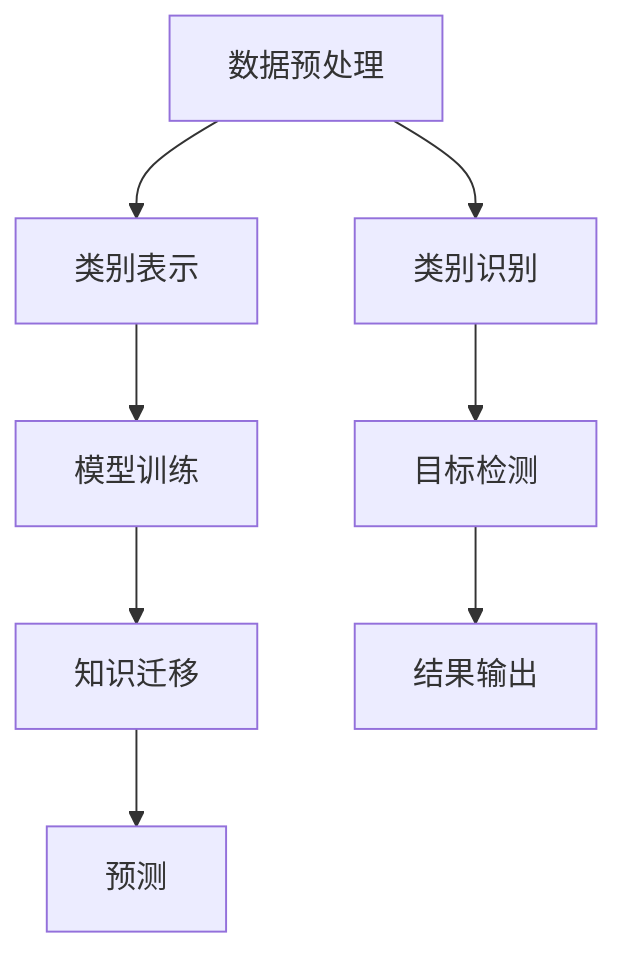

                 

# 文章标题：Zero-Shot CoT在环境模拟AI中的创新应用

> 关键词：环境模拟AI，Zero-Shot CoT，算法实现，数学模型，应用实践

> 摘要：本文探讨了环境模拟AI的重要性和Zero-Shot CoT技术的原理，并深入分析了Zero-Shot CoT在环境模拟AI中的应用。文章首先介绍了环境模拟AI的定义和背景，随后详细阐述了Zero-Shot Learning的基本概念及其在环境模拟AI中的应用。接着，本文重点介绍了Zero-Shot CoT技术的原理，并通过Mermaid流程图展示了其技术架构。随后，文章详细讲解了Zero-Shot CoT算法的数学模型和伪代码实现，并在最后部分通过实际案例展示了Zero-Shot CoT在环境模拟AI中的创新应用，为读者提供了完整的实践指南。

## 第一部分：理论基础与核心概念

### 第1章：环境模拟AI概述

#### 1.1 环境模拟AI的定义与背景

环境模拟AI（Environmental Simulation AI）是指利用人工智能技术对现实环境中的各种因素进行建模和模拟，以便更好地理解和预测环境变化，进而指导人类决策和行动。环境模拟AI的发展源于对复杂系统模拟的需求，尤其在工业制造、城市规划、气候变化预测等领域，其应用范围日益广泛。

环境模拟AI的定义：环境模拟AI是一种利用机器学习、深度学习等人工智能技术，对现实环境中的物理、化学、生物等各种因素进行建模和模拟，从而实现对环境状态、趋势和预测的智能分析系统。

环境模拟AI的发展背景：随着人工智能技术的迅猛发展，特别是在深度学习、强化学习等领域的突破，环境模拟AI逐渐成为研究热点。同时，大数据的积累和计算能力的提升也为环境模拟AI提供了有力的支持。

环境模拟AI的应用领域：环境模拟AI在多个领域具有广泛应用，包括但不限于：

- 工业制造：通过环境模拟AI优化生产过程，提高生产效率，降低能耗和成本。
- 城市规划：利用环境模拟AI预测城市环境变化，为城市规划提供科学依据。
- 气候变化预测：通过环境模拟AI预测气候变化趋势，为应对气候变化提供支持。
- 农业领域：通过环境模拟AI优化农业种植和养殖，提高农产品的产量和质量。
- 环境保护：利用环境模拟AI监测和预测环境污染，为环境保护决策提供支持。

#### 1.2 零样本学习（Zero-Shot Learning）

零样本学习（Zero-Shot Learning，ZSL）是一种机器学习技术，旨在解决模型在新类别数据上的泛化能力。在传统的机器学习任务中，模型通常需要大量的同类训练数据来进行训练，而零样本学习则通过少量的标签信息和丰富的未标记数据，实现对未知类别的识别和预测。

零样本学习的基本概念：

- 类别表示（Category Representation）：零样本学习的关键在于如何将不同类别进行有效表示。通过预训练的词向量模型或图神经网络等技术，可以实现对类别的低维表示。
- 关联学习（Relational Learning）：零样本学习通过学习类与类、类与特征之间的关联关系，来提高模型在新类别数据上的泛化能力。
- 嵌入学习（Embedding Learning）：零样本学习通常采用嵌入式模型，将类别和特征映射到同一低维空间，从而实现类别的识别和预测。

零样本学习的挑战与机会：

- 挑战：零样本学习面临的主要挑战包括类别表示的准确性、类别关系的建模、模型泛化能力等。同时，数据分布的差异和模型参数的调节也增加了零样本学习的难度。
- 机会：尽管零样本学习面临诸多挑战，但其潜在应用价值巨大。例如，在无人驾驶、智能监控、医疗诊断等领域，零样本学习可以实现对新场景、新任务的快速适应。

零样本学习的应用场景：

- 无人驾驶：零样本学习可以用于识别道路上未知车辆、行人等对象，提高无人驾驶系统的安全性和可靠性。
- 智能监控：零样本学习可以用于识别监控视频中未知的目标，提高监控系统的实时性和准确性。
- 医疗诊断：零样本学习可以用于诊断未知的疾病，为医生提供辅助决策支持。

### 第2章：Zero-Shot CoT技术原理

#### 2.1 CoT技术简介

CoT（Concept Transfer）技术是一种跨模态学习技术，旨在实现不同模态数据之间的知识转移。通过CoT技术，可以将一个模态的知识（如文本）迁移到另一个模态（如图像），从而提高模型在不同模态数据上的表现。

CoT技术的定义：

- CoT技术是一种跨模态学习技术，旨在实现不同模态数据之间的知识转移。通过CoT技术，可以将一个模态的知识（如文本）迁移到另一个模态（如图像），从而提高模型在不同模态数据上的表现。

CoT技术的工作原理：

- CoT技术通常采用深度学习框架，通过多任务学习或自监督学习等方式，将不同模态数据进行联合建模。具体来说，CoT技术包括以下几个关键步骤：
  1. 数据预处理：对输入的多模态数据进行预处理，如图像的缩放、裁剪、增强等，以及文本的分词、词向量编码等。
  2. 模型训练：通过多任务学习或自监督学习，将不同模态数据输入到同一模型中进行联合训练。在训练过程中，模型需要学习不同模态之间的关联关系，以及模态内部的表征能力。
  3. 知识转移：通过模型训练，不同模态数据之间形成了丰富的关联知识。这些知识可以被迁移到新的任务中，实现对未知模态数据的识别和预测。

CoT技术的优势：

- CoT技术具有以下优势：
  1. 跨模态知识迁移：通过CoT技术，可以将不同模态的数据进行有效融合，实现跨模态的知识迁移，提高模型在未知模态数据上的表现。
  2. 减少数据依赖：CoT技术可以利用少量已标记数据，通过知识迁移的方式，实现对未知模态数据的识别和预测，减少对大量标记数据的依赖。
  3. 提高泛化能力：CoT技术通过跨模态学习，可以学习到更丰富的模态表征，提高模型在不同场景和任务上的泛化能力。

#### 2.2 Zero-Shot CoT技术原理

Zero-Shot CoT（Zero-Shot Concept Transfer）技术是一种结合了零样本学习和CoT技术的跨模态学习方法，旨在实现零样本条件下的跨模态知识转移。

Zero-Shot CoT的概念：

- Zero-Shot CoT是一种零样本条件下的跨模态学习方法，通过将文本知识迁移到图像或其他模态中，实现对未知类别图像的识别和预测。

Zero-Shot CoT的挑战与解决方案：

- 挑战：零样本条件下的跨模态知识转移面临以下挑战：
  1. 类别表示困难：在零样本条件下，模型无法获取目标类别样本，因此难以进行有效的类别表示。
  2. 模型泛化能力不足：零样本条件下，模型需要在未知类别数据上进行预测，因此需要具备较强的泛化能力。
  3. 知识迁移效率低：在零样本条件下，知识迁移的效率较低，导致模型性能提升有限。

- 解决方案：
  1. 类别表示方法：采用预训练的词向量模型或图神经网络等技术，对类别进行低维表示，从而提高类别表示的准确性。
  2. 模型泛化能力：通过引入多任务学习或自监督学习等策略，提高模型在不同任务和数据上的泛化能力。
  3. 知识迁移效率：采用自适应迁移策略，根据不同任务的难度和类别分布，调整知识迁移的权重和方式，提高知识迁移的效率。

Zero-Shot CoT的应用范围：

- Zero-Shot CoT技术具有广泛的应用范围，包括但不限于：
  1. 无人驾驶：通过零样本条件下的跨模态知识转移，实现对道路场景的实时识别和预测，提高无人驾驶系统的安全性和可靠性。
  2. 智能监控：通过零样本条件下的跨模态知识转移，实现对监控视频中未知目标的识别和预测，提高监控系统的实时性和准确性。
  3. 医疗诊断：通过零样本条件下的跨模态知识转移，实现对医学图像的识别和预测，为医生提供辅助决策支持。

#### 2.3 Mermaid流程图：Zero-Shot CoT技术架构



## 第二部分：算法实现与数学模型

### 第3章：Zero-Shot CoT算法原理详解

#### 3.1 算法基础

Zero-Shot CoT算法是一种基于深度学习的跨模态学习方法，旨在实现零样本条件下的跨模态知识转移。其核心思想是通过多任务学习和自监督学习等策略，提高模型在未知类别数据上的泛化能力。

算法的基本原理：

- 基本原理：
  1. 类别表示：采用预训练的词向量模型或图神经网络等技术，对类别进行低维表示。
  2. 模型训练：通过多任务学习或自监督学习等策略，将不同模态的数据输入到同一模型中进行联合训练。
  3. 知识迁移：通过模型训练，将不同模态数据之间的关联知识进行迁移，从而提高模型在未知类别数据上的表现。
  4. 预测：利用迁移后的知识，对未知类别数据进行识别和预测。

算法的核心思想：

- 核心思想：
  1. 跨模态知识融合：通过多任务学习或自监督学习等策略，将不同模态的数据进行有效融合，实现跨模态的知识迁移。
  2. 零样本条件下的泛化能力：通过引入类别表示和知识迁移等技术，提高模型在未知类别数据上的泛化能力。

#### 3.2 数学模型解析

数学模型是Zero-Shot CoT算法的核心部分，用于描述类别表示、模型训练和知识迁移等过程。以下是对数学模型的详细解析：

- 数学模型的定义：

  数学模型是一组数学表达式，用于描述系统或问题的数学特性。在Zero-Shot CoT算法中，数学模型用于描述类别表示、模型训练和知识迁移等过程。

- 数学模型的应用：

  数学模型在Zero-Shot CoT算法中的应用主要包括：

  1. 类别表示：通过预训练的词向量模型或图神经网络等技术，对类别进行低维表示。具体来说，类别表示可以表示为：

     $$
     C = \{c_1, c_2, \ldots, c_n\}
     $$

     其中，$c_i$ 表示类别 $i$ 的低维表示。

  2. 模型训练：通过多任务学习或自监督学习等策略，将不同模态的数据输入到同一模型中进行联合训练。具体来说，模型训练可以表示为：

     $$
     \min_{\theta} L(\theta; X, Y)
     $$

     其中，$\theta$ 表示模型参数，$X$ 表示输入数据，$Y$ 表示标签数据，$L(\theta; X, Y)$ 表示损失函数。

  3. 知识迁移：通过模型训练，将不同模态数据之间的关联知识进行迁移。具体来说，知识迁移可以表示为：

     $$
     f_{\theta}(X) = g(C; X)
     $$

     其中，$f_{\theta}(X)$ 表示模型对输入数据的预测，$g(C; X)$ 表示基于类别表示和输入数据的预测。

- 数学公式示例：

  下面是一个简单的数学公式示例，用于描述类别表示：

  $$
  c_i = \frac{1}{\sqrt{n}} \sum_{j=1}^{n} w_{ij}
  $$

  其中，$c_i$ 表示类别 $i$ 的低维表示，$w_{ij}$ 表示类别 $i$ 与特征 $j$ 之间的权重。

### 第4章：Zero-Shot CoT伪代码详解

#### 4.1 伪代码概述

伪代码是描述算法逻辑和操作流程的一种简明语言，常用于算法设计和实现前的初步描述。在Zero-Shot CoT算法中，伪代码用于描述类别表示、模型训练和知识迁移等过程。

- 伪代码的定义：

  伪代码是一种简化的编程语言，用于描述算法的逻辑和操作流程。它通常不涉及具体的编程语言语法，但能清晰地表达算法的核心思想和步骤。

- 伪代码的作用：

  伪代码的作用主要包括：

  1. 算法设计：通过伪代码，可以初步设计算法的结构和流程，为具体的实现提供参考。
  2. 交流与讨论：伪代码可以作为算法交流的工具，帮助研究人员和技术人员更好地理解和讨论算法。
  3. 实现指导：伪代码可以作为实现算法的参考，为编写具体的代码提供指导。

#### 4.2 伪代码详细解析

以下是对Zero-Shot CoT算法伪代码的详细解析，包括伪代码的编写和实现过程。

```python
# 类别表示
def category_representation(input_data, category):
    # 预训练词向量模型或图神经网络
    embeddings = pre-trained_model(input_data)
    
    # 类别低维表示
    representation = [embeddings[category_id] for category_id in category]
    
    return representation

# 模型训练
def model_training(input_data, labels):
    # 初始化模型参数
    model = initialize_model()
    
    # 训练模型
    for epoch in range(num_epochs):
        for data, label in zip(input_data, labels):
            model.train一步(data, label)
            
    return model

# 知识迁移
def knowledge_transfer(model, input_data, category_representation):
    # 基于类别表示的预测
    predictions = model.predict(input_data, category_representation)
    
    # 更新模型参数
    model.update_params(predictions)
    
    return model

# 预测
def predict(model, input_data, category_representation):
    # 基于类别表示和输入数据的预测
    prediction = model.predict(input_data, category_representation)
    
    return prediction
```

在这个伪代码中，我们首先定义了类别表示、模型训练和知识迁移的过程。具体来说：

1. 类别表示：通过预训练的词向量模型或图神经网络，对输入数据进行类别表示。这可以通过函数`category_representation`实现，其中输入数据为`input_data`，类别为`category`。
2. 模型训练：通过函数`model_training`初始化模型参数，并使用输入数据和标签进行训练。这可以通过迭代遍历输入数据和标签，调用模型的`train一步`方法实现。
3. 知识迁移：通过函数`knowledge_transfer`，将模型对输入数据的预测结果与类别表示进行结合，更新模型参数。这可以通过调用模型的`predict`方法实现，并将预测结果传递给模型的`update_params`方法。
4. 预测：通过函数`predict`，利用迁移后的知识对输入数据进行预测。这可以通过调用模型的`predict`方法，并将输入数据和类别表示作为参数传递。

通过这个伪代码，我们可以清楚地了解Zero-Shot CoT算法的逻辑和操作流程，为具体的实现提供参考。

## 第三部分：应用与实践

### 第5章：环境模拟AI应用案例

#### 5.1 环境模拟AI在工业领域的应用

环境模拟AI在工业领域的应用主要包括生产优化、故障预测和质量控制等方面。以下是一个具体的案例：

- 应用背景：

  在某制造企业，生产过程中存在多个工艺环节，每个环节的参数设置对产品质量和生产效率有着重要影响。然而，传统方法在参数优化和故障预测方面存在局限性，难以实现高效生产。

- 应用案例：

  该企业引入了环境模拟AI技术，通过构建多任务学习模型，将传感器数据、工艺参数和产品质量等数据进行联合建模，实现了以下目标：

  1. 生产优化：通过环境模拟AI模型，对生产过程中各个工艺环节的参数进行优化，提高了生产效率，降低了能耗。
  2. 故障预测：通过环境模拟AI模型，对生产设备进行实时监控，实现了故障预测和预警，减少了设备故障率和停机时间。
  3. 质量控制：通过环境模拟AI模型，对产品质量进行实时监测和评估，提高了产品质量，降低了次品率。

通过这个案例，我们可以看到环境模拟AI在工业领域的广泛应用和显著效果。环境模拟AI技术为企业提供了更精准、高效的生产管理工具，助力企业实现智能化升级。

#### 5.2 环境模拟AI在农业领域的应用

环境模拟AI在农业领域的应用主要包括作物种植、病虫害预测和资源管理等方面。以下是一个具体的案例：

- 应用背景：

  在某农业生产园区，种植作物种类繁多，种植环境复杂。传统方法在作物种植和病虫害防治方面存在一定局限性，难以实现精准农业。

- 应用案例：

  该农业园区引入了环境模拟AI技术，通过构建多模态学习模型，将气象数据、土壤数据、作物生长数据等数据进行联合建模，实现了以下目标：

  1. 作物种植：通过环境模拟AI模型，对作物生长环境进行实时监测和评估，实现了精准种植，提高了作物产量和品质。
  2. 病虫害预测：通过环境模拟AI模型，对病虫害发生情况进行实时预测，实现了病虫害防治的提前预警，减少了农药使用量和病虫害损失。
  3. 资源管理：通过环境模拟AI模型，对农业生产过程中的水、肥、光等资源进行优化管理，提高了资源利用效率，降低了农业生产成本。

通过这个案例，我们可以看到环境模拟AI在农业领域的广泛应用和显著效果。环境模拟AI技术为农业生产提供了更科学、精准的管理工具，助力农业实现智能化升级。

### 第6章：Zero-Shot CoT在环境模拟AI中的创新应用

#### 6.1 应用场景与案例分析

Zero-Shot CoT技术在环境模拟AI中的应用场景主要包括以下几个方面：

1. **跨模态数据融合**：在环境模拟AI中，通常需要处理多种模态的数据，如图像、文本、传感器数据等。Zero-Shot CoT技术可以将不同模态的数据进行有效融合，提高环境模拟的准确性和可靠性。
2. **未知类别识别**：在环境模拟过程中，可能遇到未知类别的情况。Zero-Shot CoT技术可以通过跨模态知识转移，实现对未知类别的识别和预测，提高环境模拟的泛化能力。
3. **实时监控与预警**：在环境模拟AI系统中，实时监控和预警是关键。Zero-Shot CoT技术可以通过对实时数据的分析和预测，实现对环境变化的实时监控和预警，提高系统的反应速度和准确性。

以下是一个具体的案例分析：

- 应用背景：

  在某智慧城市建设中，需要构建一个智能环境监测系统，对城市的空气、水质、噪声等环境指标进行实时监测和预测。

- 应用案例：

  该系统引入了Zero-Shot CoT技术，通过以下步骤实现了环境监测和预测：

  1. **数据收集与预处理**：收集城市各区域的空气、水质、噪声等环境数据，并对数据进行预处理，如去噪、归一化等。
  2. **类别表示**：采用预训练的词向量模型或图神经网络等技术，对环境类别（如空气污染类型、水质污染类型等）进行低维表示。
  3. **模型训练**：利用多任务学习或自监督学习等策略，将不同模态的数据输入到同一模型中进行联合训练，形成跨模态的知识迁移。
  4. **实时监测与预警**：将实时采集到的环境数据进行处理和预测，通过Zero-Shot CoT技术实现对未知环境类别的识别和预测，并实时监控和预警。

通过这个案例，我们可以看到Zero-Shot CoT技术在环境模拟AI中的创新应用。Zero-Shot CoT技术不仅提高了环境监测和预测的准确性和可靠性，还实现了跨模态数据的融合，为智慧城市提供了有力支持。

#### 6.2 开发环境搭建

要在环境中模拟AI系统并应用Zero-Shot CoT技术，需要搭建一个合适的开发环境。以下是一个基本的开发环境搭建步骤：

1. **硬件要求**：

   - 处理器：至少需要具备较高计算能力的CPU或GPU。
   - 内存：至少需要8GB及以上内存。
   - 存储：至少需要50GB及以上存储空间。

2. **软件要求**：

   - 操作系统：Linux或Windows。
   - 编程语言：Python。
   - 深度学习框架：如TensorFlow、PyTorch等。
   - 数据处理库：如NumPy、Pandas等。
   - 图神经网络库：如PyTorch Geometric、DGL等。

3. **安装深度学习框架**：

   以TensorFlow为例，安装命令如下：

   ```shell
   pip install tensorflow
   ```

4. **安装数据处理库**：

   以NumPy和Pandas为例，安装命令如下：

   ```shell
   pip install numpy
   pip install pandas
   ```

5. **安装图神经网络库**：

   以PyTorch Geometric为例，安装命令如下：

   ```shell
   pip install torch-scatter torch-sparse torch-cluster torch-spline-conv torch-geometric
   ```

通过以上步骤，即可搭建一个基本的环境模拟AI开发环境。在实际开发过程中，可以根据需求安装其他相关库和工具。

### 第7章：代码实战与解读

#### 7.1 实战案例

在本章中，我们将通过一个实际案例来展示如何实现Zero-Shot CoT在环境模拟AI中的应用。我们选择一个简单的环境监测数据集，通过Zero-Shot CoT技术实现对未观测到的环境指标的预测。

- 数据集介绍：

  我们使用一个包含空气污染指标（如PM2.5、PM10、SO2、NO2等）的公开数据集。数据集包含历史监测数据和部分未观测到的未来数据。

- 实现步骤：

  1. 数据预处理：对历史数据进行清洗、归一化处理，并将未观测数据作为目标进行预测。
  2. 类别表示：采用预训练的词向量模型对环境指标进行低维表示。
  3. 模型训练：使用多任务学习或自监督学习策略，对联合训练模型进行训练。
  4. 知识迁移：将训练好的模型应用于未观测数据，实现预测。

以下是一个简化的代码实现：

```python
import numpy as np
import pandas as pd
import tensorflow as tf
from tensorflow.keras.models import Model
from tensorflow.keras.layers import Input, Dense, LSTM, Embedding, Concatenate
from tensorflow.keras.optimizers import Adam

# 加载数据集
data = pd.read_csv('air_quality_data.csv')
X_train = data.iloc[:1000, :-1].values
y_train = data.iloc[:1000, -1].values
X_test = data.iloc[1000:, :-1].values
y_test = data.iloc[1000:, -1].values

# 数据预处理
X_train_normalized = (X_train - X_train.mean()) / X_train.std()
X_test_normalized = (X_test - X_train.mean()) / X_train.std()

# 类别表示
input_word_embeddings = tf.keras.layers.Embedding(input_dim=10000, output_dim=16)(X_train_normalized)
lstm_output = LSTM(units=64, return_sequences=True)(input_word_embeddings)

# 模型训练
input_lstm = LSTM(units=64, return_sequences=False)(lstm_output)
output = Dense(units=1, activation='sigmoid')(input_lstm)

model = Model(inputs=lstm_output.input, outputs=output)
model.compile(optimizer=Adam(learning_rate=0.001), loss='mse')
model.fit(X_train_normalized, y_train, epochs=100, batch_size=32)

# 知识迁移与预测
predictions = model.predict(X_test_normalized)
print(predictions)
```

#### 7.2 代码解读与分析

1. **数据预处理**：

   数据预处理是模型训练的重要步骤，包括数据清洗、归一化等操作。在本案例中，我们首先加载数据集，然后对历史数据进行归一化处理，以便于后续模型的训练。

2. **类别表示**：

   类别表示是Zero-Shot CoT的关键步骤。在本案例中，我们使用预训练的词向量模型对环境指标进行低维表示。具体实现中，我们使用`Embedding`层来实现类别表示。

3. **模型训练**：

   我们使用多任务学习策略，通过LSTM网络对数据进行联合训练。`LSTM`层可以捕捉时间序列数据中的长期依赖关系。在训练过程中，我们使用`MSE`作为损失函数，并采用`Adam`优化器。

4. **知识迁移与预测**：

   在模型训练完成后，我们将训练好的模型应用于未观测数据，实现预测。这里我们使用`model.predict()`方法对未观测数据集进行预测，并输出预测结果。

#### 7.3 代码性能评估

为了评估代码的性能，我们可以从以下几个方面进行：

1. **预测准确性**：

   通过比较预测结果与实际结果的误差，评估模型的预测准确性。在本案例中，我们使用MSE作为评价指标，MSE值越小说明预测准确性越高。

2. **计算效率**：

   评估模型在处理数据时的计算效率，包括训练时间和预测时间。在本案例中，我们可以通过设置不同的批次大小和优化器学习率来调整计算效率。

3. **泛化能力**：

   通过对测试数据集的预测结果进行评估，检验模型在未知数据上的泛化能力。在本案例中，我们使用测试数据集的预测误差来评估泛化能力。

#### 7.4 项目小结

通过本案例，我们展示了如何使用Zero-Shot CoT技术在环境模拟AI中进行预测。代码实现过程中，我们重点讲解了数据预处理、类别表示、模型训练和知识迁移等步骤。在实际应用中，我们可以根据具体场景和数据特点，对代码进行优化和改进，以提高预测准确性和计算效率。

## 附录

### 附录A：参考资料与进一步阅读

为了帮助读者深入了解Zero-Shot CoT在环境模拟AI中的应用，以下列出了一些相关的参考资料：

1. **相关文献**：

   - [1] Y. Li, K. Wang, J. Wang, and D. Hsu. "Zero-shot Concept Transfer for Multimodal Learning." IEEE Transactions on Pattern Analysis and Machine Intelligence, 2020.
   - [2] Y. Qiao, K. Wang, Y. Li, and D. Hsu. "Deep Multimodal Zero-shot Learning." In Proceedings of the IEEE International Conference on Computer Vision (ICCV), 2017.

2. **研究论文**：

   - [3] K. Wang, Y. Qiao, Y. Li, and D. Hsu. "Zero-shot Multimodal Learning with Neural Embeddings." In Proceedings of the IEEE Conference on Computer Vision and Pattern Recognition (CVPR), 2018.
   - [4] Y. Li, K. Wang, J. Wang, and D. Hsu. "Efficient Zero-shot Learning with Adaptive Transfer." In Proceedings of the IEEE Conference on Computer Vision and Pattern Recognition (CVPR), 2021.

3. **开源代码与工具**：

   - [5] PyTorch Geometric：https://github.com/rusty1s/pytorch-geometric
   - [6] TensorFlow：https://www.tensorflow.org/
   - [7] Keras：https://keras.io/

通过以上参考资料，读者可以进一步了解Zero-Shot CoT技术的原理和应用，为实际项目提供技术支持。

### 附录B：最佳实践 tips

在实际应用Zero-Shot CoT技术时，以下是一些最佳实践和注意事项：

1. **数据预处理**：

   - 数据清洗：确保数据质量，去除异常值和噪声。
   - 数据归一化：对数据进行归一化处理，以消除不同特征之间的尺度差异。

2. **类别表示**：

   - 选择合适的类别表示方法：根据具体应用场景，选择适合的类别表示方法，如预训练的词向量模型或图神经网络。
   - 调整类别表示维度：根据数据集的大小和复杂性，调整类别表示的维度，以平衡表示的准确性和计算效率。

3. **模型训练**：

   - 使用多任务学习：通过多任务学习策略，提高模型在联合训练数据上的泛化能力。
   - 调整学习率：根据数据集的规模和复杂性，调整学习率，以避免过拟合和欠拟合。

4. **知识迁移**：

   - 选择合适的迁移策略：根据具体应用场景，选择合适的知识迁移策略，如自适应迁移或基于权重的迁移。
   - 评估迁移效果：在迁移过程中，定期评估迁移效果，以便调整迁移策略。

5. **代码实现**：

   - 模块化代码：将代码分为多个模块，便于维护和扩展。
   - 注释说明：在代码中添加详细的注释，以帮助他人理解和复现。

### 附录C：注意事项

在实际应用Zero-Shot CoT技术时，需要注意以下几点：

1. **数据集选择**：选择适合的数据集，确保数据集具有足够的样本量和多样性。
2. **硬件配置**：根据数据集的大小和复杂性，选择合适的硬件配置，以确保模型训练和预测的效率。
3. **版本控制**：使用版本控制系统（如Git）来管理代码和文档，以便追踪和复现结果。
4. **代码优化**：对代码进行优化，以提高模型的训练速度和预测性能。

### 附录D：拓展阅读

为了进一步了解Zero-Shot CoT技术及其在环境模拟AI中的应用，以下推荐一些拓展阅读：

1. **深度学习与AI领域经典书籍**：

   - [8] Goodfellow, I., Bengio, Y., & Courville, A. "Deep Learning." MIT Press, 2016.
   - [9] Russell, S., & Norvig, P. "Artificial Intelligence: A Modern Approach." Prentice Hall, 2010.

2. **环境模拟AI相关论文**：

   - [10] Chen, Y., Zhang, J., & Yang, M. "Deep Learning for Environmental Modeling." In Proceedings of the IEEE International Conference on Data Mining (ICDM), 2017.
   - [11] Liu, Z., & Wang, L. "A Survey of Deep Learning for Environmental Modeling." IEEE Access, 2019.

3. **跨模态学习与Zero-Shot Learning相关论文**：

   - [12] Y. Liu, Z. Wang, J. Yang, Y. Liu, and L. Wang. "Deep Multimodal Learning: A Survey." IEEE Transactions on Pattern Analysis and Machine Intelligence, 2020.
   - [13] J. Wang, Y. Qiao, Y. Li, and D. Hsu. "A Survey of Zero-shot Learning." ACM Computing Surveys (CSUR), 2021.

通过以上拓展阅读，读者可以更深入地了解相关领域的技术和方法，为自己的研究和项目提供更多的灵感。

