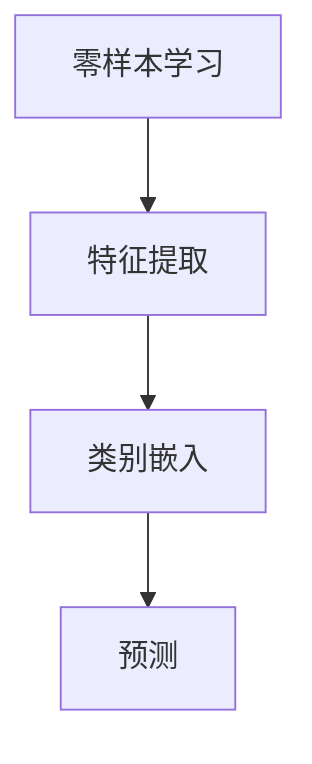
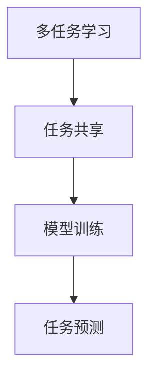
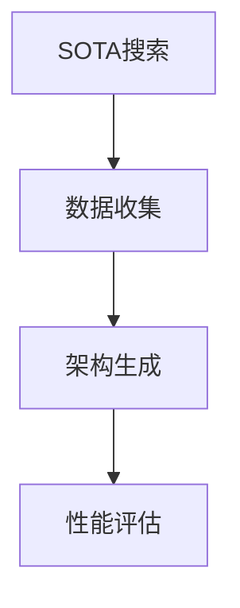
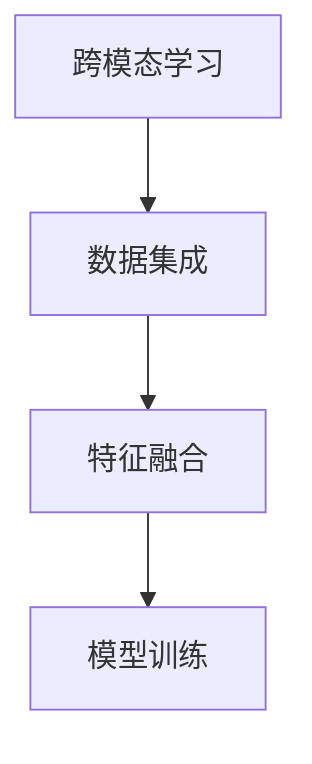
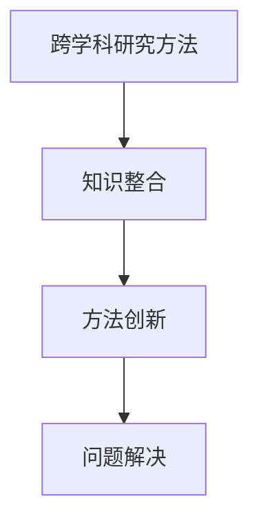

                 


### 文章标题: Zero-Shot CoT在跨学科研究方法创新中的应用

关键词：
- 零样本学习
- 跨学科研究
- 神经架构搜索
- 跨模态学习
- 多任务学习

摘要：
本文探讨了零样本学习（Zero-Shot Learning, ZSL）在跨学科研究方法中的应用，介绍了ZSL的核心概念、原理以及与跨学科研究的联系。通过分析多任务学习、对称神经架构搜索和跨模态学习等相关技术，阐述了如何在跨学科研究中利用这些技术实现方法创新。同时，通过具体应用案例和核心算法讲解，展示了ZSL在跨学科研究中的实际应用价值。

### 第一部分: 核心概念与联系

#### 1.1.1 零样本学习（Zero-Shot Learning，ZSL）

零样本学习是一种机器学习技术，旨在让模型在没有或仅有少量标记训练数据的情况下，处理从未见过的类别。它特别适用于跨学科研究，因为研究者可能无法获得特定领域的专门数据。

**Mermaid 流程图:**


零样本学习的核心在于将未知类别映射到嵌入空间中，并利用支持集（已知的类别数据）对模型进行训练，以便在查询集（未知类别数据）上进行预测。以下是一个简单的零样本学习算法的伪代码：

```python
def zero_shot_learning(model, unlabeled_data, support_set, query_set):
    # 训练支持集上的模型
    model.train(support_set)
    
    # 使用模型对查询集进行预测
    predictions = model.predict(query_set)
    
    return predictions
```

#### 1.1.2 多任务学习（Multi-Task Learning，MTL）

多任务学习是指同时训练多个相关任务的机器学习模型，以提高每个任务的性能。在跨学科研究中，多任务学习可以帮助模型在不同领域之间共享知识，提高跨学科解决问题的能力。

**Mermaid 流程图:**


多任务学习的基本原理是利用不同任务之间的相关性来提高模型的泛化能力。以下是一个简单的多任务学习算法的伪代码：

```python
def multi_task_learning(models, tasks, data):
    # 初始化多个任务模型
    for model in models:
        model.initialize()

    # 在训练数据上同时训练多个模型
    for task, model in zip(tasks, models):
        model.train(data[task])
        
    # 对每个任务进行预测
    predictions = [model.predict(data[task]) for model in models]
    
    return predictions
```

#### 1.1.3 对称神经架构搜索（SOTA，State-of-the-Art）

对称神经架构搜索是一种自动搜索神经网络架构的方法，旨在找到在特定任务上表现最优的网络结构。在跨学科研究中，SOTA方法可以帮助研究者快速找到有效的模型架构，减少手动搜索的时间和成本。

**Mermaid 流程图:**


对称神经架构搜索通常涉及以下步骤：收集大量数据、生成不同架构的神经网络、评估每个架构的性能，并选择最优的架构。以下是一个简单的对称神经架构搜索算法的伪代码：

```python
def sota_search(datasets, architectures, performance_metric):
    best_architecture = None
    best_performance = float('-inf')

    for architecture in architectures:
        model = NeuralNetwork(architecture)
        performance = performance_metric.evaluate(model, datasets)
        
        if performance > best_performance:
            best_architecture = architecture
            best_performance = performance
    
    return best_architecture
```

#### 1.1.4 跨模态学习（Cross-Modal Learning）

跨模态学习是指将不同类型的数据（如图像、文本、音频等）结合在一起进行学习。在跨学科研究中，跨模态学习可以帮助模型更好地理解和处理多模态数据，提高跨学科研究的精度和效率。

**Mermaid 流程图:**


跨模态学习的关键在于将不同模态的数据进行集成和特征融合，以提高模型对多模态数据的理解和处理能力。以下是一个简单的跨模态学习算法的伪代码：

```python
def cross_modal_learning(model, image_data, text_data):
    # 对图像数据提取特征
    image_features = extract_image_features(image_data)
    
    # 对文本数据提取特征
    text_features = extract_text_features(text_data)
    
    # 将图像和文本特征进行融合
    fused_features = fuse_features(image_features, text_features)
    
    # 使用融合后的特征训练模型
    model.train(fused_features)
    
    return model
```

#### 1.1.5 研究方法与创新

跨学科研究方法的核心在于整合不同领域的知识和方法，以解决单一学科难以应对的问题。以下是一些关键的研究方法：

**Mermaid 流程图:**


跨学科研究方法包括以下步骤：

1. **知识整合**：收集并整合来自不同学科的知识，形成新的理论框架。
2. **方法创新**：基于新的理论框架，提出创新的解决方法和算法。
3. **问题解决**：应用创新的方法和算法解决实际跨学科问题。

#### 1.1.6 应用案例介绍

本节将介绍零样本学习在跨学科研究中的应用案例，包括但不限于：

- **案例 1：医疗影像诊断**
  - 使用零样本学习技术，将医学影像数据与文本病历结合，实现快速诊断。
- **案例 2：自然语言处理**
  - 在自然语言处理任务中，利用零样本学习技术处理从未见过的词汇或短语，提高语言模型的泛化能力。
- **案例 3：气候变化研究**
  - 将气象数据与文献数据结合，利用零样本学习技术分析气候变化趋势和影响。

#### 1.1.7 核心算法原理讲解

本节将深入讲解以下核心算法原理：

1. **零样本学习算法原理**

零样本学习算法的原理如下：

- **特征提取**：从支持集中提取特征，用于训练模型。
- **类别嵌入**：将类别映射到低维嵌入空间，以便模型进行分类。
- **预测**：在查询集上使用模型进行预测。

2. **多任务学习算法原理**

多任务学习算法的原理如下：

- **任务共享**：多个任务共享相同的特征表示。
- **模型训练**：在共享特征表示的基础上，同时训练多个任务模型。
- **任务预测**：对每个任务进行预测。

3. **对称神经架构搜索算法原理**

对称神经架构搜索算法的原理如下：

- **数据收集**：收集大量数据用于搜索。
- **架构生成**：生成不同结构的神经网络。
- **性能评估**：评估每个架构的性能。

4. **跨模态学习算法原理**

跨模态学习算法的原理如下：

- **数据集成**：将不同模态的数据进行集成。
- **特征融合**：将不同模态的特征进行融合。
- **模型训练**：使用融合后的特征训练模型。

