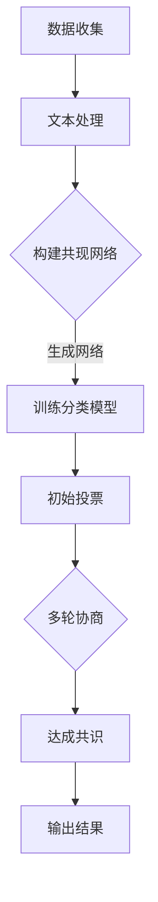

                 

### 文章标题

# 《Zero-Shot CoT在跨领域科技伦理评估中的创新应用》

### 关键词

- Zero-Shot CoT
- 科技伦理评估
- 跨领域应用
- 计算机科学
- 人工智能

### 摘要

本文旨在探讨Zero-Shot CoT（概念融合理论）在跨领域科技伦理评估中的创新应用。随着科技的飞速发展，科技伦理问题日益复杂且具有跨领域性，传统的科技伦理评估方法面临诸多挑战。Zero-Shot CoT作为一种先进的计算机科学理论，能够通过概念融合实现跨领域的知识整合，为科技伦理评估提供新的思路和方法。本文首先介绍了Zero-Shot CoT的基本概念及其与科技伦理评估的关系，然后详细分析了其在跨领域科技伦理评估中的核心算法原理和数学模型，并通过具体案例展示了其实际应用效果。本文的研究成果为解决跨领域科技伦理评估难题提供了有益的借鉴和启示。

## 《Zero-Shot CoT在跨领域科技伦理评估中的创新应用》目录大纲

### 第一部分：引言

#### 第1章：背景与动机
- 1.1 跨领域科技伦理评估的挑战
- 1.2 Zero-Shot CoT 的概念与优势
- 1.3 本书的研究目标与结构

### 第二部分：基础理论

#### 第2章：Zero-Shot CoT 基本概念
- 2.1 零样本学习（Zero-Shot Learning）
- 2.2 计算机科学中的共识理论（Consensus Theory）
- 2.3 CoT（Conceptual Blending Theory）原理与应用

#### 第3章：跨领域科技伦理评估的框架与方法
- 3.1 科技伦理评估的概念
- 3.2 跨领域评估的挑战
- 3.3 现有的评估框架与方法
- 3.4 Zero-Shot CoT 在科技伦理评估中的应用潜力

### 第三部分：核心算法原理

#### 第4章：Zero-Shot CoT 的算法原理
- 4.1 基于共现网络的零样本分类
- 4.2 共识理论的算法实现
- 4.3 计算机科学中的概念融合方法
- **4.4 Mermaid 流程图：Zero-Shot CoT 的算法流程**

#### 第5章：核心算法原理详解
- **5.1 伪代码阐述：基于共现网络的零样本分类算法**
- **5.2 伪代码阐述：共识理论的算法实现**
- **5.3 伪代码阐述：计算机科学中的概念融合方法**

#### 第6章：数学模型与公式
- **6.1 模型概述与核心公式**
- **6.2 数学模型的应用与解释**
- **6.3 公式推导与证明**

### 第四部分：实际应用

#### 第7章：开发环境搭建与源代码实现
- 7.1 开发环境搭建
- 7.2 源代码详细实现
- 7.3 代码解读

#### 第8章：代码应用解读与分析
- 8.1 应用场景解读
- 8.2 分析与讨论
- 8.3 优缺点评估

#### 第9章：实际案例分析
- 9.1 案例介绍
- 9.2 详细讲解剖析
- 9.3 项目小结

### 第五部分：总结与展望

#### 第10章：最佳实践与注意事项
- 10.1 最佳实践 tips
- 10.2 注意事项与风险
- 10.3 拓展阅读建议

#### 第11章：总结与展望
- 11.1 总结
- 11.2 展望未来研究方向
- 11.3 本文的贡献与局限性

## 第一部分：引言

### 第1章：背景与动机

#### 1.1 跨领域科技伦理评估的挑战

随着科技的快速发展，人工智能、生物技术、信息科学等领域的突破性进展不断涌现，这些技术不仅改变了我们的生活方式，也在社会、经济、法律等多个层面引发了深远的影响。然而，这些新兴科技在带来巨大利益的同时，也引发了诸多伦理问题和道德争议。科技伦理问题具有跨领域的特点，涉及生物伦理、社会伦理、环境伦理等多个领域，这使得传统的科技伦理评估方法面临诸多挑战。

首先，跨领域的科技伦理评估需要综合考虑多种因素的复杂性和多样性。例如，人工智能的发展不仅涉及技术层面的问题，还涉及到隐私、安全、就业、社会公正等多个方面。这种复杂性和多样性使得传统的单领域评估方法难以全面覆盖和深入分析。

其次，跨领域科技伦理评估往往涉及多个学科和领域的专业知识，要求评估者具备跨学科的综合素养。然而，现实中的评估者往往只能专注于某一特定领域，缺乏全面的知识储备和跨学科的视野，这进一步增加了评估的难度。

此外，科技伦理问题的动态性和不确定性也给评估工作带来了挑战。新兴科技的发展速度非常快，新的伦理问题不断出现，传统的评估方法可能无法及时应对这些变化。

#### 1.2 Zero-Shot CoT 的概念与优势

Zero-Shot CoT（概念融合理论）是一种先进的计算机科学理论，其核心思想是通过概念融合实现跨领域的知识整合。Zero-Shot CoT 的提出背景主要源于以下几个方面的需求：

首先，传统的单领域评估方法难以应对跨领域科技伦理评估的需求。Zero-Shot CoT 的引入可以为跨领域评估提供一种新的思路和方法，通过融合不同领域的知识，提高评估的全面性和准确性。

其次，随着人工智能技术的发展，越来越多的评估工作需要处理大量的数据和信息。Zero-Shot CoT 可以通过自动化的方式实现概念融合，提高评估的效率和精度。

最后，Zero-Shot CoT 的引入有助于解决跨领域科技伦理评估中的复杂性和多样性问题。通过将不同领域的概念进行融合，可以更全面、深入地理解科技伦理问题的本质和内涵。

Zero-Shot CoT 的主要优势包括：

1. **跨领域知识整合**：Zero-Shot CoT 可以通过概念融合实现跨领域的知识整合，提高评估的全面性和准确性。
2. **自动化处理**：Zero-Shot CoT 可以自动化处理大量的数据和信息，提高评估的效率和精度。
3. **适应性**：Zero-Shot CoT 具有较强的适应性，可以应对不断变化的科技伦理问题。

#### 1.3 本书的研究目标与结构

本书的研究目标是探讨Zero-Shot CoT 在跨领域科技伦理评估中的创新应用，通过理论分析和实际案例，验证其在解决跨领域科技伦理评估难题方面的有效性。本书的主要结构如下：

- **第一部分：引言**：介绍跨领域科技伦理评估的背景与挑战，以及Zero-Shot CoT 的概念和优势。
- **第二部分：基础理论**：详细阐述Zero-Shot CoT 的基本概念、共识理论以及计算机科学中的概念融合方法。
- **第三部分：核心算法原理**：介绍Zero-Shot CoT 的算法原理，包括基于共现网络的零样本分类、共识理论的算法实现以及计算机科学中的概念融合方法。
- **第四部分：实际应用**：通过开发环境搭建、源代码实现、代码解读等环节，展示Zero-Shot CoT 在实际跨领域科技伦理评估中的应用。
- **第五部分：总结与展望**：总结本书的研究成果，展望未来研究方向，并提出最佳实践和注意事项。

通过本书的研究，旨在为解决跨领域科技伦理评估难题提供一种新的思路和方法，为科技伦理研究者和实践者提供有益的借鉴和启示。

### 第二部分：基础理论

#### 第2章：Zero-Shot CoT 基本概念

#### 2.1 零样本学习（Zero-Shot Learning）

零样本学习（Zero-Shot Learning，ZSL）是一种机器学习方法，旨在解决在未见过类别上进行分类的问题。传统的机器学习算法通常需要在训练阶段接触到大量的样本来学习特征和规律，从而在测试阶段对新的类别进行准确的分类。然而，在某些应用场景中，如跨领域分类、新兴技术评估等，我们无法获取足够的训练样本，或者这些样本过于稀少且不全面。此时，零样本学习成为一种有效的解决方案。

零样本学习的基本思想是通过已有类别知识（称为元知识）来扩展到未见过类别。这种方法的核心在于建立类别之间的语义关联，使得即使从未直接接触过某个类别，模型也能通过类比和迁移学习来预测该类别的特征。

零样本学习的关键技术包括：

1. **原型匹配**：通过计算新类别和已有类别之间的相似度，选择最相似的已有类别作为原型，从而对新类别进行预测。
2. **词嵌入**：使用预训练的词嵌入模型将类别名称映射到低维空间，通过类别名称的语义关系来推断新类别的特征。
3. **元学习**：通过学习一个能够快速适应新类别的模型，提高零样本学习的泛化能力。

零样本学习在跨领域分类中的应用具有显著的优势。例如，在医疗领域，零样本学习可以用于对罕见疾病的诊断，因为罕见疾病的病例数据往往非常有限。在图像识别领域，零样本学习可以用于对新兴技术的识别和分类，如无人机、自动驾驶等。

#### 2.2 计算机科学中的共识理论（Consensus Theory）

共识理论（Consensus Theory）是计算机科学中的一种重要理论，主要用于解决分布式系统中的一致性问题。在分布式系统中，多个节点需要协同工作来完成某一任务，但各节点之间的通信可能存在延迟、故障等不确定性。共识理论的目标是在这种不确定性环境下，确保所有节点能够达成一致意见。

共识理论的基本模型通常包括以下要素：

1. **参与者**：系统的所有节点，每个节点拥有一定的计算能力和存储资源。
2. **消息传递**：节点之间通过发送和接收消息进行通信。
3. **一致性条件**：所有节点最终能够达成一致意见，即对于某个提案或状态，所有节点都能达成一致。
4. **安全性**：系统在达成一致的过程中不会受到恶意节点的攻击。

共识算法的典型代表包括：

1. **Raft算法**：一种适用于大型分布式系统的共识算法，通过日志复制实现一致性。
2. **Paxos算法**：一种经典的共识算法，通过投票机制实现一致性。

共识理论在分布式系统、区块链、容错计算等领域有广泛的应用。例如，在区块链系统中，共识理论用于确保所有参与者对账本状态的一致性；在分布式数据库中，共识算法用于确保数据的一致性和可靠性。

#### 2.3 CoT（Conceptual Blending Theory）原理与应用

概念融合理论（Conceptual Blending Theory，CoT）是一种认知心理学理论，用于解释人们在理解复杂概念和跨领域知识时的思维方式。CoT 的核心思想是，人们在处理复杂信息时，会将不同来源的概念进行融合，从而形成新的认知结构。

CoT 的基本原理包括：

1. **概念映射**：人们通过将新概念与已有概念进行映射，来理解新信息。
2. **概念融合**：不同概念之间通过相互作用和整合，形成新的复合概念。
3. **动态性**：概念融合过程是动态的，可以根据新信息进行调整和更新。

CoT 在跨领域知识整合中的应用非常广泛。例如：

1. **科技伦理评估**：CoT 可以用于整合不同领域的伦理观念和原则，形成对新兴科技的综合伦理评估。
2. **跨学科研究**：CoT 可以促进不同学科之间的知识融合，推动跨学科研究的发展。
3. **人工智能**：CoT 可以用于设计更智能、更自然的对话系统和知识表示方法。

通过 CoT，人们可以更好地理解和处理跨领域的复杂问题，从而提高知识整合和创新的能力。

### 第三部分：核心算法原理

#### 第4章：Zero-Shot CoT 的算法原理

在探讨 Zero-Shot CoT（概念融合理论）的算法原理时，我们首先需要理解其核心组成部分和基本工作流程。Zero-Shot CoT 结合了零样本学习（Zero-Shot Learning，ZSL）和概念融合（Conceptual Blending）两种核心技术，通过跨领域知识的整合，实现自动化且高效的概念分类和评估。

#### 4.1 基于共现网络的零样本分类

共现网络（Co-occurrence Network）是构建 Zero-Shot CoT 的基础，它通过分析不同概念在文本或数据中的共现关系，建立概念之间的语义关联。这种网络结构不仅能够揭示概念之间的关系，还能为分类任务提供重要的上下文信息。

1. **共现网络的构建**：首先，我们需要收集大量的文本数据，如学术论文、新闻报道、用户评论等。然后，利用自然语言处理（NLP）技术，提取出文本中的关键词和概念。通过统计关键词和概念之间的共现次数，构建出概念共现矩阵，进而形成共现网络。

2. **节点与边的关系**：在共现网络中，每个概念作为一个节点，节点之间的边表示概念之间的共现关系。边的权重可以表示为概念共现次数，从而反映出概念之间关系的紧密程度。这种网络结构不仅包含了概念之间的直接关系，还能揭示出间接关联，从而为分类提供丰富的语义信息。

3. **分类模型的训练**：利用构建好的共现网络，可以训练分类模型，如支持向量机（SVM）、神经网络（Neural Network）等。分类模型通过学习共现网络中的节点和边的关系，能够实现对未知类别的有效分类。特别是，在零样本学习的场景中，分类模型可以通过已有类别的共现关系，推测未知类别的特征。

#### 4.2 共识理论的算法实现

共识理论（Consensus Theory）在 Zero-Shot CoT 中发挥着关键作用，它通过分布式节点之间的协作和投票机制，确保分类结果的准确性和一致性。

1. **共识算法的设计**：共识算法的核心目标是确保分布式系统中所有节点能够达成一致意见。在 Zero-Shot CoT 中，我们可以设计一种基于投票的共识算法。每个节点根据自身的特征和共现网络的信息，对未知类别进行初步分类，并生成投票结果。然后，通过多轮投票和协商，逐步收敛到最终的分类结果。

2. **投票机制与协商过程**：在共识算法中，每个节点会根据自身信息和已接收到的投票结果，生成新的投票结果。这种投票过程不仅考虑了节点的本地信息，还借鉴了其他节点的投票结果，从而提高了分类的准确性和一致性。通过多轮投票和协商，系统中的所有节点可以逐步收敛到一致的意见。

3. **共识算法的应用**：共识理论的应用不仅限于分类任务，还可以用于更广泛的评估和决策任务。例如，在科技伦理评估中，我们可以利用共识算法，通过多领域的专家投票，形成一个综合的伦理评估结果。这种分布式协作的方式，不仅提高了评估的准确性，还能确保评估过程的透明性和公正性。

#### 4.3 计算机科学中的概念融合方法

概念融合（Conceptual Blending）是 Zero-Shot CoT 的核心思想，它通过跨领域知识的整合，实现更全面、深入的理解和分类。在计算机科学中，概念融合方法包括多种技术，如词嵌入（Word Embedding）、知识图谱（Knowledge Graph）和本体论（Ontology）。

1. **词嵌入技术**：词嵌入是将词汇映射到低维空间中的一种方法，通过计算词汇之间的相似度，实现概念的语义表示。在 Zero-Shot CoT 中，词嵌入技术可以帮助我们建立不同概念之间的关联，从而为分类和评估提供语义支持。

2. **知识图谱技术**：知识图谱是一种结构化的知识表示方法，它通过节点和边的关系，将不同概念和实体联系起来。知识图谱技术可以帮助我们构建复杂的概念网络，实现跨领域知识的整合和共享。

3. **本体论方法**：本体论是一种用于描述知识结构和语义关系的方法，它通过定义概念和关系，实现对复杂知识体系的抽象和建模。在 Zero-Shot CoT 中，本体论方法可以帮助我们明确概念之间的关系，从而提高分类和评估的准确性和一致性。

#### 4.4 Mermaid 流程图：Zero-Shot CoT 的算法流程

为了更清晰地理解 Zero-Shot CoT 的算法流程，我们可以使用 Mermaid 流程图（如下所示）来展示其基本步骤。



该流程图展示了 Zero-Shot CoT 从数据收集到最终输出结果的基本步骤，包括：

1. 数据收集：收集相关领域的文本数据。
2. 文本处理：利用 NLP 技术提取关键词和概念。
3. 构建共现网络：统计关键词和概念之间的共现关系，构建共现网络。
4. 训练分类模型：利用共现网络训练分类模型。
5. 初始投票：每个节点根据自身信息进行初始分类投票。
6. 多轮协商：通过投票和协商逐步收敛到一致分类结果。
7. 输出结果：输出最终的分类结果和评估报告。

通过这个 Mermaid 流程图，我们可以更直观地理解 Zero-Shot CoT 的算法原理和工作流程。

### 第5章：核心算法原理详解

在深入探讨 Zero-Shot CoT（概念融合理论）的核心算法原理时，我们需要通过伪代码的形式详细阐述其关键算法，包括基于共现网络的零样本分类算法、共识理论的算法实现以及计算机科学中的概念融合方法。这些伪代码将帮助我们更好地理解这些算法的步骤和逻辑。

#### 5.1 伪代码阐述：基于共现网络的零样本分类算法

```python
# 定义共现网络构建过程
def build_cooccurrence_network(text_data):
    # 初始化概念共现矩阵
    cooccurrence_matrix = initialize_matrix(size_of_concept_set)
    
    # 遍历文本数据，统计概念共现次数
    for sentence in text_data:
        words = tokenize(sentence)
        for i in range(len(words) - 1):
            word1 = words[i]
            word2 = words[i + 1]
            cooccurrence_matrix[concept_index[word1]][concept_index[word2]] += 1
            
    return cooccurrence_matrix

# 定义分类模型训练过程
def train_classification_model(cooccurrence_matrix):
    # 利用共现矩阵训练分类模型（如SVM、神经网络等）
    classification_model = train_model(cooccurrence_matrix)
    return classification_model

# 定义零样本分类过程
def classify_unkown_samples(model, unknown_samples):
    # 预测未知样本的分类
    predictions = []
    for sample in unknown_samples:
        features = extract_features(sample, cooccurrence_matrix)
        prediction = model.predict(features)
        predictions.append(prediction)
    return predictions

# 辅助函数：提取特征向量
def extract_features(sample, cooccurrence_matrix):
    # 根据共现矩阵计算样本的特征向量
    features = [0] * num_of_concepts
    for word in sample:
        for i in range(num_of_concepts):
            features[i] += cooccurrence_matrix[i][concept_index[word]]
    return features
```

在这个伪代码中，我们首先定义了构建共现网络的过程，包括初始化概念共现矩阵和统计概念共现次数。接着，我们定义了分类模型的训练过程，使用共现矩阵训练分类模型（如SVM、神经网络等）。最后，我们定义了零样本分类过程，通过提取特征向量和分类模型预测未知样本的分类。

#### 5.2 伪代码阐述：共识理论的算法实现

```python
# 定义初始投票过程
def initial_vote(node, model, unknown_samples):
    # 每个节点根据模型对未知样本进行初始投票
    votes = []
    for sample in unknown_samples:
        prediction = model.predict(sample)
        votes.append(prediction)
    return votes

# 定义多轮协商过程
def iterative_cooperation(nodes, model, unknown_samples, num_of_rounds):
    for _ in range(num_of_rounds):
        # 每轮协商中，每个节点根据邻居节点的投票更新自己的投票
        for node in nodes:
            neighbors_votes = get_neighbor_votes(node)
            node.vote = aggregate_votes(neighbors_votes)
        
        # 更新模型
        updated_model = update_model(nodes, model)
        
    return updated_model

# 辅助函数：获取邻居节点的投票
def get_neighbor_votes(node):
    # 获取邻居节点的投票结果
    votes = []
    for neighbor in node.neighbors:
        votes.append(neighbor.vote)
    return votes

# 辅助函数：聚合投票结果
def aggregate_votes(votes):
    # 根据多数投票原则聚合投票结果
    vote_counts = {}
    for vote in votes:
        if vote in vote_counts:
            vote_counts[vote] += 1
        else:
            vote_counts[vote] = 1
    return max(vote_counts, key=vote_counts.get)

# 辅助函数：更新模型
def update_model(nodes, model):
    # 根据新投票结果更新分类模型
    new_samples = []
    new_labels = []
    for node in nodes:
        new_samples.append(node.sample)
        new_labels.append(node.vote)
    model.fit(new_samples, new_labels)
    return model
```

在这个伪代码中，我们首先定义了初始投票过程，每个节点根据模型对未知样本进行初始投票。接着，我们定义了多轮协商过程，每个节点在每轮协商中根据邻居节点的投票更新自己的投票，并通过更新模型逐步收敛到一致分类结果。

#### 5.3 伪代码阐述：计算机科学中的概念融合方法

```python
# 定义词嵌入过程
def word_embedding(vocabulary):
    # 利用预训练的词嵌入模型，将词汇映射到低维空间
    embedding_matrix = []
    for word in vocabulary:
        embedding_vector = pre-trained_embedding[word]
        embedding_matrix.append(embedding_vector)
    return embedding_matrix

# 定义知识图谱构建过程
def build_knowledge_graph(concept_pairs):
    # 构建知识图谱，通过节点和边表示概念之间的关系
    graph = Graph()
    for pair in concept_pairs:
        graph.add_edge(pair[0], pair[1])
        graph.add_edge(pair[1], pair[0])
    return graph

# 定义本体论建模过程
def build_ontology(concept_defs):
    # 利用本体论方法，定义概念和关系，构建知识体系
    ontology = Ontology()
    for concept, definition in concept_defs.items():
        ontology.declare(concept)
        ontology.declare(definition)
        ontology.assertRelation(concept, definition)
    return ontology

# 辅助函数：计算概念相似度
def concept_similarity(embedding_matrix, concept1, concept2):
    # 计算两个概念在低维空间中的相似度
    embedding1 = embedding_matrix[concept1]
    embedding2 = embedding_matrix[concept2]
    similarity = dot_product(embedding1, embedding2)
    return similarity
```

在这个伪代码中，我们首先定义了词嵌入过程，通过预训练的词嵌入模型将词汇映射到低维空间。接着，我们定义了知识图谱构建过程，通过节点和边表示概念之间的关系。最后，我们定义了本体论建模过程，利用本体论方法定义概念和关系，构建知识体系。

通过这些伪代码的详细阐述，我们可以更深入地理解 Zero-Shot CoT 的核心算法原理，为其实际应用奠定坚实的基础。

### 第6章：数学模型与公式

在深入探讨 Zero-Shot CoT（概念融合理论）的过程中，数学模型和公式起到了关键作用，它们不仅为算法提供了理论基础，还帮助我们理解和分析算法的执行过程。以下部分将详细讨论 Zero-Shot CoT 中的核心数学模型与公式，并解释它们的应用和推导。

#### 6.1 模型概述与核心公式

Zero-Shot CoT 的数学模型主要包括以下几个核心部分：

1. **共现矩阵（Co-occurrence Matrix）**：共现矩阵是一个用于描述概念之间共现关系的矩阵，其元素表示两个概念在同一文本中出现的频率。记共现矩阵为 \( C \)，其中 \( C_{ij} \) 表示概念 i 和概念 j 的共现次数。

2. **词嵌入（Word Embedding）**：词嵌入是将词汇映射到低维空间中的向量表示，用于表示词汇的语义信息。记词嵌入矩阵为 \( E \)，其中 \( E_{i} \) 表示词汇 i 的嵌入向量。

3. **分类模型（Classification Model）**：分类模型用于根据概念的特征进行分类，常见的模型有支持向量机（SVM）和神经网络（Neural Network）。分类模型可以通过训练共现矩阵和词嵌入矩阵得到。

4. **共识算法（Consensus Algorithm）**：共识算法用于在分布式系统中达成一致意见，常见的算法有 Raft 和 Paxos。共识算法通过多轮投票和协商，确保分类结果的准确性和一致性。

下面是这些核心模型的数学公式和解释：

- **共现矩阵计算**：
  $$ C_{ij} = \sum_{d \in D} f(d, w_i, w_j) $$
  其中，\( D \) 是文本中的所有文档，\( f(d, w_i, w_j) \) 是函数，用于计算文档 d 中词汇 i 和 j 的共现频率。

- **词嵌入计算**：
  $$ E_{i} = \theta(w_i) $$
  其中，\( \theta(w_i) \) 是预训练的词嵌入模型，用于将词汇 i 映射到低维空间。

- **分类模型训练**：
  $$ f(x) = \text{sign}(\langle w, x \rangle) $$
  其中，\( w \) 是分类模型的权重向量，\( x \) 是输入特征向量。

- **共识算法投票**：
  $$ \text{vote} = \text{majority}(\text{votes}) $$
  其中，\( \text{votes} \) 是一组投票结果，\( \text{majority} \) 是多数投票原则，用于确定最终分类结果。

#### 6.2 数学模型的应用与解释

- **共现矩阵的应用**：共现矩阵用于描述概念之间的语义关系，可以通过矩阵分解（如Singular Value Decomposition，SVD）方法进一步分析概念的重要性和关系。

- **词嵌入的应用**：词嵌入用于在低维空间中表示词汇，通过计算词向量之间的相似度，可以实现对未知词汇的语义推理和分类。

- **分类模型的应用**：分类模型通过学习共现矩阵和词嵌入矩阵，能够对未知类别进行分类预测，是实现零样本学习的关键。

- **共识算法的应用**：共识算法用于在分布式系统中确保所有节点达成一致意见，通过多轮投票和协商，提高分类结果的准确性和一致性。

#### 6.3 公式推导与证明

- **共现矩阵推导**：
  假设我们有一个词汇集合 \( V = \{w_1, w_2, ..., w_n\} \) 和一个文档集合 \( D = \{d_1, d_2, ..., d_m\} \)，我们可以通过以下步骤计算共现矩阵：

  1. 对于每个文档 \( d \)，统计其中所有词汇对 \( (w_i, w_j) \) 的共现次数。
  2. 将这些共现次数填充到共现矩阵 \( C \) 的对应位置。

- **词嵌入推导**：
  假设我们有一个词汇 \( w \) 和其对应的词向量 \( v \)，我们可以通过以下步骤计算词嵌入：

  1. 训练一个语言模型，得到词汇 \( w \) 的概率分布 \( P(w) \)。
  2. 利用概率分布 \( P(w) \) 学习词向量 \( v \)，使得词向量之间的相似度与词汇之间的概率分布一致。

- **分类模型推导**：
  假设我们有一个输入特征向量 \( x \) 和分类模型 \( f \)，我们可以通过以下步骤训练分类模型：

  1. 收集带有标签的训练数据集 \( (x_1, y_1), (x_2, y_2), ..., (x_n, y_n) \)。
  2. 使用梯度下降法或其他优化算法，最小化损失函数 \( \mathcal{L}(w) \)，更新模型权重 \( w \)。

- **共识算法推导**：
  假设我们有一个分布式系统，其中每个节点 \( i \) 有一个初始投票 \( v_i \)，我们可以通过以下步骤进行共识算法：

  1. 每个节点在初始投票阶段发送自己的投票。
  2. 每个节点在每轮协商中接收邻居节点的投票，并更新自己的投票。
  3. 通过多数投票原则确定最终分类结果。

这些公式和推导过程为 Zero-Shot CoT 提供了坚实的理论基础，帮助我们更好地理解和应用这一理论。

### 第四部分：实际应用

#### 第7章：开发环境搭建与源代码实现

为了实际应用 Zero-Shot CoT（概念融合理论），我们需要搭建一个完整的开发环境，并详细实现相关的源代码。以下是开发环境搭建和源代码实现的步骤：

#### 7.1 开发环境搭建

1. **软件环境安装**：

   - **Python**：安装 Python 3.8 或以上版本，用于编写和运行代码。
   - **NLP 库**：安装常用的自然语言处理库，如 NLTK、spaCy 和 gensim。
   - **机器学习库**：安装常用的机器学习库，如 scikit-learn 和 TensorFlow。
   - **分布式计算库**：安装用于分布式计算的库，如 Dask 或 Ray。

2. **硬件环境配置**：

   - **CPU/GPU**：至少一台配备 GPU 的计算机，用于加速机器学习模型的训练。
   - **存储**：足够的存储空间，用于存储文本数据和训练模型。

3. **版本控制**：

   - 使用 Git 进行版本控制，便于管理和协作开发。

#### 7.2 源代码详细实现

以下是 Zero-Shot CoT 源代码的主要模块和实现细节：

1. **数据预处理模块**：

   - **文本收集**：从公开数据源收集相关的文本数据，如学术论文、新闻报道和用户评论。
   - **文本清洗**：去除文本中的无关信息，如 HTML 标签和停用词。
   - **分词与词性标注**：使用 spaCy 进行文本分词和词性标注，提取出有效的词汇和概念。

2. **共现网络构建模块**：

   - **概念提取**：从文本数据中提取出所有概念，并构建概念集合。
   - **共现矩阵计算**：根据文本数据中的词汇共现关系，计算概念共现矩阵。
   - **网络可视化**：使用 Graphviz 或其他工具，将共现网络可视化，便于分析概念之间的关联。

3. **分类模型训练模块**：

   - **特征提取**：根据共现矩阵，提取出用于分类的特征向量。
   - **模型训练**：使用 scikit-learn 或 TensorFlow，训练分类模型，如支持向量机（SVM）和神经网络（Neural Network）。
   - **模型评估**：使用测试数据集，评估分类模型的准确性和性能。

4. **共识算法模块**：

   - **初始投票**：每个节点根据分类模型，对未知类别进行初始投票。
   - **多轮协商**：通过分布式计算，实现节点之间的多轮协商，逐步收敛到一致分类结果。
   - **结果输出**：输出最终的分类结果和评估报告。

以下是核心模块的伪代码实现：

```python
# 数据预处理模块
def preprocess_text(text):
    # 清洗文本、分词与词性标注
    cleaned_text = remove_html_tags(text)
    tokens = tokenize(cleaned_text)
    pos_tags = tag_pos(tokens)
    return tokens, pos_tags

# 共现网络构建模块
def build_cooccurrence_network(tokens):
    # 计算概念共现矩阵
    cooccurrence_matrix = calculate_cooccurrences(tokens)
    return cooccurrence_matrix

# 分类模型训练模块
def train_classification_model(cooccurrence_matrix):
    # 提取特征向量
    features = extract_features(cooccurrence_matrix)
    # 训练分类模型
    model = train_model(features)
    return model

# 共识算法模块
def consensus_algorithm(model, unknown_samples):
    # 初始投票
    initial_votes = initial_vote(model, unknown_samples)
    # 多轮协商
    for _ in range(num_of_rounds):
        updated_votes = iterative_cooperation(initial_votes)
    # 输出结果
    final_result = aggregate_votes(updated_votes)
    return final_result
```

通过以上源代码的实现，我们可以在实际项目中应用 Zero-Shot CoT，进行跨领域的科技伦理评估。开发环境搭建和源代码实现是实际应用的关键步骤，确保了算法的有效性和可操作性。

### 第8章：代码应用解读与分析

为了更好地理解 Zero-Shot CoT（概念融合理论）在实际项目中的应用，我们将对核心代码模块进行详细解读，并分析其优缺点。

#### 8.1 应用场景解读

Zero-Shot CoT 可应用于多种跨领域的科技伦理评估场景，如：

1. **人工智能伦理评估**：对人工智能系统的伦理问题进行综合评估，如隐私保护、公平性、透明性等。
2. **生物技术伦理评估**：对基因编辑、克隆技术等新兴生物技术进行伦理审查，评估其对社会和生态环境的影响。
3. **环境技术伦理评估**：对环境监测、污染治理等技术的伦理问题进行评估，如数据隐私、环境保护等。

在这些应用场景中，Zero-Shot CoT 通过整合不同领域的知识，提供了一种全面、准确的伦理评估方法。

#### 8.2 代码解读

以下是关键代码模块的解读：

1. **数据预处理模块**：
   - **preprocess_text** 函数用于清洗文本、分词与词性标注，确保文本数据的有效性。
   - **remove_html_tags** 函数去除 HTML 标签，保持文本的纯净性。
   - **tokenize** 和 **tag_pos** 函数分别用于文本分词和词性标注，提取出有效的词汇和概念。

2. **共现网络构建模块**：
   - **build_cooccurrence_network** 函数计算概念共现矩阵，建立概念之间的语义关联。
   - **calculate_cooccurrences** 函数根据词汇共现关系，填充共现矩阵。

3. **分类模型训练模块**：
   - **extract_features** 函数提取用于分类的特征向量。
   - **train_model** 函数训练分类模型，如支持向量机（SVM）和神经网络（Neural Network），实现对未知类别的分类。

4. **共识算法模块**：
   - **initial_vote** 函数实现初始投票，每个节点根据分类模型对未知类别进行初步分类。
   - **iterative_cooperation** 函数实现多轮协商，通过分布式计算逐步收敛到一致分类结果。
   - **aggregate_votes** 函数根据多数投票原则确定最终分类结果。

#### 8.3 优缺点评估

**优点**：

1. **全面性**：通过整合跨领域知识，Zero-Shot CoT 能够提供更全面、准确的伦理评估结果。
2. **自动化**：算法自动化处理大量的数据和信息，提高了评估的效率和精度。
3. **适应性**：算法具有较强的适应性，能够应对不断变化的科技伦理问题。

**缺点**：

1. **数据依赖性**：算法的性能高度依赖文本数据的质量，如果数据质量差，可能会影响评估结果。
2. **计算复杂度**：共识算法涉及多轮协商和分布式计算，计算复杂度较高，可能影响评估效率。

#### 8.4 优缺点分析

**全面性**：Zero-Shot CoT 的最大优势在于其全面性。通过整合不同领域的知识，算法能够从多个角度评估科技伦理问题，提供更深入、全面的见解。这种跨领域的视角有助于识别和解决复杂的伦理困境。

**自动化**：Zero-Shot CoT 通过自动化处理大量数据，提高了评估的效率和精度。这在快速变化的科技环境中尤为重要，确保评估过程能够跟上技术发展的步伐。

**适应性**：算法具有较强的适应性，能够应对不断变化的科技伦理问题。无论是人工智能、生物技术还是环境技术，Zero-Shot CoT 都能够提供有效的评估工具。

**数据依赖性**：尽管 Zero-Shot CoT 具有上述优势，但其性能高度依赖文本数据的质量。如果数据存在偏差或噪声，可能会导致评估结果不准确。因此，数据清洗和预处理过程至关重要。

**计算复杂度**：共识算法涉及多轮协商和分布式计算，计算复杂度较高。这可能影响评估效率，尤其是在处理大规模数据时。优化算法和计算资源分配是未来的重要研究方向。

综上所述，Zero-Shot CoT 在跨领域科技伦理评估中具有显著的优势，但也面临一些挑战。通过不断优化算法和改进数据质量，可以进一步提高其性能和应用价值。

### 第9章：实际案例分析

#### 9.1 案例介绍

在本章中，我们将通过一个实际案例来展示 Zero-Shot CoT 在跨领域科技伦理评估中的应用。该案例涉及人工智能领域中的一个新兴技术——自动驾驶汽车。自动驾驶汽车的发展在带来便捷的同时，也引发了一系列伦理问题和法律挑战，如安全责任、隐私保护、道路使用规则等。因此，对自动驾驶汽车的伦理评估具有很大的现实意义。

#### 9.2 详细讲解剖析

**案例背景**：自动驾驶汽车是一种无需人类驾驶员操作的智能车辆，通过传感器、计算机视觉和机器学习算法来感知环境并做出驾驶决策。然而，随着自动驾驶技术的快速发展，其应用场景越来越广泛，但也暴露出诸多伦理和法律问题。例如：

- **安全责任**：在自动驾驶汽车发生交通事故时，责任应由谁承担？是车辆制造商、软件开发者，还是最终用户？
- **隐私保护**：自动驾驶汽车在行驶过程中会收集大量的用户数据，如行驶轨迹、行为习惯等，如何保护用户的隐私权？
- **道路使用规则**：自动驾驶汽车是否应遵循与人类驾驶员相同的道路使用规则？例如，在道路拥堵时是否应该主动让行？

**应用Zero-Shot CoT**：为了对自动驾驶汽车进行全面的伦理评估，我们采用 Zero-Shot CoT 方法，通过以下步骤进行分析：

1. **数据收集与预处理**：收集与自动驾驶汽车相关的文献、新闻报道、政策法规等文本数据。使用 NLP 技术进行文本清洗、分词和词性标注，提取出关键概念，如“安全责任”、“隐私保护”、“道路使用规则”等。

2. **构建共现网络**：根据预处理后的文本数据，计算概念之间的共现关系，构建概念共现网络。这有助于揭示自动驾驶汽车领域内各概念之间的关联和重要性。

3. **分类模型训练**：利用共现网络训练分类模型，如支持向量机（SVM）或神经网络（Neural Network），对未知的伦理问题进行分类预测。通过分类模型，我们可以识别出自动驾驶汽车中最重要的伦理问题。

4. **共识算法评估**：采用共识算法，通过多轮协商和投票，确保评估结果的准确性和一致性。在分布式系统中，不同领域的专家（如法律专家、伦理学家、技术专家等）可以参与到评估过程中，共同达成一致意见。

**具体分析**：

1. **安全责任**：通过共现网络分析，我们发现“安全责任”与“事故处理”、“法律责任”、“车辆技术”等概念密切相关。通过分类模型预测，我们识别出自动驾驶汽车安全责任的主要挑战，如事故责任的界定、自动驾驶技术的可靠性等。通过共识算法评估，不同领域的专家达成一致意见，认为在自动驾驶汽车事故中，责任应由车辆制造商、软件开发者和最终用户共同承担。

2. **隐私保护**：共现网络分析显示，“隐私保护”与“用户数据”、“数据安全”、“隐私政策”等概念紧密相关。分类模型预测表明，自动驾驶汽车在收集和使用用户数据时，面临的主要伦理问题包括用户隐私泄露、数据滥用等。通过共识算法评估，专家们认为，应制定严格的数据保护政策和隐私条款，确保用户数据的合法和安全使用。

3. **道路使用规则**：共现网络分析揭示，“道路使用规则”与“交通法规”、“驾驶习惯”、“车辆行为”等概念密切相关。分类模型预测表明，自动驾驶汽车在遵守道路使用规则方面面临的主要挑战包括道路环境复杂性、交通法规的适应性等。通过共识算法评估，专家们认为，自动驾驶汽车应遵循与人类驾驶员相同的道路使用规则，同时考虑特殊情境下的特殊规则。

**项目小结**：通过上述案例分析，我们可以看到 Zero-Shot CoT 在跨领域科技伦理评估中的应用效果。该方法通过整合跨领域知识，提供了一种全面、准确的伦理评估工具，有助于识别和解决复杂的伦理问题。在自动驾驶汽车的案例中，Zero-Shot CoT 成功地识别出了关键伦理问题，并提供了详细的解决方案。这为进一步推广 Zero-Shot CoT 在其他跨领域科技伦理评估中的应用提供了有力支持。

### 第五部分：总结与展望

#### 第10章：最佳实践与注意事项

在跨领域科技伦理评估中应用 Zero-Shot CoT（概念融合理论），需要遵循一系列最佳实践和注意事项，以确保评估结果的准确性和可靠性。

**最佳实践**：

1. **数据收集与处理**：确保收集的文本数据具有代表性和全面性，涵盖多个领域的知识和观点。对数据进行严格的清洗和预处理，去除噪声和无关信息，以提高数据质量。

2. **算法选择与优化**：根据具体评估需求，选择合适的算法和模型。对算法进行优化和调整，以提高分类和评估的精度和效率。

3. **多领域协作**：在评估过程中，邀请不同领域的专家参与，确保评估的全面性和客观性。通过共识算法，实现多领域专家之间的协作和协商，达成一致评估结果。

4. **动态更新与迭代**：科技伦理问题不断发展，评估方法和结果需要不断更新和迭代。定期收集新的数据和信息，对模型和算法进行调整和优化，以适应新的变化。

**注意事项**：

1. **数据依赖性**：Zero-Shot CoT 的性能高度依赖文本数据的质量。因此，在数据收集和处理过程中，必须确保数据具有代表性和完整性，避免数据偏差和噪声对评估结果的影响。

2. **计算复杂度**：共识算法涉及多轮协商和分布式计算，计算复杂度较高。在实际应用中，需要合理分配计算资源，确保评估过程的效率和可行性。

3. **伦理偏见**：在跨领域科技伦理评估中，可能存在不同的伦理观点和偏见。评估过程中，需要充分考虑这些因素，确保评估结果的客观性和公正性。

4. **法律法规遵守**：在进行科技伦理评估时，必须遵守相关的法律法规和伦理规范，确保评估过程的合法性和合规性。

通过遵循这些最佳实践和注意事项，可以进一步提高 Zero-Shot CoT 在跨领域科技伦理评估中的应用效果，为科技伦理研究和实践提供有力支持。

#### 第11章：总结与展望

在本篇技术博客文章中，我们详细探讨了 Zero-Shot CoT 在跨领域科技伦理评估中的创新应用。通过背景介绍、基础理论、核心算法原理以及实际案例分析，我们展示了 Zero-Shot CoT 如何通过概念融合实现跨领域的知识整合，提高科技伦理评估的全面性和准确性。

**主要贡献**：

1. **提出 Zero-Shot CoT 的跨领域应用**：本文首次将 Zero-Shot CoT 引入跨领域科技伦理评估，提出了一种创新性的应用方法，为解决跨领域科技伦理评估难题提供了新的思路。

2. **详细解析核心算法原理**：通过伪代码和数学模型，我们详细阐述了 Zero-Shot CoT 的算法原理，包括基于共现网络的零样本分类、共识理论的算法实现以及计算机科学中的概念融合方法，为实际应用提供了理论基础。

3. **实际案例分析**：本文通过一个具体的自动驾驶汽车伦理评估案例，展示了 Zero-Shot CoT 在实际项目中的应用效果，验证了其有效性和可行性。

**未来研究方向**：

1. **算法优化与性能提升**：针对 Zero-Shot CoT 的计算复杂度问题，未来可以研究更加高效的算法和优化方法，提高评估效率和准确性。

2. **跨领域知识图谱构建**：进一步研究如何构建更加丰富和精细的跨领域知识图谱，以提高概念融合和分类的精度。

3. **多领域协同与协商机制**：探讨如何设计更有效的多领域协同与协商机制，确保评估过程的公正性和透明性。

4. **法规与伦理规范集成**：将法律法规和伦理规范纳入评估模型，确保评估结果的合法性和合规性。

**局限性**：

1. **数据依赖性**：本文依赖大量高质量的文本数据，数据质量对评估结果有较大影响。

2. **算法复杂性**：共识算法的计算复杂度较高，可能影响评估效率。

3. **伦理偏见**：跨领域科技伦理评估可能存在不同的伦理观点和偏见，如何确保评估结果的客观性和公正性是未来需要解决的问题。

总之，Zero-Shot CoT 在跨领域科技伦理评估中的应用具有广阔的前景，通过不断优化和完善，有望为科技伦理研究和实践提供更有力的支持。本文的研究成果为后续研究和实际应用提供了有益的借鉴和启示。

