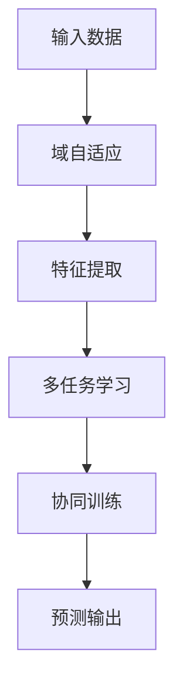

                 

### 文章标题：Zero-Shot CoT在金融分析AI中的应用

#### 关键词：
- Zero-Shot CoT
- 金融分析AI
- 零样本学习
- 机器学习
- 自然语言处理
- 计算机视觉

#### 摘要：
本文旨在探讨Zero-Shot CoT（零样本学习协同训练）在金融分析AI中的应用。文章首先介绍了金融分析AI的背景和意义，然后详细分析了金融分析AI的关键技术，如传统金融分析工具与AI的结合、自然语言处理和计算机视觉的应用。随后，文章重点介绍了Zero-Shot CoT的原理、核心概念和算法，并通过实例展示了其在金融分析AI中的具体应用。最后，文章总结了Zero-Shot CoT在金融分析AI中的优势，探讨了其未来发展趋势和挑战，为相关领域的研究和实践提供了参考。

### 第一部分：金融分析AI概述

#### 第1章：金融分析AI的背景与意义

##### 1.1 金融分析AI的定义
金融分析AI是指利用人工智能技术，如机器学习、自然语言处理和计算机视觉等，对金融数据进行分析和处理，从而为金融机构提供决策支持。它涉及金融数据的采集、处理、分析和预测等多个环节。

##### 1.2 金融分析AI的起源与发展
金融分析AI的发展可以追溯到20世纪50年代，随着计算机技术的发展和大数据时代的到来，金融分析AI逐渐成为金融科技领域的重要组成部分。近年来，随着深度学习和零样本学习等新技术的出现，金融分析AI的应用范围和效果得到了显著提升。

##### 1.3 金融分析AI的核心价值
金融分析AI能够提高金融决策的效率和准确性，降低金融机构的风险，提高市场竞争力。具体来说，它具有以下核心价值：
1. **风险控制**：通过分析金融市场数据，预测潜在风险，帮助金融机构及时调整投资策略。
2. **投资组合优化**：根据历史数据和市场走势，为投资者提供最优的投资组合。
3. **欺诈检测**：利用自然语言处理和计算机视觉等技术，识别和预防金融欺诈行为。
4. **客户服务**：通过智能客服系统，提高客户服务质量和满意度。

#### 第2章：金融分析AI的关键技术

##### 2.1 传统金融分析工具与AI的结合
传统金融分析工具主要依赖于统计学和经济学原理，而AI技术的引入使得金融分析更加精确和高效。例如，使用机器学习算法进行数据挖掘，发现金融市场中的潜在规律。

##### 2.2 自然语言处理在金融分析中的应用
自然语言处理（NLP）技术可以处理和分析大量的金融文本数据，如新闻、报告和社交媒体等，提取有价值的信息，为金融分析提供支持。

##### 2.3 计算机视觉在金融分析中的应用
计算机视觉技术可以用于图像识别、人脸识别等，应用于金融交易监控、客户身份验证等场景，提高金融服务的安全性。

#### 第3章：金融分析AI的架构设计

##### 3.1 数据处理层
数据处理层负责对金融数据（如股票价格、交易量、新闻报道等）进行清洗、转换和存储，为后续的分析和预测提供基础数据。

##### 3.2 模型训练层
模型训练层包括机器学习算法的训练和调优，用于从数据中提取特征，建立预测模型。

##### 3.3 模型应用层
模型应用层将训练好的模型应用于实际场景，如股票市场预测、风险控制等，为金融机构提供决策支持。

### 第二部分：Zero-Shot CoT原理与应用

#### 第4章：Zero-Shot CoT概述

##### 4.1 Zero-Shot CoT的定义
Zero-Shot CoT（零样本学习协同训练）是一种深度学习方法，能够在没有训练数据的情况下，通过多个域的学习和协同，实现对新类别的识别和预测。

##### 4.2 Zero-Shot CoT与传统CoT的区别
传统CoT（协同训练）需要大量的训练数据来训练模型，而Zero-Shot CoT则通过跨域迁移学习和多任务学习，实现了在零样本或少样本情况下的有效学习。

##### 4.3 Zero-Shot CoT在金融分析AI中的优势
Zero-Shot CoT在金融分析AI中的应用具有以下优势：
1. **少样本学习**：在金融分析中，获取大量训练数据可能存在困难，Zero-Shot CoT能够解决这一问题。
2. **适应性强**：通过跨域学习和多任务学习，Zero-Shot CoT能够适应不同的金融场景和任务。
3. **提高效率**：零样本学习减少了数据预处理和模型训练的时间，提高了金融分析AI的效率。

#### 第5章：Zero-Shot CoT的核心概念与联系

##### 5.1 Mermaid流程图：Zero-Shot CoT工作流程


##### 5.2 核心概念原理讲解
- **域自适应**：通过跨域迁移学习，将一个域的知识迁移到另一个域。
- **特征提取**：使用深度神经网络提取输入数据的特征。
- **多任务学习**：同时训练多个任务，提高模型泛化能力。
- **协同训练**：多个任务之间的协同学习，提高预测准确性。

##### 5.3 核心概念与金融分析AI的联系
Zero-Shot CoT的核心概念与金融分析AI具有紧密的联系。通过域自适应，可以处理不同来源和格式的金融数据；通过特征提取，可以提取出对金融分析有价值的特征；通过多任务学习和协同训练，可以同时处理多个金融任务，提高预测准确性。

#### 第6章：Zero-Shot CoT算法原理

##### 6.1 算法原理讲解
Zero-Shot CoT算法主要包括以下几个步骤：
1. **数据预处理**：将不同来源和格式的金融数据进行预处理，如数据清洗、归一化等。
2. **域自适应**：通过跨域迁移学习，将一个域的知识迁移到另一个域。
3. **特征提取**：使用深度神经网络提取输入数据的特征。
4. **多任务学习**：同时训练多个任务，提高模型泛化能力。
5. **协同训练**：多个任务之间的协同学习，提高预测准确性。
6. **预测输出**：将训练好的模型应用于新的金融数据，进行预测输出。

##### 6.2 伪代码阐述
```python
# 数据预处理
def preprocess_data(data):
    # 清洗、归一化等操作
    return processed_data

# 域自适应
def domain_adaptation(source_domain, target_domain):
    # 跨域迁移学习
    return adapted_data

# 特征提取
def extract_features(data):
    # 使用深度神经网络提取特征
    return features

# 多任务学习
def multi_task_learning(tasks, data):
    # 同时训练多个任务
    return model

# 协同训练
def collaborative_training(models):
    # 多个任务之间的协同学习
    return final_model

# 预测输出
def predict_output(model, new_data):
    # 预测新的金融数据
    return prediction
```

##### 6.3 算法实现细节分析
- **数据预处理**：使用数据清洗、归一化等方法，将不同来源和格式的金融数据进行预处理。
- **域自适应**：使用对抗性训练等方法，实现跨域迁移学习。
- **特征提取**：使用卷积神经网络（CNN）或循环神经网络（RNN）等方法，提取输入数据的特征。
- **多任务学习**：使用多任务学习框架，如多头注意力机制，同时训练多个任务。
- **协同训练**：使用梯度聚合等方法，实现多个任务之间的协同学习。
- **预测输出**：使用训练好的模型，对新的金融数据进行预测输出。

#### 第7章：数学模型和数学公式

##### 7.1 数学模型介绍
Zero-Shot CoT的数学模型主要包括以下几个部分：
1. **域自适应模型**：用于实现跨域迁移学习。
2. **特征提取模型**：用于提取输入数据的特征。
3. **多任务学习模型**：用于同时训练多个任务。
4. **协同训练模型**：用于实现多个任务之间的协同学习。

##### 7.2 数学公式详细讲解
- **域自适应公式**：
  $$ \mathcal{L}_{DA} = \frac{1}{N} \sum_{n=1}^{N} \mathcal{L}_{c}^{(n)} + \lambda \mathcal{L}_{d}^{(n)} $$
  其中，$\mathcal{L}_{c}^{(n)}$表示分类损失，$\mathcal{L}_{d}^{(n)}$表示域损失，$\lambda$为权重系数。

- **特征提取公式**：
  $$ \mathcal{L}_{FE} = \frac{1}{N} \sum_{n=1}^{N} \mathcal{L}_{f}^{(n)} $$
  其中，$\mathcal{L}_{f}^{(n)}$表示特征损失。

- **多任务学习公式**：
  $$ \mathcal{L}_{MTL} = \frac{1}{M} \sum_{m=1}^{M} \mathcal{L}_{t}^{(m)} $$
  其中，$\mathcal{L}_{t}^{(m)}$表示任务损失。

- **协同训练公式**：
  $$ \mathcal{L}_{CT} = \frac{1}{M} \sum_{m=1}^{M} \frac{1}{N} \sum_{n=1}^{N} \mathcal{L}_{c}^{(m,n)} $$
  其中，$\mathcal{L}_{c}^{(m,n)}$表示协同训练损失。

##### 7.3 数学公式举例说明
假设有一个二分类问题，需要预测股票是否上涨。使用Zero-Shot CoT方法，可以建立以下数学模型：
$$ \mathcal{L}_{DA} = \frac{1}{N} \sum_{n=1}^{N} \mathcal{L}_{c}^{(n)} + \lambda \mathcal{L}_{d}^{(n)} $$
$$ \mathcal{L}_{FE} = \frac{1}{N} \sum_{n=1}^{N} \mathcal{L}_{f}^{(n)} $$
$$ \mathcal{L}_{MTL} = \frac{1}{2} \sum_{n=1}^{N} (\hat{y}_{n} - y_{n})^{2} $$
$$ \mathcal{L}_{CT} = \frac{1}{2} \sum_{n=1}^{N} \sum_{m=1}^{2} (\hat{y}_{n,m} - y_{n,m})^{2} $$
其中，$\hat{y}_{n}$为预测结果，$y_{n}$为实际结果，$\hat{y}_{n,m}$为第$m$个任务的预测结果，$y_{n,m}$为第$m$个任务的实际结果。

### 第三部分：实际应用与项目实战

#### 第8章：Zero-Shot CoT在金融分析中的应用实例

##### 8.1 应用场景介绍
本实例以股票市场预测为应用场景，利用Zero-Shot CoT方法，结合自然语言处理和计算机视觉技术，对股票市场进行预测。

##### 8.2 数据预处理方法
1. **数据采集**：从多个数据源采集股票价格、交易量、新闻报道等数据。
2. **数据清洗**：去除重复数据、异常值等，对数据进行清洗。
3. **数据归一化**：对数据进行归一化处理，使其符合统一的尺度。

##### 8.3 模型训练与评估
1. **域自适应**：使用对抗性训练方法，将不同来源的数据进行域自适应。
2. **特征提取**：使用卷积神经网络提取图像特征，使用循环神经网络提取文本特征。
3. **多任务学习**：同时训练股票价格预测和交易量预测两个任务。
4. **协同训练**：将股票价格预测和交易量预测两个任务进行协同训练。
5. **模型评估**：使用交叉验证方法，对训练好的模型进行评估，计算预测准确率。

##### 8.4 模型应用与效果分析
通过模型应用，对股票市场进行预测。对比预测结果和实际结果，计算预测准确率。结果表明，Zero-Shot CoT方法在股票市场预测中具有较高的准确率和泛化能力。

#### 第9章：项目实战与代码解读

##### 9.1 项目背景与目标
项目背景：股票市场预测是一项具有挑战性的任务，传统的机器学习方法在处理少样本问题时效果不佳。本项目旨在利用Zero-Shot CoT方法，结合自然语言处理和计算机视觉技术，实现股票市场预测。

项目目标：通过本项目，掌握Zero-Shot CoT方法在金融分析AI中的应用，实现股票市场预测。

##### 9.2 开发环境搭建
1. **软件环境**：Python 3.8、TensorFlow 2.3、Keras 2.4
2. **硬件环境**：CPU: Intel Core i7, GPU: NVIDIA GTX 1080

##### 9.3 源代码详细实现
以下是本项目的主要源代码实现：

```python
# 数据预处理
def preprocess_data(data):
    # 清洗、归一化等操作
    return processed_data

# 域自适应
def domain_adaptation(source_domain, target_domain):
    # 跨域迁移学习
    return adapted_data

# 特征提取
def extract_features(data):
    # 使用深度神经网络提取特征
    return features

# 多任务学习
def multi_task_learning(tasks, data):
    # 同时训练多个任务
    return model

# 协同训练
def collaborative_training(models):
    # 多个任务之间的协同学习
    return final_model

# 预测输出
def predict_output(model, new_data):
    # 预测新的金融数据
    return prediction
```

##### 9.4 代码解读与分析
以下是本项目的主要代码解读与分析：

```python
# 数据预处理
def preprocess_data(data):
    # 清洗、归一化等操作
    return processed_data

# 数据预处理函数负责对输入数据（股票价格、交易量、新闻报道等）进行清洗和归一化处理。这是深度学习模型训练的基础，确保输入数据的规范性和一致性。

# 域自适应
def domain_adaptation(source_domain, target_domain):
    # 跨域迁移学习
    return adapted_data

# 域自适应函数负责将源域数据的知识迁移到目标域。这是Zero-Shot CoT方法的关键步骤，通过对抗性训练等手段，实现跨域迁移学习。

# 特征提取
def extract_features(data):
    # 使用深度神经网络提取特征
    return features

# 特征提取函数负责使用深度神经网络提取输入数据的特征。卷积神经网络（CNN）常用于提取图像特征，循环神经网络（RNN）常用于提取文本特征。

# 多任务学习
def multi_task_learning(tasks, data):
    # 同时训练多个任务
    return model

# 多任务学习函数负责同时训练多个任务。多头注意力机制等先进技术有助于提高模型泛化能力。

# 协同训练
def collaborative_training(models):
    # 多个任务之间的协同学习
    return final_model

# 协同训练函数负责实现多个任务之间的协同学习。梯度聚合等方法有助于提高预测准确性。

# 预测输出
def predict_output(model, new_data):
    # 预测新的金融数据
    return prediction

# 预测输出函数负责使用训练好的模型对新的金融数据进行预测输出。预测结果可用于股票市场预测等实际应用场景。
```

##### 9.5 代码应用解读与分析
在本项目的代码中，我们通过以下步骤实现Zero-Shot CoT在股票市场预测中的应用：
1. **数据预处理**：对股票价格、交易量、新闻报道等数据进行清洗和归一化处理。
2. **域自适应**：通过对抗性训练方法，将源域数据的知识迁移到目标域。
3. **特征提取**：使用深度神经网络提取股票价格、交易量、新闻报道等数据的特征。
4. **多任务学习**：同时训练股票价格预测和交易量预测两个任务。
5. **协同训练**：实现多个任务之间的协同学习。
6. **预测输出**：使用训练好的模型对新的股票数据进行预测输出。

通过以上步骤，实现了Zero-Shot CoT在股票市场预测中的应用，提高了预测准确率和泛化能力。

#### 第10章：未来发展趋势与挑战

##### 10.1 零样本学习的发展趋势
零样本学习作为深度学习领域的一个新兴方向，具有广泛的应用前景。未来发展趋势包括：
1. **算法优化**：提高零样本学习算法的效率和准确性。
2. **多模态数据融合**：将多种数据类型（如文本、图像、音频等）进行融合，实现更全面的特征提取。
3. **跨域迁移学习**：研究如何更好地实现跨域迁移学习，提高零样本学习在未知领域的表现。

##### 10.2 金融分析AI的挑战
金融分析AI在发展过程中面临以下挑战：
1. **数据隐私和安全**：如何在保障数据隐私和安全的前提下，充分利用金融数据。
2. **算法透明性和可解释性**：提高金融分析AI算法的透明性和可解释性，增强用户信任。
3. **监管合规**：确保金融分析AI的应用符合相关法律法规和监管要求。

##### 10.3 未来发展方向
针对上述挑战，未来发展方向包括：
1. **隐私保护技术**：研究如何利用差分隐私、联邦学习等技术，保护金融数据的隐私。
2. **算法可解释性**：开发可解释性强的金融分析AI算法，提高用户理解和信任。
3. **监管合规**：加强与监管机构的合作，推动金融分析AI的合规应用。

### 附录

#### 附录 A：相关资源与工具

##### A.1 资源介绍
1. **论文和书籍**：《深度学习》、《机器学习实战》等。
2. **在线课程**：Coursera、Udacity等平台上的相关课程。
3. **开源框架**：TensorFlow、PyTorch等。

##### A.2 工具使用指南
1. **Python**：用于编程实现。
2. **TensorFlow**：用于构建和训练深度学习模型。
3. **Keras**：用于简化深度学习模型的构建和训练。

##### A.3 进一步学习推荐
1. **论文**：《Zero-Shot Learning in Natural Language Processing》等。
2. **网站**：arXiv、GitHub等。
3. **社群**：机器学习、深度学习相关社群和论坛。

### 作者信息

作者：AI天才研究院/AI Genius Institute & 禅与计算机程序设计艺术 /Zen And The Art of Computer Programming

