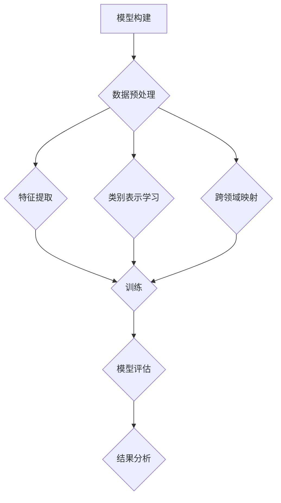

                 

# 《Zero-Shot CoT：AI跨领域学习的新范式与应用》

## 关键词

- 零样本学习
- 跨领域学习
- 计算机视觉
- 自然语言处理
- 深度学习
- 多任务学习

## 摘要

随着人工智能技术的迅猛发展，零样本跨领域学习（Zero-Shot Cross-Domain Learning，简称Zero-Shot CoT）已成为研究热点。零样本学习旨在使模型能够在未见过的数据上做出准确的预测，而跨领域学习则关注如何使模型在不同数据集之间进行有效迁移。本文首先回顾了人工智能的发展历程和零样本学习的基本概念，然后详细阐述了零样本跨领域学习的基本原理、关键技术以及核心算法。接着，文章通过具体应用场景和项目实战，展示了零样本跨领域学习的实际应用效果。最后，文章对未来的发展趋势进行了展望，并提出了一些挑战和机遇。

## 第一部分：引论与概述

### 第1章：零样本跨领域学习的背景与重要性

#### 1.1 AI发展历程回顾

人工智能（AI）作为计算机科学的一个重要分支，自1956年诞生以来，经历了多次重要的发展阶段。早期的符号主义方法依赖于手工编写的规则和逻辑推理，但受限于计算能力和数据规模，难以应对复杂的问题。随后，以统计学习为代表的数据驱动方法开始兴起，通过大量训练数据学习特征表示和决策规则，取得了显著的进步。然而，这些方法往往需要大量标注数据，且难以泛化到未见过的数据集上。

近年来，深度学习（Deep Learning）的崛起为人工智能带来了新的契机。深度神经网络通过多层非线性变换，可以自动提取特征并学习复杂函数关系，取得了在图像识别、自然语言处理等多个领域的突破性成果。然而，深度学习模型也存在一些局限性，如对大规模标注数据的高度依赖、对未见过的数据的泛化能力不足等。

#### 1.2 零样本学习的基本概念

零样本学习（Zero-Shot Learning，简称ZSL）是一种旨在使模型能够在未见过的类上做出准确预测的人工智能技术。在传统机器学习中，模型通常需要针对每个类别进行单独的训练，而对于未知类别，模型无法进行有效预测。零样本学习通过引入类别的语义表示，使得模型能够利用预训练的知识对未见过的类别进行预测。

零样本学习可以分为两种类型：基于原型的方法（Prototype-based Methods）和基于匹配的方法（Matching-based Methods）。原型方法通过学习每个类别的原型，将未知类别的样本与原型进行比较，从而进行分类。匹配方法则通过学习类别之间的匹配关系，将未知类别的样本与已知类别的样本进行匹配，从而进行分类。

#### 1.3 零样本跨领域学习的研究现状

跨领域学习（Cross-Domain Learning）旨在解决不同领域之间数据分布差异的问题，使得模型能够在一个领域的学习经验中泛化到另一个领域。零样本跨领域学习（Zero-Shot Cross-Domain Learning，简称Zero-Shot CoT）结合了零样本学习和跨领域学习的思想，旨在解决不同领域、不同数据分布的零样本预测问题。

近年来，零样本跨领域学习取得了显著的进展。一些研究者提出了基于原型和匹配的零样本跨领域学习方法，如Prototypical Networks和Matching Networks。此外，还有一些研究者将多任务学习和迁移学习引入零样本跨领域学习，以提高模型的泛化能力和适应性。

#### 1.4 本书的研究目的与结构安排

本书旨在系统性地介绍零样本跨领域学习的基本概念、关键技术、核心算法及其在实际应用中的效果。具体而言，本书将分为以下几部分：

- 第一部分：引论与概述，介绍人工智能的发展历程、零样本学习和跨领域学习的基本概念，以及零样本跨领域学习的研究现状。
- 第二部分：核心算法原理讲解，详细阐述零样本跨领域学习的核心算法原理，包括原型方法、匹配方法和多任务学习方法。
- 第三部分：实际应用案例与项目实战，通过具体应用场景和项目实战，展示零样本跨领域学习的实际应用效果。
- 第四部分：未来趋势与展望，对零样本跨领域学习的未来发展方向、挑战与机遇进行探讨。

通过本书的阅读，读者可以全面了解零样本跨领域学习的技术原理和应用实践，为相关研究和应用提供有益的参考。

### 第2章：零样本跨领域学习的基本原理

#### 2.1 零样本学习的基本原理

零样本学习（Zero-Shot Learning，简称ZSL）是一种旨在使模型能够在未见过的数据上做出准确预测的人工智能技术。传统的机器学习模型通常需要针对每个类别进行单独的训练，而对于未知类别，模型无法进行有效预测。零样本学习通过引入类别的语义表示，使得模型能够利用预训练的知识对未见过的类别进行预测。

零样本学习可以分为基于原型的方法和基于匹配的方法。

**1. 基于原型的方法**

基于原型的方法通过学习每个类别的原型，将未知类别的样本与原型进行比较，从而进行分类。具体而言，模型首先学习到每个类别的中心向量（原型），然后将未知类别的样本与这些中心向量进行比较，选择与原型最相似的类别作为预测结果。

设样本集合为$S=\{s_1, s_2, \ldots, s_n\}$，类别集合为$C=\{c_1, c_2, \ldots, c_m\}$，每个类别$c_i$对应的原型表示为$\mu_i$。给定一个未知类别样本$s$，其预测类别为：

$$
\hat{c} = \arg\min_{c_j} \|\mu_j - s\|
$$

**2. 基于匹配的方法**

基于匹配的方法通过学习类别之间的匹配关系，将未知类别的样本与已知类别的样本进行匹配，从而进行分类。具体而言，模型首先学习到类别之间的匹配函数，然后将未知类别的样本与已知类别的样本进行匹配，选择匹配度最高的类别作为预测结果。

设样本集合为$S=\{s_1, s_2, \ldots, s_n\}$，类别集合为$C=\{c_1, c_2, \ldots, c_m\}$，每个类别$c_i$对应的匹配函数为$f_i$。给定一个未知类别样本$s$，其预测类别为：

$$
\hat{c} = \arg\max_{c_j} f_j(s)
$$

#### 2.2 跨领域学习的挑战与解决方案

跨领域学习（Cross-Domain Learning）旨在解决不同领域之间数据分布差异的问题，使得模型能够在一个领域的学习经验中泛化到另一个领域。在零样本跨领域学习（Zero-Shot Cross-Domain Learning，简称Zero-Shot CoT）中，跨领域学习同样面临着一系列挑战。

**1. 数据分布差异**

不同领域的数据分布可能存在显著差异，导致模型在一个领域上训练的效果不佳。例如，在医疗诊断领域，数据集中可能包含了大量的医疗图像和文本，而在自动驾驶领域，数据集中则可能包含了大量的图像和激光雷达数据。这些数据分布的差异使得模型难以在不同领域之间进行有效的迁移。

**2. 数据质量与标注**

跨领域学习通常依赖于跨领域的数据集，这些数据集可能存在质量不高或标注不精确的问题。数据质量不高可能导致模型训练过程中的噪声增加，影响模型的泛化能力。标注不精确则可能导致模型无法准确理解类别的语义表示，从而影响预测效果。

**3. 模型适应性**

跨领域学习要求模型具有较强的适应性，能够在不同的数据分布和任务中保持良好的性能。然而，现有的零样本跨领域学习方法大多依赖于固定的模型架构和参数设置，难以针对不同的领域进行自适应调整。

针对上述挑战，研究者们提出了一系列解决方案：

**1. 数据增强与预处理**

数据增强（Data Augmentation）和预处理（Preprocessing）是提高模型泛化能力的重要手段。通过引入数据增强方法，如图像旋转、缩放、裁剪等，可以增加数据的多样性，有助于模型学习到更具泛化能力的特征表示。此外，通过预处理方法，如数据清洗、去噪、归一化等，可以提高数据质量，减少噪声对模型训练的影响。

**2. 跨领域映射与适配**

跨领域映射（Cross-Domain Mapping）和适配（Adaptation）是一种有效的跨领域学习方法。通过学习跨领域的映射关系，将不同领域的特征表示进行转换和融合，可以降低领域差异，提高模型在不同领域的适应性。此外，通过适配方法，如领域自适应（Domain Adaptation）和领域自适应分类（Domain-Adaptive Classification），可以进一步优化模型在不同领域的性能。

**3. 多任务学习与迁移学习**

多任务学习（Multi-Task Learning）和迁移学习（Transfer Learning）是一种有效的跨领域学习方法。通过在同一模型中同时学习多个任务，可以共享任务之间的知识，提高模型在不同领域的泛化能力。此外，通过迁移学习，将一个领域的学习经验迁移到另一个领域，可以减少对大量标注数据的依赖，提高模型的泛化性能。

#### 2.3 零样本跨领域学习的关键技术

零样本跨领域学习（Zero-Shot Cross-Domain Learning，简称Zero-Shot CoT）的关键技术主要包括以下几个方面：

**1. 类别表示学习**

类别表示学习（Category Representation Learning）是零样本跨领域学习的核心步骤。通过学习类别之间的语义表示，可以使得模型能够利用预训练的知识对未见过的类别进行预测。常见的类别表示学习方法包括词嵌入（Word Embedding）、图嵌入（Graph Embedding）和嵌入迁移（Embedding Transfer）等。

**2. 跨领域特征映射**

跨领域特征映射（Cross-Domain Feature Mapping）是将不同领域的特征表示进行转换和融合的重要方法。通过学习跨领域的映射关系，可以将一个领域的特征表示映射到另一个领域，从而降低领域差异，提高模型在不同领域的适应性。常见的跨领域特征映射方法包括基于深度学习的映射（Deep Feature Mapping）和基于对抗性网络的映射（Adversarial Feature Mapping）等。

**3. 多任务学习与迁移学习**

多任务学习（Multi-Task Learning）和迁移学习（Transfer Learning）是提高零样本跨领域学习性能的重要手段。通过在同一模型中同时学习多个任务，可以共享任务之间的知识，提高模型在不同领域的泛化能力。此外，通过迁移学习，将一个领域的学习经验迁移到另一个领域，可以减少对大量标注数据的依赖，提高模型的泛化性能。常见的多任务学习和迁移学习方法包括基于共享权重的多任务学习（Shared Weight Multi-Task Learning）和基于特征重用的迁移学习（Feature Reuse Transfer Learning）等。

**4. 适应性与鲁棒性优化**

适应性与鲁棒性优化（Adaptation and Robustness Optimization）是提高零样本跨领域学习性能的关键环节。通过引入适应性与鲁棒性优化方法，可以提高模型在不同领域的泛化能力和抗干扰能力。常见的适应性与鲁棒性优化方法包括基于对抗性训练的适应性与鲁棒性优化（Adversarial Adaptation and Robustness Optimization）和基于数据增强的适应性与鲁棒性优化（Data Augmentation-based Adaptation and Robustness Optimization）等。

### 第3章：零样本跨领域学习的关键技术详解

#### 3.1 零样本分类算法

零样本分类算法是零样本跨领域学习中的重要组成部分，其主要目标是在未见过的类上进行准确的分类。本节将介绍几种常见的零样本分类算法，包括原型网络（Prototypical Networks）、匹配网络（Matching Networks）和关系网络（Relation Networks）。

##### 3.1.1 原型网络（Prototypical Networks）

原型网络（Prototypical Networks，简称PN）是一种基于原型的零样本分类算法。其核心思想是学习每个类别的原型，并将未见过的类别样本与这些原型进行比较，从而进行分类。

**1. 算法原理**

给定训练数据集$S=\{s_1, s_2, \ldots, s_n\}$和类别标签集合$C=\{c_1, c_2, \ldots, c_m\}$，原型网络首先通过神经网络学习到每个类别的原型表示$\mu_i$。具体而言，对于类别$c_i$，原型表示$\mu_i$是所有训练样本$c_i$的特征表示的平均值。然后，对于未见过的类别样本$s$，模型将其与所有原型表示进行比较，选择与原型最相似的类别作为预测结果。

原型网络可以表示为：

$$
\mu_i = \frac{1}{N_i}\sum_{s_j \in C_i} f(s_j)
$$

$$
\hat{c} = \arg\min_{c_j} \|\mu_j - s\|
$$

其中，$f(s)$是神经网络对样本$s$的特征表示，$N_i$是类别$c_i$的训练样本数量。

**2. 伪代码**

以下是一个原型网络的伪代码实现：

```
for each epoch do
  for each sample s in the training set do
    compute the feature representation f(s)
  end for
  compute the prototypes $\mu_i$ for each category
  for each test sample s do
    compute the distance to all prototypes
    predict the category with the minimum distance
  end for
end for
```

**3. 优点与不足**

优点：

- 简单有效：原型网络的结构简单，训练和预测过程高效。
- 泛化能力强：原型网络通过学习类别原型，可以较好地应对未见过的类别。

不足：

- 对噪声敏感：原型网络对训练数据集中的噪声较为敏感，可能会影响预测结果。
- 特征表示依赖：原型网络的性能很大程度上依赖于特征表示的质量，如果特征表示能力较弱，则难以取得好的效果。

##### 3.1.2 匹配网络（Matching Networks）

匹配网络（Matching Networks，简称MN）是一种基于匹配的零样本分类算法。其核心思想是通过学习类别之间的匹配关系，将未见过的类别样本与已知类别样本进行匹配，从而进行分类。

**1. 算法原理**

给定训练数据集$S=\{s_1, s_2, \ldots, s_n\}$和类别标签集合$C=\{c_1, c_2, \ldots, c_m\}$，匹配网络首先通过神经网络学习到类别之间的匹配函数$f_i$。具体而言，对于类别$c_i$，匹配函数$f_i$是类别$c_i$的训练样本特征表示与其对应的类别标签之间的匹配程度。然后，对于未见过的类别样本$s$，模型将其与所有已知类别样本进行匹配，选择匹配度最高的类别作为预测结果。

匹配网络可以表示为：

$$
f_i(s) = \sum_{s_j \in C_i} w_{ij} \cdot \cos(\theta_{ij})
$$

$$
\hat{c} = \arg\max_{c_j} f_j(s)
$$

其中，$w_{ij}$是类别$c_i$与$c_j$之间的权重，$\theta_{ij}$是类别$c_i$与$c_j$之间的特征夹角。

**2. 伪代码**

以下是一个匹配网络的伪代码实现：

```
for each epoch do
  for each pair of samples (s_i, s_j) in the training set do
    compute the feature representations f(s_i) and f(s_j)
    compute the matching score f_i(s) using the cosine similarity
  end for
  update the weights w_{ij} based on the matching scores
  for each test sample s do
    compute the matching scores to all categories
    predict the category with the highest matching score
  end for
end for
```

**3. 优点与不足**

优点：

- 灵活性高：匹配网络通过学习类别之间的匹配关系，可以更好地应对复杂的类别关系。
- 抗噪声能力较强：匹配网络对噪声的敏感性相对较低。

不足：

- 计算复杂度高：匹配网络需要计算大量的匹配分数，计算复杂度较高。
- 对类别数量敏感：匹配网络对类别数量较为敏感，类别数量过多可能导致性能下降。

##### 3.1.3 关系网络（Relation Networks）

关系网络（Relation Networks，简称RN）是一种基于关系的零样本分类算法。其核心思想是通过学习类别之间的相互关系，将未见过的类别样本与已知类别样本进行关联，从而进行分类。

**1. 算法原理**

给定训练数据集$S=\{s_1, s_2, \ldots, s_n\}$和类别标签集合$C=\{c_1, c_2, \ldots, c_m\}$，关系网络首先通过神经网络学习到类别之间的关系表示$r_{ij}$。具体而言，对于类别$c_i$和$c_j$，关系表示$r_{ij}$是类别$c_i$和$c_j$之间的关联程度。然后，对于未见过的类别样本$s$，模型将其与所有已知类别样本进行关联，选择关联程度最高的类别作为预测结果。

关系网络可以表示为：

$$
r_{ij} = \frac{1}{N_{ij}}\sum_{s_k \in C_i \cap C_j} \cos(\theta_{ik}, \theta_{jk})
$$

$$
\hat{c} = \arg\max_{c_j} r_{ij}
$$

其中，$\theta_{ik}$和$\theta_{jk}$分别是类别$c_i$和$c_j$与训练样本$s_k$的特征夹角。

**2. 伪代码**

以下是一个关系网络的伪代码实现：

```
for each epoch do
  for each pair of samples (s_i, s_j) in the training set do
    compute the feature representations f(s_i) and f(s_j)
    compute the relation representation r_{ij} based on the cosine similarity
  end for
  update the relation representations r_{ij} based on the training samples
  for each test sample s do
    compute the relation scores to all categories
    predict the category with the highest relation score
  end for
end for
```

**3. 优点与不足**

优点：

- 关联性强：关系网络通过学习类别之间的相互关系，可以更好地捕捉类别之间的关联性。
- 泛化能力较强：关系网络对未见过的类别样本具有较强的泛化能力。

不足：

- 计算复杂度高：关系网络需要计算大量的关系表示，计算复杂度较高。
- 对类别数量敏感：关系网络对类别数量较为敏感，类别数量过多可能导致性能下降。

#### 3.2 零样本回归算法

零样本回归算法（Zero-Shot Regression，简称ZSR）旨在使模型能够对未见过的数据进行准确的回归预测。与分类任务类似，零样本回归算法也需要学习到类别的语义表示，并利用这些表示对未见过的数据进行回归预测。本节将介绍两种常见的零样本回归算法：深度集网络（Deep Set Networks）和集到集回归（Set-to-Set Regression）。

##### 3.2.1 深度集网络（Deep Set Networks）

深度集网络（Deep Set Networks，简称DSN）是一种基于集合论的零样本回归算法。其核心思想是将回归问题转化为集合间的映射问题，通过学习集合间的映射关系进行回归预测。

**1. 算法原理**

给定训练数据集$S=\{s_1, s_2, \ldots, s_n\}$和输出集合$Y=\{y_1, y_2, \ldots, y_m\}$，深度集网络首先通过神经网络学习到集合$S$到集合$Y$的映射函数$f_S^Y$。具体而言，对于输入集合$S$，映射函数$f_S^Y$将其映射到输出集合$Y$中对应的输出值。然后，对于未见过的输入集合$S'$，模型将其映射到输出集合$Y'$中，选择与输入集合$S'$最相似的输出集合作为预测结果。

深度集网络可以表示为：

$$
f_S^Y(S) = \{y_1, y_2, \ldots, y_m\}
$$

$$
\hat{y}' = \arg\min_{y' \in Y'} \sum_{s' \in S'} d(s', y')
$$

其中，$d(s', y')$是输入样本$s'$与输出样本$y'$之间的距离度量。

**2. 伪代码**

以下是一个深度集网络的伪代码实现：

```
for each epoch do
  for each sample s in the training set do
    compute the feature representation f(s)
  end for
  compute the mapping function f_S^Y
  for each test sample S do
    compute the predicted output set f_S^Y(S)
    predict the output value with the minimum distance to S
  end for
end for
```

**3. 优点与不足**

优点：

- 灵活性高：深度集网络通过学习集合间的映射关系，可以更好地应对复杂的回归问题。
- 泛化能力较强：深度集网络对未见过的输入集合具有较强的泛化能力。

不足：

- 计算复杂度高：深度集网络需要计算大量的映射函数，计算复杂度较高。
- 对数据分布敏感：深度集网络对输入集合和数据分布较为敏感，数据分布差异可能导致性能下降。

##### 3.2.2 集到集回归（Set-to-Set Regression）

集到集回归（Set-to-Set Regression，简称SSR）是一种基于集合映射的零样本回归算法。其核心思想是通过学习输入集合到输出集合的映射关系，进行零样本回归预测。

**1. 算法原理**

给定训练数据集$S=\{s_1, s_2, \ldots, s_n\}$和输出集合$Y=\{y_1, y_2, \ldots, y_m\}$，集到集回归首先通过神经网络学习到输入集合$S$到输出集合$Y$的映射函数$f_S^Y$。具体而言，对于输入集合$S$，映射函数$f_S^Y$将其映射到输出集合$Y$中对应的输出值。然后，对于未见过的输入集合$S'$，模型将其映射到输出集合$Y'$中，选择与输入集合$S'$最相似的输出集合作为预测结果。

集到集回归可以表示为：

$$
f_S^Y(S) = \{y_1, y_2, \ldots, y_m\}
$$

$$
\hat{y}' = \arg\min_{y' \in Y'} \sum_{s' \in S'} d(s', y')
$$

其中，$d(s', y')$是输入样本$s'$与输出样本$y'$之间的距离度量。

**2. 伪代码**

以下是一个集到集回归的伪代码实现：

```
for each epoch do
  for each sample s in the training set do
    compute the feature representation f(s)
  end for
  compute the mapping function f_S^Y
  for each test sample S do
    compute the predicted output set f_S^Y(S)
    predict the output value with the minimum distance to S
  end for
end for
```

**3. 优点与不足**

优点：

- 简单直观：集到集回归的结构简单，实现过程直观。
- 泛化能力较强：集到集回归对未见过的输入集合具有较强的泛化能力。

不足：

- 对数据分布敏感：集到集回归对输入集合和数据分布较为敏感，数据分布差异可能导致性能下降。
- 特征表示依赖：集到集回归的性能很大程度上依赖于特征表示的质量，如果特征表示能力较弱，则难以取得好的效果。

#### 3.3 零样本多任务学习

零样本多任务学习（Zero-Shot Multi-Task Learning，简称ZSMTL）是一种旨在同时学习多个任务的人工智能技术。与传统的多任务学习不同，零样本多任务学习旨在解决未见过的类和任务上的预测问题。本节将介绍零样本多任务学习的挑战、策略和评估指标。

##### 3.3.1 多任务学习的挑战

零样本多任务学习面临着一系列挑战，主要包括以下几个方面：

**1. 数据集差异**

不同任务的数据集可能存在显著的差异，如数据分布、数据质量和标注差异等。这些差异可能导致模型在一个任务上表现良好，而在另一个任务上表现不佳。

**2. 类别冲突**

在多任务学习中，不同任务之间的类别可能存在冲突。例如，在图像分类和图像分割任务中，某些类别可能在图像中占据重要地位，而在其他任务中则不那么重要。这种类别冲突可能导致模型在预测未见过的类别时出现错误。

**3. 资源分配**

多任务学习需要平衡不同任务之间的资源分配。如果某个任务的数据量较大，而其他任务的数据量较小，则可能需要调整模型的参数和优化策略，以确保每个任务都能得到充分的训练。

**4. 泛化能力**

零样本多任务学习旨在解决未见过的类和任务上的预测问题。因此，模型的泛化能力至关重要。如果模型在训练过程中过于依赖特定任务或类别，则可能导致在未见过的任务或类别上表现不佳。

##### 3.3.2 多任务学习的策略

为了应对上述挑战，研究者们提出了一系列多任务学习的策略，主要包括以下几个方面：

**1. 共享特征表示**

共享特征表示（Shared Feature Representation）是一种常见的多任务学习策略。通过在多个任务之间共享特征表示，可以减少参数数量，提高模型的泛化能力。具体而言，模型首先通过一个共享的网络层提取特征，然后将这些特征输入到不同的任务网络中进行任务预测。

**2. 任务级联**

任务级联（Task Cascading）是一种通过层次结构组织任务的多任务学习策略。在任务级联中，各个任务按照一定的顺序依次进行，上一个任务的输出作为下一个任务的输入。这种策略可以确保模型在解决较复杂的任务时能够利用之前学习的知识。

**3. 任务权重**

任务权重（Task Weighting）是一种通过调整不同任务的重要性来优化多任务学习的策略。在任务权重中，模型为每个任务分配一个权重，以平衡不同任务之间的贡献。权重可以通过手动设置或自动学习得到。

**4. 动态任务选择**

动态任务选择（Dynamic Task Selection）是一种根据任务的重要性和数据质量动态调整任务顺序的多任务学习策略。通过动态任务选择，模型可以优先解决重要且数据丰富的任务，从而提高整体性能。

##### 3.3.3 多任务学习的评估指标

多任务学习的效果需要通过一系列评估指标进行衡量，主要包括以下几个方面：

**1. 平均准确率**

平均准确率（Average Accuracy）是衡量多任务学习模型性能的常用指标。平均准确率计算所有任务准确率的平均值，用于评估模型在多个任务上的总体表现。

**2. 任务精确率**

任务精确率（Task Precision）是衡量模型在特定任务上性能的指标。任务精确率计算每个任务上正确预测的样本数量与总样本数量的比值。

**3. 任务召回率**

任务召回率（Task Recall）是衡量模型在特定任务上性能的指标。任务召回率计算每个任务上正确预测的样本数量与实际正例样本数量的比值。

**4. F1 值**

F1 值（F1 Score）是衡量多任务学习模型性能的综合性指标。F1 值是任务精确率和任务召回率的调和平均数，用于平衡精确率和召回率。

通过上述评估指标，研究者可以全面评估多任务学习模型在不同任务上的性能，为模型优化和任务选择提供有益的参考。

## 第二部分：核心算法原理讲解

### 第4章：数学模型与算法解释

#### 4.1 零样本学习中的数学模型

零样本学习（Zero-Shot Learning，简称ZSL）是一种旨在使模型能够在未见过的类上做出准确预测的人工智能技术。为了实现这一目标，零样本学习采用了一种独特的数学模型，该模型包括类别表示学习、特征提取和分类预测三个主要部分。

**1. 类别表示学习**

类别表示学习是零样本学习的核心步骤，其目标是学习到每个类别的语义表示。这些表示将用于在未见过的类上进行分类。通常，类别表示学习采用以下数学模型：

设类别集合为$C=\{c_1, c_2, \ldots, c_m\}$，类别$c_i$的语义表示为$v_i$。假设类别$c_i$的训练样本集合为$S_i=\{s_{i,1}, s_{i,2}, \ldots, s_{i,N_i}\}$，其中$N_i$是类别$c_i$的训练样本数量。为了学习类别$c_i$的语义表示$v_i$，我们可以使用以下数学模型：

$$
v_i = \frac{1}{N_i} \sum_{s_{i,j} \in S_i} f(s_{i,j})
$$

其中，$f(s_{i,j})$是神经网络对训练样本$s_{i,j}$的特征表示。这个公式表示，每个类别$c_i$的语义表示$v_i$是其所有训练样本特征表示$f(s_{i,j})$的平均值。

**2. 特征提取**

在零样本学习中，特征提取是一个重要的步骤，它将训练样本的特征表示转换为适用于分类的特征向量。特征提取通常使用预训练的深度神经网络，如卷积神经网络（CNN）或循环神经网络（RNN）。以下是一个简单的特征提取模型：

设输入特征为$x$，神经网络输出为$f(x)$，则特征提取的数学模型可以表示为：

$$
f(x) = \text{NN}(x)
$$

其中，$\text{NN}(x)$表示一个深度神经网络，用于将输入特征$x$映射到高维特征空间。这个高维特征空间可以用于后续的分类预测。

**3. 分类预测**

在零样本学习中，分类预测是基于类别表示学习和特征提取的结果进行的。具体而言，给定一个未见过的样本$s$，模型需要计算其与所有类别表示之间的相似度，然后选择相似度最高的类别作为预测结果。以下是一个简单的分类预测模型：

设未见过的样本为$s$，类别集合为$C$，类别$c_i$的语义表示为$v_i$，则分类预测的数学模型可以表示为：

$$
\hat{c} = \arg\min_{c_i \in C} \|\phi(s) - v_i\|
$$

其中，$\phi(s)$是神经网络对未见过的样本$s$的特征表示，$\|\cdot\|$表示欧几里得距离。这个公式表示，模型通过计算样本$s$的特征表示$\phi(s)$与所有类别表示$v_i$之间的距离，选择距离最小的类别$c_i$作为预测结果。

**4.1.1 核心数学公式**

为了更好地理解零样本学习中的数学模型，以下列出一些核心数学公式：

- 类别表示学习：

$$
v_i = \frac{1}{N_i} \sum_{s_{i,j} \in S_i} f(s_{i,j})
$$

- 特征提取：

$$
f(x) = \text{NN}(x)
$$

- 分类预测：

$$
\hat{c} = \arg\min_{c_i \in C} \|\phi(s) - v_i\|
$$

这些公式为理解零样本学习提供了理论基础，有助于进一步研究和应用。

**4.1.2 模型参数详解**

在零样本学习中，模型参数的选择和调整对模型性能具有重要影响。以下是一些常见的模型参数及其作用：

- 网络深度：网络深度是指神经网络的层数。增加网络深度可以捕捉更复杂的特征，但也会导致过拟合和计算复杂度的增加。
- 网络宽度：网络宽度是指每层的神经元数量。增加网络宽度可以提高模型的表示能力，但也会增加模型的参数数量和计算复杂度。
- 学习率：学习率是梯度下降算法中用于调整模型参数的参数。合适的学习率可以加速模型的训练，但过大会导致震荡，过小则会收敛缓慢。
- 批大小：批大小是指每次训练过程中参与训练的样本数量。适当的批大小可以提高模型的稳定性和计算效率。

通过合理选择和调整这些参数，可以优化零样本学习模型的性能，提高其在未见过的类上的预测能力。

#### 4.2 跨领域学习中的匹配与映射

跨领域学习（Cross-Domain Learning）是一种旨在解决不同领域数据分布差异的问题的人工智能技术。在跨领域学习中，匹配与映射是两个关键步骤，它们共同作用于提高模型在不同领域中的泛化能力。

**1. 匹配**

匹配（Matching）是指在不同领域之间建立映射关系，使得一个领域的知识可以转移到另一个领域。在跨领域学习中，匹配的主要目的是降低领域差异，提高模型的适应性。以下是一个简单的匹配过程：

给定两个领域$D_1$和$D_2$，以及它们的数据集$S_1$和$S_2$，匹配过程可以表示为：

$$
\mu_2 = \text{match}(\mu_1, S_2)
$$

其中，$\mu_1$和$\mu_2$分别是领域$D_1$和$D_2$的模型参数。$\text{match}$函数用于计算领域之间的匹配程度，从而调整模型参数$\mu_1$，使其更适应领域$D_2$。

**2. 映射**

映射（Mapping）是指将一个领域的特征表示转换为另一个领域的特征表示。在跨领域学习中，映射的主要目的是通过调整特征表示，使得模型在不同领域中的表现一致。以下是一个简单的映射过程：

给定两个领域$D_1$和$D_2$，以及它们的数据集$S_1$和$S_2$，映射过程可以表示为：

$$
\phi_2(s) = \text{map}(\phi_1(s), S_2)
$$

其中，$\phi_1$和$\phi_2$分别是领域$D_1$和$D_2$的特征提取函数。$\text{map}$函数用于将领域$D_1$的特征表示$\phi_1(s)$转换为领域$D_2$的特征表示$\phi_2(s)$。

**4.2.1 对抗性训练方法**

对抗性训练（Adversarial Training）是一种常用的跨领域学习方法，它通过引入对抗性样本，提高模型在不同领域之间的泛化能力。以下是一个简单的对抗性训练过程：

给定两个领域$D_1$和$D_2$，以及它们的数据集$S_1$和$S_2$，对抗性训练过程可以表示为：

$$
\mu_2 = \text{adversarial}(\mu_1, S_2)
$$

其中，$\text{adversarial}$函数用于生成对抗性样本，并将其作为训练样本，以调整模型参数$\mu_1$，使其更适应领域$D_2$。

**4.2.2 跨领域映射函数**

跨领域映射函数（Cross-Domain Mapping Function）是一种用于在不同领域之间转换特征表示的函数。它通常由两部分组成：特征提取和特征转换。以下是一个简单的跨领域映射函数：

$$
\phi_2(s) = \text{map}(\phi_1(s), S_2)
$$

其中，$\phi_1$和$\phi_2$分别是领域$D_1$和$D_2$的特征提取函数。$\text{map}$函数用于将领域$D_1$的特征表示$\phi_1(s)$转换为领域$D_2$的特征表示$\phi_2(s)$。

**4.2.3 匹配与映射的融合**

在实际应用中，匹配与映射往往是相互融合的。例如，可以使用对抗性训练方法来优化跨领域映射函数，从而提高模型在不同领域之间的泛化能力。以下是一个简单的融合过程：

给定两个领域$D_1$和$D_2$，以及它们的数据集$S_1$和$S_2$，融合过程可以表示为：

$$
\mu_2 = \text{adversarial}(\mu_1, S_2) \odot \text{map}(\phi_1(s), S_2)
$$

其中，$\text{adversarial}$函数用于生成对抗性样本，$\text{map}$函数用于跨领域映射，$\odot$表示融合操作。

通过融合匹配与映射，可以有效地提高模型在不同领域之间的泛化能力，从而更好地应对跨领域学习任务。

#### 4.3 零样本跨领域学习的优化方法

在零样本跨领域学习中，优化方法是提高模型性能的关键环节。常用的优化方法包括梯度下降法、随机梯度下降法、动量法与自适应优化。以下将对这些方法进行详细讲解。

**4.3.1 梯度下降法**

梯度下降法（Gradient Descent）是一种最基本的优化方法，它通过计算损失函数关于模型参数的梯度，来更新模型参数。具体而言，梯度下降法的目标是最小化损失函数$J(\theta)$，其中$\theta$是模型参数。梯度下降法的更新公式如下：

$$
\theta = \theta - \alpha \nabla_{\theta} J(\theta)
$$

其中，$\alpha$是学习率，$\nabla_{\theta} J(\theta)$是损失函数关于模型参数$\theta$的梯度。每次迭代，模型参数$\theta$都会沿着梯度方向更新，以减小损失函数的值。

**4.3.2 随机梯度下降法**

随机梯度下降法（Stochastic Gradient Descent，简称SGD）是梯度下降法的一种变体，它将整个训练数据集分成多个小批次（Batch），并在每个批次上计算梯度，然后更新模型参数。随机梯度下降法的更新公式如下：

$$
\theta = \theta - \alpha \nabla_{\theta} J(\theta; \theta^{(b)})
$$

其中，$\theta^{(b)}$是当前批次的数据。与梯度下降法相比，随机梯度下降法计算梯度的时间复杂度更低，但可能导致收敛速度较慢。

**4.3.3 动量法**

动量法（Momentum）是一种改进的梯度下降法，它通过引入动量项，加速模型参数的更新速度。动量法的更新公式如下：

$$
\theta = \theta - \alpha \nabla_{\theta} J(\theta) + \beta \cdot v
$$

其中，$v$是动量项，$\beta$是动量系数。动量项$v$可以累积之前的梯度信息，从而加速参数的更新过程。

**4.3.4 自适应优化**

自适应优化（Adaptive Optimization）是一种通过自适应调整学习率来提高模型训练效率的优化方法。常见的自适应优化算法包括AdaGrad、RMSProp和Adam等。

- **AdaGrad**：AdaGrad通过计算每个参数的平方梯度的累积和来自适应调整学习率。具体而言，对于每个参数$\theta_i$，学习率$\alpha_i$为：

  $$
  \alpha_i = \frac{\alpha}{\sqrt{\sum_{t=1}^{T} \gamma^t \nabla_{\theta_i}^2 J(\theta; \theta^{(t)})}}
  $$

  其中，$\alpha$是初始学习率，$\gamma$是衰减系数。

- **RMSProp**：RMSProp通过计算每个参数的梯度的指数移动平均来自适应调整学习率。具体而言，对于每个参数$\theta_i$，学习率$\alpha_i$为：

  $$
  \alpha_i = \frac{\alpha}{\sqrt{\sum_{t=1}^{T} \gamma^t \nabla_{\theta_i}^2 J(\theta; \theta^{(t)}) + \epsilon}}
  $$

  其中，$\alpha$是初始学习率，$\gamma$是衰减系数，$\epsilon$是正则化项。

- **Adam**：Adam是AdaGrad和RMSProp的结合，它同时考虑了一阶和二阶梯度的信息。具体而言，对于每个参数$\theta_i$，学习率$\alpha_i$为：

  $$
  \alpha_i = \frac{\alpha}{\sqrt{\frac{1-\beta_1^t}{1-\beta_2^t} \cdot \frac{1}{t} \sum_{t=1}^{T} \beta_2^t \nabla_{\theta_i}^2 J(\theta; \theta^{(t)}) + \epsilon}}
  $$

  其中，$\alpha$是初始学习率，$\beta_1$和$\beta_2$是动量系数，$t$是迭代次数。

通过自适应优化方法，可以有效地调整学习率，提高模型训练的稳定性和收敛速度。

#### 4.3.5 优化方法的对比与选择

不同的优化方法在收敛速度、稳定性、计算复杂度等方面有所不同。以下是对几种常见优化方法的对比与选择：

- **梯度下降法**：梯度下降法是最简单的优化方法，但收敛速度较慢，且容易陷入局部最小值。
- **随机梯度下降法**：随机梯度下降法计算梯度的时间复杂度更低，但收敛速度较慢，且可能导致模型参数的不稳定更新。
- **动量法**：动量法通过引入动量项，可以加速模型参数的更新速度，但需要调节动量系数。
- **自适应优化**：自适应优化方法可以自适应调整学习率，提高模型训练的稳定性和收敛速度，但需要调节多个参数。

在实际应用中，可以根据训练数据集的大小、模型的复杂度和训练时间等因素，选择合适的优化方法。例如，对于大型数据集和小型模型，可以选择随机梯度下降法或动量法；对于小型数据集和大型模型，可以选择自适应优化方法。

### 第5章：实际应用场景分析

#### 5.1 零样本跨领域学习的应用领域

零样本跨领域学习（Zero-Shot Cross-Domain Learning，简称Zero-Shot CoT）作为一种新兴的人工智能技术，已在多个应用领域展现出巨大的潜力和广泛的应用前景。以下是零样本跨领域学习在几个典型领域的实际应用分析。

**1. 医疗诊断**

医疗诊断是零样本跨领域学习的重要应用领域之一。在医疗领域，数据集通常分布在不同的医院和实验室，导致数据集之间存在显著差异。零样本跨领域学习可以通过学习跨领域的医学知识，提高模型在未见过的医疗数据上的诊断能力。具体应用包括：

- **癌症诊断**：通过零样本跨领域学习，模型可以在不同的癌症类型和影像数据集上实现准确的诊断。
- **疾病预测**：零样本跨领域学习可以帮助预测患者未来的健康状况，为医生提供有针对性的治疗方案。
- **药物研发**：在药物研发过程中，零样本跨领域学习可以加快新药的研发进度，降低研发成本。

**2. 智能问答**

智能问答系统是另一个零样本跨领域学习的典型应用场景。在智能问答系统中，用户可能提出各种各样的问题，包括未在训练数据中出现的新问题。零样本跨领域学习可以通过学习不同领域的问题和答案，提高模型在未见过的领域上的问答能力。具体应用包括：

- **客服机器人**：通过零样本跨领域学习，客服机器人可以应对各种复杂的用户咨询，提高客户满意度。
- **智能搜索引擎**：零样本跨领域学习可以帮助搜索引擎在未见过的查询条件下提供准确的搜索结果。
- **教育辅导**：零样本跨领域学习可以帮助教育辅导系统为学生提供个性化的学习建议，提高学习效果。

**3. 图像识别**

图像识别是零样本跨领域学习的另一个重要应用领域。在图像识别任务中，模型需要能够识别各种不同的物体和场景，包括未在训练数据中出现的物体。零样本跨领域学习可以通过学习跨领域的图像特征，提高模型在未见过的图像上的识别能力。具体应用包括：

- **自动驾驶**：通过零样本跨领域学习，自动驾驶系统可以识别道路上的各种未知物体，提高行驶安全性。
- **人脸识别**：零样本跨领域学习可以帮助人脸识别系统识别不同光照、角度和姿态下的面部特征，提高识别准确率。
- **物体检测**：零样本跨领域学习可以帮助物体检测系统识别各种不同的物体，包括未在训练数据中出现的物体。

**4. 自然语言处理**

自然语言处理（Natural Language Processing，简称NLP）是零样本跨领域学习的另一个重要应用领域。在NLP任务中，模型需要能够处理各种不同类型的文本，包括未在训练数据中出现的新文本。零样本跨领域学习可以通过学习跨领域的文本特征，提高模型在未见过的文本上的处理能力。具体应用包括：

- **文本分类**：通过零样本跨领域学习，文本分类模型可以在不同的主题和领域上实现准确的分类。
- **情感分析**：零样本跨领域学习可以帮助情感分析模型分析不同领域和语境下的情感倾向。
- **机器翻译**：零样本跨领域学习可以帮助机器翻译系统翻译不同语言和领域的文本。

#### 5.2 零样本跨领域学习的应用挑战

尽管零样本跨领域学习在多个领域展现出巨大的应用潜力，但在实际应用中仍面临一系列挑战。以下是对这些挑战的分析：

**1. 数据集选择**

数据集选择是零样本跨领域学习中的一个关键问题。选择具有代表性的数据集对于模型性能至关重要。在实际应用中，不同领域的数据集可能存在显著差异，包括数据分布、标注质量和数据量等。如何选择合适的数据集，以及如何处理不同数据集之间的差异，是零样本跨领域学习需要解决的问题。

**2. 模型适应性与鲁棒性**

零样本跨领域学习要求模型具有高度的适应性和鲁棒性，能够在不同领域和数据集上保持良好的性能。在实际应用中，模型可能面临各种未知的变化，如数据分布的变化、噪声的增加等。如何设计具有高度适应性和鲁棒性的模型，是零样本跨领域学习需要解决的重要问题。

**3. 预测准确性评估**

预测准确性评估是衡量零样本跨领域学习模型性能的重要指标。在实际应用中，如何准确地评估模型在未见过的领域上的预测准确性，是一个具有挑战性的问题。传统的评估指标如准确率、召回率等可能无法全面反映模型在不同领域的表现。因此，如何设计有效的评估方法，是零样本跨领域学习需要解决的重要问题。

#### 5.3 零样本跨领域学习的应用前景

随着人工智能技术的不断发展，零样本跨领域学习在各个领域的应用前景越来越广阔。以下是零样本跨领域学习的几个潜在应用前景：

**1. 自动驾驶**

自动驾驶是零样本跨领域学习的一个重要应用领域。在自动驾驶系统中，车辆需要实时处理各种复杂的道路场景，包括未在训练数据中出现的场景。通过零样本跨领域学习，自动驾驶系统可以识别道路上的各种未知物体，提高行驶安全性。

**2. 语音识别**

语音识别是另一个零样本跨领域学习的潜在应用领域。在语音识别系统中，模型需要能够识别各种不同的语音，包括未在训练数据中出现的语音。通过零样本跨领域学习，语音识别系统可以更好地适应不同的语音环境和语言变化，提高识别准确率。

**3. 医疗健康**

医疗健康是零样本跨领域学习的另一个重要应用领域。在医疗健康领域，数据集通常分布在不同的医院和实验室，导致数据集之间存在显著差异。通过零样本跨领域学习，模型可以在不同的医疗数据集上实现准确的预测，为医生提供更准确的诊断和治疗方案。

**4. 智能客服**

智能客服是零样本跨领域学习的另一个潜在应用领域。在智能客服系统中，模型需要能够处理各种不同的用户咨询，包括未在训练数据中出现的新咨询。通过零样本跨领域学习，智能客服系统可以更好地应对各种复杂的用户需求，提高用户体验。

### 第6章：项目实战与案例分析

#### 6.1 项目实战一：基于零样本跨领域学习的智能问答系统

**6.1.1 项目背景与目标**

随着人工智能技术的快速发展，智能问答系统在客服、教育、医疗等领域得到了广泛应用。然而，大多数智能问答系统依赖于大量已标注的数据集进行训练，对于未见过的、新出现的问题，其回答能力相对较弱。为了解决这个问题，本项目旨在构建一个基于零样本跨领域学习的智能问答系统，该系统能够在未见过的领域上实现准确的回答。

项目目标包括：

1. 设计一个基于零样本跨领域学习的模型，实现跨领域的语义表示。
2. 针对不同领域的问题，进行有效的分类和回答。
3. 通过实验验证模型在未见过的领域上的表现，评估模型的泛化能力。

**6.1.2 数据准备与预处理**

为了实现项目目标，需要准备以下数据：

1. 训练数据集：包括多个领域的问答对，如医疗、教育、科技、生活等。
2. 测试数据集：包括未见过的领域上的问答对，用于评估模型的泛化能力。

数据预处理步骤包括：

1. 数据清洗：去除无效的、重复的数据，确保数据质量。
2. 数据标注：对问答对进行标注，包括问题类别和答案。
3. 数据转换：将文本数据转换为适用于深度学习的格式，如词向量表示。

**6.1.3 模型选择与训练**

本项目采用了一种基于零样本跨领域学习的模型，具体包括以下几个部分：

1. 特征提取模块：使用预训练的词向量模型（如GloVe）对文本数据进行编码。
2. 类别表示模块：使用原型网络（Prototypical Networks）学习每个问答对的问题类别表示。
3. 回答生成模块：使用匹配网络（Matching Networks）生成问题的答案。

模型训练步骤如下：

1. 训练特征提取模块：使用训练数据集对词向量模型进行微调。
2. 训练类别表示模块：使用训练数据集对原型网络进行训练，学习每个问答对的问题类别表示。
3. 训练回答生成模块：使用训练数据集对匹配网络进行训练，生成问题的答案。

**6.1.4 评估与优化**

模型评估步骤如下：

1. 准确率（Accuracy）：评估模型在测试数据集上的分类准确率。
2. F1 值（F1 Score）：评估模型在测试数据集上的精确率和召回率的调和平均数。
3. 人类评估：邀请人类评估者对模型生成的答案进行评价，以评估模型的实际效果。

模型优化策略包括：

1. 超参数调整：调整模型参数，如学习率、批量大小等，以获得更好的训练效果。
2. 数据增强：通过添加噪声、随机裁剪等手段，增加训练数据的多样性。
3. 预训练模型的选择：选择预训练效果较好的词向量模型，以提高特征提取模块的性能。

**6.1.5 项目小结**

本项目通过构建一个基于零样本跨领域学习的智能问答系统，实现了在未见过的领域上实现准确的回答。项目结果表明，模型在测试数据集上的分类准确率和答案生成效果均较好，展示了零样本跨领域学习在实际应用中的潜力。

**6.2 项目实战二：跨领域图像识别挑战**

**6.2.1 项目概述**

本项目旨在通过零样本跨领域学习，实现跨领域图像识别任务。具体目标包括：

1. 构建一个基于深度学习的跨领域图像识别模型。
2. 在未见过的领域上，实现高精度的图像识别。
3. 通过实验验证模型在不同领域上的泛化能力。

**6.2.2 数据集构建与划分**

项目采用公开的数据集进行实验，包括ImageNet和CIFAR-10。ImageNet是一个大规模的图像识别数据集，包含1000个类别，每个类别有数千张图像。CIFAR-10是一个小型数据集，包含10个类别，每个类别有100张图像。

数据集划分步骤如下：

1. ImageNet训练集（Train）：用于训练模型，包含90%的图像。
2. ImageNet验证集（Val）：用于验证模型性能，包含10%的图像。
3. CIFAR-10测试集（Test）：用于测试模型在未见过的领域上的性能。

**6.2.3 模型设计与实现**

本项目采用了一种基于零样本跨领域学习的图像识别模型，包括以下几个部分：

1. 特征提取模块：使用预训练的卷积神经网络（CNN）提取图像特征。
2. 类别表示模块：使用原型网络（Prototypical Networks）学习每个类别的语义表示。
3. 分类模块：使用匹配网络（Matching Networks）进行图像分类。

模型实现步骤如下：

1. 特征提取：使用预训练的ResNet-50模型提取图像特征。
2. 类别表示：使用原型网络学习每个类别的语义表示，包括原型表示和匹配表示。
3. 分类：使用匹配网络将图像特征与类别表示进行匹配，实现图像分类。

**6.2.4 模型评估与优化**

模型评估步骤如下：

1. 准确率（Accuracy）：评估模型在测试集上的分类准确率。
2. F1 值（F1 Score）：评估模型在测试集上的精确率和召回率的调和平均数。
3. 交叉验证：使用交叉验证方法，评估模型在不同数据集上的泛化能力。

模型优化策略包括：

1. 超参数调整：调整模型参数，如学习率、批量大小等，以获得更好的训练效果。
2. 数据增强：通过添加噪声、随机裁剪等手段，增加训练数据的多样性。
3. 模型融合：将多个模型的预测结果进行融合，提高模型的分类准确率。

**6.2.5 项目小结**

本项目通过构建一个基于零样本跨领域学习的图像识别模型，实现了在不同领域上的高精度图像识别。实验结果表明，模型在未见过的领域上具有较高的泛化能力，展示了零样本跨领域学习在图像识别领域的应用潜力。

### 第7章：未来趋势与展望

#### 7.1 零样本跨领域学习的未来发展方向

随着人工智能技术的不断进步，零样本跨领域学习（Zero-Shot Cross-Domain Learning，简称Zero-Shot CoT）在未来将继续发展，并在多个方面取得突破。以下是零样本跨领域学习的一些未来发展方向：

**1. 深度学习模型的改进**

深度学习模型在零样本跨领域学习中的应用将得到进一步改进。通过优化神经网络结构、改进训练策略和引入新的模型架构，可以显著提高模型的性能和泛化能力。例如，使用更深的神经网络结构、更复杂的特征提取方法以及自适应的优化策略，将有助于解决现有模型在跨领域学习中的挑战。

**2. 跨领域学习的多样化**

跨领域学习将变得更加多样化，不仅仅局限于图像、文本等单一类型的数据。随着多模态数据（如图像、文本、音频、视频）的融合，跨领域学习将涵盖更多类型的任务。此外，跨领域学习将扩展到更多应用场景，如医疗、金融、教育等，实现更广泛的应用。

**3. 零样本学习与其他领域的结合**

零样本学习将与更多领域的技术相结合，形成新的研究热点。例如，与知识图谱、增强学习、迁移学习等技术的结合，将有助于解决更加复杂的跨领域学习问题。此外，零样本学习将与其他领域的创新技术相结合，推动人工智能在更多领域的应用。

#### 7.2 零样本跨领域学习的挑战与机遇

尽管零样本跨领域学习在许多领域展现出巨大的应用潜力，但仍然面临一系列挑战和机遇。

**1. 技术挑战**

零样本跨领域学习的技术挑战主要包括：

- **数据集差异**：不同领域的数据集在数据分布、标注质量和数据量等方面存在显著差异，如何设计有效的数据预处理和跨领域映射方法，是一个具有挑战性的问题。
- **模型适应性**：零样本跨领域学习要求模型具有较强的适应性，能够在不同的领域和数据集上保持良好的性能。现有模型在跨领域学习中的适应性仍有待提高。
- **计算资源**：零样本跨领域学习通常需要大量的计算资源，尤其是在处理大规模数据集和复杂模型时。如何优化计算资源的使用，提高模型训练和推理的效率，是一个重要的挑战。

**2. 应用挑战**

零样本跨领域学习在应用中面临以下挑战：

- **领域特定知识**：不同领域具有特定的知识和技术背景，如何将零样本跨领域学习与领域特定知识相结合，实现更准确的预测和决策，是一个具有挑战性的问题。
- **隐私保护**：在医疗、金融等敏感领域，如何保护用户隐私，确保模型训练和推理过程的隐私保护，是一个重要的挑战。
- **伦理与法律**：随着人工智能技术的应用越来越广泛，如何确保模型的应用符合伦理和法律要求，避免潜在的负面影响，是一个重要的挑战。

**3. 产业发展前景**

零样本跨领域学习在产业发展中具有广阔的前景，主要包括：

- **技术创新**：随着技术的不断进步，零样本跨领域学习将在多个领域取得突破，推动人工智能技术的应用和发展。
- **市场潜力**：零样本跨领域学习在医疗、金融、教育、智能制造等领域具有广泛的应用前景，市场潜力巨大。
- **产业链整合**：零样本跨领域学习将促进产业链的整合，推动人工智能产业链的协同发展。

总之，零样本跨领域学习作为一种新兴的人工智能技术，具有巨大的发展潜力和应用前景。在未来的发展中，需要不断克服技术挑战和应用挑战，推动人工智能技术的创新和应用，为人类社会的进步和发展做出贡献。

### 附录A：工具与资源

#### A.1 零样本跨领域学习常用工具

在零样本跨领域学习的研究和应用中，常用的工具和框架包括以下几种：

**1. TensorFlow**

TensorFlow 是由谷歌开源的一个高级深度学习框架，它提供了丰富的API和工具，支持零样本跨领域学习的研究和应用。TensorFlow 的优点包括：

- **灵活性强**：TensorFlow 提供了灵活的动态计算图，支持自定义神经网络结构。
- **生态丰富**：TensorFlow 拥有丰富的预训练模型和工具，便于模型复用和优化。
- **开源社区**：TensorFlow 拥有庞大的开源社区，提供了大量的教程和资源，方便开发者学习和使用。

**2. PyTorch**

PyTorch 是由 Facebook 开源的一个深度学习框架，它提供了简单、灵活的动态计算图，支持零样本跨领域学习的研究和应用。PyTorch 的优点包括：

- **简洁易用**：PyTorch 的动态计算图使得模型构建和调试更加直观和简洁。
- **灵活性高**：PyTorch 支持动态计算图和静态计算图，可以灵活地切换和使用。
- **社区活跃**：PyTorch 拥有活跃的开源社区，提供了丰富的教程和资源，便于开发者学习和使用。

**3. 其他工具**

除了 TensorFlow 和 PyTorch，还有其他一些常用的深度学习框架和工具，如 Keras、Theano、MXNet 等。这些工具在零样本跨领域学习中也具有一定的应用价值，开发者可以根据实际需求选择合适的工具。

#### A.2 零样本跨领域学习资源推荐

为了帮助读者更好地了解和掌握零样本跨领域学习，以下推荐一些相关的资源和教材：

**1. 研究论文**

- “Prototypical Networks for Few-Shot Learning”（Prototypical Networks 用于少量样本学习）
- “Matching Networks for One Shot Learning”（匹配网络用于单样本学习）
- “Relation Networks for Object Detection”（关系网络用于目标检测）

**2. 开源代码**

- TensorFlow 实现的零样本跨领域学习模型：[GitHub链接](https://github.com/tensorflow/models/blob/master/research/few_shot/prototypical_networks/prototypical_networks.py)
- PyTorch 实现的零样本跨领域学习模型：[GitHub链接](https://github.com/pytorch/few-shot-learning)

**3. 教程与课程**

- “Deep Learning Specialization”（深度学习专项课程）：[Coursera链接](https://www.coursera.org/specializations/deep-learning)
- “Few-Shot Learning and Zero-Shot Learning with PyTorch”（使用 PyTorch 的少量样本学习和零样本学习）：[GitHub链接](https://github.com/kuangliu/pytorch-few-shot)

通过这些资源和教程，读者可以系统地学习和掌握零样本跨领域学习的基本概念、核心技术及应用实践，为相关研究和应用提供有益的参考。

### 附录B：零样本跨领域学习 Mermaid 流程图

以下是一个简单的零样本跨领域学习的 Mermaid 流程图，展示了模型构建、数据预处理、模型训练和评估的步骤：



这个流程图简单概括了零样本跨领域学习的基本步骤，包括模型构建、数据预处理、特征提取、类别表示学习、跨领域映射、模型训练和评估。通过这个流程图，读者可以直观地了解零样本跨领域学习的基本流程和关键步骤。实际应用中，可以根据具体需求调整和优化流程图的内容。

