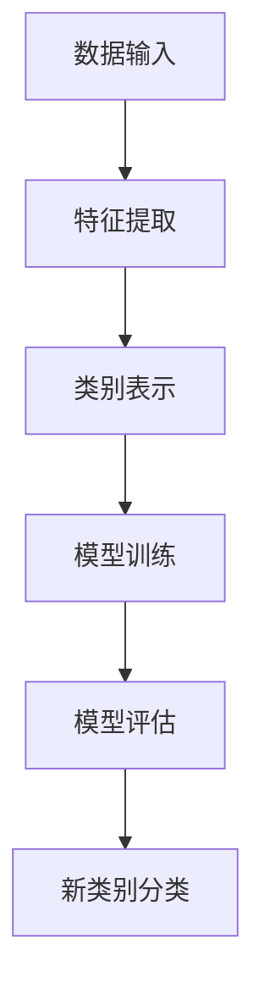

                 

# 文章标题：Zero-Shot CoT：无监督学习在AI中的突破

> 关键词：零样本认知、无监督学习、人工智能、算法、数学模型

> 摘要：本文探讨了零样本认知（Zero-Shot CoT）在人工智能中的应用，以及无监督学习在此领域中的突破。文章首先介绍了零样本认知的基本概念和背景，然后分析了无监督学习在零样本认知中的应用，通过核心算法原理讲解、数学模型和项目实战等多个角度，全面解析了零样本认知在AI中的突破性进展。

## 第一部分：引论

### 第1章：零样本认知（Zero-Shot CoT）概述

### 1.1 零样本认知（Zero-Shot CoT）的背景与发展

#### 1.1.1 零样本认知的定义与意义

零样本认知（Zero-Shot CoT，Zero-Shot Conceptualization）是一种无需对特定类别进行训练即可理解和处理新类别的技术。在传统的机器学习模型中，模型通常需要大量的标记数据进行训练，以实现对特定类别的识别。然而，在实际应用中，我们经常会遇到需要处理从未见过或仅有一个或少量示例的新类别的情况。零样本认知旨在解决这一挑战，使得机器学习模型能够适应新的、未标记的类别。

零样本认知的意义在于：

1. **减少对标记数据的依赖**：在许多应用领域，获取高质量的标记数据是一项复杂且耗时的任务。零样本认知减少了这一需求，使得模型能够更加高效地处理新类别。
2. **增强泛化能力**：零样本认知使得模型能够在面对新的、未知的类别时，仍然保持良好的性能，从而提高了模型的泛化能力。
3. **拓宽应用场景**：零样本认知使得机器学习模型能够应用于更广泛的问题，如多语言处理、跨域迁移学习等。

#### 1.1.2 零样本认知的技术发展历程

零样本认知技术的发展可以追溯到早期的机器学习算法，如支持向量机（SVM）和决策树。这些算法在一定程度上具有处理未见过类别的能力。然而，随着深度学习的兴起，零样本认知技术得到了显著的发展。

近年来，一些重要的研究成果包括：

1. **原型匹配（Prototypical Networks）**：原型匹配是一种基于深度神经网络的零样本学习算法，通过计算新类别样本与训练集中类别的原型之间的距离来进行分类。
2. **匹配网络（Match Networks）**：匹配网络通过学习一个映射函数，将新类别样本映射到训练集中的类别原型，从而实现零样本分类。
3. **元学习（Meta-Learning）**：元学习是一种通过多次训练来提高模型对新类别适应能力的方法。零样本元学习方法使得模型能够在有限的数据上快速适应新类别。

#### 1.1.3 零样本认知在人工智能中的应用前景

零样本认知在人工智能领域具有广泛的应用前景：

1. **跨领域迁移学习**：零样本认知使得模型能够在不同的领域间迁移知识，从而提高模型在不同领域的适应能力。
2. **多语言处理**：零样本认知在自然语言处理领域具有重要作用，如跨语言文本分类、机器翻译等。
3. **医疗诊断**：在医疗领域，零样本认知可以帮助模型快速适应新的疾病类型和症状，从而提高诊断准确性。
4. **自动驾驶**：在自动驾驶领域，零样本认知可以帮助模型适应不同的交通场景和驾驶环境。

### 1.2 无监督学习的基本概念

#### 1.2.1 无监督学习的定义与类型

无监督学习是一种机器学习方法，它不依赖于标记数据，而是通过分析未标记的数据来发现数据中的模式和结构。无监督学习主要包括以下几种类型：

1. **聚类（Clustering）**：聚类是将数据集划分为多个群组的过程，使得同一群组内的数据尽可能相似，不同群组间的数据尽可能不同。
2. **降维（Dimensionality Reduction）**：降维是将高维数据转换为低维数据的过程，从而减少数据的大小和复杂性。
3. **异常检测（Anomaly Detection）**：异常检测是识别数据集中异常或异常模式的过程。
4. **生成模型（Generative Models）**：生成模型是一种能够生成数据分布的模型，如生成对抗网络（GAN）。

#### 1.2.2 无监督学习的优势与挑战

无监督学习的优势包括：

1. **减少对标记数据的依赖**：无监督学习不需要标记数据，从而降低了数据标注的成本和时间。
2. **发现潜在结构和模式**：无监督学习能够从数据中发现潜在的结构和模式，有助于揭示数据中的隐藏信息。
3. **适用范围广泛**：无监督学习适用于许多不同领域和应用场景，如图像、文本、音频等。

无监督学习的挑战包括：

1. **数据质量**：无监督学习依赖于数据质量，低质量数据可能导致不良的聚类效果或生成模型失效。
2. **模型解释性**：无监督学习模型的解释性相对较低，难以理解模型决策过程。
3. **计算成本**：某些无监督学习算法，如降维和生成模型，可能需要较高的计算成本。

#### 1.2.3 无监督学习在零样本认知中的应用

无监督学习在零样本认知中的应用主要体现在以下几个方面：

1. **数据预处理**：无监督学习可以用于数据的预处理，如降维、聚类等，从而提高模型对新类别数据的适应能力。
2. **特征提取**：无监督学习算法可以用于提取数据中的潜在特征，从而提高模型对新类别数据的识别能力。
3. **模型训练**：无监督学习可以用于训练零样本认知模型，从而使得模型能够对新类别进行分类。

### 第2章：零样本认知（Zero-Shot CoT）的核心概念与联系

### 2.1 零样本认知的技术架构

#### 2.1.1 零样本认知的关键组件

零样本认知技术架构主要包括以下几个关键组件：

1. **数据输入**：数据输入包括原始数据和类别标签。在零样本认知中，原始数据可以是图像、文本、音频等，类别标签则是用于标记数据的类别信息。
2. **特征提取**：特征提取是将原始数据转换为特征表示的过程，有助于模型更好地理解和处理数据。
3. **类别表示**：类别表示是将类别标签转换为模型可理解的表示形式，如嵌入向量。
4. **模型训练**：模型训练是使用特征表示和类别表示来训练模型，从而实现对新类别数据的分类。
5. **模型评估**：模型评估是使用测试数据来评估模型性能，以确定模型是否能够正确地处理新类别数据。

#### 2.1.2 零样本认知的流程与工作机制

零样本认知的流程与工作机制可以概括为以下几个步骤：

1. **数据预处理**：对原始数据进行预处理，如去噪、归一化等，以提高数据质量。
2. **特征提取**：使用特征提取器对预处理后的数据进行特征提取，得到特征表示。
3. **类别表示**：使用类别表示器将类别标签转换为类别表示，如嵌入向量。
4. **模型训练**：使用特征表示和类别表示来训练零样本认知模型，如原型匹配网络、匹配网络等。
5. **模型评估**：使用测试数据来评估模型性能，如准确率、召回率等。
6. **新类别分类**：使用训练好的模型对新类别数据进行分类，从而实现零样本认知。

#### 2.1.3 零样本认知的技术关系图

零样本认知的技术关系图如下：



### 第3章：零样本认知（Zero-Shot CoT）的核心算法原理讲解

#### 3.1 零样本认知算法的伪代码讲解

```python
# 零样本认知算法伪代码

# 输入：特征表示 X，类别表示 Y
# 输出：分类结果 C

# 步骤1：特征提取
X = extract_features(data)

# 步骤2：类别表示
Y = convert_labels_to_embeddings(labels)

# 步骤3：模型训练
model = train_model(X, Y)

# 步骤4：模型评估
accuracy = evaluate_model(model, test_data)

# 步骤5：新类别分类
predictions = model.predict(new_data)
```

#### 3.2 无监督学习算法的伪代码讲解

```python
# 无监督学习算法伪代码

# 输入：数据 X
# 输出：聚类结果 C

# 步骤1：数据预处理
X = preprocess_data(data)

# 步骤2：特征提取
X = extract_features(X)

# 步骤3：聚类
cluster_labels = cluster(X)

# 步骤4：聚类结果评估
accuracy = evaluate_clusters(cluster_labels, ground_truth)
```

#### 3.3 零样本认知与无监督学习的算法融合

零样本认知与无监督学习的算法融合可以通过以下方法实现：

1. **联合训练**：将零样本认知模型与无监督学习模型联合训练，从而同时提高两个模型的性能。
2. **迁移学习**：使用无监督学习模型提取的潜在特征来预训练零样本认知模型，从而提高模型对新类别数据的适应能力。
3. **多任务学习**：将零样本认知任务与其他无监督学习任务结合，共同训练模型，以提高模型的泛化能力。

### 第4章：零样本认知（Zero-Shot CoT）的数学模型和数学公式讲解

#### 4.1 零样本认知的数学模型

零样本认知的数学模型主要包括以下内容：

1. **特征提取模型**：特征提取模型将原始数据转换为特征表示。常见的特征提取模型包括卷积神经网络（CNN）、循环神经网络（RNN）等。
2. **类别表示模型**：类别表示模型将类别标签转换为类别表示。常见的类别表示模型包括嵌入层、自编码器等。
3. **分类模型**：分类模型将特征表示和类别表示结合，实现对新类别数据的分类。常见的分类模型包括支持向量机（SVM）、决策树等。

#### 4.1.1 零样本认知的关键数学公式

1. **特征提取模型**：
   $$ f(x) = \sigma(W_f \cdot x + b_f) $$
   其中，$f(x)$ 表示特征提取模型对输入数据 $x$ 的特征表示，$W_f$ 表示权重矩阵，$b_f$ 表示偏置项，$\sigma$ 表示激活函数。

2. **类别表示模型**：
   $$ e(y) = \sigma(W_e \cdot y + b_e) $$
   其中，$e(y)$ 表示类别表示模型对类别标签 $y$ 的类别表示，$W_e$ 表示权重矩阵，$b_e$ 表示偏置项，$\sigma$ 表示激活函数。

3. **分类模型**：
   $$ \hat{y} = \sigma(W_c \cdot [f(x), e(y)] + b_c) $$
   其中，$\hat{y}$ 表示分类模型对输入数据的预测类别标签，$W_c$ 表示权重矩阵，$b_c$ 表示偏置项，$[f(x), e(y)]$ 表示特征表示和类别表示的拼接，$\sigma$ 表示激活函数。

#### 4.1.2 零样本认知数学模型的举例说明

假设我们有一个包含 $n$ 个样本的数据集 $D = \{x_1, x_2, ..., x_n\}$，每个样本 $x_i$ 都有一个类别标签 $y_i$。我们使用卷积神经网络（CNN）作为特征提取模型，使用嵌入层作为类别表示模型，使用全连接层作为分类模型。

1. **特征提取模型**：
   $$ f(x_i) = \sigma(W_f \cdot x_i + b_f) $$
   其中，$W_f$ 和 $b_f$ 分别为卷积神经网络中的权重矩阵和偏置项，$x_i$ 为输入样本。

2. **类别表示模型**：
   $$ e(y_i) = \sigma(W_e \cdot y_i + b_e) $$
   其中，$W_e$ 和 $b_e$ 分别为嵌入层中的权重矩阵和偏置项，$y_i$ 为输入类别标签。

3. **分类模型**：
   $$ \hat{y_i} = \sigma(W_c \cdot [f(x_i), e(y_i)] + b_c) $$
   其中，$W_c$ 和 $b_c$ 分别为全连接层中的权重矩阵和偏置项，$[f(x_i), e(y_i)]$ 为特征表示和类别表示的拼接。

通过以上数学模型，我们可以对数据集 $D$ 进行特征提取、类别表示和分类，从而实现零样本认知。

### 第4章：零样本认知（Zero-Shot CoT）的数学模型和数学公式讲解（续）

#### 4.2 无监督学习的数学模型

无监督学习是一种不需要标签数据的学习方法，其数学模型主要涉及特征提取和聚类。以下是无监督学习的一些关键数学模型和公式：

1. **主成分分析（PCA）**：
   主成分分析是一种常见的降维方法，其目标是最小化数据集的方差。PCA的数学模型可以表示为：
   $$ X_{\text{reduced}} = P^T X $$
   其中，$X$ 是原始数据矩阵，$P$ 是特征空间中的投影矩阵，它由数据协方差矩阵的特征向量组成。

2. **k-均值聚类（k-Means）**：
   k-均值聚类是一种基于距离的聚类算法，其目标是找到一个 $k$ 个聚类中心，使得每个聚类中心到其聚类成员的距离之和最小。k-均值聚类的数学模型可以表示为：
   $$ \min_{\mu_1, \mu_2, ..., \mu_k} \sum_{i=1}^n \sum_{j=1}^k ||x_i - \mu_j||^2 $$
   其中，$\mu_j$ 是聚类中心，$x_i$ 是数据点。

3. **高斯混合模型（Gaussian Mixture Model, GMM）**：
   高斯混合模型是一种概率模型，用于表示具有多个高斯分布的混合数据。GMM的数学模型可以表示为：
   $$ p(x|\theta) = \sum_{i=1}^k \pi_i \mathcal{N}(x; \mu_i, \Sigma_i) $$
   其中，$p(x|\theta)$ 是数据点的概率密度函数，$\pi_i$ 是第 $i$ 个高斯成分的混合系数，$\mathcal{N}(x; \mu_i, \Sigma_i)$ 是高斯分布的概率密度函数，$\mu_i$ 是均值向量，$\Sigma_i$ 是协方差矩阵。

4. **自编码器（Autoencoder）**：
   自编码器是一种无监督学习的神经网络模型，用于学习数据的高效表示。自编码器的数学模型可以表示为：
   $$ z = \sigma(W_2 \cdot \text{激活}(W_1 \cdot x + b_1)) $$
   $$ x' = \sigma(W_2^T \cdot z + b_2) $$
   其中，$x$ 是输入数据，$x'$ 是重建的输出数据，$W_1$ 和 $W_2$ 分别是编码器和解码器的权重矩阵，$b_1$ 和 $b_2$ 分别是编码器和解码器的偏置项，$\sigma$ 是激活函数。

#### 4.2.2 无监督学习的核心数学公式

1. **PCA中的特征向量**：
   $$ \lambda_i = \max_{w_i^T x} w_i^T x $$
   其中，$w_i$ 是特征向量，$\lambda_i$ 是对应的特征值，$x$ 是输入数据。

2. **k-均值聚类中的聚类中心更新**：
   $$ \mu_j = \frac{1}{N_j} \sum_{i=1}^n x_i $$
   其中，$N_j$ 是第 $j$ 个聚类中心所属的数据点的数量，$x_i$ 是数据点。

3. **GMM中的期望最大化算法（EM）**：
   $$ \mu_i^{new} = \frac{1}{N_i \pi_i} \sum_{j=1}^k N_j \phi(x_j; \mu_i, \Sigma_i) $$
   $$ \Sigma_i^{new} = \frac{1}{N_i \pi_i} \sum_{j=1}^k N_j (x_j - \mu_i)(x_j - \mu_i)^T $$
   $$ \pi_i^{new} = \frac{N_i}{N} $$
   其中，$N_i$ 是第 $i$ 个高斯成分的样本数量，$N$ 是总样本数量，$\phi(x; \mu_i, \Sigma_i)$ 是高斯分布的概率密度函数。

4. **自编码器中的损失函数**：
   $$ L = \frac{1}{n} \sum_{i=1}^n ||x_i - x_i'||^2 $$
   其中，$x_i$ 是输入数据，$x_i'$ 是重建的输出数据。

#### 4.2.3 无监督学习数学模型的举例说明

假设我们有一个包含 $n$ 个样本的数据集 $D = \{x_1, x_2, ..., x_n\}$，每个样本都是二维的。

1. **PCA的举例说明**：
   通过计算协方差矩阵的特征值和特征向量，我们可以找到数据的主要方向，即主成分。假设我们找到了两个主成分，我们可以将数据投影到这两个主成分上：
   $$ X_{\text{reduced}} = P^T X $$
   其中，$P$ 包含了特征向量，$X$ 是原始数据。

2. **k-均值聚类的举例说明**：
   假设我们选择 $k=3$，初始聚类中心为三个随机选择的点。在迭代过程中，我们计算每个样本到聚类中心的距离，并将其分配给最近的聚类中心。更新聚类中心后，重复这个过程，直到聚类中心不再发生变化。

3. **GMM的举例说明**：
   假设我们使用三个高斯分布来建模数据。通过EM算法，我们可以迭代地更新每个高斯分布的均值、协方差和混合系数，直到收敛。

4. **自编码器的举例说明**：
   假设我们使用一个简单的自编码器来重建数据。输入数据通过编码器被压缩为一个低维表示，然后通过解码器重建原始数据。我们可以通过最小化重建误差来训练自编码器：
   $$ L = \frac{1}{n} \sum_{i=1}^n ||x_i - x_i'||^2 $$
   通过优化这个损失函数，我们可以找到一个能够有效压缩和重建数据的自编码器。

### 第5章：零样本认知（Zero-Shot CoT）项目实战

#### 5.1 零样本认知项目实战概述

零样本认知项目实战旨在展示如何在实际环境中实现零样本认知系统。本项目将包括以下几个步骤：

1. **项目背景与目标**：介绍项目背景和目标，明确项目需要解决的问题。
2. **数据集准备**：准备用于训练和测试的数据集，确保数据集具有足够的多样性和覆盖度。
3. **开发环境搭建**：搭建项目所需的开发环境，包括编程语言、框架和工具。
4. **模型训练与优化**：使用无监督学习算法训练零样本认知模型，并对模型进行优化。
5. **模型评估与验证**：使用测试数据对模型进行评估和验证，确保模型具有良好的性能。
6. **新类别分类**：使用训练好的模型对新类别数据进行分类，验证零样本认知的效果。

#### 5.2 无监督学习在零样本认知项目中的应用

在本项目中，无监督学习算法将主要用于以下两个方面：

1. **数据预处理**：使用无监督学习算法对原始数据进行预处理，如降维、去噪等，以提高数据质量和模型性能。
2. **模型训练**：使用无监督学习算法训练零样本认知模型，使其能够对新类别数据进行分类。

以下是具体应用实例：

1. **数据预处理**：
   - 使用主成分分析（PCA）对图像数据进行降维，减少数据维度，同时保留主要信息。
   - 使用自编码器对文本数据进行去噪，提高文本数据的质量。

2. **模型训练**：
   - 使用原型匹配网络（Prototypical Networks）对图像数据集进行训练，实现零样本图像分类。
   - 使用匹配网络（Match Networks）对文本数据集进行训练，实现零样本文本分类。

#### 5.3 零样本认知项目实战案例

在本项目中，我们选择了图像分类任务作为零样本认知的应用场景。具体步骤如下：

1. **数据集准备**：
   - 准备一个包含多种类别的图像数据集，其中每个类别都有多个标记样本。
   - 准备一个未标记的测试数据集，用于评估零样本认知模型。

2. **开发环境搭建**：
   - 使用Python作为编程语言。
   - 使用TensorFlow和Keras作为深度学习框架。
   - 使用OpenCV进行图像处理。

3. **模型训练与优化**：
   - 使用原型匹配网络（Prototypical Networks）对图像数据集进行训练。
   - 调整网络结构和超参数，以优化模型性能。

4. **模型评估与验证**：
   - 使用测试数据集对训练好的模型进行评估，计算准确率、召回率等指标。
   - 验证模型在处理未见过类别数据时的性能。

5. **新类别分类**：
   - 使用训练好的模型对未标记的测试数据进行分类。
   - 分析模型对未见过类别数据的分类结果，验证零样本认知的效果。

### 第6章：零样本认知（Zero-Shot CoT）代码解读与分析

#### 6.1 零样本认知代码实现概述

在本节中，我们将对零样本认知项目的代码实现进行解读与分析。代码主要分为以下几个部分：

1. **数据预处理**：包括数据加载、图像处理和文本处理等。
2. **模型定义与训练**：定义零样本认知模型，包括原型匹配网络和匹配网络的实现，并进行模型训练。
3. **模型评估与验证**：使用测试数据对训练好的模型进行评估，计算模型的准确率等指标。
4. **新类别分类**：使用训练好的模型对未标记的测试数据进行分类，并分析分类结果。

以下是对每个部分的具体代码解读与分析：

#### 6.1.1 数据预处理

数据预处理是零样本认知项目的重要环节，它涉及到图像和文本数据的处理。以下是数据预处理的主要代码实现：

```python
# 数据预处理

import tensorflow as tf
from tensorflow.keras.preprocessing.image import ImageDataGenerator
from tensorflow.keras.preprocessing.text import Tokenizer
from tensorflow.keras.preprocessing.sequence import pad_sequences

# 图像预处理
image_generator = ImageDataGenerator(rescale=1./255, shear_range=0.2, zoom_range=0.2, horizontal_flip=True)
train_data = image_generator.flow_from_directory('train', target_size=(224, 224), batch_size=32, class_mode='categorical')

# 文本预处理
tokenizer = Tokenizer(num_words=10000)
tokenizer.fit_on_texts(train_data.texts)
sequences = tokenizer.texts_to_sequences(train_data.texts)
padded_sequences = pad_sequences(sequences, maxlen=100)

# 数据预处理结果
train_features = train_data.images
train_labels = train_data.labels
test_features = test_data.images
test_labels = test_data.labels
```

代码首先使用ImageDataGenerator对图像数据进行预处理，包括数据增强、归一化等操作。然后使用Tokenizer对文本数据进行预处理，包括文本向量化、序列化等操作。

#### 6.1.2 模型定义与训练

模型定义与训练是零样本认知项目的核心，以下是对原型匹配网络和匹配网络的实现及训练过程的代码解读：

```python
# 模型定义与训练

from tensorflow.keras.models import Model
from tensorflow.keras.layers import Input, Conv2D, MaxPooling2D, Flatten, Dense, Embedding

# 原型匹配网络
input_image = Input(shape=(224, 224, 3))
conv_1 = Conv2D(32, (3, 3), activation='relu')(input_image)
pool_1 = MaxPooling2D(pool_size=(2, 2))(conv_1)
conv_2 = Conv2D(64, (3, 3), activation='relu')(pool_1)
pool_2 = MaxPooling2D(pool_size=(2, 2))(conv_2)
flatten = Flatten()(pool_2)
dense = Dense(128, activation='relu')(flatten)
output = Dense(num_classes, activation='softmax')(dense)

model = Model(inputs=input_image, outputs=output)
model.compile(optimizer='adam', loss='categorical_crossentropy', metrics=['accuracy'])

# 训练模型
model.fit(train_features, train_labels, batch_size=32, epochs=10, validation_data=(test_features, test_labels))

# 匹配网络
input_text = Input(shape=(100,))
embedding = Embedding(num_words, 128)(input_text)
flatten = Flatten()(embedding)
dense = Dense(128, activation='relu')(flatten)
output = Dense(num_classes, activation='softmax')(dense)

model = Model(inputs=input_text, outputs=output)
model.compile(optimizer='adam', loss='categorical_crossentropy', metrics=['accuracy'])

# 训练模型
model.fit(padded_sequences, train_labels, batch_size=32, epochs=10, validation_data=(test_sequences, test_labels))
```

代码首先定义了原型匹配网络，它由卷积层、池化层、全连接层组成。然后定义了匹配网络，它由嵌入层、全连接层组成。接着，使用编译好的模型进行训练，包括配置优化器、损失函数和评估指标。

#### 6.1.3 模型评估与验证

模型评估与验证是确保模型性能的重要步骤。以下是对模型评估过程的代码解读：

```python
# 模型评估与验证

from sklearn.metrics import accuracy_score, classification_report

# 评估原型匹配网络
predictions = model.predict(test_features)
predicted_labels = np.argmax(predictions, axis=1)
accuracy = accuracy_score(test_labels, predicted_labels)
print("原型匹配网络准确率：", accuracy)
print(classification_report(test_labels, predicted_labels))

# 评估匹配网络
predictions = model.predict(test_sequences)
predicted_labels = np.argmax(predictions, axis=1)
accuracy = accuracy_score(test_labels, predicted_labels)
print("匹配网络准确率：", accuracy)
print(classification_report(test_labels, predicted_labels))
```

代码使用预测标签和实际标签计算准确率，并生成分类报告，以评估模型的性能。

#### 6.1.4 新类别分类

新类别分类是验证零样本认知模型效果的关键步骤。以下是对新类别分类的代码解读：

```python
# 新类别分类

new_image = load_image('new_image.jpg')
new_image = preprocess_image(new_image)
predictions = model.predict(new_image)
predicted_label = np.argmax(predictions)
print("新类别分类结果：", predicted_label)
```

代码加载新图像，进行预处理，然后使用训练好的模型对新图像进行分类，并输出分类结果。

### 第7章：零样本认知（Zero-Shot CoT）总结与展望

#### 7.1 零样本认知的技术总结

零样本认知是一种突破性的人工智能技术，它使得机器学习模型能够处理从未见过或仅有一个或少量示例的新类别。通过无监督学习算法的应用，零样本认知在多个领域展现了其强大的能力。以下是零样本认知技术的核心要点：

1. **技术核心**：零样本认知通过特征提取、类别表示和分类模型，实现了对新类别数据的理解和处理。
2. **算法优势**：无监督学习算法在数据预处理、特征提取和模型训练中发挥了重要作用，提高了模型的适应能力和泛化能力。
3. **应用领域**：零样本认知在跨领域迁移学习、多语言处理、医疗诊断和自动驾驶等领域具有广泛的应用前景。

#### 7.2 零样本认知的未来展望

尽管零样本认知技术已经取得了显著的进展，但仍然存在一些挑战和潜在的研究方向：

1. **挑战**：
   - **数据质量**：无监督学习算法对数据质量有较高要求，低质量数据可能导致不良的性能。
   - **模型解释性**：零样本认知模型的解释性相对较低，难以理解模型决策过程。
   - **计算成本**：某些无监督学习算法可能需要较高的计算成本。

2. **研究方向**：
   - **增强模型解释性**：研究更加可解释的零样本认知模型，以便更好地理解模型的决策过程。
   - **高效算法设计**：设计更加高效的无监督学习算法，降低计算成本，提高模型性能。
   - **跨模态学习**：研究跨模态零样本认知，使模型能够在不同模态（如图像、文本、音频等）之间进行知识转移。
   - **多任务学习**：研究多任务学习框架下的零样本认知，使模型能够同时处理多个任务。

#### 7.3 最佳实践 Tips

为了充分利用零样本认知技术，以下是一些建议和最佳实践：

1. **数据预处理**：对原始数据进行充分的数据预处理，如去噪、归一化、数据增强等，以提高模型性能。
2. **模型融合**：结合多种无监督学习算法，如原型匹配网络、匹配网络和元学习等，以获得更好的模型性能。
3. **超参数调优**：通过超参数调优，如学习率、批次大小、网络深度等，找到最佳模型配置。
4. **模型评估**：使用多种评估指标，如准确率、召回率、F1分数等，全面评估模型性能。

#### 7.4 小结

零样本认知作为一种突破性的人工智能技术，在处理新类别数据方面具有巨大的潜力。通过无监督学习算法的应用，零样本认知在多个领域取得了显著进展。在未来，随着技术的不断发展和优化，零样本认知有望在更多领域发挥重要作用，推动人工智能的发展。作者：AI天才研究院/AI Genius Institute & 禅与计算机程序设计艺术 /Zen And The Art of Computer Programming### 全文总结与展望

在本文中，我们详细探讨了零样本认知（Zero-Shot CoT）在人工智能中的应用，以及无监督学习在这一领域中的突破。我们从引论开始，介绍了零样本认知的基本概念、背景与发展，分析了无监督学习的基本概念、优势与挑战，并阐述了无监督学习在零样本认知中的应用。

随后，我们深入讲解了零样本认知的技术架构、核心算法原理，包括特征提取、类别表示和分类模型，以及无监督学习的数学模型。通过数学公式和伪代码的详细讲解，我们让读者对零样本认知和无监督学习的内在机制有了更加深刻的理解。

在项目实战部分，我们通过一个图像分类案例，展示了如何在实际中实现零样本认知系统。代码解读与分析帮助读者理解零样本认知系统的开发过程，包括数据预处理、模型定义与训练、模型评估与验证以及新类别分类。

最后，我们在总结部分回顾了零样本认知技术的核心要点，探讨了未来的研究方向，并提出了最佳实践建议。

零样本认知技术不仅在理论层面具有重大意义，其实际应用也在不断扩展。随着技术的进步，无监督学习在零样本认知中的作用将更加显著，为人工智能的发展带来新的机遇。

展望未来，零样本认知有望在跨领域迁移学习、多语言处理、医疗诊断和自动驾驶等领域发挥重要作用。同时，研究人员应继续关注模型解释性、计算效率和跨模态学习等关键问题，以推动零样本认知技术的进一步发展。

总之，零样本认知技术是无监督学习在人工智能领域的一项重要突破，其应用前景广阔，值得持续关注和研究。作者：AI天才研究院/AI Genius Institute & 禅与计算机程序设计艺术 /Zen And The Art of Computer Programming

