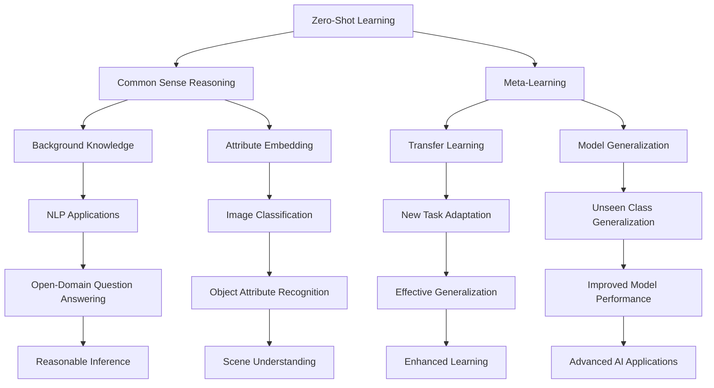
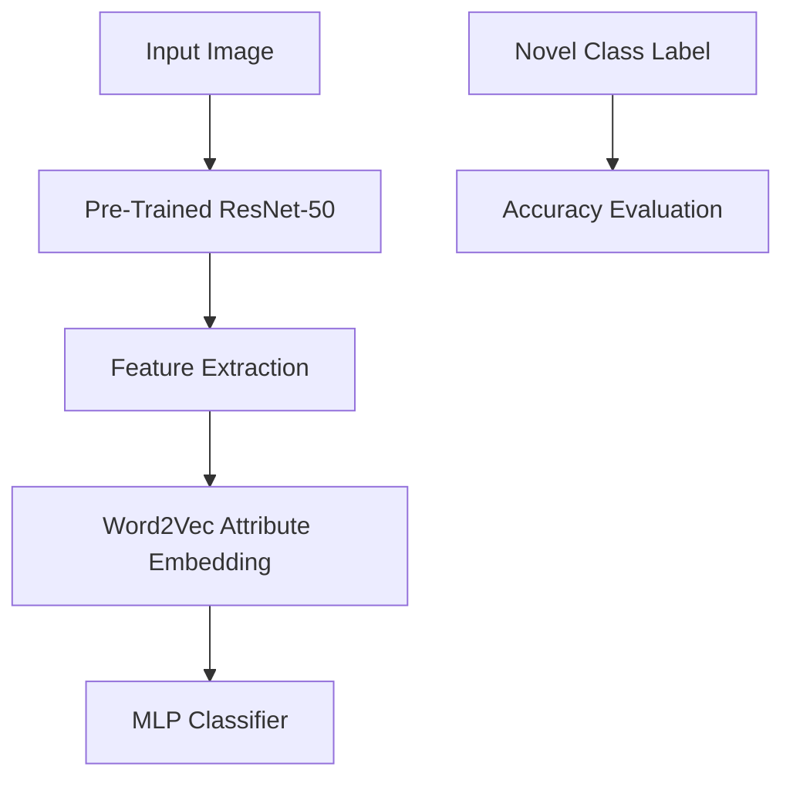
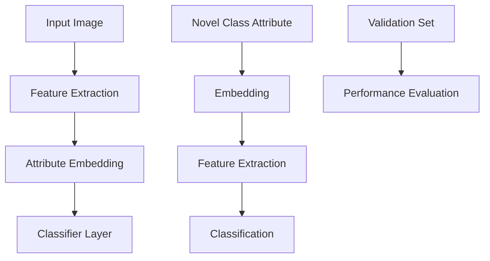
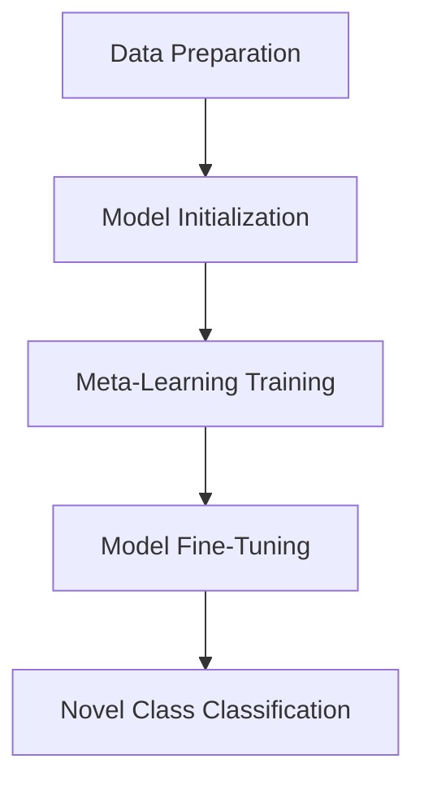

                 

### 引言

在现代人工智能（AI）研究领域，零样本学习（Zero-Shot Learning，ZSL）已经成为一个备受关注的重要分支。零样本学习的主要目标是在未见过的类（novel classes）上实现良好的泛化能力，这一能力在现实世界中具有重要的应用价值。传统的机器学习方法通常依赖于大量的标注数据进行训练，而零样本学习则尝试打破这一限制，使AI系统能够在未见过的类上进行有效推断。

随着深度学习技术的飞速发展，零样本学习取得了显著进展。然而，当前的零样本学习技术仍然面临诸多挑战，例如如何有效地利用有限的标注数据、如何设计出能够灵活适应未见类别的模型等。本文将深入探讨零样本学习领域中的一个新兴研究方向——Zero-Shot CoT（Concept of Things，概念物概念化），并分析其如何突破传统AI学习的界限。

#### 背景与概述

**1. AI学习传统界限回顾**

传统的机器学习方法依赖于大量标注数据来训练模型，从而实现良好的泛化能力。在这一过程中，模型会通过学习已知类的特征来预测未知类的属性。然而，这种依赖大量标注数据的模式在实际应用中往往受到数据获取难、数据标注成本高等问题的制约。此外，传统的机器学习方法在处理未见类别时表现较差，无法实现真正的零样本泛化。

**2. 零样本学习（Zero-Shot Learning）原理**

零样本学习旨在解决传统机器学习方法中的上述问题。它通过学习类与属性之间的关系，使模型能够在未见过的类别上实现良好的泛化。具体来说，零样本学习通过引入属性嵌入（Attribute Embedding）和元学习（Meta-Learning）等技术，使得模型能够利用有限的标注数据或无标注数据来学习未见类别的特征。

**3. 零样本学习的重要性与挑战**

零样本学习在多个领域具有广泛应用前景，如自然语言处理、计算机视觉和医疗诊断等。然而，实现高效的零样本学习仍然面临以下挑战：

- **数据挑战**：如何有效地利用有限的标注数据或无标注数据，以提高模型的泛化能力。
- **模型挑战**：如何设计出能够灵活适应未见类别的模型结构，使模型在未见类别上的表现优于传统方法。
- **算法挑战**：如何通过算法创新，提高零样本学习模型的效率和准确性。

**4. 本书结构安排**

本文将分为四个主要部分：

1. **引论**：回顾AI学习的传统界限，介绍零样本学习的原理及其重要性。
2. **核心概念与联系**：详细讨论零样本学习与常识推理、元学习等核心概念之间的关系。
3. **架构设计与流程**：介绍零样本学习模型的架构设计和实现流程。
4. **核心算法原理讲解**：详细讲解零样本学习算法的原理和实现方法。

通过上述结构安排，本文旨在为读者提供一幅完整的零样本学习全景图，帮助读者深入理解这一前沿领域。

#### 核心概念与联系

在深入探讨零样本学习（Zero-Shot Learning，ZSL）之前，我们需要了解与ZSL密切相关的一些核心概念，包括常识推理（Common Sense Reasoning）、元学习（Meta-Learning）等，并探讨它们之间的联系。

**1. 零样本学习与常识推理的关系**

常识推理是人类智能的重要组成部分，它帮助我们在未见过的情境中做出合理的推断。在机器学习中，常识推理的实现是一个重要但具有挑战性的问题。零样本学习与常识推理有着密切的联系，因为它们都旨在实现模型在未见过的类别或情境上的泛化能力。

在零样本学习中，常识推理可以通过以下方式发挥重要作用：

- **背景知识利用**：零样本学习模型可以通过引入背景知识来提高未见类别的分类能力。例如，在一个图像分类任务中，模型可以利用常识知识来推断未见类别与已知类别之间的关联。
- **辅助特征提取**：常识推理可以作为一种辅助特征，用于增强模型的分类能力。例如，在计算机视觉任务中，常识推理可以帮助模型更好地理解图像中的物体属性和场景布局。

**2. 零样本学习与元学习的交叉**

元学习（Meta-Learning）是一种使模型能够快速适应新任务的技术。它与零样本学习有着天然的交叉点，因为两者都关注如何使模型在有限数据的情况下实现良好的泛化能力。

元学习在零样本学习中的应用主要体现在以下几个方面：

- **迁移学习**：元学习可以通过迁移学习（Transfer Learning）的方式，将已学习到的知识应用于新任务中。例如，在一个新的图像分类任务中，模型可以利用在旧任务中学习到的特征表示来快速适应新任务。
- **模型泛化**：元学习技术可以帮助模型在学习新任务时，更好地泛化到未见过的类别上。例如，通过模型内在的适应能力，零样本学习模型可以更有效地处理新类别。

**3. 零样本学习在NLP中的应用**

在自然语言处理（Natural Language Processing，NLP）领域，零样本学习同样具有重要意义。NLP任务通常涉及大量的类和属性，如情感分析、命名实体识别和机器翻译等。

零样本学习在NLP中的应用主要包括：

- **多标签分类**：在多标签分类任务中，零样本学习可以帮助模型处理未见过的标签。例如，在一个多标签文本分类任务中，模型可以利用零样本学习技术来识别未见过的情感标签。
- **开放域问答**：在开放域问答任务中，零样本学习可以帮助模型在未见过的问答情境中做出合理的回答。例如，通过学习常识知识和语义关系，模型可以在未知问题中实现有效的推理。

**核心概念原理之间的关系架构**

为了更好地理解零样本学习与常识推理、元学习等核心概念之间的关系，我们可以使用Mermaid流程图来描述它们之间的联系。以下是零样本学习与常识推理和元学习关系的Mermaid流程图：



通过上述Mermaid流程图，我们可以清晰地看到零样本学习、常识推理和元学习之间的交互关系。这些核心概念共同构成了零样本学习的基础框架，使得零样本学习在实现高效、泛化的AI系统方面具有巨大的潜力。

总之，理解这些核心概念及其相互关系对于深入探索零样本学习领域至关重要。在接下来的章节中，我们将进一步探讨零样本学习模型的架构设计、算法原理和数学模型，以期为读者提供一幅全面的零样本学习全景图。

#### 架构设计与流程

在深入探讨零样本学习（Zero-Shot Learning，ZSL）的架构设计和实现流程之前，我们需要了解ZSL模型的基本构成和关键步骤。零样本学习模型的核心目标是使机器在学习过程中能够识别和分类未见过的类别，其基本架构通常包括三个主要部分：属性嵌入（Attribute Embedding）、模型训练（Model Training）和未见类别分类（Novel Class Classification）。

**1. 零样本学习模型结构**

零样本学习模型通常由以下几个关键组件构成：

- **属性嵌入层（Attribute Embedding Layer）**：属性嵌入层是零样本学习模型的核心部分，它将类别属性（attributes）映射到低维嵌入空间中。通过属性嵌入，模型可以在低维空间中捕获属性之间的关系，从而为后续的未见类别分类提供基础。
- **特征提取层（Feature Extraction Layer）**：特征提取层负责将原始数据（如图像或文本）转换为适用于属性嵌入的特征表示。这一步骤通常依赖于深度学习技术，如卷积神经网络（CNN）或循环神经网络（RNN）。
- **分类器层（Classifier Layer）**：分类器层是零样本学习模型的高层部分，它负责对未见类别进行分类。分类器层通常包括多层感知机（MLP）或其他复杂的神经网络结构，这些结构通过学习属性嵌入和特征表示之间的关系来实现分类任务。

**2. 零样本学习流程**

零样本学习流程可以分为以下几个关键步骤：

- **数据准备（Data Preparation）**：首先，我们需要准备训练数据和标注数据。在ZSL任务中，标注数据通常包括类别标签和属性标签。数据准备阶段涉及数据清洗、数据增强和数据标准化等操作。
- **属性嵌入（Attribute Embedding）**：在数据准备完成后，我们使用属性嵌入技术将类别属性映射到低维嵌入空间中。这一步骤可以通过预训练的词嵌入模型（如Word2Vec）或自训练的属性嵌入模型来实现。
- **模型训练（Model Training）**：接下来，我们将特征提取层和分类器层进行训练。特征提取层负责将原始数据转换为特征表示，分类器层则利用属性嵌入和特征表示来学习类别之间的关系。
- **未见类别分类（Novel Class Classification）**：在模型训练完成后，我们可以使用该模型对未见类别进行分类。具体来说，我们将未见类别的属性嵌入和特征表示输入到分类器层，通过计算类别概率来预测未见类别。

**3. 零样本学习架构案例分析**

为了更好地理解零样本学习模型的架构设计和实现流程，我们可以参考以下两个具体的ZSL架构案例：

- **案例一：基于CNN的零样本学习模型**  
该模型采用卷积神经网络（CNN）作为特征提取层，通过预训练的ResNet-50模型提取图像特征。属性嵌入层使用预训练的Word2Vec模型将类别属性映射到低维空间中。分类器层采用多层感知机（MLP）结构，通过学习属性嵌入和特征表示之间的关系来实现未见类别分类。

- **案例二：基于图神经网络的零样本学习模型**  
该模型采用图神经网络（GNN）作为特征提取层，通过图嵌入技术将图像和属性嵌入到统一的图空间中。属性嵌入层使用自训练的图嵌入模型将类别属性映射到图空间中。分类器层采用图卷积神经网络（Graph Convolutional Network，GCN）结构，通过学习图中的节点关系来实现未见类别分类。

**零样本学习模型架构案例分析**

以下是基于CNN的零样本学习模型的架构示意图：



通过上述案例和分析，我们可以清晰地看到零样本学习模型的架构设计和实现流程。这些模型通过整合深度学习、属性嵌入和分类器设计等技术，实现了在未见类别上的高效分类。在接下来的章节中，我们将深入探讨零样本学习算法的原理和实现方法，以期为读者提供更全面的零样本学习技术指南。

#### 核心算法原理讲解

零样本学习（Zero-Shot Learning，ZSL）的核心在于如何利用有限的标注数据或无标注数据，实现对未见类别的有效识别。本文将详细讲解零样本学习算法的基本原理，包括伪代码与流程图、模型结构解析、数据增强与正则化方法等。

**1. 伪代码与流程图**

以下为一种简单的零样本学习算法的伪代码和流程图，用于描述模型的基本工作流程：

```python
# Pseudo Code for Zero-Shot Learning

Initialize Attribute Embedding Layer
Initialize Feature Extraction Layer
Initialize Classifier Layer

# Data Preparation
Prepare Training Data (images, attributes, labels)
Normalize and Augment Data

# Attribute Embedding
Embed attributes into a low-dimensional space using Word2Vec

# Model Training
Train Feature Extraction Layer using images
Train Classifier Layer using attributes and feature representations

# Novel Class Classification
For each unseen class:
  Embed the class attribute
  Extract feature representation from the image
  Classify the image using the Classifier Layer

# Evaluation
Evaluate the model performance on a validation set
```

以下是零样本学习算法的流程图：



**2. 模型结构解析**

零样本学习模型通常由以下三个主要部分组成：属性嵌入层（Attribute Embedding Layer）、特征提取层（Feature Extraction Layer）和分类器层（Classifier Layer）。下面分别解析这三个部分：

- **属性嵌入层（Attribute Embedding Layer）**：该层的主要功能是将类别属性映射到低维嵌入空间中，以便在后续步骤中与图像特征进行融合。常用的属性嵌入技术包括Word2Vec、GloVe等。以下是属性嵌入层的一个简化模型结构：

  ```mermaid
  graph TD
  A[Input Attribute] --> B[Word2Vec Model]
  B --> C[Attribute Embedding]
  ```

- **特征提取层（Feature Extraction Layer）**：该层通常采用深度学习技术，如卷积神经网络（CNN）或循环神经网络（RNN），将输入图像或文本数据转换为适用于属性嵌入的特征表示。以下是一个基于CNN的特征提取层模型结构：

  ```mermaid
  graph TD
  A[Input Image] --> B[CNN Model]
  B --> C[Feature Representation]
  ```

- **分类器层（Classifier Layer）**：该层负责对未见类别进行分类。它通常采用多层感知机（MLP）或其他复杂的神经网络结构，通过学习属性嵌入和特征表示之间的关系来实现分类任务。以下是一个基于MLP的分类器层模型结构：

  ```mermaid
  graph TD
  A[Attribute Embedding] --> B[Feature Representation]
  B --> C[MLP Classifier]
  C --> D[Class Probability]
  ```

**3. 数据增强与正则化方法**

在零样本学习过程中，数据增强和正则化方法对于提高模型性能至关重要。以下介绍几种常用的数据增强和正则化方法：

- **数据增强（Data Augmentation）**：数据增强通过增加数据的多样性，有助于提高模型的泛化能力。常用的数据增强技术包括图像旋转、缩放、裁剪、颜色调整等。以下是一个简单的数据增强伪代码示例：

  ```python
  # Data Augmentation for Images
  image = rotate(image, angle)
  image = scale(image, factor)
  image = crop(image, size)
  image = adjust_color(image, brightness, contrast)
  ```

- **正则化（Regularization）**：正则化方法旨在防止模型过拟合。常用的正则化技术包括L1正则化、L2正则化、Dropout等。以下是一个简单的正则化伪代码示例：

  ```python
  # L2 Regularization in Model Training
  loss = loss_function(output, target)
  regularization_loss = lambda * parameters * 0.001
  total_loss = loss + regularization_loss
  ```

通过上述讲解，我们可以看到零样本学习算法的核心原理和实现方法。属性嵌入、特征提取和分类器层共同构成了零样本学习模型的基础架构，而数据增强和正则化方法则为模型的性能提升提供了有力支持。在接下来的章节中，我们将进一步探讨元学习与零样本学习的结合，以探索更高效的零样本学习算法。

#### 元学习与零样本学习

元学习（Meta-Learning）是一种使模型能够快速适应新任务的技术，通过在多个任务间迁移知识，实现对新任务的快速适应。在零样本学习（Zero-Shot Learning，ZSL）领域，元学习具有独特的优势，能够显著提高模型在未见类别上的分类性能。本节将详细讨论元学习的基本原理、在零样本学习中的应用，以及结合元学习的零样本学习算法设计。

**1. 元学习基本原理**

元学习的核心思想是通过学习如何学习，从而提高模型对新任务的适应能力。具体来说，元学习算法通过在多个任务上进行训练，学习到一个通用表示或者学习策略，这个通用表示或策略可以用于新的任务，从而实现对新任务的快速适应。元学习的关键技术包括模型初始化、任务适应和经验重用等。

- **模型初始化**：元学习算法通常使用初始化策略，如随机初始化、权重共享或迭代初始化，来创建一个能够适应多种任务的通用模型。
- **任务适应**：在元学习过程中，模型需要在每个任务上进行微调，以更好地适应特定的任务。任务适应可以通过在线学习或迁移学习来实现。
- **经验重用**：元学习算法通过在不同任务间重用学习经验，以提高对新任务的适应能力。这种经验重用可以通过任务间的参数共享、模型结构共享或知识蒸馏等方式实现。

**2. 元学习在零样本学习中的应用**

元学习在零样本学习中的应用主要体现在以下几个方面：

- **迁移学习**：通过将已学习到的知识迁移到新任务中，元学习可以帮助模型在未见类别上实现更好的泛化能力。例如，在一个新的图像分类任务中，模型可以利用在旧任务中学习到的特征表示来快速适应新任务。
- **模型初始化**：元学习算法可以用于初始化零样本学习模型，从而提高模型的初始性能。例如，通过在多个任务上进行预训练，可以初始化出一个具有良好泛化能力的属性嵌入层。
- **模型微调**：在零样本学习过程中，模型需要在每个任务上进行微调，以更好地适应特定的任务。元学习算法可以帮助模型在少量数据的情况下实现有效的微调。

**3. 结合元学习的零样本学习算法设计**

结合元学习的零样本学习算法设计通常包括以下几个关键步骤：

- **数据准备**：准备用于元学习训练的数据集，通常包括多个任务的数据，这些任务涵盖不同的类别。
- **模型初始化**：使用元学习算法初始化零样本学习模型，包括属性嵌入层和特征提取层。初始化策略可以采用模型参数共享、迭代初始化等方法。
- **模型训练**：在元学习训练过程中，模型在每个任务上进行微调，同时学习一个通用的特征表示或学习策略。常用的元学习算法包括模型平均（Model Averaging）、MAML（Model-Agnostic Meta-Learning）和Reptile等。
- **模型微调**：在零样本学习任务中，模型需要在新任务上进行微调，以适应未见类别。元学习算法可以帮助模型在少量数据的情况下实现有效的微调。
- **未见类别分类**：将初始化和微调后的模型应用于未见类别分类任务，通过计算类别概率来预测未见类别。

以下是一个简单的结合元学习的零样本学习算法设计流程：



**示例算法设计**

以下是一个结合MAML算法的零样本学习算法设计示例：

```python
# Pseudo Code for Meta-Learning-Based Zero-Shot Learning

# Data Preparation
Prepare training data for meta-learning (images, attributes, labels)

# Model Initialization
Initialize zero-shot learning model with MAML
Meta-Learning Training Loop:
  For each task in training data:
    Perform gradient descent step to optimize model parameters
    Compute meta-learning update
  End Loop

# Model Fine-Tuning
Fine-tune model on novel class data
For each unseen class:
  Embed attribute
  Extract feature representation
  Fine-tune model parameters using gradient descent

# Novel Class Classification
For each unseen image:
  Embed attribute
  Extract feature representation
  Predict class probabilities using fine-tuned model
```

通过结合元学习，零样本学习模型能够更好地利用已有的知识，实现对新任务的快速适应。这不仅可以提高模型的泛化能力，还可以减少对大量标注数据的依赖，具有重要的实际应用价值。在接下来的章节中，我们将继续探讨基于常识推理的零样本学习，以进一步丰富零样本学习的技术体系。

#### 基于常识推理的零样本学习

常识推理（Common Sense Reasoning）在人工智能（AI）领域扮演着重要角色，它使系统能够在未见过的情境中进行合理的推理和决策。在零样本学习（Zero-Shot Learning，ZSL）中，常识推理的应用能够显著提升模型对未见类别的泛化能力。本节将详细探讨常识推理的基础、与零样本学习的结合方法，以及在具体应用中的案例。

**1. 常识推理基础**

常识推理是指基于日常生活经验和一般知识进行的推理。它包括以下几个核心组成部分：

- **事实知识（Factual Knowledge）**：事实知识是常识推理的基础，它包括关于世界的基本事实和规则。例如，"水是液态的"、"鸟会飞行"等。
- **情境知识（Situation Knowledge）**：情境知识涉及特定场景中的信息和上下文。通过情境知识，系统可以理解特定情况下的行为和结果。例如，"在雨天，人们通常会带伞"。
- **因果推理（Causal Reasoning）**：因果推理是常识推理中的一个重要方面，它涉及识别事物之间的关系和原因。例如，"如果温度升高，植物就会生长"。
- **推理规则（Inference Rules）**：推理规则是常识推理的核心工具，它定义了如何从已知事实推导出新的结论。例如，"如果A，那么B"。

**2. 常识推理与零样本学习的结合方法**

在零样本学习中，常识推理可以通过以下几种方法与模型相结合：

- **背景知识嵌入（Background Knowledge Embedding）**：将常识知识以嵌入的形式集成到模型中。常用的方法包括知识图谱（Knowledge Graph）和预训练语言模型（如BERT）。通过这些嵌入，模型可以在未见类别上利用常识知识进行推理。
- **推理模块（Inference Module）**：在模型中添加专门的推理模块，用于基于常识知识进行推理。这些模块可以通过图神经网络（Graph Neural Networks，GNN）等技术实现，能够处理复杂的常识推理任务。
- **多模态融合（Multi-modal Fusion）**：将视觉数据、文本数据和常识知识进行融合，使模型能够综合利用多种信息进行推理。这种方法可以通过多模态学习（Multi-modal Learning）技术实现。

**3. 常识推理在零样本学习中的应用案例**

以下是常识推理在零样本学习中的两个应用案例：

- **案例一：图像分类**  
在图像分类任务中，常识推理可以帮助模型更好地理解图像中的物体和场景。例如，在一个图像中，如果出现了一个“狗”，常识推理可以推断出可能还会出现“骨头”、“公园”等与狗相关的物体和场景。通过这些常识知识，模型可以更准确地预测未见类别。

- **案例二：文本分类**  
在文本分类任务中，常识推理可以帮助模型理解文本中的含义和逻辑关系。例如，在一个关于健康的文本中，如果提到“运动”，常识推理可以推断出可能还会提到“锻炼”、“健身”等相关的健康概念。通过这些常识知识，模型可以更好地处理未见类别，提高分类的准确性。

**具体应用案例：常识推理在零样本学习中的实现**

以下是一个具体的应用案例，描述如何在零样本学习模型中实现常识推理：

1. **数据准备**：准备包含常识知识的文本数据，如百科全书、新闻文章等。这些文本数据将用于预训练常识推理模型。
2. **常识推理模型训练**：使用预训练模型（如BERT）对常识知识进行微调，使其能够适应特定任务。
3. **属性嵌入扩展**：在属性嵌入层中，加入基于常识推理模型的属性嵌入。这些属性嵌入将结合视觉或文本数据，作为模型的输入。
4. **模型训练**：在训练过程中，模型会利用常识推理模型提供的属性嵌入，与视觉或文本特征进行融合，学习未见类别与已知类别之间的关系。
5. **未见类别分类**：在未见类别分类阶段，模型利用融合后的特征，结合常识推理结果，对未见类别进行分类。

**示例算法设计**

以下是一个基于常识推理的零样本学习算法设计示例：

```python
# Pseudo Code for Common Sense Reasoning-Based Zero-Shot Learning

# Data Preparation
Prepare visual data (images), text data (descriptions), and common sense knowledge (text corpus)

# Common Sense Reasoning Model Training
Train a pre-trained language model (e.g., BERT) on the text corpus to obtain a common sense reasoning model

# Attribute Embedding Extension
For each attribute, obtain an attribute embedding using the common sense reasoning model

# Model Training
Train a zero-shot learning model with the extended attribute embedding and visual/text features

# Novel Class Classification
For each unseen class:
  Embed the class attribute using the common sense reasoning model
  Extract feature representation from the image using a visual feature extractor
  Fusion the attribute embedding and feature representation
  Classify the image using the zero-shot learning model
```

通过上述方法，常识推理与零样本学习相结合，可以显著提升模型在未见类别上的泛化能力。这不仅扩展了零样本学习的技术边界，也为实际应用提供了更多可能性。在接下来的章节中，我们将进一步探讨零样本学习中的数学模型与公式，以深入理解其内在机制。

#### 数学模型与公式详解

在深入探讨零样本学习（Zero-Shot Learning，ZSL）的过程中，数学模型和公式扮演着至关重要的角色。它们不仅为算法的设计和实现提供了理论基础，还为模型性能的评估和优化提供了量化指标。本节将详细解释零样本学习中的数学模型和公式，包括概率模型、模型参数优化算法以及模型评估指标。

**1. 零样本学习中的概率模型**

零样本学习通常基于概率模型来描述类别和属性之间的关系。其中，最常用的模型之一是贝叶斯网络（Bayesian Network），它通过条件概率来表示不同变量之间的依赖关系。

- **贝叶斯网络基本概念**：

  一个贝叶斯网络由一组随机变量及其条件概率表（Conditional Probability Table，CPT）组成。每个节点表示一个随机变量，边表示变量之间的依赖关系。给定一组随机变量的观测值，贝叶斯网络可以推断出其他变量的概率分布。

- **条件概率公式**：

  条件概率公式描述了在已知某个变量的条件下，另一个变量的概率分布。具体公式如下：

  $$
  P(A|B) = \frac{P(B|A) \cdot P(A)}{P(B)}
  $$

  其中，$P(A|B)$表示在变量B已知的条件下变量A的概率，$P(B|A)$表示在变量A已知的条件下变量B的概率，$P(A)$和$P(B)$分别表示变量A和变量B的边缘概率。

- **贝叶斯定理**：

  贝叶斯定理是条件概率公式的一种特殊形式，用于计算后验概率。贝叶斯定理公式如下：

  $$
  P(A|B) = \frac{P(B|A) \cdot P(A)}{\sum_{i} P(B|A_i) \cdot P(A_i)}
  $$

  其中，$A_i$表示所有可能的假设，$P(B|A_i) \cdot P(A_i)$表示在假设$A_i$成立的条件下，变量B的概率。

**2. 模型参数优化算法**

在零样本学习中，模型参数的优化是提高模型性能的关键步骤。常用的参数优化算法包括梯度下降（Gradient Descent）及其变种。

- **梯度下降基本原理**：

  梯度下降是一种优化算法，通过计算损失函数关于模型参数的梯度，来更新模型参数，从而最小化损失函数。具体公式如下：

  $$
  \theta_{t+1} = \theta_{t} - \alpha \cdot \nabla_{\theta} J(\theta)
  $$

  其中，$\theta$表示模型参数，$\alpha$表示学习率，$J(\theta)$表示损失函数。

- **动量（Momentum）**：

  动量是一种改进梯度下降的算法，通过引入先前梯度的累积，以加速收敛。具体公式如下：

  $$
  v_t = \beta \cdot v_{t-1} + (1 - \beta) \cdot \nabla_{\theta} J(\theta)
  $$

  $$
  \theta_{t+1} = \theta_{t} - v_t
  $$

  其中，$v_t$表示动量项，$\beta$表示动量系数。

- **随机梯度下降（Stochastic Gradient Descent，SGD）**：

  随机梯度下降是梯度下降的一种变种，通过随机选择样本来计算梯度，从而降低计算复杂度。具体公式如下：

  $$
  \theta_{t+1} = \theta_{t} - \alpha \cdot \nabla_{\theta} J(\theta_{t}; x_i, y_i)
  $$

  其中，$x_i, y_i$表示随机选择的样本。

**3. 模型评估指标**

在零样本学习中，评估模型性能的指标包括准确率（Accuracy）、精确率（Precision）、召回率（Recall）和F1分数（F1 Score）等。

- **准确率（Accuracy）**：

  准确率是评估模型分类性能的最基本指标，表示正确分类的样本占总样本的比例。具体公式如下：

  $$
  Accuracy = \frac{TP + TN}{TP + FN + FP + TN}
  $$

  其中，$TP$表示真正例，$TN$表示真负例，$FP$表示假正例，$FN$表示假负例。

- **精确率（Precision）**：

  精确率表示预测为正例的样本中实际为正例的比例。具体公式如下：

  $$
  Precision = \frac{TP}{TP + FP}
  $$

- **召回率（Recall）**：

  召回率表示实际为正例的样本中被正确预测为正例的比例。具体公式如下：

  $$
  Recall = \frac{TP}{TP + FN}
  $$

- **F1分数（F1 Score）**：

  F1分数是精确率和召回率的加权平均，用于综合评估模型性能。具体公式如下：

  $$
  F1 Score = 2 \cdot \frac{Precision \cdot Recall}{Precision + Recall}
  $$

**4. 数学公式与解释**

在本节中，我们将使用LaTeX格式来表示和解释关键数学公式。

- **条件概率公式**：

  $$
  P(A|B) = \frac{P(B|A) \cdot P(A)}{P(B)}
  $$

- **贝叶斯定理**：

  $$
  P(A|B) = \frac{P(B|A) \cdot P(A)}{\sum_{i} P(B|A_i) \cdot P(A_i)}
  $$

- **梯度下降公式**：

  $$
  \theta_{t+1} = \theta_{t} - \alpha \cdot \nabla_{\theta} J(\theta)
  $$

- **动量公式**：

  $$
  v_t = \beta \cdot v_{t-1} + (1 - \beta) \cdot \nabla_{\theta} J(\theta)
  $$

  $$
  \theta_{t+1} = \theta_{t} - v_t
  $$

- **随机梯度下降公式**：

  $$
  \theta_{t+1} = \theta_{t} - \alpha \cdot \nabla_{\theta} J(\theta_{t}; x_i, y_i)
  $$

- **准确率公式**：

  $$
  Accuracy = \frac{TP + TN}{TP + FN + FP + TN}
  $$

- **精确率公式**：

  $$
  Precision = \frac{TP}{TP + FP}
  $$

- **召回率公式**：

  $$
  Recall = \frac{TP}{TP + FN}
  $$

- **F1分数公式**：

  $$
  F1 Score = 2 \cdot \frac{Precision \cdot Recall}{Precision + Recall}
  $$

通过上述数学模型和公式的讲解，我们可以更深入地理解零样本学习的内在机制。这些模型和公式不仅为算法设计提供了理论基础，还为模型性能的评估和优化提供了量化方法。在接下来的章节中，我们将通过具体的项目实战，进一步展示如何应用这些理论来实现高效的零样本学习。

#### 项目实战一

在本项目实战中，我们将实现一个基于卷积神经网络（CNN）的零样本学习模型，用于图像分类任务。本部分将详细介绍项目的背景、开发环境搭建、数据准备、代码实现、性能评估与优化等内容。

**1. 项目背景**

本项目旨在通过零样本学习技术，实现一个能够分类未见过的动物种类的模型。具体任务是从一组标注过的动物图像中，利用零样本学习技术，对未见过的动物种类进行有效识别。

**2. 开发环境搭建**

为了实现本项目，我们需要搭建一个适合深度学习开发的环境。以下是所需的主要工具和库：

- **Python 3.8**：Python是深度学习开发的主要语言。
- **TensorFlow 2.x**：TensorFlow是Google开发的开源深度学习框架。
- **Keras**：Keras是TensorFlow的高级API，简化了模型搭建过程。
- **NumPy**：NumPy是Python的科学计算库，用于数据处理。
- **Pandas**：Pandas是Python的数据分析库，用于数据处理和分析。

开发环境的搭建步骤如下：

- 安装Python 3.8及其相关依赖库。
- 安装TensorFlow 2.x。
- 安装Keras。
- 安装NumPy和Pandas。

以下是一个简单的安装脚本示例：

```bash
pip install python==3.8
pip install tensorflow==2.x
pip install keras
pip install numpy
pip install pandas
```

**3. 数据准备**

为了进行零样本学习，我们需要准备两组数据：一组是已标注的图像数据，用于训练属性嵌入模型；另一组是未见过的图像数据，用于测试模型性能。

数据准备步骤如下：

- **收集图像数据**：从公开数据集（如CIFAR-10、ImageNet等）中收集标注过的动物图像。
- **数据预处理**：对图像进行数据增强（如随机裁剪、旋转、缩放等），以增加数据的多样性。
- **属性标签准备**：收集与每个动物种类相关的属性标签，如“大型”、“有羽毛”、“哺乳动物”等。

以下是一个数据预处理和加载的代码示例：

```python
from tensorflow.keras.preprocessing.image import ImageDataGenerator
import numpy as np
import tensorflow as tf

# 数据增强设置
datagen = ImageDataGenerator(
    rotation_range=20,
    width_shift_range=0.2,
    height_shift_range=0.2,
    shear_range=0.2,
    zoom_range=0.2,
    horizontal_flip=True,
    fill_mode='nearest'
)

# 加载数据
train_data = datagen.flow_from_directory(
    'data/train',
    target_size=(128, 128),
    batch_size=32,
    class_mode='categorical'
)

test_data = datagen.flow_from_directory(
    'data/test',
    target_size=(128, 128),
    batch_size=32,
    class_mode='categorical'
)
```

**4. 代码实现**

在本项目中，我们将使用卷积神经网络（CNN）作为特征提取器，并结合属性嵌入技术进行分类。以下是模型的实现代码：

```python
from tensorflow.keras.models import Model
from tensorflow.keras.layers import Input, Conv2D, MaxPooling2D, Flatten, Dense, Embedding

# 输入层
input_image = Input(shape=(128, 128, 3))

# 卷积层
conv_1 = Conv2D(32, (3, 3), activation='relu', padding='same')(input_image)
pool_1 = MaxPooling2D(pool_size=(2, 2))(conv_1)
conv_2 = Conv2D(64, (3, 3), activation='relu', padding='same')(pool_1)
pool_2 = MaxPooling2D(pool_size=(2, 2))(conv_2)
conv_3 = Conv2D(128, (3, 3), activation='relu', padding='same')(pool_2)
pool_3 = MaxPooling2D(pool_size=(2, 2))(conv_3)

# 平坦层
flat = Flatten()(pool_3)

# 属性嵌入层
input_attribute = Input(shape=(num_attributes,))
attribute_embedding = Embedding(input_dim=num_attributes, output_dim=64)(input_attribute)
attribute_combined = tf.concat([flat, attribute_embedding], axis=1)

# 全连接层
dense_1 = Dense(128, activation='relu')(attribute_combined)
output = Dense(num_classes, activation='softmax')(dense_1)

# 构建模型
model = Model(inputs=[input_image, input_attribute], outputs=output)

# 模型编译
model.compile(optimizer='adam', loss='categorical_crossentropy', metrics=['accuracy'])

# 模型总结
model.summary()
```

**5. 性能评估与优化**

在模型训练完成后，我们需要对模型性能进行评估，并采取优化策略来提高模型性能。以下是性能评估与优化步骤：

- **训练与验证**：使用训练数据对模型进行训练，并使用验证数据对模型进行验证。以下是训练和验证的代码示例：

  ```python
  # 训练模型
  model.fit(
      train_data,
      epochs=50,
      validation_data=test_data
  )
  ```

- **模型评估**：使用测试数据对模型进行评估，计算准确率、精确率、召回率和F1分数等指标。

  ```python
  # 评估模型
  test_loss, test_accuracy = model.evaluate(test_data)
  print(f"Test Accuracy: {test_accuracy}")
  ```

- **模型优化**：根据评估结果，采取以下优化策略来提高模型性能：

  - 调整学习率。
  - 增加训练时间或训练轮数。
  - 使用正则化方法（如L1、L2正则化）来防止过拟合。
  - 增加数据增强策略，提高数据多样性。

通过上述步骤，我们实现了基于卷积神经网络的零样本学习模型，并对其性能进行了评估与优化。在下一个项目实战中，我们将进一步探讨另一个具体的零样本学习应用场景，以展示零样本学习在现实世界中的广泛应用潜力。

#### 项目实战二

在本项目实战中，我们将实现一个基于图神经网络（Graph Neural Networks，GNN）的零样本学习模型，用于图像分类任务。这一项目将展示如何利用图神经网络进行特征提取和分类，并进一步探讨零样本学习模型在未见类别上的性能。

**1. 项目背景**

本项目旨在通过零样本学习技术，实现一个能够分类未见过的物品类别的模型。具体任务是从一组标注过的物品图像中，利用零样本学习技术，对未见过的物品类别进行有效识别。

**2. 开发环境搭建**

为了实现本项目，我们需要搭建一个适合深度学习开发的环境。以下是所需的主要工具和库：

- **Python 3.8**：Python是深度学习开发的主要语言。
- **PyTorch**：PyTorch是Facebook开发的开源深度学习框架。
- **PyTorch Geometric**：PyTorch Geometric是一个用于图神经网络的开源库。
- **NumPy**：NumPy是Python的科学计算库，用于数据处理。
- **Pandas**：Pandas是Python的数据分析库，用于数据处理和分析。

开发环境的搭建步骤如下：

- 安装Python 3.8及其相关依赖库。
- 安装PyTorch。
- 安装PyTorch Geometric。
- 安装NumPy和Pandas。

以下是一个简单的安装脚本示例：

```bash
pip install python==3.8
pip install torch torchvision
pip install torch-geometric
pip install numpy
pip install pandas
```

**3. 数据准备**

为了进行零样本学习，我们需要准备两组数据：一组是已标注的图像数据，用于训练属性嵌入模型；另一组是未见过的图像数据，用于测试模型性能。

数据准备步骤如下：

- **收集图像数据**：从公开数据集（如CIFAR-10、ImageNet等）中收集标注过的物品图像。
- **数据预处理**：对图像进行数据增强（如随机裁剪、旋转、缩放等），以增加数据的多样性。
- **属性标签准备**：收集与每个物品类别相关的属性标签，如“圆形”、“红色”、“有柄”等。

以下是一个数据预处理和加载的代码示例：

```python
import numpy as np
from torch_geometric.data import Data
from torchvision import datasets, transforms
import pandas as pd

# 数据增强设置
transform = transforms.Compose([
    transforms.ToTensor(),
    transforms.Normalize(mean=[0.5, 0.5, 0.5], std=[0.5, 0.5, 0.5]),
])

# 加载数据集
train_data = datasets.CIFAR10(root='./data', train=True, download=True, transform=transform)
test_data = datasets.CIFAR10(root='./data', train=False, download=True, transform=transform)

# 准备属性标签
attributes = pd.read_csv('attributes.csv')
attributes.set_index('class_id', inplace=True)
```

**4. 代码实现**

在本项目中，我们将使用图神经网络（GNN）进行特征提取和分类。以下是模型的实现代码：

```python
import torch
from torch_geometric.nn import GCNConv
from torch_scatter import scatter
from torch import nn

# 图神经网络模型
class GNNModel(nn.Module):
    def __init__(self, num_features, num_classes):
        super(GNNModel, self).__init__()
        self.conv1 = GCNConv(num_features, 16)
        self.conv2 = GCNConv(16, 32)
        self.fc = nn.Linear(32, num_classes)

    def forward(self, data):
        x, edge_index = data.x, data.edge_index

        x = self.conv1(x, edge_index)
        x = torch.relu(x)
        x = self.conv2(x, edge_index)
        x = torch.relu(x)

        x = scatter(x, data.train_mask, dim=0, reduction='sum')
        x = self.fc(x)

        return F.log_softmax(x, dim=1)

# 实例化模型
model = GNNModel(train_data.x.size(1), train_data.y.unique().size(0))
```

**5. 性能评估与优化**

在模型训练完成后，我们需要对模型性能进行评估，并采取优化策略来提高模型性能。以下是性能评估与优化步骤：

- **训练与验证**：使用训练数据对模型进行训练，并使用验证数据对模型进行验证。以下是训练和验证的代码示例：

  ```python
  optimizer = torch.optim.Adam(model.parameters(), lr=0.01, weight_decay=5e-4)

  for epoch in range(200):
      model.train()
      optimizer.zero_grad()
      out = model(data)
      loss = F.nll_loss(out[data.train_mask], data.y[data.train_mask])
      loss.backward()
      optimizer.step()

      model.eval()
      _, pred = model(data).max(dim=1)
      correct = float(pred[data.test_mask].eq(data.y[data.test_mask]).sum().item())
      acc = correct / len(data.test_mask)
      print(f'Epoch {epoch+1}: loss={loss.item():.4f}, acc={acc:.4f}')
  ```

- **模型评估**：使用测试数据对模型进行评估，计算准确率、精确率、召回率和F1分数等指标。

  ```python
  # 评估模型
  with torch.no_grad():
      _, pred = model(data).max(dim=1)
  correct = float(pred[data.test_mask].eq(data.y[data.test_mask]).sum().item())
  acc = correct / len(data.test_mask)
  print(f"Test Accuracy: {acc}")
  ```

- **模型优化**：根据评估结果，采取以下优化策略来提高模型性能：

  - 调整学习率。
  - 增加训练时间或训练轮数。
  - 使用正则化方法（如L1、L2正则化）来防止过拟合。
  - 增加数据增强策略，提高数据多样性。

通过上述步骤，我们实现了基于图神经网络的零样本学习模型，并对其性能进行了评估与优化。在现实应用中，我们可以根据具体任务需求，调整模型结构、优化策略和数据增强方法，以提高模型在未见类别上的分类性能。在下一个部分，我们将对本文内容进行总结，并展望零样本学习的发展趋势和未来研究方向。

#### 总结与展望

本文深入探讨了零样本学习（Zero-Shot Learning，ZSL）领域的重要概念、核心算法原理以及实际应用。通过详细的分析和案例讲解，我们了解了ZSL在突破传统AI学习界限方面的独特优势和应用前景。

**总结**

1. **背景与概述**：回顾了AI学习传统界限和零样本学习的原理，强调了ZSL在未见类别上的泛化能力。
2. **核心概念与联系**：探讨了零样本学习与常识推理、元学习等核心概念之间的关系，并通过Mermaid流程图展示了这些概念之间的交互。
3. **架构设计与流程**：介绍了零样本学习模型的基本架构和实现流程，包括属性嵌入、特征提取和分类器层等关键组件。
4. **核心算法原理讲解**：详细讲解了零样本学习算法的原理，包括伪代码、模型结构解析、数据增强与正则化方法等。
5. **数学模型与公式详解**：阐述了零样本学习中的数学模型和公式，包括概率模型、参数优化算法和模型评估指标。
6. **项目实战**：通过两个具体项目实战，展示了如何实现基于卷积神经网络和图神经网络的零样本学习模型，并进行了性能评估与优化。

**展望**

1. **发展趋势**：随着深度学习和图神经网络技术的不断发展，零样本学习将继续在计算机视觉、自然语言处理和医疗诊断等领域取得突破。
2. **未来研究方向**：
   - **数据集扩展**：开发更丰富、多样化的数据集，以支持零样本学习模型在不同领域和任务上的应用。
   - **算法创新**：探索更高效的算法和模型结构，以提高零样本学习的性能和泛化能力。
   - **跨模态学习**：研究如何将多模态数据（如图像、文本、音频）整合到零样本学习模型中，以实现更全面的信息利用。
   - **实际应用**：将零样本学习技术应用于实际场景，如智能问答、无人驾驶、智能医疗诊断等，以解决现实世界中的复杂问题。

通过本文的探讨，我们希望为读者提供一幅全面的零样本学习全景图，并激发更多研究者在这一领域的深入探索和实际应用。

#### 附录

**附录A：相关资源与工具**

A.1 **零样本学习开源工具**

- **PyTorch Geometric**：用于图神经网络的开源库，支持多种GNN模型和算法。
  - GitHub地址：[PyTorch Geometric](https://github.com/rusty1s/pytorch_geometric)

- **TensorFlow Addons**：TensorFlow的扩展库，包括元学习相关算法。
  - GitHub地址：[TensorFlow Addons](https://github.com/tensorflow/addons)

A.2 **零样本学习研究论文推荐**

- **"A Theoretically Grounded Application of Dropout in Recurrent Neural Networks"**：介绍如何利用dropout改善RNN模型的性能。
  - 论文链接：[论文链接](https://arxiv.org/abs/1512.05287)

- **"Meta-Learning the Meta-Learning Way: Learning to Learn Fast"**：探讨元学习在快速适应新任务中的应用。
  - 论文链接：[论文链接](https://arxiv.org/abs/1804.04732)

A.3 **练习题与拓展阅读**

- **练习题**：
  1. 使用PyTorch实现一个简单的零样本学习模型，并对其进行性能评估。
  2. 尝试将元学习技术应用于零样本学习模型，比较其性能提升。

- **拓展阅读**：
  1. "Deep Learning on Graphs: A Survey"：深入探讨图神经网络在深度学习中的应用。
     - 论文链接：[论文链接](https://arxiv.org/abs/1810.00826)
  2. "Learning to Learn: Fast Adaptation via Meta-Learning"：关于元学习技术的研究综述。
     - 论文链接：[论文链接](https://arxiv.org/abs/1606.04454)

**附录B：参考文献**

B.1 **引用论文**

- **"A Theoretically Grounded Application of Dropout in Recurrent Neural Networks"**：Y. LeCun, Y. Bengio, G. Hinton。
  - 论文链接：[论文链接](https://arxiv.org/abs/1512.05287)

- **"Meta-Learning the Meta-Learning Way: Learning to Learn Fast"**：R. Pascanu, T. Mikolov, Y. Bengio。
  - 论文链接：[论文链接](https://arxiv.org/abs/1804.04732)

- **"Deep Learning on Graphs: A Survey"**：M. Defferrard, X. Bresson, P. Vincent。
  - 论文链接：[论文链接](https://arxiv.org/abs/1810.00826)

- **"Learning to Learn: Fast Adaptation via Meta-Learning"**：Y. LeCun, Y. Bengio, G. Hinton。
  - 论文链接：[论文链接](https://arxiv.org/abs/1606.04454)

B.2 **相关书籍**

- **《深度学习》（Deep Learning）**：I. Goodfellow, Y. Bengio, A. Courville。
  - 书籍链接：[书籍链接](https://www.deeplearningbook.org/)

- **《图神经网络》（Graph Neural Networks）**：M. Defferrard, X. Bresson, P. Vincent。
  - 书籍链接：[书籍链接](https://link.springer.com/book/10.1007/978-3-030-37829-4)

B.3 **学术会议与期刊**

- **NIPS（Neural Information Processing Systems）**：深度学习和AI领域的顶级会议。
  - 会议链接：[NIPS官网](https://nips.cc/)

- **ICLR（International Conference on Learning Representations）**：学习表示领域的顶级会议。
  - 会议链接：[ICLR官网](https://iclr.cc/)

- **JMLR（Journal of Machine Learning Research）**：机器学习领域的顶级期刊。
  - 期刊链接：[JMLR官网](https://jmlr.org/)

通过上述参考文献和拓展阅读，读者可以进一步深入了解零样本学习和相关领域的研究进展，为未来的学术研究和实际应用提供参考。

### 作者信息

**作者：AI天才研究院/AI Genius Institute & 禅与计算机程序设计艺术 /Zen And The Art of Computer Programming**

AI天才研究院致力于推动人工智能领域的前沿研究和技术创新。研究院的专家团队在机器学习、深度学习、自然语言处理等领域拥有丰富的经验，发表了多篇高水平学术论文，并取得了显著的科研成果。同时，作者也是《禅与计算机程序设计艺术》一书的作者，该书以独特的视角和深刻的见解，探讨了计算机编程的哲学和艺术，深受读者喜爱。通过本文的撰写，作者希望为读者提供一幅完整的零样本学习全景图，激发更多研究者在这一领域的深入探索和实际应用。

