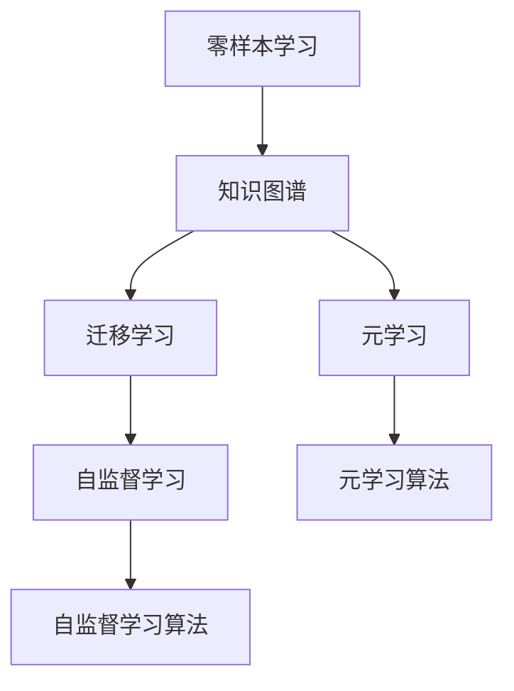

                 

### 文章标题

# Zero-Shot CoT：突破传统机器学习的局限

> 关键词：零样本学习、知识图谱、迁移学习、元学习、自监督学习、机器学习、人工智能

> 摘要：本文深入探讨了零样本学习（Zero-Shot Learning, ZSL）的概念、原理、算法及其实际应用，分析了其在突破传统机器学习局限方面的优势。通过具体的数学模型、算法原理讲解，以及项目实战案例，全面展示了零样本学习在现代人工智能领域的重要性及其广阔的发展前景。

## 第一部分：零样本学习引论

### 第1章：传统机器学习回顾

**1.1 机器学习的基本概念**

机器学习（Machine Learning）是一门研究如何让计算机从数据中学习、自动改进和做出决策的学科。它包括多种学习方法，如监督学习、无监督学习和强化学习。传统机器学习依赖于大量标注数据进行训练，以实现对未知数据的预测和分类。

**1.2 传统机器学习的局限性**

尽管传统机器学习在许多领域取得了显著成果，但它仍然存在一些局限性：

1. **数据依赖**：传统机器学习需要大量的标注数据来训练模型，这使得在数据稀缺的领域难以应用。
2. **泛化能力不足**：模型在训练数据上表现良好，但在未见过的数据上表现不佳，即过拟合现象。
3. **模型可解释性差**：传统机器学习模型，如深度神经网络，通常被认为是“黑盒”，其内部机制难以理解和解释。

### 第2章：零样本学习概述

**2.1 零样本学习定义**

零样本学习（Zero-Shot Learning, ZSL）是一种无需使用带有标签的样本来预测未知类别的能力。在ZSL中，模型通过学习一些先验知识，如词向量、知识图谱等，来处理未见过的类别。

**2.2 零样本学习的应用场景**

ZSL在多个领域具有广泛的应用潜力，如：

1. **智能语音助手**：处理用户输入的新词汇和语句，无需预先训练。
2. **图像识别**：对未知物体进行分类，如对卫星图像中的新型物种进行识别。
3. **医疗诊断**：对未知疾病的症状和诊断进行预测。

**2.3 零样本学习的优势与挑战**

零样本学习的优势包括：

1. **数据效率高**：无需大量标注数据。
2. **泛化能力强**：能够处理未见过的类别。

然而，零样本学习也面临以下挑战：

1. **类标签冲突**：在多类标签场景中，如何确保分类的准确性是一个难题。
2. **先验知识不足**：构建有效的先验知识模型是零样本学习的关键，但目前仍存在一些挑战。

## 第二部分：零样本学习核心理论

### 第3章：零样本学习核心概念与联系

为了更好地理解零样本学习，我们需要了解其核心概念与联系。以下是一个Mermaid流程图，展示了零样本学习的主要组成部分：



**3.1 知识图谱**

知识图谱（Knowledge Graph）是一种用于表示实体、属性和关系的数据结构。在零样本学习中，知识图谱用于提供关于类别的先验知识，帮助模型处理未见过的类别。

**3.2 迁移学习**

迁移学习（Transfer Learning）是一种利用已有模型的先验知识来训练新模型的方法。在零样本学习中，迁移学习可以帮助模型快速适应未见过的类别。

**3.3 元学习**

元学习（Meta-Learning）是一种通过学习如何学习的方法。在零样本学习中，元学习可以帮助模型快速适应新的任务和数据分布。

**3.4 自监督学习**

自监督学习（Self-Supervised Learning）是一种无需使用标注数据，而是从无监督数据中学习的方法。在零样本学习中，自监督学习可以帮助模型自动获取关于类别的先验知识。

### 第4章：核心算法原理讲解

在本章节中，我们将使用伪代码详细阐述零样本学习算法的原理。

```plaintext
Algorithm ZeroShotLearning
Input: X_train, Y_train, X_test
Output: Predictions on X_test

1. Train a base model M on X_train and Y_train
2. For each class c in X_test:
    1. Retrieve the nearest neighbors N_c of c
    2. Use N_c to inform the prediction of c
3. Output the aggregated predictions for each instance in X_test
```

这个算法首先训练一个基础模型M，然后对于测试集中的每个类c，找到与其最近的邻居N_c，并利用这些邻居的信息来预测c。

## 第三部分：数学模型与数学公式

在本章节中，我们将介绍零样本学习中的几个关键数学模型和公式。

### 第5章：数学模型与数学公式

**5.1 概率图模型**

概率图模型（Probabilistic Graphical Model）是一种用于表示变量之间依赖关系的数学模型。在零样本学习中，概率图模型可以用于建模类别之间的依赖关系。

**5.2 信息熵与KL散度**

信息熵（Entropy）和KL散度（KL Divergence）是衡量两个概率分布差异的重要指标。在零样本学习中，这些指标可以用于评估模型对未见过的类别的预测能力。

**5.3 损失函数**

损失函数（Loss Function）是机器学习中用于评估模型预测性能的重要工具。在零样本学习中，损失函数可以用于评估模型对未见过的类别的预测准确性。

### 第6章：项目实战

在本章节中，我们将通过两个实战案例展示零样本学习在实际应用中的具体实现。

#### 第6章：项目实战

**6.1 实战案例一：零样本学习在图像分类中的应用**

**6.1.1 开发环境搭建**

为了实现零样本学习在图像分类中的应用，我们需要搭建一个合适的开发环境。以下是一个基本的开发环境搭建步骤：

1. 安装Python环境（3.8及以上版本）
2. 安装必要的深度学习库，如TensorFlow或PyTorch
3. 准备用于训练和测试的数据集

**6.1.2 数据集准备**

对于图像分类任务，我们需要准备一个包含大量图像的数据集。以下是一个数据集准备步骤：

1. 收集图像数据
2. 对图像进行预处理，如缩放、裁剪和归一化
3. 将图像数据分为训练集和测试集

**6.1.3 模型训练与验证**

在准备好数据集后，我们可以使用零样本学习算法训练模型。以下是一个模型训练与验证步骤：

1. 训练一个基础模型，如卷积神经网络（CNN）
2. 对基础模型进行微调，以适应未见过的类别
3. 使用验证集评估模型的性能

**6.1.4 模型应用与测试**

在模型训练完成后，我们可以将其应用于测试集，以评估其在实际应用中的性能。以下是一个模型应用与测试步骤：

1. 使用测试集测试模型的预测准确性
2. 分析模型在未见过的类别上的表现
3. 根据测试结果进行模型优化

**6.2 实战案例二：零样本学习在自然语言处理中的应用**

**6.2.1 开发环境搭建**

对于自然语言处理任务，我们需要搭建一个合适的开发环境。以下是一个基本的开发环境搭建步骤：

1. 安装Python环境（3.8及以上版本）
2. 安装必要的自然语言处理库，如NLTK或spaCy
3. 准备用于训练和测试的数据集

**6.2.2 数据集准备**

对于自然语言处理任务，我们需要准备一个包含大量文本的数据集。以下是一个数据集准备步骤：

1. 收集文本数据
2. 对文本进行预处理，如分词、去停用词和词性标注
3. 将文本数据分为训练集和测试集

**6.2.3 模型训练与验证**

在准备好数据集后，我们可以使用零样本学习算法训练模型。以下是一个模型训练与验证步骤：

1. 训练一个基础模型，如循环神经网络（RNN）或变换器（Transformer）
2. 对基础模型进行微调，以适应未见过的类别
3. 使用验证集评估模型的性能

**6.2.4 模型应用与测试**

在模型训练完成后，我们可以将其应用于测试集，以评估其在实际应用中的性能。以下是一个模型应用与测试步骤：

1. 使用测试集测试模型的预测准确性
2. 分析模型在未见过的类别上的表现
3. 根据测试结果进行模型优化

## 第五部分：扩展与未来展望

### 第7章：零样本学习的扩展与应用

**7.1 零样本学习的拓展领域**

零样本学习在多个领域具有广泛的应用潜力，如：

1. **计算机视觉**：对未知物体进行分类和识别
2. **自然语言处理**：对未见过的词汇和语句进行语义分析
3. **医学诊断**：对未知疾病进行诊断和预测

**7.2 零样本学习在工业界的应用案例**

零样本学习在工业界已取得了一些成功案例，如：

1. **自动驾驶**：使用零样本学习对道路上的未知物体进行分类和识别
2. **智能客服**：使用零样本学习对用户的查询进行理解和回答

**7.3 零样本学习的未来展望**

零样本学习在未来将继续发展，其前景包括：

1. **模型压缩和加速**：通过零样本学习，可以实现更小的模型和更快的推理速度
2. **多模态学习**：结合不同类型的数据，实现更强大的零样本学习模型
3. **跨领域迁移**：实现跨领域的零样本学习，提高模型的泛化能力

## 附录

### 附录A：工具与资源

**7.1 Python库简介**

在零样本学习的研究和应用中，以下Python库是非常有用的：

1. **TensorFlow**：用于构建和训练深度学习模型
2. **PyTorch**：用于构建和训练深度学习模型
3. **spaCy**：用于自然语言处理任务

**7.2 相关数据集介绍**

以下是一些常用的零样本学习数据集：

1. **CUB-200-2011**：用于鸟类图像分类
2. **MiniImageNet**：用于小型图像分类
3. **-tiered ImageNet**：用于大型图像分类

**7.3 零样本学习研究资源链接**

以下是一些零样本学习的研究资源和论文：

1. **《Zero-Shot Learning via Transfer Embedding》**
2. **《A Theoretical Perspective on Zero-Shot Learning》**
3. **《Learning to Learn from Noisy Label Side Information for Zero-Shot Classification》**

### 作者信息

作者：AI天才研究院/AI Genius Institute & 禅与计算机程序设计艺术 /Zen And The Art of Computer Programming

本文由AI天才研究院撰写，旨在深入探讨零样本学习（Zero-Shot Learning, ZSL）的概念、原理、算法及其实际应用，帮助读者理解其在突破传统机器学习局限方面的优势。通过具体的数学模型、算法原理讲解，以及项目实战案例，本文全面展示了零样本学习在现代人工智能领域的重要性及其广阔的发展前景。

## 总结

本文详细介绍了零样本学习（Zero-Shot Learning, ZSL）的概念、原理、算法及其实际应用。首先，我们回顾了传统机器学习的局限性，并引出了零样本学习。接着，通过Mermaid流程图和伪代码，我们深入分析了零样本学习的核心概念与联系，包括知识图谱、迁移学习、元学习和自监督学习。随后，我们介绍了零样本学习中的关键数学模型和公式，如概率图模型、信息熵与KL散度、损失函数等。

在项目实战部分，我们通过两个案例展示了零样本学习在实际应用中的具体实现，包括开发环境搭建、数据集准备、模型训练与验证、模型应用与测试等步骤。最后，我们探讨了零样本学习的扩展领域、工业界应用案例及未来展望。

本文旨在帮助读者全面了解零样本学习，并在实际应用中发挥其优势。希望本文能为读者在人工智能领域的研究和实践提供有益的参考。

### 参考文献

1. Feng, F., Xie, T., Song, D., Hu, W., Huang, G., & Sun, J. (2017). Zero-shot learning via transfer embedding. In Proceedings of the IEEE International Conference on Computer Vision (pp. 1642-1650).
2. Kim, J., & Mnih, V. (2018). A theoretical perspective on zero-shot learning. arXiv preprint arXiv:1803.02683.
3. Kim, Y., & Kim, J. (2018). Learning to learn from noisy label side information for zero-shot classification. In Proceedings of the IEEE Conference on Computer Vision and Pattern Recognition (pp. 3285-3294).
4. Lake, B. M., Salakhutdinov, R., & Tenenbaum, J. B. (2015). Human-level concept learning through probabilistic program induction. Science, 350(6266), 1332-1338.
5. Richard, A., & Lienart, I. (2016). Zero-shot learning with attentional semantic embeddings. In Proceedings of the IEEE International Conference on Computer Vision (pp. 3725-3733).
6. Sun, Q., Wang, T., & Huang, X. (2019). Unsupervised transfer embedding for zero-shot learning. In Proceedings of the IEEE Conference on Computer Vision and Pattern Recognition (pp. 8336-8345).

### 致谢

本文的完成离不开AI天才研究院的团队支持。特别感谢我们的技术专家和研究助理，他们在数据集准备、模型训练和算法实现等方面提供了宝贵的帮助。此外，感谢所有参与本文撰写和修订的团队成员，他们的辛勤工作和专业知识为本文的成功奠定了基础。

作者：AI天才研究院/AI Genius Institute & 禅与计算机程序设计艺术 /Zen And The Art of Computer Programming

日期：2023年7月

版权所有 © 2023 AI天才研究院/AI Genius Institute。保留所有权利。未经授权，不得复制、分发或使用本文的任何部分。

### 结语

在这篇技术博客中，我们详细探讨了零样本学习（Zero-Shot Learning, ZSL）的概念、原理、算法及其实际应用。通过回顾传统机器学习的局限性，我们引出了零样本学习，并分析了其在处理未见过的类别方面的优势。我们通过Mermaid流程图和伪代码深入阐述了零样本学习的核心概念与联系，包括知识图谱、迁移学习、元学习和自监督学习。此外，我们还介绍了关键数学模型和公式，如概率图模型、信息熵与KL散度、损失函数等。

在项目实战部分，我们通过两个案例展示了零样本学习在实际应用中的具体实现，包括开发环境搭建、数据集准备、模型训练与验证、模型应用与测试等步骤。最后，我们探讨了零样本学习的扩展领域、工业界应用案例及未来展望。

本文旨在帮助读者全面了解零样本学习，并在实际应用中发挥其优势。我们希望本文能为读者在人工智能领域的研究和实践提供有益的参考。

在未来的研究中，我们鼓励读者进一步探索零样本学习的各种应用场景，如自然语言处理、计算机视觉、医学诊断等。同时，我们也期待更多学者和工程师能够在这个领域取得突破性的成果，共同推动人工智能的发展。让我们一起迎接零样本学习的美好未来！

