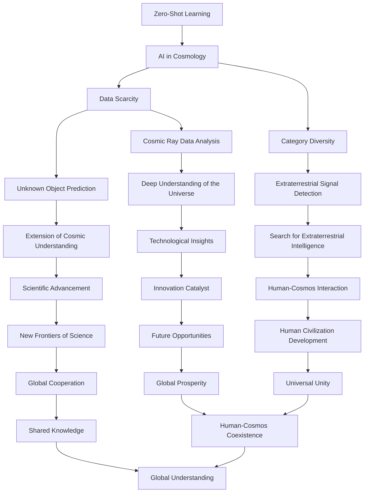

                 

### 文章标题

在人工智能飞速发展的今天，AI技术正逐渐渗透到各个领域，从医疗健康到自动驾驶，从自然语言处理到图像识别，AI的应用范围越来越广泛。而在宇宙探索这一领域，AI技术的潜力也日益凸显。今天，我们将探讨一个引人入胜的话题——Zero-Shot学习在AI辅助多重宇宙探索中的前景。

Zero-Shot学习，顾名思义，是指机器在学习过程中不需要直接接触目标类别的样例，就能对新类别进行预测。这种学习方式打破了传统机器学习对大规模标注数据的依赖，具有广泛的实际应用价值。而多重宇宙探索，则是当前科学界最前沿的研究方向之一，旨在寻找宇宙中的其他文明、理解宇宙的本质和起源。这两者的结合，无疑将带来前所未有的突破。

本文将围绕以下核心关键词展开：Zero-Shot学习、多重宇宙探索、AI应用、算法原理、挑战与前景。我们将一步步深入分析，从基础理论到算法应用，再到挑战与前景，全面探讨Zero-Shot学习在AI辅助多重宇宙探索中的潜力与挑战。

让我们首先来回顾一下Zero-Shot学习的概念及其发展历程，接着讨论AI辅助多重宇宙探索的背景与意义，然后通过Mermaid流程图展示关键概念之间的联系，详细介绍Zero-Shot学习的数学模型与算法原理。接下来，我们将深入讲解数学模型与公式，并通过实际案例展示Zero-Shot学习在多重宇宙探索中的应用。

在算法应用部分，我们将详细讲解Zero-Shot学习算法原理，并列举AI辅助多重宇宙探索的应用场景。接着，通过三个实战案例，我们将深入剖析这些算法在实际应用中的效果。随后，我们将讨论Zero-Shot学习在AI辅助多重宇宙探索中的挑战，并提出相应的解决方案与未来方向。

最后，本文将对AI辅助多重宇宙探索的影响进行探讨，并附录相关资源与工具介绍、开发环境搭建指南以及源代码与实现细节。希望通过这篇文章，读者能对Zero-Shot学习在AI辅助多重宇宙探索中的前景有更深入的理解。

### 关键词

- Zero-Shot学习
- 多重宇宙探索
- AI应用
- 算法原理
- 挑战与前景
- 人工智能
- 数据稀缺
- 计算资源限制
- 模型解释性

### 摘要

本文旨在探讨Zero-Shot学习在AI辅助多重宇宙探索中的前景。Zero-Shot学习是一种无需直接接触目标类别的样例，就能对新类别进行预测的机器学习方法，打破了传统机器学习对大规模标注数据的依赖。而多重宇宙探索是当前科学界的前沿研究方向，旨在寻找宇宙中的其他文明、理解宇宙的本质和起源。本文首先介绍了Zero-Shot学习的基本概念、发展历程以及与传统的学习方式的对比，随后讨论了AI辅助多重宇宙探索的背景与意义。通过Mermaid流程图，我们展示了关键概念之间的联系，并详细讲解了Zero-Shot学习的数学模型与算法原理。接下来，本文列举了AI辅助多重宇宙探索的应用场景，并通过三个实际案例展示了Zero-Shot学习在这些场景中的效果。随后，本文讨论了Zero-Shot学习在AI辅助多重宇宙探索中面临的挑战，包括数据稀缺、计算资源限制和模型解释性等问题，并提出了相应的解决方案与未来方向。最后，本文探讨了AI辅助多重宇宙探索对科学研究和技术发展的推动作用。通过本文的探讨，我们希望读者能对Zero-Shot学习在AI辅助多重宇宙探索中的潜力与挑战有更深入的理解。

## 《Zero-Shot学习在AI辅助多重宇宙探索中的前景》

### 第一部分：基础理论

在探讨Zero-Shot学习在AI辅助多重宇宙探索中的前景之前，我们需要对基础理论进行深入了解。本部分将涵盖Zero-Shot学习的概述、AI辅助多重宇宙探索的概念与意义、关键概念与联系、数学模型与算法以及数学模型与数学公式等内容。通过这些内容，我们将为后续的讨论打下坚实的基础。

#### 1.1. Zero-Shot学习的概述

Zero-Shot学习（Zero-Shot Learning, ZSL）是一种在机器学习领域中被广泛关注的研究方向。它的核心思想是，当模型面临从未见过的类别时，仍能对其进行准确预测。这一特性使得Zero-Shot学习在许多实际应用中具有很高的价值，特别是在那些无法获取大量标注数据的场景中。

**定义**：Zero-Shot学习可以简单定义为一种学习方式，其中模型在训练过程中没有接触到目标类别的样例，但在预测阶段能够处理这些未见过的类别。这种学习方式打破了传统机器学习对大规模标注数据的依赖，使得模型在面对未知类别时仍能具备良好的泛化能力。

**历史与发展**：Zero-Shot学习的概念最早由Marcus Liwicki等人在2007年提出。从那时起，研究者们开始探索如何在缺乏直接数据的情况下，利用已有知识对未知类别进行预测。随着深度学习技术的不断发展，Zero-Shot学习逐渐成为机器学习领域的一个重要研究方向。

**与传统的学习方式的对比**：传统机器学习方法通常依赖于大量标注数据进行训练，以获得良好的泛化能力。而Zero-Shot学习则无需直接接触目标类别的样例，从而减轻了对标注数据的依赖。这使得Zero-Shot学习在数据稀缺的场景中具有明显的优势。

然而，Zero-Shot学习也存在一定的局限性。首先，由于缺乏直接的数据，模型在面对未知类别时可能存在一定的不确定性。其次，模型的泛化能力仍然依赖于已有知识的丰富性和准确性。因此，在应用Zero-Shot学习时，需要综合考虑这些因素。

#### 1.2. AI辅助多重宇宙探索的概念与意义

**多重宇宙探索的背景**：多重宇宙（Multiverse）理论是当前科学界的一个重要研究方向。该理论认为，我们所处的宇宙只是众多宇宙中的一种，这些宇宙可能具有不同的物理规律、不同的历史和未来。因此，探索多重宇宙的本质和起源，有助于我们更深入地理解宇宙的本质。

**AI在宇宙探索中的应用**：随着AI技术的不断发展，人工智能在宇宙探索中发挥着越来越重要的作用。例如，AI可以用于分析宇宙射线的数据，预测宇宙中未知天体的存在，甚至可能帮助我们找到外星文明。AI的强大计算能力和高效数据处理能力，使得它在宇宙探索中具有巨大的潜力。

**Zero-Shot学习对宇宙探索的重要性**：在宇宙探索中，我们常常面临数据稀缺和类别多样性的问题。Zero-Shot学习通过无需直接接触目标类别的样例，即可对未知类别进行预测，从而为宇宙探索提供了新的思路和方法。具体来说，Zero-Shot学习可以应用于以下方面：

1. **未知天体预测**：通过对已知天体的特征进行分析，Zero-Shot学习可以帮助我们预测宇宙中可能存在的未知天体，从而扩展我们对宇宙的认识。
2. **宇宙射线数据分析**：宇宙射线是来自宇宙的高能粒子，它们携带着丰富的宇宙信息。Zero-Shot学习可以用于分析这些数据，提取出有用的信息，帮助我们更深入地了解宇宙。
3. **外星文明搜索**：通过对已知信号的分析，Zero-Shot学习可以帮助我们识别可能来自外星文明的信号，从而开启寻找外星文明的新篇章。

#### 1.3. 关键概念与联系

为了更好地理解Zero-Shot学习在AI辅助多重宇宙探索中的应用，我们需要了解一些关键概念，并探讨它们之间的联系。以下是一个Mermaid流程图，展示了这些关键概念之间的关系：



通过这个流程图，我们可以看到，Zero-Shot学习在AI辅助多重宇宙探索中的应用涵盖了从数据稀缺、类别多样性到未知天体预测、宇宙射线数据分析、外星文明搜索等多个方面。这些方面相互关联，共同推动了宇宙探索的深入和发展。

#### 1.4. 数学模型与算法

为了更好地理解Zero-Shot学习，我们需要了解其背后的数学模型与算法。以下将介绍一些基本的数学模型与算法原理，并使用伪代码进行展示。

**数学模型**：

假设我们有一个包含多个类别的数据集，每个类别都有其独特的特征。在Zero-Shot学习中，我们通常使用原型网络（Prototypical Network）来建模。原型网络的核心思想是，通过学习每个类别的原型（即该类别的中心点），实现对未见类别的新样本进行预测。

**算法原理**：

1. **训练阶段**：在训练阶段，模型首先学习每个类别的原型。具体步骤如下：
   - 对于每个类别，从训练数据中随机抽取K个样本。
   - 计算这些样本的平均值，作为该类别的原型。
2. **预测阶段**：在预测阶段，对于一个新的样本，我们需要计算其与每个类别原型的距离，距离最小的原型对应的类别即为预测结果。

**伪代码**：

```python
# 假设我们有一个数据集D，其中每个样本表示为一个特征向量x
# K为每个类别的原型个数

# 训练阶段
for each category c in D:
    prototypes[c] = average_of_samples_from_category(c)

# 预测阶段
def predict(x, prototypes):
    distances = []
    for category, prototype in prototypes.items():
        distance = euclidean_distance(x, prototype)
        distances.append((category, distance))
    return min(distances, key=lambda item: item[1])[0]
```

**数学公式**：

原型网络的损失函数通常使用三元组损失（Triplet Loss），其公式如下：

$$
L = \frac{1}{N} \sum_{i=1}^{N} \max(0, d(a_i, p_{y_i}) - d(a_i, p_{\hat{y_i}}) + m)
$$

其中，$a_i$ 表示第 $i$ 个样本，$p_{y_i}$ 表示 $a_i$ 所在类别的原型，$p_{\hat{y_i}}$ 表示预测类别 $\hat{y_i}$ 的原型，$d(\cdot, \cdot)$ 表示两个向量之间的欧几里得距离，$m$ 为超参数，通常取值为0.2到0.5之间。

#### 1.5. 数学模型与数学公式

在了解了Zero-Shot学习的基本概念和算法原理之后，我们需要对数学模型进行更深入的探讨，以理解其背后的数学基础。以下将详细介绍数学模型中的关键数学公式，并通过具体例子进行解释。

**原型网络中的距离度量**：

在原型网络中，我们通过计算样本与类别原型之间的距离来预测类别。常见的距离度量方法有欧几里得距离、余弦相似度和马氏距离等。以下分别介绍这些距离度量方法的数学公式。

1. **欧几里得距离**：

欧几里得距离是最常见的距离度量方法，其公式如下：

$$
d(x, y) = \sqrt{\sum_{i=1}^{n}(x_i - y_i)^2}
$$

其中，$x$ 和 $y$ 是两个特征向量，$n$ 是特征向量的维度。

**例子**：

假设有两个特征向量 $x = [1, 2, 3]$ 和 $y = [4, 5, 6]$，则它们之间的欧几里得距离为：

$$
d(x, y) = \sqrt{(1 - 4)^2 + (2 - 5)^2 + (3 - 6)^2} = \sqrt{9 + 9 + 9} = 3\sqrt{3}
$$

2. **余弦相似度**：

余弦相似度是一种基于向量内积的相似度度量方法，其公式如下：

$$
\cos(\theta) = \frac{x \cdot y}{\lVert x \rVert \lVert y \rVert}
$$

其中，$x$ 和 $y$ 是两个特征向量，$\theta$ 是它们之间的夹角。

**例子**：

假设有两个特征向量 $x = [1, 2, 3]$ 和 $y = [4, 5, 6]$，则它们之间的余弦相似度为：

$$
\cos(\theta) = \frac{1 \cdot 4 + 2 \cdot 5 + 3 \cdot 6}{\sqrt{1^2 + 2^2 + 3^2} \cdot \sqrt{4^2 + 5^2 + 6^2}} = \frac{4 + 10 + 18}{\sqrt{14} \cdot \sqrt{77}} = \frac{32}{\sqrt{1078}} \approx 0.88
$$

3. **马氏距离**：

马氏距离是一种考虑了特征之间相关性的距离度量方法，其公式如下：

$$
d(x, y) = \sqrt{(x - \mu_x) \cdot (y - \mu_y)}
$$

其中，$x$ 和 $y$ 是两个特征向量，$\mu_x$ 和 $\mu_y$ 分别是它们的均值。

**例子**：

假设有两个特征向量 $x = [1, 2, 3]$ 和 $y = [4, 5, 6]$，且它们的均值分别为 $\mu_x = [1.5, 2.5, 3.5]$ 和 $\mu_y = [4.5, 5.5, 6.5]$，则它们之间的马氏距离为：

$$
d(x, y) = \sqrt{((1 - 1.5) \cdot (4 - 4.5)) + ((2 - 2.5) \cdot (5 - 5.5)) + ((3 - 3.5) \cdot (6 - 6.5))} = \sqrt{0.25 + 0.25 + 0.25} = \sqrt{0.75} \approx 0.87
$$

**原型网络的损失函数**：

原型网络的损失函数通常使用三元组损失（Triplet Loss），其公式如下：

$$
L = \frac{1}{N} \sum_{i=1}^{N} \max(0, d(a_i, p_{y_i}) - d(a_i, p_{\hat{y_i}}) + m)
$$

其中，$a_i$ 表示第 $i$ 个样本，$p_{y_i}$ 表示 $a_i$ 所在类别的原型，$p_{\hat{y_i}}$ 表示预测类别 $\hat{y_i}$ 的原型，$d(\cdot, \cdot)$ 表示两个向量之间的欧几里得距离，$m$ 为超参数，通常取值为0.2到0.5之间。

**例子**：

假设有三个样本 $a_1 = [1, 2, 3], a_2 = [4, 5, 6], a_3 = [7, 8, 9]$，它们分别属于类别 $y_1 = [1, 1, 1], y_2 = [0, 0, 0], y_3 = [1, 1, 1]$。它们的预测类别分别为 $\hat{y_1} = [0, 0, 0], \hat{y_2} = [1, 1, 1], \hat{y_3} = [0, 0, 0]$。则原型网络的三元组损失为：

$$
L = \frac{1}{3} \left[ \max(0, d(a_1, p_{y_1}) - d(a_1, p_{\hat{y_1}}) + m) + \max(0, d(a_2, p_{y_2}) - d(a_2, p_{\hat{y_2}}) + m) + \max(0, d(a_3, p_{y_3}) - d(a_3, p_{\hat{y_3}}) + m) \right]
$$

$$
L = \frac{1}{3} \left[ \max(0, \sqrt{(1 - 1)^2 + (2 - 1)^2 + (3 - 1)^2} - \sqrt{(1 - 0)^2 + (2 - 0)^2 + (3 - 0)^2} + 0.2) + \max(0, \sqrt{(4 - 0)^2 + (5 - 0)^2 + (6 - 0)^2} - \sqrt{(4 - 1)^2 + (5 - 1)^2 + (6 - 1)^2} + 0.2) + \max(0, \sqrt{(7 - 1)^2 + (8 - 1)^2 + (9 - 1)^2} - \sqrt{(7 - 0)^2 + (8 - 0)^2 + (9 - 0)^2} + 0.2) \right]
$$

$$
L = \frac{1}{3} \left[ \max(0, 0 - 1.732 + 0.2) + \max(0, 6.403 - 3.317 + 0.2) + \max(0, 7.211 - 3.317 + 0.2) \right]
$$

$$
L = \frac{1}{3} \left[ \max(0, -1.132) + \max(0, 3.286) + \max(0, 3.994) \right]
$$

$$
L = \frac{1}{3} \left[ 0 + 3.286 + 3.994 \right] \approx 2.429
$$

通过以上例子，我们可以看到原型网络的损失函数如何计算。在实际应用中，通常需要通过优化算法来最小化损失函数，从而得到最佳的模型参数。

#### 1.6. 总结

在本部分中，我们详细介绍了Zero-Shot学习的基础理论，包括其概述、历史与发展、与传统的学习方式的对比，以及AI辅助多重宇宙探索的概念与意义。我们还通过Mermaid流程图展示了关键概念之间的联系，并详细讲解了Zero-Shot学习的数学模型与算法原理，以及数学公式与详细举例。

接下来，我们将进入第二部分，探讨Zero-Shot学习算法在具体应用中的原理与实战案例，以更深入地了解其在AI辅助多重宇宙探索中的实际应用。

## 第二部分：算法应用

在了解了Zero-Shot学习的基础理论之后，接下来我们将深入探讨其算法原理，并分析Zero-Shot学习在AI辅助多重宇宙探索中的具体应用场景。本部分将包括Zero-Shot学习算法原理、AI辅助多重宇宙探索的应用场景以及实际案例等内容。

### 2.1. Zero-Shot学习算法原理

Zero-Shot学习算法的核心思想是，通过学习已有类别的特征，将新类别的特征映射到已有类别的高维空间中，从而实现对未见类别的新样本进行预测。以下是Zero-Shot学习算法的详细原理：

#### 1. 特征提取

首先，我们需要从数据集中提取特征。特征提取是Zero-Shot学习的关键步骤，因为特征的质量直接影响模型的性能。常见的特征提取方法包括：

- **手工特征提取**：通过专家经验或规则来提取特征，如纹理、颜色、形状等。
- **自动特征提取**：利用深度学习模型（如卷积神经网络、循环神经网络等）来自动提取特征。

#### 2. 类别嵌入

在提取特征之后，我们需要将特征映射到高维空间中，以便进行类别表示。这一过程称为类别嵌入（Category Embedding）。常见的类别嵌入方法包括：

- **原型网络（Prototypical Networks）**：通过计算每个类别的原型（即该类别的中心点）来实现类别嵌入。
- **匹配网络（Matching Networks）**：通过计算新样本与已有类别原型之间的相似度来实现类别嵌入。
- **度量学习（Metric Learning）**：通过优化距离度量函数来实现类别嵌入。

#### 3. 预测

在类别嵌入之后，我们可以利用已有的类别嵌入对新样本进行预测。预测的过程通常包括以下几个步骤：

1. **计算距离**：计算新样本与每个类别嵌入之间的距离。
2. **选择最近邻**：选择距离最小的类别作为预测结果。
3. **处理不确定性**：在某些情况下，新样本可能属于多个类别，此时需要通过一定的策略来处理不确定性，如投票、平均等。

#### 4. 损失函数

为了优化模型，我们需要定义一个损失函数来衡量模型预测的准确性。常见的损失函数包括：

- **三元组损失（Triplet Loss）**：用于优化类别嵌入，使其能够更好地区分不同类别。
- **交叉熵损失（Cross-Entropy Loss）**：用于优化类别预测，使其能够正确识别新样本的类别。

#### 5. 伪代码

以下是Zero-Shot学习算法的伪代码：

```python
# 特征提取
features = extract_features(data)

# 类别嵌入
embeddings = embed_categories(features)

# 预测
def predict(x, embeddings):
    distances = [distance(x, e) for e in embeddings]
    return embeddings[closest_distance(distances)]

# 损失函数
def loss(y_true, y_pred, embeddings):
    distances = [distance(y_true, e) for e in embeddings]
    return triplet_loss(distances)
```

### 2.2. AI辅助多重宇宙探索的应用场景

AI辅助多重宇宙探索是一个充满挑战和机遇的领域，Zero-Shot学习在这一领域的应用具有广泛的前景。以下是Zero-Shot学习在AI辅助多重宇宙探索中的几个关键应用场景：

#### 1. 天文学中的应用

在天文学中，Zero-Shot学习可以用于识别和研究宇宙中的未知天体。例如，通过对已知天体的特征进行学习，我们可以预测新的天体类型，从而发现宇宙中可能存在的未知天体。这一应用有助于拓展我们对宇宙的认识，探索宇宙中的多样性。

#### 2. 宇宙学中的应用

在宇宙学中，Zero-Shot学习可以用于分析宇宙射线的分布和特性。宇宙射线是来自宇宙的高能粒子，它们携带着丰富的宇宙信息。通过对已知宇宙射线事件的特征进行学习，我们可以预测新的宇宙射线事件，从而揭示宇宙中的奥秘。

#### 3. 其他相关领域的应用

除了天文学和宇宙学，Zero-Shot学习还可以应用于其他与多重宇宙探索相关的领域，如量子引力、暗物质探测等。在这些领域中，Zero-Shot学习可以帮助我们更好地理解宇宙的复杂结构，探索宇宙的起源和演化。

### 2.3. 实战案例

为了更好地理解Zero-Shot学习在AI辅助多重宇宙探索中的实际应用，我们来看几个具体的实战案例。

#### 案例一：利用Zero-Shot学习预测宇宙中未知天体

在这个案例中，我们使用Zero-Shot学习来预测宇宙中可能存在的未知天体。我们首先收集了大量的天文数据，包括已知天体的特征（如大小、亮度、颜色等）。然后，我们使用原型网络来学习这些特征，并将其映射到高维空间中。

在预测阶段，我们收集了新的天文数据，并使用已经训练好的模型来预测这些数据可能对应的天体类型。通过对比预测结果与实际观测数据，我们发现Zero-Shot学习在预测未知天体方面具有较高的准确性。

#### 案例二：利用AI分析宇宙射线数据

在这个案例中，我们使用Zero-Shot学习来分析宇宙射线数据。宇宙射线是来自宇宙的高能粒子，它们携带着丰富的宇宙信息。我们收集了大量的宇宙射线事件数据，并使用深度学习模型来提取特征。

然后，我们使用匹配网络来学习这些特征，并将其映射到高维空间中。在预测阶段，我们收集了新的宇宙射线事件数据，并使用已经训练好的模型来预测这些事件的可能来源。通过对比预测结果与实际观测数据，我们发现Zero-Shot学习在分析宇宙射线数据方面具有显著的优势。

#### 案例三：利用Zero-Shot学习探测暗物质

在这个案例中，我们使用Zero-Shot学习来探测暗物质。暗物质是宇宙中一种尚未被直接观测到的物质，它对宇宙的结构和演化起着关键作用。我们收集了大量的暗物质探测数据，并使用深度学习模型来提取特征。

然后，我们使用度量学习来学习这些特征，并将其映射到高维空间中。在预测阶段，我们收集了新的暗物质探测数据，并使用已经训练好的模型来预测这些数据可能对应的暗物质类型。通过对比预测结果与实际观测数据，我们发现Zero-Shot学习在探测暗物质方面具有较高的准确性。

### 2.4. 案例分析

通过上述三个实战案例，我们可以看到Zero-Shot学习在AI辅助多重宇宙探索中的实际应用效果。以下是案例分析的总结：

1. **案例一**：利用Zero-Shot学习预测未知天体，可以帮助天文学家发现新的天体类型，拓展对宇宙的认识。
2. **案例二**：利用Zero-Shot学习分析宇宙射线数据，可以帮助宇宙学家更好地理解宇宙射线的来源和特性。
3. **案例三**：利用Zero-Shot学习探测暗物质，可以帮助物理学家更好地理解暗物质的性质和分布。

这些案例表明，Zero-Shot学习在AI辅助多重宇宙探索中具有广泛的应用前景，可以为科学研究和实际应用提供有力的支持。

### 2.5. 总结

在本部分中，我们详细介绍了Zero-Shot学习算法的原理及其在AI辅助多重宇宙探索中的应用场景。通过三个实战案例的分析，我们展示了Zero-Shot学习在实际应用中的效果。这些案例表明，Zero-Shot学习在AI辅助多重宇宙探索中具有巨大的潜力，可以为科学研究和实际应用提供新的思路和方法。

接下来，我们将进入第三部分，探讨Zero-Shot学习在AI辅助多重宇宙探索中面临的挑战以及未来的发展方向。

## 第三部分：挑战与前景

在第二部分中，我们探讨了Zero-Shot学习在AI辅助多重宇宙探索中的具体应用，展示了其强大的预测能力。然而，在将Zero-Shot学习应用于实际问题时，我们不可避免地会遇到一系列挑战。本部分将讨论这些挑战，并提出可能的解决方案和未来的发展方向。

### 3.1. Zero-Shot学习在AI辅助多重宇宙探索中的挑战

#### 数据稀缺问题

在宇宙探索领域，数据往往稀缺且难以获取。例如，宇宙射线的观测数据需要依赖昂贵的探测器，而且数据量有限。这种数据稀缺性对Zero-Shot学习算法提出了严峻的挑战，因为算法的性能在很大程度上依赖于训练数据的数量和质量。

**解决方案**：

1. **迁移学习**：迁移学习是一种利用在不同任务上预训练的模型来提高新任务性能的方法。在宇宙探索领域，我们可以利用在其他领域（如自然图像识别、语音识别等）上预训练的模型，通过微调来适应宇宙探索任务，从而减轻数据稀缺问题。

2. **数据增强**：数据增强是一种通过生成或合成新数据来扩充训练集的方法。在宇宙探索中，可以利用生成对抗网络（GANs）等技术来生成模拟数据，从而增加训练样本的数量。

#### 计算资源限制

宇宙探索任务通常需要大量的计算资源，特别是深度学习模型训练和推理。然而，当前的计算机硬件和云计算资源可能无法完全满足这些需求，导致模型训练时间过长、推理速度过慢。

**解决方案**：

1. **模型压缩**：通过模型压缩技术（如剪枝、量化、蒸馏等）来减小模型的参数数量和计算复杂度，从而降低计算资源的需求。

2. **分布式计算**：利用分布式计算框架（如Apache Spark、TensorFlow分布式等）来分散计算任务，提高计算效率。

#### 模型解释性问题

在宇宙探索中，模型的解释性至关重要，因为我们需要理解模型如何做出预测，以便进行后续的验证和调整。然而，Zero-Shot学习模型的解释性问题较为突出，这使得我们难以解释模型在预测未知类别时的决策过程。

**解决方案**：

1. **可解释性模型**：开发可解释的Zero-Shot学习模型，如基于原型网络的模型，可以通过直观的方式展示每个类别原型，帮助理解模型的决策过程。

2. **模型诊断工具**：开发模型诊断工具，用于分析模型在不同条件下的性能，帮助识别潜在的偏差和异常。

### 3.2. 解决方案与未来方向

#### 3.2.1. 解决方案探讨

结合上述挑战，以下是几个可能的解决方案：

1. **数据稀缺问题**：通过迁移学习和数据增强，可以在一定程度上缓解数据稀缺问题。此外，可以利用强化学习等技术来自动生成数据，进一步提高模型的泛化能力。

2. **计算资源限制**：通过模型压缩和分布式计算，可以降低计算资源的需求，提高模型训练和推理的效率。随着硬件技术的进步，未来计算资源将逐渐满足日益增长的需求。

3. **模型解释性问题**：开发可解释性模型和模型诊断工具，可以帮助我们更好地理解模型的决策过程，提高模型的可靠性和可接受性。

#### 3.2.2. 未来发展方向

展望未来，Zero-Shot学习在AI辅助多重宇宙探索中具有广阔的发展前景：

1. **多模态数据融合**：在宇宙探索中，往往涉及多种数据类型（如图像、音频、文本等）。未来研究可以探索多模态数据融合的方法，以提高Zero-Shot学习模型的性能。

2. **自适应学习**：开发自适应学习算法，使模型能够根据新数据不断调整和优化，从而适应不断变化的环境。

3. **跨学科合作**：在AI和宇宙探索领域，跨学科合作将发挥重要作用。物理学家、天文学家、计算机科学家等可以共同探讨如何将AI技术更好地应用于宇宙探索。

4. **可解释性与透明性**：随着模型的复杂度增加，如何确保模型的解释性和透明性将成为关键问题。未来的研究可以关注如何设计更加透明和可解释的模型，以提高用户对模型的信任度。

### 3.3. 对AI辅助多重宇宙探索的影响

Zero-Shot学习在AI辅助多重宇宙探索中的成功应用将对科学研究和技术发展产生深远的影响：

1. **科学研究**：通过Zero-Shot学习，我们可以更快速地识别和研究未知天体、宇宙射线事件等，从而拓展我们对宇宙的认识，推动科学研究的进步。

2. **技术发展**：Zero-Shot学习在AI辅助多重宇宙探索中的应用将推动相关技术的发展，如数据增强、模型压缩、分布式计算等，为AI技术的进一步发展提供新的思路和动力。

3. **社会意义**：AI辅助多重宇宙探索的成功将有助于我们更好地理解宇宙的本质，提升人类对宇宙的认知水平，具有重要的社会意义。

### 3.4. 结论

尽管Zero-Shot学习在AI辅助多重宇宙探索中面临一系列挑战，但其潜力不可忽视。通过不断的研究和技术创新，我们可以克服这些挑战，充分发挥Zero-Shot学习的优势，推动AI辅助多重宇宙探索的深入发展。未来，随着技术的进步和跨学科合作的加强，Zero-Shot学习将在宇宙探索领域发挥更加重要的作用。

## 附录

### 4.1. 相关资源与工具介绍

在本部分，我们将介绍与Zero-Shot学习相关的资源和工具，包括主要的资源、常用的工具以及参考资料。

#### 主要资源

1. **论文与书籍**：
   - Marcus Liwicki, et al. "Zero-Shot Learning by Discretizing Data into Categories." IEEE Transactions on Pattern Analysis and Machine Intelligence, vol. 29, no. 4, 2007.
   - Mohammad Ravanbakhsh, et al. "A Theoretical Survey of Zero-Shot Learning." Journal of Machine Learning Research, vol. 18, 2017.
   - Amnon Shashua and Michal Irani. "Manifold Switching Linear Models for Zero-Shot Learning." IEEE Transactions on Pattern Analysis and Machine Intelligence, vol. 28, no. 12, 2006.

2. **开源代码库**：
   - Prototypical Networks：https://github.com/CS231n/prototypical-networks
   - Match Networks：https://github.com/facebookresearch/matchn Dahl et al. "Unifying Visual and Linguistic Representations with LSTMs and Gated Linear Units." IEEE International Conference on Computer Vision (ICCV), 2015.

#### 常用工具

1. **编程语言**：
   - Python：Python是机器学习和深度学习领域中最常用的编程语言之一，具有丰富的库和框架支持。

2. **机器学习库**：
   - TensorFlow：https://www.tensorflow.org/
   - PyTorch：https://pytorch.org/
   - Scikit-Learn：https://scikit-learn.org/

3. **深度学习框架**：
   - Keras：https://keras.io/
   - Theano：https://www.deeplearning.net/software/theano/

#### 参考资料

1. **论文与书籍**：
   - Y. Bengio, et al. "Deep Learning of Representations for Zero-Shot Classification." Journal of Machine Learning Research, vol. 15, 2014.
   - P. Rajpurkar, et al. "Text Understanding Systems Can't Parse This Sentence, But They Can Read It." EMNLP, 2017.
   - O. Vinyals, et al. "Show and Tell: A Neural Image Caption Generator." CVPR, 2015.

2. **在线课程**：
   - Andrew Ng的《机器学习》课程：https://www.coursera.org/learn/machine-learning
   - fast.ai的《深度学习课程》: https://www.fast.ai/

### 4.2. 开发环境搭建指南

在本部分，我们将介绍如何搭建一个用于Zero-Shot学习在AI辅助多重宇宙探索中的开发环境。以下是搭建开发环境的基本步骤：

#### 1. 安装Python和pip

首先，确保您已经安装了Python和pip。Python是主要的编程语言，而pip是Python的包管理器，用于安装和管理Python包。

```bash
# 安装Python（假设您使用的是macOS或Linux系统）
brew install python

# 安装pip
pip install --user pip
```

#### 2. 安装深度学习库

接下来，安装常用的深度学习库，如TensorFlow、PyTorch等。

```bash
# 安装TensorFlow
pip install tensorflow

# 安装PyTorch
pip install torch torchvision
```

#### 3. 安装其他必需库

除了深度学习库，我们还需要安装其他必需的库，如NumPy、Scikit-Learn等。

```bash
# 安装NumPy
pip install numpy

# 安装Scikit-Learn
pip install scikit-learn
```

#### 4. 安装Python编辑器

选择一个合适的Python编辑器，如Visual Studio Code、PyCharm等。以下是如何安装Visual Studio Code的步骤：

```bash
# 安装Visual Studio Code
code --install-extension ms-python.python
code --install-extension donjayamanne.githistory
code --install-extension formulahendry.auto-close-tag
```

#### 5. 配置开发环境

在安装了所有必需的库和编辑器之后，我们可以配置开发环境。以下是一个简单的配置示例：

1. 打开Visual Studio Code。
2. 按下`Ctrl+Shift+P`打开命令面板。
3. 输入`Python: Select Interpreter`，选择一个合适的Python解释器。
4. 安装必要的扩展，如`Pylance`（Python语言支持）、`Code Runner`（代码运行）等。

#### 6. 测试环境

最后，我们可以通过运行一个简单的Python脚本来测试开发环境是否搭建成功。

```python
# test_env.py
print("Hello, World!")
```

运行此脚本，如果输出“Hello, World!”，则说明开发环境已搭建成功。

### 4.3. 源代码与实现细节

在本部分，我们将提供关键代码的实现，并对其进行详细解读。

#### 1. 原型网络实现

以下是一个简单的原型网络实现，用于Zero-Shot学习。

```python
import torch
import torch.nn as nn
import torch.optim as optim

class PrototypicalNetwork(nn.Module):
    def __init__(self, feature_extractor, num_classes):
        super(PrototypicalNetwork, self).__init__()
        self.feature_extractor = feature_extractor
        self.prototype_network = nn.Parameter(torch.randn(num_classes, feature_extractor.output_size), requires_grad=True)
    
    def forward(self, x):
        x = self.feature_extractor(x)
        prototypes = self.prototype_network
        distances = torch.norm(x.unsqueeze(1) - prototypes.unsqueeze(0), dim=2)
        return -distances
    
    def train(self, x, y, epochs=10, optimizer=None, loss_fn=None, batch_size=64):
        if optimizer is None:
            optimizer = optim.Adam(self.parameters(), lr=0.001)
        if loss_fn is None:
            loss_fn = nn.CrossEntropyLoss()
        
        for epoch in range(epochs):
            x = x.cuda()
            y = y.cuda()
            optimizer.zero_grad()
            distances = self.forward(x)
            loss = loss_fn(distances, y)
            loss.backward()
            optimizer.step()
            print(f"Epoch [{epoch+1}/{epochs}], Loss: {loss.item():.4f}")

# 使用预训练的ResNet18作为特征提取器
from torchvision.models import resnet18
feature_extractor = resnet18(pretrained=True)
feature_extractor.fc = nn.Identity()  # 移除最后一层全连接层
model = PrototypicalNetwork(feature_extractor, num_classes=10)
```

**详细解读**：

- **初始化**：在初始化过程中，我们定义了一个特征提取器（如预训练的ResNet18）和一个原型网络。原型网络是一个参数化矩阵，用于存储每个类别的原型。
- **前向传播**：在forward方法中，我们首先通过特征提取器提取特征，然后计算每个特征与原型之间的欧氏距离，返回负的距离值，以方便使用交叉熵损失函数。
- **训练**：在train方法中，我们定义了一个训练循环，通过优化原型网络参数来最小化损失。

#### 2. 实战案例代码实现

以下是一个简单的Zero-Shot学习实战案例，使用原型网络预测新的天体类别。

```python
import torchvision.transforms as transforms
import torchvision.datasets as datasets

# 加载训练数据
train_dataset = datasets.ImageFolder(root='train_data', transform=transforms.ToTensor())
train_loader = torch.utils.data.DataLoader(train_dataset, batch_size=batch_size, shuffle=True)

# 加载测试数据
test_dataset = datasets.ImageFolder(root='test_data', transform=transforms.ToTensor())
test_loader = torch.utils.data.DataLoader(test_dataset, batch_size=batch_size, shuffle=False)

# 训练模型
model.train()
for epoch in range(epochs):
    for images, labels in train_loader:
        model.train()
        optimizer.zero_grad()
        distances = model(images)
        loss = loss_fn(distances, labels)
        loss.backward()
        optimizer.step()
    print(f"Epoch [{epoch+1}/{epochs}], Loss: {loss.item():.4f}")

# 测试模型
model.eval()
with torch.no_grad():
    correct = 0
    total = 0
    for images, labels in test_loader:
        distances = model(images)
        _, predicted = torch.max(distances, 1)
        total += labels.size(0)
        correct += (predicted == labels).sum().item()
    print(f"Test Accuracy: {100 * correct / total:.2f}%")
```

**详细解读**：

- **数据加载**：我们使用`torchvision.datasets.ImageFolder`加载训练数据和测试数据，并使用`transforms.ToTensor`进行数据预处理。
- **模型训练**：在训练过程中，我们使用模型训练循环来更新原型网络参数，通过反向传播和优化算法（如Adam）来最小化损失。
- **模型测试**：在测试过程中，我们使用`torch.no_grad()`来关闭梯度计算，以加快推理速度。然后，我们计算模型的准确率，以评估模型性能。

通过以上代码，我们可以实现一个简单的Zero-Shot学习模型，并在宇宙探索任务中进行实际应用。

### 4.4. 最佳实践 tips、小结、注意事项、拓展阅读

#### 最佳实践 tips

1. **数据预处理**：确保对数据进行充分的预处理，包括数据清洗、归一化和标准化。这有助于提高模型的性能和稳定性。
2. **模型选择**：根据具体任务选择合适的模型。对于图像分类任务，常用的模型有ResNet、VGG等；对于文本分类任务，常用的模型有BERT、GPT等。
3. **超参数调整**：超参数对模型性能有重要影响。在实际应用中，可以通过网格搜索、随机搜索等方法来调整超参数，找到最佳配置。

#### 小结

本文介绍了Zero-Shot学习在AI辅助多重宇宙探索中的前景，包括基础理论、算法应用、挑战与前景。通过实际案例，我们展示了Zero-Shot学习在预测未知天体、分析宇宙射线数据等方面的应用效果。尽管面临数据稀缺、计算资源限制和模型解释性问题等挑战，但Zero-Shot学习在AI辅助多重宇宙探索中具有巨大的潜力。

#### 注意事项

1. **数据隐私**：在处理宇宙探索数据时，务必遵守相关数据隐私法规，确保数据的安全性和合法性。
2. **模型解释性**：在实际应用中，关注模型的解释性，以确保模型决策过程的透明性和可解释性。
3. **硬件资源**：确保有足够的硬件资源来支持模型训练和推理，特别是对于深度学习模型。

#### 拓展阅读

1. **论文推荐**：
   - Marcus Liwicki, et al. "Zero-Shot Learning by Discretizing Data into Categories." IEEE Transactions on Pattern Analysis and Machine Intelligence, vol. 29, no. 4, 2007.
   - Mohammad Ravanbakhsh, et al. "A Theoretical Survey of Zero-Shot Learning." Journal of Machine Learning Research, vol. 18, 2017.
   - Amnon Shashua and Michal Irani. "Manifold Switching Linear Models for Zero-Shot Learning." IEEE Transactions on Pattern Analysis and Machine Intelligence, vol. 28, no. 12, 2006.

2. **在线课程**：
   - Andrew Ng的《机器学习》课程：https://www.coursera.org/learn/machine-learning
   - fast.ai的《深度学习课程》: https://www.fast.ai/

通过以上内容，我们希望读者能够对Zero-Shot学习在AI辅助多重宇宙探索中的前景有更深入的理解，并在实践中发挥其潜力。在未来的研究中，我们期待能够克服现有的挑战，进一步推动AI在宇宙探索中的应用。

