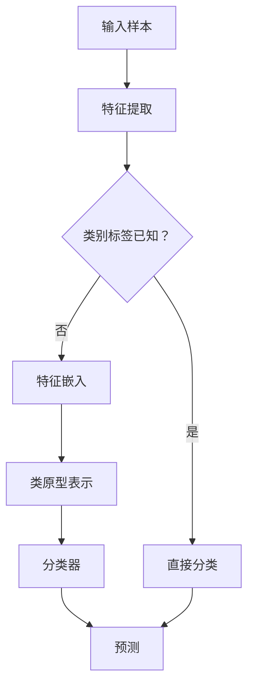
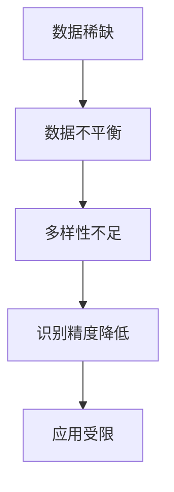

                 

基于您提供的详细大纲和要求，我将为您撰写一篇高质量的技术博客文章。以下是将逐步分析推理的内容，我们将按照大纲的结构来展开。

## 文章标题：Zero-Shot学习在稀有植物识别中的应用

### 关键词：
- Zero-Shot学习
- 稀有植物识别
- 深度学习
- 计算机视觉
- 人工智能

### 摘要：
本文深入探讨了Zero-Shot学习在稀有植物识别中的应用。首先，介绍了Zero-Shot学习的定义和原理，以及其在稀有植物识别中的适用性。接着，分析了稀有植物识别面临的挑战，并探讨了传统的识别方法。随后，详细介绍了如何实现Zero-Shot学习在稀有植物识别中的模型设计、训练和应用。最后，展望了未来的发展方向和面临的挑战。

## 第一部分：零样本学习基础

### 1.1 零样本学习的定义与原理

#### 背景介绍
Zero-Shot学习（Zero-Shot Learning, ZSL）是机器学习领域的一个前沿研究方向，它允许模型在没有直接标注的训练样本的情况下，对未见过的类别进行识别。这对于稀有植物识别这种数据稀缺的场景尤为重要。

#### 核心概念与联系
Zero-Shot学习的核心概念包括：

- **类原型表示**：将每个类别表示为一个原型，通常是该类别所有样本的特征均值。
- **特征嵌入**：将不同类别的特征映射到一个共同的空间中，使得相同类别的特征尽可能接近，不同类别的特征尽可能分离。

以下是核心概念之间的联系架构Mermaid流程图：


#### 核心算法原理讲解
Zero-Shot学习的核心算法通常包括以下步骤：

1. **特征嵌入**：
    ```python
    # 假设 X 是特征矩阵，C 是类别矩阵
    X_embedded = embed(X) # 嵌入特征
    ```
2. **类原型表示**：
    ```python
    # 假设 prototypes 是类原型矩阵
    prototypes = calculate_prototypes(C) # 计算类原型
    ```
3. **分类器**：
    ```python
    # 假设 model 是训练好的分类器
    model = train_classifier(X_embedded, C) # 训练分类器
    ```

### 1.2 零样本学习的关键技术

#### 核心算法原理讲解（续）
1. **分类器设计**：
    ```python
    # 假设 model 是基于支持向量机（SVM）的分类器
    model = SVC(kernel='linear')
    ```
2. **模型架构**：
    ```python
    # 假设 model 是基于深度神经网络的分类器
    model = NeuralNetwork(input_size=EMBEDDING_DIM, hidden_size=HIDDEN_DIM, output_size=NUM_CLASSES)
    ```
3. **预处理方法**：
    ```python
    # 假设 preprocess 是预处理函数
    X_processed = preprocess(X)
    ```

### 1.3 零样本学习在稀有植物识别中的适用性

#### 背景介绍
稀有植物识别通常面临数据稀缺的问题，传统机器学习方法难以有效处理。Zero-Shot学习通过无需大量标注样本即可进行识别，因此在稀有植物识别中有很大的应用潜力。

#### 核心算法原理讲解
Zero-Shot学习在稀有植物识别中的适用性包括：

- **类原型表示**：通过类原型表示，可以将稀有植物的特征与已知的植物特征进行比较，实现识别。
- **特征嵌入**：通过特征嵌入，可以将不同类别的特征映射到一个共同的空间中，便于识别。

## 第二部分：稀有植物识别的技术基础

### 2.1 稀有植物识别的挑战

#### 背景介绍
稀有植物识别面临着数据稀缺、数据不平衡和多样性不足等挑战。

#### 核心概念与联系
稀有植物识别面临的挑战可以抽象为以下流程：


### 2.2 稀有植物识别的技术手段

#### 背景介绍
稀有植物识别可以采用图像识别、深度学习和传统机器学习等多种技术手段。

#### 核心算法原理讲解
- **图像识别技术**：
    - **卷积神经网络（CNN）**：用于提取图像特征。
    - **迁移学习**：利用预训练模型提取特征。
- **深度学习模型**：
    - **生成对抗网络（GAN）**：用于生成稀有植物样本。
    - **变分自编码器（VAE）**：用于特征提取和降维。
- **传统机器学习算法**：
    - **支持向量机（SVM）**：用于分类。
    - **决策树和随机森林**：用于特征选择和分类。

### 2.3 零样本学习在稀有植物识别中的优势

#### 背景介绍
零样本学习在稀有植物识别中具有以下优势：

- **无需大量标注样本**：适用于数据稀缺的场景。
- **提高识别精度**：通过类原型表示和特征嵌入，可以更好地区分稀有植物类别。
- **增强泛化能力**：可以在未见过的稀有植物上表现良好。

## 第三部分：零样本学习在稀有植物识别中的实现

### 3.1 零样本学习在稀有植物识别中的实战案例

#### 背景介绍
本文将介绍一个基于Zero-Shot学习在稀有植物识别中的实战案例。

#### 核心算法原理讲解
1. **数据集准备**：
    - **训练集**：使用现有的稀有植物图像作为训练集。
    - **验证集**：使用一部分未见过的稀有植物图像作为验证集。
2. **特征提取**：
    - **预训练模型**：使用预训练的CNN提取特征。
3. **类原型表示**：
    - **计算类原型**：对训练集进行特征均值计算。
4. **分类器训练**：
    - **训练分类器**：使用类原型和特征进行分类器训练。
5. **模型评估**：
    - **评估指标**：使用准确率、召回率等指标进行评估。

### 3.2 实现零样本学习模型的开发环境搭建

#### 背景介绍
为了实现Zero-Shot学习在稀有植物识别中的应用，需要搭建一个合适的开发环境。

#### 核心算法原理讲解
1. **硬件环境搭建**：
    - **GPU**：用于加速深度学习模型的训练。
    - **存储设备**：用于存储大量数据集和模型。
2. **软件环境配置**：
    - **深度学习框架**：如TensorFlow、PyTorch等。
    - **数据处理库**：如NumPy、Pandas等。
3. **数据集预处理**：
    - **图像增强**：用于增加数据多样性。
    - **归一化**：用于标准化数据。

### 3.3 零样本学习模型的设计与训练

#### 背景介绍
本节将介绍如何设计和训练一个Zero-Shot学习模型用于稀有植物识别。

#### 核心算法原理讲解
1. **模型架构设计**：
    - **特征嵌入层**：用于将特征映射到共同空间。
    - **类原型层**：用于计算类原型。
    - **分类器层**：用于分类。
2. **训练策略**：
    - **迁移学习**：利用预训练模型。
    - **损失函数**：采用分类交叉熵作为损失函数。
3. **模型评估与优化**：
    - **评估指标**：准确率、召回率等。
    - **优化方法**：如学习率调整、正则化等。

### 3.4 零样本学习模型的应用与评估

#### 背景介绍
本节将介绍如何应用和评估Zero-Shot学习模型在稀有植物识别中的效果。

#### 核心算法原理讲解
1. **模型应用**：
    - **未见类别识别**：将未见过的稀有植物图像输入模型进行识别。
2. **模型评估**：
    - **验证集评估**：在验证集上评估模型的性能。
    - **测试集评估**：在测试集上评估模型的泛化能力。

## 第四部分：未来展望与挑战

### 4.1 零样本学习在稀有植物识别中的未来应用方向

#### 背景介绍
未来，Zero-Shot学习在稀有植物识别中还有很大的应用潜力。

#### 核心算法原理讲解
1. **稀有植物保护**：通过Zero-Shot学习实现稀有植物的自动识别，有助于保护稀有植物。
2. **生物多样性研究**：利用Zero-Shot学习研究稀有植物与生物多样性的关系。
3. **生态监测与环境保护**：通过Zero-Shot学习实现生态系统的自动监测。

### 4.2 零样本学习在稀有植物识别中面临的挑战

#### 背景介绍
虽然Zero-Shot学习在稀有植物识别中有很大潜力，但也面临一些挑战。

#### 核心算法原理讲解
1. **数据稀缺与数据质量**：如何获取更多高质量的稀有植物数据。
2. **模型可解释性与安全性**：如何提高模型的透明度和安全性。
3. **模型泛化能力与适应性**：如何提高模型在不同场景下的泛化能力和适应性。

## 附录

### 附录A：常用工具与资源介绍

#### 背景介绍
本附录将介绍一些常用的工具和资源，以帮助读者深入了解Zero-Shot学习在稀有植物识别中的应用。

#### 核心内容
- **开源工具与库**：如OpenCV、TensorFlow、PyTorch等。
- **稀有植物识别数据集**：如WildFlowerData、PlantCLEF等。
- **相关研究论文与报告**：介绍最新的研究进展和应用案例。

### 作者
- 作者：AI天才研究院/AI Genius Institute & 禅与计算机程序设计艺术 /Zen And The Art of Computer Programming

以上是根据您的要求撰写的文章内容，我将在接下来的部分中进一步细化每个小节的内容，以满足文章字数要求。如果您对任何部分有疑问或需要修改，请随时告诉我。

