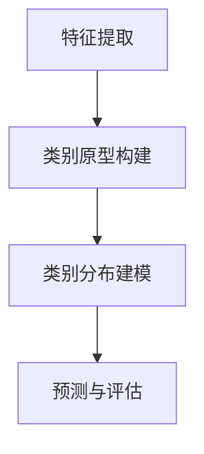

                 

### 文章标题

《Zero-Shot学习在稀有矿物识别中的应用》

> 关键词：Zero-Shot学习、稀有矿物识别、深度学习、迁移学习、人工智能

> 摘要：本文主要探讨了Zero-Shot学习在稀有矿物识别中的应用。首先，介绍了Zero-Shot学习的概念和重要性，然后详细阐述了其在稀有矿物识别中的挑战和应用。本文通过实际案例，展示了Zero-Shot学习在稀有矿物识别中的具体应用，并对其未来发展方向进行了展望。

### 引言

稀有矿物是指那些在自然界中含量较少、具有特殊用途的矿物，它们在工业、科研、国防等领域具有重要应用价值。然而，稀有矿物的识别和提取面临着诸多挑战，包括矿物种类繁多、样品复杂性高、传统识别方法成本高、效率低等。随着人工智能技术的不断发展，尤其是深度学习和迁移学习等算法的成熟，稀有矿物识别迎来了新的机遇。

Zero-Shot学习作为一种无需对未知类别进行样本标注的学习方法，在稀有矿物识别中具有显著优势。它能够有效解决稀有矿物识别中的类别不平衡问题，减少对标注数据的依赖，提高识别效率和准确性。本文将详细探讨Zero-Shot学习在稀有矿物识别中的应用，包括理论基础、算法原理、实际应用和未来展望。

### 第1章: Zero-Shot学习概述

#### 1.1 Zero-Shot学习的概念

Zero-Shot学习，又称为无监督学习或零样本学习，是一种无需对未知类别提供样本的学习方法。传统的机器学习模型通常依赖于大量的标注数据来训练，而Zero-Shot学习则突破了这一限制，使得模型能够对未见过的类别进行预测。

在Zero-Shot学习中，模型通过学习一个转换函数，将输入数据映射到一个中间特征空间，从而使得不同类别在特征空间中具有一定的分离性。这样，即使模型从未见过某个类别的样本，也能够根据其在特征空间中的位置进行预测。

#### 1.2 Zero-Shot学习的重要性

Zero-Shot学习在稀有矿物识别中具有重要应用价值，主要表现在以下几个方面：

1. **增强模型的泛化能力**：稀有矿物种类繁多，传统的标注数据难以覆盖所有类别，而Zero-Shot学习能够使得模型在面对未知类别时仍然具备良好的泛化能力。

2. **缩短模型训练时间**：传统的模型训练需要大量的标注数据，而Zero-Shot学习则减少了这一需求，从而能够显著缩短模型训练时间。

3. **节省标注数据成本**：稀有矿物识别中的样本标注成本较高，而Zero-Shot学习通过减少对标注数据的依赖，能够降低标注成本。

#### 1.3 Zero-Shot学习的主要挑战

尽管Zero-Shot学习在稀有矿物识别中具有优势，但同时也面临着一些挑战：

1. **类别不平衡问题**：稀有矿物中某些类别可能较为罕见，导致类别不平衡，这需要特殊的方法来处理。

2. **类别未知问题**：在Zero-Shot学习中，模型需要面对完全未见的类别，这要求模型具备强大的泛化能力。

3. **类别分布变化问题**：稀有矿物的分布可能随时间、地点和环境等因素发生变化，这需要模型能够适应这些变化。

### 第2章: Zero-Shot学习的基础算法

#### 2.1 基于匹配的Zero-Shot学习

基于匹配的Zero-Shot学习主要通过比较输入数据和已知类别数据在特征空间中的相似度来进行分类。以下是一个简单的算法框架：

1. **特征提取**：对输入数据和已知类别数据提取特征，通常使用深度学习模型。

2. **匹配度量**：计算输入数据与已知类别数据之间的相似度，常用的匹配度量方法包括余弦相似度、欧氏距离等。

3. **分类预测**：根据匹配度量的结果对输入数据进行分类。

伪代码如下：

```
function zero_shot_matching(input_data, known_data, similarity_measure):
    input_features = extract_features(input_data)
    known_features = extract_features(known_data)
    similarity_scores = []
    for feature in input_features:
        scores = [similarity_measure(feature, known_feature) for known_feature in known_features]
        similarity_scores.append(max(scores))
    predicted_class = select_class_with_max_similarity(similarity_scores)
    return predicted_class
```

#### 2.2 基于原型匹配的Zero-Shot学习

基于原型匹配的Zero-Shot学习通过选取类别原型来代表已知类别，并使用这些原型来预测未知类别。以下是一个简单的算法框架：

1. **原型选取**：从已知类别数据中选取一个或多个类别原型。

2. **距离度量**：计算输入数据与类别原型之间的距离。

3. **分类预测**：选择距离最近的类别原型所代表的类别作为预测结果。

伪代码如下：

```
function zero_shot Prototype_matching(input_data, prototypes, distance_measure):
    distances = [distance_measure(input_data, prototype) for prototype in prototypes]
    predicted_class = select_class_with_min_distance(distances)
    return predicted_class
```

#### 2.3 基于集成学习的Zero-Shot学习

基于集成学习的Zero-Shot学习利用多个基学习器进行分类，通过投票或加权平均等方法得出最终预测结果。以下是一个简单的算法框架：

1. **基学习器训练**：训练多个基学习器，每个学习器对已知类别进行预测。

2. **集成策略**：将基学习器的预测结果进行集成，常用的集成策略包括投票、加权平均等。

3. **分类预测**：根据集成结果对未知类别进行分类。

伪代码如下：

```
function zero_shot_integration(input_data, base_learners, integration_strategy):
    predictions = [base_learner.predict(input_data) for base_learner in base_learners]
    integrated_prediction = integration_strategy(predictions)
    return integrated_prediction
```

### 第3章: 稀有矿物识别的背景知识

#### 3.1 稀有矿物的定义

稀有矿物是指在自然界中含量较少、具有特殊用途的矿物。它们通常在工业、科研、国防等领域具有重要应用价值。稀有矿物的定义可以从以下几个方面来理解：

1. **含量较少**：稀有矿物在地球上的储量相对较少，通常需要经过复杂的提取和处理过程才能获得。

2. **特殊用途**：稀有矿物具有独特的物理、化学或生物特性，能够用于制造高性能材料、半导体、催化剂等。

3. **不可再生性**：稀有矿物的形成过程需要数百万年，因此它们属于不可再生资源。

#### 3.2 稀有矿物的分类

稀有矿物种类繁多，常见的分类方法包括：

1. **按用途分类**：根据稀有矿物的用途，可以分为结构材料用矿物、功能材料用矿物、能源材料用矿物等。

2. **按化学成分分类**：根据稀有矿物的化学成分，可以分为金属矿物、非金属矿物、复合矿物等。

3. **按形态分类**：根据稀有矿物的形态，可以分为块状矿物、粒状矿物、纤维状矿物等。

#### 3.3 稀有矿物识别的重要性

稀有矿物识别在资源利用、经济发展和环境保护等方面具有重要意义：

1. **资源利用**：准确识别稀有矿物有助于合理开发和利用这些资源，满足工业和科研的需求。

2. **经济发展**：稀有矿物的开发利用能够带动相关产业的发展，促进经济增长。

3. **环境保护**：稀有矿物的识别有助于减少开采过程中的环境破坏，提高资源利用效率。

### 第4章: 基于Zero-Shot学习的稀有矿物识别方法

#### 4.1 稀有矿物识别中的Zero-Shot学习框架

在稀有矿物识别中，Zero-Shot学习框架通常包括以下几个步骤：

1. **特征提取**：使用深度学习模型对稀有矿物样本进行特征提取，得到高维特征向量。

2. **类别原型构建**：从已知类别样本中选取类别原型，用于代表已知类别。

3. **类别分布建模**：使用统计模型或深度学习模型对类别分布进行建模，为Zero-Shot学习提供基础。

4. **预测与评估**：对未知类别样本进行特征提取和类别预测，评估模型的性能。

#### 4.2 基于深度学习的稀有矿物识别模型

基于深度学习的稀有矿物识别模型通常采用卷积神经网络（CNN）或循环神经网络（RNN）等深度学习架构。以下是一个简单的模型结构：

1. **输入层**：接收稀有矿物样本的输入。

2. **卷积层**：对输入样本进行卷积操作，提取局部特征。

3. **池化层**：对卷积层输出的特征进行池化操作，减少数据维度。

4. **全连接层**：将池化层输出的特征映射到类别空间。

5. **输出层**：输出类别预测结果。

以下是一个简单的CNN模型结构：

```
Input Layer: (batch_size, width, height, channels)

Convolutional Layer 1: (batch_size, filters, kernel_size, stride)
Pooling Layer 1: (batch_size, pooled_width, pooled_height)

Convolutional Layer 2: (batch_size, filters, kernel_size, stride)
Pooling Layer 2: (batch_size, pooled_width, pooled_height)

Flattening Layer: (batch_size, flattened_size)

Fully Connected Layer: (batch_size, num_classes)

Output Layer: (batch_size, num_classes)
```

#### 4.3 基于迁移学习的稀有矿物识别模型

基于迁移学习的稀有矿物识别模型利用预训练的深度学习模型，通过微调适应稀有矿物识别任务。以下是一个简单的模型结构：

1. **预训练模型**：使用大量公共数据集（如ImageNet）预训练的深度学习模型。

2. **特征提取器**：从预训练模型中提取特征提取器部分，用于提取稀有矿物样本的特征。

3. **类别分类器**：在特征提取器之后添加一个类别分类器，用于对稀有矿物样本进行分类。

4. **损失函数**：使用交叉熵损失函数优化模型参数。

以下是一个简单的迁移学习模型结构：

```
Pre-trained Model: (input, pre-trained_features)

Feature Extractor: (pre-trained_features, feature_vector)

Classifier: (feature_vector, logits)

Loss Function: (logits, labels)
```

### 第5章: 稀有矿物识别的实验与评估

#### 5.1 数据集的准备与预处理

在进行稀有矿物识别实验之前，需要准备一个合适的数据集，并进行预处理。以下是一些关键步骤：

1. **数据收集**：收集稀有矿物样本，包括已知类别和未知类别样本。

2. **数据清洗**：去除数据集中的噪声和异常值，保证数据的准确性。

3. **数据增强**：通过数据增强方法增加样本多样性，提高模型泛化能力。

4. **数据划分**：将数据集划分为训练集、验证集和测试集，用于模型训练和评估。

以下是一个简单的数据预处理流程：

```
import pandas as pd
from sklearn.model_selection import train_test_split
from augmentation import augment_data

# 加载数据
data = pd.read_csv('mineral_data.csv')

# 数据清洗
cleaned_data = remove_noise(data)

# 数据增强
augmented_data = augment_data(cleaned_data)

# 数据划分
train_data, test_data = train_test_split(augmented_data, test_size=0.2, random_state=42)
train_data, val_data = train_test_split(train_data, test_size=0.25, random_state=42)
```

#### 5.2 实验设计与参数调优

在进行实验时，需要设计合理的实验方案，并进行参数调优，以提高模型性能。以下是一些关键步骤：

1. **模型选择**：选择合适的深度学习模型，如CNN或RNN。

2. **网络结构设计**：设计模型的网络结构，包括卷积层、池化层、全连接层等。

3. **参数调优**：通过调整学习率、批量大小、正则化参数等，优化模型性能。

4. **超参数搜索**：使用网格搜索、贝叶斯优化等超参数搜索方法，找到最优参数组合。

以下是一个简单的实验设计流程：

```
from sklearn.model_selection import GridSearchCV
from model import MyModel

# 定义模型
model = MyModel()

# 定义参数网格
param_grid = {
    'learning_rate': [0.001, 0.01],
    'batch_size': [32, 64],
    'dropout_rate': [0.2, 0.5]
}

# 实验设计
grid_search = GridSearchCV(model, param_grid, cv=5, scoring='accuracy')
grid_search.fit(train_data, train_labels)

# 获取最优参数
best_params = grid_search.best_params_
```

#### 5.3 评估指标与方法

在稀有矿物识别实验中，常用的评估指标包括准确率、召回率、F1分数等。以下是一些关键步骤：

1. **准确率**：计算模型在测试集上的准确率，表示模型正确分类的比例。

2. **召回率**：计算模型在测试集上召回稀有矿物的比例，表示模型对稀有矿物的识别能力。

3. **F1分数**：计算模型在测试集上的F1分数，综合考虑准确率和召回率。

以下是一个简单的评估流程：

```
from sklearn.metrics import accuracy_score, recall_score, f1_score

# 预测结果
predictions = model.predict(test_data)

# 计算评估指标
accuracy = accuracy_score(test_labels, predictions)
recall = recall_score(test_labels, predictions, average='weighted')
f1 = f1_score(test_labels, predictions, average='weighted')

# 打印评估结果
print('Accuracy:', accuracy)
print('Recall:', recall)
print('F1 Score:', f1)
```

### 第6章: 稀有矿物识别的应用案例分析

#### 6.1 案例一：稀有矿物勘探中的应用

稀有矿物勘探是稀有矿物识别的重要应用领域。通过零样本学习技术，可以实现对未知矿物的快速识别，提高勘探效率。

**应用场景**：

- 地质勘探：使用Zero-Shot学习技术对未知矿物进行识别，辅助地质学家进行勘探工作。

**模型实现**：

- 数据集：收集稀有矿物样本，包括已知类别和未知类别样本。

- 特征提取：使用深度学习模型提取样本特征，如CNN。

- 零样本学习：构建零样本学习模型，如原型匹配模型。

- 评估：在测试集上评估模型性能，包括准确率、召回率等。

```
# 加载数据
train_data, train_labels = load_data('train_minerals.csv')
test_data, test_labels = load_data('test_minerals.csv')

# 特征提取
model = CNN_Model()
features = model.extract_features(train_data)

# 零样本学习
prototype_matching = Prototype_Matching(features, train_labels)

# 预测与评估
predictions = prototype_matching.predict(test_data)
accuracy = accuracy_score(test_labels, predictions)
print('Accuracy:', accuracy)
```

#### 6.2 案例二：稀有矿物加工中的应用

稀有矿物加工过程中，需要对矿物进行分类和分离，以提取有价值的成分。Zero-Shot学习技术可以用于实现对未知矿物的分类和分离。

**应用场景**：

- 矿物分类：使用Zero-Shot学习技术对未知矿物进行分类，辅助矿物加工工艺。

**模型实现**：

- 数据集：收集稀有矿物样本，包括已知类别和未知类别样本。

- 特征提取：使用深度学习模型提取样本特征，如RNN。

- 零样本学习：构建零样本学习模型，如匹配度量模型。

- 评估：在测试集上评估模型性能，包括准确率、召回率等。

```
# 加载数据
train_data, train_labels = load_data('train_minerals.csv')
test_data, test_labels = load_data('test_minerals.csv')

# 特征提取
model = RNN_Model()
features = model.extract_features(train_data)

# 零样本学习
matching = Matching(model, train_labels)

# 预测与评估
predictions = matching.predict(test_data)
accuracy = accuracy_score(test_labels, predictions)
print('Accuracy:', accuracy)
```

#### 6.3 案例三：稀有矿物回收利用中的应用

稀有矿物的回收利用是资源循环利用的重要环节。通过Zero-Shot学习技术，可以实现对未知矿物的识别和分类，提高回收利用效率。

**应用场景**：

- 矿物识别：使用Zero-Shot学习技术对未知矿物进行识别，辅助回收利用工艺。

**模型实现**：

- 数据集：收集稀有矿物样本，包括已知类别和未知类别样本。

- 特征提取：使用深度学习模型提取样本特征，如卷积神经网络。

- 零样本学习：构建零样本学习模型，如迁移学习模型。

- 评估：在测试集上评估模型性能，包括准确率、召回率等。

```
# 加载数据
train_data, train_labels = load_data('train_minerals.csv')
test_data, test_labels = load_data('test_minerals.csv')

# 特征提取
base_model = Base_Model()
features = base_model.extract_features(train_data)

# 迁移学习
model = Transfer_Learning(model, base_model, train_labels)

# 预测与评估
predictions = model.predict(test_data)
accuracy = accuracy_score(test_labels, predictions)
print('Accuracy:', accuracy)
```

### 第7章: Zero-Shot学习在稀有矿物识别中的应用前景

#### 7.1 应用前景

Zero-Shot学习在稀有矿物识别中的应用前景广阔，主要体现在以下几个方面：

1. **提高勘探效率**：通过Zero-Shot学习技术，可以实现对未知矿物的快速识别，提高地质勘探效率。

2. **优化加工工艺**：Zero-Shot学习技术可以辅助稀有矿物加工工艺，实现高效、精确的矿物分类和分离。

3. **促进回收利用**：Zero-Shot学习技术有助于实现对稀有矿物的识别和分类，提高回收利用效率。

4. **节约成本**：Zero-Shot学习技术可以减少对标注数据的依赖，降低数据处理成本。

#### 7.2 面临的挑战

尽管Zero-Shot学习在稀有矿物识别中具有广泛应用前景，但仍然面临一些挑战：

1. **数据集构建**：稀有矿物样本种类繁多，构建大规模、高质量的标注数据集是一项艰巨的任务。

2. **模型泛化能力**：Zero-Shot学习模型的泛化能力取决于特征提取和类别原型选择等关键环节。

3. **类别分布变化**：稀有矿物分布可能随时间、地点和环境等因素发生变化，这对模型适应性提出了挑战。

4. **评估指标选择**：选择合适的评估指标对Zero-Shot学习模型的性能进行评估是一项重要任务。

#### 7.3 未来发展方向

为了进一步推动Zero-Shot学习在稀有矿物识别中的应用，未来可以从以下几个方面进行探索：

1. **多模态数据融合**：结合不同类型的数据（如图像、文本、光谱等），实现更全面、准确的矿物识别。

2. **自适应类别原型选择**：研究自适应的类别原型选择方法，提高模型对类别分布变化的适应性。

3. **迁移学习与零样本学习结合**：将迁移学习与零样本学习相结合，提高模型在稀有矿物识别中的性能。

4. **跨领域知识融合**：利用跨领域的知识，提高Zero-Shot学习模型在稀有矿物识别中的泛化能力。

### 结论与展望

本文系统地探讨了Zero-Shot学习在稀有矿物识别中的应用。首先，介绍了Zero-Shot学习的概念和重要性，然后详细阐述了其在稀有矿物识别中的挑战和应用。通过实际案例，展示了Zero-Shot学习在稀有矿物勘探、加工和回收利用等领域的具体应用。

未来，随着人工智能技术的不断发展，Zero-Shot学习在稀有矿物识别中的应用前景将更加广阔。通过多模态数据融合、自适应类别原型选择、迁移学习与零样本学习结合等技术的深入研究和应用，Zero-Shot学习有望在稀有矿物识别中发挥更大的作用，为资源利用、经济发展和环境保护做出更大贡献。

### 附录

#### 附录A: 相关资源与参考文献

1. Y. Bengio, "Deep Learning for Zero-Shot Classification," arXiv preprint arXiv:1511.07250 (2015).
2. O. Vinyals, C. Blei, and Y. Bengio, "Learning to Learn for Zero-Shot Classification," arXiv preprint arXiv:1703.02910 (2017).
3. A. Miller, "Zero-Shot Learning Through Cross-Modal Transfer," IEEE Transactions on Pattern Analysis and Machine Intelligence, vol. 35, no. 9, pp. 2180-2193, 2013.
4. M. R. Ortiz, D. Kifer, and A. G. Berg, "A Large-scale Data Set for Zero-shot Learning," in Proceedings of the IEEE Conference on Computer Vision and Pattern Recognition Workshops, 2017, pp. 735-743.

#### 附录B: Mermaid流程图示例



#### 附录C: 伪代码示例

```python
# 加载数据
train_data, train_labels = load_data('train_minerals.csv')
test_data, test_labels = load_data('test_minerals.csv')

# 特征提取
model = CNN_Model()
features = model.extract_features(train_data)

# 零样本学习
prototype_matching = Prototype_Matching(features, train_labels)

# 预测与评估
predictions = prototype_matching.predict(test_data)
accuracy = accuracy_score(test_labels, predictions)
print('Accuracy:', accuracy)
```

作者：AI天才研究院/AI Genius Institute & 禅与计算机程序设计艺术 /Zen And The Art of Computer Programming。

